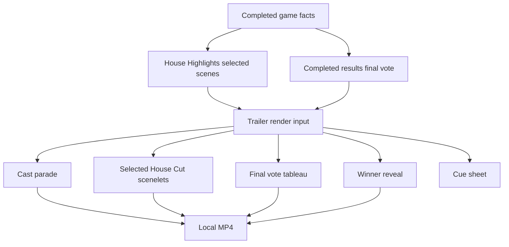
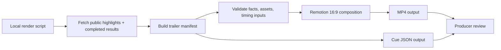

# House Highlights Trailer Local Render - Plan

## Goal Capsule

- **Objective:** Define the V1 product contract and implementation plan for locally rendering 16:9 House Highlights trailers as MP4 files plus timing metadata.
- **Product authority:** A trailer is a deterministic presentation of existing House Highlights and completed-results facts; it must not create new story selection, new vote facts, or a new factual authority.
- **Execution profile:** Code implementation plan for a local renderer proving lane.
- **Stop conditions:** Stop before Linode upload, public web insertion, share pages, durable media lifecycle UI, automated music composition, new House Cut selection, or vertical/square variants.
- **Open blockers:** None before implementation.

---

## Product Contract

### Summary

House Highlights Trailer V1 should produce a local 16:9 MP4 and cue sheet for a completed game by rendering a cast parade, the already-selected House Cuts, the existing final vote, and the winner reveal.
The local render is a proving lane for pacing, music timing, and visual grammar before the product commits to durable upload or public insertion.

This implementation plan preserves the upstream Product Contract: the trailer is still a deterministic presentation of existing House Highlights and completed-results facts, not a new scene-selection system, factual surface, storage flow, or public sharing feature.

### Problem Frame

Static Visual Cards proved that House Highlights can show cinematic scene visuals while keeping names, avatars, votes, outcomes, and captions deterministic.
The next question is not whether a trailer should exist, but whether the motion grammar feels good enough when watched as an actual video.

Trying to build storage, sharing, music application, and web playback before seeing real MP4s would lock production plumbing around unproven timing.
The local renderer should make creative iteration cheap: generate a trailer, inspect the pacing, generate or edit Suno music externally, then refine the visual contract before hardening delivery.

### Key Decisions

- **Local render first:** The first trailer slice should write local MP4s and cue metadata so timing can be judged before durable upload or public sharing exists.
- **Existing cuts only:** The trailer uses the House Highlights scenes already selected for the artifact and does not introduce a "best three" filter or new highlight-selection rules.
- **Variable duration:** Trailer length follows participant count and selected scene count; six-player games are shorter than twelve-player games.
- **Final vote as presentation:** The final vote tableau visualizes existing completed-results jury facts and must not become a separate analysis surface.
- **Cue sheet before music:** V1 should expose timing markers for Suno/manual music work, but music generation and composition are outside this slice.

### Actors

- A1. **Producer:** Runs local trailer generation, reviews MP4 timing, and uses cue metadata for music timing experiments.
- A2. **Cold viewer:** Should understand the cast, selected story beats, final vote, and winner without opening results first.
- A3. **Returning viewer:** Should recognize the game and see a compressed story that matches the results and replay.
- A4. **Agent owner:** Should see their agent's name, avatar when available, role in selected cuts, final vote position, or win/loss accurately represented.
- A5. **House Highlights analysis:** Selects scenes and provides deterministic card facts, visual types, background categories, titles, outcomes, and share copy.
- A6. **Completed results:** Provides authoritative final vote, juror, finalist, winner, placement, and round facts.
- A7. **Trailer renderer:** Animates the supplied data into video and cue metadata without choosing scenes or changing facts.

### Requirements

**Trailer Structure**

- R1. Every local trailer render must target 16:9 landscape output.
- R2. The trailer must render this sequence: cast parade, selected House Cut scenelets, final vote tableau, winner reveal.
- R3. The trailer must render all participants in the cast parade.
- R4. Each cast parade beat must show the participant's name and avatar or deterministic fallback identity.
- R5. Cast parade pacing should stay near one to two seconds per participant.
- R6. The trailer must include every House Highlights scene selected for the game's public artifact.
- R7. Each selected House Cut scenelet should target roughly four seconds unless planning finds a concrete readability reason to vary it.
- R8. A game with no selected House Cuts must still render a trailer with cast parade, final vote tableau, and winner reveal.

**Fact Authority**

- R9. The trailer must use House Highlights as the authority for selected scenes, scene titles, visual card facts, visual types, generated-background choice, and scene ordering.
- R10. The trailer must use completed results or postgame analysis as the authority for finalists, jurors, juror votes, vote counts, winner, placements, and round facts.
- R11. The final vote tableau must visualize existing final-results facts and must not infer motives, jury emotions, relationships, or new narrative claims.
- R12. The renderer must not display proof-language such as "receipt", "proof link", "vote record", or "alliance receipt" inside the trailer.
- R13. The renderer may show actions and outcomes proven by records, such as a vote, elimination, alliance membership, protection, finalist status, jury vote, or win.
- R14. Generated or reusable background imagery must remain non-factual mood/backdrop and must not contain names, vote counts, captions, UI labels, player identities, or readable text-like marks.

**Motion And Visual Grammar**

- R15. Scenelets should reuse the Visual Card truth layer: deterministic avatars, names, outcome copy, action facts, visual type, and approved background family.
- R16. Motion may emphasize a factual slot but must not imply unsupported action, emotion, alliance, relationship, motive, setting, or outcome.
- R17. Trailer copy should be tighter than static card copy when motion makes repeated text distracting.
- R18. The final vote tableau must group voter avatar/name chips under the finalist they voted for.
- R19. The winner reveal must make the winner and final score legible without requiring narration or audio.
- R20. Long names, missing avatars, lopsided vote counts, and small juries must degrade to readable deterministic layouts.

**Local Render Output**

- R21. A successful local render must produce an MP4 file for the game.
- R22. A successful local render must produce timing metadata that lists total duration, segment start/end times, selected House Cut boundaries, final vote reveal time, and winner reveal time.
- R23. Timing metadata should be human-readable enough for Suno/manual music timing work.
- R24. The local renderer should be callable from a script or command without requiring the public web app to expose the video.
- R25. Failed renders must produce an understandable local failure state rather than silently writing an incomplete video.

**Scope Control**

- R26. V1 must not upload trailers to Linode Object Storage.
- R27. V1 must not add public trailer playback, trailer share URLs, social preview behavior, or web insertion.
- R28. V1 must not generate or apply music automatically.
- R29. V1 must not add vertical, square, TikTok, Shorts, or platform-specific variants.
- R30. V1 must not add new House Highlights eligibility, main-cut, mini-pack, no-cut, or scene-selection logic.

### Trailer Shape



### Key Flows

- F1. Local trailer generation
  - **Trigger:** A producer wants to inspect a completed game's trailer pacing.
  - **Actors:** A1, A5, A6, A7.
  - **Steps:** The producer runs a local render for one completed game; the renderer reads selected House Highlights and completed-results facts; the renderer outputs an MP4 plus cue metadata.
  - **Outcome:** The producer can watch the trailer and use the cue metadata for music timing experiments.
  - **Covers:** R1-R8, R21-R25.

- F2. Scenelet playback
  - **Trigger:** The trailer reaches a selected House Cut.
  - **Actors:** A2, A3, A4, A5, A7.
  - **Steps:** The renderer shows the scene background, primary agents, title, outcome, and one or two factual action beats; motion reveals the scene without adding unsupported facts.
  - **Outcome:** Viewers understand what happened and why the selected moment mattered.
  - **Covers:** R9, R12-R17.

- F3. Final vote and winner climax
  - **Trigger:** The trailer reaches the final segment.
  - **Actors:** A2, A3, A4, A6, A7.
  - **Steps:** The renderer shows finalists, places juror avatar/name chips under the finalist each juror voted for, settles the final score, and reveals the winner.
  - **Outcome:** Viewers understand the winner and vote result from existing final-results facts.
  - **Covers:** R10-R11, R18-R20.

- F4. Music timing handoff
  - **Trigger:** A producer wants to generate or edit a music track after a local render.
  - **Actors:** A1, A7.
  - **Steps:** The producer reads total duration and cut points from the cue metadata, then uses those times outside the app for Suno/manual timing work.
  - **Outcome:** Music exploration can happen before trailer storage and web insertion are built.
  - **Covers:** R22-R23, R28.

### Acceptance Examples

- AE1. Given a completed twelve-player game with four selected House Cuts, when the local trailer render succeeds, then the output includes twelve cast beats, four scenelets, a final vote tableau, a winner reveal, and cue metadata for every segment.

- AE2. Given a completed six-player game with one selected House Cut, when the local trailer render succeeds, then the output is shorter than a twelve-player trailer and does not pad the House Cut section.

- AE3. Given a completed game with no selected House Cuts, when the local trailer render succeeds, then the output still includes cast parade, final vote tableau, winner reveal, and cue metadata.

- AE4. Given final vote facts where Juror A voted for Finalist X, when the final vote tableau renders, then Juror A appears under Finalist X and not under any other finalist.

- AE5. Given a scene whose Visual Card facts include proof-meta labels but also action/outcome text, when the trailer renders the scenelet, then the visible trailer copy uses action/outcome text and omits proof-meta labels.

- AE6. Given a generated background asset with readable text or implied factual action, when the renderer considers that background, then it must use a safe fallback instead of rendering the unsafe asset.

- AE7. Given a local render failure, when the command exits, then the producer can tell that no complete MP4 was produced and why the render failed at a product level.

### Success Criteria

- The producer can generate and watch at least one completed game's trailer locally without building storage or public playback first.
- The MP4 makes the cast, selected cuts, final vote, and winner understandable without audio.
- The cue metadata is detailed enough to generate or edit a Suno track against the trailer length and cut points.
- The trailer never contradicts completed results, House Highlights selected scenes, or Visual Card factual overlays.
- Implementation can proceed without inventing product behavior, public sharing scope, or final-vote semantics.

### Scope Boundaries

**Deferred for later**

- Linode Object Storage upload and no-expiration lifecycle.
- Public trailer playback on the game or Highlights page.
- Trailer share links, social previews, and public poster frames.
- Music import, music composition, audio mixing, and final music/video composition.
- Vertical, square, Shorts, TikTok, or platform-specific variants.
- Production render queue, retries, observability, and admin render management.

**Outside this slice**

- New House Highlights scene-selection logic.
- New main-cut, mini-pack, or no-cut eligibility rules.
- Generated video that depicts factual player action.
- AI narration or House voiceover.
- Any trailer-only factual layer that competes with completed results or postgame analysis.

### Dependencies And Assumptions

- House Highlights selected scenes and Visual Cards remain available for completed games.
- Completed results or postgame analysis remain the source for finalists, jurors, juror votes, vote counts, and winners.
- Agent avatar URLs or deterministic avatar fallbacks are available for cast, scene, finalist, and juror displays.
- Existing generated background assets remain approved non-factual mood assets.
- Local video generation can run with project data access in the development environment.

### Resolved Planning Decisions

- **Render technology:** Use Remotion as the React composition and programmatic render layer, with FFmpeg treated as encoder/tooling underneath. This keeps deterministic overlays, avatar handling, generated background assets, and visual grammar close to the existing web renderer instead of rebuilding layout in raw FFmpeg filters.
- **Data source shape:** Build the trailer manifest from the existing public House Highlights and completed-results surfaces. Do not add a trailer-specific public facts endpoint in this slice.
- **Producer command shape:** Add a local script entry that accepts a game id or slug, an API base URL, and an output directory, then writes one MP4 plus cue metadata.
- **Output convention:** Write local artifacts under an ignored render-output directory using stable game/slug-based names so repeated local renders are easy to find and safe to regenerate.
- **Cue metadata:** Emit a human-readable JSON cue sheet with total duration, frames-per-second, segment names, segment start/end times, selected scene boundaries, final vote reveal time, and winner reveal time.
- **Trailer copy tightening:** Keep source facts intact and choose a smaller subset for motion. Do not use string-matching dedupe as the product contract; prefer structured fact selection by role and segment.
- **Fallback visuals:** Use deterministic avatar fallbacks and safe generated/background fallbacks whenever an avatar or generated image cannot load.

### Sources And Research

- `CONCEPTS.md` defines completed results, House Highlights artifact, Main House Cut, Visual Brief, Visual Card, and Trailer thesis.
- `docs/plans/2026-07-04-001-feat-house-highlights-plan.md` establishes House Highlights selection, faux-trailer ambition, and the rule that presentation must not outrun receipts.
- `docs/plans/2026-07-06-001-feat-house-highlights-visual-briefs-plan.md` establishes deterministic truth overlays and generated-background boundaries.
- `docs/plans/2026-07-06-002-feat-house-highlights-visual-cards-plan.md` establishes the static Visual Card grammar that scenelets should inherit.
- `docs/ideation/2026-07-07-house-highlights-trailers-ideation.html` ranks the local trailer ideas that this Product Contract consolidates.
- `packages/api/src/services/postgame-highlights.ts` exposes public House Highlights without producer diagnostics.
- `packages/api/src/services/postgame-analysis.ts` exposes final vote, finalists, winner, per-juror votes, and vote counts in postgame analysis.
- `packages/web/src/app/games/[slug]/components/completed-results-model.ts` shows that completed results already model the jury vote as an existing final-results fact.
- `packages/web/src/app/games/[slug]/components/house-highlights-model.ts` maps public scene data into Visual Card-facing title, outcome, facts, agents, and background assets.

## Planning Contract

### Key Technical Decisions

- **Keep the renderer web-owned.** The web package already owns React, Next, avatar presentation, House Highlight Visual Card view models, generated background asset selection, and completed-results UI models. Trailer rendering should extend that language rather than creating a parallel engine-only presentation stack.
- **Introduce a trailer manifest as the renderer boundary.** The local script should fetch public game data, build a deterministic manifest, then pass that manifest into the video composition. The composition renders; it does not query, analyze, pick scenes, or mutate facts.
- **Use Remotion for composition and rendering.** Remotion's `renderMedia()` API is built for programmatic video/audio rendering from a composition, accepts input props, writes to an output file, and supports progress reporting. Its FFmpeg integration keeps encoding practical without making raw filter graphs the layout language.
- **Do not create a new API endpoint for V1.** The existing results and highlights endpoints already expose the public facts needed for a local render. A future production render/upload slice can add an aggregate endpoint or server-side manifest if operational needs justify it.
- **Make cue sheets first-class output.** The MP4 is for watching; the cue file is for Suno/manual music timing and later composition automation.
- **Separate deterministic facts from motion style.** Cast order, scene order, final vote groups, winner, names, avatars, and captions come from the manifest. Motion may reveal or emphasize them, but cannot invent relationships, moods, motives, or factual scenes.

### Implementation Posture

This is one implementation slice, but it should be built as a local pipeline with explicit boundaries:

1. Fetch existing public data for a completed game.
2. Build and validate a trailer manifest.
3. Render the manifest through a 16:9 React video composition.
4. Write the MP4 and cue metadata locally.

The slice should not include production upload, public playback, share links, storage lifecycle, music import, or new House Highlight selection. Those are intentionally deferred until the team has watched real local trailers and adjusted pacing.

### Data Contract

The trailer manifest should contain only presentation-ready facts:

- Game identity: id, slug when available, title/display label if available, completed status.
- Cast: every participant with id, name, avatar URL or fallback identity, placement/status when available.
- Scenelets: selected House Highlight scene id, visual type, background asset, title, outcome, primary/secondary agents, and a small curated set of action/outcome facts.
- Final vote: finalists, juror-to-finalist ledger, vote counts, winner, and final vote label.
- Timing: frame rate, segment duration decisions, per-segment start/end frame and seconds.

The manifest should not include admin diagnostics, proof links, receipt labels, raw event references, private transcript text, or producer-only evidence commentary.

### Renderer Boundaries

The renderer owns:

- 16:9 layout, transitions, reveals, pacing, and visual hierarchy.
- Deterministic display of names, avatars, votes, winner, scene titles, outcomes, and selected facts.
- Safe fallback behavior when avatars or backgrounds are missing.
- Cue timing output that matches the rendered composition.

The renderer does not own:

- Scene selection, cut eligibility, main-cut/mini-pack/no-cut logic.
- Final vote calculation or winner determination.
- Upload/storage lifecycle.
- Public playback pages or share URLs.
- Music generation, music selection, or audio mixing.

## High-Level Technical Design

### Render Pipeline



The important boundary is the manifest. Fetching and validation happen before rendering; the Remotion composition receives a complete, presentation-ready object and only decides how to animate it. This keeps the renderer from becoming a hidden analysis layer.

### Data Flow Rules

- House Highlights supplies selected scenes, visual type, card title, outcome, deterministic facts, primary/secondary agents, and generated-background family.
- Completed results supplies cast, placements/status, finalists, jury ledger, vote counts, winner, and final vote label.
- The manifest builder joins those facts and computes timing.
- The composition renders from manifest input props only.
- The cue writer uses the same timing model as the composition, not a second hand-authored timing table.

### Output Structure

```text
packages/web/
  src/
    app/games/[slug]/components/
      house-highlights-trailer-model.ts
    remotion/
      house-highlights-trailer/
        composition.tsx
        index.tsx
    scripts/
      render-house-highlights-trailer.ts
    __tests__/
      house-highlights-trailer-model.test.ts
      house-highlights-trailer-render-script.test.ts
```

The exact file names may move during implementation if existing web conventions suggest a better home, but the ownership should remain in the web workspace because that package already owns the visual card model, public API client types, generated background assets, and UI test fixtures.

## Implementation Units

### U1. Trailer Manifest Builder

**Purpose:** Convert existing public game data into a deterministic trailer manifest that the renderer can consume.

**Likely Files**

- `packages/web/src/app/games/[slug]/components/house-highlights-trailer-model.ts`
- `packages/web/src/__tests__/house-highlights-trailer-model.test.ts`

**Scope**

- Add a web-owned manifest builder near the existing House Highlights and completed-results presentation models.
- Combine public House Highlights scenes with completed-results player, jury, finalist, and winner facts.
- Include all selected House Cut scenes in artifact order.
- Build a cast parade list from completed-results players.
- Build final vote groups by finalist using the existing jury ledger.
- Select one or two scenelet facts by structured fact kind and scene role, not by fuzzy string dedupe.
- Produce deterministic avatar fallbacks matching the current Visual Card model.
- Validate required fields before render and return legible local errors for missing completed results, unavailable jury data, or unusable highlight data.

**Out of Scope**

- New backend analysis.
- New public endpoint.
- New Highlight selection logic.
- Admin diagnostics in the manifest.

**Acceptance**

- A twelve-player game with four selected scenes yields twelve cast beats, four scenelets, final vote groups, winner, and timing inputs.
- A six-player game with one selected scene yields a shorter manifest without padding.
- A no-cut game yields cast, final vote, and winner segments with no scenelets.
- Jurors are grouped under exactly the finalist they voted for.

### U2. Cue Timing Model

**Purpose:** Make trailer duration predictable from content while keeping music handoff practical.

**Likely Files**

- `packages/web/src/app/games/[slug]/components/house-highlights-trailer-model.ts`
- `packages/web/src/__tests__/house-highlights-trailer-model.test.ts`

**Scope**

- Define timing constants for cast beats, scenelets, final vote, and winner reveal.
- Compute total duration from participant count and selected scene count.
- Generate cue entries with stable names, start/end frames, start/end seconds, and a short description.
- Include cut points for every scenelet and reveal points for final vote and winner.
- Use a single frame rate for V1 so MP4 and cue metadata agree.

**Out of Scope**

- Fixed-length trailer fitting.
- Automatic music generation.
- Beat detection or audio alignment.

**Acceptance**

- Cue metadata can be read without opening the code.
- Segment boundaries match the rendered video timeline.
- A producer can use total duration and cut points to generate or edit a Suno track manually.

### U3. Remotion Trailer Composition

**Purpose:** Render the manifest into a polished 16:9 motion trailer.

**Likely Files**

- `packages/web/src/remotion/house-highlights-trailer/index.tsx`
- `packages/web/src/remotion/house-highlights-trailer/composition.tsx`
- `packages/web/package.json`
- `bun.lock`

**Scope**

- Add Remotion to the web workspace.
- Create a composition root for the House Highlights trailer.
- Render four segment families: cast parade, selected House Cut scenelets, final vote tableau, and winner reveal.
- Reuse the Visual Card design language: generated backgrounds as mood plates, deterministic overlays for names/avatars/facts, and no proof/receipt/link language.
- Show each cast participant with name and avatar/fallback identity.
- Show each selected scenelet with background, primary/secondary agents where relevant, title, outcome, and curated facts.
- Show final vote as finalists with juror avatar/name chips under the finalist each juror supported.
- Show winner and final score legibly without audio.
- Keep long names, missing avatars, uneven vote totals, and small juries readable.

**Out of Scope**

- Generated video of factual player action.
- AI narration or voiceover.
- Vertical/square/social variants.
- Public web playback components.

**Acceptance**

- A rendered still or local MP4 frame shows deterministic names, avatars, and vote groups.
- The final vote tableau never disagrees with completed-results jury facts.
- Scenelets do not display "receipt", "proof", "proof link", "vote record", or "alliance receipt" labels.
- Background imagery never carries factual text or player identity.

### U4. Local Render Script

**Purpose:** Give producers a repeatable command to render a completed game's trailer locally.

**Likely Files**

- `packages/web/src/scripts/render-house-highlights-trailer.ts`
- `packages/web/src/__tests__/house-highlights-trailer-render-script.test.ts`
- `packages/web/package.json`

**Scope**

- Add a Bun script entry that accepts a game id or slug.
- Accept API base URL and output directory options, with local development defaults.
- Fetch the existing public highlights and completed-results data surfaces.
- Use absolute API URLs in the local script path rather than assuming browser-relative fetch helpers work outside the Next runtime.
- Build and validate the manifest.
- Bundle/render the Remotion composition with manifest input props.
- Write MP4 and cue JSON to the output directory.
- Print output paths and total duration on success.
- Exit non-zero with understandable errors when data fetch, manifest validation, asset loading, or rendering fails.

**Out of Scope**

- Server-side queueing.
- Linode Object Storage upload.
- Public database writes.
- Render retry management.

**Acceptance**

- Running the script against a completed local game produces an MP4 and cue file.
- Running the script against an incomplete, missing, or unsupported game fails clearly and does not claim success.
- Re-running the script for the same game overwrites or versions local artifacts in a predictable way.

### U5. Local Asset And Output Hygiene

**Purpose:** Keep local rendering practical without polluting the repo.

**Likely Files**

- `.gitignore`
- `packages/web/src/remotion/house-highlights-trailer/composition.tsx`
- `packages/web/src/scripts/render-house-highlights-trailer.ts`

**Scope**

- Add an ignored local output directory for rendered trailers.
- Ensure generated-background and avatar asset paths resolve in the Remotion render environment.
- Provide deterministic fallback assets/styles for missing avatars or unavailable generated backgrounds.
- Keep generated MP4/cue artifacts out of source control.

**Out of Scope**

- Asset CDN upload.
- New generated background creation.
- Object Storage lifecycle policy.

**Acceptance**

- Render outputs do not appear as unstaged repo noise.
- Existing generated House Highlight backgrounds can be used by the local render.
- Missing assets degrade visually instead of crashing unless the missing asset is required for factual correctness.

### U6. Tests And Verification Hooks

**Purpose:** Make the local renderer trustworthy without turning normal test runs into heavy video jobs.

**Likely Files**

- `packages/web/src/__tests__/house-highlights-trailer-model.test.ts`
- `packages/web/src/__tests__/house-highlights-trailer-render-script.test.ts`
- `packages/web/package.json`

**Scope**

- Add unit tests for manifest construction, final vote grouping, no-cut trailer shape, cue timing, avatar fallbacks, and proof-language exclusion.
- Add tests for script argument validation and failure states where practical.
- Add a local smoke command or documented verification path for rendering one short trailer MP4.
- Keep full MP4 generation out of ordinary fast tests unless a lightweight fixture render proves cheap enough.

**Out of Scope**

- Browser playback QA for public trailer pages.
- Production render worker tests.
- End-to-end storage upload tests.

**Acceptance**

- Fast tests cover the deterministic data and timing contract.
- A local smoke path proves the Remotion/FFmpeg render can produce an MP4.
- Verification output includes the MP4 path, cue path, duration, and any skipped heavy checks.

## Verification Contract

### Automated Checks

- `bun run --filter '@influence/web' test:mock`
- `bun run --filter '@influence/web' typecheck`
- `bun run --filter '@influence/web' lint`
- `bun run check` before merge if dependency changes are stable and runtime cost is acceptable.

### Focused Test Cases

- Manifest includes every participant in the cast parade.
- Manifest includes every selected House Highlight scene and no unselected scenes.
- No-cut games still produce cast, final vote, and winner segments.
- Juror chips are grouped under the finalist from completed-results jury ledger.
- Vote counts in the manifest match completed-results vote counts.
- Scenelet fact selection prefers action/outcome facts and excludes proof/receipt/link language.
- Cue sheet segment times are monotonic and total duration equals the composition duration.
- Avatar and background fallbacks are deterministic.
- Local script reports clear failures for missing game, incomplete results, unavailable jury facts, bad output directory, and render failure.

### Manual Smoke

Run a local completed-game render against a known game slug after the API is available locally. Inspect:

- The MP4 opens and plays.
- Cast parade shows every participant with name and avatar/fallback.
- Every selected House Cut appears once.
- Final vote tableau groups voter avatar/name chips under finalists correctly.
- Winner reveal is readable without audio.
- Cue JSON duration and cut points match the video.

### Non-Goals For Verification

- Do not verify Linode storage.
- Do not verify public share links.
- Do not verify music generation or audio mixing.
- Do not verify platform-specific social crops.

## Definition Of Done

- The plan's Product Contract remains intact and no deferred production scope has been pulled into V1.
- A local producer command can render at least one completed game's 16:9 MP4 and cue JSON.
- The renderer uses existing House Highlights and completed-results data only.
- Final vote tableau presents existing juror votes and vote counts without adding new factual claims.
- Selected scenelets use deterministic overlays and existing safe backgrounds.
- No public trailer route, upload, storage lifecycle, or share-link behavior is added.
- Fast tests cover manifest, cue, copy-safety, vote grouping, and fallbacks.
- A local smoke render is run or explicitly reported as not run with the blocking reason.
- Rendered artifacts are ignored and not committed.

## Risks And Mitigations

- **Remotion dependency/runtime fit:** Adding Remotion may affect web workspace dependency weight. Keep it scoped to rendering code and verify typecheck/lint after install.
- **Asset path mismatch:** Next public paths may not resolve automatically in a Remotion render. Resolve public assets through the render environment or provide explicit filesystem/public URL handling.
- **Heavy render cost:** Full MP4 generation may be too slow for fast tests. Keep automated tests focused on manifest/cue logic and reserve full renders for local smoke.
- **Copy repetition in motion:** Static-card copy can feel repetitive when animated. Select facts structurally per segment instead of string-matching rendered text.
- **Hidden factual drift:** A trailer manifest could diverge if it derives final vote differently from completed results. Treat completed-results jury ledger and vote counts as the only source for final vote grouping.
- **Scope creep into sharing:** The local MP4 is tempting to publish immediately. Keep upload/playback/share pages for the next slice after pacing is reviewed.

## Future Slices

- Durable render job at game completion.
- Linode Object Storage upload with no-expiration lifecycle.
- Public trailer playback and share links.
- Open graph/social preview images or poster frames for trailer links.
- Music import/audio mixing once Suno timing experiments settle.
- Vertical and square social variants.
- Production render observability, retries, admin controls, and backfills.

## External References

- Remotion `renderMedia()` documentation: https://www.remotion.dev/docs/renderer/render-media
- Remotion FFmpeg documentation: https://www.remotion.dev/docs/ffmpeg
- FFmpeg filter documentation, including `drawtext`: https://ffmpeg.org/ffmpeg-filters.html
