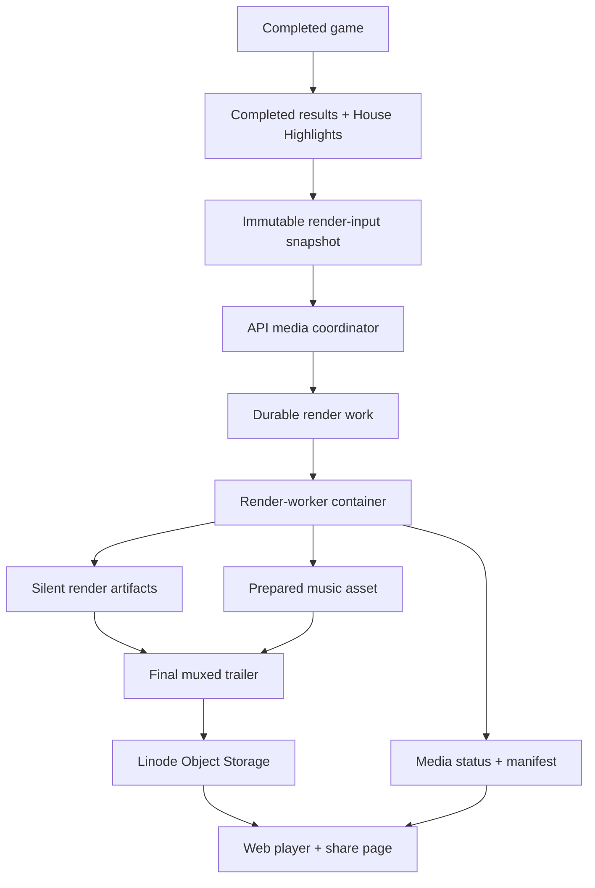

# House Highlights Endgame Media Pipeline - Plan

## Goal Capsule

- **Objective:** Define the production slice that turns local House Highlights trailer rendering into a durable, shareable, music-backed postgame media pipeline.
- **Product authority:** Completed results and House Highlights remain the factual authorities. The trailer pipeline presents those facts; it does not select new House Cuts, derive new vote truth, or create a competing results surface.
- **Execution profile:** Code. This slice includes API/media status, a deployable render-worker container, Linode Object Storage upload, music composition from prepared assets, and web playback/share UX.
- **Open blockers:** None. Implementation may still refine exact table names, helper names, and env var names without changing the plan's product or architecture decisions.

---

## Product Contract

### Summary

House Highlights should publish a durable endgame media bundle for completed games: a music-backed 16:9 trailer, spoiler-safe poster/preview metadata, internal cue metadata, public caption metadata, render status, and a stable web share URL.
The app owns truth and publication state, a third render-worker container owns rendering and final music muxing, and the web owns accessible playback once the bundle is public-ready.

### Problem Frame

The local trailer slice proved the core presentation contract: a completed game can render into a 16:9 MP4 from existing House Highlights scenes and completed-results facts, with deterministic timing metadata for music work.
That proving lane intentionally stopped before the expensive production questions: where rendering runs, how output is stored, how music becomes part of the final video, how public links behave, and how deployment owns the runtime dependencies.

The deployed app already has separate API and web containers.
Putting Remotion, Chromium, ffmpeg, music assets, temporary render output, and long-running video work into either request-serving container would blur responsibilities and make deploy risk harder to reason about.
This slice makes the production boundary explicit: the API coordinates media state, the render worker performs media work, object storage owns bytes, and the web displays the ready product.

### Key Decisions

- **Public readiness requires music.** Silent or partially composed renders may exist for internal QA, but the public/shareable trailer is not ready until the final music-backed composition is produced.
- **Render work runs in a third container.** The slice is not complete until the app repo exposes a buildable, smoke-testable render-worker image that `linode-iac` can deploy.
- **The share unit is a media bundle, not a bare MP4.** The video, poster, internal cues, public captions, duration, version, storage metadata, and publication status travel together as one product contract.
- **The share URL is stable web UI.** Viewers share a web page or module that can render spoiler-safe preview metadata and accessibility affordances; the raw MP4 URL is only a media source.
- **The render input is a shared versioned manifest.** API snapshot creation and worker rendering use one serializable trailer contract, preferably in `packages/engine`, so the API does not import web/Next route code and the worker does not recompute live Highlights.
- **Rerenders publish versions behind the stable share surface.** A successful rerender may become canonical without breaking existing shared page URLs, while prior versions remain diagnosable for producers.

### Actors

- A1. **Completed game:** Supplies canonical completed-results facts, final vote, placements, player order, and winner.
- A2. **House Highlights artifact:** Supplies selected House Cuts, scene ordering, visual cards, generated background choices, and scene facts.
- A3. **API media coordinator:** Owns render eligibility, durable media status, retry/rerender intent, and the public read model for media availability.
- A4. **Render worker:** Renders trailers, composes prepared music, creates poster/cue/caption artifacts, uploads bytes, and reports outcome.
- A5. **Web player/share surface:** Displays ready trailers, pending/unavailable states, spoiler-safe poster previews, captions, and share affordances.
- A6. **Producer/admin:** Reviews internal render diagnostics, triggers backfills or rerenders, and diagnoses missing music or failed jobs.
- A7. **Deployment owner:** Receives a clear third-container contract for Linode deployment, secrets, storage, temp space, health checks, and smoke validation.

### Requirements

**Authority and trigger**

- R1. Every supported completed game should have a postgame media status, even when no trailer has been rendered yet.
- R2. A production render may begin only after the game is completed and the existing House Highlights plus completed-results facts are available.
- R3. The trailer must use already-selected House Cuts and completed-results facts only.
- R4. The trailer pipeline must not introduce new House Cut selection, new jury vote derivation, new placement logic, new alliance claims, or trailer-only factual conclusions.
- R5. Existing completed games must be renderable through the same production pipeline for manual backfill and rerender use.

**Media bundle and publication state**

- R6. The postgame media bundle must include the final music-backed trailer video, spoiler-safe poster/preview metadata, internal cue/timeline metadata, public caption metadata, duration, render version, storage locations, and publication status.
- R7. Public `ready` means the final muxed video, spoiler-safe poster/preview metadata, public captions, safe playback metadata, and media manifest are all available and internally consistent.
- R8. Silent renders, pre-mux videos, extracted frames, and raw renderer logs may produce structured diagnostics during an attempt, but raw intermediate files are deleted after cleanup and never become public/shareable media.
- R9. Media state must distinguish at least these product conditions: not requested, waiting for inputs, waiting for music, rendering or composing, ready, and failed.
- R10. Failed or blocked media generation must not change the completed-game result state.
- R11. Each published render must record enough provenance to explain what immutable shared render-input snapshot, renderer version, timing contract, and music asset produced it.

**Render-worker boundary**

- R12. The app repo must produce a third deployable container for House Highlights rendering.
- R13. The render-worker container must include the runtime dependencies needed for Remotion rendering, a headless browser, ffmpeg composition, static assets, prepared allowlisted music assets or mounted music input, temporary render storage, and upload tooling.
- R14. The render worker must consume a presentation-ready render job or manifest; it must not call LLMs, select scenes, infer alliances, rewrite vote facts, or mutate completed-results truth.
- R15. The worker must support both production upload and a local or dry-run smoke mode so the same image can be verified before Linode deployment.
- R16. Worker execution must have bounded concurrency, bounded temporary disk use, retry behavior, and explicit failure reporting.
- R17. The system must tolerate render-worker downtime by leaving media in a non-ready state with producer-visible diagnostics instead of blocking game completion.

**Music and timing**

- R18. The final public trailer must include a music bed selected from prepared allowlisted assets or producer-supplied files staged into that allowlist; automatic in-app music generation is outside this slice.
- R19. For prepared matrix cases, music selection or slicing must follow the existing trailer cue contract so final vote and winner reveal beats stay aligned to the rendered timeline.
- R20. For out-of-matrix player or House Cut counts, the trailer should degrade gracefully with the nearest bounded prepared cue rather than stretching music or failing solely because counts are unsupported; below-matrix trailers trim and fade the nearest longer cue to the visual duration.
- R21. If a matching music asset is missing or invalid for a supported prepared variant, the media state must remain not public-ready and show an admin/producer explanation.
- R22. Final composition should avoid abrupt audio endings through a deterministic fadeout or equivalent finishing rule.

**Storage and lifecycle**

- R23. Public media bytes must be uploaded to Linode/Akamai Object Storage or the configured local-development equivalent with a defined browser playback contract for MP4, poster, VTT, and metadata objects, including content types, GET/HEAD/range behavior, CORS, exposed headers, and cache headers.
- R24. Production media should have no expiration by default.
- R25. Object storage should hold large bytes; the app read model should hold safe metadata, status, and public URLs.
- R26. Public object naming must support cacheable assets and render versions without forcing shared web URLs to change.
- R27. Private render diagnostics, raw logs, and non-public intermediate files must not leak through public media URLs.

**Web playback and sharing**

- R28. The web app must expose a canonical share target for the completed game's trailer.
- R29. The public share target must render a native accessible video player with controls, spoiler-safe poster/preview metadata, descriptive title/copy, and no autoplay requirement.
- R30. The public share target must show honest pending, unavailable, and failed states instead of hiding the trailer area or pretending media is ready.
- R31. Open Graph and social preview metadata should use stored spoiler-safe poster/title/copy, not dynamic per-request rendering and not winner-reveal media.
- R32. The Highlights and completed-results surfaces should link to the trailer when media is ready or explain its status when it is not.
- R33. Captions must be available through the native video player for ready media; cue/timeline metadata stays admin/worker-facing in this slice.

**Admin and handoff**

- R34. Producers/admins must be able to inspect media state, render attempts, render versions, selected music asset, duration, cue markers, object locations, and failure category.
- R35. Producers/admins must be able to request a rerender or backfill for completed games without changing the underlying completed-results facts.
- R36. The app repo must document the render-worker image contract needed by `linode-iac`: image target, command, required runtime configuration, secrets, object-storage expectations, temp-space needs, concurrency expectation, health behavior, and smoke command.
- R37. The slice cannot be called done until the render-worker image can be built and smoke-tested locally with the same runtime shape that deployment will use.

### Media Lifecycle



### Key Flows

- F1. Completion-time production render
  - **Trigger:** A supported game reaches completed state and required postgame facts are available.
  - **Actors:** A1, A2, A3, A4, A7
  - **Steps:** The API media coordinator records media work for the completed game; the render worker claims the work through the API-backed polling and lease flow; the worker renders the trailer from deterministic facts; the worker selects or applies the prepared music asset; the worker uploads the final bundle artifacts and reports status.
  - **Outcome:** The game has a public-ready trailer bundle when all artifacts are valid, or a diagnosable non-ready state when rendering cannot finish.

- F2. Missing or invalid music asset
  - **Trigger:** The render worker can render the trailer video but cannot find or validate the required music asset.
  - **Actors:** A3, A4, A6
  - **Steps:** The worker records the blocked condition; producer diagnostics explain the missing music condition; public UI remains pending or unavailable rather than publishing a silent video.
  - **Outcome:** The product preserves public quality while still giving producers enough information to add the missing music asset and retry.

- F3. Public trailer playback and sharing
  - **Trigger:** A viewer opens the completed game's trailer share URL or reaches the trailer module from Highlights/results.
  - **Actors:** A3, A5
  - **Steps:** The web app reads public media status; if ready, it renders the spoiler-safe poster/preview metadata, video player, captions track, and share affordance; if not ready, it renders an honest status.
  - **Outcome:** The viewer can watch and share the trailer without needing direct object-storage URLs or producer diagnostics.

- F4. Producer rerender or backfill
  - **Trigger:** A producer wants to update a trailer after renderer, background, music, or copy improvements, or wants to render an existing completed game.
  - **Actors:** A3, A4, A6
  - **Steps:** The producer requests media work; the pipeline creates a new render version; the worker produces a new bundle; the public share target moves to the new canonical version only after success.
  - **Outcome:** Rerenders improve media without breaking public links or rewriting completed-game facts.

- F5. Linode deployment handoff
  - **Trigger:** The app repo is ready for deployment work.
  - **Actors:** A7
  - **Steps:** Deployment receives a documented worker image contract, required configuration, storage/secrets expectations, smoke command, and runtime boundaries.
  - **Outcome:** `linode-iac` can add the third service without reverse-engineering the render pipeline from local scripts.

### Acceptance Examples

- AE1. Given a completed twelve-player game with five selected House Cuts and a matching music asset, when production media rendering succeeds, then the public share URL serves a music-backed trailer, spoiler-safe poster/social metadata, captions, and no producer diagnostics.
- AE2. Given a completed game whose existing House Highlights artifact has zero selected House Cuts, when production media rendering succeeds, then the trailer still contains the roster, final vote, winner reveal, and player dossier sections, and the music selection matches that shorter timing.
- AE3. Given a completed game whose silent render succeeds but whose music asset is missing, when a viewer opens the share URL, then the trailer is not public-ready and the viewer sees a pending or unavailable state rather than a silent video.
- AE4. Given a render worker failure during ffmpeg composition or upload, when the game results page is opened, then completed results remain available and media status reflects the failed trailer job separately.
- AE5. Given a successful rerender, when an old shared web URL is opened, then it resolves to the canonical trailer page and displays the current public-ready media version.
- AE6. Given a completed game whose completed-results facts are unavailable or invalid, when media rendering is requested, then the pipeline refuses to invent a trailer and reports a non-ready state.
- AE7. Given the app repo on a Linode-compatible build host, when the render-worker smoke command runs against a completed local or fixture game, then it proves the container has the browser, ffmpeg, asset, music, temp-space, and upload/runtime prerequisites needed for deployment.

### Success Criteria

- A completed game can progress from media-not-requested to public-ready through the render-worker container without manual file copying.
- The public trailer is music-backed, 16:9, shareable by web URL, and backed by stored spoiler-safe poster metadata plus captions; cue metadata remains internal/admin-facing.
- Silent or failed intermediate renders never become public media by accident.
- The render worker can be built and smoke-tested as a third container in the app repo.
- `linode-iac` can deploy the worker from documented image/runtime expectations without guessing at Remotion, Chromium, ffmpeg, music, storage, or temp-space needs.
- Trailer publication never contradicts completed results, House Highlights selected scenes, Visual Card facts, or the existing final vote.

### Scope Boundaries

**In scope**

- Production media status for completed-game trailer bundles.
- Render-worker container image and smoke-testable runtime contract.
- Final music-backed composition from prepared or producer-supplied music assets.
- Linode Object Storage upload for public media artifacts.
- Web playback, status states, share URL, poster/social preview metadata, and accessibility metadata.
- Producer/admin diagnostics for render attempts, failures, rerenders, and music readiness.
- Manual backfill and rerender support for completed games.

**Deferred or out of scope**

- New House Highlights scene-selection rules, new no-cut logic, or "best three cuts" filtering.
- New trailer-only factual surfaces for final vote, placements, alliances, receipts, or outcomes.
- Automatic in-app music generation.
- Vertical, square, TikTok, Shorts, or platform-native export variants.
- Automatic posting to Discord, X, TikTok, YouTube, or other social platforms.
- Custom video-player chrome beyond what is needed for accessible native playback.
- Advanced motion-grammar upgrades beyond productionizing the current trailer contract.
- Storage expiration, archival policy, CDN tuning, and cost optimization beyond no-expiration public media for this slice.

### Dependencies / Assumptions

- The existing local trailer manifest contract remains the renderer-facing truth boundary.
- Completed results and House Highlights remain available through the app's existing public postgame surfaces.
- Prepared music assets can be generated or supplied outside the app for the supported duration variants.
- Linode/Akamai Object Storage remains the production byte store for public media.
- The deployed architecture continues to separate API and web containers, so render work needs its own service boundary.
- The first production format remains 16:9 landscape.

### Outstanding Questions

**Resolve Before Planning**

- None.

**Deferred to Planning**

- None remain; the resolved decisions are captured in the Planning Contract.

### Sources / Research

- `docs/plans/2026-07-07-003-feat-house-highlights-trailer-local-render-plan.md` defines the local trailer contract, timing model, and intentional deferral of upload, public playback, share links, and music composition.
- `docs/ideation/2026-07-09-house-highlights-endgame-rendering-pipeline-ideation.html` explores the production endgame rendering pipeline and establishes the third render-worker container as part of the scope floor.
- `docs/house-highlights-trailer-music-cue-sheet.md` lists the deterministic timing matrix for House Cut counts, player counts, final vote, winner reveal, and dossier/outro timing.
- `packages/web/src/app/games/[slug]/components/house-highlights-trailer-model.ts` contains the current manifest, cue, player-result, final-vote, and fact-selection boundary.
- `packages/web/src/scripts/render-house-highlights-trailer.ts` contains the current local render script that bundles Remotion, renders MP4, and writes cue JSON.
- `scripts/generate-house-highlights-music-variants.ts` contains the current deterministic music-variant slicing approach for prepared trailer lengths.
- `packages/api/src/lib/storage.ts` shows the existing public Linode Object Storage posture and local fallback pattern.
- `Dockerfile.api` and `Dockerfile.web` show the current two-container deployment split that this slice extends with a third render service.
- `CONCEPTS.md` defines completed results, House Highlights, Visual Brief, Visual Card, and House Highlights Trailer boundaries.

---

## Planning Contract

### Product Contract Preservation

The Product Contract above remains the source of truth for what this slice is allowed to do. This plan preserves all requirement IDs and only clarifies decisions where the user resolved open planning questions after the brainstorm.

Clarified after user input:

- R6/R28/R29/R31: the canonical share target defaults to `/games/[slug]`, with a no-autoplay, spoiler-safe completed-game entry/player so landing users are not forced into spoilers.
- R8/R27: raw renderer intermediates and private scratch files should be deleted immediately; only durable public artifacts and structured status/diagnostics remain.
- R11: the render-input snapshot needs a shared versioned manifest contract instead of API/web duplication.
- R12/R13/R36/R37: this slice is not done until a third `render-worker` container exists and the repo contains a concrete `linode-iac` handoff.
- R16/R17: worker execution should be lightweight and bounded to current Linode/Docker Compose infrastructure, not a full queue framework.
- R23/R24/R26: use the existing public Linode object bucket, with a postgame media key prefix, immutable versioned objects, and explicit browser playback/CORS expectations.
- R19/R20/R21: prepared music variants align normal matrix trailers; unsupported counts are an explicit exception that degrades gracefully instead of failing solely because they fall outside the matrix.
- R34/R35: rerender/backfill actions are controlled by sysop/admin permissions.

### Key Decisions

1. Keep the worker boring: implement a long-running `render-worker` service that polls/claims postgame media jobs through an API-owned work source. Do not introduce Redis, BullMQ, Temporal, or a general queue in this slice.
2. Treat `/games/[slug]` as the canonical trailer share URL. The raw MP4 URL is a media source, not the social share target.
3. Keep the completed-game root unspoiled by default. It should show spoiler-safe preview/title/copy, a play CTA/player status, and navigation to highlights, replay, and results; it must not autoplay or reveal the winner before the user chooses to watch or inspect results.
4. Reuse the existing public Linode object bucket configured by `LINODE_OBJ_*`, but add a generic postgame media storage contract instead of routing MP4s through avatar/PFP-specific helpers and limits.
5. Store public artifacts under immutable, versioned keys. The web app resolves the current render version through API data instead of publishing mutable `latest.mp4` objects.
6. Keep private render scratch space disposable. Successful renders publish durable MP4, poster, captions, and safe metadata; cue JSON and diagnostics remain internal/admin-facing; temp files are deleted in `finally` on success or failure.
7. Use prepared music variants for the normal matrix. For games outside the matrix, do not fail solely because of count: use the nearest bounded prepared cue, do not stretch timing, trim/fade the nearest longer cue for below-matrix trailers such as four-player games, and allow the music to end before extra players/cards finish or the swell to land early when there are more than five cuts. This is an accepted degradation for unsupported counts, not an internal-only QA mode.
8. Gate rerender/backfill through sysop/admin capability. Prefer a dedicated `manage_postgame_media` permission assigned to `sysop` and `admin`, while preserving existing admin read access for diagnostics.
9. Split metadata into two categories: timeline cue metadata for render/music QA, and accessible caption/playback metadata for public playback. Raw cue IDs, music filenames, worker logs, object internals, and producer diagnostics do not belong in public UI.

### Architecture

The implementation should establish this flow:

1. A game completes and `persistCompletedGame` writes canonical results.
2. The API creates an immutable `house_highlights_trailer` render-input snapshot from completed results and the selected House Highlights projection through the shared versioned manifest contract, then stores its hash/version with the media job.
3. The `render-worker` polls the API for claimable jobs, claims one with a lease/attempt token, and renders the stored snapshot instead of recomputing House Highlights from live endpoints after claim.
4. The worker renders the Remotion trailer, applies the selected prepared music variant, extracts or generates the poster and captions, and uploads artifacts through API-issued upload targets.
5. The worker finalizes the job with duration, artifact metadata, render version, render-input snapshot hash/version, cue metadata location/status, and any recoverable diagnostics.
6. The API exposes a public, spoiler-conscious postgame media read model for `/games/[slug]`.
7. The web app renders a no-autoplay trailer CTA/player on the completed-game root and keeps highlights/replay/results as peer choices.
8. Admin/sysop tooling exposes status, retry/backfill controls, and failure diagnostics without leaking private logs to public pages.

### Media State Model

Use a small, explicit state machine rather than inferring readiness from object existence:

- `not_requested`: no render has been queued for the completed game.
- `waiting_inputs`: completed-game media is desired, but results, highlights, render assets, or another required input is not available.
- `waiting_music`: the visual render inputs are available, but the required normal-matrix music asset is missing or invalid.
- `queued`: a render job exists and is waiting for the worker.
- `claimed`: a worker has claimed the job lease but has not reported render progress yet.
- `rendering`: Remotion/video work is underway.
- `composing`: ffmpeg/music/poster/caption composition is underway.
- `uploading`: render output exists and artifacts are being published.
- `ready`: the current render version is public-ready and may be shown on `/games/[slug]`.
- `failed`: the latest attempt failed; public UI can show unavailable/pending language, admin can inspect categorized diagnostics.

The implementation may collapse `claimed`, `rendering`, `composing`, and `uploading` in internal storage if that keeps the first slice simpler, but the exposed read model must still distinguish the R9 product buckets: not requested, waiting on inputs, waiting on music, rendering or composing, ready, and failed.

### Object-Key Contract

Recommended public key shape:

```text
postgame-media/house-highlights-trailers/{gameId}/{renderVersion}/trailer.mp4
postgame-media/house-highlights-trailers/{gameId}/{renderVersion}/poster.png
postgame-media/house-highlights-trailers/{gameId}/{renderVersion}/captions.vtt
postgame-media/house-highlights-trailers/{gameId}/{renderVersion}/metadata.json
```

Storage rules:

- Use `Cache-Control: public, max-age=31536000, immutable` for versioned public artifacts.
- Do not overwrite a versioned object after the API has marked it ready.
- Use lease-bound single-use upload targets for opaque per-attempt render-version keys. The API allocates a fresh render version before issuing targets, validates object absence before issuance where the backend allows it, validates object existence/checksum/content type/size at finalize, and marks the version public only after active-attempt finalize succeeds.
- Do not require a first-slice staging-key promotion system. If a failed or expired attempt already uploaded objects to its opaque version prefix, keep those keys non-canonical and best-effort delete them through cleanup where the storage backend supports it.
- Keep the stable share URL at `/games/[slug]`; let the API point the player at the current ready artifact URL.
- Do not place public trailers in the private producer/debug bucket.
- Define delivery headers for MP4, poster, VTT, and metadata: content type, GET/HEAD/range expectations, CORS allowed origins, exposed headers, and cache policy.
- Keep any raw worker scratch output under local temp directories only, and clean it up immediately.

### API Boundary

The API owns:

- postgame media persistence, status, attempts, leases, immutable render-input snapshots, and current-version selection;
- public media read models for completed-game pages;
- admin/sysop rerender and backfill actions;
- worker auth and claim/finalize endpoints;
- object-key allocation, API-issued upload targets, and upload/finalization validation;
- spoiler-safe public response shaping.

The API must not own:

- Remotion rendering;
- Chromium/browser runtime;
- ffmpeg muxing;
- local render temp files;
- direct process launching for render jobs.

### Worker Boundary

The `render-worker` owns:

- polling and claiming jobs;
- fetching the claimed render-input snapshot from the API;
- rendering the trailer using the existing Remotion model from that snapshot;
- selecting prepared music assets;
- muxing audio/video with ffmpeg;
- extracting or generating poster and caption artifacts;
- uploading artifacts through API-issued lease-bound upload targets;
- reporting structured success/failure;
- deleting temp files.

The worker must not own:

- House Cut selection;
- vote/final-result truth;
- live House Highlights recomputation after claim;
- winner determination;
- story analysis;
- public share routing;
- admin authorization.

### Web Boundary

The web app owns:

- displaying the no-autoplay media CTA/player on `/games/[slug]`;
- showing public statuses without raw diagnostics;
- wiring captions into the native player;
- preserving links to House Highlights, Watch Replay, and Results;
- presenting admin diagnostics/rerender controls only in admin surfaces.

The web app must not:

- render videos in production request paths;
- generate or upload media;
- infer readiness from public object URLs alone;
- expose cue JSON, worker logs, object keys, or proof/debug copy to normal viewers.

### Resolved Planning Questions

| Question | Decision |
| --- | --- |
| Worker execution model | Lightweight long-running worker container with API-backed claim loop; no full queue framework in this slice. |
| Canonical share target | `/games/[slug]`, with no autoplay and spoiler-conscious completed-game entry. |
| Bucket strategy | Reuse the existing public `LINODE_OBJ_*` bucket with a postgame media prefix; do not create a new bucket. |
| Cache strategy | Immutable versioned objects plus API-selected current render version. |
| Upload isolation | Worker uploads use lease-bound single-use upload targets for opaque per-attempt version keys; ready versions are marked only after active-attempt finalize validation. |
| Temp/intermediate retention | Delete immediately after render success/failure cleanup. |
| Old public render retention | Keep successful versioned artifacts indefinitely for now; only the current ready version is canonical. |
| Non-standard counts | Degrade gracefully; do not fail only because counts fall outside the prepared music matrix; below-matrix trailers trim/fade the nearest longer cue, above-matrix trailers may outlast the cue or land the swell early. |
| Rerender/backfill permission | Sysop/admin, preferably via `manage_postgame_media`. |
| Public metadata | Spoiler-safe poster/title/copy, captions, and normal video metadata only. |
| Admin/internal metadata | Timeline cues, music variant, attempts, failure categories, and storage artifact summaries. |

### Assumptions

- Completed-game results and postgame highlights remain canonical and available before media rendering is queued.
- The trailer snapshot contract can live in `packages/engine` or an equivalent repo-native shared module that API snapshot creation and worker rendering can both consume without importing web routes or Next-specific code.
- The prepared music variants under `music/house-highlights-variants/` are the production input set for this slice.
- The worker can call the internal API URL from Docker Compose and authenticate with a dedicated worker token.
- The API already has or can receive public object-storage credentials for the existing bucket.
- Producer-supplied music files, if used, are staged as allowlisted assets with size, type, and duration validation before the worker can select them.
- `linode-iac` will wire the third container, env vars, secrets, logs, and restart policy after this repo exposes the image and handoff doc.

### Out Of Scope

- A general-purpose queue system or scheduler framework.
- AWS-specific deployment work.
- Autoplay hero video on the public completed-game root.
- In-browser generation of MP4s.
- User-facing chapters/transcript panels beyond accessible captions and basic playback metadata.
- A new paid Linode bucket.
- Retention tooling for old successful versions.
- Animated trailer redesign beyond what is required to produce and publish the current render.

---

## Implementation Units

### U1. Postgame Media Persistence And Read Model

**Goal:** Add durable postgame media state so trailer readiness is represented by API data, not by filesystem/object-storage guesses.

**Requirements:** R1, R6, R7, R8, R9, R10, R11, R25

**Dependencies:** None.

**Files:**

- `packages/api/src/db/schema.ts`
- `packages/api/drizzle/0027_postgame_media.sql`
- `packages/api/drizzle/meta/_journal.json`
- `packages/api/drizzle/meta/0004_snapshot.json`
- `packages/api/src/services/postgame-media.ts`
- `packages/api/src/__tests__/postgame-media.test.ts`
- `packages/engine/src/postgame-media/house-highlights-trailer-manifest.ts`
- `packages/engine/src/__tests__/house-highlights-trailer-manifest.test.ts`

**Approach:**

- Add a `postgame_media_jobs` or `game_postgame_media` table keyed to game ID and the single `house_highlights_trailer` media type for this slice.
- Do not add generic render-kind branching in public/admin API surfaces until a second media kind is in scope.
- Include generated Drizzle migration metadata alongside the SQL file so startup migration and DB-backed tests discover the new table.
- Define the shared versioned trailer manifest/snapshot schema in `packages/engine` or an equivalent repo-native shared module.
- Track status, render version, attempt number, hashed worker/lease token identifiers, lease expiration, failure category, failure message, duration, render-input snapshot hash/version, renderer version, timing-contract version, music asset ID, and artifact metadata.
- Store the serialized `house_highlights_trailer` render-input snapshot or an immutable metadata object reference; the worker must render that snapshot rather than recomputing Highlights/results from live public endpoints.
- Represent a current ready version explicitly so rerenders can complete without breaking the currently published trailer.
- Keep public read data separate from admin diagnostics.
- Store cue metadata as internal/admin metadata; expose spoiler-safe preview metadata, captions, and safe playback metadata through the public read model.

**Patterns to follow:** Completed-results read models and `packages/api/src/lib/storage.ts` for "bytes in object storage, safe metadata in the app read model."

**Test scenarios:**

- A missing row returns a `not_requested`/empty public state.
- Queued, claimed, failed, and ready rows map to stable public states.
- Ready public state includes video/poster/caption URLs and duration, but not worker logs, raw cue IDs, internal object keys, or diagnostic messages.
- Rerender attempts do not replace the current ready artifact until the new version finalizes successfully.
- Stored render-input snapshot hash/version is stable across worker retry and rerender diagnostics.
- API-created snapshot fixtures validate against the shared manifest schema without importing web route code.

**Verification:** API service tests prove public/admin response separation, snapshot stability, and current-version behavior before downstream worker or web units consume the state.

### U2. Completion Enqueue, Worker Claim/Finalize, And Admin Actions

**Goal:** Connect game completion to media jobs, expose a minimal worker API, and provide admin/sysop rerender/backfill controls.

**Requirements:** R1, R2, R5, R9, R10, R11, R14, R16, R17, R34, R35

**Dependencies:** U1.

**Files:**

- `packages/api/src/services/game-lifecycle.ts`
- `packages/api/src/routes/games.ts`
- `packages/api/src/routes/admin.ts`
- `packages/api/src/index.ts`
- `packages/api/src/db/rbac-seed.ts`
- `packages/api/src/__tests__/postgame-media-routes.test.ts`
- `packages/api/src/__tests__/admin-routes.test.ts`

**Approach:**

- Enqueue after `persistCompletedGame` and postgame read-model refresh work, without blocking the game completion path on renderer availability.
- Create the initial media row in the completion transaction when possible, so every supported completed game has a recoverable media status even if later snapshot/enqueue work fails.
- Add a lightweight idempotent reconciliation/backfill path that discovers completed games in `not_requested`, missing-row, or failed-enqueue states without introducing a general queue framework.
- Add worker-authenticated endpoints for claim, heartbeat/progress if needed, artifact upload/finalize, and failure reporting.
- Implement claim as an atomic DB operation, such as row locking with skip-locked semantics or an update-with-status-and-lease predicate, so two pollers cannot claim the same attempt.
- Require finalize payloads to report render-input snapshot hash/version, renderer version, timing-contract version, and music asset ID for every published render version.
- Generate worker auth tokens and per-attempt lease tokens as opaque secrets; persist only hashes when storage is required, validate with constant-time comparison, and redact tokens from logs/admin/public responses.
- Support worker token rotation with current and previous tokens during rollout.
- Use a lease/attempt token so only the claiming worker can mutate the claimed attempt after claim.
- Require heartbeat/progress, upload-target issuance, failure reporting, and finalize to include the active lease/attempt token; reject expired, stale, or non-current attempts for every post-claim mutation.
- Treat upload target URLs, signed query parameters, and local upload tokens as bearer-capable secrets; store and log only sanitized target IDs or object-key summaries.
- Let stale leases become claimable again after a bounded timeout.
- Finalize succeeds only for the active lease after the API verifies every artifact against API-allocated lease-bound targets under the expected game/version prefix, expected content type, bounded size, object existence, checksum or ETag, and required manifest fields.
- Add `manage_postgame_media` to RBAC and seed it for `sysop` and `admin`; keep diagnostic reads behind admin-level permissions.
- Add admin backfill/rerender routes that enqueue a new attempt for completed games.
- Add per-game active-attempt/idempotency guards, queue-depth or rate limits, and audit records for rerender/backfill actions.

**Patterns to follow:** Existing admin route authorization and completed-game lifecycle persistence, with worker endpoints treated as internal API surfaces guarded by dedicated token auth.

**Test scenarios:**

- Completed game creates a media job and still completes if enqueue fails in a recoverable way.
- Reconciliation/backfill discovers completed games with missing media rows or failed enqueue states and creates/repairs idempotently.
- Worker token is required for worker endpoints.
- Worker and lease tokens are never returned in admin/public responses or logs; persisted token material is hashed.
- Current-plus-previous worker token rotation is supported.
- Concurrent claim attempts result in at most one active lease for a given job.
- Two workers cannot finalize the same attempt.
- Stale leases can be reclaimed.
- Stale workers cannot send heartbeat/progress, request upload targets, report failure, or finalize after lease expiry or re-claim.
- Finalize rejects missing, unallocated, cross-game, wrong-type, wrong-size, missing-checksum, or stale-attempt artifacts.
- Stale workers cannot mutate a ready version through old upload targets or final object keys.
- Upload target URLs, signed query parameters, and local upload tokens are never returned in admin/public responses or raw logs.
- Admin/sysop can request rerender/backfill; non-admin users are denied.
- Duplicate rerender/backfill requests for the same game are bounded or suppressed while an active attempt exists, and audit rows record actor, game, reason, previous/current version, and request source.
- Failed jobs expose categorized admin diagnostics but only safe public status.

**Verification:** Focused API route/service tests prove completion enqueue, worker claim/finalize, stale-lease handling, admin permissions, and safe public failure states.

### U3. Public Media Storage And Immutable Artifact Contract

**Goal:** Publish large public media artifacts through the existing public object-storage configuration without abusing avatar-specific storage limits.

**Requirements:** R23, R24, R25, R26, R27

**Dependencies:** U1, U2.

**Files:**

- `packages/api/src/lib/storage.ts`
- `packages/api/src/routes/upload.ts`
- `packages/api/src/lib/public-media-storage.ts`
- `packages/api/src/services/postgame-media-storage.ts`
- `packages/api/src/__tests__/storage.test.ts`

**Approach:**

- Add a generic public-media storage helper for MP4, PNG/JPEG poster, VTT captions, and JSON metadata.
- Reuse `LINODE_OBJ_ENDPOINT`, `LINODE_OBJ_ACCESS_KEY`, `LINODE_OBJ_SECRET_KEY`, and `LINODE_OBJ_BUCKET`.
- Do not use `LINODE_PRIVATE_CONTENT_*` for public trailers.
- Remove avatar-specific assumptions such as 2 MB limits from the postgame media path.
- Allocate immutable object keys under the `postgame-media/house-highlights-trailers/{gameId}/{renderVersion}/` prefix.
- Use API-issued upload targets so object key allocation and public URL construction remain centralized while worker secrets stay limited to API base URL plus worker token.
- Allocate upload targets as lease-bound single-use targets for opaque per-attempt version keys; do not expose the keys as current public media until finalize succeeds.
- Treat upload targets as secrets while valid; admin and public responses may show sanitized target IDs, object-key summaries, checksums, and artifact status, but not signed URLs or bearer-capable upload tokens.
- Keep API-mediated byte relay out of the first slice except for existing local-development upload fallback when needed.
- Extend or split the local upload route so worker media upload targets support MP4, poster image, VTT, and JSON metadata with media-appropriate limits, while the profile-picture path remains image-only and capped for avatars.
- Set content type and long immutable cache headers for versioned artifacts.
- Define CORS, GET/HEAD, range-request, and exposed-header expectations for MP4, poster, VTT, and metadata object playback.
- Define the public `metadata.json` object as an allowlisted playback manifest containing only safe fields such as duration, dimensions, spoiler-safe title/copy, poster URL, captions URL, render version, and content hashes.

**Patterns to follow:** Existing `LINODE_OBJ_*` public storage configuration and local-development fallback, while keeping avatar/profile-picture limits scoped to avatar flows.

**Test scenarios:**

- MP4-sized payloads are accepted by the media path while avatar limits remain intact.
- Unsafe keys/path traversal are rejected.
- Public URLs use the existing public bucket host convention.
- Private content configuration is not used for public trailers.
- Versioned artifact metadata survives read/write round trips.
- Lease-bound upload targets prevent stale workers from overwriting ready artifacts.
- Local-development upload accepts worker media MP4, poster, VTT, and JSON artifacts while preserving profile-picture image-only and size-limit behavior.
- Public `metadata.json` excludes raw cue IDs, music filenames, worker logs, internal object keys, lease tokens, and diagnostics.
- Admin/public/log surfaces exclude signed upload URLs, signed query parameters, and local upload tokens.
- Object-storage-origin MP4, poster, VTT, and metadata responses satisfy browser playback and caption loading requirements.

**Verification:** Storage tests prove large public media objects, immutable key construction, cache metadata, safe playback metadata, and no private-bucket leakage.

### U4. Render Worker Media Bundle Library

**Goal:** Convert the existing local trailer renderer into a reusable worker path that produces a complete media bundle.

**Requirements:** R3, R4, R6, R8, R14, R18, R19, R20, R21, R22, R33

**Dependencies:** U1, U2, U3.

**Files:**

- `packages/web/src/scripts/render-house-highlights-trailer.ts`
- `packages/web/src/scripts/render-house-highlights-media-worker.ts`
- `packages/web/src/app/games/[slug]/components/house-highlights-trailer-model.ts`
- `packages/web/src/lib/house-highlights-trailer-audio.ts`
- `packages/engine/src/postgame-media/house-highlights-trailer-manifest.ts`
- `packages/web/src/__tests__/house-highlights-media-worker.test.ts`
- `packages/web/src/__tests__/house-highlights-trailer-model.test.ts`

**Approach:**

- Preserve the existing local render script, but factor shared render/mux/poster/caption logic into callable functions.
- Build worker rendering around the shared versioned trailer manifest contract; avoid duplicating snapshot shaping in web-only code.
- Keep story/fact selection out of the worker; consume the API-created render-input snapshot instead of live highlights/results endpoints after claim.
- Select the exact prepared music variant for normal matrix cases.
- For unsupported above-matrix counts, choose the closest deterministic prepared cue and allow the visuals to run past or land differently rather than failing solely on count.
- For supported below-matrix counts such as four-player games, trim and fade the nearest longer prepared cue to the visual duration so ffmpeg behavior and public readiness are deterministic.
- Mark the job `waiting_inputs` or `waiting_music` for missing prerequisites where admin action can resolve the problem; reserve `failed` for render/runtime/composition errors.
- Generate accessible captions/playback metadata from the deterministic manifest, not from OCR or generated imagery.
- Make VTT captions describe the visible trailer beats: roster intro, each House Cut scenelet, final vote tableau, winner reveal, and player dossier/outro moments.
- Include concise non-speech audio cues when they materially help viewers understand music-backed timing, while keeping generated text factual and spoiler-appropriate for the section being captioned.
- Store cue metadata for admin/render QA, not public UI.
- Write public metadata through the allowlisted playback manifest only; keep full render manifest/cue diagnostics internal.
- Delete temp directories in `finally` for both success and failure.

**Patterns to follow:** The existing local Remotion render script, trailer model, cue-sheet generation, and deterministic music-variant slicing script.

**Test scenarios:**

- Existing `vast-plum-bay` manifest still produces expected segment timing.
- Worker render uses a stored render-input snapshot and does not recompute selected scenes from live endpoints after claim.
- Golden fixture tests prove an API-shaped manifest snapshot can render through the worker path without web-route recomputation.
- Music selection covers 0-5 cuts and 6/8/10/12 players, plus deterministic four-player trim/fade behavior.
- Out-of-matrix player/card counts degrade deterministically.
- Missing music produces a structured `waiting_music` or admin-visible non-ready state for normal supported variants.
- Temp cleanup happens after success and simulated failure.
- Generated captions avoid receipt/proof/debug language.
- Generated captions include representative visible-beat text for roster, House Cut, final vote, winner reveal, and dossier sections rather than only wiring an empty track.

**Verification:** Renderer tests and a local fixture render prove manifest-based rendering, music selection/degradation, caption generation, and temp cleanup before Docker packaging.

### U5. Render-Worker Docker Image And Runtime Contract

**Goal:** Add the third deployable container required for production rendering.

**Requirements:** R12, R13, R15, R16, R36, R37

**Dependencies:** U4.

**Files:**

- `Dockerfile.render-worker`
- `.dockerignore`
- `.github/workflows/ci.yml`
- `.github/workflows/build-pr.yml`
- `package.json`
- `packages/web/package.json`
- `docs/deployment/house-highlights-render-worker.md`

**Approach:**

- Build a dedicated image with Bun, the required workspace packages, Remotion runtime dependencies, a Chromium/headless browser runtime, ffmpeg, public visual assets, and prepared music variants.
- Add the render worker to the GHCR image build/push matrices so `Dockerfile.render-worker` publishes as `ghcr.io/0xflicker/influence-render-worker` with the same short-SHA, `staging`, and PR tag conventions used by API/web.
- Keep the production worker entrypoint under a package path that is copied into the image; do not accidentally depend on root `scripts/` while `.dockerignore` excludes it.
- Provide a long-running command for polling jobs and a one-shot smoke command for deployment validation.
- Keep worker secrets minimal: API base URL plus worker token. Object-storage credentials remain API-owned because the worker uses API-issued upload targets.
- Document worker token storage, redaction, and current-plus-previous rotation.
- Ensure the image can run without a Next.js request server.

**Verification:**

- Docker build succeeds locally.
- CI/PR image workflows build and publish the render-worker image with the documented tag contract.
- Smoke command can render one completed-game trailer against a local API.
- `ffprobe` confirms H.264/AAC MP4 output, expected duration range, and non-empty audio stream.
- Temp output directory is empty after the smoke command finishes.

### U6. Completed-Game Root Player And Share Surface

**Goal:** Make `/games/[slug]` the shareable trailer entry point without forcing spoilers or autoplay.

**Requirements:** R7, R28, R29, R30, R31, R32, R33

**Dependencies:** U1, U3.

**Files:**

- `packages/web/src/app/games/[slug]/page.tsx`
- `packages/web/src/app/games/[slug]/game-viewer.tsx`
- `packages/web/src/app/games/[slug]/components/completed-game-entry.tsx`
- `packages/web/src/app/games/[slug]/components/postgame-media-player.tsx`
- `packages/web/src/lib/api.ts`
- `packages/web/src/lib/server-api.ts`
- `packages/web/src/__tests__/completed-game-entry.test.tsx`

**Approach:**

- Fetch the public postgame media state for completed games.
- Render a no-autoplay video player/CTA when media is ready.
- Use `preload="metadata"` and native `controls`.
- Attach captions with a `<track>` for ready media.
- Generate `/games/[slug]` Open Graph/social metadata from the stored spoiler-safe poster/title/copy when media is ready.
- Fall back to spoiler-safe completed-game metadata when media is not ready.
- Keep winner-reveal frames, winner names, and final-vote result copy out of the first loaded root view and social previews.
- Render a Share button for ready media that shares `/games/[slug]` only, uses the Web Share API when available, falls back to copy-to-clipboard, and shows visible success/error feedback.
- Keep raw MP4/object-storage URLs out of public share controls.
- Keep non-ready states legible: queued/rendering can say the trailer is being prepared; failed can say it is unavailable without exposing diagnostics.
- Keep House Highlights, Watch Replay, and Results as peer actions.
- Avoid winner reveal copy in the default root entry before the user chooses to play/watch results.
- Map every media state to a public UI state:
  - `ready`: show player, captions, and share controls.
  - `queued`, `claimed`, `rendering`, `composing`, `uploading`: show preparing state and peer navigation, but no raw media link.
  - `not_requested`, `waiting_inputs`, `waiting_music`: show not-yet-available state and peer navigation, without raw diagnostics.
  - `failed`: show unavailable state, peer navigation, and no public retry controls.
- Add keyboard tab order, visible focus, screen-reader labels, status announcements, caption track labels, and mobile touch target expectations for the trailer CTA/player/share/peer actions.

**Patterns to follow:** Existing completed-game entry, House Highlights, replay, and results components, with the trailer module acting as a peer navigation option rather than replacing those surfaces.

**Test scenarios:**

- Ready media renders a player with controls and no autoplay.
- Captions track is wired for ready media.
- Ready media uses stored spoiler-safe poster/title/copy for Open Graph metadata.
- Non-ready media uses spoiler-safe fallback metadata.
- Winner/final-vote reveal text does not appear in the default root preview or social metadata.
- Ready share controls use `/games/[slug]`, not the raw MP4 URL, and expose success/error feedback.
- Every media state maps to an expected public state.
- Trailer/share/peer actions are reachable by keyboard, have visible focus, and expose descriptive labels/status changes.
- Pending/failed media states do not break existing completed-game navigation.
- Root page does not reveal winner-specific text by default through the media module.

**Verification:** Web component/page tests and browser QA prove ready/non-ready states, no autoplay, caption wiring, share URL behavior, and spoiler-safe first load.

### U7. Admin Diagnostics, Rerender, And Backfill UI

**Goal:** Give sysop/admin enough first-slice control to inspect and repair media generation without leaking diagnostics publicly.

**Requirements:** R9, R17, R34, R35

**Dependencies:** U1, U2.

**Files:**

- `packages/web/src/app/admin/admin-panel.tsx`
- `packages/web/src/app/admin/games/game-history-browser.tsx`
- `packages/web/src/lib/api.ts`
- `packages/web/src/__tests__/admin-panel.test.tsx`

**Approach:**

- Add a minimal media status pill/panel to completed-game admin surfaces.
- Show status, attempt, render version, duration, selected music variant, artifact summaries, and failure category/message.
- Add rerender/backfill routes in U2 and expose minimal admin-panel controls in this slice.
- Document admin commands or API paths as operational backup, not the primary repair path for producers/admins.
- Define a compact state/action matrix: `not_requested`, `waiting_inputs`, `waiting_music`, and `failed` may offer backfill/rerender when inputs are eligible; active render states show disabled/in-flight controls; `ready` requires confirmation before rerender.
- Require confirmation before rerendering over an existing ready version.
- Show disabled/in-flight, success, and non-public error states for any rerender/backfill UI control that ships in this slice.
- Avoid showing raw worker logs unless a future secure diagnostics surface is explicitly designed.

**Patterns to follow:** Existing admin panel/game history affordances, keeping first-slice controls minimal and diagnostics scoped to admin/sysop users.

**Test scenarios:**

- Admin sees media diagnostics for completed games.
- Admin/sysop can trigger rerender/backfill through documented API/admin paths.
- Admin/sysop can trigger rerender/backfill through minimal admin UI controls for eligible states.
- Rerender/backfill UI controls, when present, require confirmation for existing ready media, prevent duplicate in-flight submission, and show success/error feedback.
- Non-admin users cannot access controls or routes.
- Public completed-game pages do not include admin diagnostics.

**Verification:** Admin route/UI tests prove diagnostics visibility, permission enforcement, rerender/backfill behavior, and duplicate/in-flight control states where UI controls ship.

### U8. Docs, Deployment Handoff, And Operations Guide

**Goal:** Leave the app repo ready for `linode-iac` to deploy the third container without guesswork.

**Requirements:** R12, R13, R15, R23, R36, R37

**Dependencies:** U3, U5.

**Files:**

- `README.md`
- `DEVELOPMENT.md`
- `docs/deployment/house-highlights-render-worker.md`
- `docs/house-highlights-trailer-music-cue-sheet.md`
- `docs/refactor-queue.md`

**Approach:**

- Document the worker image, command, env vars, API token, temp directory, music asset path, and object-storage assumptions.
- Document the GHCR image name and tag-promotion contract shared with `linode-iac`.
- Document that no new bucket is required; public artifacts use the existing public bucket under the postgame media prefix.
- Document upload isolation with lease-bound single-use targets, opaque per-attempt render-version keys, validation-before-ready, and best-effort cleanup for failed attempts.
- Document the public bucket delivery contract for MP4, poster, VTT, and metadata CORS/range/header behavior.
- Provide local smoke-test steps and the expected `ffprobe` checks.
- Provide admin backfill/rerender commands or UI paths.
- Provide `linode-iac` handoff details: new compose service, image name, env vars, health/smoke command, restart policy, temp disk expectation, and storage bucket prefix.
- Update the refactor queue only for explicitly deferred future work such as real queue infrastructure, old-version cleanup, richer chapters/transcript panels, or AWS portability.

**Patterns to follow:** Existing deployment docs and the local trailer music cue sheet; keep `linode-iac` instructions concrete enough to become compose/env work without copying implementation internals.

**Test scenarios:** Test expectation: none -- this unit is documentation and deployment handoff, verified through review plus the worker smoke command in U5.

**Verification:** The handoff doc names the image, command, env vars, storage prefix, smoke command, temp disk assumptions, health behavior, and admin/API backfill path without requiring `linode-iac` to infer repo internals.

---

## Verification Contract

### Automated Tests

Run the narrow tests while implementing each unit, then the repo baselines before handoff:

```sh
bun run test
bun run check
```

Expected focused coverage:

- API DB/service tests for postgame media status transitions, current-version selection, worker lease/finalize behavior, admin rerender/backfill, and public/admin response separation.
- Storage tests for generic public media object handling, cache metadata, public bucket usage, and no private-bucket leakage.
- Web tests for completed-game root player behavior, no autoplay, captions wiring, and safe pending/failed states.
- Renderer tests for music variant selection, cue/caption generation, out-of-matrix degradation, and temp cleanup.

### Docker And Runtime Smoke

Before the slice is considered implementation-complete:

1. Build `Dockerfile.render-worker`.
2. Confirm CI/PR image workflow changes include `ghcr.io/0xflicker/influence-render-worker` with the documented tag convention.
3. Run the worker smoke command against a local completed game.
4. Verify the MP4 with `ffprobe`:
   - duration matches the manifest/music expectation within a small tolerance;
   - video stream exists and is H.264-compatible;
   - audio stream exists and is AAC-compatible;
   - output is non-empty and playable.
5. Verify the poster and captions artifacts exist.
6. Verify temp render directories are deleted after success.
7. Verify a simulated render failure records structured diagnostics and still cleans temp files.

### Browser QA

Use a completed local game such as `vast-plum-bay`:

- `/games/[slug]` shows a no-autoplay trailer CTA/player when ready.
- The same page remains useful when media is queued, rendering, or failed.
- Highlights, replay, and results links remain available.
- Captions can be toggled in the native player.
- Admin media diagnostics and rerender controls are visible only to admin/sysop users.

### Deployment Handoff Check

The app repo handoff is complete when `docs/deployment/house-highlights-render-worker.md` tells `linode-iac` exactly:

- which image to build;
- which GHCR image and tag convention `linode-iac` should pull;
- which command starts the worker;
- which env vars/secrets are required;
- which public bucket prefix is used;
- which health/smoke command validates the service;
- which admin/API action backfills existing completed games;
- what temp disk assumptions are safe.

---

## Definition Of Done

- A durable postgame media table/read model exists and distinguishes pending, waiting-on-inputs/music, ready, and failed states.
- Completed games enqueue media work without blocking game completion or changing canonical results.
- A third `render-worker` Docker image exists, builds locally, and can run a smoke render.
- The render-worker image is included in the app repo's GHCR build/push workflow with the documented tag contract for `linode-iac`.
- The worker claims jobs, renders the trailer, applies prepared music, publishes MP4/poster/captions/metadata, finalizes status, and deletes temp files.
- Public media uses the existing public Linode object bucket under immutable versioned postgame media keys.
- `/games/[slug]` is the canonical share target and shows a no-autoplay player/CTA with captions when ready.
- Admin/sysop users can inspect media status and trigger rerender/backfill; normal users cannot see diagnostics.
- Normal prepared music variants are selected deterministically; unsupported counts degrade gracefully rather than failing only because of count.
- The app repo includes a concrete `linode-iac` handoff doc for deploying the worker container.
- Relevant focused tests, `bun run test`, and `bun run check` pass, or any failures are documented with exact residual risk.

---

## Deferred Work

- Real queue infrastructure with durable resume/restart semantics across multiple hosts.
- AWS deployment or cloud-specific portability work.
- Cleanup/expiration tooling for old successful render versions.
- User-facing chapter lists, rich transcript panels, and share-time deep links into video segments.
- Automated music generation or Suno integration.
- Multi-format social exports beyond the 16:9 trailer.
- Richer animated transition redesign beyond the current trailer render contract.
