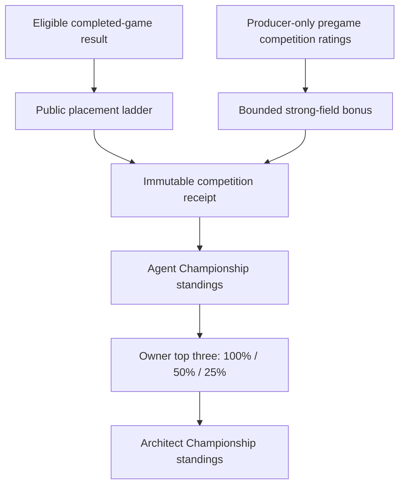
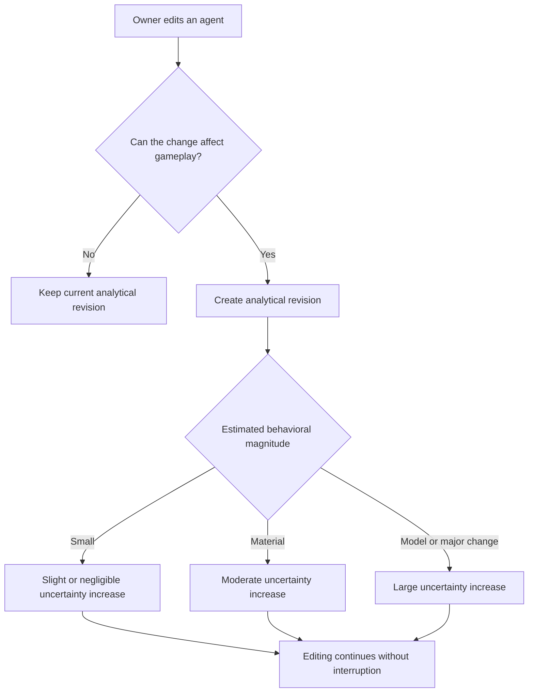
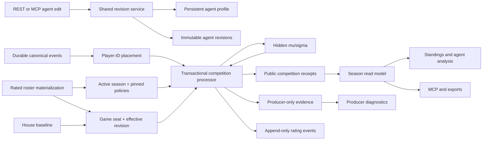
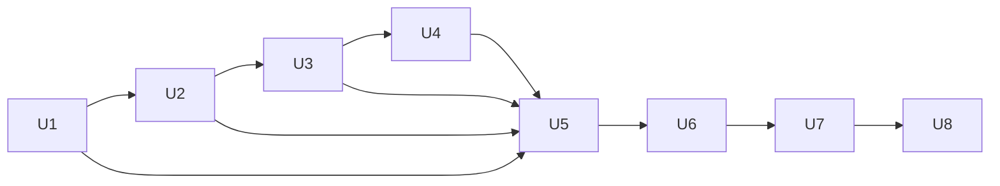

# Dual Crown Season Contracts - Plan

## Goal Capsule

- **Objective:** Implement the Dual Crown season system that crowns Agent and Architect Champions, records explainable championship points, and tracks behaviorally meaningful agent revisions.
- **Product authority:** Canonical completed-game results determine placement and eligibility. The competition ledger interprets those results for season scoring without becoming a second authority for game outcomes.
- **Execution profile:** Code. This contract spans season policy, competition data, owner/admin visibility, agent lineage, and the player-facing standings needed before optimization loops exist.
- **Authority hierarchy:** The Product Contract and its stable R/A/F/AE IDs govern behavior; the Planning Contract governs implementation; canonical completed-game facts remain authoritative for outcomes.
- **Stop conditions:** Stop rather than guess if canonical placement cannot be keyed by player ID, a rated roster violates one-owner-per-seat, a season policy changes after activation, or a public response can expose hidden rating evidence.
- **Open blockers:** None. Policy constants are resolved as versioned v1 defaults and must pass calibration gates before the first season activates.
- **Tail ownership:** The implementation workflow owns schema, code, tests, docs, rollout validation, and cleanup through the Definition of Done.

---

## Product Contract

### Summary

Influence seasons will award a primary Agent Champion title through cumulative public placement points and a parallel Architect Champion title through a weighted top-three agent portfolio.
A producer-only per-agent competition rating will supply bounded strong-field bonuses, while quiet analytical revisions will make behavior-changing edits comparable without interrupting players.

**Product Contract preservation note:** This implementation plan preserves the confirmed Dual Crown requirements, actors, flows, and acceptance examples; planning decisions only resolve previously deferred implementation details.

### Problem Frame

The current free track updates an account-level ELO from relative placement, while agent summaries expose only games, wins, and win rate.
Agent profiles are mutable, meaningful edits reset their aggregate counters, and game seats snapshot some profile and model values without identifying an immutable analytical revision.

That shape cannot support an honest agent championship.
Account rating, agent performance, season achievement, edit lineage, and owner portfolio skill currently overlap without a stable competition record connecting them.
The system also risks discouraging play if seasonal standing can fall, even though frequent games are essential to the product's social and analytical loops.

### Key Decisions

- **The agent is the season's protagonist.** Agent Champion is the primary public title; Architect Champion recognizes the owner without displacing the competing agent.
- **Championship progress is participation-friendly.** Every eligible rated game counts, game results never subtract points, and poor results cost opportunity rather than previously earned standing.
- **Winning receives the defining premium.** Deep placement matters, but a win earns the largest base award and remains the clearest route to the title.
- **Competition quality is a bounded bonus, not a hidden verdict.** Producer-only competition ratings may increase points for a strong field but may not reduce the public placement award for a weak field.
- **Architect Champion rewards excellence plus repeatability.** An owner's top three eligible agents contribute at 100%, 50%, and 25%; all additional agents contribute zero.
- **The two crowns are independent honors.** One owner may win both Agent Champion and Architect Champion in the same season.
- **Revisioning follows gameplay influence.** Any owner edit that can affect decisions, dialogue, or model execution creates an analytical revision; presentation-only edits do not.
- **Revisioning remains invisible to the editing flow.** Influence creates revisions and recalibrates hidden rating confidence automatically, without confirmation modals, warnings, or blocked edits.

### Actors

- A1. **Agent:** The persistent competitor that earns championship points across eligible games and may accumulate multiple analytical revisions.
- A2. **Owner / architect:** Creates and edits agents, enters them into rated games, analyzes their results, and competes for Architect Champion.
- A3. **Player or viewer:** Reads public standings, point receipts, game history, and season records without access to hidden competition ratings.
- A4. **Admin / producer:** Can inspect competition ratings, rating confidence, recalibration decisions, scoring versions, and audit evidence.
- A5. **Competition system:** Determines eligibility, records public points, maintains producer-only competition estimates, and derives both season standings from one ledger.

### Requirements

**Season titles and eligibility**

- R1. Each season must crown one Agent Champion as its primary public competitive title.
- R2. Each season must crown one Architect Champion from the same set of eligible rated-game results.
- R3. Only completed games from the season's declared rated pool may award championship points or affect its crowns.
- R4. A rated game must enforce one owner account per competing seat before it can be eligible for season scoring.
- R5. An owner may win both Agent Champion and Architect Champion in the same season.
- R6. An agent needs no qualification minimum beyond completing at least one eligible rated game.

**Agent Championship scoring**

- R7. Every eligible rated result must count toward the agent's cumulative championship total; there is no best-N window or seasonal game cap.
- R8. An eligible game result must never subtract championship points from the agent's accumulated season total.
- R9. The public base-point ladder must award the winner the largest placement award, then reward progressively deeper placement below the winner.
- R10. An early elimination may award zero base points, but it must not subtract previously earned championship points.
- R11. Placement awards must normalize across supported lobby sizes so equivalent relative finishes remain comparable.
- R12. A game may add a positive, bounded strong-field bonus derived from producer-only pregame competition ratings.
- R13. A weak field must not reduce the public base award or create a negative quality adjustment.
- R14. Each public point receipt must show the placement, base points, labeled strong-field bonus, and total points awarded without exposing hidden ratings or expected-outcome calculations.
- R15. Account matchmaking ELO, hidden per-agent competition rating, seasonal championship points, and career statistics must remain separate concepts with distinct labels and purposes.

**Architect Championship aggregation**

- R16. Architect standing must use the owner's three highest-scoring eligible agents for that season.
- R17. The owner's first, second, and third agents must contribute 100%, 50%, and 25% of their championship points respectively.
- R18. Missing portfolio positions contribute zero, and fourth or later agents contribute nothing to Architect standing.
- R19. Architect scoring must consume the same published agent championship totals without adding another field-quality or volume adjustment.
- R20. Architect standings must show which agents contributed and how their weighted contributions produced the owner total.

**Competition rating and recalibration**

- R21. Influence must maintain a per-agent competition rating used only for matchmaking-quality estimation, strong-field scoring, and producer analysis.
- R22. Competition ratings, expected outcomes, uncertainty, and recalibration magnitude must be unavailable to players and visible only to authorized admins and producers.
- R23. A meaningful revision must inherit the agent's prior rating estimate while increasing uncertainty and adaptation speed in proportion to the likely behavioral change.
- R24. Recalibration must meter confidence rather than directly moving the inherited rating solely because an edit occurred.
- R25. Revision distance must use reproducible behavioral change categories; semantic distance or an LLM may advise ambiguous classification but must not be the sole unauditable authority that changes rating state.
- R26. Producer evidence must identify the revision comparison, assigned change magnitude, rating state before recalibration, and the policy version used.

**Agent revisions and player experience**

- R27. An analytical revision must begin whenever an owner edit changes any effective input that can affect the agent's decisions, dialogue, or model execution.
- R28. An edit that cannot affect gameplay, such as replacing only an avatar, must remain part of the current analytical revision.
- R29. Small behavior-affecting edits must still create a revision snapshot even when their rating-confidence adjustment is negligible.
- R30. Model, provider, reasoning-policy, or other execution changes that can materially alter behavior must create a revision with stronger recalibration than a small text edit.
- R31. Revision creation must not block, delay, warn, or require confirmation during normal agent editing.
- R32. Players may inspect revision-separated performance only through deliberate analytics drill-down; routine agent management and standings must not foreground revision mechanics.
- R33. Player-facing rules or documentation must briefly explain that behavior-changing edits create analytical comparison points without describing hidden rating or recalibration internals.

**Competition ledger and data access**

- R34. Every eligible result must create an immutable competition receipt that identifies the season, game, owner, agent, analytical revision, placement, base points, field bonus, total points, eligibility decision, and scoring-policy version.
- R35. The private side of the competition receipt must preserve enough pregame rating and policy evidence for an admin or producer to audit the field bonus and recalibration behavior.
- R36. Public standings, agent history, MCP reads, exports, and the season archive must derive season totals from the same competition receipts.
- R37. Public and owner-facing analysis must support season, rated/unrated, lifetime, and revision slices without treating the hidden competition rating as a player statistic.
- R38. The system must preserve sample size, game count, wins, placements, and contributing-game links alongside championship totals so players can distinguish volume from efficiency.

### Season Scoring Shape

The public path remains placement-first.
Hidden competition estimates may add a bounded bonus, but they do not replace the public result or create a second title score.

### Revision Boundary

### Key Flows

- F1. Eligible game completion and point award
  - **Trigger:** A game in the declared rated pool completes with canonical results and an eligible one-owner-per-seat roster.
  - **Actors:** A1, A2, A4, A5
  - **Steps:** The competition system reads canonical placement; calculates public base points; calculates any bounded strong-field bonus from pregame competition estimates; records one immutable receipt; updates agent and architect standings.
  - **Outcome:** Public surfaces can explain the awarded points while producers can audit the private calculation inputs.

- F2. Agent edit and analytical revision
  - **Trigger:** An owner saves changes to an existing agent.
  - **Actors:** A1, A2, A4, A5
  - **Steps:** The system compares the previous and new effective gameplay inputs; keeps the current revision for presentation-only changes or creates a new revision for behavior-affecting changes; assigns a hidden change magnitude; carries the rating estimate forward with metered uncertainty.
  - **Outcome:** The edit completes normally, later games identify the effective revision, and analysis can compare results before and after the change.

- F3. Season close and Dual Crown publication
  - **Trigger:** The season reaches its declared closing boundary and all eligible results are settled.
  - **Actors:** A1, A2, A3, A5
  - **Steps:** The system freezes the receipt set and scoring policy; ranks agents by championship points; weights each owner's top three agents at 100%, 50%, and 25%; publishes both champions and their contributing public records.
  - **Outcome:** The season permanently records an Agent Champion and Architect Champion, including a valid same-owner sweep.

### Acceptance Examples

- AE1. **Cumulative participation.** Given two agents with different game volumes, when standings are calculated, then every eligible result contributes and the higher-volume agent may lead even when the lower-volume agent has a better win rate; both volume and efficiency remain visible in analysis. Covers R7, R36, R38.
- AE2. **Win premium.** Given equal lobby size and field quality, when one agent wins and another reaches the finale without winning, then the winner receives the larger base award for that game. Covers R9.
- AE3. **Early elimination.** Given an agent is eliminated early after earning points in prior games, when the result is scored, then the game may add zero points but cannot reduce the accumulated season total. Covers R8, R10.
- AE4. **Strong field.** Given equivalent first-place results in two games, when one lobby has materially stronger pregame competition estimates, then that win may receive a bounded positive field bonus while both wins retain the same public base award. Covers R12-R14.
- AE5. **Weak field.** Given a completed eligible game whose field is below the neutral competition baseline, when points are awarded, then the placement still earns its full public base amount and receives no negative quality adjustment. Covers R13.
- AE6. **Architect excellence over raw breadth.** Given one owner has a single 100-point agent and another has three 45-point agents, when Architect standing is calculated, then the first owner has 100 points and the second has 78.75 points. Covers R16-R19.
- AE7. **Dual Crown sweep.** Given the Agent Champion's owner also has the highest weighted top-three portfolio, when the season closes, then that owner receives Architect Champion as well. Covers R5.
- AE8. **Presentation-only edit.** Given an owner changes only an agent's avatar, when the edit is saved, then no analytical revision or rating recalibration occurs and no warning appears. Covers R28, R31.
- AE9. **Small behavioral edit.** Given an owner makes a small prompt change that can affect dialogue, when the edit is saved, then a new analytical revision is recorded with slight or negligible hidden uncertainty adjustment and the edit flow remains uninterrupted. Covers R23-R25, R27, R29, R31.
- AE10. **Material execution edit.** Given an agent changes model or provider, when the edit is saved, then a new analytical revision inherits the prior rating estimate with a larger hidden uncertainty adjustment and faster adaptation. Covers R23, R24, R30.
- AE11. **Public scoring receipt.** Given a player opens a rated result, when its points are shown, then the player sees placement, base points, strong-field bonus, and total points but cannot read or reconstruct the raw competition ratings. Covers R14, R22, R34, R35.
- AE12. **Cross-surface consistency.** Given the same season is read through web standings, MCP, and export, when totals are compared, then each surface returns totals derived from the same competition receipts and policy version. Covers R34-R37.

### Success Criteria

- Players can understand why each public result earned its visible points without learning the hidden competition ratings.
- Playing another eligible game can improve or leave unchanged championship standing, but the game result itself cannot reduce accumulated championship points.
- Wins remain the most valuable single-game outcome while consistent deep placement and game volume remain viable paths to contention.
- Architect standing rewards one excellent agent first, then adds diminishing credit for a second and third strong agent without rewarding unlimited agent creation.
- Owners can edit agents without new friction while later analysis can compare every behaviorally distinct runtime revision.
- Admins and producers can reproduce every field bonus, revision classification, and competition-rating recalibration from versioned evidence.
- Every public and owner-facing season surface derives from one immutable competition ledger.

### Scope Boundaries

**In scope**

- Agent Champion and Architect Champion subjects, eligibility, and aggregation policy.
- Participation-friendly public placement scoring with a hidden strong-field input.
- Producer-only per-agent competition rating and revision-triggered confidence recalibration.
- Quiet analytical revision identity and revision-separated analysis.
- Competition receipts and the data needed for standings, audits, exports, and later player analysis.

**Deferred or out of scope**

- Automated agent coaching, prompt rewriting, update recommendations, or optimization loops.
- Public or owner access to raw competition ratings, expected outcomes, uncertainty, or recalibration magnitude.
- Blocking warnings, confirmation modals, or edit restrictions tied to revisions.
- Behavioral side awards such as Power Player, Jury Favorite, or Most Improved.
- Full metric and dossier design beyond the competition and revision facts required by this contract.
- Automated historical championship-point reconstruction for games played before the first activated season.

### Dependencies / Assumptions

- Canonical completed-game results remain the authority for placement, winner, roster, and completion state.
- The rated pool continues to enforce one queued seat per owner and must enforce that invariant at every rated join boundary.
- The current account-level ELO path remains separate until this contract deliberately replaces or retires it.
- A per-agent free-track rating table exists, but current TypeScript rating and leaderboard paths still use account records; planning must establish one unambiguous hidden competition-rating authority.
- Game seats currently snapshot persona and model configuration but do not identify an analytical revision.
- Current profile management resets games and wins after several identity-field edits; revision history must replace that lossy behavior rather than add another reset rule.
- Revision fingerprints must describe the inputs the runtime actually consumes. The current runtime path does not consistently apply every stored personality, strategy, or backstory field, so effective-input alignment is a prerequisite for trustworthy revision comparisons.
- Numeric point and recalibration constants should be calibrated against representative lobby sizes and simulated season distributions without changing the confirmed product rules.

### Sources / Research

- `docs/ideation/2026-07-10-influence-season-crown-data-foundation-ideation.html` establishes the Dual Crown, Three Ledgers, Competition Ledger, Agent Passport, and player-owned data direction.
- `packages/api/src/services/elo.ts` defines the current account-level, placement-based free-track ELO calculation.
- `packages/api/src/services/game-lifecycle.ts` shows current free-track rating updates and agent aggregate updates at game completion.
- `packages/api/src/db/schema.ts` defines users, agent profiles, game-player snapshots, the one-entry-per-user free queue, and the currently unused per-agent free-track rating table.
- `packages/api/src/routes/free-queue.ts` defines the current one-agent-per-user queue behavior and account-level public ELO leaderboard.
- `packages/api/src/services/agent-profile-management.ts` and `packages/api/src/routes/agent-profiles.ts` define current edit-triggered aggregate resets.
- `packages/engine/src/postgame-analysis.ts` defines the existing placement, voting, power, risk, jury, alliance, player-shape, diagnostic, and evidence facts available for later dossiers.
- [Formula 1 Constructors' Championship guide](https://www.formula1.com/en/latest/article/the-beginners-guide-to-the-f1-constructors-championship.66nTfWSqrUYv3bnbosPkHV) provides the performer-versus-builder precedent behind parallel Agent and Architect titles.
- [TrueSkill research](https://www.microsoft.com/en-us/research/publication/trueskilltm-a-bayesian-skill-rating-system/) supports a multiplayer skill estimate with explicit uncertainty rather than a single pairwise ELO number.
- [OpenSkill documentation](https://openskill.me/en/v6.0.2/manual.html) documents the maintained TypeScript-compatible Weng-Lin models used for ranked multiplayer updates.

---

## Planning Contract

### Confirmed Planning Decisions

- Championship points remain attached to the persistent agent across analytical revisions. Revision filters explain performance changes but never partition or erase title standing.
- Rated daily games may include House agents. House seats count toward placement and use the policy's fixed baseline rating for field calculations, but they never receive receipts, rating state, points, or title eligibility.
- Season competition data begins prospectively. Existing completed games remain career history; no season points or hidden rating history will be fabricated without pregame evidence.
- The first delivery covers the competition and revision spine plus its core player analysis. Broader behavioral dossiers and automated coaching remain outside this plan.

### Key Technical Decisions

- KTD1. **Create a new season domain instead of reviving `free_track_ratings`.** The legacy table is stale after the account-ELO migration and has no active TypeScript authority. New tables will make season, revision, rating, and receipt semantics explicit while existing `users.rating` continues as a separate free-track account rating until deliberately retired.
- KTD2. **Assign the season and pinned policy versions when a rated game roster is materialized.** `games.season_id` is immutable after the game starts, so a match that crosses a calendar boundary belongs to the season that admitted it. A closing season stops admitting games and finalizes only after every assigned game is terminal and competition processing is settled.
- KTD3. **Use canonical player-ID placement.** Extend the completed-game result path to expose the canonical ranked player IDs produced from durable events. Do not score from display names or infer every non-winner as last place; duplicate names and mixed human/House rosters make both shortcuts dishonest.
- KTD4. **Use versioned pure policies for scoring, rating, and revision magnitude.** Policy functions accept explicit inputs and return public output plus private evidence. Seasons pin policy versions, receipts store those versions, and replay tests prove a historical receipt without reading mutable current configuration.
- KTD5. **Adopt OpenSkill's Plackett-Luce/Weng-Lin model for hidden multiplayer ratings.** Store `mu` and `sigma` per persistent agent. Each seat is a one-agent team ranked by canonical placement; House seats enter calculations at the fixed initial distribution and discard their updates. This fits ranked multiplayer games and makes metered uncertainty a first-class value.
- KTD6. **Treat revisions as immutable effective-runtime snapshots.** The fingerprint includes the profile behavior fields and resolved execution inputs actually passed into `InfluenceAgent`: archetype/personality prompt, backstory, strategy instructions, model, provider profile, catalog entry, reasoning policy, tool-choice mode, and temperature. Profile create/edit and the initial backfill resolve the current free-track execution policy through the same service used at roster admission; avatar URL and other presentation fields are excluded.
- KTD7. **Classify revision magnitude deterministically.** Presentation-only changes reuse the current revision. A single low-distance text edit is `small`; a persona-key change, multiple behavior fields, or high text distance is `material`; model/provider/reasoning/tool-policy changes are `execution`. An LLM may emit producer diagnostics for ambiguous cases later, but v1 state changes depend only on the reproducible classifier.
- KTD8. **Recalibrate uncertainty without changing inherited skill.** A new revision copies `mu` and widens `sigma` with a policy-defined variance addition capped at the initial sigma. V1 additions are 10% of initial sigma for `small`, 35% for `material`, and 60% for `execution`; the OpenSkill game update then adapts the estimate at the resulting confidence level.
- KTD9. **Make competition completion one idempotent transaction.** The existing completion transaction will call a focused competition service after canonical results are available. Unique game/season/agent keys prevent duplicate receipts and rating events during retries or recovery; any competition write failure rolls back completion rather than publishing a partially scored rated game.
- KTD10. **Separate public receipts from producer evidence physically.** Public receipt rows hold eligibility, placement, base points, labeled bonus, total, revision identity, and policy versions. A one-to-one evidence table holds pre/post `mu` and `sigma`, opponent snapshots, classifier inputs, and calculations behind producer authorization.
- KTD11. **Derive every surface from one read model.** Public standings, owner agent-season views, game receipts, MCP tools, JSON/CSV exports, and final archives consume the receipt ledger. Producer diagnostics join the evidence tables through an explicit producer-only read model; they never extend a public row with optional secret fields.
- KTD12. **Keep career counters cumulative and repairable.** Profile edits stop zeroing games and wins. The migration recomputes lifetime counts from completed games, while season/revision analytics use immutable receipts rather than mutable counters.
- KTD13. **Separate producer observation from season mutation.** Existing `view_admin` and MCP `producer` access may inspect hidden evidence. A new `manage_seasons` permission is required to activate, close, or finalize a season; no endpoint permits arbitrary receipt or rating edits.

### Version 1 Policy Constants

These constants are code-owned, covered by calibration fixtures, and pinned by version string. Changing one creates a new policy version; it does not rewrite an active or final season.

- **Base placement:** winner = 100. For non-winners in an `N`-seat lobby at placement `p`, `round(50 * ((N - p) / (N - 1))^2)`, clamped to `0...50`. This makes a win worth at least twice the next possible base award while normalizing all supported lobby sizes.
- **Strong-field bonus:** calculate the mean pregame conservative rating `mu - 3*sigma` of all opponents, including House baselines. `bonusRate = clamp(meanConservative / 100, 0, 0.20)` and `fieldBonus = round(basePoints * bonusRate)`. The bonus is always `0...20`, and a zero-point finish cannot gain points through field quality.
- **Initial hidden rating:** OpenSkill defaults (`mu = 25`, `sigma = 25/3`) under policy `competition-rating-v1`. House seats always use this baseline and do not persist updates.
- **Architect aggregation:** sort an owner's eligible agent totals descending with stable agent-ID tie-breaking, then apply `1.00`, `0.50`, and `0.25`. Store points in integer hundredths so half and quarter contributions are exact.
- **Champion tie-breaks:** Agent standings sort by total points, wins, runner-up finishes, average normalized placement, earliest time the tied total was reached, then stable agent ID. Architect standings sort by weighted total, wins from contributing agents, the first-slot agent total, earliest time the tied total was reached, then stable owner ID. Public rules disclose every competitive tie-break before the stable-ID fallback.
- **Revision text distance:** canonicalize whitespace and case, then combine normalized edit distance and token-set distance. One changed behavior text field below `0.15` is `small`; two or more changed behavior fields, a persona-key change, or any distance at or above `0.35` is `material`; values between the thresholds are `material` to fail toward faster adaptation.

### High-Level Technical Design

### Data Model

- `seasons`: identity, slug/name, rated pool, `draft|active|closing|final` status, admission boundaries, finalization time, and pinned scoring/rating/revision policy versions. A partial unique index permits only one active season for the free rated pool.
- `agent_revisions`: immutable per-agent ordinal, prior revision, trigger, deterministic fingerprint, magnitude, canonical behavior snapshot, effective runtime snapshot, policy version, and timestamps. Unique `(agent_profile_id, ordinal)` and `(agent_profile_id, fingerprint)` constraints make creation idempotent.
- `games.season_id`: nullable for unrated and legacy games; set during rated draw/materialization and immutable after start.
- `game_players.agent_revision_id`: nullable for legacy seats; required by readiness validation for owned seats in an active season.
- `agent_competition_ratings`: current `mu`, `sigma`, policy version, effective revision, game count, and update time. This is producer-only operational state.
- `competition_rating_events`: append-only initialization, revision-recalibration, and game-result transitions with before/after values and unique idempotency keys.
- `competition_receipts`: one row per season/game/owned agent, including owner snapshot, agent/revision identity, lobby size, placement, base/bonus/total points, eligibility status/reason, scoring version, and created time. Ineligible rows carry zero points and remain auditable; standings select only eligible rows.
- `competition_receipt_evidence`: one-to-one private rating field, opponent distributions, conservative-strength calculation, pre/post state, and policy inputs.
- `season_honors`: immutable final Agent and Architect champions with display-name snapshots and Architect contribution breakdown, generated only from final receipt totals during season finalization.

### Season and Completion State Rules

1. Draft seasons may be configured and calibrated but admit no games.
2. Activating a season requires known policy versions, completed initial-revision backfill, no other active season for the rated pool, and successful dry-run calibration.
3. Free-game draw binds the game to the active season and snapshots the applicable agent revision for each owned seat. If no season is active, the game can run but is explicitly unrated for championship purposes.
4. Generic join rejects a second seat for the same owner when the target game is season-rated. Readiness revalidates the invariant so alternate write paths cannot bypass it.
5. Completion derives all placements by player ID, evaluates eligibility, locks rating rows in stable agent-ID order, writes receipts/evidence/events, and updates rating state in the same transaction as the terminal game result.
6. A completed game without a canonical winner and total player-ID ranking records zero-point ineligible receipts and does not update competition ratings. Producers receive the diagnostic; the service does not invent placements.
7. Moving a season to `closing` stops admission but permits assigned games to complete. Finalization fails closed while any assigned game is non-terminal or lacks a settled eligibility record.
8. Finalization applies the published tie-breaks, writes `season_honors`, moves the season to `final`, and leaves receipts immutable. Corrections require a new explicit policy/audit workflow outside this plan, not direct row edits.

### Public and Private Read Boundaries

- Public reads expose season identity/status, Agent and Architect standings, contributing agents, game links, placements, base/bonus/total points, sample sizes, wins, and revision labels only inside deliberate agent analytics.
- Owner reads add their agents' revision-separated summaries and JSON/CSV data export, but not hidden rating values, expected outcomes, evidence payloads, or recalibration categories.
- Producer REST and MCP reads expose current rating state, event history, receipt evidence, revision classifier inputs, and season readiness/finalization diagnostics behind existing `view_admin`/`producer` gates.
- Public types and SQL projections must enumerate allowed columns. No `select *`, optional `producerEvidence`, or caller-provided visibility flag may cross the trust boundary.

### Implementation Sequence

U1 establishes deterministic policies and calibration fixtures. U2 adds durable storage. U3 makes effective revisions trustworthy before any rated seat can reference them. U4 binds seasons and revisions at roster admission. U5 adds transactional scoring and rating updates. U6 exposes one authorized read model. U7 builds player surfaces after response contracts stabilize. U8 adds producer operations, documentation, and rollout gates.

### System-Wide Impact

- **Data lifecycle:** Agent revisions, receipts, rating events, and final honors are append-only. Current rating state is auditable against ordered before/after events, and mutable profile fields are not historical authority.
- **Transactions:** Rated completion becomes stricter. A competition failure prevents terminal publication, which favors ledger integrity over silently losing points.
- **Recovery:** Completion retries reuse unique idempotency keys. Startup recovery must not double-apply rating changes or counters.
- **Authorization:** Existing `games:read` and `agents:read` scopes receive player-safe season facts. `producer` and `view_admin` are the only paths to rating evidence.
- **Performance:** Standings query indexed receipts and aggregate at read time; season finalization snapshots only champions, not an alternative totals ledger. Add explain-plan checks for season/agent and season/owner indexes using representative data.
- **Agent parity:** REST and MCP mutations share the same profile/revision service, and all owner-readable season facts have MCP equivalents in the first release.
- **Runtime behavior:** The free-game runtime must consume the same profile and execution inputs that the revision snapshot fingerprints. Fixing this mismatch can change agent behavior and therefore requires simulation regression coverage.

### Risks and Mitigations

- **Scoring feels grindy or opaque:** retain the win-dominant base formula, cap quality at 20%, display volume and efficiency together, and run seeded season simulations before activation.
- **Hidden rating leaks through a convenient shared type:** use separate public/evidence tables, separate read-model return types, negative serialization tests, and producer-only tools.
- **Completion deadlocks while locking several ratings:** sort agent IDs before row locks and keep rating calculation pure outside database round trips.
- **Revision churn from harmless normalization:** canonicalize behavior inputs before hashing, reuse an existing fingerprint, and exclude presentation fields.
- **System-wide model changes create many revisions:** revisions materialize lazily at rated roster admission, not in a global fan-out job.
- **Legacy counters are already lossy:** recompute career games/wins from completed game/player/result rows, but do not pretend historical revision or placement evidence exists when canonical events are unavailable.
- **OpenSkill package drift:** pin the dependency in `packages/api/package.json`, wrap it behind the policy module, and preserve input/output fixtures so a future library update is explicit.

### Rollout and Migration Strategy

1. Deploy additive schema and code with no active season. Existing account ELO and free games continue unchanged.
2. Run an idempotent backfill that resolves the deployment's current free-track execution policy, creates complete initial agent revisions, and recomputes lifetime profile counters. The script reports counts and refuses activation when owned profiles lack an effective revision.
3. Seed a draft season with v1 policies. Run calibration and a dry-run completion against representative four-, eight-, and twelve-seat rosters containing new, established, and House agents.
4. Verify public REST/MCP/export payloads contain no producer evidence and producer reads reproduce fixture receipts.
5. Activate the season. From that point, newly drawn free games bind to it; legacy games remain outside the championship ledger.
6. Observe receipt creation failures, duplicate-conflict counts, rating sigma distribution, bonus distribution, and completion latency. Rollback means closing/deactivating admission, not deleting receipts or rewinding completed ratings by hand.

---

## Implementation Units

### U1. Versioned scoring, rating, and revision policies

- **Goal:** Implement deterministic policy functions and a calibration harness before any persistence or UI depends on their outputs.
- **Requirements:** R7-R19, R21-R25; AE1-AE6, AE9-AE10.
- **Dependencies:** None.
- **Files:**
  - Create `packages/api/src/services/season-policy.ts`
  - Create `packages/api/src/services/revision-policy.ts`
  - Create `packages/api/src/scripts/calibrate-season-policy.ts`
  - Create `packages/api/src/__tests__/season-policy.test.ts`
  - Create `packages/api/src/__tests__/revision-policy.test.ts`
  - Modify `packages/api/package.json`
  - Modify `bun.lock`
- **Approach:** Wrap pinned OpenSkill calls behind typed `competition-rating-v1` functions. Implement placement, strong-field, Architect, fingerprint, magnitude, and sigma-widening policies as pure functions with serializable evidence. The calibration script uses a fixed seed and emits distributions for supported lobby sizes, game volumes, field strengths, and owner portfolios.
- **Test scenarios:** Winner premium at every supported lobby size; monotonic non-negative placements; weak-field zero bonus; bonus cap; zero-base cannot gain a bonus; exact 100/50/25 aggregation; stable tie-breaks; avatar exclusion; whitespace-only normalization; small/material/execution classification; unchanged `mu` with bounded sigma widening; identical seeded OpenSkill results.
- **Verification:** `bun test packages/api/src/__tests__/season-policy.test.ts packages/api/src/__tests__/revision-policy.test.ts` and `bun run packages/api/src/scripts/calibrate-season-policy.ts --seed dual-crown-v1`.

### U2. Additive competition schema and safe backfill

- **Goal:** Add the season, revision, receipt, evidence, rating, event, and honor records without repurposing legacy rating rows.
- **Requirements:** R1-R6, R15, R21-R26, R34-R38; F3.
- **Dependencies:** U1 policy shapes are stable.
- **Files:**
  - Modify `packages/api/src/db/schema.ts`
  - Create `packages/api/drizzle/0030_dual_crown_seasons.sql`
  - Modify `packages/api/drizzle/meta/_journal.json`
  - Create `packages/api/src/scripts/backfill-agent-revisions.ts`
  - Modify `packages/api/src/__tests__/test-utils.ts`
  - Create `packages/api/src/__tests__/season-schema.test.ts`
- **Approach:** Add foreign keys, checks, uniqueness, and read-path indexes described in the Data Model. Keep legacy foreign keys nullable. The idempotent backfill resolves the current free-track runtime selection, creates one complete effective revision per existing profile, and recomputes career games/wins only from completed game rows; it never creates historical receipts or ratings.
- **Test scenarios:** Fresh migration; migration over profiles with prior counter resets; rerun-safe backfill; one active season per pool; immutable receipt uniqueness; separate evidence access; nullable legacy seat references; cascade/restrict behavior preserves audit history.
- **Verification:** `bun test packages/api/src/__tests__/season-schema.test.ts` followed by `bun run test:db` with real local Postgres visibility.

### U3. Shared profile mutation and effective analytical revisions

- **Goal:** Replace lossy edit resets with quiet immutable revisions shared by REST and MCP, and align revision fingerprints with actual runtime inputs.
- **Requirements:** R23-R33; F2; AE8-AE10.
- **Dependencies:** U1, U2.
- **Files:**
  - Modify `packages/api/src/services/agent-profile-management.ts`
  - Modify `packages/api/src/routes/agent-profiles.ts`
  - Create `packages/api/src/services/agent-revisions.ts`
  - Modify `packages/api/src/services/queue-enrollment.ts`
  - Modify `packages/api/src/services/game-lifecycle.ts`
  - Modify `packages/engine/src/agent.ts`
  - Modify `packages/api/src/__tests__/agent-profile-management.test.ts`
  - Modify `packages/api/src/__tests__/agent-profiles.test.ts`
  - Create `packages/api/src/__tests__/agent-revisions.test.ts`
  - Modify `packages/api/src/__tests__/game-lifecycle-config.test.ts`
- **Approach:** Route REST create/update through the management service used by MCP. In one transaction, save profile changes, preserve career counters, and create or reuse a canonical revision. Build the runtime agent from the same effective snapshot stored on the seat, including backstory and strategy inputs currently ignored; materialize a lazy execution revision when global model policy changes.
- **Test scenarios:** REST/MCP parity; avatar-only edit creates no revision; behavior edit creates one revision without warnings; repeated identical save is idempotent; counters remain cumulative; model/provider/reasoning change creates execution revision; runtime prompt/config equals fingerprinted snapshot; concurrent saves produce ordered revisions.
- **Verification:** `bun test packages/api/src/__tests__/agent-profile-management.test.ts packages/api/src/__tests__/agent-profiles.test.ts packages/api/src/__tests__/agent-revisions.test.ts packages/api/src/__tests__/game-lifecycle-config.test.ts`.

### U4. Season admission, rated roster invariants, and finalization state

- **Goal:** Bind each rated game to an active season and a trustworthy revision while keeping custom/public games unrated.
- **Requirements:** R1-R6, R15, R27, R30; F1, F3.
- **Dependencies:** U2, U3.
- **Files:**
  - Create `packages/api/src/services/seasons.ts`
  - Modify `packages/api/src/routes/free-queue.ts`
  - Modify `packages/api/src/routes/games.ts`
  - Modify `packages/api/src/services/queue-enrollment.ts`
  - Modify `packages/api/src/services/game-lifecycle.ts`
  - Create `packages/api/src/__tests__/seasons.test.ts`
  - Create `packages/api/src/__tests__/free-queue.test.ts`
  - Modify `packages/api/src/__tests__/games-api.test.ts`
- **Approach:** Add draft/activate/close/finalize service commands and rated readiness validation. Bind season/policies/revisions during free draw. Reject duplicate owner seats on all season-rated joins and recheck before start. Represent no-active-season games as explicitly unrated; do not infer rated status from public visibility.
- **Test scenarios:** One-owner-per-rated-seat through queue and generic join; multiple agents allowed in unrated custom games; House-filled rated roster; no-active-season behavior; boundary-crossing game remains in admitted season; closing rejects new admission; finalization waits for assigned games and settled competition rows.
- **Verification:** `bun test packages/api/src/__tests__/seasons.test.ts packages/api/src/__tests__/free-queue.test.ts packages/api/src/__tests__/games-api.test.ts`.

### U5. Canonical placement and transactional competition processing

- **Goal:** Produce exactly-once receipts, evidence, rating updates, and career counts from canonical completed results.
- **Requirements:** R3-R15, R21-R26, R34-R38; F1; AE1-AE5, AE11-AE12.
- **Dependencies:** U1-U4.
- **Files:**
  - Modify `packages/engine/src/game-runner.ts`
  - Modify `packages/engine/src/completed-game-results.ts`
  - Modify `packages/engine/src/index.ts`
  - Create `packages/api/src/services/competition-completion.ts`
  - Modify `packages/api/src/services/game-lifecycle.ts`
  - Modify `packages/api/src/services/postgame-analysis.ts`
  - Create `packages/api/src/__tests__/competition-completion.test.ts`
  - Modify `packages/api/src/__tests__/game-lifecycle.test.ts`
  - Modify `packages/engine/src/__tests__/completed-game-results.test.ts`
  - Modify `packages/api/src/__tests__/postgame-analysis.test.ts`
- **Approach:** Carry player-ID elimination/rank data from engine completion into persistence, then process owned and House seats in one ranked OpenSkill update. Lock ratings in stable order, write public/private records and event transitions, and update mutable current state only after immutable events are ready. Replace the current name-based/account-human placement shortcut, persist the rating delta needed by postgame summaries, and allow the legacy account-ELO update only after the same rated-roster eligibility check succeeds.
- **Test scenarios:** Duplicate names; four/eight/twelve seats; House agents beating or losing to owned agents; ties/draw policy; strong and weak fields; ineligible duplicate-owner roster records zero-point decisions; retry after partial failure; recovery rerun; concurrent completions sharing agents; postgame rating delta provenance; no partial completed game on competition failure.
- **Verification:** `bun test packages/engine/src/__tests__/completed-game-results.test.ts packages/api/src/__tests__/competition-completion.test.ts packages/api/src/__tests__/game-lifecycle.test.ts packages/api/src/__tests__/postgame-analysis.test.ts`, then `bun run test:db`.

### U6. Unified season read model, REST, MCP, and exports

- **Goal:** Give every public/owner surface the same receipt-derived totals while preserving the producer-only boundary.
- **Requirements:** R14-R15, R20-R22, R26, R32, R34-R38; AE11-AE12.
- **Dependencies:** U5.
- **Files:**
  - Create `packages/api/src/services/season-read-model.ts`
  - Create `packages/api/src/routes/seasons.ts`
  - Modify `packages/api/src/routes/games.ts`
  - Modify `packages/api/src/game-mcp/read-model.ts`
  - Modify `packages/api/src/game-mcp/server.ts`
  - Create `packages/api/src/__tests__/season-read-model.test.ts`
  - Create `packages/api/src/__tests__/season-routes.test.ts`
  - Modify `packages/api/src/__tests__/production-game-mcp-read-model.test.ts`
  - Modify `packages/api/src/__tests__/production-game-mcp-server.test.ts`
- **Approach:** Implement typed queries for season metadata, Agent standings, Architect standings/contributions, agent-season detail, game receipts, archive, and bounded JSON/CSV export. Add owner-safe MCP tools under existing read scopes and producer-only diagnostic tools under `producer`. Escape CSV fields correctly and neutralize spreadsheet-formula prefixes in player-controlled names. Repair player history so unavailable placement is nullable/diagnosed rather than falsely reported as last.
- **Test scenarios:** Cross-surface total equality; stable pagination/ties; season/rated/lifetime/revision filters; owner authorization; export row limits; CSV quoting and spreadsheet-formula neutralization; CSV/JSON parity; finalized archive name snapshots; explicit denial and negative serialization assertions for `mu`, `sigma`, expected outcome, opponent evidence, and revision magnitude.
- **Verification:** `bun test packages/api/src/__tests__/season-read-model.test.ts packages/api/src/__tests__/season-routes.test.ts packages/api/src/__tests__/production-game-mcp-read-model.test.ts packages/api/src/__tests__/production-game-mcp-server.test.ts packages/api/src/__tests__/games-api.test.ts`.

### U7. Player-facing standings, receipts, and agent season analysis

- **Goal:** Make the Dual Crown understandable without exposing or foregrounding hidden machinery.
- **Requirements:** R1-R20, R31-R33, R36-R38; F1-F3; AE1-AE8, AE11-AE12.
- **Dependencies:** U6 response contracts.
- **Files:**
  - Modify `packages/web/src/lib/api.ts`
  - Modify `packages/web/src/app/games/free/free-game-content.tsx`
  - Modify `packages/web/src/app/dashboard/agents/agent-list.tsx`
  - Create `packages/web/src/app/dashboard/agents/[id]/page.tsx`
  - Create `packages/web/src/app/dashboard/agents/[id]/agent-season-analysis.tsx`
  - Modify `packages/web/src/app/games/[slug]/components/completed-game-entry.tsx`
  - Create `packages/web/src/__tests__/season-standings.test.tsx`
  - Create `packages/web/src/__tests__/agent-season-analysis.test.tsx`
  - Modify `packages/web/src/__tests__/completed-game-entry.test.tsx`
- **Approach:** Replace the free page's primary account-ELO table with a season selector and Agent/Architect tabs while retaining clearly labeled account rating where still useful. Give active and archived seasons stable URLs, and link standings, agent cards, and completed games into receipt-derived analysis. Show base/bonus/total, games, wins, placement distribution, and contributing games; place revision comparison behind deliberate drill-down with no edit warnings.
- **Test scenarios:** Loading/error/empty/draft/active/final states; active/archive season navigation and stable URLs; Agent/Architect tab keyboard behavior; exact weighted contribution display; same-owner sweep; no-bonus receipt; revision drill-down opt-in; responsive tables/cards; links to source games; no hidden fields or recalibration copy; accessible labels for ranks and point breakdowns.
- **Verification:** `bun test packages/web/src/__tests__/season-standings.test.tsx packages/web/src/__tests__/agent-season-analysis.test.tsx packages/web/src/__tests__/completed-game-entry.test.tsx` plus browser verification of `/games/free`, `/dashboard/agents/:id`, and a completed rated game at mobile and desktop widths.

### U8. Producer operations, documentation, and controlled activation

- **Goal:** Give producers enough evidence and controls to activate, audit, close, and finalize a season safely.
- **Requirements:** R21-R26, R33-R38; F3; AE12.
- **Dependencies:** U1-U7.
- **Files:**
  - Modify `packages/api/src/routes/admin.ts`
  - Modify `packages/web/src/app/admin/admin-tabs.tsx`
  - Create `packages/web/src/app/admin/season-admin-panel.tsx`
  - Modify `packages/api/src/__tests__/admin-routes.test.ts`
  - Create `packages/web/src/__tests__/season-admin-panel.test.tsx`
  - Modify `packages/web/src/app/rules/page.tsx`
  - Modify `packages/web/src/app/about/page.tsx`
  - Modify `packages/web/src/app/dashboard/profile/profile-content.tsx`
  - Modify `README.md`
  - Modify `DEVELOPMENT.md`
  - Modify `CONCEPTS.md`
- **Approach:** Add producer views for season readiness, policy versions, hidden rating state/events, revision evidence, receipt reproduction, and lifecycle controls. Document rated/unrated semantics, separate ledgers, quiet revisions, and activation/backfill commands. Keep raw evidence out of public pages and ordinary agent editing.
- **Test scenarios:** `view_admin` read versus lifecycle-management permission; non-admin denial; activation preflight failures; receipt reproduction; close/finalize idempotency; stale rules copy removed; player docs contain only the small revision note; admin UI exposes evidence without offering arbitrary ledger mutation.
- **Verification:** `bun test packages/api/src/__tests__/admin-routes.test.ts packages/web/src/__tests__/season-admin-panel.test.tsx packages/web/src/__tests__/free-queue-rebrand.test.ts`, then perform a local draft-to-final season smoke with producer and player accounts.

---

## Verification Contract

### Required Gates

| Gate | Command or check | Proves |
|---|---|---|
| Policy and revision unit tests | `bun test packages/api/src/__tests__/season-policy.test.ts packages/api/src/__tests__/revision-policy.test.ts` | V1 formulas, caps, deterministic classification, and uncertainty behavior. |
| Engine and completion integration | `bun test packages/engine/src/__tests__/completed-game-results.test.ts packages/api/src/__tests__/competition-completion.test.ts packages/api/src/__tests__/game-lifecycle.test.ts` | Canonical placement, mixed rosters, transactional exactly-once processing, and recovery. |
| API/MCP/auth parity | `bun test packages/api/src/__tests__/season-read-model.test.ts packages/api/src/__tests__/season-routes.test.ts packages/api/src/__tests__/production-game-mcp-read-model.test.ts packages/api/src/__tests__/production-game-mcp-server.test.ts packages/api/src/__tests__/admin-routes.test.ts` | One receipt-derived truth and strict public/owner/producer boundaries. |
| Web behavior | `bun test packages/web/src/__tests__/season-standings.test.tsx packages/web/src/__tests__/agent-season-analysis.test.tsx packages/web/src/__tests__/season-admin-panel.test.tsx packages/web/src/__tests__/completed-game-entry.test.tsx` | Standings, receipts, analysis, empty/error states, and quiet revision UX. |
| DB integration | `bun run test:db` | Migrations, constraints, transactions, routes, and backfill against PostgreSQL. Rerun with real local DB visibility before diagnosing sandboxed `ECONNREFUSED`. |
| Repository baseline | `bun run test` then `bun run check` | Existing mock suites, type safety, and lint remain green. |
| Calibration | `bun run packages/api/src/scripts/calibrate-season-policy.ts --seed dual-crown-v1` | Supported lobby sizes are monotonic; winner base is 100; non-winner base is at most 50; bonus is 0-20%; no negative points; simulated totals reconcile exactly. |
| Browser QA | Local authenticated browser walkthrough | Public free page, agent analysis, completed receipt, archive, and producer panel render at mobile/desktop widths without hidden evidence or blocking edit UX. |

### Behavioral Release Gates

- A seeded season containing at least four lobby sizes/strength combinations must reconcile receipt sums with Agent and Architect standings across REST, MCP, JSON, and CSV.
- Replaying competition completion twice for the same game must leave receipt count, rating events, current ratings, career counters, and season totals unchanged after the first success.
- A public-payload scan for `mu`, `sigma`, `expected`, `opponentRatings`, `ratingBefore`, `ratingAfter`, and recalibration magnitude must return no producer evidence.
- A model/provider policy change must create a new effective revision while an avatar-only change must not; neither edit may reset career counters or introduce a warning/modal.
- Runtime simulation must show that stored personality, backstory, strategy, and execution inputs in the revision snapshot are the inputs passed to the agent prompt/config.
- Season activation must fail until initial revisions exist for all eligible profiles and every pinned policy version passes calibration.

---

## Definition of Done

- The plan's Product Contract remains traceable: every requirement is covered by at least one implementation unit and every acceptance example has a named test scenario.
- An active season can admit a rated daily game, including House fillers, and bind every owned seat to a stable analytical revision.
- Canonical player-ID placement produces exactly one immutable receipt and one auditable rating transition per eligible owned agent, even after retry or recovery.
- Agent standings, Architect standings, agent detail, game receipt, MCP, JSON/CSV export, and final archive reconcile from the same receipt ledger.
- Players see only public point explanations and deliberate revision analytics; producers can reproduce hidden rating, bonus, and recalibration decisions through authorized evidence.
- Agent profile edits no longer reset lifetime games/wins, and the backfill repairs recoverable existing counters without inventing historical season data.
- The v1 scoring/rating/revision policies are pinned, calibrated, documented, and immutable for an activated season.
- Draft, activation, closing, and finalization paths are permissioned, idempotent, and covered by integration tests.
- All Verification Contract gates pass, including real-Postgres tests and browser QA at the actual routes.
- Documentation consistently distinguishes public visibility, free rated games, account rating, hidden competition rating, championship points, career statistics, and analytical revisions.
- No abandoned schema, temporary dual-write, experimental rating implementation, dead feature flag, or unused legacy-adapter code remains in the final diff.
