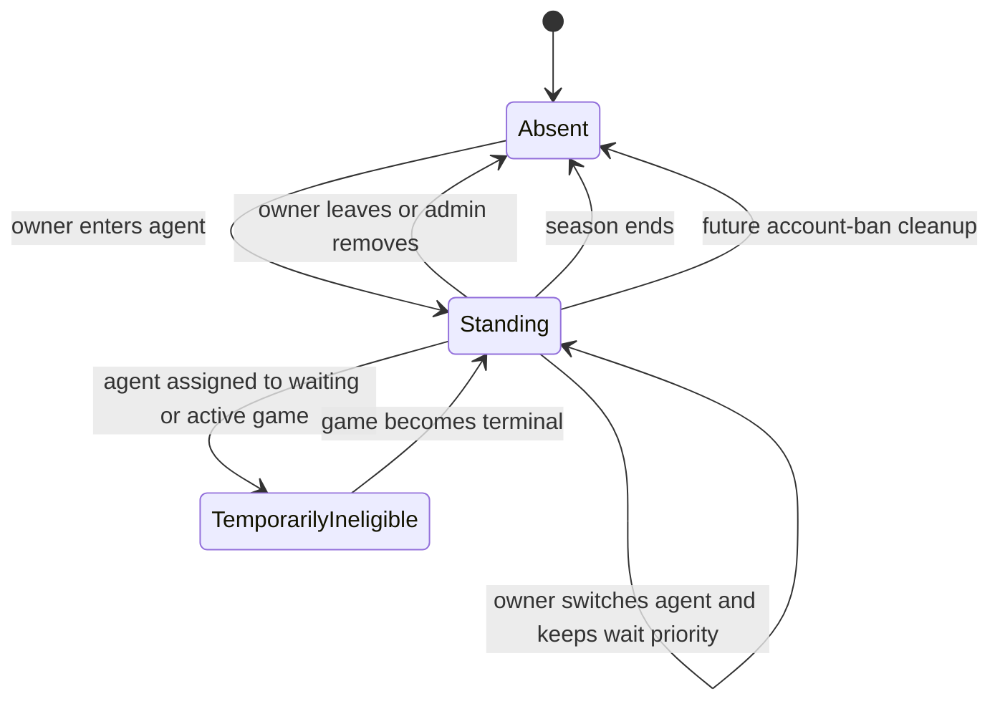
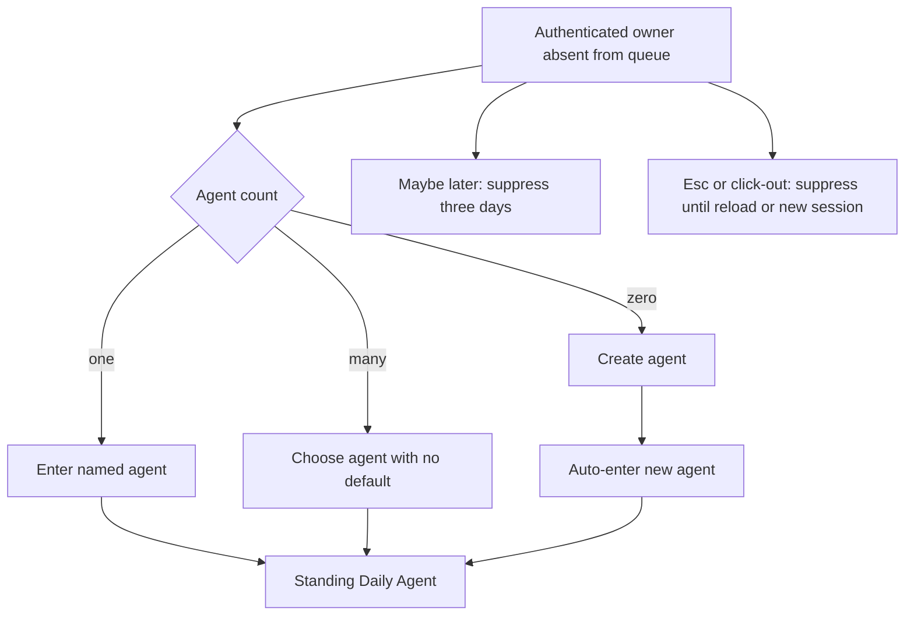
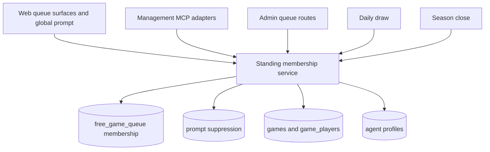

# Standing Daily Agent Queue - Plan

## Goal Capsule

- **Objective:** Fill the 12-human Daily Free queue by making enrollment persist for the season, prompting eligible owners globally, and giving operators a practical queue view.
- **Product authority:** Daily Free is a lightweight recurring game for the current community, not a formal league or an algorithm-audit product.
- **Authority hierarchy:** Product Contract behavior overrides legacy transient-queue behavior; existing authorization and season-lifecycle boundaries override convenience shortcuts.
- **Execution profile:** Code, data migration, documentation, and real browser verification.
- **Stop conditions:** Stop for any change that adds a second daily ranked game, a new fairness algorithm, account banning, or league-grade audit machinery.
- **Tail ownership:** The implementing agent owns migration compatibility, REST/MCP parity, focused browser QA, and cleanup of abandoned approaches.
- **Open blockers:** None.

---

## Product Contract

### Summary

Daily Free enrollment becomes a season-scoped standing choice that survives selection and completed games.
Eligible owners receive a terse global prompt, while operators receive a compact queue page with removal controls.

### Problem Frame

Daily Free currently discards a selected owner's queue entry, forcing interested players to return and enroll again after every game.
That recurring chore limits queue growth at a stage when filling one 12-human game per day is the goal.
The product already knows whether an owner has agents and whether one is queued, but it does not turn that state into a consistent global invitation or a personalized selected-agent experience.

### Key Decisions

- **Standing membership is the default.** Existing queue entries silently become standing entries for the current season; selection never implies removal.
- **Membership is binary.** An owner is either in the queue or absent; there is no separate paused state.
- **Queue membership is season-scoped.** Self-removal, admin removal, or season end removes membership; self-removal and admin removal suppress acquisition prompts until the next season. A future account-ban path must call the same removal operation.
- **Wait priority belongs to the owner.** Switching the standing agent preserves accumulated wait priority and never creates another candidacy.
- **The prompt is global and action-first.** It may appear on any player-facing page, including live, watch, and replay, but contains only the information needed for the next action.
- **Admin visibility stays operational.** The admin page helps run the queue; it does not introduce policy versions, draw receipts, counterfactuals, or league-grade analytics.

### Actors

- A1. **Agent owner:** An authenticated player who can create agents, enter one standing Daily Agent, switch it, or leave the queue.
- A2. **Standing Daily Agent:** The owner's selected agent for Daily Free during the current season.
- A3. **Queue operator:** An authorized admin who can inspect queue health and remove entries.
- A4. **Daily draw:** The existing once-per-day selection process that derives eligibility from current membership and game assignment.

### Requirements

**Standing Daily Agent membership**

- R1. Each owner may have at most one Standing Daily Agent in the current season.
- R2. Queue entries present when this behavior launches must become standing entries without notification or renewed consent.
- R3. Selection into a game and game completion must not remove the standing entry.
- R4. The daily draw must derive eligibility from current membership and current game assignment without requiring a persisted nightly snapshot or policy record.
- R5. Standing membership must be temporarily ineligible while any agent owned by that user occupies a waiting, in-progress, or suspended Daily Free game.
- R6. Completed, cancelled, or any other truly terminal game must release temporary ineligibility; suspended games remain ineligible until recovered or made terminal.
- R7. An owner may leave the queue or switch to another owned agent; switching preserves the owner's accumulated wait priority.
- R8. Self-removal, admin removal, and season end must remove the standing entry; the shared domain operation must also support future account-ban cleanup without adding account banning in this slice.
- R9. A new season must begin with no inherited standing entries from the prior season.

**Global acquisition prompt**

- R10. An authenticated owner who is absent from the queue, has no active prompt suppression, and has an active season must become eligible for a global Daily Free prompt on any player-facing page.
- R11. The prompt must appear three seconds after authentication and queue state are ready.
- R12. The prompt must not appear when the owner already has a Standing Daily Agent, including while that agent is selected, waiting, or active in a game.
- R13. An owner with no agents must see a terse create-agent action; successful creation reached through this prompt must automatically enter the new agent.
- R14. An owner with exactly one agent must see a primary action labeled `Enter {name}`.
- R15. An owner with multiple agents must choose an agent with no preselected default before entering.
- R16. The prompt must offer `Maybe later`, which suppresses it for three days.
- R17. The prompt must have no visible close button, while `Esc` and click-out dismiss it until the next full page reload or new browser session.
- R18. Client-side navigation must not reset a session dismissal.
- R19. Self-removal and admin removal must suppress the global prompt for the remainder of the current season.
- R20. A new season must make an absent, otherwise eligible owner prompt-eligible again.

**Queue and game surfaces**

- R21. The dashboard and `/games/free` must show the owner's standing agent and a leave action when the owner is queued.
- R22. The queue surface must let an owner atomically switch to another owned agent without losing wait priority.
- R23. The dashboard and `/games/free` must add a personalized selected or active Daily Agent state that links to the relevant game.
- R24. Agent creation outside the global Daily Free prompt must not automatically enroll the new agent.

**Practical admin queue visibility**

- R25. Admin navigation must include a dedicated Free Queue page guarded by the established admin authorization model.
- R26. The page must show eligible human agents tonight, 12 available human seats, and the longest current wait.
- R27. Each queue row must show agent, a safe owner display label plus internal user ID, status, last game, and consecutive eligible misses; it must omit email and full wallet address and must not imply a priority class while selection remains random.
- R28. An authorized operator must be able to remove a queue entry from the page.
- R29. Account banning must not be added to the queue page; any future account-ban workflow must invoke the shared standing-membership removal operation.
- R30. Operators must not be able to switch another owner's standing agent.

**Management MCP parity and deletion safety**

- R31. Daily Free `join_queue` must express the desired Standing Daily Agent: same-agent retries remain idempotent and a different owned agent atomically switches membership without losing owner wait priority.
- R32. Daily Free `leave_queue` through MCP must have the same season-long removal and prompt-suppression effect as web self-removal.
- R33. Queue and owned-agent reads must distinguish standing membership from current eligibility and include the relevant waiting or active game when present.
- R34. Global prompt behavior and prompt-origin automatic enrollment remain browser-only; MCP agent creation alone must not enroll an agent.
- R35. Deleting the current Standing Daily Agent must be blocked with a legible conflict until the owner switches agents or leaves the queue.
- R36. Daily Free standing join and switch operations must require an active season and return a legible no-active-season outcome otherwise.
- R37. The global modal must provide labeled dialog semantics, contained keyboard focus, initial focus on the primary task, Escape dismissal, and focus restoration.
- R39. The Daily Free prompt must wait until the existing root invite gate resolves, then begin its three-second delay without recording a dismissal; this slice does not add generic overlay arbitration.

### Key Flows

- F1. **Existing entry becomes standing**
  - **Trigger:** The feature becomes active during a season.
  - **Actors:** A1, A2, A4.
  - **Steps:** An existing queue entry remains present; selection temporarily excludes its agent; terminal game state restores eligibility.
  - **Outcome:** The owner continues participating without returning to rejoin.
  - **Covered by:** R2-R6.
- F2. **Agentless owner enters from the global prompt**
  - **Trigger:** An eligible owner with no agents sees the modal after three seconds.
  - **Actors:** A1, A2.
  - **Steps:** The owner chooses create, completes creation, and the new agent becomes standing automatically.
  - **Outcome:** One acquisition flow completes both prerequisites without another confirmation step.
  - **Covered by:** R10-R13.
- F3. **Multi-agent owner enters**
  - **Trigger:** An eligible owner with multiple agents sees the modal.
  - **Actors:** A1, A2.
  - **Steps:** The owner chooses an agent with no default selection and confirms entry.
  - **Outcome:** The selected agent becomes standing.
  - **Covered by:** R10, R15.
- F4. **Owner defers or dismisses**
  - **Trigger:** The global modal appears.
  - **Actors:** A1.
  - **Steps:** `Maybe later` suppresses for three days; `Esc` or click-out suppresses until reload or a new session; client navigation does not reset dismissal.
  - **Outcome:** The modal remains global without repeating on every navigation.
  - **Covered by:** R16-R18.
- F5. **Owner or admin removes membership**
  - **Trigger:** The owner leaves or an authorized operator removes the entry.
  - **Actors:** A1 or A3.
  - **Steps:** Membership is removed and acquisition prompts remain suppressed for the rest of the season.
  - **Outcome:** Explicit removal is respected until the next season.
  - **Covered by:** R8, R19, R28.

### Acceptance Examples

- AE1. **Covers R2-R6.** Given an owner whose agent was in the queue before launch, when that agent is selected and its game later completes, then the agent becomes eligible for the next daily draw without a notification or new join action.
- AE2. **Covers R6.** Given a standing owner with a cancelled or completed Daily Free game, when that game becomes terminal, then membership is eligible for the next draw; a suspended game remains ineligible.
- AE3. **Covers R7, R22.** Given an owner with consecutive eligible misses, when the owner switches the standing agent, then the account retains its wait priority and still has one candidacy.
- AE4. **Covers R10-R12.** Given an authenticated owner absent from the queue on a watch page, when authentication and queue state are ready, then the modal appears after three seconds.
- AE5. **Covers R13.** Given an agentless owner who begins creation from the Daily Free modal, when creation and automatic entry both succeed, then the new agent becomes standing without another confirmation; if creation succeeds but entry fails, the created agent remains selected in a retryable not-yet-entered state.
- AE6. **Covers R15.** Given an owner with multiple agents, when the modal appears, then no agent is preselected and entry cannot complete until the owner chooses one.
- AE7. **Covers R16-R18.** Given an owner who dismisses with `Esc`, when the owner navigates client-side, then the modal remains suppressed; when the owner performs a full reload, then the owner may become eligible again.
- AE8. **Covers R19-R20.** Given an owner who leaves during Season 0, when the owner reloads during Season 0, then no modal appears; when the next season begins, then the absent owner is eligible for the modal again.
- AE9. **Covers R23.** Given a standing agent selected for today's game, when the owner opens the dashboard or `/games/free`, then the surface identifies that agent's selected or active state and links to the game.
- AE10. **Covers R25-R30.** Given an authorized operator on the Free Queue admin page, when the operator removes an entry, then the entry disappears and no switch-agent or inline-ban action is offered.
- AE11. **Covers R14.** Given an eligible owner with exactly one agent, when the modal appears, then its primary action names that agent and enters it without an agent-selection step.
- AE12. **Covers R24.** Given an absent owner creates an agent from the normal Agents surface rather than the Daily Free modal, when creation succeeds, then the agent is not automatically entered.
- AE13. **Covers R8-R9.** Given a standing entry, when the current season closes, then that membership and its prompt suppressions are removed and the next season begins without inheriting them.
- AE14. **Covers R26-R27.** Given an authorized operator opens the Free Queue page, when queue state loads, then the page shows tonight's eligible count, 12-seat capacity, longest wait, and each entry's required operational fields.
- AE15. **Covers R31-R34.** Given an owner changes the Daily Free agent through MCP, when queue and agent reads refresh, then every surface reports one standing membership, preserved wait priority, and the same eligibility/current-game state as the web surface.
- AE16. **Covers R35.** Given an owner attempts to delete the current Standing Daily Agent, when deletion is requested, then the operation is rejected with instructions to switch or leave first and the membership remains intact.
- AE17. **Covers R36.** Given no active season, when an owner or MCP client tries to join or switch Daily Free membership, then the operation fails clearly and no membership row is created.
- AE18. **Covers R37, R39.** Given the root invite gate is active, when the owner otherwise qualifies for the Daily Free prompt, then no timer starts until invite gating resolves; the resulting modal traps and restores focus and remains operable by keyboard.

### Success Criteria

- Daily Free reaches the operating target of 12 eligible human owners for the daily draw.
- Selected owners remain available for later draws without returning to rejoin.
- Eligible owners can complete queue entry from the global prompt without visiting `/games/free` first.
- Operators can answer who is eligible, who has waited longest, and remove an entry from one dedicated page.

### Scope Boundaries

- Aged-lottery weighting, mix protection, and other fairness-algorithm changes are deferred until the queue regularly exceeds 12 eligible humans.
- Automatic dormancy or inactivity expiry is out of scope; standing membership ends only through the defined removal events.
- Multiple Daily Free games are out of scope until 12 human seats fill every day and eligible players consistently remain backlogged after the draw.
- Policy versions, draw receipts, counterfactual evaluation, queue SLO machinery, and player-facing algorithm explanations are out of scope.
- The global prompt will not carry detailed queue rules, admin-removal language, or other operator-facing truths.
- Adding account-ban state or an account-ban admin action is out of scope because no such product primitive exists today; a future ban path must invoke the shared standing-membership removal operation.

### Dependencies and Assumptions

- The active season provides the membership boundary and always has a deterministic end.
- Existing game enrollment data can identify whether the owner's standing agent is selected, waiting, active, or terminal.
- Consecutive eligible misses and broad priority remain operational queue facts; this plan does not define a new selection algorithm.
- Existing queue rows are preserved in place; membership is implicitly scoped to the current season and cleared at the authoritative active-to-closing transition.
- New standing joins, switches, and acquisition prompts require an active season. The draw endpoint may retain its unrated/no-active-season fallback for pre-existing or manually seeded rows, but this slice does not create new no-season memberships.

### Sources and Research

- `docs/ideation/2026-07-12-free-queue-growth-fairness-ideation.html`
- `docs/plans/2026-06-30-001-feat-mcp-agent-management-queue-enrollment-plan.md`
- `packages/api/src/routes/free-queue.ts`
- `packages/api/src/db/schema.ts`
- `packages/web/src/app/games/free/free-game-content.tsx`
- `packages/web/src/app/dashboard/dashboard-mission-control.ts`
- `packages/web/src/app/admin/admin-tabs.tsx`

---

## Planning Contract

### Key Technical Decisions

- **KTD1 — Treat the existing queue row as standing membership.** Preserve current rows and the one-row-per-owner constraint; add only owner-level miss state needed by current operational views. Do not create a nightly candidate or policy table.
- **KTD2 — Store prompt suppression separately from membership.** A compact per-owner suppression record holds three-day deferral or season-long removal suppression even when membership is absent. Season close clears both memberships and suppressions.
- **KTD3 — Centralize Daily Free lifecycle operations.** One owner-scoped service owns status, join/switch, leave, admin removal, prompt deferral, eligibility derivation, and removal provenance. REST, Management MCP, draw, admin, and season cleanup adapt this service rather than mutating tables directly.
- **KTD4 — Switch by update, never leave-then-join.** Updating the existing owner membership preserves row identity, join age, consecutive misses, and priority while avoiding false season-long opt-out suppression.
- **KTD5 — Derive eligibility from authoritative owner-level game assignment.** Any owned agent in a waiting, in-progress, or suspended Daily Free game makes that owner's membership temporarily ineligible; completed and cancelled assignments release it. Switching the standing agent cannot bypass this gate.
- **KTD6 — Close season is the cleanup boundary.** Clear membership and prompt suppression in the active-to-closing transaction, before a new season may become active; delayed settlement/finalization must not control queue inheritance.
- **KTD7 — Keep prompt lifetime rules split by storage lifetime.** Component/provider memory handles Esc/click-out until full reload, while server-backed suppression handles three-day `Maybe later` and season-long self/admin removal across devices.
- **KTD8 — Reuse existing agent creation and modal patterns.** The global provider owns eligibility/timing; the modal reuses the shared agent form and keeps a retryable created-but-not-entered state if automatic enrollment fails.
- **KTD9 — Preserve Management MCP primitive tools.** Existing status/join/leave tools gain standing desired-state semantics and context parity; no switch workflow tool, admin MCP tool, or policy-internals output is added.
- **KTD10 — Block deletion of the active standing agent.** A legible conflict preserves the explicit membership contract and avoids hidden removal or arbitrary replacement.
- **KTD11 — Reuse current admin permissions.** Queue reads require established admin view access; removal requires the existing Daily Free scheduling permission. Do not create a permission or a ban capability for this panel.
- **KTD12 — Derive authority and suppression fields server-side.** Owner routes derive subject from authentication; admin removal derives actor from the authorized session; the service derives active season, origin, and three-day expiry. Player and MCP reads expose only owner-safe prompt eligibility and optional next eligibility time, never raw removal provenance.
- **KTD13 — Linearize season and draw races with existing advisory locks.** Join, switch, prompt suppression, season close, and new-season activation share the existing free-season lock. Join, switch, leave, and admin removal also participate in the existing Daily Free draw lock; draw start is the cutover, and later mutations affect the next draw.

### High-Level Technical Design

The membership service returns one read model for membership, eligibility, relevant game, wait facts, and prompt eligibility. The draw selects from eligible memberships under its existing advisory lock, leaves selected rows intact, resets misses for selected owners, and increments misses only for eligible unselected owners in the same transaction. House-agent filling and the once-per-day guard remain unchanged.

The web provider waits for app authentication, active season, agents, membership state, and the root invite gate before arming the three-second timer. Zero-agent creation replaces the acquisition step inside the same modal with the shared Agent form; cancelling returns to the terse acquisition step. Client navigation preserves session dismissal because the provider sits above route content; a full reload reconstructs provider memory. This slice does not add an app-wide overlay registry.

Draw start is the membership cutover. The draw and all membership mutations acquire the same Daily Free advisory lock; a mutation that acquires it after player materialization changes standing state for the next draw and returns any already-materialized current-game context. Season-scoped membership writes and season close/new activation also share the existing free-season advisory lock so no post-close row leaks forward.

### Sequencing

1. Land the migration and shared service with characterization tests before changing draw behavior.
2. Move draw, season close, REST, MCP, agent deletion, and admin mutations onto the shared service.
3. Expand status DTOs and client models before rendering selected/active or prompt states.
4. Add the global prompt and user surfaces, then the admin panel.
5. Reconcile MCP/docs and run browser verification only after API semantics are stable.

### System-Wide Impact and Risks

- **Migration compatibility:** Existing queue rows must survive migration and become standing without notification or re-entry.
- **Draw races:** Eligibility filtering and miss updates must stay inside the existing advisory-lock transaction so concurrent draws cannot double-update priority.
- **Season races:** Queue cleanup must commit with active-to-closing transition; partial cleanup must roll back if close fails.
- **Cross-surface drift:** REST, MCP, web, and admin must share mutations and the same status vocabulary.
- **Prompt collisions:** The Daily Free modal must yield to invite gating and avoid duplicate timers during auth/session refresh.
- **Agent deletion:** The restrictive queue/profile relationship must produce a product-level conflict rather than a database failure.
- **Absent ban primitive:** This plan provides a reusable removal origin but does not pretend account banning exists.

---

## Implementation Units

### U1. Standing membership persistence and domain service

- **Goal:** Establish durable standing membership, prompt suppression, and one shared lifecycle/read model.
- **Requirements:** R1-R9, R19-R20, R31-R35.
- **Files:** `packages/api/src/db/schema.ts`, `packages/api/drizzle/0031_*.sql`, `packages/api/drizzle/meta/_journal.json`, `packages/api/src/services/queue-enrollment.ts`, `packages/api/src/__tests__/queue-enrollment.test.ts`, `packages/api/src/__tests__/test-utils.ts`, `packages/api/src/e2e/test-db.ts`.
- **Approach:** Preserve existing queue rows, add miss state, add suppression persistence, and refactor Daily Free join/switch/leave/status into desired-state operations with explicit server-derived removal origins. Keep open-game behavior unchanged; never accept target owner, actor, season, origin, or suppression expiry from player/admin request bodies.
- **Dependencies:** None.
- **Test scenarios:** Existing rows survive migration; same-agent join is idempotent; different-agent join switches in place and preserves wait fields; leave creates server-derived season suppression; three-day deferral expiry is server-computed; request bodies cannot choose subject/actor/season/origin/expiry; no-active-season join/switch fails without a row; post-close admission cannot leak through the season lock; unauthorized ownership changes fail; concurrent desired-state updates leave one membership; status distinguishes absent, eligible, and temporarily ineligible.
- **Verification:** Focused DB/service tests pass against local Postgres.

### U2. Draw eligibility, season cleanup, and deletion safety

- **Goal:** Make standing membership survive draws and obey authoritative game/season boundaries.
- **Requirements:** R2-R9, R35.
- **Files:** `packages/api/src/routes/free-queue.ts`, `packages/api/src/services/seasons.ts`, `packages/api/src/routes/agent-profiles.ts`, `packages/api/src/__tests__/free-queue.test.ts`, `packages/api/src/__tests__/seasons.test.ts`, `packages/api/src/__tests__/agent-profiles.test.ts`.
- **Approach:** Select only eligible memberships under the existing draw lock, keep picked rows, update miss state transactionally, clear memberships/suppressions under the shared season lock when the season enters closing, and reject deletion of the current standing agent. Membership mutations use the draw lock so draw start is the authoritative cutover.
- **Dependencies:** U1.
- **Test scenarios:** Picked rows remain; any owned agent in waiting/in-progress/suspended Daily Free excludes the owner even after switching; completed/cancelled assignments release; only eligible misses increment; selected misses reset; join/switch/leave racing draw linearize at draw start; concurrent draw still creates one game; join/switch racing close cannot create inherited rows; failed close rolls back cleanup; successful close leaves no inherited rows; deleting the standing agent yields a legible conflict.
- **Verification:** Queue, season, and agent-profile route tests pass with real DB visibility.

### U3. REST, Management MCP, and personalized queue status parity

- **Goal:** Expose one standing-membership contract to web and agent clients without adding tools.
- **Requirements:** R7, R21-R24, R31-R34.
- **Files:** `packages/api/src/routes/free-queue.ts`, `packages/api/src/services/queue-enrollment.ts`, `packages/api/src/services/agent-profile-management.ts`, `packages/api/src/game-mcp/server.ts`, `packages/api/src/__tests__/queue-enrollment.test.ts`, `packages/api/src/__tests__/agent-profile-management.test.ts`, `packages/api/src/__tests__/production-game-mcp-server.test.ts`, `packages/web/src/lib/api.ts`.
- **Approach:** Adapt REST and MCP to shared desired-state mutations; enrich queue and owned-agent reads with membership, eligibility, owner-safe prompt state, and relevant-game context. Keep raw suppression/removal provenance and admin-only fields out of player and MCP DTOs.
- **Dependencies:** U1, U2.
- **Test scenarios:** REST and MCP agree after join/switch/leave; MCP create alone does not enroll; same/different-agent tool calls follow desired-state semantics; selected game link is owner-personalized; inactive membership is not reported absent; owner/MCP responses expose no raw origin, actor, or admin-removal provenance; open-game enrollment remains unchanged; tool inventory and scopes do not expand.
- **Verification:** Focused API and MCP contract tests pass.

### U4. Global prompt and player queue surfaces

- **Goal:** Convert eligible owners from any page with minimal mental load and render standing/selected states accurately.
- **Requirements:** R10-R24, R34.
- **Files:** `packages/web/src/app/providers.tsx`, `packages/web/src/components/standing-daily-agent-prompt.tsx`, `packages/web/src/app/games/free/free-game-content.tsx`, `packages/web/src/app/dashboard/dashboard-mission-control.ts`, `packages/web/src/app/dashboard/agents/agent-create-content.tsx`, `packages/web/src/__tests__/standing-daily-agent-prompt.test.tsx`, `packages/web/src/__tests__/dashboard-mission-control.test.ts`, `packages/web/src/__tests__/dashboard-mission-control-overview.test.tsx`, `packages/web/src/__tests__/free-queue-rebrand.test.ts`.
- **Approach:** Mount one provider-level modal after root invite gating; resolve zero/one/many-agent branches, replace the acquisition step with embedded shared-agent creation, keep no visible close button, and implement the three dismissal lifetimes. Keep every enter action pending until authoritative standing state returns, with duplicate submission disabled, selection preserved, and terse retryable errors. Update dashboard and `/games/free` for standing leave/switch plus personalized game links. Leave is a direct action with no warning or consequence modal.
- **Dependencies:** U3.
- **Test scenarios:** Unauthenticated/invite-gated users never arm; invite gating defers and restarts the timer; no generic overlay registry is introduced; three-second timer starts only after all state resolves; zero-agent embedded creation can cancel back and auto-enters only from prompt; one-agent CTA names it; multi-agent has no default; pending entry disables duplicates and errors retry without losing selection; Maybe Later suppresses three days; Esc/click-out survive SPA navigation but reset on reload; modal focus is contained and restored; self removal acts directly and suppresses silently; selected/active membership hides acquisition modal and links to the correct game; auto-entry failure remains retryable.
- **Verification:** Web unit/render tests and real browser flows pass on dashboard, `/games/free`, watch, and replay.

### U5. Practical Free Queue admin page

- **Goal:** Give operators one compact queue-health and removal surface.
- **Requirements:** R25-R30.
- **Files:** `packages/api/src/routes/admin.ts`, `packages/api/src/__tests__/admin-routes.test.ts`, `packages/web/src/app/admin/admin-tabs.tsx`, `packages/web/src/app/admin/free-queue-admin-panel.tsx`, `packages/web/src/__tests__/free-queue-admin-panel.test.tsx`, `packages/web/src/lib/api.ts`.
- **Approach:** Add a URL-addressable admin tab and permission-gated read/removal routes backed by the shared service. Show only eligible count, 12-seat capacity, longest wait, a safe owner label/internal ID, and required per-entry facts; omit email and full wallet address. Removal is a direct action with no warning or consequence modal; keep the row visible with an inline retryable error on failure.
- **Dependencies:** U1-U3.
- **Test scenarios:** Non-admin and missing-permission requests fail; authorized reads return correct eligibility/last-game/miss facts without inventing priority; response omits email/full wallet and removal provenance; direct removal derives actor and suppression server-side without a warning modal; failed removal keeps the row and retries; panel exposes remove but no switch or ban; loading, empty, error, success, keyboard, and narrow-screen states remain legible.
- **Verification:** Admin API/component tests and browser QA pass.

### U6. Documentation and contract reconciliation

- **Goal:** Make standing semantics discoverable and prevent old transient guidance from retraining clients.
- **Requirements:** R1-R9, R31-R34.
- **Files:** `CONCEPTS.md`, `docs/game-mcp-production-oauth.md`, `docs/solutions/architecture-patterns/production-mcp-role-resource-split.md`, `README.md`, `docs/plans/2026-07-12-001-feat-standing-daily-agent-queue-plan.md`.
- **Approach:** Update Daily Free and Management MCP language to standing membership, atomic switching, temporary ineligibility, and browser-only prompt behavior. Preserve explicit deferred scope.
- **Dependencies:** U1-U5.
- **Test scenarios:** Documentation search finds no leave-before-switch or selected-row-deletion guidance for Daily Free; tool descriptions match runtime responses; the plan's Product and Planning Contracts remain consistent with shipped behavior.
- **Verification:** Documentation grep and final requirement audit pass.

---

## Verification Contract

### Focused automated gates

- `bun test packages/api/src/__tests__/queue-enrollment.test.ts packages/api/src/__tests__/free-queue.test.ts packages/api/src/__tests__/seasons.test.ts packages/api/src/__tests__/agent-profiles.test.ts packages/api/src/__tests__/agent-profile-management.test.ts packages/api/src/__tests__/production-game-mcp-server.test.ts packages/api/src/__tests__/admin-routes.test.ts`
- `bun test packages/web/src/__tests__/standing-daily-agent-prompt.test.tsx packages/web/src/__tests__/dashboard-mission-control.test.ts packages/web/src/__tests__/dashboard-mission-control-overview.test.tsx packages/web/src/__tests__/free-queue-rebrand.test.ts packages/web/src/__tests__/free-queue-admin-panel.test.tsx`

DB-backed gates must be rerun with real local Postgres visibility if a sandboxed command reports `ECONNREFUSED 127.0.0.1:54320`.

### Repository gates

- `bun run test`
- `bun run check`

### Browser gates

- Verify zero-, one-, and multiple-agent prompt branches from unrelated pages plus watch/replay.
- Verify three-second timing, three-day Maybe Later, reload-scoped Esc/click-out, and invite-gate precedence.
- Verify queued, selected, active, terminal, switch, and leave states on dashboard and `/games/free`.
- Verify the dedicated admin queue tab, operational facts, removal, and lack of switch/ban actions.

### Requirement audit

Every R-ID and AE-ID must map to an automated test or browser observation. Deferred scope must remain absent from routes, UI, MCP tools, and documentation.

---

## Definition of Done

- U1-U6 are implemented in dependency order with their named tests passing.
- Existing queue entries remain present through migration and after selection.
- Standing membership, eligibility, wait state, and relevant-game context agree across REST, web, and Management MCP.
- Season close clears membership and prompt suppression before another season becomes active.
- The global prompt behaves correctly on every player-facing surface and all dismissal lifetimes are verified.
- The admin page answers the agreed operational questions and exposes only removal.
- Focused tests, `bun run test`, and `bun run check` pass with real DB visibility where required.
- Browser verification covers the named prompt, queue, game, and admin flows with concrete evidence.
- Documentation and `CONCEPTS.md` match shipped behavior and retain the deferred boundaries.
- No abandoned experiment, duplicate queue mutation path, policy machinery, account-ban feature, fairness algorithm, or multiple-game capacity work remains in the diff.
