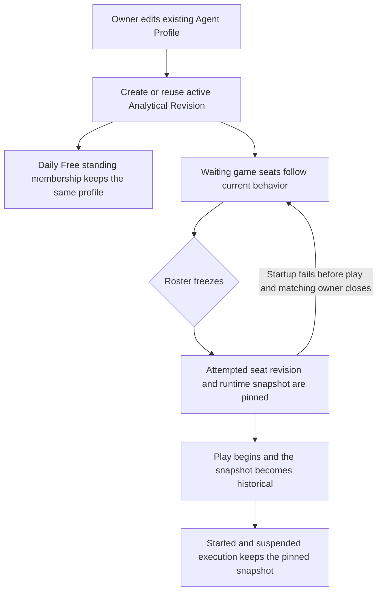
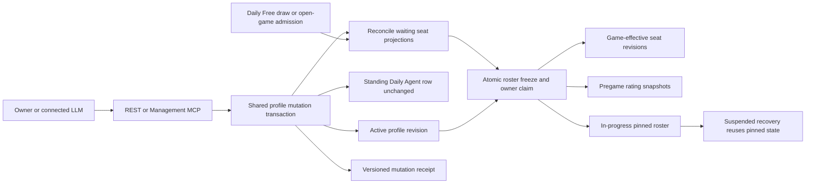
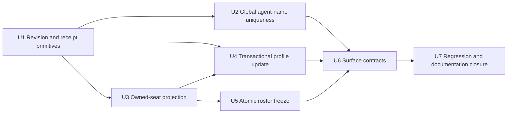

# Core MCP Agent Revision Loop Repair - Plan

> **2026-07-14 release amendment:** Global uniqueness for saved Agent Profile names is deferred. The unique-index migration, House-catalog create/rename rejection, and `agent_name_taken` contract described below are superseded and must not ship. Existing duplicate profiles remain untouched. Per-game roster validation may still reject two same-name seats when a waiting roster is reconciled or frozen because gameplay currently resolves participants by display name.

## Goal Capsule

- **Objective:** Preserve one owned agent identity through postgame edits, active revision creation, waiting-enrollment propagation, and game start while making the correct MCP tool choice clear, observable, and easy for connected LLMs to follow.
- **Product authority:** The Agent Profile owns persistent identity, the current Analytical Revision owns the behavior intended for future play, and a frozen game seat becomes the immutable execution record once play begins. A matching active startup owner may void an attempted freeze only when runtime startup fails before play.
- **Execution profile:** Deep, code-backed repair spanning profile management, MCP/REST contracts, owned-seat materialization, Season 0 evidence, game start, and focused web conflict handling.
- **Stop conditions:** Stop if a waiting-seat path cannot join the shared game-then-profile lock protocol, if a rated start cannot capture one coherent seat/revision/rating tuple, or if global saved-profile name uniqueness cannot be enforced without unsafe legacy data mutation.
- **Tail ownership:** Update the revision, MCP, Season 0, and roster-freeze documentation in the same branch; record ambiguous legacy name cleanup in `docs/refactor-queue.md` and keep revision UI in deferred follow-up work.

---

## Product Contract

### Summary

Extend the existing shared profile, revision, enrollment, and game-start services so one Agent Profile survives every edit surface.
The implementation separates active profile behavior from game-effective seat revisions, keeps Daily Free membership on the stable profile, and makes roster freeze the authoritative revision and rating-snapshot boundary.

### Problem Frame

The Lillith Voss incident exposed a contract failure rather than a revision-model failure.
A connected MCP LLM used `create_agent` to tune an established agent, producing a second profile with separate career and season history, then treated switching Daily Free membership as revision deployment.

The current MCP descriptions do not explain the consequence sharply enough.
`create_agent` creates a new owned identity, while `update_agent` misleadingly describes tuning as something done “before enrollment” even though postgame editing is part of the intended persistent-agent loop.

The server already creates or reuses Analytical Revisions during profile updates, but public mutation responses discard the revision outcome.
Daily Free membership already references the stable profile, while waiting game seats contain copied behavior that can become stale after an edit.
Without a receipt and a start-safe propagation rule, clients must guess whether the new behavior will play next.

### Key Decisions

| Decision | Rationale |
|---|---|
| **Existing identity wins** | Tuning an owned agent always preserves its Agent Profile and history; a new profile is a separate career, not a revision. |
| **Identity safety is enforced** | Saved Agent Profile names are globally unique after trim/case normalization, House-agent catalog names are reserved, and create or rename fails with a simple generic error instead of creating another identity with the same name. |
| **Updates are active by default** | Effective behavior edits quietly create or reuse the current Analytical Revision. Durable drafts and publishing are a later product extension, not part of this repair. |
| **Web and MCP share one update contract** | Revision and enrollment behavior must not depend on which authorized owner surface performed the edit. Only MCP needs tool-selection safeguards. |
| **Enrollments follow current until freeze** | Daily Free continues to reference the stable profile, waiting seats project active profile behavior through coherent game-effective revisions, and roster freeze pins the attempted execution snapshot. That snapshot becomes historical once play begins; only a matching active startup owner may void it after a pre-play startup failure. |
| **Mutation results are receipts** | A successful update reports stable identity, revision outcome, and enrollment dispositions so clients never infer activation from prose or queue churn. |
| **Connected-LLM behavior is iterative** | Deterministic tests protect tool descriptions and mutation behavior; connected LLMs are exercised in practice, and further guidance changes follow observed non-optimal choices rather than a hard proof boundary. |

The diagram shows the product invariant, not an implementation sequence: identity remains stable, followers move only before start, and runtime history never moves backward.

### Actors

| ID | Actor | Responsibility |
|---|---|---|
| A1. | Agent owner | Tunes an existing agent or creates a distinctly named separate career. |
| A2. | Connected MCP LLM | Resolves the owned identity, selects the correct tool, and explains the structured outcome to the owner. |
| A3. | Influence web client | Edits the same persistent agent through the same active-update contract. |
| A4. | Agent profile and revision domain | Preserves identity, classifies effective changes, advances revision lineage, and returns mutation facts. |
| A5. | Enrollment and game-start domain | Keeps waiting followers current and freezes the authoritative seat snapshot at start. |

### Requirements

**Identity continuity and tool choice**

- R1. `update_agent` must be the documented mutation for any existing owned agent, including one that is standing in Daily Free or seated in a waiting game.
- R2. `create_agent` must state that it creates a separate competitive identity with independent career and season history, requires a distinct name, and must not be used to tune an existing agent.
- R3. Creating or renaming a saved Agent Profile to a normalized display name already used by any saved Agent Profile or reserved by the House-agent catalog must fail with `agent_name_taken` before any profile, revision, avatar, or enrollment side effect.
- R4. The name-taken result must expose only a stable code, generic owner-safe message, and retryability. MCP guidance may tell the caller to resolve and use `update_agent` if the name belongs to an owned agent, but the collision response must not reveal another profile or owner.

**Revision and mutation contract**

- R5. Every effective behavior or runtime edit must automatically create or reuse the appropriate Analytical Revision without resetting profile, career, or season history.
- R6. Presentation-only or identical edits must preserve the current Analytical Revision and report that no behavior-bearing revision was created.
- R7. Normal updates must become active immediately; no draft, publish, candidate, or approval lifecycle is introduced in this repair.
- R8. Authorized web and MCP edits must produce the same revision, activation, propagation, and history-preservation behavior.
- R9. Every successful update must return a machine-readable receipt containing the stable agent identity, the revision outcome, the current revision, and the disposition of each relevant enrollment class.

**Enrollment propagation and roster freeze**

- R10. Updating the Agent Profile selected for Daily Free must preserve the existing standing membership, wait age, miss state, and owner eligibility semantics without leave or rejoin operations.
- R11. A waiting owned seat must be reconciled from active profile behavior into a coherent game-effective revision, persona, and runtime inputs after an effective update.
- R12. Game start must perform the final game-effective projection from current active profile behavior for every unpinned owned seat before the roster becomes immutable.
- R13. A started or suspended game must retain the revision, persona, and runtime snapshot that actually began, regardless of later profile updates.
- R14. An update racing with game start must resolve to one valid state: either the new revision is reconciled before freeze or the game keeps the prior frozen snapshot; mixed revision and persona state is invalid.
- R15. An update must not report a waiting follower as reconciled unless that state is durable; a genuine reconciliation failure must not leave the profile, active revision, and eligible waiting seats silently inconsistent.

**Verification and contract maintenance**

- R16. Automated coverage must reproduce the Lillith-shaped failure and prove that tuning an existing agent preserves its original Agent Profile ID.
- R17. Automated coverage must prove duplicate-create protection, revision creation and reuse, Daily Free membership preservation, waiting-seat reconciliation, start-race safety, frozen-seat preservation, and receipt accuracy.
- R18. MCP descriptions, rules/help text, REST behavior, and owner-facing management documentation must use the same identity, revision, and enrollment vocabulary.
- R19. Deterministic tests must protect MCP guidance and server behavior, while connected-LLM exercises remain an iterative product check that can drive later prompt or tool-contract changes.

**Season freeze and settlement integrity**

- R20. A game already assigned to a season may cross roster freeze while that season is `active` or `closing`; `final` or missing season state must reject rated start. New admissions and draws still require an `active` season.
- R21. Competition completion must settle from the exact revision ID pinned on each seat and its matching pregame snapshot. It must never substitute the profile current revision or highest revision ordinal; missing or mismatched evidence produces a typed repair-required settlement failure.

### Key Flows

- F1. Existing-agent update through MCP
  - **Trigger:** A1 asks A2 to tune an established owned agent.
  - **Actors:** A1, A2, A4, A5.
  - **Steps:** A2 resolves the stable identity, calls `update_agent`, and receives one revision-and-enrollment receipt.
  - **Outcome:** The same Agent Profile remains authoritative and all eligible followers reflect the active behavior.
  - **Covered by:** R1, R5-R11, R13, R15.

- F2. Existing-agent update through the web
  - **Trigger:** A1 saves changes on the existing agent-management surface.
  - **Actors:** A1, A3, A4, A5.
  - **Steps:** The update follows the same revision and propagation rules as MCP without any connector-specific tool-selection step.
  - **Outcome:** Web and MCP cannot create different meanings for the same edit.
  - **Covered by:** R5-R11, R13, R15, R18.

- F3. Globally unique Agent Profile creation
  - **Trigger:** A1 asks A2 or A3 to create or rename an agent to a name already used by a saved Agent Profile or reserved House agent.
  - **Actors:** A1, A2, A4.
  - **Steps:** The mutation stops with a generic `agent_name_taken` result and no side effects; the owner chooses a distinct name or resolves their existing agent and updates it.
  - **Outcome:** Exact duplicate agent identities are prevented without a confirmation or alternate creation flow.
  - **Covered by:** R2-R4, R16-R18.

- F4. Waiting follower reaches game start
  - **Trigger:** An updated agent has one or more waiting seats and the game begins.
  - **Actors:** A4, A5.
  - **Steps:** Waiting seats reconcile when the edit becomes active, then start resolves current behavior once more before freezing the roster.
  - **Outcome:** The game begins with one coherent revision, persona, and runtime snapshot.
  - **Covered by:** R11-R15, R17.

- F5. Owner edits after execution is frozen
  - **Trigger:** A1 updates an agent that is already in a started or suspended game.
  - **Actors:** A1, A2 or A3, A4, A5.
  - **Steps:** The update becomes current for future eligible play while the frozen game remains unchanged.
  - **Outcome:** Future improvement does not rewrite historical or recoverable execution state.
  - **Covered by:** R5, R8-R10, R13, R17.

### Acceptance Examples

- AE1. Behavior-bearing MCP update
  - **Covers R1, R5, R8-R11, R16-R17.**
  - **Given:** Lillith Voss already exists, is the owner's Standing Daily Agent, and has a seat in a waiting game.
  - **When:** The owner asks a connected LLM to improve Lillith's strategy.
  - **Then:** The LLM updates the original Agent Profile and creates or preserves its active Analytical Revision. Daily Free membership remains attached to that profile and follows the active behavior without leave or rejoin; the already-materialized waiting seat reconciles before roster freeze, and the receipt reports each outcome.

- AE2. Presentation-only update
  - **Covers R6, R9, R15.**
  - **Given:** An owner changes only an avatar or resaves identical behavior.
  - **When:** The update succeeds.
  - **Then:** No new behavior-bearing revision is created and the receipt says the current revision was preserved.

- AE3. Accidental duplicate creation
  - **Covers R2-R4, R16-R17.**
  - **Given:** An Agent Profile named Lillith Voss already exists, regardless of owner.
  - **When:** A connected LLM or web user attempts to create another normalized Lillith Voss.
  - **Then:** No profile or dependent side effect is created and `agent_name_taken` asks for a different name without revealing the conflicting identity.

- AE4. Reserved House-agent name
  - **Covers R3-R4.**
  - **Given:** A normalized name belongs to the House-agent catalog.
  - **When:** An owner attempts to create or rename a saved Agent Profile to that name.
  - **Then:** The mutation returns the same generic `agent_name_taken` result and writes nothing.

- AE5. Daily Free membership preservation
  - **Covers R10, R17.**
  - **Given:** An agent is already the owner's Standing Daily Agent with accumulated wait state.
  - **When:** That same Agent Profile is updated.
  - **Then:** The standing row, wait age, and miss state remain unchanged, and a later draw materializes current behavior.

- AE6. Waiting-seat reconciliation
  - **Covers R11-R12, R15, R17.**
  - **Given:** A waiting game seat contains an older behavior snapshot for the updated Agent Profile.
  - **When:** The update becomes active and the game has not started.
  - **Then:** The seat and its revision become coherent with the active behavior before start.

- AE7. Update and start race
  - **Covers R12, R14-R15, R17.**
  - **Given:** An owner update and game start contend for the same waiting seat.
  - **When:** Both operations complete.
  - **Then:** The seat is either fully updated and frozen on the new revision or fully frozen on the prior revision; no hybrid snapshot is accepted.

- AE8. Update after start or suspension
  - **Covers R13, R17.**
  - **Given:** A game already started or is suspended with a pinned owned seat.
  - **When:** The owner updates that Agent Profile.
  - **Then:** The frozen game remains on its original snapshot while future eligible games project the active profile behavior.

- AE9. Reconciliation failure
  - **Covers R9, R15, R17.**
  - **Given:** An eligible waiting follower cannot be durably reconciled and did not legitimately cross the start boundary.
  - **When:** The update attempts to become active.
  - **Then:** The operation fails without claiming successful propagation or leaving a silently inconsistent active state.

- AE10. Game-effective revision without current-pointer churn
  - **Covers R5, R11-R14, R17.**
  - **Given:** One profile is provisionally seated in waiting games with different execution configurations.
  - **When:** The profile behavior changes and each waiting seat reconciles.
  - **Then:** The profile keeps one active behavior revision while each seat receives a coherent game-effective revision without advancing the profile's current pointer.

- AE11. Rated roster freeze
  - **Covers R11-R15, R17.**
  - **Given:** A Season 0 waiting seat changed after Daily Free draw.
  - **When:** The game crosses roster freeze.
  - **Then:** The start transaction resolves the final seat revision, persona, runtime inputs, and pregame competition-rating snapshot before marking the game in progress.

- AE12. Waiting-roster rename conflict
  - **Covers R11, R15, R17.**
  - **Given:** A profile rename would duplicate another waiting player's normalized name.
  - **When:** The owner saves the update.
  - **Then:** The complete update rolls back with a generic typed name conflict; the system never exposes the other identity or silently renames the owned agent at start.

- AE13. Failed startup returns to following
  - **Covers R12-R15, R17.**
  - **Given:** A roster was frozen but runtime startup failed before play began.
  - **When:** The owner claim returns the game to waiting.
  - **Then:** The freeze attempt is void, authoritative rating snapshots are removed, and the waiting seat follows current behavior again before the next start.

- AE14. Season closes after draw
  - **Covers R20.**
  - **Given:** A rated game was assigned while its season was active and the season moves to closing before roster freeze.
  - **When:** The already-assigned game starts.
  - **Then:** It freezes and plays normally in that closing season, remains rating-bearing, and continues to block finalization until terminal; a final or missing season fails start.

- AE15. Settlement requires pinned revision evidence
  - **Covers R21.**
  - **Given:** A rated completed seat lacks its pinned revision ID or the matching pregame snapshot.
  - **When:** Competition completion runs.
  - **Then:** Settlement fails with a typed repair-required error and awards nothing; it does not fall back to the profile current revision or the highest revision ordinal.

### Scope Boundaries

**In scope**

- MCP tool-selection semantics and global exact-name protection across saved profiles and the reserved House-agent catalog.
- Shared web and MCP revision-update behavior.
- Minimal web handling that reports a name is already in use and asks for a different name.
- Machine-readable revision and enrollment receipts.
- Daily Free membership preservation, waiting-seat reconciliation, and start-time freeze safety.
- Profile-current versus game-effective revision semantics and freeze-time Season 0 rating snapshots.
- Focused server-side regression coverage and aligned management documentation.

**Deferred for later**

- Durable agent drafts, draft publishing, candidate aliases, and approval workflows.
- Two-Clock Revision Learning Card or other new owner-facing revision UI.
- Tool-choice telemetry, provider scorecards, and prompt capture.
- Owner-controlled manual pinning, revision experiments, or A/B-test orchestration.

### Dependencies and Assumptions

- Agent Profile remains the stable owned identity and Analytical Revision remains a quiet automatic comparison boundary.
- Daily Free standing membership continues to reference the Agent Profile rather than a revision or copied persona.
- Waiting rosters are provisional; the stored seat becomes authoritative only after the existing start boundary freezes it.
- Exact normalized name matching uses trim and case folding; fuzzy or semantic duplicate detection is not required.
- House-agent names come from the canonical engine catalog. Historical game-player snapshots do not reserve names because they are execution history, not creatable identities.
- Connected LLM behavior is exercised after the contract change and iterated from observed choices; no single provider run or deterministic test is treated as permanent proof of model judgment.
- A game-effective seat revision may reuse the profile's active revision or branch from it for that game's immutable execution configuration; it never becomes globally active merely because a seat references it.
- Waiting status is the follow-current authority. A startup failure that returns a game to waiting voids the attempted freeze.

### Migration Gate and Follow-up

The schema migration must preflight globally duplicated normalized saved-profile names. Safely identifiable test/seed conflicts may be migrated mechanically; ambiguous production identities must be reported for explicit cleanup rather than silently renamed or deleted. The reported duplicate Lillith profile has already been removed; any remaining saved profiles that only conflict with reserved House names may remain as legacy data and are tracked in `docs/refactor-queue.md`.

### Product Contract Preservation Note

- AE1 now states explicitly that Daily Free follows active profile behavior through its stable profile reference without membership churn.
- Exact names are globally unique across saved Agent Profiles, canonical House-agent names are reserved for new mutations, and the prior same-name confirmation flow is removed.
- Already-assigned games drain normally through a closing season, and settlement requires exact pinned revision evidence.
- Connected-LLM tool choice is treated as an iterative product behavior: strengthen the contract, exercise it, and respond to observed failures.

### Sources and Research

- `docs/ideation/2026-07-14-mcp-agent-revision-loop-ideation.html`
- `docs/plans/2026-06-30-001-feat-mcp-agent-management-queue-enrollment-plan.md`
- `docs/plans/2026-07-10-001-feat-dual-crown-season-contracts-plan.md`
- `docs/plans/2026-07-12-001-feat-standing-daily-agent-queue-plan.md`
- `docs/solutions/architecture-patterns/analytics-first-season-iteration.md`
- `docs/solutions/architecture-patterns/production-mcp-role-resource-split.md`
- `docs/solutions/architecture-patterns/agent-strategy-observability-spine.md`
- `CONCEPTS.md`
- `packages/api/src/game-mcp/server.ts`
- `packages/api/src/services/agent-profile-management.ts`
- `packages/api/src/services/agent-revisions.ts`
- `packages/api/src/services/queue-enrollment.ts`
- `packages/api/src/services/game-ownership.ts`
- `packages/api/src/routes/free-queue.ts`
- `packages/api/src/__tests__/agent-profile-management.test.ts`
- `packages/api/src/__tests__/agent-revisions.test.ts`
- `packages/api/src/__tests__/queue-enrollment.test.ts`
- `packages/api/src/__tests__/free-queue.test.ts`

---

## Planning Contract

### Confirmed Planning Decisions

- The plan covers the complete Product Contract. It does not narrow the repair to MCP copy because the observed failure crosses identity, revision, waiting-seat, and Season 0 evidence boundaries.
- The only new owner-facing UI is a simple inline name-taken error on create or rename. Revision history, draft controls, and deployment controls remain deferred.
- Deterministic tests establish MCP guidance and mutation invariants. Connected LLM trials then evaluate whether agents actually choose `update_agent`; observed failures drive later iterations without introducing a hard proof boundary.

### Key Technical Decisions

- KTD1. **Separate the active profile revision from game-effective seat revisions.** `agent_profiles.currentRevisionId` continues to identify the quiet, active default/free-track revision created by an owner edit. A waiting seat resolves an effective revision from that active behavior plus the target game's runtime configuration. Seat resolution may reuse the active revision or create/reuse a non-active `runtime_policy_change` revision, but it must not advance the profile pointer or recalibrate rating confidence merely because a game uses different execution settings.
- KTD2. **Keep revision reuse mode-specific.** Profile edits preserve the current revision when the current fingerprint matches and create a new chronological revision when behavior changes, including a return to older behavior. Seat projection may reuse any existing matching effective-runtime fingerprint because it is materializing execution rather than recording a new owner edit.
- KTD3. **Share domain receipts and errors, not transport envelopes.** A successful create or update returns `AgentMutationReceipt` schema version 1 with stable profile identity, profile-revision outcome, activation state, Daily Free disposition, bounded waiting-seat outcomes, frozen-seat count, avatar completion state when applicable, and warnings. Domain failures expose stable code, owner-safe details, and retryability. REST maps those facts into HTTP responses, while MCP maps them into `structuredContent` or JSON-RPC error data; contract tests prove semantic parity without pretending the envelopes are identical.
- KTD4. **Use one global normalized name namespace for saved profiles.** A database unique index on `lower(btrim(name))` is the race-safe authority for saved Agent Profiles. Shared create and rename validation also rejects names in the canonical House-agent catalog before side effects. REST, web, and MCP map either conflict to the same generic `agent_name_taken` domain error; no confirmation, alternate same-name career, or foreign identity detail is added.
- KTD5. **Serialize all live roster writes game first, profile second.** Daily Free advisory locks remain outermost where already required. Live operations then lock affected game rows in stable ID order, season state when needed, profile rows in stable ID order, and finally seats and rating snapshots. Update retries from a fresh transaction if its locked game set expands during the attempt; admission and start never acquire a game lock after holding a profile row.
- KTD6. **Use one canonical owned-seat projection authority.** Daily Free draw, REST game join, MCP open-game join, update-time reconciliation, and start-time freeze share a transaction-aware builder that derives persona, allowed seat overrides, effective runtime snapshot, effective revision, and persisted agent configuration from current active profile behavior plus authoritative game policy. The revision fingerprint is calculated from the exact tuple written to `game_players`, including the environment-resolved tool-choice mode that runtime consumes, never from parallel defaults. House seats and historical admin imports remain outside follow-current behavior. Waiting owned seats are provisional; in-progress, suspended, completed, and cancelled seats are immutable.
- KTD7. **Reject live roster conflicts instead of rewriting identity.** Global profile uniqueness prevents two saved profiles from sharing a name. Reconciliation still validates an updated normalized name against every target waiting roster because a legacy or House seat may collide; any collision involving an owned seat aborts the complete profile update with a generic typed conflict and no foreign identity details. Final start validation fails closed for legacy owned-name collisions; deterministic renaming may remain only for House-to-House collisions inside the freeze transaction.
- KTD8. **Make roster freeze the Season 0 evidence boundary while preserving closing-season drain.** Daily Free draw still assigns the season and pinned policy versions, but it no longer creates authoritative competition-rating snapshots. New admissions require an active season. An already-assigned waiting game may freeze while that season is active or closing, preserving the existing drain-before-finalization policy; final or missing season state fails closed. The atomic start claim resolves final seat revisions and runtime inputs, captures current pregame rating snapshots, validates the rated roster, changes the game to `in_progress`, and inserts the owner lease in one transaction.
- KTD9. **Let only the active startup owner lift the pin.** If runtime startup fails before play, cleanup closes the matching active owner epoch, returns the game to `waiting`, and removes attempted competition-rating snapshots in one compare-and-set transaction. It then reprojects owned seats in a separate best-effort transaction, so a newly invalid profile or roster cannot roll back the authoritative teardown into a ghost owner. A failed reprojection leaves the prior coherent seat bytes in waiting state and returns a typed repair disposition; a stale failure attempt returns a typed conflict and changes nothing. Suspended recovery never follows the profile because play already began.
- KTD10. **Make every seat writer respect roster freeze.** Every `game_players` insert or update that can affect a live roster must lock and recheck the game. Writes that lose the waiting boundary are rejected or discarded. Minimum-player, capacity, normalized-name, ownership, and rated-roster checks are authoritative only inside the locked admission or freeze transaction; route-level prechecks remain advisory UX.
- KTD11. **Keep local avatar audit atomic and external generation asynchronous.** A supplied-avatar change and its local avatar-change event use the same profile transaction, so audit failure rolls back before any success is reported. Provider generation, polling, and completion remain outside that transaction and appear as pending, completed, skipped, failed, or warning state without rewriting the committed mutation outcome.
- KTD12. **Teach tool choice at discovery and mutation boundaries.** Initialization instructions, `list_agents`, `get_agent`, `search_agents`, `create_agent`, `update_agent`, MCP rules, and owner documentation repeat one compact rule: resolve an owned identity first, use `update_agent` for any existing competitor regardless of enrollment, and use `create_agent` only for a separate career. Reads expose the current profile revision and whether the active enrollment follows current or is pinned, without exposing hidden rating evidence.
- KTD13. **Keep projection, freeze, and owner leasing as separate layers.** `owned-seat-projection.ts` owns the canonical transaction-aware seat tuple and depends only on game policy, profile/revision primitives, and persistence. `roster-freeze.ts` orchestrates game, season, profile, seat, and rating-snapshot work inside a caller-owned transaction. `game-ownership.ts` retains the waiting/in-progress/suspended transition and owner-epoch lease, calling freeze before the status transition without absorbing projection policy or creating a nested transaction.
- KTD14. **Never infer settlement identity from revision chronology.** `currentRevisionId` is only the active profile lookup; maximum ordinal is only a chronology/allocation concern. Completion consumes the exact `game_players.agentRevisionId` and matching competition snapshot. Missing or mismatched evidence returns a typed repair-required failure before any points, ratings, results, or counters are written.

### Mutation Receipt Contract

The receipt is bounded independently of the number of historical games:

- `schemaVersion`: `1`.
- `operation`: `created` or `updated`.
- `agent`: stable Agent Profile ID and `identityDisposition` of `created` or `preserved`.
- `profileRevision`: ID, ordinal, `outcome` of `created` or `preserved`, and `active: true`.
- `dailyFree`: `not_enrolled` or `preserved_follows_profile`; no queue row is rewritten by an update.
- `waitingSeats`: total, reconciled, already-current, and crossed-freeze counts plus at most 10 current game references containing game ID/slug, disposition, and effective seat revision ID. The receipt includes `truncatedCount` when more exist.
- `frozenSeats`: unchanged in-progress and suspended count.
- `avatarCompletion`: the existing asynchronous external-generation status when relevant. The local avatar-change event is part of the committing profile transaction, so a receipt never describes a profile state that lacks its required audit event.

Typed failures return no success receipt. `agent_name_taken` contains no conflicting identity details. A waiting-roster conflict may include at most 10 accessible game references plus a truncation count, but never foreign profile or owner IDs.

### High-Level Technical Design

The active profile revision answers “what behavior should future play inherit?” The seat revision answers “what exact behavior and runtime did this game execute?” The shared profile remains the career and season identity in both cases.

### Roster State Contract

| Game or membership state | Profile edit | Seat projection | Revision authority | Competition snapshot |
|---|---|---|---|---|
| Standing Daily membership, not drawn | Updates active profile revision | No seat exists | Profile current revision | None |
| Waiting | Updates profile and eagerly reconciles | Mutable follower | Game-effective revision derived from active behavior | None authoritative |
| Freeze transaction | Contends on game/profile locks | Final coherent write | Frozen game-effective revision | Captured atomically |
| In progress | Updates future behavior only | Immutable | Frozen seat revision | Immutable |
| Suspended | Updates future behavior only | Immutable and recoverable | Frozen seat revision | Immutable |
| Startup failed back to waiting | Failure transaction resolves current active profile state | Immediately reprojected follower | Current game-effective revision | Removed and recaptured later |
| Completed or cancelled | Updates future behavior only | Historical | Historical seat revision | Historical or absent |

### Data and Migration Changes

- Add a database migration with a unique functional index on `lower(btrim(agent_profiles.name))`. Run a preflight query first: safely identifiable test/seed duplicates may be cleaned mechanically, while ambiguous production duplicates stop the migration with an explicit report. Never silently rename or delete an owned profile.
- The canonical House-agent catalog is an application-level reserved-name set used by shared create and rename validation. Existing saved profiles that collide only with that catalog do not block the unique index; audit and cleanup are tracked in `docs/refactor-queue.md`.
- Keep `agent_revisions` and `game_players` storage shapes. Split active-profile and effective-seat revision helpers in service code rather than adding a second revision table or user-visible lifecycle.
- Keep `AgentMutationReceipt` as a transport-safe service DTO, not a new ledger table. Existing revisions, avatar events, seats, and competition snapshots remain the durable facts behind it.
- Change season binding so draw/admission assigns `games.seasonId` and validates ownership without claiming the final rating snapshot. Capture or replace snapshots only inside roster freeze. Audit completion consumers so settlement requires exact seat/snapshot revision agreement and removes any current-pointer or highest-ordinal fallback.
- Add no cross-layer dependency from seat projection back into profile management or game ownership. The dependency direction is `game-ownership` to `roster-freeze` to `owned-seat-projection` and revision/season primitives.

### Transaction and Concurrency Protocol

1. **Create or rename:** normalize the requested name, reject the reserved House-agent catalog, and attempt the profile write under the global functional unique index. Any application precheck is advisory; the database constraint is race-safe authority. Map either collision to generic `agent_name_taken`, and ensure draft adoption consumes nothing on failure.
2. **Admission:** lock the target game, recheck waiting/capacity/name/ownership, lock the profile, load the current active behavior, resolve the game-effective revision without activating it, and insert one coherent seat. MCP and REST use the same operation.
3. **Update:** discover candidate waiting games, lock them in sorted order, lock the profile, apply fields, create/preserve the active profile revision, then re-read active seats. If a newly committed waiting game falls outside the lock set, abort and retry the transaction up to three times; exhaustion returns a typed retryable conflict. Reconcile every still-waiting seat and count any seat that crossed freeze.
4. **Start:** lock the game and season, permit an already-assigned rated game only while the season is active or closing, read the complete roster, lock owned profiles in sorted order, resolve all final seat projections, validate normalized names and rated invariants, replace pregame rating snapshots, transition to `in_progress`, and insert the run owner. Recovery uses its existing suspended claim and skips profile resolution.
5. **Failure:** any reconciliation, revision, local avatar-audit, or snapshot write failure rolls back the owning top-level transaction. External avatar generation remains asynchronous. A post-claim runtime startup failure closes exactly one matching active owner, deletes attempted snapshots, and returns the game to waiting atomically; follow-current reprojection runs afterward so its failure cannot resurrect the owner or freeze evidence. A settlement-evidence repair failure is persisted as `competition_settlement_repair_required` and excluded from automatic recovery.

### System-Wide Impact

- **Identity and history:** Agent Profile IDs, career counters, season points, and standing membership remain stable across edits and revision changes.
- **Season evidence:** Field strength and analytical revision become pregame facts at roster freeze rather than draw-time guesses. Season assignment and pinned policy versions remain draw-time facts.
- **Runtime and recovery:** `startGame` continues constructing agents from `game_players`; the difference is that the owner claim now guarantees those rows are coherent before runtime reads them. Every other live seat writer obeys the same waiting predicate. Suspended recovery remains profile-independent.
- **Agent parity:** REST and MCP share mutations, receipts, typed errors, and owner-safe context. The web renders the shared name-taken failure as a simple inline save error.
- **Authorization:** Owner identity continues to come from the authenticated session or bearer token. Receipts, conflicts, and enrollment references preserve existing authorization boundaries and expose no other user's profiles or hidden competition evidence.
- **Performance:** Update locks only active waiting games for the target profile and returns bounded details. Start performs bounded work over one roster. No global fan-out or queue rewrite is introduced.

### Risks and Mitigations

- **Deadlock or phantom admission:** enforce the common lock order, make all admissions transactional, recheck the update lock set, and cover both commit orders with real PostgreSQL concurrency tests.
- **Global revision pointer churn:** separate activating profile revision creation from non-activating seat-effective revision resolution and test different game configurations for one profile.
- **Season snapshot mismatch:** remove admission-time authority, capture the exact frozen revision and current rating together, and retain completion's fail-closed validation.
- **Global name race or information leak:** make the functional unique index authoritative, map its violation to generic `agent_name_taken`, and expose no conflicting profile or owner details. Reject reserved House names through the same domain error.
- **Legacy name conflicts block rollout:** preflight normalized saved-profile duplicates and stop with a report when ownership intent is ambiguous. Track saved-profile versus House-catalog cleanup separately because it does not block the database invariant.
- **Completion selects the wrong revision:** remove highest-ordinal and current-pointer fallbacks from settlement; exact seat revision and snapshot evidence are mandatory and failure is repair-required before awards.
- **Season closes between draw and start:** preserve existing drain semantics by allowing assigned games to freeze in closing, while rejecting new admission and any start after finalization.
- **Rename breaks a waiting roster:** reject the whole update with an actionable conflict; never preserve a half-old seat or silently alter an owned display name.
- **Receipt or error drifts from durable state:** construct shared domain facts inside the committing transaction, then map them into transport-native envelopes. Extend owner-claim failures with typed freeze details instead of collapsing reconciliation conflicts into a generic status.
- **Scope creep into revision governance:** expose revision facts in receipts and reads only. Do not add draft, publish, rollback, comparison, or experiment controls.

### Implementation Sequence

## Implementation Units

### U1. Active-profile and game-effective revision primitives

- **Goal:** Make revision semantics truthful before any seat or receipt depends on them.
- **Requirements:** R5-R9, R11-R14; AE2, AE6-AE8, AE10.
- **Dependencies:** None.
- **Files:** `packages/api/src/services/agent-revisions.ts`, `packages/api/src/services/revision-policy.ts`, `packages/api/src/services/agent-profile-management.ts`, `packages/api/src/__tests__/agent-revisions.test.ts`.
- **Approach:** Split activating profile-revision behavior from non-activating seat-effective resolution. Preserve chronological owner-edit revisions, reuse matching seat fingerprints, prevent seat resolution from moving `currentRevisionId` or recalibrating rating confidence, and define the schema-versioned receipt types.
- **Test scenarios:** behavior edit creates/activates; identical/avatar-only edit preserves; reverting behavior creates a chronological profile revision; two runtime configurations create/reuse coherent seat revisions without moving the active pointer; hidden rating confidence changes only for active owner edits.
- **Verification:** Focused revision and profile-management DB tests pass with exact pointer, ordinal, fingerprint, and rating assertions.

### U2. Global saved-agent name uniqueness

- **Goal:** Prevent exact duplicate saved-agent identities globally and reserve the canonical House-agent names, using one simple save error.
- **Requirements:** R2-R4, R16-R18; AE3-AE4.
- **Dependencies:** U1 for initial-revision and receipt semantics.
- **Files:** `packages/api/src/db/schema.ts`, a new Drizzle migration, `packages/engine/src/persona-generator.ts` or a narrow exported House-name helper, `packages/api/src/services/agent-profile-management.ts`, `packages/api/src/routes/agent-profiles.ts`, `packages/web/src/lib/api.ts`, `packages/web/src/app/dashboard/agents/agent-create-content.tsx`, `packages/api/src/__tests__/agent-profile-management.test.ts`, `packages/api/src/__tests__/agent-profiles.test.ts`, `packages/web/src/__tests__/agent-avatar-draft-api.test.ts`, relevant avatar-generation API tests, and create `packages/web/src/__tests__/agent-name-uniqueness.test.tsx`.
- **Approach:** Add the global unique functional index on `lower(btrim(name))`; use identical trim/case normalization in shared create and rename validation; reject the exported canonical House-agent name set; and map both conflicts to generic `agent_name_taken`. Apply validation to normal creation, atomic draft-avatar adoption, and rename before dependent side effects, while still treating the database as race authority. Render one inline “That agent name is already in use. Choose another name.” error with no update/separate-career state machine.
- **Test scenarios:** create and rename collide across owners; trim/case variants collide; reserved House names collide; concurrent creates produce one winner; losing creation writes no revision/avatar/enrollment and consumes no draft; the REST/MCP error reveals no foreign identity; the web shows the inline error; migration preflight reports ambiguous saved-profile duplicates without mutating them.
- **Verification:** Service/REST DB tests, migration test, and focused web test pass with the unique index installed.

### U3. Shared owned-seat admission and projection

- **Goal:** Give every waiting owned seat one coherent materialization path.
- **Requirements:** R8, R10-R15, R17; AE5-AE6, AE10, AE12.
- **Dependencies:** U1.
- **Files:** create `packages/api/src/services/owned-seat-projection.ts`; update `packages/api/src/services/queue-enrollment.ts`, `packages/api/src/services/seasons.ts`, `packages/api/src/routes/games.ts`, `packages/api/src/routes/free-queue.ts`, `packages/api/src/__tests__/queue-enrollment.test.ts`, `packages/api/src/__tests__/games-api.test.ts`, `packages/api/src/__tests__/free-queue.test.ts`, and `packages/api/src/__tests__/seasons.test.ts`.
- **Approach:** Extract the game-locked/profile-locked seat builder, move MCP open-game admission into one transaction, route generic join and Daily Free materialization through the same tuple resolver, and keep House/historical seats out of following. Audit every live `game_players` writer so inserts and persona/config updates recheck waiting status under the game lock. Assign season and policy at draw but leave authoritative rating snapshots for freeze.
- **Test scenarios:** REST and MCP joins persist identical coherent fields; the revision fingerprint matches the exact persisted persona/config tuple; rated and unrated seats receive truthful effective revisions; capacity/name/ownership are rechecked under lock; concurrent admission and profile update yield entirely old or entirely new seat state; late asynchronous House writes cannot mutate a frozen roster; standing rows remain unchanged.
- **Verification:** Queue, games, free-queue, and season DB tests pass with no stale or hybrid seat fixtures.

### U4. Transactional profile update and eager reconciliation

- **Goal:** Commit the profile, active revision, eligible waiting followers, avatar audit, and receipt as one observable outcome.
- **Requirements:** R1, R5-R11, R13-R15, R16-R17; AE1-AE2, AE5-AE10, AE12.
- **Dependencies:** U1 and U3.
- **Files:** `packages/api/src/services/agent-profile-management.ts`, the shared seat service from U3, `packages/api/src/services/avatar-generation.ts`, `packages/api/src/__tests__/agent-profile-management.test.ts`, `packages/api/src/__tests__/agent-revisions.test.ts`, and a focused revision-loop concurrency test.
- **Approach:** Refactor `updateOwnedAgentProfile` into the top-level game-first transaction, retry when the waiting-game lock set expands, reconcile every still-waiting seat, count seats that crossed freeze, reject waiting name collisions, preserve standing membership bytes, leave started/suspended rows untouched, write supplied-avatar audit state through the same transaction executor, and return the committed receipt. External avatar generation stays asynchronous.
- **Test scenarios:** Lillith-shaped update preserves ID/history/standing row; presentation-only update changes no seat revision; multiple waiting games reconcile; name conflict rolls everything back; reconciliation or local avatar-audit failure rolls everything back; external avatar-generation failure becomes status/warning rather than false total failure; frozen seats remain byte-for-byte unchanged.
- **Verification:** Focused DB rollback and concurrency tests pass, including exact receipt counts and bounded/truncated details.

### U5. Atomic roster freeze, closing-season drain, and Season 0 snapshot cutover

- **Goal:** Make the game-owner claim the single authoritative boundary for execution and competition evidence.
- **Requirements:** R11-R15, R17, R20-R21; AE6-AE8, AE10-AE15.
- **Dependencies:** U3.
- **Files:** create `packages/api/src/services/roster-freeze.ts` and `packages/api/src/__tests__/game-ownership.test.ts`; update `packages/api/src/services/game-ownership.ts`, `packages/api/src/services/game-lifecycle.ts`, `packages/api/src/services/seasons.ts`, `packages/api/src/routes/games.ts`, `packages/api/src/routes/free-queue.ts`, `packages/api/src/__tests__/game-durable-run.test.ts`, `packages/api/src/__tests__/games-api.test.ts`, `packages/api/src/__tests__/free-queue.test.ts`, `packages/api/src/__tests__/seasons.test.ts`, and `packages/api/src/__tests__/competition-completion.test.ts`.
- **Approach:** Let `roster-freeze.ts` reconcile and validate the final roster inside the caller-owned owner-claim transaction, capture/replace pregame rating snapshots there, remove the separate owned-agent auto-rename path, and change readiness so minimum-player, capacity, name, ownership, season, and rated validation are authoritative only after locked reconciliation. Permit already-assigned games to freeze in active or closing seasons but reject final/missing seasons. Audit `competition-completion.ts` so it consumes only the exact seat revision and matching snapshot, with no current-pointer or highest-ordinal fallback. `acquireGameRunOwner` invokes the helper and maps typed freeze failures without owning projection policy itself. Recovery keeps its suspended path. Startup failure uses the same projection authority while returning the game to waiting.
- **Test scenarios:** update wins race; start wins race; no hybrid tuple; rated snapshot matches frozen revision and post-recalibration rating; route precheck passes but locked validation rejects changed state; legacy owned-name collision fails; House-only collision remains deterministic; season changes from active to closing after draw and the assigned game still freezes; final/missing season rejects start; closing remains blocked from finalization until the game is terminal; completion with absent/mismatched seat revision evidence fails repair-required without awards; failed startup immediately follows current active profile behavior and later restart captures it; suspended recovery retains frozen bytes.
- **Verification:** Focused owner-claim tests, competition-completion invariants, deterministic database races, and durable-run recovery tests pass for both generic and Daily Free start routes.

### U6. REST, MCP, and owner-read contract parity

- **Goal:** Make the correct action and its outcome obvious to web users and connected LLMs.
- **Requirements:** R1-R4, R8-R9, R16-R19; AE1-AE4, AE8-AE9.
- **Dependencies:** U2, U4, and U5.
- **Files:** `packages/api/src/game-mcp/server.ts`, `packages/api/src/game-mcp/rules.ts`, `packages/api/src/routes/agent-profiles.ts`, `packages/api/src/services/agent-profile-management.ts`, `packages/web/src/lib/api.ts`, `packages/api/src/__tests__/production-game-mcp-server.test.ts`, `packages/api/src/__tests__/game-mcp-rules.test.ts`, `packages/api/src/__tests__/agent-profiles.test.ts`.
- **Approach:** Strengthen server instructions and management tool descriptions, add create/update output schemas, expose current/following/pinned context in owned-agent reads, preserve existing response fields while adding the shared domain receipt, and map shared error code/details/retryability into native HTTP and JSON-RPC envelopes. U5 defines and returns typed domain freeze failures; U6 only maps those existing facts into the REST and MCP envelopes.
- **Test scenarios:** initialization and tool discovery prefer update for stable IDs; enrolled agents remain updateable; actual MCP `tools/call` results contain the expected structured receipt; successful MCP/REST domain facts agree despite different envelopes; JSON-RPC and HTTP name-taken errors are generic and contain no conflicting identity; waiting-roster errors expose only accessible game context; rules repeat the lifecycle accurately; output schemas match actual structured content; scopes and active-match exclusions remain unchanged.
- **Verification:** Production MCP server and REST contract tests pass without widening OAuth capabilities.

### U7. Regression, documentation, and claim closure

- **Goal:** Protect the repaired loop, replace stale draw-time or pre-enrollment guidance, and exercise the updated contract with connected LLMs.
- **Requirements:** R16-R19; all acceptance examples.
- **Dependencies:** U1-U6.
- **Files:** `CONCEPTS.md`, `docs/game-mcp-production-oauth.md`, `docs/solutions/architecture-patterns/analytics-first-season-iteration.md`, `docs/solutions/architecture-patterns/production-mcp-role-resource-split.md`, the focused API/MCP/web test files from U1-U6, and this plan.
- **Approach:** Consolidate the Lillith fixture, map deterministic acceptance examples to automated assertions, document active profile versus game-effective seat revision, and run a practical connected-LLM exercise after the contract change. Record observed non-optimal choices as evidence for the next iteration rather than inventing a permanent pass/fail boundary. Keep the Two-Clock card, draft lifecycle, and telemetry in explicit deferred scope.
- **Test scenarios:** full Lillith loop from owned lookup through update receipt and waiting/start behavior; global/reserved-name rejection; standing membership preservation; closing-season start and exact-evidence settlement; failed-start unfreeze; MCP tool contract; connected LLM asked to improve an existing enrolled agent.
- **Verification:** Focused suites, full mock tests, full API DB tests, typecheck, and lint all pass; documentation contains no claim that waiting seats freeze at draw or that `update_agent` is pre-enrollment only.

## Verification Contract

### Focused development checks

- `cd packages/api && DRIZZLE_MIGRATIONS_DIR=./drizzle bun test src/__tests__/agent-revisions.test.ts src/__tests__/agent-profile-management.test.ts src/__tests__/agent-profiles.test.ts src/__tests__/queue-enrollment.test.ts src/__tests__/free-queue.test.ts src/__tests__/seasons.test.ts src/__tests__/games-api.test.ts src/__tests__/game-ownership.test.ts src/__tests__/game-durable-run.test.ts src/__tests__/competition-completion.test.ts src/__tests__/production-game-mcp-server.test.ts src/__tests__/game-mcp-rules.test.ts`
- `cd packages/web && bun test src/__tests__/agent-name-uniqueness.test.tsx src/__tests__/agent-avatar-draft-api.test.ts`

### Required merge checks

- `bun run test`
- `bun run test:db`
- `bun run check`

DB-backed concurrency results count only when run against the repository PostgreSQL instance. If sandboxed execution reports `ECONNREFUSED 127.0.0.1:54320`, rerun with real local database access before diagnosing the database.

### Behavioral proof matrix

- Identity: one pre-existing Lillith Profile ID survives MCP and REST updates; career and season history remain attached.
- Revision: active profile revisions and game-effective seat revisions remain distinct and coherent across runtime configurations.
- Membership: the exact Daily Free row, `joinedAt`, and miss state remain unchanged while current behavior propagates.
- Concurrency: update/admission and update/start produce only complete old or complete new seat tuples.
- Freeze: rated seat, revision, runtime, and rating snapshot agree at start; startup failure voids the snapshot; suspended recovery remains frozen.
- Agent contract: MCP descriptions, schemas, structured results, and errors strongly steer existing identities to `update_agent`; a connected-LLM exercise checks the real behavior and informs later iteration.
- Web contract: a globally used or reserved name produces one inline choose-another-name error without introducing revision-management UI.

## Definition of Done

- Every deterministic R-ID and AE-ID maps to an automated test or contract assertion; connected-LLM tool choice is exercised and recorded as iterative product evidence.
- `update_agent` preserves the original profile identity before, during, and after standing/waiting/in-progress/suspended participation.
- Daily Free updates require no membership write or queue churn; receipts report semantic following accurately.
- All live, follow-current owned-seat admission paths and game start use the shared projection and lock protocol.
- A profile update and game start cannot commit a mixed revision/persona/runtime/rating state.
- Rated pregame snapshots are authoritative only at roster freeze; assigned games may drain through a closing season; completion requires the exact pinned seat revision and matching snapshot with no chronology fallback.
- Saved Agent Profile names are globally unique after trim/case normalization, canonical House-agent names are reserved for new mutations, and name-taken errors reveal no conflicting identity.
- REST, web, and MCP expose consistent facts while preserving their current authorization boundaries.
- Started and suspended seats remain byte-for-byte unchanged after later profile updates; startup-failed waiting seats follow again.
- Deferred drafts, revision cards, telemetry, and A/B controls are absent from the implementation diff except as documented follow-up scope.
- Required focused and merge checks pass with recorded real results.
- Documentation and canonical vocabulary match the shipped lifecycle.
- Abandoned experiments, duplicate helpers, stale guidance, and dead-end migration code are removed before handoff.

## Appendix

### Research Findings That Shaped the Plan

- Analytical revisions and Season 0 rating snapshots arrived together in commit `7f16c210`; the Lillith incident is the seam between that scoring foundation and the older MCP management contract.
- The repository already treats revisions as quiet measurement boundaries and standing membership as desired state on a stable profile. This repair extends those patterns instead of adding publishing ceremony.
- `game_players` is the runtime source read by `startGame` and suspended recovery. Reconciliation therefore belongs before the owner claim, never in runtime construction or recovery.
- Current MCP open-game admission is the outlier because it copies profile fields without the transaction and revision behavior used by rated REST admission.
- Current generic start can silently rename colliding personas before the owner claim. That behavior cannot remain authoritative for owned agents once revision/persona coherence is required.
- Competition snapshots currently reject a changed seat revision. Moving authoritative capture to roster freeze is required for waiting revisions to remain both playable and scoreable.
