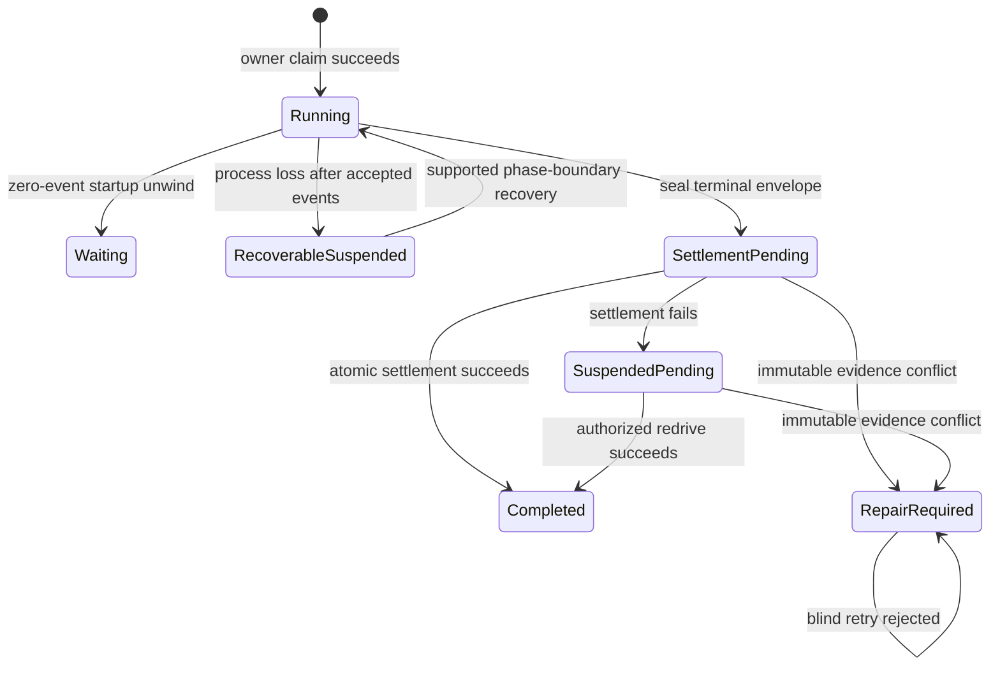
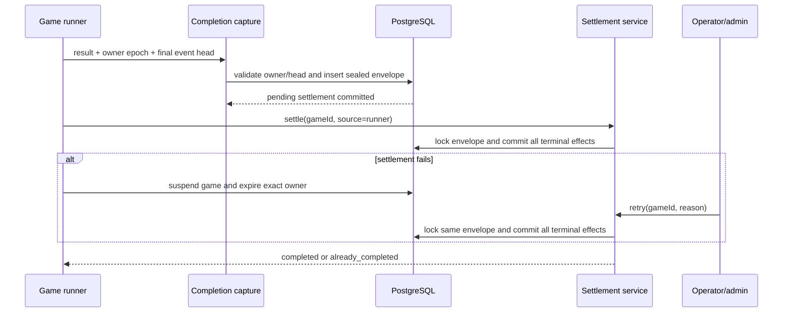

# Game Lifecycle Recovery Hardening - Plan

## Goal Capsule

- **Objective:** Preserve an engine-finished game's exact terminal outcome until the complete database settlement succeeds, while repairing the confirmed zero-event restart hole without broadening gameplay recovery beyond its existing safe boundaries.
- **Product authority:** Canonical events and the owner epoch authorize terminal capture. A sealed completion-settlement record ends gameplay permanently. Its stored result is the only authority for settlement redrive.
- **Execution profile:** Standard, DB-backed reliability work across the API lifecycle, startup classification, admin operations, producer inspection, and focused admin UI.
- **Stop conditions:** Stop if terminal capture cannot be tied to one active owner and exact canonical event head, if settlement redrive would need to reconstruct or override an outcome, or if a startup repair would reset a game with accepted canonical events.
- **Tail ownership:** Refresh the recovery vocabulary and operating docs, then close `docs/refactor-queue.md` item R7 only after the failure and redrive paths have DB-backed proof.

---

## Product Contract

### Summary

Split terminal completion into two durable steps: seal the exact engine result, then settle every completion side effect atomically from that record. A transient settlement failure leaves the game visibly suspended with a retryable completion settlement; an authenticated operator can redrive it without rerunning gameplay.

At API startup, an orphaned game that has an exact active owner, no accepted events, and no terminal record returns to `waiting` through the existing pre-play cleanup contract. Any positive event head, ambiguous ownership, or terminal record remains fail-closed.

### Problem Frame

`persistCompletedGame` currently writes transcripts, `game_results`, competition receipts and ratings, profile and account counters, game completion, owner closure, and the postgame-media placeholder inside one transaction. The transaction correctly prevents partial awards, but a late failure also erases the only complete terminal result. Startup recovery cannot use the terminal checkpoint to reconstruct the missing rankings, full transcript, or token usage, so the suspended game has no safe completion path.

Startup orphan classification has a different hole. The API currently suspends every pre-existing `in_progress` game before recovery. If the process dies after ownership moves a waiting game to `in_progress` but before the first canonical event is accepted, the game becomes suspended without a usable checkpoint even though the existing startup-failure contract can safely return that exact zero-event owner to `waiting`.

### Actors

| ID | Actor | Responsibility |
|---|---|---|
| A1. | Game runner | Produces the terminal result and requests capture and initial settlement under its owner epoch. |
| A2. | API startup lifecycle | Classifies orphaned execution as safe pre-play reset, gameplay recovery, or settlement-only recovery. |
| A3. | Game operator | Inspects a suspended game and deliberately retries an eligible completion settlement. |
| A4. | Producer MCP client | Inspects redacted recovery and completion-settlement state without mutation authority. |
| A5. | Player or viewer | Sees a truthful suspended or completed game state without a premature winner or false final result. |

### Requirements

**Terminal capture and settlement**

- R1. After the engine returns, the API must commit one versioned, hashed, game-unique completion envelope containing the exact result and settlement inputs before attempting any terminal side effect.
- R2. Capture must lock and validate the active owner epoch, its unexpired lease, the exact final event sequence and hash, and the terminal result's game identity before accepting the envelope.
- R3. The completion envelope must retain the winner, winner name, rounds, elimination order, ranked player IDs, full transcript, frozen token and per-action usage, resolved model and calculated cost, completion-config snapshot, original finish time, originating owner epoch, final event boundary, payload version, and payload hash.
- R4. Settlement must load the sealed envelope by game ID and atomically write transcripts, the unique game result, profile and account counters, free-track Elo, season ratings and points, competition receipts, completed game state, owner closure, and settlement completion.
- R5. Settlement must lock the game-unique settlement row and be idempotent under repeated or concurrent calls; no terminal side effect may be duplicated.
- R6. A transient failure after capture must retain the envelope, move the game to `suspended`, mark completion settlement `pending`, and preserve the original finish time for later settlement.
- R7. Missing or contradictory immutable competition evidence must move the sealed settlement to `repair_required`; blind retry must not substitute a current revision, rating snapshot, or newer policy.

**Startup and recovery classification**

- R8. Any game with a sealed completion envelope must be excluded from gameplay recovery because gameplay has ended permanently.
- R9. Startup may return an orphaned `in_progress` game to `waiting` only when one exact active owner has event head zero, the durable event log is empty, and no completion envelope exists.
- R10. Zero-event reset must use the existing owner-scoped startup-failure cleanup so owner closure, rating-snapshot removal, and waiting-roster reprojection keep their current authority and failure semantics.
- R11. A positive event head, owner/event disagreement, absent or ambiguous active ownership, or failed pre-play cleanup must remain suspended and diagnosable rather than being reset.
- R12. Both normal game start and Daily Free start must preserve preflight-before-claim behavior and must unwind a claimed zero-event owner when runner startup fails before play.

**Operator control, observability, and trust boundaries**

- R13. Completion retry must accept only the game identity plus operator audit context; the caller may not supply or alter the stored winner, rankings, transcript, usage, finish time, or owner boundary.
- R14. Only authenticated users with a dedicated `retry_game_settlement` permission may retry; the permission belongs to `admin` and `sysop`, not `gamer`, pure `producer`, or read-only admin access.
- R15. Every authenticated retry disposition must create a safe audit record covering actor, game, source, result hash, prior and resulting state, stable outcome or failure code, reason, and timestamps without raw errors or private payload data.
- R16. Admin reads and producer-only durable-run inspection must expose compact `not_applicable`, `pending`, `repair_required`, or `completed` state, retry eligibility, attempt count, result hash, boundary identity, and safe timestamps or failure code.
- R17. Producer and Management MCP must remain read-only for lifecycle recovery; this slice must not add start, restart, resume, or settlement mutation tools.
- R18. A pending or repair-required settlement must remain publicly suspended and non-final; the sealed winner and transcript must not leak through watch, results, MCP, or admin-list projections before settlement succeeds.
- R19. Successful settlement or an already-completed no-op must refresh the watch summary and run the existing idempotent postgame-media reconciliation without making media generation part of the settlement transaction.

**Contract maintenance**

- R20. Automated coverage must reproduce terminal capture followed by settlement failure, process restart with pending settlement, exact-once operator redrive, concurrent retry, zero-event startup reset, and positive-event fail-closed behavior.
- R21. `CONCEPTS.md`, `docs/statefulness-plan.md`, the startup-recovery solution, and `docs/refactor-queue.md` must describe the implemented boundary without claiming mid-phase, in-flight model, arbitrary historical, or multi-process recovery.

### Key Flows

- F1. Normal terminal completion
  - **Trigger:** A1 finishes gameplay under an active owner.
  - **Steps:** The API seals the terminal envelope, settles it once, marks the game completed, refreshes watch state, and reconciles postgame media.
  - **Outcome:** Players see one completed result and every terminal side effect exists exactly once.
  - **Covered by:** R1-R5, R19.

- F2. Settlement failure and operator redrive
  - **Trigger:** The envelope commits, but a later terminal database operation fails.
  - **Steps:** The game becomes suspended with a pending settlement. A3 inspects it and retries by game ID after the runner has exited. The service locks and settles the stored envelope.
  - **Outcome:** The same result completes without gameplay replay or outcome override.
  - **Covered by:** R6-R8, R13-R16, R18-R20.

- F3. Repair-required settlement
  - **Trigger:** Settlement finds missing or contradictory roster-freeze evidence.
  - **Steps:** The service records `repair_required`, suspends the game, and rejects repeated blind retries with a stable conflict.
  - **Outcome:** No ratings, points, receipts, results, or counters are fabricated.
  - **Covered by:** R7-R8, R15-R18.

- F4. API restart before play
  - **Trigger:** The process restarts after owner acquisition but before the first accepted event.
  - **Steps:** A2 verifies exact active ownership, zero owner head, an empty event log, and no terminal envelope, then runs owner-scoped pre-play cleanup.
  - **Outcome:** The game returns to `waiting` and can be started again; a roster reprojection problem is reported as repair-required cleanup rather than hidden.
  - **Covered by:** R9-R12, R20.

- F5. API restart after play began
  - **Trigger:** The process restarts with one or more accepted canonical events and no terminal envelope.
  - **Steps:** A2 suspends the orphan and passes it to the existing phase-boundary recovery selector.
  - **Outcome:** Supported coordinates recover automatically; unsupported coordinates remain suspended with diagnostics.
  - **Covered by:** R8-R11, R21.

### Acceptance Examples

- AE1. Captured result survives settlement failure
  - **Covers R1-R6, R18, R20.**
  - **Given:** The engine returns a winner and writes a terminal checkpoint under a valid owner.
  - **When:** A database failure occurs after the completion envelope commits but before terminal settlement commits.
  - **Then:** The complete envelope remains pending, the game and owner become suspended/expired, no settlement side effect exists, and public watch state is non-final with no winner.

- AE2. Restart does not replay a finished game
  - **Covers R6-R8, R16, R18, R20.**
  - **Given:** A game is suspended with a pending completion envelope.
  - **When:** The API restarts and scans recovery candidates.
  - **Then:** Gameplay recovery does not claim an owner, admin and producer inspection report pending settlement, and no terminal payload content is exposed.

- AE3. Operator redrive completes the exact outcome
  - **Covers R4-R6, R13-R16, R19-R20.**
  - **Given:** A pending settlement belongs to a suspended game.
  - **When:** An authorized operator confirms retry with an audit reason.
  - **Then:** Settlement loads the sealed envelope, completes the game with its original finish time, closes the exact originating owner, records a succeeded audit receipt, refreshes watch state, and schedules media reconciliation.

- AE4. Concurrent and repeated retries are harmless
  - **Covers R5, R13, R15, R19-R20.**
  - **Given:** Two authorized requests target the same pending settlement.
  - **When:** They race and a later request repeats after completion.
  - **Then:** One transaction performs terminal writes, the others return `already_completed`, and transcripts, results, points, ratings, receipts, counters, owner closure, and media placeholders remain singletons.

- AE5. Immutable evidence blocks settlement
  - **Covers R7, R13, R15-R18, R20.**
  - **Given:** The sealed result references a rated seat whose pinned revision or matching pregame snapshot is missing.
  - **When:** Initial settlement or an operator retry runs.
  - **Then:** The state becomes `repair_required`, retry returns a stable conflict, no awards are written, and the stored outcome is not changed.

- AE6. Restart before the first event returns to waiting
  - **Covers R9-R12, R20.**
  - **Given:** A start claim moved a game to `in_progress`, its exact owner remains active at head zero, no event exists, and no terminal envelope exists.
  - **When:** startup orphan classification runs.
  - **Then:** The owner closes through pre-play cleanup, freeze-time rating snapshots are removed, the game returns to `waiting`, and owned seats are reprojected or a repair disposition is recorded.

- AE7. Restart after an accepted event stays fail-closed
  - **Covers R8-R11, R20.**
  - **Given:** An orphaned game has a positive owner head or durable event.
  - **When:** startup classification runs.
  - **Then:** The game is suspended and may enter supported gameplay recovery; it is never returned to `waiting` by the zero-event path.

- AE8. Both start routes clean up post-claim startup failure
  - **Covers R10-R12, R20.**
  - **Given:** Provider preflight succeeds and either `POST /api/games/:id/start` or `POST /api/free-queue/start` acquires an owner.
  - **When:** runner construction or startup fails before an accepted event.
  - **Then:** The route reports failure and the exact owner-scoped cleanup leaves a startable waiting game rather than an unrecoverable suspended one.

- AE9. Read authority does not become mutation authority
  - **Covers R14-R17.**
  - **Given:** A pure producer token, a `view_admin`-only user, a gamer, and an authorized operator inspect the same pending settlement.
  - **When:** Each attempts to retry through available surfaces.
  - **Then:** All authorized read surfaces show the same redacted state, only the operator can invoke retry, denied authenticated attempts are audited, and no MCP lifecycle mutation tool exists.

### Success Criteria

- A terminal result can survive an injected post-capture failure and complete after restart without another `GameRunner` execution.
- Repeated and concurrent settlement calls produce one set of terminal rows and counters.
- A zero-event startup orphan becomes startable again while every positive-event or ambiguous case remains fail-closed.
- Admin, producer inspection, watch state, and results surfaces agree on pending versus completed state without leaking private terminal payload data.

### Scope Boundaries

**In scope**

- Durable terminal-result capture and whole-transaction completion redrive.
- Exact settlement state, retry eligibility, audit evidence, and operator-only retry through the admin surface.
- Producer-only read inspection through the existing durable-run tool.
- Characterization of both production start routes and repair of the exact zero-event startup orphan.
- Focused admin UI for inspecting and retrying eligible settlement work.
- Recovery documentation and closure of `docs/refactor-queue.md` item R7 after verification.

**Deferred**

- Lease-duration redesign, phase timeouts, aborting in-flight model calls, and the known long Diary Room/Council call risk.
- New checkpoint families, arbitrary mid-phase hydration, multi-process ownership, worker fleets, graceful drain orchestration, and bulk repair.
- Automatic or scheduled settlement redrive, MCP mutation authority, and operator-supplied outcome repair.
- Strategy Thread player-capsule hydration tracked by `docs/refactor-queue.md` item R12.
- Repairing historical suspended games that do not already have a sealed completion envelope.

### Dependencies and Assumptions

- The engine continues to write a terminal checkpoint and expose the final canonical event head before returning its result.
- Canonical events and the originating owner epoch remain the durable authority for accepting a terminal envelope.
- `completeCompetitionGameInTransaction` remains the authority for frozen-revision and rating-snapshot validation.
- A pending settlement remains represented by `games.status = suspended`; no new public game status is required.
- The original completion time is captured once and reused as `games.endedAt`, competition `earnedAt`, and the result finish time.
- Postgame media remains downstream, retryable, and non-fatal.

### Sources and Research

- `docs/refactor-queue.md`
- `docs/statefulness-plan.md`
- `docs/solutions/runtime-errors/api-startup-recovery-resumes-interrupted-games.md`
- `docs/solutions/architecture-patterns/analytics-first-season-iteration.md`
- `docs/solutions/architecture-patterns/house-highlights-postgame-media-pipeline.md`
- `CONCEPTS.md`
- `packages/engine/src/game-runner.ts`
- `packages/api/src/services/game-lifecycle.ts`
- `packages/api/src/services/competition-completion.ts`
- `packages/api/src/services/game-ownership.ts`
- `packages/api/src/services/startup-orphaned-games.ts`
- `packages/api/src/services/game-recovery.ts`
- `packages/api/src/services/game-durable-run.ts`
- `packages/api/src/routes/games.ts`
- `packages/api/src/routes/free-queue.ts`
- `packages/api/src/routes/admin.ts`

---

## Planning Contract

### Key Technical Decisions

- KTD1. **Treat sealed completion as a one-way lifecycle boundary.** `(session-settled: user-approved — chosen over replaying terminal gameplay from checkpoints: an exact engine result can be settled safely, while gameplay replay could produce a different outcome.)` A game with a completion envelope is never a gameplay-recovery candidate, even while its public game status remains suspended.
- KTD2. **Separate terminal capture from terminal settlement.** Capture commits the immutable envelope in its own owner-validated transaction. Settlement is a second transaction that locks that row and performs the entire current `persistCompletedGame` unit.
- KTD3. **Store one private, versioned completion envelope per game.** The payload includes the full transcript because no existing terminal checkpoint or result row can reconstruct it. Stable canonical serialization produces a payload hash used for idempotency, inspection identity, and audit correlation; reads never expose the payload.
- KTD4. **Use a dedicated completion-settlement state machine.** Stored states are `pending`, `repair_required`, and `completed`; read models derive `not_applicable` when no row exists. `pending` is retryable only after the game is suspended, `repair_required` is blocked, and `completed` is an idempotent no-op.
- KTD5. **Redrive the whole completion transaction.** Settlement owns transcript insertion, `game_results`, profile/account counters, free Elo, season ratings and points, receipts, game completion, exact owner closure, and settlement completion. Retrying only competition receipts would leave the surrounding effects unrecoverable.
- KTD6. **Trust the captured boundary on redrive.** Capture proves active owner, unexpired lease, final sequence, and final event hash once. Operator redrive acquires no new gameplay owner and cannot change the envelope. It may close only the exact originating owner from `active`, or from `expired` when that owner was expired by this settlement-pending suspension.
- KTD7. **Partition startup orphans before the existing blanket suspension.** The zero-event branch requires one active owner, owner head zero, empty durable event log, and no completion envelope. It calls `markOwnerStartupFailed`; every ambiguity falls through to suspension and existing recovery diagnostics.
- KTD8. **Keep settlement retry human/operator-gated.** `(session-settled: user-approved — chosen over automatic startup redrive or MCP mutation: retry is an operational repair action until its evidence and failure modes have production history.)` Initial settlement remains automatic; only post-failure redrive requires `retry_game_settlement`.
- KTD9. **Follow the existing admin audit pattern with a dedicated ledger.** The route requires a reason and `RETRY_SETTLEMENT` confirmation, performs its own authenticated permission check so denials can be recorded, and stores only stable codes and hashes. The domain retry primitive accepts game ID and actor context, never result fields.
- KTD10. **Expose one shared redacted settlement summary.** Admin game reads and `inspect_durable_run` use the same API read model. Producer MCP stays read-only and receives state, boundary identity, retry eligibility, attempts, safe failure code, and timestamps but no transcript, raw error, token detail, prompt, trace pointer, or checkpoint payload.
- KTD11. **Keep public completion gated by the settlement transaction.** The envelope is not joined into public watch/results projections. `game_results` and `games.status = completed` commit together, preventing a pending game from displaying a winner.
- KTD12. **Reconcile media only after durable completion.** The successful runner path and operator redrive both refresh watch state and invoke the existing idempotent media coordinator after the settlement transaction. Media failure remains non-fatal.

### High-Level Technical Design

The sealed-envelope transition ends gameplay. `SuspendedPending` is represented by `games.status = suspended` plus `completionSettlement.state = pending`; it does not create another public game status.

### Persistence Contract

Add two game-owned tables in migration `0039`:

- `game_completion_settlements`: one row per game with originating owner epoch, final event sequence and hash, payload schema version, private JSONB envelope, payload hash, state, attempt count, last safe failure code, captured/attempted/completed timestamps, and uniqueness/check constraints.
- `game_completion_settlement_attempts`: append-only operational receipts keyed to game and settlement where available, with source, actor, requested reason, outcome, prior/resulting state, result hash, safe failure code/metadata, and timestamp.

The envelope is immutable after insert. Only state, attempt metadata, and completion timestamps mutate. The settlement transaction locks the row `FOR UPDATE`; a completed row returns its stored receipt without touching terminal side effects.

### Startup Classification Matrix

| Terminal envelope | Active owner | Owner/event head | Startup action |
|---|---|---|---|
| Present, pending or repair-required | Any | Any | Keep/mark suspended; exclude gameplay recovery; expose settlement diagnostics. |
| Absent | Exactly one | Owner head `0`, event log empty | Run exact-owner pre-play cleanup and return to waiting. |
| Absent | Exactly one | Positive, mismatched, or invalid head | Suspend, then evaluate existing phase-boundary recovery. |
| Absent | Missing or ambiguous | Any | Suspend and report ownership diagnostics; never reset to waiting. |

### System-Wide Impact

- **Data lifecycle:** Pending settlements retain a duplicate private terminal transcript until completion and remain internal operational evidence afterward. The new tables follow game retention and cascade policy; no public or producer read returns the payload.
- **Authorization:** `retry_game_settlement` is granted only to `admin` and `sysop`. Existing producer OAuth and Management MCP scopes do not imply the permission.
- **Recovery:** Gameplay recovery and settlement recovery become disjoint. The former acquires a fresh owner at a supported checkpoint; the latter consumes a sealed result without a runner or new owner.
- **Watch/results:** Pending settlement is suspended and non-final. Only the atomic settlement creates `game_results` and publishes a winner.
- **Postgame media:** Completion redrive may invoke reconciliation more than once, relying on the existing idempotent coordinator and unique media row.

### Risks and Mitigations

- **Large terminal payloads:** Full transcripts duplicate data while pending. Keep the envelope private, game-unique, and versioned; measure representative payload size during implementation and avoid indexes on payload content.
- **Runner/operator race:** An operator could otherwise settle while the runner failure handler is still suspending the game. Permit manual retry only from suspended pending state. Completed requests repeat no terminal settlement writes, but the caller still refreshes watch state and invokes idempotent media reconciliation.
- **Owner-state rewrite:** Redrive must not close an unrelated expired owner. Compare game ID, originating owner epoch, settlement identity, and the pending-settlement failure reason in the same transaction.
- **Audit rollback:** Failed settlement transactions cannot contain their own durable failure receipt. Record failed/denied admin outcomes in a separate best-effort transaction following the existing cost-accounting audit pattern.
- **Legacy suspended games:** A terminal checkpoint without a completion envelope is insufficient. Leave those games suspended and report `not_applicable`/not retryable rather than inventing results.
- **Long in-flight calls:** This slice does not fix owner expiry during a Diary Room or Council model call. Keep that risk explicit in `docs/refactor-queue.md` or the current statefulness gap list.

### Migration and Rollback Safety

- Migration `0039` is additive and does not backfill historical games. A suspended legacy game without an envelope remains non-retryable.
- Apply the migration before starting code that can capture an envelope. The API must fail startup clearly if the new tables are unavailable; silent fallback to the old monolithic completion path is forbidden.
- After any envelope has reached `pending` or `repair_required`, do not roll back to a binary whose recovery selector is unaware of completion settlements while startup recovery is enabled. Disable `INFLUENCE_API_STARTUP_RECOVERY` before such a rollback, or retain the new exclusion classifier until all sealed terminal games are completed or explicitly accounted for.
- Do not drop the new tables during rollback while any non-completed settlement exists. The envelope is the only exact terminal outcome available for those games.
- Bound and sanitize operator reasons before audit storage. Do not return them through public or producer MCP reads.

### Sequencing

1. Add the schema, migration, envelope codec/hash contract, and read summary.
2. Extract capture and idempotent whole-transaction settlement services with DB-backed tests.
3. Integrate the runner failure/success paths and public watch gating.
4. Partition startup orphans and characterize both start routes.
5. Add permission, audit, admin action/UI, and producer inspection.
6. Run focused and full validation, then update recovery docs and close `docs/refactor-queue.md` item R7.

---

## Implementation Units

### U1. Add the durable completion-settlement contract

- **Goal:** Persist one private, immutable terminal envelope and append-only attempt evidence per game.
- **Requirements:** R1-R3, R15-R16.
- **Dependencies:** None.
- **Files:**
  - `packages/api/src/db/schema.ts`
  - `packages/api/drizzle/0039_*.sql`
  - `packages/api/drizzle/meta/0039_snapshot.json`
  - `packages/api/drizzle/meta/_journal.json`
  - `packages/api/src/services/game-completion-settlement.ts` (new)
  - `packages/api/src/__tests__/test-utils.ts`
  - `packages/api/src/__tests__/game-completion-settlement.test.ts` (new)
- **Approach:**
  - Define the settlement and attempt types, states, safe failure codes, sources, and checks.
  - Define a version-1 terminal envelope codec with strict runtime validation and stable canonical hashing.
  - Freeze the resolved model, calculated cost, and completion-config snapshot so a later code or pricing change cannot alter the redriven result metadata.
  - Make `gameId` unique, bind `ownerEpoch` to the durable owner, store final event sequence/hash, and keep payload/hash immutable after insert.
  - Add a shared redacted summary builder that derives `not_applicable` when no row exists and never returns the payload.
  - Extend test database cleanup for the new tables.
- **Test Scenarios:**
  - Identical recapture returns the existing envelope; a different payload, owner, head, or hash for the same game fails closed.
  - Capture rejects absent, inactive, expired, or head-mismatched ownership and a final event hash mismatch.
  - The redacted summary contains only approved state and identity fields.
- **Verification:** `bun test packages/api/src/__tests__/game-completion-settlement.test.ts`

### U2. Make whole-game completion idempotently settle from the envelope

- **Goal:** Replace the monolithic in-memory completion write with capture plus an atomic, redrivable settlement transaction.
- **Requirements:** R4-R7, R13, R19-R20.
- **Dependencies:** U1.
- **Files:**
  - `packages/api/src/services/game-completion-settlement.ts`
  - `packages/api/src/services/game-lifecycle.ts`
  - `packages/api/src/services/competition-completion.ts`
  - `packages/api/src/__tests__/game-completion-settlement.test.ts`
  - `packages/api/src/__tests__/game-lifecycle.test.ts`
  - `packages/api/src/__tests__/competition-completion.test.ts`
- **Approach:**
  - Move the full `persistCompletedGame` transaction behind `settleCapturedGameCompletion(gameId, context)`.
  - Lock the settlement row first, validate its payload/hash, and return `already_completed` before any write when state is completed.
  - Insert transcripts and results only inside this transaction; preserve existing competition, free-track, profile, account, game-config, and media-placeholder semantics.
  - Use the captured finish time for result, competition, account, and game timestamps.
  - Convert `CompetitionSettlementRepairRequiredError` to `repair_required` outside the rolled-back settlement transaction while preserving zero side effects.
  - Close the exact originating owner from active or the settlement-pending expired state; never acquire a recovery owner.
- **Test Scenarios:**
  - A captured envelope settles every current terminal side effect once.
  - A simulated crash after capture leaves all terminal side effects absent and later settlement succeeds.
  - Repeated and concurrent settlement calls do not duplicate transcripts, results, counters, Elo, ratings, points, receipts, or owner closure.
  - Missing/mismatched frozen evidence becomes repair-required and awards nothing.
  - A completed no-op repeats no terminal settlement writes, while its caller still refreshes watch state and invokes idempotent media reconciliation.
- **Verification:** `bun test packages/api/src/__tests__/game-completion-settlement.test.ts packages/api/src/__tests__/competition-completion.test.ts packages/api/src/__tests__/game-lifecycle.test.ts`

### U3. Integrate pending settlement into runner, watch, and recovery behavior

- **Goal:** Make post-capture failure visibly settlement-pending and permanently exclude it from gameplay replay.
- **Requirements:** R6-R8, R16, R18-R20.
- **Dependencies:** U2.
- **Files:**
  - `packages/api/src/services/game-lifecycle.ts`
  - `packages/api/src/services/game-recovery.ts`
  - `packages/api/src/services/game-watch-state.ts`
  - `packages/api/src/services/game-watch-state-summary.ts`
  - `packages/api/src/__tests__/game-recovery.test.ts`
  - `packages/api/src/__tests__/game-watch-state.test.ts`
  - `packages/api/src/__tests__/game-watch-state-summary.test.ts`
  - `packages/api/src/__tests__/game-lifecycle.test.ts`
- **Approach:**
  - Capture immediately after `runner.run()` and before the first completion side effect.
  - Distinguish pre-capture gameplay failure from post-capture settlement failure in the catch path; mark the latter with a stable completion-pending or repair-required reason.
  - Keep the failed game's owner expired and game suspended until manual redrive.
  - Exclude any game with a sealed settlement record from `findStartupRecoverableGameIds` and `getSupportedRecovery`, not only the legacy competition repair reason.
  - Keep public final state tied to completed status and committed `game_results`; never derive a winner from the private envelope.
  - Refresh and publish completed watch state only after settlement commits.
- **Test Scenarios:**
  - Post-capture failure broadcasts and stores suspended/pending rather than generic unrecoverable gameplay failure.
  - Startup recovery refuses pending and repair-required settlement games without claiming an owner.
  - Pending settlement remains non-final with no public winner; successful redrive becomes final with the sealed winner.
  - Legacy suspended games without envelopes keep existing gameplay-recovery behavior.
- **Verification:** `bun test packages/api/src/__tests__/game-lifecycle.test.ts packages/api/src/__tests__/game-recovery.test.ts packages/api/src/__tests__/game-watch-state.test.ts packages/api/src/__tests__/game-watch-state-summary.test.ts`

### U4. Repair the exact zero-event startup orphan and characterize start routes

- **Goal:** Return safely unstarted games to `waiting` while preserving fail-closed recovery for every accepted-event or ambiguous case.
- **Requirements:** R9-R12, R20.
- **Dependencies:** U1, U3.
- **Files:**
  - `packages/api/src/services/startup-orphaned-games.ts`
  - `packages/api/src/services/game-ownership.ts`
  - `packages/api/src/routes/games.ts`
  - `packages/api/src/routes/free-queue.ts`
  - `packages/api/src/__tests__/startup-orphaned-games.test.ts`
  - `packages/api/src/__tests__/game-ownership.test.ts`
  - `packages/api/src/__tests__/games-api.test.ts`
  - `packages/api/src/__tests__/free-queue.test.ts`
- **Approach:**
  - Load the active owner, durable event head/count, and completion-settlement presence before classifying each startup orphan.
  - Call `markOwnerStartupFailed` only for the exact zero-event predicate and record its roster disposition.
  - Preserve blanket suspension as the fallback for positive events, owner mismatch, no active owner, multiple/invalid evidence, cleanup conflict, and terminal settlement.
  - Characterize provider preflight failure before ownership and runner/startup failure after ownership through both production start routes.
  - Patch route orchestration only where a failing characterization test proves cleanup is skipped or obscured; do not introduce a new start framework.
- **Test Scenarios:**
  - Recent and old zero-event active owners both return to waiting because event acceptance, not age, is the authority.
  - A positive owner head, a durable event, a missing active owner, or a pending settlement remains suspended.
  - Roster reprojection failure reports repair-required cleanup while the authoritative owner teardown and waiting transition remain committed.
  - Both start routes leave provider-preflight failures unclaimed and post-claim pre-play failures startable again.
- **Verification:** `bun test packages/api/src/__tests__/startup-orphaned-games.test.ts packages/api/src/__tests__/game-ownership.test.ts packages/api/src/__tests__/games-api.test.ts packages/api/src/__tests__/free-queue.test.ts`

### U5. Add operator retry, audit, admin UI, and producer inspection

- **Goal:** Make pending settlement legible and safely operable without granting recovery mutation to MCP clients.
- **Requirements:** R13-R19.
- **Dependencies:** U2-U4.
- **Files:**
  - `packages/api/src/db/rbac-seed.ts`
  - `packages/api/src/routes/admin.ts`
  - `packages/api/src/services/game-durable-run.ts`
  - `packages/api/src/game-mcp/server.ts`
  - `packages/api/src/__tests__/admin-routes.test.ts`
  - `packages/api/src/__tests__/production-game-mcp-server.test.ts`
  - `packages/api/src/__tests__/production-game-mcp-read-model.test.ts`
  - `packages/api/src/__tests__/trace-mcp.test.ts`
  - `packages/web/src/lib/api.ts`
  - `packages/web/src/app/admin/games/game-history-browser.tsx`
- **Approach:**
  - Seed `retry_game_settlement` for admin/sysop and keep producer, gamer, and read-only roles unchanged.
  - Add an authenticated admin retry endpoint that requires a reason and exact confirmation, manually checks the permission for denied-attempt audit, and passes only game ID plus actor context to the service.
  - Record succeeded, already-completed, denied, failed, invalid-state, and repair-blocked outcomes with safe metadata.
  - Include the shared redacted summary in admin game/durable-run reads and producer `inspect_durable_run`; do not add an MCP write tool or expose the envelope.
  - Show pending/repair-required state in the existing suspended-game admin area. Render retry only when eligible and permitted, with confirmation, progress, and final disposition.
  - After success or completed no-op, refresh watch state and invoke media reconciliation outside the settlement transaction.
- **Test Scenarios:**
  - Admin/sysop can retry; gamer, pure producer, and `view_admin`-only users cannot.
  - Authenticated denial and every terminal retry outcome create safe audit evidence that survives a failed settlement transaction.
  - Producer inspection matches admin state and excludes raw errors, payload, transcript, token detail, prompts, and private checkpoint/trace fields.
  - Tool discovery for producer and subject profiles contains no lifecycle mutation tool.
  - The admin action disables duplicate submission and renders already-completed, repair-required, and failed responses truthfully.
- **Verification:** `bun test packages/api/src/__tests__/admin-routes.test.ts packages/api/src/__tests__/production-game-mcp-server.test.ts packages/api/src/__tests__/production-game-mcp-read-model.test.ts packages/api/src/__tests__/trace-mcp.test.ts`

### U6. Refresh the recovery contract and close `docs/refactor-queue.md` item R7

- **Goal:** Make the implemented lifecycle boundary discoverable and remove only the queue item proven complete.
- **Requirements:** R21.
- **Dependencies:** U1-U5 and all Verification Contract gates.
- **Files:**
  - `CONCEPTS.md`
  - `docs/statefulness-plan.md`
  - `docs/solutions/runtime-errors/api-startup-recovery-resumes-interrupted-games.md`
  - `docs/refactor-queue.md`
- **Approach:**
  - Define completion envelope and completion settlement alongside owner epoch, checkpoint capsule, and phase-boundary startup resume.
  - Document the three restart branches: zero-event pre-play unwind, supported gameplay recovery, and terminal settlement-only recovery.
  - Update the supported recovery-coordinate wording that currently understates implemented endgame coverage.
  - Preserve the explicit limits around long in-flight calls, mid-phase recovery, player Strategy Thread hydration, and multi-process operation.
  - Remove R7 from the queue only after the injected-failure, restart, authorization, exact-once, and watch-state proofs pass. Keep any newly reproduced out-of-scope lifecycle failure as a concrete queue item with a validation path.
- **Test Scenarios:**
  - Documentation names the same states and authority boundaries as code.
  - No document claims general crash safety or automatic settlement retry.
- **Verification:** Review the four documents against the implemented tests and state transitions; run `git diff --check`.

---

## Verification Contract

### Focused DB and API proof

Run the unit-specific commands above against local PostgreSQL on `127.0.0.1:54320`. If sandboxed execution reports `ECONNREFUSED`, rerun with the required elevated local access before diagnosing the database as unavailable.

The minimum acceptance suite must prove:

- capture commits before an injected settlement failure;
- restart never invokes gameplay recovery for a sealed terminal result;
- operator redrive completes the stored result without runner execution;
- concurrent/repeated calls are exact-once across every terminal side effect;
- repair-required evidence remains blocked;
- zero-event orphan cleanup and positive-event suspension diverge at the accepted-event boundary;
- both production start routes preserve preflight and owner-cleanup semantics;
- pending watch/results state is non-final and private-payload-safe;
- operator authorization, denied-attempt audit, and MCP read-only boundaries hold.

### Repository gates

- `bun run test`
- `bun run check`
- `git diff --check`

### Manual product proof

Using a local DB fixture or deliberately faulted development game:

1. Stop completion after envelope capture and confirm the admin game row shows suspended/pending with no public winner.
2. Restart the API and confirm the same state remains without new owner/gameplay activity.
3. Retry as an authorized operator and confirm the game becomes completed with the original result and finish time.
4. Retry again and confirm the UI reports already completed without new terminal rows or media jobs.
5. Inspect the game with producer `inspect_durable_run` and confirm the compact state matches admin while the private envelope is absent.
6. Create a claimed zero-event start orphan, restart the API, and confirm it returns to waiting and can start normally.

---

## Definition of Done

- R1-R21 and AE1-AE9 are covered by implementation and named verification evidence.
- The terminal envelope is captured under an exact owner/event boundary before settlement and cannot be caller-overridden.
- Whole-game settlement is atomic and idempotent under failure, restart, repetition, and concurrency.
- Pending and repair-required completion work never enters gameplay recovery or leaks a premature final result.
- The exact zero-event startup orphan returns to waiting; all positive-event and ambiguous cases remain fail-closed.
- Admin/sysop can inspect and retry with audit evidence; producer and Management MCP remain read-only.
- Focused tests, `bun run test`, `bun run check`, and `git diff --check` pass with real reported results.
- Recovery docs match the shipped behavior, and `docs/refactor-queue.md` item R7 is removed only after its validation path passes.
- Migration ordering and rollback safeguards are documented and exercised before enabling capture in staging or production.
- Abandoned fault-injection, alternate schema, and experimental orchestration code is removed from the final diff.
- The final handoff names any still-unsupported local restart reproduction instead of implying general crash safety.
