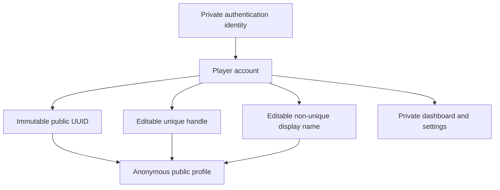
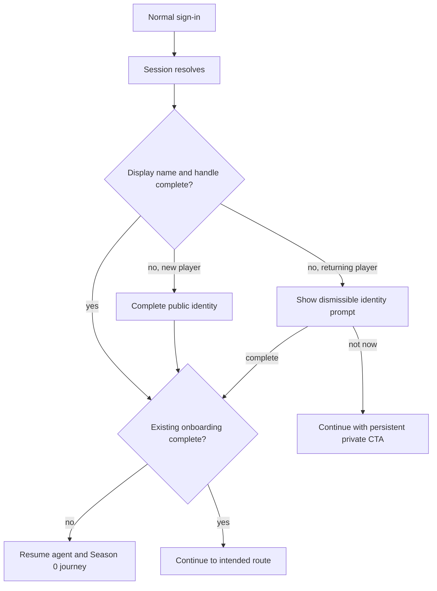
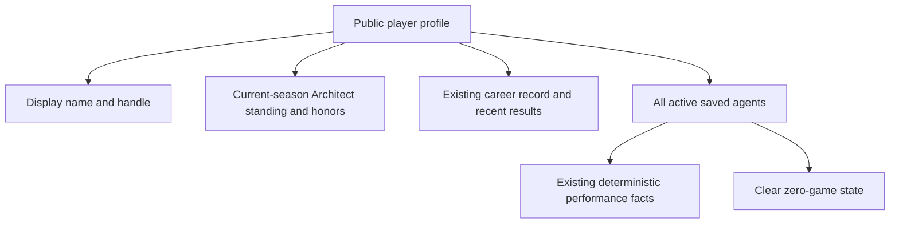
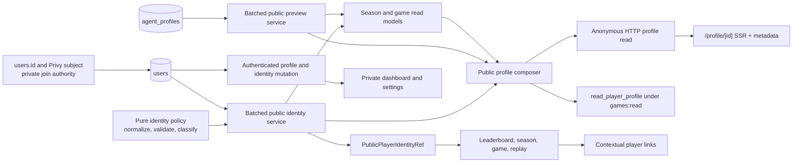
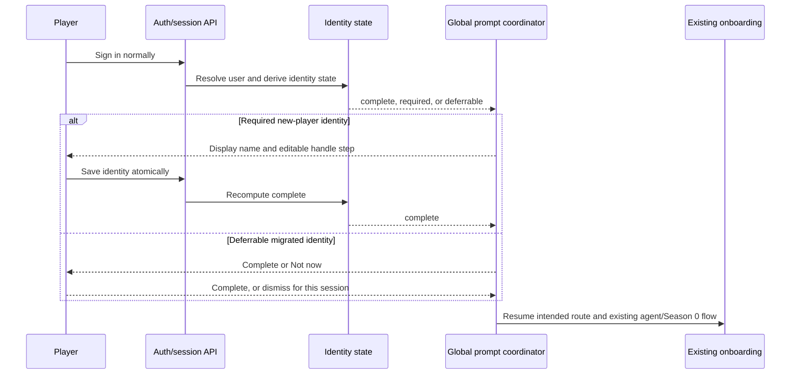
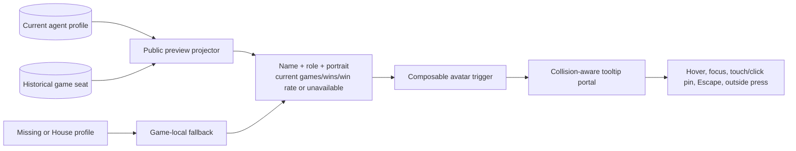

# Public Player Identity and Agent Discovery - Plan

## Goal Capsule

- **Objective:** Give every player a safe, human-readable public identity and an anonymously shareable competitive profile, then make player names and agent portraits consistently actionable across Influence.
- **Product authority:** The public profile is a competitive identity and discovery surface; the dashboard, account details, agent editing, strategy configuration, and private artifacts remain owner-only.
- **Authority hierarchy:** Public handles and public UUIDs identify profiles; authentication-provider subjects and internal user IDs never become public identity contracts.
- **Open blockers:** None.
- **Execution profile:** Deep cross-stack feature work spanning a staged PostgreSQL migration, authenticated identity mutation, anonymous REST and MCP reads, Next.js public routes, global onboarding orchestration, shared interaction primitives, contract migrations, documentation, and browser verification.
- **Primary execution path:** Establish identity authority first; build private onboarding, public reads, and the preview primitive on that foundation; migrate contextual contracts and avatar call sites; finish with privacy, compatibility, and anonymous browser proof.
- **Completion signal:** Every acceptance example is covered by a named test or browser scenario, no public contract contains an internal account identifier, and representative avatar surfaces pass hover, focus, touch, overflow, and parent-action checks.
- **Stop conditions:** Stop rollout if the staged UUID migration cannot prove complete backfill and uniqueness, if any session-resolution path can downgrade a new player to dismissible onboarding, or if public contract sentinels find private fields.

---

## Product Contract

### Summary

Influence will add a public player identity with an immutable public UUID, a preferred unique handle, and an anonymously shareable profile built from existing season, career, result, and agent facts.
Existing player-name surfaces will link to profiles, while agent portraits will use one accessible hover, focus, and touch preview across the app.

### Problem Frame

The current profile is an authenticated account page that combines public-looking competition statistics with private wallet, email, editing, and invite-code controls.
Influence has no anonymous player-profile route, while some public leaderboard and season contracts expose the internal `users.id` identity used by authentication and legacy account matching.

Player names are therefore dead ends instead of discovery paths.
Agent portraits are also inconsistent: dashboard surfaces have an accessible portrait preview, but game, lobby, watch, replay, and results surfaces still render bare avatars.

The product already has enough public season, career, and game facts for a credible competitive résumé.
This slice should organize and connect those facts rather than inventing another scoring system, generated summary, or analytics store.

### Key Decisions

- **Build the complete public identity foundation now.** (session-settled: user-directed — chosen over a UUID-only first phase: human-readable profile URLs should launch with public profiles instead of becoming a later retrofit.) Every player receives an immutable public UUID, while the handle is the preferred URL identity.
- **Keep authentication outside onboarding.** (session-settled: user-directed — chosen over treating sign-in as an onboarding step: the existing sign-in entry remains unchanged and the app resumes from the first incomplete onboarding stage after the session resolves.)
- **Make identity mandatory for new players and recoverable for existing players.** (session-settled: user-directed — chosen over immediately blocking migrated users: new players complete identity before the existing agent and Season 0 journey, while returning players without handles may dismiss the prompt for the session and recover through persistent private CTAs.)
- **Lead with display name and derive the handle.** (session-settled: user-directed — chosen over making handle selection the primary task: display names are human-facing and non-unique, while a URL-safe handle is generated, auto-suffixed on collision, and remains editable before confirmation.)
- **Let handles change without redirects.** (session-settled: user-directed — chosen over immutable handles or permanent aliases: a changed handle breaks the old handle URL and the released value may be claimed again.) The immutable public UUID remains the stable fallback for the same player.
- **Publish every active saved agent.** (session-settled: user-directed — chosen over played-only or owner-curated rosters: an unplayed agent is still part of the owner's public roster and shows an honest empty competitive record.)
- **Use deterministic existing facts only.** (session-settled: user-directed — chosen over player-authored or House-generated summaries: the first profile and agent summaries use current public season, career, placement, win, and result facts without new metrics or narrative generation.)
- **Lead the résumé with the current season.** (session-settled: user-directed — chosen over career-first or roster-first framing: current Architect standing and honors establish the competitive moment before career and roster depth.)
- **Use existing surfaces as the discovery network.** (session-settled: user-directed — chosen over player search or a public directory: contextual links from leaderboards, standings, games, and results provide discovery in this slice.)
- **Keep agents previewable rather than independently public.** (session-settled: user-directed — chosen over standalone public agent pages: agents remain owner-editable in private management surfaces and non-owners receive the standard portrait-and-stats preview.)
- **Preserve replay facts without adding avatar history.** (session-settled: user-directed — chosen over a new game-time avatar snapshot: replay previews keep the game-time name and role but use the current avatar and clearly labeled current statistics.)

### Actors

- A1. **Anonymous visitor:** Opens or receives a public player URL without signing in.
- A2. **Player:** Owns a public identity, private dashboard, and saved agents.
- A3. **Returning player without a handle:** Has an existing account and can defer identity completion for the current session.
- A4. **Saved agent:** Appears on its owner's public roster and in the standard preview without exposing private configuration.
- A5. **Authorized administrator:** May retain a richer permissioned agent preview without expanding public data.

### Requirements

**Public identity and URL contract**

- R1. Every player must have an immutable, opaque public UUID that is distinct from authentication-provider subjects and internal user identifiers.
- R2. Existing players must receive a public UUID through migration without changing account ownership, game history, agent ownership, or private authentication behavior.
- R3. A player may claim one case-insensitively unique, URL-safe handle that cannot use a UUID-shaped value or a reserved product route or system identity.
- R4. The onboarding flow must lead with a non-unique display name, derive an editable handle from it, and automatically choose an available suffixed handle when the first derived value is taken.
- R5. A player may change their handle; the old handle must stop resolving to that player, no redirect or handle-history contract is created, and the released handle may be claimed again.
- R6. A public profile must resolve anonymously by preferred handle or immutable public UUID, with the handle presented as the preferred share URL when one exists.
- R7. Public player contracts must use public identity references and must not expose internal `users.id` values, Privy subjects, email addresses, or wallet addresses as profile identifiers.

**Onboarding and private ownership**

- R8. Existing sign-in behavior must remain unchanged; after session resolution, the app must derive the first incomplete onboarding stage from current account state.
- R9. A new player must complete display name and handle setup before continuing into the existing agent-creation and Season 0 onboarding journey.
- R10. A returning player without a handle must receive the identity onboarding prompt after session resolution, may dismiss it for that session, and must retain a `Complete your public profile` action on the private dashboard and private profile view.
- R11. Identity completion must derive from the required identity fields and must not add a separate persisted onboarding-progress model.
- R12. `/dashboard/profile` must remain an authenticated settings surface for identity edits, private account details, and a link to the owner's public profile.
- R13. The invite-code section must render only when the player has at least one available invite code; invite-code enforcement and distribution policy remain unchanged.
- R14. Agent creation, editing, private configuration, and deletion must remain owner-only even though the agent appears on a public roster.

**Public competitive profile**

- R15. The public profile must load without authentication and expose only public identity and competition facts.
- R16. The profile header must present the player's display name and, when one exists, preferred handle without exposing private account details.
- R17. The profile résumé must lead with current-season Architect standing and honors, then present existing career record and recent public results where available.
- R18. The profile must list every active saved agent owned by the player, including agents with zero games.
- R19. Each roster entry must use existing deterministic public facts such as portrait, agent name, role, games, wins, win rate, current-season points or rank, placements, and recent results when those facts already exist.
- R20. Unplayed agents must show a clear zero-game state rather than fabricated rankings, trends, or summaries.
- R21. Public roster and profile reads must omit personality prompts, backstory, strategy configuration, revisions, reasoning, cognitive artifacts, provider details, account contact data, and administrator-only fields.
- R22. The public profile must not create or persist new performance metrics, summaries, ratings, or analytics facts.

**Actionable names and agent previews**

- R23. Player display names on existing public leaderboards, standings, games, results, and other user-facing surfaces must link to the player's public profile when a public player identity exists.
- R24. Anonymous, House-controlled, or otherwise non-player identities must remain non-links rather than pointing to invented profiles.
- R25. Every user-facing agent portrait must support the standard preview wherever the product renders an agent avatar, including profiles, game lobbies, live or watch surfaces, replays, results, queue surfaces, and dashboards.
- R26. The standard preview must support hover, keyboard focus, and touch or click pinning, and must remain dismissible through established keyboard and pointer behavior.
- R27. The standard preview must show a larger portrait, agent name, public role, and existing deterministic public statistics with clear empty states when facts are unavailable.
- R28. Public surfaces must not receive administrator-only details merely because the administrator preview is richer; authorized admin surfaces may retain an expanded variant behind their existing permission boundary.
- R29. Replay and completed-game previews must preserve the name and role used in that game while showing the agent's current portrait and clearly labeled current statistics when the persistent agent still exists.
- R30. Historical seats without a live public agent profile must still render a useful preview from game-local facts and must not fail the replay or invent an owner link.

### Key Flows

- F1. **New player completes identity before existing onboarding**
  - **Trigger:** A first-time player completes normal sign-in.
  - **Actors:** A2.
  - **Steps:** The session resolves; the app finds missing identity; display name generates an editable available handle; the player confirms; the existing agent and Season 0 journey resumes.
  - **Outcome:** The player enters Influence with a shareable public identity and no authentication identifier in the public contract.
  - **Covered by:** R1-R4, R8-R9.
- F2. **Returning player defers identity completion**
  - **Trigger:** An existing player without a handle returns and signs in.
  - **Actors:** A3.
  - **Steps:** The app detects missing identity; the player chooses `Not now`; the prompt stays dismissed for the session; dashboard and private profile CTAs remain available.
  - **Outcome:** Migration does not lock an existing player out, while identity completion remains visible and recoverable.
  - **Covered by:** R8, R10-R12.
- F3. **Anonymous visitor opens a public profile**
  - **Trigger:** A visitor follows a shared handle or public UUID URL.
  - **Actors:** A1, A2, A4.
  - **Steps:** The public route resolves the player; it returns public identity, existing competition facts, and the full active agent roster without requiring a session.
  - **Outcome:** The visitor can understand the player's current competitive identity without seeing private account or strategy data.
  - **Covered by:** R6-R7, R15-R22.
- F4. **Player changes a handle**
  - **Trigger:** The owner edits the handle from the private profile.
  - **Actors:** A2.
  - **Steps:** The owner sees that old links will break; a unique replacement is saved; the old handle stops resolving to that player; the immutable public UUID continues to resolve the same profile.
  - **Outcome:** Handle behavior matches familiar editable-username expectations without an alias-history system.
  - **Covered by:** R3-R6, R12.
- F5. **Visitor discovers a player contextually**
  - **Trigger:** A visitor sees a player name on an existing leaderboard, standing, game, or result surface.
  - **Actors:** A1, A2.
  - **Steps:** The visitor follows the name link to the public profile and may inspect the player's active agent roster.
  - **Outcome:** Existing product surfaces provide discovery without a new directory or search product.
  - **Covered by:** R23-R24.
- F6. **Visitor previews an agent**
  - **Trigger:** A visitor hovers, focuses, or touches an agent portrait.
  - **Actors:** A1, A4.
  - **Steps:** The standard preview opens with a larger portrait, role, and existing public statistics; the visitor dismisses it with the established keyboard or pointer behavior.
  - **Outcome:** Agent identity and performance are legible without navigating to a public agent page.
  - **Covered by:** R25-R28.
- F7. **Visitor previews an agent in a replay**
  - **Trigger:** A visitor opens a completed-game or replay surface after the agent has been edited.
  - **Actors:** A1, A4.
  - **Steps:** The preview keeps the game-time name and role, uses the current portrait and labeled current statistics when available, and falls back to game-local facts when the persistent profile is unavailable.
  - **Outcome:** The replay stays truthful within the accepted no-avatar-snapshot boundary.
  - **Covered by:** R29-R30.

### Acceptance Examples

- AE1. **Covers R1-R4, R8-R9.** Given a first-time player signs in normally with display name `Flick`, when `flick` is available, then the identity step proposes that editable handle and continues to existing onboarding only after confirmation.
- AE2. **Covers R3-R4.** Given `flick` is already claimed, when a new player enters display name `Flick`, then the identity step proposes an available suffixed handle and still allows editing before save.
- AE3. **Covers R8, R10-R12.** Given a migrated player has no handle, when they return and dismiss identity onboarding, then normal use continues for that session and both the dashboard and private profile retain a completion CTA.
- AE4. **Covers R3-R6.** Given a player changes from `flick` to `oxflick`, when the change succeeds, then `/profile/oxflick` resolves that player, the immutable public UUID still resolves that player, and `/profile/flick` no longer resolves them unless another player later claims it.
- AE5. **Covers R6-R7, R15-R16, R21.** Given an anonymous visitor opens a public profile, when the response loads, then it contains public identity and competition facts but no internal user ID, Privy subject, email, wallet, prompt, strategy configuration, or private artifact.
- AE6. **Covers R17-R20.** Given a player has one proven agent and one unplayed active agent, when the public profile loads, then the current-season player résumé leads and both agents appear, with the unplayed agent showing a zero-game state.
- AE7. **Covers R13.** Given a signed-in player has zero available invite codes, when the private profile loads, then no invite-code section or empty-state card appears; one or more available codes make the section visible.
- AE8. **Covers R23-R24.** Given a public standing contains a real player and a House-controlled identity, when the surface renders, then the player name links to the public profile and the House identity remains plain text.
- AE9. **Covers R25-R28.** Given a keyboard user focuses an agent portrait in a lobby, replay, result, or profile roster, when the standard preview opens, then the larger portrait and existing public statistics are available and Escape dismisses the preview without exposing admin-only data.
- AE10. **Covers R29-R30.** Given an agent changes its avatar after a completed game, when that game is replayed, then the preview preserves the game-time name and role but shows the current avatar and labels current statistics; a deleted or unavailable profile falls back to game-local facts.
- AE11. **Covers R7, R23.** Given a public leaderboard or season standing currently identifies a player through an internal user reference, when public identity ships, then its public contract and profile link use the new public identity instead.
- AE12. **Covers R22.** Given the public profile and preview are implemented, when their values are compared with existing season, career, and result facts, then no new score, generated summary, trend, or analytics record is required to render them.

### Success Criteria

- An anonymous visitor can open and share `/profile/{handle}` for a player with a completed identity.
- Public profile, leaderboard, season, and contextual-link contracts expose no authentication-provider subject or internal user ID as the player's identity.
- A new player completes public identity before the existing agent and Season 0 journey, while a returning player without a handle can defer for the current session and recover from persistent private CTAs.
- The public profile leads with current-season competitive identity, lists every active agent, and renders only existing deterministic facts.
- Player names lead to profiles and agent portraits produce the same accessible standard preview across representative dashboard, queue, lobby, live/watch, replay, result, and profile surfaces.
- The private dashboard, account fields, agent management, strategy configuration, and private artifacts remain private.

### Scope Boundaries

- Player search, a public player directory, follow or social-graph features, and standalone public agent pages are deferred.
- Favorite or starred agent ordering is deferred; the first roster includes every active saved agent without owner-controlled ranking.
- Owner-controlled agent visibility is deferred; the first roster has no public/private toggle.
- New performance metrics, scoring models, generated narratives, owner-authored summaries, new ratings, and analytics persistence are out of scope.
- Data-model additions beyond the mandatory public UUID and handle are out of scope; display name already exists and onboarding completeness derives from identity state.
- Handle aliases, redirects, history, cooldowns, and anti-reuse persistence are out of scope; changing a handle may break an old URL or allow it to resolve another player later.
- Historical avatar snapshots, avatar revision expansion, and audit-history reconstruction are out of scope; old replays may show the current profile portrait.
- Invite-code enforcement, distribution, and administration are out of scope; only the zero-code private-profile presentation changes.
- The public profile must not absorb private dashboard controls, account contact data, agent editing, prompts, backstory, strategy, reasoning, cognitive artifacts, provider data, or administrator fields.

### Dependencies and Assumptions

- Existing public season standings, honors, career totals, placements, and result facts are sufficient for the first competitive résumé and agent summaries.
- Some legacy accounts may use an internal user ID that is not the current Privy subject because authentication matches an existing wallet-linked row first; every internal ID remains private regardless of origin.
- The existing onboarding experience is derived from agent, game, queue, and account state rather than a persisted step machine; identity completeness can follow the same state-derived model.
- Game seats preserve historical name and role facts, while the current replay path uses the live agent profile portrait; the accepted product behavior matches that constraint.
- Historical game seats may not always resolve to a live public agent profile, so game-local fallback presentation is required.

### Sources and Research

- `packages/api/src/db/schema.ts`
- `packages/api/src/routes/auth.ts`
- `packages/api/src/routes/profile.ts`
- `packages/api/src/routes/free-queue.ts`
- `packages/api/src/routes/games.ts`
- `packages/api/src/routes/seasons.ts`
- `packages/api/src/services/season-read-model.ts`
- `packages/api/src/services/game-watch-state.ts`
- `packages/api/src/services/owned-seat-projection.ts`
- `packages/api/src/services/agent-profile-management.ts`
- `packages/web/src/app/dashboard/profile/profile-content.tsx`
- `packages/web/src/app/dashboard/dashboard-mission-control.ts`
- `packages/web/src/components/standing-daily-agent-prompt.tsx`
- `packages/web/src/components/agent-avatar-preview.tsx`
- `packages/web/src/app/games/[slug]/components/game-info.tsx`
- `packages/web/src/app/games/[slug]/components/house-highlights-card.tsx`
- `packages/web/src/app/games/[slug]/components/match-watch-shell.tsx`
- `packages/web/src/app/games/[slug]/components/dramatic-replay-viewer.tsx`
- `packages/web/src/app/games/[slug]/components/completed-results-agent-card.tsx`
- `docs/solutions/architecture-patterns/analytics-first-season-iteration.md`
- `docs/plans/2026-06-21-001-feat-dashboard-mission-control-plan.md`
- `docs/plans/2026-07-12-001-feat-standing-daily-agent-queue-plan.md`

---

## Planning Contract

### Product Contract Preservation

**Product Contract preservation:** changed: R16 — clarified that a preferred handle is presented only when one exists, matching the already-confirmed UUID fallback in R6. No product behavior or scope changed. Planning decisions below choose implementation seams and validation depth; they do not add another public identity tier, persisted metric, onboarding-progress model, public agent page, or private-data exception.

### Key Technical Decisions

- **KTD1 — Two-column identity foundation.** (session-settled: user-directed — chosen over UUID-only delivery or additional identity-state columns.) Add only `users.public_id` and `users.handle`. Keep `users.id` as the private primary key for every existing foreign key and authentication path. Database guards make `public_id` immutable after backfill and require its text value to differ from `users.id`.
- **KTD2 — Staged public UUID migration.** Add `public_id` nullable, set a database default for future inserts, backfill existing rows, verify completeness and uniqueness, add the unique index, then set `NOT NULL`. PostgreSQL 16 supplies `gen_random_uuid()`; no UUID extension or application-side backfill loop is needed.
- **KTD3 — Canonical handle authority.** Store lowercase ASCII handles with a 3–30 character URL-safe grammar, leading and trailing alphanumeric characters, and interior alphanumerics or hyphens. Reject UUID-shaped values and a versioned reserved-name set. Enforce canonical form and case-insensitive uniqueness in PostgreSQL; UI availability and suffix suggestions remain advisory.
- **KTD4 — Atomic mutable handles.** (session-settled: user-directed — chosen over immutable handles, redirect history, or retained aliases.) Save display name and handle in one database update. A failed replacement preserves the old handle; case-only edits are no-ops; released handles become immediately reusable. Application validation and a database guard both reject a non-null handle returning to null while allowing null→handle and handle→different-handle transitions.
- **KTD5 — State-derived onboarding enforcement.** (session-settled: user-directed — chosen over a third persisted onboarding marker.) Derive `complete`, `required`, or `deferrable` on the server from safe display-name state, handle presence, and `users.createdAt` against one fixed UTC identity-launch cutoff. A complete identity remains complete regardless of timestamp. For an incomplete identity, strictly parsed `createdAt < cutoff` is deferrable and `createdAt >= cutoff` is required; a missing or invalid timestamp fails closed as required, emits a structured diagnostic, and blocks rollout when found by preflight. Return the same derived state from normal login, current-session, local-session, and private-profile reads so reload or re-login cannot make an unfinished new account dismissible.
- **KTD6 — One global prompt owner.** Identity setup runs after authentication and any active invite gate, before the existing agent/Season 0 and Standing Daily prompts. A deferrable dismissal uses `sessionStorage` keyed by public UUID; the provider explicitly clears the dismissal when authentication becomes absent or the authenticated public UUID changes, while a new browser session naturally starts clean. The existing navigation sign-in control remains the sole ordinary sign-in callout.
- **KTD7 — Explicit layered public projections.** Build `PublicPlayerIdentityRef`, `PublicPlayerProfile`, and `PublicAgentPreview` from allowlisted columns. Pure identity policy lives below DB-backed batched identity and preview services; season/game models depend on those lower-level services; the profile composer depends on identity, preview, and season models. Lower-level services never import the profile or season composer. Never reuse an owned/admin serializer and subtract fields. Internal IDs may support joins and stable ordering inside a service but never enter public DTOs.
- **KTD8 — REST and MCP read parity.** (confirmed plan scoping — chosen over web-only profile discovery.) A distinct anonymous player-route module and read-only `read_player_profile` MCP tool use the same versioned transport-neutral envelope. The MCP tool stays under `games:read`; no search, public agent-detail, or profile-mutation tool is added. Its output schema closes every object with `additionalProperties: false`, and runtime validation occurs before `structuredContent` or JSON text emission. Existing season/game MCP reads replace internal owner IDs with the same public identity reference.
- **KTD9 — Existing facts, truthful sources.** (session-settled: user-directed — chosen over generated summaries or new statistics.) Use account career totals and rating for the player résumé, season standings and honors for the current competitive context, agent-profile games/wins/win rate for roster previews, and completed visible Free-game competition receipts for recent results. Do not use the current coarse player-game-history placement fallback.
- **KTD10 — Mutable identity is uncached across requests.** Resolve canonical UUID-shaped segments by public UUID and all other valid segments by normalized handle. Use request-scoped React memoization only. Success, malformed, and not-found API responses carry `Cache-Control: no-store`, and Next profile fetches use `cache: "no-store"`, so handle creation, change, and reuse cannot be masked by positive or negative caches. UUID URLs render without redirect and advertise the handle URL as canonical when present.
- **KTD11 — Historical preview projection and explicit contract versions.** (session-settled: user-directed — chosen over avatar snapshots.) Public game and watch payloads add an optional current preview projection while retaining game-time name and role. Missing, deleted, House, draft, or imported identities fall back to game-local name, role, and portrait with unavailable—not zero—current statistics. The new profile envelope starts at version 1; season dashboard and season game receipts move 1→2; game watch state and WebSocket `watch_state` move 3→4; replay frames move 1→2. Existing unversioned leaderboard arrays and game-detail responses remain unversioned and document their internal-ID field removal as an intentional breaking migration.
- **KTD12 — Composable collision-safe preview.** (confirmed plan scoping — chosen over extending the current absolutely positioned button wrapper.) Add `@floating-ui/react` as a direct web dependency. Keep the standard preview informational with tooltip semantics, a portaled collision-aware panel, pointer transfer between trigger and panel, focus opening, Escape dismissal, touch/click pinning, and outside dismissal. Split avatar actions from parent row/card actions wherever composition would create nested interactive controls.
- **KTD13 — Contextual links only.** (session-settled: user-directed — chosen over search or a directory.) A shared player-link component prefers handle and falls back to public UUID. It renders plain text for House, imported, synthetic, anonymous, or unresolved identities rather than manufacturing profiles.
- **KTD14 — Auth-derived display placeholders stay private.** (confirmed plan scoping — chosen over publishing truncated wallet text as a display name.) Public projections may use a real non-email display name, but a value matching the current wallet-derived default becomes `Anonymous` until the player completes identity setup.

### High-Level Technical Design

The identity service is the only bridge between private account keys and public identity. Web, REST, game payloads, and MCP consume public projections instead of interpreting internal IDs independently.

The onboarding state is derived on every session-resolution path. The modal cannot be bypassed by abandoning the first login because the server recomputes enforcement from persisted identity fields and the launch cutoff.

The standard preview receives bounded public facts from its parent payload. Historical surfaces combine immutable game-local facts with a current public projection without exposing persistent profile IDs.

### Assumptions and Sequencing Constraints

- The identity-launch cutoff is a single server-owned UTC constant set before rollout and covered at the exact boundary in tests. It is not a per-user field and must be identical across all API instances. Comparison uses one strict parser and epoch value rather than locale-dependent date behavior.
- Legacy-data preflight owns the `users.createdAt` integrity gate: accept the PostgreSQL `now()::text` form and valid offset-bearing ISO timestamps, reject malformed or timezone-free values, and stop rollout before identity enforcement if any stored row cannot be classified safely.
- Current `agent_profiles` rows are the active roster because deletion is hard-delete today; this slice does not add visibility or lifecycle state.
- A normal, transaction-bound unique-index build is acceptable for the current users table. Before production migration, verify row count and lock tolerance; if that assumption fails, stop and design a separately operated non-transactional index rollout rather than adding `CONCURRENTLY` inside the Drizzle migrator transaction.
- Contract matrix: public profile REST/MCP starts at schema version 1; season dashboard and game-receipt responses move to 2; watch state/WebSocket move to 4; replay frames move to 2. Unversioned leaderboard and game-detail responses receive a documented breaking field migration. Producer and tolerant-consumer rollout follows the staged order in Risks and Rollout Controls.
- Implementation order is `U1`, then `U2`/`U3`/`U6`, then `U4`/`U5`/`U7`, then `U8`. Units shown in the same wave may proceed independently after their listed dependencies are satisfied.

### Research Basis

Load-bearing external guidance:

- [PostgreSQL 16 `ALTER TABLE`](https://www.postgresql.org/docs/16/sql-altertable.html), [UUID functions](https://www.postgresql.org/docs/16/functions-uuid.html), and [unique indexes](https://www.postgresql.org/docs/16/sql-createindex.html) shape the staged backfill, default, nullable-handle, and transaction-safe index plan.
- [Drizzle PostgreSQL column types](https://orm.drizzle.team/docs/column-types) and [indexes and constraints](https://orm.drizzle.team/docs/indexes-constraints) confirm UUID defaults, checks, and expression indexes in the installed ORM line.
- [Next.js dynamic segments](https://nextjs.org/docs/app/api-reference/file-conventions/dynamic-routes), [`generateMetadata`](https://nextjs.org/docs/app/api-reference/functions/generate-metadata), and [`notFound`](https://nextjs.org/docs/app/api-reference/functions/not-found) shape anonymous SSR, canonical metadata, and terminal missing-profile behavior.
- [WCAG content on hover or focus](https://www.w3.org/WAI/WCAG22/Understanding/content-on-hover-or-focus.html), the [ARIA tooltip pattern](https://www.w3.org/WAI/ARIA/apg/patterns/tooltip/), and [React portals](https://react.dev/reference/react-dom/createPortal) shape standard-preview behavior and composition.
- [MCP tool results](https://modelcontextprotocol.io/specification/2025-06-18/server/tools) shapes structured public-profile parity and output-schema validation.

Local patterns to extend:

- `docs/solutions/architecture-patterns/analytics-first-season-iteration.md` for public/owner/producer fact boundaries and current-avatar historical presentation.
- `docs/solutions/architecture-patterns/owner-scoped-alliance-read-models.md` for audience-specific projection rather than serializer filtering.
- `docs/solutions/architecture-patterns/production-mcp-role-resource-split.md` for authenticated ownership context, explicit public allowlists, and MCP role separation.
- `packages/web/src/components/standing-daily-agent-prompt-model.ts` for deterministic, testable global-prompt state.
- `packages/api/src/__tests__/agent-name-uniqueness-migration.test.ts` for migration and expression-uniqueness regression coverage.

---

## Implementation Units

### U1 — Establish Public Identity and Handle Authority

**Goal:** Give every account an immutable database-generated public UUID and a nullable, canonical, uniquely claimable handle without changing internal ownership keys or adding more persisted state.

**Requirements:** R1-R5, R7, R11. **Flows:** F1, F4. **Acceptance examples:** AE1, AE2, AE4, AE11.

**Dependencies:** None.

**Files:**

- `packages/api/src/db/schema.ts`
- `packages/api/drizzle/0041_public_player_identity.sql` (new)
- `packages/api/drizzle/meta/0041_snapshot.json` (new)
- `packages/api/drizzle/meta/_journal.json`
- `packages/api/src/lib/public-player-identity.ts` (new)
- `packages/api/src/lib/postgres-errors.ts`
- `packages/api/src/__tests__/public-player-identity-migration.test.ts` (new)
- `packages/api/src/__tests__/public-player-identity.test.ts` (new)

**Approach:**

1. Add the final Drizzle schema for `publicId` as UUID/default-random/not-null/unique and `handle` as nullable text with named canonical-form, length, UUID-shape, and case-insensitive uniqueness constraints. Add database guards that reject `public_id` mutation, `public_id::text = users.id`, and non-null→null handle transitions.
2. Generate the next Drizzle metadata, then hand-shape the SQL into the staged migration from KTD2. Make the backfill null-only and rerunnable, exercise it through the real migrator, and do not use `CREATE INDEX CONCURRENTLY` inside its transaction.
3. Centralize handle normalization, validation, reserved-name policy, UUID recognition, display-name slugging, length-aware numeric suffixing, identity-completeness evaluation, and constraint-specific conflict recognition.
4. Keep suggestion generation bounded and deterministic. The claim write—not a prior availability query—decides ownership; retry or return a new suggestion only for the named handle uniqueness violation.
5. Add the strict `createdAt` legacy-data preflight and cutoff parser fixtures before onboarding enforcement can roll out.
6. Assert that handle replacement never changes `publicId`, `users.id`, wallet association, owned agents, games, or receipts.
7. Treat public identity migration as forward-only once an application build can expose UUIDs: application rollback retains columns, values, defaults, indexes, checks, and guards; repair migration defects forward rather than dropping or regenerating identity data.

**Patterns to preserve:** Existing expression-index naming and repair-test style from global agent-name uniqueness; database defaults for non-auth insert paths; `packages/api/src/lib/postgres-errors.ts` for constraint-specific failures.

**Test scenarios:**

- A pre-migration users fixture receives distinct non-null public UUIDs while all internal references remain unchanged.
- Direct inserts after migration receive database-generated UUIDs.
- Multiple null handles coexist; canonical case variants cannot coexist.
- Invalid, reserved, too-short, too-long, noncanonical, and UUID-shaped handles fail at the correct policy layer.
- Two concurrent claims for case variants produce one owner; the loser receives the handle-specific conflict result and a fresh suffix suggestion.
- Failed replacement preserves the old handle; successful replacement frees it and leaves public UUID unchanged.
- Direct database attempts to change `public_id`, make it equal `users.id`, or clear a claimed handle fail without modifying the row; null→handle and handle→different-handle remain valid.
- Legacy timestamp preflight accepts stored PostgreSQL/offset-bearing forms, rejects invalid or timezone-free values, and applies the exact `<` versus `>=` cutoff boundary.
- An injected migration failure rolls back row count, UUIDs, constraints, and ownership references; rerunning the null-only backfill converges without regenerating already assigned UUIDs.

**Verification:** The focused DB migration and identity tests pass through the real PostgreSQL 16 migrator, including failure rollback and rerun convergence; schema metadata matches the hand-shaped SQL and ownership-reference counts remain unchanged.

### U2 — Extend Session-Derived Onboarding and Private Identity Management

**Goal:** Prefix the existing post-sign-in journey with display-name-first identity setup while keeping ordinary sign-in unchanged, allowing migrated users to defer once per session, and preserving private ownership controls.

**Requirements:** R4, R8-R14. **Flows:** F1, F2, F4. **Acceptance examples:** AE1-AE3, AE7.

**Dependencies:** U1.

**Files:**

- `packages/api/src/routes/auth.ts`
- `packages/api/src/routes/profile.ts`
- `packages/api/src/lib/display-name.ts`
- `packages/api/src/e2e/test-auth.ts`
- `packages/api/src/__tests__/profile-routes.test.ts`
- `packages/web/src/lib/api.ts`
- `packages/web/src/app/providers.tsx`
- `packages/web/src/components/public-identity-onboarding.tsx` (new)
- `packages/web/src/components/public-identity-onboarding-model.ts` (new)
- `packages/web/src/components/standing-daily-agent-prompt.tsx`
- `packages/web/src/app/dashboard/mission-control-overview.tsx`
- `packages/web/src/app/dashboard/profile/profile-content.tsx`
- `packages/web/src/__tests__/public-identity-onboarding.test.ts` (new)

**Approach:**

1. Return `publicId`, `handle`, safe display name, and derived identity enforcement from Privy login, local session exchange, current-session, and private-profile reads. Keep internal ID/contact fields private to authenticated responses and unchanged for existing consumers.
2. Add authenticated handle suggestion/availability and atomic profile mutation. Save display name and handle together during first completion; map only the named handle constraint to a recoverable collision response with a fresh suggestion.
3. Reject email-like and wallet-default display names as complete public identity. Preserve a legitimate existing display name when generating a missing handle.
4. Build a pure prompt state model for required, deferrable, dismissed, saving, collision, recoverable save error, and complete states. A generic network/server failure preserves both inputs, restores actionable focus, permits retry, and never marks identity complete; required players remain in setup while deferrable players retain `Not now`.
5. Clear any stored dismissal when authentication becomes absent or resolves to a different public UUID; logout and same-tab re-login must not inherit a prior authenticated session's deferral.
6. Coordinate prompt precedence in the global provider: authentication/invite resolution, identity, existing onboarding, then Standing Daily. Resume the intended route after completion or permitted deferral.
7. Add `Complete your public profile` recovery actions to mission control and private profile, plus a preferred public-profile link when identity is complete. Replacing an existing handle requires an explicit warning that old links will break; first completion and case-only no-ops do not. Cancel, collision, or failure preserves the old handle.
8. Render the invite-code section only when `available.length > 0`; do not change enforcement, generation, or redemption.
9. Seed complete identity in unrelated E2E account factories so the new global prompt does not invalidate existing tests by accident.

**Patterns to preserve:** State-derived dashboard next actions; the existing global provider/session-ready seam; focus and session-dismissal behavior from Standing Daily; owner-only profile mutation.

**Test scenarios:**

- A post-cutoff account remains required across reload, `/auth/me`, local-session, and re-login until both display name and handle are valid.
- A pre-cutoff account may dismiss once for the current browser session, is prompted in a fresh session, and always sees private recovery CTAs.
- Logout followed by same-tab re-login clears the prior public UUID's dismissal; switching accounts cannot inherit it.
- The exact cutoff boundary is deterministic and identical across every session-resolution response.
- PostgreSQL-style, ISO-offset, exact-boundary, missing, and invalid `createdAt` cases classify identically; an incomplete invalid row is required and diagnostic, while a completed identity stays complete.
- Handle suggestion begins from display name, handles collisions with suffixes, stays editable, and preserves entered display name on conflict.
- A generic network/server save failure preserves display name and handle, restores focus, permits a successful retry, and does not allow a required user through.
- Existing-handle replacement shows the breakage warning; cancel, conflict, and generic failure leave the old handle resolving.
- Identity completion precedes existing onboarding and Standing Daily without stacking focus traps.
- Zero available invite codes produce no section; one or more available codes reveal the existing section.

**Verification:** API auth/profile tests and pure onboarding-model tests cover all states; browser coverage in U8 proves modal precedence and resumption.

### U3 — Build the Public Profile Projection and REST/MCP Reads

**Goal:** Produce one anonymous, privacy-allowlisted public player résumé and agent roster that resolves by handle or public UUID and is identical across REST and MCP transports.

**Requirements:** R6-R7, R15-R22. **Flows:** F3, F4. **Acceptance examples:** AE4-AE6, AE12.

**Dependencies:** U1.

**Files:**

- `packages/api/src/services/public-player-identity.ts` (new)
- `packages/api/src/services/public-agent-preview.ts` (new)
- `packages/api/src/services/public-player-profile.ts` (new)
- `packages/api/src/routes/public-players.ts` (new)
- `packages/api/src/index.ts`
- `packages/api/src/game-mcp/read-model.ts`
- `packages/api/src/game-mcp/server.ts`
- `packages/api/src/__tests__/profile-routes.test.ts`
- `packages/api/src/__tests__/production-game-mcp-read-model.test.ts`
- `packages/api/src/__tests__/production-game-mcp-server.test.ts`

**Approach:**

1. Keep pure normalization/cutoff rules in the identity library. Add a lower-level DB identity service for identifier resolution and batched internal-user→public-ref lookup, plus a lower-level batched public-agent-preview service. Season/game models may import those services; neither service may import the profile or season composer.
2. Resolve canonical UUID-shaped input only against `users.publicId`; normalize other input as a handle. Return a transport-neutral `found`/`not_found` result, with malformed input intentionally indistinguishable from unknown input and no private identifier in either terminal state.
3. Select public identity and player career facts explicitly. Determine the current season with existing active → closing → final precedence; read current Architect standing/honors from the season model.
4. List every extant saved agent in normalized-name order. Project name, avatar, public persona/archetype role, games, wins, and derived win rate; render an explicit zero-game state rather than rank or trend.
5. Load a bounded five-result history from eligible competition receipts joined to completed, visible, Free games. Sort newest first and exclude unfinished, hidden, custom/private, and private-artifact data.
6. Return `Anonymous` rather than an email, wallet, wallet-derived placeholder, or synthetic/import identity. Do not create a profile for House-controlled or imported rows.
7. Register a distinct anonymous `GET /api/players/:identifier` route rather than mixing dynamic public reads into authenticated profile routes. Map `not_found` to anonymous 404 and apply `Cache-Control: no-store` to success, malformed, and missing responses.
8. Add `read_player_profile` under the existing MCP read scope with the same schema-version-1 envelope. Map non-found input to a schema-valid structured `not_found` result. Close every root/nested schema object with `additionalProperties: false`, validate before emitting structured or text content, and never enrich output from authenticated context.
9. Add recursive forbidden-key and sentinel assertions for internal IDs, Privy subjects, wallet/email, prompts, backstory, strategy, revisions, reasoning, cognitive artifacts, providers, queue state, and admin fields.

**Patterns to preserve:** Audience-specific public read models; MCP `content()` structured/text compatibility; season ranking and honor provenance; no `as any` escape hatch.

**Test scenarios:**

- Handle and UUID resolve the same player; UUID still resolves after a handle change.
- A player without a handle resolves only through public UUID and presents no fabricated handle.
- Current-season context leads; career facts and newest visible receipts follow; hidden/custom/unfinished games do not appear.
- All extant agents appear, including zero-game agents, with deterministic ordering and no private configuration.
- REST body and MCP `structuredContent` are deeply equal and validate against the tool output schema.
- An authenticated/admin MCP caller receives no additional fields compared with the anonymous REST projection.
- Malformed input, unknown handle, and unknown public UUID are anonymous 404s over REST and schema-valid `not_found` results over MCP; insufficient MCP scope fails before the read model runs.
- MCP runtime validation rejects any extra root or nested field before either output channel is emitted.

**Verification:** Profile-route and production MCP suites pass DTO parity, schema validation, zero-game, missing-profile, and privacy-sentinel cases.

### U4 — Ship the Anonymous Shareable Profile Experience

**Goal:** Render the public résumé and full roster anonymously at `/profile/[id]`, with handle-preferred sharing, correct terminal states, and the standard agent preview.

**Requirements:** R6, R15-R20, R25-R28. **Flows:** F3, F6. **Acceptance examples:** AE4-AE6, AE9.

**Dependencies:** U3, U6.

**Files:**

- `packages/web/src/app/profile/[id]/page.tsx` (new)
- `packages/web/src/app/profile/[id]/public-player-profile.tsx` (new)
- `packages/web/src/lib/server-api.ts`
- `packages/web/src/lib/api.ts`
- `packages/web/src/__tests__/public-player-profile.test.tsx` (new)

**Approach:**

1. Implement the route as a Server Component and await Next.js 16 route params in both page render and metadata generation.
2. Use one React `cache`-wrapped, request-scoped server fetch for render plus metadata, while the underlying anonymous request explicitly uses `fetch(..., { cache: "no-store" })` across requests.
3. Call `notFound()` only for a genuine unknown/malformed profile. Preserve API outages as errors rather than false 404s.
4. Emit canonical/social metadata for the handle URL when present and UUID otherwise. Render UUID requests directly without redirect; share controls use the preferred canonical URL.
5. Lead with display name/handle and current-season Architect standing/honors, then career facts, bounded recent public results, and the complete roster.
6. Give missing season/history and zero-game agents useful empty states without invented rankings or prose.
7. Use the standard preview on every roster portrait and keep agent rows non-navigational because no public agent-detail route exists.

**Patterns to preserve:** Existing public game-page SSR/metadata fetch behavior; canonical URL construction from root `metadataBase`; Influence panels and explicit empty states.

**Test scenarios:**

- Anonymous handle and UUID requests render the same player and no private dashboard controls.
- Handle URL is canonical when present; UUID is canonical only without a handle.
- Unknown and malformed identifiers render the segment 404/noindex state; API outage does not.
- A player with no current season or results still has a coherent identity and roster.
- Zero-game and played agents render distinct truthful states and standard previews.

**Verification:** Server-render tests cover metadata, canonical identity, 404/error separation, section ordering, roster completeness, and forbidden content; U8 supplies anonymous browser proof.

### U5 — Replace Public Internal IDs and Link Player Names Contextually

**Goal:** Make real player names actionable across existing public competition/game surfaces while removing internal user identifiers from their REST and MCP contracts.

**Requirements:** R7, R23-R24. **Flows:** F5. **Acceptance examples:** AE8, AE11.

**Dependencies:** U1, U3.

**Files:**

- `packages/api/src/routes/profile.ts`
- `packages/api/src/routes/free-queue.ts`
- `packages/api/src/routes/games.ts`
- `packages/api/src/services/season-read-model.ts`
- `packages/api/src/services/public-player-identity.ts`
- `packages/api/src/game-mcp/read-model.ts`
- `packages/api/src/game-mcp/server.ts`
- `packages/api/src/__tests__/profile-routes.test.ts`
- `packages/api/src/__tests__/free-queue.test.ts`
- `packages/api/src/__tests__/games-api.test.ts`
- `packages/api/src/__tests__/season-read-model.test.ts`
- `packages/api/src/__tests__/season-routes.test.ts`
- `packages/api/src/__tests__/production-game-mcp-read-model.test.ts`
- `packages/api/src/__tests__/production-game-mcp-server.test.ts`
- `packages/web/src/components/player-profile-link.tsx` (new)
- `packages/web/src/app/games/free/free-game-content.tsx`
- `packages/web/src/app/games/[slug]/components/completed-game-entry.tsx`
- `packages/web/src/lib/api.ts`
- `packages/web/src/__tests__/season-standings.test.tsx`
- `packages/web/src/__tests__/player-profile-link.test.tsx` (new)

**Approach:**

1. Replace ambiguous public `userId`/`ownerId` fields with `player: PublicPlayerIdentityRef | null` in leaderboard rows and `owner: PublicPlayerIdentityRef | null` in season/receipt rows. Do not silently reuse old field names with new semantics.
2. Move season dashboard and season game-receipt responses from schema version 1 to 2. Keep the leaderboard arrays and public game-detail response unversioned, document their field removal as intentional breaking changes, and add contract assertions that legacy internal-ID keys are absent.
3. Batch public identity joins inside each read model. Do not fetch one profile per row or avatar.
4. Return a null identity reference for House, imported-game synthetic users, missing owners, and any row that fails public-identity policy.
5. Add one shared link component that uses handle first, then public UUID, preserves display copy, and degrades to plain text for null identity.
6. Apply the link to account leaderboard names, Agent Crown owner copy, Architect standings/honors, and championship receipt owner copy. Keep agent names as preview triggers rather than player-profile links.
7. Inventory every web consumer of the migrated public owner/display-name contracts and record each as linked player identity or intentional plain-text fallback. The inventory—not only the representative files above—is the completion boundary for contextual links.

**Patterns to preserve:** Explicit schema versions; batched season read models; contextual discovery without a directory; plain-text fallbacks for non-player identities.

**Test scenarios:**

- Every affected REST and MCP payload contains public identity references and no internal account key.
- A real player name links by handle, falls back to public UUID, and preserves visible display text.
- House/imported/unresolved identities remain plain text with no invented `/profile/...` URL.
- Season standings, honors, receipts, and game results retain their existing point/rating semantics after the identity contract migration.
- The consumer inventory accounts for every public owner/display-name field; no real-player surface remains dead text and no synthetic fallback becomes a link.

**Verification:** API/MCP contract suites prove version and privacy changes; web render tests prove linked and unlinked identity behavior.

### U6 — Replace the Standard Agent Preview Primitive

**Goal:** Provide one accessible, unclipped, reusable public preview primitive that can be composed safely with passive portraits and existing actionable controls.

**Requirements:** R25-R28. **Flows:** F6, F7. **Acceptance example:** AE9.

**Dependencies:** None.

**Files:**

- `packages/web/package.json`
- `bun.lock`
- `packages/web/src/components/agent-avatar.tsx`
- `packages/web/src/components/agent-avatar-preview.tsx`
- `packages/web/src/components/agent-avatar-preview-model.ts` (new)
- `packages/web/src/lib/personas.ts`
- `packages/web/src/__tests__/agent-avatar.test.ts`
- `packages/web/src/__tests__/agent-avatar-preview-model.test.ts` (new)

**Approach:**

1. Add `@floating-ui/react` directly instead of relying on Privy's transitive dependency. Use portal, offset, flip, shift, and auto-update positioning.
2. Separate public preview content, interaction state, trigger composition, and portrait rendering. Passive portraits receive a dedicated preview button; actionable rows/cards must expose a sibling preview trigger or split the parent action.
3. Keep public content noninteractive and use tooltip semantics with `aria-describedby`; focus remains on the trigger. Do not put profile links or actions inside the tooltip.
4. Open on hover and focus, keep open while the pointer crosses into the panel, pin/unpin on touch or click, dismiss with Escape in every open mode, dismiss on outside press, and avoid time-based closure.
5. Support every current portrait size and nullable current statistics. Distinguish `No games yet` from `Current stats unavailable`; expose win rate only when games are positive.
6. Allow the authorized admin surface to supply its existing richer content without passing private fields through the standard public DTO.

**Patterns to preserve:** Existing `AgentAvatar` image/fallback behavior and labels; current focus-visible styling; standard preview as informational rather than an accidental navigation surface.

**Test scenarios:**

- Static render has one valid interactive trigger, one tooltip relationship, and no nested buttons or links.
- Pure state tests cover hover transfer, focus/blur, pin/unpin, Escape, outside press, and suppression until leave/blur.
- Zero, positive, and unavailable stat states render distinct copy; account rating is never labeled as an agent statistic.
- Admin richer content remains permissioned and is not serializable through the public preview type.

**Verification:** Web unit/model tests cover markup and state transitions; U8 provides real pointer, keyboard, touch, viewport, and overflow proof.

### U7 — Enrich Historical Preview Data and Sweep Every Portrait Surface

**Goal:** Feed truthful public preview facts into game/watch/replay payloads and replace every user-facing bare agent portrait with the standard preview without breaking surrounding actions.

**Requirements:** R25-R30. **Flows:** F6, F7. **Acceptance examples:** AE9-AE10.

**Dependencies:** U3, U6.

**API and shared-data files:**

- `packages/api/src/services/game-watch-state.ts`
- `packages/api/src/services/public-agent-preview.ts`
- `packages/api/src/services/ws-manager.ts`
- `packages/api/src/routes/games.ts`
- `packages/api/src/__tests__/game-watch-state.test.ts`
- `packages/api/src/__tests__/games-api.test.ts`
- `packages/api/src/__tests__/websocket.test.ts`
- `packages/web/src/lib/api.ts`
- `packages/web/src/app/games/[slug]/game-viewer.tsx`
- `packages/web/src/__tests__/match-watch-model.test.ts`

**Portrait call-site files:**

- `packages/web/src/app/admin/agents-admin-panel.tsx`
- `packages/web/src/app/dashboard/agents/agent-list.tsx`
- `packages/web/src/app/dashboard/dashboard-agent-bench.tsx`
- `packages/web/src/app/dashboard/join-game-modal.tsx`
- `packages/web/src/app/games/free/free-game-content.tsx`
- `packages/web/src/app/games/[slug]/components/chat-feeds.tsx`
- `packages/web/src/app/games/[slug]/components/completed-results-agent-card.tsx`
- `packages/web/src/app/games/[slug]/components/diary-room.tsx`
- `packages/web/src/app/games/[slug]/components/dramatic-replay-viewer.tsx`
- `packages/web/src/app/games/[slug]/components/game-info.tsx`
- `packages/web/src/app/games/[slug]/components/match-watch-alliance-panel.tsx`
- `packages/web/src/app/games/[slug]/components/match-watch-shell.tsx`
- `packages/web/src/app/games/[slug]/components/message-bubble.tsx`
- `packages/web/src/app/games/[slug]/components/reveal-choreography.tsx`
- `packages/web/src/app/games/[slug]/components/spectacle-viewer.tsx`
- `packages/web/src/app/games/[slug]/components/vote-display.tsx`
- `packages/web/src/app/games/[slug]/components/whisper-phase.tsx`
- `packages/web/src/components/avatar-upload.tsx`

**Reviewed noninteractive media-renderer files:**

- `packages/web/src/app/games/[slug]/highlights/card-image/[sceneId]/route.tsx`
- `packages/web/src/remotion/house-highlights-trailer/composition.tsx`

**Approach:**

1. Extend the existing game-player identity batch join with current agent portrait, public persona/archetype, games, and wins. Keep game-time name and role as the primary historical copy and label joined statistics as current.
2. Add the bounded optional preview to public game detail and watch/replay player shapes without serializing `users.id` or `agent_profiles.id`. Move watch state/WebSocket from schema version 3 to 4 and replay frames from 1 to 2; keep the unversioned game-detail response explicitly documented and tested as a breaking field migration.
3. Return null statistics for missing/deleted/draft/House profiles. Preserve game-local portrait/name/role so replay never fails because a live profile disappeared.
4. Audit every direct `AgentAvatar` and current preview call plus raw ``, Next `Image`, CSS-background, generated-card, and Remotion avatar renderers. Passive interactive-web surfaces adopt the standard trigger; row/card buttons and links are structurally split so portrait touch cannot fire join, selection, navigation, upload, or replay controls. Generated card-image and Remotion/video renderers are recorded as noninteractive exceptions rather than silently missed.
5. Keep the admin agent panel on its authorized expanded variant while reusing safe portrait/positioning primitives.
6. Separate avatar-upload preview from the `Change portrait` action; previewing must never open the file picker.
7. Finish with an `rg` audit showing no unexplained user-facing bare portrait call sites. Document any intentionally noninteractive internal/render-only exception inline and in the unit handoff.

**Patterns to preserve:** Current game-time persona/name persistence; current-profile avatar behavior in replay; batched joins; admin permission boundary; spoiler-safe completed-game entry behavior.

**Test scenarios:**

- Editing an agent after a game changes current portrait/stat display but not game-time name/role in replay.
- Deleting or failing to resolve the persistent profile leaves replay usable with unavailable current stats and no owner link.
- Touching a portrait inside queue, lobby, watch, replay, results, or upload UI pins the preview without invoking the surrounding action.
- Hover/focus previews are not clipped by scroll, modal, table, or `overflow-hidden` containers and stay within a narrow viewport.
- The app-wide source audit accounts for every user-facing portrait, including admin's richer authorized variant.
- HTTP watch state, WebSocket `watch_state`, and replay frames carry the same versioned preview projection and forbidden-field guarantees.

**Verification:** Game/watch API tests prove historical/current semantics and privacy; U8 browser tests cover the representative high-risk composition surfaces; the final source audit has no unexplained gaps.

### U8 — Close Privacy, Documentation, Compatibility, and Browser Proof

**Goal:** Prove the whole slice as an anonymous visitor and authenticated player, document the public/private contract, and remove superseded behavior before handoff.

**Requirements:** R1-R30. **Flows:** F1-F7. **Acceptance examples:** AE1-AE12.

**Dependencies:** U1-U7.

**Files:**

- `packages/web/src/app/privacy/page.tsx`
- `docs/game-mcp-production-oauth.md`
- `e2e/public-player-identity.spec.ts` (new)
- `e2e/smoke.spec.ts`
- `packages/api/src/e2e/test-auth.ts`
- `CONCEPTS.md`

**Approach:**

1. Update privacy copy to state that handle, safe display name, public profile, roster, and deterministic competition facts are public, while wallet/email, internal/auth IDs, prompts, strategy, revisions, reasoning, provider data, and private artifacts remain private.
2. Document `read_player_profile`, public identity references, affected schema versions, and the absence of profile mutation under MCP scopes.
3. Add a Playwright story that creates a complete player, a deferrable legacy player, a required new player, a played agent, and a zero-game agent through test fixtures.
4. Verify anonymous handle/UUID parity, canonical share URL, old-handle invalidation/reuse, no private page fields, current-season-first profile order, full roster, contextual player links, and House/import fallbacks. Audit every migrated public owner/display-name consumer as either linked real player or intentional plain text.
5. Verify authenticated required/deferrable onboarding, prompt precedence, recovery CTAs, existing-handle breakage warning, handle collision recovery, generic save failure with input-preserving retry, and the zero-invite presentation.
6. Verify desktop hover, pointer transfer into the panel, keyboard focus/Escape, touch pin/outside dismissal, parent-action suppression, narrow viewport collision, and overflow containers across representative queue, lobby/watch, replay/results, profile, and dashboard surfaces.
7. Remove the superseded absolute/pointer-events-none preview path, stale internal-ID response fields, obsolete types, duplicate per-surface preview markup, and any temporary compatibility shim after all consumers move in the same delivery.

**Patterns to preserve:** Anonymous browser proof for public media/profile behavior; explicit MCP OAuth documentation; glossary ownership of public identity and standard preview vocabulary.

**Test scenarios:**

- The complete Playwright story covers every acceptance example at least once without privileged browser state for public-profile assertions.
- Recursive API/MCP privacy sentinels and rendered-page checks contain no forbidden identifiers or private configuration.
- Existing smoke behavior remains green after the new route and global modal are introduced.
- A clean source search finds no old public `userId`/`ownerId` contract usage and no unreviewed bare user-facing avatar.
- Mixed-version staging proves the tolerant web consumer handles old producer shapes without using legacy IDs, then handles new producer versions after API rollout.

**Verification:** Full test, DB, check, and Playwright gates pass; anonymous and authenticated browser evidence is captured in the implementation handoff.

---

## System-Wide Impact

| Surface | Change | Compatibility obligation |
|---|---|---|
| Database | Add public UUID and nullable handle; backfill and constrain | Preserve all internal PK/FK relationships; verify lock tolerance and complete backfill before rollout |
| Authentication | Enrich every session-resolution path with derived identity state | Keep sign-in/token behavior unchanged; no path may misclassify an unfinished new player |
| Private profile | Atomic display-name/handle editing and recovery CTA | Wallet, email, roles, and management remain authenticated and owner-only |
| Public REST | Add distinct anonymous player route; replace internal account IDs with public refs | Apply no-store to every terminal response; use the explicit version/unversioned contract matrix and staged producer rollout |
| Production MCP | Add version-1 read-only profile tool; sanitize season/game identity refs | Preserve scope boundaries, recursively closed output schemas, runtime validation, and structured/text compatibility; no mutation capability |
| Public web | Add tolerant SSR profile and contextual player links | UUID fallback remains stable; handle is canonical/share-preferred; old producer shapes never fall back to legacy IDs; House/import identities stay plain text |
| Game/watch/replay/WebSocket | Add optional current preview projection | Move watch state/WebSocket 3→4 and replay frames 1→2; preserve game-time name/role and game-local fallback; do not expose persistent IDs |
| Shared avatar UI | Replace absolute wrapper with portaled composable preview | No nested controls, clipped panels, parent-action leaks, or admin-data widening |
| Privacy/docs | Describe public identity/roster and private exclusions | Copy must match tested DTO allowlists and MCP behavior |

---

## Verification Contract

| Gate | Command or evidence | Required result |
|---|---|---|
| Fast unit baseline | `bun run test` | All workspace mock/unit tests pass, including identity helpers, onboarding model, links, metadata rendering, and preview state |
| PostgreSQL integration | `bun run test:db` | Migration, backfill, constraint, race, public projection, game/watch, season, REST, and MCP DB-backed tests pass |
| Types and lint | `bun run check` | No type, Next.js, React, or lint regressions; no `as any` added |
| Browser story | `bun run test:e2e -- e2e/public-player-identity.spec.ts` | Anonymous/profile/onboarding/link/preview scenarios pass at desktop and narrow touch viewport sizes |
| Existing smoke | `bun run test:e2e -- e2e/smoke.spec.ts` | Existing routes and basic game entry remain healthy |
| Migration review | Inspect generated snapshot/journal and run the real migrator against legacy, injected-failure, and rerun fixtures | Exactly two columns are added; strict timestamp preflight passes; row/ownership counts are stable; UUID backfill/guards are complete; rollback and rerun preserve assigned UUIDs; normal index creation fits verified lock tolerance |
| Mixed-version staging | Run old API→tolerant web, then new API/MCP→tolerant web before old producers drain | Missing new refs render unavailable/plain text without legacy-ID fallback; new schema versions hydrate correctly; privacy cutover is never rolled back to an internal-ID producer |
| Privacy audit | Recursive forbidden-key tests plus rendered-page/source searches | No internal user ID, Privy subject, contact data, prompt, strategy, revision, reasoning, provider, or admin field crosses a public boundary |
| Portrait audit | `rg` inventory of `AgentAvatar`, preview, raw image, background-image, generated-card, and Remotion avatar renderers | Every interactive user-facing portrait has the standard preview; admin and noninteractive media renderers are explicit reviewed exceptions |
| Manual product proof | Anonymous handle and UUID tabs plus authenticated required/legacy sessions | Shareability, canonical URL, session deferral, private recovery, and real hover/focus/touch behavior match the Product Contract |

Verification ordering is migration/DB first, then unit/check, then browser. A privacy or identity-authority failure blocks browser-polish work; a browser-only interaction failure does not justify weakening the DTO or migration contract.

### Flow and Acceptance Trace

| Flow | Implementation units | Acceptance coverage |
|---|---|---|
| F1 — New player identity before existing onboarding | U1, U2, U8 | AE1, AE2 |
| F2 — Returning player defers identity | U2, U8 | AE3, AE7 |
| F3 — Anonymous visitor opens a public profile | U3, U4, U8 | AE5, AE6, AE12 |
| F4 — Player changes a handle | U1, U2, U3, U4, U8 | AE4 |
| F5 — Visitor discovers a player contextually | U5, U8 | AE8, AE11 |
| F6 — Visitor previews an agent | U4, U6, U7, U8 | AE9, AE12 |
| F7 — Visitor previews an agent in a replay | U6, U7, U8 | AE10, AE12 |

---

## Definition of Done

### Per-Unit Completion

| Unit | Complete when |
|---|---|
| U1 | Legacy and future users have DB-guarded immutable public UUIDs distinct from internal IDs; claimed handles cannot be cleared; failure rollback/rerun and concurrent claims are proven; no third persisted identity field exists |
| U2 | Every session path derives the same onboarding state; required and deferrable flows, private CTAs, and zero-invite behavior are tested |
| U3 | Anonymous REST and scoped MCP return the same version-1 allowlisted profile/roster envelope with truthful facts, explicit not-found semantics, recursively closed schemas, and privacy sentinels |
| U4 | Handle and UUID routes SSR anonymously with correct metadata, canonical/share behavior, empty states, and standard roster previews |
| U5 | All affected public REST/MCP contracts use public refs, versioned/unversioned migrations are explicit, and the consumer inventory proves real player names link while synthetic identities do not |
| U6 | The standard preview is composable, portaled, accessible, stat-truthful, and unit-tested without nested interactive markup |
| U7 | Historical/current preview semantics are tested and every user-facing portrait call site is accounted for without breaking parent actions |
| U8 | Privacy/MCP docs match behavior, all required gates and mixed-version staging pass, and anonymous/authenticated browser evidence covers the complete product flow |

### Global Completion

- All requirements R1-R30 and acceptance examples AE1-AE12 have direct implementation and verification coverage.
- Public UUID and handle are the only new persisted user fields; display name remains the existing field and onboarding remains state-derived.
- Database guards prevent public UUID mutation, public/internal ID equality, and clearing a claimed handle; public identity values survive application rollback.
- `/dashboard/profile`, dashboard data, agent editing/deletion, prompts, strategy, reasoning, contact data, and administrator details remain private.
- `/profile/{handle}` is the preferred share URL; `/profile/{publicId}` remains stable; changed handles have no redirect/history behavior.
- Every extant saved agent appears on the public roster, including zero-game agents, using only deterministic existing facts.
- Existing public leaderboards, season reads, game receipts, and MCP outputs expose no internal account identifier.
- Every user-facing avatar is previewable through hover, focus, and touch/click, with correct dismissal and no overflow clipping or parent-action surprise.
- No public agent-detail route, directory, favorites, new metric, generated summary, visibility toggle, avatar snapshot, or invite-policy change has slipped into the implementation.
- Superseded response fields, duplicate preview implementations, obsolete types, and temporary compatibility code are removed before handoff.

---

## Risks and Rollout Controls

| Risk | Failure mode | Control / stop condition |
|---|---|---|
| Volatile UUID default during migration | Table rewrite or long lock | Stage add/default/backfill/index/not-null; verify production row count and lock tolerance before migration |
| Partial identity backfill | Public routes or refs fail for legacy users | Migration assertion requires zero null/duplicate public UUIDs before `NOT NULL`; stop rollout on failure |
| Cutoff drift or malformed text timestamps | Same account receives different state or weakens to deferrable | One versioned UTC constant, strict shared parser, completed-identity short circuit, fail-closed required state plus diagnostic, and zero-invalid-row rollout preflight |
| Handle claim race | Duplicate ownership or lost old handle | Named DB unique index is authority; one atomic update; concurrent integration test |
| Handle reuse plus stale cache | Old owner appears at a reassigned URL | Cross-request `no-store`; request-only memoization; rename/reuse browser test |
| Serializer widening | Private prompt/contact/internal ID leaks publicly | Explicit column selection plus recursive forbidden-key/sentinel tests on REST, MCP, and rendered payloads |
| Synthetic users become profiles | Imported/House identities receive misleading public pages | Central public-identity eligibility policy returns null refs and missing profiles |
| Inaccurate recent results | Private/hidden/custom or coarse placement data appears | Read completed visible Free competition receipts only; test exclusions |
| Modal competition | Identity and Standing Daily both own focus | Global precedence model permits one prompt owner; browser test focus restoration and resumption |
| Portal event propagation | Portrait tap triggers join/navigation/upload | Split controls, dual trigger/panel refs, parent-action browser assertions |
| N+1 public reads | Profile, standings, or replay scales per row/avatar | Batch public identity and preview joins in read models; no per-avatar client fetch |
| Identity migration rollback | Dropping/recreating columns changes already shared UUIDs or releases handles | Forward-only identity data after exposure; application rollback retains values/defaults/indexes/guards; null-only rerun and forward repair tests |
| Public contract migration | Rolling web/API versions break consumers or an old producer re-exposes internal IDs | Deploy tolerant web first, new API/MCP producer second, verify after old producers drain, and roll back only to a privacy-safe build |

No feature flag or long-lived dual public-identity contract is planned. Roll out in four gates: apply and verify the additive database migration; deploy a tolerant web consumer that treats absent public refs/identity metadata as unavailable or plain text without reading legacy IDs; deploy the API/MCP producer that removes internal IDs and emits the new versions; then wait for old producers to drain and run forbidden-key/version verification. After the privacy cutover, rollback is limited to builds that retain public projections and identity guards; otherwise repair forward.
