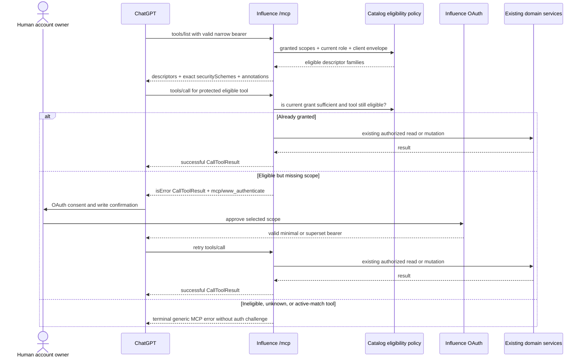

# ChatGPT MCP Tool Discovery - Plan

## Goal Capsule

- **Objective:** Let the ChatGPT Developer Mode app discover agent-write and role-eligible producer MCP tools before its current bearer token contains those scopes, then use tool-level OAuth step-up to grant and enforce the missing scopes safely.
- **Problem:** Production `tools/list` is filtered by scopes already present in the bearer token. ChatGPT therefore cannot see a protected tool descriptor, learn its required scope, or initiate the authorization flow needed to acquire that scope.
- **Product authority:** Discovery may advertise capabilities an account and registered client are eligible to grant; invocation still requires the actual token scopes, current account role, ownership, and existing domain authorization.
- **Execution profile:** Code.
- **Open blockers:** None. The exact ChatGPT callback and whether the host replaces or unions scopes during step-up are hosted observations, not reasons to weaken server-side authorization or delay implementation.

---

## Product Contract

### Summary

Production MCP discovery must separate **catalog eligibility** from **invocation authorization**.

An authenticated user with `agents:read` should discover the existing agent mutation descriptors when the registered client is allowed to request `agents:write`. A current producer-role user should discover producer descriptors when the registered client is allowed to request `producer`, even if the current token does not yet contain that scope. A normal user must not see producer descriptors or receive a producer authorization prompt.

When an eligible caller invokes a tool without its required grant, the MCP server should return an errored `CallToolResult` containing `_meta["mcp/www_authenticate"]`. ChatGPT can then open OAuth consent, obtain the missing grant, and retry. Invalid bearer tokens remain HTTP authentication failures, while unknown or ineligible tools remain terminal MCP errors.

### Problem Frame

The June 30 scope refresh correctly made tokens narrow, consent editable, and runtime checks scope-aware. It also made `tools/list` reflect only the current token's grants. That last rule works for clients such as Codex that can request an explicit scope set during login, but it deadlocks ChatGPT's tool-level authorization flow:

1. ChatGPT initially receives a narrow read grant.
2. `tools/list` omits tools requiring `agents:write` or `producer`.
3. ChatGPT never receives those descriptors or their `securitySchemes`.
4. Without a descriptor, ChatGPT has no tool-level event that can request the missing scope.

The result looks like platform-enforced read-only behavior even though the authorization server, DCR envelope, and tool implementations support writes.

This plan corrects discovery without broadening grants. A descriptor is not permission, and OAuth consent is not invocation authorization. Those boundaries must remain independently enforced.

### Key Decisions

- **KTD1 — Discovery uses grant eligibility, not current-token possession.** `session-settled: user-approved — chosen over grant-filtered discovery because ChatGPT must receive protected descriptors before it can request their scopes.` The server will distinguish scopes the current bearer holds from scopes the account and registered client may acquire.
- **KTD2 — Agent-write discovery requires the agent-read baseline.** A bearer containing `agents:read` may see `create_agent`, `update_agent`, `join_queue`, and `leave_queue` when its client registration permits `agents:write`. A `games:read`-only bearer does not gain an unrelated agent-management catalog.
- **KTD3 — Producer discovery is role- and client-eligible.** `session-settled: user-approved — chosen over globally advertising producer tools because normal users must not see or be prompted for an ungrantable privileged scope.` Producer descriptors require the subject's current DB producer role and a client registration envelope containing `producer`; they do not require the current token to contain `producer`.
- **KTD4 — Invocation remains grant-, client-, and role-enforced.** Tool calls continue to require their exact scope closure and a currently active client registration whose envelope still permits that closure before any read model, mutation service, or private trace access runs. Producer calls also rely on the current producer-role validation already applied to producer-bearing tokens and re-check eligibility before offering step-up.
- **KTD5 — Eligible missing grants return a tool result challenge.** A valid bearer missing an eligible tool scope returns HTTP 200 with a JSON-RPC `result` containing `isError: true` and `_meta["mcp/www_authenticate"]`. Top-level JSON-RPC errors remain for unknown, unsupported, or ineligible tools.
- **KTD6 — Transport authentication remains distinct.** Missing, malformed, expired, revoked, wrong-resource, wrong-audience, and role-invalid producer bearers remain HTTP 401 responses with the existing protected-resource challenge. Authorization dependency failures remain fail-closed service errors rather than fake reauthorization opportunities.
- **KTD7 — Descriptors declare exact requirements; step-up requests continuity without overriding consent.** Each descriptor advertises only its exact tool requirement. A runtime challenge requests the canonical union of the bearer’s validated current grant and the tool requirement, bounded by the active client envelope and current account eligibility. A replacement token retains prior access only for scopes the human selects and OAuth grants; deliberate deselection is authorized narrowing, not scope oscillation.
- **KTD8 — Registered-client scope is part of eligibility.** Catalog eligibility is the intersection of the authenticated account's grantable permissions and the client's registered scope envelope. Generic read-only registrations must not receive dead-end write challenges. The exact provider-hosted ChatGPT callbacks and Codex client retain the full supported envelope.
- **KTD9 — ChatGPT and Codex keep different acquisition paths.** `session-settled: user-directed — chosen over treating both hosts as one login flow because Codex already supports explicit scope grants while ChatGPT needs descriptor-driven incremental authorization.` Existing Codex explicit-scope login behavior is a regression contract, not a flow to replace.
- **KTD10 — Tool annotations describe impact, not authorization.** Every descriptor explicitly sets `readOnlyHint`, `openWorldHint`, and `destructiveHint`; `_meta.securitySchemes` exactly mirrors top-level `securitySchemes`. These hints improve ChatGPT approval framing but never replace server enforcement.
- **KTD11 — Stay on the current MCP protocol contract.** Implement the ChatGPT-documented `CallToolResult` challenge under the server's negotiated MCP `2025-06-18` behavior. A broader MCP `2025-11-25`/HTTP 403/CIMD migration is separate work and must not be smuggled into this fix wearing a standards-compliance hat.
- **KTD12 — One resource-side tool-access specification owns discovery and pre-dispatch authorization.** A bounded server-owned registry maps each tool to required scope alternatives, discovery baseline, client-envelope requirements, and role requirements. `tools/list` and `tools/call` evaluate the same specification; OAuth issuance keeps owning generic scope parsing/grant policy rather than absorbing resource-specific tool composition.
- **KTD13 — Live eligibility is request-local, with client revocation checked on every call.** `tools/list` resolves the current client envelope and any role-gated catalog eligibility. Every `tools/call` verifies that the authenticated client is still active and that the tool's required scope closure remains inside its current envelope, even when the bearer already contains the grant; producer calls also retain current-role enforcement. Richer grantability resolution may remain lazy for missing-grant step-up. Results are reused only within that request and never positively cached across requests.
- **KTD14 — Invocation authorization, not descriptor privacy, is the producer security boundary.** Role-filtered producer discovery remains the intended catalog behavior and should be checked with separate producer and normal-user connections, but descriptor reuse or exposure is not a release gate. A non-producer invocation must still terminate generically before any producer read model or private trace access.

### Actors

- **A1. Normal Influence user:** May grant agent and game permissions for their own account but cannot grant producer.
- **A2. Producer-role Influence user:** May grant normal permissions and the privileged `producer` permission while the role remains current.
- **A3. ChatGPT Developer Mode app:** Discovers descriptors, uses per-tool security metadata, starts incremental OAuth, and retries calls after consent.
- **A4. Codex MCP client:** Requests explicit scopes during login and must continue working without a discovery-driven step-up dependency.
- **A5. Influence OAuth authorization server:** Owns client registration envelopes, requested/selected/granted scope validation, dependencies, role gating, and token issue.
- **A6. Influence MCP resource server:** Validates bearer tokens, resolves catalog eligibility, returns descriptors, emits scoped challenges, and enforces invocation.
- **A7. Human account owner:** Completes sign-in, wallet proof, consent, and ChatGPT's write confirmation. These remain human-only approval boundaries.

### Requirements

**Catalog eligibility**

- **R1.** `tools/list` must distinguish current granted scopes from scopes the account and registered client are eligible to grant.
- **R2.** A valid bearer containing `agents:read` must list the four existing agent-write tools when the client registration permits `agents:write`, even when the bearer lacks `agents:write`.
- **R3.** A bearer without `agents:read` must not list agent-management write tools solely because its client registration includes them.
- **R4.** A current producer-role subject must list producer descriptors when the registered client permits `producer`, even when the bearer lacks `producer`.
- **R5.** A subject without the current producer role must not list producer descriptors or receive a producer step-up challenge.
- **R6.** A client registration that excludes a scope must not list tools whose missing scope cannot be requested by that client.
- **R7.** Role or client-registration lookup failure must fail closed as JSON-RPC `-32603` with the public message `Internal error`, no authorization challenge, and a bounded redacted audit classification. The original exception remains internal-only; stale or unverified eligibility must not expose privileged descriptors.
- **R8.** Descriptor discovery must contain schemas and static metadata only. It must not include owner data, role details, game data, private trace data, or a reason explaining why producer tools are absent.

**Invocation and incremental authorization**

- **R9.** Tool invocation must check the exact required granted scopes, current client activity, and the current client envelope before any domain read or mutation runs, including when the bearer already contains the required grant.
- **R10.** An eligible call missing one or more required scopes must return a JSON-RPC success envelope containing an errored `CallToolResult`, not a top-level JSON-RPC error.
- **R11.** The errored result must set `isError: true`, include safe user-facing content, and set `_meta["mcp/www_authenticate"]` to an RFC-compatible Bearer challenge array.
- **R12.** The challenge must include the protected-resource metadata URL, `error="insufficient_scope"`, a safe `error_description`, and the canonical union of the bearer’s validated current grant plus the tool's exact required scope closure.
- **R13.** Agent mutation descriptors must require `agents:read agents:write`; producer descriptors must require `producer`. Runtime challenges must re-request already-granted scopes that remain registered and grantable while adding that exact tool requirement; replacement tokens preserve only the scopes the human selects and OAuth grants.
- **R14.** Consent denial or cancellation must perform no mutation and must not be converted into a broader grant.
- **R15.** Retrying with either the exact required grant or a valid superset grant must proceed through existing ownership, role, and domain checks.
- **R16.** Challenge construction may union a validated current grant with the tool requirement to preserve continuity, but the server must not treat that request as consent, add scopes outside the active client/account envelope, or issue an unselected scope.
- **R17.** An ineligible known tool, an unknown tool, and an active-match action attempt must terminate without `_meta["mcp/www_authenticate"]`.
- **R18.** When a cached producer descriptor is invoked with a still-valid bearer that does not contain `producer` after the subject loses the producer role, the call must terminate without a reauthorization loop or producer-data access.

**Transport and metadata**

- **R19.** Missing, malformed, expired, revoked, wrong-resource, wrong-audience, or role-invalid producer tokens must retain the HTTP 401 preflight response and `WWW-Authenticate` behavior.
- **R20.** Every protected tool descriptor must expose its exact OAuth scope closure in top-level `securitySchemes` and an identical `_meta.securitySchemes` mirror.
- **R21.** Every descriptor must explicitly set non-null `readOnlyHint`, `openWorldHint`, and `destructiveHint`.
- **R22.** Read tools must declare read-only, bounded, non-destructive behavior. Mutation tools must declare non-read-only behavior and receive an individual destructive/idempotent audit based on actual retry and overwrite behavior.
- **R23.** Initial annotation decisions must treat `create_agent` as non-destructive, `update_agent` as destructive because it overwrites current behavior, `join_queue` as destructive because it can replace standing enrollment, and `leave_queue` as destructive because it removes enrollment. `idempotentHint` may be set only when the whole tool is proven idempotent.
- **R24.** Annotation and security metadata must not be used as authorization evidence by the server.

**OAuth provider compatibility**

- **R25.** Provider-hosted ChatGPT DCR with an omitted registration scope must retain the full supported registration envelope so later step-up is possible.
- **R26.** Generic DCR with omitted scope must retain the existing safe read-only default.
- **R27.** Redirect trust must remain exact-match and code-owned. Provider hostname classification must not become a wildcard callback allowlist.
- **R28.** Authorization must continue to distinguish registered, requested, selected, and granted scopes, including partial grants and the `agents:write` dependency on `agents:read`.
- **R29.** Producer consent must re-check the current role and producer-bearing grants must remain non-refreshable.
- **R30.** The currently observed ChatGPT callback must be verified from redacted DCR audit. The allowlist changes only if hosted ChatGPT evidence proves a new exact callback is required.
- **R31.** Codex explicit-scope login and full-scope inventory must remain unchanged.

**Audit, docs, and rollout**

- **R32.** A tool result with `isError: true` must audit as a failure, not as a successful MCP call.
- **R33.** Eligible insufficient-scope results must use a bounded audit classification such as `insufficient_scope`; audit output must not contain raw challenges, tokens, callbacks, prompts, private errors, or trace content.
- **R34.** Ineligible and unknown-tool denials must remain externally generic; detailed safe classification may exist only in redacted audit fields.
- **R35.** Active OAuth and MCP documentation must replace the old “granted scopes determine discovery” rule with “eligibility determines discovery; grants determine invocation.”
- **R36.** Durable solution learnings that teach scope-filtered discovery must be explicitly superseded rather than left contradictory.
- **R37.** Validation on the hosted deployment connected to the ChatGPT App must refresh or recreate the Developer Mode connection, rescan descriptors, complete real incremental consent, observe ChatGPT's write confirmation, retry the call, and change then restore `gender` on a dedicated unenrolled profile only after verifying that field remains outside the runtime revision fingerprint.
- **R38.** No active-match voting, Mingle/lobby messages, diary-room actions, timers, phase controls, Council actions, powers, or moderator tools may be introduced or advertised.
- **R39.** Catalog and invocation decisions must derive only from the validated bearer subject, client ID, resource/audience, active client record, current DB role, and a closed server-owned tool-access registry. Every invocation must revalidate current client activity and confirm the tool requirement remains in the current registration envelope. Request arguments, echoed descriptor metadata, provider hints, callback hostnames, and audit fields are never authorization evidence.
- **R40.** Known-but-ineligible and unknown tool calls must use the same public status, code, and message shape and must not include a scope challenge.
- **R41.** Caller-controlled tool names must not be copied raw into audit. Known tools may use a registry-owned canonical name; all other inputs use a bounded sentinel.
- **R42.** Hosted producer and normal-user connections should verify the intended role-filtered catalog, but descriptor exposure is not authorization evidence or a release gate. Every non-producer producer-tool invocation must still terminate generically without producer-data access or a scope challenge.
- **R43.** Before the separate cleanup restoration, the hosted authorized mutation smoke must produce exactly one intended profile-row transition and no agent revision, rating, queue, or seat transition. Duplicate execution fails this hosted acceptance check; it does not expand the discovery slice into tool-specific idempotency work.

### Key Flows

- **F1. ChatGPT discovers and steps up for agent write**
  - **Trigger:** ChatGPT holds `agents:read` but not `agents:write`, and its active registered-client envelope permits `agents:write`.
  - **Steps:** `tools/list` returns the four write descriptors with `agents:read agents:write`; a write call returns an errored tool result challenge; the human approves or rejects consent; ChatGPT retries only after an appropriate token is available.
  - **Outcome:** Approval permits the existing guarded mutation; rejection performs no work.
  - **Covered by:** R1-R3, R6, R9-R16, R20-R24.

- **F2. Producer-role user discovers and steps up**
  - **Trigger:** A valid narrow token belongs to a current producer-role account whose client registration includes `producer`.
  - **Steps:** `tools/list` includes producer descriptors; a producer call without the grant returns a challenge preserving the current valid grant and adding `producer`; OAuth re-checks the role; the human approves; ChatGPT retries with a short-lived non-refreshable producer-bearing token.
  - **Outcome:** Producer capability is discoverable and usable only for a role-eligible account.
  - **Covered by:** R4-R8, R12-R13, R18, R25, R28-R30.

- **F3. Normal user cannot discover or provoke producer authorization**
  - **Trigger:** A normal user lists tools or crafts a producer tool call.
  - **Steps:** Producer descriptors are absent; the crafted call terminates generically without a scope challenge; no producer read model runs.
  - **Outcome:** The app neither exposes privileged capability names through normal discovery nor sends the user into impossible consent.
  - **Covered by:** R5-R8, R17-R18, R34.

- **F4. Invalid bearer fails before JSON-RPC dispatch**
  - **Trigger:** The token is missing, malformed, inactive, wrong-resource, or invalidated by producer role loss.
  - **Steps:** MCP preflight returns HTTP 401 with the protected-resource challenge.
  - **Outcome:** ChatGPT can reauthenticate, but the server does not mislabel token invalidity as a tool-specific scope problem.
  - **Covered by:** R19.

- **F5. Existing Codex full-scope login continues**
  - **Trigger:** Codex requests explicit scopes during login.
  - **Steps:** Existing DCR/authorization behavior issues the selected valid grant; discovery shows the same full authorized inventory; calls proceed without incremental step-up.
  - **Outcome:** The ChatGPT correction does not regress the already-working local/staging client flow.
  - **Covered by:** R25-R31.

- **F6. Deployment refreshes host metadata**
  - **Trigger:** Corrected MCP code reaches the hosted deployment connected to the ChatGPT App.
  - **Steps:** Inspect redacted DCR audit, refresh or recreate the Developer Mode app connection, rescan tools, verify static metadata, run F1 and F2 with appropriate accounts, and restore the dedicated validation agent after the mutation proof.
  - **Outcome:** Validation proves the host saw the new catalog rather than a cached pre-deploy snapshot.
  - **Covered by:** R30, R35-R37, R42-R43.

### Acceptance Examples

- **AE1 — Read token sees write descriptors.** Given a valid ChatGPT token has `agents:read`, lacks `agents:write`, and its registered client includes both, when `tools/list` runs, then all four agent-write descriptors appear with the exact `agents:read agents:write` security schemes.
- **AE2 — Write step-up is non-mutating until authorized.** Given AE1's token calls `update_agent`, when the scope guard runs, then the response is HTTP 200 with `result.isError=true` and `_meta["mcp/www_authenticate"]`, no top-level JSON-RPC error exists, and the agent row/revision is unchanged.
- **AE3 — Retry succeeds with minimal or superset grant.** Given the same call is retried with a valid token containing either exactly `agents:read agents:write` or that closure plus another supported scope, then the existing ownership and mutation path runs normally.
- **AE4 — Games-only token has no agent write catalog.** Given a valid token contains only `games:read`, when it lists tools or crafts `update_agent`, then the descriptor is absent and the crafted call returns no authorization challenge.
- **AE5 — Producer is eligible before granted.** Given a current producer-role account has a read-scoped token for a client registered with `producer`, when it lists tools and calls `read_trace_content`, then producer descriptors appear and the ungranted call returns a step-up challenge preserving the current read grant and adding `producer`, without reading trace content.
- **AE6 — Normal user never gets producer step-up.** Given a normal user's client registration includes `producer`, when the user lists tools or crafts a producer call, then producer descriptors remain absent and no producer challenge is returned.
- **AE7 — Narrow-token role race fails closed.** Given a producer descriptor was cached, the caller still has a valid bearer without `producer`, and the user's role is removed before invocation, when the cached tool is called, then the server returns a terminal denial without a step-up challenge or private-data access.
- **AE8 — Invalid bearer stays transport-level.** Given a producer-bearing token becomes inactive after role revocation, when any MCP request is made, then the response is HTTP 401 with `WWW-Authenticate`, not a JSON-RPC tool result.
- **AE9 — Client envelope prevents dead ends.** Given a generic client registered only for read scopes, when a read-scoped token lists tools, then write/producer descriptors that the client cannot request are absent.
- **AE10 — Descriptor metadata is complete.** Given any tool is returned by `tools/list`, then top-level and mirrored security schemes are identical and all three required impact annotations are explicit.
- **AE11 — Tool challenge audits as failure.** Given an eligible missing-scope call returns an errored tool result, when the request audit is emitted, then it records failure with bounded `insufficient_scope` classification and contains no raw challenge or private error text.
- **AE12 — Provider DCR remains expandable.** Given an exact supported ChatGPT callback registers without a `scope`, when the client record is created, then its envelope contains every supported scope; an arbitrary provider-hosted callback remains rejected.
- **AE13 — Codex is unchanged.** Given Codex explicitly requests the full supported scope set, when authorization and discovery complete, then its inventory and calls match the current full-scope behavior without requiring tool-level step-up.
- **AE14 — Real ChatGPT smoke works after refresh.** Given the hosted ChatGPT-connected deployment is current, the Developer Mode app has been refreshed/rescanned, and repository verification confirms `gender` is excluded from the runtime revision fingerprint, when ChatGPT changes that field on a dedicated unenrolled validation agent with an existing avatar, then it shows human OAuth/write confirmation, obtains an appropriate token, retries successfully, creates no new agent revision or rating/queue/seat change, and the operator restores the original value in a separate cleanup transition.
- **AE15 — Replacement tokens preserve reselected grants.** Given ChatGPT replaces rather than unions a token during producer or write step-up, when the human keeps the prior read scopes selected and OAuth grants them, then the replacement token retains that read access.
- **AE16 — Intended producer catalog filtering is observable.** Given separate producer-role and normal-user ChatGPT connections are refreshed after the same deployment, when each lists tools, then producer descriptors should appear only in the producer connection; regardless of catalog visibility, a normal-user invocation remains terminally denied before producer-data access.
- **AE17 — Authorized retry executes once without analytical side effects.** Given ChatGPT completes write step-up and retries the `gender` mutation, when the profile row, revisions, rating events, queues, seats, and audit are inspected before cleanup, then exactly one authorized profile transition occurred and no agent revision, rating, queue, or seat transition occurred.
- **AE18 — Deliberate narrowing is honored.** Given the step-up request includes prior scopes but the human intentionally deselects one, when OAuth issues a replacement token, then the deselected access may disappear and is not classified as host scope oscillation.

### Success Criteria

- ChatGPT no longer presents the production MCP as read-only to an `agents:read` user whose client may request write access.
- A producer-role user can discover producer tools before holding `producer`; a normal user cannot discover them or be prompted for producer.
- Missing eligible scopes produce a ChatGPT-recognized authorization challenge without executing work.
- Incremental authorization requests the bearer's still-valid current grants and preserves those the human reselects; intentional consent narrowing remains authoritative.
- Token validity, current roles, registered-client envelopes, ownership, and domain policies remain server-enforced.
- Producer descriptors follow the intended role-filtered catalog in hosted observation, while invocation authorization remains safe even if the host exposes or reuses a descriptor.
- Existing Codex explicit-scope authorization continues unchanged.
- Descriptor annotations and security metadata pass current OpenAI Apps SDK validation.
- Active docs and durable learnings describe the same discovery/invocation split as the runtime.

### Scope Boundaries

**In scope**

- Eligibility-aware `tools/list` behavior for current agent-write and producer tools.
- Current-role and registered-client-envelope resolution for catalog eligibility.
- Tool-level `mcp/www_authenticate` challenges for eligible missing scopes.
- Exact descriptor security schemes and impact annotations.
- MCP audit handling for errored tool results.
- DCR/callback regression coverage, active documentation, durable learnings, real hosted ChatGPT validation, and the existing Codex staging regression smoke.

**Deferred**

- MCP `2025-11-25` protocol negotiation, HTTP 403 incremental-consent semantics, and Client ID Metadata Documents.
- A generic authorization-policy framework beyond the small catalog/invocation helpers required here.
- New scopes, per-agent grants, or new agent/game/producer tools.

**Out of scope**

- Custom ChatGPT components or a bespoke app UI.
- Public app-store publication or workspace administrator controls.
- Broad provider-domain callback trust.
- Active-match or moderator actions.
- Renaming the external Developer Mode app before the write flow is proven. The “Read Only” label may be changed manually after validation, but it is not the authorization fix.

### Dependencies / Assumptions

- The deployed server continues negotiating MCP `2025-06-18` during this fix.
- The exact supported ChatGPT callback rules in `oauth-provider-compat.ts` remain the only provider-hosted callback trust source.
- ChatGPT follows its documented two-part tool authorization flow: descriptor `securitySchemes` plus runtime `_meta["mcp/www_authenticate"]`.
- The OAuth authorization server continues to enforce registered, requested, selected, and granted scope separation.
- Current RBAC data remains authoritative for producer eligibility.
- Host behavior may replace or union a prior grant during step-up. The challenge requests the current valid grant plus the new requirement, while the resource server accepts any resulting valid token satisfying the tool closure; it never treats the challenge itself as consent or overrides a deliberate narrower selection.
- Separate producer and normal-user hosted ChatGPT connections are useful for confirming catalog behavior, but their availability does not replace or gate server-side producer authorization.

### Sources / Research

- `STRATEGY.md`
- `CONCEPTS.md`
- `docs/plans/2026-06-30-002-feat-mcp-scope-refresh-plan.md`
- `docs/game-mcp-production-oauth.md`
- `docs/solutions/architecture-patterns/production-mcp-role-resource-split.md`
- `docs/solutions/architecture-patterns/mcp-oauth-provider-compatibility.md`
- `packages/api/src/game-mcp/auth.ts`
- `packages/api/src/game-mcp/server.ts`
- `packages/api/src/routes/mcp.ts`
- `packages/api/src/services/mcp-oauth.ts`
- `packages/api/src/services/revision-policy.ts`
- `packages/api/src/game-mcp/oauth-provider-compat.ts`
- `packages/api/src/__tests__/production-game-mcp-server.test.ts`
- `packages/api/src/__tests__/mcp-http-route.test.ts`
- `packages/api/src/__tests__/mcp-oauth-routes.test.ts`
- [OpenAI Apps SDK authentication](https://developers.openai.com/apps-sdk/build/auth#triggering-authentication-ui)
- [OpenAI MCP server annotations](https://developers.openai.com/apps-sdk/build/mcp-server#tool-annotations-and-elicitation)
- [OpenAI security and write actions](https://developers.openai.com/apps-sdk/guides/security-privacy#prompt-injection-and-write-actions)
- [OpenAI connect from ChatGPT](https://developers.openai.com/apps-sdk/deploy/connect-chatgpt)
- [OpenAI tool scanning metadata](https://developers.openai.com/apps-sdk/deploy/submission#metadata-stored-during-tool-scanning)
- [MCP 2025-06-18 tool error handling](https://modelcontextprotocol.io/specification/2025-06-18/server/tools#error-handling)
- [MCP 2025-11-25 authorization scope challenges](https://modelcontextprotocol.io/specification/2025-11-25/basic/authorization#scope-challenge-handling)
- [RFC 6750 Bearer error responses](https://www.rfc-editor.org/rfc/rfc6750.html#section-3.1)

---

## Planning Contract

### Product Contract Preservation

The Product Contract above is the implementation authority. Planning does not change the current scope vocabulary, single `/mcp` resource, editable consent model, ownership rules, producer-role boundary, producer refresh restriction, or management-only tool boundary.

This is a corrective plan that intentionally supersedes only the prior rule that `tools/list` must mirror scopes already granted to the current token. The historical June 30 plan remains shipped history; active runtime and solution documentation must name the new eligibility-versus-invocation rule explicitly.

### Current Architecture

- `packages/api/src/game-mcp/auth.ts` validates access-token introspection and builds `GameMcpAuthContext` from the granted token. It exposes `userId`, `clientId`, granted scopes, auth profile, and expiry, but no current account/client grant eligibility.
- `packages/api/src/game-mcp/server.ts` handles JSON-RPC methods. `productionGameMcpTools(auth)` currently includes write tools only when `agents:write` is granted and producer tools only when `producer` is granted.
- `requireScopes` and `requireAnyScope` currently throw ordinary errors. `handle()` converts those throws into top-level JSON-RPC errors, which ChatGPT cannot use as tool-level step-up.
- The descriptor helper already emits top-level and mirrored OAuth schemes, but annotations contain only `readOnlyHint`.
- `packages/api/src/services/mcp-oauth.ts` already owns client registration scope envelopes, exact provider callback defaults, current producer-role checks, consent dependencies, narrowed grants, and non-refreshable producer grants.
- `packages/api/src/game-mcp/oauth-provider-compat.ts` owns exact supported ChatGPT callback URIs. Hostname classification is informational and is not authorization.
- `packages/api/src/routes/mcp.ts` applies transport preflight and audits MCP results. It currently marks any response without a top-level JSON-RPC `error` as success, so an errored `CallToolResult` would be misclassified.
- Existing server and route tests assert the grant-filtered inventory and top-level missing-scope errors. OAuth route tests already cover exact ChatGPT callback registration defaults, generic DCR read defaults, narrowed consent, and producer gating.
- Active production OAuth and solution documentation currently teaches grant-filtered discovery and must be corrected with the implementation.

### High-Level Technical Design

This diagram is an architectural sketch, not prescribed implementation syntax.



The smallest durable shape is one bounded resource-side tool-access specification shared by `tools/list` and `tools/call`:

- **Granted scopes:** What this bearer may invoke now.
- **Client envelope:** What this registered client may request.
- **Account eligibility:** What this current user may grant, including live producer role.
- **Catalog eligibility:** Which static descriptors may be advertised now.
- **Invocation outcome:** allowed, eligible-but-missing-grant, or terminally denied.

The implementation should extend existing OAuth and MCP helpers rather than introduce a new generalized policy engine. Keep pure scope normalization/dependency rules in `mcp-scope-policy.ts`, and place tool-specific composition in a small resource-side module such as `game-mcp/tool-authorization.ts`.

Inject a bounded eligibility resolver into the production MCP server rather than teaching the server how to find a database implicitly. The resolver uses authenticated `userId` for current RBAC, maps the code-owned configured client to its canonical envelope, and reads and validates dynamic client registrations. Tests inject deterministic fakes; production has no permissive missing-resolver or database fallback.

Resolve live role/client state for `tools/list`; on every `tools/call`, resolve enough current client state to prove that the client remains active and the tool requirement remains registered. Missing-grant calls additionally resolve current grantability, including producer role. Reuse that snapshot only within the current request, and never cache positive eligibility across requests. Database or policy lookup failure fails closed as a bounded internal JSON-RPC error without an authorization challenge.

### Discovery and Invocation Matrix

| Tool family | Descriptor eligibility | Invocation grant | Missing-grant behavior |
| --- | --- | --- | --- |
| Agent reads | Current bearer has `agents:read` | `agents:read` | Existing scope enforcement |
| Agent writes | Bearer has `agents:read`; client envelope has `agents:write` | `agents:read agents:write` | Tool result challenge for both scopes |
| User game reads | Current bearer has `games:read` | `games:read` | Existing scope enforcement |
| Producer reads | Current DB producer role; client envelope has `producer` | `producer` plus current role validity | Preserve current valid grant and add `producer`, only while role-eligible |
| Ineligible or unknown tool | Never advertised | None | Terminal generic MCP error; no challenge |
| Active-match action | Never advertised | None | Terminal generic MCP error; no challenge |

For shared game-read names that support either `games:read` or `producer`, select one deterministic descriptor variant in this order:

1. The producer variant when `producer` is granted.
2. The games variant when `games:read` is granted.
3. The producer variant when the current subject and client are producer-eligible but neither scope is granted.
4. Omit the descriptor otherwise.

Invocation continues to accept either valid scope alternative. This precedence removes catalog ambiguity without redesigning the shared read-tool schemas.

### Tool Annotation Matrix

| Tool class | `readOnlyHint` | `openWorldHint` | `destructiveHint` | `idempotentHint` |
| --- | --- | --- | --- | --- |
| All current read tools, including producer reads | `true` | `false` | `false` | Omit unless meaningful |
| `create_agent` | `false` | `false` | `false` | Omit |
| `update_agent` | `false` | `false` | `true` | Set only if unchanged retries are proven effect-free |
| `join_queue` | `false` | `false` | `true` | Omit because behavior varies by queue type/current enrollment |
| `leave_queue` | `false` | `false` | `true` | `true` only if whole-tool idempotence remains tested |

The executor should validate this matrix against actual mutation semantics while implementing. Any deviation must be justified in the plan's implementation notes or PR description; “all writes are harmless” is not a security model.

## Implementation Units

### U1. Define One Resource-Side Tool Access Policy And Eligibility Resolver

**Depends on:** Product Contract.

**Scope:** Define one closed tool-access specification and an injected, request-local, fail-closed eligibility resolver independent from the current token's granted scopes.

**Files:**

- Add `packages/api/src/game-mcp/tool-authorization.ts`.
- Update `packages/api/src/game-mcp/auth.ts` only for shared authenticated identity/challenge primitives.
- Update `packages/api/src/services/mcp-oauth.ts`.
- Update `packages/api/src/services/mcp-scope-policy.ts` if the intersection/dependency helpers belong in the canonical scope policy.
- Update `packages/api/src/game-mcp/server.ts` to construct the request-local resolver.
- Update `packages/api/src/__tests__/mcp-http-route.test.ts`.
- Update `packages/api/src/__tests__/production-game-mcp-server.test.ts`.
- Update `packages/api/src/__tests__/mcp-oauth-routes.test.ts` for client-envelope fixtures if needed.

**Implementation notes:**

- Define a server-owned specification keyed by canonical tool name or family. It owns required scope alternatives, discovery baseline, required client-envelope scopes, and current-role requirements.
- Define an injected eligibility-resolver contract whose inputs come only from the validated auth context. It resolves current RBAC by authenticated `userId`, maps the code-owned configured client to a canonical supported-scope envelope, and loads and validates dynamic registrations by authenticated `clientId`.
- Require the resolver in production server construction. Missing, malformed, inactive, deleted, or restricted client state denies access; do not add a permissive fallback that reaches for an ambient database or assumes a full envelope.
- Make `tools/list` and call pre-dispatch evaluate that same specification. Existing handler-local `requireScopes` checks may remain as defense in depth, but they must not be a second policy source.
- Keep pure OAuth scope parsing, ordering, dependencies, and set operations in `mcp-scope-policy.ts`. Keep tool/resource composition out of the OAuth issuance service.
- Resolve the token subject's current RBAC state and token client's active registration envelope from authoritative records for `tools/list`. On every `tools/call`, at minimum revalidate that the client is active and the exact tool scope closure remains in its current envelope; resolve role-gated grantability when step-up or producer authorization requires it.
- Compute eligibility from the intersection of:
  - the current bearer baseline needed to enter that catalog (`agents:read` for agent writes);
  - the registered client's allowed scope envelope;
  - the current account's role-gated grantability.
- Preserve granted scopes separately for invocation. Never copy eligible scopes into `auth.scopes` or mutate the bearer context.
- Reuse/export the existing producer-role and client-scope parsing policy rather than duplicating role names or OAuth parsing in `server.ts`.
- Support both the code-owned configured OAuth client and dynamically registered clients through their existing authoritative representations.
- Reuse one eligibility snapshot within the current JSON-RPC request. If RBAC or client lookup fails, return JSON-RPC `-32603` with public message `Internal error`, no `mcp/www_authenticate`, and no raw dependency detail; do not reuse positive eligibility across requests.
- Derive decisions only from validated bearer identity/resource data and server-owned records. Provider hints, callback hostnames, request arguments, descriptor echoes, and audit metadata are never inputs.
- Keep invalid client/token relationships inactive or denied according to the existing token contract.

**Test scenarios:**

- A token with `agents:read` and a full-envelope ChatGPT client resolves agent-write eligibility without adding `agents:write` to granted scopes.
- The same token for a read-only registered client does not resolve agent-write eligibility.
- A read-scoped current producer for a full-envelope client resolves producer eligibility without adding `producer` to granted scopes.
- A normal user and a role-revoked producer do not resolve producer eligibility.
- DB/RBAC/client lookup failure produces no successful auth context or privileged eligibility.
- Static configured and dynamic registered clients resolve the same canonical envelope semantics.
- Cross-client substitution, deleted/restricted registration, role loss, and envelope narrowing between list and call all fail closed.
- A token that already contains a tool's grant is still denied before handler dispatch when its client is deleted or the required scope is removed from the registration envelope.
- Resolver dependency exceptions map to bounded JSON-RPC `-32603` internal errors without a challenge; test fakes remain deterministic and production construction cannot omit the resolver.
- Provider hint, callback host, request arguments, and descriptor metadata cannot alter an authorization outcome.
- Existing full-scope Codex auth context still carries its granted scopes and full eligible catalog.

**Observable verification:**

- Policy fixtures can assert granted scopes and catalog eligibility independently.
- No access token or DB scope value is widened as a side effect of discovery.

**Covers:** R1-R8, R18, R25-R31, R39, F1-F5, AE1, AE4-AE9, AE12-AE13.

### U2. Advertise Eligible Tools With Honest Security And Impact Metadata

**Depends on:** U1, U3, U4.

**Scope:** Change `tools/list` from grant-filtered mutation/producer discovery to eligibility-filtered discovery and complete every descriptor's metadata.

**Files:**

- Update `packages/api/src/game-mcp/server.ts`.
- Update `packages/api/src/__tests__/production-game-mcp-server.test.ts`.

**Implementation notes:**

- Make the tool catalog consume both granted scopes and U1 eligibility.
- Include current agent-write descriptors when `agents:read` is granted and `agents:write` is eligible, even if it is not granted.
- Include producer descriptors only when current producer eligibility is true. A granted `producer` token remains subject to the existing role-valid bearer contract.
- For shared descriptors accepting `games:read` or `producer`, apply the documented precedence: granted `producer`, granted `games:read`, eligible-but-ungranted `producer`, then omission.
- Keep descriptor contents static and non-sensitive.
- Preserve exact per-tool OAuth scope closures and identical top-level/`_meta` security schemes.
- Expand the tool helper so all descriptors explicitly set `readOnlyHint`, `openWorldHint`, and `destructiveHint`, plus `idempotentHint` only where the complete tool behavior supports it.
- Apply the Tool Annotation Matrix and add descriptor-level assertions. Do not derive destructive behavior solely from `readOnlyHint`.
- Preserve existing shared game-read variants and the absence of active-match tools.

**Test scenarios:**

- `agents:read` plus a full-envelope client lists all four write descriptors but no producer descriptors for a normal user.
- A read-scoped producer-eligible context lists producer descriptors before `producer` is granted.
- A normal or role-revoked context never lists producer descriptors.
- A read-only client never receives write/producer descriptors it cannot request.
- Shared dual-scope descriptors use the producer variant for a granted producer, the games variant for granted games access, the producer variant for an eligible producer with neither grant, and are absent otherwise.
- Every returned descriptor has exact mirrored security schemes and all three required annotations.
- Annotation values for create/update/join/leave match the reviewed impact matrix; any asserted idempotence is backed by existing behavior tests.
- Full-scope Codex inventories remain stable.
- No active-match action name appears in any inventory.

**Observable verification:**

- Snapshot or structural assertions prove the catalog differs by eligibility, not by accidental scope widening.
- Descriptor validation no longer reports omitted impact annotations.

**Covers:** R1-R8, R20-R24, R31, R38, F1-F3, F5, AE1, AE4-AE10, AE13.

### U3. Return Scoped ChatGPT Reauthorization Results Without Executing Work

**Depends on:** U1.

**Scope:** Convert eligible missing-scope tool calls into ChatGPT-recognized errored `CallToolResult` responses while keeping terminal denials and transport errors distinct.

**Files:**

- Update `packages/api/src/game-mcp/auth.ts` for a parameterized Bearer challenge builder.
- Update `packages/api/src/game-mcp/server.ts`.
- Update `packages/api/src/__tests__/production-game-mcp-server.test.ts`.
- Update `packages/api/src/__tests__/mcp-http-route.test.ts`.

**Implementation notes:**

- Evaluate the U1 specification before handler dispatch and return one bounded outcome: allowed, step-up, or unavailable.
- Before any allowed dispatch, revalidate that the authenticated client remains active and that the exact tool requirement remains inside its current registration envelope, even when the bearer already contains the required scope.
- Only allowed reaches the existing tool handler. Existing handler-local scope checks remain defense in depth rather than expected control flow.
- Convert step-up directly at the `tools/call` boundary into an MCP `CallToolResult` with:
  - safe text content;
  - `isError: true`;
  - `_meta["mcp/www_authenticate"]` as an array containing the Bearer challenge.
- Build runtime challenge scopes from the canonical union of the bearer’s validated current grant and the exact tool requirement. Validate that union against the active client envelope, scope dependencies, and current account eligibility before emitting it.
- Generalize the current challenge builder to accept that bounded scope set and `insufficient_scope` fields while preserving the current default HTTP 401 challenge for invalid bearer preflight.
- Map unavailable to the exact same public generic JSON-RPC status/code/message shape used by unknown tools. A role-revoked producer, games-only crafted agent mutation, unregistered scope, malformed/unknown tool, or active-match action must receive no authorization metadata.
- Map eligibility-resolver dependency failures separately to JSON-RPC `-32603` with public message `Internal error`. Do not attach authorization metadata or reveal whether client or RBAC lookup failed.
- Keep scope checks before `requireManagementDb`, read models, mutation services, and trace access.
- Accept a valid retry token that satisfies the required scope closure whether ChatGPT replaced the narrow token or returned a legitimate superset. The challenge preserves current scopes, but OAuth remains the only issuer and grants only the approved selection.
- Keep domain validation failures as ordinary tool errors; do not turn ownership, input, uniqueness, queue, or private-data failures into OAuth prompts.

**Test scenarios:**

- An eligible `agents:read` call to each agent mutation returns HTTP 200 JSON-RPC `result.isError=true`, no top-level `error`, and a challenge for `agents:read agents:write`.
- An eligible producer call without `producer` returns the same shape with the current validated grant plus `producer`.
- Spies or DB assertions prove the denied call does not reach mutation/read-model code.
- Replacement and union host behavior both execute with valid tokens satisfying the tool closure; prior access remains when the human reselects and OAuth grants it.
- Deliberate deselection during step-up may narrow a replacement token and is not reported as host scope oscillation.
- Consent cancellation/denial leaves state unchanged.
- A cached producer descriptor invoked with a still-valid narrow bearer lacking `producer` after role loss returns the same public unavailable shape as an unknown tool, with no challenge.
- A producer-bearing token invalidated by role loss fails HTTP preflight with 401 before JSON-RPC dispatch; it does not enter the cached-descriptor branch.
- A token with an otherwise sufficient grant is denied before handler dispatch after client deletion or envelope narrowing.
- Normal-user producer, games-only agent mutation, unknown tool, malformed tool name, and active-match name return the same public unavailable shape and no challenge.
- Resolver dependency exceptions return bounded JSON-RPC `-32603` internal errors with no challenge.
- Existing invalid-bearer cases remain HTTP 401 with the default challenge.
- Existing ownership and domain errors do not contain `mcp/www_authenticate`.

**Observable verification:**

- ChatGPT receives the exact two-part contract documented by OpenAI: descriptor security scheme plus runtime `mcp/www_authenticate`.
- No missing-scope path performs side effects before authorization succeeds.

**Covers:** R9-R19, R24, R28-R31, R38-R40, F1-F5, AE2-AE8, AE13, AE15, AE18.

### U4. Classify Tool-Result Failures In MCP Audit

**Depends on:** U3.

**Scope:** Make transport audit reflect errored tool results without leaking challenges or private errors.

**Files:**

- Update `packages/api/src/routes/mcp.ts`.
- Update the MCP audit types/helper module used by the route if a bounded result classifier belongs there.
- Update `packages/api/src/__tests__/mcp-http-route.test.ts`.

**Implementation notes:**

- Treat a JSON-RPC response with `result.isError === true` as an audited failure even though the transport status is 200 and no top-level `error` exists.
- Derive only a bounded safe denial reason: `insufficient_scope`, `tool_error`, or the existing `json_rpc_error`. Do not copy result content, challenge strings, or human-readable `_meta` into audit.
- Classify eligibility-resolver `-32603` failures with one bounded internal-error value. Preserve the original exception only in internal error handling; do not copy database messages, role details, client state, or stack data into the MCP audit event.
- Record a registry-owned canonical tool name only after exact lookup succeeds. Unknown, malformed, oversized, quote/control-character, newline-containing, token-like, or callback-like caller input must use a bounded sentinel rather than the raw value.
- Preserve current correlation, user, client, resource, granted scope, provider hint, method, and tool fields.
- Keep invalid bearer, origin denial, JSON-RPC validation, notification, and top-level error auditing unchanged.
- If the response-shape classifier is shared, make it narrow enough that arbitrary tool payloads cannot spoof sensitive audit values.

**Test scenarios:**

- An insufficient-scope `CallToolResult` audits failure with `insufficient_scope` while returning HTTP 200.
- A successful retried mutation audits success.
- A domain `isError` tool result audits failure without exposing result content.
- Raw `WWW-Authenticate` challenge strings, callback URIs, tokens, and private error text are absent from emitted audit objects.
- Hostile and oversized unknown tool names never appear raw in audit and cannot inject log fields or lines.
- HTTP 401 invalid bearer and top-level JSON-RPC errors retain their existing classifications.
- Eligibility lookup failures audit only the bounded internal-error classification and cannot emit raw dependency errors or authorization challenges.

**Observable verification:**

- Operational logs distinguish successful calls from authorization step-up without storing authorization material.

**Covers:** R32-R34, R40-R41, F1-F4, AE11.

### U5. Lock Provider Registration And Consent Regression Coverage

**Depends on:** U1.

**Scope:** Prove ChatGPT can request later scopes while generic clients, consent dependencies, exact callbacks, and Codex behavior remain narrow and safe.

**Files:**

- Update `packages/api/src/__tests__/mcp-oauth-routes.test.ts`.
- Update `packages/api/src/game-mcp/oauth-provider-compat.ts` only if hosted ChatGPT audit proves a new exact callback.
- Update provider-profile tests if the callback registry has a dedicated test file.

**Implementation notes:**

- Preserve provider-hosted omitted-scope registration as the full supported envelope.
- Preserve generic omitted-scope registration as `agents:read games:read`.
- Assert that a client's registered scope envelope limits later authorization requests and U1 catalog eligibility.
- Preserve selected/granted subset semantics and the `agents:write` dependency closure.
- Re-check producer role during consent/code exchange and preserve no-refresh behavior for producer grants.
- Treat current callback strings as data to verify, not values to guess. Use redacted hosted ChatGPT DCR audit to identify an actual new exact callback before editing the allowlist.
- Keep provider hostname detection out of trust decisions.
- Add or retain a Codex explicit full-scope authorization regression fixture.

**Test scenarios:**

- Exact supported ChatGPT callback plus omitted `scope` registers the full four-scope envelope.
- Unknown ChatGPT-shaped or provider-hosted callback is rejected without being logged raw.
- Generic DCR omission registers only safe read scopes and cannot later authorize write/producer.
- A step-up authorization request cannot select unregistered, unrequested, dependency-invalid, or role-ineligible scopes.
- Partial consent returns the actual granted scope.
- Step-up requests the current validated grant plus a new requirement; replacement and union host behavior both preserve the prior tool access the human reselects and OAuth grants.
- Producer role removal before approval/exchange blocks issue and no refresh token is produced.
- Codex full-scope authorization remains unchanged.

**Observable verification:**

- ChatGPT's registration can support later tool-level authorization without making every DCR client broad.
- Callback trust remains exact and auditable.

**Covers:** R6, R13-R16, R25-R31, R39, F1-F5, AE3, AE7-AE9, AE12-AE13, AE15.

### U6. Update Active Contract Documentation And Durable Learnings

**Depends on:** U2-U5.

**Scope:** Replace contradictory grant-filtered discovery guidance and document the operator validation flow.

**Files:**

- Update `docs/game-mcp-production-oauth.md`.
- Update `docs/solutions/architecture-patterns/production-mcp-role-resource-split.md`.
- Update `docs/solutions/architecture-patterns/mcp-oauth-provider-compatibility.md`.
- Update `DEVELOPMENT.md` only if its current client setup guidance describes discovery, refresh, or scope acquisition.
- Do not rewrite the historical June 30 plan; link to this corrective plan from active learning docs where helpful.

**Implementation notes:**

- Define catalog eligibility, granted scope, invocation authorization, and why they differ.
- Document agent-write and producer descriptor eligibility, including the registered-client envelope and current producer role.
- Show the distinction between invalid-bearer HTTP 401 and valid-bearer insufficient-scope tool result.
- Document exact provider callback trust, provider-hosted DCR full envelope, generic DCR safe defaults, and narrowed actual grants.
- Document ChatGPT refresh/rescan behavior and the possibility of stale connection metadata.
- Preserve Codex explicit-scope login instructions.
- State that ChatGPT write confirmation is a host approval layer, not server authorization.
- Mark MCP `2025-11-25`/CIMD as deferred rather than claiming unsupported compliance.

**Test scenarios:**

- Documentation search finds no active current-tense claim that `tools/list` includes only currently granted tools.
- Active docs contain the eligibility-versus-invocation rule and both authorization error shapes.
- Durable learning docs do not contradict one another about producer visibility or callback trust.
- Historical plan text remains historical rather than being silently rewritten.

**Observable verification:**

- A maintainer can determine why ChatGPT and Codex acquire scopes differently and how both remain safe.

**Covers:** R35-R36, F5-F6.

### U7. Refresh And Prove The Real Hosted ChatGPT Flow

**Depends on:** U1-U6 and all automated verification gates.

**Scope:** After the corrected code reaches the deployment connected to the existing ChatGPT App through the ordinary deployment process, validate callback registration, metadata refresh, human consent, write confirmation, retry, and state restoration. This is hosted acceptance evidence, not a separate production rollout gate.

**Files:**

- Conditionally update `packages/api/src/game-mcp/oauth-provider-compat.ts` only when redacted hosted ChatGPT evidence proves a new exact callback.
- Conditionally update the relevant OAuth/provider compatibility tests with that exact callback.
- Add a concise dated validation note under the existing relevant solution document or PR evidence if repo convention calls for durable hosted proof.

**Implementation notes:**

- Use the existing ChatGPT-connected deployment after the completed change arrives through the ordinary deployment path; do not invent a separate rollout workflow in this slice.
- Inspect redacted DCR/provider audit to confirm the exact callback used by the current ChatGPT Developer Mode connection. If it differs, add only that exact callback, rerun U5's focused OAuth/provider gates, and redeploy.
- Refresh or recreate the Developer Mode app connection and rescan tools. Use a fresh conversation so cached pre-fix descriptors cannot masquerade as failure.
- Use `gender` on a dedicated hosted validation account's unenrolled Agent Profile with an existing avatar. Before the smoke, verify from the current revision policy that `gender` is excluded from the effective-runtime fingerprint, record its original value, and choose a different allowed value.
- Update `gender` through ChatGPT and verify exactly one profile-row transition with no new agent revision, rating event, queue change, or seat change. Restore the original value as a separate, explicitly identified cleanup transition through the same authorized path or the product UI.
- Confirm ChatGPT shows the OAuth step-up and its manual write confirmation before the mutation.
- Compare separate normal-user and producer-role connections against the same deployed app metadata when both are available. Record catalog differences, but treat invocation denial—not descriptor privacy—as the security acceptance boundary.
- Re-run the Codex explicit-scope login smoke against staging.
- Do not validate with active-match or queue changes when a profile-field update provides safer reversible proof.
- Inspect the dedicated agent's profile state, revisions, rating events, queue/seat state, and audit around the authorized retry. Exactly one intended profile transition may occur before the separate cleanup transition; duplicate replay fails hosted acceptance without pulling idempotency implementation into this slice.

**Test scenarios:**

- Fresh ChatGPT connection lists write descriptors from an initial read grant.
- Declining step-up or write confirmation leaves the hosted validation Agent Profile unchanged.
- Approving step-up and confirmation retries successfully and persists one allowed `gender` change without creating a revision or changing rating, queue, or seat state.
- The original `gender` value is restored in a separate cleanup transition and no queue/career identity side effect remains.
- The producer-role connection can discover and step up; a normal-user producer invocation terminates generically before producer-data access regardless of descriptor visibility.
- The authorized retry creates exactly one profile transition before cleanup and no agent revision, rating, queue, or seat transition.
- Codex full-scope login remains operational.

**Observable verification:**

- The external host, not only unit tests, proves discovery, authorization, confirmation, retry, and mutation.
- The hosted validation profile is returned to its pre-smoke state.

**Covers:** R30-R31, R37-R43, F5-F6, AE13-AE17.

## Dependency Order

1. U1 establishes the canonical tool-access specification and lazy account/client eligibility without widening token grants.
2. U3 adds tool-level step-up and strict terminal-denial branches while protected descriptors remain grant-filtered.
3. U4 makes the new tool-result failure visible and safe operationally.
4. U2 enables eligibility-filtered discovery and completes descriptor metadata only after the step-up and audit paths work.
5. U5 may proceed after U1 in parallel with U3/U4 and locks provider DCR, consent, callback, and explicit-scope authorization regressions. U2 owns final Codex inventory parity.
6. U6 updates active documentation and supersedes the old durable rule.
7. U7 deploys and proves the complete hosted flow.

U2 must not advertise a path that U3/U4 cannot yet authorize and observe. U6 should wait for helper and audit vocabulary to settle. U7 is deliberately last; debugging stale ChatGPT metadata while the contract is still moving is how afternoons become folklore.

## System-Wide Impact

### Interfaces and Data Flow

- **OAuth registration:** No schema change. Existing client `scope` remains the potential request envelope.
- **Token validation:** Bearer identity and actual token grant remain the base context. Tool discovery and insufficient-grant calls lazily add a request-local current client-envelope/account-role snapshot.
- **MCP discovery:** Changes write/producer visibility semantics while preserving descriptor names and input/output schemas.
- **MCP invocation:** Adds an MCP-native eligible-missing-scope result branch before existing services.
- **HTTP transport:** Keeps invalid-token status behavior; valid insufficient-scope calls remain HTTP 200 JSON-RPC results.
- **Audit:** Adds bounded classification for errored tool results without recording response metadata.
- **Docs/operator workflow:** Requires ChatGPT refresh/rescan and clarifies that cached catalogs are external state.

### State and Data Integrity

- No database migration or token backfill is required.
- Discovery must never mutate OAuth clients, tokens, roles, agents, queues, games, or traces.
- Missing-scope and consent-denied paths must reach no mutation service.
- Hosted proof uses `gender` only after confirming it remains outside the runtime revision fingerprint. The dedicated profile is unenrolled and already has an avatar; the proof creates one profile transition, no revision/rating/queue/seat transition, and a separately identified restoration transition.

### Security and Privacy

- Producer eligibility is resolved from current DB role, not a client claim or stale token profile.
- Client registration limits which missing scopes may be advertised or challenged.
- A closed server-owned registry, never caller-supplied tool metadata or provider hints, drives discovery and pre-dispatch authorization.
- Normal-user producer calls remain indistinguishable from unsupported tools at the public error boundary.
- Descriptor metadata remains static and non-sensitive.
- Raw unknown tool names, OAuth challenges, callbacks, tokens, private errors, prompts, and trace content stay out of audit.
- ChatGPT's annotations and confirmations are defense-in-depth UX; server-side authorization remains authoritative.

### Failure Propagation

- Invalid bearer → HTTP 401 challenge before JSON-RPC dispatch.
- Eligibility dependency failure → JSON-RPC `-32603 Internal error` with bounded redacted audit; no descriptor, raw dependency detail, or authorization prompt.
- Eligible missing grant → HTTP 200 errored `CallToolResult` with scoped challenge; no work.
- Ineligible/unknown/active-match tool → terminal generic MCP error; no challenge.
- Valid grant plus domain failure → ordinary safe tool/domain error; no OAuth loop.
- Cached host catalog after role loss → invocation re-check wins and denies.
- Cross-account host catalog reuse → record a catalog defect; server-side current-role, scope, client-envelope, and domain checks still deny non-producer invocation and remain the security boundary.
- Ambiguous authorized retry → verify exactly one profile transition before cleanup; duplicate execution fails hosted acceptance without expanding this discovery slice.

### Agent-Native Parity

- Existing user-facing agent-management actions remain available through the same primitive MCP tools.
- OAuth consent, wallet proof, and write confirmation remain intentionally human-only approval gates.
- No composite “authorize and mutate” tool is added.
- Tool descriptions, schemas, and errors provide enough context for ChatGPT to recover through the standard authorization path without leaking unavailable producer capabilities.

## Verification Contract

### Focused Automated Gates

```bash
bun test packages/api/src/__tests__/production-game-mcp-server.test.ts
bun test packages/api/src/__tests__/mcp-http-route.test.ts
bun test packages/api/src/__tests__/mcp-oauth-routes.test.ts
```

### Repository Gates

```bash
bun run test
bun run check
```

For DB-backed tests, use the existing local Postgres setup. If a sandboxed command reports `ECONNREFUSED` against `127.0.0.1:54320`, rerun with elevated/local DB visibility before concluding Postgres is unavailable.

### Required Automated Outcomes

- Granted scopes and catalog eligibility are independently asserted.
- Agent-write and producer descriptor visibility follows the Discovery and Invocation Matrix.
- Static configured and dynamic registered clients both resolve through the same server-owned policy, and cross-client/role/envelope races fail closed.
- Production server construction requires the injected eligibility resolver; deterministic test fakes cover configured and dynamic clients without an ambient database fallback.
- Every tool call revalidates current client activity and the required registration envelope before dispatch, including sufficient-grant calls.
- Every descriptor carries exact mirrored security schemes and complete annotations.
- Eligible missing-scope calls return the correct errored tool-result challenge and execute no work.
- Step-up preserves prior valid grants under replacement-token and union-token host behavior.
- Ineligible, unknown, active-match, and domain-error paths never emit a misleading authorization challenge.
- Eligibility dependency failures return bounded JSON-RPC `-32603` internal errors, audit safely, and never emit an authorization challenge.
- Invalid bearer remains HTTP 401.
- Errored tool results audit as failure without leaking response metadata.
- Hostile unknown tool names are represented by a bounded audit sentinel and never copied raw.
- ChatGPT DCR retains a full potential envelope only for exact supported provider callbacks.
- Generic DCR remains read-only by default.
- Consent, scope dependencies, producer role checks, producer refresh restrictions, and Codex explicit-scope behavior remain intact.

### Required Hosted Outcomes

- The hosted ChatGPT-connected deployment serves the corrected descriptors after Developer Mode refresh/rescan.
- ChatGPT initiates incremental OAuth from a write tool call.
- Consent denial and write-confirmation denial perform no mutation.
- Consent approval plus confirmation retries and changes `gender` once on a dedicated unenrolled hosted validation Agent Profile with an existing avatar, after confirming the field remains outside the runtime revision fingerprint.
- The authorized change creates no agent revision, rating, queue, or seat transition; the original value is restored as a separate cleanup transition.
- Producer-role discovery is proven, and a normal-user producer invocation is terminally denied before any producer-data access.
- Separate producer and normal-user connections record intended catalog filtering when available; descriptor visibility alone does not block the discovery fix.
- The authorized retry produces exactly one profile transition before cleanup and no agent revision, rating, queue, or seat transition.
- Codex explicit-scope staging smoke still succeeds.

## Definition Of Done

- Product Contract R1-R43, Key Flows F1-F6, and Acceptance Examples AE1-AE18 are implemented and traced through the active U-IDs.
- ChatGPT can discover all current agent-write tools from an eligible `agents:read` grant and can complete tool-level incremental authorization.
- Producer descriptors are visible before grant only to a current producer-role subject whose client may request `producer`.
- Normal users and read-only clients receive no impossible producer/write prompts.
- Hosted evidence records producer and normal-user catalog behavior when both connections are available; invocation denial remains the required producer security proof.
- Invocation still enforces actual scopes, current roles, ownership, and domain policy before work.
- Runtime step-up requests still-valid current grants, preserves those the human reselects, and treats deliberate consent narrowing as authoritative.
- Invalid-token, insufficient-scope, ineligible-tool, unknown-tool, and domain-error branches remain distinct and tested.
- Descriptor security schemes and annotations pass current OpenAI requirements.
- Provider callback trust remains exact; no callback is added without observed hosted ChatGPT evidence.
- Audits classify errored tool results safely, use bounded names for hostile tool input, and leak no authorization or private payload data.
- Active docs and durable learnings teach eligibility-filtered discovery plus grant-filtered invocation.
- Focused tests, `bun run test`, and `bun run check` pass.
- Real hosted ChatGPT and staging Codex smoke outcomes are recorded, and the reversible hosted mutation is restored.
- The hosted authorized retry produces exactly one profile transition before the separately identified cleanup and no agent revision, rating, queue, or seat transition.

## Risks & Dependencies

- **ChatGPT may replace rather than union grants during step-up.** Mitigation: descriptor metadata stays exact, while runtime challenges request the validated current grant plus the new requirement within the active eligibility envelope. Verify reselected scopes still work after step-up; deliberate deselection is valid narrowing, while unexplained loss of a selected/granted scope fails hosted acceptance.
- **Role/client lookup adds a DB dependency to discovery and invocation.** Mitigation: use the existing indexed paths, require current client activity and envelope validation on every call, resolve richer role/grantability state only when needed, reuse one request-local snapshot, fail closed, and avoid cross-request positive caching.
- **Client-envelope lookup can reveal stale registrations.** Mitigation: resolve the current client record per request and treat absent/restricted registrations as ineligible.
- **Producer descriptors could expose privileged capability names.** This is acceptable metadata exposure, not authorization. Mitigation: require current DB role, an active eligible client, the actual `producer` grant, and existing domain checks before producer data is read; return generic terminal errors for ineligible calls.
- **ChatGPT may reuse producer-scanned descriptors across accounts.** Record the catalog behavior, but do not treat descriptor privacy as the security boundary. Current-role, client-envelope, granted-scope, and domain enforcement must still deny every non-producer call.
- **Cached ChatGPT metadata can hide a correct deployment.** Mitigation: refresh/recreate, rescan, and use a fresh conversation before diagnosing the server.
- **A tool-result error can look successful in operational metrics.** Mitigation: U4 explicitly classifies `result.isError` as failure with bounded safe reasons.
- **Caller-controlled tool names can probe or inject audit output.** Mitigation: exact registry lookup emits canonical names; every unknown/malformed value becomes one bounded sentinel.
- **Automatic retry can duplicate a mutation after transport ambiguity.** Mitigation: keep mutation idempotency claims conservative and inspect profile state, revisions, rating events, queues, seats, and audit in the hosted smoke. More than one pre-cleanup profile transition fails hosted acceptance; idempotency implementation remains separate work.
- **Incorrect annotations can understate impact.** Mitigation: assert every hint and audit mutations individually; treat overwrite/removal as destructive even when reversible.
- **Exact ChatGPT callbacks can rotate.** Mitigation: inspect redacted DCR audit and add only observed exact URIs. Never widen trust to a hostname pattern.
- **Newer MCP guidance differs from ChatGPT's documented flow.** Mitigation: pin this fix to current `2025-06-18` plus OpenAI tool-result behavior and plan protocol/CIMD modernization separately.

## Open Questions

### Resolved During Planning

- **Should registered-client scope constrain discovery?** Yes. Otherwise the server advertises a step-up the client can never complete.
- **Should a normal user crafting a producer tool receive an authorization challenge?** No. Only eligible missing grants challenge; ineligible tools terminate generically.
- **Should step-up preserve old scopes?** Yes. The challenge requests the validated current grant plus the new tool requirement, bounded by current eligibility. OAuth still issues only the human-approved selection; the challenge itself grants nothing.
- **Should this upgrade the MCP protocol or move to CIMD?** No. Those are separate compatibility projects.
- **How should hosted ChatGPT prove a write safely?** Change and restore `gender` on a dedicated unenrolled validation profile with an existing avatar, after verifying the field remains outside the runtime revision fingerprint.
- **May producer catalog isolation remain an observational gap?** Yes. Separate normal and producer connections should record the intended behavior when available, but descriptor privacy is not a release gate; non-producer invocation denial is mandatory.

### Deferred To Implementation Evidence

- **Exact current ChatGPT callback:** Confirm through redacted hosted DCR audit. Add an allowlist entry only if the observed URI is new.
- **ChatGPT replacement versus union token behavior:** Record the observed host behavior, but support either valid token shape.
- **Exact hosted catalog cache scope:** Record what ChatGPT demonstrates when separate producer and normal-user connections are available so future app-registration changes can repeat the same observation.

## Sources / References

### Repository

- `STRATEGY.md`
- `CONCEPTS.md`
- `docs/plans/2026-06-30-002-feat-mcp-scope-refresh-plan.md`
- `docs/game-mcp-production-oauth.md`
- `docs/solutions/architecture-patterns/production-mcp-role-resource-split.md`
- `docs/solutions/architecture-patterns/mcp-oauth-provider-compatibility.md`
- `packages/api/src/game-mcp/auth.ts`
- `packages/api/src/game-mcp/server.ts`
- `packages/api/src/game-mcp/oauth-provider-compat.ts`
- `packages/api/src/routes/mcp.ts`
- `packages/api/src/routes/mcp-oauth.ts`
- `packages/api/src/services/mcp-oauth.ts`
- `packages/api/src/services/mcp-scope-policy.ts`
- `packages/api/src/services/revision-policy.ts`
- `packages/api/src/__tests__/production-game-mcp-server.test.ts`
- `packages/api/src/__tests__/mcp-http-route.test.ts`
- `packages/api/src/__tests__/mcp-oauth-routes.test.ts`

### Official External Sources

- [OpenAI Apps SDK: Authenticate users](https://developers.openai.com/apps-sdk/build/auth)
- [OpenAI Apps SDK: Triggering authentication UI](https://developers.openai.com/apps-sdk/build/auth#triggering-authentication-ui)
- [OpenAI Apps SDK: Tool annotations and elicitation](https://developers.openai.com/apps-sdk/build/mcp-server#tool-annotations-and-elicitation)
- [OpenAI Apps SDK: Security and write actions](https://developers.openai.com/apps-sdk/guides/security-privacy#prompt-injection-and-write-actions)
- [OpenAI Apps SDK: Connect from ChatGPT](https://developers.openai.com/apps-sdk/deploy/connect-chatgpt)
- [OpenAI Apps SDK: Testing](https://developers.openai.com/apps-sdk/deploy/testing)
- [OpenAI Apps SDK: Tool scanning metadata](https://developers.openai.com/apps-sdk/deploy/submission#metadata-stored-during-tool-scanning)
- [Model Context Protocol 2025-06-18: Tool error handling](https://modelcontextprotocol.io/specification/2025-06-18/server/tools#error-handling)
- [Model Context Protocol 2025-11-25: Scope challenge handling](https://modelcontextprotocol.io/specification/2025-11-25/basic/authorization#scope-challenge-handling)
- [Model Context Protocol 2025-11-25: Changelog](https://modelcontextprotocol.io/specification/2025-11-25/changelog)
- [RFC 6749: Access token scope](https://www.rfc-editor.org/rfc/rfc6749.html#section-3.3)
- [RFC 6750: Bearer insufficient scope](https://www.rfc-editor.org/rfc/rfc6750.html#section-3.1)
- [RFC 7591: Client registration scope metadata](https://www.rfc-editor.org/rfc/rfc7591.html#section-2)
