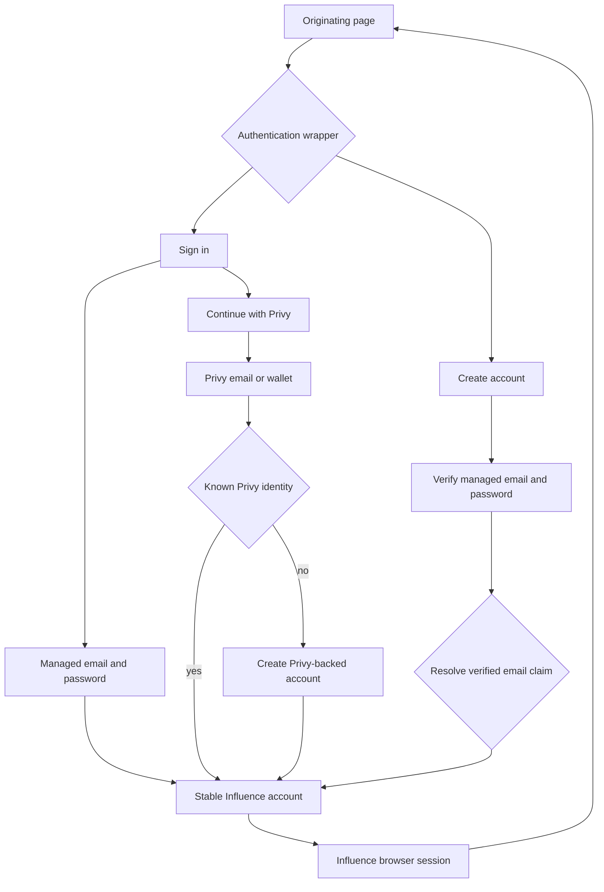
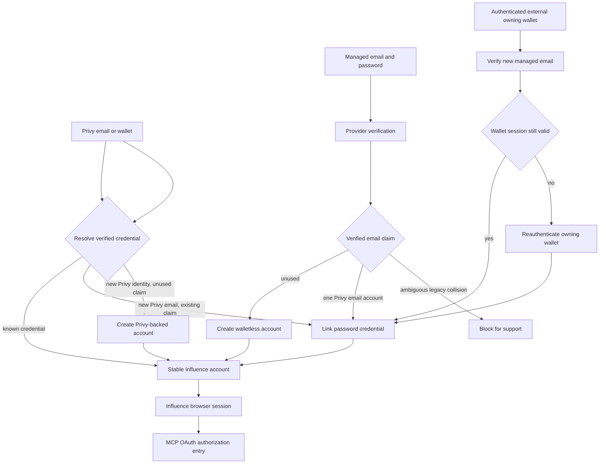
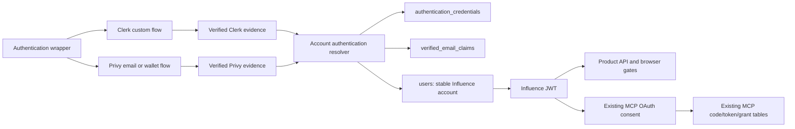
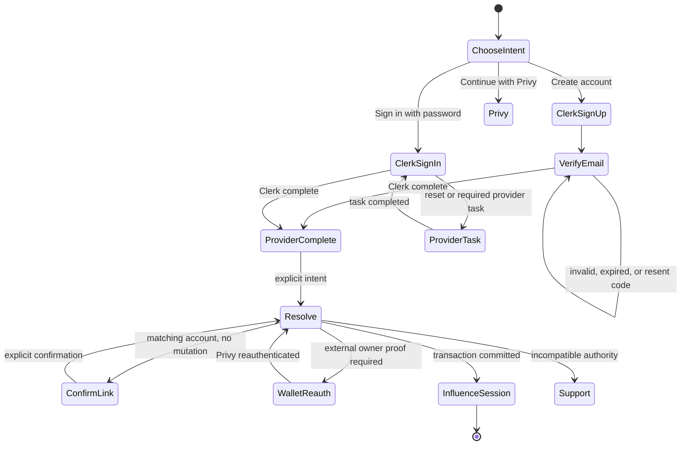
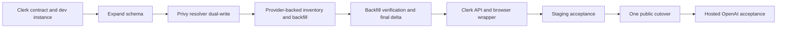

# Layered Identity Authentication - Plan

## Goal Capsule

- **Objective:** Add managed email/password signup and login alongside permanent first-class Privy signup and login, with both credential paths resolving to stable Influence accounts.
- **Product authority:** Influence owns account identity, ownership, and browser-session authority; Privy owns its authentication and wallet relationships; Clerk owns managed password verification, recovery, and provider sessions.
- **Stop conditions:** Do not expose Clerk entry until the Privy-backed identity inventory is complete, every authenticatable account has an unambiguous credential mapping or explicit conflict block, every deliberately non-authenticatable synthetic row is classified, Clerk's production configuration passes the password-only reviewer smoke, and its exit posture has written support confirmation.
- **Execution profile:** Deep cross-cutting authentication change spanning schema, migration/backfill, API identity resolution, browser session coordination, account settings, MCP OAuth entry, provider configuration, and hosted acceptance.
- **Tail ownership:** The implementer owns the private data preparation, one public cutover, rollback runbook, staging provider smoke, and hosted OpenAI OAuth proof; provider credential delivery remains an operator action.

---

## Product Contract

### Summary

Influence will add Clerk email/password authentication beside permanent direct Privy authentication, resolving both through a provider-neutral credential ledger and the existing Influence browser-session boundary.
The implementation will prepare and verify existing Privy identity mappings before one public cutover, use explicit collision-safe linking intents, and replace Privy-specific browser gates without changing durable account ownership or MCP OAuth artifacts.

### Problem Frame

Influence currently depends on Privy for production signup and login.
Privy supports email and wallet authentication but not conventional passwords, leaving no traditional credential path for users or an OpenAI reviewer who expects one.

The existing account key is also the Privy subject for new Privy signups and is referenced throughout ownership and authorization records.
Adding another provider without an explicit account boundary would create duplicate accounts, unsafe email-based merges, or a high-risk ownership-key migration.

### Key Decisions

- **Privy remains permanent and first-class.** (session-settled: user-directed — chosen over replacing or demoting Privy: existing Privy users, wallets, ownership, roles, and new Privy signups must remain fully supported.)
- **Password-created accounts are complete and walletless.** (session-settled: user-directed — chosen over automatic Privy and embedded-wallet provisioning: wallet capability is not required for ordinary account ownership or use.)
- **Existing ownership keys remain stable opaque identifiers.** (session-settled: user-directed — chosen over migrating every account and foreign key to a new UUID: linked credentials remove provider coupling without risking the ownership graph.)
- **New password-created accounts receive random internal UUIDs.** (session-settled: user-approved — chosen over provider-shaped IDs: new external subjects must not become ownership keys.)
- **Existing Privy users can add password login in the first release.** (session-settled: user-directed — chosen over limiting password support to new accounts: existing users need an additive login path without creating duplicate careers.)
- **Linking is available from account settings and collision recovery.** (session-settled: user-directed — chosen over a single entry point: users should recover safely whether they start authenticated with Privy or begin with password signup.)
- **A matching Privy email blocks duplicate account creation.** (session-settled: user-directed — chosen over allowing parallel accounts and cleaning them up later: the first release must prevent a known collision before it becomes split ownership.)
- **One normalized verified email claims one Influence account.** (session-settled: user-directed — chosen over best-effort collision checks: the claim prevents duplicates without making email the account's ownership key.)
- **Email-owned and wallet-owned Privy accounts use different linking proof.** (session-settled: user-directed — chosen over requiring Privy authentication for every link: managed-email verification is sufficient for an unambiguous matching Privy email, while a wallet-owned account requires authentication through its external owning wallet.)
- **Existing Privy email collisions remain non-enumerating.** (session-settled: user-directed — chosen over revealing an account before verification: the user learns that the password was linked only after proving the managed email.)
- **Reverse email collisions link into the password-first account.** (session-settled: user-directed — chosen over blocking Privy or creating a second Influence account: a verified Privy email attaches its identity and wallet to the stable password-first account.)
- **Impossible conflicting-account states stop for support.** (session-settled: user-directed — chosen over automatic merge or deletion: the atomic claim prevents new duplicates, and any legacy or defective collision remains unchanged for manual review.)
- **Linking uses ordinary operational logs.** (session-settled: user-directed — chosen over a dedicated audit ledger or ownership snapshots: deterministic linking outcomes and automated coverage carry the safety contract.)
- **Credentials are additive-only in the first release.** (session-settled: user-directed — chosen over self-service unlinking: credential removal requires a separate recovery and revocation contract.)
- **Managed login emails are immutable in the first release.** (session-settled: user-directed — chosen over claim-transfer and email-change recovery flows: password reset remains supported, but login-email changes are deferred.)
- **Influence creates the account only after verification.** (session-settled: user-directed — chosen over pending or unverified Influence accounts: abandoned attempts must remain resumable without creating ownership or duplicate-account state.)
- **Either login path can enter MCP OAuth, whose artifacts remain separate.** (session-settled: user-directed — chosen over a Privy-only authorization entry or coupling MCP tokens to a login provider: both paths establish the same browser-session prerequisite.)
- **The authentication wrapper separates account creation from sign in.** (session-settled: user-directed — chosen over a method-first wrapper: Create account is for managed email/password, while Sign in offers managed email/password and Privy.)
- **Privy remains a combined sign-in/signup path.** (session-settled: user-directed — chosen over inventing a distinct Privy signup mode: an unknown Privy identity continues to create an account through the Sign in view.)
- **Authentication preserves the originating page only.** (session-settled: user-directed — chosen over intent replay or encoded application state: OAuth keeps its authorization page mounted, and other entry points use existing redirect behavior before the user repeats an interrupted action.)
- **Explicit logout and reactive Influence-session expiry clear local provider sessions.** (session-settled: user-directed — chosen over silent provider-based restoration: the current browser context returns to the unified wrapper without unlinking credentials.)
- **Password reset does not revoke Influence or Privy sessions.** (session-settled: user-directed — chosen over adding server-side session revocation in this slice: managed-provider sessions follow provider reset behavior, while existing Influence JWTs expire normally and MCP grants remain separate.)
- **Authorization follows the Influence account, not the login credential.** (session-settled: user-directed — chosen over wallet reauthentication for password sessions: a safely linked password credential receives the same account roles and permissions as Privy login.)
- **Provider selection minimizes ongoing authentication burden.** (session-settled: user-directed — chosen over ranking primarily by price or infrastructure control: candidates must first pass compatibility and security gates, then operational burden decides among survivors.)
- **Provider presentation is flexible within the settled journey.** (session-settled: user-directed — chosen over requiring either hosted or embedded UI: either model may pass if it preserves the Influence wrapper and does not require excluded intent-restoration work.)
- **Provider exit preserves the account, not every credential artifact.** (session-settled: user-directed — chosen over requiring password-hash and MFA-factor portability: migration may require password reset or factor re-enrollment, but the Influence account and everything it owns remain stable.)
- **Exit evidence is documentary before adoption.** (session-settled: user-directed — chosen over a mandatory export/import rehearsal: official provider documentation plus written support confirmation is sufficient for the selected provider.)
- **Password-only accounts have no emergency alternate login.** (session-settled: user-directed — chosen over mandatory Privy linking or Influence-owned recovery credentials: a provider outage blocks password login, while already-linked Privy access remains independent.)
- **OpenAI review uses ordinary password signup.** (session-settled: user-directed — chosen over special reviewer-only product behavior: the product capability is normal signup and login; provisioning and credential delivery remain operational.)
- **Clerk is the managed password provider.** (session-settled: user-directed — chosen over Stytch, Supabase Auth, and Auth0: Clerk best satisfies the operational-burden-first ranking while supporting custom in-page Next.js flows and documented exports.)
- **Clerk uses a custom in-page flow.** (session-settled: user-approved — chosen over hosted same-tab redirects: the MCP authorization request must remain mounted and no URL-encoded handoff state is in scope.)
- **Clerk Client Trust is disabled in the first release.** (session-settled: user-approved — chosen over new-device second-factor challenges: an OpenAI reviewer must be able to use only the supplied email and password in a clean browser.)
- **The public release is one cutover after private identity preparation.** (session-settled: user-approved — chosen over user cohorts or parallel beta behavior: schema expansion, Privy dual-write, and provider-backed backfill may precede availability, but Clerk entry is exposed globally only after readiness gates pass.)

### Actors

- A1. **Password user:** Creates and later accesses a complete Influence account through verified email/password and may subsequently choose Privy email signup for the same account.
- A2. **Existing Privy user:** Keeps the current account and may add password login through the proof path appropriate to its Privy login owner.
- A3. **Privy-first new user:** Continues to create an account through Privy email or wallet signup with existing behavior preserved.
- A4. **Privy:** Authenticates Privy email and wallet users and preserves existing wallet relationships.
- A5. **Managed identity provider:** Holds password, verification, recovery, and pending-signup state and returns a verified identity assertion.
- A6. **Influence account authority:** Resolves verified credentials to stable accounts, prevents duplicate ownership, and issues the browser session.
- A7. **OAuth reviewer or client user:** Uses an ordinary supported account to authenticate before entering the separate MCP OAuth consent and token lifecycle.
- A8. **Authentication wrapper:** Presents provider-neutral entry choices, preserves or returns to the originating page using existing behavior, and coordinates logout within the current browser context.

### Requirements

**Authentication paths**

- R1. A new user can create an Influence account with a verified email and managed password.
- R2. A returning password user can log in and receive the same class of Influence browser session used by a Privy-authenticated user.
- R3. A password-created account supports ordinary account ownership and product use without Privy or a wallet.
- R4. Existing Privy email and wallet signup and login remain available to new and returning users without a required migration.
- R5. Privy and password authentication resolve to one provider-neutral Influence account/session contract before product authorization begins.

**Identity and ownership**

- R6. Existing internal account IDs and all ownership references remain unchanged.
- R7. New password-created accounts receive random internal UUIDs that do not encode the password provider subject.
- R8. Every verified external identity that can authenticate is represented as a Linked authentication credential explicitly associated with one Influence account; consumers must not infer the provider from the internal ID format.
- R9. Email remains private account metadata; an email-owned cross-provider link requires the same newly verified normalized email, while a wallet-owned link requires proof through the external owning wallet.
- R10. An existing Privy user can add password login without changing the account ID or any ownership reference.
- R11. A password signup that collides with an existing Privy email cannot create or enter a separate Influence account.
- R12. Collision recovery for an email-owned Privy account links only after managed-provider verification of the same normalized email.
- R13. The first release supports adding credentials but does not expose self-service credential removal.

**Verification and retry safety**

- R14. A managed-password signup creates no account, ownership, or browser session until the managed provider reports successful email verification.
- R15. An abandoned verification attempt can resume or restart without permanently reserving the email in Influence.
- R16. Replayed or repeated verified-completion signals and retries cannot create duplicate Influence accounts or attach the credential more than once.
- R17. Successful verified completion performs collision detection and exactly one account creation or link outcome.

**OAuth and review readiness**

- R18. Either supported authentication path can establish the Influence browser session required to enter MCP OAuth authorization.
- R19. Adding password authentication does not merge the browser-session lifecycle with MCP authorization codes, access tokens, refresh families, or resource authorization.
- R20. A normal password signup can be used to create a dedicated OpenAI review account, subject to the product's ordinary access policies.
- R21. The product does not add special shared-credential, reviewer-seeding, or OpenAI-only account behavior in this scope.

**Safe linking policy**

- R22. One trimmed, case-insensitive verified email may claim only one Influence account; dots, plus-tags, and provider-specific aliases are not collapsed.
- R23. Before managed-email verification, signup responses do not reveal whether an Influence or Privy account already uses the email.
- R24. Completing managed signup verification for an unambiguous existing Privy email explicitly requests linking; the account receives the password credential instead of a duplicate, and the user is told what occurred.
- R25. A wallet-owned Privy account can add password login only from an account session authenticated through its external owning wallet.
- R26. If the wallet-authenticated session expires before linking completes, Influence creates no password account and resumes linking only after wallet reauthentication.
- R27. Existing or unexpected collisions involving more than one Influence account block linking and preserve every account for support review.
- R28. Managed password login emails cannot be changed through self-service in the first release.
- R29. Rollout identifies legacy duplicate normalized emails; affected signup remains generic before verification and shows the support block only after verification.
- R30. The first release uses privacy-safe operational logs for linking diagnostics and adds no dedicated linking audit ledger.
- R31. Completing verified Privy email signup for an email claimed by one password-first Influence account explicitly requests linking; the Privy identity and provider-created wallet attach to that account, and no second Influence account is created.

**Authentication journey and sessions**

- R32. The provider-neutral wrapper exposes separate Sign in and Create account views.
- R33. Create account supports managed email/password signup only.
- R34. Sign in supports managed email/password and Continue with Privy, which opens the existing Privy email-or-wallet flow.
- R35. An unknown Privy identity entering through Sign in can continue to create a Privy-backed Influence account.
- R36. Successful authentication preserves the originating page: OAuth renders the wrapper in place without replacing its validated authorization request, while other entry points use existing redirect behavior.
- R37. Authentication does not preserve or replay an interrupted application action; the user repeats that action after returning.
- R38. Explicit logout clears the Influence token and calls logout for every authentication-provider session active in the current browser context without unlinking credentials.
- R39. The first protected request rejected after Influence-session expiry triggers the same local clearing behavior and returns the browser to the wrapper without silent restoration.
- R40. Managed-password reset changes only managed-provider credential and session state; existing Influence JWTs remain valid until expiry, and Privy sessions and MCP grants remain unchanged.

**Account authorization**

- R41. Product authorization derives from the resolved Influence account under the existing session-issuance and role-refresh rules, without discriminating between linked Privy and password credentials.
- R42. The first release does not require wallet reauthentication or credential-specific step-up merely because a privileged account established its session with a linked password.

**Managed-provider selection**

- R43. The managed provider owns password custody, email verification, password recovery, provider-session security, and credential-abuse controls.
- R44. The provider integrates additively with permanent direct Privy signup/login and returns a stable verified subject without becoming the canonical Influence account authority.
- R45. The provider supports resumable or safely restartable verification, idempotent completion, provider logout, and provider-managed password reset while exposing enough verified identity state for Influence-controlled explicit linking.
- R46. The provider offers optional MFA or passkeys for future use, but the first release does not enable them.
- R47. Clerk's custom in-page hooks must preserve the settled authentication journey without unmounting the OAuth authorization page or requiring excluded application-intent restoration.
- R48. The provider has a documented export and migration path that preserves durable Influence account mapping and verified identity continuity if Influence later leaves the service.
- R49. The adopted Clerk integration remains production-ineligible until it passes the compatibility, security, operational-burden, UX, and portability gates that justified its selection.

**Provider exit**

- R50. Before selection, research documents how provider identity records and verified-email state can be exported or reconstructed so a replacement-provider subject attaches to the same Influence account.
- R51. The selected provider's exit evidence includes current official documentation and written provider-support confirmation; an export/import rehearsal is not required.
- R52. An exit may require password reset or MFA re-enrollment and does not require portable password hashes, MFA factors, lockout state, or provider risk data.
- R53. Provider migration retires the old provider subject and attaches the replacement credential without changing Influence account IDs, ownership, roles, history, or MCP grants.
- R54. A managed-provider outage fails password login closed; only accounts already linked to Privy retain an independent login path.

**Selected Clerk integration**

- R55. Clerk is used only as the managed credential, verification, recovery, abuse-protection, and provider-session authority; it does not become an Influence account, role, ownership, or MCP authority.
- R56. The browser uses Clerk's custom Next.js hooks in place, and the API verifies Clerk session assertions with the Clerk backend SDK before reading the provider's primary verified email; browser-supplied email or verification fields are never trusted.
- R57. A Clerk session can create or link an Influence account only through an explicit user-selected create, collision-link, or account-settings-link intent; merely observing an active Clerk session cannot mutate Influence state.
- R58. No Influence JWT is issued while Clerk signup, verification, recovery, Client Trust, or another provider session task is incomplete.
- R59. Clerk production configuration requires public email/password signup, verification at signup, immutable user email, disabled Account Portal escape paths, disabled Client Trust, disabled MFA/passkeys for v1, and email alias behavior consistent with Influence's trim-and-case-only normalization.
- R60. Clerk being unavailable does not hide or disable Continue with Privy, invalidate an existing Influence JWT, or mutate an existing MCP grant.

**Provider-neutral browser and MCP boundaries**

- R61. Browser authentication state derives from the stored Influence JWT and `/api/auth/me`, not from either provider SDK's authenticated flag.
- R62. Provider sessions initiate exchange only from a user-started authentication attempt; logout, detected Influence expiry, or a newer attempt invalidates stale in-flight completions so they cannot restore an Influence token.
- R63. `/get-mcp`, permission hydration, protected-page gates, navigation, dashboard, queue, and game surfaces recognize a valid Influence session regardless of which linked credential established it.
- R64. MCP authorization codes, access tokens, refresh tokens, introspection, and audit output contain only the stable Influence account ID and existing authorization context; they never contain Clerk or Privy subjects, email claims, or credential state.
- R65. The ordinary OpenAI reviewer account uses only non-producer scopes; a walletless password account cannot grant `producer`, while ordinary owned-agent and game scopes continue to work.

**Rollout authority**

- R66. A provider-backed inventory classifies every current Privy identity using verified Privy facts, distinguishes external owning wallets from embedded wallets, and never promotes nullable `users.email` metadata into identity authority.
- R67. Legacy duplicate normalized emails become explicit support-blocked conflicts without selecting, merging, deleting, or changing either account.
- R68. New Privy account creation writes the provider credential and verified-email claim through the same resolver before Clerk is enabled, closing the race between backfill and public cutover.
- R69. Clerk entry remains unavailable until the inventory/backfill is complete, provider and claim constraints are verified, a final delta reports no unmapped authenticatable account or unclassified synthetic row, and the production provider configuration passes its smoke checks.





### Key Flows

- F1. **New password signup**
  - **Trigger:** A1 chooses email/password signup with an email that has no existing Influence-account collision.
  - **Actors:** A1, A5, A6
  - **Steps:** The provider captures and verifies the credential; Influence confirms there is no collision; one walletless account is created; Influence issues the browser session.
  - **Outcome:** The user can log in and use ordinary account-owned capabilities without Privy.
  - **Covered by:** R1-R3, R7-R9, R14-R17

- F2. **Existing email-owned Privy user adds password**
  - **Trigger:** A2 verifies a managed password credential whose normalized email matches one existing email-owned Privy account.
  - **Actors:** A2, A4, A5, A6
  - **Steps:** Signup reveals no collision before verification; Influence blocks new-account creation; the verified credential attaches to the stable account without another Privy login.
  - **Outcome:** Either credential can establish a browser session for the unchanged Influence account.
  - **Covered by:** R5-R13, R22-R24

- F3. **Wallet-owned Privy user adds password**
  - **Trigger:** A2 chooses Add email/password while authenticated through the external owning wallet.
  - **Actors:** A2, A4, A5, A6
  - **Steps:** The user verifies the new managed email; Influence links it while wallet proof is current or waits for wallet reauthentication if the session expires.
  - **Outcome:** No separate password account is created and all existing ownership remains attached to the wallet-owned account.
  - **Covered by:** R6-R10, R13, R16-R17, R25-R26

- F4. **Abandoned verification returns**
  - **Trigger:** A1 exits before verification and later retries.
  - **Actors:** A1, A5, A6
  - **Steps:** The provider resumes or restarts verification; Influence remains free of pending ownership state; successful completion runs the normal collision-safe transaction.
  - **Outcome:** The user completes signup without a permanently reserved email or duplicate account.
  - **Covered by:** R14-R17

- F5. **Privy signup, login, and reverse collision**
  - **Trigger:** A3 chooses Privy email or wallet signup/login, or A1 completes Privy email signup for the email claimed by the password-first account.
  - **Actors:** A1, A3, A4, A6
  - **Steps:** Privy authenticates the user; Influence resolves a known credential, creates a Privy-backed account when no claim exists, or treats the completed matching-email signup as an explicit request to link the Privy identity and provider-created wallet to the password-first account.
  - **Outcome:** Existing and new Privy users retain first-class access and wallet continuity without duplicate Influence accounts.
  - **Covered by:** R4-R6, R22, R31

- F6. **Authentication before MCP consent**
  - **Trigger:** A7 arrives at MCP OAuth authorization without an Influence browser session.
  - **Actors:** A7, A8, A6, and either A4 or A5
  - **Steps:** The authorization page keeps its validated request mounted while the wrapper presents Sign in; the user authenticates through either supported path; Influence establishes the browser session; consent continues in place.
  - **Outcome:** Login method changes neither the OAuth request nor the later MCP token lifecycle.
  - **Covered by:** R18-R21, R32, R34, R36

- F7. **Provider-neutral authentication entry**
  - **Trigger:** An unauthenticated user reaches a page that requires an Influence session.
  - **Actors:** A1, A2, A3, A8, and either A4 or A5
  - **Steps:** The user chooses Sign in or Create account; Create account starts managed password signup, while Sign in accepts managed password or the existing Privy email-or-wallet flow; successful authentication returns to the originating page.
  - **Outcome:** Both providers reach the same Influence session boundary without a separate Privy signup mode or automatic replay of the interrupted action.
  - **Covered by:** R32-R37

- F8. **Session exit and password recovery**
  - **Trigger:** The user explicitly logs out, the Influence session expires, or the user resets a managed password.
  - **Actors:** A1 or A2, A5, A6, A8
  - **Steps:** Explicit logout clears the local Influence token and provider sessions active in the current browser context; an expired Influence session triggers that clearing on the next rejected protected request; password reset follows managed-provider behavior but does not revoke Influence, Privy, or MCP state.
  - **Outcome:** Logout and detected expiry return the current browser context to the wrapper, while password reset avoids introducing cross-provider or server-side revocation.
  - **Covered by:** R38-R40

- F9. **Linked password login for a privileged account**
  - **Trigger:** An existing role-bearing Influence account has safely linked a managed password credential.
  - **Actors:** A2, A5, A6
  - **Steps:** The user authenticates with the linked password; Influence resolves the existing account; ordinary session issuance and authorization evaluate that account exactly as they do after Privy login.
  - **Outcome:** Password and Privy login reach the same authorization result without a new wallet step-up flow.
  - **Covered by:** R10, R41-R42

### Acceptance Examples

- AE1. **Covers R1-R3, R7-R8, R14, R17.** Given an unused email, when a user verifies it and completes password signup, then exactly one walletless Influence account with a random internal UUID, one explicitly associated Linked authentication credential, and one browser session exist.
- AE2. **Covers R14-R16.** Given a user abandons verification, when they return after the original attempt expires, then they can restart without an Influence account or permanent email reservation blocking them.
- AE3. **Covers R9, R11, R22-R23.** Given a managed email matches one email-owned Privy account, when the user has not completed managed-email verification, then Influence reveals no collision and creates or attaches nothing.
- AE4. **Covers R8, R10, R16, R25-R26.** Given a wallet-owned Privy user verifies a password credential and the wallet session expires, when the user reauthenticates the owning wallet and completion is retried, then one Linked authentication credential exists and no password account was created.
- AE5. **Covers R4-R6.** Given an existing Privy user who never adds password login, when they return through Privy, then their login, wallet, roles, ownership, and history behave as before.
- AE6. **Covers R18-R19.** Given either a password or Privy browser session, when the user enters MCP OAuth authorization, then the same consent contract applies and the resulting MCP artifacts remain independent from the login provider.
- AE7. **Covers R20-R21.** Given ordinary signup access, when the operator creates a password account for OpenAI review, then no special reviewer-only account path or shared-credential feature is required.
- AE8. **Covers R13.** Given an account has both Privy and password credentials, when the user views first-release account controls, then neither credential can be removed through self-service.
- AE9. **Covers R23, R27, R29-R30.** Given more than one legacy Influence account has the same normalized email, when a user begins password signup, then the response remains generic until verification and only then blocks for support with every account unchanged.
- AE10. **Covers R28.** Given an account has a managed password credential, when the user views first-release recovery controls, then password reset is available but login-email change is not.
- AE11. **Covers R10, R12, R24.** Given a verified managed email matches one email-owned Privy account, when linking completes, then the password credential attaches to that account and the user is told that no new account was created.
- AE12. **Covers R4-R6, R22, R31.** Given a password-first account claims an email, when the user explicitly completes Privy email signup with that same verified email, then the Privy identity and provider-created wallet attach to the existing account and its ID and ownership remain unchanged.
- AE13. **Covers R32-R35.** Given an unauthenticated user opens the wrapper, when they choose Create account, then only managed email/password signup is offered; when they choose Sign in, then managed email/password and Continue with Privy are offered.
- AE14. **Covers R34-R35.** Given a new user chooses Continue with Privy from Sign in, when Privy authenticates an identity that Influence has not seen, then one Privy-backed Influence account is created through the existing combined flow.
- AE15. **Covers R36-R37.** Given authentication interrupted an action on an ordinary protected page, when authentication succeeds, then existing redirect behavior returns the user to that page but does not replay the action.
- AE16. **Covers R18-R19, R36-R37.** Given an unauthenticated user reaches MCP OAuth authorization, when the wrapper authenticates them, then the authorization page and validated request remain mounted and consent continues without reconstructing request state.
- AE17. **Covers R38.** Given Influence and one or more provider sessions are active in the current browser context, when the user explicitly logs out, then the local Influence token and those provider sessions are cleared without unlinking a credential.
- AE18. **Covers R39.** Given an Influence JWT expires while the browser is idle, when the next protected request is rejected, then the browser clears the local Influence token and active provider sessions and shows the wrapper without silently restoring a session.
- AE19. **Covers R40.** Given a user has active Influence, Privy, managed-provider, and MCP authorization state, when the managed password is reset, then only the managed provider changes credential or session state and the other state remains valid under its existing lifecycle.
- AE20. **Covers R10, R41-R42.** Given a role-bearing Influence account has both Privy and password credentials and its roles do not change between logins, when either credential establishes a session, then the existing session-issuance rules produce the same authorization result without wallet reauthentication.
- AE21. **Covers R43-R45.** Given Clerk cannot own password security and recovery, preserve direct Privy, safely resume verification, complete idempotently, support provider logout/reset, or enable Influence-controlled linking, when implementation validates the adopted provider, then production enablement stops.
- AE22. **Covers R46-R48.** Given the configured Clerk integration lacks future MFA or passkey support, cannot fit the settled journey, or has no viable export and migration path, when adoption evidence is reviewed, then production enablement stops.
- AE23. **Covers R49.** Given Clerk was selected on operational-burden-first criteria, when its exact production configuration and integration are validated, then those gates must still hold; selection does not waive them.
- AE24. **Covers R48, R50-R51.** Given Clerk is the selected provider, before production enablement current official documentation and written support confirmation must describe how identity records and verified-email state can establish a replacement credential for the same Influence account.
- AE25. **Covers R52-R53.** Given Influence later migrates password providers, when a password user resets credentials or re-enrolls factors with the replacement provider, then the new provider subject attaches to the same Influence account and its ownership, roles, history, and MCP grants remain unchanged.
- AE26. **Covers R54.** Given the managed provider is unavailable, when password-only and Privy-linked users attempt login, then password login fails closed while the Privy-linked user can still use the existing Privy path.

### Success Criteria

- A new user completes verified password signup, logs out, and logs back into the same walletless Influence account.
- An existing Privy user adds password login and subsequently reaches the same account through either credential without changes to ownership, wallets, roles, or history.
- Matching-email attempts cannot create a second Influence account and link only through the email-owned or wallet-owned proof rule.
- Abandoned and repeated verification attempts remain recoverable and produce at most one account or credential link.
- Automated coverage proves expired-wallet-session resumption without making a manual expiry test a release gate.
- Existing Privy signup/login and the MCP OAuth token lifecycle retain their current product contracts.
- The same wrapper supports ordinary application entry and in-place MCP OAuth entry without provider-specific authorization behavior.
- Logout and the first rejected request after Influence-session expiry return the current browser context to the wrapper without adding server-side revocation or silent restoration.
- A safely linked password login uses the same existing session-issuance and role-refresh rules as Privy login for that Influence account.
- The selected Clerk integration passes the compatibility, security, operational-burden, UX, and portability gates without changing the settled account, linking, session, or OAuth contracts.
- Provider exit can move verified identity continuity to a replacement without changing the durable Influence account, even when users must reset passwords or re-enroll factors.

### Scope Boundaries

- Clerk is selected for this plan; re-running the vendor comparison or designing a provider-neutral plugin framework is excluded.
- Enabling MFA, passkeys, Client Trust, social login, Clerk organizations, or additional managed authentication methods is excluded.
- Export/import rehearsal, zero-interruption provider migration, full credential-state portability, and the migration itself are excluded.
- Self-service credential unlinking, login-email changes, final-credential removal, and the full compromise-recovery policy are deferred.
- A full migration of existing internal account IDs or ownership foreign keys is excluded.
- Automatic account merging, deletion, or consolidation is excluded.
- A dedicated linking audit ledger and ownership conservation snapshots are excluded.
- OAuth consent UX and MCP artifact changes remain excluded; this scope adds the authentication wrapper in place while the existing authorization page and request stay mounted.
- Self-service external-wallet linking and role-bearing wallet changes are deferred; provider-created wallet continuity during verified Privy signup remains in scope.
- Credential-specific wallet step-up for existing roles is excluded; the first release authorizes the resolved Influence account regardless of whether Privy or a linked password established its session.
- Wallet-action UX is excluded because Influence currently exposes no wallet actions.
- Reviewer credential delivery, shared secrets, and OpenAI-specific account provisioning are operational concerns, not product features in this scope.
- Encoding application intent into URLs, interrupted-action replay, server handoff tickets, and other application-state restoration work are excluded; retaining an already-mounted OAuth authorization page is existing page state, not a new restoration mechanism.
- Server-side browser-session revocation, authentication epochs, token denylists, and silent provider-based session restoration are excluded.
- Invite integration is deferred and not a release-test requirement because enforcement is disabled for this rollout. The settled recommendation for future work is to validate before email verification and consume only after successful account creation.
- Influence-owned recovery codes, manual emergency authentication, and mandatory Privy linking for password users are excluded.

### Dependencies and Assumptions

- Clerk keeps incomplete signup and verification state outside Influence; Influence sees a user only after Clerk reports a complete session with a verified primary email.
- A completed Clerk identity can remain available while a wallet-owned user reauthenticates through Privy; no Influence mutation occurs until all proof is present.
- Clerk session assertions carry a stable subject and can be verified independently from the Influence JWT.
- Clerk's current custom-flow hooks support in-page signup, verification, sign-in, reset, resend, and task handling without unmounting the OAuth authorization page.
- The rollout is all-at-once; a preflight inventory catches legacy duplicate email metadata, and affected accounts remain blocked rather than merged.
- A normal password-created account with no `producer` role is acceptable for OpenAI review and can grant the existing subject-scoped MCP permissions.
- Clerk defines which Clerk sessions a password reset invalidates; Influence does not broaden that reset into Privy, Influence JWT, or MCP revocation.
- Clerk's Account Portal and identifier-change controls can be configured so no hidden self-service email-change or alternative sign-in path bypasses the Influence wrapper.
- Clerk's optional email-subaddress restriction remains disabled, and provider behavior for plus-tags and dotted local parts is verified against the Product Contract before production enablement.
- Written Clerk support confirmation accurately describes the selected provider's export and migration posture at adoption time; lack of that confirmation blocks production enablement, not local implementation.

### Sources and Research

- `docs/ideation/2026-07-18-managed-password-auth-with-privy-ideation.html`
- `packages/api/src/routes/auth.ts`
- `packages/api/src/middleware/auth.ts`
- `packages/api/src/db/schema.ts`
- `packages/api/src/db/rbac.ts`
- `packages/web/src/app/providers.tsx`
- `packages/web/src/lib/api.ts`
- `packages/web/src/app/oauth/mcp/authorize/authorize-client.tsx`
- `packages/api/src/routes/mcp-oauth.ts`
- `packages/api/src/services/mcp-oauth.ts`
- `packages/api/src/services/user-email-policy.ts`
- `packages/api/src/lib/invite-codes.ts`
- `packages/api/drizzle/0004_invite_codes.sql`
- `docs/public-player-identity-rollout.md`
- `docs/solutions/architecture-patterns/production-mcp-role-resource-split.md`
- `docs/solutions/architecture-patterns/mcp-oauth-provider-compatibility.md`
- `docs/solutions/architecture-patterns/owner-scoped-alliance-read-models.md`
- `https://docs.privy.io/user-management/users/linking-accounts`
- `https://docs.privy.io/user-management/users/the-user-object`
- `https://docs.privy.io/wallets/wallets/get-a-wallet/get-connected-wallet`
- `https://docs.privy.io/security/authentication/user-authentication`
- `https://docs.privy.io/authentication/user-authentication/logout`
- `https://docs.privy.io/authentication/user-authentication/tokens`
- `https://clerk.com/docs/guides/development/custom-flows/authentication/email-password`
- `https://clerk.com/docs/guides/secure/client-trust`
- `https://clerk.com/docs/reference/backend/authenticate-request`
- `https://clerk.com/docs/reference/backend/types/backend-user`
- `https://clerk.com/docs/reference/backend/types/backend-email-address`
- `https://clerk.com/docs/guides/development/migrating/overview`
- `https://clerk.com/docs/guides/development/testing/playwright/overview`
- `https://clerk.com/docs/guides/development/testing/test-emails-and-phones`

---

## Planning Contract

### Key Technical Decisions

- **KTD1 — Clerk is additive credential authority, not account authority.** (session-settled: user-directed — chosen over replacing Privy or federating every login through one upstream provider: Privy must remain permanent and existing account ownership must survive provider change.) The API accepts verified Clerk or Privy evidence, resolves it to `users.id`, and only then issues the existing Influence JWT.
- **KTD2 — Use current Clerk Core custom-flow hooks, not Clerk Elements or hosted redirects.** (session-settled: user-approved — chosen over same-tab hosted auth: `/oauth/mcp/authorize` must remain mounted.) Add `@clerk/nextjs` to the web package and `@clerk/backend` to the API package; do not adopt the deprecated Clerk Elements abstraction or Clerk middleware as a second application authorization layer.
- **KTD3 — Keep three durable identity tables/concepts separate.** `users` remains the account/ownership table; `authentication_credentials` maps provider subjects to accounts; `verified_email_claims` owns the canonical email claim or an explicit legacy-conflict block. Do not add a unique constraint to `users.email`.
- **KTD4 — Represent legacy email ambiguity in the claim authority itself.** A claim row is either `active` with exactly one `user_id`, or `conflict` with no selected user. This reserves a known ambiguous email against new account creation without creating a merge ledger or pretending one legacy account is canonical.
- **KTD5 — Provider verification happens before, and session issuance after, one database transaction.** The transaction resolves credential, email claim, account creation/linking, and wallet attachment. Database constraints decide races; a unique-conflict retry re-reads state and returns the same typed outcome instead of surfacing an internal error.
- **KTD6 — Every mutation carries explicit authentication intent.** (session-settled: user-directed — chosen over automatic email merging: verified email equality prevents duplicates but does not silently merge accounts.) `create`, `confirm_email_link`, `link_clerk_to_current_account`, and `confirm_privy_link` are distinct server operations. A provider SDK becoming authenticated is never mutation authority.
- **KTD7 — Privy classification uses verified linked-account facts.** An email linked account identifies an email-owned login. A wallet-owned login requires an external wallet record whose `walletClientType !== "privy"`; an embedded wallet (`walletClientType === "privy"`) is product wallet state, not owning-wallet proof. Existing “first wallet wins” logic is characterized and then removed from identity resolution.
- **KTD8 — Wallet-owned password linking requires three matching authorities.** (session-settled: user-directed — chosen over trusting the Influence JWT alone: the user must prove current control of the external owning wallet.) The final request verifies the current Influence account, completed Clerk identity, and current Privy assertion whose external owning wallet maps to that same account. Expiry performs no database mutation and leaves the Clerk identity resumable.
- **KTD9 — Influence JWT state is the browser authority.** Privy and Clerk remain mounted as credential adapters, but protected UI, permission hydration, `/get-mcp`, and OAuth entry use a provider-neutral Influence auth context hydrated from the token and `/api/auth/me`.
- **KTD10 — Provider completion is generation-bound and never silently restores after exit.** Explicit logout and reactive expiry clear local Influence state first, invalidate in-flight exchanges, then attempt both provider logouts independently. One single-flight expiry transition absorbs concurrent protected-request failures.
- **KTD11 — Password reset remains intentionally local to Clerk.** (session-settled: user-directed — chosen over a browser JWT revocation system: server-side revocation is outside this slice.) Reset and Clerk session behavior follow Clerk; active Influence JWTs, Privy sessions, and MCP grants keep their current lifecycles.
- **KTD12 — MCP protocol/storage remains unchanged.** MCP authorization continues to consume an Influence JWT and persist `users.id`. Only browser recognition and regression tests change. Managed-provider subjects, emails, and credential status do not enter MCP tables, tokens, introspection, scopes, or audits.
- **KTD13 — Clerk's production configuration is code-reviewed operational state.** (session-settled: user-approved — chosen over default Client Trust behavior: clean-browser review must accept email/password alone.) The rollout captures dashboard settings, verifies them in staging, and treats drift as a release failure. Client Trust, MFA, passkeys, email changes, Account Portal, and alias-collapsing restrictions stay off in v1.
- **KTD14 — Login-critical state is read synchronously, not webhook-synchronized.** The API verifies the presented provider assertion and retrieves current provider user facts during the user request. Clerk or Privy webhooks are not required for account creation/linking correctness and are not added in this slice.
- **KTD15 — One public cutover follows invisible preparation.** (session-settled: user-approved — chosen over a Clerk beta or user cohorts: all users receive the new wrapper together.) An expand release first adds the ledger and routes direct Privy creation through it, then the provider-backed backfill and final delta run, and only then does the cutover release expose Clerk globally.
- **KTD16 — Privacy-safe operational events replace a dedicated link ledger.** (session-settled: user-directed — chosen over durable link receipts: ordinary logs and automated invariants are sufficient.) Events include a correlation ID, provider class, stable Influence ID after resolution, outcome, and safe reason code; they exclude raw or normalized email, provider subject, provider token, wallet proof, and authorization headers.

### High-Level Technical Design

#### Authority topology



The provider adapters answer only “which verified provider identity is present, and what verified facts accompany it?” The account resolver answers “which stable Influence account may this explicit intent use?” The existing session issuer and authorization layers remain downstream.

#### Durable data model

| Authority | Required shape | Constraints and purpose |
|---|---|---|
| `users` | Existing columns unchanged; password-first `id` generated with `randomUUID()` | Canonical ownership and authorization account. `email` remains nullable private projection metadata, not lookup authority. |
| `authentication_credentials` | UUID row ID, `user_id`, `provider`, `provider_subject`, `created_at`, nullable `retired_at` | Foreign key to `users.id` with restricted deletion; check provider in `privy`, `clerk`; permanent unique `(provider, provider_subject)` prevents subject reuse across accounts; active index by `user_id`. |
| `verified_email_claims` | `normalized_email`, nullable `user_id`, `state`, timestamps | Primary key on normalized email; check `active` has one user and `conflict` has none; partial unique active claim by `user_id`; canonical-value check enforces `lower(btrim(value)) = value`. |

The claim row deliberately stores a conflict sentinel rather than multiple winning rows. A provider-backed backfill creates:

- one `active` claim when one normalized verified email maps to one Influence account;
- one `conflict` row when the same normalized verified email maps to multiple Influence accounts;
- no claim for wallet-owned Privy identities without a verified email.

Dots, plus-tags, and provider-specific aliases are left untouched. Clerk's optional “block email subaddresses” setting remains disabled, and staging tests verify that provider behavior does not collapse identifiers more aggressively than Influence.

#### Provider evidence

`packages/api/src/services/authentication-providers.ts` owns provider-specific verification behind injected interfaces:

- Clerk evidence contains the verified session subject, completed session/task state, `passwordEnabled`, and the primary email only when the backend `EmailAddress.verification.status` is `verified`.
- Privy evidence contains the Privy subject, verified email when present, external owning wallet records, embedded wallet records, and the product wallet value currently projected onto the account.
- Provider profile lookup failure is fatal for unknown identity creation/linking because the resolver cannot safely exclude a collision. A known credential may log in only when the presented subject maps unambiguously; it must not opportunistically update wallet/email from missing profile data.
- The Clerk verifier validates signature, expiry, and authorized party using `@clerk/backend`, then fetches the backend user. The web never sends trusted email or verification booleans.

Provider assertions are passed separately from the Influence JWT:

- ordinary provider exchange uses an unauthenticated auth request helper;
- account linking uses the Influence JWT in `Authorization` and provider tokens in the request body;
- provider-auth failures never dispatch the global Influence-expiry event.

#### Transactional account resolver

`packages/api/src/services/account-authentication.ts` receives verified evidence plus one explicit intent and returns a typed result:

| Result | Meaning |
|---|---|
| `session_ready` | Known credential resolved; account can receive an Influence JWT. |
| `account_created` | Verified unused identity created one account and credential. |
| `link_confirmation_required` | Verified email maps one other-provider account; no mutation yet. |
| `credential_linked` | Explicit confirmation attached the credential to the existing account. |
| `wallet_reauthentication_required` | Clerk proof remains usable, but current external-wallet proof is absent/expired; no mutation occurred. |
| `setup_incomplete` | Provider identity exists but the corresponding Influence create/link was never committed; user must explicitly resume. |
| `support_blocked` | Subject, email, wallet, or legacy-conflict evidence points at incompatible accounts; nothing changes. |

Resolution order is deterministic:

1. Resolve `(provider, subject)`. If it exists, that account wins only when any accompanying claim/wallet facts do not point elsewhere.
2. Reject a conflict claim, a wallet owned by another account, or a subject-to-account mapping inconsistent with the email claim.
3. For a new Clerk subject, use the verified claim only to return link confirmation; create a new UUID account only under explicit create intent and an unused claim.
4. For a new Privy subject with one password-first email claim, return explicit Privy-link confirmation; after confirmation attach the Privy credential and provider-created wallet to that account.
5. For a wallet-owned account-settings link, require current Influence, Clerk, and external-wallet proof for the same account.
6. Commit credential, claim, account, and wallet changes atomically; issue the Influence JWT only after commit.

The resolver catches named unique/check violations, starts a fresh read, and returns the now-canonical result. Two tabs, callback retries, and simultaneous Clerk/Privy completion therefore converge without duplicate accounts.

#### Clerk browser state machine



Clerk signup attempts and provider users may outlive the Influence transaction. A completed provider identity with no credential row renders “finish account setup” and waits for an explicit create/link action. Reloading, returning after an expired code, a database failure, or provider retry never auto-creates an Influence account.

Password recovery handles wrong password, locked account, reset-code expiry/resend, compromised-password tasks, and other Clerk pending tasks. It activates or exchanges a Clerk session only after Clerk reports completion. Resetting while an Influence session is active does not clear that Influence session.

#### Provider-neutral browser session coordinator

The new Influence auth context exposes `ready`, `authenticated`, `account`, `openSignIn`, `openCreateAccount`, explicit provider completion actions, and `logout`. It:

- bootstraps only from the stored Influence token and `/api/auth/me`;
- keeps a valid Influence session when Clerk or Privy is signed out or unavailable;
- uses a browser-wide attempt generation so a stale provider completion cannot win after logout, expiry, cancellation, or a newer attempt;
- broadcasts logout, expiry, and generation invalidation across tabs with `BroadcastChannel` plus a storage-event fallback, and binds every provider completion to the latest browser-wide generation;
- handles concurrent protected-request failures through one expiry promise;
- clears the token and account immediately, dispatches existing session-cleared compatibility events, then calls Clerk and Privy logout with `Promise.allSettled` and bounded adapters;
- never auto-exchanges a provider cookie after local clearing.

All current direct Privy application gates move to this context; OAuth authorization and `/get-mcp` move in U8. Privy remains available inside the coordinator for direct login and wallet-owned link proof.

#### OAuth and MCP boundary

`McpOAuthAuthorizeClient` continues to parse and retain the authorization request in its mounted component. Its unauthenticated branch renders the wrapper inline. Successful authentication changes only Influence auth state, causing the existing inspect/consent path to resume with the same parsed request.

No MCP authorization code is created before explicit approval. Cancelled Privy modal, failed Clerk verification, reset, logout, expiry, or support block performs no consent mutation. A password-created reviewer can grant `agents:read`, `agents:write`, and `games:read` as allowed by the existing client envelope and ownership rules, but cannot grant `producer` without the existing wallet-backed current role.

### System-Wide Impact

- **Ownership:** Existing `users.id` values and every foreign key remain unchanged. New password accounts use UUIDs in the same text column.
- **Authorization:** Browser role claims keep current issuance semantics; MCP producer paths keep current DB role rechecks. Login provider never becomes a role input.
- **Frontend:** Authentication state changes from Privy-derived to Influence-session-derived across navigation, gates, dashboard, queue, games, profile, `/get-mcp`, and OAuth authorization.
- **Provider availability:** Clerk outage blocks Clerk actions only. Direct Privy login, active Influence JWTs, and existing MCP artifacts continue under their current dependencies and expiry rules.
- **Privacy:** Credential subjects, claims, and provider state are private auth data. Public player, replay, WebSocket, leaderboard, generic API, and MCP projections must prove their absence.
- **Deployment:** API requires Clerk secret/publishable/JWT verification configuration and authorized web origins; web runtime config exposes only the Clerk publishable key. Privy configuration remains mandatory.
- **Testing:** Deterministic injected provider adapters prove resolver behavior; a real Clerk development instance proves the SDK/dashboard contract; staging and hosted ChatGPT prove external acceptance.

### Implementation Constraints

- Use Bun for dependency, generation, test, and build commands.
- Generate the Drizzle migration and snapshot with the repo's existing tooling; inspect generated SQL and add explicit canonical checks/backfill logic where generation cannot express the contract.
- Do not manually rewrite existing ownership foreign keys.
- Do not trust `users.email`, browser email, provider metadata, or an Influence JWT as wallet-login proof.
- Do not add a browser session table, auth epoch, denylist, revocation endpoint, linking audit table, URL intent encoding, handoff ticket, or interrupted-action replay.
- Do not add Clerk webhooks to the login-critical path.
- Do not alter MCP token schemas, scopes, callback registration policy, refresh rotation, or resource metadata.
- Keep provider SDK clients injectable so tests do not call live Clerk or Privy.
- Keep the direct Privy email/wallet modal and embedded-wallet creation behavior available to new users.
- Add the stateful-URI/intention-restoration opportunity to `docs/refactor-queue.md`; do not implement it in this feature.

### Sequencing and Rollout



1. Establish the Clerk development/production configuration contract, capture official exit documentation, and open the written export/support-confirmation request.
2. Ship the additive schema and direct-Privy resolver path with Clerk entry unavailable. Existing users see no auth-product change.
3. Run the checkpointed Privy inventory/backfill, resolve or block every mismatch, and verify ownership conservation.
4. Run a final delta while new Privy signups are already dual-writing through the resolver.
5. Deploy the provider-neutral frontend and Clerk routes to staging, then execute deterministic, real-provider, and OAuth acceptance.
6. Expose Clerk to every user in one production cutover; do not create cohorts or migrate Privy users automatically.
7. If cutover fails after any password account exists, enter `existing-only` degraded mode: disable new Clerk account creation and linking while retaining Clerk sign-in for existing credentials and full Privy entry. Use the Privy-only dual-write build only before the first password account exists or under an explicitly declared emergency lockout. Preserve all rows and repair forward; never delete or re-key accounts.

### Risks and Mitigations

| Risk | Mitigation / stop condition |
|---|---|
| Existing account is not the row implied by its Privy subject | Inventory Privy subjects and external/embedded wallets from provider facts; stop on unmapped or cross-account evidence. |
| Two providers create the same account concurrently | Unique credential/claim constraints plus one transaction and deterministic retry/readback. |
| Clerk creates a provider user but Influence commit fails | Explicit `setup_incomplete` resume path; no automatic account creation from provider session observation. |
| Embedded wallet is mistaken for owning wallet | Classify by `walletClientType`; fixtures cover both orderings and mixed records. |
| Logout/401 races silently restore a session | Single-flight expiry, attempt generations, local clear before provider logout, stale-completion tests. |
| Clerk dashboard drift introduces OTP/MFA/email change | Configuration checklist, dev/staging smoke from a clean browser, Account Portal disabled, production go/no-go record. |
| Alias handling disagrees with the email-claim contract | Keep Clerk subaddress blocking off; test plus-tag and dotted local-part behavior before enablement. |
| Provider outage blocks all entry | Continue with Privy remains independently rendered and tested; password-only outage is an accepted limitation. |
| Password reviewer requests producer access | Use ordinary subject scopes and verify the consent UI blocks `producer` for the walletless account. |
| Sensitive identity leaks into output | Projection audit and forbidden-field tests across API, MCP, WebSocket, public profile, replay, and logs. |

### Documentation and Operational Notes

- Add `docs/authentication/managed-provider-selection.md` with the Clerk decision, dashboard settings, SDK/API versions, official export evidence, written support confirmation, and provider-exit mapping.
- Add `docs/authentication/layered-identity-rollout.md` with inventory commands, checkpoint/resume behavior, privacy-safe counts, stop conditions, final delta, cutover, rollback, and hosted acceptance record.
- Update `docs/development-and-operations.md`, `DEVELOPMENT.md`, and the relevant Dockerfiles for Clerk environment/configuration and the operator script.
- Update `docs/game-mcp-production-oauth.md` only to state that either Influence login path can enter the unchanged consent flow.
- Update `README.md` with the top-level authentication capability and link to operations documentation.
- Add the deliberately deferred stateful-URI work to `docs/refactor-queue.md`.

---

## Implementation Units

### U1. Freeze the Clerk adoption and configuration contract

- **Goal:** Make the selected provider reproducible and safe before code depends on its defaults.
- **Requirements:** R43-R54, R55-R60.
- **Dependencies:** None.
- **Files:**
  - `docs/authentication/managed-provider-selection.md` (new)
  - `packages/web/package.json`
  - `packages/api/package.json`
  - `package.json`
  - `bun.lock`
  - `packages/api/src/index.ts`
  - `packages/web/src/lib/runtime-config.ts`
  - `packages/web/src/lib/server-runtime-config.ts`
  - `Dockerfile.web`
  - `Dockerfile.api`
- **Approach:**
  - Record Clerk as the chosen provider and pin compatible current versions of `@clerk/nextjs`, `@clerk/backend`, and `@clerk/testing`.
  - Configure development and production instances for required email, password, verification-at-signup, public signup, immutable email, disabled Account Portal, disabled Client Trust, disabled MFA/passkeys, and disabled subaddress collapsing.
  - Define `CLERK_PUBLISHABLE_KEY`, `CLERK_SECRET_KEY`, `CLERK_JWT_KEY`, authorized-party/origin handling, and one managed-auth mode with `disabled`, `existing-only`, and `full` values. Expose only the publishable key and non-secret mode to the browser runtime.
  - Provision server credentials and JWT verification material through the existing deployment secret manager with separate development, staging, and production values. Forbid them in source, logs, fixtures, support records, and browser output; document coordinated rotation, rollback, and compromised-key replacement.
  - Document that the API verifies session assertions and backend user verification state; it does not use Clerk as middleware for product routes.
  - Capture official export documentation and open the written Clerk support request covering stable identity records, verified-email continuity, and mapping a replacement credential to the same Influence account. Password-hash portability is not required. Receipt and acceptance of the response is a U9 production-enable gate, not a dependency for local implementation.
- **Test Scenarios:**
  - Missing server secrets fail startup with a clear configuration error once Clerk entry is enabled.
  - Runtime config returns the publishable key and never returns secret/JWT key material.
  - Managed-auth mode rejects unknown values; `disabled` exposes no Clerk entry, `existing-only` permits existing linked password sign-in but no create/link mutation, and `full` enables the validated journey.
  - Secret rotation and rollback preserve a valid Clerk exchange, and the documented compromised-key procedure removes the old key without exposing it.
  - Clean Clerk development browser supports password signup with email verification code and later password-only login.
  - Plus-tag and dotted local-part test accounts remain distinct according to Influence normalization.
  - Account Portal and identifier changes are unavailable.
- **Verification:**
  - `bun install`
  - `bun run check`
  - Review the provider decision artifact against current official Clerk documentation and confirm that the support request and production-blocking acceptance criteria are recorded.

### U2. Add the provider-neutral credential and email-claim authority

- **Goal:** Expand the schema without changing any durable account or ownership key.
- **Requirements:** R6-R9, R22, R27-R30, R48-R53, R66-R69.
- **Dependencies:** U1.
- **Files:**
  - `packages/api/src/db/schema.ts`
  - `packages/api/drizzle/0043_*.sql` (new generated migration)
  - `packages/api/drizzle/meta/0043_snapshot.json` (new)
  - `packages/api/drizzle/meta/_journal.json`
  - `packages/api/src/__tests__/test-utils.ts`
  - `packages/api/src/__tests__/layered-authentication-migration.test.ts` (new)
- **Approach:**
  - Add `authentication_credentials` and `verified_email_claims` with the checks and uniqueness rules in the data model.
  - Leave `users.id`, `users.email`, every ownership foreign key, and MCP OAuth tables unchanged.
  - Keep retired provider subjects permanently unique so an exited credential cannot later authenticate a different account.
  - Add the new tables to test cleanup in dependency-safe order.
  - Use transient migration assertions and unchanged foreign-key checks to prove no existing owner reference changes; do not create or retain an operational ownership snapshot artifact.
- **Test Scenarios:**
  - Migration preserves every ownership and MCP user reference.
  - Existing text/Privy-shaped IDs remain byte-for-byte unchanged.
  - Active claim requires one user; conflict claim selects none.
  - Canonical trim/lower checks reject malformed stored values without altering plus-tags or dots.
  - One active email per account and one provider subject per account mapping are enforced.
  - Migration failure rolls back cleanly and a rerun succeeds.
- **Verification:**
  - `bun run db:bootstrap`
  - `cd packages/api && DRIZZLE_MIGRATIONS_DIR=./drizzle bun test src/__tests__/layered-authentication-migration.test.ts`

### U3. Introduce verified provider adapters and direct-Privy dual-write

- **Goal:** Turn provider assertions into typed evidence and route all new Privy accounts through the new authority before Clerk is exposed.
- **Requirements:** R4-R12, R25-R27, R31, R35, R44-R45, R56, R66, R68.
- **Dependencies:** U2.
- **Files:**
  - `packages/api/src/services/authentication-providers.ts` (new)
  - `packages/api/src/services/account-authentication.ts` (new)
  - `packages/api/src/lib/verified-email.ts` (new)
  - `packages/api/src/lib/postgres-errors.ts`
  - `packages/api/src/routes/auth.ts`
  - `packages/api/src/middleware/auth.ts`
  - `packages/api/src/__tests__/account-authentication.test.ts` (new)
  - `packages/api/src/__tests__/auth.test.ts`
- **Approach:**
  - Define injectable Clerk and Privy verifier interfaces; implement the Privy adapter first.
  - Parse all linked accounts deliberately: email owner, external owning wallet, embedded product wallet. Preserve current product-wallet projection while removing “first wallet is identity” assumptions.
  - Implement the transaction resolver and shared post-commit Influence session issuer.
  - Keep the existing Privy login route compatible while changing its internals to resolve/create credential and claim rows.
  - Before the U4 backfill exists, a verified Privy subject with no credential row follows a transactional first-login compatibility path: resolve the unique existing account from the exact legacy `users.id = Privy subject` mapping and verified external/product-wallet mappings; attach the credential and applicable verified-email claim only when all present facts agree; return `support_blocked` without mutation when they disagree. This bridge remains idempotent, uses the same constraints as the backfill, and is disabled after the zero-delta gate so legacy ID inference does not become permanent authority.
  - Fail closed for unknown Privy users when provider profile facts cannot be loaded. Known credentials may log in without opportunistic metadata mutation.
  - Return typed collision/link outcomes; do not automatically merge or create from matching email.
- **Test Scenarios:**
  - Existing Privy subject logs into the same account with unchanged wallet, roles, history, and JWT subject.
  - A pre-backfill subject-only, wallet-only, and agreeing subject-plus-wallet legacy mapping attaches exactly one credential on first login; conflicting legacy mappings support-block without mutation.
  - New Privy email and wallet users create exactly one account and credential through Sign in.
  - Embedded and external wallet fixtures in either array order produce the same classification.
  - Missing provider profile blocks unknown-user creation without mutation.
  - Known subject plus conflicting email/wallet facts support-blocks.
  - Two simultaneous Privy completions return one account.
  - Privy login remains available when the Clerk adapter is unavailable.
- **Verification:**
  - `cd packages/api && DRIZZLE_MIGRATIONS_DIR=./drizzle bun test src/__tests__/account-authentication.test.ts src/__tests__/auth.test.ts`

### U4. Build the provider-backed inventory, backfill, and readiness proof

- **Goal:** Establish authoritative credential/claim state for every authenticatable production account and explicitly classify deliberately non-authenticatable synthetic rows before public Clerk availability.
- **Requirements:** R6, R22, R27, R29-R30, R66-R69.
- **Dependencies:** U3.
- **Files:**
  - `packages/api/src/scripts/preflight-auth-identities.ts` (new)
  - `packages/api/src/services/authentication-identity-inventory.ts` (new)
  - `packages/api/src/__tests__/authentication-identity-inventory.test.ts` (new)
  - `Dockerfile.api`
  - `packages/api/package.json`
  - `docs/authentication/layered-identity-rollout.md` (new)
- **Approach:**
  - Implement checkpointed, idempotent Privy pagination with bounded retry/backoff and resume after rate limits or interruption.
  - Map verified subjects and wallet facts to existing users; treat `users.email` only as a mismatch signal.
  - Count imported synthetic/House-controlled rows under an explicit `non_authenticatable` classification using the repository's existing synthetic-player discriminator. Never manufacture credentials for those rows; exclude only positively classified rows from credential-completeness checks.
  - Seed credential rows and active/conflict claim rows in bounded transactions.
  - Store checkpoints in a deployment-private encrypted location with least-privilege access. Checkpoints contain only opaque pagination cursor, batch/version metadata, and counts; delete them after the signed rollout record is complete.
  - Report counts, safe reason codes, and versioned keyed-HMAC references only. Manage the HMAC key as an environment-scoped secret; never emit unkeyed email fingerprints, raw email, provider subject, wallet identity, or tokens.
  - Exit nonzero on unmapped subject, wallet collision, incomplete pagination, ambiguous mapping without a conflict row, or final-delta drift.
  - Verify the direct-Privy path is dual-writing before the final delta so signups cannot slip between inventory and cutover.
  - After zero delta, disable the transitional first-login legacy-adoption branch and prove every authenticatable Privy user resolves through a credential row.
- **Test Scenarios:**
  - Unique verified email seeds one active claim; duplicate across accounts seeds one conflict row.
  - Multiple provider facts on the same account do not create a false cross-account conflict.
  - Wallet-owned identity without email receives a credential and no claim.
  - Positively identified synthetic rows are counted as non-authenticatable and do not block readiness; an ordinary unmapped account still fails readiness.
  - Pagination interruption resumes without duplicate rows.
  - Rate-limit retries remain bounded and preserve checkpoint.
  - Rerun is idempotent; injected mid-batch failure rolls back that batch only.
  - Final delta fails on a deliberately inserted unmapped authenticatable account or unclassified synthetic row.
- **Verification:**
  - `cd packages/api && DRIZZLE_MIGRATIONS_DIR=./drizzle bun test src/__tests__/authentication-identity-inventory.test.ts src/__tests__/layered-authentication-migration.test.ts`
  - Run the documented dry-run against staging and retain the privacy-safe summary in the rollout record.

### U5. Add Clerk exchange, signup completion, linking, and recovery APIs

- **Goal:** Convert completed Clerk sessions into deterministic Influence create/login/link outcomes without trusting browser identity data.
- **Requirements:** R1-R3, R10-R17, R22-R31, R40, R55-R60.
- **Dependencies:** U3. U4 remains a mandatory U9 staging and production-cutover prerequisite before Clerk entry is exposed, but it does not block development behind the disabled entry point.
- **Files:**
  - `packages/api/src/services/authentication-providers.ts`
  - `packages/api/src/services/account-authentication.ts`
  - `packages/api/src/routes/auth.ts`
  - `packages/api/src/services/session-issuance.ts` (new)
  - `packages/api/src/__tests__/account-authentication.test.ts`
  - `packages/api/src/__tests__/auth.test.ts`
- **Approach:**
  - Implement Clerk token verification with authorized-party checking and backend-user retrieval.
  - Require complete provider/session tasks, password-enabled identity, and verified primary email before resolution.
  - Add separate unauthenticated exchange/create-confirm routes and authenticated account-link routes.
  - Apply strict request schemas and token/body-size limits. Rate-limit pre-verification requests by privacy-preserving IP bucket and post-verification requests by provider subject or Influence account; bound provider calls with short deadlines and no retry storms; return generic privacy-safe `429` responses with `Retry-After`.
  - Return link confirmation before mutating an email collision. Require a second explicit call for the link.
  - For wallet-owned linking, verify Influence JWT, Clerk token, and current Privy token/external owner mapping together.
  - Return `setup_incomplete` for a completed Clerk identity with no credential after a prior DB failure; resume only on explicit create/link.
  - Share one post-commit role resolution and JWT projection with Privy login.
- **Test Scenarios:**
  - Unused verified Clerk email creates one walletless UUID account.
  - Unverified/incomplete/locked/pending-task Clerk states issue no Influence JWT.
  - Repeated completion and double-submit return the same account.
  - Provider completion followed by injected DB failure can explicitly finish later.
  - Matching email-owned Privy account returns confirmation, then links without another Privy proof.
  - Wallet-owned account requires current matching external-wallet proof; expired proof returns reauth-required and later succeeds.
  - Embedded wallet alone never satisfies owner proof.
  - Reverse Privy collision attaches credential/wallet to the password account after confirmation.
  - Subject/email/wallet pointing to different accounts support-blocks with no mutation.
  - Linked password and Privy sessions issue the same account subject and role/permission result.
  - Password reset leaves existing Influence, Privy, and MCP state unchanged.
  - Oversized or malformed bodies fail before provider lookup; burst traffic reaches documented `429` limits; provider timeout cannot trigger an unbounded retry or account mutation.
- **Verification:**
  - `cd packages/api && DRIZZLE_MIGRATIONS_DIR=./drizzle bun test src/__tests__/account-authentication.test.ts src/__tests__/auth.test.ts`

### U6. Replace Privy-derived browser state with the Influence auth coordinator

- **Goal:** Make the stored Influence session authoritative across the application gates listed here and eliminate logout/expiry restoration races; U8 completes the OAuth and `/get-mcp` gate migration.
- **Requirements:** R2, R5, R36-R42, R61-R63.
- **Dependencies:** U5.
- **Files:**
  - `packages/web/src/app/providers.tsx`
  - `packages/web/src/hooks/use-auth.ts` (new)
  - `packages/web/src/hooks/use-permissions.ts`
  - `packages/web/src/lib/api.ts`
  - `packages/web/src/components/auth-gate.tsx`
  - `packages/web/src/components/admin-gate.tsx`
  - `packages/web/src/components/permission-page-gate.tsx`
  - `packages/web/src/components/nav.tsx`
  - `packages/web/src/app/dashboard/dashboard-content.tsx`
  - `packages/web/src/app/dashboard/mission-control-overview.tsx`
  - `packages/web/src/app/games/free/free-game-content.tsx`
  - `packages/web/src/app/games/[slug]/game-viewer.tsx`
  - `packages/web/src/components/standing-daily-agent-prompt.tsx`
  - `packages/web/src/__tests__/auth-session-model.test.ts` (new)
  - `packages/web/src/__tests__/dashboard-mission-control-overview.test.tsx`
- **Approach:**
  - Add ClerkProvider beside permanent PrivyProvider, then place one Influence auth coordinator downstream.
  - Hydrate account/session from Influence token plus `/auth/me`, independent of provider SDK state.
  - Split auth-exchange requests from protected `apiFetch` so provider 401s cannot expire a valid Influence session.
  - Implement browser-wide generation-bound explicit attempts, one expiry single-flight, immediate local clearing, bounded independent provider logout adapters, and stale-completion suppression. Synchronize logout/expiry/generation changes through `BroadcastChannel` with a storage-event fallback.
  - Preserve existing session-ready/session-cleared/identity-updated events while migrating consumers.
  - Replace dashboard email/wallet display reads from Privy with the private Influence account projection.
- **Test Scenarios:**
  - Managed-only Influence session remains authenticated while Privy reports false.
  - Valid Influence JWT hydrates after reload without auto-exchanging a provider session.
  - Provider sign-out does not clear a valid Influence JWT.
  - Explicit logout and concurrent protected 401s clear once and attempt both provider logouts.
  - One provider logout failure cannot preserve the local token or prevent the other logout.
  - Exchange completing after logout/expiry cannot restore the token.
  - One tab logging out or expiring invalidates an in-flight exchange in another tab and prevents restoration of the shared browser session.
  - Provider-auth 401 does not dispatch Influence expiry.
  - Existing Privy-only behavior remains available through the coordinator.
- **Verification:**
  - `cd packages/web && bun test src/__tests__/auth-session-model.test.ts src/__tests__/dashboard-mission-control-overview.test.tsx`
  - `bun run check`

### U7. Build the unified wrapper and account-settings linking journey

- **Goal:** Deliver the settled Sign in/Create account UX, Clerk verification/reset states, and additive login controls.
- **Requirements:** R1-R5, R10-R17, R23-R26, R28, R32-R40, R55-R63.
- **Dependencies:** U5, U6.
- **Files:**
  - `packages/web/src/components/authentication-wrapper.tsx` (new)
  - `packages/web/src/components/clerk-password-flow.tsx` (new)
  - `packages/web/src/app/dashboard/profile/profile-content.tsx`
  - `packages/web/src/lib/api.ts`
  - `packages/web/src/__tests__/authentication-wrapper.test.tsx` (new)
  - `packages/web/src/__tests__/profile-content.test.tsx`
- **Approach:**
  - Render the wrapper as modal/overlay for ordinary entry and as an inline child for OAuth.
  - Ordinary mode is a labelled modal dialog with a visible Close control, Escape cancellation, contained focus, attempt-generation invalidation on cancellation, and focus restoration to its invoking control. Inline OAuth mode stays in document order and moves focus to the active step heading or error summary after state transitions.
  - Create account shows Clerk email/password only; Sign in shows Clerk password and Continue with Privy.
  - Use Clerk Core custom hooks for create, verification code send/resend, invalid/expired code, sign-in, forgot/reset password, lockout, and supported provider tasks.
  - Use semantic native forms with persistent labels and correct autocomplete values for email, current password, new password, and one-time code. Programmatically associate field/form errors, announce async status, and expose a busy state that prevents duplicate submission while leaving the applicable recovery, cancel, or provider-exit action available.
  - Bind provider completion to the wrapper's explicit intent. Show link confirmation, setup-incomplete continuation, wallet reauth, and support block as explicit terminal/intermediate states.
  - `support_blocked` shows privacy-safe explanatory copy, a correlation/reference ID, an explicit Contact support action wired to the product support destination, and Back to sign in; it never exposes the conflicting account or mutates either account.
  - Add a private login-method projection to account settings. Offer Add email/password or Reset password as applicable; omit unlink, email change, MFA, and passkey controls.
  - Keep interrupted-action replay out of the wrapper; ordinary page redirect semantics remain unchanged.
- **Test Scenarios:**
  - Method matrix exactly matches the Product Contract.
  - Invalid/expired/resend-limited verification stays recoverable and creates no account.
  - Abandoning and returning allows explicit completion without reserved Influence state.
  - Pre-verification copy does not disclose a Privy/Influence collision.
  - Post-verification email link is explicit and explains that no new account was created.
  - Expired wallet proof preserves Clerk completion and prompts Privy reauth.
  - Reset, cancel, provider outage, and support block remain legible.
  - Modal Close/Escape invalidates the attempt and restores focus; inline transitions focus the active heading/error summary without trapping document navigation.
  - Native field semantics, error associations, status announcements, and busy-state duplicate-submit prevention work in sign-in, signup, verification, and reset.
  - Support block offers privacy-safe support escalation and Back to sign in without exposing or mutating account data.
  - Account settings exposes add/reset only and never leaks provider subjects.
  - Continue with Privy remains usable when Clerk UI/API fails.
- **Verification:**
  - `cd packages/web && bun test src/__tests__/authentication-wrapper.test.tsx src/__tests__/profile-content.test.tsx`
  - Keyboard, focus, error association, loading, and narrow-screen review of both wrapper modes.

### U8. Make OAuth, MCP setup, and protected surfaces provider-neutral

- **Goal:** Let either login method enter the unchanged MCP consent boundary and ordinary application surfaces without losing OAuth request state.
- **Requirements:** R18-R21, R34-R37, R41-R42, R61-R65.
- **Dependencies:** U6, U7.
- **Files:**
  - `packages/web/src/app/oauth/mcp/authorize/authorize-client.tsx`
  - `packages/web/src/app/get-mcp/get-mcp-client.tsx`
  - `packages/web/src/__tests__/mcp-oauth.test.ts`
  - `packages/web/src/__tests__/get-mcp-page.test.ts`
  - `packages/api/src/__tests__/mcp-oauth-routes.test.ts`
  - `docs/game-mcp-production-oauth.md`
  - `docs/refactor-queue.md`
- **Approach:**
  - Replace direct `usePrivy` gates with the Influence auth context.
  - Render the wrapper inline inside the existing authorization component so parsed request state survives every auth substate.
  - Keep `/get-mcp` public but make its signed-in CTA and state provider-neutral.
  - Add regression coverage only; do not change MCP schemas, service logic, scopes, registration, refresh, introspection, or token storage.
  - Record stateful URL/intention restoration as deferred refactor work without implementing it.
- **Test Scenarios:**
  - Password and Privy login preserve the same mounted authorization request.
  - Failed verification, reset, Privy cancellation, logout, and retry issue no code and mutate no consent state.
  - Explicit approval issues one code and retains exact callback/resource/scope rules.
  - Same account reached by either credential yields the same MCP `sub`, ownership visibility, and ordinary grantable scopes.
  - Walletless reviewer completes code exchange, refresh, introspection, and subject-scoped tool access.
  - `producer` remains unavailable without the existing wallet-backed current role.
  - Linking, reset, and browser logout do not mutate existing MCP access/refresh families.
- **Verification:**
  - `cd packages/api && DRIZZLE_MIGRATIONS_DIR=./drizzle bun test src/__tests__/mcp-oauth-routes.test.ts`
  - `cd packages/web && bun test src/__tests__/mcp-oauth.test.ts src/__tests__/get-mcp-page.test.ts`

### U9. Prove the real provider, cutover, rollback, and OpenAI review path

- **Goal:** Turn green local tests into deployable evidence and leave operations/docs capable of running and reversing the release.
- **Requirements:** R1-R5, R18-R21, R38-R40, R43-R54, R59-R60, R66-R69.
- **Dependencies:** U1-U8.
- **Files:**
  - `e2e/layered-authentication.spec.ts` (new)
  - `playwright.config.ts`
  - `package.json`
  - `docs/authentication/layered-identity-rollout.md`
  - `docs/development-and-operations.md`
  - `DEVELOPMENT.md`
  - `README.md`
  - deployment configuration in the owning infrastructure repository (explicit handoff)
- **Approach:**
  - Add deterministic local Playwright coverage using injected provider adapters and a separate real Clerk development-instance project using `@clerk/testing`, `+clerk_test` emails, code `424242`, and teardown.
  - Run the inventory/backfill and final delta on staging, then exercise signup, logout/login, linking, reverse collision, outage fallback, expiry, and OAuth.
  - Verify deployed gateway and handler enforcement for request/body limits, provider-call deadlines, privacy-safe throttling, `Retry-After`, and absence of retry storms.
  - Accept and archive written Clerk support confirmation before production enablement; stop if it contradicts the documented exit contract.
  - Create the dedicated reviewer through ordinary production signup. Give it ordinary owned-agent/game state sufficient for the submitted tools and request no `producer` grant.
  - Give the reviewer a unique high-entropy password just in time through an approved secret-sharing channel; keep it out of tickets and rollout artifacts. After review, reset the password, revoke the reviewer MCP access/refresh family through the existing revocation path, record the last possible Influence JWT expiry, and verify the old password and MCP tokens no longer work.
  - Reconnect/rescan the deployed ChatGPT app and prove authorization-code exchange, optional refresh, introspection, first ordinary tool call, and stable account subject from a clean browser.
  - Document rollback to `existing-only` degraded mode, preserving existing password login while disabling new Clerk account creation/linking. Reserve the Privy-only dual-write build for pre-first-account rollback or an explicitly declared emergency that records the password-only lockout impact.
- **Test Scenarios:**
  - Real Clerk signup verifies with the development test code and logs back in by password.
  - Real Clerk reset works and does not revoke a separately captured Influence/MCP session.
  - Existing Privy email links Clerk; wallet owner link survives forced Privy expiry/retry through automated adapters.
  - Reverse Privy email collision links to the password-first account.
  - Clerk unavailable leaves Continue with Privy usable.
  - Staging rejects malformed/oversized and burst auth mutation traffic at the documented layer without exhausting provider calls or leaking account existence.
  - Clean production reviewer browser needs only email/password, then completes hosted MCP consent and ordinary tool invocation.
  - Post-review cleanup invalidates the delivered password and reviewer MCP family, and the runbook records when any previously issued non-revocable Influence JWT must have expired.
  - Production degraded mode retains existing password and Privy login, disables new Clerk creation/linking, and preserves credentials/claims; a pre-first-account rollback can restore Privy-only entry.
  - Switching from `full` to `existing-only` does not strand an existing password-only account and cannot create or link a new one.
- **Verification:**
  - `bun run test:e2e:layered-auth`
  - `bun run test`
  - `bun run check`
  - Staging checklist signed with inventory counts and real-provider results.
  - Hosted ChatGPT reconnect/rescan and first successful ordinary MCP tool call recorded.

---

## Verification Contract

### Automated gates

Run focused tests while implementing each unit, then the complete repository gates:

```bash
bun run db:bootstrap

cd packages/api
DRIZZLE_MIGRATIONS_DIR=./drizzle bun test \
  src/__tests__/layered-authentication-migration.test.ts \
  src/__tests__/authentication-identity-inventory.test.ts \
  src/__tests__/account-authentication.test.ts \
  src/__tests__/auth.test.ts \
  src/__tests__/mcp-oauth-routes.test.ts

cd ../web
bun test \
  src/__tests__/authentication-wrapper.test.tsx \
  src/__tests__/auth-session-model.test.ts \
  src/__tests__/profile-content.test.tsx \
  src/__tests__/dashboard-mission-control-overview.test.tsx \
  src/__tests__/mcp-oauth.test.ts \
  src/__tests__/get-mcp-page.test.ts

cd ../..
bun run test:e2e:layered-auth
bun run test
bun run check
```

If a DB-backed command reports `ECONNREFUSED 127.0.0.1:54320` from the sandbox, rerun with real local DB visibility before diagnosing Postgres.

### Required behavioral matrix

| Boundary | Required proof |
|---|---|
| New password account | Verification before Influence creation; walletless UUID account; logout/login returns same account. |
| Retry/concurrency | Abandonment, expired code, DB failure after Clerk completion, double-submit, two tabs, simultaneous Clerk/Privy completion all converge safely. |
| Privy preservation | Existing and new email/wallet Privy login keeps current account, wallet, ownership, roles, and history. |
| Email linking | Pre-verification non-enumeration; explicit post-verification link; no duplicate account. |
| Wallet linking | Embedded wallet rejected as proof; external wallet current proof required; expired Privy auth resumes without losing Clerk completion. |
| Reverse collision | New Privy identity/email attaches to password-first account; subject/email/wallet conflicts stop without mutation. |
| Sessions | Provider state cannot clear valid Influence JWT; logout/401 is single-flight; stale exchange cannot restore; reset affects Clerk only. |
| Outage | Clerk failure leaves direct Privy available; provider lookup outage creates/links nothing; active Influence/MCP state continues normally. |
| OAuth/MCP | Authorization request remains mounted; no code before approval; stable `sub`; ordinary walletless scopes work; producer remains role-gated. |
| Privacy | No provider subject, claim, raw email, token, or credential state crosses public/API/MCP/WebSocket/log boundaries where not explicitly owner-private. |

### Real-provider gates

- Use a Clerk development instance and `@clerk/testing`; do not claim provider compatibility from mocks alone.
- Verify the exact production dashboard configuration in a clean staging browser.
- Verify password-only login from a fresh browser profile with no Clerk or Privy cookies.
- Test plus-tag and dotted-local-part behavior before the production claim table is enabled.
- Confirm Account Portal, email changes, Client Trust, MFA, and passkeys are unavailable in v1.
- Confirm Clerk sign-out/reset behavior and record it in the provider decision artifact.

### Rollout gates

- Provider inventory reaches the end of Privy pagination and is repeatable from its checkpoint.
- Every authenticatable account has an unambiguous Privy credential mapping or an explicit recorded stop condition; every deliberately non-authenticatable synthetic row has a positive classification; no implicit `users.email` inference remains.
- All duplicate normalized verified emails have conflict rows and no selected winner.
- Direct Privy new-account creation is dual-writing before final delta.
- Final delta reports zero unmapped authenticatable accounts, zero unclassified synthetic rows, and no unclassified wallet owner.
- Transient migration assertions and privacy-safe reconciliation prove that ownership foreign keys are unchanged; no operational ownership snapshot artifact is retained.
- Written Clerk support confirmation satisfies the documented provider-exit contract.
- Staging tests pass before the one public production cutover.

### Hosted OpenAI acceptance

Local and staging green checks do not prove app-submission compatibility. Completion requires:

1. Create the reviewer through the ordinary production password signup flow.
2. In a clean browser, sign in with only its email/password.
3. Begin the deployed ChatGPT app OAuth flow and confirm the same authorization request remains mounted through login.
4. Grant ordinary subject scopes, never `producer`.
5. Complete callback/code exchange and optional refresh.
6. Reconnect or rescan the hosted app if required.
7. Invoke at least one owned-agent read, one supported agent write or enrollment action, and one accessible game read.
8. Confirm token/introspection `sub` is the stable Influence account ID and no provider identity data is exposed.
9. After review, reset the delivered password, revoke the reviewer MCP family, verify the old password/tokens fail, and record the last possible Influence JWT expiry.

---

## Definition of Done

### Global completion

- All Product Contract requirements have implementation and test coverage or an explicitly accepted operational proof.
- Clerk email/password signup, login, verification, recovery, and reset are real-provider verified.
- Existing and new Privy email/wallet users remain first-class and unchanged.
- Existing `users.id` values, ownership references, roles, history, wallets, and MCP grants are preserved.
- The credential/claim resolver is the sole account creation/linking authority for Clerk and Privy.
- Duplicate emails cannot create duplicate Influence accounts; legacy ambiguity blocks without merge or deletion.
- Provider-neutral browser state reaches every prior Privy-coupled gate.
- Logout/expiry/reset semantics match the settled contract under race and failure tests.
- MCP code/token/refresh/introspection implementation remains provider-neutral and regression-green.
- Private identity/provider data passes an output-boundary audit.
- Provider inventory, final delta, staging, cutover, rollback, and hosted OpenAI runbooks are current and exercised.
- No Clerk user cohort or special reviewer-only product behavior exists.
- No abandoned experiments, deprecated Clerk Elements attempt, duplicate auth coordinator, unused provider webhook, temporary bypass, secret fixture, or dead migration code remains in the diff.

### Per-unit completion

- **U1:** Clerk settings, SDK pins, environment contract, official exit documentation, and the opened support-confirmation request are reviewable and reproduced in development.
- **U2:** Schema/migration tests prove constraints, retry safety, and ownership conservation.
- **U3:** Direct Privy uses typed evidence and the shared resolver without changing existing account behavior.
- **U4:** Inventory/backfill is checkpointed, privacy-safe, idempotent, and produces an actionable zero-drift readiness result.
- **U5:** Clerk API flows cover create/login/link/retry/conflict and issue sessions only after a committed deterministic outcome.
- **U6:** Influence JWT state—not provider SDK state—controls every listed application gate, including logout/expiry races; U8 owns OAuth and `/get-mcp`.
- **U7:** Wrapper and account settings expose exactly the settled methods and recoverable states with accessible interaction.
- **U8:** Either login path enters the unchanged OAuth/MCP boundary and all ordinary/producer authorization regressions pass.
- **U9:** Real Clerk staging, one public cutover, rollback, and hosted OpenAI reviewer acceptance are evidenced.
