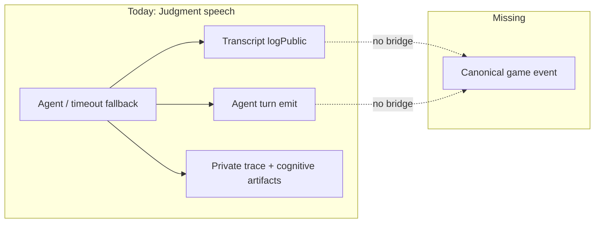
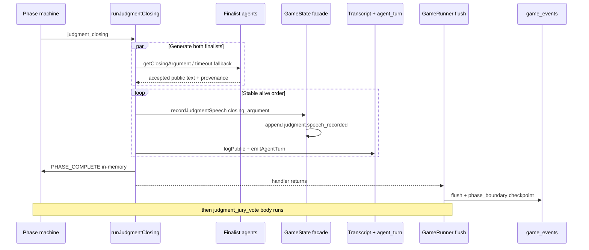

# fix: Persist Judgment public speech canonical events

## Summary

Judgment public speeches (closing arguments, opening statements, and jury Q/A) are written today to transcript and private-observability paths (agent turns / private traces), but **never append canonical game events**. This plan adds public `judgment.speech_recorded` events at the accepted-speech path, preserves the three-lane architecture (transcript / private observability / canonical facts), relies on existing phase-boundary flush so durable jury-vote work follows flushed closing speeches, and adds a thin finale-speech integrity diagnostic for incomplete Judgment logs without unsafe historical backfill.

---

## Problem Frame

Production Season 0 games (`cold-lemon-ash`, `sharp-lemon-silver`, `raw-brown-steel`) show:

- `filter_events({ phase: "CLOSING_ARGUMENTS", visibilityMode: "producer" })` → **zero events**
- The same is true for `OPENING_STATEMENTS` and `JURY_QUESTIONS`
- `JURY_VOTE` has `jury.vote_cast` / `jury.winner_determined` as expected
- Private decision-trace manifests exist for `action: "closing-argument"` with public speech in the trace body
- Cognitive artifacts (`reasoning` / `thinking` / `strategy`) exist for those turns
- Durable run reports `eventLogStatus: "complete"` and kernel `healthy`

That combination is **not** a flaky close-only failure and **not** an MCP filter bug. It is a missing emission surface in the engine’s accepted-fact vocabulary.

### Root cause

Confirmed by production MCP reads on `cold-lemon-ash` and code inspection:

1. `runJudgmentClosing` (and the twin opening / jury Q/A runners) in `packages/engine/src/phases/endgame.ts` call:
   - `logger.logPublic(...)` → transcript + live stream
   - `logger.emitAgentTurn({ action: "closing-argument", ... })` → producer stream / private observability path
2. Neither path calls `GameState` to append a canonical event.
3. `packages/engine/src/canonical-events.ts` has **no** Judgment speech type. Judgment-related types are only board facts: `endgame.stage_set`, `jury.vote_cast`, `jury.winner_determined`, plus elimination `player.last_message_recorded`.
4. Canonical architecture (canonical event spine plan + observability spine) intentionally treats speech as transcript/agent-turn, not board mutation. Product now needs phase-filterable **durable public speech facts** for MCP, postgame, and complete-finale integrity.
5. `eventLogStatus: "complete"` means contiguous trusted prefix integrity, **not** “all Judgment public speeches exist.”

Opening statements and jury Q/A share the same gap. Jury votes appear because `recordJuryVote` / tally methods append canonical events. Last messages appear because elimination calls `gameState.recordLastMessage`.



---

## Requirements Trace

- R1. Each eligible finalist’s closing argument is persisted as exactly one **public** canonical event under phase `CLOSING_ARGUMENTS`.
- R2. Opening statements and jury questions/answers get the same treatment (user acceptance and production evidence show the whole Judgment speech lane is empty, not closing alone).
- R3. Event payload includes playerId, public speech text, speech kind, provenance (`agent` | `fallback` | `timeout`), and source pointers; envelope carries round/phase/visibility. No prompts, thinking, reasoning, or strategy bodies.
- R4. Preserve existing phase-boundary flush ordering: after a successful closing phase, durable jury-vote body work and `jury.vote_cast` sequences follow flushed closing speech sequences. Do not add a second durability subsystem or restructure XState solely for this.
- R5. Same-process double-accept does not create duplicate speeches (domain idempotency on the facade). Durable re-flush of identical sequences continues to use existing hash/owner skip only — it does **not** substitute for the domain guard.
- R6. Replay and projection accept the new type without throwing; board winner/jury tallies unchanged.
- R7. MCP `filter_events` with `phase=CLOSING_ARGUMENTS` (and public/player/producer visibility) returns the speeches.
- R8. Durable-run / completed-game inspection exposes a **separate** finale-speech integrity section (not envelope `eventLogStatus`) that flags completed Judgment games missing expected openings/closings.
- R9. Historical games: diagnostic only in this plan — no silent reconstruction of speeches from private traces or reasoning.
- R10. Three-lane separation preserved: transcript, private observability, canonical public speech facts.

---

## Scope Boundaries

**In scope**

- Judgment public speech types: opening statement, jury question, jury answer, closing argument
- Engine emission + projection + validation
- Durable append via existing flush path
- Diagnostics for missing Judgment speeches on completed games
- Engine, durable/replay, and MCP/read-model tests
- Docs for the new accepted-fact class and historical limitation

**Out of scope**

- Reckoning/Tribunal speeches (plea / accusation / defense) — same three-lane hole, deferred
- Refactoring `player.last_message_recorded` payload richness
- Switching agent Judgment prompt history from transcript parsing to canonical speeches
- One-time production backfill / synthesis from private traces
- Active-match MCP controls or phase-machine redesign beyond durability conventions
- Changing `jury.vote_cast` visibility (stays producer)

### Deferred to Follow-Up Work

- Optional safe historical import if a deterministic public-text extractor is later designed and reviewed
- Tribunal/Reckoning speech-as-canonical parity
- Context-builder preference for canonical Judgment speeches on resume
- Producer `private_artifact_without_canonical_event` correlation and Q/A expected-count reconstruction

---

## Key Technical Decisions

- KTD1. **Treat missing speeches as a vocabulary + emission gap, not a closing-only race.** Fix by emitting accepted public speech facts for the full Judgment speech suite.
- KTD2. **One event type with a kind enum:** `judgment.speech_recorded` with `speechKind: "opening_statement" | "jury_question" | "jury_answer" | "closing_argument"`. Prefer this over four nearly identical types so MCP filters and diagnostics stay uniform.
- KTD3. **Emit through an eventful `GameState` facade** (mirror `recordLastMessage`), not post-hoc from transcript or private traces. Default call order after accept: finalize text → `assertCanAcceptCommit` → `gameState.recordJudgmentSpeech(...)` → `logPublic` → `emitAgentTurn`, always sharing the same accepted public text.
- KTD4. **Visibility `public`.** Speeches must appear in public, player, and producer query modes. Do not follow `jury.vote_cast`’s producer-only visibility.
- KTD5. **Phase stamp is the speech phase** (`OPENING_STATEMENTS` / `JURY_QUESTIONS` / `CLOSING_ARGUMENTS`), never “last event phase.”
- KTD6. **Provenance model:** helper returns `{ value, provenance: "agent" | "timeout" }` from the race winner. If accepted public text is empty/whitespace after that, replace with the House line and set `provenance: "fallback"`.
- KTD7. **Durability uses existing phase-boundary flush.** In-memory `PHASE_COMPLETE` may fire inside the handler as today; durable invariant is that jury-vote body work and `jury.vote_cast` sequences appear only after closing speeches are flushed. Do not rewrite XState solely for this bug.
- KTD8. **Domain idempotency keys (per speechKind):**
  - `opening_statement` / `closing_argument`: `(speechKind, playerId, round, phase)`
  - `jury_question`: `(speechKind, playerId=jurorId, round, phase)`
  - `jury_answer`: `(speechKind, playerId=finalistId, addresseeId=jurorId, round, phase)` — **addresseeId required**
  - Same key + same payload → no-op; same key + different text/provenance → throw
  - Durable hash skip only covers re-flush of identical sequences; it is not speech dedupe
- KTD9. **Stable accept order for dual finalist speeches.** Two-phase structure: `await Promise.all` generate into a map, then a serial loop over `getAlivePlayers()` for commit → record → transcript → agent_turn. Do not leave `recordJudgmentSpeech` inside the concurrent `Promise.all` accept path.
- KTD10. **Projection handles the new type without board mutation.** Prefer pure no-op or minimal handling; no projection-side speech list required — MCP/diagnostics read the event log.
- KTD11. **Historical path is diagnostic-only.** Thin public codes: `judgment_closing_argument_missing`, `judgment_opening_statement_missing` when `jury.winner_determined` exists and expected finalist speeches are absent. Defer private-trace correlation and Q/A expected-count reconstruction.
- KTD12. **Envelope complete ≠ finale complete.** Surface speech incompleteness under a separate `finaleIntegrity` (or equivalent) section on durable-run / completed inspection with non-error severity for historical incompleteness. Never flip `eventLogStatus` solely for missing speeches.

---

## High-Level Technical Design



Payload direction (not implementation code):

```text
judgment.speech_recorded
  visibility: public
  phase: OPENING_STATEMENTS | JURY_QUESTIONS | CLOSING_ARGUMENTS
  payload:
    speechKind: opening_statement | jury_question | jury_answer | closing_argument
    playerId: UUID
    text: string                 # raw public speech (no [QUESTION to X] wrapper)
    provenance: agent | timeout | fallback
    addresseeId?: UUID           # required for jury_answer (juror); optional for question target
  sourcePointers: agent_turn only (opening-statement | jury-question | jury-answer | closing-argument)
```

---

## Alternative Approaches Considered

- **MCP/transcript phase views instead of new events** — Rejected. Transcript is not sealed accepted-fact authority; historical wrappers and settlement timing make it a weak substitute for durable public speech facts.
- **Four separate event types** — Rejected for filter/diagnostic uniformity; one type + `speechKind` is enough.
- **Backfill from private traces** — Rejected in this plan (R9); leakage and non-determinism risk.
- **Generic all-public-speech event framework (lobby/mingle/tribunal)** — Deferred; Judgment-scoped type avoids speculative framework work.

---

## Implementation Units

### U1. Canonical speech type, facade, and projection

**Goal:** Introduce `judgment.speech_recorded` as a first-class accepted public fact with append/validate/replay support.

**Requirements:** R1–R3, R5, R6, R10

**Dependencies:** None

**Files:**
- `packages/engine/src/canonical-events.ts`
- `packages/engine/src/game-state.ts`
- `packages/engine/src/game-projection.ts`
- `packages/engine/src/context-builder.ts` (exhaustive format case for agent game-event records)
- `packages/engine/src/__tests__/canonical-events.test.ts`
- `packages/engine/src/__tests__/canonical-event-replay.test.ts`

**Approach:**
- Add type to the union + `CANONICAL_GAME_EVENT_TYPES` set. Match existing envelope-only `assertCanonicalGameEvent` behavior (no new per-type Zod subsystem).
- Enforce payload shape and idempotency keys inside `GameState.recordJudgmentSpeech(...)` (throw on missing speechKind/playerId; empty text rejected after House-line substitution should not reach the facade empty).
- Append with explicit phase, public visibility, and `agentTurnSourcePointer` only.
- Projection: close unknown-type throw with a pure no-op (or minimal) case; no winner/jury mutation; no projection speech list required.
- Context-builder: format public speech lines for prompt history without private fields.

**Patterns to follow:** `recordLastMessage`, `jury.vote_cast` sourcePointers, three-lane separation in observability spine docs.

**Test scenarios:**
- Happy path: append one closing speech → list/filter by phase returns it; visibility public visible in public mode.
- Edge: second append with same key + same payload is a no-op.
- Error: same key + different text throws.
- Error: facade rejects empty playerId / missing speechKind (facade-level, not envelope Zod).
- Integration: replay log containing speeches + `jury.winner_determined` rebuilds projection without throw; winner unchanged.
- Edge: two `jury_answer` events for the same finalist to different jurors both persist (addresseeId key).

**Verification:** Engine canonical + replay tests pass; unknown-type path no longer throws for the new type.

---

### U2. Wire Judgment phase runners to record accepted speeches

**Goal:** Opening, jury Q/A, and closing all emit matching public speech events at acceptance time.

**Requirements:** R1, R2, R3, R4, R5, R10

**Dependencies:** U1

**Files:**
- `packages/engine/src/phases/endgame.ts`
- `packages/engine/src/__tests__/game-engine.test.ts` (or a focused endgame/judgment test file if preferred)
- `packages/engine/src/__tests__/mock-agent.ts` (only if needed for fixtures)

**Approach:**
- Change `withEndgameActionTimeout` to return `{ value, provenance: "agent" | "timeout" }`; after resolve, empty/whitespace public text becomes House line with `provenance: "fallback"`.
- Dual-finalist phases (**must split** current `Promise.all` accept path):
  1. `await Promise.all` generate into `Map<playerId, accepted>`
  2. serial `for (const player of gameState.getAlivePlayers())`: `assertCanAcceptCommit` → `recordJudgmentSpeech` → `logPublic` → `emitAgentTurn`
- Q/A: one event per question and per answer; `jury_answer` requires `addresseeId = jurorId`. Missing juror/finalist agent: no speech events for that skip (do not invent counts from full active-jury size alone).
- Keep `PHASE_COMPLETE` + existing flush loop; do not invent a second durability subsystem.
- Do not put thinking/decisionLog into the canonical payload.

**Patterns to follow:** elimination’s `recordLastMessage` + `logPublic` + `emitAgentTurn` triple; jury vote’s `agentTurnSourcePointer`.

**Execution note:** Prefer characterization of current Judgment mock flow (transcript present, zero speech events) before changing emission, then green the new assertions.

**Test scenarios:**
- Happy path: full mock Judgment produces 2 openings, questions/answers for agents present, 2 closings, then jury votes; max closing sequence < min `jury.vote_cast` sequence.
- Happy path: generated text preserved exactly in event payload.
- Edge: timeout path yields House line with `provenance: "timeout"` and still one event per finalist.
- Edge: staggered generation completion still yields stable alive-order event sequences.
- Edge: empty agent text becomes House line with `provenance: "fallback"`.
- Failure/retry: re-invoking record for the same key does not duplicate; conflicting text throws.
- Integration: after closing handler return, runner flush precedes jury-vote body (existing runner contract + sequence ordering assertion).

**Verification:** Engine Judgment tests assert canonical counts and ordering; no private fields in speech payloads.

---

### U3. Completed-Judgment speech integrity diagnostics

**Goal:** Make missing Judgment openings/closings automatically discoverable on completed games without rewriting history.

**Requirements:** R8, R9 (see KTD12)

**Dependencies:** U1 (type vocabulary); works for historical games even before U2 data exists

**Files:**
- `packages/api/src/services/game-durable-run.ts` (preferred: extend `inspect_durable_run` payload with `finaleIntegrity`)
- Completed-game read path if it already surfaces durable inspection summaries
- Matching tests under `packages/api/src/__tests__/`

**Approach:**
- When `jury.winner_determined` is present, count `judgment.speech_recorded` openings and closings.
- Expected: 2 openings and 2 closings for a two-finalist Judgment (infer finalist count from winner + jury vote targets / endgame elimination outcomes when needed).
- Emit only thin codes in a **separate** `finaleIntegrity` section (non-error severity for historical incompleteness):
  - `judgment_closing_argument_missing`
  - `judgment_opening_statement_missing`
- Do **not** bolt these onto envelope `PersistedEventDiagnosticCode` (those remain sequence/hash integrity errors).
- Do **not** flip `eventLogStatus` or kernel health solely for missing speeches.
- Defer: private-trace correlation (`private_artifact_without_canonical_event`), Q/A expected-count reconstruction, and any generic product-integrity overhaul.
- No writes to `game_events` from this unit.

**Patterns to follow:** durable inspection summary extension; keep envelope diagnostics pure.

**Test scenarios:**
- Happy path (post-fix synthetic log): full openings/closings present → `finaleIntegrity` clean.
- Historical-shaped fixture: votes + winner, zero speeches → closing/opening missing codes fire; `eventLogStatus` remains complete.
- Edge: non-Judgment completed game does not false-positive.

**Verification:** `inspect_durable_run` / completed diagnostics tests cover the cold-lemon-ash-shaped fixture.

---

### U4. MCP and read-surface regression coverage

**Goal:** Prove phase/visibility filters and player timelines expose Judgment speeches for new games.

**Requirements:** R7, R1–R3

**Dependencies:** U1, U2 (speech filter tests); U3 for the empty-filter + finaleIntegrity joint scenario

**Files:**
- `packages/api/src/__tests__/production-game-mcp-read-model.test.ts`
- `packages/api/src/__tests__/production-game-mcp-server.test.ts` (if tool wiring needs fixture updates)
- Engine simulation artifact expectations only if docs/tests assert event JSONL types

**Approach:**
- Add fixtures with `judgment.speech_recorded` under the three Judgment speech phases.
- Assert `filter_events` by phase and by type for public/player/producer modes.
- Assert player_timeline includes the speeches for the speaking finalist.
- Confirm private reasoning is absent from returned event payloads.
- Joint scenario (after U3): cold-lemon-ash-like fixture returns empty `CLOSING_ARGUMENTS` filter **and** `finaleIntegrity` codes.

**Test scenarios:**
- Happy path: `phase=CLOSING_ARGUMENTS` returns two public events with expected text for public, player, and producer modes.
- Happy path: public visibility mode includes speeches; still excludes producer-only votes if that remains the contract.
- Integration: cold-lemon-ash-like fixture (no speeches) returns empty phase filter and `finaleIntegrity` missing-speech codes.
- Regression: opening + Q/A + closing all queryable before jury votes in sequence order.

**Verification:** MCP read-model tests green; no production network dependency in CI.

---

### U5. Docs and historical limitation note

**Goal:** Record the root cause, new event type, three-lane rules, and that pre-fix Season 0 Judgment games remain speech-incomplete in the canonical log.

**Requirements:** R9, R10; Agents.md doc-sync expectation

**Dependencies:** U1–U4 decisions stable

**Files:**
- `CONCEPTS.md` (only if a short entry for Judgment public speech accepted fact is missing)
- `docs/reasoning-transcript-observability.md` and/or `docs/local-model-evaluation.md` examples if they document `filter_events` Judgment usage
- Brief note in plan acceptance / optional short `docs/solutions/` entry after implementation (owned by implementer or `/ce-compound`)

**Approach:**
- Document that transcript/agent_turn success without `judgment.speech_recorded` is incomplete public history.
- Document historical games: identify via diagnostics; do not backfill from traces in this change.
- Keep producer private-trace guidance separate from public speech facts.

**Test expectation:** none — documentation only.

**Verification:** Docs describe the new type and the historical limitation explicitly.

---

## Risks & Dependencies

| Risk | Mitigation |
|------|------------|
| Scope expands into all public speeches (pleas, lobby, mingle) | Hard boundary: Judgment speech kinds only |
| Treating speech as board truth breaks “canonical = mutations only” mental model | Frame as **accepted public speech facts**; projection does not invent phase machine state |
| Duplicate speeches on same-process double-call | Domain key matrix (KTD8); hash-skip is re-flush only |
| Historical backfill temptation from rich private traces | Explicit non-goal; diagnostics only; no synthesis from reasoning |
| `eventLogStatus: complete` continues to mislead | Separate `finaleIntegrity` section (KTD12); document the distinction |
| Concurrent finalist append order flakiness | Split generate vs serial accept (KTD9) |
| Unknown-type throw in projection | U1 lands type + reducer + context-builder format together |
| Over-building diagnostics into envelope error channel | Thin finaleIntegrity codes only; defer private-trace correlation |

**Dependencies:** Existing durable flush, owner-epoch append, and Judgment resume coordinates must remain intact.

---

## Acceptance Criteria

1. New Judgment games persist exactly one public closing speech event per finalist (and parity openings / Q/A as specified).
2. `filter_events` for `phase=CLOSING_ARGUMENTS` returns those events for public, player, and producer modes.
3. Public/player/producer surfaces that read canonical facts can see the speeches; private reasoning is not in the payload.
4. After a successful close→vote path, first `jury.vote_cast` sequence is greater than closing speech sequences (existing phase-boundary flush preserved).
5. Replay of a log with speeches succeeds and preserves winner/jury tallies.
6. Same-process double-accept does not duplicate speeches; conflicting same-key payload throws; durable re-flush of identical sequences remains hash-skip safe.
7. Tests cover success, timeout/empty-text provenance, stable accept order, multi-juror answers, and cold-lemon-ash-shaped `finaleIntegrity` diagnostics.
8. `finaleIntegrity` flags historical and future incomplete openings/closings without marking envelope log status invalid.
9. No leakage of prompts/private reasoning into public events.
10. Historical repair is documented as **not performed** in this plan; identification is diagnostic-only.

---

## Historical Data Limitations

| Game examples | Canonical speeches | Private generation evidence | Repair in this plan |
|---|---|---|---|
| `cold-lemon-ash`, `sharp-lemon-silver`, `raw-brown-steel` | Missing for Judgment speech phases | Present (traces + often cognitive artifacts) | **Identify only** |

Recovery of public text from private traces may be technically possible later, but is **unsafe by default** (risk of leaking prompt/reasoning wrappers, non-deterministic extractors, and rewriting sealed complete logs). Any future backfill needs an explicit, reviewed import tool with deterministic public-text extraction — not part of this fix.

---

## Sources & Research

- Production MCP (`the-house-influence`): `filter_events` / `list_trace_manifests` / `inspect_durable_run` on `cold-lemon-ash`
- `packages/engine/src/phases/endgame.ts` — Judgment runners
- `packages/engine/src/canonical-events.ts` — vocabulary gap
- `packages/engine/src/game-state.ts` — `recordLastMessage` / jury vote append patterns
- `packages/engine/src/transcript-logger.ts` — logPublic vs canonical separation
- `docs/plans/2026-06-11-002-feat-canonical-game-event-spine-plan.md` — three-lane authority
- `docs/solutions/architecture-patterns/agent-strategy-observability-spine.md`
- `docs/solutions/runtime-errors/api-startup-recovery-resumes-interrupted-games.md` — transcript-only Judgment boundaries / resume coordinates
- External research: **skipped** — strong local emission and durability patterns already define the fix shape

---

## Assumptions

- Confirmed scope: diagnostic-only for historical games; engine emission root cause (not MCP-only).
- User acceptance requires opening + Q/A parity even though the original report led with closing arguments.
- Durable “must not advance” maps to existing flush-before-next-phase-body semantics rather than blocking in-memory XState `PHASE_COMPLETE`.
- Missing juror/finalist agents remain skip paths (no invented House Q/A) unless a later plan changes that policy.
