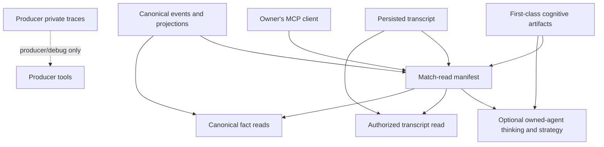
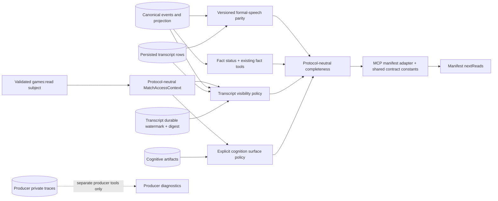
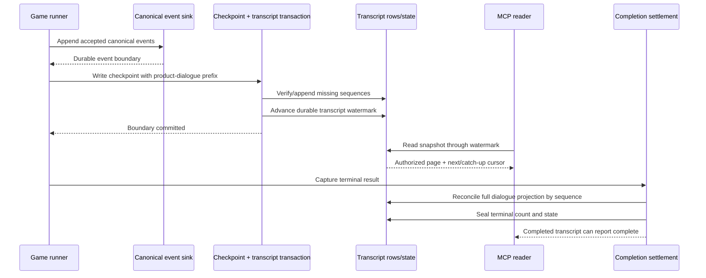

# MCP Match Completeness - Plan

## Goal Capsule

- **Objective:** Let an MCP client acting for a user who owns players in an Influence game load a complete, watchable match story across canonical board facts, authorized dialogue, member huddles, and optional owned-agent thinking and strategy.
- **Product authority:** Canonical events and projections remain board-fact authority. Persisted transcripts remain dialogue authority. First-class cognitive artifacts remain the owner product lane for thinking and strategy. Producer private traces remain producer/debug material.
- **Execution profile:** Deep, code-backed work across transcript persistence, recovery and settlement, owner-scoped authorization, Production MCP contracts, cognitive-artifact policy, canonical endgame speech, and compatibility diagnostics.
- **Stop conditions:** Stop if transcript completeness/health cannot be reported independently from canonical fact health while publication remains checkpoint-aligned, if a cursor can leak hidden-row gaps or retain stale ownership, if terminal reconciliation cannot detect same-position content conflicts, or if huddle authorization would require private-trace inference.
- **Tail ownership:** Update Production MCP, observability, local-evaluation, development, and vocabulary documentation in the same branch; leave protocol negotiation and public web/WebSocket visibility changes to separate work.

---

## Product Contract

### Summary

Extend the existing durable-event, transcript, claims, checkpoint/settlement, and cognitive-artifact patterns with three bounded Production MCP reads: a guided manifest, a dialogue-only authorized transcript, and a dedicated owned thinking/strategy timeline.
The plan covers the full brainstorm scope while keeping protocol negotiation, generic web/WebSocket visibility, non-owned cognition, and historical row rewriting outside the implementation.

### Problem Frame

Production Game MCP can reconstruct much of the board through canonical events, projections, round facts, timelines, and postgame summaries, but it has no first-class production transcript read.
An agent asking what happened can therefore see outcomes while missing introductions, lobby exchanges, rumors, Mingle speech, formal endgame speeches, and member huddles.

The split becomes most misleading at Judgment.
Season 0 games can have generated and settled speeches while phase-filtered canonical event reads return no speech events, so clients conclude that the speech never happened.
The narrow `judgment.speech_recorded` fix correctly adds accepted public speech facts for future games, but it does not remove the need for transcript access or make canonical events the dialogue archive.

The match-read contract must make missing material legible without crossing authority lanes.
Transcript prose cannot repair a missing vote, power, elimination, or winner fact.
Private traces cannot be promoted into the public story or used to synthesize user-facing history.
Likewise, a contiguous event log does not prove that the authorized dialogue timeline is complete.

### Key Decisions

- **Use a guided three-lane load.** (session-settled: user-directed — chosen over one merged timeline and transcript-first fact linking: separate reads keep dialogue, board facts, and cognition legible.) The first read is a match manifest that reports availability, authorization, cursors, and completeness for each lane, then directs the client to the appropriate detail reads.
- **Return the full authorized transcript by default.** (session-settled: user-directed — chosen over public-first and alliance-tool-only huddle access: a complete match story should not silently omit scenes the owner is allowed to know.) Current-capture dialogue includes viewer-safe public and system lines, authorized Mingle speech, and huddles visible through any owned agent. Version-0 system rows are the explicit exception because their prose cannot safely distinguish viewer narration from internal diagnostics.
- **Use owner-unified visibility live and postgame.** (session-settled: user-directed — chosen over live seat isolation and postgame-only private access: useful owner analysis is more important than preventing cross-owned-agent aggregation.) A user who owns multiple players in one game may combine the authorized huddles and cognition of all of them while the game is running and after it ends.
- **Overlay thinking and strategy only on request.** (session-settled: user-directed — chosen over a dialogue-only surface and a default unified analysis timeline: owners should see what their agents were thinking without presenting thought as speech.) The overlay uses the explicit labels `thinking` and `strategy`, never the generic label `evidence`, and includes only artifacts belonging to the user's owned agents.
- **Keep non-owned cognition hidden for now.** (session-settled: user-directed — chosen over postgame or always-visible cognition for other players: the current owner product promise is insight into one's own agents.) Future work may revisit this policy, but the first contract must not expose another player's thinking or strategy.
- **Canonicalize formal endgame speech only.** (session-settled: user-directed — chosen over Judgment-only and all-public-speech canonicalization: bounded endgame speeches merit accepted-fact coverage without turning the event spine into a chat archive.) Preserve Judgment dual-write and extend accepted public speech coverage to Reckoning pleas and Tribunal accusations and defenses; leave routine dialogue transcript-only.
- **Report completeness within the three authority lanes.** Canonical fact integrity, transcript coverage including authorized huddles, and owned cognitive-artifact availability remain independent. Formal-speech parity is a cross-lane diagnostic, not a fourth authority.
- **Serve historical dialogue without reconstruction.** Season 0 transcripts may satisfy dialogue reads when persisted rows exist even if Judgment speech events do not. Missing events remain diagnostics, and missing transcript or cognition is reported as unavailable rather than reconstructed from producer traces.

### Actors

- A1. **Agent owner:** An authenticated user who owns at least one player or agent profile participating in the game and wants to watch or analyze the match.
- A2. **Owned player-agent:** A game participant whose member-private dialogue, thinking, and strategy may be visible to A1 under this contract.
- A3. **Other player-agent:** A participant whose authorized speech and board actions may be visible to A1 but whose thinking and strategy remain hidden.
- A4. **MCP client:** An agent using Production Game MCP to load, paginate, filter, and analyze the match without guessing which store is authoritative.
- A5. **House/system:** The source of viewer-safe announcements and system dialogue that belongs in the match narrative but not in the board-fact lane.
- A6. **Producer/admin:** A privileged maintainer who may inspect private traces through separate producer tooling; producer privileges do not redefine the player-facing match story.

### Requirements

**Guided Discovery and Authority**

- R1. Production Game MCP must provide a first-call match-read manifest for one accessible game that reports the game's live or terminal state, the availability of the canonical fact, authorized transcript, and owned cognition lanes, and any formal endgame cross-lane parity diagnostics.
- R2. The manifest must explain which lane answers which class of question: canonical facts for accepted board outcomes, transcript for dialogue order and text, cognitive artifacts for owned-agent thinking and strategy, and producer traces for no player-facing purpose.
- R3. The manifest must direct clients to bounded follow-up reads instead of returning one unbounded merged match payload.
- R4. Existing projection, round-fact, timeline, event-filter, alliance, cognitive-artifact, and postgame reads must remain valid drill-down surfaces rather than being replaced by a second fact authority.
- R5. Every returned item must identify its authority lane and visibility class clearly enough that an MCP client does not present thought as speech or speech as a board mutation.

**First-Class Transcript Access**

- R6. Production Game MCP must provide a first-class persisted transcript read for both live and completed accessible games.
- R7. The default transcript must include viewer-safe `public` and `system` dialogue, authorized Mingle-scoped dialogue, and every huddle entry authorized through an agent the user owns.
- R8. Huddle entries must be labeled member-private and retain enough alliance, round, phase, speaker, and time context to explain where the conversation occurred without exposing producer/debug metadata.
- R9. The transcript read must support filters for game, phase, round, transcript scope, speaker/player, time or cursor range, and bounded result limits.
- R10. Current-capture transcript pagination must use a stable chronological sequence cursor so a client can load the whole match or catch up from a prior read without gaps or duplicates. Legacy completed rows use deterministic `(timestamp, id)` pagination but must label chronology `deterministic_approximate` when equal timestamps prevent proven conversation order.
- R11. A live transcript read must state the durable point through which dialogue is settled; it must not imply that in-flight generation or unpersisted speech is complete.
- R12. A completed transcript read must state whether terminal transcript settlement is complete, partial, unavailable, or known to predate the current capture contract.
- R13. Historical Mingle rows using legacy private-room vocabulary must be governed by their stored recipients and room visibility, labeled as legacy where useful, and never promoted to globally public speech merely because the scope name is old.
- R14. Viewer-safe system dialogue may be returned, but internal logs, phase diagnostics, prompts, reasoning context, and producer metadata must not become transcript entries through this surface. Because version-0 rows lack a trustworthy safe-kind discriminator, historical system rows must be omitted with a capture-version-wide limitation rather than classified from prose.

**Owner, Huddle, and Cognition Visibility**

- R15. Match transcript access requires the authenticated subject to own at least one participating player directly or through an owned agent profile; creating a game without an owned participating seat does not grant member-private access.
- R16. When a user owns multiple players in the same game, the transcript read must union and deduplicate the dialogue and huddles authorized through all owned players during live play and postgame.
- R17. Huddle authorization must follow membership at the time the huddle occurred, so later alliance closure, elimination, or membership changes do not erase authorized history or reveal earlier non-member sessions.
- R18. A non-member huddle must not be returned or used as a fallback source, and its private transcript contents must not be inferable from pagination counts or diagnostics.
- R19. Transcript reads must remain dialogue-only. A dedicated optional owned-cognition timeline must expose `thinking` and `strategy` artifacts for owned players so clients can correlate them without making transcript pagination a second cognition authority.
- R20. Overlay items must remain separately typed from transcript entries and carry actor, round, phase, action, and time or ordering context when available; their prose must not be inserted into public dialogue text.
- R21. Thinking and strategy belonging to non-owned players must not be listed, returned, summarized, counted, or revealed through availability diagnostics under the owner match-read surface.
- R22. Existing owner-authorized reasoning artifacts may remain available through dedicated cognitive-artifact reads, but raw `reasoningContext`, prompts, provider responses, and producer trace wrappers are outside the primary transcript overlay.
- R23. The Production Game MCP owner policy in this contract supersedes the earlier participant-visible Games MCP policy for non-owned thinking and strategy; broader public web/watch cognition policy is not changed by this slice.

**Formal Endgame Speech**

- R24. Existing `judgment.speech_recorded` behavior for opening statements, jury questions and answers, and closing arguments must remain intact as accepted public speech facts alongside transcript writes.
- R25. Reckoning pleas and Tribunal accusations and defenses must gain equivalent accepted public speech coverage while continuing to appear in the transcript as dialogue.
- R26. Introduction, ordinary lobby, rumor, power-lobby, Mingle, and routine system dialogue must remain transcript-only unless a later product decision identifies a bounded accepted-fact need.
- R27. Formal speech events must contain only accepted public speech and safe provenance needed for public-fact inspection; they must not contain thinking, strategy, reasoning, prompts, or private trace content.

**Completeness and Divergence**

- R28. Canonical fact integrity is healthy only when the event log and projection satisfy their existing continuity and replay checks; transcript text must never make an unhealthy fact lane healthy.
- R29. Narrative completeness is healthy only when all settled, authorized transcript scopes are readable through the terminal transcript boundary for a completed game or through the reported durable watermark for a live game.
- R30. Owned cognition availability must be reported separately from narrative completeness because a match can be fully watchable even when an optional thinking or strategy artifact was not captured.
- R31. Formal-speech parity must compare the bounded endgame speech facts expected for the game's version with the corresponding transcript coverage and report missing or mismatched lanes without silently copying one into the other.
- R32. If transcript prose conflicts with a vote, power, elimination, winner, shield, or player-status fact, MCP guidance and diagnostics must direct the client to the canonical fact while preserving the transcript as what was said.
- R33. If a canonical formal-speech event exists but the transcript row is missing, the accepted speech may remain visible through event reads, but narrative completeness must remain degraded and the transcript must not synthesize a row.
- R34. If transcript speech exists but its expected formal-speech event is missing, the dialogue may be narrated as speech while the formal-speech coverage diagnostic remains incomplete; the speech must not be treated as evidence of a board mutation.
- R35. The manifest must distinguish a complete match, a live match current through reported watermarks, a watchable match with non-fatal diagnostics, a degraded or partial lane, an unavailable lane, and a denied lane without implying that one status applies to every store.

**Historical Season 0 Behavior**

- R36. For a Season 0 game with persisted public transcript rows but no Judgment speech events, the transcript read must return the authorized dialogue and the manifest must surface the known formal-speech event gap.
- R37. A historically healthy `eventLogStatus` must remain valid when the only gap is known accepted-speech coverage; the separate finale or match-read diagnostic carries that limitation.
- R38. If a historical speech exists only in a producer trace or private reasoning artifact, the player-facing transcript must report it as unavailable rather than read, summarize, or backfill it.
- R39. No historical repair in this slice may append reconstructed canonical events or transcript rows from private traces, cognitive artifacts, or model reasoning.

### Key Flows

- F1. **Discover the match read**
  - **Trigger:** A4 is asked to explain or analyze a game accessible to A1.
  - **Steps:** A4 reads the manifest, identifies each lane's status and cursor, then chooses dialogue, fact, huddle, or cognition drill-downs.
  - **Outcome:** A4 knows what can be loaded and what is missing before narrating the match.
  - **Covered by:** R1-R5, R35.
- F2. **Load the full authorized story**
  - **Trigger:** A4 needs the complete dialogue timeline.
  - **Steps:** A4 pages through the transcript in stable order with default authorized scopes, following the reported cursor until the durable live watermark or completed terminal boundary.
  - **Outcome:** Current-capture public, allowlisted system, Mingle, and authorized huddle dialogue form one complete labeled narrative without producer material. Version-0 stories omit unclassifiable system rows and carry the explicit legacy limitation.
  - **Covered by:** R6-R18, R29.
- F3. **Add owned-agent thought**
  - **Trigger:** A1 asks what their agents were thinking or what strategy they were following.
  - **Steps:** A4 explicitly requests the dedicated thinking and strategy timeline, receives entries only for owned players, and correlates them with dialogue by actor, round, phase, action, and ordering context.
  - **Outcome:** A1 can inspect owned-agent cognition without confusing it with public speech or learning non-owned cognition.
  - **Covered by:** R19-R23, R30.
- F4. **Verify claims against board truth**
  - **Trigger:** A transcript line or thought makes a claim about a vote, power, elimination, winner, shield, or status.
  - **Steps:** A4 follows the manifest to canonical event, projection, round-fact, or postgame reads and treats the canonical result as the board fact.
  - **Outcome:** Match analysis distinguishes what a player said or believed from what happened.
  - **Covered by:** R2-R5, R28, R32.
- F5. **Read a historical Season 0 finale**
  - **Trigger:** A4 loads a completed game that predates Judgment speech events.
  - **Steps:** A4 reads persisted transcript dialogue, receives the formal-speech coverage diagnostic, and does not consult producer traces for missing player-facing content.
  - **Outcome:** Existing dialogue remains useful while the historical event gap stays explicit and unmodified.
  - **Covered by:** R31, R34, R36-R39.

### Acceptance Examples

- AE1. **Covers R1-R12, R28-R35.** Given a completed current-version game with a healthy canonical log and settled transcript, when an owner reads the manifest and follows every transcript page, then the manifest reports complete fact and narrative lanes and the pages contain no gaps or duplicates.
- AE2. **Covers R15-R23.** Given one user owns two players who joined different huddles in a live game, when the user loads the default transcript and the dedicated optional cognition timeline, then both players' authorized huddle dialogue and both players' thinking and strategy are visible while every non-owned player's cognition remains absent.
- AE3. **Covers R17-R18.** Given an owned player joined one alliance after another alliance had already huddled, when the owner loads the match, then the later authorized huddle is returned and the earlier non-member huddle is neither returned nor exposed through counts or diagnostics.
- AE4. **Covers R24-R27, R31.** Given a current-version game reaches Reckoning, Tribunal, and Judgment, when formal speech is accepted, then the same public speech remains readable in transcript order and has corresponding accepted public speech coverage without cognition or trace fields.
- AE5. **Covers R32-R34.** Given a player claims in dialogue that they controlled a vote but canonical round facts name a different outcome, when A4 analyzes the turn, then it may quote the claim as dialogue but must report the canonical outcome as the board fact.
- AE6. **Covers R33.** Given a formal-speech event exists but its transcript row is missing, when A4 loads the match, then event reads can show the accepted speech fact while the manifest marks narrative coverage degraded and the transcript reader does not invent a row.
- AE7. **Covers R34, R36-R39.** Given a Season 0 game has settled closing arguments in transcript rows but no Judgment speech events, when A4 loads the match, then it receives the dialogue plus a non-fatal historical coverage diagnostic and no trace-derived backfill.
- AE8. **Covers R9-R13.** Given a long match is loaded in bounded pages with round, phase, scope, player, and cursor filters, when A4 resumes from the last cursor, then the next page is stable and historical private-room rows retain their authorized visibility.

### Success Criteria

- An MCP client can determine the available match story from one manifest call and can load every authorized transcript entry through bounded follow-up reads.
- A normal match analysis can explain authorized dialogue, owned strategy when requested, and board outcomes without consulting producer traces or treating transcript claims as accepted facts.
- A user who owns multiple agents can inspect all of those agents' member huddles, thinking, and strategy during live play and postgame without seeing non-owned cognition.
- Completeness diagnostics identify transcript gaps, event gaps, historical capture limitations, and authorization exclusions within the correct authority lane, with endgame speech parity labeled as a cross-lane diagnostic.
- Season 0 games remain readable when transcript rows exist and remain honest when they do not; no private artifact is silently promoted to repair history.
- The requirements are precise enough for planning to choose schemas, persistence mechanics, authorization queries, and tests without reopening product visibility or authority decisions.

### Scope Boundaries

**In scope**

- Production Game MCP manifest and first-class transcript access for live and completed games.
- Public, system, authorized Mingle, and owner-authorized huddle dialogue with stable filters and pagination.
- Optional owned-agent thinking and strategy overlay.
- Owner-unified access across multiple owned players in one game.
- Lane-specific completeness and divergence diagnostics.
- Formal endgame accepted-speech coverage for Reckoning, Tribunal, and Judgment.
- Safe Season 0 transcript reads and explicit historical limitations.

**Deferred for later**

- Exposing thinking or strategy for non-owned players, whether live or postgame.
- Canonical accepted-speech events for introduction, lobby, rumor, power lobby, Mingle, or other routine dialogue.
- Any reviewed historical import or backfill process.
- Generated recap, announcer narration, or automatic strategy grading on top of the raw match-read contract.
- Broader alignment of public web/watch cognition policy with the owner-only Production MCP policy.
- Upgrading Production MCP protocol negotiation beyond the repository's existing `2025-06-18`-compatible surface.
- Changing generic public web or WebSocket spectator visibility for Mingle, huddle, thinking, or strategy content.

**Outside this product contract**

- Player-facing access to producer trace manifests, prompts, raw provider responses, usage/billing metadata, storage keys, or unsanitized reasoning wrappers.
- Using transcript prose, thinking, strategy, or private traces to mutate or reconstruct canonical board state.
- Active-match action tools, agent mutation, or management-scope expansion.
- Public or nonparticipant access to member huddles or owned-agent cognition.
- Replacing existing canonical fact, alliance, cognitive-artifact, or postgame analysis reads.
- Rewriting historical transcript rows merely to assign current capture metadata or current-version ordering identities.

### Dependencies and Assumptions

- Live match completeness assumes transcript entries can become durably readable with an honest watermark before terminal settlement; completion-only transcript export cannot satisfy the confirmed live policy.
- Authorization assumes Production Game MCP can resolve every owned participating player and the historical alliance membership needed for huddle visibility.
- Thinking and strategy overlays assume first-class cognitive artifacts were captured for the game; missing artifacts remain an availability result, not a trace fallback.
- Formal endgame parity depends on the shipped Judgment speech foundation and on a bounded definition of expected Reckoning and Tribunal speeches for each game version.
- Historical records may contain legacy transcript vocabulary and partial capture; compatibility must preserve stored visibility rather than guessing from prose.

### Planning Resolutions

- Add `read_match_manifest`, `read_match_transcript`, and `read_owned_match_cognition` as bounded, read-only `games:read` subject tools with explicit input and output schemas. Keep existing fact and single-artifact tools as drill-downs.
- Give new transcript rows a game-local sequence and explicit audience/context metadata. Advance a transcript-specific durable watermark only after persisted suffixes succeed; terminal settlement idempotently reconciles the full sequence and seals completion.
- Use an authenticated opaque cursor bound to the subject, game, owned-player-set fingerprint, normalized filters, capture version, and a fixed read-through watermark. Keep pagination position separate from durability status.
- Preserve `judgment.speech_recorded` and add one shared `endgame.speech_recorded` vocabulary for Reckoning pleas and Tribunal accusations/defenses. Normalize both into the parity read model without changing board projections.
- Default transcript pages to 100 authorized entries with a server-enforced maximum of 250. The exact bound is a response-safety limit, not a completeness claim; clients follow `nextCursor` and later use the returned catch-up cursor.
- Do not rewrite Season 0 transcript rows. Completed legacy games use immutable `(timestamp, id)` ordering, carry capture version `0`, and report context or parity limitations honestly.

### Sources and Research

- `docs/plans/2026-07-20-001-fix-judgment-closing-argument-events-plan.md` — shipped Judgment dual-write and historical `finaleIntegrity` foundation.
- `docs/game-mcp-production-oauth.md` — current Production Game MCP scope, tool inventory, and no-trace boundary.
- `CONCEPTS.md` — transcript, canonical-event, cognitive-artifact, huddle, and private-trace vocabulary.
- `packages/api/src/game-mcp/server.ts` and `packages/api/src/game-mcp/read-model.ts` — current production event, alliance, huddle, and cognitive read surfaces.
- `packages/api/src/db/schema.ts` and `packages/api/src/routes/games.ts` — persisted transcript shape and completed public transcript behavior.
- `packages/api/src/services/cognitive-artifact-policy.ts` and `packages/api/src/game-mcp/claims.ts` — current ownership, participation, and artifact authorization seams.
- `packages/engine/src/game-mcp/server.ts` — local simulation transcript-resource precedent.

---

## Planning Contract

### Product Contract Preservation

**Product Contract preservation:** changed only to clarify R19, F3, and AE2: the confirmed optional cognition overlay is a dedicated bounded timeline rather than an inline transcript flag. Authority, visibility, and all other outcomes remain unchanged. Planning resolves the concrete persistence, cursor, schema, authorization, event-vocabulary, and test seams; it also applies owner-only thinking/strategy policy to every Production MCP cognition entry point, avoids historical row rewrites, stays on the existing MCP protocol surface, and leaves public web/WebSocket visibility unchanged.

### Key Technical Decisions

- **KTD1 — Three bounded MCP primitives.** Add `read_match_manifest`, `read_match_transcript`, and `read_owned_match_cognition` under the existing `games:read` subject capability. That scope already authorizes accessible game inspection, owner-scoped huddle messages through `read_agent_alliances`, and authorized cognitive artifacts; these tools aggregate and narrow those row classes rather than grant a new private-data class, so no OAuth scope or renewed-consent migration is introduced. Keep fact, alliance, postgame, and single-artifact tools as drill-downs. Cognition never enters transcript pages, and no tool returns an unbounded merged match.
- **KTD2 — Subject ownership is the private-lane boundary.** A protocol-neutral `MatchAccessContext` service resolves one immutable per-invocation game/subject/owned-seat snapshot—subject/game identity, owned-seat set and fingerprint, and roster resolver—below the MCP adapter. Transcript policy augments it with trusted canonical-prefix and huddle-session evidence; cognition does not load that transcript-only state. Private row selection and ownership evaluation share one database snapshot, so a transfer yields either one coherent pre-transfer result or a denial/restart, never a mixed page. Re-resolve on every resumed page. Creating a game without owning a participating seat may still authorize existing canonical reads, but transcript and cognition lanes return a non-enumerating `denied` state. Existing OAuth client/grant revocation and subject-deactivation checks continue to apply unchanged.
- **KTD3 — Version current capture, completion, and recovery; do not rewrite history.** Add explicit transcript and formal-speech capture versions to newly created games. Current capture uses completion-envelope V2 and transcript-replay V2; preserve the database's completed V1 records while widening its version constraint, but do not reinterpret V1 as modern capture. Migrations do not assign sequences, audiences, contexts, or current claims to historical rows. A pre-deployment waiting game may upgrade atomically at first start only when a locked check proves it has no canonical gameplay events, transcript rows, checkpoints, run owner/epoch, settlement, or result; that transaction stamps every current capture version and creates transcript state before the runner starts. Any ambiguous waiting record fails start rather than becoming a live version-0 game. Completed legacy rows paginate immutably by `(timestamp, id)` with ordering quality `deterministic_approximate`, because equal timestamps do not prove conversation order, and report context/completeness limits.
- **KTD4 — New dialogue rows have durable identity and queryable audience.** Add a nullable game-local `entrySequence`, capture version, first durable canonical boundary, normalized speaker player ID, indexed audience player IDs, versioned viewer-safe `dialogueKind`, and safe context to dialogue-bearing scopes. New dialogue rows use a unique `(game_id, entry_sequence)` identity, and modern authorization predicates run against queryable audience data before keyset/limit. Diary/thinking entries keep their existing storage shape except for normalized actor identity required by recovery/correlation; they never receive dialogue sequence, audience/context, or dialogue kind and do not participate in the product dialogue watermark/digest. Existing name-valued sender/recipient columns stay readable through compatibility logic but are never reinterpreted as guaranteed UUIDs.
- **KTD5 — Product transcript durability commits with recovery boundaries and canonical content identity.** A transaction-scoped transcript persistence primitive accepts the caller's transaction, never opens its own, and commits in the shared owner→transcript-state lock order. `canonicalDialogueV2` encodes each row as UTF-8 canonical JSON with a fixed positional field order, integral millisecond timestamp, absent optionals normalized to `null`, audience IDs deduplicated and lexically sorted, and context object keys recursively sorted while semantic arrays preserve order. A domain-separated SHA-256 chain hashes each length-prefixed canonical row from the stored predecessor digest, so checkpoints process only the missing suffix while validating a contiguous prefix `1..durableSequence`. Store row/prefix digest evidence in the checkpoint and `game_transcript_states` with owner epoch, canonical boundary identity, and count. A successful checkpoint atomically advances every value; a failed checkpoint leaves the prior product watermark authoritative. Golden vectors are shared by checkpoint, recovery, and settlement.
- **KTD6 — Checkpoint retry, recovery, and settlement reconcile rather than assume.** An existing-checkpoint retry returns success only after projection hash, product-dialogue prefix digest, watermark, and boundary identity agree. Recovery may resume only from a checkpoint whose dialogue identity exactly matches the already published product state; it never falls back behind or advances beyond it. Completion settlement verifies/inserts the complete ordinal-addressed dialogue projection, preserves existing non-dialogue recovery/observability persistence outside the product watermark, rejects dialogue content conflicts, and seals terminal count/digest/state atomically with result side effects. Integrity conflict becomes degraded or repair-required rather than publishing a false complete narrative.
- **KTD7 — Authorization precedes pagination and diagnostics in the database.** Public player speech and allowlisted system kinds are visible; Mingle and legacy whisper rows require an owned sender or stored recipient; huddles require an owned member in the canonical session-time audience. Modern and legacy SQL produce an authorized relation before keyset ordering and `limit + 1`; legacy JSON/name compatibility and huddle-session correlation remain set-based inside that relation rather than scanning mixed-visibility rows in application code. Union all owned-seat grants and deduplicate by transcript identity. Hidden rows affect no returned totals, page counts, cursors, availability, diagnostics, or application scan work.
- **KTD8 — Huddle authorization fails closed on unhealthy facts.** Current huddles require a trusted canonical session record plus captured audience/context. If the trusted canonical prefix does not establish the session, recipient prose alone does not authorize it. Legacy rows may use the existing participant-set compatibility match only when a set-based canonical-session/roster correlation is unambiguous; ambiguous or malformed restricted rows are omitted under KTD7's existing non-enumeration contract.
- **KTD9 — Cursor and watermark are different closed contracts.** Seal cursors with AES-GCM using a domain-separated active key derived from deployed API secret material. Every token has version, purpose, key version, random nonce, issued-at, a maximum 30-minute lifetime, subject/game/filter/ownership fingerprints, capture version, internal keyset position, and fixed read-through watermark. Key rotation invalidates outstanding cursors; no retired JWT key is retained for cursor compatibility. Reject locally detectable malformed, tampered, expired, wrong-purpose/key-version, and query-mismatched tokens before database access. After resolving `MatchAccessContext` but before transcript/cognition row selection, authorization-stale tokens return the same external `cursor_invalid_or_stale` shape.
- **KTD10 — Player/model prose uses allowlist serializers and explicit trust labels.** Transcript DTOs expose authority, visibility, sequence/time, round, phase, speaker, text, safe audience/context, and legacy status only. Modern system text requires a known viewer-safe `dialogueKind`; unknown system kinds fail closed. Version-0 system rows have no reliable safe-kind discriminator, so the owner transcript omits all of them and reports the capture-version-wide `legacy_system_dialogue_unclassified` limitation without row counts. DTOs recursively exclude row-level `thinking`, `reasoningContext`, room diagnostics, prompts, provider material, decision logs, trace pointers, storage metadata, and cognition payloads. Tool schemas and guidance label transcript text, owned thinking/strategy prose, and formal-speech event text as untrusted game-authored content; executable follow-ups remain structural data and are never derived from those prose fields.
- **KTD11 — Owned cognition is a separate, query-first projection with explicit surface policy.** `read_owned_match_cognition` returns bounded first-class `thinking` and `strategy` artifacts for owned players. Every cognition read requires an explicit `subject_owner`, `participant_web`, or `producer` policy capability—never a defaultable boolean or incidental role metadata. Subject policy applies ownership in SQL before limits and makes non-owned IDs indistinguishable from unknown IDs; producer policy preserves existing diagnostics only on producer-authorized tools; the web/API participant policy remains unchanged.
- **KTD12 — Completeness is lane-specific, version-aware, and protocol-neutral.** The domain service composes typed fact, transcript, cognition, and formal-speech status snapshots without importing MCP catalogs or re-running lane policies. Live lanes are `current`, never `complete`; optional cognition cannot degrade an otherwise watchable match. A shared MCP contract module maps typed follow-up capabilities to registered descriptors and starter arguments, keeping tool names out of domain completeness logic.
- **KTD13 — Formal endgame speech shares accepted construction, not event semantics.** Preserve `judgment.speech_recorded` and add `endgame.speech_recorded` for `plea`, `accusation`, and `defense`. One engine `AcceptedFormalSpeech` value/factory owns raw accepted text, provenance, actor, kind, safe counterpart/target, and deterministic correlation key; a phase commit helper derives the appropriate event, transcript display entry, and agent turn in stable roster order. Projections accept either speech vocabulary without board mutation.
- **KTD14 — Parity diagnoses; it never repairs.** Normalize Judgment and the new endgame event into a common formal-speech key/display model. Compare only games whose capture version establishes an expectation. Report missing-event, missing-transcript, mismatch, unknown-prerequisite, and known-legacy-gap findings independently without changing `eventLogStatus` or appending data.
- **KTD15 — Existing MCP protocol compatibility is intentional.** Implement explicit closed input/output schemas, `structuredContent`, JSON text compatibility, read-only/closed-world annotations, and tool-execution errors on the repository's negotiated `2025-06-18` surface. A `2025-11-25` protocol upgrade is separate work and must not be claimed by this plan.

### High-Level Technical Design

The match manifest composes statuses; it does not become another authority. Each detail service reads its own durable source through a shared current-ownership projection.

Live transcript publication advances only at a durable recovery boundary. Terminal settlement reconciles the same identities and is the only transition to transcript `complete`.

### Assumptions and Sequencing Constraints

- Games created after deployment receive the current transcript and formal-speech capture versions through the same creation paths that already set cognitive-artifact capture version. A provably never-started pre-deployment waiting game receives the same versions/state atomically in its locked first-start transaction; completed or ambiguous legacy games remain version `0`.
- `JWT_SECRET` remains required in deployed API environments. The cursor codec derives a domain-separated active encryption key, fails closed when secure key material is unavailable, and intentionally invalidates outstanding cursors when that key rotates; it never emits a plaintext/base64 database position.
- The user has stated that deployment will occur with no running games and no pending or repair-required settlements. This is an operator-provided rollout assumption, not an application deployment preflight. Newly created games and strictly eligible pre-deployment waiting games start on V2; historical completed V1 records remain stored and readable through their settled public projections.
- Transcript content is append-only after a durable sequence is accepted. Same-sequence identical retries are allowed; same-sequence content differences are integrity conflicts.
- Modern Mingle and huddle entries carry normalized audience/context directly from the engine logger. Legacy compatibility accepts name-or-ID senders/recipients only when resolution is unambiguous within that game's roster.
- A checkpoint persistence failure may leave the live viewer stream ahead of the MCP transcript watermark. MCP reports only the last durable boundary and never reads the in-memory runner or checkpoint snapshot as dialogue.
- The first transcript page pins its read-through boundary. New rows appended during traversal are intentionally deferred to a later catch-up read.
- DB-backed API suites share local PostgreSQL state and run sequentially. Do not parallelize focused migration, lifecycle, settlement, or MCP DB tests.
- Implementation order is U1, then U2/U3, then U4, then U5/U7, then U6, then U8. U6 owns parity/completeness composition after U7 finalizes the engine vocabulary.

### Research Basis

Local patterns to extend:

- `docs/solutions/architecture-patterns/agent-strategy-observability-spine.md` for the three independent authority lanes and the prohibition on trace-derived public history.
- `docs/solutions/architecture-patterns/owner-scoped-alliance-read-models.md` for historical membership projection and non-enumerating owner reads.
- `docs/solutions/architecture-patterns/production-mcp-role-resource-split.md` for bearer-derived ownership, closed tool authorization, and producer separation.
- `docs/solutions/runtime-errors/api-startup-recovery-resumes-interrupted-games.md` for distinguishing checkpoint recoverability from user-facing completeness.
- `docs/solutions/runtime-errors/production-game-mcp-raw-trace-read-limit.md` for bounded response pages rather than conflating request-body and response-size limits.
- The shipped Judgment speech path in `packages/engine/src/phases/endgame.ts`, `packages/engine/src/game-state.ts`, and `packages/engine/src/canonical-events.ts` for accepted-text dual-write, idempotency, and non-mutating speech events.

Current external guidance:

- [MCP tools](https://modelcontextprotocol.io/specification/2025-11-25/server/tools) and the [schema reference](https://modelcontextprotocol.io/specification/2025-11-25/schema) require object-rooted schemas and support schema-conforming `structuredContent` plus text compatibility.
- [MCP pagination](https://modelcontextprotocol.io/specification/2025-11-25/server/utilities/pagination) establishes opaque server-issued cursors; tool-call result pagination remains an application contract, so transcript `limit`, `cursor`, and `nextCursor` are explicit tool fields.
- [MCP authorization](https://modelcontextprotocol.io/specification/2025-11-25/basic/authorization) and [security best practices](https://modelcontextprotocol.io/docs/tutorials/security/security_best_practices) reinforce that OAuth scopes are coarse capabilities, not substitutes for row-level ownership and membership authorization.
- [MCP versioning](https://modelcontextprotocol.io/docs/learn/versioning) confirms that the repository's accepted protocol versions remain an explicit compatibility boundary rather than something this feature may silently upgrade.

---

## Implementation Units

### U1 — Establish the Versioned Transcript Capture Contract

**Goal:** Give new transcript entries stable game-local identity, normalized audience/context, and a separate durable product watermark without rewriting historical dialogue.

**Requirements:** R6-R14, R17-R18, R29, R35-R39. **Flows:** F2, F5. **Acceptance examples:** AE1, AE3, AE7-AE8. **Decisions:** KTD3-KTD5, KTD8.

**Dependencies:** None.

**Files:**

- `packages/api/src/db/schema.ts`
- `packages/api/drizzle/0044_<generated>.sql` (new; generate then review)
- `packages/api/drizzle/meta/0044_snapshot.json` (new)
- `packages/api/drizzle/meta/_journal.json`
- `packages/api/src/routes/games.ts`
- `packages/api/src/routes/free-queue.ts`
- `packages/api/src/services/game-lifecycle.ts`
- `packages/api/src/services/transcript-serialization.ts`
- `packages/api/src/services/game-completion-settlement.ts`
- `packages/api/src/services/game-recovery-support.ts`
- `packages/engine/src/game-runner.types.ts`
- `packages/engine/src/transcript-logger.ts`
- `packages/engine/src/phases/alliances.ts`
- `packages/api/src/__tests__/db.test.ts`
- `packages/api/src/__tests__/games-api.test.ts`
- `packages/engine/src/__tests__/stream-listener.test.ts`
- `packages/engine/src/__tests__/named-alliances-huddles.test.ts`

**Approach:**

1. Add `transcriptCaptureVersion` and `formalSpeechCaptureVersion` to `games`, defaulting existing rows to `0`; set the current versions in new custom/free game creation paths alongside cognitive capture version and create transcript state in the same transaction. In the locked first-start path only, bootstrap a pre-deployment waiting game to the same versions/state when absence checks prove no gameplay event, transcript, checkpoint, run owner/epoch, settlement, or result exists; otherwise fail start. Historical/admin imports remain version `0` unless a separately validated format supplies the entire current contract.
2. Extend `transcripts` with nullable positive `entrySequence`, first durable event boundary, normalized `speakerPlayerId`, indexed `text[]` audience player IDs, capture version, viewer-safe `dialogueKind`, and versioned safe context. Add partial uniqueness/order indexes plus checks tying current-capture dialogue scopes to non-null sequence/audience/context. Diary/thinking rows may carry normalized actor identity for existing recovery/correlation but must keep dialogue sequence/audience/context/kind null. Do not populate modern fields on existing rows; reject legacy-shaped dialogue rows inside a current-capture game at persistence time.
3. Add one `game_transcript_states` row per current-capture game with owner/boundary identity, contiguous durable count/sequence, prefix digest, terminal state/count/digest, safe degradation code, and timestamps. Database checks cover nonnegative values; the transaction service enforces monotonic `count = sequence`, no gaps, no boundary regression, and terminal equality.
4. Add completion-envelope V2 and transcript-replay V2 for current capture, with strict version-dispatched validation and hashes over the new normalized dialogue shape. Widen the settlement payload-version constraint without changing completed V1 semantics. The clean-deployment assumption means no new-runtime V1 resume/settle path is required.
5. Extend engine `TranscriptEntry` with normalized sender identity for all actor-bearing entries while retaining existing display names. Populate audience/context/dialogue-kind and product dialogue sequence only for public, Mingle/whisper, huddle, and allowlisted system dialogue. Diary/thinking identity is retained solely because existing recovery and observability paths correlate those rows; it never makes them dialogue-authority input.
6. Create huddle session identity before emitting its messages so every modern huddle row can carry alliance, schedule, and session IDs plus the exact session-time audience. Mingle rows retain room identity and exact room audience; safe room allocation context excludes diagnostics.
7. Keep the completed public HTTP transcript behavior unchanged in this unit except for tolerating the additive fields; the new owner MCP serializer is introduced later.

**Patterns to preserve:** Existing `cognitiveArtifactCaptureVersion` game-creation stamping; Drizzle migration/snapshot discipline; engine logger as the dialogue entry constructor; canonical huddle session IDs as membership-time authority.

**Test scenarios:**

- New custom and Free games receive current transcript/formal-speech capture versions; pre-migration and explicitly legacy fixtures remain version `0`.
- A clean pre-deployment waiting game upgrades versions/state atomically before its runner starts; fixtures with any prior gameplay/transcript/checkpoint/run/settlement/result evidence fail start and remain unmodified.
- Modern public, Mingle, and huddle rows receive stable sequences, normalized speaker/audience IDs, and safe versioned context.
- Current system rows carry an allowlisted viewer-safe dialogue kind; unknown modern kinds cannot satisfy the owner serializer.
- Two same-roster huddles in one round have distinct session context.
- Existing rows remain unchanged except for additive defaulted version fields; no migration consults traces, cognitive artifacts, or model output.
- Equal timestamps remain distinguishable by modern sequence; legacy rows retain deterministic `(timestamp, id)` ordering labeled `deterministic_approximate`.
- Database uniqueness rejects two different rows at the same modern game sequence while allowing sequence-null legacy rows.
- Current-capture persistence rejects null-sequence/malformed-audience dialogue rows and rejects dialogue metadata on diary/thinking rows; game creation stamps versions and state atomically.
- Current completion/replay V2 validates normalized fields and hashes; completed historical V1 records remain valid under the widened constraint.

**Verification:** The real migration applies to legacy and clean fixtures; schema metadata matches; row text/count hashes remain unchanged for historical transcripts; focused logger/alliance tests prove modern audience/context capture.

### U2 — Persist Live Transcript Boundaries and Reconcile Completion

**Goal:** Make live transcript rows durably readable through an honest checkpoint-aligned watermark and make terminal settlement exact-once.

**Requirements:** R6, R10-R12, R28-R35, R39. **Flows:** F1-F2, F5. **Acceptance examples:** AE1, AE6-AE8. **Decisions:** KTD4-KTD6.

**Dependencies:** U1.

**Files:**

- `packages/api/src/services/game-transcript-persistence.ts` (new)
- `packages/api/src/services/game-checkpoints.ts`
- `packages/api/src/services/game-lifecycle.ts`
- `packages/api/src/services/game-completion-settlement.ts`
- `packages/api/src/services/checkpoint-hydration-passport.ts`
- `packages/api/src/services/game-recovery.ts`
- `packages/engine/src/game-runner.types.ts`
- `packages/engine/src/game-runner.ts`
- `packages/api/src/__tests__/game-lifecycle.test.ts`
- `packages/api/src/__tests__/game-completion-settlement.test.ts`
- `packages/api/src/__tests__/game-recovery.test.ts`
- `packages/api/src/__tests__/checkpoint-hydration-passport.test.ts`

**Approach:**

1. Add a transaction-scoped persistence service that serializes the authoritative dialogue DTO by 1-based game-local sequence, validates the existing contiguous prefix, inserts only the missing suffix, computes row/prefix digests, and advances the locked state row only through compare-and-advance semantics. The digest covers sequence, round, phase, scope, normalized speaker/audience/context, dialogue kind, text, and timestamp/order; it excludes cognition, database-generated fields, and later settlement metadata.
2. Pass the current product-dialogue projection to every initial, phase-boundary, and terminal checkpoint write as transient persistence input. The transaction service—not the runner—loads the locked predecessor watermark/digest used to slice and chain the suffix. Do not expose the projection from checkpoint reads or duplicate it into a new player-facing checkpoint field.
3. Within the existing owner/checkpoint transaction and shared owner→transcript-state lock order, slice at the stored watermark, canonicalize/hash only the missing dialogue suffix from the stored predecessor digest, append/verify that suffix, insert the checkpoint with prefix digest evidence, and advance `game_transcript_states` to that exact owner epoch/event hash/boundary. Reject sparse suffixes, lower logical boundaries, count/sequence mismatch, and watermark regression.
4. On an existing checkpoint key, reconcile or validate transcript rows/state before returning. Projection equality alone is insufficient; an identical projection with missing or conflicting transcript evidence is degraded or repair-required.
5. Preserve current degraded-checkpoint behavior: a failed checkpoint is observable and the match may continue, but MCP does not expose the uncommitted suffix. A later checkpoint submits its current dialogue projection, resumes chaining at the stored predecessor digest, and catches up from the durable state.
6. Change completion settlement from blind transcript insertion to full V2 sequence/digest reconciliation. Identical live prefixes are no-ops, missing suffixes insert, content conflicts produce a typed deterministic repair-required failure, and successful settlement seals terminal count/digest/state atomically with game result side effects.
7. On recovery, keep checkpoint replay as the runner seed and product rows as dialogue authority. A candidate must match the published transcript count/digest/boundary exactly; if a newer candidate fails hydration, recovery must not fall back to an older prefix already superseded by product state.
8. Retain legacy non-owner best-effort behavior behind version `0`; do not claim live completeness for it.

**Patterns to preserve:** Owner-row locking and exact-once completion settlement; checkpoint degradation instead of false success; transcript replay for recovery only; no `as any` or untyped settlement payload escape hatches.

**Test scenarios:**

- A phase boundary persists only the new suffix and advances the watermark once.
- A failed checkpoint leaves new dialogue invisible to product reads; a later successful checkpoint catches up without gaps.
- Crash after generation but before checkpoint leaves no claimed durable dialogue.
- Recovery from a committed boundary and later settlement produces one row per sequence.
- Repeated/concurrent terminal settlement remains exact-once with a preexisting live prefix.
- Same-sequence identical content is idempotent; differing content fails closed and never marks transcript complete.
- Out-of-order checkpoints, sparse rows such as `1,3`, lower event boundaries, and count/max mismatch cannot advance state.
- Existing-checkpoint retries reconcile checkpoint-only, transcript-only, and state-only ambiguous-commit fixtures; conflicts never return success.
- Recovery refuses an older hydration-valid checkpoint when product transcript state is already published through a newer boundary.
- Tampered text/audience/context changes the digest; absent cognition in replay does not conflict or patch dialogue.
- Golden `canonicalDialogueV2` vectors prove byte identity across checkpoint, recovery, and settlement code: field/key order, UTF-8 text, null normalization, millisecond time, audience set ordering, semantic-array order, row length prefix, and predecessor digest.
- A 12-player/13-round Free-game fixture proves each checkpoint canonicalizes and hashes only the new suffix; total terminal reconciliation remains linear in dialogue rows rather than cumulative across checkpoints.
- Terminal checkpoint failure followed by successful completion settlement reconciles the full dialogue projection safely.
- Legacy version `0` games retain their previous terminal write path and report no modern live watermark.
- Fault injection after suffix insert, checkpoint insert, watermark advance, terminal reconcile, result insert, and terminal seal leaves either the prior complete boundary or the new complete boundary—never a hybrid.

**Verification:** Focused lifecycle, checkpoint, recovery, and settlement DB tests pass sequentially; golden digest vectors match every caller, and inspection proves `min=1`, `count=max=watermark`, no gaps, nonregressing canonical boundary, matching chained prefix digest, suffix-only checkpoint work, and terminal count/digest equality.

### U3 — Build the Owner-Unified Match Visibility Projection

**Goal:** Centralize current ownership and row-level public, Mingle, legacy whisper, and session-time huddle authorization before any counts, pagination, or diagnostics exist.

**Requirements:** R7-R8, R13-R18, R21-R23, R35. **Flows:** F1-F3. **Acceptance examples:** AE2-AE3, AE8. **Decisions:** KTD2, KTD7-KTD8.

**Dependencies:** U1.

**Files:**

- `packages/api/src/services/match-access-context.ts` (new)
- `packages/api/src/services/transcript-visibility-policy.ts` (new)
- `packages/api/src/game-mcp/claims.ts`
- `packages/api/src/game-mcp/read-model.ts`
- `packages/api/src/services/game-event-read-model.ts`
- `packages/api/src/__tests__/production-game-mcp-read-model.test.ts`
- `packages/api/src/__tests__/game-mcp-claims.test.ts` (new if claim coverage is split)

**Approach:**

1. Move reusable ownership resolution below `game-mcp/*`. Build one protocol-neutral immutable `MatchAccessContext` per invocation containing only subject/game identity, owned-seat set and fingerprint, and roster resolution. Keep `game-mcp/claims.ts` a thin adapter or remove it after callers migrate.
2. Resolve the context and select authorized private rows within one database snapshot/transaction. Keep created-only access distinct from participating ownership; concurrent transfer yields one coherent snapshot, never a partial mix.
3. Keep lane decisions separate: `transcript-visibility-policy.ts` loads the trusted canonical prefix and canonical huddle-session audiences as transcript-specific authorization input in the same database snapshot; cognitive policy receives the ownership-only context plus an explicit surface capability. Neither imports MCP server/catalog code.
4. Authorize public player speech and known safe system dialogue generally within an owner-authorized transcript lane. Authorize modern Mingle/whisper rows when any owned player is sender or indexed audience. Authorize modern huddles only from canonical session-time membership and captured row context.
5. For legacy Mingle/whisper rows, accept stored sender/recipient membership only when JSON and name-or-ID resolution are unambiguous. Express legacy JSON/name resolution and canonical session/round/phase/participant-set huddle correlation as a set-based authorized SQL relation; omit overlapping or ambiguous matches without application-side mixed-visibility scans.
6. Union grants across every owned seat, deduplicate by modern sequence or legacy row ID, and expose only authorized-view metadata. Do not return the number, scope, timing, or existence of omitted rows.
7. Reuse the ownership-only `MatchAccessContext` from transcript, cognition, and manifest assembly; pass transcript-specific evidence only to transcript policy, then pass authorized lane status—not raw huddle evidence—to completeness. Keep `read_agent_alliances` as the selected-player drill-down.

**Patterns to preserve:** `resolveGamesMcpClaims`; subject errors that make unknown and inaccessible games indistinguishable; existing huddle name-or-ID compatibility; canonical trusted-prefix validation.

**Test scenarios:**

- Direct-seat and agent-profile ownership both authorize; game creation alone does not.
- Two owned players in different rooms/huddles produce one chronological union with shared public rows deduplicated.
- An owned Mingle sender remains authorized even when recipients exclude the sender.
- Joining an alliance later never reveals an earlier huddle.
- Closed alliance and eliminated-player history remains readable when the player was a member at session time.
- A nonmember huddle inserted between visible rows changes no returned authorized counts or diagnostics.
- Canonical invalidity before a huddle session fails that huddle closed while public/Mingle rows remain readable.
- Malformed restricted legacy recipients are omitted; malformed public legacy metadata does not suppress safe public text.
- A transfer concurrent with transcript/cognition selection returns one internally consistent pre-transfer view or denial, never mixed authorization.
- Subject credentials carrying producer/sysop metadata do not widen the owner context; producer-only callers do not receive the new owner tools.

**Verification:** Policy tests cover every row class, multi-owned union, membership-time changes, malformed legacy data, trusted-prefix degradation, and non-enumeration before U4 uses the policy.

### U4 — Add Stable Authorized Transcript Pagination

**Goal:** Let an MCP client load or catch up the complete authorized dialogue through bounded, filterable, stable pages without leaking hidden activity.

**Requirements:** R5-R14, R16-R18, R29, R32-R39. **Flows:** F1-F2, F4-F5. **Acceptance examples:** AE1-AE3, AE5-AE8. **Decisions:** KTD4, KTD7-KTD10.

**Dependencies:** U2, U3.

**Files:**

- `packages/api/src/services/match-read-cursor.ts` (new)
- `packages/api/src/services/match-transcript-read-model.ts` (new)
- `packages/api/src/services/transcript-serialization.ts`
- `packages/api/src/game-mcp/read-model.ts`
- `packages/api/src/__tests__/match-read-cursor.test.ts` (new)
- `packages/api/src/__tests__/production-game-mcp-read-model.test.ts`

**Approach:**

1. Implement an AES-GCM cursor codec with a domain-separated active key derived from required API secret material. Every token carries version, purpose, key version, random nonce, issued-at, a maximum 30-minute expiry, subject, game, filter fingerprint, ownership fingerprint, capture version, read-through boundary, and internal keyset. Reject oversized or structurally malformed tokens before database access; active-key-only rotation intentionally invalidates outstanding cursors.
2. On a first modern read, pin `throughEntrySequence` to the current durable watermark. On a legacy completed read, pin the immutable terminal row boundary, order by `(timestamp, id)`, and label ordering quality `deterministic_approximate`; never claim that serial ID proves chronology within an equal-timestamp group. Never start a legacy live walk without a modern watermark.
3. Parse a closed input object with singular `phase`, `round`, `scope`, and `player` filters plus RFC3339 `fromTimestamp`/`toTimestamp`, `cursor`, and integral bounded `limit`. Reject unknown enum values, oversized identifiers/tokens, invalid ranges, cursor-plus-conflicting filters, and cursor/filter/game mismatch instead of coercing or silently changing query meaning.
4. Query the U3 authorized SQL relation before keyset ordering and `limit + 1`: public/allowlisted system or owned sender/indexed audience/session membership for modern capture, and the set-based legacy compatibility predicates for completed version-0 games. Do not load a mixed-visibility set into application memory or make request success depend on hidden-row density.
5. Return dialogue-only allowlisted entries with explicit authority and visibility labels, safe speaker/audience/context, and `legacyContext` where needed. For capture version `0`, omit every `system` row and return the version-wide `legacy_system_dialogue_unclassified` limitation without counts; do not regex-classify trusted content from prose. Treat returned text as untrusted game-authored content, keep structural `nextReads` outside it, and never serialize inline transcript thinking.
6. Return `nextCursor` while the pinned snapshot has more authorized rows. Once exhausted, return a catch-up cursor anchored after the pinned watermark; a later call may observe a newer watermark.
7. Rebuild the U3 context and reauthorize every page in the same snapshot used for row selection. Return the same typed `cursor_invalid_or_stale` tool-result error for tampered, expired, wrong-purpose/key-version, changed-authorization, or query-mismatched cursors. Keep inaccessible-game errors non-enumerating and do not suggest producer step-up.

**Patterns to preserve:** Keyset pagination rather than offsets; exact `structuredContent` object later mirrored as JSON text; explicit safe DTO construction rather than subtractive redaction.

**Test scenarios:**

- Page size `1`, identical timestamps, and mixed public/private rows traverse without gaps or duplicates.
- Legacy equal-timestamp fixtures remain deterministic across pages while reporting approximate ordering rather than proven chronology.
- Concurrent appends do not change the first walk; a later catch-up returns only newer durable authorized rows.
- Cursor reuse with another game, subject, filter, or changed owned-player set fails without returning data.
- Cursor nonce reuse changes no semantics; key rotation, expiry, wrong purpose, unknown key version, and oversized malformed tokens all fail with the uniform external error and no transcript query.
- Ownership removal and ownership addition between pages both require restart.
- Concurrent ownership transfer returns a page from one coherent authorization snapshot or fails stale; it never mixes old ownership with new row selection.
- Unknown input keys/enums, fractional or oversized limits, invalid RFC3339 timestamps/ranges, and cursor/filter conflicts are rejected by the closed parser.
- Long matches reject oversized limits according to the documented schema and terminate predictably; high hidden-row density does not create empty intermediate pages or observable scan counts.
- A player filter returns a non-owned player's public speech but never their private room dialogue or cognition.
- A Season 0 fixture containing phase banners, vote details, timeout diagnostics, and viewer narration omits all system rows and reports one version-wide limitation without revealing system-row counts.
- Hidden rows create no raw sequence gaps, total counts, empty-page loops, or scope-specific diagnostics.
- Sanitization fixtures prove absence of thinking, reasoning context, room diagnostics, prompt/provider, storage, trace, and decision-log keys recursively.

**Verification:** Cursor unit tests and DB-backed transcript reads prove finite snapshot traversal, catch-up, authorization invalidation, filter binding, legacy ordering, bounds, and privacy sentinels.

### U5 — Add the Owned Thinking and Strategy Timeline

**Goal:** Give owners a bounded match-scoped view of what their agents were thinking and planning without embedding cognition in dialogue or exposing other players.

**Requirements:** R19-R23, R30, R35, R38-R39. **Flows:** F1, F3. **Acceptance examples:** AE2. **Decisions:** KTD1-KTD2, KTD11.

**Dependencies:** U3, U4.

**Files:**

- `packages/api/src/services/cognitive-artifact-policy.ts`
- `packages/api/src/services/cognitive-artifact-read-model.ts`
- `packages/api/src/services/match-cognition-read-model.ts` (new)
- `packages/api/src/game-mcp/read-model.ts`
- `packages/api/src/routes/cognitive-artifacts.ts`
- `packages/api/src/__tests__/cognitive-artifact-read-model.test.ts`
- `packages/api/src/__tests__/cognitive-artifacts-api.test.ts`
- `packages/api/src/__tests__/production-game-mcp-read-model.test.ts`

**Approach:**

1. Replace incidental role/boolean policy selection with explicit `subject_owner`, `participant_web`, and `producer` capabilities. Under `subject_owner`, reasoning, thinking, and strategy require owned actor identity; the new timeline accepts only thinking and strategy. Keep house/system/producer artifacts hidden from subject reads, and do not let producer/sysop claim metadata widen a subject tool.
2. Apply `subject_owner` to existing Production MCP `list_cognitive_artifacts` and `read_cognitive_artifact` calls so non-owned thinking/strategy cannot bypass the new surface. Preserve `participant_web` for the existing web/API route and `producer` only for separately registered producer tools; prove all three dispatch paths are explicit in tests.
3. Resolve ownership and select artifacts by game, active/redaction state, allowed types, and owned actor player/profile IDs in one database snapshot before sorting or limiting. Remove the current risk that newer non-owned rows exhaust a scan window or that a concurrent transfer yields mixed authorization.
4. Add bounded cursor pagination with a closed input parser and optional artifact type, actor/player, phase, round, and action filters. Bind the cursor to purpose, subject, game, owned-player fingerprint, filters, capture version, and a fixed created/event boundary using the U4 codec and its expiry/key-rotation/error contract.
5. Return allowlisted typed payloads with actor, artifact type, action, round, phase, event sequence, creation time, explicit ordering quality, and an untrusted-content label on thinking/strategy prose. Keep prose structurally separate from filters, cursors, and follow-up capabilities; never fall back to transcript `thinking`, reasoning context, or private traces.
6. Make unavailable, capture-degraded, expired, redacted, and denied statuses non-enumerating for non-owned artifacts. Optional cognition degradation never alters transcript completeness.

**Patterns to preserve:** Existing first-class cognitive artifact rows and read-audit behavior; dedicated reasoning reads; policy-specific accessors rather than changing the public route globally.

**Test scenarios:**

- Owners can page thinking/strategy for every owned seat live and postgame.
- Hundreds of newer non-owned rows cannot hide an older owned artifact.
- Non-owned artifact IDs, actors, counts, types, and capture status remain undisclosed.
- Existing Production MCP list/read tools enforce the same owner-only rule.
- Subject credentials with producer/sysop metadata still receive only subject-owner results; producer access remains confined to producer tool descriptors.
- A concurrent ownership transfer yields a coherent pre-transfer page or a stale/denied result, never mixed authorization.
- Reasoning remains absent from the new timeline but readable through the existing owner-authorized dedicated path.
- Web/API participant behavior remains exactly as before this plan.
- Missing/redacted/degraded cognition reports its own lane status and never reads transcript or trace fallbacks.

**Verification:** Focused cognitive read-model, public-route, and Production MCP tests prove policy isolation, pre-limit ownership filtering, pagination, non-enumeration, and no fallback.

### U6 — Compose the Match Manifest and Completeness Model

**Goal:** Make one first call tell an agent which authority lanes are readable, how current they are, what to call next, and where divergence exists.

**Requirements:** R1-R5, R11-R12, R28-R38. **Flows:** F1, F4-F5. **Acceptance examples:** AE1, AE4-AE7. **Decisions:** KTD1-KTD2, KTD12, KTD14.

**Dependencies:** U2-U5 and U7.

**Files:**

- `packages/api/src/services/match-completeness.ts` (new)
- `packages/api/src/services/formal-speech-parity.ts` (new)
- `packages/api/src/services/game-durable-run.ts`
- `packages/api/src/services/game-projection-read-model.ts`
- `packages/api/src/game-mcp/read-model.ts`
- `packages/api/src/__tests__/match-completeness.test.ts` (new)
- `packages/api/src/__tests__/game-durable-run.test.ts`
- `packages/api/src/__tests__/production-game-mcp-read-model.test.ts`

**Approach:**

1. Define protocol-neutral stable lane fields: authority, authorization, availability, completeness, capture version, safe watermark/boundary, diagnostics, and typed follow-up capabilities. The domain model does not import MCP tool names or catalog descriptors.
2. Build the fact lane from existing persisted event/projection integrity and settlement-safe projection behavior. Do not reclassify known speech-coverage gaps as event-log corruption.
3. Build the transcript lane from the already-authorized U3/U4 result, transcript capture version/state, terminal settlement, authorized huddle prerequisite health, and legacy status. Do not re-run or broaden visibility policy inside completeness. Live is `current` through a watermark; completed current-version is `complete` only after terminal count/digest/state agree.
4. Build owned cognition availability from the already-authorized U5 result. Missing optional cognition can be `unavailable` or `partial` while the overall match remains watchable, and it never exposes non-owned capture counts.
5. Add overall states matching R35: `complete`, `live_current`, `watchable_with_diagnostics`, `degraded`, `unavailable`, and `denied`. Derive them without flattening the lane objects.
6. Normalize Judgment and new endgame speech into a separate parity section with contract version, prerequisite status, expected/observed authorized counts, and safe findings. Missing event, missing transcript, mismatch, unknown prerequisite, and legacy known gap remain distinct.
7. For Season 0, return persisted authorized non-system transcript when present, keep fact health unchanged, label capture version `0`, and report both missing Judgment event coverage and `legacy_system_dialogue_unclassified` without counts or trace reads. The MCP adapter later maps follow-up capabilities to shared registered tool constants and schema-valid starter arguments.

**Patterns to preserve:** Existing durable inspection/projection status vocabulary; `finaleIntegrity` as a diagnostic alongside event-log health; compact postgame `next` guidance without creating new authority.

**Test scenarios:**

- Current completed game with healthy facts and settled transcript reports complete even if optional cognition is absent.
- Live game reports current through exact fact/transcript watermarks and never complete.
- Created-only caller receives fact status but denied transcript/cognition without hidden counts.
- Transcript event divergence produces the correct parity finding while each source remains readable in its own lane.
- Missing trusted huddle prerequisites degrade only authorized huddle coverage, not public dialogue or canonical facts.
- Season 0 transcript-only closing arguments are watchable with a nonfatal historical speech gap.
- Trace-only speech/cognition yields unavailable player lanes and no trace read.
- Every follow-up capability carries schema-valid abstract starter arguments without importing MCP tool names; U8 proves the adapter maps each capability to an exposed subject tool.

**Verification:** Table-driven completeness tests cover all game/settlement states, capture versions, authorization states, lane divergence, Season 0 behavior, and overall-state derivation.

### U7 — Dual-Write Reckoning and Tribunal Formal Speech

**Goal:** Extend the shipped Judgment foundation to accepted Reckoning pleas and Tribunal accusations/defenses without canonicalizing routine dialogue or mutating board projections.

**Requirements:** R24-R27, R31-R34, R36-R39. **Flows:** F2, F5. **Acceptance examples:** AE4, AE6-AE7. **Decisions:** KTD13-KTD14.

**Dependencies:** U1. U6 consumes the finalized engine vocabulary and owns parity/completeness composition.

**Files:**

- `packages/engine/src/canonical-events.ts`
- `packages/engine/src/accepted-formal-speech.ts` (new)
- `packages/engine/src/game-state.ts`
- `packages/engine/src/game-projection.ts`
- `packages/engine/src/context-builder.ts`
- `packages/engine/src/index.ts`
- `packages/engine/src/phases/endgame.ts`
- `packages/engine/src/__tests__/canonical-events.test.ts`
- `packages/engine/src/__tests__/canonical-event-replay.test.ts`
- `packages/engine/src/__tests__/game-engine.test.ts`

**Approach:**

1. Add a typed `AcceptedFormalSpeech` value/factory that validates raw accepted public text, provenance, actor, kind, safe counterpart/target, and deterministic correlation key while making private/cognitive fields unrepresentable. Require target for accusation.
2. Add `endgame.speech_recorded` and `GameState.recordEndgameSpeech()` with semantics distinct from Judgment but constructed from the shared accepted value. Key by round, phase, speech kind, player, and relevant target/counterpart; identical retry is a no-op and different accepted content conflicts.
3. Add one phase commit helper that derives the correct canonical event, transcript display entry, and agent-turn stream from the accepted value. For pleas, accusations, and defenses, collect model results concurrently where useful, finalize empty/timeout fallback text and provenance, then call the helper in stable roster order.
4. Preserve the current one-defense-per-accused flow but remove completion-timing nondeterminism: accusations update the target map in stable commit order, so the final accepted accusation used for defense is deterministic.
5. Store raw accepted speech plus structured target in events; keep transcript display wrappers such as accusation/defense labels. Add the same deterministic correlation key to modern transcript context so parity does not rely on fuzzy text matching.
6. Keep `judgment.speech_recorded` intact. Add optional correlation context to new Judgment transcript writes without invalidating already persisted events.
7. Export the accepted value and normalized formal-speech vocabulary for U6. U6—not this unit—derives capture-version expectations and parity findings, keeping API completeness ownership in one place.

**Patterns to preserve:** Judgment accepted-speech dual-write; source pointers without private traces; stable canonical event ordering; projection replay treating speech as non-mutating accepted fact.

**Test scenarios:**

- Plea, accusation, and defense events contain exact accepted text, public visibility, safe provenance/context, and no cognitive fields.
- Normal, timeout, and empty-response fallback paths dual-write once.
- Multiple accusations of one target commit deterministically and select the same defense context across timing permutations.
- Idempotent retry returns the existing event; changed text/provenance/target conflicts.
- Canonical replay accepts the new speech while leaving board projection state unchanged.
- The shared accepted value drives event, transcript, and turn output for every Reckoning/Tribunal kind; tests cannot construct private/cognitive payload fields.
- Introduction, lobby, rumor, power lobby, Mingle, and routine system dialogue remain transcript-only.

**Verification:** Focused engine canonical/replay/game tests pass; the exported formal-speech vocabulary is stable and event ordering is deterministic under deliberately varied promise completion order. U6 owns API parity tests.

### U8 — Register the MCP Contract, Document It, and Prove the Full Story

**Goal:** Expose all three read primitives through the existing Production MCP authorization/catalog path, validate their schemas, document authority/capture semantics, and run the full repo gates.

**Requirements:** R1-R39. **Flows:** F1-F5. **Acceptance examples:** AE1-AE8. **Decisions:** KTD1-KTD2, KTD10-KTD12, KTD15.

**Dependencies:** U1-U7.

**Files:**

- `packages/api/src/game-mcp/contracts.ts` (new)
- `packages/api/src/game-mcp/server.ts`
- `packages/api/src/game-mcp/tool-authorization.ts`
- `packages/api/src/routes/mcp.ts`
- `packages/api/src/__tests__/production-game-mcp-server.test.ts`
- `packages/api/src/__tests__/mcp-http-route.test.ts`
- `packages/api/src/__tests__/production-game-mcp-read-model.test.ts`
- `docs/game-mcp-production-oauth.md`
- `docs/reasoning-transcript-observability.md`
- `docs/local-model-evaluation.md`
- `DEVELOPMENT.md`
- `README.md`
- `CONCEPTS.md`
- `packages/engine/src/simulate.ts`

**Approach:**

1. Define shared tool-name constants, descriptor input/output schemas, typed follow-up-capability mappings, and schema-valid starter arguments in `game-mcp/contracts.ts`. Register the three subject tools in the closed tool-name/access map with `games:read`, read-only and closed-world annotations, and no producer-role alternative that silently widens private lanes.
2. Use recursively closed input and output schemas for manifest, transcript page, cognition page, diagnostics, cursors/watermarks, and typed tool-result errors. Input parsing enforces the U4/U5 enum, length, integral-limit, RFC3339, range, and cursor-conflict rules; runtime results validate before emitting `structuredContent`.
3. Return the exact schema object in `structuredContent` and serialized JSON text for compatibility. Keep response pages bounded; do not replace JSON with a prose-only summary that agents must parse.
4. Exercise `/mcp` discovery and dispatch for authorized subject, subject credentials with producer metadata, separately authorized producer, denied, malformed/oversized cursor, invalid filter, missing scope, and unsupported protocol-version cases. All subject cognition dispatch explicitly selects `subject_owner`; keep `2025-06-18`/`2025-03-26` route acceptance unchanged and document the limitation.
5. Extend the existing MCP audit event rather than logging tool payloads. Record only privacy-safe subject/client, game, tool/policy, result/denial class, and correlation metadata; never log response prose, cognition or formal-speech bodies, audience/member lists, decrypted cursor claims, cursor tokens, ownership fingerprints, raw parameters containing text, or hidden-row metadata.
6. Update vocabulary and operator/developer docs with the three-lane authority model, the explicit reason existing `games:read` remains the capability, owner-unified Mingle/huddle rules, owner-only cognition, live watermark/catch-up semantics, terminal settlement, formal parity, untrusted player/model prose, Season 0 system-row omission, and the no-trace/no-backfill red lines.
7. Update reasoning/transcript observability guidance and simulation JSDoc/examples for the additive normalized transcript context while keeping local simulation artifacts first-class.
8. Run focused suites sequentially, then the repository DB, unit, type, and lint baselines. Capture exact pass/fail evidence in the implementation handoff.

**Patterns to preserve:** Existing descriptor security-scheme mirroring, closed output-schema tests, text/structured compatibility, OAuth challenge/revocation handling, privacy-safe MCP and cognitive-read audits, and documentation discipline for transcript/decision-surface changes.

**Test scenarios:**

- Tool discovery exposes exactly the three new names to eligible subject clients with matching security schemes and annotations.
- Representative complete, live, empty, partial, historical, and denied results validate against output schemas.
- `JSON.parse(content[0].text)` equals `structuredContent` for successful calls.
- Malformed/tampered cursor is a typed tool execution error; malformed JSON-RPC and unknown tools retain protocol errors.
- Expired, wrong-purpose, rotated-key, authorization-stale, and query-mismatched cursors share the documented `cursor_invalid_or_stale` result; unknown fields, invalid ranges, and fractional/oversized limits fail input validation.
- Missing OAuth capability gets the existing step-up challenge; ownership denial does not suggest producer access or confirm private data.
- Producer/sysop claims do not widen a subject-tool response, while existing producer tools retain their explicitly selected producer policy.
- Transcript, cognition, and formal-speech output/tool descriptions identify player/model prose as untrusted game-authored content; executable `nextReads`, filters, and tool arguments remain typed structural data and never come from that prose.
- Success, denial, malformed-cursor, and subject/producer dispatch audits contain the privacy-safe access envelope and no returned text, cognition, audience, cursor, ownership-fingerprint, or hidden-row material.
- A real two-owned-seat fixture can follow manifest next reads through every transcript/cognition page and canonical drill-down without gaps, duplicates, or trace calls.
- A Season 0 fixture returns persisted dialogue plus explicit legacy parity diagnostics and performs no data mutation.
- Existing public cognitive API tests and MCP protocol-version tests remain unchanged and green.

**Verification:** All focused and baseline commands in the Verification Contract pass; documentation examples match the schema-validated responses and no user-owned unrelated worktree changes are included.

---

## System-Wide Impact

| Surface | Change | Compatibility obligation |
|---|---|---|
| Database | Add capture versions, indexed modern transcript sequence/audience/dialogue kind/context, and transcript state | No historical content/context rewrite; historical completed V1 remains valid; current V2 rows are internally uniform and unique per game |
| Engine transcript | Carry normalized actor identity on actor-bearing entries and audience/context/kind on dialogue-bearing entries | Diary/thinking remain outside dialogue identity; preserve existing local formatting and recovery replay; update observability docs/JSDoc |
| Durable runtime | Persist transcript prefix digest with checkpoint boundary; reconcile V2 at settlement | Lock order is fixed; failed/ambiguous boundaries never claim success; recovery and repeated settlement stay contiguous and exact-once |
| Ownership/privacy | Resolve immutable access context and authorized rows in one database snapshot | Creator-only, nonmember, transferred, and producer-only callers learn no hidden counts or existence; subject and producer policies never blur |
| Production MCP | Add manifest, transcript, and owned-cognition reads | Stay on existing protocol negotiation and `games:read`; closed schemas, strict inputs, expiring authorization-bound cursors, and bounded pages |
| Cognitive artifacts | Add MCP owner-only policy mode and prefiltered match page | Existing web/API participant policy remains unchanged; reasoning stays a dedicated read |
| Canonical events | Add accepted Reckoning/Tribunal speech facts | Preserve Judgment event; speech never mutates projection or becomes a chat archive |
| Diagnostics | Add protocol-neutral lane completeness and formal-speech parity | Do not alter canonical `eventLogStatus`; one lane never repairs another; MCP mappings live only in the adapter contract |
| Historical games | Serve authorized non-system dialogue with approximate legacy ordering/status | Omit unclassifiable version-0 system rows; no event/transcript/cognition reconstruction and no metadata-only row rewrite |
| Public watch/WebSocket | No behavior change in this slice | Any spectator-visibility change needs a separate product/privacy decision |

---

## Verification Contract

| Gate | Command or evidence | Required result |
|---|---|---|
| Engine formal speech | `cd packages/engine && bun test src/__tests__/canonical-events.test.ts src/__tests__/canonical-event-replay.test.ts src/__tests__/game-engine.test.ts src/__tests__/stream-listener.test.ts src/__tests__/named-alliances-huddles.test.ts` | Modern context and all formal speech kinds are typed, idempotent, stably ordered, replay-safe, and cognition-free |
| API persistence | `cd packages/api && DRIZZLE_MIGRATIONS_DIR=./drizzle bun test src/__tests__/db.test.ts src/__tests__/game-lifecycle.test.ts src/__tests__/game-completion-settlement.test.ts src/__tests__/game-recovery.test.ts src/__tests__/checkpoint-hydration-passport.test.ts` | Historical completed V1 and current V2 validate; checkpoint retry, exact prefix digest/watermark, recovery identity, terminal reconciliation, and every transaction cut-point pass sequentially without gaps, regression, duplicate sequence, or hybrid state |
| API match reads | `cd packages/api && DRIZZLE_MIGRATIONS_DIR=./drizzle bun test src/__tests__/production-game-mcp-read-model.test.ts src/__tests__/cognitive-artifact-read-model.test.ts src/__tests__/cognitive-artifacts-api.test.ts src/__tests__/match-read-cursor.test.ts src/__tests__/match-completeness.test.ts` | SQL-first owner union, membership-at-time, concurrent-transfer snapshot consistency, cursor expiry/rotation/purpose binding, hidden-density non-enumeration, explicit policy isolation, lane status, and Season 0 cases pass |
| MCP contract | `cd packages/api && DRIZZLE_MIGRATIONS_DIR=./drizzle bun test src/__tests__/production-game-mcp-server.test.ts src/__tests__/mcp-http-route.test.ts` | Catalog, scopes, annotations, closed input/output schemas, strict filter rejection, subject/producer dispatch separation, uniform cursor errors, structured/text parity, and protocol compatibility pass |
| Full DB suite | `bun run test:db` | All API PostgreSQL integration tests pass sequentially against the real migrator |
| Fast repository baseline | `bun run test` | All workspace mock/unit baselines pass |
| Types and lint | `bun run check` | TypeScript and lint pass with no `as any` or authority-lane erosion |
| Privacy audit | Recursive forbidden-key assertions, MCP audit-logger fixtures, plus `rg` review of new DTOs/tool schemas | No thinking in transcript, non-owned cognition, reasoning context, prompts, provider/trace/storage metadata, hidden-scope counts, player/model-prose-derived instructions, or private payload/cursor material in audits crosses owner reads; unknown modern system kinds fail closed and legacy system rows are omitted |
| Full-story fixture | Follow one current live→completed two-owned-seat game and one Season 0 fixture through manifest and every page | No gaps/duplicates; watermarks advance honestly; canonical drill-downs answer facts; historical gaps are diagnostic only |

Verification ordering is schema/migration and pre/post historical row hashes first, then durable persistence and transaction cut-point injection, then authorization/cursors, then MCP contracts, then engine parity and repository baselines. A privacy, watermark, digest, recovery-identity, mixed-version, or exact-once failure blocks tool exposure; a documentation or compatibility-text failure does not justify weakening schemas.

### Flow and Acceptance Trace

| Flow | Implementation units | Acceptance coverage |
|---|---|---|
| F1 — Discover the match read | U3, U5-U6, U8 | AE1-AE2, AE6-AE7 |
| F2 — Load the full authorized story | U1-U4, U7-U8 | AE1-AE4, AE6-AE8 |
| F3 — Add owned-agent thought | U3, U5-U6, U8 | AE2 |
| F4 — Verify claims against board truth | U6-U8 | AE4-AE6 |
| F5 — Read a historical Season 0 finale | U4, U6-U8 | AE7-AE8 |

---

## Definition of Done

### Per-Unit Completion

| Unit | Complete when |
|---|---|
| U1 | New and strictly eligible never-started waiting games carry current capture versions/state; current-capture dialogue rows carry stable sequence and normalized audience/context while diary/thinking receive actor identity only; historical transcript text/context is not rewritten |
| U2 | Successful checkpoint boundaries expose exact durable prefixes; failures remain behind the watermark; recovery and terminal settlement are exact-once and conflict-detecting |
| U3 | One tested owner projection authorizes every transcript row before counts/pagination and fails closed for unhealthy or ambiguous huddles |
| U4 | Dialogue-only snapshot/catch-up pagination is bounded, filter-bound, ownership-bound, finite, sanitized, and free of hidden-row or count leaks |
| U5 | Owned thinking/strategy pages work live/postgame; all Production MCP cognition entry points are owner-only; public web/API behavior is unchanged |
| U6 | Manifest reports independent fact/transcript/cognition lanes, executable next reads, overall watchability, watermarks, and version-aware parity without authority repair |
| U7 | Reckoning/Tribunal speech dual-writes once in stable order, Judgment remains intact, replay is non-mutating, and the stable formal-speech vocabulary is exported for U6 parity |
| U8 | All tools are registered with validated closed schemas and existing protocol/scopes; docs and every verification gate match the shipped contract |

### Global Completion

- Every requirement R1-R39 and acceptance example AE1-AE8 has direct implementation and verification coverage.
- An owner with multiple players can load every authorized public/system, Mingle, legacy whisper, and session-time huddle entry through finite pages live and postgame.
- A live transcript never claims content beyond its committed contiguous `1..watermark` prefix; a completed current-version transcript is complete only after exact terminal count/digest/state settlement.
- Thinking and strategy are returned only from first-class artifacts belonging to currently owned players and remain separately typed from dialogue.
- Existing Production MCP cognition tools cannot reveal non-owned thinking/strategy; the public web/API policy remains deliberately unchanged.
- Canonical events/projections remain board-fact authority, transcripts remain dialogue authority, and cognition remains an owner overlay; private traces serve none of these player lanes.
- Formal Reckoning, Tribunal, and Judgment speech has version-aware event/transcript parity without routine dialogue canonicalization.
- Season 0 authorized non-system transcript rows remain readable and all historical rows remain unmodified; unclassifiable system rows and missing events/context/cognition are explicit limitations, never synthesized repairs.
- Cursors reveal no raw row position, hidden-row gap, ownership list, huddle identity, or private count; they expire within 30 minutes and become invalid when authorization or the active key changes.
- Current-capture games use completion-envelope/transcript-replay V2 only; historical completed V1 remains readable without reinterpretation, and mixed legacy/current rows fail closed.
- Existing MCP protocol negotiation remains honest and unchanged; the implementation does not claim current `2025-11-25` compatibility.
- Temporary serializers and debug output introduced by this implementation, authorization logic made unreachable by the U3 migration, and the existing MCP cognition scan-then-filter path replaced by U5 are removed before handoff; unrelated legacy/debug surfaces remain untouched.

---

## Risks and Rollout Controls

| Risk | Failure mode | Control / stop condition |
|---|---|---|
| Completion-only illusion | New tools exist but live games still return no transcript | Do not expose live-current status until U2 checkpoint watermark tests pass |
| Recovery/product divergence | Product rows advance beyond a recoverable prefix | Commit transcript prefix, checkpoint, and watermark together; stop on any divergence fixture |
| Ambiguous transaction result | Retry returns success after only one of checkpoint, transcript, or state committed | Existing-key retries reconcile projection, digest, watermark, and boundary; inject failure at every transaction cut point |
| Duplicate/conflicting rows | Resume or settlement writes a second version at one sequence | Unique sequence plus serialized-content equality; conflict becomes repair-required |
| Hidden-row cursor oracle | Sequence gaps, work, or counts reveal private rooms/huddles | SQL-authorized relation before limits/counts, authenticated encrypted cursor, no totals, bounded legacy compatibility, and privacy tests with high hidden density |
| Stale authorization | Ownership transfer leaves an old cursor valid | Bind owner-set fingerprint and reauthorize every page; both ownership addition/removal invalidate |
| Ownership TOCTOU | Owner set changes between policy construction and private row selection | Build immutable access context and select authorized rows in one database snapshot; test concurrent transfer |
| Legacy identity ambiguity | Name-valued sender/recipient matches the wrong player | Resolve only within game roster; restricted ambiguity fails closed and degrades legacy context generically |
| Canonical huddle gap | Recipient list is mistaken for membership authority | Require trusted session-time canonical fact for modern huddles; never use traces/prose as fallback |
| Serializer widening | Inline thinking, diagnostics, or provider/trace fields leak | Positive allowlist plus recursive forbidden-key fixtures on every result state |
| System-text widening | A new internal system log silently appears as public dialogue | Versioned viewer-safe `dialogueKind` allowlist; unknown modern kinds fail closed |
| Cognition policy bypass | Existing MCP artifact tools remain participant-visible | Apply the MCP owner mode to new and existing MCP reads; keep a separate public-route regression test |
| Pagination nontermination | Appends keep moving the end of a long match | Pin first-page watermark; newer rows require a catch-up walk |
| Formal speech nondeterminism | Concurrent model completion changes accepted event order or defense context | Generate concurrently, commit in roster order, and test varied completion timing |
| Historical false corruption | Season 0 missing speech events make healthy event logs look broken | Version-aware parity stays outside `eventLogStatus`; legacy gap is nonfatal |
| Protocol drift | Docs imply support for a newer MCP revision than the route accepts | Contract tests keep accepted versions explicit; protocol upgrade remains separate |
| Writer rollback after V2 starts | An older writer cannot preserve sequence/digest/state invariants | Treat current capture as forward-only after the first V2 game starts; use an explicit roll-forward deployment to stop game creation or remove catalog descriptors if needed, then repair forward rather than running an old writer against V2 games |
| Adjacent visibility surprise | MCP privacy work silently changes spectator WebSocket behavior | No web/WebSocket code in this slice except unchanged regression coverage; open separate work if desired |

Roll out in four gates: apply the additive schema and verify historical row hashes/counts; deploy capture/persistence and observe watermarks without exposing the new catalog; enable the three MCP tools after privacy/exact-once tests pass; then run one controlled live→completed current game and representative Season 0 reads before calling the surface complete. Per the stated deployment condition, there are no running games and no pending or repair-required settlements at rollout; this remains an operator assumption, not a deployment preflight or application gate. Preexisting waiting games are handled by the locked, evidence-free first-start bootstrap—not by a deployment scan. Before the first V2 game starts, application rollback remains available while retaining the additive schema. After that point, the writer is forward-only. This plan adds no hidden feature switches: an emergency stop requires a small explicit roll-forward deployment that blocks new game creation and/or removes the three descriptors while preserving transcript identities/state, followed by forward repair rather than an old-writer rollback or metadata deletion.
