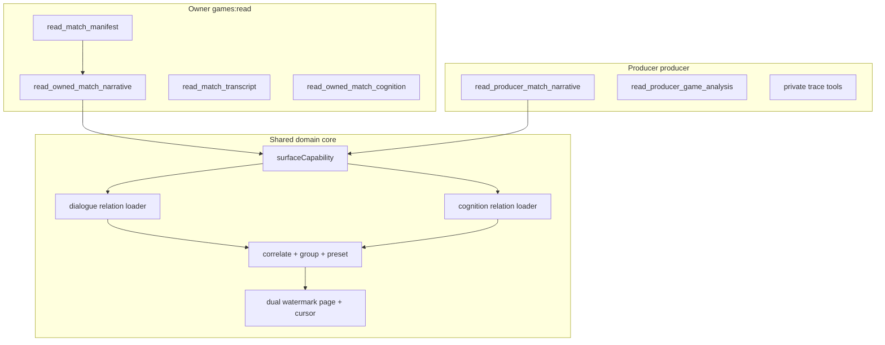

# Match Narrative (Owner + Producer) - Plan

## Summary

Ship **two** Production Game MCP tools that share one policy-parameterized composition core: `read_owned_match_narrative` (`games:read`, owned seats) and `read_producer_match_narrative` (`producer`, full product-lane dialogue + all seats’ thinking/strategy). Both return token-efficient grouped decision records with strategic/full presets, durable forward-path `decisionId` exact joins, and honest legacy correlation — without collapsing authority lanes or dumping private traces.

**Ship together before production.** Domain work implements the **broad producer load path first**, then owner as a restriction of the same pipeline, so ownership is never baked into the spine.

## Problem Frame

Match-completeness shipped three independent lanes: `read_match_manifest`, `read_match_transcript`, and `read_owned_match_cognition`. Owners and producers still pay for client-side merges when reconstructing “what was said and why.” Owners lack a compact owned story; producers have rawer tools (`read_producer_game_analysis`, private traces) but not the same token-efficient grouped presentation.

`open-indigo-moss`-style games show tight timestamp alignment without durable correlation IDs. Casual composition invents joins; wrong joins present thought as speech or speech as board fact.

This slice is a **derived presentation projection**, not a fourth completeness authority. Transcript remains dialogue authority; cognition remains thinking/strategy authority; canonical events remain board-fact authority. Private traces remain producer/debug only and never backfill narrative.

---

## Requirements

### Tools and surfaces

- R1. Production Game MCP must expose **two** read-only narrative tools that share one domain composition pipeline:
  - **`read_owned_match_narrative`** — `games:read` only; participating ownership; cognition under explicit `surfaceCapability: "subject_owner"`. Producer role metadata must **not** silent-widen this tool.
  - **`read_producer_match_narrative`** — `producer` scope + current producer role only; product-lane dialogue for the game; cognition under explicit `surfaceCapability: "producer"` (all player/juror thinking/strategy artifacts eligible under existing producer cognitive policy).
- R2. Neither tool puts cognition inside `read_match_transcript`. Transcript page DTOs must not gain cognition fields. `decisionId` may be stored on modern transcript rows for server joins but **must not appear on `read_match_transcript` allowlisted DTOs**. Narrative tools (both surfaces) may surface `decisionId` for exact joins.
- R3. Recommended workflows:
  - **Owner:** `read_match_manifest` → `read_owned_match_narrative` (default strategic) → optional drill-down to transcript / owned cognition / fact tools.
  - **Producer:** producer game discovery / facts → `read_producer_match_narrative` (default strategic) → optional drill-down to producer analysis, fact tools, or raw traces when needed.
- R4. `read_match_manifest` (owner/private-lane discovery) advertises **owned** narrative first among private-lane `nextReads` when private lanes are authorized. Producer narrative is discovered via the producer catalog / producer analysis follow-ups — not by widening the owner manifest into a producer tool.
- R5. Both tools ship in the same production-ready cut. CI must include producer and owner call paths; ownership-hardcoded composition that cannot serve producer is a failed unit.

### Grouped output and presets (shared)

- R6. Responses group material into **action/decision records** (groups), not a flat untyped mixed-prose timeline.
- R7. Every member carries `authority: "transcript" | "cognition"` (never facts). Page-level `contentTrust: untrusted_game_authored` covers prose; members do not restate contentTrust.
- R8. Page metadata declares once: game, surface, access summary, preset, detail, filters, dual read-through, correlation summary, contentTrust, non-authority notice. Avoid per-member identity/trust boilerplate beyond authority + allowlisted prose.
- R9. Presets: `strategic` (default: dialogue + strategy, omit raw thinking), `dialogue_only`, `full_cognition`. Large pure-dialogue dumps still prefer lane-native tools where they exist.
- R10. Detail: `compact` (default) | `full`. Never reasoning, prompts, private traces, or producer-only debug wrappers inside narrative members.
- R11. Filters: game (required), player (seat filter), phase, round, action (cognition/groups — not raw transcript action field), time range, limit, cursor.

### decisionId propagation (shared write path)

- R12. Forward path mints one durable `decisionId` per private decision and stamps thinking, strategy, and resulting dialogue when speech is produced. Trace-only mint without speech logger carry is insufficient.
- R13. No accepted-action event-payload `decisionId` dual-write in v1. Soft `relatedActionRefs` only from already-present cognition `eventSequence` / phase / round / action.
- R14. No historical unsafe backfill. Exact only when stored; missing IDs remain legacy.

### Correlation, pagination, live/completed (shared core)

- R15. Correlation kinds: `decision_id` | `inferred` | `uncorrelated`. Formal-speech keys stay transcript↔event parity (not narrative dialogue↔cognition exact in v1).
- R16. Inferred uses seat `actorPlayerId` + phase + round + time (+ optional scope class). Never require transcript `action`. Never cross seats. Multi-match / multi-beat / page-edge → uncorrelated or `inference_window_limited`. Prefer uncorrelated neighborhood over false pairs.
- R17. Dual-lane AES-GCM cursors with surface sealed into claims (`subject_owner` vs `producer`). Wrong surface / purpose → `cursor_invalid_or_stale`.
- R18. Live dual watermarks; completed terminal settlement; narrative health never stronger than weaker input lane. Late cognition → later sparse group with same `decisionId` when exact; never rewrite prior pages.
- R19. `limit` counts groups (default ~25, max ~50); oversized groups degrade with truncation + drill-down refs.

### Authorization

**Owner surface (`subject_owner`)**

- R20. Requires participating ownership; creator-only → `denied` without enumeration.
- R21. Cognition: owned seats only; non-owned never listed/counted/implied.
- R22. Dialogue: existing owner transcript visibility (public/safe system, authorized mingle, owner-unified huddles). Non-owned public dialogue may appear without cognition members; limitation `includes_non_owned_public_dialogue`.
- R23. Multi-seat: union default; player filter narrows; no cross-seat correlation joins. Re-resolve ownership every page.

**Producer surface (`producer`)**

- R24. Requires current producer role + `producer` scope; no ownership required.
- R25. Cognition: all eligible player/juror thinking/strategy under producer cognitive policy (same class as producer cognitive artifact reads — not reasoning dumps, not private-trace payloads).
- R26. Dialogue: **product dialogue scopes** for the game (public, viewer-safe system, mingle/whisper, huddle) without owner membership filtering. Diary/thinking transcript scopes stay out. Capture-version rules (e.g. legacy system omit) still apply. This is a **wider** relation than owner, not a subset of owner.
- R27. Player filter on producer surface filters by seat identity; empty success if no matching authorized product rows (not “not found” for other players’ existence via cognition counts).

**Shared non-enumeration / privacy**

- R28. Hidden rows (relative to the active surface’s authorized relation) must not affect page shape, totals, or diagnostics. Correlation `basis` is a closed enum without candidate counts or foreign IDs.
- R29. Owner tool must not become callable via producer scope alone; producer tool must not be callable via `games:read` alone.

### Completeness and degradation

- R30. Page-local composition diagnostics only; lane availability / formal-speech parity stay on manifest (owner) or existing producer diagnostics.
- R31. Sparse groups allowed; missing cognition never hard-fails strategic/dialogue presets.
- R32. Failures: `not_accessible`, `denied`, `cursor_invalid_or_stale`, `invalid_input`, `unavailable`, empty success when authorized-but-empty.

### Explicit non-goals

- R33. No deployment-preflight gate.
- R34. No private-trace backfill; no promote narrative to board-fact authority; no merging the two tools into one silent-widen endpoint.

---

## Key Technical Decisions

- **KTD1 — Two tools, one core (Approach 3 + 4 hybrid).** Catalog ships both tools together. Domain implements **producer broad load first**, then owner as restricted predicates on the same pipeline (prevents ownership-baked spine).
- **KTD2 — Surface capability is the spine parameter.** Every load/group/page invocation carries `surfaceCapability: "subject_owner" | "producer"`. Grouping module accepts already-authorized members only — no `ownedPlayerIds` inside pure grouping.
- **KTD3 — Tool names.** `read_owned_match_narrative` (owner) and `read_producer_match_narrative` (producer). Explicit names beat a single tool with a free-form mode flag that hosts mis-grant.
- **KTD4 — Derived presentation, not a fourth completeness lane.** Owner manifest gains `owned_match_narrative` follow-up (first private nextRead). Producer catalog lists producer narrative; optional pointer from producer analysis docs — not owner-manifest widen.
- **KTD5 — decisionId multi-hop write path.** Mint once at agent LLM/private-decision return; stamp cognition artifacts + speech logger modern capture; omit from transcript DTOs; narrative may show for exact joins on both surfaces.
- **KTD6 — Exact = `decision_id` only for dialogue↔cognition in v1.** Honest uncorrelated/inferred for legacy; no fake exact.
- **KTD7 — Producer dialogue ceiling = full product dialogue scopes** (public/system/mingle/whisper/huddle under capture-safe rules), not owner visibility policy. Owner continues to use transcript-visibility-policy.
- **KTD8 — Cognition SQL is surface-specific.** Owner: ownership-before-limit + `subject_owner`. Producer: game-scoped thinking/strategy with producer capability (no ownership filter); still type-allowlisted; still no reasoning/trace payloads in narrative.
- **KTD9 — Cursor claims seal surface.** Purpose family `match_narrative` with `surface` claim (or purpose split `match_narrative_owner` / `match_narrative_producer` — implementer pick one, tests must reject cross-surface resume). Bind subject (owner) or producer principal, game, filters, dual pins, keysets, capture versions.
- **KTD10 — Dual-lane watermark algorithm** (shared). Pin both; batch load; group; emit ≤N groups; advance per-lane keysets; late sparse exact groups; completed-first then live within U3.
- **KTD11 — Default preset `strategic`, detail `compact`** on both tools.
- **KTD12 — No accepted-action event decisionId write in v1.** Soft refs from cognition only.
- **KTD13 — decisionId not on public/owner transcript DTOs or public event payloads.** Narrative pages may include it.
- **KTD14 — Audit.** Privacy-safe: subject/client, tool name, surface, result class; never prose, decisionId lists, cursors, ownership fingerprints, member bodies.
- **KTD15 — Ship gate.** Both tools cataloged, authorized, and integration-tested before calling the branch production-ready. No “owner only, producer later” merge.

---

## High-Level Technical Design

### Surfaces and catalog



### Implementation order (Approach 4 inside the domain)

```text
U1  decisionId write path (shared)
U2  pure grouping (policy-agnostic inputs)
U3a producer dialogue + cognition loaders + page + cursor  ← broad path first
U3b owner loaders as restricted predicates on same page assembler
U4  register BOTH tools + owner manifest nextRead + auth matrices
U5  docs + open-indigo-moss (owner) + producer path validation
```

### Policy matrix

| Concern | `subject_owner` | `producer` |
|---------|-----------------|------------|
| Scope | `games:read` | `producer` + role |
| Game access | Participating owner / private-lane gate | Producer-visible game (existing producer game access) |
| Dialogue | Transcript visibility policy | All product dialogue scopes (capture-safe) |
| Cognition | Owned seats only | All player/juror thinking/strategy (producer cognitive policy) |
| Cursor bind | subjectUserId + ownershipFingerprint | producer principal + surface; no ownership fingerprint required |
| Empty non-owned player filter | Empty success | Empty success for unknown seat filter; no ownership non-enumeration theater |

### Dual-lane pagination (directional, shared)

```text
claims = {
  purpose: match_narrative_*,
  surface: subject_owner | producer,
  principal binding,
  filterFingerprint(preset, detail, player, phase, round, action, time),
  capture versions, dual readThrough, dual keysets, mode
}

load dialogue via surface-specific authorized relation
load cognition via surface-specific authorized relation
group (U2) → page by groups → seal cursor with surface
```

### Directional page shape

```text
page {
  schemaVersion, game, surface, access, preset, detail, filters,
  readThrough { transcript, cognition },
  correlationSummary { exact, inferred, uncorrelated },
  limitations[], contentTrust, notBoardAuthority: true,
  groups: [{ decisionId?, correlation, actor, phase?, round?, action?, sortKey,
    members: [dialogue | strategy | thinking...], relatedActionRefs?, truncations? }],
  nextCursor, nextCursorKind
}
```

---

## Scope Boundaries

### In scope

- Shared decisionId write path; pure grouping; dual-surface narrative read model.
- Both MCP tools; owner manifest nextRead; producer catalog entry.
- Presets, detail, filters, dual watermark, exact/inferred/uncorrelated.
- Tests proving producer path is not ownership-shaped; owner non-enumeration intact.
- Docs + validation for both surfaces.
- Ship both before prod.

### Out of scope

- Silent-widen of owner tools via producer role.
- Private-trace bodies inside narrative.
- Reasoning/prompts in narrative members.
- Accepted-action event decisionId dual-write.
- Historical decisionId backfill.
- Public web/WebSocket narrative.
- New OAuth private-data class for owners.
- Deployment preflight gate.

### Deferred

- Richer multi-beat legacy keys.
- Token-estimate paging; per-player continuity sort.
- Compound learning doc after ship.

### Alternatives considered

| Approach | Decision |
|----------|----------|
| Owner-only narrative | Rejected — leaves producer without token-efficient story; risks ownership-baked core |
| Single tool + mode flag | Rejected — hosts mis-grant / silent-widen risk; prefer two explicit tools |
| Producer-only first to prod | Rejected — user requires both before prod; **domain order** is still producer-first |
| Approach 3+4 hybrid | **Chosen** — both tools ship together; domain builds broad producer load then owner restriction |

---

## Implementation Units

### U1. Durable decisionId write path

**Goal:** Mint once; stamp cognition + speech-emitting modern dialogue for new capture only.

**Requirements:** R12–R14, KTD5, KTD13

**Dependencies:** none

**Files:**
- `packages/engine/src/game-runner.types.ts`, `packages/engine/src/agent.ts`
- Speech log / formal-speech / transcript logger sites (inventory during implement)
- `packages/api/src/db/schema.ts` + `packages/api/drizzle/`
- `packages/api/src/services/cognitive-artifact-writer.ts`
- `packages/api/src/services/transcript-serialization.ts` (persist; **omit from MatchTranscriptEntryDto**)
- Writer + engine tests

**Approach:** Multi-hop handoff (mint → trace + speech envelope → loggers → modern capture). No event-payload action stamps. No backfill.

**Test scenarios:** Shared thinking/strategy id; speech path stamps dialogue; cognition-only mints; multi-line speech one id; legacy null; transcript DTO omits decisionId.

**Verification:** Migrations additive; no Season 0 rewrite.

---

### U2. Pure correlation and grouping

**Goal:** Policy-agnostic grouper over already-authorized members.

**Requirements:** R6–R7, R9–R10, R15–R16, R19, R31

**Dependencies:** U1 field shapes

**Files:**
- `packages/api/src/services/match-narrative-grouping.ts` (new)
- `packages/api/src/__tests__/match-narrative-grouping.test.ts` (new)

**Approach:** Exact by decisionId + unanimous actorPlayerId; inferred without transcript action; presets/detail; no ownership types in this module.

**Test scenarios:** Exact/inferred/uncorrelated; strategic/full/dialogue_only; multi-seat no cross-join; multi-beat uncorrelated; compact truncation; no contentTrust on members.

**Verification:** Table-driven pure tests; grouping accepts multi-actor full-game member sets (producer-shaped fixtures) and owned subsets (owner-shaped fixtures).

---

### U3. Dual-surface narrative read model (producer-first, then owner)

**Goal:** Page assembler with surface-parameterized loaders, dual watermark, cursor; **producer path implemented and tested first**, then owner restrictions.

**Requirements:** R8, R11, R17–R32, KTD1–KTD2, KTD7–KTD11, KTD14

**Dependencies:** U1, U2

**Files:**
- `packages/api/src/services/match-narrative-read-model.ts` (new)
- `packages/api/src/services/match-read-cursor.ts` (narrative claims + surface)
- `packages/api/src/__tests__/match-read-cursor.test.ts`
- `packages/api/src/__tests__/match-narrative-read-model.test.ts` (new)

**Approach:**
1. **U3a Producer:** Resolve producer-accessible game; load full product dialogue relation (capture-safe); load all thinking/strategy with `surfaceCapability: "producer"`; pin dual watermarks; page; cursor sealed with producer surface.
2. **U3b Owner:** Same assembler; dialogue via transcript visibility + private-lane gate; cognition ownership-before-limit + `subject_owner`; cursor sealed with ownership fingerprint + owner surface.
3. Shared: presets, filters, correlation summary, lag, late sparse groups, completed-then-live.

**Test scenarios:**
- Producer: multi-player cognition present; all huddles in product dialogue; strategic omits thinking; full includes thinking; no traces/reasoning.
- Producer: no ownership required; missing producer role → denied/not authorized at tool layer (domain assumes authorized principal).
- Owner: only owned cognition; non-owned empty filter; creator-only denied; multi-owned union; ownership transfer stale cursor.
- Cross-surface: owner cursor rejected on producer resume and vice versa.
- Dual watermark live + completed for both surfaces.
- Regression: grouping still has no ownership import.

**Verification:** Producer-shaped integration tests fail if loaders hardcode ownedPlayerIds; owner non-enumeration tests remain green.

---

### U4. MCP contracts — both tools, auth matrices, owner nextRead

**Goal:** Register and authorize both tools; wire dispatch; owner manifest follow-up.

**Requirements:** R1–R5, R29, KTD3–KTD4, KTD15

**Dependencies:** U3

**Files:**
- `packages/api/src/game-mcp/contracts.ts`
- `packages/api/src/game-mcp/server.ts`
- `packages/api/src/game-mcp/tool-authorization.ts` (owned in GAME_READ_TOOLS; producer narrative in PRODUCER_TOOLS)
- `packages/api/src/game-mcp/read-model.ts`
- `packages/api/src/services/match-completeness.ts` (owned_match_narrative nextRead only)
- `packages/api/src/__tests__/production-game-mcp-server.test.ts`
- `packages/api/src/__tests__/match-completeness.test.ts`
- `packages/api/src/__tests__/production-game-mcp-read-model.test.ts`

**Approach:**
- Closed schemas shared shape + surface implied by tool name (not client-supplied surface enum).
- Owner tool: `games:read` only.
- Producer tool: `producer` + role only.
- Manifest: owned narrative first private nextRead when authorized.
- Tool descriptions: not board truth; surface-specific visibility.

**Test scenarios:**
- Catalog: owned tool under games:read; producer tool under producer; each absent from the other grant.
- Call paths both schema-valid.
- Producer token without role fails closed.
- Owner token cannot call producer narrative.
- Producer token cannot call owned narrative without games:read + ownership (and still no silent widen of other seats via owned tool).
- Manifest nextReads prioritizes owned narrative for owners.

**Verification:** Auth matrix complete for both tools.

---

### U5. Documentation and dual-surface validation

**Goal:** Docs + runtime checklist for owner and producer before prod.

**Requirements:** R3–R4, R33, KTD15

**Dependencies:** U4

**Files:**
- `docs/game-mcp-production-oauth.md`
- `CONCEPTS.md`
- `DEVELOPMENT.md`
- `docs/local-model-evaluation.md`
- `docs/reasoning-transcript-observability.md`
- `README.md` if needed

**Validation checklist (not deploy gate):**
1. Owner on `open-indigo-moss` (or equivalent): strategic compact; owned cognition only; honest legacy correlation.
2. Producer on same game: multi-seat cognition visible; product dialogue broader; strategic compact token-efficient vs trace dump.
3. Forward-path short game: exact `decision_id` on both surfaces.
4. Cross-tool: owned narrative never returns non-owned cognition; producer narrative never returns traces/reasoning in members.
5. Cursor paging + cross-surface cursor rejection.

**Verification:** Docs list both tools and the no-silent-widen rule; both checklist legs run or residual gaps recorded.

---

## System-Wide Impact

| Area | Impact |
|------|--------|
| Auth | Two tools; explicit surfaceCapability; no silent widen |
| Persistence | decisionId forward path |
| MCP catalog | +2 tools (owner + producer) |
| Token efficiency | Owners and producers both gain composed strategic pages |
| Completeness | Still three-lane on owner manifest |
| Producer UX | Complements analysis/traces; does not replace raw traces |

---

## Risks & Dependencies

| Risk | Mitigation |
|------|------------|
| Ownership baked into core | Producer-first U3; pure grouping fixtures; CI fails without producer path |
| Silent-widen | Separate tools + auth matrix tests |
| False inferred pairs | Uncorrelated default; honest limitations |
| Producer dialogue ceiling wrong | Explicit product-scope list; capture-safe system rules |
| Payload bloat with multi-seat producer | Same group limits + compact default |
| Dual watermark bugs | Shared algorithm + both-surface tests |

**Dependency:** match-completeness spine; existing `CognitionSurfaceCapability` / producer cognitive policy.

---

## Documentation Plan

| Doc | Change |
|-----|--------|
| `docs/game-mcp-production-oauth.md` | Both tools; scope table; red lines; producer vs owner |
| `CONCEPTS.md` | Match narrative dual surface (update seeded entry) |
| `DEVELOPMENT.md` | Tool lists for games:read and producer |
| `docs/local-model-evaluation.md` | Owner workflow + producer workflow |
| `docs/reasoning-transcript-observability.md` | Narrative vs traces vs transcript |

---

## Open Questions (implementation-time)

1. Cursor: single purpose + `surface` claim vs two purposes — pick one; tests bind the choice.
2. Producer game access helper: reuse existing producer game resolution from producer analysis tools.
3. Time-proximity / lookbehind constants — tune on real games; start conservative.
4. Hard max serialized response size for multi-seat producer pages.
5. Whether producer strategic default should prefer slightly lower limit than owner (same defaults first unless payload proves otherwise).

---

## Sources & Research

- Match-completeness services, cognitive policy (`subject_owner` / `producer`), tool-authorization split
- Session decisions: dual-surface ship-together; producer-first domain order; no silent-widen
- External research: skipped

---

## Assumptions

- Both tools required before production.
- Domain order: producer broad path first, then owner restriction (Approach 4 sequencing).
- Catalog: two tools ship together (Approach 3).
- Default preset strategic / compact for both.
- No accepted-action event decisionId write in v1.
- Producer narrative is product dialogue + first-class thinking/strategy only — not private traces.
