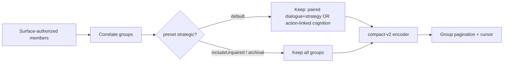
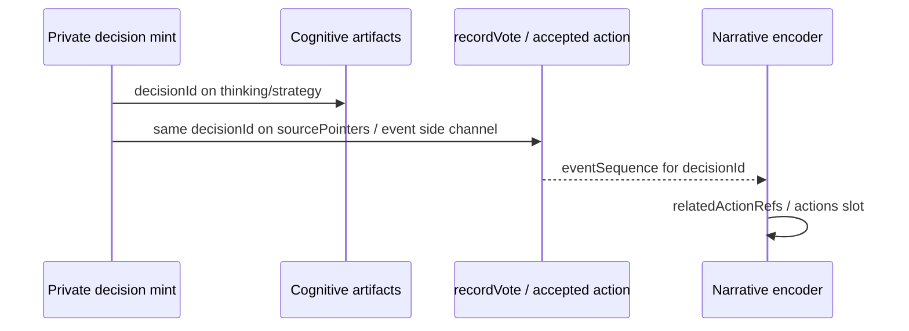

# Match Narrative Token Efficiency - Plan

## Summary

Make `read_owned_match_narrative` and `read_producer_match_narrative` **materially** token-efficient (target **≥50%** fewer serialized characters than equivalent separate transcript + strategy reads on owned strategic/compact) via a versioned **compact-v2** response contract, smarter strategic selection (omit unpaired cognition by default), honest correlation metrics, and accepted-action `decisionId` linkage — without collapsing authority lanes or privacy rules.

## Problem Frame

Match narrative already works on `open-indigo-moss`: exact `decisionId` joins for forward-path dialogue/thinking/strategy, healthy privacy, no client-side correlation. But **token win is marginal**.

| Measurement (Vesper, owned, open-indigo-moss) | JSON chars |
|-----------------------------------------------|------------|
| Separate `read_match_transcript` + strategy cognition | ~41,912 |
| `read_owned_match_narrative` strategic/compact | ~37,965 |
| **Reduction** | **~9.4%** |

Root causes (code + field evidence):

1. **Structural bloat** — every group member re-emits `phase`, `round`, `action`, `decisionId`, `sortKey`, `authority`, nested `fields` wrappers; every group re-emits full `actor` UUID+name.
2. **Semantic bloat** — strategic preset still includes **all** strategy artifacts (reflections, intents, unpaired votes), so unpaired cognition dominates the page.
3. **Weak action linkage** — `relatedActionRefs` only soft-derives from cognition `eventSequence`; `vote.cast` never stamps `decisionId`; vote cognition may lack the vote event sequence → empty refs for Vesper R2 vote.
4. **Metric inflation** — `correlationSummary.exact` counts every `decision_id` group, including **single-member** ID-stamped groups (cognition-only vote), which overstates cross-lane joins.

Compact detail today only truncates long dialogue (~400 chars) and trims some strategy keys; it does **not** redesign the envelope.

---

## Requirements

### Benchmarks and targets

- R1. Establish a **reproducible character/token benchmark harness** over fixed fixtures or live `open-indigo-moss` snapshots for:
  - owned strategic/compact
  - owned full_cognition/full
  - producer strategic/compact
  - filtered round/phase/action (owned + producer)
  - baseline: separate transcript page(s) + cognition page(s) with matching filters/preset intent
- R2. Primary success metric: **owned strategic/compact** serialized JSON (UTF-8 char count and approximate token estimate) **≤ 50%** of equivalent separate reads, on the same game + player + filter window, while preserving useful strategic analysis (paired dialogue+strategy where joins exist; drill-down refs for omitted bodies).
- R3. Secondary metrics: % characters in prose vs metadata; unpaired group count; exact_cross_lane_join vs id_stamped_singleton counts; relatedActionRefs hit rate for speech- and action-emitting decisions.

### Structural compression (compact-v2)

- R4. Introduce **`schemaVersion: 2`** compact envelope for both surfaces. Do not silently change v1 semantics for existing clients mid-flight without a version bump.
- R5. Page-level identity once: game, surface, selected player(s) dictionary (id → short name), contentTrust, notBoardAuthority, dual readThrough, correlationSummary, limitations, cursor.
- R6. Group-level inheritance: `decisionId`, `phase`, `round`, `action`, `actor` (or short player ref), `correlation` once per group — **not** re-emitted on members.
- R7. **Collapse `members[]` into a single group payload object** for compact-v2: optional top-level string (or small object) slots on the group — at minimum `text` (dialogue), `thinking`, and `strategy` (strategy body / decisionLog). Omit absent slots. Authority is **implied by slot name** (`text`→transcript; `thinking`/`strategy`→cognition). Do not emit per-member `kind`, `authority`, `id`, `sortKey`, or repeated phase/round/action/decisionId. If multiple dialogue lines share one decisionId, join under one group with ordered `texts[]` only when needed; default one primary `text`.
- R8. Omit null/default fields entirely (no `"decisionId": null`, no empty arrays, no null visibility).
- R9. Prefer short stable refs: `g` ordinal or stable short keys; artifact/row ids only when needed for drill-down; UUID player ids de-duplicated via page `players` map and short keys (`p0`, `p1`) **or** name-only when unambiguous on roster for the filtered player — implementer pick with privacy non-enumeration preserved.
- R10. `detail=full` (or `schemaVersion: 1` compatibility path) retains full-fidelity bodies and current drill-down ids for archival analysis.

### Semantic reduction

- R11. Default **`strategic`** selection: include dialogue (authorized) plus strategy **only when** correlated to dialogue (exact/inferred join) **or** to an accepted action ref (when linkage exists). Omit unpaired reflections/intents/strategy-only groups by default.
- R12. Explicit **`includeUnpaired: true`** (or preset `strategic_complete` / archival) returns unpaired cognition under the same compact structure, labeled uncorrelated.
- R13. Default strategic may still include **action-only** groups (vote/power/council) when they have strategy and accepted-action linkage — even without dialogue — because they are strategically material; document as intentional exceptions.
- R14. Collapse redundant strategy artifacts only under **deterministic documented rules** (e.g. same decisionId keeps one strategy member; same actor+phase+round+action without decisionId does **not** collapse — avoid silent merge). Prefer keep-one-per-decisionId, never fuzzy prose merge.
- R15. Large strategy fields (`strategyPacketSummary` object/string blobs, long `decisionLog`) default to **summary string or omit + `refs`** in compact-v2; full body via `detail=full` or dedicated cognition drill-down tool with artifact id.

### Preserve

- R16. Authority lanes remain labeled (slot or explicit authority); never promote narrative to board facts.
- R17. Owner vs producer visibility unchanged; no silent widen; non-enumeration intact.
- R18. Exact vs inferred honesty preserved; no inventing decisionIds at read time.
- R19. Cursor binding, dual watermark pins, and page keyset semantics remain stable (may seal schemaVersion into filter fingerprint when v2 changes page shape).

### Accepted-action correlation

- R20. Propagate `decisionId` into canonical **source pointers** (and/or a dedicated optional field on agent-turn-linked events) for decisions that emit accepted board actions: at minimum `vote.cast`, empower revote cast, power.action_set, council-related casts where private decision exists.
- R21. Ensure cognitive artifact `eventSequence` is the **accepted action event sequence** when the decision produces one (not only a loose boundary sequence).
- R22. Populate narrative `relatedActionRefs` from decisionId→event and/or cognition eventSequence with action type + sequence; empty only when action legitimately has no canonical event (pure speech, intent-only, reflection-only).
- R23. Document which actions have: (dialogue+cognition), (cognition+event, no dialogue), (dialogue only), (cognition only).

### Correlation metrics

- R24. Split summary counts:
  - `exactCrossLane` — groups with ≥2 lanes among {dialogue, thinking, strategy} sharing decisionId (or exact inferred pair dialogue+cognition)
  - `idStampedSingleton` — single-member groups that still carry decisionId
  - `inferred`, `uncorrelated`
  - `paired` vs `unpaired` (unpaired = cognition-only or dialogue-only with no cross-lane partner under selection rules)
- R25. Stop reporting inflated `exact` that treats singletons as full joins.

### Compatibility

- R26. Prefer **versioned compact-v2** (`schemaVersion: 2`) as default for both tools once shipped; keep **`schemaVersion: 1`** available via input `schemaVersion: 1` (or `responseShape: "v1"`) for one transition window.
- R27. MCP outputSchema / assert helpers must accept the active default version; document migration in OAuth MCP docs.

---

## Key Technical Decisions

- **KTD1 — Target ≥50% char reduction on owned strategic/compact vs separate reads.** 9% is insufficient; treat as product failure of “token-efficient narrative.”
- **KTD2 — schemaVersion 2 compact contract, not silent v1 mutation.** Structural rename (slots, inheritance, omit-nulls) is a wire break; version it.
- **KTD3 — Default strategic omits unpaired cognition.** This is the largest semantic win on open-indigo-moss (many uncorrelated strategy rows). Archival completeness is opt-in.
- **KTD4 — Collapse members into group slots (`text` / `thinking` / `strategy`).** Live open-indigo-moss exact groups already show three near-identical wrapper objects; one group object with three optional strings is the primary structural win. Authority is implied by slot name.
- **KTD5 — decisionId on accepted-action write path.** Mint already exists on private decision; thread into `recordVote` / sourcePointers and set cognition `eventSequence` to the accepted vote sequence when known. Fixes empty relatedActionRefs for Vesper R2 pattern.
- **KTD6 — relatedActionRefs from decisionId index when possible.** Prefer exact decisionId→event join over phase/round guess.
- **KTD7 — Correlation metrics honesty.** Rename/split counts; never call a singleton “exact join.”
- **KTD8 — Benchmark fixture first.** Add a golden snapshot or harness test that fails if owned strategic compact exceeds 50% of baseline for the fixture; use open-indigo-moss-shaped synthetic data if live DB is not CI-available.
- **KTD9 — Drill-down over embedding.** Compact strategy keeps `decisionLog` + lens (+ short summary); packet blobs and thinking stay out of default strategic.
- **KTD10 — Both surfaces share the same encoder.** Owner/producer differ only in authorized member sets before selection/encoding.

---

## High-Level Technical Design

### Where tokens go today (modeled)

Illustrative split for a ~38k owned strategic page (order-of-magnitude from shape + evidence):

| Bucket | Est. share | Notes |
|--------|------------|--------|
| Unpaired strategy prose + wrappers | 35–50% | strategic includes all strategy artifacts |
| Paired dialogue + strategy prose | 25–35% | actual analysis payload |
| Repeated group/member metadata | 15–25% | phase/round/action/decisionId/actor/sortKey/authority/kind/fields |
| Page envelope + filters + readThrough + cursor | 5–10% | mostly fixed; cursor is large opaque string |
| IDs / timestamps | 5–10% | UUIDs, ISO times, entry sequences |

**Implication:** structural compression alone cannot hit 50% if unpaired strategy remains; **selection + structure** must combine.

### Benchmark table (targets)

| Scenario | Baseline (separate reads) | Current narrative v1 (est.) | Target compact-v2 |
|----------|---------------------------|-----------------------------|-------------------|
| Owned strategic/compact (Vesper-like) | ~42k chars | ~38k (−9%) | **≤21k (−≥50%)** |
| Owned full_cognition/full | higher | higher | ≤70% of baseline (looser; fidelity mode) |
| Producer strategic/compact | multi-seat baseline | multi-seat narrative | ≥40% reduction vs separate multi-seat reads |
| Filtered single round strategic | smaller baseline | still metadata-heavy | ≥50% reduction |

Exact numbers to be filled by U1 harness on fixed fixture.

### Compact-v2 directional shape

**Live evidence (v1, exact group)** already has three members that are pure redundancy of wrappers:

```json
{
  "decisionId": "28f428fa-1f5b-49d5-9b60-da0af830fe67",
  "correlation": { "kind": "decision_id", "basis": "decision_id" },
  "actor": "Vesper Ledger",
  "phase": "MINGLE_I",
  "round": 2,
  "action": "mingle-turn",
  "members": [
    { "kind": "dialogue", "authority": "transcript", "text": "One signal…", "scope": "mingle", "entrySequence": 156 },
    { "kind": "thinking", "authority": "cognition", "thinking": "I’ll private-message Atlas…" },
    { "kind": "strategy", "authority": "cognition", "decisionLog": "Mingle turn to Atlas and Sage…" }
  ]
}
```

**Target collapse** — same semantic content, one object, slot-implied authority:

```json
{
  "decisionId": "28f428fa-1f5b-49d5-9b60-da0af830fe67",
  "corr": "exact",
  "actor": "Vesper Ledger",
  "phase": "MINGLE_I",
  "round": 2,
  "action": "mingle-turn",
  "text": "One signal I’d broadcast this round to prove Lantern Pact alignment is a public post-Round-2 check-in…",
  "thinking": "I’ll private-message Atlas and Sage with a concise plan…",
  "strategy": "Mingle turn to Atlas and Sage. Propose a lean Lantern Pact signal after Round 2…",
  "scope": "mingle",
  "seq": 156
}
```

Full page envelope:

```json
{
  "ok": true,
  "schemaVersion": 2,
  "game": { "slug": "open-indigo-moss", "status": "in_progress" },
  "surface": "subject_owner",
  "preset": "strategic",
  "detail": "compact",
  "contentTrust": "untrusted_game_authored",
  "notBoardAuthority": true,
  "readThrough": { "transcript": { "mode": "live_watermark", "seq": 160 }, "cognition": { "mode": "live_snapshot" } },
  "correlationSummary": {
    "exactCrossLane": 4,
    "idStampedSingleton": 2,
    "inferred": 1,
    "uncorrelated": 0,
    "paired": 5,
    "unpairedOmitted": 18
  },
  "groups": [
    {
      "decisionId": "28f428fa-…",
      "corr": "exact",
      "actor": "Vesper Ledger",
      "phase": "MINGLE_I",
      "round": 2,
      "action": "mingle-turn",
      "text": "…",
      "thinking": "…",
      "strategy": "…",
      "scope": "mingle",
      "seq": 156
    },
    {
      "decisionId": "…",
      "corr": "exact",
      "actor": "Vesper Ledger",
      "phase": "VOTE",
      "round": 2,
      "action": "vote",
      "strategy": "…",
      "actions": [{ "seq": 108, "type": "vote.cast" }]
    }
  ],
  "nextCursor": "…"
}
```

**Slot rules (normative for v2):**

| Slot | Authority | Source |
|------|-----------|--------|
| `text` | transcript | dialogue member body |
| `thinking` | cognition | thinking prose |
| `strategy` | cognition | prefer `decisionLog`; optional `lens` sibling if present |
| `actions` | fact **ref only** | relatedActionRefs — not board outcomes |

- `strategic` default omits `thinking` unless preset is `full_cognition`.
- Omit any slot that is empty; never emit `"thinking": null`.
- `strategy` as a **string** in compact (decisionLog); `detail=full` may use `{ "log", "lens", "packetSummary" }` if needed.
- Page-level `players` map only when multi-actor producer pages need id disambiguation; owned single-player filters can keep `actor` as display name only (UUID once in access/game if required).

Notes: measure full keys vs short (`corr`, `seq`). Prefer the collapsed shape above first; short keys only if still short of 50%.

### Selection pipeline



### decisionId → accepted action



Actions with no dialogue (vote, power, intent): still form action+strategy groups when strategy exists.  
Actions with no event (pure mingle speech): dialogue+strategy only, no actions slot.

### Compatibility

| Client | Behavior |
|--------|----------|
| New default | schemaVersion 2 compact-v2 |
| Pin v1 | `schemaVersion: 1` input |
| detail=full | fuller prose in v2 slots; still inherited metadata |
| Cursor | bind schemaVersion in filter fingerprint |

---

## Scope Boundaries

### In scope

- Benchmark harness + targets
- compact-v2 encoder for owner + producer narrative
- strategic selection / includeUnpaired
- correlation metric fix
- decisionId propagation to accepted-action path (vote and analogous)
- relatedActionRefs population
- docs + focused tests
- schemaVersion 1 compatibility path

### Out of scope

- Changing match-transcript or cognition tool shapes (except reading decisionId/eventSequence already stored)
- Private-trace inclusion
- Non-owned cognition on owner surface
- Historical decisionId backfill
- LLM-generated summaries as server product
- Deployment preflight gate

### Deferred

- Aggressive short-key dictionary compression if full-key v2 already hits 50%
- Live catch-up narrative improvements (orthogonal)
- Producer-only multi-player identity packing micro-optimizations beyond shared encoder

---

## Implementation Units

### U1. Benchmark harness and baseline capture

**Goal:** Reproducible char/token measurements for narrative vs separate reads.

**Requirements:** R1–R3, KTD1, KTD8

**Files:**
- `packages/api/src/__tests__/match-narrative-token-benchmark.test.ts` (new) and/or `packages/api/scripts/` helper if needed
- Fixture builders reusing match-narrative-read-model test seeders

**Approach:** Build a fixed multi-group fixture (paired exact, unpaired strategy flood, vote action-only, mingle dialogue). Measure JSON.stringify length for: separate transcript+cognition emulation vs narrative v1 vs (later) v2. Export numbers into test assertions for regression.

**Test scenarios:**
- Baseline fixture produces known separate-read char count band.
- Document open-indigo-moss field evidence as comments (37,965 / 41,912) without requiring live DB in CI.

**Verification:** Harness runs offline; prints table; CI asserts fixture ratios.

---

### U2. Correlation metrics honesty

**Goal:** Fix overstated exact joins before/alongside compact encoding.

**Requirements:** R24–R25

**Dependencies:** none (can land early)

**Files:**
- `packages/api/src/services/match-narrative-grouping.ts`
- `packages/api/src/services/match-narrative-read-model.ts`
- `packages/api/src/game-mcp/contracts.ts`
- `packages/api/src/__tests__/match-narrative-grouping.test.ts`

**Approach:** Compute exactCrossLane / idStampedSingleton / paired / unpaired; keep legacy `exact` only if mapped as exactCrossLane+idStampedSingleton for v1, or drop `exact` in v2.

**Test scenarios:**
- Cognition-only decisionId group → idStampedSingleton, not exactCrossLane.
- Dialogue+strategy same decisionId → exactCrossLane=1.
- Page-local summary matches emitted groups only.

**Verification:** Unit tests lock metrics.

---

### U3. Strategic selection (omit unpaired by default)

**Goal:** Default strategic pages exclude unpaired cognition groups.

**Requirements:** R11–R14

**Dependencies:** U2

**Files:**
- `packages/api/src/services/match-narrative-grouping.ts` or selection module
- `packages/api/src/services/match-narrative-read-model.ts`
- contracts input: `includeUnpaired?: boolean`
- tests

**Approach:** After grouping, filter groups for strategic: keep if has dialogue member OR (action-linked cognition) OR includeUnpaired. Count `unpairedOmitted` for summary. Deterministic collapse: one strategy per decisionId.

**Test scenarios:**
- Flood of unpaired strategy omitted by default; reappear with includeUnpaired.
- Paired exact retained.
- Action-only vote group retained when event ref present (after U5) or when marked action-class action string.

**Verification:** Fixture page size drops substantially before encoder work.

---

### U4. compact-v2 encoder

**Goal:** Structural compression + named slots + omit-nulls; default schemaVersion 2.

**Requirements:** R4–R10, R15–R19, R26–R27, KTD2, KTD4, KTD9–KTD10

**Dependencies:** U2, U3

**Files:**
- `packages/api/src/services/match-narrative-compact-v2.ts` (new encoder)
- `match-narrative-read-model.ts` (wire)
- `packages/api/src/game-mcp/contracts.ts` (dual schema or versioned schema)
- cursor filter fingerprint includes schemaVersion
- tests + U1 harness asserts ≥50% on fixture

**Approach:** Pure encode(pageDomain) → JSON-ready object. For each group: copy group-level correlation/actor/phase/round/action/decisionId once; map dialogue→`text`, thinking→`thinking`, strategy decisionLog→`strategy` string; attach optional `scope`/`seq` from dialogue; attach `actions` refs; **never emit `members[]` in v2**. Optional truncation markers; drill-down artifact ids under `refs` only when body omitted.

**Test scenarios:**
- No null keys in stringify of compact groups.
- No per-member repeated decisionId/phase/round when group has them.
- Authority recoverable from slots.
- schemaVersion 1 path still returns v1 members shape.
- Owner and producer both encode.
- ≥50% reduction vs separate-read baseline on fixture.

**Verification:** Benchmark test is the gate.

---

### U5. Accepted-action decisionId + relatedActionRefs

**Goal:** Vesper-class vote links appear as actions on narrative groups.

**Requirements:** R20–R23, KTD5–KTD6

**Dependencies:** U1 decisionId mint (already shipped)

**Files:**
- `packages/engine/src/canonical-events.ts` (source pointer optional decisionId if needed)
- `packages/engine/src/phases/vote.ts` (+ power/council analogues as inventory allows)
- `packages/engine/src/phases/phase-runner-context.ts` (`agentTurnSourcePointer` carry decisionId)
- cognitive artifact writer eventSequence assignment path
- narrative mapping for relatedActionRefs / compact `actions`
- engine + api tests

**Approach:**
1. Inventory speech vs action decisions.
2. Thread lastPrivateDecisionId into recordVote sourcePointers.
3. After event append, stamp cognition eventSequence if still boundary-only (or write sequence at sink time when final sequence known).
4. Narrative: build decisionId→eventSequence index from events or from cognition; fill actions.

**Test scenarios:**
- Vote private decision → vote.cast sourcePointers include decisionId; narrative group has actions[{seq, type: vote.cast}].
- Mingle speech-only → no actions slot required.
- Reflection-only unpaired omitted under strategic default.

**Verification:** Integration test with DB events + artifacts + narrative page.

---

### U6. Docs and host guidance

**Goal:** Document v2 contract, presets, metrics, action linkage, migration.

**Requirements:** R26–R27

**Dependencies:** U4, U5

**Files:**
- `docs/game-mcp-production-oauth.md`
- `docs/local-model-evaluation.md`
- `DEVELOPMENT.md`
- `CONCEPTS.md` (compact-v2 / unpaired omission if product vocabulary)

**Approach:** Show before/after size guidance; recommend strategic default; full/includeUnpaired for audit; fact tools for board claims.

**Verification:** Docs match shipped schemas.

---

## Risks & Dependencies

| Risk | Mitigation |
|------|------------|
| Hosts break on schemaVersion 2 | Default v2 only after assert/schema update; explicit v1 pin |
| Omitting unpaired hides useful intent | includeUnpaired / full_cognition; document tradeoff |
| decisionId on events leaks private structure | Keep off public event DTOs if any; narrative/producer only; mirror transcript decisionId redaction |
| 50% target missed if prose alone is huge | Pair selection + field allowlist; truncate logs; measure |
| Cursor invalidation when fingerprint adds schemaVersion | Document; clients re-fetch first page |

**Dependency:** dual-surface narrative on `feat/match-narrative` (or merged main).

---

## Privacy & Compatibility Analysis

| Concern | Assessment |
|---------|------------|
| Owner non-owned cognition | Unchanged — selection runs after auth |
| Producer breadth | Unchanged member set; smaller encoding |
| decisionId on public transcript | Remains forbidden on transcript DTOs |
| decisionId on canonical events | Prefer sourcePointers private-ish field; do not expand player-facing event payloads with thought linkage |
| Cursor non-enumeration | Unchanged; no hidden counts in metrics beyond authorized page |
| LLM over-trust of narrative | Keep notBoardAuthority; actions are refs not outcomes |

---

## Open Questions (implementation-time)

1. Prefer readable group keys vs ultra-short keys — measure on fixture.
2. Whether `strategyPacketSummary` objects should be stringified summaries or always refs in compact.
3. Full inventory of accepted-action types for decisionId stamping in U5 (vote first, then power/council).
4. Default schemaVersion cutover timing relative to external MCP clients (friends-scale: default v2 immediately is acceptable if documented).

---

## Assumptions

- ≥50% reduction is a hard product goal for owned strategic/compact.
- Default strategic omits unpaired cognition.
- Versioned compact-v2 rather than silent v1 reshape.
- Both owner and producer share encoder.
- open-indigo-moss evidence (37,965 vs 41,912) is authoritative motivation, not a CI fixture unless snapshotted.

---

## Sources & Research

- Live evidence: open-indigo-moss Vesper owned strategic/compact vs separate reads
- Code: `match-narrative-grouping.ts`, `match-narrative-read-model.ts`, `contracts.ts` narrative schemas
- Vote path: `packages/engine/src/phases/vote.ts` recordVote sourcePointers without decisionId
- Prior plan: `docs/plans/2026-07-21-001-feat-owned-match-narrative-plan.md`
- External research: skipped — local evidence sufficient
