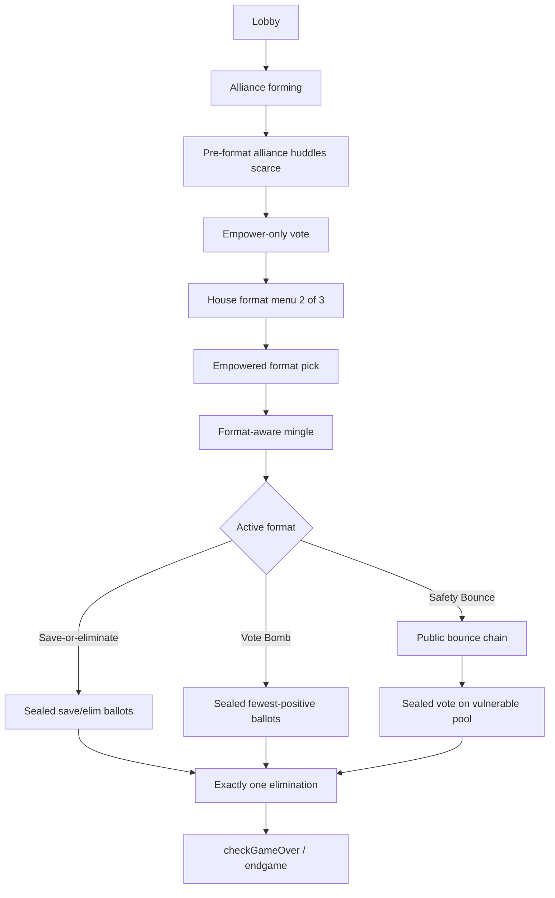
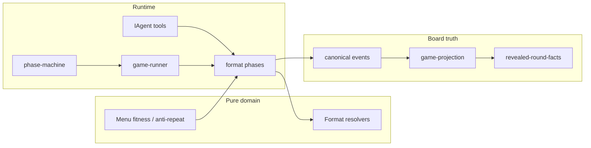

# feat: Sequester format kernel

## Summary

Rewire standard pre-endgame rounds so empower selects a format chooser, The House offers two of three launch formats, the empowered player picks one, players mingle under fixed format rules, and format resolution eliminates exactly one player — retiring classic Power → Council as the default path while leaving endgame unchanged.

---

## Problem Frame

Standard rounds collapse into majority pile-on: the same bloc math drives expose pressure, power choice, and Council every round. The product bar is watchable social strategy for a small audience, not public-scale polish. The origin requirements replace the stale elimination engine with a **format kernel** and a launch trio (Save-or-eliminate, Vote Bomb, Safety Bounce) so majority is sometimes strong and sometimes brittle.

Today’s engine spine is hard-coded: Lobby → Mingle I → pre-vote huddle → Vote(empower+expose) → post-vote Mingle → Power → Reveal → pre-council huddle → Council. Projection, revealed facts, MCP rules, postgame, and watch surfaces all assume that shape.

---

## Requirements

Traceability to origin R/F/AE IDs.

**Kernel**

- R1. Standard pre-endgame rounds do not run eliminate/protect/pass → two-candidate Council as the default elimination path. (origin: R1, R17–R19)
- R2. After empower resolves, exactly one active round format is locked from a House two-option menu; the empowered player picks one. (origin: R2–R5, F2)
- R3. Launch set is Save-or-eliminate, Vote Bomb, and Safety Bounce with fixed public rule sheets (no post-pick mechanical twist). (origin: R4–R5)
- R4. Each launch-format round eliminates exactly one alive player; empowered breaks format elimination ties among the tied set only. (origin: R6, R10, F3)
- R5. Endgame (Reckoning / Tribunal / Judgment) remains unchanged. (origin: R7)

**Empower and participation**

- R6. Empower plurality (with existing re-vote / wheel) still selects the empowered player; no expose ballot on the default path. (origin: R8, R18)
- R7. Empowered is format chooser, full format participant, fully eligible to be eliminated, and tiebreaker only when scoring deadlocks. (origin: R9–R13)
- R8. Named empower ledger is public when empower resolves (before format pick). (U3 owns)
- R8b. Format pick is a public strategic receipt for later context packs. (U4 owns)

**Social**

- R9. Pre-format: Lobby + named-alliance forming + scarce **pre-format alliance huddles** only — no required multi-beat pre-format room Mingle. (origin: R14, R17, R36)
- R10. After format lock: format-aware mingle for all three formats. Safety Bounce order is mingle → bounce → vote; Save-or-eliminate and Vote Bomb are mingle → ballot. (origin: R15)
- R11. Pre-council huddles do not run on the default path. (origin: R16)

**Format rules**

- R12. Save-or-eliminate: one sealed ballot each as save(+1) or eliminate(−1) to a non-self living target; no self-save; lowest net out; empowered breaks lowest-net ties. (origin: R20–R22, AE2)
- R13. Vote Bomb: one sealed non-self elim-direction vote; zero votes = safe; fewest among positive totals out; empowered breaks positive-fewest ties. With strict non-self ballot repair, empty positive set is treated as impossible in normal play (origin R26 vacated). (origin: R23–R25, AE3)
- R14. Safety Bounce: starter chosen by runner (injectable RNG); pure resolver takes `starterId`; public pointers (safe→vulnerable, vulnerable→safe) until all classified; sealed vote on vulnerable pool; most votes out; sole vulnerable auto-elims; no self-votes. (origin: R27–R31, R33, AE4)
- R15. Bounce pointers public as made; format ballots sealed until House reveals full tally with outcome. (origin: R33, AE7)

**Observability and validation**

- R16. Public framing names empowered, two offered formats, chosen format, and fixed rule summary before format play. (origin: R32)
- R17. Revealed outcomes make elimination math legible (nets, totals, safe/vulnerable sets, bounce chain). (origin: R34)
- R18. Validation is sim-first: format rotation and distinct coalition behavior per format, not merely “game completes.” (origin: R35, success criteria)
- R19. New decision surfaces follow the strategy observability spine: typed tools, private agent turns, canonical events only for board facts, `--chatty` + sim artifacts.

---

## Key Technical Decisions

- **KTD1. Hard cutover of the default standard-round path.** Classic Power → Council is not a config flag in v1. Unwire handlers from the default path; do not maintain dual live assertions for a deferred classic format card. (see origin Key Decisions)
- **KTD2. New format events, not overloaded power/council events.** Introduce format-specific canonical events and a format-discriminated revealed outcome. Do not shoehorn Save/Bomb/Bounce into `power.action_set` or fake two-candidate Council. For empower ballots: prefer a dedicated empower-cast event (or nullable expose on `vote.cast`) with explicit pre-cutover replay compatibility — decide in U2 before runner rewire. (repo research coupling inventory)
- **KTD3. Pure resolvers first.** Each format’s classification and scoring lives in pure functions unit-tested without LLM or runner; runners only collect inputs and call resolvers. Bounce pure API takes `starterId` (runner owns RNG). (learnings: math before prompts)
- **KTD4. Pre-format = alliances + scarce huddles; no multi-beat rooms.** Split alliance formation from multi-beat `MINGLE_I` rooms on the default path so token budget can fund post-pick format mingle. Pre-format alliance huddles remain scarce. (origin R36; flow analysis gap 1)
- **KTD5. Single format-pressure projection.** One shared object (active format, rule sheet, empowered, eligibility constraints, bounce board if any) feeds mingle prompts, House framing, viewer announcements, and tests — same pattern as post-vote pressure, not prompt-only drift. (learnings: pressure projection)
- **KTD6. House menu: hard anti-repeat only.** All three formats legal for standard rounds (≥5 alive). Round 1: any two of three. Later rounds: the two formats that are not last round’s selection. No soft-weight or cast-size fitness until a format is actually illegal.
- **KTD7. Resume: fail-closed for new format mid-states; endgame must not walk retired Power→Council.** Product may ship without mid-bounce / sealed-ballot resume. Endgame resume must event-stage jump (or fail closed with honest predicates) — do not call `hydratePhaseActorForResume` paths that require `post_vote_mingle` / `power.candidates_resolved` after cutover. Update engine **and** API `game-recovery-support` predicates in the same unit. (learnings: recovery)
- **KTD8. Thin downstream first.** Engine + sim + MCP rules + revealed round facts are in scope. Rich watch UI cards and full postgame cohort redesign may be minimal adapters (null-safe / format headline) with polish deferred. (origin Scope Boundaries)
- **KTD9. Strict ballot repair; no self-votes; origin R26 vacated.** Illegal targets are repaired deterministically so Vote Bomb always has a positive-vote set. Vulnerable-pool self-votes illegal; pool size 1 auto-elims without a vote call.

---

## High-Level Technical Design

### Target standard-round spine



### Layering



### Format-pressure projection (directional shape)

```text
FormatPressureProjection {
  empoweredId, empoweredName
  offeredFormats: [FormatId, FormatId]
  selectedFormat: FormatId
  ruleSheetSummary: string
  // after bounce steps only:
  bounceBoard?: { safe: UUID[]; vulnerable: UUID[]; unclassified: UUID[]; nextActorId?: UUID }
  // never live sealed ballots
}
```

### Phase machine change (directional)

**Pre-format (also rewired):** retire required multi-beat `MINGLE_I` rooms on the default path; keep alliance forming + scarce pre-format alliance huddles before empower.

**Post-empower chain:**

| Retire as default | Add |
|-------------------|-----|
| `post_vote_mingle` → `power` → `reveal` → `pre_council_huddle` → `council` | `format_menu` → `format_pick` → `format_mingle` → `format_resolve` (internal bounce substeps allowed inside resolve handler) |

`format_resolve` must handle `PLAYER_ELIMINATED` + `UPDATE_ALIVE_PLAYERS` (jury membership) the way `council` does today.

Endgame state subgraph unchanged. `lastEmpoweredFromRegularRounds` continues to update from format-kernel empower.

---

## Scope Boundaries

### In scope

- Engine phase machine + runner rewire for standard rounds
- Empower-only vote on default path
- Format menu, pick, mingle, three resolvers, elimination
- Canonical events + projection + revealed format outcomes
- IAgent / MockAgent / LLM tool schemas and prompts for new surfaces
- Sim instrumentation and per-format validation hooks
- MCP rules copy, thin `read_round_facts` / HouseRoundFacts adapters
- Product docs: `docs/rules-page-content.md`, observability/eval notes, `CONCEPTS.md` gap-fill if needed

### Deferred to Follow-Up Work

- Full crash-safe resume capsules for mid-bounce / sealed ballot bags
- Rich web watch cards, audio cue redesign, completed-results UI polish
- Deep postgame cohort / momentum redesign for format tallies
- Classic Influence as an explicit format card or sim flag
- Broader format catalog (Date Night, Kingdom, Dual Houses, Room Roulette, BB-style, etc.)
- Expose ballot return, multi-elim rounds, post-pick mechanical twists

### Out of scope

- Changing Reckoning / Tribunal / Judgment product rules
- MCP live match actions for format pick/ballots
- Claiming durable mid-run crash safety for the new spine on first ship

---

## Implementation Units

### U1. Pure format resolvers and menu algorithm

**Goal:** Deterministic Save-or-eliminate, Vote Bomb, Safety Bounce, and menu selection math with golden tests independent of the runner.

**Requirements:** R3–R4, R12–R15, KTD3, KTD6, KTD9

**Dependencies:** None

**Files:**
- Create: `packages/engine/src/formats/` (resolvers + menu + shared types)
- Create: `packages/engine/src/__tests__/format-resolvers.test.ts`
- Modify: `packages/engine/src/types.ts` (format id union / shared ballot types only as needed)

**Approach:**
- Implement pure functions: classify bounce step (input `starterId`), compute SoE nets, compute Vote Bomb doomed set, apply empowered tiebreak selection validation, build two-option menu from history (round 1 any pair; later = two non-last formats).
- Encode product defaults: no self-target, sole vulnerable auto-elim, hard anti-repeat only.
- Table-driven tests covering origin AE2–AE4 and N=5..12 bounce safe/vulnerable counts from flow analysis.

**Patterns to follow:** `packages/engine/src/exposure-bench.ts` pure resolution style; unit tests in `packages/engine/src/__tests__/exposure-bench.test.ts`.

**Test scenarios:**
- Covers AE2. SoE nets with dual lowest → tied set only for tiebreak.
- Covers AE3. Vote Bomb zero-safe + dual fewest-positive tied set.
- Covers AE4. Bounce board yields only vulnerable pool as vote-eligible.
- Bounce N=5 → 3 safe / 2 vulnerable; N=6 → 3/3; starter always remains safe.
- Illegal bounce target (self / already classified) rejected by pure validator.
- Menu never returns duplicate formats; hard-bans last format when two others exist.
- Sole vulnerable list → auto-elim without requiring vote tallies.

**Verification:** `bun test` on the new resolver suite is green; no LLM/runner imports in pure modules.

---

### U2. Canonical events, projection, and revealed format facts

**Goal:** Board-truth pipeline can represent format menu, pick, bounce steps, sealed ballots (as accepted casts), tallies, and format eliminations without using power/council event semantics.

**Requirements:** R16–R17, R19, KTD2

**Dependencies:** U1 (format ids / outcome shapes)

**Files:**
- Modify: `packages/engine/src/canonical-events.ts`
- Modify: `packages/engine/src/game-state.ts` (append helpers)
- Modify: `packages/engine/src/game-projection.ts`
- Modify: `packages/engine/src/revealed-round-facts.ts`
- Modify: `packages/engine/src/__tests__/canonical-events.test.ts`
- Modify: `packages/engine/src/__tests__/revealed-round-facts.test.ts`
- Modify: `packages/engine/src/__tests__/canonical-event-replay.test.ts` as needed

**Approach:**
- **Decide empower ballot schema first:** dedicated empower-cast event family (preferred) or nullable `exposeTarget` on `vote.cast`, with pre-cutover replay still folding dual-ballot events.
- Add format events (menu offered, selected, bounce pointer, ballot cast, tally resolved / elimination method). Do not overload `power.action_set`.
- Projection holds offered formats, selected format, bounce board, and format outcome summary; fold format elims into accepted outcomes (not only `councilEliminations`).
- `RevealedRoundFacts` gains a format-discriminated section; classic power/council fields absent or N/A on format-kernel rounds (no fake “pending power”).
- Sealed ballots: store accepted casts in durable events; public revealed facts only expose named tallies after resolve (R15).

**Patterns to follow:** Existing vote/power/council event → projection → `buildRevealedRoundFacts` chain.

**Test scenarios:**
- Replaying a synthetic format-round event sequence rebuilds projection selected format + elim id.
- Covers AE7. Pre-resolve revealed facts do not leak sealed ballot targets; post-resolve facts include full named tally.
- Bounce pointers appear in revealed chain in order.
- Round facts for a format elim do not claim council candidates were resolved.

**Verification:** Canonical event and revealed-facts tests pass; projection fold is pure and order-stable.

---

### U3. Phase machine and runner kernel rewire (empower-only vote)

**Goal:** Standard-round machine and `GameRunner` follow the format-kernel order; endgame product rules untouched; default path no longer enters Power/Council; resume predicates stay honest.

**Requirements:** R1–R2, R5–R6, R8, R9, R11, KTD1, KTD4, KTD7

**Dependencies:** U2 (events available for later units; machine can land with stubs)

**Files:**
- Modify: `packages/engine/src/phase-machine.ts`
- Modify: `packages/engine/src/game-runner.ts` (including `hydratePhaseActorForResume`)
- Modify: `packages/engine/src/game-runner.types.ts` (resume coordinates / HouseRoundFacts stubs)
- Modify: `packages/engine/src/phases/vote.ts` (empower-only default path)
- Modify: `packages/engine/src/phases/alliances.ts` (alliance window without multi-beat rooms)
- Modify: `packages/engine/src/phases/index.ts`
- Modify: `packages/api/src/services/game-recovery-support.ts` (and related recovery tests)
- Modify: `packages/engine/src/__tests__/game-engine.test.ts`
- Create/modify: phase handlers under `packages/engine/src/phases/` for format stages

**Approach:**
- Insert format states after vote; remove default transitions through power/reveal/pre_council/council for standard rounds.
- `format_resolve` state handles `PLAYER_ELIMINATED` + `UPDATE_ALIVE_PLAYERS` like council.
- Vote phase: collect empower only; keep re-vote/wheel; publish named empower ledger (R8); no exposure bench / post-vote pressure on default path.
- Pre-format: alliance formation + scarce pre-format alliance huddles without multi-beat room mingle.
- **Resume:** new format mid-states unsupported (fail-closed). Endgame resume must not walk retired Power→Council prerequisites — event-stage jump from projection/events, or fail closed with documented predicates. Update API `checkpointHasImplementedResumeSupport` in the same unit.
- Leave endgame *gameplay* branches intact once hydration reaches them.

**Patterns to follow:** Mingle cutover plan sequencing (`docs/plans/2026-06-11-001-feat-mingle-phase-cutover-plan.md`); recovery learning fail-closed predicates.

**Execution note:** Characterization-first on `game-engine.test.ts` full-round machine path before deleting Power/Council assertions.

**Test scenarios:**
- Full standard-round machine path never visits `power` / `council` states.
- Format elim increments jury / updates alive context for endgame entry at 4 (with U5).
- Empower-only vote does not require expose targets.
- Pre-council huddle not scheduled on default path.
- Resume support predicate does not advertise unsupported format mid-states; endgame resume does not require `power.candidates_resolved` for new games.

**Verification:** Phase-machine, game-engine, and recovery-support tests updated and green for the new order.

---

### U4. Format menu, pick, pressure projection, and format mingle

**Goal:** After empower, House offers two formats, empowered picks one, public rules are announced, and format-aware mingle runs with shared pressure context.

**Requirements:** R2, R7, R8b, R9–R10, R16, KTD5–KTD6

**Dependencies:** U1, U3

**Files:**
- Create: `packages/engine/src/phases/format-menu.ts` (or under `phases/formats/`)
- Create: `packages/engine/src/format-pressure.ts` (projection builder)
- Modify: `packages/engine/src/phases/mingle.ts` / runner wiring for format mingle phase id
- Modify: `packages/engine/src/context-builder.ts`
- Modify: `packages/engine/src/house-interviewer.ts` (announcements / menu if House-owned)
- Modify: `packages/engine/src/game-state.ts` as needed for offered/selected format fields
- Tests: `packages/engine/src/__tests__/format-pressure.test.ts`, extend `game-engine.test.ts`

**Approach:**
- Menu uses U1 algorithm + public system lines for the two options.
- Empowered pick writes canonical `format.selected` (or equivalent) and updates projection.
- Build `FormatPressureProjection` once; inject into mingle context instead of expose-based post-vote pressure.
- Reuse `runMinglePhase` with a format-mingle phase label; default one short free-choice window (post-vote style), not multi-beat Mingle I.
- Record format pick as a public strategic receipt for later context packs (R8).

**Patterns to follow:** `post-vote-pressure.ts` + post-vote mingle runner options; House system announcements in power lobby framing.

**Test scenarios:**
- Covers AE1. Menu of two distinct launch formats; pick locks exactly one.
- After pick, mingle context includes selected format rule summary and does not claim council exposure bench.
- Anti-repeat: consecutive rounds do not re-offer only the same single format when alternatives exist (unit or short runner test with controlled history).
- Format pick appears in transcript/system framing before mingle speech.

**Verification:** Runner reaches format mingle with locked format; pressure projection unit tests match announcements.

---

### U5. IAgent contracts and MockAgent for format surfaces

**Goal:** Typed agent methods and deterministic MockAgent cover format pick, ballots, bounce, and tiebreak before resolve runners and LLM prompts depend on them.

**Requirements:** R7, R12–R14, R19, KTD9

**Dependencies:** U4

**Files:**
- Modify: `packages/engine/src/game-runner.types.ts` (`IAgent`, `eliminationContext` mode)
- Modify: `packages/engine/src/__tests__/mock-agent.ts`
- Modify: `packages/engine/src/__tests__/agent-structured-output.test.ts` as needed for schemas once tools exist

**Approach:**
- Add IAgent methods: format pick, SoE ballot, Vote Bomb ballot, bounce pointer, format elim vote, format tiebreak; empower-only vote path.
- Extend `eliminationContext.mode` with `"format"` (or format ids) — do not fake `"council"` / `"power"`.
- MockAgent: fully scriptable choices for forced-format full games.
- LLM tool schemas/prompts can land in U7; this unit unblocks U6 runners.

**Patterns to follow:** Existing `IAgent` + MockAgent patterns for council/power.

**Test scenarios:**
- MockAgent returns valid SoE/Bomb/Bounce scripted choices for a fixed cast.
- IAgent types compile without optional power/council required on format path.

**Verification:** MockAgent unit tests green; typecheck clean for new methods.

---

### U6. Format resolve runners and elimination

**Goal:** Execute each launch format end-to-end to exactly one elimination, with public bounce, sealed ballots, empowered tiebreak, and shared exit beats.

**Requirements:** R4, R12–R15, R17, origin F1, F3, AE2–AE5

**Dependencies:** U1, U2, U4, U5

**Files:**
- Create: `packages/engine/src/phases/format-resolve.ts` (and/or per-format modules)
- Modify: `packages/engine/src/phases/elimination.ts` (reuse `handleElimination` with format mode)
- Modify: `packages/engine/src/game-runner.ts` (resolve branch; jury machine events)
- Modify: `packages/engine/src/types.ts` / `RoundResult` as needed for format outcomes
- Tests: `packages/engine/src/__tests__/format-resolve.test.ts`, `game-engine.test.ts`, `goodbye-message.test.ts` if exit path changes timing

**Approach:**
- Collect ballots/pointers via U5 IAgent methods + MockAgent.
- Call pure resolvers; on ties, empowered tiebreak among tied set only; sole doomed player skips tiebreak.
- Safety Bounce: sequential public pointers with running board announcements; then sealed pool vote or auto-elim.
- Always one elim; wire last messages / jury / `lastEliminated`; send `PLAYER_ELIMINATED` + `UPDATE_ALIVE_PLAYERS`.
- Update `RoundResult` / instrumentation away from required `powerAction` + council candidates for format rounds.

**Patterns to follow:** `phases/council.ts` vote collection + `handleElimination`; sealed vs public visibility from origin AE7.

**Test scenarios:**
- Covers AE2–AE5 with MockAgent scripted ballots.
- Sole vulnerable auto-elim; no council vote events.
- Format elim → jury length +1 → endgame entry at 4 alive.
- Empowered in tied set may be chosen (eligibility).
- Sealed ballots: intermediate transcript does not announce targets; resolve includes full tally.
- Bounce illegal pointer repaired deterministically without stalling forever.

**Verification:** Full short MockAgent game completes a format-kernel round with one elim and no Power/Council system actions.

---

### U7. Agent LLM prompts, sim validation, rules docs, and thin downstream adapters

**Goal:** Real agents play formats with observability spine; operators can sim-prove rotation; product rules and consumers stop describing classic Power→Council as default.

**Requirements:** R18–R19, origin success criteria, KTD8

**Dependencies:** U5, U6

**Files:**
- Modify: `packages/engine/src/agent.ts` (tools, prompts, fallbacks)
- Modify: `packages/engine/src/context-builder.ts`
- Modify: `packages/engine/src/simulate.ts`, `simulation-instrumentation.ts`
- Modify: `packages/api/src/game-mcp/rules.ts`
- Modify: engine/API read-model adapters for round facts as needed
- Modify: `docs/rules-page-content.md`, `docs/reasoning-transcript-observability.md`, `docs/local-model-evaluation.md`
- Modify: `packages/engine/src/postgame-analysis.ts` / `completed-game-results.ts` / watch only as needed for null-safety and format headlines
- Consumer checklist for adapters: HouseRoundFacts, RevealedRoundFacts, game-watch-state, postgame-analysis, completed-results, MCP `read_round_facts`
- Tests: agent structured-output, sim config, postgame fixtures, MCP rules smoke if present

**Approach:**
- Wire LLM tools/prompts for U5 methods; teach Vote Bomb loading vs stray kills and SoE saves without hard “must scheme” gates.
- Sim metrics: format id per round, elim method, optional pile-on proxies; forced-format batches where cheap.
- Rewrite rules page standard-round section; endgame unchanged.
- Thin adapters only — format-discriminated optionals, no fake council pairs; rich UI deferred.

**Patterns to follow:** `getPowerAction` / `getCouncilVote` tool style; sim tables; revealed facts as public board lane.

**Test scenarios:**
- Invalid LLM targets fall back without crashing.
- Forced-format MockAgent sims complete one elim per standard round for each launch format.
- Rules text no longer instructs eliminate/protect/pass as default power.
- Revealed round facts include format id + legible tally; watch/postgame do not throw without power/council fields.

**Verification:** `bun run test` / `bun run check` for touched packages; rules doc matches origin F1 order; observability docs name new actions.

---

## Acceptance Examples

Origin AEs remain the product bar; plan maps them to units:

| AE | Covered by |
|----|------------|
| AE1 menu pick | U4 |
| AE2 SoE nets | U1, U6 |
| AE3 Vote Bomb | U1, U6 |
| AE4 Safety Bounce pool | U1, U6 |
| AE5 no classic power/council | U3, U6 |
| AE6 post-pick mingle no expose | U4, U7 |
| AE7 sealed ballots | U2, U6 |

---

## Risk Analysis and Mitigation

| Risk | Mitigation |
|------|------------|
| SoE becomes pure eliminate pile-on | Rule framing + decision lenses + sim metric; do not add mid-v1 mechanical twists |
| Double mingle token blowup | Pre-format alliances + scarce huddles only; short post-pick mingle window |
| Serial bounce latency at N=12 | Timeouts + deterministic illegal-target repair; thin bounce prompts |
| Downstream hard failures on missing power/council | U7 null-safe adapters; characterization tests |
| Resume lies after coordinate change | Fail-closed support predicate; no prose rebuild of sealed bags |
| Agents keep playing classic Council | Remove expose/power tools from default path; update MCP rules + context cards same branch |
| Prompt-only format rules | Observability spine mandatory on each surface (U6) |

---

## Documentation Plan

- `docs/rules-page-content.md` — standard-round rewrite (U7)
- `docs/reasoning-transcript-observability.md` + `docs/local-model-evaluation.md` — new actions (U7)
- `CONCEPTS.md` — already seeded; refine if implementation names diverge
- `docs/statefulness-plan.md` — note unsupported format coordinates + endgame resume strategy when maps change (U3)
- Simulate JSDoc if CLI flags/metrics change (U7)

---

## Dependencies / Prerequisites

- Origin requirements: `docs/brainstorms/2026-07-23-sequester-format-kernel-requirements.md`
- Existing named alliances + empower plurality machinery
- Bun test/check baseline
- Local sim path for operator validation (`simulate` / `simulate:local --chatty`)

---

## Open Questions

### Deferred to Implementation

- Exact canonical event type names and `RoundResult` field layout after touching production consumers
- Format mingle beat count (1 vs 2) after first token measurements
- Whether alliance formation UX needs a dedicated phase enum vs a flag on Mingle I with rooms disabled
- Minimal postgame headline copy per format
- Final choice of dedicated empower-cast events vs nullable expose on `vote.cast` (U2 must pick one before U3)

### Resolved in Planning (defaults)

- Hard default cutover (no classic sim flag in v1)
- Empower ledger public at empower resolve; format pick is a separate public receipt
- No self-votes; sole vulnerable auto-elim; origin R26 vacated under strict repair
- Hard anti-repeat menu (no soft-weight v1)
- Resume fail-closed for new format mid-states; endgame resume must not walk Power→Council
- Pre-format = alliances + scarce pre-format alliance huddles (no multi-beat rooms)
- U5 IAgent/MockAgent before U6 resolve runners; LLM prompts in U7

---

## Sources and Research

- Origin: `docs/brainstorms/2026-07-23-sequester-format-kernel-requirements.md`
- Domain vocabulary: `CONCEPTS.md` (Format kernel, Round format, Format menu, launch formats)
- Engine spine: `packages/engine/src/phase-machine.ts`, `game-runner.ts`, `phases/vote.ts`, `phases/power.ts`, `phases/council.ts`, `phases/mingle.ts`
- Facts/projection: `canonical-events.ts`, `game-projection.ts`, `revealed-round-facts.ts`
- Learnings: `docs/solutions/architecture-patterns/agent-strategy-observability-spine.md`, `docs/solutions/runtime-errors/api-startup-recovery-resumes-interrupted-games.md`, `docs/solutions/architecture-patterns/owner-scoped-alliance-read-models.md`
- Prior cutover process: `docs/plans/2026-06-11-001-feat-mingle-phase-cutover-plan.md`
- Product rules today: `docs/rules-page-content.md`
- External research: skipped — strong local phase-cutover patterns; no unsettled external library choice
