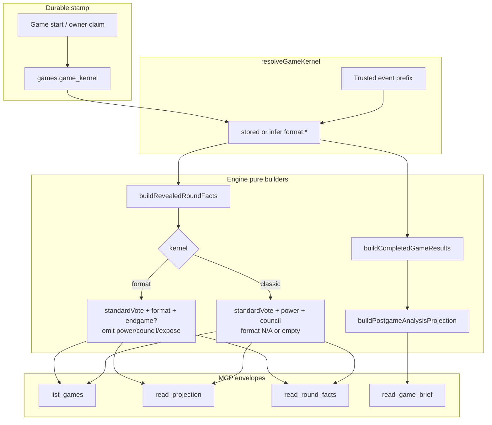

# feat: Format-kernel MCP readability

## Summary

Make producer/MCP reads **kernel-aware**: stamp and surface a durable **game kernel** (`classic` | `format`), omit classic Power/Council (and unused expose) on format-kernel round facts, fix format boots and storytelling in completed results + postgame brief, and add first-class endgame stage facts so analysts do not event-spelunk. Classic corpus games keep their existing shape.

---

## Problem Frame

Format-kernel games already complete on the new spine, but reader surfaces still look like unfinished classic games: Power/Council stay `not_yet_resolved`, expose targets are always null, round summaries ignore `format.eliminated`, endgame has no round-facts section, and the brief is classic-cohort framed. Related agent-surface handoff work (`docs/plans/2026-07-24-001-feat-format-kernel-agent-surfaces-handoff-plan.md`) does not fix producer readability.

**Scope posture (origin):** agent prompt packing and ruleset versioning are out. Producer/MCP read surfaces and small writer-side legibility fixes (false `tied`, jury ledger consistency) are in.

---

## Requirements

Plan R-IDs are local. **Always cite origin R-IDs in parentheses.** Units must list both (e.g. `plan R5 (origin R6–R7)`).

| Plan | Origin |
|------|--------|
| R1 | R1, R19 |
| R2 | R2, R5 |
| R3 | R3 |
| R4 | R4 |
| R5 | R6–R7, R10–R11 |
| R6 | R8 |
| R7 | R9, R20 |
| R8 | R12–R13 |
| R9 | R14 |
| R10 | R15–R18, R21 |
| R11 | R22 |
| R12 | R23 |
| R13 | R24 |

**Game kernel identity**

- R1. List, projection, **round facts**, and postgame brief present a durable **game kernel** value. (origin R1, R19; round facts is a plan expansion for dual-shape consumers)
- R2. Kernel values at least `classic` and `format`; label is mode, not round-format id. (origin R2, R5)
- R3. New durable runs stamp kernel at run start from the spine in force (today: `format` for default machine). (origin R3)
- R4. Missing historical kernel resolves via on-read inference: format evidence ⇒ `format`, else `classic`. (origin R4)

**Dual fact shapes**

- R5. Format-kernel standard-round facts include empower (+ re-vote) and format resolution details; omit Power and Council as present reader fields. (origin R6–R7, R10–R11)
- R6. Format-kernel standard-vote ledgers omit unused expose fields (no null `exposeTarget` noise). (origin R8)
- R7. Classic-kernel facts keep Power/Council (and expose when dual-ballot) legible. (origin R9, R20)

**Endgame + brief**

- R8. Endgame stages are first-class on round facts (stage, alive, votes, eliminated, progression / jury). (origin R12–R13)
- R9. Known continuity such as `lastEmpoweredFromRegularRounds` is populated when accepted board facts know it. (origin R14)
- R10. Format-kernel brief tells empower chain, format picks/boots, endgame path, finalists, jury; not classic Power/Council framing when those systems did not run. Analyst recovers the main arc without knowing internal event-type aliases. (origin R15–R18, R21)
- R11. Dual shapes are intentional; MCP tool descriptions say so at product level. (origin R22)

**Legibility cleanups**

- R12. Clear format resolution must not surface a multi-player `tied` set as if unresolved. (origin R23)
- R13. Jury membership vs vote ledger consistency on completed Judgment (every eligible juror has a vote or explicit non-vote reason). (origin R24)

---

## Key Technical Decisions

- **KTD1 — Nullable `games.game_kernel` column (not config-only).** First-class text column with check (`classic` | `format` | NULL). **NULL means unstamped history** — never DEFAULT historical rows to `classic` (that would break inference for completed format games). Stamp only new creates. (synthesis + feasibility)

- **KTD2 — Shared `resolveGameKernel` helper (engine-pure).** Inputs: stored column (`string | null`) + trusted event prefix. Rule: non-null stored ⇒ stored; NULL ⇒ format evidence (`format.menu_offered` / `selected` / `resolved`) ⇒ `format`, else `classic`. Output: `{ kernel, source: "stored" | "inferred" }`. **Only** inference implementation; builders receive resolved kernel or call this helper — no forks.

- **KTD3 — Omit via absent keys, not placeholder status.** For kernel `format`, builders return round-fact objects **without** `power` / `council` properties (and without expose ledger fields). Do not emit `not_yet_resolved` / `not_applicable` Power/Council. Classic keeps today’s keys. TypeScript may use a discriminated union or optional fields that serialization omits when undefined.

- **KTD4 — Endgame as a sibling section on round facts.** Add optional `endgame` (or equivalent) section built from `endgame.*` / jury events for that round/stage. Do not overload `format` or classic `council` for Reckoning/Tribunal/Judgment.

- **KTD5 — Engine builders first, MCP thin.** Fix pure builders in `packages/engine` (`revealed-round-facts`, `completed-game-results`, `postgame-analysis`), then wire API MCP envelopes. Board truth remains event-log only (see CONCEPTS match-read lanes).

- **KTD6 — Thin format postgame adapters only.** Use `format.eliminated` / format resolution for round headlines, eliminated, boot method/source. Do **not** redesign cohort/momentum systems this pass; classic-only metrics may stay null/low-confidence on format games rather than inventing fake council cohorts. (origin deferred cohorts)

- **KTD7 — Historical inference on-read; no mandatory backfill.** Optional later migration can write inferred values into `game_kernel`; not required for P0.

- **KTD8 — False `tied` reader-normalize required.** If `eliminated` is set and `tied` is only that eliminated player (sole-auto noise), emit `tied: []`. After multi-way break with tiebreaker, keep multi-id pre-break `tied` as history. Writer cleanup optional for new events only; historical corpus depends on reader normalize.

- **KTD9 — Format elimination source on completed results.** Extend elimination source with `format` (map `format.resolved` → method from format id + resolution kind). Do not leave format boots as bare `player_eliminated` with null method.

- **KTD10 — Dual-shape is a compile-wide vertical slice.** Omitting `power`/`council` keys updates every in-repo reader in the same change set (`postgame-analysis.ts`, `house-highlights-trailer-manifest.ts`, tests). Not a single-file type change.

- **KTD11 — Jury eligibility = active jury window.** Same rule as `getActiveJury` / last N jurors. Early boots outside the window get explicit reason `eliminated_too_early` (not treated as missing votes).

---

## High-Level Technical Design

**Read chain (unchanged authority):** trusted events → projection replay → revealed facts / completed results → postgame DTOs → MCP. Transcript and cognition never repair board facts.

---

## Scope Boundaries

**In scope**

- Game kernel column, stamp, on-read inference
- Dual round-facts shapes + endgame section
- Format elim source/headlines in completed results + postgame brief
- MCP list/projection/brief/round_facts envelopes and tool description copy
- False tied + jury ledger consistency when they block trust
- Paired classic + format tests

**Deferred to Follow-Up Work**

- Agent prompt / rules containment and full ruleset versioning
- New gamemodes (werewolf/mafia) beyond kernel extensibility
- Deep postgame cohort redesign for format ballots
- Web watch UI polish (`docs/format-kernel-web-contract-drift.md`)
- `inspect_durable_run` passport noise
- Strategy packet freshness on jury actions
- Mandatory DB backfill of historical `game_kernel`

**Outside this product’s identity**

- Single rigid JSON that keeps empty Power/Council forever
- One kernel value per format card
- Claiming crash-safe resume as part of this work

---

## Implementation Units

### U1. Durable game kernel stamp and resolve helper

- **Goal:** Persist and resolve `classic` | `format` for every game consumers read.
- **Requirements:** plan R1–R4 (origin R1–R5, R19)
- **Dependencies:** none
- **Files:**
  - `packages/api/src/db/schema.ts` (and migration)
  - game create / start path under `packages/api/src/services/` (e.g. lifecycle / durable run claim)
  - `packages/engine/src/` pure helper for `resolveGameKernel` (engine-owned so builders share one inference path)
  - `packages/api/src/game-mcp/read-model.ts` (identity + list + projection + round-facts/brief envelopes pass stored column into resolve)
  - tests: `packages/api/src/__tests__/game-projection-read-model.test.ts`, engine unit tests for resolve helper
- **Approach:**
  - Add nullable `game_kernel` with check; **no** default fill of historical rows.
  - Stamp `format` via `currentCaptureVersionFields()` (or sibling) at **every** `games` insert site (custom routes, free-queue, admin, seeds/tests)—not only lifecycle claim.
  - `resolveGameKernel` is the **only** inference implementation (see KTD2).
  - Surface kernel on list identity, projection summary, round-facts envelope, and brief envelope (piggyback existing list event loads).
  - Origin AE4 classic-stamp leg: defer until a classic start path exists; only format stamp is enforced today.
- **Patterns to follow:** capture-version columns on `games`; pure helpers with no MCP side effects.
- **Test scenarios:**
  - New game stamp returns `format` without reading events.
  - Stored `classic` wins even if events empty.
  - Null/missing stored + format events ⇒ inferred `format`, source `inferred`.
  - Null/missing stored + classic-only events ⇒ `classic`.
  - List/projection/round-facts/brief envelopes include kernel for stamped and inferred paths.
- **Verification:** Unit tests green; envelopes show kernel at read-model layer.

---

### U2. Format-kernel round facts: omit classic sections

- **Goal:** Format-kernel standard rounds present empower + format only; classic unchanged; kill null expose noise and false ties.
- **Requirements:** plan R5–R7, R12 (origin R6–R11, R20, R23)
- **Dependencies:** U1 (`resolveGameKernel` + stored column passed in)
- **Files:**
  - `packages/engine/src/revealed-round-facts.ts`
  - `packages/engine/src/formats/*` and/or format resolution event writer (for tied set)
  - `packages/engine/src/__tests__/revealed-round-facts.test.ts`
  - `packages/engine/src/__tests__/format-kernel-integration.test.ts` (if assertions lock `not_yet_resolved`)
- **Approach:**
  - Pass resolved kernel into `buildRevealedRoundFacts` (caller uses U1 helper only — no second inference path).
  - For `format`: build `standardVote` without expose fields; build `format`; **do not attach** `power`/`council` keys; suppress classic “not yet resolved” diagnostics for those systems.
  - For `classic`: keep current power/council behavior; format may remain empty/not_yet_resolved when no format events.
  - Reader-normalize `tied` per KTD8; preserve multi-way post-tiebreak history fixtures.
  - Update all known power/council consumers in the same PR (KTD10); inventory via repo search before claiming done.
- **Execution note:** Flip existing format tests that **assert** power/council `not_yet_resolved` to assert **absence** of those keys (characterization-first on those tests).
- **Patterns to follow:** sealed ballot access modes already in this file; do not change sealed scope.
- **Test scenarios:**
  - Covers AE1. Format Safety Bounce round: empower + bounce facts present; no `power`/`council` keys; no `exposeTarget` on ledger rows.
  - Covers AE2. Classic complete round: power action + council elimination still present and available.
  - Sole-auto format elim: `tied` empty (not single-player fake tie).
  - Clear + multi-way tiebreak fixture: multi-id pre-break `tied` retained with tiebreaker set.
  - Format in-progress (menu only): format status available/in progress; still no power/council keys on format kernel.
- **Verification:** `revealed-round-facts` tests pass; no regression on classic fixtures.

---

### U3. Endgame section on round facts

- **Goal:** Reckoning / Tribunal / Judgment readable via round facts without raw event filters.
- **Requirements:** plan R8–R9 (origin R12–R14)
- **Dependencies:** U1 (share omit rules with U2 when both land; not a hard prerequisite)
- **Files:**
  - `packages/engine/src/revealed-round-facts.ts`
  - `packages/engine/src/game-projection.ts` / share helpers with `completed-game-results.ts` endgame grouping
  - `packages/engine/src/__tests__/revealed-round-facts.test.ts`
  - MCP path already calls builder — envelope docs in U5
- **Approach:**
  - When round has `endgame.stage_set` or endgame elimination / jury activity, populate an `endgame` section: stage, alive/eliminated, elim ledger when resolved, eliminated, jury votes when Judgment, `lastEmpoweredFromRegularRounds` when known, **and progression** (next stage id, or winner when Judgment resolves).
  - Reuse the same event queries / field names as completed-results endgame grouping where practical.
  - For format-kernel endgame rounds, **always omit** power/council keys (KTD3).
- **Patterns to follow:** projection endgame tallies; completed-game-results `groupEndgameEliminations` — no transcript invention.
- **Test scenarios:**
  - Covers AE3 (partial). F4 Reckoning: stage + vote ledger + eliminated + next stage progression.
  - Tribunal F3: stage + elim ledger + eliminated + progression.
  - Judgment: jury votes + winner; lastEmpowered when stage_set carried it.
  - Standard format round without endgame: no endgame section; no classic-noise diagnostics.
- **Verification:** Endgame fixture built from format-kernel integration event sequences; AE3 path works with brief once U4 lands.

---

### U4. Completed results + postgame brief format arc

- **Goal:** Brief answers “who won and how” for format-kernel games; classic brief unchanged.
- **Requirements:** plan R10, R13 (origin R15–R18, R21, R24); origin AE3
- **Dependencies:** U2 (format eliminated on round facts), U1 (kernel on brief envelope)
- **Files:**
  - `packages/engine/src/completed-game-results.ts`
  - `packages/engine/src/postgame-analysis.ts`
  - `packages/engine/src/postgame-media/house-highlights-trailer-manifest.ts` (optional-aware power/council access)
  - `packages/api/src/services/postgame-analysis.ts` (compact brief if needed)
  - `packages/engine/src/__tests__/completed-game-results.test.ts`
  - `packages/engine/src/__tests__/postgame-analysis.test.ts`
  - `packages/api/src/__tests__/postgame-analysis.test.ts` (if present)
- **Approach:**
  - Extend elimination source with `format` per KTD9; map `format.resolved` to method (format id + resolution kind).
  - `buildRoundSummary`: elimination and headlines from format when kernel is format; null-safe classic fields when omitted.
  - Executive summary: empower chain, format picks/boots, endgame sequence, finalists, jury — not “no expose votes” / Council language as the primary story on format games.
  - Attach kernel to brief structured envelope.
  - Jury consistency per KTD11 (active jury window + `eliminated_too_early` for others).
- **Patterns to follow:** postgame remains deterministic over canonical events; no transcript backfill.
- **Test scenarios:**
  - Covers AE3. Full format-kernel game fixture: brief alone yields winner, finalists, per-round format boots, endgame order, jury total.
  - Classic `edge-smoke-dusk` (or existing classic fixture): classic brief non-regression (plan R10 / origin R17).
  - Format round summary includes selected format id and elim method; eliminationOrder entries use source `format` with non-null method.
  - Jury: active jurors match vote ledger or explicit non-vote; early boots show `eliminated_too_early`, not silent absence.
- **Verification:** Engine postgame tests green; optional MCP brief smoke if API tests cover compact brief.

---

### U5. MCP contracts, tool copy, dual-kernel API tests

- **Goal:** MCP consumers see kernel and dual shapes; tool descriptions stop teaching format games as unfinished classic.
- **Requirements:** plan R1, R11 (origin R1, R19, R22); origin F1–F2
- **Dependencies:** U1–U4
- **Files:**
  - `packages/api/src/game-mcp/server.ts` (tool descriptions for `list_games`, `read_projection`, `read_round_facts`, `read_game_brief`)
  - `packages/api/src/game-mcp/read-model.ts`
  - `docs/game-mcp-production-oauth.md` (format surface wording: omit vs not_yet_resolved)
  - `packages/api/src/__tests__/production-game-mcp-read-model.test.ts`
  - `packages/api/src/__tests__/production-game-mcp-server.test.ts`
- **Approach:**
  - Ensure envelopes pass through kernel + dual shapes from builders (including kernel on round facts).
  - Update descriptions: format-kernel rounds omit Power/Council; classic includes them; sealed ballot rules unchanged.
  - Align production OAuth/MCP docs with CONCEPTS omit language.
- **Test scenarios:**
  - Read-model integration: format fixture round facts omit power/council and include kernel; classic fixture includes power/council.
  - Brief envelope includes kernel.
  - List games entries include kernel for stamped and inferred cases.
- **Verification:** API package tests for MCP read-model/server; docs mention dual shapes.

---

## Acceptance Examples

From origin, enforced by units above:

- AE1 → U1 + U2 (kernel + omit/shape)
- AE2 → U2, U4 classic fixtures
- AE3 → U3 + U4
- AE4 → U1 format stamp only (classic stamp deferred until classic start exists)
- AE5 → U1

---

## Risks & Dependencies

| Risk | Mitigation |
|------|------------|
| Typed MCP clients break when `power`/`council` disappear | Document dual shapes; kernel field first; optional keys are intentional (origin R22) |
| Classic regression in postgame | Keep classic fixtures mandatory in U4; no shared “always format” code path without branch |
| Format integration fixtures heavy | Reuse event sequences from `format-kernel-integration` tests rather than full LLM runs |
| Parallel agent-surface handoff plan | Do not block on agent prompts; coordinate only if both touch MCP rules copy — prefer this plan own producer read-model wording |
| Jury product rule ambiguous | Investigate first; if early boots are intentionally non-voting, emit explicit reason rather than silent omit |

**Upstream dependency:** Format-kernel board events already on branch (`format.*`, projection `formatMenu`). This plan does not re-implement gameplay.

---

## Documentation Plan

- Update `docs/game-mcp-production-oauth.md` format-kernel reader wording (omit Power/Council).
- CONCEPTS already defines game kernel / omit semantics (from brainstorm); only refine if field names differ.
- Do not rewrite agent prompt packs in this plan (deferred).

---

## Open Questions

### Deferred to implementation

- Exact TypeScript discriminated-union vs optional-field typing for dual shapes (serialization must omit keys either way).
- Optional writer-side tied cleanup for new `format.resolved` events (reader normalize is required regardless).

### Not blocking

- Optional historical backfill SQL for `game_kernel`.
- Future kernel values (`werewolf`, `mafia`) — ensure column/check allows additive values without rename.

---

## Sources & Research

- Origin: `docs/brainstorms/2026-07-24-format-kernel-mcp-readability-requirements.md`
- Gameplay: `docs/brainstorms/2026-07-23-sequester-format-kernel-requirements.md`
- Sibling handoff (out of scope for agents): `docs/plans/2026-07-24-001-feat-format-kernel-agent-surfaces-handoff-plan.md`
- Builders: `packages/engine/src/revealed-round-facts.ts`, `completed-game-results.ts`, `postgame-analysis.ts`, `game-projection.ts`
- MCP: `packages/api/src/game-mcp/read-model.ts`, `server.ts`
- Schema: `packages/api/src/db/schema.ts` (`games` capture-version precedents)
- Learnings: match-read lanes in `CONCEPTS.md`; production MCP role split; owner-scoped alliance read models (board facts stay public)
- Operator evidence: localhost format-kernel game analysis (`zero-peach-leaf` class gaps)

---

## System-Wide Impact

- **MCP clients / coding agents:** dual shapes; must branch on kernel.
- **Postgres:** new column + migration; no event-log rewrite.
- **Engine public types:** `RevealedRoundFacts` shape change — any in-repo consumer of power/council on format rounds must update (House interviewer already format-aware; search for `.power` / `.council` on round facts).
- **Web:** out of scope; may still lag (known drift doc).
