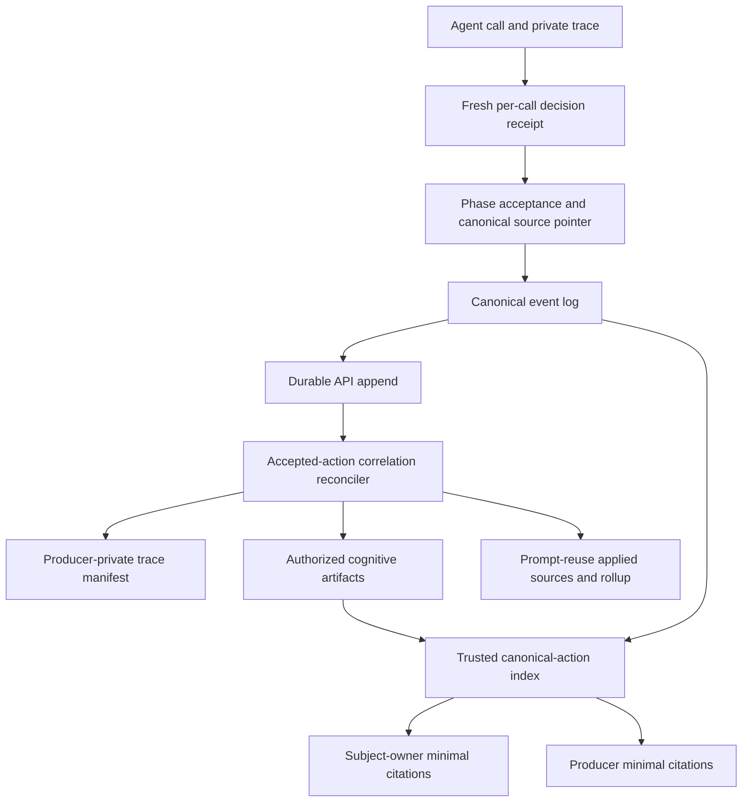
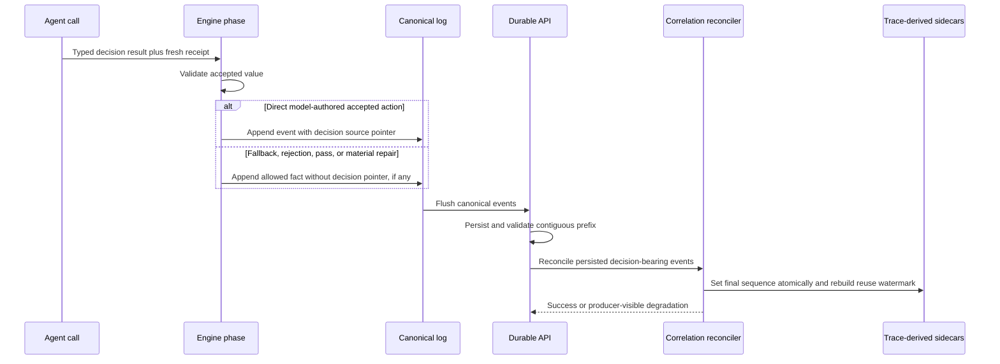
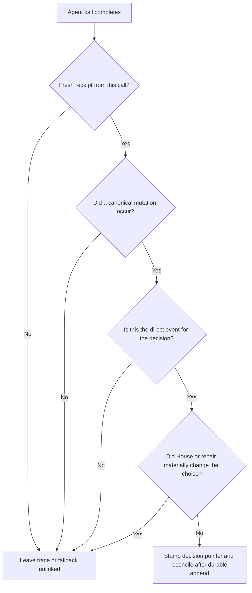

# Accepted Action Trace Correlation - Plan

## Goal Capsule

- **Objective:** Correlate each trace-bearing, agent-authored accepted board action to its exact private decision trace and cognitive artifacts using one `decisionId` and the final durable canonical event sequence.
- **Board authority:** Canonical events remain the sole record of what happened. Private traces, cognition, and prompt-reuse receipts explain a decision but never establish that an action was accepted.
- **Execution profile:** Cross-cutting engine, persistence, producer-read, privacy, and migration work. Implement from fresh per-call decision receipts outward, then add durable reconciliation and read-model exposure.
- **Stop conditions:** Stop rather than guess if a proposed action class has no direct accepted canonical event, if correlation would require reconstructing history from prose, or if a non-producer response would expose another seat's decision identity or sealed action.
- **Tail ownership:** Follow repository PR and validation conventions after all units and the Definition of Done are satisfied.

---

## Product Contract

### Summary

Private decision traces and prompt-reuse receipts are being captured, but their event sequence remains unset because capture occurs before the resulting canonical action is durably appended.
The fix carries an exact per-call decision receipt into the accepted canonical event and reconciles the trace-derived sidecars after persistence.
This makes prompt-cache reuse attributable to exact actions without changing prompt construction, reuse calculations, or board truth.

### Problem Frame

The current branch proves the intended pattern for initial `vote.cast`: `CanonicalSourcePointer` can carry `decisionId`, and match narrative can cite a trusted canonical action.
Coverage stops there.
Other action writers omit the decision ID, private trace manifests are not directly searchable by decision ID, and trace-derived rows retain null or zero event sequences.
Producer diagnostics therefore show captured assets and aggregate reuse while still reporting watermark `0` and no exact event linkage.

The fix must also close two correctness hazards.
First, mutable `getLastPrivateDecisionId()` state can attach a stale trace when a later call falls back or emits no new trace.
Second, player-scoped `filter_events` currently returns complete canonical envelopes; adding decision-bearing source pointers to public format events without sanitization would expose private IDs.

### Actors

- **Engine phase runner:** Accepts or rejects a model decision and appends canonical events in memory.
- **Durable API owner:** Persists the canonical prefix and reconciles producer-private evidence.
- **Producer:** Diagnoses model behavior, private traces, prompt reuse, and accepted actions across the game.
- **Subject owner:** May see minimal action citations only beside cognition already authorized for that subject.
- **Public viewer or other player:** May see canonical public facts but never private decision identity, source pointers, trace metadata, or cross-seat sealed-ballot clues.

### Requirements

**Decision identity and acceptance**

- R1. Each agent result that may create a board action must carry the fresh private decision receipt returned by that exact model call; a prior mutable "last decision" value is not sufficient.
- R2. An accepted canonical event carries `decisionId` only when that exact model decision directly produced the accepted value.
- R3. A timeout, unavailable method, pass, rejected action, House-selected fallback, or material repair that changes the model's choice remains unlinked.
- R4. A normalization that preserves the model's substantive choice may retain the decision receipt; the phase-specific acceptance test owns this distinction.
- R5. Correlation covers direct trace-bearing accepted actions for alliance mutations, initial and empower-revote ballots, format selection and ballots, Safety Bounce pointers, empowered format tiebreaks, power actions, Council votes, endgame elimination votes, Tribunal jury tiebreak votes, and jury votes.
- R6. A decision links only to its direct accepted event, never automatically to downstream tallies, candidate resolutions, eliminations, or round summaries.
- R7. Multiple accepted decisions may cite one canonical resolution event when the domain intentionally aggregates them, such as Tribunal jury tiebreak ballots; the system must not fabricate per-decision canonical events. When one decision emits direct and derived events, its singular sidecar sequence uses the registry's primary direct event, not every copied source pointer.

**Durable correlation**

- R8. Private trace manifests persist a nullable, producer-private `decisionId` suitable for indexed lookup.
- R9. After the canonical append succeeds, forward-path reconciliation stamps the final event sequence on the matching private trace manifest, cognitive artifacts, and prompt-reuse applied source.
- R10. Private trace objects in object storage remain immutable; reconciliation updates relational manifest/index data without rewriting content or invalidating hashes.
- R11. Reconciliation is idempotent, scoped to the game and active owner epoch where applicable, rejects conflicting pre-existing links, and can catch up unresolved current-run rows on a later durable flush, terminal-finalization retry, or explicit internal repair entry point.
- R12. Correlation failure degrades producer diagnostics but does not invalidate, roll back, or suspend an already valid canonical game action.
- R13. No historical backfill is performed. Legacy traces and pre-change events remain honestly unlinked.

**Producer and owner reads**

- R14. Producer trace manifests expose the exact decision ID and event sequence needed to navigate from a private trace to its accepted action.
- R15. Trusted narrative action citations generalize beyond `vote.cast` using only the validated contiguous canonical prefix and exact decision identity plus actor, action, phase, and round agreement.
- R16. Owner narrative exposes only minimal `{sequence, type}` citations beside already-authorized owned cognition; producer narrative may do the same across authorized producer cognition.
- R17. Prompt-reuse aggregates and first-break calculations remain unchanged. Linked accepted actions advance the reuse watermark and are counted separately from intentionally unlinked calls while overall coverage remains truthful.
- R18. Producer diagnostics distinguish accepted actions that are fully linked from missing/degraded linkage; raw unlinked trace count alone is not treated as an error because speech, reflection, intent, rejection, fallback, and legacy rows are expected.

**Privacy**

- R19. Public, subject-player, transcript, watch, results, and ordinary `games:read` responses never serialize `decisionId`, private source pointers, prompt receipts, trace metadata, or another seat's sealed-action existence.
- R20. Actor filtering on player-scoped event reads must not infer matches from private source pointers.
- R21. Engine/API ownership stays clean: engine code emits typed receipts and canonical source pointers; API code owns persistence, reconciliation, authorization, and producer diagnostics.

### Key Flows

- F1. **Accepted action correlation**
  - **Trigger:** A trace-bearing agent result passes phase validation and directly becomes a canonical board action.
  - **Steps:** Capture the current-call receipt, stamp it on the direct canonical event, durably append the event, then reconcile relational trace-derived rows to that final sequence.
  - **Outcome:** Producer trace, cognition, prompt-reuse attribution, and trusted narrative all resolve to the same canonical event without changing board authority.
- F2. **Intentionally unlinked decision**
  - **Trigger:** A call produces speech, reflection, intent, pass, rejection, timeout, House fallback, or a materially repaired value.
  - **Steps:** Persist any available private evidence normally but omit the accepted-action source pointer.
  - **Outcome:** The trace remains inspectable but has no false action citation and does not borrow a stale decision ID.
- F3. **Degraded reconciliation and catch-up**
  - **Trigger:** Canonical persistence succeeds but a sidecar update fails or its trace-derived row is temporarily absent.
  - **Steps:** Keep the canonical action valid, record producer-visible degradation, and retry unresolved current-owner decisions on a later durable flush or final reconciliation pass.
  - **Outcome:** Gameplay continues; diagnostics remain honest; retry is idempotent.
- F4. **Authorized diagnosis**
  - **Trigger:** A producer or subject owner reads narrative, event facts, prompt reuse, or trace manifests.
  - **Steps:** Build citations from the trusted canonical prefix, then apply the existing authority lane before serialization.
  - **Outcome:** Producers can navigate exact evidence; owners see only citations attached to their own authorized cognition; public and other-player reads reveal no correlation identity.

### Acceptance Examples

- AE1. **Accepted power action:** Given a fresh private power decision, when `power.action_set` is durably appended, then its source pointer, matching trace manifest, all cognition rows for that decision, and its prompt-reuse applied source share the same decision ID and final sequence.
- AE2. **Fallback after an earlier call:** Given an agent has a prior decision receipt, when a later format method times out and House selects a fallback, then the resulting canonical event carries no stale prior decision ID.
- AE3. **Sealed ballot privacy:** Given two subject owners and one producer, when one player's format ballot is linked, then that owner may see a minimal citation beside their authorized cognition, the producer may resolve the manifest, and the other owner sees neither the ballot relationship nor the decision identity.
- AE4. **Retry:** Given canonical append succeeds and the first correlation transaction fails, when a later flush retries, then the same event becomes fully linked without duplicating canonical events, narrative citations, or prompt-reuse accounting.
- AE5. **Prompt-cache diagnosis:** Given a run contains accepted actions plus speech-only calls, when the producer reads prompt reuse, then the accepted-action watermark is greater than zero, aggregate reuse values are unchanged, coverage remains `partial`, and counts explain linked versus intentionally unlinked requests.

### Success Criteria

- Every action class in R5 has positive and negative engine coverage for fresh receipt propagation.
- A DB-backed integration test proves one accepted decision yields one final sequence across the canonical event, manifest, cognition, and prompt-reuse source.
- Producer narrative and private trace manifest reads can navigate the same decision in both directions.
- Privacy tests prove the decision sentinel is absent from every non-producer event/transcript/watch/results lane, including player-scoped actor filtering.
- Prompt-reuse watermark advances for linked actions without changing reusable-character, token-estimate, comparability, or first-break totals.
- A transient correlation failure is visible to producers and recoverable without corrupting or suspending gameplay.

### Scope Boundaries

**In scope**

- Forward-path correlation for trace-bearing agent actions already represented by canonical events.
- Official alliance proposal, response, counter, and amendment mutations produced during Mingle; free-form Mingle speech remains outside action correlation.
- Minimal producer/owner narrative citations and producer trace-manifest navigation.
- A nullable manifest schema migration with no data rewrite.

**Outside this fix**

- Historical trace or event backfill.
- Prompt construction, cache-key logic, cache reuse estimation, provider caching behavior, or a new cache dashboard/tool.
- Reconstructing missing decisions from transcript prose, actor/phase/round similarity, or private cognition.
- Treating raw traces or cognitive artifacts as canonical game facts.
- Direct provider-spend event-sequence repair; provider cost entries may continue to resolve through their existing trace-manifest relationship.

### Deferred to Follow-Up Work

- A dedicated action-oriented prompt-cache drilldown endpoint or UI if the existing producer narrative, manifest, and prompt-reuse reads prove too cumbersome in live use.
- Historical linkage tooling, only if a separate product decision accepts inference risk and audit labeling.

### Sources

- `docs/refactor-queue.md` — R13 contract and explicit forward-only boundaries.
- `docs/plans/2026-07-21-002-feat-match-narrative-token-efficiency-plan.md` — prior U5 vote-first design and narrative citation requirements.
- `docs/solutions/architecture-patterns/agent-strategy-observability-spine.md` — canonical, cognition, and transcript authority split.
- `docs/solutions/architecture-patterns/production-mcp-role-resource-split.md` — producer scope and role enforcement.
- `docs/solutions/architecture-patterns/owner-scoped-alliance-read-models.md` — minimal safe references for sensitive relationships.
- `docs/solutions/runtime-errors/production-game-mcp-raw-trace-read-limit.md` — separate manifest linkage proof from bounded raw-content reads.

---

## Planning Contract

### Key Technical Decisions

- KTD1. **Return an explicit current-call receipt on the typed decision result.** The low-level private trace emission already mints the fresh ID; carry that value through private strategic-decision metadata instead of discarding it. Accepted writers never consult mutable `getLastPrivateDecisionId()` state.
- KTD2. **Use canonical source pointers as the pre-append bridge.** The engine stamps the fresh decision ID on the direct accepted event before append; the final event sequence is assigned by the canonical log and becomes linkable only after durable persistence.
- KTD3. **Reconcile after append, never at trace-capture time.** Trace capture necessarily precedes acceptance. API-side reconciliation runs after `appendGameEvents` succeeds and treats the persisted event as the authority.
- KTD4. **Make reconciliation forward-only, idempotent, and non-fatal.** (session-settled: user-approved — chosen over historical backfill or a fatal append transaction: exact future attribution is required, while inferred history and observability-caused game failure are unacceptable.) Reconcile current-owner unresolved rows on each flush, retry before terminal finalization completes, and retain an internal repair entry point over the durable canonical prefix; record degradation instead of reversing a valid game action.
- KTD5. **Add a nullable indexed manifest decision ID.** A dedicated `decision_id` column and `(game_id, owner_epoch, decision_id)` index are simpler and safer than JSON pointer scans. Existing rows remain null.
- KTD6. **Update mutable sidecars together while keeping raw objects immutable.** One reconciliation transaction updates the evidence manifest, cognition rows, and prompt-reuse applied source, then rebuilds the existing reuse rollup watermark. Object-storage trace content and its hash remain unchanged.
- KTD7. **Centralize a typed direct-action registry.** The registry defines event type, canonical actor field, expected trace/agent action vocabulary, and aggregation cardinality. It is shared by reconciliation validation and the trusted narrative index so action coverage cannot drift into two inconsistent lists.
- KTD8. **Allow many decisions to cite one intentional aggregate event.** Format tiebreak maps to `format.resolved`; Tribunal jury tiebreak decisions may share `endgame.elimination_resolved`. The registry must allow this cardinality without inventing events or linking downstream results by default.
- KTD9. **Generalize the trusted-prefix narrative pattern.** Replace the vote-only index with an accepted-action index over validated contiguous events, preserving cursor pins and exact actor/action/phase/round checks. Never derive citations from cognition `eventSequence` alone.
- KTD10. **Harden serialization before exposing new IDs on public event types.** Player/subject DTOs receive sanitized envelopes and actor matching ignores private pointers. Producer-private tools may retain authorized correlation fields.
- KTD11. **Keep prompt reuse semantics stable.** Correlation changes attribution and watermark only. Overall coverage stays `partial` when the run contains intentionally unlinked calls; new counts explain why instead of pretending every trace should map to an event.

### Accepted Action Inventory

| Decision class | Direct canonical event | Correlation rule |
|---|---|---|
| Alliance proposal/response/counter/amendment | Primary direct `alliance.proposal_submitted`, `alliance.response_recorded`, `alliance.counter_submitted`, or `alliance.amendment_resolved` event | Link only when the requested mutation is recorded and no material repair changes its substance; derived activation/cleanup events do not become extra citations |
| Initial empower vote | `vote.cast` | Generalize the existing vote-only implementation to a fresh current-call receipt |
| Empower revote | `vote.empower_revote_cast` | Link the fresh revote decision, never the initial vote receipt |
| Format choice | `format.selected` | Link only a legal model-selected offered format |
| Save-or-Eliminate, Vote Bomb, Safety Bounce ballot | `format.ballot_cast` | Preserve format-specific trace action vocabulary and sealed-ballot authority |
| Safety Bounce pointer | `format.safety_bounce_pointer` | Link only a legal model-selected target/classification transition |
| Empowered format tiebreak | `format.resolved` | Attach the tiebreak receipt to the aggregate resolution event only when a tie required the model choice |
| Power choice | `power.action_set` | Normalize the existing `power` versus `power-action` vocabulary in the registry |
| Council vote | `council.vote_cast` | Link the fresh Council decision for each voter |
| Reckoning/Tribunal elimination vote | `endgame.elimination_vote_cast` | Link each direct voter event |
| Tribunal jury tiebreak | `endgame.elimination_resolved` | Allow multiple juror decisions to cite the one intentional aggregate resolution |
| Jury winner vote | `jury.vote_cast` | Link each fresh juror decision |

Formal speeches, Mingle messages, reflections, strategy intents, alliance passes/rejections, mechanical tallies, candidate resolutions, eliminations, and round summaries are not direct accepted-action correlation targets.

### High-Level Technical Design

#### Component relationships

#### Durable acceptance sequence

#### Correlation eligibility

### Sequencing

1. Establish fresh per-call receipts and the action registry before extending any event writer.
2. Add engine source pointers and positive/negative action tests.
3. Add the nullable manifest schema seam and write-path population.
4. Add post-append reconciliation, retry/degradation behavior, and prompt-reuse attribution.
5. Generalize trusted narrative citations and producer trace reads.
6. Harden every non-producer serialization lane before considering the action inventory complete.
7. Update operator documentation and close R13 only after DB-backed and privacy proofs pass.

### System-Wide Impact

- **Data lifecycle:** A new nullable manifest field and forward-only relational updates create no historical rewrite. Raw trace retention and hashes are unchanged.
- **Reliability:** The canonical append remains the gameplay boundary. Correlation degradation is observable and retryable but not crash-inducing.
- **Privacy:** Public format events are the highest-risk surface because their source pointers become sensitive once decision IDs are added. Sealed ballot and actor-filter paths require explicit negative tests.
- **Agent-native parity:** Existing producer trace, event, prompt-reuse, and narrative reads are sufficient for exact diagnosis; no new workflow-only UI or MCP mutation is required.
- **Operations:** Prompt-reuse watermark becomes meaningful for accepted actions, while `partial` remains the honest overall state.

### Risks and Mitigations

| Risk | Consequence | Mitigation |
|---|---|---|
| Stale mutable decision ID | A fallback or later action is attributed to an unrelated trace | Require fresh per-call receipt and negative timeout/unavailable-method tests |
| Material repair linked as model intent | Producer evidence falsely credits the model for a House-selected value | Central eligibility rule plus phase-specific repair tests |
| Partial sidecar update | Manifest, cognition, narrative, and reuse diagnostics disagree | Transactional sidecar update, conflict checks, flush/terminal/repair retries, and degraded-correlation summary |
| Correlation failure throws through durable sink | Valid gameplay is suspended by an observability problem | Catch correlation errors after successful append, mark degradation, retry current-run unresolved rows |
| Private pointer serialized in a public event | Decision identities and sealed-action relationships leak | Sanitize non-producer envelopes and prohibit pointer-based actor matches |
| Action registry drift | Narrative and persistence disagree about what is linkable | One typed registry with exhaustive tests over all R5 action classes |
| Aggregate resolution cardinality mishandled | Tiebreak decisions are dropped or fake events are invented | Explicit many-to-one registry entries and integration tests |
| Misleading coverage | Operators interpret intentionally unlinked calls as missing data | Separate fully linked accepted actions, degraded accepted actions, and unlinked trace totals |

### Alternatives Considered

- **Stamp `eventSequence` during trace capture:** Rejected because acceptance and final sequence do not exist yet.
- **Rewrite the raw trace object after append:** Rejected because it changes immutable evidence content and invalidates the stored hash.
- **Make correlation part of the canonical append transaction:** Rejected because trace-derived evidence can degrade independently and must not suspend gameplay after a valid append.
- **Infer historical links from actor/phase/round:** Rejected because it creates false certainty and violates the forward-only scope.
- **Add a dedicated cache-debugging endpoint now:** Deferred because existing producer manifest, narrative, event, and prompt-reuse reads can expose the exact relationship once correlation is fixed.

---

## Implementation Units

### U1. Fresh decision receipts and direct accepted-action pointers

- **Goal:** Make every in-scope engine action carry only the receipt produced by the model call that directly authored it.
- **Requirements:** R1-R7, R21; KTD1, KTD2, KTD7, KTD8.
- **Dependencies:** None.
- **Files:**
  - `packages/engine/src/game-runner.types.ts`
  - `packages/engine/src/agent.ts`
  - `packages/engine/src/canonical-events.ts`
  - `packages/engine/src/phases/phase-runner-context.ts`
  - `packages/engine/src/phases/alliances.ts`
  - `packages/engine/src/phases/vote.ts`
  - `packages/engine/src/phases/format-kernel.ts`
  - `packages/engine/src/phases/power.ts`
  - `packages/engine/src/phases/council.ts`
  - `packages/engine/src/phases/endgame.ts`
  - `packages/engine/src/game-state.ts`
  - `packages/engine/src/__tests__/canonical-events.test.ts`
  - `packages/engine/src/__tests__/game-engine.test.ts`
  - `packages/engine/src/__tests__/format-kernel-integration.test.ts`
  - `packages/engine/src/__tests__/named-alliances-actions.test.ts`
- **Approach:**
  1. Carry the decision ID returned by private trace emission on the typed private decision result so freshness is explicit and no accepted writer consults mutable "last" state.
  2. Define the accepted-action registry and normalize known action-vocabulary mismatches without changing public action prose.
  3. Thread source pointers through missing `GameState.record*` signatures, including format selection, Safety Bounce pointer, format resolution, and aggregate tiebreak paths.
  4. Apply R3-R4 at each phase acceptance point; do not stamp fallback, pass, rejection, or materially changed repair outcomes.
- **Execution note:** Start with failing engine tests for stale receipt reuse and one representative action from each inventory family before widening the writers.
- **Patterns to follow:** Existing initial `vote.cast` pointer flow in `packages/engine/src/phases/vote.ts`; canonical source-pointer validation in `packages/engine/src/canonical-events.ts`.
- **Test scenarios:**
  - Covers AE1. A fresh power decision produces `power.action_set` with the exact current-call decision ID.
  - Initial vote and empower revote from the same player receive different decision IDs on their respective direct events.
  - Covers AE2. A timed-out or unavailable format method after a prior successful call produces no stale pointer.
  - A model request that completes after the phase timeout may persist its late trace but cannot donate its decision ID to the already accepted House fallback or the next action.
  - Legal format choice, each sealed ballot type, Safety Bounce pointer, and empowered tiebreak stamp the correct direct event; a no-tie resolution receives no tiebreak pointer.
  - Accepted alliance proposal/response/counter/amendment mutations link; pass, rejected roster, closed-lineage action, and materially repaired membership remain unlinked.
  - Council, endgame elimination, and jury votes link their direct events.
  - Multiple Tribunal jury tiebreak decisions may point to one `endgame.elimination_resolved` sequence without creating new canonical event types.
  - Speech, reflection, intent, mechanical tally, elimination, and round-result events never inherit a decision pointer.
- **Verification:** The engine action inventory has exhaustive positive and negative pointer assertions, with no reliance on stale `getLastPrivateDecisionId()` reads at accepted writers.

### U2. Searchable private trace manifest identity

- **Goal:** Persist the decision ID on producer-private trace manifests without rewriting historical rows or raw objects.
- **Requirements:** R8, R10, R13, R14; KTD5, KTD6.
- **Dependencies:** U1.
- **Files:**
  - `packages/api/src/db/schema.ts`
  - `packages/api/drizzle/0048_accepted_action_trace_correlation.sql`
  - `packages/api/drizzle/meta/_journal.json`
  - `packages/api/drizzle/meta/0048_snapshot.json`
  - `packages/api/src/services/game-evidence.ts`
  - `packages/api/src/services/private-trace-writer.ts`
  - `packages/api/src/services/private-trace-read-model.ts`
  - `packages/api/src/__tests__/db.test.ts`
  - `packages/api/src/__tests__/private-trace-writer.test.ts`
  - `packages/api/src/__tests__/production-game-mcp-read-model.test.ts`
- **Approach:**
  1. Add nullable `decision_id` and a game/owner/decision lookup index to evidence manifests.
  2. Populate it only for newly written private decision traces and include it in producer manifest index entries.
  3. Keep source pointer and metadata summaries bounded; raw prompt/response content and object hashes do not change.
- **Patterns to follow:** Nullable forward-path `decisionId` on `game_cognitive_artifacts`; existing Drizzle migration and private-trace manifest read patterns.
- **Test scenarios:**
  - A new trace with a decision ID persists and returns that ID through the producer manifest index.
  - A trace without a decision ID remains valid with a null manifest column.
  - Existing manifest fixtures and legacy rows remain readable after migration with no backfill.
  - Raw object body, SHA-256, storage key, retention, and access scope are unchanged by relational identity storage.
  - Non-producer routes cannot access the new manifest field because manifest tools retain producer scope plus role enforcement.
- **Verification:** Schema, migration, writer, and producer read-model tests prove indexed forward identity with zero historical or object-storage mutation.

### U3. Durable post-append reconciliation and prompt-reuse attribution

- **Goal:** Stamp the exact final event sequence across trace-derived relational sidecars after canonical persistence and recover safely from degradation.
- **Requirements:** R9-R13, R17-R18; KTD3-KTD8, KTD11.
- **Dependencies:** U1, U2.
- **Files:**
  - `packages/api/src/services/accepted-action-correlation.ts`
  - `packages/api/src/services/game-events.ts`
  - `packages/api/src/services/game-lifecycle.ts`
  - `packages/api/src/services/prompt-reuse-accounting.ts`
  - `packages/api/src/services/game-durable-run.ts`
  - `packages/api/src/__tests__/accepted-action-correlation.test.ts`
  - `packages/api/src/__tests__/game-lifecycle.test.ts`
  - `packages/api/src/__tests__/cognitive-artifact-writer.test.ts`
  - `packages/api/src/__tests__/game-durable-run.test.ts`
  - `packages/api/src/services/prompt-reuse-accounting.test.ts`
- **Approach:**
  1. Extract decision-bearing direct events only after `appendGameEvents` validates and commits the canonical prefix.
  2. In one idempotent transaction, set the matching manifest, cognition, and prompt-reuse source sequences when null/zero or already equal; refuse conflicting nonzero assignments.
  3. Rebuild the existing prompt-reuse rollup from applied sources so its aggregate values stay stable and its watermark reflects linked accepted actions.
  4. Retry unresolved current-owner decisions on subsequent flushes, before terminal finalization completes, and through an internal repair operation over the durable canonical prefix; mark correlation degradation without throwing through valid gameplay.
  5. Extend durable producer diagnostics with accepted-action linkage counts rather than treating every unlinked trace as missing. Distinguish a decision whose expected private capture degraded from a correlation conflict.
- **Patterns to follow:** Idempotent duplicate handling in `packages/api/src/services/game-events.ts`; aggregate rebuild in `packages/api/src/services/prompt-reuse-accounting.ts`; evidence degradation handling in `packages/api/src/services/game-evidence.ts`.
- **Test scenarios:**
  - Covers AE1. One persisted decision-bearing event updates all matching manifest, cognition, and prompt-reuse rows to the same sequence.
  - Covers AE4. Repeating reconciliation makes no duplicate rows, refs, or accounting changes.
  - A conflicting pre-existing sequence is refused and reported without changing the canonical event.
  - Current owner-epoch rows update; rows for another game, another owner epoch, or legacy null decision identity do not.
  - A missing manifest or cognition row creates a private-capture degradation diagnostic, while a conflicting row creates a correlation degradation diagnostic; in both cases the canonical append and game status remain valid.
  - A later durable flush repairs a previously failed or temporarily incomplete current-run linkage.
  - The terminal winner append still receives the final reconciliation pass before its early return.
  - Covers AE5. Linked actions advance watermark; request count, comparable count, reusable totals, and first-break counts remain identical; coverage stays `partial` when unlinked calls exist.
- **Verification:** DB-backed tests prove exact, idempotent, retryable, non-fatal linkage and stable prompt-reuse aggregates.

### U4. Trusted multi-action narrative and producer navigation

- **Goal:** Resolve authorized cognition and trace manifests to every trusted direct accepted action in the inventory.
- **Requirements:** R14-R18; KTD7-KTD9, KTD11.
- **Dependencies:** U1, U3.
- **Files:**
  - `packages/api/src/services/match-narrative-canonical-actions.ts`
  - `packages/api/src/services/match-narrative-read-model.ts`
  - `packages/api/src/services/match-read-cursor.ts`
  - `packages/api/src/services/match-narrative-compact-v2.ts`
  - `packages/api/src/services/private-trace-read-model.ts`
  - `packages/api/src/__tests__/match-narrative-canonical-actions.test.ts`
  - `packages/api/src/__tests__/match-narrative-read-model.test.ts`
  - `packages/api/src/__tests__/production-game-mcp-read-model.test.ts`
- **Approach:**
  1. Generalize the vote-only trusted index through the shared direct-action registry and event-specific actor extraction.
  2. Preserve contiguous-prefix validation, cursor pinning, cognition-required attachment, and exact decision/actor/action/phase/round agreement.
  3. Emit only minimal action citations through narrative and exact decision/sequence fields through producer-private manifests; never serialize canonical payloads or pointers into narrative groups.
  4. Expose accepted-action linked/degraded counts beside prompt reuse and durable-run summaries so operators can distinguish data arrival from intentional non-linkage.
- **Patterns to follow:** Existing `buildTrustedVoteCastIndex` and `attachTrustedRelatedActionRefs`; compact-v2 `actions` encoding.
- **Test scenarios:**
  - Each action-registry event type produces a trusted citation for matching authorized cognition.
  - An action mismatch, actor mismatch, phase/round mismatch, malformed pointer, untrusted tail event, or event beyond the cursor pin produces no citation.
  - Many decision IDs may cite one allowed aggregate resolution sequence, deduplicated per narrative group.
  - An alliance acceptance that also emits derived activation provenance cites only `alliance.response_recorded`; it does not duplicate the citation for `alliance.activated`.
  - Dialogue-only, speech-only, reflection-only, fallback, rejected, and legacy unlinked groups have no action citation.
  - Producer trace manifest and producer narrative return the same decision ID/event sequence relationship without returning payload targets or raw source pointers.
  - Covers AE5. Producer summaries explain linked accepted actions separately from unlinked trace totals.
- **Verification:** Read-model tests cover the complete registry and retain trusted-prefix, pagination, and minimal-response invariants.

### U5. Privacy and authority-lane hardening

- **Goal:** Prevent new decision-bearing pointers from leaking through public, player, owner, transcript, watch, or results surfaces.
- **Requirements:** R16, R19-R21; KTD9-KTD10.
- **Dependencies:** U1, U4.
- **Files:**
  - `packages/api/src/game-mcp/read-model.ts`
  - `packages/api/src/game-mcp/contracts.ts`
  - `packages/api/src/__tests__/production-game-mcp-read-model.test.ts`
  - `packages/api/src/__tests__/production-game-mcp-server.test.ts`
  - `packages/api/src/__tests__/games-api.test.ts`
  - `packages/api/src/__tests__/websocket.test.ts`
  - `packages/api/src/__tests__/match-narrative-read-model.test.ts`
- **Approach:**
  1. Serialize sanitized canonical envelopes for subject/player visibility rather than returning stored envelopes with source pointers intact.
  2. Prevent subject/player actor filtering and `matchSources` from consulting private source pointers.
  3. Preserve producer-only event inspection where authorized, while keeping owner narrative citations minimal and cognition-gated.
  4. Add one recognizable decision sentinel across all negative serialization tests to catch nested or accidental leakage.
- **Patterns to follow:** Existing producer scope-plus-role enforcement and narrative contract bans on `sourcePointers`, payload targets, and voter IDs.
- **Test scenarios:**
  - Covers AE3. A sealed format ballot citation is visible only to its subject owner and producer; another participant receives no existence, actor, target, or identity clue.
  - Public `format.selected`, `format.safety_bounce_pointer`, and `format.resolved` facts remain visible while their source-pointer decision sentinel is absent.
  - Player-scoped actor filtering cannot match an actor found only in a private source pointer and emits no pointer-derived `matchSources`.
  - Public watch payloads, transcript DTOs, completed results, postgame reads, and ordinary `games:read` responses contain no decision sentinel, private pointer, trace field, or prompt receipt.
  - Producer manifest and producer narrative access still require both `producer` scope and current producer role.
- **Verification:** Cross-surface negative tests prove non-enumeration and sealed-action privacy without removing authorized producer diagnosis.

### U6. Documentation and operational proof

- **Goal:** Make the new correlation semantics legible to operators and keep project contracts current.
- **Requirements:** R12-R13, R17-R21.
- **Dependencies:** U3-U5.
- **Files:**
  - `docs/reasoning-transcript-observability.md`
  - `docs/local-model-evaluation.md`
  - `DEVELOPMENT.md`
  - `packages/engine/src/simulate.ts`
  - `docs/refactor-queue.md`
- **Approach:**
  1. Document direct accepted-action eligibility, intentional unlinked classes, forward-only behavior, and the canonical-versus-cognition authority boundary.
  2. Explain prompt-reuse watermark and coverage semantics with an operator recipe that checks manifests and linkage before bounded raw trace reads.
  3. Update simulation JSDoc and relevant local evaluation examples for any changed trace/action receipt surface.
  4. Mark R13 complete only after implementation and all required proof lands; keep adjacent cache dashboard and historical backfill work deferred.
- **Patterns to follow:** Current observability-spine and local-model evaluation documentation; R13 queue format.
- **Test scenarios:**
  - Test expectation: none — this unit documents already-tested behavior and updates the work queue after the implementation proofs pass.
- **Verification:** Documentation matches the shipped action inventory, privacy matrix, failure semantics, and producer read shapes; no new domain term requires a `CONCEPTS.md` addition.

---

## Verification Contract

| Gate | Scope | Done signal |
|---|---|---|
| Focused engine tests | `bun test` over the U1 engine test files | Every direct action class has fresh-ID positive coverage and fallback/rejection/stale-ID negative coverage |
| Focused API persistence tests | `bun test` over accepted-action correlation, lifecycle, trace, cognition, durable-run, and prompt-reuse test files | Exact cross-row sequence, retry, conflict, owner scoping, degradation, and stable aggregates pass against Postgres |
| Focused read/privacy tests | `bun test` over narrative, Production Game MCP, games API, and WebSocket test files | Trusted citations work and the decision sentinel is absent from every non-producer lane |
| Repository fast baseline | `bun run test` | Full test suite passes |
| Repository broad baseline | `bun run check` | Types, lint, tests, and repository validation pass |
| Runtime producer proof | Run one local API-backed game with trace capture through vote, format, power, and Council | Producer manifests, cognition, prompt reuse, narrative, and canonical events agree on representative decision IDs and sequences; intentionally unlinked calls remain explainable |

Runtime proof must inspect manifest/index data first, then read only bounded representative raw traces.
It must also verify that prompt reuse aggregate totals match the pre-correlation calculation while linked-action watermark and counts become nonzero.

---

## Definition of Done

- U1-U6 are complete in dependency order, with no launch-blocking open question.
- The complete accepted-action registry is implemented and tested; the prior vote-only special case no longer defines coverage.
- Fresh per-call receipts prevent stale attribution across timeout, fallback, unavailable-method, pass, rejection, and material-repair paths.
- A persisted accepted action resolves to one exact final sequence across canonical event, trace manifest, cognition, prompt-reuse source, and authorized narrative citation.
- Reconciliation is idempotent, retryable, current-run scoped, conflict-aware, and non-fatal to canonical gameplay.
- Prompt-reuse aggregate math is unchanged; watermark and linked/degraded counts are useful and coverage remains honest.
- Public/player/owner authority tests prove no decision identity, source pointer, sealed-action side channel, trace metadata, or prompt receipt leaks.
- Schema migration is nullable and forward-only; no historical rows or raw trace objects are rewritten.
- Observability and local-evaluation documentation describe the shipped behavior, and R13 is closed only after runtime proof.
- `bun run test` and `bun run check` pass.
- Dead-end helpers, duplicate action maps, temporary diagnostics, and abandoned experimental code are removed from the final diff.
