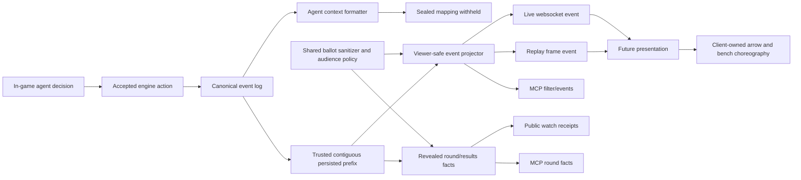

# Event-Driven Format Replay Cleanup - Plan

## Goal Capsule

Make the viewer-facing round decisions named in R13 reconstructable from structured events across engine, public watch, replay, and MCP without deriving facts from transcript prose. Publish complete sanitized format-ballot ledgers to every game viewer and MCP reader, preserve sealed-ballot redaction inside agent context, and leave the full format web presentation for a later pass.

Authority order:

1. The Product Contract and session-settled decisions in this plan.
2. Current canonical-event, trusted-prefix, and dual-kernel repository patterns.
3. Existing classic behavior where this plan explicitly preserves compatibility.
4. Legacy transcript parsers only inside their named grandfathered web paths.

Stop and surface a blocker only if current persisted events cannot reconstruct a required accepted decision, or if preserving a classic corpus replay requires expanding prose parsing. Do not invent transcript-derived repair, ballot disclosure timing, or presentation events to work around either condition.

Execution profile: cross-package code change spanning engine, API/MCP, websocket/replay delivery, low-level web contracts, tests, and documentation. Full format UI rendering is deferred. The implementing run owns focused tests, the repository checks, and an operator-ready manual acceptance recipe; the user owns the final real-game viewing judgment.

## Product Contract

### Summary

Influence is an event-driven game. Canonical events and projections own accepted board facts; transcripts remain displayable dialogue and observability. This pass closes the remaining contract gaps by making viewer-safe decision events available live and in replay, making sanitized format ballots ordinary viewer/MCP facts with no timing gate, and preparing shared classic/format data shapes without building the new format UI.

### Problem Frame

Safety Bounce already records its starter, each accepted pointer, and its resolution as ordered canonical events. Public live delivery drops those events, while replay frames preserve only an event type and projected player state. A future web implementation therefore cannot reconstruct the bench, current picker, or safe/vulnerable pools without reaching for transcript prose.

Format ballot reads encode a rejected owner-protection policy: public viewers receive no voter mapping, owners receive only their own ballot, and producers receive the full ledger. Public watch, completed results, and MCP inherit that policy even though voter, target, and polarity are game-result facts for viewers.

The web package also hand-copies stale classic-only data types and contains historical prose parsers for classic vote, Power, and Council presentation. Those parsers remain a compatibility exception; extending them to format-kernel games would deepen the wrong architecture.

### Actors

- A1. Anonymous viewer — watches a live game or replay and may inspect all sanitized accepted game facts.
- A2. MCP game reader — any caller already authorized for the game through `games:read` or producer access.
- A3. In-game agent — receives the game facts allowed by agent context, with sealed voter mappings withheld.
- A4. Producer — receives the same sanitized game facts plus separate privileged provenance and cognition tools when authorized.
- A5. Future web presenter — consumes typed event/fact contracts and owns animation timing, staging, and dramatic reveal choreography.

### Requirements

#### Event authority and Safety Bounce

- R1. As a repository-wide invariant, authoritative game state, accepted decisions, tallies, eligibility, phase transitions, result facts, and replay choreography must derive from structured game data, never transcript prose; this pass publishes only the viewer decision families named in R13.
- R2. Raw transcripts may be rendered, searched, filtered, styled, quoted, and displayed as dialogue or observability.
- R3. The existing classic parsers in `message-parsing.ts` and their current consumers are frozen compatibility exceptions; no new parser and no extension of an existing parser may handle format-kernel behavior.
- R4. An ordered structured Safety Bounce sequence must reconstruct every accepted decision prefix: starter, current actor, accepted target, target classification, remaining bench, safe pool, and vulnerable pool.
- R5. Canonical sequence is the decision order. Arrow cycling, easing, pauses, bench translation, and pool-transition timing belong to the client and must not become domain events.
- R6. Safety Bounce completion must distinguish a final sealed ballot from sole-vulnerable auto-elimination, including the latter’s intentional absence of ballot rows.

#### Ballot facts and audience boundaries

- R7. Every accepted format ballot must appear in a complete sanitized voter-to-target ledger, including `polarity` for Save-or-Eliminate and `null` polarity for Vote Bomb or Safety Bounce.
- R8. The ledger is a viewer/game-read fact as soon as the ballot is durably recorded. No resolution-time, phase-time, or other temporal disclosure gate may be added.
- R9. Anonymous public watch, subject owners, peer owners, non-seat spectators with game access, and producers must receive the same sanitized format ledger. Existing game-access authorization remains unchanged.
- R10. Viewer/MCP ballot facts must exclude cognition, reasoning, decision logs, raw source pointers, accepted-action identifiers, trace metadata, and raw private envelopes.
- R11. In-game agent context must continue to omit sealed voter-to-target and polarity mappings. This is a direct engine context rule, not an MCP mitigation or agent-revision workflow.

#### Live, replay, MCP, and dual-kernel contracts

- R12. Live websocket delivery and persisted replay must expose the same ordered, typed viewer decision-event contract for the same trusted canonical prefix.
- R13. The viewer decision-event contract must cover the existing classic empower/expose, Power, and Council decisions plus format menu, selection, ballots, Safety Bounce, and resolution.
- R14. Shared API/web facts must intentionally distinguish classic and format shapes: classic keeps expose, Power, and Council; format keeps empower without fabricated expose and adds format facts.
- R15. A format-kernel consumer must not route authoritative state through any legacy prose parser.
- R16. MCP `read_round_facts` and public/player `filter_events` reads must support the complete sanitized format lifecycle, including historical persisted ballot envelopes written under the old producer visibility; producer `filter_events` retains its raw provenance behavior.
- R17. A pre-existing classic game must remain replayable through the current web model and readable through MCP with expose, Power, and Council intact.
- R18. The full Safety Bounce, Save-or-Eliminate, and Vote Bomb web presentation remains deferred; this pass may update shared types, adapters, models, and characterization tests only.

#### Documentation and enforcement

- R19. `AGENTS.md` must state the event-driven authority rule, the allowed transcript uses, the forbidden prose-derived uses, and the exact grandfathered legacy exception.
- R20. Domain, MCP, observability, and web-drift documentation must describe the new viewer ballot contract and must not call transcript prose canonical game state.

### Key Flows

- F1. Safety Bounce live/replay — the starter event establishes the first safe actor; each subsequent pointer advances the accepted target into the center, classifies that target, and updates the remaining bench and pools; resolution closes the sequence. The client may animate between these facts without inventing a choice.
- F2. Viewer ballot inspection — once a format ballot is durably appended, public watch and every authorized MCP reader can inspect its sanitized voter, target, and polarity. Producers may separately inspect provenance; agents still receive only their sealed-ballot context.
- F3. Classic compatibility — a persisted classic event log rebuilds expose, Power, Council, completed results, and replay state. Existing classic prose presentation may continue through the frozen exception, but the canonical/MCP path stays event-derived.
- F4. Format compatibility — a format log supplies menu, selection, full ballots, Safety Bounce pointers when applicable, resolution, and completed results to MCP and low-level web types without invoking a prose parser.

### Acceptance Examples

- AE1. Given a Safety Bounce starter and three pointer events, replaying each canonical prefix identifies exactly one current actor, each already classified player, and every unclassified bench player. The final pools match `format.resolved`.
- AE2. Given a sole-vulnerable Safety Bounce, public and MCP facts report an auto-elimination with an intentionally empty ballot ledger rather than a missing-data diagnostic.
- AE3. Given two durably recorded Save-or-Eliminate ballots and no `format.resolved` event, an anonymous watch receipt, an owner MCP read, a spectator MCP read, and a producer MCP read return the same two sanitized ledger rows.
- AE4. Given an accepted format ballot with private source pointers, public live, replay, watch, completed-results, and `games:read` responses contain the ballot choice but none of the private provenance fields.
- AE5. Given multiple peer format ballots, rendered in-game agent context names no voters, targets, or polarities from those ballots before or after resolution.
- AE6. Given `edge-smoke-dusk`, the persisted classic fixture still yields classic empower/expose, Power, Council, completed-results, MCP, and replay-watch facts.
- AE7. Given a format fixture and adversarial transcript wording that resembles a classic vote line, no format fact or replay state changes because of that prose.

### Success Criteria

- Every viewer-facing format decision required for future presentation is typed and reconstructable from the trusted canonical prefix.
- Public watch and all MCP authority lanes agree on the complete sanitized format ledger with no temporal gate.
- Live and replay event payloads have parity and preserve canonical order.
- Classic event-derived and grandfathered presentation paths retain their current accepted behavior.
- Repository tests and checks pass, followed by a clear manual classic web/MCP acceptance recipe.

### Scope Boundaries

In scope:

- Structured viewer event DTOs and pure sanitization/projection.
- Safety Bounce prefix reconstruction and delivery.
- Uniform viewer/MCP format ballot ledgers.
- MCP format lifecycle parity.
- Additive live/replay contracts.
- Shared classic/format web/API type cleanup.
- Legacy parser quarantine, documentation, and regression tests.
- Classic and format persisted compatibility fixtures.

Deferred:

- Safety Bounce bench, center-player, arrow, safe-pool, and vulnerable-pool components.
- Save-or-Eliminate and Vote Bomb presentation.
- Full completed-results visual redesign.
- Animation timing, sound cues, and reveal pacing.
- Removal or replacement of existing classic prose parsers.

Out of scope:

- A ballot resolution-time disclosure gate.
- An MCP-to-agent injection subsystem.
- Event rows for arrow motion, pauses, easing, or roulette candidates.
- Historical event-log rewrites or mandatory data migrations.
- New active-match MCP actions.

### Dependencies

- The format kernel and canonical `format.*` events already implemented on `feat/sequester-format-kernel`.
- Trusted persisted event-prefix validation in `packages/api/src/services/game-event-read-model.ts`.
- Existing classic fixture `packages/engine/src/fixtures/edge-smoke-dusk.ts`.

### Sources

- `packages/engine/src/canonical-events.ts`
- `packages/engine/src/game-state.ts`
- `packages/engine/src/phases/format-kernel.ts`
- `packages/engine/src/revealed-round-facts.ts`
- `packages/engine/src/context-builder.ts`
- `packages/api/src/services/game-lifecycle.ts`
- `packages/api/src/services/game-watch-state.ts`
- `packages/api/src/services/ws-manager.ts`
- `packages/api/src/game-mcp/read-model.ts`
- `packages/web/src/app/games/[slug]/components/message-parsing.ts`
- `docs/solutions/architecture-patterns/agent-strategy-observability-spine.md`
- `docs/solutions/architecture-patterns/production-mcp-role-resource-split.md`
- `docs/solutions/architecture-patterns/owner-scoped-alliance-read-models.md`

## Planning Contract

### Key Technical Decisions

- KTD1. Project canonical events into a narrow viewer-safe discriminated union rather than publishing raw envelopes. The projection keeps canonical sequence, timestamp, round, phase, type, and allowlisted game payload; it strips `sourcePointers` and private evidence. Raw envelope visibility and sanitized viewer-fact visibility are different concerns.

- KTD2. Keep the existing Safety Bounce event vocabulary. (session-settled: user-directed — chosen over prose or presentation snapshots: ordered structured accepted decisions are the required replay source.) `format.safety_bounce_started`, ordered `format.safety_bounce_pointer`, roster projection, and `format.resolved` already contain the required facts. Add a domain field or event only if a prefix reconstruction test proves a concrete missing fact.

- KTD3. Make the sanitized format ledger uniform across viewer and MCP reads with no timing condition. (session-settled: user-directed — chosen over owner scoping and resolution-time release: ballot choices are viewer facts, and temporal gates add rejected complexity.) Remove the owner-only filtering policy from revealed facts and MCP assembly.

- KTD4. Preserve sealed-ballot redaction in `ContextBuilder` by event type. (session-settled: user-directed — chosen over coupling agent knowledge to viewer/MCP visibility: sealed mappings remain private only to agents in the game.) Do not add agent revisions, MCP ingestion controls, or other unrelated machinery.

- KTD5. Publish live viewer events immediately after the durable append succeeds and in canonical sequence order. This is persistence ordering, not a ballot disclosure gate. Replay serializes the same trusted event prefix through the same pure viewer projection.

- KTD6. Historical producer-marked `format.ballot_cast` rows remain immutable. Viewer read models explicitly project their sanitized payloads, so old games gain the corrected viewer/MCP behavior without rewriting hashes, row metadata, or envelopes.

- KTD7. Keep a dual-kernel type contract instead of making every field optional. Classic facts retain expose, Power, and Council. Format facts omit expose from empower-only rows, omit Power/Council, and require the format section. Prefer engine-owned exported types over hand-copied web interfaces.

- KTD8. Version live/replay additions additively. Replay frames gain the viewer decision event while older frame versions remain readable; websocket clients ignore the new discriminated message until they adopt it. The same trusted viewer-event read remains available for in-progress games with an optional sequence cursor so late joiners and reconnecting clients can fill gaps before consuming newer websocket events. Do not change existing transcript or watch-state messages to carry hidden payloads.

- KTD9. Freeze the existing classic parser island. (session-settled: user-approved — chosen over removing the legacy parsers in this pass: classic corpus presentation compatibility is required, while new format parsing is forbidden.) Document the exception beside `message-parsing.ts`, keep its current classic tests, and add a negative format-routing assertion.

- KTD10. Use one sanitized viewer-event projector for event-shaped surfaces: public/player MCP event filtering, websocket delivery, and replay frames. Revealed round facts and completed results remain canonical-event-derived aggregate builders; they share the ballot sanitizer and audience policy but do not consume the viewer event DTO. Producer event filtering keeps the existing raw-envelope and source-pointer path.

### High-Level Technical Design



Safety Bounce prefix reducer:

1. Start from the canonical roster for the round.
2. Apply `format.safety_bounce_started`: place the starter in SAFE and make the starter current actor.
3. Apply each pointer in sequence: verify its actor is current, classify its target, remove the target from the bench, and make the target current actor.
4. Compare the reconstructed pools and optional final ballot against `format.resolved`.
5. On a gap or invalid transition, return structured diagnostics or degraded availability. Never repair from transcript text.

### System-Wide Impact

- Engine — revealed format facts lose owner/producer ballot filtering; viewer event types and Safety Bounce reconstruction become reusable public contracts; agent context keeps sealed placeholders.
- API/MCP — `read_round_facts`, `filter_events`, public watch, completed results, and tool descriptions adopt uniform sanitized ballots. Existing game-access authorization and producer trace tools do not change.
- Persistence — no schema migration or historical event rewrite. Trusted hashes and metadata remain untouched.
- Live observation — websocket gains a typed viewer decision event emitted only after its source event is durable.
- Replay — frames carry enough structured event data to drive future format staging while preserving current projected player snapshots.
- Web — shared types become dual-kernel and completed-results expose handling becomes presence-driven. Existing classic parser consumers remain.
- Agent behavior — no new prompt, tool, action, MCP capability, or revision workflow. A regression test protects current sealed-format context.

### Risks and Mitigations

| Risk | Mitigation |
|---|---|
| Raw event publication leaks private accepted-action provenance | Use an allowlisted viewer projector and assert absence of raw source pointers, private decision identifiers, cognition, reasoning, and trace metadata on every public surface. |
| Live and replay render different Safety Bounce chains | Serialize both through the same pure projector and compare outputs for the same canonical prefix. |
| Old producer-marked ballot events remain hidden | Project viewer facts by allowlisted event type rather than relying solely on persisted envelope visibility. |
| Shared types become optional-field mush | Use a kernel or presence discriminant and engine-owned types; keep classic and format requirements explicit. |
| Existing classic web presentation breaks | Reuse `edge-smoke-dusk`, preserve current parser tests, and run persisted API/MCP/replay characterization before format adapter changes. |
| Format prose accidentally enters the legacy parser path | Add negative routing tests and forbid new format strings in `isParseableStructuredMsg`. |
| Safety Bounce reducer silently accepts corrupted order | Validate actor continuity, unique classification, roster membership, and final pool parity; degrade on failure. |
| Publishing after every durable batch creates duplicate client facts | Return the newly inserted event subset from durable append and broadcast only that subset; clients also key facts by game id plus canonical sequence. |

### Sequencing

1. Establish policy, characterization fixtures, and the shared viewer projection.
2. Replace ballot access filtering while preserving agent-context redaction.
3. Wire the shared projection to replay and post-durable live delivery.
4. Update dual-kernel web/API types and quarantine the legacy parser island.
5. Run cross-surface compatibility and documentation closure.

## Implementation Units

### U1. Codify event authority and the viewer decision contract

- Goal: establish the rule and one reusable structured viewer projection before changing consumers.
- Requirements: R1–R6, R10, R13, R19–R20; F1
- Dependencies: none
- Files:
  - `AGENTS.md`
  - `CONCEPTS.md`
  - `packages/engine/src/canonical-events.ts`
  - new or existing viewer projection module under `packages/engine/src/`
  - `packages/engine/src/revealed-round-facts.ts`
  - `packages/engine/src/__tests__/canonical-events.test.ts`
  - `packages/engine/src/__tests__/revealed-round-facts.test.ts`
- Approach:
  - Add the precise event-driven/transcript boundary to `AGENTS.md` and reconcile `CONCEPTS.md` language that currently calls transcript the canonical record.
  - Define the allowlisted viewer decision-event union and a pure projector over canonical events per KTD1 and KTD10.
  - Include classic vote/Power/Council and all format lifecycle variants required by R13.
  - Implement or extract a Safety Bounce prefix reducer over roster plus ordered events. Reuse current round-fact logic rather than duplicate pool rules.
  - Keep canonical source pointers on raw events only.
- Test scenarios:
  - AE1: every Safety Bounce prefix yields the expected actor, bench, SAFE pool, and VULNERABLE pool.
  - Invalid actor continuity, duplicate target classification, missing roster player, and event gaps produce diagnostics instead of inferred repair.
  - Sole-vulnerable completion satisfies AE2.
  - Viewer projection contains the accepted payload and sequence but no private pointer sentinel.
- Verification:
  - Engine tests demonstrate deterministic prefix reconstruction and exact viewer projection shape.
  - Documentation names the legacy exception without broadening it.

### U2. Make sanitized format ballots ordinary viewer and MCP facts

- Goal: remove owner-only ballot filtering and expose the same complete ledger on every authorized viewer/read surface.
- Requirements: R7–R11, R16; F2; AE3–AE5
- Dependencies: U1 viewer projection
- Files:
  - `packages/engine/src/game-state.ts`
  - `packages/engine/src/revealed-round-facts.ts`
  - `packages/engine/src/completed-game-results.ts`
  - `packages/engine/src/context-builder.ts`
  - `packages/engine/src/__tests__/revealed-round-facts.test.ts`
  - `packages/engine/src/__tests__/completed-game-results.test.ts`
  - context-builder tests under `packages/engine/src/__tests__/`
  - `packages/api/src/game-mcp/read-model.ts`
  - `packages/api/src/game-mcp/server.ts`
  - `packages/api/src/services/public-watch-intelligence.ts`
  - `packages/api/src/__tests__/production-game-mcp-read-model.test.ts`
  - `packages/api/src/__tests__/production-game-mcp-server.test.ts`
  - `packages/api/src/__tests__/public-watch-intelligence.test.ts`
- Approach:
  - Remove `resolveFormatBallotAccess` and owner-player filtering from the revealed-facts path.
  - Emit the full sanitized ledger by default for trusted accepted ballot events, including pre-resolution prefixes.
  - Preserve any serialized compatibility marker only with truthful public-ledger semantics; do not retain behaviorally active owner/producer modes.
  - Use the viewer projection for public/player `filter_events` so historical producer-marked format ballots become inspectable without exposing raw envelopes.
  - Preserve producer `filter_events` as the raw-envelope path with source pointers and provenance-aware actor matching; producers may request either visibility shape through the existing mode.
  - Keep `ContextBuilder`’s type-specific sealed placeholder and add a direct regression test.
  - Update MCP descriptions so they stop promising owner-only ballots.
- Test scenarios:
  - AE3 across anonymous public watch, owner, peer owner, non-seat spectator, and producer.
  - Save-or-Eliminate polarity and Vote Bomb/Safety Bounce null polarity serialize consistently.
  - A pre-resolution trusted prefix exposes accepted ballots with no timing condition.
  - AE4 excludes source pointers, private decision ids, thinking, reasoning context, and trace fields.
  - Public/player event filtering returns sanitized historical ballot choices while producer filtering retains raw source pointers.
  - AE5 verifies agent context never names sealed format voters or targets while outcome/count facts remain available.
- Verification:
  - Engine, public-watch, MCP read-model, and MCP server tests agree on one sanitized ledger.
  - Game-access authorization tests remain unchanged and green.

### U3. Deliver identical structured decisions to live watch and replay

- Goal: make future format presentation possible from structured live and replay data.
- Requirements: R4–R6, R12–R13, R16; F1, F4
- Dependencies: U1, U2
- Files:
  - `packages/api/src/services/game-lifecycle.ts`
  - `packages/api/src/services/game-events.ts`
  - `packages/api/src/services/ws-manager.ts`
  - `packages/api/src/services/game-watch-state.ts`
  - `packages/api/src/routes/games.ts`
  - `packages/api/src/__tests__/game-lifecycle.test.ts`
  - `packages/api/src/__tests__/websocket.test.ts`
  - `packages/api/src/__tests__/game-watch-state.test.ts`
  - `packages/web/src/lib/api.ts`
- Approach:
  - Add an additive websocket message carrying one projected viewer decision event.
  - Make `appendGameEvents` return the newly inserted events or sequences. Project and publish only that returned subset in canonical order, then publish the current watch state.
  - Add the same projected event to a new replay-frame version while retaining old frame parsing.
  - Extend the existing replay/catch-up read to serve trusted viewer events for in-progress games with an optional `afterSequence` cursor. On initial connection or reconnect, the client fills its missing prefix before consuming newer websocket events.
  - Use canonical sequence for ordering and idempotent client identity. Do not use transcript timestamps or text.
  - Include format menu, selection, starter, pointers, ballot facts, and resolution; include the classic decision variants required by R13.
- Test scenarios:
  - A durable batch containing multiple Safety Bounce pointers publishes strictly increasing sequences.
  - Failed durable append publishes no viewer decision event.
  - Retrying an already-persisted idempotent batch publishes no duplicate viewer decision event.
  - A late joiner and a reconnecting client reconstruct the same trusted prefix as a continuously connected viewer.
  - Live event output equals replay output for the same canonical event.
  - Historical producer-marked format ballot rows produce the same sanitized replay event as new rows.
  - Private source-pointer sentinels never enter websocket or replay JSON.
- Verification:
  - API websocket, lifecycle, and replay tests prove durability ordering and live/replay parity.
  - Existing transcript, phase, elimination, game-over, and watch-state websocket tests remain green.

### U4. Prepare intentional classic and format web contracts

- Goal: remove low-level type/model assumptions that would force the future format UI back onto prose parsing.
- Requirements: R13–R15, R18; F3–F4; AE6–AE7
- Dependencies: U1–U3
- Files:
  - `packages/web/src/lib/api.ts`
  - `packages/web/src/app/games/[slug]/components/completed-results-model.ts`
  - `packages/web/src/app/games/[slug]/components/message-parsing.ts`
  - `packages/web/src/app/games/[slug]/components/vote-display.tsx` only for compatibility-safe type adaptation
  - `packages/web/src/__tests__/completed-results-model.test.ts`
  - `packages/web/src/__tests__/message-parsing.test.ts`
  - `packages/web/src/__tests__/match-watch-model.test.ts`
  - `docs/format-kernel-web-contract-drift.md`
- Approach:
  - Replace hand-copied round/result fact shapes with engine-owned type imports where package boundaries allow; otherwise use compile-time parity assertions against the engine types.
  - Add the format phases and viewer decision-event/replay versions to the web transport contract.
  - Make expose-column construction presence-driven so empower-only format rounds do not dereference or manufacture expose data.
  - Document `message-parsing.ts` as the exact grandfathered classic exception. Do not add format patterns or route format events into `isParseableStructuredMsg`.
  - Keep rendering changes surgical; no bench, pool, arrow, or new format result component.
- Test scenarios:
  - Classic completed results retain empower and expose columns.
  - Format completed results accept empower-only and format facts without an expose column or crash.
  - The web transport accepts the new replay/live viewer event union.
  - AE7 proves format-like transcript text cannot create format state.
  - Existing classic parser snapshots remain unchanged.
- Verification:
  - Web unit tests and type checking pass with no new transcript parser.
  - The drift document distinguishes completed low-level contract work from deferred presentation.

### U5. Prove classic compatibility and full format MCP support

- Goal: close the pass with persisted cross-surface evidence rather than type-level optimism.
- Requirements: R12–R18, R20; F2–F4; AE4, AE6
- Dependencies: U1–U4
- Files:
  - `packages/engine/src/fixtures/edge-smoke-dusk.ts`
  - persisted fixture helpers under `packages/api/src/__tests__/`
  - `packages/api/src/__tests__/production-game-mcp-read-model.test.ts`
  - `packages/api/src/__tests__/game-watch-state.test.ts`
  - `packages/api/src/__tests__/games-api.test.ts`
  - `packages/web/src/__tests__/match-watch-model.test.ts`
  - `docs/reasoning-transcript-observability.md`
  - `docs/game-mcp-production-oauth.md`
  - `docs/rules-page-content.md`
- Approach:
  - Persist `edge-smoke-dusk` through the same event-row seam used by production reads, then exercise MCP round facts/projection, completed results, replay frames, and the current web replay model.
  - Persist format fixtures for Save-or-Eliminate, Vote Bomb, normal Safety Bounce, and sole-vulnerable Safety Bounce; exercise MCP round facts and event filters without transcript-derived facts.
  - Assert public result payloads contain game facts but no cognition or provenance.
  - Update stale docs to distinguish agent-sealed knowledge from viewer/MCP ledger visibility and to describe the live/replay event contract.
  - Produce a concise manual recipe for the user’s final pre-existing classic web and MCP acceptance pass.
- Test scenarios:
  - AE6 end-to-end classic fixture retains expose, Power, Council, replay, and completed-results behavior.
  - Each format fixture exposes menu, selection, full sanitized ballots when present, Safety Bounce sequence when applicable, and resolution through MCP.
  - `filter_events` and `read_round_facts` agree on ballot choices for historical producer-marked rows.
  - Classic parser code is never invoked by a format fixture.
- Verification:
  - Persisted API/MCP/replay integration tests pass for classic and all three launch formats.
  - Documentation and tool descriptions agree with the implemented contract.

## Verification Contract

Focused engine gates:

```bash
bun test packages/engine/src/__tests__/canonical-events.test.ts packages/engine/src/__tests__/revealed-round-facts.test.ts packages/engine/src/__tests__/completed-game-results.test.ts
```

Focused API/MCP/live-replay gates:

```bash
bun test packages/api/src/__tests__/production-game-mcp-read-model.test.ts packages/api/src/__tests__/production-game-mcp-server.test.ts packages/api/src/__tests__/public-watch-intelligence.test.ts packages/api/src/__tests__/game-lifecycle.test.ts packages/api/src/__tests__/websocket.test.ts packages/api/src/__tests__/game-watch-state.test.ts packages/api/src/__tests__/games-api.test.ts
```

Focused web compatibility gates:

```bash
bun test packages/web/src/__tests__/message-parsing.test.ts packages/web/src/__tests__/completed-results-model.test.ts packages/web/src/__tests__/match-watch-model.test.ts
```

Repository gates:

```bash
bun run test
bun run check
```

Behavioral assertions:

- Safety Bounce state at every canonical prefix is deterministic and matches final resolution.
- Public watch and all MCP authority lanes return identical sanitized format ledgers without a resolution gate.
- Agent context contains no sealed format voter mapping.
- Live and replay serialize identical viewer facts for the same event.
- No public payload contains source pointers, decision ids, cognition, or trace metadata.
- Classic replay and MCP retain empower/expose, Power, and Council.
- Format fixtures require no transcript parser.

Manual operator acceptance:

1. Choose a pre-existing classic game with Power, Council, and expose history.
2. Replay it in the current web UI and confirm the accepted classic presentation still works.
3. Inspect the same game through MCP projection, round facts, and event filters.
4. Inspect one game for each launch format through MCP and confirm menu, selection, ballot ledger when applicable, Safety Bounce pointer sequence when applicable, and resolution.
5. Record any remaining issue as either a legacy classic presentation defect or deferred format UI work; do not repair facts from prose.

## Definition of Done

Global:

- R1–R20 and AE1–AE7 are satisfied with automated evidence at their owning seams.
- Existing canonical event hashes and historical rows are not rewritten.
- Full format web presentation remains absent from the diff.
- No new transcript parser, regex, or prose-derived state path exists.
- Focused gates, `bun run test`, and `bun run check` pass.
- The manual operator recipe is ready for the user’s real classic web/MCP acceptance pass.
- Abandoned experiments, duplicate serializers, dead compatibility branches, and unused types are removed.
- Documentation and comments describe the implemented audience contracts without stale owner-only ballot language.

Per unit:

- U1 is done when event authority is documented, the viewer union is allowlisted, and Safety Bounce prefix reconstruction is proven.
- U2 is done when every viewer/MCP lane returns the same sanitized format ledger and agent context still withholds mappings.
- U3 is done when post-durable live events and replay frames share one serializer and pass parity/privacy tests.
- U4 is done when web types/models accept both kernels, classic parsers are explicitly quarantined, and no format parser exists.
- U5 is done when persisted classic and format fixtures pass through MCP/replay/API consumers and the operator acceptance recipe is complete.
