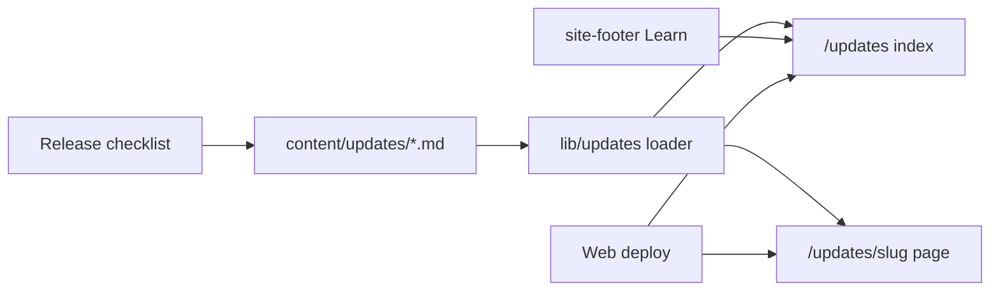

# feat: Public updates release notes surface

## Summary

Ship a public **Updates** surface on `packages/web`: structured markdown posts in the repo (title, date, summary, tags + free body), rendered as `/updates` index and post pages, linked from footer Learn. Publish = web deploy. Launch includes one real seed post and release-checklist guidance for player/builder-visible ships.

---

## Problem Frame

Release notes are written for PR/handoff (`DEVELOPMENT.md`) and never become a public page. Marketing routes are hardcoded TSX with no content collection; footer Learn only links Rules and About. Friends and agent builders lack a single archive of what shipped. (see origin)

---

## Requirements

Plan R-IDs map 1:1 to origin where listed.

**Surface and content**

- R1. Public Updates index and post pages under `/updates` with shareable post URLs. (origin R1)
- R2. One markdown file per post with frontmatter `title`, `date`, `summary`, `tags` and free markdown body. (origin R2)
- R3. Index lists newest first with title, date, summary, tags. (origin R3)
- R4. Post pages render full body in marketing chrome. (origin R4)
- R5. Tags support dual audience; recommended vocabulary documented; no filter UI required. (origin R5)

**Discovery**

- R6. Footer Learn includes Updates peer to Rules and About. (origin R6)
- R7. No homepage chip or contextual strips on `/rules` / `/get-mcp` in this plan. (origin R7)

**Authoring and cadence**

- R8. Player- or builder-visible ships require a public Updates post (human judgment). (origin R8)
- R9. `DEVELOPMENT.md` release process names Updates as the public notes destination for those ships. (origin R9)
- R10. Posts ship in the same change set / web deploy as product changes (no CMS). (origin R10)
- R11. Launch includes ≥1 real seed post. (origin R11)

**Quality and safety**

- R12. Public posts must not present producer-only diagnostics as public product APIs. (origin R12)
- R13. Posts are human-curated; not raw git/PR dumps. (origin R13)
- R14. Invalid post files fail the web build (missing required frontmatter, bad date, duplicate slug). (plan expansion)

---

## Key Technical Decisions

- **KTD1 — Route `/updates`.** Index at `/updates`; posts at `/updates/[slug]`. Matches origin “e.g. `/updates`” and marketing peer naming (About, Rules).

- **KTD2 — Content under `packages/web/content/updates/`.** One file per post; slug = full filename stem without extension (e.g. `2026-07-25-format-kernel.md` → `2026-07-25-format-kernel`). Date-prefixed names stay unique; do not strip the date from the slug.

- **KTD3 — Build-time loader, not CMS / not MDX.** Server-only module parses markdown with `gray-matter`, validates required fields, sorts by ISO `date` descending. Export `loadPostsFromDir(dir)` for tests and production; `getAllPosts()` wraps the production content path. Resolve the content directory relative to the package/module (e.g. `import.meta.dir`), never `join(process.cwd(), "content/updates")` alone — Docker build and runtime workdirs differ. No Contentlayer, no `@next/mdx` unless implementer proves a blocking need.

- **KTD4 — Render body with `react-markdown` (+ optional `remark-gfm`).** Avoid `dangerouslySetInnerHTML` / `rehype-raw` without sanitization. Trusted repo content still stays on the safe path.

- **KTD5 — Fail build on invalid posts.** Every committed `*.md` under the content dir is validated (required fields, ISO date, unique slugs); failures throw so `next build` fails. After validation, `draft: true` posts are excluded from public lists and static params only — drafts still must be valid if present.

- **KTD6 — Marketing shell parity.** Reuse About/Rules layout tokens (`influence-page`, `Nav`, `max-w-3xl`, `influence-phase-title`, `influence-copy`). Style markdown with constrained prose classes consistent with marketing, not admin UI.

- **KTD7 — Publish = web deploy.** Posts appear when the web app image/deploy that includes the built static routes ships. API-only deploys do not publish notes. Release checklist must note that player/builder-visible ships that need public notes also need a web content touch (or same monorepo deploy that builds web).

- **KTD8 — Recommended tags (soft set).** Document in release checklist / short authoring blurb: `watch`, `play`, `rules`, `mcp`, `seasons`, `product`. Free-form tags allowed; no hard enum in code for v1.

- **KTD9 — Seed post is rewritten, not pasted.** Migrate a real recent public-safe ship into curated frontmatter + body; strip producer-only language. Choose a recent player- or MCP-visible change from the active product line (format kernel / public surfaces) when drafting.

- **KTD10 — Fully static Updates routes (no runtime content read).** Prefer build-only content: `export const dynamic = "force-static"` on index and post pages; `generateStaticParams` + `dynamicParams = false`. Verify `next build` prerenders `/updates` so the standalone runtime image (which does **not** copy `content/` — only standalone + static + public) never needs the markdown tree. Do not rely on “Dockerfile already copies content into the build stage” alone. Hard-require Next 16 async `params`: `params: Promise<{ slug: string }>` and `await params` on the post page and `generateMetadata`, matching other dynamic routes in the app.

---

## High-Level Technical Design



Author writes markdown → loader validates at build → pages render → footer discovers.

---

## Output Structure

```text
packages/web/
  content/updates/
    YYYY-MM-DD-seed-slug.md
  src/lib/updates.ts          # or updates/*.ts
  src/app/updates/page.tsx
  src/app/updates/[slug]/page.tsx
  src/__tests__/updates-*.test.ts
  src/components/site-footer.tsx   # modify
  src/__tests__/site-footer.test.ts # modify
DEVELOPMENT.md                     # modify release notes steps
```

---

## Implementation Units

### U1. Updates content loader and validation

- **Goal:** Load, validate, and list typed posts from repo markdown.
- **Requirements:** R2, R3 (sort), R5 (tags shape), R14; supports R10–R11, R13
- **Dependencies:** None
- **Files:**
  - Create: `packages/web/content/updates/` (may start with fixture-only until U4 seed)
  - Create: `packages/web/src/lib/updates.ts` (or `packages/web/src/lib/updates/*.ts`)
  - Create: `packages/web/src/__tests__/updates-loader.test.ts`
  - Modify: `packages/web/package.json` (add `gray-matter`, `react-markdown`, optional `remark-gfm`)
- **Approach:** Export `loadPostsFromDir(dir)` used by production default path and by tests with temp/fixture dirs. Parse frontmatter; validate required fields and ISO dates; slug = full filename stem; assert unique slugs; after validation, filter `draft: true` from public lists; export `getAllPosts()` and `getPostBySlug(slug)`. Resolve production content path relative to the web package/module, not bare `process.cwd()`. Invalid/collision cases must not write into the real content directory.
- **Patterns to follow:** Server-only data modules; Bun tests in `packages/web/src/__tests__/`.
- **Test scenarios:**
  - Happy path: valid post returns title, date, summary, tags, body, slug.
  - Sort: newer ISO date sorts before older.
  - Invalid: missing title/date/summary/tags throws via `loadPostsFromDir` on fixtures.
  - Draft: valid `draft: true` file excluded from `getAllPosts` public list.
  - Collision: two files resolving to same slug throw.
  - Tags: array of strings preserved.
  - After seed exists: integration load of production content dir returns ≥1 non-draft post with required fields.
- **Verification:** Loader unit tests pass; bad fixture fails as expected.

### U2. Updates index and post pages

- **Goal:** Public marketing pages for the archive and individual posts.
- **Requirements:** R1, R3, R4, R5 (display tags)
- **Dependencies:** U1
- **Files:**
  - Create: `packages/web/src/app/updates/page.tsx`
  - Create: `packages/web/src/app/updates/[slug]/page.tsx`
  - Create: `packages/web/src/__tests__/updates-pages.test.ts` (source/contract tests per marketing pattern)
- **Approach:** Index maps `getAllPosts()` to cards/list rows (title, date, summary, tags) linking to `/updates/[slug]`. Post page loads by slug, `notFound` if missing, renders metadata from frontmatter, body via `react-markdown`. Set `dynamic = "force-static"`, `generateStaticParams`, `dynamicParams = false`. Async `params` Promise pattern required. Match About/Rules shell (`Nav`, page classes). Footer shows on these routes (not watch/replay hide paths).
- **Patterns to follow:** `packages/web/src/app/about/page.tsx`, `packages/web/src/app/privacy/page.tsx`, dynamic routes with `params: Promise<…>`, source-string tests like `privacy-page.test.ts` / `get-mcp-page.test.ts`.
- **Test scenarios:**
  - Covers AE1. Index page source/module references Updates and uses post list fields.
  - Post page exports `generateStaticParams` and `dynamicParams = false` (and `force-static` if asserted via source).
  - Metadata title includes post title or Updates brand.
  - Empty collection after launch is not required to support (seed in U4); if empty, index still renders without crash.
- **Verification:** Page contract tests pass; `next build` prerenders Updates routes (no runtime dependency on content dir).

### U3. Footer Learn link

- **Goal:** Discoverability from the global footer.
- **Requirements:** R6
- **Dependencies:** U2 (route must exist for the href)
- **Files:**
  - Modify: `packages/web/src/components/site-footer.tsx`
  - Modify: `packages/web/src/__tests__/site-footer.test.ts`
- **Approach:** Add `{ label: "Updates", href: "/updates" }` under Learn next to Rules and About. Update exact section equality assertions in footer tests. Confirm footer still hidden only on existing watch/replay exceptions.
- **Patterns to follow:** Existing `SITE_FOOTER_SECTIONS` and `site-footer.test.ts`.
- **Test scenarios:**
  - Covers AE1 discovery. Learn links include Updates → `/updates`.
  - Learn still includes Rules and About.
  - `shouldShowSiteFooter("/updates")` is true if that helper is path-based.
- **Verification:** Footer tests pass.

### U4. Seed post, release checklist, authoring tags

- **Goal:** Non-empty launch archive and process so notes keep shipping.
- **Requirements:** R8–R13, R5 (recommended tags)
- **Dependencies:** U1, U2
- **Files:**
  - Create: `packages/web/content/updates/<seed-filename>.md`
  - Modify: `DEVELOPMENT.md` (Release Process + Pre-Release Checklist notes steps)
  - Optional: short comment block at top of content dir or `packages/web/content/updates/README.md` with frontmatter template + recommended tags (prefer minimal — checklist may be enough)
- **Approach:** Curate one seed post from a real recent player/builder-visible change; public-safe language only. Update release steps that currently say “Post release notes in the relevant PR, GitHub issue, or release handoff” to also require a public Updates post when the ship is player- or builder-visible, with path to content dir and recommended tags. State that pure refactors may skip. State that notes go live with web deploy.
- **Patterns to follow:** Existing DEVELOPMENT.md checklist tone; public-safety norms from get-mcp/homepage producer-string bans (do not paste producer handoffs).
- **Test scenarios:**
  - Covers AE5. At least one non-draft post exists under content/updates after U4.
  - Covers AE6 (seed). Seed body does not contain known producer-only phrase markers if tests already ban similar strings — add a light assertion if there is a stable ban-list pattern; otherwise manual review in PR.
  - DEVELOPMENT.md mentions Updates / content path for public notes.
- **Verification:** Index non-empty via loader; docs updated; seed readable on post page.

---

## Scope Boundaries

**In scope:** Full origin v1 (R1–R13) plus fail-build validation (R14) and soft recommended tags.

**Deferred to follow-up work (origin deferred):**

- Homepage latest-ship chip
- Contextual strips on `/rules`, `/get-mcp`, dashboard, watch
- Tag filter UI
- Discord/social auto-syndication
- `updates.json` / RSS
- Forced dual body sections / three-layer schema
- CMS
- CI gate that fails PRs without a post (process only in v1)
- Season-boundary special content type beyond ordinary posts

**Outside product identity (origin):** Replacing Discord; full marketing CMS; publishing producer private archaeology.

---

## Acceptance Examples

From origin; plan units must cover:

- AE1 — Footer → index with fields → open post (U2, U3)
- AE2 — Valid post file + web deploy surfaces post (U1, U2, KTD7)
- AE3 — Visible ship expects Updates post per checklist (U4)
- AE4 — Dual audience via tags/body on one post (U1, U2, U4 seed tags)
- AE5 — Launch non-empty (U4)
- AE6 — Public-safe curated seed (U4)

---

## Risks & Dependencies

| Risk | Mitigation |
|------|------------|
| New deps (`gray-matter`, `react-markdown`) | Keep minimal; pin in web package only |
| Standalone runtime omits `content/` | Fully static prerender (KTD10); no runtime fs read of markdown |
| Staging shows notes before prod cut | Acceptable; notes are public product history, not secrets |
| Authors skip posts | Checklist only in v1; no CI gate |
| Seed leaks producer detail | Rewrite rule (KTD9); PR review |

---

## Documentation / Operational Notes

- Update `DEVELOPMENT.md` release notes steps (U4).
- No new runbooks. Capture marketing content conventions in `docs/solutions/` after ship if patterns stick (origin learnings gap).

---

## Open Questions

**Deferred to implementation**

- Exact seed topic (which recent ship) and final slug string.
- Whether to add `remark-gfm` for tables/strikethrough (default: add if seed/body needs GFM; else skip).
- Precise Tailwind prose class names vs hand-styled markdown elements.

**None blocking.** Static content strategy is locked in KTD10 (force-static; no runtime content copy).

---

## Sources & Research

- Origin: `docs/brainstorms/2026-07-25-public-updates-release-notes-requirements.md`
- Marketing patterns: `packages/web/src/app/about/page.tsx`, `packages/web/src/components/site-footer.tsx`
- Release process: `DEVELOPMENT.md` (release notes steps ~7 / checklist ~8)
- External: low-dep Next App Router pattern — `gray-matter` + `react-markdown`, `generateStaticParams`, fail-build validation, no early CMS
- Flow analysis: web deploy timing, build-fail on invalid posts, seed rewrite safety
