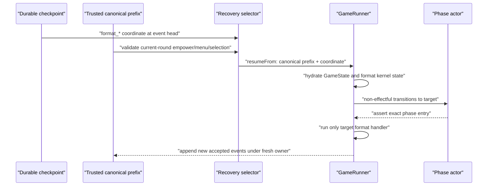

# Format-Kernel Phase-Boundary Startup Recovery - Plan

## Goal Capsule

Enable same-game startup recovery at the four existing format-kernel **phase-entry** checkpoints: `format_menu`, `format_pick`, `format_mingle`, and `format_resolve`.

The slice is deliberately bounded. It reconstructs the minimal live format runtime state from canonical `format.menu_offered` and `format.selected` events, walks the existing phase actor to the requested state without rerunning already-completed handlers, and exercises the real API interruption/recovery path. It does not introduce a schema, checkpoint, or event family; it does not resume an in-flight ballot, Safety Bounce chain, model call, or partial format resolution.

Authority order:

1. The settled product contract in this plan.
2. Canonical events and their projections for accepted game facts and replay state.
3. Existing phase-boundary recovery/owner-epoch invariants.
4. Transcript entries only for their established private Mingle-delivery replay, never as a source of format truth.

Stop and leave the game suspended if the canonical prefix cannot prove the required current-round format state. Do not repair a missing menu, selection, ballot, or Bounce pointer from transcript prose.

This is a focused recovery hardening slice. Player Strategy Thread hydration (R12) and the optional House-continuity passport diagnostic (R16) remain separate high-priority work; successful format recovery must not claim either is fixed.

## Product Contract

### Summary

Format games already create durable checkpoints at the entries to each format phase, but startup recovery rejects all four coordinates even when their canonical prefix is complete. A restart therefore suspends a healthy format game after empower, menu offer, selection, or format Mingle instead of continuing the same game.

The recovery contract must now cover those four *completed-boundary* states. It must restore only the kernel runtime values that the next handler needs, use the persisted event prefix as the sole authority for those values, and preserve the existing fail-closed behavior for incomplete or contradictory evidence.

### Actors

- A1. Operator/API startup — discovers a suspended game, validates its event-head checkpoint, claims a fresh owner epoch, and continues the same game only when the coordinate is implemented.
- A2. In-game agent — resumes at the next format phase with the correct selected rules/format-pressure context, without receiving sealed peer ballot mappings.
- A3. Viewer/MCP reader — sees the same canonical game continue under a new owner epoch; this slice does not change viewer/MCP disclosure policy or add UI.
- A4. Recovery maintainer — can diagnose why a corrupt or genuinely in-flight format run remains suspended rather than trusting a mislabeled checkpoint.

### Requirements

- R1. Startup recovery must accept an event-head `phase_boundary` checkpoint at `format_menu`, `format_pick`, `format_mingle`, or `format_resolve` when its existing snapshot, token, transcript, accumulator, ownership, and canonical-event checks pass.
- R2. `format_menu` recovery must restore the resolved empowered player and enter the menu handler without fabricating an already-offered menu.
- R3. `format_pick` recovery must restore the current-round canonical menu and re-enter the picker with those exact two offered formats; it must not re-roll or duplicate `format.menu_offered`.
- R4. `format_mingle` and `format_resolve` recovery must restore the selected format, selected menu, and deterministic format-pressure projection from the current-round canonical menu/selection pair. The resumed context must match the locked format rather than a stale prior round.
- R5. Actor hydration must use non-effectful existing phase-machine transitions to reach and assert the requested format coordinate; it must not invoke a skipped format handler or manufacture any accepted action.
- R6. Validation must reject inconsistent or out-of-boundary format evidence: missing/duplicate current-round menu where one is required, menu/empowered mismatch, invalid or unoffered selection, missing `FORMAT_MINGLE` room allocation at `format_resolve`, and any fact from a later format handler (ballot, Bounce start/pointer, or resolution) at an earlier target. The game remains suspended with the existing diagnostic path.
- R7. A format checkpoint is still only a phase-entry checkpoint. Interruption during `runFormatPickPhase`, format Mingle, ballot collection, Safety Bounce pointers, or format resolution remains out of scope unless a later complete boundary exists. No partial action capsule is introduced here.
- R8. Structured Mingle-inbox replay must restore only the delivery session that normal execution would retain at the target: Mingle I for `format_menu`/`format_pick`, nothing for `format_mingle` because its handler clears the inbox, and `FORMAT_MINGLE` for `format_resolve`. It is not a source of accepted game facts, tallies, format selection, or choreography.
- R9. Recovery must preserve the existing same-game guarantees: one fresh owner epoch after the interrupted boundary, contiguous canonical sequences, one roster initialization, and normal terminal results/settlement handling.
- R10. Existing classic persisted games remain replayable in the web UI and readable through MCP. This recovery-only change must not route any game through a transcript parser or alter classic presentation compatibility.

### Key Flows

- F1. `format_menu` — the vote handler has resolved the empowered player and checkpointed before menu generation. Recovery rebuilds board state, walks the actor through vote completion, asserts `format_menu`, then emits exactly one new canonical menu through the normal handler.
- F2. `format_pick` — `format.menu_offered` is already durable. Recovery restores its exact pair and empowered owner, asserts `format_pick`, then records one selection through the normal picker; it never offers another menu.
- F3. `format_mingle` — menu and selection are durable. Recovery restores current pressure from them, asserts `format_mingle`, and starts the normal Mingle handler with no inherited inbox because that handler clears and initializes it before creating any context.
- F4. `format_resolve` — menu, selection, completed `FORMAT_MINGLE` room allocation, and only that session's structured delivery records are durable, but no format ballot, Safety Bounce starter/pointer, or resolution handler has begun at this boundary. Recovery asserts `format_resolve` and lets the normal resolver create the first accepted resolution facts.
- F5. Invalid prefix — a malformed format checkpoint fails format-specific prerequisite validation and remains suspended. No transcript parsing, guessed selection, or owner claim repairs the run.

### Acceptance Examples

- AE1. Given a suspended `format_menu` boundary after `vote.empowered_set`, startup recovery resumes the same game and writes one `format.menu_offered` after the checkpoint, not before or twice.
- AE2. Given a suspended `format_pick` boundary with an offered pair, the recovered picker receives that exact pair and the eventual event log has exactly one `format.menu_offered` for the current round.
- AE3. Given a suspended `format_mingle` boundary with a locked Safety Bounce selection, resumed agents receive the canonical selected-format pressure and recover without emitting a second `format.selected`.
- AE4. Given a suspended `format_resolve` boundary with a locked Safety Bounce selection and completed format-Mingle allocation, normal resolution creates one ordered Bounce/resolution sequence after recovery; no pre-checkpoint pointer or ballot is duplicated because none existed at the boundary.
- AE5. Given a `format_resolve` checkpoint after both Mingle I and Format Mingle, resumed ballot/Bounce contexts contain only structured `FORMAT_MINGLE` delivery records; Mingle I messages do not survive into resolution.
- AE6. Given missing, mismatched, or already-resolved current-round format evidence, `getSupportedRecovery` returns a specific non-success reason and `recoverGamesOnStartup` leaves the game suspended.
- AE7. Given a real API-backed interrupted format run at each supported coordinate, post-restart rows retain contiguous sequence numbers, pre-boundary rows retain the original owner, post-boundary rows have exactly one fresh owner, and completed results are written once.
- AE8. Given the pre-existing classic fixture `edge-smoke-dusk`, current web replay and MCP facts remain unchanged; no format recovery code depends on a transcript parser.

### Success Criteria

- All four format phase-entry coordinates report `resumeAvailable: true` only when their canonical prerequisites validate.
- A DB-backed interruption/recovery matrix completes the same game from each format coordinate.
- Current-round menu, selection, and pressure are reconstructed exclusively from canonical events/projection.
- Invalid format evidence remains suspended and explainable.
- Repository validation passes, and the statefulness/solution docs describe the real supported boundary set without claiming mid-action recovery or restored player private memory.

### Scope Boundaries

In scope:

- Recovery selector eligibility and format-specific canonical prerequisite validation.
- `GameRunner` hydration of the current menu, selection, and pressure required at format phase entries.
- Non-effectful XState actor stepping to the four format coordinates.
- DB-backed same-game recovery tests, corrupt-prefix tests, and statefulness documentation correction.

Deferred:

- R12 Player Strategy Thread/private agent memory hydration.
- R16 conditional House Strategy Bible passport diagnostics.
- In-flight or partial-action recovery, including format pick model calls, Mingle turns, sealed ballot collection, Safety Bounce pointer chains, and format resolution.
- Web UI presentation and any replay animation work.

Out of scope:

- New canonical events, database schema, checkpoint payload versions, or event-log rewrites.
- A timeout/reveal gate for sealed ballots or changes to viewer/MCP ballot visibility.
- Transcript-prose parsing for game state, decision flow, tallies, eligibility, phase transitions, or replay choreography.
- Re-enabling retired classic Power/Council recovery coordinates.

### Dependencies

- Existing `format.menu_offered` and `format.selected` canonical events and `GameState.fromCanonicalEvents` projection.
- Existing phase-boundary checkpoints, event-head validation, owner-epoch recovery claim, transcript replay, token cursor, and structured Mingle inbox replay.
- Existing format phase machine and real DB-backed `interruptGameAtBoundary` recovery harness.

### Sources

- `packages/engine/src/game-runner.ts`
- `packages/engine/src/phases/format-kernel.ts`
- `packages/engine/src/game-projection.ts`
- `packages/api/src/services/game-recovery-support.ts`
- `packages/api/src/services/game-recovery.ts`
- `packages/api/src/services/game-lifecycle.ts`
- `packages/api/src/__tests__/game-recovery.test.ts`
- `packages/engine/src/fixtures/edge-smoke-dusk.ts`
- `packages/engine/src/__tests__/postgame-analysis.test.ts`
- `docs/statefulness-plan.md`
- `docs/game-mcp-production-oauth.md`
- `docs/solutions/runtime-errors/api-startup-recovery-resumes-interrupted-games.md`
- `docs/refactor-queue.md`

## Planning Contract

### Key Technical Decisions

- KTD1. Treat the four coordinates as **phase-entry** recovery only. (session-settled: user-directed — chosen over broad mid-action resume: no partial format action needs to be replayed at these existing checkpoints.) The checkpoint following a handler is the entry to the next handler: menu before menu offer, pick after offer, mingle after selection, resolve before resolution.

- KTD2. Rehydrate current-round kernel state from canonical events, not transcript text. (session-settled: user-approved — chosen over parsing prose or synthesizing state: canonical events/projections are the authority.) Use the current round's `format.menu_offered` and, where required, `format.selected`; rebuild `offeredFormats`, `selectedFormat`, `lastSelectedFormat`, and `ContextBuilder.currentFormatPressure` deterministically.

- KTD3. Validate format coherence before owner claim. Menu and selection must belong to the current round, name the currently empowered player, and agree with one another. A current-round `format.resolved` makes a format-entry checkpoint invalid. This preserves fail-closed recovery for corruption without treating normal boundaries as unsupported.

- KTD4. Advance the existing actor with no-effect `PHASE_COMPLETE` transitions and assert each target state. Do not call `runFormatMenuPhase`, `runFormatPickPhase`, `runFormatMinglePhase`, or `runFormatResolvePhase` while stepping over them. The normal main loop calls only the target handler after hydration.

- KTD5. Keep transcript-backed Mingle inbox delivery replay exactly scoped to the delivery session live execution would retain. (session-settled: user-approved — chosen over transcript fact reconstruction: structured sender/recipient/message records may preserve private delivery context, while canonical events alone own game mechanics.) Target-aware replay keeps Mingle I through menu/pick, drops it before format Mingle because the handler clears it, and keeps only Format Mingle through format resolve; it must not derive decisions or authoritative facts from the prose body.

- KTD6. Prove every coordinate through the existing DB/API lifecycle harness, then add narrow unit coverage only where it characterizes pure hydration/validation. (session-settled: user-directed — chosen over type-only confidence: same-game restart is the acceptance bar.) The lifecycle test must force a non-Safety-Bounce selection in Round 1, then select Safety Bounce in Round 2 after anti-repeat guarantees it is offered; do not depend on arbitrary first-menu randomness.

- KTD7. Do not fold R12/R16 into this patch. The current recovery path can truthfully resume board state and mechanical format flow, but it must not claim that fresh `InfluenceAgent` instances recovered private Strategy Thread memory. That larger defect remains tracked separately.

### High-Level Technical Design



Format evidence by boundary:

| Target boundary | Required prior canonical fact | Hydrated runtime state | First resumed effect |
|---|---|---|---|
| `format_menu` | resolved empowered player | prior `lastSelectedFormat` only; no active menu | offer and record one menu |
| `format_pick` | current-round `format.menu_offered` | offered pair and menu pressure | picker records one selection |
| `format_mingle` | current-round menu plus selection | offered pair, selected format, locked pressure | format Mingle begins |
| `format_resolve` | current-round menu plus selection plus `FORMAT_MINGLE` allocation | offered pair, selected format, locked pressure | resolver begins ballots/Bounce/resolution |

### System-Wide Impact

- Engine — expands rehydration from anti-repeat-only `lastSelectedFormat` to the active current-round menu/selection/pressure state, synchronizes that pressure after `ContextBuilder` construction, and permits actor hydration to stop at format phase entries.
- API recovery — removes only the four format coordinates from the deliberate exclusion list and adds canonical-format prerequisites. Owner claim/lifecycle orchestration stays unchanged.
- Persistence — no migration or new event/checkpoint payload. Existing trusted rows and hashes remain immutable.
- Agent context — recovered format picker/Mingle/resolver gets the same event-derived pressure card as a live game. Mingle delivery replay is session-scoped so format resolution cannot inherit stale Mingle I messages; sealed-ballot redaction remains unchanged.
- Watch/MCP/web — no new output contract. Games continue under their normal event/read paths; classic replay compatibility remains untouched.
- Operations — supported recovery becomes more honest for live format games, while player-private memory and passport diagnosis remain visible backlog rather than implied guarantees.

### Risks and Mitigations

| Risk | Mitigation |
|---|---|
| Recovered picker re-rolls a menu | Require and hydrate the one current-round `format.menu_offered`; lifecycle assertion counts menu events. |
| Recovered Mingle/resolve uses stale prior-round selection | Restrict active state reconstruction to the target current round and validate empowered/menu/selection agreement. |
| Recovered format resolve receives Mingle I messages that live execution cleared | Select structured inbox records by target session; assert two-session recovery exposes only `FORMAT_MINGLE` delivery to the resolver. |
| Pressure is reconstructed before the context builder exists | Hydrate kernel state early, then explicitly synchronize its deterministic pressure after constructing `ContextBuilder`; assert picker context carries the offered pair. |
| Actor stepping accidentally performs skipped phase effects | Use only explicit phase-machine completion events during hydration, assert the target, and test absence of duplicate menu/selection facts. |
| Safety Bounce implies partial-chain support | Document and test that `format_resolve` is before the resolver; retain fail-closed behavior for a missing valid boundary after an in-flight action. |
| Corrupt event prefix acquires a new owner | Validate coherence before recovery candidate/owner claim; malformed fixtures stay suspended with reasons. |
| Mechanical format recovery is mistaken for full agent continuity | Keep R12 named in scope boundaries, documentation, and handoff; do not alter agent-memory claims. |
| Legacy presentation is disturbed | Do not touch parser routes or classic DTOs; retain classic fixture/replay/MCP characterization. |

### Sequencing

1. Specify and implement canonical current-round format-state extraction plus runner hydration.
2. Replace the format-coordinate blanket exclusion with exact prerequisites and actor-target support.
3. Promote the real interruption tests, add deterministic Safety Bounce and corrupt-prefix cases, and correct operating documentation.
4. Run focused and repository checks; use the manual acceptance recipe only after the active game is no longer at risk.

## Implementation Units

### U1. Rehydrate and validate active format-kernel state

- Goal: make the runner and selector agree on the minimum current-round canonical evidence required to start each format handler.
- Requirements: R2-R4, R6-R8; F1-F5; AE1-AE5.
- Dependencies: none.
- Files:
  - `packages/engine/src/game-runner.ts`
  - `packages/engine/src/mingle-inbox-replay.ts`
  - `packages/engine/src/game-projection.ts` or a narrowly scoped engine helper if extraction is shared
  - `packages/engine/src/phases/format-kernel.ts` only if its pressure builder needs an exported pure constructor
  - `packages/api/src/services/game-recovery-support.ts`
  - focused engine/API unit test files adjacent to existing recovery/format tests
- Approach:
  - Replace the runner's anti-repeat-only `hydrateFormatKernelStateFromEvents` behavior with target-aware reconstruction of the active current round. Preserve `lastSelectedFormat` for menu anti-repeat, but set active `offeredFormats`, `selectedFormat`, and the same `FormatPressureProjection` that normal menu/pick code would create when the target requires them. Hydrate kernel state before module construction, then explicitly synchronize its pressure to the newly created `ContextBuilder` before the phase actor or target handler can build a context.
  - Use canonical event round and actor IDs (or the canonical projection where that is the existing source), never logger text. Clear active format state for `format_menu`; do not accidentally hydrate a historical resolved menu into endgame or a later round.
  - Extract/centralize a pure format-prefix validator as needed so the API selector and runner use compatible invariants: exactly the required current-round menu/selection shape, empowered identity match, selection in offered pair, the completed format-Mingle allocation needed for resolve, and no facts from a later handler at an earlier format-entry target.
  - Make Mingle-inbox replay target/session-aware without promoting transcript data to format authority. Keep Mingle I delivery for `format_menu`/`format_pick`; permit a blocked inbox to be discarded at `format_mingle` because the normal handler clears it; and include only `FORMAT_MINGLE` delivery at `format_resolve`. Update accumulator validation to recognize that exact target behavior rather than requiring an irrelevant replay payload.
- Test scenarios:
  - Menu-only prefix hydrates exact offered formats and menu pressure for `format_pick`.
  - Menu-plus-selection prefix hydrates exact selected format and locked pressure for `format_mingle`/`format_resolve`.
  - At `format_menu`, exactly zero current-round menu events are valid; for targets that require a menu, missing/duplicate menu, mismatched empowered ID, unoffered selection, wrong round, missing `FORMAT_MINGLE` allocation at resolve, and a ballot/Bounce/resolution beyond the target reject recovery.
  - A recovered format picker receives the canonical offered pair through `formatPressure` after `ContextBuilder` initialization.
  - A same-round Mingle I plus Format Mingle transcript fixture yields only Format Mingle delivery in `format_resolve` contexts; `format_mingle` begins with the normal cleared inbox.
  - Historical selected format continues to drive the next menu anti-repeat but does not masquerade as an active selection.
- Verification:
  - Focused tests demonstrate deterministic state from canonical events and no dependency on transcript prose.
  - Recovery rejection reasons make the distinction between unsupported evidence and corrupt format evidence legible.

### U2. Enable the four phase-entry actor coordinates

- Goal: remove the intentional format-coordinate gap without rerunning any completed format phase.
- Requirements: R1, R5, R7, R9; F1-F4; AE1-AE4.
- Dependencies: U1.
- Files:
  - `packages/api/src/services/game-recovery-support.ts`
  - `packages/engine/src/mingle-inbox-replay.ts`
  - `packages/engine/src/game-runner.ts`
  - `packages/engine/src/game-runner.types.ts` only if a target-aware hydration input must be made explicit
- Approach:
  - Include the four coordinates in `RESUME_SUPPORTED_ACTOR_COORDINATES` and route them through the new canonical prerequisites instead of the current unconditional `unsupported_actor_coordinate` response.
  - In `hydratePhaseActorForResume`, after the existing Vote-to-format transition, assert `format_menu` directly or advance through only the necessary no-effect machine transitions to `format_pick`, `format_mingle`, or `format_resolve`. Each branch must assert the final coordinate before returning.
  - Keep the normal game-loop dispatch unchanged: after hydration it executes exactly the target state's handler. Do not call skipped handlers in the hydration path and do not create a generic mid-phase checkpoint system.
  - Preserve existing recovery candidate selection, checkpoint-at-head requirements, token/transcript/accumulator validation, and fresh-owner claim semantics.
- Test scenarios:
  - Actor hydration reaches each exact format target from a canonical prefix and fails loudly on a mismatched target/evidence pair.
  - A normal `format_menu` recovery emits a new menu once; later targets never re-emit their completed predecessor's canonical decision.
  - Unsupported retired classic coordinates and genuine unsafe accumulators remain unsupported.
- Verification:
  - Focused engine and selector tests establish target state plus no duplicate canonical action behavior.
  - `resumeAvailable` derives from the same selector that startup uses, not merely the hydration passport.

### U3. Prove same-game restart behavior and correct operating documentation

- Goal: promote format recovery from a static allowlist claim to a durable API-lifecycle contract.
- Requirements: R9-R10; AE1-AE7.
- Dependencies: U1, U2.
- Files:
  - `packages/api/src/__tests__/game-recovery.test.ts`
  - `packages/engine/src/fixtures/edge-smoke-dusk.ts` (existing classic canonical fixture; read-only characterization source)
  - `packages/engine/src/__tests__/postgame-analysis.test.ts` (existing fixture consumer)
  - `packages/engine/src/__tests__/format-kernel-integration.test.ts` only for a reusable deterministic Safety Bounce fixture/helper if the API test cannot express it directly
  - `docs/statefulness-plan.md`
  - `docs/solutions/runtime-errors/api-startup-recovery-resumes-interrupted-games.md`
  - `docs/refactor-queue.md`
- Approach:
  - Move the four format coordinates from the negative test into the real `interruptGameAtBoundary` / `recoverGamesOnStartup` matrix. For each, assert `resumeAvailable`, accepted recovery input, same ID completion, contiguous sequence, one fresh owner epoch, one roster initialization, and one result row.
  - Replace the old blanket negative test with narrow corrupt-prefix cases that prove the new format prerequisites fail closed.
  - Make the test choice deterministic without production hooks. Extend only the recovery test agent to choose a non-Safety-Bounce offered format in Round 1, then choose Safety Bounce in Round 2 after anti-repeat guarantees its offer; use six players so format Mingle has real delivery/inbox continuity. Assert the Round 2 selection before interrupting, then assert its resume path leaves one current-round menu/selection and produces the first ordered Bounce facts only after recovery. Do not depend on random first-round menu order.
  - Retain `createEdgeSmokeDuskEvents` from `packages/engine/src/fixtures/edge-smoke-dusk.ts` as the deterministic classic canonical characterization source; its existing postgame test demonstrates classic empower/expose, Power, and Council facts without prose reconstruction. The recovery patch does not seed a browser database or expand the frozen parser island.
  - Update operating documentation to enumerate the real supported coordinate set after the change, distinguish phase-entry recovery from in-flight format action recovery, and state that R12 agent memory remains unresolved. Preserve R16 in the queue rather than burying its passport diagnostic.
- Test scenarios:
  - Four real DB/API boundary recoveries, including a forced Safety Bounce path.
  - Current round menu/selection event counts stay one across restart; the forced Safety Bounce resolution is legal/ordered and `format_resolve` has no pre-checkpoint ballot/pointer duplication.
  - Each corrupt prerequisite fixture stays suspended, reports no new recovery owner/events, and does not become eligible merely because its passport is otherwise well-formed.
  - A two-Mingle same-round `format_resolve` recovery accepts only structured `FORMAT_MINGLE` delivery context and excludes Mingle I from resumed ballot/Bounce decisions.
  - Existing classic fixture still exposes classic replay/MCP facts through current supported paths.
- Verification:
  - DB-backed recovery suite runs sequentially through `setupTestDB()` and proves same-game continuation.
  - Documentation describes the implemented boundary set, current limitations, and no-prose-authority rule accurately.

## Verification Contract

### Automated Checks

Run after implementation, sequentially for DB-backed suites:

```bash
bun test packages/engine/src/__tests__/format-kernel-integration.test.ts
bun test packages/api/src/__tests__/game-recovery.test.ts
bun run test
bun run check
```

The recovery suite must use `setupTestDB()` and no `test.concurrent`/parallel database mutation. If sandboxed Postgres access reports `ECONNREFUSED`, rerun the relevant check with the required local elevated access before diagnosing the database.

### Behavioral Assertions

- `checkpointHasImplementedResumeSupport` and durable-run inspection return true for valid format phase-entry checkpoints and false for invalid/corrupt format evidence.
- `getSupportedRecovery` passes the correct target plus only validated resume data to lifecycle start.
- Recovery appends only sequences greater than the checkpoint head and only under a fresh owner epoch.
- Recovered `format_pick` reuses canonical offered formats through its `formatPressure`; recovered `format_mingle`/`format_resolve` use canonical locked pressure after `ContextBuilder` construction.
- Recovery preserves only the Mingle session that live execution would retain at the target, so format resolution never inherits Mingle I delivery context.
- No duplicate `format.menu_offered` or `format.selected` appears across a restart; no prior partial ballot/Bounce action is claimed.
- Agents still receive sealed format-ballot context; MCP/viewer behavior is unchanged by this recovery patch.

### Manual Acceptance Recipe

Run only after no active game could be disrupted:

1. Start a local API-backed format game with a deterministic test model/config and observe its durable run.
2. Interrupt at each displayed `format_*` phase-entry checkpoint, restart the API with startup recovery enabled, and inspect the same game ID.
3. Verify the durable event ledger is contiguous and the recovered owner epoch begins after the checkpoint; inspect the format menu/selection and Safety Bounce ordered facts through MCP/read models.
4. Select a persisted completed classic game with empower/expose, Power, and Council history (the deterministic `edge-smoke-dusk` engine fixture is automated characterization, not a live browser row). Open its web replay and call `read_projection`, `read_round_facts`, and public `filter_events` in MCP; confirm classic facts still render/read through the existing compatibility route.
5. Treat any agent-private memory discontinuity as R12 evidence, not as success or failure for this mechanical format-boundary slice.

## Definition of Done

- [ ] Valid `format_menu`, `format_pick`, `format_mingle`, and `format_resolve` phase-entry checkpoints are startup-recoverable.
- [ ] Current-round menu, selected format, and pressure are reconstructed exclusively from canonical events/projection.
- [ ] Actor hydration reaches the target without invoking skipped handlers or duplicating prior accepted format decisions.
- [ ] Invalid format prefixes and all in-flight/mid-action cases remain fail-closed and inspectable.
- [ ] DB-backed same-game recovery proof covers all four coordinates and a deterministic Safety Bounce route.
- [ ] Classic web/MCP replay characterization remains green; no new transcript parser path exists.
- [ ] Statefulness, solution, and queue documentation state the actual support and remaining R12/R16 limits.
- [ ] Focused tests, `bun run test`, and `bun run check` pass.

## Deferred / Open Questions

- R12 must define and test a versioned private Strategy Thread hydration contract before recovery can claim agents retain relationships, notes, reflections, receipts, or strategy packets after process replacement.
- R16 must make House Strategy Bible passport stamps conditional on the configured/available continuity contract; it is not required to make the four format coordinates mechanically resumable.
- A future format UI/replay pass may use the already-ordered canonical Safety Bounce events for staging, but must not turn client animation timing into recovery events.
