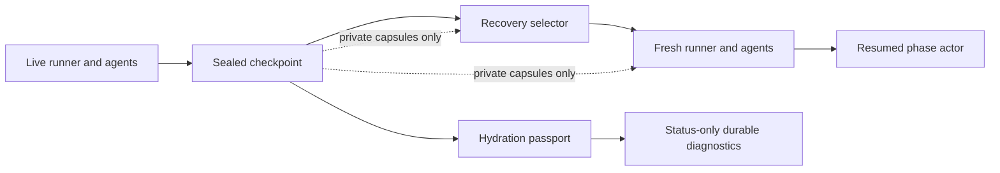

# Checkpoint Continuity Recovery - Plan

## Goal Capsule

Restore private player strategy continuity across supported phase-boundary startup recovery and make House-continuity passport diagnostics truthful about optional House Strategy Bible state.

**Authority hierarchy:** R12 and R16 in `docs/refactor-queue.md` govern this slice. Canonical events and their projection remain game truth; checkpoint capsules restore only private runtime continuity. Existing supported-boundary, fresh-owner, event-head, and privacy constraints remain authoritative.

**Stop conditions:** Do not resume a checkpoint with an invalid required continuity contract. Do not use transcript prose, raw traces, or `PgMemoryStore` rows to invent continuity. Do not widen recovery coordinates or expose capsule content to any public, owner, or MCP surface.

---

## Product Contract

### Summary

At a supported restart boundary, fresh `InfluenceAgent` instances must recover the structured private state that can affect their next decision. A House Strategy Bible capsule must be required only when the runtime contract sealed into that checkpoint required it.

### Problem Frame

The runner writes player continuity capsules but never supplies them to recovery or hydrates fresh agents, so strategy is lost after restart. The passport also treats a deliberately absent optional House packet as malformed recovery evidence, obscuring the difference between an expected absence and a broken required dependency.

### Requirements

- **R1. Recover player continuity from sealed checkpoint state.** Supported phase-boundary recovery must hydrate fresh active agents from their checkpoint-bound, versioned player continuity capsules before a resumed decision can run.
- **R2. Preserve complete prompt-affecting private state.** The continuity contract must retain Strategy Thread state, reflection summary, notes, relationship state, round history, power-action memory, recent strategic decision receipts, and packet-revision continuity without carrying raw prompts, responses, `thinking`, or `reasoningContext`.
- **R3. Reject unsafe player continuity.** Recovery must fail closed for a missing, duplicate, extra, identity-mismatched, malformed, or unsupported-version player capsule rather than reconstructing memory from transcript or operational memory rows.
- **R4. Scrub eliminated-player references after hydration.** Recovered live strategy state must preserve historical context while removing eliminated players from actionable relationships, notes, and strategy targeting before the next prompt.
- **R5. Seal a House-continuity requirement with the checkpoint.** Every checkpoint must record whether House Strategy Bible continuity was disabled, awaiting its first valid update, or required by the runtime that wrote that checkpoint.
- **R6. Make House passport results conditional and strict.** Disabled or pre-first-valid-update House continuity may be intentionally absent and non-blocking. A required House capsule must be valid; missing or malformed required continuity must block recovery readiness and selector admission.
- **R7. Preserve privacy-scoped diagnostics.** Durable-run diagnostics may report structural passport status and safe reasons only. Player capsules, House packet content, private prompts, reasoning, trace pointers, and recovery-only policy details must remain outside transcript, watch, and MCP reads.
- **R8. Keep recovery scope unchanged.** A candidate remains resumable only when it is the newest eligible event-head checkpoint at an implemented completed phase boundary, is claimed by a fresh owner, and continues with contiguous canonical events.

### Key Flows

- **F1. Supported player-continuity restart.** A checkpoint seals complete private player capsules; startup recovery validates its supported boundary and capsule set; the new runner initializes roster identity, hydrates each active agent, scrubs eliminated references, and only then resumes the phase actor.
- **F2. Conditional House passport.** Checkpoint creation seals its House-continuity requirement. Inspection distinguishes intentional absence from bad required continuity; recovery accepts only the former or a valid required packet.

### Acceptance Examples

- **AE1. Covers R1–R4.** A game interrupted after a Strategy Thread revision, reflection, note, relationship change, power action, and decision receipt resumes at a supported boundary with equivalent structured private decision context and without an eliminated player as an actionable target.
- **AE2. Covers R5–R6.** A checkpoint from a Bible-disabled game or a Bible-enabled game before the first valid update reports intentional absence without blocking. A later checkpoint with a missing or malformed required capsule is blocked.
- **AE3. Covers R7–R8.** After a successful restart, the same game appends under a new owner epoch with contiguous event sequences, while durable admin, watch, and MCP outputs contain no capsule or private-reasoning sentinel.

### Scope Boundaries

**In scope:** R12 player continuity hydration, R16 conditional House passport diagnostics, current API configuration forwarding needed to seal the truthful House contract, DB-backed restart proof, and affected durability/observability documentation.

**Out of scope:** Mid-phase recovery, new recovery coordinates (including format work), distributed ownership, historical checkpoint backfill, a public/owner-facing memory view, and an MCP tool for private checkpoint data.

### Assumptions

- Existing checkpoints without the new versioned player contract remain inspectable but fail closed for recovery; this slice does not invent a migration from prose or `agent_memories` rows.
- A Bible-enabled runtime stays `awaiting_first_valid_update` until it has sealed a valid House packet. Once required, a later missing or malformed packet is a blocker.
- `PgMemoryStore.recall()` remains non-authoritative operational storage. This slice must not merge its unordered, incomplete records into checkpoint recovery.

---

## Planning Contract

### Key Technical Decisions

- **KTD1. Checkpoint capsules are the only restart authority.** Governs R1–R4. `PgMemoryStore` is an incomplete write log and cannot safely override the boundary-sealed snapshot; canonical events continue to rebuild board facts, not private strategy.
- **KTD2. Use an explicit versioned agent hydration boundary.** Governs R1–R4. The runner validates the complete active-player capsule set, then invokes agent restoration after roster/game initialization and before resumed prompt construction. This keeps identity validation and private state reconstruction deliberate instead of implicit.
- **KTD3. Seal House expectation at checkpoint write time.** Governs R5–R6. The passport and recovery selector read the recorded runtime contract, never current mutable game configuration. This prevents a later configuration change from rewriting the meaning of old evidence.
- **KTD4. Retain existing privacy lanes.** Governs R7. Status-only producer diagnostics remain structural; public watch, transcript, and MCP surfaces receive neither continuity content nor a new capability.

### High-Level Technical Design

The checkpoint carries two independent private inputs: validated player capsules for runtime restoration and a House-continuity requirement for admission/diagnostics. The selector rejects invalid inputs before the runner mutates agent state; the passport explains the structural verdict without serializing either capsule.

### System-Wide Impact

- **Runtime:** Supported recovery gains private strategy continuity but keeps its completed-boundary-only behavior.
- **Persistence:** The checkpoint JSON contract gains versioned player capsules and a House requirement marker. The existing memory table is not promoted to recovery truth.
- **Privacy:** Producer diagnostics remain content-free. Existing public/owner/game MCP contracts do not gain a continuity read path.
- **Operations:** A null House packet is now actionable: operators can tell optional absence from an unsafe required absence.

### Risks and Mitigations

| Risk | Mitigation |
| --- | --- |
| A partial capsule silently changes a later decision. | Validate exact active-player coverage, identity, version, and shape before runner hydration; fail closed on any discrepancy. |
| Fresh agents reuse packet revisions after restart. | Restore revision continuity and assert the next packet advances without collision. |
| Current configuration reinterprets old checkpoints. | Persist a checkpoint-time House requirement marker and have both selector and passport consume it. |
| Private content leaks through a new diagnostic path. | Keep stored policy structural and add sentinel checks across durable, watch, and MCP read contracts. |
| DB-backed recovery tests race or truncate shared state. | Use the repository's process-lifetime `setupTestDB()` advisory-lock path and keep the suite sequential. |

---

## Implementation Units

### U1. Versioned player continuity capture and agent hydration

**Goal:** Make `InfluenceAgent` able to serialize and safely restore every structured private field that can affect a later decision.

**Requirements:** R1, R2, R4. Covers AE1.

**Dependencies:** None.

**Files:** `packages/engine/src/game-runner.types.ts`, `packages/engine/src/agent.ts`, `packages/engine/src/__tests__/agent-structured-output.test.ts`.

**Approach:**

1. Version the player continuity schema and replace its placeholder or unstructured fields with the bounded private state required by R2.
2. Add an explicit agent-side restoration boundary that accepts only validated compatible continuity, restores packet revision lineage, and applies existing eliminated-player scrubbing to actionable state.
3. Keep raw prompt/response and reasoning fields outside both capture and restoration.

**Execution note:** Start with characterization coverage for the currently omitted power-action and recent-decision state, then add the hydration behavior.

**Patterns to follow:** Existing `getContinuityCapsule()` and Strategy Thread prompt rendering in `packages/engine/src/agent.ts`; private/canonical separation in `docs/solutions/architecture-patterns/agent-strategy-observability-spine.md`.

**Test scenarios:**

- Capture a populated agent, hydrate a fresh instance, and verify the next private prompt receives its Strategy Thread, reflection, notes, relationships, round history, power-action memory, and recent decision receipts.
- Verify the next Strategy Thread revision follows the restored lineage rather than reusing an earlier revision identifier.
- Hydrate state referencing an eliminated player and verify actionable relationships, notes, and target posture are scrubbed while historical context remains available.
- Reject unsupported versions or malformed field shapes without accepting raw reasoning or prompt content.

**Verification:** The engine test proves a fresh agent reaches an equivalent safe prompt context without exposing raw private trace material.

### U2. Seal and admit recovery continuity at the runner boundary

**Goal:** Carry complete player capsules and the checkpoint-time House requirement from a durable boundary through the recovery selector into a fresh runner.

**Requirements:** R1, R3, R5, R6, R8. Covers AE1–AE3.

**Dependencies:** U1.

**Files:** `packages/engine/src/game-runner.types.ts`, `packages/engine/src/game-runner.ts`, `packages/api/src/services/game-checkpoints.ts`, `packages/api/src/services/game-recovery-support.ts`, `packages/api/src/services/game-lifecycle.ts`, `packages/api/src/__tests__/game-recovery.test.ts`.

**Approach:**

1. Have the runner seal the versioned active-player set and House requirement alongside existing phase-boundary evidence.
2. Preserve the relevant persisted House Strategy Bible configuration while constructing the API runner, so checkpoint-time policy represents the game that actually ran.
3. Validate capsule coverage and identity before assembling resume input; restore player state after `onGameStart()` and before the resumed phase actor may make an LLM call.
4. Keep House restoration null-tolerant only when the checkpoint policy allows it; leave unsupported boundary and event-head gates unchanged.

**Patterns to follow:** Current sealed runtime snapshot/token cursor handling in `packages/engine/src/game-runner.ts`; recovery ownership and same-game restart flow in `packages/api/src/services/game-lifecycle.ts` and `docs/solutions/runtime-errors/api-startup-recovery-resumes-interrupted-games.md`.

**Test scenarios:**

- Interrupt an API-backed game at a supported coordinate after each R2 state mutation, restart through startup recovery, and verify same-game continuation under a fresh owner with contiguous canonical sequences.
- Supply duplicate, extra, missing, name-mismatched, or unsupported-version player capsules and verify recovery remains suspended before an agent can issue a new action.
- Seed stale or incomplete `agent_memories` rows and verify checkpoint hydration does not read or merge them.
- Change current configuration after checkpoint creation and verify recovery uses the sealed House requirement rather than reinterpreting historical evidence.

**Verification:** The DB-backed recovery suite proves admitted resumes use only complete sealed inputs and retain all existing owner/event-boundary invariants.

### U3. Conditional House passport and content-free diagnostics

**Goal:** Classify House continuity correctly without weakening validation or enlarging any read surface.

**Requirements:** R5, R6, R7. Covers AE2–AE3.

**Dependencies:** U2.

**Files:** `packages/api/src/services/checkpoint-hydration-passport.ts`, `packages/api/src/__tests__/checkpoint-hydration-passport.test.ts`, `packages/api/src/__tests__/game-durable-run.test.ts`, `packages/api/src/__tests__/admin-routes.test.ts`, `packages/api/src/__tests__/game-watch-state.test.ts`, `packages/api/src/__tests__/production-game-mcp-read-model.test.ts`, `packages/api/src/__tests__/production-game-mcp-server.test.ts`.

**Approach:**

1. Evaluate the House stamp against the sealed disabled, awaiting-first-valid-update, or required state rather than treating every null capsule as missing.
2. Keep a valid required packet strict and reject malformed or unexpectedly absent required data in both readiness diagnostics and recovery admission.
3. Serialize only structural outcomes and safe reasons through durable inspection; extend existing sentinel coverage instead of adding a new continuity API.

**Patterns to follow:** Passport stamp derivation in `packages/api/src/services/checkpoint-hydration-passport.ts`; status-only checkpoint summaries and private-sentinel checks in the existing API tests.

**Test scenarios:**

- A Bible-disabled checkpoint reports intentional absence as non-blocking.
- A Bible-enabled checkpoint before its first valid packet reports intentional absence as non-blocking.
- A valid required packet passes, while missing or malformed required data blocks the House stamp and recovery admission.
- A malformed optional packet is still diagnosed as malformed rather than silently treated as absent.
- Private player/House sentinels, raw prompts, `thinking`, and `reasoningContext` remain absent from durable-run, admin, watch, and MCP outputs.

**Verification:** Passport and read-model tests distinguish the three House states and prove every exposed diagnostic remains content-free.

### U4. Align recovery and observability documentation

**Goal:** Replace stale live-run-only claims with the supported checkpoint-recovery contract while preserving the privacy and recovery limits.

**Requirements:** R7, R8. Covers AE1–AE3.

**Dependencies:** U1, U2, U3.

**Files:** `docs/refactor-queue.md`, `docs/statefulness-plan.md`, `docs/solutions/runtime-errors/api-startup-recovery-resumes-interrupted-games.md`, `docs/reasoning-transcript-observability.md`, `docs/local-model-evaluation.md`, `DEVELOPMENT.md`, `CONCEPTS.md`, `packages/engine/src/simulate.ts`.

**Approach:**

1. Mark R12 and R16 resolved only after the restart and no-leak proof lands; preserve any remaining recovery limitations in the queue.
2. Describe player and House capsules as private, checkpoint-bound recovery inputs for supported boundaries, never MemoryStore/canonical/transcript truth, and update the recovery solution note with the expanded resume invariant.
3. Document conditional House diagnostics and the exact separation between a passport verdict and recovery support.
4. Update the simulator JSDoc and operator guidance where they currently describe Strategy Thread or House Bible state as uninterrupted-run-only.

**Patterns to follow:** Recovery operational contract in `docs/solutions/runtime-errors/api-startup-recovery-resumes-interrupted-games.md`; glossary conventions in `CONCEPTS.md`.

**Test expectation:** none — this unit changes documentation only; behavioral and privacy proof belongs to U1–U3.

**Verification:** Documentation names the new private recovery contract, removes contradictory live-only claims, and does not promise mid-phase, public, or arbitrary historical recovery.

---

## Verification Contract

- Run the focused engine and API test files named in U1–U3 with Bun before the full suite.
- Run `bun run test` after focused recovery, passport, and privacy coverage pass.
- Run `bun run check` before handoff.
- Use a real local Postgres-backed recovery fixture for AE1–AE3; do not substitute paid simulations or transcript-only proof.
- Inspect durable-run, watch, and MCP responses with private sentinels to prove R7 at the final request seams.

---

## Definition of Done

- U1–U4 are implemented in dependency order and their named test scenarios pass.
- A supported fresh-owner restart restores validated private player continuity before a resumed prompt/action and appends contiguous canonical events.
- Player capsule mismatch, malformed data, and unknown versions fail closed; `PgMemoryStore` does not influence recovery.
- House absence is non-blocking only when its checkpoint-time policy permits it; missing or malformed required continuity blocks admission and reports a safe structural reason.
- Durable, public watch, and MCP outputs expose no private continuity, prompt, trace, or reasoning content.
- Docs describe the implemented boundary accurately, R12/R16 no longer remain as ready backlog work, and abandoned experimental code is removed.

## Sources and Research

- `docs/refactor-queue.md` — authoritative R12/R16 scope and validation paths.
- `packages/engine/src/game-runner.ts`, `packages/engine/src/agent.ts`, and `packages/api/src/services/game-recovery-support.ts` — current capture/restore gap.
- `packages/api/src/services/checkpoint-hydration-passport.ts` — unconditional House stamp behavior.
- `docs/solutions/runtime-errors/api-startup-recovery-resumes-interrupted-games.md` — same-game restart and owner-boundary invariants.
- `docs/solutions/architecture-patterns/agent-strategy-observability-spine.md` — private strategy/canonical truth separation.
