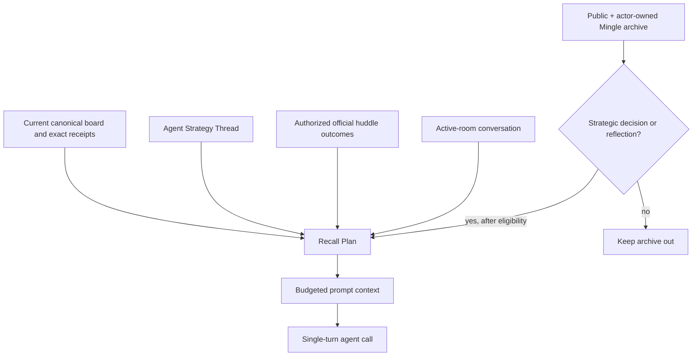
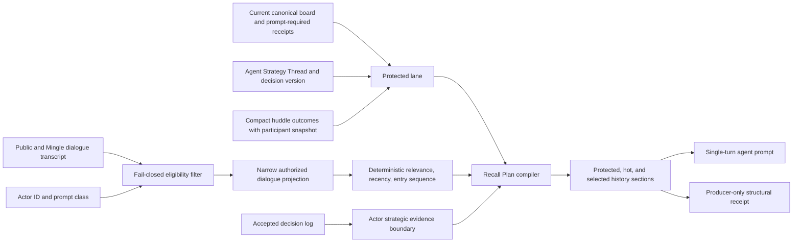

# Selective Context Recall - Plan

## Goal Capsule

- **Objective:** Cut late-game agent input context by at least 50% across a matched replay corpus while retaining the exact strategic facts and authorized social memory an agent needs.
- **Product authority:** This plan owns prompt-context selection for agent calls. It preserves agent-owned long-form strategy and existing Strategy Reflection mutation; it does not introduce House-assigned objectives or a second strategy system.
- **Open blockers:** None. Planning must calibrate prompt-class budgets from representative replay baselines without changing the 50% initial target.

---

## Product Contract

Product Contract retained; planning resolves its two planning-owned questions and clarifies that huddle eligibility requires immutable participant proof.

### Summary

ContextBuilder will compile an exact-first, authorization-safe Recall Plan before each agent prompt.
The plan will pin current game truth, the agent's Strategy Thread, and authorized official huddle outcomes, then spend a bounded historical-evidence budget only where strategic decisions or reflections warrant it.

### Problem Frame

Late-game prompts currently carry a full public transcript and a complete visible event record, so context cost grows with the game rather than with the immediate decision.
Full history also makes important evidence harder for the model to find.
The product needs lower-cost prompts without letting a relevance policy erase strategic alliances, introduce private information, or replace the agent's long-form plan with an unrelated memory system.

### Key Decisions

- **Server-owned recall selection** (session-settled: user-approved — chosen over agent-controlled search tools: v1 must prove the retrieval machinery without a multi-turn control loop). Governs R1, R7, R8, R11.
- **Official huddle outcomes are permanent strategic memory** (session-settled: user-approved — chosen over relevance-ranked huddle recall: private huddles are the game’s highest-value strategy conversation). Governs R4, R5, R10.
- **Strategy Reflection remains the only strategy-mutation surface** (session-settled: user-directed — chosen over a parallel strategy lane: established reflections already provide the correct lifecycle). Governs R3, R12.
- **Token reduction leads the release goal** (session-settled: user-approved — chosen over an unspecified efficiency goal: 50% late-game reduction is a useful starting constraint). Governs R9, R13, R15.

### Actors

- A1. **Agent:** receives one compiled context pack per ordinary message, decision, or reflection call and remains a single-turn responder in this release.
- A2. **ContextBuilder:** determines what an actor may see, pins required evidence, and produces the bounded Recall Plan before prompt rendering.
- A3. **The House:** continues to create official alliance-huddle outcomes from a completed huddle; it does not author an agent’s objectives.
- A4. **Producer/operator:** evaluates structural Recall Plan receipts in controlled replay without receiving a new player-facing private-information surface.

### Requirements

**Exact-first context**

- R1. ContextBuilder must produce a deterministic Recall Plan for each agent call from the actor, phase, current game projection, and authorized continuity sources.
- R2. Every context pack must include the current Board Contract and other current canonical game facts needed by that prompt, and those facts must override all Strategy Thread and conversational memory.
- R3. Every context pack must include the agent’s current Strategy Thread as an agent-owned long-form goal and plan, with owner-authored persona and initial guidance able to influence it without becoming live House objectives.
- R4. Every eligible agent, as proven by immutable huddle-session participant data, must receive a compact official outcome summary from every alliance huddle it participated in, including an alliance that later closed.
- R5. Huddle outcomes and other typed, player-authorized strategic receipts must be represented as exact evidence rather than being displaced by conversational ranking. Covers R4.

**Authorization and retrieval boundaries**

- R6. Historical conversational recall may draw only from public dialogue and private Mingle messages the current agent sent or received.
- R7. Eligibility must be decided before relevance selection, and ineligible private material must not affect selected results, counts, diagnostics, or no-result behavior.
- R8. Retrieved dialogue is evidence, never authority: it must not alter canonical game facts, permissions, tool authority, or prompt instructions.
- R9. The v1 product must not give agents a history-search tool, a retrieval warrant, or a multi-turn retrieval loop. Covers R1.

**Budget and delivery policy**

- R10. Each prompt class must reserve protected budget for current canonical facts, Strategy Thread, and official huddle outcomes before allocating any conversational-history budget. Covers R4, R5.
- R11. Ordinary social speech must use only protected context, exact current receipts, and active-room conversation; historical retrieval is limited to strategic decision and Strategy Reflection surfaces. Covers R1.
- R12. A normal action’s decision log may mark the next eligible strategic Recall Plan stale, but it must not create another model call or mutate the Strategy Thread outside Strategy Reflection. Covers R3.
- R13. In matched late-game replay, the new context pack must reduce input-context tokens by at least 50% relative to current prompt construction without increasing model-call count. Covers R10, R11.

**Proof before live prompt replacement**

- R14. Deterministic replay must show that equal authorized inputs compile the same Recall Plan and that all protected Board Contract, Strategy Thread, and huddle-outcome evidence remains present.
- R15. Adversarial fixtures must prove that cross-seat private Mingle, non-member huddle data, sealed artifacts, and producer-only traces cannot be selected or rendered for an unauthorized agent.
- R16. Recall evaluation receipts must be producer-only structural metadata such as source class, visibility lane, rank slot, budget use, and event boundary; aggregate rollups must not retain recalled dialogue or raw prompt payloads.
- R17. Live prompt reduction may proceed only after replay shows R13, R14, and R15 without regression; an existing simulation file containing full private traces is not itself a player-safe evaluation artifact.

### Key Flows

- F1. Ordinary social prompt
  - **Trigger:** An agent is called to speak in an active room.
  - **Actors:** A1, A2.
  - **Steps:** A2 compiles protected canonical, Strategy Thread, official huddle, exact-receipt, and active-room lanes; it does not add historical conversational recall.
  - **Outcome:** The agent speaks from current context without a growing transcript archive.
  - **Covered by:** R2-R5, R10-R11.

- F2. Strategic decision or reflection
  - **Trigger:** An agent reaches an eligible decision or Strategy Reflection surface.
  - **Actors:** A1, A2.
  - **Steps:** A2 applies authorization before ranking public and actor-owned Mingle archives, fills only the remaining evidence budget, and renders the compiled context for one call.
  - **Outcome:** The agent can recover relevant social evidence without choosing its own search scope.
  - **Covered by:** R1, R6-R12.

- F3. Replay promotion check
  - **Trigger:** A candidate context policy is ready for evaluation.
  - **Actors:** A2, A4.
  - **Steps:** Replay the same authorized game inputs through the current and candidate policies, then compare protected-evidence presence, selected visibility lanes, token use, and model-call count.
  - **Outcome:** A policy that is cheaper but loses protected evidence or selects an unauthorized lane cannot replace live prompts.
  - **Covered by:** R13-R17.

### Acceptance Examples

- AE1. Official huddle persistence
  - **Covers:** R4, R5, R10.
  - **Given:** An agent participated in an alliance huddle and that alliance later closes.
  - **When:** The agent receives a later prompt.
  - **Then:** The official outcome remains in protected context and cannot be displaced by selected public dialogue.

- AE2. Private recall isolation
  - **Covers:** R6-R9, R15.
  - **Given:** Two agents have different private Mingle and alliance histories.
  - **When:** Either agent receives a strategic Recall Plan.
  - **Then:** It can include only public material and the recipient’s own private Mingle history, with no indication that excluded private material exists.

- AE3. Decision-log cache break
  - **Covers:** R3, R12.
  - **Given:** A normal action records a decision log.
  - **When:** The action completes.
  - **Then:** No extra call or immediate Strategy Thread revision occurs; the next eligible strategic context is recomputed from the updated evidence boundary.

- AE4. Late-game promotion
  - **Covers:** R13-R17.
  - **Given:** A representative late-game replay with a full public transcript under the current policy.
  - **When:** The candidate Recall Plan is replayed with the same authorized inputs.
  - **Then:** It uses at least 50% fewer input-context tokens, makes no additional model calls, preserves protected evidence, and selects no unauthorized source.

### Success Criteria

- Matched late-game replays meet R13.
- Privacy fixtures meet R15 with zero unauthorized selections or renderings.
- The replay corpus shows no missing protected Board Contract, Strategy Thread, or official huddle outcome under R14.

### Scope Boundaries

- **Deferred for later:** Raw private-huddle transcript retrieval, agent-controlled search tools, retrieval warrants, and multi-turn agent flows.
- **Deferred for later:** House-assigned objectives and any game mechanic that gives The House ownership of an agent’s goals.
- **Outside this plan:** A second Strategy Thread or parallel strategy-mutation lane.
- **Outside this plan:** Treating conversational prose, model summaries, decision logs, or retrieval results as canonical game state.

### Dependencies and Assumptions

- Existing official alliance-huddle outcomes remain the compact member-scoped record of huddle strategy; this work reuses that product artifact rather than introducing a duplicate recap.
- Existing deterministic replay and simulation tooling can supply matched inputs, but new Recall Plan evaluation receipts must follow R16 rather than inheriting the privacy posture of full simulation artifacts.
- Planning may choose the concrete ranking policy and per-prompt budget allocations, provided it preserves R1-R17.

### Outstanding Questions

- **Resolved during planning:** Each strategic prompt class receives a deterministic, fixture-calibrated history budget after protected context renders. The 50% reduction target remains the release gate rather than an assumed budget value.
- **Resolved during planning:** Eligible conversational evidence uses deterministic lexical/contextual relevance plus recency, with `entrySequence` as its stable tie-breaker. Embeddings and model-generated retrieval queries remain deferred.

<!-- ce-section: work-relationships -->
### How This Work Fits Together

This plan owns selective context recall, not the entire agent-continuity roadmap.

- **Builds on:** Existing Current Board Contract, Strategy Thread, member-safe alliance context, official huddle outcomes, and decision-log receipts.
- **Shares boundaries with:** Checkpoint continuity and recovery, which may later need to preserve the structural inputs that make a Recall Plan reproducible.
- **Enables:** A later product decision about agent-controlled retrieval only after this server-owned policy proves strategic value, cost reduction, and privacy safety.
- **Can proceed independently of:** Any future House objective mechanic or broader agent-loop architecture.

### Sources and Research

- `docs/ideation/2026-07-26-agent-selective-recall-ideation.html`
- `packages/engine/src/context-builder.ts`
- `packages/engine/src/agent.ts`
- `packages/engine/src/phases/alliances.ts`
- `docs/plans/2026-06-17-002-feat-thin-strategic-decision-fields-plan.md`
- `docs/reasoning-transcript-observability.md`

---

## Planning Contract

### Technical Summary

ContextBuilder will compile a pure Recall Plan from the current projection, an explicit prompt class, and the agent's current private continuity snapshot.
The compiler will authorize every conversational candidate before it ranks anything, render protected evidence before historical evidence, and retain only structural selection metadata outside the prompt/trace boundary.

### Key Technical Decisions

- KTD1. **Require an explicit prompt class at the context boundary.** Add `ordinary_speech`, `strategic_decision`, and `strategic_reflection` classifications; unspecified callers resolve to `ordinary_speech`, which has no historical archive lane. This makes the same game phase safe for both speech and reflection rather than inferring recall permission from phase alone. Governs R1, R9, R11, R12. (session-settled: user-approved — chosen over agent-controlled retrieval: v1 keeps selection server-owned and single-turn.)

- KTD2. **Authorize, project, then rank with deterministic local scoring.** Public speech and Mingle rows are eligible only after immutable identity checks; a Mingle row requires `speakerPlayerId === actorId` or `audiencePlayerIds` containing the actor. The compiler projects only sequence, round, phase, speaker label, and dialogue text before it scores overlap against stable typed context seeds. It removes Strategy Thread terms contradicted by the current Board Contract before seed creation. A candidate with no non-stopword seed overlap is rejected; recency can order positive matches but cannot rescue a zero-match row. It resolves ties by `entrySequence` and stable source order. Missing/ambiguous legacy identity excludes the row. No vector store, embedding call, model-generated query, display-name fallback, or room-membership inference enters v1. Governs R1, R6-R9, R14-R15. (session-settled: user-approved — chosen over agent-controlled retrieval: deterministic replay and privacy proof come before a tool loop.)

- KTD3. **Make permanent huddle memory an immutable compact outcome record.** At outcome creation, copy the exact session participant IDs onto a server-private outcome field and normalize all summary fields to fixed limits before canonical recording. During hydration, backfill an older outcome only when its matching stored completed-session record supplies the exact participant IDs; otherwise omit it rather than broaden visibility. ContextBuilder uses that snapshot—not current alliance membership, a later amendment, or raw huddle rows—to include every authorized compact outcome in the protected lane. Public, player/owner, producer-safe, MCP, and postgame projections must omit the snapshot and must not expose non-member outcome existence. Governs R4-R5, R10, R14-R15. (session-settled: user-approved — chosen over relevance-ranked huddles: huddle strategy remains permanent without making late-game cost unbounded.)

- KTD4. **Pass a narrow continuity snapshot and cache only reconstructible selection references.** Immediately before each context build, the phase runner asks the actor for a `RecallContinuitySnapshot` containing only Strategy Thread, recent strategic receipts, and their revisions; it passes that snapshot and the prompt class to ContextBuilder. A process-local cache keys actor, prompt class, and the resulting deterministic evidence boundary derived only from the actor-visible current projection, public dialogue, actor-owned Mingle, authorized huddle outcomes, and snapshot revision. A decision log changes the snapshot version for the actor's next eligible strategic entry only; it neither calls the model nor changes the Strategy Thread. Cache loss on restart is benign because the plan recompiles from hydrated inputs. Governs R1, R3, R7, R12, R14. (session-settled: user-directed — chosen over a second strategy lifecycle: decision logs remain evidence for normal reflection.)

- KTD5. **Measure promotion with a separate structural Recall Plan receipt.** The receipt records prompt class, protected/history budget estimates, selected lane/count by rank slot, and an event boundary derived only from actor-authorized candidates and protected records. It never retains dialogue, names, entry IDs, rejected counts, foreign-lane counts, prompts, thinking, or trace payloads. A deterministic character-to-token estimate (`ceil(characters / 4)`) supplies matched-replay comparisons; returned provider usage remains supplemental rather than the reproducibility gate. Governs R13, R16-R17. (session-settled: user-approved — chosen over an unspecified efficiency goal: the same fixed measurement supports the 50% release threshold.)

### High-Level Technical Design

The plan compiler owns selection, not game truth: canonical projections remain authoritative and retrieved prose is quoted historical evidence with no instruction or permission effect.
Protected evidence renders before any archive allocation; if it consumes the available prompt-class envelope, historical allocation becomes zero and the structural receipt records the overflow.
Active-room conversation remains hot context, distinct from historical Mingle archive recall.

### Implementation Constraints and Sequencing

- Preserve `Current Board Contract` as the authoritative live-state section. Replace the unbounded endgame transcript and complete game-event record with explicit current facts and prompt-required typed receipts.
- Keep official huddle outcomes compact at creation. Do not trim, rank, or silently omit an authorized outcome later to satisfy a recall budget.
- Treat transcript `thinking`, `reasoningContext`, huddle, whisper, diary, system, sealed, and producer artifacts as ineligible before candidate counts, scores, diagnostics, or empty-result behavior are computed.
- Have phase runners request the narrow versioned continuity snapshot from the actor immediately before each context build; do not let them read agent memory directly, persist a model-selected Recall Plan, or create a second continuity authority.
- Introduce the pure compiler and safety tests before changing shared prompt rendering. Then wire call-site classifications, telemetry, fixture promotion, and documentation in that order.

### System-Wide Impact

- **Privacy and recovery:** Modern transcript replay already preserves audience identity. Recall must compile equivalently after hydration from modern rows, while legacy rows contribute no private historical recall.
- **Prompt behavior:** Endgame speech loses its implicit full-history exception. Strategic endgame decisions and reflections may receive selected authorized evidence; speeches retain protected/current/hot context only.
- **Agent ownership:** The agent still owns the long-form Strategy Thread and revision judgment. ContextBuilder receives it as continuity input but does not author objectives or mutate the thread.
- **Observability:** Full private simulation traces remain producer artifacts and are not made player-safe by this work. The new aggregate receipt is the safe comparison surface and carries the R16 event boundary.

### Risks and Mitigations

| Risk | Mitigation |
|---|---|
| A new recall path leaks another player's Mingle history | Filter on immutable player IDs before ranking, fail closed for legacy rows, and prove differential isolation with adversarial fixtures. |
| Closed or amended alliances lose an authorized huddle outcome | Store an immutable participant snapshot on the outcome and test closure, amendment, replay, and later-member cases. |
| Permanent huddle outcomes consume the entire late-game budget | Bound the official compact summary at creation; reserve protected content first and report history overflow instead of deleting evidence. |
| The 50% result is a measurement artifact | Compare frozen late-game inputs through legacy and candidate renderers using the same deterministic estimator and equal model-call count. |
| Cache invalidation becomes a hidden strategy engine | Cache only selected references; decision logs update an input version for the next eligible strategic plan and never invoke reflection. |

---

## Implementation Units

### U1. Persist bounded, participant-scoped official huddle outcomes

- **Goal:** Make every official huddle outcome a compact, immutable, participant-authorized protected record.
- **Requirements:** R4, R5, R10, R14, R15; F1, F2; AE1, AE2.
- **Dependencies:** None.
- **Files:**
  - `packages/engine/src/types.ts`
  - `packages/engine/src/game-state.ts`
  - `packages/engine/src/house-interviewer.ts`
  - `packages/engine/src/phases/alliances.ts`
  - `packages/engine/src/__tests__/named-alliances-context.test.ts`
  - `packages/engine/src/__tests__/game-state.test.ts`
  - `packages/api/src/game-mcp/read-model.ts`
  - `packages/api/src/services/public-alliance-read-model.ts`
  - `packages/api/src/__tests__/production-game-mcp-read-model.test.ts`
- **Approach:** Extend `AllianceHuddleOutcome` with an immutable server-private participant snapshot copied from the completed huddle session. Normalize the House-produced typed summary to fixed per-field/list limits before `recordAllianceHuddleOutcome`, preserving its typed fields and commitments rather than later trimming raw prose. During projection/hydration, populate an older outcome only from its matching completed-session `speakerIds`; no current-membership fallback is allowed. Expose a member-safe compact outcome projection that ContextBuilder can consume without consulting current alliance membership. Keep the participant snapshot out of generic canonical-event DTOs, public/player/owner/MCP/postgame read models, and producer-safe evaluation artifacts. Treat an outcome that still lacks a participant snapshot as unavailable for recall.
- **Test scenarios:**
  - Given a participant's alliance later closes or archives, their later context retains every compact outcome from sessions they attended.
  - Given a player joins an alliance after a prior huddle, that player receives neither the old outcome nor an existence signal.
  - Given an older outcome maps to a completed session with exact speakers, hydration restores that same participant snapshot; given no matching session, it produces the same result as no outcome for all actors.
  - Given an overlong House summary, canonical outcome fields remain within the compact contract before prompt rendering.
  - Given a non-member reads canonical, public, owner, MCP, or postgame projections, that reader observes neither participant IDs nor the private outcome's existence.
- **Verification:** Focused game-state and alliance-context tests prove outcome copying, closure retention, later-member exclusion, and bounded official projections.

### U2. Compile deterministic authorization-safe Recall Plans in ContextBuilder

- **Goal:** Give ContextBuilder one pure compiler that produces protected, hot, and ranked historical context from explicit actor, prompt class, and continuity inputs.
- **Requirements:** R1-R2, R4-R8, R10, R14-R15; F1-F3; AE1-AE2.
- **Dependencies:** U1.
- **Files:**
  - `packages/engine/src/context-builder.ts`
  - `packages/engine/src/game-runner.types.ts`
  - `packages/engine/src/transcript-logger.ts`
  - `packages/engine/src/__tests__/context-recall-plan.test.ts` (new)
  - `packages/engine/src/__tests__/extracted-modules.test.ts`
- **Approach:** Add `RecallPromptClass`, the renderable `RecallPlan`, and a separate content-free receipt shape. Build public candidates only from public dialogue and Mingle candidates only from modern `speakerPlayerId`/`audiencePlayerIds`; narrow them to a safe dialogue projection before scoring. Compile stable seed terms from the prompt class, current typed board, non-conflicting Strategy Thread fields, exact current receipts, and recent strategic decisions. Reject a candidate with no non-stopword seed overlap, then apply deterministic lexical/contextual relevance and recency to the remaining candidates, with `entrySequence` and source order as the total order. Compile Board Contract inputs, agent continuity, compact authorized huddle outcomes, prompt-required current receipts, active-room messages, and selected archive evidence into distinct lanes. Allocate history only after protected and hot lanes.
- **Test scenarios:**
  - Given identical modern projection, transcript, continuity, and prompt class inputs, the normalized plan, order, budget ledger, and receipt are byte-stable.
  - Given a Mingle row, it is eligible for its sender and recorded recipients but not another room occupant, a later alliance member, or a player with the same display-name fragment.
  - Given foreign Mingle, raw huddle dialogue, thinking, diary, whisper, sealed, or producer rows are added, the actor's plan and receipt remain unchanged.
  - Given a foreign private write advances a global event sequence, the actor's cache key, event boundary, plan, and no-result behavior remain unchanged.
  - Given a protected lane exhausts the prompt-class allowance, archive selection is empty and the protected content remains complete.
  - Given authorized public dialogue has zero overlap with the strategic seed terms, it is rejected rather than filling a historical slot through recency alone.
  - Given a commitment or betrayal is expressed indirectly but shares a current player or commitment anchor, the golden fixture selects it; given a stale Strategy Thread target conflicts with the live Board Contract, that target does not create a retrieval seed.
  - Given historical text attempts to override rules or claim a false elimination, it renders only under the historical-evidence wrapper and never changes Board Contract data.
- **Verification:** New compiler tests exercise authorization-before-ranking, deterministic tie-breaking, no-result equivalence, source exclusion, and protected-lane preservation without an LLM call.

### U3. Thread prompt classes and continuity boundaries through agent calls

- **Goal:** Ensure every agent call requests the safe recall class it actually needs, and make decision-log cache breaks real without creating a new model or strategy lifecycle.
- **Requirements:** R1, R3, R9, R11-R12, R14; F1-F2; AE3.
- **Dependencies:** U2.
- **Files:**
  - `packages/engine/src/agent.ts`
  - `packages/engine/src/context-builder.ts`
  - `packages/engine/src/diary-room.ts`
  - `packages/engine/src/phases/phase-runner-context.ts`
  - `packages/engine/src/phases/alliances.ts`
  - `packages/engine/src/phases/council.ts`
  - `packages/engine/src/phases/endgame.ts`
  - `packages/engine/src/phases/format-kernel.ts`
  - `packages/engine/src/phases/introduction.ts`
  - `packages/engine/src/phases/lobby.ts`
  - `packages/engine/src/phases/mingle.ts`
  - `packages/engine/src/phases/power.ts`
  - `packages/engine/src/phases/rumor.ts`
  - `packages/engine/src/phases/vote.ts`
  - `packages/engine/src/__tests__/agent-structured-output.test.ts`
- **Approach:** Default every `buildPhaseContext` caller to `ordinary_speech`; explicitly mark votes, powers, councils, format choices, and other non-speech strategy decisions as `strategic_decision`; mark `DiaryRoom` reflection calls as `strategic_reflection`. Add a narrow `RecallContinuitySnapshot` accessor to the existing agent boundary. Immediately before calling ContextBuilder, each phase runner obtains a fresh snapshot of the actor's Strategy Thread, recent strategic receipts, and revisions; phase code never reads agent memory directly. Maintain a process-local selected-reference cache keyed by the resulting deterministic boundary. Increment the snapshot's strategic evidence version when a normal decision receipt is retained so only the next eligible strategic plan recomputes; Strategy Reflection remains the only mutation point for the thread.
- **Test scenarios:**
  - Given ordinary Lobby, Mingle, huddle, or endgame speech, no historical archive lane is present even when old eligible dialogue exists.
  - Given a vote or scheduled reflection, selected authorized archive evidence may be present under its bounded plan.
  - Given a decision log follows a normal action, the next strategic fingerprint changes while the immediate action produces no extra `callTool` invocation and no Strategy Thread revision.
  - Given a process restart/hydration, cache loss causes deterministic recomputation rather than missing or broadened recall.
- **Verification:** Prompt-class matrix tests cover every call family, and reflection tests prove no added call path or mutation outside `getStrategicReflection`.

### U4. Replace unbounded prompt-history rendering with Recall Plan sections

- **Goal:** Render only the compiled context lanes and remove the shared full-history paths that make late-game prompts grow without bound.
- **Requirements:** R2-R3, R8, R10-R13, R17; F1-F2; AE3-AE4.
- **Dependencies:** U2, U3.
- **Files:**
  - `packages/engine/src/agent.ts`
  - `packages/engine/src/__tests__/agent-structured-output.test.ts`
  - `packages/engine/src/__tests__/goodbye-message.test.ts`
- **Approach:** Before replacing shared rendering, freeze a small late-game corpus of PhaseContext and continuity inputs plus each legacy renderer's character/token estimate: ordinary endgame speech, a huddle-heavy strategic decision, and Strategy Reflection. Then make `buildUserPrompt` render the plan's protected Board Contract, Strategy Thread, compact official huddle outcomes, exact phase-required receipts, active-room conversation, and—only on strategic classes—historical evidence. Retire the endgame `Full Public Transcript` and complete `Game Event Record` as generic history sources. Keep current endgame rules and typed question-deduplication facts only where the immediate prompt requires them. Label selected prose as historical evidence that cannot override canonical state, permissions, or instructions.
- **Test scenarios:**
  - Given an endgame speech prompt, it no longer contains the unbounded full public transcript or complete historical event record.
  - Given a strategic endgame vote, it contains Board Contract plus bounded selected evidence and never an unfiltered transcript.
  - Given a Strategy Thread conflicts with the live board, existing canonical override language remains before historical evidence.
  - Given no archive candidate is eligible, render output stays explicit and does not imply excluded content exists.
  - Given the frozen baseline corpus, each legacy rendered estimate remains available only to the deterministic promotion test after live full-history rendering is removed.
- **Verification:** Existing prompt snapshots are revised from full-history expectations to plan-section expectations, while current phase rules and required structured receipts remain covered.

### U5. Emit structural receipts and enforce the deterministic promotion gate

- **Goal:** Prove token reduction, protected-evidence retention, and unchanged call count without storing recalled dialogue in evaluation output.
- **Requirements:** R13-R17; F3; AE4.
- **Dependencies:** U2-U4.
- **Files:**
  - `packages/engine/src/game-runner.types.ts`
  - `packages/engine/src/agent.ts`
  - `packages/engine/src/prompt-reuse.ts`
  - `packages/engine/src/simulate.ts`
  - `packages/engine/src/__tests__/prompt-reuse.test.ts`
  - `packages/engine/src/__tests__/context-recall-evaluation.test.ts` (new)
  - `packages/engine/src/__tests__/simulation-instrumentation.test.ts`
- **Approach:** Attach the structural Recall Plan receipt beside existing prompt-reuse metadata at the private-trace seam, then aggregate it into a dedicated safe simulation artifact rather than the full trace file. Derive its event boundary from the actor-authorized candidate/protected set, never a global transcript or huddle watermark. Use the U4 test-only late-game baseline corpus and the candidate renderer against the same frozen projection/transcript/continuity inputs. Use the same deterministic token estimator for both, assert equal request counts, and keep provider token/cached-token values informational only.
- **Test scenarios:**
  - Given a receipt or aggregate is serialized, it contains no text, names, entry IDs, hashes, rejected counts, prompt payload, thinking, or reasoning context; its event boundary remains structural.
  - Given each applicable member of the frozen late-game corpus, candidate context is at least 50% lower by the common estimator, has the same model-call count, and retains all protected records.
  - Given a candidate fails privacy or protected coverage, the promotion result is failing even when the token target passes.
  - Given a full simulation JSON contains raw private trace material, the safe Recall Plan artifact remains separate and is the only promotion input.
- **Verification:** Targeted evaluation tests and prompt-reuse tests prove structural-only serialization and the exact R13/R17 gate without paid model simulation.

### U6. Lock the privacy, replay, and document contract around the new surface

- **Goal:** Make the safe operating model discoverable and prevent future call sites or evaluation work from silently reopening a privacy boundary.
- **Requirements:** R7-R9, R15-R17; F3; AE1-AE4.
- **Dependencies:** U1-U5.
- **Files:**
  - `CONCEPTS.md`
  - `docs/reasoning-transcript-observability.md`
  - `docs/local-model-evaluation.md`
  - `DEVELOPMENT.md`
  - `README.md`
  - `packages/engine/src/simulate.ts`
  - `packages/engine/src/__tests__/mingle-inbox-replay.test.ts`
  - `packages/engine/src/__tests__/named-alliances-context.test.ts`
  - `packages/engine/src/__tests__/canonical-event-replay.test.ts`
- **Approach:** Document Recall Plan vocabulary, the protected/hot/history lanes, fail-closed legacy behavior, and the separate safe evaluation artifact. Update simulator JSDoc and local evaluation guidance to point reviewers at deterministic fixture replay and structural receipts, not raw traces. Add replay-facing coverage proving modern transcript/session snapshots reproduce the same plan, while legacy records cannot contribute private recall.
- **Test scenarios:**
  - Given modern transcript and outcome snapshots are serialized then hydrated, normalized Recall Plans and budget ledgers match pre-hydration output.
- Given legacy Mingle records rely only on display names, they are not upgraded into private recall during replay; an older huddle outcome may recover only from its matching completed-session participant snapshot.
  - Given a maintainer follows the documented evaluation path, no paid LLM simulation is required to establish the release gate.
- **Verification:** Documentation names the same lanes, fields, and artifacts the code tests; replay tests remain sequential and use existing test isolation when database-backed coverage is introduced later.

---

## Verification Contract

- Run focused engine tests while implementing each unit, including `bun test packages/engine/src/__tests__/context-recall-plan.test.ts`, `bun test packages/engine/src/__tests__/context-recall-evaluation.test.ts`, `bun test packages/engine/src/__tests__/agent-structured-output.test.ts`, `bun test packages/engine/src/__tests__/named-alliances-context.test.ts`, and `bun test packages/engine/src/__tests__/prompt-reuse.test.ts`.
- Run the repository baseline with `bun run test`, then `bun run check` before merge.
- The release proof is the deterministic late-game corpus: equal frozen inputs, byte-stable Recall Plans, full protected coverage, zero unauthorized selection/rendering, at least 50% lower estimated input context for every applicable case, and no increase in model-call count.
- Do not use paid or live model simulation to prove this slice. If later runtime exploration is useful, keep it explicitly non-gating and inspect the dedicated structural artifact rather than a full private-trace JSON file.
- Any database-backed extension of the receipt rollup must call `setupTestDB()` before mutation and remain sequential; this slice should remain engine-local unless durable rollups become necessary.

---

## Definition of Done

- U1-U6 are complete with their listed focused tests and documentation updates.
- Every agent call is explicitly classified or safely defaults to ordinary speech; no unclassified call can access historical archive recall.
- Current Board Contract, current required receipts, Strategy Thread, and every authorized compact huddle outcome render before historical evidence and survive replay/hydration.
- Historical Mingle eligibility uses immutable speaker/audience IDs only, and authorized archive dialogue with zero contextual seed overlap is rejected. Foreign private material, raw huddles, private traces, thinking, sealed artifacts, and legacy ambiguous records affect neither output nor structural receipt.
- Huddle participant snapshots remain server-private and cannot appear in generic event, public/player/owner, MCP, postgame, or producer-safe evaluation surfaces.
- Strategy Reflection remains the only Strategy Thread mutation point. Decision logs alter only the next eligible strategic selection boundary and never add a model call.
- The frozen late-game promotion corpus meets the 50% target, protected-coverage assertions, privacy assertions, and equal call-count assertion for every applicable case.
- Aggregated Recall Plan artifacts contain only the structural fields allowed by KTD5; full simulation files are not presented as safe evaluation outputs.
- Abandoned evaluation helpers, temporary broad-history branches, and outdated full-history prompt assertions are removed rather than left in the implementation diff.
