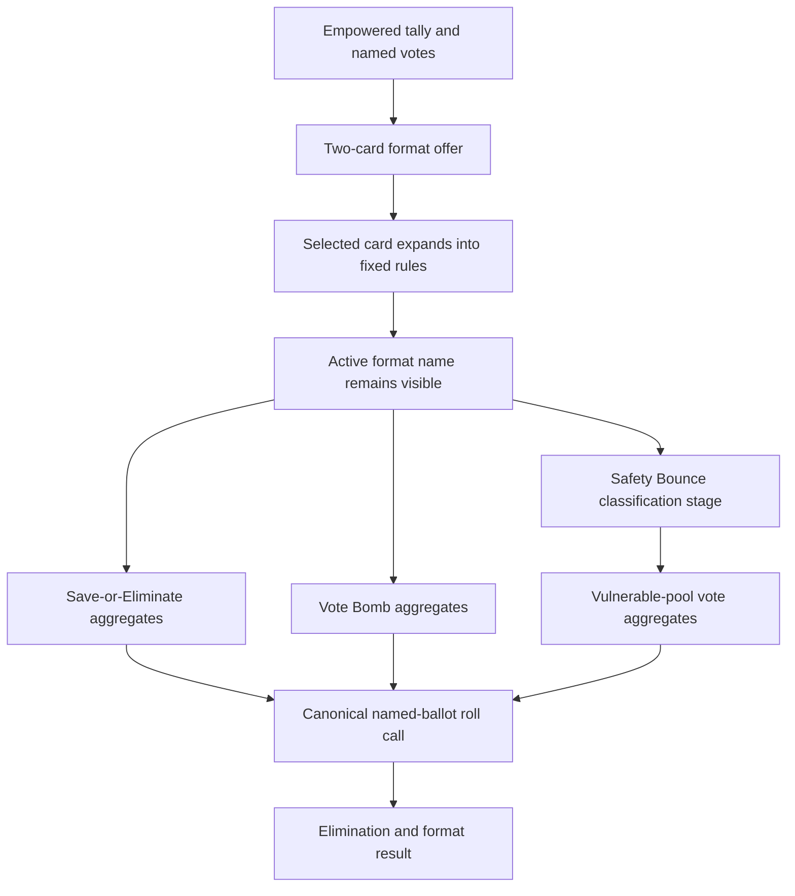
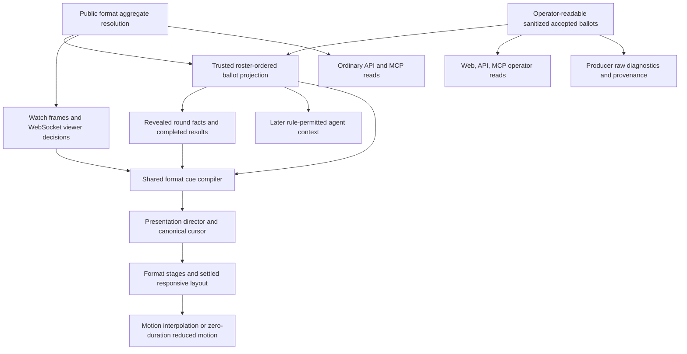

# Format-Aware Game Viewer - Plan

## Goal Capsule

- **Objective:** Give format-kernel games an event-authoritative web presentation for format selection, Empowered voting, Save-or-Eliminate, Vote Bomb, Safety Bounce, and phase-end ballot reveals while preserving every currently readable classic game.
- **Product authority:** This Product Contract governs the format-aware web experience and the downstream event/projection visibility needed to present it.
- **Surrounding authority:** Existing format mechanics, agent decision behavior, recovery boundaries, and endgame rules remain owned by their current plans and canonical implementations.
- **Open blockers:** None.
- **Execution profile:** Cross-package code work spanning web presentation and any narrowly required engine/API/MCP projection changes, followed by classic and format runtime proof.
- **Primary execution path:** Establish the ballot disclosure and kernel contracts first, build the shared typed presenter on those facts, add format stages and results, then close with classic/browser/MCP proof.
- **Completion signal:** Every format and classic lifecycle scenario in the Verification Contract passes without peer-ballot leakage into participating-agent context, premature visual reveal, transcript-derived format truth, or format audio.
- **Tail ownership:** U8 owns shared fixtures, browser evidence, documentation drift, broad gates, and removal of abandoned presentation experiments.

---

## Product Contract

### Summary

Influence will present classic and format-kernel games through distinct, kernel-aware viewing paths.
Format games receive a two-card format reveal, an Empowered-only vote presentation, format-specific resolution scenes, a staged sealed-ballot reveal, and a high-polish Safety Bounce classification stage.
Live viewing and completed replay use the same canonical sequence, while classic Power, Council, expose, replay, results, and MCP behavior remain readable.

### Problem Frame

The format kernel changed the standard round from Empower/Expose → Power → Council into Empower → format menu → format selection → format resolution.
The engine, API, replay transport, and MCP read models now carry typed format facts, but the main web presentation still assumes classic expose tallies, at-risk players, Power, and Council.
Routing format games through that presentation would misstate the rules, while deleting those concepts globally would break historical classic games.

Safety Bounce is also not a vote-table variation.
Its public accepted-pointer chain continually changes the current actor, remaining bench, and Safe/Vulnerable pools, so it needs a state-first scene with deliberate motion and replay choreography.

The current format ballot read contract exposes sanitized named ballots to operators, public event readers, and MCP readers immediately after durable append, while aggregate scores are resolution facts.
That immediate operator transport visibility remains intentional. “Sealed” constrains participating-agent knowledge and the staged web presentation; it is not a secrecy promise to operators, browser network clients, API consumers, or MCP consumers.
At resolution, the presentation projection combines the persisted aggregate, the already-durable ballot events, and stable roster order into the named roll call; the web stages aggregate totals before drawing it.

### Key Decisions

- **Use distinct actor terms.** (session-settled: user-directed — chosen over using player or viewer for both humans and competitors: human account holders and viewers are operators; AI competitors are agents.) Governs R1, R20-R22, R35-R36.
- **Route by game kernel.** (session-settled: user-directed — chosen over globally replacing classic presentation concepts: every currently readable classic game must remain readable.) Governs R3-R6, R31-R32, R38.
- **Share one canonical presentation contract across live and replay.** (session-settled: user-directed — chosen over separate live and replay choreography: transport timing may differ, but accepted events and their meaning may not.) Governs R7-R9, R37.
- **Present format selection as Card Duel → Expansion.** (session-settled: user-directed — chosen over a detached rules screen: the chosen card should emerge from the offered pair.) Governs R12-R14.
- **Present Safety Bounce as a Classification Stage.** (session-settled: user-directed — chosen over a chain-first layout: Safe and Vulnerable state stays primary while the current decision owns the center.) Governs R15-R19, R29-R30, R39.
- **Use adaptive Safety Bounce pacing.** (session-settled: user-directed — chosen over uniform timing: early beats establish the rules, the middle accelerates, and the closing choices regain suspense.) Governs R17-R19.
- **Reveal sealed ballots as Tally → Roll Call.** (session-settled: user-directed — chosen over a ledger cascade or candidate dossiers: aggregates establish what agents knew before the named social receipts appear.) Governs R20-R28, R34-R36.
- **Do not turn TV pacing into operator privacy theater.** (session-settled: user-directed — sanitized ballot events remain immediately readable by web transports, operator APIs, MCP consumers, and producers; only participating-agent context withholds peer identities while the UI delays drawing them.) Governs R22-R27, R34-R36.
- **Make roll-call order canonical without duplicating ballot facts.** (session-settled: user-directed — roster order applied by the trusted projection is the stable replay order; submission timing and UI-local reordering are not authoritative.) Governs R24-R26, R35.
- **Enter live games at the current presentation state.** (session-settled: user-directed — chosen over a bespoke late-join catch-up mode: normal live entry should not become a second replay system.) Governs R9, R37.
- **Disable animation without changing the presentation.** (session-settled: user-directed — chosen over alternate reduced-motion choreography: the same sequence and information remain, with animation removed.) Governs R29, R39.
- **Exclude audio.** (session-settled: user-directed — chosen over sound cues or a dynamic score: this scope earns suspense visually and does not create an audio system.) Governs R33, R40.

### Actors

- A1. **Operator** — a human account holder, anonymous viewer, authenticated viewer, or producer watching a live game or completed replay.
- A2. **Agent** — an AI competitor participating in the game and receiving only the game knowledge allowed by the active rules.
- A3. **Empowered agent** — the agent who chooses one of the House-offered formats and performs any format tiebreak the rules require.
- A4. **The House** — the game authority that offers formats, publishes fixed rules, accepts decisions, and emits canonical resolution facts.
- A5. **Public game reader** — a web, API, or MCP consumer reading public canonical game facts.
- A6. **Producer** — an operator with separate diagnostic and private-trace authority in addition to ordinary public game facts.

### Requirements

**Authority and compatibility**

- R1. Product copy, requirements, API descriptions, and MCP descriptions must use operator for humans and agent for AI competitors whenever the distinction matters.
- R2. Format presentation state, tallies, accepted choices, eligibility, phase changes, outcomes, and replay choreography must derive from canonical events or canonical-event-derived projections, never transcript prose.
- R3. A persisted game kernel must route a game to its classic or format presentation; missing legacy kernel metadata must preserve the existing classic interpretation rather than infer format mode from absent fields.
- R4. Format games must not display expose targets, selected/at-risk status, shields, classic Power actions, or Council as if those concepts were unresolved parts of the format round.
- R5. Classic games must retain their current expose, Power, Council, pressure, replay, results, and MCP facts; format cleanup must not delete or reinterpret those classic concepts.
- R6. Every currently readable classic game must remain legible in its current lifecycle surface: active live viewing, completed replay/results, and suspended or cancelled terminal presentation.
- R7. Live format viewing and completed format replay must feed the same presentation model from the same ordered canonical decisions and projected facts.
- R8. The client may interpolate presentation motion between canonical facts, but motion candidates, easing, pauses, and layout transitions must not become accepted game decisions.
- R9. An operator who opens, reloads, or reconnects to a live game starts at the current canonical presentation state and watches forward; no special catch-up replay or Jump to Live mode is introduced.
- R10. If a format event prefix is missing, contradictory, or insufficient to reconstruct a required scene, the UI must show a legible unavailable/incomplete state rather than parse transcript prose, guess a choice, or fabricate final pools.

**Empower and format selection**

- R11. A format-kernel standard vote must present only the Empowered contest, with clear aggregate totals and an easy-to-scan named voter-to-target ledger; it must not render an empty expose contest.
- R12. Between Empowered resolution and format selection, every operator and agent currently following the round must be able to see the same two House-offered format identities before the selected format is revealed; post-selection entry and reconnect follow R9.
- R13. The two offered formats must remain spatially stable while the selected card wins the comparison, moves to center, and expands into a concise fixed-rule reveal; the unselected card fades only after the choice is legible.
- R14. The selected card reveals its concise fixed rules during the selection scene. After that scene, only the active format name remains continuously visible throughout the format; it is not hidden behind a click, hover, popover, or keyboard action.

**Safety Bounce**

- R15. Safety Bounce must use a state-first Classification Stage with a stable Safe lane, a stable Vulnerable lane, one center actor, and a bench containing every unclassified agent.
- R16. Each accepted pointer must show the current actor, the canonical selected target becoming visually prominent, and that target moving into the correct Safe or Vulnerable lane; when motion is enabled, the beat also includes a presentation-only cycle across eligible bench agents.
- R17. The presentation-only pointer cycle may use deterministic pseudo-random movement, but it must always land on the canonical accepted target and must not imply that the acting agent considered or selected the intermediate names.
- R18. Every accepted pointer must receive a visible beat; early choices establish the interaction, middle choices accelerate, and closing choices slow as the remaining classifications become decisive.
- R19. Agent movement from bench to center to lane, pointer movement, target emphasis, and lane reflow must animate smoothly without obscuring the current actor, accepted target, or resulting classification.
- R20. Safety Bounce pointers remain public as accepted and may be followed by operators and agents; a sealed elimination ballot begins only after the final Safe/Vulnerable classification is established.
- R21. The final Safety Bounce state must clearly identify both pools, restrict elimination eligibility to Vulnerable agents, and distinguish a sole-vulnerable automatic elimination from a resolution with a final ballot.

**Sealed ballots and TV reveal**

- R22. During a sealed format ballot, participating agents must not receive named peer voter-to-target mappings; they receive only the aggregate information permitted by the game rule.
- R23. Sanitized named ballot events may be delivered immediately to anonymous web clients, operators, ordinary API consumers, MCP consumers, and producers. Once phase-end resolution exists, the presentation projection combines those existing events with stable roster order into the named roll call; no second persisted ballot ledger is required.
- R24. Phase-end presentation must first lock and display the same aggregate outcome agents were allowed to know, then reveal the named ledger as an ordered Voter → Target roll call.
- R25. The roll-call order must be derived by the trusted canonical projection from roster order and accepted ballot events; rendering components must not derive dramatic order from transcript text, submission timing, target totals, or local randomness.
- R26. Named ballots should reveal briskly at first and slow around decisive or final receipts, while pause, speed, and manual-advance controls continue to govern the presentation in live viewing and replay.
- R27. Tally → Roll Call is presentation choreography, not a public transport secrecy boundary. The browser may buffer already-received ballot identities until the phase-end reveal, but implementations must not suppress or reclassify sanitized ballot events as producer-only for operators, public API/event readers, or MCP consumers.
- R28. Save-or-Eliminate must present saves received, eliminate votes received, net scores, and elimination eligibility before its roll call; Vote Bomb must present totals, zero-vote safety, and the lowest-positive elimination rule before its roll call.

**Presentation resilience and surfaces**

- R29. With reduced motion enabled, the same layout, canonical event sequence, labels, selections, and results must render with animation disabled rather than with alternate choreography or skipped events.
- R30. Responsive layouts may reflow the same presentation for smaller screens, but they must preserve the center actor, bench membership, Safe/Vulnerable classification, aggregate totals, and named-ledger readability.
- R31. Completed format results must explain the selected format, outcome math, eliminated agent, and complete public ballot or Safety Bounce evidence without routing through classic Power/Council result assumptions.
- R32. Suspended or cancelled format games must preserve the last trustworthy format state and show their existing terminal status without inventing a completed resolution.
- R33. The new format presentation must not add sound cues, music, autoplay behavior, or an audio control surface.
- R34. Format presentation facts must expose an explicit lifecycle of `sealed`, `revealed`, `not_applicable`, or `unavailable`; `sealed` describes unresolved game knowledge and UI state, not operator transport confidentiality, and an empty ledger must not ambiguously represent all four states.
- R35. `format.resolved` is the canonical aggregate and presentation-reveal boundary, not a second ballot ledger or the first public access boundary for sanitized ballot identities. Public watch frames, WebSocket events, API reads, event filters, and MCP reads may expose accepted sanitized ballots earlier; participating-agent context must not.
- R36. Before `format.resolved`, participating agents may retain their own accepted ballot but must not receive peer ballot identities or a live partial tally unless a future canonical rule fact expressly permits it.
- R37. Pause retains locally buffered canonical beats and resumes them in order, while reload or reconnect hydrates the current canonical state and animates only later events.
- R38. Stored kernel identity wins routing; a null kernel with positive trusted format evidence may infer format, a null kernel without such evidence remains classic, and contradictory trusted facts render an incomplete diagnostic rather than silently switching modes.
- R39. Format controls must remain keyboard-operable, preserve focus through reflow, and communicate Safe/Vulnerable, score, and ballot meaning without relying on color or motion alone.
- R40. The existing no-op audio-cue interface remains outside this change; format work must not add audio assets, playback behavior, or an audio system.

### Key Flows

- F1. **Format round reveal**
  - **Trigger:** The Empowered result becomes canonical in a format-kernel standard round.
  - **Actors:** A1-A4
  - **Steps:** Present the Empowered tally and named votes; show the two offered cards; stage the canonical selection; expand the selected card into its fixed rules; then retain the active format name as a persistent visible label.
  - **Outcome:** Everyone following the round understands which format is active before format-aware play continues.
  - **Covers:** R11-R14.

- F2. **Safety Bounce classification**
  - **Trigger:** The canonical starter event establishes the first Safe agent.
  - **Actors:** A1-A4
  - **Steps:** Render the current pools and bench; stage each accepted pointer in canonical order; move the target into the correct lane; update the next actor; continue until all agents are classified.
  - **Outcome:** The operator can explain every Safe/Vulnerable classification and who made it.
  - **Covers:** R15-R21.

- F3. **Sealed-ballot resolution**
  - **Trigger:** A format ballot reaches its canonical phase-end resolution.
  - **Actors:** A1-A6
  - **Steps:** Lock the aggregate result; explain format-specific eligibility and math; reveal the canonical roster-ordered ballots one at a time; finish on the eliminated agent and resolution method.
  - **Outcome:** Agents learned only allowed aggregates during the sealed phase, while operators receive a phase-end aggregate-first presentation of the complete social receipt.
  - **Covers:** R22-R28.

- F4. **Classic compatibility**
  - **Trigger:** An operator or MCP reader opens a persisted classic game.
  - **Actors:** A1, A5, A6
  - **Steps:** Route by classic kernel or legacy-compatible metadata; retain expose/Power/Council facts and presentation; use the existing lifecycle-specific live, replay/results, or terminal surface.
  - **Outcome:** The format UI introduces no regression in reading classic games.
  - **Covers:** R3-R6.

### Acceptance Examples

- AE1. **Covers R3-R6.** Given a historical classic game with no format metadata, when an operator opens its live, completed, suspended, or cancelled surface, the UI retains the classic expose/Power/Council interpretation and MCP retains those facts.
- AE2. **Covers R4, R11.** Given a format-kernel standard vote, when the tally renders, it shows only Empowered totals and named Empowered votes; no empty expose column, at-risk label, shield state, Power action, or Council placeholder appears.
- AE3. **Covers R12-R14.** Given two offered formats and one accepted selection, replay first shows both stable cards, then centers and expands the selected card with its concise rules, then leaves only the active format name continuously visible after the reveal.
- AE4. **Covers R15-R20.** Given a Safety Bounce starter and three accepted pointers, each canonical prefix identifies one current actor, every classified agent appears in exactly one lane, and every remaining agent appears on the bench.
- AE5. **Covers R16-R17.** Given a deterministic presentation cycle that points past several eligible agents, only the canonical accepted target enlarges and changes classification; intermediate arrow positions do not appear as game decisions in replay or facts.
- AE6. **Covers R21.** Given Safety Bounce resolves with one Vulnerable agent, the UI explains automatic elimination and does not render a missing or empty final-ballot reveal as an error.
- AE7. **Covers R22-R27.** Given a sealed Vote Bomb ballot before resolution, a participating agent sees permitted aggregates but no named peer mapping, while operator WebSocket/API/MCP readers may inspect sanitized accepted ballots; at phase end, the UI shows totals first and then the complete canonical roll call.
- AE8. **Covers R24-R28.** Given Save-or-Eliminate resolves, the operator sees saves, eliminate votes, and nets before Voter → Target/Polarity rows reveal in canonical roster order.
- AE9. **Covers R7-R9.** Given the same completed canonical event sequence, live capture and completed replay produce the same meaningful scene order; an operator who joins the live game halfway through starts from the current state instead of replaying missed scenes.
- AE10. **Covers R10, R32.** Given a suspended format game whose trusted prefix ends before selection or resolution, the UI renders the last trustworthy menu/selection/board state and terminal status without transcript-derived repair.
- AE11. **Covers R29-R30.** Given reduced motion or a narrow viewport, the operator receives the same actors, classifications, tally, roll-call order, and outcome; reduced motion disables animation and responsive layout only reflows the composition.
- AE12. **Covers R22-R27, R34-R36.** Given first, middle, and final pre-resolution ballot prefixes, public watch frames, WebSocket consumers, ordinary API/MCP readers, and public event filters expose sanitized accepted ballot mappings while participating-agent context does not; the web UI draws no named roll call until `format.resolved`, then projects those same ballots in roster order.
- AE13. **Covers R9-R10, R37.** Given reload or reconnect during a format reveal, the viewer snaps to the latest complete canonical state without replaying obsolete animation, deduplicates by canonical sequence, and animates only new decisions.
- AE14. **Covers R7-R9, R24-R26, R37.** Given an operator pauses live presentation while resolution, elimination, and phase-transition facts arrive, resuming presents the buffered aggregate, ledger, tiebreak receipt when applicable, and outcome once each in canonical order.
- AE15. **Covers R10, R38.** Given missing menu, invalid selection, unknown roster identity, duplicate ballot, broken Safety Bounce actor continuity, tally disagreement, or a stored-kernel contradiction, only the last trustworthy state renders and no transcript-derived repair occurs.
- AE16. **Covers R29-R30, R39-R40.** Given reduced motion and a narrow viewport, each canonical pointer and ballot remains a discrete readable beat, keyboard controls retain focus, classification does not depend on color, and no audible playback exists.
- AE17. **Covers R31-R32.** Given a multi-round format game or a suspended/cancelled format prefix, completed results show per-round format evidence and the terminal viewer shows a read-only last-trustworthy state without inventing completion.
- AE18. **Covers R3-R6, R38.** Given stored classic, inferred legacy classic, stored format, inferred format, and contradictory fixtures, each supported game selects the intended presentation and every current classic web/MCP fact remains readable.

### Success Criteria

- Operators can explain which format was offered, which format was selected, how the round resolved, and who voted for whom without consulting transcript prose.
- Safety Bounce remains legible at every accepted pointer prefix and feels deliberate in normal motion while retaining identical information with animation disabled.
- Live viewing and completed replay agree on canonical selection, classification, tally, ledger order, and outcome.
- Save-or-Eliminate and Vote Bomb make their distinct scoring and safety rules clear before named ballots appear.
- Every current classic compatibility fixture and lifecycle surface remains readable through web and MCP.
- Runtime browser proof covers one game for each format plus representative active, completed, and non-completed classic games.

### Scope Boundaries

In scope:

- Kernel-aware web routing and presentation.
- Format offer, selection, fixed-rule reveal, and a continuously visible active-format name.
- Empowered-only format voting and clearer named vote presentation.
- Save-or-Eliminate, Vote Bomb, and Safety Bounce live/replay/result presentation.
- Phase-end sealed-ballot aggregates and canonical named-ledger reveal.
- Narrow projection/watch/API/MCP contract changes required to stage the phase-end reveal sequence without changing persisted ballot payloads.
- Responsive and animation-disabled presentation parity.
- Classic web and MCP regression coverage.

Out of scope:

- Changes to the three format rulebooks, menu fitness, tie mechanics, or endgame.
- New formats or Classic Influence as a selectable format card.
- Sound effects, music, autoplay, or audio controls.
- A special late-join catch-up mode.
- Transcript parsing for any format fact.
- Mid-action crash recovery or repair of historically unrecoverable games.
- Replacing the grandfathered classic parser in this pass.
- New active-match API or MCP action tools.

<!-- ce-section: work-relationships -->
### How This Work Fits Together

This plan owns the missing human-facing format presentation and the visibility contract required to stage it.
The surrounding work remains separately owned:

- **Depends on:** the format kernel mechanics and fixed rule sheets in `docs/plans/2026-07-23-001-feat-sequester-format-kernel-plan.md`.
- **Depends on:** kernel-aware MCP facts in `docs/plans/2026-07-24-002-feat-format-kernel-mcp-readability-plan.md`.
- **Builds on:** typed viewer decisions, Safety Bounce prefix reconstruction, and classic parser quarantine from `docs/plans/2026-07-25-002-fix-event-driven-format-replay-plan.md`.
- **Clarifies one prior contract:** named sanitized format ballots remain immediately operator-readable; aggregates precede the named ledger only in participating-agent knowledge and the staged web presentation.
- **Can proceed independently of:** broader checkpoint continuity and selective context-recall work, provided their canonical event contracts remain stable.

### Dependencies and Assumptions

- The game kernel is persisted or can be recovered through a legacy-safe compatibility rule.
- Canonical format menu, selection, Safety Bounce, resolution, and classic decision events remain available through current engine/API contracts.
- Safety Bounce accepted-pointer prefixes remain ordered and validate actor continuity, classification uniqueness, and roster membership.
- The phase-end aggregate and named-ledger sequence requires a deliberate presentation change from the current immediate ballot display, not a persisted-data change.
- Producer-private raw envelopes, source pointers, and cognition remain separate from the public sanitized ledger.
- Existing viewer controls can be reused or extended to govern pause, speed, and manual advancement without changing game authority.
- Launch-format display names and fixed rule sheets are immutable for the current format version; future rule changes require versioned metadata rather than silently changing historical replay copy.
- The existing replay-watch-frame endpoint remains the trusted hydration source for live entry, reconnect repair, completed replay, and format terminal snapshots.

### Outstanding Questions

No launch-blocking questions remain.
Responsive geometry may be tuned during implementation without changing the information hierarchy or settled presentation contract.

### Sources

- `AGENTS.md`
- `CONCEPTS.md`
- `docs/prototypes/safety-bounce-ui.html`
- `docs/format-kernel-web-contract-drift.md`
- `docs/brainstorms/2026-07-23-sequester-format-kernel-requirements.md`
- `docs/brainstorms/2026-07-24-format-kernel-mcp-readability-requirements.md`
- `docs/plans/2026-07-25-002-fix-event-driven-format-replay-plan.md`
- `packages/engine/src/viewer-decision-events.ts`
- `packages/engine/src/revealed-round-facts.ts`
- `packages/engine/src/game-projection.ts`
- `packages/api/src/services/game-watch-state.ts`
- `packages/web/src/app/games/[slug]/components/message-parsing.ts`
- `packages/web/src/app/games/[slug]/components/match-watch-model.ts`
- `packages/web/src/app/games/[slug]/components/match-watch-shell.tsx`
- `packages/web/src/app/games/[slug]/components/vote-display.tsx`
- `packages/web/src/app/games/[slug]/components/completed-results-review.tsx`

---

## Planning Contract

### Key Technical Decisions

- KTD1. **Project the replay roll call from existing canonical facts.** Keep sanitized `format.ballot_cast` decisions as the only persisted voter-to-target facts. Once `format.resolved` exists, the trusted projection orders the accepted ballots by canonical roster order and exposes stable voter identity, target identity, and polarity; rendering components consume that projection and do not independently sort it. Covers R22-R28, R34-R36.
- KTD2. **Represent presentation lifecycle separately from transport visibility.** Replace ambiguous array emptiness with a ballot-presentation object containing `sealed`, `revealed`, `not_applicable`, or `unavailable` plus the projected roster-ordered entries when revealed. `sealed` may coexist with operator-readable accepted ballot events; it means the ballot is unresolved and the UI has not drawn the roll call. Sole-vulnerable Safety Bounce is `not_applicable`; malformed or contradictory history is `unavailable`. Covers R10, R21-R28, R34-R36.
- KTD3. **Do not add a duplicate ballot artifact or historical compatibility mode.** (session-settled: user-approved — chosen after confirming current and historical format games already persist complete `format.ballot_cast` facts and roster identity.) `format.resolved` gates aggregate-first presentation, while the same projection derives roster order for every supported format game. No `ballotReveal`, `legacy_derived` branch, payload migration, or old-row rewrite is introduced; incomplete history never falls back to transcript prose. Covers R7, R10, R23-R25, R31-R32.
- KTD4. **Keep participating-agent knowledge separate from operator-facing readers.** The agent context path may retain the acting agent's own ballot receipt but exposes no peer identities or live partial tally before resolution. Operator WebSocket/API/MCP readers may receive sanitized peer mappings immediately; later rule-permitted agent context may include the resolved ballot projection. Source pointers, cognition, and unsanitized diagnostic envelopes remain producer-only. Covers R22-R23, R27, R35-R36.
- KTD5. **Put kernel identity into the main watch contract.** Add `gameKernel` and `gameKernelSource` to the versioned watch state and game detail DTOs, using the established stored-first resolver. Null metadata plus trusted `format.*` evidence infers format, null with no evidence remains classic, and stored/event contradictions produce a diagnostic instead of route switching. Covers R3-R7, R31-R32, R38.
- KTD6. **Compile one typed presentation cue stream for live and replay.** A pure format presenter consumes kernel identity, ordered viewer decisions, trusted roster identities, and canonical prefixes, then emits discriminated cues with stable sequence keys and before/after snapshots. Live WebSocket decisions and replay-frame decisions feed the same reducer; components render cues and never independently reduce game facts. Covers R2, R7-R10, R15-R28, R31-R32.
- KTD7. **Extract one shared presentation director for pacing and controls.** Refactor the existing replay theater's cursor, timers, play/pause, speed, and manual-advance behavior into the shared director; do not add a second controller beside it. Classic transcript scenes and typed format cues are different inputs to that one controller, while `DramaticReplayViewer` becomes a renderer/adapter. Canonical truth is committed from the cue, never from animation callbacks, and speed changes affect duration only. Covers R7-R9, R18, R24-R26, R29, R37.
- KTD8. **Hydrate current state on live entry and reconnect.** (session-settled: user-approved — chosen over replaying missed choreography: reload/reconnect fetches trusted frames through the current event cursor, snaps to the latest complete canonical snapshot, and animates only higher-sequence decisions.) A deliberate local pause retains buffered cues and resumes them in order without introducing a separate catch-up mode or Jump to Live control. If a live-entry or reconnect fetch fails, retain the last trustworthy screen, show `Reconnecting presentation…`, retry at most twice, then show a reloadable `Presentation unavailable` state while the surrounding game page remains usable. Covers R9-R10, R37.
- KTD9. **Add Motion for React below the deterministic director.** (session-settled: user-approved — chosen over a home-grown CSS/WAAPI/FLIP framework: controlled pause, speed, lane relocation, interruption, and reduced-motion behavior justify the dependency.) Add `motion` to the web package, import from `motion/react`, keep responsive CSS authoritative for settled layout, and use retained `useAnimate()` controls only for transport-significant choreography. Covers R7-R9, R15-R19, R24-R26, R29-R30, R37, R39.
- KTD10. **Use the same DOM and cue sequence for reduced motion.** `MotionConfig` follows the user's setting, while the presentation boundary also uses `useReducedMotion()` to complete active controls, suppress presentation-only arrow cycling, and zero animation interpolation while the director preserves each canonical cue as a readable dwell or manual-advance step. A CSS media-query kill switch disables remaining decorative transitions; there is no alternate reduced-motion tree. Covers R17-R19, R29-R30, R39.
- KTD11. **Quarantine format authority from the classic parser island.** Classic games keep the current transcript-built replay, expose/Power/Council tags, vote display, and parser behavior. Format phases replace authoritative House ballot/rules transcript scenes with typed cues while preserving social transcript scenes, including `FORMAT_MINGLE`. Covers R2-R7, R11-R14, R31.
- KTD12. **Centralize immutable launch-format presentation metadata behind a browser-safe entry.** Export format ID, display name, and concise fixed rules from a pure engine-owned package subpath with no Node, provider, runner, or MCP imports. Client components import that leaf instead of the engine root barrel; API and MCP consume the same source. The current launch rules are immutable; a future rule change requires a versioned format contract rather than changing historical replay copy. Covers R12-R14, R28, R31.
- KTD13. **Render terminal format games as read-only trusted snapshots.** (session-settled: user-approved — chosen over a generic status-only format page: suspended and cancelled format games retain the last valid menu, selection, Classification Stage, or sealed state beneath the existing terminal status.) Classic terminal surfaces remain unchanged, and neither kernel gains synthetic completion. Covers R6, R10, R32, R38.
- KTD14. **Fail closed at the affected format presenter.** Validate offered-pair membership, empowered identity, ballot uniqueness and roster membership, format consistency, Safety Bounce actor continuity and classification uniqueness, aggregate/ballot agreement, and required predecessors. On the first contradiction, retain the last valid snapshot, mark the format presentation incomplete, and ignore later format facts for that round while the surrounding game page remains usable. Covers R10, R21-R25, R32, R38.

### High-Level Technical Design

The change separates accepted game truth, participating-agent knowledge, presentation sequencing, and animation.
Sanitized accepted ballots remain the durable operator-readable voter-to-target facts, while the resolution event owns only the aggregate outcome and the boundary at which the UI may draw the roll call.
The agent-context lane retains its narrower rule-aware view, and the browser delays drawing identities for TV pacing without claiming transport secrecy.
The browser compiles typed decisions into stable cues, and Motion interpolates between cue-owned snapshots.

The web timeline becomes a discriminated scene stream:

- transcript scenes remain authoritative only for existing classic compatibility and social dialogue;
- typed format cues own Empowered tally, menu, selection, rules, Safety Bounce, aggregate reveal, named roll call, tiebreak, and elimination;
- each typed cue carries a canonical sequence key, round, phase, semantic kind, before/after snapshot, and base timing;
- live adapters append and deduplicate decisions by `gameId + sequence`;
- replay adapters extract the same decisions from replay frames;
- format terminal adapters compile only the trusted prefix and stop at the first invalid cue.

### Disclosure and Routing Matrices

| State | Participating agent | Operator web/API/MCP transport | Web presentation | Producer raw diagnostics |
|---|---|---|---|---|
| Ballot not applicable | Rule state only | `not_applicable` | No ballot reveal | Canonical events if any |
| Ballot in progress | Own accepted receipt only; no peer identities or partial tally | Sanitized accepted ballot mappings are readable | `sealed`; identities buffered or ignored, not drawn | Raw accepted envelopes and provenance |
| Resolution persisted | Later rule-permitted context may use resolved ballots | Aggregate resolution plus existing sanitized ballot events in roster order | Draw aggregates, then projected roll call | Sanitized ballots plus raw envelopes/provenance |
| Trusted prefix incomplete | Last permitted facts; no repair | Sanitized accepted events remain readable | `unavailable`; no invented outcome or roll call | Raw evidence remains inspectable |

| Stored kernel | Trusted event evidence | Route |
|---|---|---|
| `format` | Compatible format prefix | Format presentation |
| `classic` | Classic or no format evidence | Classic presentation |
| null | Positive format evidence | Inferred format presentation |
| null | Classic or no kernel evidence | Inferred classic presentation |
| Either stored value | Contradictory trusted kernel evidence | Stored route with incomplete diagnostic; never silent switching |

### Presentation State and Interruption Rules

- Initial live load and reconnect compile the trusted prefix directly to its latest complete snapshot with animation disabled for the hydration step.
- Higher-sequence decisions received after the watermark become playable cues.
- Duplicate or lower-sequence decisions are ignored.
- Numeric gaps between projected viewer-decision IDs are allowed and do not themselves trigger repair; reconnect or an explicit transport resync signal refetches the current trusted snapshot.
- A failed initial or reconnect snapshot request retries at most twice. During reconnect the last trustworthy screen remains visible; after exhaustion the format theater shows a reload action instead of spinning or guessing.
- Local pause freezes the active controlled cue and buffers later canonical cues.
- Manual advance completes the active cue to its canonical final snapshot, then advances one beat.
- Resume continues buffered beats in canonical order; speed changes alter durations but never cue membership or order.
- Phase transitions and later-round facts wait behind unresolved format cues already accepted by the client.
- Reduced motion preserves every canonical cue as an immediate state change and removes only presentation-generated intermediates.
- Starting a new round resets menu, active-format name, board pools, tally, and ledger from the new canonical prefix before any new animation begins.

### System-Wide Impact

- **Event contract:** No new persisted ballot artifact, payload migration, or old-row rewrite is introduced; existing `format.ballot_cast`, roster, and `format.resolved` facts are sufficient.
- **Visibility:** ordinary operator-facing watch, WebSocket, API/event, and MCP surfaces retain sanitized `format.ballot_cast` decisions before resolution; only presentation drawing is delayed.
- **Agent knowledge:** sealed-phase prompt context remains narrower than operator-facing reads and omits peer mappings.
- **Watch API:** the versioned state adds kernel identity and diagnostics; replay frames remain the hydration/catch-up authority.
- **Web architecture:** the live WebSocket consumer starts retaining viewer decisions, and the replay theater consumes decision frames rather than using them only for pressure snapshots.
- **Results:** per-round format facts join the completed vote matrix and narrative without deleting classic columns.
- **Accessibility:** motion, color, and pointer cycling become optional expression layers over stable labels and state.
- **Dependency surface:** `motion` is added only to `packages/web`; no database migration is required.

### Sequencing

1. Land the roster-ordered ballot projection, presentation lifecycle, and agent-context boundary without changing persisted ballot or resolution payloads.
2. Make API/MCP/watch tests assert immediate operator visibility and separate participating-agent redaction before building UI pacing.
3. Add kernel identity and trusted live hydration to the watch contract.
4. Build and test the pure format cue compiler and presentation director.
5. Integrate typed scenes, Empowered voting, format offer/selection, and fixed rules.
6. Add format aggregates, roll call, and the Safety Bounce Classification Stage with Motion and accessibility parity.
7. Add completed-results and terminal-format presentation.
8. Run the shared fixture matrix, classic characterization, browser proof, documentation drift audit, and broad repo gates.

### Risks and Mitigations

| Risk | Failure mode | Mitigation |
|---|---|---|
| Privacy-theater drift | Implementers suppress operator ballot events because the UI delays drawing them | Assert immediate web/API/MCP event visibility and agent-only redaction in the same fixture matrix |
| Duplicate ballot authority | A new resolution ledger disagrees with existing accepted ballot events | Keep `format.ballot_cast` as the only persisted mapping and derive roster order in one trusted projection |
| Kernel drift | Browser guesses format from absent classic fields | Carry stored/inferred kernel in watch DTO and fail closed on contradiction |
| Timer races | Live append, pause, and animation callbacks reorder scenes | One reducer/director, injected clock, canonical watermark, cancellable generation guards |
| Strict Mode duplicate effects | Development double-run starts duplicate timers or animations | Cleanup every effect and bind animations/subscriptions to the active director generation |
| Responsive movement corruption | Resize during card transit loses or duplicates a player | Stable player-ID keys, CSS-owned settled layout, controlled completion to canonical snapshots |
| Reduced-motion divergence | Alternate tree skips a pointer or ledger entry | Same cues, DOM, and final snapshots with zero-duration effects |
| Classic regression | Global cleanup removes expose/Power/Council behavior | Kernel-local routing and `edge-smoke-dusk` characterization across web and MCP |
| Terminal fabrication | Suspended prefix appears completed | Compile trusted prefix only and retain explicit terminal/incomplete status |

### Research That Shapes the Plan

- `docs/solutions/design-patterns/house-highlights-visual-briefs-before-media-generation.md` establishes the split between factual selection, typed presentation direction, and rendering.
- `docs/solutions/architecture-patterns/owner-scoped-alliance-read-models.md` confirms that public resolved vote ledgers belong in revealed facts, not an owner-scoped private model.
- `docs/solutions/architecture-patterns/production-mcp-role-resource-split.md` keeps ordinary public game facts in `games:read` and raw diagnostic evidence in `producer`.
- `docs/solutions/runtime-errors/api-startup-recovery-resumes-interrupted-games.md` requires incomplete canonical prefixes to fail closed without transcript repair.
- `docs/solutions/architecture-patterns/shared-postgres-tests-use-a-process-advisory-lock.md` requires `setupTestDB()` and non-concurrent DB tests.
- [Motion installation and Next.js compatibility](https://motion.dev/docs/react-installation), [layout animation](https://motion.dev/docs/react-layout-animations), [animation controls](https://motion.dev/docs/react-use-animate), and [reduced motion](https://motion.dev/docs/react-accessibility) support the chosen client animation layer.
- [React effect synchronization](https://react.dev/learn/synchronizing-with-effects) requires effect cleanup that survives Strict Mode.
- [Playwright Clock](https://playwright.dev/docs/clock) and [media emulation](https://playwright.dev/docs/api/class-page#page-emulate-media) support deterministic timing and reduced-motion browser proof.

---

## Implementation Units

### U1. Project the phase-end roll call

- **Goal:** Give every supported format round one engine-owned roster-ordered roll-call projection while retaining the existing persisted ballot and resolution contracts.
- **Requirements:** R2, R7, R10, R21-R28, R34-R36.
- **Flows and examples:** F3; AE6-AE8, AE12, AE15.
- **Dependencies:** None.
- **Files:**
  - `packages/engine/src/viewer-decision-events.ts`
  - `packages/engine/src/revealed-round-facts.ts`
  - `packages/engine/src/context-builder.ts`
  - `packages/engine/src/formats/house-resolution-facts.ts`
  - `packages/engine/src/__tests__/canonical-events.test.ts`
  - `packages/engine/src/__tests__/revealed-round-facts.test.ts`
  - `packages/engine/src/__tests__/format-kernel-integration.test.ts`
- **Approach:**
  - Keep `FormatResolutionPayload` unchanged and retain `format.ballot_cast` as the only persisted voter-to-target mapping.
  - Project accepted ballots into canonical roster order only when the round has a trusted `format.resolved` event.
  - Keep sanitized `format.ballot_cast` in the ordinary `ViewerDecisionEvent` union and projector; exclude peer mappings only from participating-agent context.
  - Replace `sealedBallots`/`sealedBallotAccess` with the explicit lifecycle object from KTD2.
  - Use the same projection for every supported persisted format game; do not add a legacy source marker or a second data path.
  - Keep agent context on the separate KTD4 path, including own-receipt and post-resolution behavior.
- **Test Scenarios:**
  - First, middle, and final ballot prefixes expose sanitized mappings to operator readers while participating-agent context remains sealed.
  - Resolution changes presentation lifecycle to `revealed` and exposes the existing accepted ballots in roster order with stable polarity.
  - Current and historical format games use the same projection and produce the same order from the same facts.
  - Sole-vulnerable Safety Bounce reports `not_applicable`.
  - Missing, duplicate, unknown-player, wrong-format, and aggregate-mismatch histories report `unavailable`.
  - Agent context never exposes peer ballots before resolution.
- **Verification:** Focused engine tests prove unchanged canonical payloads, roster-ordered projection, reveal lifecycle, agent knowledge, and all three format branches before downstream contracts change.

### U2. Enforce operator visibility and agent-context parity

- **Goal:** Keep sanitized accepted ballots immediately readable across operator surfaces, preserve agent-context redaction, and make the phase-end projection use those same ballots.
- **Requirements:** R1-R2, R5, R22-R28, R34-R36.
- **Flows and examples:** F3-F4; AE1, AE7-AE8, AE12, AE18.
- **Dependencies:** U1.
- **Files:**
  - `packages/api/src/services/ws-manager.ts`
  - `packages/api/src/services/game-watch-state.ts`
  - `packages/api/src/services/public-watch-intelligence.ts`
  - `packages/api/src/game-mcp/read-model.ts`
  - `packages/api/src/game-mcp/server.ts`
  - `packages/api/src/game-mcp/rules.ts`
  - `packages/api/src/__tests__/websocket.test.ts`
  - `packages/api/src/__tests__/game-watch-state.test.ts`
  - `packages/api/src/__tests__/public-watch-intelligence.test.ts`
  - `packages/api/src/__tests__/production-game-mcp-read-model.test.ts`
  - `packages/api/src/__tests__/production-game-mcp-server.test.ts`
- **Approach:**
  - Continue projecting sanitized `format.ballot_cast` through public WebSocket, replay-frame, event-filter, and intelligence surfaces.
  - Project the existing accepted ballots through the shared revealed-facts contract in roster order once `format.resolved` exists, without creating a second persisted ledger.
  - Keep operator-facing sanitized reads equivalent and keep unsanitized provenance/raw evidence producer-only.
  - Preserve producer-mode raw ballot envelopes and provenance.
  - Update MCP schemas, tool descriptions, and fixed rules to state that sealed describes agent knowledge and UI pacing, not MCP confidentiality.
- **Test Scenarios:**
  - Operator `filter_events`, WebSocket, watch frames, `read_round_facts`, and public intelligence expose sanitized pre-resolution mappings; participating-agent prompts do not.
  - The post-resolution roll-call projection contains every accepted sanitized ballot already visible to operator readers exactly once.
  - Producer raw mode retains canonical envelopes without altering the public DTO.
  - Classic MCP standard vote, Power, Council, projection, and event-filter fixtures remain unchanged.
- **Verification:** Run focused API/MCP contract tests against the shared Postgres harness; every DB-mutating test calls `setupTestDB()` and remains non-concurrent.

### U3. Put kernel identity and hydration into the watch contract

- **Goal:** Let live, replay, results, and terminal routes choose the correct presentation without browser inference and recover the current typed prefix after entry or reconnect.
- **Requirements:** R3-R10, R31-R32, R37-R38.
- **Flows and examples:** F1-F4; AE9-AE10, AE13-AE15, AE17-AE18.
- **Dependencies:** U1, U2.
- **Files:**
  - `packages/engine/src/game-kernel.ts`
  - `packages/api/src/services/game-watch-state.ts`
  - `packages/api/src/services/completed-game-results.ts`
  - `packages/api/src/routes/games.ts`
  - `packages/web/src/lib/api.ts`
  - `packages/web/src/app/games/[slug]/game-viewer.tsx`
  - `packages/web/src/app/games/[slug]/components/match-watch-model.ts`
  - `packages/api/src/__tests__/game-watch-state.test.ts`
  - `packages/api/src/__tests__/games-api.test.ts`
  - `packages/engine/src/__tests__/game-kernel.test.ts`
  - `packages/web/src/__tests__/match-watch-model.test.ts`
- **Approach:**
  - Add `gameKernel`, `gameKernelSource`, and contradiction diagnostics to a new additive watch-state schema version and `GameDetail`.
  - Thread completed-results kernel identity through the web response type instead of dropping it.
  - Apply the KTD5 routing matrix in one pure web route decision.
  - Load trusted replay frames for live initial state and terminal format state.
  - On reconnect or an explicit transport resync signal, request the current trusted frames, merge by `gameId + sequence`, and hydrate before later events play; sparse projected IDs alone are not an error.
  - Retain the last trustworthy screen during a failed reconnect, retry the snapshot request at most twice, and then expose a reloadable presentation-unavailable state without disabling the surrounding game page.
  - Retain viewer decisions in the live WebSocket switch; stop silently ignoring the declared event variant.
- **Test Scenarios:**
  - Stored and inferred classic/format fixtures route correctly.
  - Stored/event contradiction renders an incomplete diagnostic without switching routes.
  - Live initial entry during menu, selection, Safety Bounce, sealed ballot, and resolution hydrates current state.
  - Duplicate/out-of-order events do not regress the cursor; sparse viewer-decision IDs do not cause false repair.
  - One transient hydration failure recovers automatically; repeated failure stops after two retries and exposes Reload instead of spinning indefinitely.
  - Completed format replay remains available from typed frames even when format transcript messages are absent.
- **Verification:** API/watch and web-model tests prove schema compatibility, routing, cursor monotonicity, and hydration behavior before presentation components depend on them.

### U4. Build the shared presentation compiler, director, and animation boundary

- **Goal:** Establish one deterministic, controllable presentation substrate for every format scene in live and replay.
- **Requirements:** R2, R7-R10, R17-R19, R24-R26, R29-R30, R37, R39-R40.
- **Flows and examples:** F1-F3; AE3-AE5, AE7-AE11, AE13-AE16.
- **Dependencies:** U2, U3.
- **Files:**
  - `packages/web/package.json`
  - `bun.lock`
  - `packages/web/src/app/games/[slug]/components/types.ts`
  - `packages/web/src/app/games/[slug]/components/format-presentation-model.ts`
  - `packages/web/src/app/games/[slug]/components/format-presentation-director.ts`
  - `packages/web/src/app/games/[slug]/components/dramatic-replay-viewer.tsx`
  - `packages/web/src/app/games/[slug]/components/match-watch-shell.tsx`
  - `packages/web/src/app/games/[slug]/components/match-watch-model.ts`
  - `packages/web/src/app/games/[slug]/components/constants.ts`
  - `packages/web/src/__tests__/format-presentation-model.test.ts`
  - `packages/web/src/__tests__/format-presentation-director.test.ts`
  - `packages/web/src/__tests__/match-watch-shell.test.tsx`
- **Approach:**
  - Add `motion` and a deep client-only animation boundary.
  - Define the discriminated cue/scene union and pure prefix compiler from KTD6.
  - Extract the existing replay theater's playback state, clock, timers, and control transitions into the KTD7 reducer/director with an injected clock and explicit animation-control adapter.
  - Keep exactly one cursor and timer owner: `DramaticReplayViewer` renders director state and dispatches commands but does not retain a competing playback clock.
  - Extend playback state with canonical sequence instead of matching typed beats through transcript timestamp alone.
  - Select separate classic and format phase rails; include all four format phases and `FORMAT_MINGLE`.
  - Keep classic transcript-scene behavior isolated while enabling typed format scenes in the same theater controls.
  - Implement the KTD8 pause, resume, manual-complete, reconnect, and round-reset rules.
- **Test Scenarios:**
  - Live and replay inputs produce equal cue streams at every canonical prefix.
  - Deduplication, pause/resume, manual advance, speed change, reconnect hydration, and round reset preserve sequence.
  - Classic and format scenes use one controller; no render path can start a second timer or advance an independent cursor.
  - Reduced motion yields identical semantic snapshots without presentation-only intermediates.
  - Strict Mode effect reruns do not duplicate timers, cues, or animation controls.
  - Format presentation adds no audio assets or playback behavior.
- **Verification:** Pure model/director tests use a fake clock; component tests verify semantic DOM and controls without depending on fragile intermediate pixels.

### U5. Present Empowered voting and the format offer

- **Goal:** Replace classic expose/Power assumptions in format rounds with clear Empowered voting, Card Duel selection, a one-time fixed-rules reveal, and a continuously visible active-format name.
- **Requirements:** R4, R7, R11-R14, R29-R30, R39-R40.
- **Flows and examples:** F1; AE2-AE3, AE9, AE11, AE16.
- **Dependencies:** U4.
- **Files:**
  - `packages/engine/src/formats/types.ts`
  - `packages/engine/src/format-pressure.ts`
  - `packages/engine/src/format-presentation-metadata.ts`
  - `packages/engine/package.json`
  - `packages/engine/src/index.ts`
  - `packages/web/src/app/games/[slug]/components/format-presentation.tsx`
  - `packages/web/src/app/games/[slug]/components/format-empower-vote-stage.tsx`
  - `packages/web/src/app/games/[slug]/components/format-offer-stage.tsx`
  - `packages/web/src/app/games/[slug]/components/active-format-label.tsx`
  - `packages/web/src/app/games/[slug]/components/match-watch-shell.tsx`
  - `packages/web/src/app/games/[slug]/components/dramatic-replay-viewer.tsx`
  - `packages/web/src/__tests__/format-presentation.test.tsx`
  - `packages/web/src/__tests__/match-watch-shell.test.tsx`
- **Approach:**
  - Add an explicit browser-safe package export for KTD12 format presentation metadata and consume that leaf from client components; API/MCP use the same source without duplicating rule copy.
  - Keep the browser entry transitively free of Node built-ins, provider clients, runners, local MCP, and simulation modules.
  - Render only Empowered totals and voter-to-Empowered receipts on format standard votes.
  - Suppress format-route expose scores, pressure tags, shields, Power, and Council without changing classic renderers.
  - Implement stable offered cards, selected-card center expansion, concise rules during the reveal, and the persistent non-interactive active-format label afterward.
  - Late entry before selection shows the offered pair without a winner; late entry after selection shows the active format name and current format state without replaying or reopening the rules reveal.
- **Test Scenarios:**
  - Format vote shows Empowered totals and receipts with no expose/Power/Council artifacts.
  - Classic vote still shows its existing empower/expose contract.
  - Both offered formats stay stable until canonical selection; only the selected card expands.
  - Reload after selection renders the active format name and current format state directly, without reopening the rules reveal.
  - Long names, keyboard focus, narrow layout, and reduced motion retain all labels and selections.
  - A production web build imports the metadata through the browser-safe package subpath without resolving the engine root barrel or Node-only modules.
- **Verification:** Engine metadata and web component tests prove copy ownership, kernel-local cleanup, and live/replay parity for menu and selection; the production web build proves the client entry remains browser-safe.

### U6. Present format resolution and Safety Bounce

- **Goal:** Deliver the Tally-to-Roll-Call reveal for all formats and the high-polish Safety Bounce Classification Stage.
- **Requirements:** R7-R10, R15-R30, R34-R40.
- **Flows and examples:** F2-F3; AE4-AE16.
- **Dependencies:** U4, U5.
- **Files:**
  - `packages/engine/src/viewer-decision-events.ts`
  - `packages/web/src/app/games/[slug]/components/format-resolution-stage.tsx`
  - `packages/web/src/app/games/[slug]/components/format-ballot-reveal.tsx`
  - `packages/web/src/app/games/[slug]/components/safety-bounce-stage.tsx`
  - `packages/web/src/app/games/[slug]/components/format-presentation-model.ts`
  - `packages/web/src/app/games/[slug]/components/format-presentation-director.ts`
  - `packages/web/src/app/games/[slug]/components/format-presentation.tsx`
  - `packages/web/src/__tests__/format-presentation-model.test.ts`
  - `packages/web/src/__tests__/format-presentation.test.tsx`
  - `packages/web/src/__tests__/safety-bounce-stage.test.tsx`
  - `packages/engine/src/fixtures/format-kernel-viewer.ts`
  - `e2e/format-aware-game-viewer.spec.ts`
- **Approach:**
  - Validate every Safety Bounce prefix with engine-consistent starter, actor, target, classification, roster, and final-pool rules.
  - Derive presentation-only pointer candidates from a pure seed of game ID, round, canonical sequence, roster, and accepted target; always finish on the canonical target.
  - Use controlled Motion animations for pointer cycling and transport-significant card movement; use layout animations only for incidental lane reflow.
  - Render Save-or-Eliminate saves, eliminates, nets, eligibility, ledger, tiebreak, and elimination in order.
  - Render Vote Bomb totals, zero-vote safety, lowest-positive eligibility, ledger, tiebreak, and elimination in order.
  - Render Safety Bounce pools, final vulnerable eligibility, vote totals, ledger when applicable, tiebreak, and elimination in order.
  - Pace early, middle, and closing Safety Bounce beats and brisk-to-decisive roll call through cue durations, not altered facts.
  - Add the first deterministic Safety Bounce browser fixture and story in this unit; U8 expands the same seam into the full cross-format, lifecycle, visibility, and classic matrix.
- **Test Scenarios:**
  - Every accepted pointer prefix places each agent in exactly one of actor, bench, Safe, Vulnerable, or eliminated state.
  - Presentation cycling lands on the canonical target and never enters event/fact outputs.
  - Save-or-Eliminate clear result, tie, empowered tiebreak, and invalid all-equal history render correctly.
  - Vote Bomb zero-safe, clear lowest-positive result, tie/tiebreak, and impossible no-positive history render correctly.
  - Safety Bounce sole-vulnerable auto, ordinary ballot, tie/tiebreak, and incomplete classification render correctly.
  - Batched resolution, elimination, phase-change, and next-round delivery still stages each accepted beat once.
  - Resize, reduced motion, manual advance, pause, and speed change settle on the same board and ledger.
  - The deterministic browser story proves canonical landing, lane relocation, pause/resume, reduced motion, and narrow-layout settlement before results or terminal views build on the stage.
- **Verification:** Model tests prove authority and ordering; component tests prove readable states; the first browser story proves motion, interruption, and responsive geometry before U7 begins. U8 owns the broader matrix and classic regression proof.

### U7. Add format-aware results and terminal snapshots

- **Goal:** Make completed and non-completed format games readable without classic result assumptions or fabricated endings.
- **Requirements:** R3-R10, R23-R25, R28-R32, R34-R40.
- **Flows and examples:** F1-F4; AE1, AE7-AE11, AE15-AE18.
- **Dependencies:** U1, U3, U5, U6.
- **Files:**
  - `packages/engine/src/completed-game-results.ts`
  - `packages/api/src/services/completed-game-results.ts`
  - `packages/web/src/lib/api.ts`
  - `packages/web/src/app/games/[slug]/game-viewer.tsx`
  - `packages/web/src/app/games/[slug]/components/completed-results-model.ts`
  - `packages/web/src/app/games/[slug]/components/completed-results-review.tsx`
  - `packages/web/src/app/games/[slug]/components/completed-results-vote-matrix.tsx`
  - `packages/web/src/app/games/[slug]/components/format-terminal-snapshot.tsx`
  - `packages/engine/src/__tests__/completed-game-results.test.ts`
  - `packages/web/src/__tests__/completed-results-model.test.ts`
  - `packages/web/src/__tests__/completed-results-review.test.tsx`
- **Approach:**
  - Add per-round format recap models for offer/selection, scoring, eliminated agent, ordered ledger, and Safety Bounce chain/pools.
  - Include format ballots in vote-history and agent-card counts where meaningful, retaining Save-or-Eliminate polarity.
  - Preserve classic empower/expose/council/endgame/jury columns and degraded/no-winner fallbacks.
  - Preserve spoiler-safe Replay versus Results entry, direct links, replay-end Results CTA, and replay-unavailable handling.
  - Route suspended/cancelled format games to KTD13's read-only typed snapshot plus the existing terminal banner; keep classic terminal pages unchanged.
- **Test Scenarios:**
  - Multi-round completed format game shows each selected format and complete round evidence.
  - Save-or-Eliminate polarity, Vote Bomb zero-safe status, and Safety Bounce pointer/pool facts remain legible.
  - Degraded completed results do not invent unavailable evidence.
  - Suspended prefixes at menu, selection, classification, sealed ballot, and resolution show the last valid state and terminal status.
  - Direct Results to Replay and Replay to Results navigation resets presentation state without spoilers or stale frames.
  - Classic completed and terminal fixtures retain their current output.
- **Verification:** Engine result-model and web component tests cover all format branches, degraded data, navigation entry modes, and classic compatibility.

### U8. Prove the product seam and close documentation drift

- **Goal:** Demonstrate format behavior, disclosure parity, accessibility, and classic compatibility through shared fixtures, browser evidence, and current documentation.
- **Requirements:** R1-R40.
- **Flows and examples:** F1-F4; AE1-AE18.
- **Dependencies:** U1-U7.
- **Files:**
  - `packages/engine/src/fixtures/edge-smoke-dusk.ts`
  - `packages/engine/src/fixtures/format-kernel-viewer.ts`
  - `packages/api/src/__tests__/production-game-mcp-read-model.test.ts`
  - `packages/web/src/__tests__/message-parsing.test.ts`
  - `e2e/format-aware-game-viewer.spec.ts`
  - `CONCEPTS.md`
  - `docs/format-kernel-web-contract-drift.md`
  - `docs/development-and-operations.md`
  - `docs/solutions/`
- **Approach:**
  - Extract one deterministic shared format fixture family covering all three formats, clear/tied results, normal/sole-vulnerable Safety Bounce, malformed prefixes, and terminal prefixes.
  - Keep `edge-smoke-dusk` as the classic characterization source and preserve the frozen classic parser test.
  - Add Playwright coverage with controlled clock, desktop/mobile viewports, reduced-motion media, reconnect, pause, manual advance, speed change, resize during movement, and settled screenshots.
  - Verify anonymous web transport, ordinary MCP, producer sanitized, producer raw, staged web presentation, and participating-agent context against the same fixture facts.
  - Update vocabulary, rule descriptions, watch/MCP contracts, operational browser recipe, and contract-drift status.
  - Record a durable solution learning only if implementation establishes a reusable disclosure or presentation-director pattern not already covered by the cited solution docs.
- **Test Scenarios:**
  - One browser story per format covers live current-state entry, completed replay, and results.
  - Safety Bounce browser story proves accepted pointer order, canonical landing, lane movement, pause/speed/manual advance, reduced motion, and narrow layout without adding audio.
  - Sealed ballot story proves immediate operator API/MCP/WebSocket visibility, no participating-agent peer mapping, and aggregate-first staged web rendering.
  - Classic active, completed replay/results, suspended, and cancelled fixtures remain readable with stored and null legacy kernel metadata.
  - Malformed format prefixes show incomplete state without transcript repair.
- **Verification:** Focused suites pass first, followed by root `bun run test`, root `bun run check`, DB-backed API tests, and the dedicated Playwright story. Runtime handoff includes the exact games/fixtures opened, viewport/motion settings, and any unrun gate with its blocker.

---

## Verification Contract

### Automated Gates

| Gate | Command | Proves |
|---|---|---|
| Engine disclosure and format facts | `cd packages/engine && bun test src/__tests__/canonical-events.test.ts src/__tests__/revealed-round-facts.test.ts src/__tests__/format-kernel-integration.test.ts src/__tests__/completed-game-results.test.ts src/__tests__/game-kernel.test.ts` | Unchanged canonical payloads, roster-ordered ballot projection, lifecycle, agent boundary, result facts, kernel inference |
| API watch/WebSocket/MCP parity | `cd packages/api && bun test src/__tests__/game-watch-state.test.ts src/__tests__/games-api.test.ts src/__tests__/websocket.test.ts src/__tests__/public-watch-intelligence.test.ts src/__tests__/production-game-mcp-read-model.test.ts src/__tests__/production-game-mcp-server.test.ts` | Immediate sanitized operator ballot visibility, agent-context separation, phase-end projection, producer raw access, watch routing/hydration, classic MCP |
| Web model and component behavior | `cd packages/web && bun test src/__tests__/format-presentation-model.test.ts src/__tests__/format-presentation-director.test.ts src/__tests__/format-presentation.test.tsx src/__tests__/safety-bounce-stage.test.tsx src/__tests__/match-watch-model.test.ts src/__tests__/match-watch-shell.test.tsx src/__tests__/completed-results-model.test.ts src/__tests__/completed-results-review.test.tsx src/__tests__/message-parsing.test.ts` | Cue determinism, controls, reduced motion, format stages/results, terminal states, classic parser quarantine |
| Production web bundle | `cd packages/web && bun run build` | Browser-safe engine metadata entry, Next.js client/server boundary, and production bundle resolution |
| Shared DB regression | `bun run test:db` | DB-backed API/MCP behavior under the advisory-lock harness |
| Repository test baseline | `bun run test` | Workspace unit/mock regressions |
| Type and lint baseline | `bun run check` | Cross-package types, React/Next contracts, lint |
| Browser story | `bunx playwright test e2e/format-aware-game-viewer.spec.ts` | Live/replay/responsive/motion/reconnect/product-seam behavior |

Every DB-mutating test must call `setupTestDB()`.
Do not use `test.concurrent` or `describe.concurrent` in shared-Postgres tests.
If sandboxed DB tests report `ECONNREFUSED` on `127.0.0.1:54320`, rerun with local-DB access before declaring the database unavailable.

### Behavioral Proof Matrix

| Scenario | Normal motion | Reduced motion | Narrow viewport | API/MCP parity | Classic regression |
|---|---|---|---|---|---|
| Empowered vote and Card Duel | Required | Required | Required | Kernel and offer facts | Classic empower/expose unchanged |
| Save-or-Eliminate clear/tie | Required | Required | Required | Aggregate and ledger order | No Power/Council drift |
| Vote Bomb zero-safe/tie | Required | Required | Required | Aggregate and ledger order | No event-filter drift |
| Safety Bounce normal/auto | Required | Required | Required | Pointer/pool/ledger parity | Classic replay unchanged |
| Reconnect and deliberate pause | Required | Required | One mobile case | Cursor and frame parity | Active classic remains live |
| Suspended/cancelled prefix | Settled snapshot | Settled snapshot | Required | Last trusted facts | Existing classic terminal surface |
| Completed replay/results | Required | Required | Required | Completed round facts | Existing classic results matrix |

### Immediate Persisted-Game Verification

Use these completed API-authored format games for the first browser, API, and MCP verification pass:

- `dark-coral-horn` — primary all-format fixture: Save-or-Eliminate, Vote Bomb, and Safety Bounce with a completed pointer chain.
- `mild-cream-rune` — second completed all-format fixture for replay/results consistency and cross-game contamination checks.
- `young-ruby-isle` — Safety Bounce-heavy fixture with twelve persisted pointer events plus Save-or-Eliminate.

These games must exercise the same ballot projection used by future games; they are not routed through a historical compatibility branch. A fresh controlled game remains necessary later for live WebSocket progression, reconnect, and current-state entry, but not to populate or validate a new ballot payload.

### Browser Acceptance

- Use Playwright's Clock API for deterministic cue timing instead of sleep-based assertions.
- Assert the canonical target, final geometry, lane membership, visible ledger order, focus, and control state.
- Use settled screenshots for desktop and mobile; do not encode fragile intermediate-pixel snapshots.
- Resize during an active Safety Bounce cue and confirm every agent remains present exactly once after settlement.
- Emulate `prefers-reduced-motion: reduce` and confirm the same semantic cues with no animated intermediate candidates.
- Capture reload/reconnect at menu, selection, mid-classification, sealed ballot, resolution, mid-roll-call, and after the next phase has arrived.
- Verify the format work adds no audio assets, playback implementation, or audio controls; do not add kernel gates around the existing no-op cue interface.

---

## Definition of Done

### Global Completion Criteria

- Every requirement has automated or browser evidence through the named units and verification matrix.
- Sanitized `format.ballot_cast` remains immediately readable across operator watch frames, WebSocket, public API/MCP, public intelligence, and event filtering while participating-agent context omits peer mappings.
- `format.ballot_cast` remains the single persisted voter-to-target authority; after `format.resolved`, one trusted roster-ordered projection drives aggregate-first staged rendering and completed replay.
- Live entry, reload, reconnect, pause, speed, manual advance, reduced motion, and responsive reflow preserve canonical order and final state.
- Save-or-Eliminate, Vote Bomb, and Safety Bounce each have live, replay, results, and malformed-prefix coverage.
- Format terminal snapshots preserve only the last trustworthy state.
- Stored and inferred classic games retain current web and MCP expose/Power/Council behavior.
- No audio assets, playback implementation, or audio controls are added, and no special catch-up or Jump to Live surface is introduced.
- Product vocabulary and public/MCP descriptions match the implemented disclosure boundary.
- `bun run test`, `bun run check`, applicable DB-backed tests, and the dedicated Playwright story pass, or the handoff names the exact external blocker.
- Abandoned animation experiments, duplicate reducers, obsolete ballot fields, stale descriptions, and temporary compatibility scaffolding not required by the final contract are removed from the diff.

### Unit Completion Matrix

| Unit | Done when |
|---|---|
| U1 | Existing ballots project in roster order only after resolution, canonical payloads remain unchanged, invalid prefixes fail closed, and agent knowledge tests pass |
| U2 | Every operator API/MCP/watch surface retains immediate sanitized ballot visibility, participating-agent context stays redacted, and producer raw access remains separately authorized |
| U3 | Watch DTOs carry kernel identity, routing follows the matrix, and live hydration/reconnect is sequence-safe |
| U4 | One tested cue compiler/director owns live and replay timing, controls, reduced motion, and round reset |
| U5 | Format voting and Card Duel/rules are complete without altering classic expose/Power/Council views |
| U6 | All three resolution stages and every Safety Bounce branch pass authority, animation, accessibility, and interruption tests |
| U7 | Completed and terminal format surfaces show per-round trusted evidence while classic results/terminal behavior remains stable |
| U8 | Shared fixtures, browser proof, classic characterization, documentation, and broad repository gates are complete |
