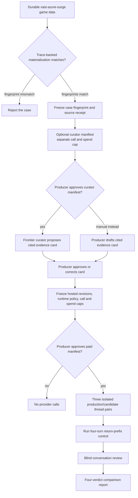
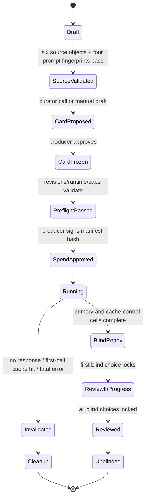

# Real-Thread Context Evaluation - Plan

## Goal Capsule

- **Objective:** Produce a decision-grade comparison of the production and candidate context builders by replaying one real four-turn Mingle thread from `vast-azure-surge` three times per variant on GPT-5.4-nano.
- **Authority hierarchy:** Canonical events define accepted game state; the checkpoint and typed transcript/continuity artifacts reconstruct model-facing state; complete private traces prove trace-observable message equivalence; the frozen evidence card supports relevance review; provider receipts support cache/cost review; the producer's blinded decisions support quality preference.
- **Execution profile:** Build deterministic materialization and source replay first. Curator and hosted-panel calls remain explicit operator actions and never run from tests, builds, startup hooks, or automatic retries.
- **Stop conditions:** Stop before paid execution on any source-integrity, prompt-fingerprint, case/card/revision/runtime-hash, model-policy, cache-control, fresh-cache, or spend-approval mismatch. Any OpenAI non-response invalidates and cleans up the entire experiment; no retry or partial result survives it.
- **Tail ownership:** Implementation completion ends with working tooling and a source-verified real case without provider spend. Experiment completion is a separately approved state that adds a frozen evidence card, three completed paired repetitions, one cache-control branch, locked blind decisions, and a four-verdict report. General case browsing, local-model panels, and promotion policy are follow-up work.

---

## Product Contract

### Summary

Build one producer-operated real-thread experiment around `vast-azure-surge`: materialize the source situation from durable data, prove prompt fidelity without spending, freeze a human-approved evidence card, and run isolated production-versus-candidate branches through the real Mingle path.
The private local report must keep replay fidelity, history selection, provider cache/cost, and blind human preference as separate verdicts rather than blending them into a flattering benchmark score.

### Problem Frame

The current prompt scenario runner can compare deterministic prompt structure against a fake provider, but it cannot show that a candidate works on a complete real-game situation, sustains a conversation, improves provider cache reuse, reduces spend, or produces preferable behavior.
Running another full game for each context change buys one expensive anecdote and entangles the change with hundreds of unrelated model decisions.
The next slice needs to buy targeted evidence from one real decision thread without pretending that one thread is a universal benchmark.

### Key Decisions

- **Replay both builders from a materialized production situation** (session-settled: user-approved — chosen over comparing a current candidate only to an incomplete historical trace: both variants need the same reconstructible starting point). Governs R1-R6, R17.
- **Prefer replay fidelity over a particular dramatic exchange** (session-settled: user-directed — chosen over forcing a specific thread: an exact nearby Mingle case supports stronger conclusions). Governs R1-R5.
- **Use GPT-5.4-nano for the first hosted panel** (session-settled: user-directed — chosen over a provider matrix: the first slice should isolate context changes). Governs R11-R13.
- **Run three paired repetitions** (session-settled: user-directed — chosen over one anecdotal run or a larger panel: three pairs expose obvious variance at bounded cost). Governs R11-R14.
- **Use frontier-assisted, human-approved relevance labels** (session-settled: user-approved — chosen over reading the full transcript manually or treating an LLM label as ground truth: the model curates evidence and the human owns the reference card). Governs R7-R10, R18.
- **Require a negative cache control** (session-settled: user-approved — chosen over trusting observed cached-token counts alone: a deliberate early prefix break must make the cache measurement falsifiable). Governs R14-R15, R19-R20.

### Actors

- A1. **Producer/reviewer:** selects the experiment, approves or corrects the evidence card, and judges blinded conversation pairs.
- A2. **Case materializer:** reads producer-authorized durable game data and constructs the immutable replay case without mutating the production game.
- A3. **Frontier curator:** scans the complete eligible pre-case history and proposes a small cited evidence card without judging either variant.
- A4. **Experiment runner:** executes isolated paired branches, retains per-agent thread continuity within each branch, and emits the comparison report.
- A5. **Context-builder variants:** one clean pinned SHA representing the current production code and one clean pinned candidate SHA compile the prompts compared by the experiment. The baseline remains a production revision, while its historical claim is limited to `trace_observable_message_equivalent` unless independent evidence identifies the exact revision deployed for the source game.

### Selected Case

The first case is `vast-azure-surge`, Round 4 `MINGLE_I`, Room 2, beats 1 and 2.
It is a four-call Finn → Lyra → Finn → Lyra thread, so each agent receives a return turn and each variant has a meaningful within-thread cache opportunity.

- **Common canonical boundary:** event sequence 240, `round.started`, before the Round 4 `MINGLE_I` calls.
- **Exact checkpoint:** checkpoint `7c13af79-674f-446c-a3e1-fc28dceb4382`, tuple `(game 233ed9f5-78d5-4bbc-9dc3-aefc9d64b847, sequence 240, phase_boundary, mingle_i)`, phase `MINGLE_I`, round 4.
- **Turn 1:** Finn trace manifest `e947436d-2510-4033-a6ef-c254823cbad9`.
- **Turn 2:** Lyra trace manifest `3d490f4b-fddf-4b14-b11d-3bdd462e74bb`.
- **Turn 3:** Finn trace manifest `0f6f8720-2b90-428a-8614-183d64aa73a4`.
- **Turn 4:** Lyra trace manifest `09b39c97-77d8-4768-a336-fce426ef7074`.
- **Prerequisite calls:** The materializer must resolve and freeze Finn's and Lyra's immediately preceding Round 4 `mingle-intent` manifests. Those typed outputs seed each actor's strategic receipt and the structured intent rendered in the four selected prompts; they are replay inputs, not additional hosted-panel turns.
- **Canonical corroboration:** coordination receipts at sequences 241, 242, 244, and 245, plus the room-allocation record at sequence 250.
- **Fidelity constraint:** The completed game cannot resume live from historical boundary 240 because supported recovery requires a suspended game and a checkpoint at the current event head. The blocked `mingleInbox` passport stamp is not by itself fatal: current recovery can rebuild that accumulator from structured transcript rows. The room-allocation artifact is also mutated after each beat, so only allowlisted schedule fields may cross into the case; post-boundary prose, action diagnostics, and canonical events remain corroboration rather than starting state.

### Requirements

**Real-case fidelity**

- R1. The case materializer must use the Selected Case and its producer-authorized canonical events, projection, checkpoint data, transcripts, continuity data, four target private traces, and two prerequisite `mingle-intent` traces.
- R2. The case must reconstruct the canonical board, full roster, actor-visible history, agent continuity, model-facing action surface, room schedule, and event boundary that existed before the first selected turn without mutating or resuming the source game.
- R3. The replay schedule must preserve the selected four-call Finn → Lyra → Finn → Lyra order across Room 2 beats 1 and 2.
- R4. The materialized case must carry an immutable fingerprint and source receipt that identifies the game, event boundary, six trace manifests, allowlisted prelude, thread schedule, checkpoint coordinates, and source-data versions used by every branch.
- R5. Materialization must deterministically replay the recorded prerequisite and target outputs through the real prompt path and verify all four model-facing message fingerprints plus recorded action, model, and reasoning policy against the selected traces before comparative runs begin. Fingerprinting uses byte-preserving canonical serialization, retains raw system/user content hashes, and excludes only an explicit allowlist of transport-only fields; any other byte difference rejects the case rather than being normalized away or filled with invented fixtures or inferred transcript facts.
- R6. The baseline and candidate must each be pinned to immutable revisions that speak the same experiment protocol and share the same non-variant harness digest. Unless independent deployment metadata proves the source game's exact engine commit and complete request envelope, the baseline must be labeled `trace_observable_message_equivalent` rather than `exact_deployed_revision`.

**Assisted evidence card**

- R7. Before execution, the frontier curator must inspect the complete actor-eligible history available at the common starting boundary, including canonical facts, typed strategic receipts, public dialogue, and actor-owned private dialogue.
- R8. The curator must propose a small evidence card whose cited items are classified as required, useful, known distractor, or unscored and mapped to the turns where they matter.
- R9. The producer/reviewer must approve or correct and freeze the evidence card before paired runs begin; an unapproved card cannot support a relevance verdict.
- R10. The evidence card must score only history shared at the common starting boundary; branch-generated dialogue remains visible as variant-local hot conversation and is not retroactively promoted into relevance ground truth.

**Paired threaded execution**

- R11. The experiment must execute three independent paired repetitions, with one production branch and one candidate branch per repetition, using GPT-5.4-nano for every model-generated turn.
- R12. Every branch must start from the same fingerprinted case and use the same turn schedule, model policy, tool surface, and runtime limits; each branch may then evolve from its own generated dialogue.
- R13. An agent returning later in a branch must receive that branch's earlier conversation and continuity, while agent state must reset between repetitions and variants.
- R14. Every variant, repetition, control, replacement, and rerun must use a fresh prompt-cache-key lineage so reuse is measured only within that thread. Finn's and Lyra's first calls in every lineage must each report zero cached input tokens; any first-call cache hit invalidates the entire experiment. The report must not treat the routing hint or elapsed time as a guaranteed cache partition or proof of a clean cache.
- R15. A separate four-turn control lineage must prime Finn and Lyra with the normal stable prefix on their first turns, replace an opaque behavior-neutral marker near the start of that prefix on their return turns, and exclude all control outputs from quality review.
- R16. Materialization and replay must not append events, transcripts, checkpoints, traces, or spend entries to the source production game.

**Operator safety and lifecycle**

- R23. Curator and hosted-panel calls must require separate explicit approvals bound to immutable manifests. The hosted manifest must cap dispatch at 28 provider attempts—24 primary turns plus four cache-control turns—and enforce a producer-specified maximum spend.
- R24. The runner must durably transition every planned call through `planned`, `started`, and one terminal state. `started` is recorded before the request may leave the process and marks the no-retry boundary. Resume may dispatch only still-planned cells whose case, card, revision, runtime, approval, and fresh-lineage hashes remain unchanged. Any started call without a complete OpenAI response invalidates the entire experiment, emits a content-free reason/spend summary, and deletes its private run directory.
- R25. Blind decisions must be complete before unblinding. A failed, invalidated, or operator-aborted experiment produces no partial comparison: dispatch stops, the local lock is released, a content-free reason/spend summary is emitted, and the private run directory is deleted.

**Comparison report**

- R17. The report must gate all downstream comparisons on matching case fingerprints, starting state, turn schedules, runtime policy, expected call counts, fresh first calls, and successful OpenAI responses for every intended cell, while identifying variant-local divergence after the first generated turn. Failed, aborted, contaminated, and incomplete runs do not produce comparison reports.
- R18. For each turn and variant, the report must map selected and omitted cited evidence to the frozen card and show required coverage, useful coverage, known-distractor exposure, unscored history volume, context budget, and available selection reasons without collapsing them into a universal relevance score. Protected facts, fixed prelude, branch-local hot dialogue, and selectable historical dialogue must remain distinct lanes.
- R19. For each turn, repetition, and variant, the report must separate structural reusable-prefix estimates, provider-reported cached input tokens, uncached input tokens, output tokens, requested and effective service tier, cache-retention/ZDR context, and cost with its rate-card provenance and actual, estimated, or unavailable status.
- R20. Cache evidence is valid only when every actor's first call in every lineage reports zero cached input tokens, normal returning-actor turns record positive provider reuse, and the matched prefix-break control produces the expected reduction. A first-call hit invalidates the experiment; output equality, elapsed time, or waiting for presumed eviction is never cache evidence.
- R21. The report must present each production/candidate conversation pair blind, withholding variant identity and cost until the producer records `A`, `B`, `no preference`, or `insufficient evidence` plus optional reasons about strategy, coherence, evidence use, and watchability. Production/candidate mapping occurs only after decisions lock and the run is unblinded.
- R22. The report must answer four questions with separate verdicts: replay comparability, history-selection direction, cache-and-cost direction, and blind conversation preference. Conclusions remain scoped to this case and three paired repetitions. History selection must report `not_exercised` when both variants retain the current zero-history Mingle policy; such a run is permitted only with manifest scope `cache_quality_only`.



### Key Flows

- F1. Materialize the real thread
  - **Trigger:** The producer requests the `vast-azure-surge` experiment.
  - **Actors:** A1, A2.
  - **Steps:** A2 loads the Selected Case, reconstructs its starting boundary, verifies the source-revision prompt fingerprints, and freezes its case fingerprint and source receipt.
  - **Outcome:** One accepted real case exists, or the experiment stops with a specific replay-fidelity gap.
  - **Covered by:** R1-R6, R16.

- F2. Create the evidence reference
  - **Trigger:** A replayable case has been frozen.
  - **Actors:** A1, A3, A4.
  - **Steps:** A1 may draft the card manually or separately approve a curator manifest; A4 dispatches any approved curator work through the capped broker lifecycle; A3 reviews the complete eligible starting history and proposes cited labels; A1 approves or corrects them before any variant output exists.
  - **Outcome:** Both variants are measured against the same human-owned evidence card.
  - **Covered by:** R7-R10, R23.

- F3. Execute paired threaded branches
  - **Trigger:** The evidence card is frozen and both builder revisions are pinned.
  - **Actors:** A1, A4, A5.
  - **Steps:** A4 freezes the runtime and spend manifest, obtains explicit producer approval, runs three isolated production/candidate pairs from the same starting case, preserves continuity within each branch, and runs the separate prefix-break control. A clean Ctrl-C between calls may resume only still-planned cells; any OpenAI non-response, first-call cache hit, hard interruption, or fatal branch error invalidates and cleans up the run.
  - **Outcome:** The experiment yields comparable structural, provider, cost, and conversation artifacts without another full game.
  - **Covered by:** R11-R17, R23-R24.

- F4. Review and conclude
  - **Trigger:** All required branches and the cache control have completed.
  - **Actors:** A1, A4.
  - **Steps:** A4 computes the evidence and cache ledgers, presents conversation pairs blind, records A1's preferences, then reveals variant identity and emits the four verdicts.
  - **Outcome:** The producer can see what the candidate improved, worsened, or failed to prove.
  - **Covered by:** R17-R22, R25.

### Acceptance Examples

- AE1. Non-replayable historical exchange
  - **Covers:** R1-R5.
  - **Given:** The Selected Case has canonical and trace evidence but its reconstructed source-revision prompt differs from a stored trace fingerprint.
  - **When:** The materializer runs the fidelity gate.
  - **Then:** The case is rejected until the missing state is recovered; no fixture or transcript inference fills the gap.

- AE2. Honest branch comparability
  - **Covers:** R4, R12-R13, R17.
  - **Given:** Both variants start from the same accepted case.
  - **When:** Their first generated messages differ and later prompts include their respective branch histories.
  - **Then:** The report passes the common-start comparability gate and identifies later inputs as variant-local rather than claiming they stayed identical.

- AE3. Unapproved assisted labels
  - **Covers:** R7-R10.
  - **Given:** The frontier curator proposes required, useful, and distractor evidence.
  - **When:** The producer has not approved or corrected the card.
  - **Then:** Paired execution remains blocked because relevance has no human-owned reference.

- AE4. Cheap but forgetful candidate
  - **Covers:** R18, R22.
  - **Given:** The candidate uses fewer input tokens than production.
  - **When:** It omits an evidence-card item marked required.
  - **Then:** The report does not call history selection improved, regardless of token or cost savings.

- AE5. Cache control fails
  - **Covers:** R14-R15, R19-R20.
  - **Given:** Variant and repetition lineages are isolated.
  - **When:** The early-prefix-break control does not reduce provider-reported cache reuse as expected.
  - **Then:** The report shows the raw token and spend observations but marks the cache and cache-derived cost verdict inconclusive.

- AE6. Case-level quality evidence
  - **Covers:** R21-R22.
  - **Given:** The reviewer prefers the candidate in two pairs and records no preference in the third.
  - **When:** The report is unblinded.
  - **Then:** It reports that case-level preference without claiming universal model or context-builder quality.

- AE7. Candidate does not exercise Mingle recall
  - **Covers:** R18, R22-R23.
  - **Given:** Both pinned builders compile the selected calls as `ordinary_speech` with a zero historical-dialogue ceiling.
  - **When:** The deterministic preflight evaluates the policy delta.
  - **Then:** History selection is marked `not_exercised`, and the hosted panel remains blocked until the producer explicitly approves spending for the remaining cache/quality questions or supplies a candidate that exercises recall.

- AE8. OpenAI non-response
  - **Covers:** R17, R23-R25.
  - **Given:** A paid cell was persisted as started but no complete OpenAI response was saved.
  - **When:** The runner handles the failure or restarts.
  - **Then:** The entire experiment is invalidated without retry, a content-free reason/spend summary is emitted, and the private run directory is deleted.

- AE9. Contaminated first call
  - **Covers:** R14, R17, R20, R25.
  - **Given:** A fresh lineage's first Finn or Lyra call reports positive cached input tokens.
  - **When:** The runner validates cache freshness.
  - **Then:** The entire experiment is invalidated rather than treated as an isolated cache miss/hit anomaly; no comparison report is produced.

### Success Criteria

- A no-provider source replay reconstructs all four model-facing prompts and matches every selected source fingerprint before any hosted call is authorized.
- The approved evidence card is complete enough to explain which actor-authorized historical items were selected, filtered, ranked out, or made inaccessible by policy on every scored turn.
- The paid manifest predicts 28 maximum provider dispatches, refuses stale approvals, records every attempt, requires fresh first calls, and cannot silently retry or fall back to a different service tier.
- The blind packet contains three normalized conversation pairs and no variant, revision, cache, token, cost, or control identity; the final report reveals those fields only after decisions are locked.
- The final report produces four independent case-scoped verdicts and uses `not_exercised` or `inconclusive` rather than converting missing evidence into a pass.

### Scope Boundaries

- **In scope:** The single real-thread evaluation contract governed by R1-R22.
- **In scope:** The operator safety and terminal review lifecycle governed by R23-R25.
- **Deferred for later:** A generic scenario browser, a large reusable corpus, local-model or multi-provider panels, automatic case sampling, and promotion automation.
- **Outside this slice:** Full-game continuation, another paid full-game simulation, a universal automated quality score, an LLM acting as final winner judge, and unit-test concerns already owned by lower-level suites.
- **Outside this slice:** Treating transcript prose, reasoning traces, or model output as canonical game state.

### Dependencies and Assumptions

- Supported recovery is intentionally head-only for suspended games. The Selected Case uses historical checkpoint evidence and current transcript-based inbox reconstruction semantics only to materialize a private case; it does not ask recovery to branch a completed game.
- Private traces retain the request, response, usage, prompt-reuse receipt, Recall Plan receipt, model, and action context needed to orient case materialization, but a historical output is observational unless its complete runtime snapshot matches.
- The hosted panel pins the `gpt-5.4-nano-2026-03-17` snapshot. The model has no documented seed control, so repetitions freeze inputs and request policy but do not promise identical text.
- GPT-5.4-nano uses provider-default prompt-cache retention; the lab must not send the GPT-5.6-only `prompt_cache_options` control. Organization ZDR status is captured as run metadata because it affects the retention context.
- Current provider spend accounting can retain model, token, cost, and rate-card provenance, while effective service tier may require experiment-local capture because it is not present in the durable API spend report.
- The current prompt scenario runner is a structural starting seam, not evidence that database extraction, ordered same-agent hosted replay, or normalized paired reporting already exists.

<!-- ce-section: work-relationships -->
### How This Work Fits Together

This plan owns the first decision-grade real-thread experiment; the broader lab remains a set of candidate follow-on areas rather than a committed roadmap.

- **Depends on:** The context policy and structural Recall Plan receipts owned by `docs/plans/2026-07-26-003-feat-selective-context-recall-plan.md`.
- **Enables:** A later reusable corpus and case-selection surface once one real case proves the experiment contract.
- **Enables:** Local-model and broader hosted-provider panels after the report separates structural, economic, and human evidence cleanly.
- **Can proceed independently of:** Full-game simulation improvements; a new full game becomes case acquisition only when stored games lack a required scenario.
- **Still to decide:** Promotion thresholds across multiple cases, because one thread cannot justify a global rollout gate.

### Sources and Research

- `docs/ideation/2026-07-27-influence-prompt-decision-lab-ideation.html`
- `docs/plans/2026-07-26-003-feat-selective-context-recall-plan.md`
- `docs/reasoning-transcript-observability.md`
- `CONCEPTS.md`
- `packages/engine/src/prompt-scenario-lab.ts`
- `packages/engine/src/context-recall-plan.ts`
- `packages/engine/src/game-runner.types.ts`
- `packages/engine/src/mingle-inbox-replay.ts`
- `packages/api/src/services/game-recovery.ts`
- `packages/api/src/services/game-recovery-support.ts`
- `packages/api/src/services/private-trace-writer.ts`
- `packages/api/src/services/provider-cost-accounting.ts`
- `docs/solutions/architecture-patterns/agent-strategy-observability-spine.md`
- `docs/solutions/runtime-errors/api-startup-recovery-resumes-interrupted-games.md`
- `docs/solutions/runtime-errors/production-game-mcp-raw-trace-read-limit.md`
- `docs/solutions/architecture-patterns/openai-flex-simulation-retries.md`
- `docs/solutions/architecture-patterns/shared-postgres-tests-use-a-process-advisory-lock.md`
- [OpenAI prompt caching](https://developers.openai.com/api/docs/guides/prompt-caching)
- [OpenAI Responses create reference](https://developers.openai.com/api/reference/resources/responses/methods/create)
- [GPT-5.4 nano model and snapshots](https://developers.openai.com/api/docs/models/gpt-5.4-nano)
- [OpenAI Flex processing](https://developers.openai.com/api/docs/guides/flex-processing)

---

## Planning Contract

Product Contract preservation: clarified R1, R4-R6, R14-R15, and R18-R22 from repository/provider evidence, and added confirmed operator-lifecycle requirements R23-R25; no other scope change.

### Key Technical Decisions

- KTD1. Add a real-thread evaluator beside the existing single-call structural runner (session-settled: user-approved — chosen over stretching the fixture-oriented runner into a database, provider, revision, approval, and reporting god object). A schema-only `@influence/prompt-lab-protocol` workspace package owns the runtime-validated cross-process contract and depends on neither engine nor API. The engine owns actual Mingle-thread preparation/application; the API owns trusted materialization, workspace lifecycle, the sole provider broker, spend enforcement, and operator CLI. `packages/engine/src/prompt-scenario-lab.ts` remains a fast structural/unit-test seam.

- KTD2. Use an immutable, content-addressed private workspace rather than an experiment database. The operator supplies one absolute workspace root outside every git checkout; the orchestrator creates private directories/files and resolves paths before writing. Only the orchestrator mutates it. Canonical JSON hashing binds approvals/results to exact inputs, while one local OS-backed exclusive lock plus a durably ordered transition journal serializes claim, budget reservation, dispatch, provider response, response application, and continuation checkpoint. The kernel releases the lock when the process dies; multi-host execution and distributed lease takeover are out of scope. Atomic rename prevents partial JSON, but is not treated as a concurrency transaction.

- KTD3. Materialize from a read-only repeatable-read API transaction, but do not call or weaken live recovery admission. The materializer validates the complete event chain, slices the canonical prefix through sequence 240, selects the exact historical checkpoint, validates its hydration evidence with extracted pure helpers, reads all six private traces without truncation, and allowlists only the room schedule/prelude fields needed for replay. Post-boundary events and mutated transcript diagnostics remain corroboration and never enter starting `GameState`.

- KTD4. Treat the baseline as a clean current-production revision with trace-observable message equivalence, not magically historical-deployment-identical (session-settled: user-approved — chosen over asserting an engine SHA that the game database never stored). A deterministic stub first replays the two recorded Mingle intents and four recorded speech outputs through the actual context/agent path. All four byte-preserving canonical system/user message fingerprints, raw content hashes, and recorded action/model/reasoning metadata must match the source traces. The canonicalizer may exclude only versioned transport-only fields named in an explicit allowlist. The receipt enumerates proven lanes, unproven request-envelope lanes, canonicalizer ID/version, and exclusions; current tool/schema/SDK digests remain harness provenance rather than historical proof.

- KTD5. Execute both variants through revision-isolated workers that implement the same protocol. The first lab-capable baseline revision must pass the message-equivalence gate; the candidate branches from it and changes only an allowlisted context-policy surface. Before provider access, each worker proves protocol capabilities plus schema/canonicalizer hashes, and the orchestrator verifies equal non-variant harness digests across executor, renderer, tool surface, observer/broker contract, Bun version, and lockfile. A wider diff is labeled a whole-revision comparison and cannot support a context-builder-only verdict.

- KTD6. Reuse the real Mingle beat semantics and freeze only the experimental schedule (session-settled: user-approved — chosen over letting generated movement turn later cells into different scenarios). Production and lab share the code that builds phase context, calls `InfluenceAgent.takeMingleTurn`, writes coordination receipts, appends heard messages to `mingleInbox`, and resets per-beat `conversationHistory`. Lab mode records requested movement as an output diagnostic but keeps Finn and Lyra in Room 2 for the second beat.

- KTD7. Add narrow dependency-injection and evaluation controls with production-safe defaults. `ContextBuilder` accepts a `RecallPlanCompiler` whose default is the current compiler. `InfluenceAgent` accepts optional prompt-cache lineage, required Responses mode, one-attempt mode, and evaluation fail-fast behavior so provider errors cannot become fallback dialogue; existing live defaults remain unchanged. Trusted local revision workers target an orchestrator-owned loopback broker as the experiment's provider seam. The broker validates the final request, reserves budget, performs the outbound call, records the response, optionally applies the cache-control marker, and returns the provider response. The broker is an accounting and measurement boundary.

- KTD8. Make paid execution a manifest state machine, not a convenient command flag (session-settled: user-approved — chosen over “run and inspect the bill later”). A run manifest freezes case/card and harness hashes, revisions, verdict scope (`full` or `cache_quality_only`), model snapshot, snapshot-to-rate-card mapping, action schema, reasoning policy, requested tier, output limits, ZDR/retention context, call/spend caps, execution order, and control definition. An interactive approval shows that manifest and private-data egress before recording approval. The broker uses `maxRetries: 0`, worker agents use one attempt plus fail-fast, Flex fallback is disabled, maximum in-flight dispatches is one, and `started` plus reservation are durable before outbound network I/O. Any OpenAI non-response invalidates and cleans up the run.

- KTD9. Use one four-turn cache-only control, not a changed cache key masquerading as a cache test. Every branch, control, replacement, and rerun receives a fresh cache-key lineage; waiting is never proof of eviction. Finn's and Lyra's first calls must each report zero cached input tokens or the experiment is invalid. The control then changes a same-length opaque marker near the beginning of the stable instructions on each return turn. It supports both variants only when their cacheable-prefix/request-family digests match. If they differ, the 28-call ceiling stays fixed and the report narrows cache conclusions to the controlled family instead of silently adding calls. The verdict still requires positive normal return-turn hits. GPT-5.4-nano receives no `prompt_cache_options`; provider-default retention and organization ZDR status are context, not tuning knobs.

- KTD10. Keep evidence assistance and quality judgment human-owned. The frontier curator receives the complete actor-eligible starting catalog plus protected/prelude lane metadata before seeing variant output and returns cited structured proposals through the same capped broker lifecycle. One local interactive `curate` action builds and previews the curator manifest, confirms the call/spend/data egress, writes its approval receipt, and dispatches; ordinary `status`/`resume` handles interruption, while manual card drafting stays provider-free. Interactive commands freeze the fully rendered validated card, approve hosted runs, record blind choices, unblind, and purge completed private artifacts. The report randomizes A/B order and withholds variant/economic metadata until all decisions lock.

- KTD11. Produce explanations and four verdicts, not one score. A private evaluator-only selection trace records whether each approved historical item was selected, policy-disabled, zero-overlap, ranked out, or budget-exhausted; it does not widen public structural receipts. Replay, history selection, cache/cost, and blind preference each have independent pass/mixed/fail/not-exercised/inconclusive states. This follows the existing observability spine: model behavior is evidence, while canonical events remain game authority.

- KTD12. Checkpoint branch state after every applied turn and run branches serially. A cell is not complete merely because a provider response exists: the broker first records the response, the worker deterministically applies it, then the orchestrator commits an immutable continuation checkpoint containing agent continuity, inbox, transcript, branch board, and outputs. Only then may the dependent turn become runnable. Run one four-turn branch contiguously and alternate/randomize baseline-versus-candidate order within each repetition. Ctrl-C between calls exits cleanly with planned cells resumable; Ctrl-C during a call requests stop-after-current, while a second interrupt or hard death before a response invalidates and cleans up the experiment.

### High-Level Technical Design

```mermaid
flowchart LR
  DB["Configured game DB"] --> Materializer["API case materializer<br/>read-only repeatable read"]
  Storage["Private trace object storage"] --> Materializer
  Protocol["Schema-only prompt-lab protocol<br/>runtime validation + golden vectors"] --> Materializer
  Materializer --> Case["Frozen case + source receipt<br/>orchestrator-owned private workspace"]
  Case --> SourceReplay["Baseline worker<br/>recorded-output source replay"]
  SourceReplay -->|"four prompt fingerprints match"| Catalog["Eligible-history catalog"]
  SourceReplay -->|"mismatch"| Reject["Reject before spend"]
  Catalog --> CuratorManifest["Optional curator manifest<br/>separate cap + approval"]
  CuratorManifest --> Card["Curator proposal or manual draft<br/>human freeze"]
  Card --> Manifest["Run manifest<br/>revisions + runtime + caps"]
  Manifest --> Approval["Explicit paid approval<br/>bound to manifest hash"]
  Approval --> Orchestrator["API panel orchestrator<br/>OS lock + transition journal"]
  Orchestrator --> Baseline["Baseline revision worker<br/>3 four-turn branches"]
  Orchestrator --> Candidate["Candidate revision worker<br/>3 four-turn branches"]
  Baseline --> Broker["API provider broker<br/>measurement + spend authority"]
  Candidate --> Broker
  Orchestrator --> Control["Cache-control revision worker<br/>1 four-turn branch"]
  Control --> Broker
  Broker --> Orchestrator
  Baseline --> Blind["Blinded normalized pairs"]
  Candidate --> Blind
  Control --> Report["Four-verdict report"]
  Blind --> Decisions["Human decisions"]
  Decisions --> Report
```



The split has three hard boundaries:

1. **Authority boundary:** DB events/checkpoint data create game state; typed transcript/continuity and complete traces create model-facing replay state; no transcript prose or model output is promoted to canonical fact.
2. **Spend boundary:** everything through case validation, source replay, policy-delta inspection, and card editing is deterministic except the separately approved curator call. Trusted local workers use the broker as the experiment's measured provider path; the broker dispatches only after the exact manifest approval and durable capacity reservation.
3. **Blindness boundary:** private turn artifacts and the unblinding key exist during execution, but the review packet is derived without variant/economic metadata and cannot read that key.

### Case and Artifact Contract

The workspace schema is versioned from the first implementation by the dependency-neutral protocol package. Unknown major versions fail closed; additive optional fields may be accepted only when the schema marks them optional. Every worker handshake includes protocol version, schema hash, canonicalizer ID/version, capabilities, and non-variant harness digest, validated against golden conformance vectors before the broker is reachable.

| Artifact | Authority and required content | Mutation rule |
|---|---|---|
| `case.json` | Canonical prefix through sequence 240, reconstructed starting board, roster/config, continuity capsules, starting transcript replay, allowlisted Mingle prelude, fixed Finn/Lyra schedule, six trace references, actor-eligible history catalog | Immutable after source validation |
| `source-receipt.json` | DB/source identifiers, checkpoint coordinate/hash, event-prefix hash, object byte length/SHA-256 for all traces, normalized per-turn source fingerprints, materializer version | Immutable; hash is part of case identity |
| `curator-manifest.json` | Case hash, curator model/policy, output schema, private-data classes, partition plan, maximum calls/spend, retention context | Immutable after curator approval |
| `curator-approval.json` | Curator-manifest hash, approving operator, timestamp, explicit call/spend caps | Stale on any curator-manifest change |
| `evidence-card.proposed.json` | Provenance discriminant (`manual` or `curator`), case hash, cited items, authority lane, authorized actors, applicable turns, proposed class and rationale; curator model/policy only for curator provenance | Replaceable draft; never authorizes runs |
| `evidence-card.approved.json` | Human-reviewed card, reviewer identity, timestamp, case hash, card hash | Any edit creates a new draft and invalidates approval |
| `run-manifest.json` | Case/card hashes, revisions, protocol version, verdict scope, model/runtime and rate-card mapping, fresh cache lineages, cache control, requested tier, ZDR context, 28-call cap, spend cap, randomized pair IDs | Immutable after paid approval |
| `paid-approval.json` | Manifest hash, approving operator, timestamp, explicit call/spend caps | Stale on any manifest change |
| `run.lock` / `transition-journal.jsonl` | OS-backed single-process lock plus fsynced ordered transitions for claim, reservation, started, response, apply, checkpoint, and terminal state | Orchestrator-only; kernel releases the lock on process death |
| `cells/<cell-id>/state.json` | Arm, repetition/control, turn, actor, dependency, planned/started/response-recorded/applied/checkpoint-committed/completed state, attempt ordinal, request fingerprint, provider/request IDs, status, usage, tier, cost provenance | Derived from the monotonic journal while the OS lock is held |
| `cells/<cell-id>/provider-response.json` | Exact successful OpenAI response or provider-declared failure | Written and fsynced by broker before worker application; absence after `started` invalidates the run |
| `branches/<branch-id>/turn-<n>-checkpoint.json` | Applied output plus agent continuity, inbox, transcript, board, and branch-local prompt/cache state required for the next turn | Immutable; next cell blocked until committed |
| `blind-packet.json` | Frozen evidence card summary, normalized A/B conversations, pair order tokens | Immutable once review starts |
| `unblinding-key.json` | Pair token to variant/repetition mapping | Separate private artifact; unavailable to blind renderer |
| `blind-decisions.json` | Reviewer, locked choice/reasons per pair, anonymous completed/outstanding pair tokens, completion receipt | Append choices until all eligible pairs lock; immutable after unblind |
| `report.json` / `report.md` | Source gate, selection explanations, attempt ledger, cache/cost tables, blind decisions, unblinded mapping, four verdicts, limitations | Rebuildable only from immutable terminal inputs |

Raw prompts, private dialogue, output, reasoning, and source identifiers stay inside this private workspace outside all worktrees. Materialization uses a temporary directory promoted only after source validation. Failed, invalidated, and aborted runs automatically delete their temporary/private directory after emitting a content-free reason/spend summary; completed valuable runs remain until the producer explicitly purges them. CLI stdout prints paths, hashes, lifecycle states, and aggregate counts—not raw prompt/private content—unless an explicit local inspection subcommand is requested.

### Source Materialization and Replay Semantics

The materializer uses the same integrity primitives as production reads while keeping historical branching distinct from recovery:

- `getPersistedGameEvents` must return a complete trusted chain that covers sequence 240 and all corroborating references. Only envelopes through 240 are passed to `GameState.fromCanonicalEvents`.
- The checkpoint is selected by game, last event sequence, checkpoint kind, and actor coordinate. Missing or multiple matches fail rather than selecting “latest.”
- Pure checkpoint checks are extracted from `game-recovery-support.ts`: runtime snapshot shape, transcript cursor identity, player continuity set, House continuity requirement, and accumulator data. The live `game.status === suspended` and `checkpoint === current head` checks remain exclusively in recovery.
- `checkpoint.snapshot.transcriptReplay` is the complete starting dialogue boundary. Later transcript rows may supply only allowlisted room number/count/schedule fields and source-output corroboration.
- Each private object is read without a byte cap and must match the manifest's full byte length and SHA-256. A missing, expired, redacted, truncated, or integrity-mismatched object rejects the case.
- The materializer resolves exactly one Finn and one Lyra Round 4 `mingle-intent` trace immediately preceding the selected speech traces. Their typed outputs are replayed to restore intent summaries and actor-local recent strategic receipts.
- Canonical sequences 241, 242, 244, 245, and 250 verify actor order, accepted coordination, and frozen room schedule. They are never replayed into the starting board because they occur after sequence 240.

The deterministic worker then performs:

```mermaid
sequenceDiagram
  participant W as Source replay worker
  participant F as Finn agent
  participant L as Lyra agent
  participant C as ContextBuilder
  participant S as Recorded-output stub

  W->>F: Restore boundary continuity
  W->>L: Restore boundary continuity
  W->>F: Replay recorded Mingle intent
  W->>L: Replay recorded Mingle intent
  W->>C: Build Finn beat-1 context
  C->>F: ordinary_speech Recall Plan
  F->>S: Capture request; return recorded turn 1
  W->>C: Build Lyra beat-1 context with Finn hot/current dialogue
  C->>L: ordinary_speech Recall Plan
  L->>S: Capture request; return recorded turn 2
  W->>C: Build Finn beat-2 context with persistent inbox and fresh beat history
  F->>S: Capture request; return recorded turn 3
  W->>C: Build Lyra beat-2 context with persistent inbox plus current Finn turn
  L->>S: Capture request; return recorded turn 4
  W->>W: Compare all four normalized source fingerprints
```

The exact cross-beat rule is a regression contract:

- Finn beat 1: no Room 2 dialogue.
- Lyra beat 1: Finn appears in persistent heard-message context and `Conversation This Turn`.
- Finn beat 2: Lyra's beat-1 message appears through persistent `mingleInbox`; the new beat's `conversationHistory` starts empty.
- Lyra beat 2: prior heard Finn messages persist, and Finn's beat-2 message also appears in the new beat's `Conversation This Turn`.

### Hosted Panel and Cache-Control Lifecycle



Within `Running`, one cell follows a stricter durable sequence: claim and reserve cap → persist `started` → broker sends → broker fsyncs the complete response → worker applies the response → orchestrator fsyncs the continuation checkpoint → mark completed and unlock its dependent turn. A crash after a saved response replays application without another call. A crash or hard interruption after `started` without a complete response invalidates and cleans up the entire experiment.

The primary matrix contains 24 semantic calls: four turns × two variants × three repetitions. The cache-control branch adds four calls. There are no provider retries inside those 28 dispatches. Run one branch at a time, keep its four turns contiguous, alternate/randomize arm order within repetitions, and allow one in-flight provider request. A provider-declared failure or any network/timeout outcome invalidates the experiment. Starting again requires a new run ID, approval, and cache-key lineage rather than quietly inserting a replacement sample.

Each normal branch receives a unique experiment lineage while Finn's first and return calls share the Finn key and Lyra's first and return calls share the Lyra key. The final provider request—not an upstream approximation—is the measurement seam. Per attempt retain:

- request fingerprint and exact common-prefix character estimate;
- model snapshot and requested/effective service tier;
- `usage.input_tokens`, `usage.input_tokens_details.cached_tokens`, output/reasoning tokens;
- response ID and request ID when returned;
- status, elapsed time, and attempt ordinal;
- actual router cost, static estimate, or unavailable state plus rate-card source/version.

Structural common-prefix estimates and provider cached tokens are reported separately. Prompt caching is best-effort and prefix-based: `prompt_cache_key` improves routing but does not guarantee isolation or make output deterministic. Every actor's first call in every lineage must report zero cached tokens; a hit means the whole experiment was not fresh and is discarded.

### Operator and Agent Action Parity

The CLI exposes small machine-readable primitives; convenience workflow commands may compose them but cannot be the only access path.

| Action | CLI contract | Automation posture |
|---|---|---|
| Discover and inspect | `list-runs`, `status --json`, `inspect-manifest`, `list-cells`, `next-actions` | Agent-accessible; structural output matches human status |
| Validate/materialize/source replay | `validate`, `materialize`, `verify-source` | Agent-accessible; no paid calls |
| Draft evidence | manual draft or local interactive `curate` | `curate` previews model/data/call/spend limits, confirms once, writes the approval receipt, and dispatches |
| Freeze evidence | `freeze-evidence` | Renders and validates the complete small card, then asks for interactive confirmation |
| Create run/preflight | `create-run`, `preflight` | Agent-accessible; zero provider calls |
| Approve paid manifest | `approve-run` | Human-only TTY; shows manifest diff, private-data classes, provider/model, tier, ZDR/retention, max calls/spend |
| Dispatch control | `run`, `resume`, Ctrl-C | Agent-accessible after approval; Ctrl-C stops between calls or after the current call, while hard interruption before a response invalidates the run |
| Render blind material | `render-blind-packet` | Agent-accessible; cannot access unblinding mapping |
| Record preference | `record-blind-decision` | Interactive confirmation; status exposes anonymous completed/outstanding pairs and rejects duplicates |
| Unblind/purge | `unblind`, `purge` | Interactive confirmation for completed runs; failed/aborted runs clean themselves up automatically |

Every JSON result includes lifecycle state, artifact hashes, reserved/settled spend, completed/outstanding cells, next permitted actions, and `requiresHuman`. Revision workers are trusted local processes; the broker remains the canonical measurement and spend-accounting seam rather than an OS access-control boundary.

### Evidence and Verdict Semantics

The eligible-history catalog assigns every item a stable case-local ID and one authority lane:

- `protected`: canonical board facts, typed receipts, continuity, and actor-visible official alliance/huddle facts; always evaluated for fidelity, not retrieval precision.
- `prelude`: the two recorded intent outputs and frozen room schedule; fixed experimental inputs, not history-search candidates.
- `hot`: branch-local current-room conversation; evaluated for thread continuity, not against the starting evidence card.
- `history`: public or actor-owned dialogue available at the common boundary; the only lane scored as selected/omitted retrieval evidence.

For each approved history item and applicable turn, the private explanation records one terminal reason:

- `selected`;
- `policy_disabled` (including ordinary-speech zero ceiling);
- `zero_overlap`;
- `ranked_out`;
- `budget_exhausted`;
- `source_unavailable` (a case/report failure, never a normal omission).

The four report verdicts are intentionally independent:

| Verdict | Positive evidence | Honest non-positive states |
|---|---|---|
| Replay comparability | Common case hash; baseline trace-observable message equivalence; matching first-turn schedule/runtime; fresh first calls; all intended cells complete | `failed`, `inconclusive`; invalid/aborted runs emit no report |
| History selection | Better required/useful coverage without increased distractor exposure, interpreted per turn and lane | `mixed`, `regressed`, `not_exercised`, `inconclusive` |
| Cache and cost | Positive normal returning-turn hits, expected control reduction, comparable effective tiers, complete usage/cost ledger | `mixed`, `regressed`, `inconclusive` |
| Blind preference | Locked human choices over normalized pairs before unblinding | `candidate`, `production`, `no_preference`, `insufficient_evidence`, aggregate `mixed` |

There is no aggregate “winner” number. The report may recommend a next experiment, but this one case cannot authorize global context-policy promotion.

### System-Wide Impact

- **Protocol:** Adds a schema-only Node/Bun workspace package with a narrow export. It must not import engine/API or widen browser-facing engine bundles.
- **Engine:** Introduces injectable recall compilation, bounded attempts, fail-fast evaluation, explicit cache lineage, byte-preserving prompt fingerprinting, and a shared scheduled-Mingle initialization/execution seam. Defaults preserve live behavior.
- **API/operations:** Adds a producer-run CLI, read-only materializer, local OS lock/journal, and measured provider broker. It adds no public HTTP route, MCP mutation, queue consumer, startup hook, migration, or production-game write.
- **Data lifecycle:** Private artifacts live outside worktrees under an explicit private root. Failed, invalidated, and aborted runs clean themselves up; completed useful runs remain available for explicit purge. The source game stays untouched, including trace-access audit tables. The artifact schema—not a new SQL schema—is the compatibility contract across revisions.
- **Provider behavior:** Evaluation disables SDK retries, agent retries, and Flex fallback. Live game retry/fallback policy remains unchanged.
- **Observability:** Existing public/durable structural receipts stay content-free. Raw selection explanations, requests, provider receipts, and blind keys remain experiment-private.
- **Documentation:** The reasoning/transcript and local-evaluation docs must explain when to use structural fixtures, real-thread evaluation, and full-game simulation so the fixture lab does not keep being mistaken for decision-grade evidence.

### Risks and Dependencies

- **Historical evidence gap:** A prerequisite trace or exact prompt fingerprint may be unavailable. Correct response: reject this case or acquire another; never reconstruct from prompt prose.
- **Mingle refactor drift:** Sharing live beat execution with the lab can change production choreography. Keep the default movement/application path byte-for-byte equivalent and cover current live tests before adding evaluation mode.
- **Revision protocol drift:** A candidate checkout may not implement the same protocol. Refuse it before provider setup; do not coerce old output.
- **Revision confounding:** Equal protocol versions do not isolate the context-builder change. Require equal non-variant harness digests or label the result a whole-revision comparison.
- **Concurrent resume:** Atomic files alone do not prevent duplicate dispatch. Require one local OS-backed exclusive lock, journal transitions under that lock, automatic lock release on process death, and concurrent-run tests. Multi-host execution is unsupported.
- **Cache nondeterminism:** Even correct exact-prefix traffic can miss. Require positive-hit/control evidence and allow an inconclusive verdict rather than expanding repetitions automatically.
- **Cache-family drift:** One control supports both arms only when request-family/cacheable-prefix digests match. Otherwise narrow the verdict to the controlled family under the fixed call cap.
- **Tier confounding:** The current client retries Flex and falls back to auto. Evaluation mode must bypass that wrapper behavior and invalidate cells whose effective tier differs from the manifest.
- **Non-response and billing:** OpenAI Responses create has no documented idempotency key for this workflow. A timeout or missing response may still be billed or may have warmed the cache, so it invalidates the entire experiment and is never retried under that run.
- **Hidden live fallback:** Mingle catches provider failures and can emit fallback dialogue. Evaluation fail-fast must propagate the failure to the broker/journal rather than accepting that fallback as a sample.
- **Quality overclaim:** Three pairs on one case expose direction and obvious failure; they do not establish universal quality or a promotion threshold.
- **Private workspace handling:** The artifact tree can contain production dialogue and model output. Keep it outside every checkout, print structural summaries by default, automatically delete unusable runs, and never attach raw artifacts to fixtures or PRs.
- **Shared Postgres tests:** Any DB-mutating test must call `setupTestDB()` and run sequentially inside its Bun process so the process advisory lock can protect the shared database.

### Implementation Sequence

```mermaid
flowchart LR
  U1["U1 Protocol + workspace"] --> U2["U2 Real-case materializer"]
  U1 --> U3["U3 Thread replay + fidelity"]
  U2 --> U3
  U3 --> Gate["Free vast-azure-surge source gate"]
  Gate --> U4["U4 Variant controls + provider broker"]
  U4 --> U5
  U5["U5 Evidence-card workflow"]
  U4 --> U6["U6 Revision-isolated paid panel"]
  U5 --> U6
  U6 --> U7["U7 Blind review + report"]
  U7 --> U8["U8 Docs + operator handoff"]
```



U1-U3 establish the protocol, materializer, and threaded replay. The free `vast-azure-surge` source gate must then prove the exact checkpoint, six trace objects, and four prompt fingerprints before U4-U7 build the broker, evidence workflow, paid panel, and report. Real curator and hosted-panel calls remain separately approved runtime actions and are not implied by implementation completion.

---

## Implementation Units

### U1. Define the versioned protocol and private workspace lifecycle

**Goal:** Establish one content-addressed contract that the materializer, revision workers, curator, orchestrator, blind reviewer, and report builder can share without adding an experiment database.

**Requirements:** R4, R9, R12, R16-R17, R21, R23-R25.

**Files:**

- Add `packages/prompt-lab-protocol/package.json`.
- Add `packages/prompt-lab-protocol/src/index.ts`.
- Add `packages/prompt-lab-protocol/src/schemas.ts`.
- Add `packages/prompt-lab-protocol/src/protocol.test.ts`.
- Update `packages/engine/package.json`.
- Update `packages/api/package.json`.
- Add `packages/api/src/services/prompt-thread-workspace.ts`.
- Add `packages/api/src/services/prompt-thread-workspace.test.ts`.
- Add the safety/lifecycle foundation to `docs/prompt-thread-context-evaluation.md`.

**Approach:**

- Define dependency-neutral runtime schemas and discriminated types for the frozen case, source receipt, evidence-card draft/approval, run manifest/approval, worker/broker handshake, prepared request, provider result, per-cell transition, continuation checkpoint, blind packet/key/decisions, and final report.
- Implement deterministic canonical JSON serialization and SHA-256 helpers plus golden conformance vectors. Every process reports protocol version, schema hash, canonicalizer ID/version, capabilities, and harness digest before exchanging private data.
- Keep the protocol package Node/Bun-only through a narrow subpath; do not export private lab/workspace modules from the broad engine barrel used by browser consumers.
- Require an explicit absolute workspace root outside every resolved git worktree. Materialize into a temporary directory and promote it only after source validation; failed or aborted work deletes its directory automatically, while completed useful runs remain available for explicit purge.
- Implement atomic JSON writes, file/directory fsync, and read/validate/hash helpers. Hold one local OS-backed exclusive lock while mutating a run and append a durably ordered transition journal; the kernel releases the lock on process death and a restarted process replays the journal.
- Model durable cell stages as planned, started, response recorded, applied, checkpoint committed, and completed. A saved response may be reapplied without provider access; `started` without a complete response invalidates and cleans up the whole experiment.
- Keep raw/private fields legal only in private artifact types. Define separate structural CLI-summary types so logging a case/result cannot accidentally serialize raw prompts.
- Document free versus curator-paid versus panel-paid actions, interactive confirmations, private-data egress, automatic failed-run cleanup, completed-run purge, and resume semantics before any provider-capable unit lands.

**Test Scenarios:**

- Canonically equivalent objects hash identically regardless of property insertion order.
- Engine/API implementations pass the same schema/canonicalizer golden vectors; a changed schema hash or capability set fails the handshake.
- Any case/card/runtime/revision/cap change invalidates downstream approval hashes.
- Partial or invalid JSON cannot be read as a frozen artifact.
- Illegal lifecycle transitions, path/symlink escape, permissive file modes, schema-major mismatches, and unblind-before-review fail closed.
- Two concurrent local runner attempts yield one OS-lock holder; process death releases the lock and journal replay never creates two runnable claims.
- Recovery reapplies a saved response without provider access and dispatches only planned cells. A missing response after `started`, hard interruption, or explicit abort emits a content-free summary and removes the private run directory.

**Verification:**

- `bun test packages/prompt-lab-protocol/src/protocol.test.ts`
- `cd packages/api && bun test src/services/prompt-thread-workspace.test.ts`

**Dependencies:** None.

### U2. Materialize `vast-azure-surge` from real DB and private storage

**Goal:** Produce a complete immutable case and source receipt for the selected historical boundary without mutating or pretending to resume the source game.

**Requirements:** R1-R6, R16.

**Files:**

- Add `packages/api/src/services/prompt-thread-case-materializer.ts`.
- Add `packages/api/src/services/prompt-thread-case-materializer.test.ts`.
- Update `packages/api/src/services/game-recovery-support.ts`.
- Update `packages/api/src/__tests__/game-recovery.test.ts`.
- Reuse `packages/api/src/services/game-event-read-model.ts`.
- Reuse the authorization and object-resolution primitives behind `packages/api/src/services/private-trace-read-model.ts` through an experiment-only no-DB-write read path.
- Reuse `packages/api/src/services/game-transcript-persistence.ts`.
- Reuse `packages/api/src/db/schema.ts`.

**Approach:**

- Run materialization in a repeatable-read, read-only transaction. Resolve the game slug and load game config, roster/persona/runtime fields, the validated event chain, checkpoint `7c13af79-674f-446c-a3e1-fc28dceb4382` at the exact `(sequence 240, phase_boundary, mingle_i)` tuple, transcript state/rows, and six trace manifests.
- Extract pure historical-checkpoint integrity helpers from recovery support while retaining live recovery's suspended-status and current-head requirements unchanged.
- Rebuild `GameState` from the trusted canonical prefix through 240. Validate the checkpoint's event/projection identity, transcript replay cursor, continuity capsules, and actor/House continuity.
- Resolve Finn's and Lyra's prerequisite Round 4 `mingle-intent` manifests by game, actor, phase, round, action, and ordering; require exactly one per actor before the first selected speech trace.
- Read each target/prerequisite trace to full length through a producer-authorized no-DB-write path. Require `truncated=false`, manifest byte-length equality, and manifest SHA-256 equality; emit local structural access records in the private source receipt or console/file log rather than inserting audit rows into the source database.
- Build the starting history catalog from checkpoint transcript replay using immutable speaker/audience IDs. Tag entries by protected/prelude/hot/history authority lane and actor eligibility.
- Allowlist room schedule/count/beat fields from structured room metadata and use sequences 241, 242, 244, 245, and 250 only to corroborate the frozen schedule. Drop room-allocation prose and `diagnostics.actions`.
- Write `case.json` and `source-receipt.json` through U1. The receipt records canonicalizer ID/version and explicitly separates historically proven messages/action/model/reasoning fields from unproven tool-schema, SDK serialization, cache, response-format, and provider-routing fields. Prove that no source game table changed.

**Test Scenarios:**

- A completed game with a historical non-head checkpoint can be materialized while `getSupportedRecovery` continues to reject it.
- Missing or non-unique exact checkpoint tuple, broken canonical prefixes, cursor mismatch, capsule mismatch, missing intent trace, truncated object, or SHA mismatch reject the case.
- A post-boundary room row containing later action diagnostics cannot leak those actions or prose into starting state.
- Foreign private transcript rows never enter either actor's eligible history.
- A mutation to any historically proven request component breaks fidelity; a mutation to an unavailable envelope component changes the harness digest and remains labeled unproven rather than falsely passing as historical equality.
- The materializer performs no inserts/updates/deletes against games, events, transcripts, checkpoints, evidence manifests, evidence-access audit tables, or spend tables.

**Verification:**

- DB tests call `setupTestDB()` before mutation and remain sequential.
- `cd packages/api && DRIZZLE_MIGRATIONS_DIR=./drizzle bun test src/services/prompt-thread-case-materializer.test.ts src/__tests__/game-recovery.test.ts`

**Dependencies:** U1.

### U3. Build the real four-turn Mingle replay and source-fidelity gate

**Goal:** Reproduce the source prompts through the same context, agent, inbox, conversation, continuity, and transcript semantics used by the game.

**Requirements:** R2-R5, R12-R13, R16-R18.

**Files:**

- Add `packages/engine/src/prompt-thread-lab.ts`.
- Add `packages/engine/src/__tests__/prompt-thread-lab.test.ts`.
- Refactor `packages/engine/src/phases/mingle.ts`.
- Add `packages/engine/src/mingle-turn-execution.ts`.
- Add `packages/engine/src/__tests__/mingle-turn-execution.test.ts`.
- Reuse `packages/engine/src/phases/phase-runner-context.ts`.
- Reuse `packages/engine/src/context-builder.ts`.
- Reuse `packages/engine/src/agent.ts`.

**Approach:**

- Extract the live Mingle phase initialization and scheduled-room beat loop into shared seams. Initialization emits the deterministic phase banner, clears active room/inbox state, computes initial room counts, and then accepts the frozen experimental room assignment without invoking the House model. Live mode applies resolved movement exactly as today; evaluation mode records movement but leaves the provided schedule unchanged.
- Hydrate branch-local `GameState`, `TranscriptLogger`, `ContextBuilder`, agents, historical transcript context, and continuity from the frozen case, then run the shared Mingle initialization before replaying intents. Never share these instances between variants or repetitions.
- Replay the two intent calls first with a deterministic provider stub returning the stored typed outputs so actor-local strategic receipts and `mingleIntent` prompt sections match the source.
- Execute the four selected turns in Finn → Lyra → Finn → Lyra order. Use recorded speech outputs for the fidelity run and apply message, coordination-receipt, transcript, hot-history, and inbox updates after every turn.
- Capture the final model-facing instructions/input at the provider seam. Compare byte-preserving canonical fingerprints and raw system/user content hashes to each target trace, excluding only versioned transport-only fields on the explicit allowlist. Also compare action, request shape, model, reasoning policy, and recorded tool name where available.
- Emit a structural fidelity receipt plus private per-turn artifacts. One mismatch rejects the whole case and identifies the first differing lane/message without printing content.

**Test Scenarios:**

- Exact actor order and two-beat schedule.
- The inbox/current-beat distinction matches the four bullet contract in Source Materialization and Replay Semantics.
- Intent outputs appear in both structured Mingle intent context and recent strategic receipts.
- Agent continuity persists inside a branch and resets across arms/repetitions.
- Requested movement is observable but cannot change the evaluation tape; live mode still applies it.
- A mutated checkpoint field, missing intent receipt, reordered conversation update, changed message byte, or changed renderer produces a source-fingerprint failure before provider setup; changing an allowlisted transport-only field does not.

**Verification:**

- `bun test packages/engine/src/__tests__/prompt-thread-lab.test.ts packages/engine/src/__tests__/mingle-turn-execution.test.ts`
- Re-run existing Mingle/Recall wiring suites affected by the shared beat extraction.
- Free runtime gate: materialize the selected tuple from configured DB/storage and require six complete trace objects plus four exact source prompt fingerprints before U4 begins.

**Dependencies:** U1, U2.

### U4. Add revision controls and an orchestrator-owned provider broker

**Goal:** Let trusted local revision workers run alternative context builders while one orchestrator-owned broker measures and caps every final provider request without changing live defaults.

**Requirements:** R6, R11-R15, R17-R20, R23-R24.

**Files:**

- Update `packages/engine/src/context-builder.ts`.
- Update `packages/engine/src/context-recall-plan.ts`.
- Update `packages/engine/src/agent.ts`.
- Update `packages/engine/src/llm-client.ts`.
- Update `packages/engine/src/game-runner.types.ts`.
- Add `packages/api/src/services/prompt-thread-provider-broker.ts`.
- Add `packages/api/src/services/prompt-thread-provider-broker.test.ts`.
- Update `packages/engine/src/__tests__/context-recall-wiring.test.ts`.
- Update `packages/engine/src/__tests__/llm-client.test.ts`.

**Approach:**

- Introduce a `RecallPlanCompiler` interface and inject it into `ContextBuilder`; default to `compileRecallPlan`. Give each lab variant a stable ID, protocol version, commit hash, and compiler-policy digest.
- Add a private evaluator explanation helper around authorization, seeding, ranking, and budget fill. It returns source IDs and terminal selection reasons only to the private lab; public `RecallPlanReceipt` remains content-free.
- Add optional `promptCacheLineage`, required-Responses mode, structured-call max attempts, and evaluation fail-fast to `InfluenceAgent`. Production defaults remain game+actor lineage, automatic transport, existing attempts, and live fallback; evaluation uses opaque experiment lineage, Responses required, one attempt, and propagates any provider/tool failure instead of generating fallback Mingle dialogue.
- Point trusted local workers at the orchestrator loopback broker as the normal provider seam. The workers may read the frozen artifacts needed for their cell; the broker remains responsible for final-request measurement, ordering, and spend accounting.
- Make the broker the sole process that constructs the real OpenAI client, holding `maxRetries: 0` and evaluation Flex behavior without three-429 retry or auto-tier fallback. Reject any second or out-of-order request for a cell.
- Under the U1 OS lock, the broker validates the final request family/schema/cell, reserves call and maximum-cost capacity, fsyncs `started`, then dispatches. It fsyncs the complete response, request/response IDs, usage, tier, elapsed time, and actual/estimated cost before returning the provider response to the worker. If OpenAI does not return a complete response, invalidate and clean up the entire experiment.
- Implement the cache-control transform in the broker, scoped to control return turns only. Replace a fixed same-length early marker and record before/after digests; never expose this transform to normal calls.
- Assign fresh cache-key lineages to every branch, control, replacement, and rerun. Pin `gpt-5.4-nano-2026-03-17`; refuse Chat Completions fallback, model alias drift, service-tier fallback, mismatched tool/schema ordering, or a stable prefix structurally estimated below cache eligibility. Require zero cached input tokens on each actor's first call.

**Test Scenarios:**

- Default live agent options produce the same cache key, retry count, transport choice, and Flex behavior as before.
- Injected compilers produce distinguishable variant receipts without changing authorization.
- Evaluation mode propagates provider failure rather than accepting fallback dialogue, sends one brokered attempt, uses a unique branch lineage, and reuses each actor's key on return.
- The control changes the early prefix only on turns three/four; changing only `prompt_cache_key` cannot satisfy the test.
- A failed, timed-out, or otherwise unanswered attempt is not retried and invalidates the whole experiment; its private run directory is removed after a content-free reason/spend summary. Effective-tier mismatch also invalidates the run.
- A first-call cache hit invalidates the experiment. Normal returning calls reuse their actor lineage, and every replacement or rerun starts with fresh lineages rather than relying on elapsed time.
- The broker rejects an unplanned or 29th request and a second request for the same cell.
- GPT-5.4-nano never receives `prompt_cache_options`; GPT-5.6+ default behavior remains covered separately.

**Verification:**

- `bun test packages/engine/src/__tests__/context-recall-wiring.test.ts packages/engine/src/__tests__/llm-client.test.ts`
- `cd packages/api && bun test src/services/prompt-thread-provider-broker.test.ts`

**Dependencies:** U3.

### U5. Implement assisted evidence-card proposal and human freeze

**Goal:** Turn the complete eligible starting history into a cited, reviewable reference card without letting the curator judge either variant.

**Requirements:** R7-R10, R18, R23.

**Files:**

- Add `packages/api/src/services/prompt-thread-evidence-card.ts`.
- Add `packages/api/src/services/prompt-thread-evidence-card.test.ts`.
- Add `packages/api/src/scripts/prompt-thread-lab.ts`.
- Reuse `packages/engine/src/context-recall-plan.ts` authorization projections.

**Approach:**

- Render a curator input pack from the frozen case containing all actor-eligible historical items, protected/prelude summaries, stable citations, applicable actors/turns, and no baseline/candidate outputs or identities.
- Implement one local interactive `curate` action that builds and previews a curator manifest with model, output schema, complete data classes, maximum calls, and spend cap; confirms those terms once; writes the approval receipt; and dispatches through the U4 broker/journal. Ordinary `status` and `resume` cover interruption. Manual card creation remains provider-free.
- Preflight the full curator pack against the chosen model context. If it does not fit, deterministically partition by actor and transcript range with complete catalog coverage; never silently truncate eligible history.
- Request strict structured output classifying each cited item as required, useful, known distractor, or unscored with applicable turns and a concise rationale.
- Validate every citation against the frozen catalog and actor eligibility. Unknown/foreign citations fail; omitted catalog items default to unscored rather than disappearing.
- Produce human-readable Markdown next to the proposed JSON. The producer edits or corrects the proposal; the freeze command validates citations, schema, actors, and staleness, renders the complete small card, asks for confirmation, and binds approval to case/card hashes.
- Block all paired runs when the approved card is absent, stale, or contains invalid citations.

**Test Scenarios:**

- Curator cannot see variant output, cost, cache, or unblinding data.
- Foreign/private citations and unknown source IDs are rejected.
- Editing a frozen card invalidates its approval and any downstream paid manifest.
- Policy-inaccessible evidence remains visible but is not mis-scored as an implementation omission.
- No curator call occurs without its own approval/cap.
- A saved complete curator response may be applied after restart. A curator dispatch without a complete response is not retried; it invalidates and cleans up that curator attempt.

**Verification:**

- `cd packages/api && bun test src/services/prompt-thread-evidence-card.test.ts`

**Dependencies:** U1, U2, U4.

### U6. Orchestrate revision-isolated paired runs under hard spend control

**Goal:** Run the three baseline/candidate repetitions plus one cache control across pinned checkouts, with resumable cells and no accidental 29th attempt.

**Requirements:** R6, R11-R17, R19-R20, R23-R24.

**Files:**

- Add `packages/api/src/services/prompt-thread-panel.ts`.
- Add `packages/api/src/services/prompt-thread-panel.test.ts`.
- Update `packages/api/src/scripts/prompt-thread-lab.ts`.
- Add `packages/engine/src/prompt-thread-worker.ts`.
- Add `packages/engine/src/__tests__/prompt-thread-worker.test.ts`.
- Update root `package.json`.
- Update `packages/api/package.json`.
- Refactor a pure quote helper from `packages/api/src/services/provider-cost-accounting.ts`.
- Update `packages/api/src/services/provider-cost-accounting.test.ts`.

**Approach:**

- Complete the producer CLI with primitives for list/status/manifest/cells/validate/next-actions, materialize/source replay, manual evidence draft or interactive `curate`, evidence freeze, run creation/preflight/approval, run/resume, blind rendering/progress/decision recording, unblind, report, and completed-run purge. Human-only commands require an interactive TTY; every command has a structural JSON result with stable error codes and `requiresHuman`.
- Define the 24 primary cells and four control cells before approval. Calculate a conservative preflight cost ceiling from input estimates, maximum outputs, repetitions, and rate-card provenance; require the operator's spend cap to cover it without exceeding their chosen limit.
- Verify both checkout paths and exact git SHAs, then invoke trusted local workers through the protocol/broker handshake. Each worker uses its frozen branch input and isolated continuation directory. Reject dirty/SHA-mismatched checkouts by default.
- Compute and compare non-variant harness digests. Refuse a context-builder-only verdict unless executor, renderer, action/tool surface, broker protocol, Bun version, and lockfile match outside an explicit variant allowlist.
- Before dispatch, require message-equivalence receipt, candidate policy delta, frozen card, protocol/canonicalizer/harness compatibility, verdict scope, model snapshot, versioned snapshot-to-rate-card mapping, action/schema digest, requested tier, ZDR metadata, fresh cache lineages, 28-call plan, spend cap, human approval, and one acquired OS lock. Unknown model snapshots or rate-card mappings fail preflight.
- Precompute a serial order with one four-turn branch contiguous, arm order alternated/randomized within repetitions, and control last. Maximum in-flight dispatches is one.
- Reserve cell/call/maximum-cost capacity and fsync it before broker dispatch. After response receipt, deterministically apply it and commit the branch continuation checkpoint before completing the cell and unlocking the next turn. Count every dispatch regardless of success; do not rely on provider idempotency.
- On resume, replay any saved-but-unapplied complete response, validate every upstream hash, and launch only planned cells whose dependency checkpoint exists. A `started` cell without a complete response, provider failure, cap exhaustion, tier mismatch, first-call cache hit, or branch error invalidates the whole experiment and triggers automatic private-run cleanup.
- Treat Ctrl-C between calls as a clean checkpointed exit that `resume` can continue. A first Ctrl-C during a provider call requests stop-after-current; a second Ctrl-C or hard death before a complete response invalidates and cleans up the run.
- Keep the source production game ID out of the cache key. Use opaque run/arm/repetition lineage plus actor ID, stable only for that actor's two calls.
- Quote costs through a pure function shared with provider accounting, but write no experiment spend rows into the source game's tables.

**Test Scenarios:**

- Preflight makes zero provider calls and refuses stale/noninteractive approval, dirty/mismatched revisions, incompatible protocol/canonicalizer/harness, unknown snapshot/rate-card mapping, a cap below 28 calls, or unchanged Mingle recall policy when verdict scope is `full`. The same zero-history case may proceed as explicitly approved `cache_quality_only`.
- Fake-provider execution schedules exactly 28 cells with no duplicates across two concurrent resume processes competing for the OS lock.
- A turn failure or dispatch without a complete response invalidates the whole experiment, emits only the content-free summary, and deletes the private run directory.
- Forced crashes before dispatch, after provider receipt, after response application, and before checkpoint commit recover without duplicate calls; hard death after `started` but before complete response invalidates and cleans up the run.
- Flex 429, network timeout, tier fallback, and SDK retry attempts invalidate the run and never silently expand the panel.
- Ctrl-C between calls checkpoints cleanly; Ctrl-C during a call stops after a complete response; a hard interruption before response invalidates the run.
- An agent-facing driver can inspect a resumable run, identify the next safe non-human action, and resume without parsing prose or rerunning completed work.
- Every actor's first call in every lineage reports zero cached tokens, while returning calls use the intended actor lineage.
- No experiment path writes source events, transcripts, checkpoints, traces, or spend rows.

**Verification:**

- `cd packages/api && bun test src/services/prompt-thread-panel.test.ts src/services/provider-cost-accounting.test.ts`
- `bun test packages/engine/src/__tests__/prompt-thread-worker.test.ts`
- Run CLI preflight against fake provider credentials and assert zero network calls.

**Dependencies:** U4, U5.

### U7. Build blind review and the four-verdict report

**Goal:** Turn terminal run artifacts into an honest comparison that a producer can judge without seeing variant identity or cost first.

**Requirements:** R17-R22, R25.

**Files:**

- Add `packages/engine/src/prompt-thread-report.ts`.
- Add `packages/engine/src/__tests__/prompt-thread-report.test.ts`.
- Add `packages/api/src/services/prompt-thread-blind-review.ts`.
- Add `packages/api/src/services/prompt-thread-blind-review.test.ts`.
- Update `packages/api/src/scripts/prompt-thread-lab.ts`.

**Approach:**

- Normalize each branch into a four-message conversation while preserving actor order, no-reply/movement/coordination diagnostics, and turn-level evidence references. Remove thinking, reasoning context, provider IDs, variant/revision names, token/cost/cache data, and control outputs.
- Derive a deterministic randomized A/B order per pair from a private run secret. Store the mapping only in `unblinding-key.json`; the blind renderer cannot accept that file as input.
- Enter `ReviewInProgress` when the first blind choice locks. Record one locked choice per anonymous pair token through a human-only interactive command—production/candidate is not available at review time, so store A/B/no preference/insufficient evidence plus optional strategy, coherence, evidence-use, and watchability reasons. Status exposes completed and outstanding anonymous pair tokens and rejects duplicate decisions.
- Refuse unblinding until all required decisions exist. After unblind, reject all run/resume commands for that run ID. Failed, invalidated, aborted, contaminated, or incomplete runs produce no blind packet or report.
- Compare approved evidence citations to each turn's private selection explanation. Separate protected/prelude/hot continuity from historical retrieval and emit `not_exercised` when both ordinary-speech policies remain zero.
- Calculate cache/cost only from complete attempt receipts. Require zero cached tokens on every first call, positive normal returning-turn reuse, and a control reduction. A first-call hit or missing OpenAI response invalidates the experiment; a complete run with no positive returning hit or no control reduction yields an inconclusive cache verdict.
- Render machine-readable JSON and a concise Markdown report with the four verdicts, per-turn evidence tables, attempt/cost provenance, blind decisions after reveal, and case/repetition limitations.

**Test Scenarios:**

- Blind packet serialization contains no variant, commit, model, cache, token, cost, control, or unblinding identifiers.
- Pair ordering changes independently without changing underlying conversation content.
- `ReviewInProgress` reports anonymous completed/outstanding pairs, rejects duplicate choices, and permits unblind only after every decision locks.
- Noninteractive callers cannot record preferences, unblind, or purge completed runs; they receive structural `requiresHuman` guidance.
- Required evidence omitted by a cheaper candidate prevents an improved history verdict.
- Zero-history/zero-history becomes `not_exercised`, not tied or improved.
- No positive returning hit or failed cache-control reduction yields an inconclusive cache verdict on an otherwise complete run. First-call cache hits, mixed effective tiers, missing usage, and missing responses invalidate the run and produce no report.
- Two candidate preferences and one no-preference render the scoped result without a universal-quality claim.

**Verification:**

- `bun test packages/engine/src/__tests__/prompt-thread-report.test.ts`
- `cd packages/api && bun test src/services/prompt-thread-blind-review.test.ts`

**Dependencies:** U6.

### U8. Document the operator workflow and handoff

**Goal:** Make the implemented lab, its proof boundaries, and its operator workflow understandable after the U3 real-source gate has passed.

**Requirements:** R1-R25.

**Files:**

- Complete `docs/prompt-thread-context-evaluation.md`.
- Update `docs/reasoning-transcript-observability.md`.
- Update `docs/local-model-evaluation.md`.
- Update `DEVELOPMENT.md`.
- Update `README.md` only if it already routes readers to evaluation workflows.
- Update JSDoc in `packages/engine/src/simulate.ts`.
- Add a solution note under `docs/solutions/architecture-patterns/` after the real source proof succeeds.

**Approach:**

- Document the three evaluation levels: structural fixture tests, targeted real-thread experiments, and full-game simulations. State what each can and cannot prove.
- Provide the exact producer workflow from materialization through source verification, evidence freeze, paid approval, resume, blind review, and report.
- Document revision/harness requirements, the trusted-worker/broker measurement boundary, OS-lock resume semantics, Ctrl-C behavior, automatic failed-run cleanup, the 28-call maximum, separate curator budget, Flex/tier behavior, cache-family/control requirements, machine-readable CLI parity, completed-run purge, and terminal unblinding.
- Record the already-completed U3 structural proof (case/source hashes, manifests present, four matches, no source mutations) in a commit-safe acceptance note; keep raw case artifacts ignored.
- Inspect the candidate preflight. If Mingle remains zero-history, demonstrate that the CLI blocks the relevance-targeted hosted panel with `not_exercised`.
- Do not run the curator or hosted panel until the user separately approves the generated manifests. Document the bounded paid workflow without treating its execution as part of implementation completion.

**Test Scenarios:**

- A new operator can tell which command is free, curator-paid, or panel-paid before running it.
- Generated documentation never suggests that fixtures, one case, cached-token counts, or model output are canonical/game-wide proof.
- The documented Ctrl-C and failed-run cleanup behavior matches the executable state machine.

**Verification:**

- `bun run test`
- `bun run check`

**Dependencies:** U7.

---

## Verification Contract

### Deterministic and DB Gates

| Gate | Evidence | Blocks |
|---|---|---|
| Protocol/workspace | Golden schema/canonicalizer vectors, private external root, local OS lock/journal, approval invalidation, cut-point recovery and automatic invalid-run cleanup tests | U2 onward |
| Historical materialization | Sequential `setupTestDB()` suite; complete event/checkpoint/trace integrity; no source mutations | Source replay and all paid work |
| Four-turn source replay | Two intents replayed; exact inbox/current-beat semantics; all four source fingerprints match | Evidence freeze and all paid work |
| Variant/runtime preflight | Protocol/schema/canonicalizer/commit/non-variant-harness/policy/action/model/tier/cap hashes match; verdict scope, fresh cache lineages, and versioned snapshot-to-rate-card mapping are valid | Paid approval |
| Evidence card | Every citation exists and is actor-authorized; producer approval hash current | Paid approval |
| Spend safety | Measured broker path; exactly 28 planned cells; one in flight; SDK/agent retries and live fallback disabled; Flex fallback disabled; fresh first calls; cap accounting tested | Provider dispatch |
| Blind/report | Metadata isolation, decision lock, terminal unblind, four independent verdicts | Final handoff |

### Required Commands

Run focused suites as each unit lands, then the repository baselines:

```bash
bun test packages/prompt-lab-protocol/src/protocol.test.ts
bun test packages/engine/src/__tests__/prompt-thread-lab.test.ts packages/engine/src/__tests__/mingle-turn-execution.test.ts
bun test packages/engine/src/__tests__/context-recall-wiring.test.ts packages/engine/src/__tests__/llm-client.test.ts
bun test packages/engine/src/__tests__/prompt-thread-worker.test.ts packages/engine/src/__tests__/prompt-thread-report.test.ts

cd packages/api
DRIZZLE_MIGRATIONS_DIR=./drizzle bun test \
  src/services/prompt-thread-workspace.test.ts \
  src/services/prompt-thread-case-materializer.test.ts \
  src/services/prompt-thread-provider-broker.test.ts \
  src/services/prompt-thread-evidence-card.test.ts \
  src/services/prompt-thread-panel.test.ts \
  src/services/prompt-thread-blind-review.test.ts \
  src/services/provider-cost-accounting.test.ts \
  src/__tests__/game-recovery.test.ts
cd ../..

bun run test
bun run check
```

DB-backed suites must call `setupTestDB()` before mutation and must not use `test.concurrent` or `describe.concurrent`.

### Runtime Acceptance

The implementation is not decision-grade until it passes the free real-source gate:

1. Materialize `vast-azure-surge` at sequence 240 from configured DB/object storage.
2. Verify the exact checkpoint, six complete trace objects, allowlisted schedule, and actor-eligible history catalog.
3. Replay both Mingle intents and all four recorded speech outputs through the baseline worker.
4. Match all four normalized source prompt fingerprints.
5. Confirm the source game received no new events, transcripts, checkpoints, evidence manifests, or spend entries.

The optional curator-paid gate is separate from both free source validation and hosted-panel approval:

1. Run the local interactive `curate` action to build and preview a manifest bound to the accepted case, full-history partition plan, curator model/policy, private-data classes, call/spend caps, and retention context.
2. Confirm the displayed terms once; the command writes the approval receipt and dispatches through the broker.
3. Use ordinary `status` and `resume` after a clean interruption. A started call without a complete response invalidates and cleans up the curator attempt.
4. Review or correct the proposal, inspect the complete rendered card, and freeze it. Manual drafting may replace steps 1-3 without a provider call.

The hosted-panel paid gate then requires a different approval:

1. Create a run manifest pinning the frozen evidence-card hash, baseline/candidate commits, verdict scope, `gpt-5.4-nano-2026-03-17`, its versioned rate-card mapping, and fresh cache lineages.
2. Review the candidate policy delta, requested Flex tier, ZDR/cache context, 28-call cap, maximum spend, and whether the run is `full` or `cache_quality_only`.
3. Sign the exact run-manifest hash.
4. Run/resume only planned cells. Require zero cached tokens on every actor's first call. Any missing OpenAI response, first-call cache hit, or fatal cell error invalidates and cleans up the experiment; only a complete run proceeds through blind decisions, unblinding, and report rendering.

No CI test, `bun run test`, `bun run check`, server startup, or documentation command may perform a real curator or hosted-panel call. Verification must additionally prove:

- two concurrent resumes dispatch each cell at most once;
- forced termination before dispatch or after a complete saved response preserves the no-duplicate-call rule, while termination after `started` and before a complete response invalidates and cleans up the run;
- the broker rejects an unplanned, duplicate, or 29th request;
- first calls are cache-cold and return calls use the intended actor lineage;
- unknown snapshot-to-rate-card mappings fail before dispatch;
- `full` preflight rejects a zero-history candidate while explicitly approved `cache_quality_only` may proceed with history marked `not_exercised`;
- human-only commands reject noninteractive execution;
- `status --json` and `next-actions` provide parity with human-readable status;
- recursive stdout/stderr/structural-result scans contain no prompt, private dialogue, reasoning, secret, or blind mapping;
- Ctrl-C between calls exits at a resumable checkpoint; Ctrl-C during a call stops after a complete response; a second Ctrl-C or hard interruption before response invalidates and cleans up the run;
- invalidated and aborted runs leave no private run directory and cannot render a blind packet or report.

### Traceability

| Requirement concern | Implementation units | Primary proof |
|---|---|---|
| Real-case fidelity | U1-U3 | DB materializer suite + free real-source gate |
| Assisted evidence card | U1, U5, U7 | citation/approval tests + frozen card |
| Threaded paired execution | U3, U4, U6 | engine thread tests + 28-cell fake-provider panel |
| Cache and cost | U4, U6-U7 | provider observer/control tests + attempt ledger |
| Blind quality review | U7-U8 | blind isolation/progress/terminal tests + locked decisions |
| Spend/resume safety | U1, U4-U6 | lifecycle/cap/OS-lock/invalidation tests |

---

## Definition of Done

### Implementation Completion

- The neutral artifact protocol, private orchestrator workspace, materializer, trusted local threaded workers, measured provider broker, evidence workflow, capped orchestrator, blind review, and four-verdict report are implemented without adding an experiment DB or production MCP mutation surface.
- Existing live Mingle, context-building, retry, and cache-key behavior remains unchanged outside explicitly selected evaluation options.
- Every requirement maps to an implementation unit and an executable verification gate.
- All focused tests, `bun run test`, and `bun run check` pass with real results reported.
- The free `vast-azure-surge` runtime gate proves six complete source traces and four matching prompt fingerprints without provider spend.
- Curator and hosted calls remain unexecuted until their separate user approvals; if approved, the run stays within the signed caps and produces terminal reviewed artifacts.
- Documentation clearly distinguishes structural fixtures, real-thread evaluation, and full-game simulation.
- Raw production prompts/dialogue, reasoning, outputs, cases, blind keys, and approvals remain outside all worktrees, private, and uncommitted. Failed, invalidated, and aborted runs auto-delete; valuable completed runs are explicitly purged when no longer needed.
- Abandoned adapters, temporary compatibility code, debug logging, and superseded experiment paths are removed before completion; the original single-call structural runner remains only if it still has a clear narrow purpose.

### Approved Experiment Completion

- The evidence card is frozen after manual drafting or a separately approved, capped curator run.
- Three paired repetitions and the four-turn cache control complete successfully within the approved 28-attempt and spend caps, with every first call cache-cold and every intended OpenAI response present.
- Blind decisions lock before unblinding, and the terminal report emits four independent case-scoped verdicts without promoting one experiment into a global rollout decision.

### Per-Unit Completion

- U1 is done when protocol/canonicalizer golden vectors agree, the external private workspace is protected by a local OS lock, and artifact/journal transitions are durable, versioned, approval-invalidating, cut-point recoverable, and able to auto-clean unusable runs.
- U2 is done when a completed historical game can be materialized read-only while live recovery still correctly rejects non-head resume.
- U3 is done when the actual four-turn semantics replay recorded outputs, reject the first prompt mismatch, and the free selected-case runtime gate proves six complete traces plus four exact prompt fingerprints.
- U4 is done when trusted local variants use the capped broker as their measured provider seam, provider failure cannot become fallback dialogue, first calls are proven fresh, and live defaults do not regress.
- U5 is done when a cited proposal can be corrected/frozen by a human and stale/foreign evidence cannot authorize execution.
- U6 is done when two pinned, harness-compatible checkouts can execute a fake 28-cell panel through the broker, survive concurrent/cut-point resume without duplicate dispatch, enforce fresh lineages/rate mappings/verdict scope, honor Ctrl-C semantics, and invalidate plus clean up unanswered or failed runs.
- U7 is done when blind review leaks no identity/economic metadata, exposes anonymous review progress without duplicate decisions, refuses incomplete runs, and emits four independent honest verdicts.
- U8 is done when docs accurately explain proof boundaries, the trusted-worker/broker boundary, the one-command curator flow, Ctrl-C behavior, cleanup, and the separately approval-gated paid workflow.
