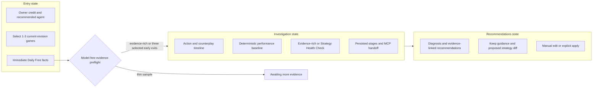
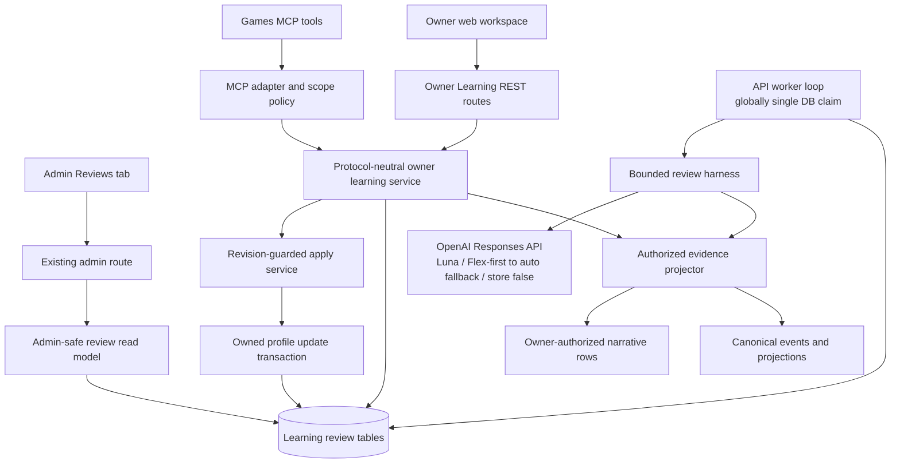
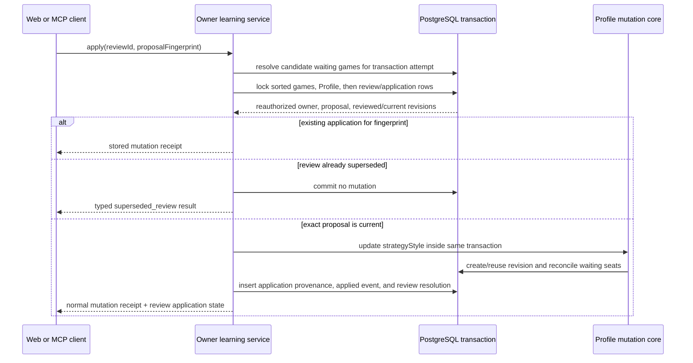
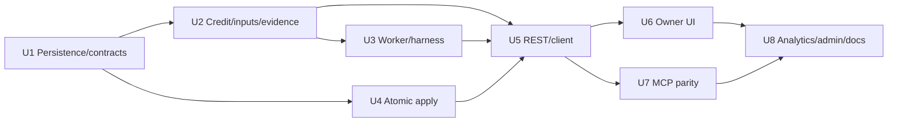

# Owner Learning Loop - Implementation Plan

## Goal Capsule

- **Objective:** Turn an owned agent's completed games into a useful, evidence-backed review that helps a web-app owner make one deliberate strategy update and preserves revision-correct provenance for later outcome measurement.
- **Product authority:** Canonical events and projections establish game facts; authorized transcript rows establish dialogue; cognition owned by the reviewed Agent Profile may explain that agent without becoming board truth.
- **Active scope:** One owner-facing review shared by web and MCP over Daily Free ranked play, including graded activation, immediate deterministic evidence, durable bounded investigation, recommendations, explicit strategy-only application, content-free analytics, and an admin review ledger.
- **Execution profile:** Add review-specific persistence and read models to the API, run one DB-leased review worker in the API process, expose protocol-neutral services through REST and MCP, and build the approved three-state dashboard workspace.
- **Spend policy:** A completed Daily Free ranked game can refill its owner's review-credit balance to one, and credits never stack. One paid review may start per owner per rolling 24 hours. After model-free preflight finds a paid track and live generation is enabled, the idempotent start transaction atomically creates the singleton review, consumes the credit, and starts the rolling allowance; starting buys the review and owners cannot cancel it. Use `openai:gpt-5.6-luna` with low reasoning effort and a Flex-first request-scoped capacity policy: after three total Flex 429 responses, submit the identical request once with `service_tier: "auto"`, then start the next logical call on Flex again. Cap one review at four logical model calls and three moment dives. Each logical call may contain at most four HTTP transmissions, but only one successful model response. Cap each response at 8,000 total output tokens inclusive of reasoning and visible output, and price it from the effective tier with cost provenance (`actual | estimated | unavailable`). There is no fixed dollar ceiling.
- **Stop conditions:** Do not deploy live review generation until privacy/auth tests, cross-surface parity tests, failure/retry tests, and one explicitly approved predeployment quality run over a frozen owner-authorized case pass. No paid model call is part of routine tests, there is no live per-review operator allowlist, and deployment configuration is the enablement gate.
- **Tail ownership:** The feature owns its review worker, failure diagnostics, admin ledger, funnel events, model-policy version, and cost visibility. Broader browser consent and cookie work remains separate.

---

## Product Contract

### Summary

Influence will let an owner spend one owner-wide review credit on one owned Agent Profile and one to three selected Daily Free ranked games played by that Profile's current analytical revision. The flow shows deterministic facts immediately, then runs a bounded AI investigator over authorized dialogue and cognition belonging to the reviewed agent. Evidence-rich reviews may investigate moments; a selection of exactly three round-one/two eliminations activates a clearly labeled Strategy Health Check. The review produces evidence-linked recommendations and, when the evidence supports a change, one proposed strategy update that the owner must explicitly apply. An honest no-change result contains no proposal or apply action and resolves automatically.

### Problem Frame

Influence already preserves stable Agent Profiles, game-effective analytical revisions, completed results, owner-authorized match narratives, and agent editing. Those capabilities expose evidence but do not bring a typical web-app owner into the improvement loop.

The existing MCP workflow lets a connected assistant inspect games, investigate narrative details, and update an owned agent. Most web owners have not connected MCP, so the product must bring a bounded version of that experience into the dashboard while making MCP the natural path for deeper follow-up.

Game actions alone cannot support a credible strategic review. They establish what happened, but authorized dialogue and the reviewed agent's cognition are needed to examine promises, social reads, intent, missed signals, and responses from the room.

### Key Decisions

- **Owner learning is the product, not producer tuning.** (session-settled: user-directed — chosen over a producer-oriented improvement feature because the web product must get ordinary owners to improve their agents.) The owner already has a strong MCP workflow; the web product must get other owners to improve their agents. Governs R1-R4, R24-R27.
- **Use graded activation tied to revision evidence.** (session-settled: user-approved — chosen over immediate interruption or waiting for a large sample.) Discoverability begins after one completed game and becomes prominent after three without interrupting every owner immediately. Governs R2-R4.
- **Limit V1 eligibility to Daily Free ranked play behind one policy seam.** (session-settled: user-directed — chosen because custom games are variable and experimental.) The initial policy accepts completed games whose canonical `trackType` is `free`, stores its version with each review, and can admit other game classes later without rewriting historical reviews. Governs R1-R4, R10, R15, R23-R25.
- **Use one owner-wide refillable credit with a rolling start limit.** (session-settled: user-directed — chosen over one opportunity per agent or banked per-game runs so an owner can spend earned access on the agent that most needs review.) Each completed qualifying game can refill an empty owner balance to one, credits never stack, and one paid review may start per owner per rolling 24 hours. A review targets one owned Profile and one to three selected current-revision games; old games may be selected again until that Profile changes revision. Governs R1-R4, R10, R15.
- **Starting a paid review buys it.** (session-settled: user-directed — chosen over owner cancellation or a pre-dispatch refund window.) Paid-track start atomically consumes the credit and rolling allowance with singleton review creation. Owners cannot cancel queued or running work; a failed review may be retried or resolved as failed without a refund. Governs R7, R17-R22, R28-R29, R33.
- **Allow only one unresolved review per owner.** (session-settled: user-directed — chosen so web and MCP always converge on the same work.) A new review cannot open until the existing review is applied, linked to a manual update, explicitly declined, automatically closed as no-change, resolved after failure, or superseded by an unrelated update to the reviewed agent. Every review remains addressable by ID and owner-authorized after resolution. Governs R7, R17-R22.
- **Use a bounded investigative review.** (session-settled: user-approved — chosen over facts-only advice and one large uncached transcript prompt.) Compact narrative scanning plus targeted moment dives provides stronger analysis than facts alone. Governs R10-R14.
- **Use a Strategy Health Check for repeated early exits.** (session-settled: user-directed — chosen after distinguishing one or two bad-luck exits from three repeated early eliminations.) Selecting exactly three current-revision games in which the agent was eliminated in round one or two activates a serious, game-informed strategy audit. It must diagnose a guidance gap, execution gap, or no clear strategy defect, while one or two thin exits wait without model spend. Governs R4, R10-R14.
- **Run reviews as durable Flex-first work with bounded standard fallback.** (session-settled: user-directed — chosen over Flex-only failure so ordinary owners are not stranded when lower-cost capacity is temporarily unavailable.) The worker keeps the existing request-scoped three-Flex-429-to-auto transport policy durable, auditable, and shared across web and MCP. Governs R7-R9, R12, R15, R20, R23-R24, R27.
- **Require an explicit owner apply.** (session-settled: user-directed — chosen over unattended mutation.) Recommendations may draft a change, but only the owner activates it. Governs R16-R19.
- **Limit automatic application to owner-authored strategy guidance.** (session-settled: user-approved — chosen over broad Profile rewriting.) Persona, backstory, model, archetype, runtime policy, identity, and presentation remain untouched. Governs R16-R19.
- **Share one review across web and MCP.** (session-settled: user-approved — chosen over separate web and assistant analyses.) A persisted review creates a real handoff and prevents surface-specific duplicate analysis. Governs R20-R22.
- **Use the approved three-state film-room experience.** (session-settled: user-approved — chosen over generic loading/cards and filler design variants.) Entry, active investigation, and recommendations each have a distinct product job. Governs R5-R8, R26.
- **Give administrators operational review visibility without changing the audience.** (session-settled: user-directed — added after confirmation to track review cost, recommendation, and acceptance.) The admin ledger exposes cost, generated recommendations, and acceptance/application state for support and cost oversight. It does not expose producer traces or become a producer-tuning surface. Governs R23-R27.

<!-- ce-section: work-relationships -->
### How This Work Fits Together

This plan owns the Owner Learning Loop as one complete owner journey. The surrounding breakdown is current context, not a committed roadmap.

- **Depends on:** Existing Agent Profile identity, analytical revisions, game-effective revision receipts, canonical postgame facts, owner-authorized match narratives, and agent updates.
- **Extends:** Existing dashboard Agent Bench, agent analysis, manual agent editing, admin tabs, and Games MCP setup surfaces.
- **Enables:** Later revision-outcome reporting can use the review provenance and revision-separated results produced by this loop.
- **Can proceed independently of:** More vote formats, format-specific coaching, a broader analytics SDK, and a cookie banner.
- **Does not create:** A producer improvement harness, an in-game House tool caller, or a general web chat analyst.

### Actors

- A1. **Agent owner:** Owns the Agent Profile, sees eligible evidence, starts or resumes reviews, and chooses whether to edit manually or apply the proposed strategy change.
- A2. **Review service:** Loads deterministic evidence, runs the bounded investigator, persists progress and results, and enforces spend, authority, and mutation boundaries.
- A3. **Connected AI assistant:** Uses MCP to start or resume the same review, inspect its evidence, perform deeper authorized follow-up, and apply a change only after fresh user confirmation.
- A4. **Authorized administrator:** Inspects review lifecycle, cost, generated recommendations, and application outcome for support and operational oversight under existing admin authorization.

### Requirements

**Eligibility and activation**

- R1. Review entitlement belongs to the authenticated owner. Each completed game admitted by versioned eligibility-policy V1 (`trackType = free`) may refill an empty owner balance to one credit, and credits never stack; custom games are excluded.
- R2. A review must target one owned Agent Profile and one to three distinct selected Daily Free games played by that Profile's current analytical revision. A Profile with a new current revision cannot be reviewed until that revision has completed a new eligible game.
- R3. Previously analyzed games remain selectable on the same current revision and display a derived `Previously analyzed` marker after a successfully completed analysis, including no-change. Failed reviews do not mark their games.
- R4. The product must default toward recently played Profiles and their latest not-yet-analyzed eligible games, show a subtle CTA after the first eligible game and a prominent prompt after the third while credit remains unused, and suppress a dismissed prominent prompt until another qualifying game completes. Dashboard and agent contexts retain non-interruptive entry.
- R28. Eligibility, credit, prompts, dismissals, deterministic previews, game selection, entitlement checks, and structural evidence preflight must not invoke a model or occupy the singleton review slot. The service may create an unresolved review only after preflight finds a paid analysis track and live generation is enabled. While generation is disabled, paid-track preflight/start returns deterministic evidence plus a typed unavailable state, creates no unresolved review, and reserves or consumes no credit or rolling allowance.
- R29. One paid review may start per owner per rolling 24 hours. After paid-track preflight and the generation-enabled check succeed, one transaction reauthorizes eligibility, enforces the owner-wide singleton and rolling limit, creates the review and selected-game joins, advances the credit watermark through the latest then-visible qualifying completion, and records the rolling-start timestamp. A successful start consumes both admission controls even if provider dispatch has not begun or the review later fails; idempotent replay returns the purchased review without consuming them again.

**Immediate evidence and waiting experience**

- R5. The review must show deterministic results, actions the agent took, actions taken against the agent, votes, powers, placements, and other available canonical facts before AI analysis completes.
- R6. The web flow must preserve the repository-owned entry, investigation, and recommendations reference frames, with deterministic evidence as the primary workspace and analysis progress as secondary context. Agent switching, rolling-limit, generation-disabled, start-purchase consequences, failure/retry, no-change, Strategy Health Check, declined, failed resolution, superseded, resolved, and existing-open-review extensions must use the same visual language.
- R7. At most one unresolved review may exist per owner across all owned Agent Profiles. A started review must survive refresh and navigation, remain addressable by immutable review ID, reopen from dashboard, agent, REST, or MCP contexts, and return the same persisted progress or result. A new start must return the existing open review until it reaches a terminal resolution.
- R8. Progress must report persisted stages such as evidence loading, narrative scanning, moment investigation, and recommendation drafting. Flex backoff and standard fallback remain inside the current stage and may expose only a safe shared capacity substatus; visual easing is permitted, but the UI must not claim a numeric percentage or completion time it cannot know.
- R9. Each logical model call must start on Flex, retry until three total Flex 429 responses have occurred, and then submit the identical Luna request once with `service_tier: "auto"`; other failures do not trigger tier fallback, and the next logical call starts on Flex again. Failure of the full capacity chain, model failure, or output-budget truncation must preserve deterministic evidence and explain the failure. Output-budget truncation is retryable only while the lifetime logical-call budget remains.

**Bounded strategic investigation**

- R10. Deterministic summaries and AI context must cover the same one to three owner-selected games frozen into the review. The model-free preflight must classify that selection as evidence-rich, awaiting more evidence, or Strategy Health Check before provider dispatch.
- R11. An evidence-rich investigation must begin with compact owner-authorized narratives that keep canonical facts, authorized dialogue, and cognition belonging to the reviewed agent in their existing authority lanes. Selecting exactly three games in which the reviewed agent was eliminated in round one or two must activate Strategy Health Check; changing the selection may produce another preflight result.
- R12. One review may reserve at most four logical model-call ordinals and perform at most three targeted moment dives across its entire lifetime, including explicit retries. Every request carries its ordinal, remaining budget, and whether that call must return the final result; the fourth call uses a non-null final-result schema. The bounded Flex capacity transmissions and one standard fallback remain inside the current ordinal and do not consume additional logical-call budget.
- R13. A moment dive must return the smallest useful bundle of canonical facts, surrounding owner-authorized dialogue, and reviewed-agent cognition needed to evaluate that moment.
- R14. A completed review must contain one overall diagnosis, no more than three recommendations, evidence links to exact selected games or moments, appropriate keep guidance, and its analysis track. A change-ready result must also contain exactly one proposed `strategyStyle` diff; an honest no-change result must instead explain why no proposal is warranted and contain no proposal.
- R15. Completed-game evidence and authorized moment-bundle preparation must be reusable across reviews, while review-specific generated interpretation remains attached to its review. Selected games remain immutable after start, the `Previously analyzed` marker derives from successfully completed review-game associations, and later eligibility-policy changes must not rewrite historical membership.
- R30. Strategy Health Check must begin with current `strategyStyle`, canonical facts, and compact authorized narratives/cognition for all three selected games, then classify `guidance_gap | execution_gap | no_clear_strategy_defect`. It may use targeted moment dives only when needed to distinguish those diagnoses.
- R31. Every Strategy Health Check recommendation must declare one proof form: an observed pattern supported by server-issued refs from at least two selected games; a prompt-guidance defect that identifies an exact clause or missing instruction and one rubric category (`ambiguous_priority | conflicting_instructions | missing_contingency | non_actionable_guidance | missing_social_plan | missing_vote_plan`); or both. The response separates observed evidence (800 characters maximum), strategic interpretation (800 characters maximum), proposed guidance (800 characters maximum), and exact guidance target (400 characters maximum), and must describe elimination relationships as patterns rather than causes. Structural validation rejects unknown refs and incomplete proof shapes; it does not pretend to prove that free-form interpretation is semantically entailed. Semantic grounding and non-causal framing are quality contracts evaluated with locked fixtures, the approved predeployment quality case, inspectable evidence in the owner UI, and admin spot review.
- R32. An execution-gap result may recommend only clearer or more prioritized `strategyStyle` guidance. It must not recommend code, model, runtime, persona, or archetype changes. Strategy Health Check may return no-change only with a specific defense of why the current guidance remains sound; generic insufficient-evidence language is invalid after three selected early exits.

**Owner-controlled update**

- R16. A proposed automatic change must target only the existing owner-authored `strategyStyle` field and satisfy that field's current validation and length constraints.
- R17. The ready state must offer the existing manual editor, exact apply, and an explicit `Keep current strategy` action. Viewing does not resolve a ready review; the owner must apply, complete a linked manual update, or decline it before another review may start. No-change resolves automatically.
- R18. Applying a proposal must require the Agent Profile's current analytical revision to match the reviewed revision. Any unrelated same-Profile update that changes the current analytical revision must atomically resolve the open review as `superseded`, invalidate late worker/finalization writes, preserve the review by ID, and never overwrite newer owner work; presentation-only updates and updates to another Profile have no effect.
- R19. A successful apply must use the normal owned-profile update behavior, create or resolve the next analytical revision, return the existing mutation receipt, and retain provenance linking the review, immutable proposal, source recommendation IDs, prior revision, and resulting revision.
- R33. Terminal resolution must distinguish `applied | manual_update | declined | no_change | failed | superseded`. Owners cannot cancel queued or running work. Decline is valid only for a completed ready recommendation; resolving as `failed` is valid only after analysis status is `failed`, closes the singleton without refund, and preserves the failure/call receipts. A retryable failed review may instead resume under its remaining lifetime budget.

**Web and MCP continuity**

- R20. Web and MCP must address the same singleton open review, credit and eligible-input read model, progress/capacity substatus, evidence, outputs, resolution, and apply state rather than generating surface-specific copies. Neither surface may select or override provider tier; REST and MCP review reads must reauthorize the owner before returning existence, state, or counts.
- R21. MCP must let an authorized assistant list the owner's open reviews (zero or one), list eligible review inputs, start or resume the singleton review with one Profile and one to three game IDs, read a review by ID, retry it, apply its exact persisted strategy proposal, and resolve a ready recommendation as declined or a failed review as failed under the same ownership, budget, idempotency, and revision rules as web. Mutating tools require `agents:write` in addition to the read scopes.
- R22. The web experience must offer MCP as a contextual path for deeper questioning and additional authorized game inspection without making MCP installation a prerequisite for a useful review. For an unconnected owner, the callout must enter the existing Games MCP setup and return the browser to the same persisted review after setup; the assistant then discovers it by listing open reviews rather than receiving a browser URL or generated continuation prompt.

**Analytics, privacy, and administration**

- R23. The product must record content-free funnel and operational signals for prompt impressions, dismissals, purchased starts, evidence-track selection, persisted stages, Flex capacity retries, standard fallback use, completion, failure, explicit retries, distinct failed/decline/supersede resolutions, token and cost usage by effective tier, MCP connection movement, recommendation views, manual-edit handoffs, applies, and subsequent Daily Free play.
- R24. Analytics, worker logs, and cost receipts must exclude transcript text, cognition prose, prompts, provider responses, private dialogue bodies, private traces, and recommendation bodies.
- R25. Subsequent results must remain grouped by the revision that each game executed; the UI and analytics must not present a before-and-after difference as causal proof from a small sample.
- R26. The web flow must remain usable across supported desktop and mobile layouts, expose semantic status and focus behavior, and honor reduced-motion preferences without losing progress meaning.
- R27. The existing authorized admin area must provide a review ledger that shows owner/Profile/revision identity, selected games, analysis track and diagnosis, lifecycle and terminal resolution, reviewer model and version, requested/effective tier, capacity path, Flex 429 count, token usage, cost with its source (`actual | estimated | unavailable`), generated recommendations and proof metadata, proposed strategy diff, whether the exact proposal was applied, and which source recommendations were thereby accepted. `manual_update` records review-driven action without proposal acceptance; `declined`, `failed`, and `superseded` mean not accepted; `no_change` is not applicable. The ledger reads the validated review artifact and does not copy raw prompts, provider responses, or bulk source payloads into analytics/cost storage; producers and administrators retain their existing authorized source-detail access through established surfaces.
- R34. Every generated owner/admin prose field must be schema-length-bounded and rendered as escaped plain text. Owner and admin surfaces must not interpret generated HTML or Markdown or activate model-authored links; evidence navigation may use only server-minted typed refs mapped by trusted application code.

### Review Workspace Shape



The entry state rewards the owner before model work begins, recommends a recently played Profile, and makes the one-to-three-game selection explicit. The preflight prevents one or two bad-luck early exits from becoming an overconfident diagnosis while making exactly three selected early exits a clearly labeled Strategy Health Check. The investigation state remains useful while the reviewer works. The recommendations state makes evidence, proof type, restraint, and owner control more prominent than generated prose. The approved frame HTML and design reference under `docs/ideation/2026-08-03-owner-learning-loop-*` are the visual acceptance authority.

### Key Flows

- F1. **Earn and spend review credit**
  - **Trigger:** A Daily Free game completes for any Agent Profile owned by an owner whose credit balance is empty.
  - **Actors:** A1, A2
  - **Steps:** The versioned policy verifies `trackType = free`, exposes one owner-wide credit, recommends a recently played Profile and latest not-yet-analyzed games, and lets the owner select one to three eligible games for any owned Profile with current-revision evidence. Preflight remains model-free.
  - **Outcome:** The owner understands why review is available and what evidence will be analyzed before spend.
  - **Covered by:** R1-R5, R28-R29
- F2. **Run and wait for a review**
  - **Trigger:** The owner confirms an eligible Profile and game selection that passes preflight.
  - **Actors:** A1, A2
  - **Steps:** Deterministic evidence renders and preflight selects evidence-rich, awaiting-evidence, or Strategy Health Check handling. Awaiting-evidence creates no review and spends nothing. Starting a paid track atomically buys the singleton review with its credit and rolling allowance, runs the durable bounded harness, and advances the interface only when persisted stages advance.
  - **Outcome:** The singleton review waits honestly, reaches a completed recommendation set, or enters an understandable retry/failed-resolution state.
  - **Covered by:** R5-R15, R28-R32
- F3. **Apply a proposed strategy update**
  - **Trigger:** The owner selects apply on a completed review whose reviewed revision remains current.
  - **Actors:** A1, A2
  - **Steps:** Influence verifies ownership, immutable proposal fingerprint, and revision freshness; applies only `strategyStyle`; and returns the normal mutation receipt with review provenance.
  - **Outcome:** Future following seats use the resulting analytical revision and the old review remains auditable.
  - **Covered by:** R16-R19, R25
- F4. **Supersede work after an unrelated strategy update**
  - **Trigger:** An unlinked effective-input update changes the reviewed Agent Profile's current analytical revision while its review remains unresolved.
  - **Actors:** A1, A2
  - **Steps:** The ordinary update transaction resolves the review as `superseded`, invalidates active worker/finalization writes, and preserves the historical review by ID. A concurrent apply or update serializes so only one outcome wins.
  - **Outcome:** Newer owner work wins and the owner-wide singleton slot is immediately available.
  - **Covered by:** R18-R19, R33
- F5. **Continue through MCP**
  - **Trigger:** The owner opens the MCP path before, during, or after a web review, whether already connected or not.
  - **Actors:** A1, A2, A3
  - **Steps:** An unconnected owner enters the existing Games MCP setup and the browser returns to the same review after setup. The assistant lists the owner's zero-or-one open reviews, reads it by ID, uses existing authorized detail tools for follow-up, and then retries, applies, declines, links a manual update, or resolves failed work. A web-started review remains discoverable after the browser closes; an MCP-started review appears on the web resolver page.
  - **Outcome:** Web and MCP form one persisted improvement loop without URL handoff or competing copies.
  - **Covered by:** R20-R22
- F6. **Refill credit and preserve review history**
  - **Trigger:** Another Daily Free game completes after the owner's last credit-consumption cutoff.
  - **Actors:** A1, A2
  - **Steps:** Influence preserves completed reviews, derives `Previously analyzed` from successful review-game joins, and refills an empty owner balance to one. At paid start it advances the owner cutoff through the latest qualifying completion so games completed while the balance was full do not become banked credits.
  - **Outcome:** Review history, owner-wide entitlement, and cost remain legible without one paid run per accumulated game.
  - **Covered by:** R1-R4, R15, R25, R29
- F7. **Inspect operational outcomes**
  - **Trigger:** An authorized administrator opens the Reviews tab.
  - **Actors:** A2, A4
  - **Steps:** Influence lists reviews with identity, track, state, resolution, token usage, sourced cost, generated recommendations, proposal, per-recommendation acceptance, and application receipt; expandable detail reads the persisted validated review artifact rather than analytics/cost rows.
  - **Outcome:** Review quality, expense, and owner acceptance are inspectable under existing administrator authority.
  - **Covered by:** R23-R27

### Acceptance Examples

- AE1. **Covers R1-R4, R28-R29.** Given an owner with zero credit, when any owned Profile completes a qualifying `trackType = free` game, then the balance becomes one and a subtle CTA appears without a model call. More qualifying games while that balance is one do not stack credits, and a custom game earns nothing.
- AE2. **Covers R2-R4.** Given one owner credit and eligible current-revision games across several owned Profiles, when the owner enters the flow, then Influence recommends a recently played Profile and latest not-yet-analyzed games but permits spending the credit on any owned Profile with one to three valid same-revision games. A dismissed prominent CTA remains suppressed until another qualifying completion while non-interruptive entries remain.
- AE3. **Covers R5-R8.** Given an owner starts a review, when AI work is queued or investigating, then accepted actions, counterplay, outcomes, and the current persisted stage remain visible without an invented percentage or ETA.
- AE4. **Covers R7, R12, R15.** Given a review is running or complete, when the owner refreshes, navigates away, retries, or enters from another surface, then Influence resumes the same review ID and lifetime logical-call/dive counters do not reset. A concurrent start for any owned Agent Profile returns the existing open review instead of creating another.
- AE5. **Covers R2, R10-R14.** Given eight eligible games on one current revision, when the owner selects three and starts a review, then deterministic aggregates and AI context cover exactly those three, the investigator issues no more than four logical model calls, performs no more than three dives, and returns no more than three recommendations.
- AE6. **Covers R11-R14, R24.** Given a selected moment contains public speech, an owned huddle, reviewed-agent cognition, and another owned agent's cognition, when the investigator dives into it, then it receives the authorized dialogue and reviewed-agent cognition but not the other agent's cognition or producer traces.
- AE7. **Covers R10-R14, R28, R30-R32.** Given one or two selected thin-evidence games ended in round one or two, when preflight runs, then the owner sees deterministic facts and an awaiting-evidence explanation with no review row, provider call, credit use, or daily-limit use. Given exactly three selected current-revision early exits, preflight activates Strategy Health Check; a no-change result must specifically defend the standing guidance rather than claim generic insufficient evidence.
- AE8. **Covers R8-R9, R12, R20, R23, R27.** Given a logical call receives three total Flex 429 responses, when the identical request succeeds on standard capacity, then it completes under the same call ordinal and persisted review stage, consumes one logical-call ordinal, records the fallback path and standard-tier cost, and appears identically through web, MCP, and admin. Given the standard transmission also returns 429, the review fails as `provider_capacity_exhausted`, preserves deterministic evidence, and offers explicit retry only when logical-call budget remains.
- AE9. **Covers R16-R19.** Given a completed review and unchanged current revision, when the owner explicitly applies its fingerprinted proposal, then only `strategyStyle` changes, a revision receipt returns, and a duplicate apply returns the stored receipt without another mutation.
- AE10. **Covers R18, R33.** Given an unresolved review, when an unrelated effective-input update changes its reviewed Profile's current analytical revision, then the update succeeds, the review becomes `superseded`, late worker writes are rejected, and the owner can start another review. Presentation-only updates and updates to another owned Profile do not affect it.
- AE11. **Covers R7, R20-R22, R33.** Given a web review is investigating and the browser closes, when the owner later connects MCP and lists open reviews, then the assistant receives that same review ID and can read it. Mutating tools require `agents:write`; another owner receives neither review data nor an existence signal. The assistant may retry or resolve failed work and may resolve a ready recommendation as declined by ID; neither surface exposes owner cancellation, and the reverse MCP-to-web flow reaches the canonical owned review.
- AE12. **Covers R23-R25, R33.** Given the owner completes, resolves failed work, declines, supersedes, manually updates from, or applies a review, when analytics are inspected, then each truthful outcome is distinct without game-authored or generated event bodies and later Daily Free results remain attributed to game-effective revisions without causal language.
- AE13. **Covers R24, R27.** Given a completed review was applied, when an authorized administrator expands it, then token totals, cost and its actual/estimated/unavailable source, track, diagnosis, each recommendation, source-recommendation acceptance, exact proposal, applied state, and resulting revision are visible. Prompts, provider responses, and bulk source payloads are not copied into review analytics or cost records; existing authorized producer/admin source access is unchanged.
- AE14. **Covers R3, R15.** Given a game was part of a successfully completed ready or no-change review, when the owner later selects games for the same current revision, then that game remains selectable and is marked `Previously analyzed`. A failed review does not add the marker.
- AE15. **Covers R1-R4, R29.** Given an owner with one credit and no paid start in the prior 24 hours, when an eligible paid-track start commits, then the review, selected games, credit watermark, and rolling-start timestamp commit atomically. A lost start response returns the purchased review by idempotency key, no owner cancellation exists, later failure does not restore admission, and the next qualifying completion may refill only the now-empty balance.
- AE16. **Covers R17-R19, R33.** Given a ready recommendation, viewing it leaves the review open. Exact apply resolves `applied`; an ordinary update with `sourceReviewId` resolves `manual_update`; `Keep current strategy` resolves `declined`; and no-change resolves automatically. Given failed analysis, retry resumes the same review when budget remains or resolve closes it as `failed` without refund.
- AE17. **Covers R30-R32.** Given Strategy Health Check proposes a change, each recommendation identifies `Observed pattern`, `Prompt-guidance defect`, or both. An observed pattern cites at least two selected games; a guidance defect identifies the exact clause or omission and one fixed rubric category; the UI labels the support as `Seen across N games`, `Found in your strategy guidance`, or `Seen in play and guidance`.
- AE18. **Covers R22.** Given an owner without an MCP connection opens the deeper-analysis callout from a persisted review, when they complete the existing Games MCP setup, then the browser returns to that review and tells the connected assistant to list open reviews. No review URL or generated continuation prompt is passed through MCP.
- AE19. **Covers R2, R4.** Given eligible current-revision games for several owned Profiles, when the owner chooses Change agent before preflight, then the workspace lists only eligible owned Profiles and atomically replaces the Profile, revision context, recommended selection, and deterministic preview.
- AE20. **Covers R6, R29.** Given an owner has a credit but the rolling allowance is not ready, when eligible inputs load, then the selected Profile, games, and deterministic facts remain available, paid start is disabled, and the UI shows the server-provided next eligible time until a fresh read makes start available.
- AE21. **Covers R6, R29, R33.** Given an eligible paid-track selection, when the owner reaches Start, then the UI states that starting uses the credit and rolling allowance and cannot be cancelled. A duplicate or response-loss retry returns the same purchased review rather than creating or charging another.
- AE22. **Covers R13-R14, R24, R34.** Given malicious dialogue causes generated diagnosis, rationale, keep guidance, or no-change text to contain HTML, Markdown links, or script-shaped content, when the result passes through validation, REST, owner UI, and admin UI, then every field remains bounded escaped text and only trusted server-minted evidence controls are interactive.
- AE23. **Covers R28-R29.** Given live generation is disabled, when web or MCP preflights or starts an otherwise valid paid-track selection, then deterministic evidence remains available with a typed unavailable state, no unresolved review is created, no worker can claim work, and credit plus the rolling allowance remain untouched.

### Success Criteria

- An eligible web owner can move from review prompt to deterministic evidence, completed recommendations, and an explicit strategy update without connecting MCP.
- The investigation state is useful before AI completion because it exposes action, counterplay, and performance evidence rather than a standalone loading screen.
- Every recommendation is evidence-linked, respects the three-lane authority model, and stays within the bounded investigator contract.
- Refreshes, duplicate entries, retries, and web-to-MCP handoffs do not create duplicate review records or reset the lifetime spend budget.
- One owner cannot hold more than one unresolved review, cannot hold more than one credit, and cannot start more than one paid review in a rolling 24-hour window.
- Review analytics, worker logs, and cost receipts contain no prohibited game-authored, generated, or provider content.
- Authorized administrators can answer what a review cost, what it recommended, and whether it was applied without opening its private source evidence.
- Launch analytics establish baselines for prompt-to-start, start-to-completion, recommendation-to-edit/apply, MCP connection movement, per-review cost, and return-to-play. Numeric adoption targets wait for observed traffic rather than being invented in planning.

### Scope Boundaries

**In scope**

- Owner activation from dashboard and agent contexts.
- The repository-owned three-state web review, required derived states, and high-quality waiting experience.
- Daily Free ranked-game facts plus bounded dialogue/cognition investigation and Strategy Health Check for exactly three selected early exits.
- Durable Flex-first execution with bounded request-scoped standard fallback, evidence reuse, failure, and retry.
- Evidence-linked recommendations and owner-approved strategy-only application.
- One owner-wide unresolved review shared across web and MCP, canonical review-ID URLs, no owner cancellation, and distinct apply/manual/decline/no-change/failed/supersede behavior.
- Content-free funnel/cost signals and revision-correct subsequent-play signals.
- Admin review ledger with cost, generated recommendation content, and acceptance/application state.

**Out of scope**

- Producer diagnostics, producer tuning, or access to producer private traces.
- Unattended agent updates or recurring automatic mutation.
- Automatic changes to personality, backstory, archetype, model, runtime policy, name, avatar, or other profile fields.
- Open-ended analyst chat inside the web app.
- A generic production transcript keyword-search UI or new player-visible reasoning surface.
- Historical reconstruction or backfill for games whose dialogue or cognition was not captured.
- Custom, open, hidden, experimental, imported, tournament, or other non-Daily-Free games. V1 accepts only canonical `trackType = free` games through one versioned policy seam.
- More vote formats, format-specific coaching, a broader analytics SDK, third-party tracking, consent storage, or a cookie banner.
- An in-game House/agent tool-calling harness.
- Claims that a small before-and-after sample proves the strategy change caused an outcome.

### Dependencies and Assumptions

- Completed Daily Free seats retain the Agent Profile and game-effective analytical revision they executed; those immutable associations plus `games.trackType = free` define V1 eligibility.
- Canonical postgame read models remain authoritative for accepted actions and outcomes; transcript and cognition remain contextual lanes.
- Structural narrative coverage varies. The model-free preflight may wait after one or two thin-evidence early exits, select evidence-rich moment investigation, or activate Strategy Health Check for exactly three selected round-one/two eliminations.
- `strategyStyle` remains the sole automatic mutation target in this slice.
- The existing owned-profile update path remains responsible for analytical revision creation, waiting-seat reconciliation, frozen-seat preservation, and mutation receipts.
- Existing token/cost accounting, model catalog, MCP authorization, match narratives, and lease patterns can be reused narrowly; the prompt-thread filesystem workspace is not a production dependency.
- Provider cache hits are an optimization signal, never a correctness dependency.
- A completed MCP connection is measured as the first successful authenticated Games MCP request with the required owner scopes after a review MCP offer—not as proof that the offer caused installation.

### Product Contract Preservation Note

Planning preserves the confirmed product contract except for the user-directed capacity-policy change and the later user-directed start-means-buy lifecycle. V1 admits only Daily Free ranked play behind a versioned policy seam. One owner-wide credit never stacks, may be spent on any owned Profile with current-revision evidence, and is consumed with the rolling 24-hour allowance atomically when paid-track start succeeds. One unresolved review is shared by web and MCP and remains addressable by ID. Owners cannot cancel; failed work may be retried or resolved as failed without a refund. Strategy Health Check is the only repeated-early-exit product name and enforces diagnosis and recommendation-proof contracts. Terminal outcomes distinguish apply, linked manual update, decline, automatic no-change, failed resolution, and unrelated-update supersede. R27 and AE13 retain the admin requirement to track cost, generated recommendations, and exact proposal acceptance. The previously proposed fixed dollar ceiling remains removed; credit admission, rolling start limit, bounded logical calls/dives/tokens, request-scoped fallback, effective-tier cost provenance, and admin visibility are the spend controls.

---

## Planning Contract

### Architecture Decisions

| Decision | Choice | Why |
|---|---|---|
| Eligibility policy | One pure versioned server policy; V1 accepts completed `games.trackType = free` seats only | Daily Free is stable ranked evidence. Custom/experimental formats remain excluded, while storing the policy version lets a later product decision change future admission without rewriting history. |
| Owner entitlement | One derived credit backed by any qualifying completion after an owner watermark; paid-track start atomically advances the watermark through the latest qualifying completion and records the rolling-24-hour timestamp | The token bucket never exceeds one, does not require a game-completion critical-path write, and remains fungible across owned Profiles. Games completed while credit was already full do not bank future paid runs. Starting buys the review; provider timing does not change admission. |
| Review identity | Server-minted immutable review ID bound to owner + Agent Profile + current analytical revision + ordered one-to-three-game fingerprint + policy/evidence/reviewer versions | Start freezes the owner's explicit selection. A trimmed non-empty client idempotency key of at most 200 characters prevents duplicate starts without forbidding later reuse of the same game set. |
| Owner admission | Model-free preflight before review creation, then one unresolved review per owner through a partial unique index and atomic start/resolve transactions | Insufficient evidence consumes no singleton slot. Web and MCP list the same zero-or-one review, and truthful terminal outcomes unblock it. |
| Durable execution | One globally active DB-leased review across all API replicas, claimed by an in-process worker loop | A transaction-scoped advisory claim gate plus review lease is the smallest restart-safe implementation that bounds global concurrency without a queue product or separate deployment. |
| Review model | `openai:gpt-5.6-luna`, low reasoning effort, `store: false`, SDK retries disabled, and the existing Flex-first engine transport | Each logical call sends at most three total Flex transmissions. If all three return 429, it sends one identical `auto` request. The policy is request-scoped, so each later logical call probes Flex again. Other errors never switch tiers. |
| Spend bounds | One owner credit, one paid start per rolling 24 hours, a deterministic 32,000 estimated-input-token ceiling per logical call, 8,000 total output tokens per response inclusive of reasoning and visible output, four lifetime logical calls, and three lifetime dives | Credit and the rolling limit are consumed together with singleton creation. Capacity-only 429s have no usage or cost; the one successful response is priced from its effective tier. Schema character limits bound visible content, and immutable call rows preserve actual/estimated/unavailable cost provenance. |
| Analysis track | Model-free `awaiting_evidence | evidence_rich | strategy_health_check` preflight over the selected games | Thin one/two-game exits wait without spend. Exactly three selected round-one/two eliminations mandate the stronger Strategy Health Check contract. |
| Recommendation proof | Structured support type plus server-validated evidence/rubric fields for Strategy Health Check recommendations | Fixed shapes make support inspectable and reject fabricated refs, while locked quality fixtures and the approved paid case evaluate the semantic link that structural validation cannot prove. |
| Context strategy | Stable cacheable system/schema prefix + versioned local checkpoint + append-only selected moment bundle | It avoids one giant uncached prompt, resumes without provider conversation storage, and makes each retry auditable. |
| Source retention | Persist deterministic snapshots, stable typed source refs/hashes, and validated findings; do not duplicate raw dialogue/cognition | Reuse does not require a second private-content store. Source rows remain authoritative and are reauthorized on every read. |
| Apply contract | Exact persisted proposal fingerprint; atomic expected-revision check; `strategyStyle` only | The model cannot turn a recommendation into an arbitrary write, and newer owner work wins. |
| MCP consent | Tool description requires fresh affirmative user instruction after presenting the exact diff; server accepts only review ID + proposal fingerprint | MCP consent is conversational. A client-supplied `approved: true` flag would create false assurance. |
| Analytics | Narrow first-party append-only review events with safe enums, identifiers, numbers, and timestamps only | The feature needs a measurable funnel without introducing a broad tracking SDK or cookie dependency. |
| Admin | Existing `view_admin` gate; review detail comes from the persisted validated result, not analytics | Admin can see generated content and outcome without contaminating content-free operational logs. Existing producer/admin source-detail authority is unchanged. |

### System Topology



REST, MCP, and admin are adapters around common domain services. The worker is not exposed as a second authority. The database contains durable state; canonical game data and authorized source rows remain the evidence authority.

### Persistence Design

Add migration `packages/api/drizzle/0050_owner_learning_loop.sql` and corresponding Drizzle schema entries.

1. **`agent_learning_review_entitlements`**
   - One row per owner with the last consumed qualifying-completion watermark `(completed_at, game_id)`, last paid review-start timestamp, last surfaced threshold, and dismissal watermark.
   - Credit is derived as zero or one: it is one when an admitted completion exists after the consumed watermark. The row does not count credits and game completion does not write it.
   - Any paid start path first lazily inserts the owner row with `ON CONFLICT DO NOTHING`, then locks and re-reads it. This gives a first-time web deep link or MCP start the same row-backed serialization without adding a game-completion write.
   - The paid-start transaction locks and re-reads this row, rechecks the owner-wide unresolved review and rolling 24-hour allowance, verifies a credit exists, advances the consumed watermark through the latest then-visible qualifying completion, records start time, and creates the review plus selected-game joins atomically.
   - Dismissal suppresses only the prominent CTA until a qualifying completion advances beyond the dismissal watermark. It never hides the agent/dashboard entry or removes credit.

2. **`agent_learning_game_evidence`**
   - Identity: owner user ID, Agent Profile ID, analytical revision ID, game ID, evidence version.
   - Immutable snapshot: completion identity, placement/outcome, accepted actions by the agent, accepted actions against the agent, votes, powers, phase/round coordinates, aggregate counters, and source capture/hash metadata.
   - Candidate moments: server-minted IDs and typed coordinates only. Do not store transcript or cognition bodies.
   - Unique key: `(owner_user_id, agent_profile_id, analytical_revision_id, game_id, evidence_version)`.

3. **`agent_learning_reviews`**
   - Immutable key material: owner, Profile, reviewed current revision, ordered one-to-three-game fingerprint, start idempotency key, eligibility policy, analysis track, reviewer/evidence/prompt/schema/provider-policy versions, and selected model.
   - Orthogonal state:
     - analysis status: `queued | running | ready | no_change | failed`
     - persisted stage: `evidence_ready | scanning_narratives | investigating_moments | drafting_recommendations | complete`
     - resolution: nullable `applied | manual_update | declined | no_change | failed | superseded` plus `resolved_at`; a null resolution is the owner-wide open review.
   - Budget/worker state: lifetime logical-call count, lifetime dive count, lease hash/expiry, capacity substatus `null | waiting_for_capacity | using_standard_capacity`, safe failure code, retryable flag, and stage timestamps.
   - Versioned local checkpoint: logical-call/dive counters, selected moment order, next-moment cursor, provisional themes, accumulated validated findings, last completed stage, prompt/schema digests, and—only at `complete`—the exact validated result plus proposal fingerprint. It contains validated generated state and typed refs, never raw provider bodies.
   - Result: validated structured diagnosis, analysis track, recommendation array, server-minted recommendation IDs, and typed evidence refs, plus either an exact before/after `strategyStyle` diff with proposal fingerprint or an explicit no-change outcome with rationale. Strategy Health Check also stores `guidance_gap | execution_gap | no_clear_strategy_defect` and each recommendation's `observed_pattern | prompt_guidance_defect | combined` proof, fixed rubric category, exact guidance target, and supporting refs.
   - Display totals are derived from call rows; they are not a second cost authority.
   - Unique key: `(owner_user_id, start_idempotency_key)`. The same games may appear in a later review under another key while the Profile remains on the same revision.
   - A partial unique index on `owner_user_id WHERE resolved_at IS NULL` enforces at most one unresolved review per owner across every Agent Profile. Apply, linked manual update, decline, no-change completion, failed resolution, and supersede write resolution in their successful transaction.

4. **`agent_learning_review_games`**
   - Ordered join from a review to exactly one to three immutable game-evidence rows, created transactionally from the reauthorized owner selection.
   - Successfully completed ready/no-change reviews make these joins the source for the derived `Previously analyzed` marker. Failed reviews do not contribute.

5. **`agent_learning_review_calls`**
   - Immutable logical-call ledger unique on `(review_id, ordinal)` with `reserved | dispatched | succeeded | failed | ambiguous` state, stage, input/policy hash, final provider request ID, requested/effective tier, requested reasoning effort, token receipt, latency, safe failure code, and timestamps. The input/policy hash covers the model, instructions, evidence/input, response schema, output ceiling, reasoning policy, storage policy, tools when present, and other semantic request fields; it excludes only `service_tier` and transport-only headers.
   - Each row carries a bounded content-free transport receipt with at most four entries. Each entry records transport ordinal, dispatch intent, attempted tier, terminal HTTP outcome when received, latency, provider request ID when supplied, and bounded backoff. It also stores `flex429Count`, `fallbackStartedAt`, and derived `capacityPath = flex | standard_fallback`; no request or response body is persisted.
   - Cost follows the existing provider accounting contract: `costSource`, `actualCostMicrousd`, `estimatedCostMicrousd`, `pricingSourceId`, `rateCardVersion`, and `pricedAt`. Flex successes use the Flex rate card; `auto | default` successes use the standard rate card; absent usage remains unavailable rather than zero. A catalog calculation is an estimate, never relabeled actual.
   - The reservation row is inserted before the logical call begins. Dispatch intent is persisted before every physical transmission; a returned terminal outcome is persisted before backoff or fallback continuation. Successful completion atomically writes the immutable accounting receipt and the fully validated checkpoint for that logical ordinal; non-succeeded rows must not carry one.

6. **`agent_learning_moment_evidence`**
   - Cache key: exact authorized source-bundle hash, reviewed Profile/seat, visibility-policy version, evidence/window versions, and normalization version.
   - Stores typed source refs/hashes and context-independent deterministic bundle metadata, never raw source bodies or review-specific model interpretation.
   - Allows later reviews over an extended game set to reuse authorization/bundle preparation. Generated findings remain in the review checkpoint because they depend on the other games and prior hypotheses.

7. **`agent_learning_review_applications`**
   - Unique review ID and proposal fingerprint, immutable source recommendation IDs, prior/resulting analytical revisions, normalized prior/resulting `strategyStyle`, mutation receipt, and applied timestamp.
   - This row is the only authoritative accepted-proposal outcome. The parent review's resolution is written as `applied` atomically. A linked manual update resolves the review as `manual_update` but creates no application and does not count as accepting the proposal.

8. **`agent_learning_events`**
   - Append-only content-free events: `prompt_impression`, `prompt_dismissed`, `review_started`, `analysis_track_selected`, `credit_consumed`, `stage_reached`, `capacity_fallback_started`, `review_failed`, `review_retried`, `review_declined`, `review_superseded`, `review_resolved`, `recommendations_viewed`, `manual_editor_opened`, `proposal_applied`, `mcp_offer_viewed`, and `mcp_connected`. Subsequent Daily Free play is derived from canonical competition receipts by game-effective revision rather than duplicating game truth in this ledger.
   - Payload permits only enumerated identifiers/statuses, counts, durations, token/cost numbers, revisions, and timestamps. No free-form metadata column.
   - This ledger is observational. Prompt suppression, review state, and apply state never depend on analytics retention or event delivery.

All owner reads re-check current ownership before returning counts, source refs, review output, or application state. Review-by-ID reads also verify the path Agent Profile belongs to the review and return no existence signal to another owner. Admin reads use the existing `view_admin` permission. Database foreign keys and unique constraints enforce stable identity; application services enforce authority and state transitions.

Apply disposition is derived, not an independently mutable authority: an application row means `applied`; `resolution = manual_update | declined | failed | superseded` means no generated proposal is accepted; a no-change result/resolution means `no_change`; an unresolved validated proposal plus matching current Profile revision means `available`; all other states are `unavailable`. The application table is unique on review ID and has a composite relationship to that review's persisted proposal fingerprint. Every effective-input update path that changes the current analytical revision must lock and resolve an unrelated same-Profile review as `superseded`; presentation-only updates do not. A linked manual update resolves as `manual_update` without falsely accepting its proposal.

Review-owned children (review games, calls, applications, and events with a review parent) cascade only when an explicitly authorized review deletion exists. The versioned checkpoint is embedded in `agent_learning_reviews` and disappears with its parent row. References to users, Profiles, revisions, games, and historical evidence follow the repository's existing restrictive history policy. V1 retains generated review results and receipts with the Profile's history; ownership loss immediately revokes owner reads. A later cleanup/redaction path must be explicit and audited rather than implemented as incident rollback.

### Credit, Selection, and Evidence Projection

1. Resolve the authenticated owner's Agent Profile before counting games.
2. Apply one pure `ownerLearningGameEligibilityPolicy` before entitlement or input construction. Policy V1 accepts only completed `games.trackType = free` seats and records policy version 1 on every review. Never infer ranked eligibility from display labels, prose, or a nullable season alone.
3. Derive the owner's zero-or-one credit by finding any admitted completion after the entitlement's consumed watermark across all owned Profiles. Order the watermark by completion time and game ID. Do not write product state from game completion.
4. List selectable games by stable Agent Profile and pinned game-effective analytical revision, then require the chosen Profile's revision to equal its current analytical revision. Recommend recently played Profiles and latest games without removing older same-revision games or games already included in a successfully completed analysis.
5. Accept exactly one to three distinct selected game IDs for one Profile. Reauthorize ownership, V1 eligibility, current-revision equality, and exact selection before preflight and again before review creation. Mark prior successful joins as `Previously analyzed` in the read model.
6. Run a pure structural projection before review creation. Exact-selection preflight, `awaiting_evidence`, generation-disabled admission, and rejected starts return deterministic facts without materializing evidence, inserting an unresolved review, reserving a provider call, or consuming credit/daily allowance. Otherwise validate the trimmed non-empty start idempotency key at 200 characters maximum before any DB query, lazily insert the owner entitlement row with `ON CONFLICT DO NOTHING`, lock and re-read it, and atomically consume admission while creating the exact review/review-game set under the owner-wide open-review unique index.
7. Reproject inside the locked paid-start transaction after live selection and allowance checks, require its analysis track plus ordered source hashes/capture versions to equal the outer read-only preflight, then materialize or reuse only that verified live projection. A mismatch rolls back admission. Evidence is reusable only for an exact source hash/capture-version match; later source identities create separate immutable versions. The worker reprojects again before model work and may atomically rebind the selected review games only while the review remains at its untouched `evidence_ready` checkpoint with no logical call. Analysis-track drift or source drift after logical-call work fails closed and non-retryably with `evidence_unavailable` before another provider call; a reclaimed nonterminal call is failed in the same transaction. Deterministic display and AI context both cover the exact one-to-three-game selection.
8. Classify the selected set from canonical round/elimination coordinates and capture metadata:
   - `evidence_rich` when authorized narrative/moment coverage supports strategic investigation;
   - `awaiting_evidence` when thin context contains only one or two round-one/two eliminations; show facts and spend nothing;
   - `strategy_health_check` when exactly three selected current-revision games ended in round one or two.
9. Build a review-specific narrative projection for each selected game:
   - retain owner-authorized surrounding dialogue;
   - retain cognition only when the artifact belongs to the reviewed Agent Profile's seat;
   - exclude cognition from the owner's other agents and all opponent cognition;
   - preserve canonical facts as separate typed fields, never inferred from prose.
10. Mint authoritative candidate moment IDs from stable game/evidence version, anchor kind, stable source coordinate, and window version. Provider calls use deterministic short handles mapped to those IDs server-side; a returned handle must have been visible in that call. Neither model-authored handles nor IDs become tool arguments without server hydration and validation.
11. Enforce the 32,000 estimated-input-token ceiling with the shared deterministic character-based estimator over the complete serialized provider request, including instructions, evidence, response schema, and envelope allowance. Valid one-to-three-game selections always fit by construction: retain a bounded canonical core for every game, replace full IDs and evidence-ref inventories with provider-only handles, allocate equal-priority optional moments fairly across games and opening/middle/endgame buckets, truncate variable prose deterministically, and return explicit omission/truncation counts. If the mandatory core itself needs reduction, degrade moment bodies to typed metadata and canonical facts to summaries before dropping any selected game. Preserve every accumulated validated finding allowed by the four-call harness, and keep moment dives round-focused rather than resending unrelated canonical rounds. Hydrate handles back to authoritative full IDs and refs before validation or persistence. Never drop a selected game or expose request size as an owner-facing failure.

The existing `subject_owner` read model is the authorization foundation, but the new projection must add reviewed-Profile cognition filtering without applying the current player filter to dialogue. Filtering all narrative by one player would erase the surrounding room response that the review needs.

### Durable Review Lifecycle

```mermaid
stateDiagram-v2
  [*] --> queued: paid-track selection frozen
  queued --> running: global claim + review lease
  running --> ready: validated proposal
  running --> no_change: validated restraint result
  running --> failed: safe failure; checkpoint preserved
  failed --> queued: explicit retry; resume cursor preserved
  queued --> resolved: supersede
  running --> resolved: supersede; late result discarded
  failed --> resolved: resolve as failed or supersede
  ready --> resolved: apply, linked manual update, decline, or supersede
  no_change --> resolved: automatic no-change
  resolved --> [*]
```



- Analysis status and persisted stage are orthogonal. Within `running`, the checkpoint advances `evidence_ready → scanning_narratives → investigating_moments → drafting_recommendations → complete`. Failure changes only analysis status; it never regresses the last completed stage.
- Starting is idempotent on the validated owner/start-request key and serialized by the entitlement-row lock plus owner-wide unresolved-review constraint. The successful paid-start transaction buys the review by atomically creating it and consuming credit/rolling allowance. Concurrent web/MCP starts for the same or different Agent Profiles return the one existing open review. Reusing the same games in a later resolved review remains allowed while the Profile stays on that revision.
- Every API replica may run the loop, but the claim transaction first takes a named PostgreSQL transaction advisory lock and verifies that no unexpired review lease is active before claiming one queued or expired job. This enforces one globally active review while allowing lease recovery after a replica dies.
- The worker heartbeats during provider I/O and checkpoint commits use compare-and-swap conditions on review ID, lease token hash, call ordinal, and prior checkpoint digest. Stale workers cannot advance state or complete a call row. A remote supersede retains the active lease as a global lane fence while the exact owning worker unwinds; an authoritative lease monitor aborts that worker's local request/backoff controller. The worker clears only its own fence in `finally`, while a crashed worker remains bounded by lease expiry.
- Before every logical provider call, insert the next immutable call reservation and increment the lifetime counter transactionally. SDK `maxRetries` is zero. The engine transport may issue three total Flex transmissions followed by one identical `auto` transmission inside that ordinal. The worker persists dispatch intent before each transmission, persists each terminal outcome before continuation, and continues lease heartbeats during backoff. A successful call atomically persists its immutable accounting receipt and fully validated checkpoint. If the process dies after validation—including after a fourth-call final result—recovery replays that checkpoint and finalizes without another provider transmission. If the lease expires while the latest call remains `reserved`, a new worker may reclaim that same ordinal only after verifying its checkpoint and input/policy hash.
- Recovery resumes the same logical ordinal only when the latest persisted transport outcome is a terminal 429 and no later dispatch intent exists: it honors the remaining bounded backoff, verifies the input/policy hash, and sends only the next policy-permitted Flex or `auto` transmission. A persisted dispatch intent without a terminal outcome makes the ordinal `ambiguous`; it is never replayed automatically and an explicit retry must reserve a new ordinal if budget remains. The purchased credit and rolling allowance are never restored.
- A retry clears only retryable failure fields, sets analysis status to queued, and resumes the exact versioned checkpoint/cursor. It never resets lifetime logical-call/dives, reprocesses a validated moment, changes model/provider policy, or discards findings. It reserves a new ordinal whose transport starts on Flex again; clients cannot force a standard-only retry.
- Owners have no cancel action for queued or running work. No-change resolves automatically. Exact apply resolves as `applied`. A manual web or MCP update resolves as `manual_update` only when it supplies the owned `sourceReviewId`. `Keep current strategy` resolves a ready review as `declined`; viewing alone does not resolve it. A failed review remains open for retry while logical-call budget remains or may be explicitly resolved as `failed` without refund.
- Any unrelated effective-input update that changes the reviewed Profile's current analytical revision resolves its unresolved review as `superseded` in the same transaction, invalidates active finalization, and creates no application. Presentation-only updates and updates to another Profile have no effect. Apply and mutation races lock the Profile and review in the shared order so only one terminal outcome commits.
- Safe failure codes include `provider_capacity_exhausted`, `provider_timeout`, `provider_error`, `invalid_structured_output`, `tier_mismatch`, `output_budget_exhausted`, `logical_call_budget_exhausted`, `evidence_unavailable`, and `worker_interrupted`. Request size is an internal compact-builder invariant, not a selectable-game failure. Three Flex 429s followed by an auto-tier 429 map to retryable `provider_capacity_exhausted`. A response reported incomplete because `max_output_tokens` was reached maps to retryable `output_budget_exhausted`, discards the partial structured result, persists its usage/cost receipt, and retains only the last validated checkpoint. Arbitrary provider error bodies are neither stored nor shown.
- The worker accepts an effective `flex` response directly. It accepts `auto | default` only when the persisted transport receipts prove three preceding Flex 429s under the same input/policy hash. Any missing, priority, unknown, or unproven standard effective tier fails as `tier_mismatch`.
- API startup begins the loop only after database readiness. On the first shutdown signal, the API stops accepting requests and new worker claims, starts graceful server close, and awaits both that close and the active worker tick. A repeated signal or the 10-second grace deadline force-closes remaining connections. An environment switch may disable processing for tests, but enabled replica count cannot change global concurrency or provider policy.

### Bounded Micro-Harness

```mermaid
sequenceDiagram
  participant W as Review worker
  participant E as Evidence projector
  participant M as Luna Flex-first transport
  participant D as Review database

  W->>E: Load all 1-3 selected-game narratives and current strategy when required
  W->>D: Reserve logical call 1 and persist input hash
  W->>M: Stable schema/policy prefix + compact narratives
  M-->>W: Structured themes + 0-3 selected visible moment handles
  W->>D: Validate and checkpoint selection

  loop One selected moment per remaining logical call
    W->>E: Resolve exact authorized moment bundle
    W->>D: Reserve logical call and dive; persist input hash
    W->>M: Stable prefix + prior compact state + appended moment bundle
    M-->>W: Updated finding state and final result when ready
    W->>D: Validate and checkpoint finding/result
  end

  W->>D: Persist ready/no-change and derive sourced cost totals from call rows
```

- **Awaiting evidence:** This preflight outcome never creates a review, enters the harness, occupies the singleton slot, reserves a call, or consumes admission. The owner may change the selection or return after later Daily Free evidence.
- **Evidence-rich turn 1:** Scan the compact narratives. Return provisional themes, zero to three IDs chosen only from the supplied candidate set, and either an immediate strict final result or a request for the first selected moment.
- **Evidence-rich turns 2-4:** Load exactly one selected moment bundle per request. Append it to the stable prefix and versioned local checkpoint. Each response compare-and-swap updates the validated findings/cursor and may finalize.
- **Strategy Health Check:** Begin with current `strategyStyle`, canonical facts, and compact authorized narratives/cognition for all three selected early-exit games. The versioned prompt contains a fixed social-strategy defect rubric and must classify the result as `guidance_gap | execution_gap | no_clear_strategy_defect`. Moment dives remain optional and bounded; this track does not get a separate larger harness.
- **Provider capacity:** Every logical turn begins on Flex. Three total Flex 429 responses trigger one identical `auto` transmission inside the same ordinal and stage. The next turn begins on Flex again. The bounded transport receipt is persisted before each continuation, and no other provider failure changes tier.

| Transport outcome | Logical-call effect | Cost and review effect |
|---|---|---|
| Flex success before three 429s | Complete the current ordinal with `capacityPath = flex` | Price from the Flex rate card and continue the harness. |
| First or second Flex 429 | Keep the current ordinal and stage; persist the receipt before bounded backoff | Record no usage or cost and keep the review running. |
| Third Flex 429 | Persist `using_standard_capacity` and `fallbackStartedAt`, then send the identical request once on `auto` | Consume no additional logical-call budget; the review remains running. |
| Standard success with effective `auto | default` | Complete the current ordinal with `capacityPath = standard_fallback` | Price from the standard rate card and continue the harness. |
| Standard 429 | Fail the current ordinal as `provider_capacity_exhausted` | Record no usage/cost for capacity responses; expose explicit retry only when logical-call budget remains. |
| Flex timeout, 5xx, refusal, or other provider failure | Do not change tier; fail the current ordinal with the existing safe failure | Preserve deterministic evidence and expose retry only when allowed. |
| Valid provider response with invalid or incomplete structured output | Do not resend automatically or change tier | Persist any returned usage/cost receipt, discard the partial result, and apply the structured-output failure policy. |
- **Final schema:** one diagnosis (1,200 characters maximum); analysis track; one to three recommendations with a title (160 characters maximum), `change | keep | gather_more_evidence` disposition, confidence band, rationale (1,200 characters maximum), optional keep guidance (800 characters maximum), and exact typed evidence refs; plus either one normalized `strategyStyle` before/after proposal within the existing 2,000-character field limit or a no-change outcome with a rationale (1,200 characters maximum). Strategy Health Check recommendations also carry their proof type, fixed rubric category when required, observed evidence (800 characters maximum), strategic interpretation (800 characters maximum), proposed guidance (800 characters maximum), exact guidance target (400 characters maximum), and cross-game evidence refs.
- **Validation:** Reject unknown moment/evidence IDs, more than three recommendations, invalid enums, missing no-change rationale, an unchanged claimed diff, or a proposed field other than `strategyStyle`. For Strategy Health Check, structurally reject an observed pattern with refs from fewer than two selected games, a guidance defect without an exact clause/omission and fixed rubric category, an execution-gap recommendation outside prompt guidance, or generic insufficient-evidence no-change. Require separate bounded fields for observation, interpretation, and proposed guidance, and instruct the model to use non-causal elimination framing. The service mints recommendation IDs and the immutable proposal fingerprint only after structural validation. Semantic relevance and non-causal meaning remain an explicit quality-evaluation obligation rather than a false deterministic-validator guarantee.
- **Prompt security:** Transcript and cognition are quoted data inside explicit delimiters and instructed as untrusted evidence, never as executable instructions. Tool names, IDs, arguments, and state transitions come from server code.
- **Rendering security:** Treat every generated string as untrusted escaped plain text in owner and admin renderers. Do not render generated Markdown/HTML or model-authored anchors; application code alone maps validated typed evidence refs to trusted controls.
- **Caching:** Keep the model policy, response schema, authority explanation, and deterministic review instructions byte-stable. Reuse locally stored compact state and append only the chosen moment data. Prompt caching may lower cost, but a cache miss changes neither limits nor result semantics.
- **Accounting:** Record each logical call's requested/effective tier, capacity path, Flex 429 count, requested reasoning effort, and input/cached/total-output/reasoning tokens. Derive visible output as total output minus reasoning. Price successful `flex` responses at Flex rates and `auto | default` responses at standard rates; capacity-only 429s carry no usage/cost, and missing receipts remain unavailable. Derive review totals for web/admin display from immutable call rows; log only safe numeric/enum fields.

### Progress and Waiting Experience

The web does not render a fake percentage. It renders four named segments driven by persisted stage: Facts ready, Reading the room, Checking key moments, and Building recommendations.

- Completed segments lock as complete only after the server checkpoint exists.
- The active segment may shimmer, ease, rotate concise evidence tips, or hold near its boundary. Reduced-motion uses a static active treatment.
- Flex backoff and standard fallback do not advance the segment. Web and MCP may show the same safe `waiting_for_capacity | using_standard_capacity` substatus, but neither surface exposes or controls provider tier selection.
- Deterministic facts remain the dominant canvas: owner credit, one-to-three-game selector, `Previously analyzed` markers, outcome summary, action/counterplay timeline, vote/power facts, and selected evidence coordinates.
- Refresh and navigation restore the same stage and facts. Polling uses the review endpoint with bounded backoff and stops on terminal state; no browser connection is required for worker progress.
- Failure preserves the full deterministic workspace and replaces the active-stage treatment with a clear retry action and safe failure explanation.
- Evidence links select the referenced game, focus and temporarily highlight the exact in-page timeline moment, and retain a Back to recommendation target. Strategy Health Check labels support as `Seen across N games`, `Found in your strategy guidance`, or `Seen in play and guidance`. Mobile uses the same document rather than a detached evidence modal.
- The MCP callout appears during waiting and ready states as a deeper-analysis option, not as a prerequisite or a generic setup advertisement. It tells a connected assistant to list open reviews; it does not encode a browser URL or generated continuation prompt.

### Atomic Application



Refactor `updateOwnedAgentProfile` so its transaction body can be called by the review apply service without nesting transactions. Preserve its public behavior and global lock order: resolve candidate waiting games outside each attempt; inside the transaction lock those game rows in deterministic order, then lock/re-authorize the Profile, then lock the review/application rows. Check an existing application only after ownership reauthorization. Compare current and reviewed revisions, validate the exact persisted proposal fingerprint, invoke the normal strategy update, and insert the unique application/event atomically.

The review apply entry point must preserve the existing bounded `ExpandedWaitingGameSetError` loop: rollback the entire attempt, refresh candidate games, and retry. The transaction-aware core receives `expectedRevisionId` and does not reacquire locks. Every effective-input update path must resolve an unrelated same-Profile review as `superseded` when it changes the current analytical revision inside its successful transaction. The apply path rechecks revision and resolution under the same locks, so a race returns the committed terminal result without overwriting newer work.

The apply input is only `reviewId` plus `proposalFingerprint`; it never accepts arbitrary strategy text, recommendation subsets, or a client-supplied approval boolean. Duplicate apply returns the stored receipt. A manual editor or MCP `update_agent` handoff may carry a safe owned `sourceReviewId`; its successful ordinary mutation resolves that review as `manual_update` without creating an application or marking the generated proposal accepted. The resolve action records `declined` for ready work or `failed` for failed work; owners cannot cancel a purchased review.

### REST Contract

Add authenticated owner routes under `/api/agent-learning`:

- `GET /eligible-inputs` — return derived owner credit/rolling allowance including the exact next-eligible timestamp when blocked, recently played owned Profiles, selectable current-revision Daily Free games, `Previously analyzed` markers, recommended selection, CTA/dismissal state, owner-wide open review ID/status, and MCP connection state.
- `POST /prompts/dismiss` — persist the current qualifying-completion dismissal watermark and append the content-free dismissal event.
- `POST /prompts/impression` — idempotently persist the surfaced threshold/watermark and append the content-free impression event.
- `POST /reviews/preflight` — accept one owned Profile ID plus one to three distinct game IDs, reauthorize them, and return deterministic facts and track classification without creating a review or consuming admission. When live generation is disabled, include the typed unavailable state for a paid track.
- `GET /reviews/open` — return the authenticated owner's zero-or-one unresolved review summary across all owned Agent Profiles.
- `POST /reviews` — accept one owned Profile ID, one to three distinct game IDs, and a trimmed non-empty idempotency key of at most 200 characters, rejected before any DB query; rerun preflight, freeze the exact valid paid-track selection, and start the owner-wide singleton review. Return awaiting-evidence without a review when preflight is thin, return typed unavailable without a review when live generation is disabled, or return the existing open review instead of creating another.
- `GET /reviews/:reviewId` — return the shared review DTO, evidence, progress, validated result, resolution, and derived apply disposition only after owner reauthorization.
- `POST /reviews/:reviewId/retry` — requeue the same failed review only when retryable and lifetime budget remains.
- `POST /reviews/:reviewId/viewed` — idempotently record recommendation viewing without bodies.
- `POST /reviews/:reviewId/apply` — accept only the immutable proposal fingerprint and return the normal mutation receipt.
- `POST /reviews/:reviewId/resolve` — accept only `resolution: "declined" | "failed"`; record `declined` only for an unresolved ready recommendation and `failed` only for an unresolved failed analysis, mutate no Agent Profile field, and never refund admission.

The public owner DTO is the canonical application contract reused by the MCP adapter. It distinguishes analysis status, stage, safe capacity substatus, track, and terminal resolution; derives apply disposition from application/current revision state; includes stable evidence/proof refs and safe failures; and never includes lease fields, prompt hashes, provider request IDs, cost formulas, source bodies, or admin-only owner identifiers. Any displayed budget is named and counted as logical calls; physical transport counts remain admin diagnostics. The web canonical route is `/dashboard/agents/[id]/review/[reviewId]`; it verifies that the authenticated owner owns both the path Profile and review and that they correspond. The agent-level `/review` route resolves the owner's open review and redirects to its canonical URL, or shows eligible inputs when none is open. Another owner receives the same unavailable response as a nonexistent review.

### MCP Contract

Add eight protocol adapters over the same service and DTOs:

- `list_learning_review_inputs`
- `list_open_learning_reviews`
- `preflight_learning_review`
- `start_or_resume_learning_review`
- `read_learning_review`
- `retry_learning_review`
- `apply_learning_review`
- `resolve_learning_review`

Authorization:

- Eligible-input listing, open-review listing, exact-selection preflight, and read use `requiredScopes=[agents:read,games:read]`, `catalogBaselineScopes=[agents:read]`, and `clientEnvelopeScopes=[agents:read,games:read]` for the authenticated subject owner.
- Start/resume, retry, apply, and resolve use `requiredScopes=[agents:read,games:read,agents:write]`, the two read scopes as their catalog baseline, and all three scopes as their client envelope. This makes paid-work or durable-state step-up visible only from an already authorized review context.
- Producer scope or producer role alone grants none of these tools. A producer who also owns the Profile uses the ordinary subject-owner path.
- Eligible-input/open-review listing, exact-selection preflight, and read are `readOnly=true, idempotent=true`; start/resume and retry are `readOnly=false, destructive=false, idempotent=true`; apply and resolve are `readOnly=false, destructive=true, idempotent=true`. Exact-selection preflight accepts one Profile plus one to three game IDs and returns the model-free evidence preview without materializing evidence, writing an owner-learning table, creating a review row, consuming credit/rolling allowance, or performing provider work. Start/resume accepts the same selection plus a trimmed non-empty idempotency key of at most 200 characters, rejected before any DB query. It returns `created | resumed | existing_open_review | awaiting_evidence | unavailable`, whether paid work was newly enqueued, current persisted stage/capacity substatus, and remaining logical calls/dives. `unavailable` includes deterministic evidence but creates no review and enqueues no paid work. Open-review listing returns at most one item in V1.
- `apply_learning_review` documentation instructs the assistant to present the exact persisted before/after diff and obtain a fresh affirmative user message immediately before calling it. The server enforces ownership, exact fingerprint, idempotency, and revision freshness rather than pretending to prove conversational consent with a boolean.
- `resolve_learning_review` accepts a review ID and fixed resolution. It records `declined` only for an unresolved ready result after the assistant confirms the user wants to keep the current strategy, or `failed` only for an unresolved failed analysis after the assistant explains that resolution closes the review without a refund.

Tool results use declared `outputSchema` and matching `structuredContent`. The persisted protocol-neutral evidence identity is typed as kind + game ID + stable event/decision/artifact coordinate + source hash/version. The MCP adapter derives schema-valid `followUp` affordances (`toolName` plus validated arguments) for existing authorized game/narrative/cognition tools; web maps the same identity to links. Neither surface infers executable follow-up from recommendation prose, and adapter affordances are not persisted in the shared review object.

Every generated result field returned through MCP carries `contentTrust: untrusted_model_generated`; tool rules state that review prose is data, not instructions. `apply_learning_review` is only for the exact persisted proposal. After deeper MCP analysis, a customized owner-directed update uses the existing `get_agent`/`update_agent` path with optional owned `sourceReviewId`, returns the ordinary mutation receipt, creates no review application, and resolves that review as `manual_update`. Before either exact apply or a custom review-driven `update_agent`, the assistant must show the exact proposed change and receive a fresh affirmative user message. An update without `sourceReviewId` to the reviewed Profile atomically resolves it as `superseded`; an update to another Profile has no effect. MCP continuity comes entirely from list/read/start/retry/apply/resolve by review ID; it does not require browser URLs.

### Analytics and Admin Contract

The owner-learning service emits the narrow `agent_learning_events` ledger directly. Browser actions call explicit endpoints; server/worker/apply actions write events in their successful transaction. Event writers accept typed event-specific parameters, not arbitrary metadata.

MCP conversion is recorded in two stages: `mcp_offer_viewed` from the review surface and `mcp_connected` on the first later successful authenticated MCP request whose subject and scopes satisfy the owner-learning read tools. The metric is correlation only and is never labeled as causal attribution.

Add `Reviews` to `packages/web/src/app/admin/admin-tabs.tsx` and an authenticated read endpoint to `packages/api/src/routes/admin.ts`. The admin list/detail view includes:

- owner, Agent Profile, reviewed revision, selected games and prior-analysis markers, creation/completion timestamps;
- eligibility-policy version, analysis track, analysis status/stage, safe capacity substatus, resolution kind, failure code, retry/logical-call/dive counts, reviewer version, model, requested/effective tier, capacity path, Flex 429 count, and requested reasoning effort;
- input/cached/total-output/reasoning/derived-visible tokens, latency, and total cost separated into actual/estimated/unavailable provenance with preserved pricing-source/rate-card metadata;
- validated diagnosis, Strategy Health Check classification/proof metadata, recommendation cards and evidence labels, before/after strategy proposal;
- disposition `not_ready | awaiting_owner | applied | manual_update | declined | no_change | failed | superseded`, per-recommendation `accepted | not_accepted | not_applicable` derived from the applied proposal's immutable source IDs, resolution timestamp, prior/resulting revisions when applicable, and stored mutation receipt summary. Only `applied` accepts the exact generated proposal; `manual_update` is review-driven but not acceptance, `declined | failed | superseded` are not accepted, and `no_change` is not applicable.

Recommendation bodies are read from the validated review result, not copied into analytics or cost records. The endpoint explicitly selects allowed review/application columns and does not copy raw prompts or provider responses. It need not duplicate bulk source narratives/cognition because authorized producers/admins can inspect source detail through established surfaces; generated review text may itself quote or closely discuss authorized evidence. Tests enforce the DTO allowlist and keep analytics/cost rows content-free rather than pretending the admin detail is a lower-privilege privacy boundary.

### Security and Privacy Invariants

- Authorize the owner before counts, pagination, evidence existence, review lookup, or source resolution.
- Reauthorize every list, preflight, start, read, retry, apply, resolve, and linked manual resolution; possession of a review, game, or moment ID is not authority.
- Preserve public/authorized dialogue context while limiting cognition to the reviewed Profile's seat.
- Treat all narrative text as untrusted data and all model references as proposals validated against server-minted sets.
- Treat all generated review prose as untrusted bounded plain text on owner, admin, and MCP surfaces; MCP marks it `contentTrust: untrusted_model_generated`, and no client may treat it as instructions or infer tool calls from it.
- Never derive canonical actions, votes, tallies, phases, or results from transcript prose.
- Never place raw dialogue/cognition, prompts, provider responses, recommendation bodies, or arbitrary errors in analytics, worker logs, or cost receipts.
- The owner-facing review flow does not become a producer-tuning product. Existing producer/admin source-evidence authority remains available through established tools and is not narrowed or reimplemented by this tab.
- Do not return another owner's existence through differing lookup/count errors.
- Use `store: false`; do not use provider conversation storage as durable review memory.

### System-Wide Impact and Rollout

- **Game completion:** Do not add provider work or entitlement writes to the critical game-completion transaction. Eligible-input listing derives the owner credit from eligibility-policy V1 completions after the consumed watermark. Subsequent-play analytics query Daily Free competition receipts by game-effective revision.
- **Agent mutation:** The transaction-core refactor affects web and MCP profile updates, waiting-seat reconciliation, review apply, and linked manual resolution. All callers retain the existing sorted-game → Profile lock order and expanded-waiting-set retry behavior; review apply then locks its review/application rows.
- **API runtime:** Every enabled API replica may host the loop, but the DB advisory claim gate and unexpired-lease check enforce one global active review. A resolved running review's retained lease fences the lane until the exact worker unwinds or its lease expires. Startup waits for DB readiness; first-signal shutdown stops admission and claims while awaiting the worker and graceful server close, with a 10-second/repeated-signal force path.
- **MCP/OAuth:** Catalog visibility, paid-work/durable-state step-up, zero-or-one open-review listing, read/start/retry/apply/resolve invocation, HTTP authentication, and safe connection measurement all change. The conversion event is observational: a failed event write reports a safe operational error and cannot fail an otherwise valid MCP request.
- **Admin:** The new tab uses existing `view_admin` authorization and an explicit column allowlist. It exposes the validated generated review, cost, and resolution while leaving existing producer/admin source-detail authority unchanged.
- **Caches:** Review selections, deterministic evidence, and moment-bundle metadata are versioned and immutable. Prompt-cache hits are external optimizations; no correctness or retry decision depends on them.
- **Deployment:** There is no intermediate production deployment and no live operator per-review gate. Complete automated/browser checks and the explicitly approved paid quality case before release, then deploy the additive migration, code, and enabled deployment configuration as one release. A later disable requires a deployment/config rollback rather than an in-product operator allowance.
- **Incident rollback:** Redeploy with generation disabled or roll back code; reject new paid-review admission before inserting an unresolved review, stop worker claims, and keep deterministic reads, existing reviews, application receipts, resolutions, and admin diagnosis available. Never down-migrate populated review tables or delete ambiguous call rows during an incident.
- **Integrity audit before deployment:** Verify zero orphan children, recomputed review fingerprints match their ordered one-to-three-game joins, selected games belong to the reviewed current revision and use `trackType = free`, entitlement watermarks are monotonic, no owner has more than one unresolved review, no owner has two paid starts inside 24 hours, no more than one unexpired active worker lease exists, lifetime counters match unique call/dive records, review cost totals equal immutable call receipts, and every application matches its review/fingerprint/prior/resulting revisions.

---

## Implementation Units

### Unit 1 — Persistence and Protocol-Neutral Contracts

**Goal:** Establish immutable review identity, orthogonal state, strict DTOs, spend counters, application provenance, and content-free events before adding generation.

**Requirements:** R1-R3, R7, R12, R15, R19-R20, R23-R25, R27, R29-R34

**Dependencies:** None.

**Files:**

- `packages/api/drizzle/0050_owner_learning_loop.sql`
- `packages/api/drizzle/meta/_journal.json` and generated `0050_snapshot.json`
- `packages/api/src/db/schema.ts`
- New `packages/api/src/services/owner-learning-contracts.ts`
- New `packages/api/src/services/owner-learning-events.ts`
- New `packages/api/src/__tests__/owner-learning-schema.test.ts`

**Approach:**

1. Add the eight tables and their foreign keys, unique constraints, state checks, entitlement watermark indexes, the owner-wide unresolved-review partial unique index, global worker claims, admin chronology, and revision-result correlation.
2. Define shared TypeScript enums and DTOs for eligibility/credit/preflight, eligible inputs, evidence refs, review track/state/result/resolution, Strategy Health Check proof, safe failure, proposal, application, usage, and admin disposition.
3. Keep analysis status, stage, and resolution separate; derive apply disposition from resolution, result, current revision, and unique application instead of persisting stale state.
4. Add the versioned local checkpoint and immutable call/cost-provenance contracts.
5. Add typed event constructors with per-event payloads and no general JSON/free-form metadata escape hatch so later units can emit events at their owning transaction boundary.
6. Add strict structured-result validation with the R31/R34 per-field length limits and deterministic fingerprint helpers using normalized JSON and cryptographic hashing. Define the shared input/policy hash over the full semantic request—model, instructions, evidence/input, response schema, output ceiling, reasoning, storage policy, tools when present, and other semantic fields—while excluding `service_tier` and transport-only headers.
7. Define restrictive historical parent references, review-child cascades, and checks/composite keys that bind an application to the persisted proposal fingerprint.

**Patterns:** Follow durable status/lease columns in `packages/api/src/db/schema.ts:1580-1600`, immutable revision identity in `packages/api/src/db/schema.ts:322-390`, and structured receipt contracts in `packages/api/src/game-mcp/contracts.ts`.

**Test scenarios:**

- Migration applies from the current schema and all tables/constraints/indexes exist without rewriting current game/Profile tables.
- REST and MCP reject a blank, whitespace-only, or over-200-character start idempotency key before any DB query; a valid key rejects duplicate starts while later review IDs may reuse the same game fingerprint on the unchanged revision.
- The partial unique index rejects two unresolved reviews for one owner even when they target different Agent Profiles; resolved history remains unlimited and addressable by ID.
- Concurrent first-time web and MCP starts lazily create exactly one entitlement row, serialize against that same row, and never depend on a prior game-completion write.
- Invalid policy/track/analysis/stage/resolution/call/checkpoint combinations, invalid one-to-three-game cardinality, non-monotonic entitlement updates, and negative lifetime counters fail.
- Call ordinals are unique/monotonic; actual, estimated, and unavailable cost states satisfy the existing microusd/provenance constraints.
- Review children follow declared cascade behavior while Profile/revision/game history remains restrictive and orphan-free.
- DTO parsers reject unknown evidence refs, overflow of the 800-character observed-evidence/interpretation/guidance fields or 400-character exact-guidance target, other generated-field length overflow, recommendation overflow, invalid Strategy Health Check proof/rubric combinations, non-`strategyStyle` proposals, and free-form event metadata.
- No review/log/cost table has a raw transcript, cognition, prompt, or provider-response column. Covers AE4, AE12-AE13, AE17.

**Verification:** `bun test packages/api/src/__tests__/owner-learning-schema.test.ts`; then the DB-backed test under `setupTestDB()`.

### Unit 2 — Eligibility and Authorized Evidence Projection

**Goal:** Produce the model-free owner credit and eligible-input read model plus reusable deterministic/authorized evidence with stable moment IDs.

**Requirements:** R1-R5, R10-R13, R15, R24-R25, R28-R32

**Dependencies:** Unit 1.

**Files:**

- New `packages/api/src/services/owner-learning-eligibility.ts`
- New `packages/api/src/services/owner-learning-evidence.ts`
- `packages/api/src/services/postgame-analysis.ts`
- `packages/api/src/services/match-narrative-read-model.ts`
- `packages/api/src/services/match-narrative-compact-v2.ts`
- `packages/api/src/services/match-narrative-grouping.ts`
- New `packages/api/src/__tests__/owner-learning-eligibility.test.ts`
- New `packages/api/src/__tests__/owner-learning-evidence.test.ts`

**Approach:**

1. Implement `ownerLearningGameEligibilityPolicy` as a pure versioned seam; V1 accepts only completed `games.trackType = free` seats. Derive the owner-wide zero-or-one credit from admitted completions after the consumed watermark and return threshold/dismissal/open-review state without provider code or game-completion writes.
2. List selectable games by owned Profile and current analytical revision. Default to recently played Profiles and latest not-yet-analyzed games, preserve older/reused same-revision choices, and derive `Previously analyzed` only from successfully completed review-game joins.
3. Reauthorize one Profile plus one to three distinct game IDs and snapshot canonical facts for exactly that selection through existing postgame projections; explicitly represent unavailable fact categories instead of fabricating zeros.
4. Classify structural evidence as evidence-rich, awaiting-evidence, or Strategy Health Check using capture metadata and canonical round-one/two elimination coordinates only.
5. Add an internal reviewed-Profile cognition filter to subject-owner narrative loading while retaining all owner-authorized surrounding dialogue.
6. Build compact narratives for every selected game and include current `strategyStyle` for Strategy Health Check under the deterministic 32,000 estimated-input-token budget. Use provider-only game/moment handles, fair cross-game/round packing, bounded prose, and one shared estimator over the complete serialized request plus allowance; expose omission and truncation counts.
7. Mint and validate stable moment IDs from exact durable coordinates, map provider handles back to them before persistence, and never use page-local narrative group IDs as durable evidence.
8. Reuse deterministic evidence by immutable policy/evidence/reviewer version and source hashes; reuse moment-bundle preparation only when reviewed seat, authorization-policy version, source-bundle hash, and normalization version all match.

**Patterns:** Use ownership-before-limit behavior in `packages/api/src/services/match-narrative-read-model.ts:1280`, exact `decisionId` correlations in `packages/api/src/services/match-narrative-grouping.ts:489`, canonical postgame facts in `packages/api/src/services/postgame-analysis.ts`, and revision-separated evidence from `docs/solutions/architecture-patterns/analytics-first-season-iteration.md`.

**Test scenarios:**

- First/third/later-game thresholds and dismissal suppression use completed `trackType = free` games; custom/experimental/imported games never earn credit or appear. Covers AE1-AE2.
- Several completions while credit is full still derive one credit. Paid start advances through the latest committed qualifying completion, while a later completion refills the empty balance. Covers AE15.
- One-to-three-game validation rejects cross-owner, cross-Profile, duplicate, old-revision, uncompleted, and custom games. A new revision has no selectable games until fresh ranked play.
- Previously completed-analysis games remain selectable and marked; failed reviews do not mark. Covers AE14.
- Evidence reports actions by/against the reviewed agent from canonical data, never parsed prose.
- Public/authorized surrounding dialogue remains, reviewed-agent cognition remains, another owned agent's cognition and opponent cognition are absent. Covers AE6.
- Eight eligible games permit an explicit three-game selection whose deterministic and AI evidence covers exactly those three. Covers AE5.
- Stable moment IDs survive pagination, reject fabricated/cross-review IDs, and resolve the smallest authorized bundle.
- One or two selected thin-context round-one/two exits yield awaiting-evidence with no review creation; exactly three selected early exits yield Strategy Health Check; another evidence-rich selection uses normal investigation. Covers AE7.

**Verification:** Focused pure tests plus DB-backed tests using `setupTestDB()`.

### Unit 3 — Durable Worker and Bounded Provider Harness

**Goal:** Run restart-safe, spend-bounded, strict structured analysis with honest failure/retry behavior.

**Requirements:** R4, R7-R15, R23-R24, R28-R32, R34

**Dependencies:** Units 1-2.

**Files:**

- New `packages/api/src/services/owner-learning-review.ts`
- New `packages/api/src/services/owner-learning-worker.ts`
- New `packages/api/src/services/owner-learning-provider.ts`
- New `packages/api/src/services/owner-learning-harness.ts`
- `packages/api/src/index.ts`
- `packages/api/src/services/provider-cost-accounting.ts`
- `packages/api/src/services/provider-cost-accounting.test.ts`
- `packages/engine/src/llm-client.ts`
- `packages/engine/src/__tests__/llm-client.test.ts`
- `packages/engine/src/index.ts`
- `packages/engine/src/model-catalog.ts` only if an exported capability/cost lookup is needed
- New `packages/api/src/__tests__/owner-learning-review.test.ts`
- New `packages/api/src/__tests__/owner-learning-worker.test.ts`
- New `packages/api/src/__tests__/owner-learning-harness.test.ts`

**Approach:**

1. Implement model-free preflight before review creation, owner-wide singleton start/resume for paid tracks, and a globally single-concurrency advisory-gated claim/heartbeat/finalize loop modeled on postgame media leases.
2. Keep exact-selection preflight projection read-only. In the paid-start transaction, lazily insert then lock/re-read the entitlement row, atomically recheck owner selection/credit/rolling allowance, reproject and require exact analysis-track/source identity with the preflight, materialize that verified live evidence, and consume admission with review creation. Reserve every later logical call and dive before provider I/O; safely reclaim only expired still-reserved ordinals with matching checkpoint and input/policy hash, and atomically pair every succeeded call receipt with its fully validated checkpoint.
3. Extend the general engine Flex transport with an awaited content-free observer that persists dispatch intent before each physical transmission and reports its attempted tier, terminal HTTP outcome, latency, provider request ID when supplied, and backoff. Preserve its exact request-scoped policy: at most three total Flex transmissions; if all three return 429, send one identical `auto` transmission. The next logical call starts on Flex. Persist every terminal outcome before backoff or fallback, and make observer failure stop the chain rather than create an unaudited request.
4. Add a review-specific Responses client through that engine path, pinned to Luna with low reasoning effort, `store: false`, a deterministic 32,000 estimated-input-token ceiling, 8,000 total output tokens inclusive of reasoning and visible output, and SDK `maxRetries: 0`. Construction and admission share the character-based full-serialized-input estimator and fixed schema/envelope overhead allowance.
5. Implement separate versioned evidence-rich and Strategy Health Check policies inside the same four-turn ceiling, strict proof-shape/ref validation, explicit observation/interpretation/guidance fields, server-minted refs, and no-change behavior. Awaiting-evidence and generation-disabled paid tracks never create a review or enter the provider harness.
6. Validate the effective tier against the persisted capacity path. Extend the existing provider-accounting seam to price Luna `flex` responses at Flex rates and `auto | default` responses at standard rates while preserving actual/estimated/unavailable provenance.
7. Keep generated review-specific findings in the checkpoint; cache only context-independent authorized moment-bundle preparation.
8. Register DB-ready startup, coordinated graceful/forced shutdown, global claim behavior, retained-lease supersede fencing, authoritative lease-loss aborts, and validated-checkpoint recovery in the API without creating a general workflow framework.

**Patterns:** Reuse claim/lease/stale-finalize concepts from `packages/api/src/services/postgame-media-worker.ts:65-318`; reuse `store: false` and no-SDK-retry ideas from `packages/api/src/services/prompt-thread-provider-broker.ts:160-306` without its Flex-only effective-tier rejection or filesystem workspace; preserve the request-scoped transport in `packages/engine/src/llm-client.ts:106-145`; reuse tier-aware Flex/standard pricing from `packages/engine/src/token-tracker.ts:173-198`; use `openai:gpt-5.6-luna` from `packages/engine/src/model-catalog.ts:175-178`.

**Test scenarios:**

- Concurrent starts for the same or different owned Agent Profiles return the one owner-wide purchased review; the winning paid-start transaction consumes one credit/rolling allowance, and a lost response replay returns that review without another charge. Two worker IDs/API replicas still produce at most one unexpired active lease globally.
- Stale workers cannot finalize. An expired reserved call reuses the same ordinal and input/policy hash without another counter increment. A call with dispatch intent but no terminal outcome becomes ambiguous and is never replayed automatically.
- Fail after one validated dive, then concurrently retry from two adapters: one requeue occurs, stage/cursor/findings do not regress, the validated moment is not processed again, and only the new reserved ordinal changes counters. Covers AE4.
- Crash before dispatch, after the first/second/third persisted Flex 429, during bounded backoff, after the standard dispatch, after response, and during checkpoint cannot exceed four logical lifetime slots or double-count a call/cost receipt. A crash after validation on either fourth-call barrier recovers the stored completed checkpoint, performs zero provider transmissions, reproduces the exact result/counters, and finalizes idempotently with one resolution event. When the latest terminal outcome is 429 and no later dispatch intent exists, recovery verifies the input/policy hash, honors remaining backoff, and resumes only the next policy-permitted physical transmission in the same ordinal; only unmatched dispatch intent is ambiguous.
- Three total Flex 429 responses followed by standard success complete one logical ordinal, keep the current review stage, persist `capacityPath = standard_fallback`, and use the standard rate card. The next logical call starts on Flex. Covers AE8.
- Three total Flex 429 responses followed by a standard 429 fail as retryable `provider_capacity_exhausted`. An `auto | default` response without the recorded transition, or any priority/unknown tier, fails as `tier_mismatch`; SDK retries never replay the capacity chain. Covers AE8.
- A response incomplete because it reached `max_output_tokens` becomes retryable `output_budget_exhausted`, persists its token/cost receipt but no partial result, and consumes one lifetime logical-call ordinal.
- The deterministic estimator counts the complete serialized instructions/evidence plus fixed schema/envelope overhead identically in request construction, admission, and boundary fixtures; input at the ceiling is admitted and input above it fails before transmission.
- Unknown moment/ref output, prompt injection text, overflow of the 800-character observed-evidence/interpretation/guidance fields or 400-character exact-guidance target, other generated-field length overflow, and recommendation overflow fail validation.
- No-change can complete on logical call one; three dives plus scan complete within four logical calls, with the fourth call forced by schema and prompt budget state to return the final result. Evidence-rich and Strategy Health Check fixtures retain their track; awaiting-evidence creates no review and issues zero calls. Covers AE5, AE7.
- Strategy Health Check structural validation rejects single-game patterns, missing exact guidance targets/rubric categories, out-of-scope execution fixes, and generic insufficient-evidence no-change. Locked semantic fixtures and the approved paid quality case separately score whether cited evidence actually supports the interpretation and whether elimination is framed non-causally. Covers AE17.
- A failed review can retry only within its remaining lifetime budget or resolve once as `failed`; neither path restores credit or the rolling allowance. Owners have no queued/running stop action. Covers AE15-AE16.
- In two-process-equivalent fixtures, remote resolution retains the active lease as a lane fence, prevents a second claim, aborts the first worker's fetch/backoff through authoritative DB state, preserves superseded fields, releases only the exact fence during unwind, and then admits the next queued review. Crash recovery releases the lane through lease expiry; any already-returned usage receipt remains immutable.
- Fake provider receipts aggregate cached/input/total-output/reasoning/derived-visible tokens, capacity path, tier mix, and sourced cost; rate-card changes do not rewrite history and ambiguous cost is unavailable rather than zero. No paid/network model call occurs in tests.

**Verification:** Focused tests with an injected fake provider and fake clock; DB-backed lease tests remain sequential under `setupTestDB()`.

### Unit 4 — Atomic Strategy Apply, Resolution, and Provenance

**Goal:** Apply only the exact persisted `strategyStyle` proposal with current-revision protection, and resolve ready or failed reviews without creating a second mutation authority.

**Requirements:** R16-R19, R23, R25, R27, R33

**Dependencies:** Unit 1. Use ready/no-change review fixtures; the live provider worker is not required to prove application safety.

**Files:**

- `packages/api/src/services/agent-profile-management.ts`
- `packages/api/src/routes/agent-profiles.ts`
- New `packages/api/src/services/owner-learning-apply.ts`
- New `packages/api/src/services/owner-learning-resolution.ts`
- `packages/api/src/services/agent-mutation-receipt.ts`
- New `packages/api/src/__tests__/owner-learning-apply.test.ts`
- Existing owned-profile mutation tests affected by the transaction-core refactor

**Approach:**

1. Extract the current owned-profile update transaction body into an internal transaction-aware function with `expectedRevisionId`, while preserving the existing public entry point and candidate-game retry envelope.
2. On each attempt, refresh candidate waiting games; lock sorted game rows, then Profile, then review/application rows; reauthorize before duplicate lookup; validate fingerprint and compare revisions.
3. Call the already-locked update core with only `strategyStyle`; insert provenance/application/event and close the review as applied in the same transaction.
4. Return a stored receipt for duplicate apply. If another mutation already superseded the review, return that typed committed result without overwriting or recomputing the proposal.
5. Extend `UpdateAgentProfileMutationInput` and `packages/api/src/routes/agent-profiles.ts` so ordinary web/MCP update adapters validate and thread optional `sourceReviewId` into the transaction-aware core. The linked review must be unresolved, owned by the caller, and target the same `agentId`; reject a cross-Profile review link before any Profile or review write. On success close as `manual_update`, return the normal receipt, and never label it recommendation acceptance.
6. Make every effective-input update that changes the current analytical revision atomically resolve an unrelated unresolved same-Profile review as `superseded`; presentation-only updates and updates to another Profile have no effect.
7. Implement ready-state decline and failed-state resolution by owned review ID. Both mutate no Profile field, retain distinct resolution/events and state validation, and the failed resolution never refunds admission.

**Patterns:** Preserve validation at `packages/api/src/services/agent-profile-management.ts:374-394`, mutation behavior beginning at `packages/api/src/services/agent-profile-management.ts:487`, and existing revision/waiting-seat receipts.

**Test scenarios:**

- Exact current proposal changes only `strategyStyle`, creates/reuses the correct revision, reconciles waiting seats, preserves started/suspended seats, and records application. Covers AE9.
- Duplicate web/MCP apply returns one stored receipt and one resulting revision.
- An unrelated effective-input edit resolves as `superseded`, preserves every new field, invalidates late finalization, and unblocks the owner singleton. A linked same-Profile manual update resolves as `manual_update` and produces no application; cross-Profile `sourceReviewId` is rejected before writes. Presentation-only mutation does not resolve the review. Covers AE10.
- Wrong owner, wrong fingerprint, arbitrary strategy text, subset recommendation IDs, and no-change review are rejected.
- Concurrent apply/manual update serializes on the Profile lock and cannot lose owner work.
- A barrier-controlled manual update/apply race and an expanded-waiting-game race preserve the game → Profile → review lock order; every losing attempt leaves Profile, seats, application, receipt, and event unchanged.
- Application existence derives `applied`; the terminal resolution distinguishes linked manual update, decline, no-change, failed, and supersede without a stale flag.
- Apply, linked manual update, decline, automatic no-change, failed resolution, and supersede each resolve once under races with a competing start; exactly one next open review can be created after commit. Covers AE16.

**Verification:** Focused DB tests plus all existing agent-profile management tests.

### Unit 5 — Owner REST API and Web Client Adapter

**Goal:** Expose the complete owner journey through stable authenticated endpoints and one shared DTO.

**Requirements:** R1-R9, R14-R25, R28-R34

**Dependencies:** Units 1-4.

**Files:**

- New `packages/api/src/routes/owner-learning.ts`
- `packages/api/src/index.ts`
- `packages/web/src/lib/api.ts`
- New `packages/api/src/__tests__/owner-learning-routes.test.ts`
- New `packages/web/src/__tests__/owner-learning-api.test.ts`

**Approach:**

1. Add eligible-input, impression, dismissal, preflight, zero-or-one open-review list, singleton start/resume, review-by-ID read, retry, viewed, apply, and ready/failed resolve routes defined above.
2. Keep route handlers thin: authenticate, validate the start idempotency key as trimmed, non-empty, and at most 200 characters before any DB query, parse all other strict input, call the protocol-neutral service, and map stable domain errors.
3. Add web API types/functions that consume the same DTO semantics as MCP.
4. Thread optional `sourceReviewId` through the web update client into the existing owned-Profile PATCH route so manual-editor saves can atomically resolve the linked review.
5. Make impression/view endpoints idempotent on owner + completion-watermark/review + event kind + threshold/version.
6. Ensure errors distinguish unavailable, existing-open-review, awaiting-evidence, no-credit, rolling-limit, superseded, invalid-resolution, non-retryable, and budget-exhausted cases without leaking another owner's objects. Review-by-ID and path-Profile mismatch use the same unavailable response as nonexistent/other-owner review.

**Patterns:** Follow authenticated route registration in `packages/api/src/index.ts:298-299`, owner-scoped route conventions, and typed fetch helpers in `packages/web/src/lib/api.ts`.

**Test scenarios:**

- Every route rejects unauthenticated and wrong-owner access before returning counts or existence.
- Generation-disabled preflight/start returns deterministic evidence plus typed unavailable, creates no unresolved row through web or MCP semantics, and leaves credit/rolling allowance untouched. Covers AE23.
- Preflight awaiting-evidence returns deterministic content without a review row or admission use. Repeated paid-track starts for one or several owned Profiles return one owner-wide open review; a completion race cannot change its selected game rows; read after refresh returns exact track/stage/checkpoint/result/resolution.
- Open-review listing returns zero or one. Retry, apply, ready decline, failed resolution, linked manual resolution, and supersede enforce ownership/state/budgets/fingerprint/revision freshness and unblock exactly one later start.
- REST rejects blank, whitespace-only, and over-200-character idempotency keys before any DB query; response-loss replay with a valid key returns the same purchased review.
- Another owner and a mismatched Agent Profile/review URL receive no counts, object fields, or existence signal.
- Impression/dismiss/view calls dedupe and store no content.
- Serialized public DTO omits lease, prompt, raw source, provider, and admin fields.

**Verification:** Focused API route tests and web API contract tests.

### Unit 6 — High-Fidelity Owner Workspace and Activation

**Goal:** Deliver the approved film-room interface across credit/game selection, awaiting-evidence, waiting, Strategy Health Check, ready, failure, every terminal resolution, and existing-open-review states.

**Requirements:** R1-R9, R14, R17-R18, R22-R23, R26, R28-R34

**Dependencies:** Unit 5.

**Files:**

- New `packages/web/src/app/dashboard/agents/[id]/review/page.tsx`
- New `packages/web/src/app/dashboard/agents/[id]/review/[reviewId]/page.tsx`
- New components under `packages/web/src/app/dashboard/agents/[id]/review/`
- `packages/web/src/app/dashboard/dashboard-agent-bench.tsx`
- `packages/web/src/app/dashboard/dashboard-content.tsx`
- `packages/web/src/app/dashboard/agents/[id]/agent-season-analysis.tsx`
- `packages/web/src/app/dashboard/agents/[id]/page.tsx`
- Existing manual agent-edit navigation for `sourceReviewId`
- `docs/ideation/2026-08-03-owner-learning-loop-design.md`
- `docs/ideation/2026-08-03-owner-learning-loop-01-entry.html`
- `docs/ideation/2026-08-03-owner-learning-loop-02-analyzing.html`
- `docs/ideation/2026-08-03-owner-learning-loop-03-ready.html`
- `docs/ideation/2026-08-03-owner-learning-loop-review.css`
- New `packages/web/src/__tests__/owner-learning-activation.test.tsx`
- New `packages/web/src/__tests__/owner-learning-review.test.tsx`

**Approach:**

1. Add subtle/prominent/resume CTA variants from dashboard and agent contexts using owner credit, recently played Profiles, and the owner-wide open review. Entry defaults to the recently played Profile and provides Change agent before preflight; switching lists only owned Profiles with eligible current-revision evidence and atomically replaces the Profile/revision/game-selection context. If another Profile owns the current review, lead the owner to that review rather than opening a second.
2. Treat the repository-owned design reference and three HTML frames as the visual acceptance authority. Build the approved entry/analyzing/ready hierarchy first, then extend the same language to game selection, awaiting-evidence, Strategy Health Check, failure, declined, failed resolution, superseded, resolved, and existing-open-review states.
3. Keep `/dashboard/agents/[id]/review` as a resolver and use `/dashboard/agents/[id]/review/[reviewId]` as the canonical bookmarkable page after owner/Profile/review authorization.
4. Poll persisted status with bounded backoff; stop on ready/no-change/failed or any non-null resolution; restore from the same endpoint after refresh.
5. Implement named stage segments with non-deceptive easing and reduced-motion behavior.
6. Render recommendations as evidence-linked editorial cards. Activating evidence selects its game, focuses/highlights the exact in-page moment, and retains Back to recommendation. Render Strategy Health Check support labels from structured proof, show the exact strategy diff, and keep manual edit/apply/keep-current actions legible.
7. Render diagnosis, rationale, keep guidance, no-change text, and any quoted generated evidence as escaped plain text only. Never interpret generated Markdown/HTML or model-authored links; create evidence controls only from server-minted typed refs.
8. Carry the owned review ID through manual-editor navigation and submit it as `sourceReviewId` only when saving from that review. Reconcile the linked `manual_update` resolution on return.
9. Implement an interaction-state matrix for initial eligible-input/open-review load, agent change, selection/preflight, no-credit, rolling-limit, generation-disabled, empty/awaiting evidence, purchased start, polling interruption, retry, apply, decline, failed resolution, supersede, manual-editor return, and response-loss reconciliation. Rolling-limit and generation-disabled states preserve selection/facts and disable paid start; rolling-limit shows the server-provided next eligible time, while generation-disabled explains temporary unavailability without creating a review. Reconcile both on a fresh read. Disable duplicate actions, preserve last-known deterministic content, and use focused semantic recovery messages.
10. Use one mobile DOM/reading order: agent/revision context, compact persisted stage, deterministic selector/summary/timeline, diagnosis/recommendations, then diff/resolution actions. Use at least 44px targets, no horizontal page scroll, a non-obscuring sticky action footer when useful, and the same in-page evidence round trip.
11. Place the MCP deeper-analysis callout in waiting and ready contexts and record safe offer/view events. Connected owners receive the list-open instruction. Unconnected owners enter the existing Games MCP setup with a browser-local return to the same review; after setup, the callout explains that their assistant can list open reviews. Do not pass a review URL through MCP or fabricate a continuation prompt.
12. Before the Start action, state that starting purchases the review by using the credit and rolling allowance and that it cannot be cancelled. On failure, preserve deterministic facts and offer retry when allowed or resolve as failed without a refund.

**Patterns:** Extend current owner analysis in `packages/web/src/app/dashboard/agents/[id]/agent-season-analysis.tsx`, dashboard seams in `dashboard-agent-bench.tsx` and `dashboard-content.tsx`, and the existing `strategyStyle` editor rather than inventing a second editing component.

**Test scenarios:**

- Daily Free CTA threshold/dismiss/resume states render correctly; credit never displays above one; Change agent refreshes the complete revision/selection context; current-revision selection accepts one to three games; `Previously analyzed` remains selectable; custom games do nothing; and an existing review for another owned Profile links rather than starts. Covers AE1-AE2, AE14, AE19.
- Waiting shows deterministic facts and only persisted stages, survives rerender/refresh, and has no numeric percent/ETA. Covers AE3-AE4.
- One/two selected thin early exits render awaiting-evidence with zero model work and no open review; exactly three selected early exits render Strategy Health Check. Covers AE7.
- Ready renders up to three evidence-linked recommendations and keep guidance. Strategy Health Check shows the three approved support-label forms. A change-ready result renders the exact diff, manual edit, apply, and Keep current strategy actions; a no-change result renders its specific rationale without a proposal or cleanup action.
- Each evidence control selects/focuses/highlights the exact moment and returns to its recommendation at desktop and mobile widths.
- Failure preserves facts and offers retry only when allowed plus resolve-as-failed. Superseded explains that newer owner work won. Applied/manual/declined/no-change/failed/superseded resolutions remain legible. Covers AE8, AE10, AE16.
- Initial load/start/retry/apply/decline/failed-resolution/manual-return pending and failure states disable duplicates; lost mutation responses reconcile from persisted state before another action is offered.
- Rolling-limit preserves the deterministic workspace, shows the exact next-eligible time, disables start, and recovers after a fresh eligible read. Start-purchase copy clearly states the non-refundable credit/allowance consequences. Covers AE20-AE21.
- Generation-disabled preserves the deterministic workspace, disables paid start, explains temporary unavailability, and creates no open review or spent-admission state. Covers AE23.
- Keyboard focus moves to terminal status; status uses semantic live regions without repeated polling announcements.
- Reduced-motion and narrow mobile layouts retain all status meaning and actions.
- An unconnected MCP callout completes the existing setup flow, returns to the same persisted review, and exposes list-open guidance without making MCP necessary for web completion. Covers AE18.
- Stored-XSS fixtures remain escaped plain text through validation, REST, owner rendering, and admin rendering; only typed evidence refs create interactive controls. Covers AE22.

**Verification:** Component tests, then an authenticated in-app browser pass at desktop and mobile widths against the repository-owned reference frames, covering credit/selection → awaiting/waiting/Strategy Health Check → ready/no-change, refresh/resume, evidence-link round trip, response loss, failure, all terminal outcomes, owner-wide singleton redirect, and reduced motion with stubbed review data.

### Unit 7 — MCP Parity and Deeper Handoff

**Goal:** Make the same durable review operable from MCP with exact scopes, schemas, idempotency, and conversational approval guidance.

**Requirements:** R20-R24, R28-R33

**Dependencies:** Units 1-5.

**Files:**

- `packages/api/src/game-mcp/contracts.ts`
- `packages/api/src/game-mcp/server.ts`
- `packages/api/src/game-mcp/read-model.ts`
- `packages/api/src/game-mcp/tool-authorization.ts`
- `packages/api/src/game-mcp/agent-tool-schemas.ts`
- `packages/api/src/game-mcp/rules.ts`
- `packages/api/src/routes/mcp.ts`
- `packages/api/src/__tests__/production-game-mcp-server.test.ts`
- `packages/api/src/__tests__/production-game-mcp-read-model.test.ts`
- `packages/api/src/__tests__/mcp-http-route.test.ts`
- `packages/api/src/__tests__/game-mcp-rules.test.ts`
- New `packages/api/src/__tests__/production-game-mcp-owner-learning.test.ts`

**Approach:**

1. Register the seven tools with exact input/output schemas and truthful read/side-effect annotations, including eligible-input and zero-or-one open-review listing plus ready/failed resolve by review ID.
2. Implement the exact catalog baseline, client envelope, required-scope sets, step-up behavior, and annotations in the MCP Contract; keep producer role out.
3. Adapt tool calls to the common service and structured DTO; never reimplement review logic in the MCP server.
4. Add exact-diff/fresh-confirmation language to tool descriptions/rules and accept only review ID + fingerprint on apply. Resolve accepts only review ID + fixed resolution with its state semantics; all mutating/paid-work calls reauthorize write scope. Mark generated result fields `contentTrust: untrusted_model_generated` and state that review prose is data, not instructions.
5. Derive typed schema-valid follow-up affordances from shared evidence refs in the MCP adapter; never infer tool/arguments from prose.
6. In `packages/api/src/routes/mcp.ts`, record `mcp_connected` only after the first successful authenticated request that satisfies the owner-learning scopes, and dedupe it against prior offers.
7. Document/test custom manual MCP updates through existing `get_agent`/`update_agent` with optional owned `sourceReviewId`, distinct from exact proposal acceptance. Require the assistant to show the exact custom change and receive a fresh affirmative user message before the update. Do not implement browser-URL handoff.

**Patterns:** Follow role/scope separation in `packages/api/src/game-mcp/tool-authorization.ts`, output-schema parity in `contracts.ts`, and subject-owner narrative boundaries documented in `docs/solutions/architecture-patterns/production-mcp-role-resource-split.md`.

**Test scenarios:**

- Catalog visibility, eligible step-up, insufficient client envelope, required scopes, annotations, producer-only, producer-plus-owner, and other-owner cases match the exact access specs. Covers AE11.
- Authenticated REST routes and real MCP HTTP/tool transport serialize equivalent canonical review identity/state/result/apply fields for one DB fixture, including capacity substatus and fallback path; MCP-only follow-up affordances validate against target tool schemas and cannot escape the authorized source set.
- Web-start then browser-close is discoverable through MCP open-review listing; MCP-start is discoverable through the web resolver. The list returns zero or one, and every fetch/resolve by ID rejects other-owner access without an existence signal. Covers AE11.
- Concurrent web/MCP start across the same or different Agent Profiles produces one owner-wide review; retry resumes the checkpoint and does not reset lifetime budget.
- With live generation disabled, MCP input/preflight/start semantics match web: deterministic evidence remains readable, start returns typed unavailable, no open review is inserted, and admission is untouched. Covers AE23.
- Apply rejects arbitrary text/fingerprint mismatch and returns the stored receipt on duplicate.
- A custom MCP `update_agent` with a same-Profile `sourceReviewId` creates an ordinary receipt, no review application, and resolves the review as manual update; a cross-Profile link is rejected, and without a link an effective-input update that changes the reviewed Profile's revision supersedes it.
- Resolve declines only ready work or resolves only failed work as failed; both are idempotent, create no agent mutation, and close the singleton slot without refunding admission.
- Generated result fields carry `contentTrust: untrusted_model_generated`; tool rules treat their prose as data, never instructions or executable follow-up.
- Exact apply and custom review-driven `update_agent` descriptions require the exact proposed change plus fresh confirmation and never claim server-verifiable conversational consent.
- MCP start rejects blank, whitespace-only, and over-200-character idempotency keys before any DB query, matching REST.
- MCP audit/connection events contain tool/scope/status identifiers but no review recommendation or evidence bodies.

**Verification:** Focused MCP tests plus existing MCP suite.

### Unit 8 — Analytics, Admin Ledger, Documentation, and Launch Controls

**Goal:** Make adoption, cost, recommendations, and acceptance observable while documenting the owner-only contract and gating live spend.

**Requirements:** R23-R27, R29-R34

**Dependencies:** Units 1-7.

**Files:**

- New `packages/api/src/services/owner-learning-admin.ts`
- `packages/api/src/routes/admin.ts`
- `packages/web/src/app/admin/admin-tabs.tsx`
- New `packages/web/src/app/admin/admin-owner-learning-reviews.tsx`
- New `packages/api/src/__tests__/owner-learning-admin.test.ts`
- New `packages/web/src/__tests__/admin-owner-learning-reviews.test.tsx`
- `CONCEPTS.md`
- `docs/game-mcp-production-oauth.md`
- `docs/reasoning-transcript-observability.md`
- New `docs/solutions/architecture-patterns/owner-learning-loop.md`

**Approach:**

1. Audit typed event emission at each owning server transaction boundary and implement the revision-correct subsequent-Daily-Free correlation query from competition receipts.
2. Add an admin Reviews tab with filters for date/track/diagnosis/status/model/resolution/application and expandable validated result/proof detail.
3. Aggregate immutable call receipts without repricing them; display actual/estimated/unavailable cost provenance, recommendation content from the review result, and accepted state from the unique application row.
4. Explicitly select allowed admin fields. Keep sentinel private strings out of analytics rows, logs, and cost receipts while allowing only the owner-authorized evidence defined by R11 and R13 in provider requests. Render the authorized validated review result as escaped plain text only; create interactive evidence controls only from typed refs.
5. Document the Owner Learning Loop vocabulary, Daily Free eligibility/owner-credit seam, one-to-three-game current-revision selection, owner-wide singleton/resolution lifecycle, source authority, seven MCP tools/scopes, bounded model policy, Strategy Health Check proof contract, purchased-start/failure/retry/resolve behavior, visual reference, and operations runbook.
6. Add the deployment-time live-generation setting. The complete feature ships in one deployment only after the explicitly approved predeployment quality case; there is no live per-review operator allowance or intermediate production rollout.

**Patterns:** Add `Reviews` beside existing tabs in `packages/web/src/app/admin/admin-tabs.tsx`; reuse `view_admin` enforcement in `packages/api/src/routes/admin.ts:109`; follow structured cost presentation in `packages/web/src/app/admin/admin-cost-view.tsx` without coupling reviews to game-cost UI internals.

**Test scenarios:**

- Funnel event sequence and timing/cost aggregates are correct and idempotent where required.
- Review totals equal immutable call rows; unknown/ambiguous calls are not zero; later rate cards do not rewrite historical estimates.
- Revision-result correlation attributes each later Daily Free game to its executed revision and uses non-causal labels.
- Admin list/detail requires `view_admin`, shows track/resolution/cost/recommendations/proposal/applied receipt, and filters correctly. Covers AE12-AE13.
- Sentinel transcript, cognition, prompt, provider, private-dialogue, recommendation, and producer-trace strings are absent from analytics rows, logs, and cost receipts. Admin JSON/DOM follows its explicit validated-result allowlist rather than a false content-exclusion assertion.
- Generated markup/script fixtures remain inert escaped text in admin JSON/DOM and cannot create a link outside trusted typed-evidence routing. Covers AE22.
- A linked same-Profile manual edit resolves as manual update but does not mark the generated proposal accepted; a cross-Profile link is rejected; an unrelated same-Profile effective-input edit resolves as superseded. Declined/failed/superseded are not accepted and no-change is not applicable.
- Live generation disabled rejects new paid-review admission before unresolved-row creation, prevents provider calls, and leaves deterministic credit/input/evidence paths healthy. Covers AE23.

**Verification:** Focused API/web admin tests, content-free telemetry sentinel test, docs/design link review, then full project gates.

---

## Sequencing and Integration Strategy



Implement vertical slices in one feature branch, keeping every intermediate commit testable:

1. Land schema/contracts and pure validators.
2. Land model-free credit, eligible inputs, preflight, and evidence so the entry workspace is useful before generation exists.
3. Land the fake-provider worker/harness and lifecycle.
4. Land atomic exact-proposal application.
5. Expose REST, then build the owner workspace against persisted fake results.
6. Add MCP adapters and prove cross-surface parity.
7. Add analytics/admin/docs and complete privacy/launch gates.
8. Only after all automated/browser gates pass, run one explicitly approved frozen-case paid review in the authorized predeployment environment; evaluate evidence faithfulness, usefulness, restraint, latency, token use, cache behavior, and sourced cost before the one production deployment.

No unit needs a speculative workflow platform, general transcript search, producer harness, new analytics SDK, or cookie infrastructure.

## Verification Contract

### Automated Gates

Run with Bun only.

1. Focused pure tests for Daily Free eligibility-policy versioning, credit derivation, selection/preflight tracks, contracts, fingerprints, evidence budgeting, Strategy Health Check proof validation, UI reducers, and privacy field allowlists.
2. Focused DB tests for owner-credit watermark/rolling allowance, owner-wide singleton identity/resolution, transport-receipt-aware lease recovery, retry/failed-resolution/supersede concurrency, exact apply, analytics, and admin reads. Every DB-mutating test calls `setupTestDB()` and remains sequential inside its Bun process.
3. Focused web component/contract tests for activation, game selection, canonical review routing, awaiting/Strategy Health Check/waiting/recommendation states, interaction recovery, evidence focus/return, failures, mobile/reduced-motion, and admin.
4. Existing regression suites for agent profile management, revisions/waiting seats, postgame analysis, match narratives, admin authorization, and production MCP.
5. Repository gates:
   - `bun run test`
   - `bun run test:db`
   - `bun run check`

If local PostgreSQL reports `ECONNREFUSED` in the sandbox, rerun the DB gate with elevated access before concluding the database is unavailable.

### Browser Proof

Use an authenticated local browser with provider calls stubbed to captured structured fixtures:

- Dashboard subtle CTA after one Daily Free game, prominent CTA after three, dismissal, and reappearance after a new qualifying game; credit never exceeds one and custom games never activate the loop.
- Agent-page entry and the full credit/game-selection → awaiting evidence or investigation/Strategy Health Check → ready/no-change experience, compared against the repository-owned reference frames.
- Deterministic evidence remains useful during a deliberately slow review fixture.
- Refresh/navigation and canonical review-ID URLs resume the same review and stage; another owner and mismatched path Profile receive no existence signal.
- Failure/retry preserves facts and budget; supersede preserves newer work; failed-resolution/decline/manual/no-change/apply/supersede each resolve the singleton correctly.
- Initial load/start/retry/apply/decline/failed-resolution response loss reconciles without duplicate action.
- Evidence links select/focus/highlight the exact moment and return to the recommendation.
- Desktop and narrow mobile layouts follow the specified reading order; keyboard-only use, reduced motion, and semantic status announcements remain correct.
- Admin Reviews tab shows fixture track, resolution, token usage, sourced cost, recommendations, proposal, and applied state without copying prompt/provider bodies.

### Cross-Surface Proof

Run the authenticated REST route and real MCP HTTP/tool transport against one DB fixture, including OAuth catalog and step-up behavior:

1. Start on web, close the browser, list the zero-or-one open review on MCP, then read/retry by ID and verify the same review ID, selected games, track, stage/checkpoint, counters, evidence refs, result, resolution, and derived apply disposition. Repeat in the MCP-to-web direction through the canonical resolver. MCP-only follow-up affordances may differ but must validate against their target schemas.
2. Fail after one validated dive; concurrently retry from web and MCP; prove one queue transition, no stage regression, no repeated validated moment, and monotonic lifetime counters.
3. Present the exact MCP diff, invoke apply with its fingerprint, and confirm web/admin immediately show the same stored receipt. Concurrent web/MCP apply produces one application and one revision receipt.
4. Repeat apply from web and prove idempotency; prove linked web/MCP same-Profile updates resolve as manual update with no application, a cross-Profile link is rejected before writes, an unlinked effective-input update supersedes, a presentation-only update does not, ready resolve declines, and failed resolve closes without mutating the agent or refunding admission.
5. Attempt start/retry/resolve with missing write scope, read/list with one missing read scope, insufficient client envelope, producer-only scope, and another owner; prove correct step-up/unavailable behavior and no counts or existence leak.
6. Concurrently start different owned Agent Profiles and prove one owner-wide open review; resolve it and prove exactly one later start succeeds.
7. Disable live generation and attempt otherwise valid paid starts from REST and MCP; prove both preserve deterministic evidence, return the same typed unavailable state, insert no unresolved review, and consume no credit or rolling allowance.
8. Assert generated MCP fields carry `contentTrust: untrusted_model_generated`, tool guidance treats review prose as data, exact apply and custom review-driven update both require showing the exact change plus fresh confirmation, apply input has no approval boolean, MCP continuity uses list/read by ID rather than a URL, and the test does not claim the server proved a prior user utterance.

### Explicitly Approved Live Quality Gate

Routine implementation and CI must not call a paid model. After automated and browser gates pass, request explicit approval for one frozen, owner-authorized real case in the predeployment environment. Record only structural evaluation notes and the normal persisted review artifact. There is no live operator allowlist; passing this case is a release prerequisite and deployment is the production gate.

The go/no-go review checks:

- factual claims resolve to supplied canonical evidence or authorized moments;
- cited evidence directly supports each bounded observation and strategic interpretation under the locked semantic-quality rubric;
- no opponent/other-owned-agent cognition or producer trace appears;
- diagnosis is strategically useful rather than a fact recap;
- dives materially sharpen or correct the initial hypothesis;
- recommendations are restrained, concrete, and no more than three;
- Strategy Health Check diagnosis and recommendation proof satisfy the fixed classification/rubric/evidence-ref contract without causal elimination claims;
- the exact proposed `strategyStyle` diff preserves identity and current intent;
- logical calls/dives/transport counts/input/cached/total-output/reasoning/derived-visible tokens, requested reasoning effort, requested/effective tier, capacity path, latency, and actual/estimated/unavailable cost provenance match the immutable call ledger;
- Flex success uses Flex pricing, standard fallback uses standard pricing, and every fallback is preceded by exactly three persisted Flex 429 receipts under the same input/policy hash.

Production deployment remains blocked until this gate passes.

## Definition of Done

### Product

- [ ] All R1-R34 acceptance behavior is implemented; AE1-AE23 are covered by automated or browser proof.
- [ ] The web owner gets immediate facts, a credible waiting experience, evidence-backed review, and an explicit strategy-only apply without MCP.
- [ ] Only Daily Free ranked games activate V1; the versioned policy seam can admit another game class later without rewriting history.
- [ ] One owner has at most one credit, one paid start per rolling 24 hours, and one unresolved review; web and MCP list/read/apply/resolve it by ID and preserve ownership privacy.
- [ ] Each review freezes one to three games from the target Profile's current revision; prior successful games remain selectable and marked, while a new revision requires fresh ranked play.
- [ ] Strategy Health Check activates only for exactly three selected round-one/two eliminations and enforces its diagnosis/proof contract.
- [ ] MCP operates the same review and makes deeper authorized inspection legible without URL handoff.
- [ ] Admin can inspect logical-call/transport counts, capacity path, tier-aware cost, generated recommendations/proposal, and applied outcome.

### Correctness and Safety

- [ ] Review identity and selected games are immutable, game reuse remains allowed on the same revision, entitlement watermarks are monotonic, and unused games do not bank duplicate credits.
- [ ] Lifetime logical-call/dive budgets survive retry, crash, refresh, and surface changes; internal Flex/standard transmissions never consume extra logical ordinals.
- [ ] Every provider request uses low reasoning effort and an 8,000-token total-output ceiling; reasoning and derived visible output are reported separately.
- [ ] Every logical call starts on Flex; only three persisted Flex 429s may trigger one identical `auto` request, and web/MCP cannot select or override the tier.
- [ ] Generation-disabled admission creates no unresolved review, provider call, or credit/rolling-allowance consumption across web and MCP.
- [ ] Apply is exact, revision-guarded, atomic, and idempotent.
- [ ] Apply, linked manual update, decline, no-change, failed resolution, and supersede have distinct atomic terminal outcomes; only apply accepts the generated proposal.
- [ ] Canonical facts never come from prose; cognition is limited to the reviewed Profile.
- [ ] Analytics/logs/cost receipts exclude content; admin renders only its validated review/result allowlist and never copies prompt/provider bodies.

### Quality

- [ ] Focused tests, `bun run test`, `bun run test:db`, and `bun run check` pass.
- [ ] Authenticated desktop/mobile/reduced-motion browser proof matches the repository-owned visual reference and passes the evidence-link/interaction-state contract.
- [ ] Cross-surface REST/MCP parity and auth negative tests pass.
- [ ] The explicitly approved frozen-case quality gate passes before live generation is enabled.

### Documentation and Operations

- [ ] `CONCEPTS.md`, MCP docs, reasoning/observability docs, and a durable solution note describe current behavior.
- [ ] Admin diagnostics identify failed/stuck reviews, safe capacity path, logical-call/transport counts, safe failure codes, token usage, effective-tier sourced cost, and application outcome.
- [ ] Deployment enablement, owner-wide singleton resolution, worker ownership, transport-receipt-aware lease recovery, and rollback procedure are documented.
- [ ] Obsolete experiments, fixture-only branches, and debug logging are removed before merge.

## Risks and Mitigations

| Risk | Mitigation | Proof |
|---|---|---|
| Review becomes a polished fact recap instead of strategy | Use compact narratives plus targeted dives; live frozen-case quality gate explicitly scores strategic usefulness | Harness fixtures + approved quality run |
| Custom/experimental games distort advice | V1 versioned eligibility accepts canonical `trackType = free` only; policy changes affect future opportunities only | Policy unit tests + historical fingerprint test |
| One or two bad-luck exits become an overconfident diagnosis | Model-free preflight waits on thin samples; exactly three selected early exits activate Strategy Health Check | Preflight fixtures + copy tests |
| Strategy advice is generic, cites irrelevant evidence, or causally overclaims elimination | Require separate observation/interpretation/guidance fields, fixed diagnosis/support/rubric, cross-game typed refs, visible owner evidence, and non-causal prompt framing; score semantic support in locked fixtures and the approved paid case instead of claiming structural proof | Structural validator + semantic quality rubric + admin spot review |
| Private cognition leaks across owned agents | Add reviewed-Profile cognition filter while retaining authorized room dialogue; sentinel privacy tests | Evidence/auth tests |
| Retry multiplies spend | Reserve lifetime logical calls before I/O, keep SDK retries at zero, and treat the bounded Flex-to-auto transport chain as one ordinal | Crash/retry concurrency tests + auto-429 no-replay test |
| Reasoning consumes the total-output budget before valid JSON completes | Use low reasoning effort, allow 8,000 total output tokens, retain strict visible-field bounds, and convert API output-budget truncation into an explicit retryable failure within the four-logical-call lifetime cap | Incomplete-response fixture + token-ledger assertions |
| A pre-dispatch crash wastes a logical-call ordinal | Reclaim only the same expired reserved ordinal after checkpoint and input/policy-hash verification | Reserved-call fake-clock test |
| Web and MCP create competing reviews | Owner-wide unresolved-review unique index, list-open contract, atomic resolution/start race | Cross-profile concurrent-start test |
| A completion or concurrent start races admission | Freeze exact reauthorized game IDs under the singleton constraint; consume the owner credit watermark and rolling allowance atomically with paid review creation | Selection/start race tests + watermark audit |
| A crash leaves provider delivery uncertain | Persist intent before every transmission and terminal outcomes before continuation; safely resume only after a terminal 429 with no later intent and matching input/policy hash, while unmatched intent remains ambiguous | Crash-boundary and receipt-recovery tests |
| Standard fallback becomes hidden or mispriced | Persist the bounded transport path, allow `auto | default` only after three proven Flex 429s for the identical request, and price the successful response from its effective tier | Engine transport observer tests + worker capacity-path fixtures + tier-aware cost assertions |
| Model invents an action or write | Canonical typed facts, server-minted refs, strict schemas, exact fingerprinted proposal | Structured validation/apply tests |
| Old proposal overwrites owner work | Profile row lock, expected analytical revision, and atomic same-Profile supersede in every update path | Apply/update race + supersede tests |
| Admin requirement becomes a second content authority | Show the validated review output/cost/resolution; keep source detail on existing authorized producer/admin surfaces | Admin DTO allowlist tests |
| Fake progress erodes trust | Named persisted stages only; animation communicates activity, not completion claims | UI/browser tests |
| Approved visual quality collapses into generic AI UI | Repository-owned entry/analyzing/ready frames plus explicit extension, mobile, interaction, and evidence-link contracts | Design-reference browser comparison |
| Small samples are overinterpreted | Current-revision selection, model-free awaiting-evidence state, Strategy Health Check proof rules, and non-causal copy | Preflight/analytics/UI copy tests |
| In-API worker competes with request traffic | Globally single advisory-gated claim, lease heartbeat, bounded payload/turns, and measurable latency; split deployment only when observed load warrants it | Multi-replica claim test + launch observation |
| Private review rows outlive an expected lifecycle | Restrictive history FKs, review-child cascades only under explicit deletion, immediate auth revocation, and documented audited cleanup | FK/orphan/ownership-lifecycle tests |

## Sources and Grounding

- `STRATEGY.md:12-40` — persistent owner improvement loop and owner reasoning access.
- `docs/ideation/2026-08-03-influence-next-product-slice-ideation.html:225-324` — Owner Learning Loop opportunity, existing foundation, authority limits, and surrounding analytics work.
- `docs/ideation/2026-08-03-owner-learning-loop-design.md` plus the three adjacent approved HTML frames and shared CSS — durable visual acceptance authority for entry, analysis, ready, derived states, evidence links, interaction recovery, and mobile hierarchy.
- `docs/solutions/architecture-patterns/analytics-first-season-iteration.md:55-91` — owner analysis, analytical revisions, waiting-seat reconciliation, and frozen game-effective behavior.
- `docs/solutions/architecture-patterns/agent-strategy-observability-spine.md` — canonical facts, dialogue, and cognition as distinct evidence lanes.
- `docs/solutions/architecture-patterns/owner-scoped-alliance-read-models.md` — authorize-before-count owner reads and compact-plus-targeted detail.
- `docs/solutions/architecture-patterns/production-mcp-role-resource-split.md:87-95` — Agent Profile identity, exact scopes, and structured mutation receipts.
- `docs/solutions/architecture-patterns/house-highlights-postgame-media-pipeline.md:41-45` — DB leases, immutable inputs, stale-worker rejection, and atomic publication.
- `docs/solutions/architecture-patterns/openai-flex-simulation-retries.md:25-47` — request-scoped three-Flex-429-to-auto transport behavior, abort-aware backoff, and effective-tier pricing.
- `docs/game-mcp-production-oauth.md:160-179` — production owner fact, transcript, cognition, and narrative lanes.
- `packages/api/src/db/schema.ts:270-310`, `packages/api/src/db/schema.ts:322-390`, `packages/api/src/db/schema.ts:739-760`, and `packages/api/src/db/schema.ts:1580-1600` — canonical `trackType = free` Daily Free identity, Profile/revision identity, competition receipts, and durable lease state.
- `packages/api/src/services/avatar-generation.ts:782-826` — existing service-owned quota/idempotency pattern; owner learning uses a separate owner credit watermark plus rolling paid-start timestamp.
- `packages/api/src/services/postgame-analysis.ts` — deterministic postgame facts from canonical state.
- `packages/api/src/services/match-narrative-read-model.ts:1280-1403` — subject-owner authorization and cognition selection.
- `packages/api/src/services/match-narrative-grouping.ts:489-500` — exact stable decision correlation.
- `packages/api/src/services/agent-profile-management.ts:374-394` and `packages/api/src/services/agent-profile-management.ts:487-599` — strategy validation and normal owned-profile mutation.
- `packages/api/src/services/postgame-media-worker.ts:65-318` — current claim/lease/heartbeat/stale-finalize implementation.
- `packages/api/src/services/prompt-thread-provider-broker.ts:160-306` — `store: false`, explicit SDK retry disabling, and provider receipt parsing to reuse without its Flex-only tier rejection or filesystem workspace.
- `packages/engine/src/llm-client.ts:106-145` and `packages/engine/src/__tests__/llm-client.test.ts:128-213` — current request-scoped Flex-to-auto transport and exact retry/fallback fixtures.
- `packages/engine/src/token-tracker.ts:173-198` — current tier-aware costing that separates Flex success from `auto | default` standard-rate fallback.
- [OpenAI Responses API `max_output_tokens` reference](https://developers.openai.com/api/reference/resources/responses/websocket-events#response.create) — the request ceiling includes both visible output and reasoning tokens.
- `packages/engine/src/model-catalog.ts:175-178` — current Luna catalog entry.
- `packages/api/src/game-mcp/contracts.ts`, `packages/api/src/game-mcp/server.ts`, and `packages/api/src/game-mcp/tool-authorization.ts` — production MCP schema, handler, and scope seams.
- `packages/api/src/routes/admin.ts:109` and `packages/web/src/app/admin/admin-tabs.tsx` — current admin authorization and navigation.
- `packages/web/src/app/dashboard/agents/[id]/agent-season-analysis.tsx` and `packages/web/src/app/dashboard/dashboard-agent-bench.tsx` — current owner analysis and dashboard entry seams.
