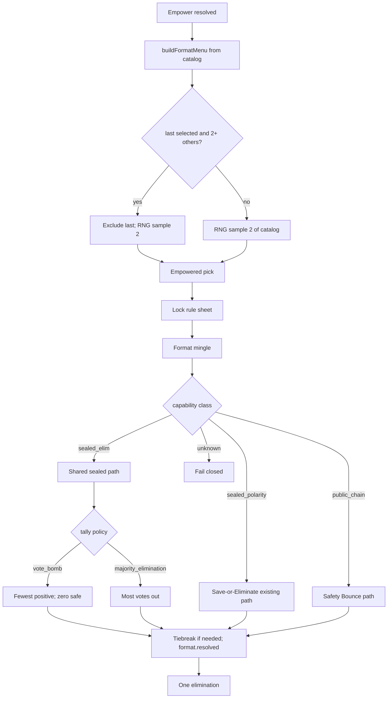

# feat: Modular format catalog + Majority Elimination

## Summary

Make sealed vote formats catalog-registered and share one sealed-ballot resolve path, proven by co-migrating Vote Bomb and shipping **Majority Elimination** (`majority_elimination`) into the default four-card live catalog. Soft anti-repeat menus exclude last round’s selection and sample two of the remainder. Extract sealed format decision helpers (W17). Leave a lightweight add-sealed-format skill. Defer allowlists, Split House / Kingdom, and multi-elim.

---

## Problem Frame

The format kernel spine is already correct (empower → menu → pick → mingle → resolve). Catalog membership and resolve dispatch are not: adding a format still fans out through open if-ladders, exclusive resolution bags, agent tools, projections, and fixtures. With three formats that cost was paid once; the fourth format is the last cheap moment to prove modularity before the catalog grows into Kingdom / Split House / multi-elim work.

Origin (see origin: `docs/brainstorms/2026-08-06-modular-format-catalog-majority-elimination-requirements.md`) prioritizes modularity proof first, with Majority Elimination as the live proof vehicle and a sealed-only skill for the next easy format.

---

## Requirements

Traceability to origin R/F/AE IDs.

**Catalog modularity**

- R1. Default live formats are registered catalog entries with capability class and fail-closed resolve dispatch (never silent Safety Bounce for unknown ids). (origin: R1, R5, R6)
- R2. Default catalog after this work: Save-or-Eliminate, Vote Bomb, Safety Bounce, Majority Elimination. (origin: R2)
- R3. Sealed non-polarity single-elim formats share one collect → score → tiebreak → resolution → sealed presentation path. (origin: R3)
- R4. Vote Bomb co-migrates onto that path with unchanged product rules. (origin: R4, R25, AE4)
- R5. Safety Bounce stays on its public-chain path; no generic public-chain framework this slice. (origin: R5)
- R6. Future capability classes may be named in the skill as out-of-scope: public-chain, preselection/split-field, multi-elim. (origin: R6, R22)

**Menu**

- R7. House offers exactly two distinct legal catalog formats after empower. (origin: R7, F1)
- R8. Soft anti-repeat: when last selected exists and ≥2 other formats remain legal, exclude last and sample two of the remainder via injectable RNG. (origin: R8, R26, AE1)
- R9. Round 1 / anti-repeat impossible: sample any two legal catalog formats. (origin: R9)
- R10. Cast-size fitness is identity for this slice: all four formats are always legal in standard format-kernel rounds. (planning freeze; origin R7 wording)

**Majority Elimination**

- R11. Public name **Majority Elimination**; stable id `majority_elimination`. (origin: R10)
- R12. Every alive player casts one sealed non-self elim-direction vote. (origin: R11, F2)
- R13. Highest vote total is eliminated; highest-total ties → empowered chooses among that set only (including empowered if tied). (origin: R12–R13, AE2–AE3)
- R14. Empowered is full participant and fully eligible (including sole highest). (origin: R14, AE6)
- R15. Social order mingle → sealed ballot; ballots sealed until resolution reveal under existing lifecycle. (origin: R15–R16, AE5)
- R16. Exactly one elimination after tiebreak. (origin: R17)

**Surfaces**

- R17. Agents get fixed rule sheet + sealed ballot decision surface with deterministic illegal-target repair. (origin: R18)
- R18. Watch/replay/results show offer, selection, sealed lifecycle, plurality tally, elimination without classic Power/Council fields. (origin: R19–R20, AE5)
- R19. Canonical events remain authority; transcript never repairs format facts. (origin: R20)

**Skill and validation**

- R20. Lightweight sealed-format skill documents registration touch points and non-goals. (origin: R21–R22, AE7, F3)
- R21. Tests: ME clear/tie pure math; VB regression; four-format soft anti-repeat; ME sealed integration/fixture. (origin: R23–R26)

---

## Key Technical Decisions

- **KTD1. Stable id `majority_elimination`.** Matches origin example and public name mapping; single key across metadata, events, tools, fixtures.
- **KTD2. Dedicated resolution bag `majorityElimination: { totals }`.** Do not overload `voteBomb` (zero-safe semantics). Exclusive null bags remain for this slice; tagged-union cleanup deferred.
- **KTD3. Shared sealed path for non-polarity eliminate-ballots only.** Parameterized pure score/resolve + shared collect/record/tiebreak orchestration. Vote Bomb and Majority Elimination co-consumers. Save-or-Eliminate stays polarity sibling.
- **KTD4. Fail-closed resolve dispatch.** Catalog/capability lookup; unknown or miswired id throws — never fall through to Safety Bounce.
- **KTD5. Soft anti-repeat samples with injected RNG.** Exclude last when ≥2 others remain; shuffle remaining and take first two. Round 1 shuffles full catalog. Tests pin RNG.
- **KTD6. Agent surface: shared sealed-elim ballot path parameterized by locked format.** One legality/fallback runner for target-only sealed elim ballots; distinct prompts/rule sheets so ME cannot read as Vote Bomb fewest-positive. Do not reuse `getVoteBombBallot` name for ME. Prefer thin W17 extract of tool schemas + decision runner without renaming existing Vote Bomb tool ids unless required for parameterization.
- **KTD7. Browser-safe pure surfaces stay leaf modules.** Presentation metadata remains a browser-safe leaf for names/rules. Web may import pure tally/resolve only through `@influence/engine/format-rules` (not `formats/` or the engine root). Behavioral registry stays under `packages/engine/src/formats/` and may reference metadata ids.
- **KTD8. Cast-size fitness identity.** All four always legal in standard rounds; hook shape optional only if free with the registry, not a product feature this slice.
- **KTD9. Skill at `.agents/skills/add-sealed-format/SKILL.md`.** Checklist for sealed non-polarity single-elim only; honest non-goals.
- **KTD10. Characterization-first for Vote Bomb migration.** Capture/extend VB pure + integration assertions before swapping orchestration so R4 cannot silently drift.

---

## High-Level Technical Design



**Directional sealed path (not implementation code):**

```text
for each alive voter:
  call sealed-elim decision(formatId, ruleSheet, legalTargets)
  repair illegal → deterministic non-self target
  record format.ballot_cast { formatId, voterId, targetId, polarity: null }

score = catalog[formatId].score(aliveIds, ballots)   // pure
resolution = catalog[formatId].resolve(...)         // pure
if resolution.kind === tie:
  empowered chooses among tiedSet only
emit format.resolved with format-specific exclusive bag
presentation: existing sealed → revealed lifecycle
```

---

## Implementation Units

### U1. Catalog identity + Majority Elimination pure rules

**Goal:** Register ME presentation metadata and pure legality/tally/resolve math independent of the runner.

**Requirements:** R2, R11–R13, R21

**Dependencies:** None

**Files:**
- Modify: `packages/engine/src/format-presentation-metadata.ts`
- Create: `packages/engine/src/formats/majority-elimination.ts`
- Modify: `packages/engine/src/formats/types.ts`, `packages/engine/src/formats/index.ts`
- Modify: `packages/engine/src/format-rules.ts` (browser-safe pure re-exports used by web trust path)
- Modify: `packages/engine/src/__tests__/format-presentation-metadata.test.ts`
- Modify: `packages/engine/src/__tests__/format-resolvers.test.ts`

**Approach:**
- Add `majority_elimination` to `FORMAT_PRESENTATION_METADATA` with display name **Majority Elimination** and fixed rule sheets (most votes out; empowered highest-total ties; no self-vote).
- Pure functions mirror Vote Bomb ballot shape: totals over all alive; resolve highest; sole-highest as auto; multi-highest as tie.
- Re-export ME tally/resolve from `format-rules.ts` so web can extend `resolutionOutcomeMatchesRules` without importing engine barrels.
- Extend `LAUNCH_FORMAT_IDS` via metadata; keep browser leaf free of engine barrels.

**Patterns to follow:** `packages/engine/src/formats/vote-bomb.ts`; existing presentation metadata tests.

**Test scenarios:**
- Covers AE2. Tallies A:3 B:2 C:2 D:1 → A eliminated clear/auto.
- Covers AE3. A:3 B:3 C:1 → tie set {A,B} only.
- Illegal self-target and non-alive target rejected by legality helper.
- Presentation metadata includes ME display name and non-empty rule sheet.
- Metadata still lists prior trio with unchanged names.

**Verification:** Pure unit tests pass; `LaunchFormatId` includes `majority_elimination`.

---

### U2. Soft anti-repeat menu for four-format catalog

**Goal:** Menu offers exactly two formats with soft anti-repeat and injectable RNG sampling.

**Requirements:** R7–R10, R21

**Dependencies:** U1 (catalog size ≥4)

**Files:**
- Modify: `packages/engine/src/formats/menu.ts`
- Modify: `packages/engine/src/__tests__/format-resolvers.test.ts`

**Approach:**
- Input remains `lastFormatId` + `random`.
- When last is a known catalog id and remaining legal ≥2: exclude last, shuffle remaining, offer first two.
- Else: shuffle full catalog, offer first two.
- Fitness identity: legal set = full catalog (document in comment; no cast-size filter yet).
- Replace trio-era “remaining[0], remaining[1] in fixed array order” so four-format variety is real.

**Patterns to follow:** existing `random?: () => number` injection; menu tests in format-resolvers.

**Test scenarios:**
- Covers AE1. Last = vote_bomb; RNG yields a fixed permutation → offered pair is two of {save_or_eliminate, safety_bounce, majority_elimination}, never vote_bomb.
- Round 1 (last null): offered length 2, distinct, subset of catalog.
- Last unknown/corrupt treated as no last → any two of catalog.
- Deterministic RNG fixtures pin exact pairs.

**Verification:** Menu unit tests cover four-format anti-repeat; no production call sites break (kernel already passes lastSelectedFormat).

---

### U3. Shared sealed-ballot resolve path + Vote Bomb co-migration

**Goal:** Extract shared sealed non-polarity collect/score/tiebreak/record path; port Vote Bomb without product drift.

**Requirements:** R1, R3–R5, R19, R21

**Dependencies:** U1

**Files:**
- Modify: `packages/engine/src/phases/format-kernel.ts`
- Create: `packages/engine/src/formats/sealed-elim-resolve.ts` (or equivalent pure+orchestration helper under `formats/` / phase helper — planning name only)
- Modify: `packages/engine/src/canonical-events.ts` (`FormatResolutionPayload.majorityElimination` bag ready for U4, or introduced here if VB path needs shared payload builder types)
- Modify: `packages/engine/src/__tests__/format-kernel-integration.test.ts`
- Modify: `packages/engine/src/__tests__/format-resolvers.test.ts` as needed

**Approach:**
- **Execution note:** Characterization-first — ensure Vote Bomb pure + integration assertions lock zero-safe + fewest-positive before moving orchestration.
- Shared path parameters: formatId, pure legality, pure score, pure resolve, resolution-bag builder, agent decision callback, trace action name.
- `runFormatResolvePhase` dispatches by capability/class registry: `sealed_elim` → shared path; `sealed_polarity` → existing SoE path; `public_chain` → existing Bounce; unknown/unregistered → throw (never silent Bounce).
- Vote Bomb becomes a `sealed_elim` registration, not a bespoke sibling function body.
- SoE remains a registered live format with capability `sealed_polarity` (existing path this slice); Bounce remains `public_chain`.

**Patterns to follow:** existing `resolveVoteBombRound` loop, `withFormatAgentTimeout`, `breakFormatTie`, `applyFormatTiebreak`, provenance helpers in `format-kernel.ts`.

**Test scenarios:**
- Covers AE4. Vote Bomb after migration: zero-vote safe; fewest positive eliminated; dual fewest-positive → empowered set only.
- Incomplete ballots still fail hard (length mismatch).
- Unknown format id at resolve throws / fails closed (never Bounce).
- SoE selection still resolves via polarity path (regression smoke).
- Integration: full Vote Bomb round still eliminates exactly one under sealed path.

**Verification:** Existing VB golden cases green; no behavior change in chatty tally logs’ product meaning.

---

### U4. Majority Elimination on shared path + event/projection contracts

**Goal:** Wire ME through kernel shared path and all exclusive-bag consumers so facts validate as plurality, not Vote Bomb.

**Requirements:** R1–R2, R11–R16, R18–R19, R21

**Dependencies:** U1, U2, U3

**Files:**
- Modify: `packages/engine/src/phases/format-kernel.ts`
- Modify: `packages/engine/src/canonical-events.ts`
- Modify: `packages/engine/src/viewer-decision-events.ts`
- Modify: `packages/engine/src/formats/house-resolution-facts.ts`
- Modify: `packages/engine/src/revealed-round-facts.ts`
- Modify: `packages/engine/src/completed-game-results.ts`
- Modify: `packages/engine/src/postgame-analysis.ts` (format-id branches that mention trio only)
- Modify: related unit tests (`house-format-resolution-facts.test.ts`, `revealed-round-facts.test.ts`, `completed-game-results.test.ts`, `format-kernel-integration.test.ts`)

**Approach:**
- Register ME as `sealed_elim` with most-votes pure resolve and `majorityElimination: { totals }` bag; other bags null.
- Extend engine `validResolutionShape` / aggregate matchers so ME totals recompute from ballots under most-votes rules (not fewest-positive / zero-safe).
- House resolution facts criterion string: highest total / empowered highest-total tiebreak.
- Completed results scoring kind `majority_elimination` with plurality totals (no zero-safe / Vulnerable columns).
- Owner-learning / action cores: format-tagged ballots with ME id (see origin learning: kernel-aware format action core).
- Integration: raise `maxRounds` (exact mode) to catalog length so “every launch format” coverage includes ME.

**Patterns to follow:** Vote Bomb exclusive bag consumers; `docs/solutions/architecture-patterns/separate-transport-visibility-from-staged-presentation.md`.

**Test scenarios:**
- Covers AE2/AE3 via integration or fixture: ME clear winner and highest-total tie → empowered among set only.
- Covers AE6. Empowered sole highest → empowered eliminated.
- Covers AE5. Sealed ballots then revealed ledger from events; no classic power/council fields on format kernel recap.
- House MC facts rebuild ME elimination from events only.
- Completed results ME recap includes totals and eliminated (not zero-safe / Vulnerable fallthrough).
- Integration with `maxRounds === LAUNCH_FORMAT_IDS.length` exercises all four catalog ids including ME.

**Verification:** Format-kernel integration selects every catalog format (including ME) and completes one elimination each; projection validators reject VB-shaped bags on ME rounds.

---

### U5. Agent sealed-elim decisions (W17 slice) + MockAgent

**Goal:** Shared sealed-elim decision runner/tools for Vote Bomb + Majority Elimination with distinct rule-sheet prompts; thin agent surface.

**Requirements:** R17, R12–R14

**Dependencies:** U3, U4

**Files:**
- Create: `packages/engine/src/formats/agent-surface.ts` or `packages/engine/src/agent-format-decisions.ts` (W17 seam)
- Modify: `packages/engine/src/agent.ts`
- Modify: `packages/engine/src/game-runner.types.ts`
- Modify: `packages/engine/src/__tests__/mock-agent.ts`
- Modify: `packages/engine/src/__tests__/agent-structured-output.test.ts` if tool schemas covered
- Modify: accepted-action correlation registry if new action names required (`packages/engine/src/canonical-events.ts` / correlation map)

**Approach:**
- Extract shared validate → tool-call → fallback → provenance pattern for sealed target ballots and, if low-cost, format pick / tiebreak helpers without renaming established Vote Bomb tool ids unless parameterization forces it.
- ME prompts use **Majority Elimination** public name and most-votes rule sheet; explicitly contrast with Vote Bomb fewest-positive and Bounce pool vote.
- MockAgent: deterministic ME ballot (e.g. first other alive); support menu pick including ME.
- Correlation: clean accepts only stamp decisionId; repair/fallback do not.
- U7 skill will document this surface; this unit does not own the skill file.

**Patterns to follow:** `docs/refactor-queue.md` W17; `docs/solutions/architecture-patterns/agent-strategy-observability-spine.md`; existing `getVoteBombBallot` / `buildFormatTargetTool`.

**Test scenarios:**
- MockAgent ME ballot legal and non-self.
- Illegal model target repairs with typed fallback reason; no false llm accept correlation.
- Tool schema requires target + thinking/strategic fields consistent with existing format ballots.
- Prompt/rule sheet for ME contains most-votes language and does not instruct fewest-positive.

**Verification:** Structured-output / mock paths green; integration uses mock ME ballots end-to-end.

---

### U6. Web presentation + viewer fixtures

**Goal:** Watch/replay/results treat ME as sealed plurality without Vote Bomb zero-safe UI or classic fields.

**Requirements:** R15–R16, R18, R21

**Dependencies:** U4

**Files:**
- Modify: `packages/engine/src/fixtures/format-kernel-viewer.ts`
- Modify: `packages/engine/src/__tests__/format-kernel-viewer-fixture.test.ts`
- Modify: `packages/web/src/app/games/[slug]/components/format-presentation-compiler-helpers.ts` (`resolutionOutcomeMatchesRules` / `aggregatesMatch` ME branch; no Bounce fallthrough)
- Modify: `packages/web/src/app/games/[slug]/components/format-resolution-stage.tsx` (plurality totals for `majorityElimination`)
- Modify: `packages/web/src/app/games/[slug]/components/format-presentation*.ts(x)` as needed for id exhaustiveness
- Modify: completed-results model that maps format scoring kinds (ME plurality columns, not Vulnerable/zero-safe fallthrough)
- Modify: `packages/web/src/__tests__/format-presentation*.ts(x)`
- Modify: `packages/web/src/__tests__/format-presentation-model.fixtures.ts`
- Modify: `e2e/format-aware-game-viewer.fixtures.ts` if launch set enumerated
- Avoid: `packages/web/src/app/games/[slug]/components/message-parsing.ts` (frozen classic parser)

**Approach:**
- Reuse sealed ballot reveal and offer stage data-driven cards from presentation metadata.
- Wire ME through pure-trust helpers via `@influence/engine/format-rules` (most-votes recompute).
- Resolution stage: plurality / most votes table from `majorityElimination` bag; do not show “zero safe” or Bounce Vulnerable lanes for ME.
- Completed results model: dedicated ME scoring columns; no fallthrough to Bounce/Vulnerable UI.
- Add fixture scenarios: ME clear, ME highest-total tie; assert aggregate cue is ready (not incomplete).
- Fix open if-ladders that currently treat non-SoE/non-VB as Safety Bounce.

**Patterns to follow:** `docs/format-kernel-web-contract-drift.md`; Vote Bomb sealed fixtures; offer stage; existing format-rules import path.

**Test scenarios:**
- Covers AE5. Fixture ME sealed → revealed roster order from events; resolution cue ready with highest-total status.
- Offer stage can show Majority Elimination card with concise rules.
- Resolution stage shows highest totals, not zero-safe set or Vulnerable lanes.
- Completed results ME recap uses plurality labels.
- Reduced-motion path still advances semantic cues.

**Verification:** Engine fixture tests + web unit tests green; e2e only if env already runs format viewer suite.

---

### U7. Sealed-format skill + docs sync

**Goal:** Package the add path for the next sealed non-polarity format and keep operator/agent docs honest about four cards.

**Requirements:** R6, R20

**Dependencies:** U1–U6 (skill describes the landed path)

**Files:**
- Create: `.agents/skills/add-sealed-format/SKILL.md`
- Modify: `docs/reasoning-transcript-observability.md` (format-ballot / ME)
- Modify: `docs/local-model-evaluation.md` and/or `DEVELOPMENT.md` launch catalog language
- Modify: `docs/rules-page-content.md` (or web rules content source) for Majority Elimination
- Modify: `packages/web/content/updates/` short release note if product ships public updates for format meta
- `CONCEPTS.md` already documents Majority Elimination / catalog — adjust only if id/order wording drifts

**Approach:**
- Skill checklist: presentation metadata → pure rules → catalog registration/capability → menu membership → shared sealed path wiring → agent surface → resolution bag + projection validators → fixtures/tests → docs. Non-goals: public-chain, SoE polarity redesign, preselection/split-field, multi-elim, per-game allowlist, format DSL.
- Observability: ME format-ballot action vocabulary and sealed operator text rules match Vote Bomb lane separation.

**Patterns to follow:** existing skills under `.agents/skills/`; origin AE7.

**Test scenarios:**
- Test expectation: none for skill prose — verify by checklist completeness review against U1–U6 files.
- Docs mention four default formats and ME most-votes rule.

**Verification:** Skill readable as a single short path; docs no longer claim “launch trio only” where default catalog is four.

---

## Scope Boundaries

**In scope**

- Format catalog registration + fail-closed dispatch
- Shared sealed non-polarity resolve path
- Vote Bomb behavior-preserving co-migration
- Majority Elimination default live card
- Soft anti-repeat four-format menu
- W17 sealed decision helper extraction (bounded)
- Web/fixture sealed plurality presentation
- Lightweight `.agents/skills/add-sealed-format` skill
- Docs/observability sync for agent decision surfaces

**Deferred to Follow-Up Work**

- Per-game / sim format allowlist policy
- Save-or-Eliminate join onto shared sealed path (polarity)
- Generic public-chain framework for Bounce-like formats
- Split House / Dual Houses, Kingdom, Date Night, Room Roulette, BB veto, Ranked Elimination, Even/Double Votes
- Double eliminations / multi-elim rounds
- Classic Power → Council as a format card
- Format-specific Owner Learning coaching
- Tagged-union rewrite of `FormatResolutionPayload`
- Mid-ballot crash-safe resume capsules

**Outside this product’s identity** (from origin)

- Random minigame show without social memory
- Live human mid-match vote steering
- Transcript prose as elimination authority

---

## Acceptance Examples

Carried from origin; implementers map to U1–U6 tests and U7 skill/docs review.

- AE1. Soft anti-repeat excludes last among four. (U2)
- AE2. ME clear highest out. (U1, U4)
- AE3. ME highest-total tie → empowered among set. (U1, U4)
- AE4. Vote Bomb product rules unchanged after shared path. (U3)
- AE5. ME sealed lifecycle event-authoritative on watch. (U4, U6)
- AE6. Empowered eligible / sole highest eliminated. (U4)
- AE7. Sealed skill path + non-goals. (U7 checklist review)

---

## System-Wide Impact

- **Events:** new format id and resolution bag; historical trio events unchanged.
- **Recovery:** menu/selection still reconstructed only from `format.menu_offered` / `format.selected`; mid-resolve fail-closed unchanged.
- **MCP / owner learning:** format-tagged ballots must identify ME; do not fabricate classic expose.
- **Web:** presentation metadata leaf remains shared import; no classic parser extension.
- **Agents:** new/parameterized sealed tools increase prompt surface; rule sheets must prevent ME/VB confusion.

---

## Risks & Dependencies

| Risk | Mitigation |
|------|------------|
| Vote Bomb product drift during shared path | KTD10 characterization-first; AE4 regression tests |
| Fail-open resolve (unknown id → Bounce) | KTD4 exhaustive/fail-closed dispatch tests |
| ME presented as zero-safe / fewest-positive | Dedicated bag + validators + web copy tests |
| Agent confuses ME with Vote Bomb | Distinct prompts; public name Majority Elimination |
| Four-format menu fixed-order starvation | RNG sample of remaining three (U2) |
| Wide exhaustive-switch compile fan-out | Expected mechanical; fix all `LaunchFormatId` sites in U4/U6 |
| W17 scope creep into Bounce | Bound extract to sealed-elim (+ optional pick/tiebreak); leave Bounce |

**Dependencies:** existing format kernel, sealed presentation lifecycle, empowered tiebreak path, format recovery event reconstruction.

---

## Documentation / Operational Notes

- Update operator/sim docs that still say “three launch formats.”
- No migration: new games only; historical replays remain trio-valid.
- No feature flag required: ME joins default catalog when shipped.
- After ship, good candidate for `docs/solutions/` compound on modular sealed catalog (not required to land the PR).

---

## Open Questions

**Deferred to implementation**

- Exact helper module filenames under `formats/` vs `agent-format-decisions.ts` once W17 extract lands.
- Whether Vote Bomb tool id string stays literal `vote_bomb` target tool while sharing runner code (prefer yes).
- Depth of postgame turning-point parity for ME (minimum: elimination + tally legibility; dedicated turning-point kinds optional if free).

---

## Sources & Research

- Origin: `docs/brainstorms/2026-08-06-modular-format-catalog-majority-elimination-requirements.md`
- Kernel origin: `docs/brainstorms/2026-07-23-sequester-format-kernel-requirements.md`, `docs/plans/2026-07-23-001-feat-sequester-format-kernel-plan.md`
- W17: `docs/refactor-queue.md`
- Presentation contract: `docs/format-kernel-web-contract-drift.md`
- Learnings: `docs/solutions/architecture-patterns/separate-transport-visibility-from-staged-presentation.md`, `docs/solutions/architecture-patterns/agent-strategy-observability-spine.md`, `docs/solutions/runtime-errors/api-startup-recovery-resumes-interrupted-games.md`, `docs/solutions/architecture-patterns/owner-learning-loop.md`
- Code anchors: `packages/engine/src/formats/`, `packages/engine/src/phases/format-kernel.ts`, `packages/engine/src/format-presentation-metadata.ts`, `packages/engine/src/canonical-events.ts`, `packages/engine/src/viewer-decision-events.ts`
