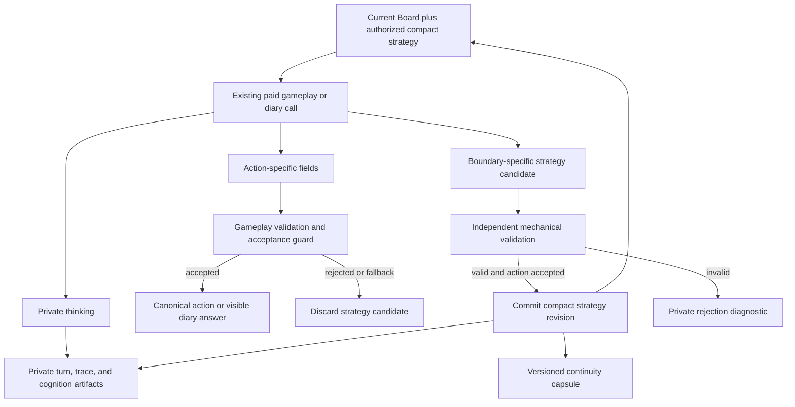
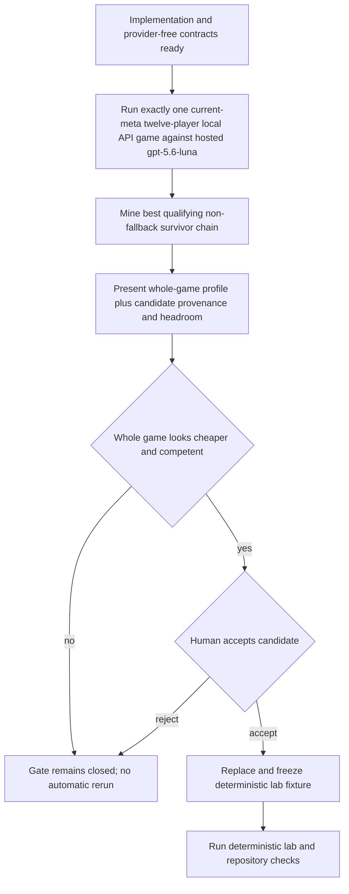

# perf: Replace strategic reflections with compact decision envelopes

## Summary

Remove standalone strategic-reflection inference and carry compact private strategy on model calls the game already needs. Active-player decisions retain their action-specific fields and `thinking`, add either a boundary-appropriate full `strategy` or optional `strategyDelta`, and feed a versioned one-epoch strategy state through prompts, recovery, and the same authorized artifact surfaces as existing strategic thinking.

Completion requires provider-free cost evidence and exactly one current-meta twelve-player game run through the local API lifecycle against hosted `gpt-5.6-luna`. The best qualifying eviction-to-next-decision chain from that game must be presented to a human and accepted before it replaces the strategically weak scenario-lab fixture.

---

## Problem Frame

The production snapshot for `mild-olive-ghost` estimates $1.82 across 1,225 model calls and 13,667,719 total tokens. Standalone reflection accounts for an estimated $0.39 across 184 calls and 2,480,236 tokens. Those calls repay prompt context to produce private cognition that can instead ride adjacent gameplay and diary responses.

The current implementation makes reflections the owner of a field-heavy Strategy Thread, records a separate `decisionLog`, and persists those artifacts in Recall Plan state and checkpoint capsules. That architecture conflicts with the reviewed contract: gameplay calls should hand forward one compact strategy epoch, canonical facts must remain authoritative, and post-eviction diary answers should reconcile strategy without a closing reflection call.

The existing scenario lab replays a single vote or plea against an old strategically weak fixture. It cannot prove the eviction, diary replacement, optional follow-up delta, repair, recovery, and next-decision chain required by the new contract. The replacement gate is intentionally practical rather than statistical: run one game, inspect whether it looks cheaper and whether the agents look competent, present the best case, and let a human accept or reject it.

---

## Requirements

**Inference cadence and envelope contract**

- R1. Production and simulation paths must remove standalone strategic-reflection calls, configuration, prompt classes, tools, turn records, and compatibility switches. Covers origin R1, R4, R39.
- R2. Before the first diary, authored character strategy and personality plus current authorized evidence form an implicit opening posture; accepted active-player deltas refine it without a full model-authored baseline. Covers origin R2, R3, R25.
- R3. Every eligible active-player strategic call must preserve its action-specific schema, use `thinking` as its concise private rationale, and expose only the strategy field allowed at that boundary. Covers origin R14, R15, R16, R18, R19.
- R4. Ordinary active-player actions and diary follow-ups with a valid baseline must accept the same nullable `strategyDelta`; no change preserves state without filler. Covers origin R3, R8, R9.
- R5. First post-eviction diary answers and repair boundaries must request a concise-but-complete full `strategy` rather than a delta, without a fixed sentence limit. Covers origin R6, R11, R12, R17.

**Validation and strategy lifecycle**

- R6. Gameplay action parsing and strategy-operation validation must be independent so a missing, malformed, oversized, or boundary-invalid strategy field cannot reject a legal action or trigger a strategy-only provider retry. Covers origin R20, R21, R22.
- R7. A strategy operation may commit only after the response's gameplay action or diary answer passes the existing ownership and acceptance guard; an illegal, fallback, stale, timed-out, or otherwise unaccepted gameplay proposal must not mutate strategy. Clarifies origin R20-R22 with the confirmed invalid-action rule.
- R8. Strategy validation must be mechanical and bounded: normalize null and whitespace to no change, enforce centralized per-value and aggregate limits, enforce boundary-allowed operations, and never score natural-language strategy quality. Covers origin R9, R17, R21, R22, R23.
- R9. Compact strategy state must have four explicit lifecycle states: `opening`, `active`, `reconciliation_required`, and `repair_required`. Covers origin R2, R5-R13, R25-R26.
- R10. An accepted canonical elimination must move survivors into `reconciliation_required`, preserve the immediately prior epoch as historical evidence, and never transition eliminated players or jurors into survivor repair. Covers origin R5, R23, R25.
- R11. A valid first survivor diary strategy must become the new active baseline and clear the active delta list; a mechanically unusable first strategy must leave the diary answer visible and move the survivor to `repair_required`. Covers origin R6, R7, R11.
- R12. If the House asks an optional follow-up while no valid post-eviction baseline exists, that answer may repair with a full strategy; otherwise the next eligible paid decision must request a full strategy from `reconciliation_required` or `repair_required` without blocking its action. Failed repair preserves the marker, and no diary-close call may summarize or reflect. Covers origin R10-R13.
- R13. Multiple follow-ups must rebuild authorized decision context after every answer so an accepted baseline or delta is visible to the next answer; House question generation must not receive agent-private strategy. Covers origin R8-R13, R24.
- R14. Another eviction before repair must reconcile against the newest canonical board while retaining only the last valid epoch as historical evidence; it must not stack obsolete epochs as active strategy. Covers origin R5, R12, R23, R25.

**Authority, continuity, and observability**

- R15. Prompt construction must render the Current Board Contract as authority and the latest compact strategy state as fallible private cognition; it must not parse free-form strategy into canonical targets, commitments, eligibility, or player status. Covers origin R23, R25.
- R16. Phase-boundary recovery must restore every lifecycle state, baseline, ordered deltas, prior reconciliation epoch when applicable, and engine-owned revision from a new fail-closed continuity-capsule version. Covers origin R26, R39.
- R17. Private decision artifacts must record the accepted action provenance, `thinking`, submitted strategy field, accepted/rejected/no-change result, diagnostic reason, resulting revision, and authorized strategy snapshot without creating a separate reflection turn. Covers origin R19, R27, R28.
- R18. Strategy, diagnostics, and prior epochs must remain outside canonical events, public websocket payloads, public dialogue, player-visible transcripts, and House interviewer context. Covers origin R23, R24, R28.

**Cost evidence and scenario gate**

- R19. Provider-free cost modeling must compare the $1.82 reference workload's removed reflection requests with added envelope output on retained calls, using mutually exclusive uncached-input, cached-read, cache-write, and total-output buckets without double-counting reasoning. Covers origin R29-R31.
- R20. Cost and play conclusions must remain directional estimates with no fixed percentage threshold, multi-game sampling, or broad quality claim. Covers origin R30, R31, R37, R38.
- R21. The scenario lab must support a deterministic multi-step chain spanning canonical elimination, survivor diary replacement, optional follow-up delta or repair, and the survivor's next eligible decision with materially different legal choices. Covers origin R33, R34, R37.
- R22. Implementation completion must pause after exactly one fresh current-meta twelve-player game run through the local API lifecycle against hosted `gpt-5.6-luna` and require both a passing whole-game cost-and-play judgment and human acceptance of the best qualifying non-fallback candidate; either rejection leaves the gate closed and starts no additional game. Covers origin R32-R38.

**Removal and current-state documentation**

- R23. Current docs, simulator guidance, glossary entries, recovery notes, and solution learnings must describe the compact decision-envelope contract and remove active guidance for reflection-owned Strategy Thread state. Covers origin R39-R41.
- R24. `docs/plans/2026-06-17-002-feat-thin-strategic-decision-fields-plan.md` must remain untouched as historical prior art rather than being rewritten to resemble the new design. Covers origin R40 and the confirmed planning boundary.

---

## Key Technical Decisions

- **Use boundary-specific flat strategy fields:** Ordinary active-player actions and valid-baseline diary follow-ups carry nullable `strategyDelta`; first post-eviction answers and the next eligible action reached in `reconciliation_required` or `repair_required` carry full `strategy`. The boundary already determines the allowed operation, so a model-supplied operation enum or universal action union would add schema work without adding information.
- **Reuse `thinking` as the concise rationale:** Remove `decisionLog` and do not introduce a second rationale field. Provider-native `reasoningContext` remains an out-of-band artifact and is not part of the decision envelope.
- **Separate decoding, validation, and commit:** Decode the action and strategy candidate independently, mechanically validate strategy after the action is available, and commit the accepted strategy only after the phase's acceptance guard. This preserves legal actions when strategy is bad and discards strategy derived from unaccepted gameplay proposals.
- **Keep revisions engine-owned:** The engine increments strategy revisions when it commits a baseline or delta. Model-supplied base revisions are unnecessary unless implementation discovers a real concurrent-writer path; omitting them avoids creating an obsolete-revision failure mode without evidence.
- **Represent one active epoch explicitly:** `opening` carries authored posture plus accepted deltas, `active` carries the latest full baseline plus ordered deltas, and the two post-eviction states retain the last valid epoch only as historical reconciliation evidence. Older epochs may remain in authorized artifacts but never re-enter active prompt state automatically.
- **Preserve natural-language belief through eviction:** Do not scrub eliminated names from strategy prose. Canonical board facts and living-target validation govern actions, while the prior epoch remains an honest record of what the agent believed before eviction.
- **Use the existing Recall Plan pipeline:** Replace protected packet, reflection, and private decision-log sources with compact lifecycle state while preserving authorization, actor-owned Mingle filtering, huddle privacy, Current Board priority, ranking, and token budgeting.
- **Treat continuity as a compatibility break:** Introduce a new player-continuity capsule version and reject the obsolete reflection/packet shape. Do not add v1 hydration or reconstruct strategy from transcript prose, trace text, or `MemoryStore`.
- **Split proposal and outcome observability across existing records:** Provider traces and trace-derived cognition record the model's submitted strategy candidate. The private `agent_turn` emitted after the phase acceptance guard records the final accepted, rejected, or no-change result and resulting revision. Existing decision IDs correlate the records; no new artifact type, model call, or canonical event is introduced.
- **Use one game as a product gate, not an evaluation framework:** Provider-free tests prove mechanics. The single local game supplies one candidate and a practical cost/play judgment. Only the human decision determines whether the fixture replacement gate passes.

---

## High-Level Technical Design

### Decision and persistence flow



### Strategy lifecycle

```mermaid
stateDiagram-v2
  [*] --> Opening
  Opening: authored posture plus ordered deltas
  Active: full baseline plus ordered deltas
  Reconciliation: prior epoch is historical; new board is canonical
  Repair: no valid post-eviction baseline

  Opening --> Opening: accepted ordinary delta
  Opening --> Reconciliation: accepted eviction
  Active --> Active: accepted ordinary delta
  Active --> Reconciliation: accepted eviction
  Reconciliation --> Active: valid first diary or next-action strategy
  Reconciliation --> Repair: missing or unusable first strategy
  Repair --> Active: valid optional-follow-up or next-action repair
  Repair --> Repair: failed repair
  Reconciliation --> Reconciliation: newer eviction before diary
  Repair --> Reconciliation: newer eviction before repair
```



### Diary sequence

```mermaid
sequenceDiagram
  participant Event as Canonical elimination
  participant Engine as Strategy state owner
  participant Agent as Survivor
  participant House as House interviewer

  Event->>Engine: Mark reconciliation required with prior epoch
  Engine->>Agent: First question plus prior epoch and current board
  Agent-->>Engine: Message, thinking, full strategy candidate
  Engine->>Engine: Preserve message; validate and commit strategy independently
  Engine->>House: Visible question and answer only
  House-->>Engine: Optional follow-up question
  Engine->>Agent: Rebuilt context with resulting strategy state
  Agent-->>Engine: Message, thinking, delta or repair strategy
  Engine->>Engine: Commit valid update or preserve repair marker
  Engine-->>Event: Close diary with no extra model call
```

### Scenario-replacement gate



### Envelope boundary matrix

| Boundary | Existing action output | Private rationale | Strategy output | Commit rule |
|---|---|---|---|---|
| Ordinary living-player strategic action | Mechanic-specific fields | Required `thinking` | Nullable `strategyDelta` | Commit only after accepted gameplay action |
| First survivor answer after eviction | Diary `message` | Required `thinking` | Required full `strategy` candidate | Visible answer survives invalid strategy; valid strategy starts active epoch |
| Later diary answer with valid baseline | Diary `message` | Required `thinking` | Nullable `strategyDelta` | Commit after answer acceptance, then rebuild context |
| Reconciliation or repair boundary | Existing message or action fields | Required `thinking` | Required full `strategy` candidate | Commit only after accepted optional answer or gameplay action |
| Juror, eliminated-player, or House-authored surface | Existing surface fields | Preserve current surface contract | No survivor strategy mutation | Never enters survivor lifecycle |

---

## Scope Boundaries

### In Scope

- Compact strategy contracts for every living-player strategic surface, post-eviction diary replacement, follow-up deltas, and repair on the next eligible paid decision.
- Removal of reflection calls and their configuration, prompts, types, artifacts, Recall Plan class, simulator switches, tests, and current documentation.
- Engine-owned strategy lifecycle, protected prompt projection, phase-boundary continuity, private observability, and public/canonical non-leakage.
- Provider-free directional cost modeling and one human-reviewed current-meta local-game candidate.
- Replacement of the weak lab fixture only after explicit human acceptance.

### Deferred to Follow-Up Work

- Incremental House-summary state and elimination of full-round replay in `house-summary` calls.
- Per-call, per-turn, percentile, and per-round cost views in the admin UI.
- Further prompt-prefix restructuring intended to convert structural reuse estimates into provider cache hits.
- A permanent scenario-mining pipeline, multi-scenario tournament, or multi-game statistical cost and quality study.

### Outside This Slice

- A field-heavy cognitive assessment or separate reflection path for smaller local models.
- A universal schema that replaces the mechanic-specific fields of unrelated actions.
- Player-visible strategy, private rationale, provider reasoning, or strategy diagnostics.
- A mandatory hosted-provider validation run; any paid simulation requires separate approval.
- Rewriting the June plan to present the new architecture as its historical design.

---

## Implementation Units

### U1. Define compact envelope and strategy lifecycle contracts

- **Goal:** Replace reflection-owned packet and decision-log types with boundary-specific strategy candidates, mechanical acceptance results, and one engine-owned lifecycle state.
- **Requirements:** R2-R9, R15, R24. Supports origin F1-F4 and AE1-AE3, AE8.
- **Dependencies:** None.
- **Files:**
  - `packages/engine/src/formats/agent-surface.ts`
  - `packages/engine/src/game-runner.types.ts`
  - `packages/engine/src/agent.ts`
  - `packages/engine/src/phases/phase-runner-context.ts`
  - `packages/engine/src/index.ts`
  - `packages/engine/src/__tests__/agent-structured-output.test.ts`
  - `packages/engine/src/__tests__/mock-agent.ts`
  - `packages/engine/src/__tests__/strategy-state.test.ts`
- **Approach:** Define shared flat schema fragments for `thinking`, nullable `strategyDelta`, and full `strategy`, then apply the fragment appropriate to each decision boundary. Replace `StrategicDecisionMetadata`, `StrategyPacketSummary`, reflection summaries, packet-update fields, recent private `decisionLog` receipts, and packet revision counters with a compact state carrying lifecycle, nullable full baseline, ordered deltas, optional prior reconciliation epoch, and engine revision. Centralize text and aggregate bounds and return a typed accepted, rejected, or no-change result without evaluating prose quality.
- **Execution note:** Start with focused lifecycle and normalization tests before changing action schemas; the state transition table is the cross-cutting invariant for later units.
- **Patterns to follow:** Strict nullable tool fields in `packages/engine/src/formats/agent-surface.ts`, existing action/fallback provenance, and fail-fast parsers in `packages/engine/src/player-continuity.ts`.
- **Test scenarios:**
  - Covers origin AE1. Given an ordinary strategic schema, it retains its mechanic fields and requires `thinking` plus nullable `strategyDelta`, with no `decisionLog` or field-heavy packet keys.
  - Given a first-diary or repair schema, it requires full `strategy` and rejects a delta operation at that boundary without invalidating the diary message or gameplay action.
  - Given null, missing, or whitespace delta text, normalization produces no change and does not mint a revision.
  - Given values exactly at and above centralized per-value and aggregate bounds, the former commits and the latter produces a private mechanical rejection.
  - Given accepted deltas in opening or active state, they append in order and advance the engine revision.
  - Given a valid full strategy in reconciliation or repair state, it becomes the active baseline and clears active deltas.
  - Given another eviction during reconciliation or repair, the newest board transition does not stack a second active epoch.
  - Given poor or contradictory natural-language strategy, the validator accepts it when it is mechanically valid.
- **Verification:** Engine exports contain one current compact strategy vocabulary, lifecycle tests cover every state transition, and no current type requires `decisionLog`, strategic reflection, or field-heavy Strategy Thread fields.

### U2. Integrate the envelope across accepted strategic actions

- **Goal:** Return and commit compact strategy candidates on every eligible active-player action without changing mechanic-specific action contracts or fallback behavior.
- **Requirements:** R3-R8, R17-R18. Supports origin F1-F3 and AE1-AE2, AE4.
- **Dependencies:** U1.
- **Files:**
  - `packages/engine/src/agent.ts`
  - `packages/engine/src/formats/agent-surface.ts`
  - `packages/engine/src/mingle-turn-execution.ts`
  - `packages/engine/src/phases/phase-runner-context.ts`
  - `packages/engine/src/phases/introduction.ts`
  - `packages/engine/src/phases/lobby.ts`
  - `packages/engine/src/phases/mingle.ts`
  - `packages/engine/src/phases/alliances.ts`
  - `packages/engine/src/phases/rumor.ts`
  - `packages/engine/src/phases/vote.ts`
  - `packages/engine/src/phases/power.ts`
  - `packages/engine/src/phases/council.ts`
  - `packages/engine/src/phases/format-kernel.ts`
  - `packages/engine/src/phases/endgame.ts`
  - `packages/engine/src/__tests__/agent-structured-output.test.ts`
  - `packages/engine/src/__tests__/mingle-turn-execution.test.ts`
  - `packages/engine/src/__tests__/stream-listener.test.ts`
  - `packages/engine/src/__tests__/goodbye-message.test.ts`
- **Approach:** Update Chat Completions, Responses API, native-thinking, strict tool, and JSON fallback paths so action fields and strategy candidates decode independently. Return the candidate with the proposed action; do not mutate durable agent state inside `InfluenceAgent`. After each phase's existing ownership and acceptance guard, use one shared commit helper for introductions, lobby and Mingle turns, accusations and rumors, alliance and huddle actions, votes and revotes, power and council choices, format actions, and endgame decisions. When no diary intervenes after an elimination, the next eligible action in `reconciliation_required` uses the full-strategy schema and activates that strategy only after action acceptance. Keep eliminated-player farewells, House-authored prompts, and juror-question generation outside survivor strategy mutation.
- **Execution note:** Characterize fallback and stale-commit behavior before moving mutation out of the current `recordStrategicDecision` seam.
- **Patterns to follow:** `runSealedElimTargetDecision()` for action validation and provenance, `assertCanAcceptCommit()` for ownership, and `acceptedActionMetadata()` for distinguishing model-authored actions from deterministic fallbacks.
- **Test scenarios:**
  - Covers origin AE1. A valid vote with a valid delta accepts both in one provider response and emits no reflection call.
  - Covers origin AE2. A legal alliance action with malformed, oversized, or boundary-invalid strategy commits the alliance, preserves strategy, emits one private diagnostic, and does not retry.
  - A model-authored illegal action with a mechanically valid delta falls back for gameplay and discards the delta with an action-not-accepted diagnostic.
  - A provider failure or JSON fallback that yields no accepted model action supplies no strategy operation and preserves state.
  - A stale or timed-out action response arriving after ownership changes cannot mutate strategy.
  - Reckoning and Tribunal eliminations with no intervening diary make the next eligible accepted action request and commit a full replacement strategy rather than a delta against historical state.
  - A valid structured target reference rejects eliminated players through existing action validation, while free-form strategy text mentioning that player is not semantically rejected.
  - Each active-player strategic schema contains the shared boundary field, while farewell, House, and juror-question schemas do not gain survivor strategy mutation.
- **Verification:** All eligible phase runners use the same post-acceptance commit seam, all provider paths preserve legal actions when strategy is unusable, and no fallback or rejected proposal changes the engine revision.

### U3. Replace reflection cadence with post-eviction diary reconciliation

- **Goal:** Make canonical elimination and the existing diary exchange own strategy invalidation, replacement, refinement, and repair without any standalone reflection or close-time call.
- **Requirements:** R1, R5, R9-R14. Supports origin F4 and AE3, AE8.
- **Dependencies:** U1, U2.
- **Files:**
  - `packages/engine/src/game-runner.ts`
  - `packages/engine/src/game-runner.types.ts`
  - `packages/engine/src/diary-room.ts`
  - `packages/engine/src/phases/elimination.ts`
  - `packages/api/src/services/game-lifecycle.ts`
  - `packages/engine/src/simulate.ts`
  - `packages/engine/src/__tests__/stream-listener.test.ts`
  - `packages/engine/src/__tests__/simulate-config.test.ts`
  - `packages/engine/src/__tests__/diary-room-strategy.test.ts`
  - `packages/api/src/__tests__/game-lifecycle-config.test.ts`
  - `packages/api/src/__tests__/game-lifecycle.test.ts`
- **Approach:** Remove introduction, pre-vote, post-vote, and post-diary reflection calls and delete `enableStrategicReflections` plus its simulator flags and rich-producer side effect. At the canonical elimination commit seam, transition living agents to reconciliation before the configured diary. Build a fresh private phase context before every survivor answer. The first answer uses the full-strategy schema; later answers use the shared delta schema unless the first update failed. If the House optionally asks a follow-up after that failure, its answer uses the repair schema; otherwise the marker persists to the next eligible accepted action. Juror interviews remain outside the survivor lifecycle.
- **Patterns to follow:** Canonical elimination in `packages/engine/src/phases/elimination.ts`, configured diary phases in `packages/api/src/services/game-lifecycle.ts`, and existing question/answer visibility in `packages/engine/src/diary-room.ts`.
- **Test scenarios:**
  - Covers origin AE3. A survivor's valid first answer receives the prior epoch, resolved eviction, and living roster; it commits a new baseline, and a later follow-up appends a delta visible to the next rebuilt context.
  - Covers origin AE8. An invalid first strategy leaves the answer visible; if the House asks an optional follow-up, a valid full strategy on that answer repairs the state without a retry.
  - An invalid first strategy followed by diary close leaves `repair_required`; the next accepted strategic action executes and commits a valid full repair.
  - Repeated repair failure preserves the marker and prior historical epoch without purchasing a strategy-only call.
  - A House question-generation failure, answer failure, or skipped interview cannot silently restore the obsolete prior epoch as active.
  - A non-post-eviction diary and a juror diary do not require a survivor baseline replacement.
  - Multiple configured follow-ups each receive context rebuilt from the result of the preceding answer, while the House sees only permitted question-and-answer history.
  - Introduction, pre-vote, post-vote, and diary completion produce zero reflection or strategy-packet turns.
  - Simulator rich-producer mode retains House and diary artifacts without accepting obsolete reflection flags; diary-enabled simulation allows the configured current follow-up behavior rather than forcing zero.
- **Verification:** Live and simulation configs contain no reflection switch, every elimination-driven survivor either becomes active on a valid diary strategy or remains explicitly repair-required, and closing a diary never buys another agent call.

### U4. Project compact strategy through Recall Plan and durable recovery

- **Goal:** Supply current compact strategy to later decisions and restore it at supported phase boundaries without treating cognition as canonical state.
- **Requirements:** R2, R9-R10, R14-R16. Supports origin F5 and AE5.
- **Dependencies:** U1, U3.
- **Files:**
  - `packages/engine/src/agent.ts`
  - `packages/engine/src/context-recall-plan.ts`
  - `packages/engine/src/context-builder.ts`
  - `packages/engine/src/game-runner.types.ts`
  - `packages/engine/src/player-continuity.ts`
  - `packages/engine/src/__tests__/context-recall-plan.test.ts`
  - `packages/engine/src/__tests__/context-recall-evaluation.test.ts`
  - `packages/engine/src/__tests__/context-recall-replay.test.ts`
  - `packages/engine/src/__tests__/context-recall-wiring.test.ts`
  - `packages/engine/src/__tests__/fixtures/recall-baseline/late-game-corpus.ts`
  - `packages/engine/src/__tests__/canonical-event-replay.test.ts`
  - `packages/api/src/services/checkpoint-hydration-passport.ts`
  - `packages/api/src/services/game-durable-run.ts`
  - `packages/api/src/services/game-recovery-support.ts`
  - `packages/api/src/services/game-recovery.ts`
  - `packages/api/src/__tests__/checkpoint-hydration-passport.test.ts`
  - `packages/api/src/__tests__/game-durable-run.test.ts`
  - `packages/api/src/__tests__/game-recovery.test.ts`
  - `packages/api/src/__tests__/durable-run-test-utils.ts`
- **Approach:** Replace Recall Plan's protected Strategy Thread, reflection summary, and private decision-log inputs with lifecycle, baseline, ordered deltas, and prior reconciliation evidence. Remove the `strategic_reflection` prompt class and use the strategic-decision lane for survivor diary answers. Render canonical current-board facts before or alongside a clear cognition override label. Replace continuity capsule v1 with v2 compact state, keep complete active-roster validation and forbidden-field checks, and fail closed on v1, malformed, partial, or mismatched capsules. Never reconstruct private strategy from events, transcript prose, trace text, or `MemoryStore`.
- **Execution note:** Add capsule parser and round-trip coverage before switching checkpoint writers; shared-Postgres tests must use `setupTestDB()` and remain sequential within their Bun process.
- **Patterns to follow:** Recall Plan's authorize-project-seed-rank-budget pipeline, Current Board Contract priority, `parsePlayerContinuityCapsule()`, and `validatePlayerContinuitySetForRecovery()`.
- **Test scenarios:**
  - An opening prompt contains authored posture plus accepted deltas without inventing a model-authored baseline.
  - An active prompt contains one baseline and ordered accepted deltas, with no old packet, reflection summary, or `decisionLog` lane.
  - A reconciliation or repair prompt labels the last valid epoch as historical and places the newest eviction and living roster in canonical current-board context.
  - Existing actor-owned Mingle and huddle authorization rules remain unchanged when compact strategy is projected.
  - Retrieval ranking no longer depends on removed `targetPosture`, suspicion, threat, or strategic-lens fields and does not parse free-form strategy into authoritative signals.
  - Covers origin AE5. Capsule round trips preserve opening, active, reconciliation-required, and repair-required states plus engine revision.
  - A v1, malformed, partial-roster, eliminated-player, or checkpoint-mismatched capsule fails closed before a resumed provider call.
  - A same-game restart at each supported boundary restores compact state and produces the same next prompt state as uninterrupted execution.
  - Canonical event replay remains identical whether private strategy exists or not.
- **Verification:** Recall fixtures contain one current compact-state lane, recovery admits only complete v2 continuity for the active roster, and DB-backed restart coverage proves no private state is reconstructed from non-authoritative prose.

### U5. Migrate private observability and enforce non-leakage

- **Goal:** Make compact strategy inspectable on existing authorized surfaces while removing reflection and packet metadata from current read models and public paths.
- **Requirements:** R17-R18, R23. Supports origin AE4.
- **Dependencies:** U1-U4.
- **Files:**
  - `packages/engine/src/game-runner.types.ts`
  - `packages/engine/src/agent.ts`
  - `packages/engine/src/phases/phase-runner-context.ts`
  - `packages/engine/src/operator-turn-text.ts`
  - `packages/engine/src/__tests__/operator-turn-text.test.ts`
  - `packages/engine/src/__tests__/stream-listener.test.ts`
  - `packages/engine/src/__tests__/game-mcp.test.ts`
  - `packages/api/src/services/private-trace-writer.ts`
  - `packages/api/src/services/cognitive-artifact-writer.ts`
  - `packages/api/src/services/cognitive-artifact-read-model.ts`
  - `packages/api/src/services/cognitive-artifact-policy.ts`
  - `packages/api/src/services/match-cognition-read-model.ts`
  - `packages/api/src/services/match-narrative-read-model.ts`
  - `packages/api/src/services/public-watch-intelligence.ts`
  - `packages/api/src/services/prompt-thread-panel.ts`
  - `packages/api/src/game-mcp/contracts.ts`
  - `packages/api/src/game-mcp/read-model.ts`
  - `packages/api/src/__tests__/private-trace-writer.test.ts`
  - `packages/api/src/__tests__/cognitive-artifact-writer.test.ts`
  - `packages/api/src/__tests__/cognitive-artifact-read-model.test.ts`
  - `packages/api/src/__tests__/cognitive-artifacts-api.test.ts`
  - `packages/api/src/__tests__/match-narrative-read-model.test.ts`
  - `packages/api/src/__tests__/public-watch-intelligence.test.ts`
  - `packages/api/src/__tests__/websocket.test.ts`
  - `packages/api/src/services/prompt-thread-panel.test.ts`
  - `packages/api/src/__tests__/admin-routes.test.ts`
- **Approach:** Replace proposal-time trace and cognition keys for `decisionLog`, `strategicLens`, packet updates, packet summaries, reflection summaries, and packet revisions with the submitted compact strategy candidate; those records must not claim the candidate was accepted. Record the final mechanical result, diagnostic, engine revision, and resulting state on the existing private `agent_turn` emitted after the phase acceptance guard, correlated to proposal evidence through the existing decision ID. New compact fields inherit exactly the same authorization decision as existing strategic `thinking` on that surface, with no new principals, restrictions, or privacy policy. Ensure public intelligence, websocket, narrative, operator text, and canonical event projections retain their current non-leakage behavior. Keep raw provider request and response envelopes producer-only and provider reasoning distinct from model-authored `thinking`.
- **Patterns to follow:** Existing private trace manifests, cognition artifact policy, accepted action correlation by decision ID, current strategic-thinking access decisions, and public-watch filtering tests.
- **Test scenarios:**
  - Covers origin AE4. Each caller receives the same authorization decision for compact strategy as for existing strategic `thinking`; the migration neither grants nor removes access.
  - A proposal-time trace records the submitted candidate, while the correlated post-acceptance private `agent_turn` records rejection reason and unchanged revision without a fake accepted snapshot.
  - A no-change action remains distinguishable from an absent artifact and from mechanical rejection.
  - Diary artifacts contain the visible answer plus private strategy metadata on the existing turn rather than a second reflection turn.
  - Public websocket, watch intelligence, narrative, and player-visible transcript fixtures contain no baseline, delta, prior epoch, repair marker, or diagnostic text.
  - MCP and API contracts remove obsolete cognition keys and preserve current strategic-thinking authorization semantics exactly.
  - Trace manifests summarize sizes and provenance without embedding raw provider prompts, responses, or billing metadata.
- **Verification:** Authorized inspection can correlate the proposal with the post-acceptance strategy result and current revision, authorization matches existing strategic thinking exactly, and no current trace or read model emits reflection-owned packet fields.

### U6. Add provider-free compact-envelope cost evidence

- **Goal:** Quantify the directional effect of removing reflections and adding compact output without altering the older social-cadence proof or presenting estimates as billing facts.
- **Requirements:** R19-R20. Supports origin F7 and AE6.
- **Dependencies:** U1, U3.
- **Files:**
  - `packages/engine/src/token-cost-projection.ts`
  - `packages/engine/src/__tests__/compact-decision-envelope-cost-model.test.ts`
  - `packages/engine/src/__tests__/daily-cost-savings-model.test.ts`
- **Approach:** Add a separate scenario-specific projection using the stored reference workload: 1,225 calls; 11,866,004 uncached input tokens; 1,260,099 cached-read input tokens; 541,616 total output tokens including 108,686 reasoning tokens; and 184 reflection calls with 2,480,236 total tokens and an estimated $0.39 cost. Treat existing `thinking` as retained baseline output priced consistently on both sides, then model removal of reflection requests and only the incremental delta, full-strategy, and repair output introduced on retained calls. Use stored reflection-specific uncached-input, cached-read, cache-write, and output values where available; otherwise state conservative allocation assumptions and reconcile their sum and rate-card estimate to the stored reflection totals before comparison. Keep structural reuse separate from provider cache hits and label all projected comparisons as estimates.
- **Patterns to follow:** Mutually exclusive buckets and fail-fast overlap validation in `packages/engine/src/token-cost-projection.ts`.
- **Test scenarios:**
  - Covers origin AE6. Removing reference reflection calls and adding documented compact-envelope output produces a lower directional call, token, and estimated-cost profile without asserting a fixed savings percentage.
  - Uncached input, cached reads, and cache writes are mutually exclusive; overlapping buckets fail fast.
  - Reasoning tokens already included in total output are priced once.
  - Zero cache writes remain distinguishable from unknown or provider-unreported cache behavior.
  - Reflection-removal buckets reconcile to 2,480,236 total tokens and approximately $0.39 under the selected rate card before they are subtracted from the reference workload.
  - Structural prompt reuse is labeled separately and cannot be converted into a billing or savings claim.
  - The existing 25-35% social-cadence fixture remains unchanged and historically truthful.
- **Verification:** The focused fixture shows its reference inputs and envelope assumptions, projections are deterministic and labeled as estimates, and the older cost test retains its original scope.

### U7. Replace the scenario lab through the one-game human gate

- **Goal:** Prove the multi-step strategy contract on a human-accepted current-meta case and make acceptance the hard boundary for replacing the weak fixture.
- **Requirements:** R20-R22. Supports origin F6-F7 and AE6-AE9.
- **Dependencies:** U1-U6.
- **Files:**
  - `packages/engine/src/prompt-scenario-lab.ts`
  - `packages/engine/src/__tests__/prompt-scenario-lab.test.ts`
  - `packages/engine/src/__tests__/fixtures/prompt-scenarios/`
  - `packages/engine/src/simulate.ts`
  - `packages/engine/docs/simulations/`
- **Approach:** Extend the lab's single-call vote/plea adapter into the smallest deterministic chain runner that applies a canonical elimination, commits a first diary replacement, applies optional follow-up delta or repair, and builds the same survivor's next strategic decision from resulting compact state. Preserve full-fidelity producer-private source packs while keeping structural reports content-free. `Producer-private` describes in-product visibility, not sensitive player data or repository confidentiality; full accepted fixture content and provenance are safe to commit. After all preceding units and provider-free tests pass, start the local API and use the API-backed launcher to run exactly one twelve-player current-meta game against hosted `gpt-5.6-luna` with diary, chatty reasoning/transcript observability, and full private decision artifacts. Present the complete game's call, token, estimated-cost, and strategic-play profile for a human judgment that it looks meaningfully cheaper and competent enough to continue. Separately mine and present the best qualifying non-fallback chain with model, configuration, batch, source turns/events, legal choices, and strategic headroom. Stop at that checkpoint. Both the whole-game judgment and candidate acceptance must pass; candidate rejection or a failed whole-game judgment leaves the gate closed and does not authorize another game.
- **Execution note:** This unit has a mandatory human stop. Running the single game is authorized by the plan only when implementation reaches this unit; any hosted paid-provider run still requires separate approval.
- **Patterns to follow:** Producer-private scenario packs and redacted structural reports in `packages/engine/src/prompt-scenario-lab.ts`, plus the three-level evidence discipline in `docs/solutions/architecture-patterns/evaluate-prompt-context-in-three-levels.md`.
- **Test scenarios:**
  - A deterministic chain applies canonical eviction before diary cognition and carries the committed diary result into the next decision.
  - Covers origin AE3. A valid full diary strategy plus optional follow-up delta produces the final active baseline and ordered delta used by the next prompt.
  - Covers origin AE8. An invalid first strategy can be repaired by a follow-up or next eligible action without losing the legal message or action.
  - Covers origin AE7. The frozen next decision offers at least two materially different legal choices and receives relevant commitment, alliance, target, or betrayal evidence from compact state.
  - Provider-free outputs preserve action legality, living-target hygiene, commitment availability, post-eviction reconciliation, and next-turn strategic continuity without judging prose quality.
  - The structural report remains content-free as a report contract, while the committed full-fidelity fixture may retain its complete source content and provenance.
  - Covers origin AE9. Candidate rejection leaves the replacement fixture unchanged, the gate closed, and the simulation count at one.
  - After the whole-game judgment passes, candidate acceptance replaces the weak fixture and makes the accepted provenance part of the private source pack.
  - The human records a separate whole-game judgment covering the complete call, token, estimated-cost, and strategic-play profile rather than inferring overall play quality from the mined candidate.
- **Verification:** Exactly one local game is recorded for the gate, both human decisions are explicit, and only a game judged cheaper and competent enough plus an accepted candidate can complete the unit and replace the fixture.

### U8. Rewrite current documentation and complete the removal audit

- **Goal:** Make documentation and final verification describe only the shipped compact-envelope architecture while preserving explicitly historical artifacts.
- **Requirements:** R1, R23-R24. Supports origin R39-R41.
- **Dependencies:** U1-U7.
- **Files:**
  - `CONCEPTS.md`
  - `docs/reasoning-transcript-observability.md`
  - `docs/local-model-evaluation.md`
  - `docs/development-and-operations.md`
  - `docs/statefulness-plan.md`
  - `docs/refactor-queue.md`
  - `docs/solutions/architecture-patterns/agent-strategy-observability-spine.md`
  - `docs/solutions/architecture-patterns/rank-strategic-history-with-explicit-target-and-round-signals.md`
  - `DEVELOPMENT.md`
  - `README.md`
  - `packages/engine/src/simulate.ts`
- **Approach:** Replace current definitions and runbook instructions for Strategic Reflection Record, field-heavy Strategy Thread packets, `strategic_reflection` Recall Plan class, `decisionLog`, reflection summaries, and obsolete simulator flags. Document the four lifecycle states, boundary-specific envelope fields, independent validation, canonical override, recovery version, private observability, cost-estimate buckets, and one-game gate. Preserve legacy language only in explicitly historical plans, simulations, or solution context that is necessary to understand old behavior; do not edit the June plan.
- **Patterns to follow:** Current event-authority language in `AGENTS.md`, simulator artifact examples in `docs/reasoning-transcript-observability.md`, and local-provider setup in `docs/local-model-evaluation.md`.
- **Test scenarios:**
  - Test expectation: documentation is verified by a repository search and by matching names and examples to the implemented types, flags, artifact fields, and scenario workflow.
  - Current docs contain no instruction to enable standalone strategic reflections or inspect field-heavy packet updates as the active contract.
  - Historical files that retain reflection terms are clearly historical and are not linked as current operational guidance.
  - Simulator JSDoc, usage output, `DEVELOPMENT.md`, and `README.md` agree on diary, private artifacts, and removed reflection flags.
  - Recovery docs describe capsule v2 fail-closed behavior and do not promise compatibility hydration from v1.
- **Verification:** Repository search finds no live reflection runtime/config/prompt surface, required current docs agree with code, the old June plan is byte-for-byte untouched, and merge-ready validation passes `bun run test` followed by `bun run check`.

---

## Acceptance Examples

- AE1. One-call strategic vote
  - **Given:** A living agent reaches a later-round vote with compact strategy state.
  - **When:** The model returns a legal vote, concise `thinking`, and an optional delta.
  - **Then:** The vote and valid delta commit after the acceptance guard, and no pre-vote or post-vote reflection call runs.
  - **Covers:** R1, R3-R4, R6-R8, R17.

- AE2. Legal action with unusable strategy
  - **Given:** An alliance response proposes a legal alliance and a malformed or boundary-invalid strategy field.
  - **When:** The engine validates the response.
  - **Then:** The alliance proceeds, strategy remains unchanged, one private diagnostic is recorded, and no retry is purchased.
  - **Covers:** R6-R8, R17.

- AE3. Invalid action with valid delta
  - **Given:** A response contains a mechanically valid delta but its proposed gameplay action is illegal or replaced by fallback.
  - **When:** The phase rejects the proposal.
  - **Then:** Gameplay follows its normal fallback, the delta is discarded, and no strategy revision is minted.
  - **Covers:** R7-R8, R17.

- AE4. Diary replacement and refinement
  - **Given:** A survivor enters the first diary after a canonical eviction and the House asks multiple questions.
  - **When:** The first answer returns a valid full strategy and a later answer returns a valid delta.
  - **Then:** The new baseline replaces the prior epoch, the delta appends in order, each answer sees fresh context, and diary close buys no further call.
  - **Covers:** R9-R13.

- AE5. Diary repair
  - **Given:** A survivor's first full strategy is mechanically unusable.
  - **When:** An optional House follow-up, if one occurs, or the next eligible accepted action supplies a valid full repair.
  - **Then:** The visible answer or action survives, the repair becomes the active baseline, and no strategy-only retry occurs.
  - **Covers:** R6, R11-R14.

- AE6. Recovery and authority
  - **Given:** A checkpoint captures compact strategy after an accepted update.
  - **When:** The game resumes at a supported boundary.
  - **Then:** Capsule v2 restores the same private state, canonical events restore board truth, and no transcript or obsolete reflection record is parsed.
  - **Covers:** R15-R16, R18.

- AE7. Directional cost judgment
  - **Given:** The reference workload and compact-envelope assumptions are represented by deterministic fixtures.
  - **When:** Removed calls and added output are priced under explicit cache assumptions.
  - **Then:** The comparison is lower directionally, reasoning is not double-counted, and the result remains labeled as an estimate rather than a guaranteed savings percentage.
  - **Covers:** R19-R20.

- AE8. Human-accepted scenario replacement
  - **Given:** Exactly one fresh twelve-player local API game against hosted `gpt-5.6-luna` has completed and its whole-game cost-and-play judgment has passed.
  - **When:** The best qualifying non-fallback chain is presented with provenance and the human accepts it.
  - **Then:** That chain replaces the weak fixture and passes the deterministic multi-step contracts.
  - **Covers:** R21-R22.

- AE9. Human rejection closes the gate
  - **Given:** The single game's best candidate is forced, strategically equivalent, or otherwise unsuitable.
  - **When:** The human rejects it.
  - **Then:** The old fixture remains, the gate stays closed, and no second game starts automatically.
  - **Covers:** R22.

- AE10. Whole-game business judgment
  - **Given:** The single fresh local game and provider-free reference comparison are available.
  - **When:** The human reviews the complete game's call, token, estimated-cost, and strategic-play profile separately from the mined candidate.
  - **Then:** The implementation proceeds only if the game looks meaningfully cheaper and strategically competent enough; a failed judgment leaves the gate closed without an automatic rerun.
  - **Covers:** R19-R20, R22.

---

## System-Wide Impact

- **Agent behavior:** Strategy continuity moves from periodic reflection to concise updates on existing calls. Frontier-model schemas become slightly richer while total paid-call cadence drops.
- **Game authority:** Canonical events and projections remain unchanged. Compact strategy is private cognition and cannot repair or override game facts.
- **Recovery:** Checkpoint continuity changes shape and version. Deploying while a game still depends on a v1 capsule would make that game fail closed on resume.
- **Privacy:** Compact strategy inherits the exact existing authorization scope of strategic `thinking`; this work neither broadens nor narrows access.
- **Observability:** Maintainers inspect one retained turn for action, rationale, and strategy result instead of correlating decision logs with later reflection and packet turns.
- **Operations:** Simulator flags and runbooks change, and the implementation contains a one-run human checkpoint that cannot finish unattended.

---

## Risks and Mitigations

- **Strategy schema errors could recreate retries:** Keep strategy decoding and validation outside the action-success gate and add provider-path tests for missing, malformed, and wrong-boundary values.
- **Premature mutation could survive stale calls:** Return strategy as a candidate and commit only after the existing ownership and action-acceptance guard.
- **Diary follow-ups could see stale state:** Rebuild private context before every answer and test valid update, repair, and multiple-follow-up sequences.
- **Free-form strategy may retain dead names or wrong beliefs:** Preserve it as cognition, label canonical facts as authoritative, and validate only structured action targets against the living roster.
- **Compact state could grow without bound:** Centralize baseline, per-delta, delta-count, and aggregate limits; reject overflow mechanically without losing the active epoch.
- **Capsule v2 breaks in-progress v1 recovery:** Fail closed by design and do not add a compatibility reader, game-start drain, rollback cutoff, or new release-boundary choreography.
- **Private cognition could leak through existing projections:** Update API, MCP, websocket, public-watch, narrative, and operator fixtures together and retain current authorization policies.
- **One weak game may produce no acceptable fixture:** Present the best candidate and stop. Rejection leaves the implementation gate closed; it does not justify a silent rerun or weaker fixture.
- **Directional estimates may be mistaken for billing truth:** Keep bucket assumptions visible, reasoning as a subset of output, and structural reuse separate from provider cache hits.

---

## Operational and Documentation Notes

- Do not run the one-game gate during planning. U7 owns the single authorized execution after the implementation and provider-free contracts are ready.
- Simulation artifacts remain local under `packages/engine/docs/simulations/` unless the user explicitly requests publication.
- A hosted paid-provider simulation remains outside this plan's authority and requires separate approval.
- The old June plan remains historical and unmodified; current docs point to the compact-envelope contract after implementation.

---

## Sources and Research

- `docs/brainstorms/2026-06-17-thin-strategic-decision-fields-requirements.md`
- `docs/plans/2026-06-17-002-feat-thin-strategic-decision-fields-plan.md`
- `docs/solutions/architecture-patterns/agent-strategy-observability-spine.md`
- `docs/solutions/architecture-patterns/evaluate-prompt-context-in-three-levels.md`
- `docs/solutions/runtime-errors/api-startup-recovery-resumes-interrupted-games.md`
- `docs/solutions/architecture-patterns/rank-strategic-history-with-explicit-target-and-round-signals.md`
- `packages/engine/src/agent.ts`
- `packages/engine/src/diary-room.ts`
- `packages/engine/src/game-runner.ts`
- `packages/engine/src/formats/agent-surface.ts`
- `packages/engine/src/context-recall-plan.ts`
- `packages/engine/src/player-continuity.ts`
- `packages/engine/src/prompt-scenario-lab.ts`
- `packages/engine/src/token-cost-projection.ts`
- `packages/api/src/services/game-lifecycle.ts`
- `packages/api/src/services/private-trace-writer.ts`
- `packages/api/src/services/cognitive-artifact-writer.ts`
