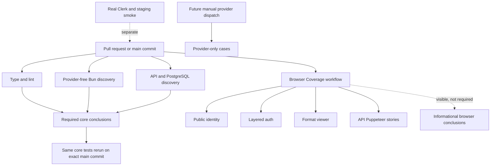

# test: Discover complete provider-free tests with optional browser coverage

## Summary

Replace the repository's hand-maintained test allowlists with convention-owned test lanes. Pull requests and the exact commits merged to `main` will run blocking static checks, provider-free Bun tests, and the complete non-E2E API/PostgreSQL suite. Deterministic local browser stories will run in a separate visible, non-blocking workflow so they add coverage without becoming merge-gate infrastructure.

Live-model, real-Clerk, and deployed-staging tests remain explicit operational lanes. Live-model execution and its dispatch machinery are follow-up work; the required slice only ensures those cases cannot enter provider-free discovery.

## Problem Frame

The current CI job provisions PostgreSQL but never runs the repository's database suite. Its root test command delegates to package `test:mock` scripts, and the engine and API implementations of those scripts enumerate a small set of files by hand. New provider-free tests can therefore exist without participating in pull-request validation. This has already allowed a stale format-catalog expectation to reach `main`.

The repository's test topology is broader than the current workflow suggests. Normal Bun tests span four workspaces, most API tests share a PostgreSQL lifecycle, three existing deterministic Puppeteer suites plus an extractable game-setup journey exercise local API/web behavior, three deterministic Playwright stories protect browser-facing behavior, and five tests can spend live-model credits. The implementation must make those ownership boundaries explicit without replacing one fragile manifest with another.

## Requirements

The plan preserves the origin document's requirement IDs for traceability. The origin called for required browser coverage; this revision records the later scope decision that browser coverage remains implemented and visible but is not a branch-protection requirement.

### Provider-free discovery

- R1. Required pull-request CI discovers every ordinary provider-free test without a file-by-file allowlist.
- R2. Exceptional suites use clear repository conventions so contributors can identify their owning lane from location or name.
- R3. A newly added ordinary provider-free test enters required CI automatically.
- R4. Required provider-free lanes receive no live-provider credentials and make no paid model calls.
- R5. The full provider-free gate runs on pull requests and reruns against the exact commit merged to `main`.

### Database coverage

- R6. PostgreSQL-backed tests run in a separate required pull-request job and block merging when they fail.
- R7. The database job uses the shared-test-database setup and preserves sequential mutation rules.
- R8. Database failures are reported separately from type, lint, unit, and browser failures.

### Browser coverage

- R9. The public-player-identity Playwright story runs on every pull request in the non-blocking Browser Coverage workflow.
- R10. The deterministic layered-authentication Playwright story runs on every pull request in the non-blocking Browser Coverage workflow.
- R11. The format-aware-game-viewer Playwright story becomes self-contained before joining the non-blocking Browser Coverage workflow.
- R12. Self-contained format-viewer coverage retains replay, reconnect, malformed-history, spoiler-safety, ballot-reveal, reduced-motion, and canonical format-presentation assertions.
- R13. Browser tests use local deterministic adapters and fixtures and never call real identity or model providers.
- R14. Deterministic browser tests run with zero retries.
- R15. Browser jobs upload Playwright traces, screenshots, and relevant logs only when a test fails.

### External and provider lanes

- R16. Staging Playwright smoke remains a separate post-deployment release gate.
- R17. The real-Clerk Playwright story remains an explicit manual external-provider run.
- R18. Full-game and agent-profile tests that can call live models never run automatically on pull requests, pushes, or schedules.
- R19. A future manual GitHub workflow may run all five live-model cases by default and may narrow the run with a validated path or test-name filter.
- R20. Any future manual filter input is treated as data and cannot permit arbitrary command execution.

## Context and Research

### Current repository shape

- The Bun workspace contains API, engine, web, and prompt-lab protocol packages. There are roughly 250 package test files, while the current engine and API `test:mock` scripts enumerate only a fraction of them.
- `bunfig.toml` ignores all `e2e` paths globally. That is useful for ordinary discovery only if the separate Browser Coverage workflow explicitly owns those paths.
- The API's current database command already discovers `src/__tests__` rather than enumerating files. Most API tests are PostgreSQL-backed, and the package also owns tests under services, scripts, and end-to-end directories.
- `setupTestDB()` acquires one process-lifetime PostgreSQL advisory lock, migrates once, and truncates between tests. It does not make concurrent tests inside a single Bun process safe.
- Public identity and deterministic layered authentication already demonstrate the correct browser-harness lifecycle: create a unique database, start local services, emit bounded readiness, stop child processes, and guardedly drop only the isolated database.
- The format viewer route-mocks many dynamic responses, but server-rendered replay/results paths still depend on locally persisted named games. It therefore needs an isolated seeded API/database harness rather than more browser-only mocks.
- `owner-learning-provider.test.ts` is provider-free despite its name, so the live-model convention cannot reuse the ambiguous `*.provider.test.ts` suffix.
- `private-trace-local-s3-smoke.test.ts` is an external-service smoke test inside the otherwise automatic API directory and needs an explicit manual classification rather than a silent conditional skip.

### Institutional learnings applied

- Shared PostgreSQL suites must retain the advisory-lock discipline, while parallel browser jobs must use unique databases instead of truncating the shared database.
- A manual live-provider run is not evidence if the tests silently skip or return success when credentials are missing; provider preflight must fail closed.
- Playwright diagnostics that need to survive CI must be written into the uploaded result directory. Inline attachments alone are not a durable failure record.
- Staging smoke remains a distinct release-certification flow. This plan does not weaken its deployed-SHA or homepage assertions to make pre-merge CI easier.

### External research decision

No external research is required for this plan. The installed Bun CLI, current Playwright configuration, repository workflows, test harnesses, and existing institutional learnings establish the necessary behavior and conventions. Because discovery semantics are load-bearing and CI currently installs moving Bun `latest`, implementation will establish one exact repository-owned Bun version and use it in every affected workflow.

## Key Technical Decisions

- **Use convention-owned lanes instead of another manifest.** Ordinary engine, web, protocol, and root-script tests remain discoverable by Bun. Every non-E2E API test directory belongs to the PostgreSQL lane. Browser stories belong to a separate non-blocking workflow. `*.live-provider.test.ts` marks live-model exceptions, while `*.external-smoke.test.ts` marks manual external-service checks such as private S3.
- **Assign the complete non-E2E API suite to the PostgreSQL job.** A small number of pure API tests will run with PostgreSQL, but this preserves a simple package contract and avoids renaming dozens of database-backed files. The job name describes API ownership rather than claiming every file touches the database.
- **Physically split mixed provider cases.** The deterministic mock full-game test stays in normal engine discovery, the three profile-generation cases move out of the large API suite, and the provider-driven browser flow moves to a provider-only file. Its deterministic create/join journey remains provider-free and covered by Browser Coverage.
- **Keep live-provider execution outside this implementation gate.** Required CI receives no provider credentials and discovers no live-provider file. Manual dispatch authorization, filtering, and spend controls remain follow-up work rather than adding a second test framework to the unit-test rollout.
- **Preserve persisted format-viewer semantics at the valid persistence boundary.** A new harness seeds valid canonical completed/classic fixtures into a unique PostgreSQL database, starts API and web, and serves the persistence-sensitive slugs. Reconnect, incremental, terminal-prefix, and malformed-history cases continue using browser routing because their viewer-decision fixtures are intentionally narrower than canonical stored events.
- **Run browser stories as a separate visible workflow.** Identity, layered auth, format viewer, and provider-free API/Puppeteer stories get independent failure attribution and isolated PostgreSQL services. The workflow may fail visibly, but its conclusions are not required by branch protection.
- **Keep retries at zero.** Flakes in deterministic stories are failures to fix, not outcomes to mask. Staging's current effective zero-retry behavior remains unchanged.
- **Require only the core test lanes.** Preserve the existing `check` context while adding stable provider-free and API/PostgreSQL conclusions to branch protection. Do not require Browser Coverage. Do not change PR image, production image, tag, or staging-dispatch dependency topology in this slice.
- **Pin Bun for repeatable discovery.** Declare one exact runtime version in repository metadata and use it across every affected test workflow so a Bun release cannot change collection between a pull request and its merged commit.
- **Avoid custom caching in the first implementation.** Use the existing Bun/install and Playwright browser setup. Add explicit caches only after required-run evidence shows a material bottleneck; cache design must not share test databases or fixture output.

## High-Level Technical Design

### Test ownership matrix

| Convention | Owner | Automatic | External dependencies |
|---|---|---:|---|
| Ordinary engine/web/protocol and root-script `*.test.*` outside E2E paths | Provider-free Bun | PR and `main` | None |
| Every non-E2E API test directory except explicit external/live-provider files | API/PostgreSQL | PR and `main` | Local PostgreSQL only |
| Root deterministic `*.spec.ts` stories | Browser Coverage workflow | PR and `main`, non-blocking | Local PostgreSQL/API/web as needed |
| Provider-free API `src/e2e/*.e2e.test.ts` | Browser Coverage workflow | PR and `main`, non-blocking | Local PostgreSQL/API/web/Chromium |
| `*.live-provider.test.ts` | Future manual provider workflow | Follow-up only | Provider config; local PostgreSQL/browser where required |
| `*.external-smoke.test.ts` | Existing/manual external-service flow | Manual only | Named external service such as private S3 |
| Real-Clerk Playwright project | Manual external-provider flow | Manual only | Disposable Clerk instance |
| Staging smoke | Post-deployment gate | After staging deploy | Deployed staging and runtime identity |

## Scope Boundaries

### In Scope

- Test classification and discovery scripts across all workspaces.
- Extraction of provider-bearing cases from mixed files without changing the production behavior under test.
- Required API/PostgreSQL and provider-free Bun coverage.
- Non-blocking deterministic Playwright and Bun/Puppeteer coverage.
- Hermetic format-viewer fixture seeding and service lifecycle.
- Test and operations documentation plus core branch-protection migration instructions.

### Outside This Slice

- Product behavior changes or new test-only feature flags in production code.
- Making real Clerk, live models, or deployed staging prerequisites for pull requests.
- Building the future live-provider dispatcher, workflow, or provider-spend authorization ceremony.
- A parser that tries to infer coverage by inspecting GitHub Actions YAML.
- A custom test inventory database, central file manifest, or lane configuration language.
- Sharding shared PostgreSQL mutations or adding concurrent APIs to shared-database tests.
- Reworking staging smoke beyond preserving its existing separation and effective retry behavior.
- Changing PR image publication, production image publication, tagging, staging dispatch, or the separate blue-green release work.

## Implementation Units

### U1. Establish explicit provider-only test ownership

- **Goal:** Make normal discovery safe by separating all live-model cases from files owned by required CI.
- **Requirements:** R1-R4, R18. Supports AE1 and AE4.
- **Dependencies:** None.
- **Files:**
  - `packages/engine/src/__tests__/full-game.test.ts`
  - `packages/engine/src/__tests__/full-game.live-provider.test.ts` (new)
  - `packages/api/src/__tests__/agent-profiles.test.ts`
  - `packages/api/src/__tests__/agent-profiles.live-provider.test.ts` (new)
  - `packages/api/src/__tests__/private-trace-local-s3-smoke.test.ts`
  - `packages/api/src/__tests__/private-trace-local-s3.external-smoke.test.ts` (renamed)
  - `packages/api/src/e2e/game-flow.e2e.test.ts`
  - `packages/api/src/e2e/game-setup.e2e.test.ts` (new)
  - `packages/api/src/e2e/game-flow.live-provider.test.ts` (new)
  - `package.json`
- **Approach:** Keep deterministic mock and setup scenarios in automatically owned files. Move only provider-bearing cases and the stateful full-game browser chain into the unused `*.live-provider.test.ts` convention, leaving deterministic tests such as `owner-learning-provider.test.ts` in required discovery. Rename the private-S3 conditional smoke into the separate `*.external-smoke.test.ts` convention rather than treating a skipped external dependency as complete API coverage. Do not add a second dispatcher or provider workflow to the unit-test rollout; the classification boundary is the required safety property, while live-provider execution remains follow-up work.
- **Test scenarios:**
  - Given required CI with all provider credentials absent, ordinary discovery finds the deterministic mock full-game and excludes every live-provider file.
  - Given a deterministic test whose filename contains `provider`, ordinary discovery still includes it when it does not use the live-provider convention.
  - Given the private-S3 smoke path, ordinary API discovery excludes it because it has an explicit external-smoke classification rather than silently treating a conditional skip as coverage.
- **Verification:** Required discovery has no path to provider-only or external-smoke cases, and the repository documents the follow-up owner for live-provider execution.

### U2. Replace package allowlists with provider-free discovery and a complete API lane

- **Goal:** Make newly added ordinary tests enter required CI through stable repository conventions.
- **Requirements:** R1-R8, R18. Supports AE1, AE2, and AE4.
- **Dependencies:** U1.
- **Files:**
  - `package.json`
  - `bunfig.toml`
  - `packages/api/package.json`
  - `packages/engine/package.json`
  - `packages/web/package.json`
  - `packages/prompt-lab-protocol/package.json`
  - `packages/api/src/__tests__/test-utils.ts`
  - `.github/workflows/ci.yml`
- **Approach:** Replace `test:mock` as the required root contract with provider-free discovery commands owned by package and directory boundaries. Engine, web, protocol, and root-script tests discover by default while excluding API, E2E, live-provider, and external-smoke conventions. The API job discovers every non-E2E API test directory, excluding only explicit live-provider and external-smoke files, runs in one Bun process, and retains the shared advisory lock. Bring the shared reset list back into parity with every current mutable schema table before expanding the suite. Do not introduce per-file lists, sentinel probes, test-inventory meta-tests, concurrent test APIs, or multiple processes mutating the shared database. Declare the exact Bun runtime version in repository metadata and use it in CI.
- **Test scenarios:**
  - Given a new engine, web, protocol, or root-script provider-free test, the provider-free command discovers it without a package-script file edit.
  - Given a new non-E2E API test under `src/__tests__`, services, or scripts, the API/PostgreSQL command discovers it without a workflow edit.
  - Given a database migration or API persistence regression, the API/PostgreSQL lane fails separately while unrelated lane output remains attributable.
  - Given live-provider, external-smoke, and E2E paths, ordinary Bun discovery excludes them intentionally rather than treating their absence as a pass.
  - Given a test process using `setupTestDB()`, it acquires the existing process lock before migration/truncation and no same-process concurrent mutation is introduced.
  - Given two consecutive shared-database setups and a row in `app_settings` or another independently mutable table, the second setup sees no leaked state.
  - Given pull-request and `main` jobs for the same source revision, both install the repository-declared Bun version and use identical discovery semantics.
- **Verification:** The root required scripts contain no ordinary test-file enumeration, API test discovery covers the complete owned surface, and the existing PostgreSQL concurrency contract remains intact.

### U3. Isolate the provider-free API/Puppeteer stories for optional browser coverage

- **Goal:** Run the existing deterministic API/web browser integration stories in Browser Coverage without racing the shared database or making them merge blockers.
- **Requirements:** R1-R4, R13-R15. Supports AE1, AE3, and AE4.
- **Dependencies:** U1, U2.
- **Files:**
  - `packages/api/src/e2e/e2e-smoke.test.ts`
  - `packages/api/src/e2e/season-surfaces.e2e.test.ts`
  - `packages/api/src/e2e/standing-daily-agent.e2e.test.ts`
  - `packages/api/src/e2e/game-setup.e2e.test.ts`
  - `packages/api/src/e2e/test-db.ts`
  - `packages/api/src/e2e/test-server.ts`
  - `packages/api/src/e2e/test-browser.ts`
  - `packages/api/package.json`
- **Approach:** Migrate each provider-free Bun/Puppeteer story from shared `createTestDb()` truncation to the existing guarded isolated-database lifecycle. Preserve local API/web startup and browser assertions, add bounded post-readiness process logging, and ensure every suite tears down browser, child services, database connections, and its uniquely named database even after failure. Run these files serially within one Browser Coverage variant while required core jobs remain free to run in parallel.
- **Test scenarios:**
  - Given the shared API/PostgreSQL job and API/Puppeteer variant run concurrently, each Puppeteer suite uses its own database and never truncates the shared suite's state.
  - Given a suite fails after API/web readiness, teardown stops all child processes and guardedly removes only its isolated database.
  - Given child shutdown exceeds its bound, the harness force-terminates the child, retains bounded diagnostics, and still attempts isolated-database cleanup.
  - Given a deterministic create/join journey, it completes without activating or calling the model-driven game runner.
  - Given all provider-free Puppeteer stories, their existing API, browser, season, standing-agent, and public-surface assertions remain intact.
- **Verification:** All four deterministic Bun/Puppeteer files—the three existing suites plus the extracted create/join journey—run automatically in the separate workflow, leave no child processes or test databases behind, expose no provider configuration, and retain Puppeteer screenshots plus bounded service/browser logs on failure. Their workflow conclusions remain visible but are not required by branch protection.

### U4. Make the format-aware viewer hermetic for optional browser coverage

- **Goal:** Run the complete format-viewer story against fresh isolated services and persisted fixtures on every pull request without making browser coverage a merge blocker.
- **Requirements:** R9-R15. Supports AE3.
- **Dependencies:** U2, U3.
- **Files:**
  - `e2e/format-aware-game-viewer.spec.ts`
  - `e2e/format-aware-game-viewer.fixtures.ts`
  - `packages/api/src/e2e/format-aware-game-viewer-harness.ts` (new)
  - `packages/api/src/e2e/fixtures/format-aware-game-viewer.ts` (new)
  - `packages/api/src/__tests__/production-game-mcp-read-model.test.ts`
  - `packages/api/src/e2e/test-db.ts`
  - `packages/api/src/e2e/test-server.ts`
  - `playwright.config.ts`
  - `package.json`
- **Approach:** Reuse the established identity/auth harness pattern to create a unique database, seed valid canonical completed/classic games, start the local API and web, and emit one machine-readable readiness receipt containing the local base URL. Extract the established `GameState` plus `appendGameEvents` construction pattern from the production MCP read-model tests into a reusable E2E fixture module and preserve the existing named persistence-sensitive slugs. Keep reconnect, incremental, terminal-prefix, and malformed-history scenarios on their existing browser-routed viewer-decision fixtures; do not fabricate canonical envelopes or insert invalid raw rows merely to persist them. The harness owns bounded service logs and unconditional cleanup.
- **Test scenarios:**
  - Given a fresh runner with an empty PostgreSQL service, the harness seeds every valid persistence-sensitive completed/format/classic scenario required by server-rendered replay and results.
  - Given server-side replay/results navigation for each legacy slug, the page renders from the isolated persisted fixture without developer-local data.
  - Given reconnect and incremental decision delivery, the browser routes and websocket fixtures continue to advance only trusted higher decisions.
  - Given malformed histories, presentation stops at the last trusted cue and never invents an elimination.
  - Given desktop, mobile, and reduced-motion modes, canonical Safety Bounce presentation and viewport assertions remain unchanged.
  - Given completed results and replay navigation, format recaps stay complete and spoiler-safe while classic games remain free of format presentation.
  - Given a browser assertion fails after readiness, failure output includes the Playwright trace, screenshot, and bounded API/web harness logs; passing output uploads nothing.
- **Verification:** The format-viewer story runs from a pristine database with no persisted-fixture precondition and retains every current semantic assertion. Its workflow conclusion is visible on the pull request and `main` but is not part of branch protection.

### U5. Build required core CI and a separate Browser Coverage workflow

- **Goal:** Make provider-free Bun and API/PostgreSQL coverage required while running U3 and U4 in a separate visible workflow that does not block merging.
- **Requirements:** R4-R15. Supports AE1-AE4.
- **Dependencies:** U2, U3, U4.
- **Files:**
  - `.github/workflows/ci.yml`
  - `.github/workflows/browser-coverage.yml` (new)
  - `.github/workflows/build-pr.yml`
  - `playwright.config.ts`
  - `package.json`
- **Approach:** Keep static, provider-free Bun, and API/PostgreSQL jobs as stable required conclusions under the existing pull-request and `main` triggers, while preserving the current `check` context during branch-protection migration. Add a separate Browser Coverage workflow for U3 and U4 with its own PostgreSQL service and Chromium setup, zero retries, independent suite attribution, and failure-only artifacts. Let that workflow fail visibly; non-blocking means its conclusions are excluded from branch protection, not that failures are hidden with `continue-on-error`. Keep provider credentials and future manual provider dispatch out of this implementation. Set read-only or empty GitHub token permissions on test jobs, retain write permissions only on existing trusted publication jobs, and keep PR validation on `pull_request`, never `pull_request_target`. Do not alter PR-image, production-image, tag, staging-smoke, staging-dispatch, or real-Clerk dependency topology.
- **Test scenarios:**
  - Given a pull request, static, provider-free Bun, and API/PostgreSQL lanes start independently, remain separately diagnosable, and publish stable required check names.
  - Given the exact commit lands on `main`, the same required commands and repository Bun version rerun without requiring or delaying the separate deployment workflows.
  - Given a Browser Coverage failure, the workflow reports failure and retains suite-specific diagnostics, but the branch-protection gate remains determined only by the required core conclusions.
  - Given a Playwright failure, that suite runs once and uploads only its trace, screenshots, and bounded logs under a suite-specific artifact name.
  - Given a Puppeteer failure, that suite runs once and uploads its screenshots and bounded service/browser logs without claiming a Playwright trace.
  - Given a successful browser suite, no diagnostics artifact is uploaded.
  - Given ordinary CI, no provider secret or provider-only file is present in either the required core jobs or Browser Coverage.
  - Given a fork pull request, validation runs with read-only/empty token permissions and no repository, environment, identity-provider, or model-provider secrets.
- **Verification:** GitHub exposes stable required conclusions for static, provider-free, and API/PostgreSQL jobs on pull requests and `main`, plus visible non-required Browser Coverage conclusions. No workflow in this slice can spend provider credits.

### U6. Document the lane contract and migrate required checks safely

- **Goal:** Make test placement, local invocation, provider authorization, and GitHub rollout understandable to contributors and operators.
- **Requirements:** R2, R4-R5, R9-R10, R16-R18. Supports AE1, AE3, and AE4.
- **Dependencies:** U1-U5.
- **Files:**
  - `AGENTS.md`
  - `DEVELOPMENT.md`
  - `docs/development-and-operations.md`
  - `docs/test-audit.md`
  - `docs/refactor-queue.md`
  - `docs/solutions/architecture-patterns/shared-postgres-tests-use-a-process-advisory-lock.md`
- **Approach:** Replace curated-test guidance with the ownership matrix, document the shared versus isolated PostgreSQL rules, distinguish Playwright from Puppeteer failure artifacts, and explain that Browser Coverage is visible but non-blocking while live-provider and external-service smokes are manual. Update the historical audit's current-facing commands and inventory without rewriting old plans. Preserve the existing `check` context during rollout; observe the new core checks on the implementation pull request, add only provider-free and API/PostgreSQL conclusions to branch protection before merge, and verify the exact `main` rerun afterward. Record the future manual-provider boundary without making its environment a prerequisite for this implementation.
- **Test expectation:** None — documentation and external branch-protection configuration are non-feature-bearing; their accuracy is checked against the implemented scripts and workflow job names.
- **Verification:** A contributor can place a new test into the correct lane without reading workflow YAML, and an operator can require the core checks without accidentally making optional browser coverage or provider execution a merge prerequisite.

## System-Wide Impact

### CI and branch protection

The current single `check` conclusion gains stable sibling checks for provider-free and API/PostgreSQL behavior. Branch protection requires only those core conclusions after a no-gap migration, and the same commands rerun on `main`. Browser Coverage reports separate visible conclusions but is not required. Existing image, tag, and staging workflow dependencies remain outside this plan.

### Provider and credential boundary

Required jobs and Browser Coverage must have no Doppler token, OpenAI-compatible key, or Clerk secret and must execute fork code only through `pull_request` with read-only/empty token permissions. Live-provider dispatch is not added here and remains a future credential consumer. Real Clerk retains its current explicit guard and separate lifecycle.

### PostgreSQL lifecycle

The API/PostgreSQL lane retains the single shared database and process advisory lock. Browser harnesses create unique databases because GitHub jobs and local developers may run them beside the shared suite. Database creation and deletion must use the existing allowlisted name prefix and unconditional teardown paths.

### Browser process lifecycle and evidence

Playwright and Puppeteer stories start child APIs/web servers and browsers. Readiness, timeout, termination, and cleanup must stay bounded. Logs required for failure diagnosis must be persisted to each suite's result directory so GitHub artifact upload can retain them; successful runs create no artifact bundle. Playwright retains traces and screenshots, while Puppeteer retains screenshots and bounded browser/service logs.

### Test author experience

Ordinary tests become default-in. Contributors only make an explicit choice when a test requires PostgreSQL, a local browser harness, a live provider, real Clerk, or deployed staging. Documentation and script names must make that choice visible without consulting a central inventory.

## Risks and Dependencies

- **Required-run duration may grow materially.** The change intentionally exposes previously skipped work. Keep lanes parallel, keep shared database mutation serialized, and collect actual PR/main durations before considering caches or sharding.
- **A provider test could leak back into ordinary discovery.** Physical `*.live-provider.test.ts` ownership and explicit required-lane exclusions provide the classifier. Do not rely on missing credentials.
- **Future manual provider tests could report false green.** When that lane is implemented, credential, activation, path, and match preflight must fail before Bun/provider execution; provider tests must not early-return as success.
- **Browser teardown could leak processes or databases.** Reuse bounded termination and guarded database-name validation, and cover failure-after-readiness paths.
- **Format fixtures could drift from production schemas.** Seed through current repository fixtures and normal database migrations rather than hard-coded raw response snapshots alone.
- **Shared database cleanup can become stale as schema grows.** Extend focused reset coverage so independently mutable tables cannot leak state between newly discovered API tests.
- **A moving Bun release could change discovery.** Pin the repository/runtime version and update it intentionally through reviewed changes.
- **Branch protection can drift from workflow names.** Use stable core names and an explicit observation-then-migration checklist. Repository workflow changes cannot themselves mutate branch rules.
- **Optional browser failures can be ignored operationally.** Keep Browser Coverage visible, document its non-blocking status, and review recurring failures separately from the required core gate.

## Verification Strategy

### Provider-free repository validation

- Exercise static, default provider-free, and API/PostgreSQL lanes independently so required failures remain attributable. Run Browser Coverage separately for browser diagnostics.
- Confirm required jobs run with provider variables absent and that no provider-only case is collected.

### Discovery regression validation

- Run the complete provider-free and API discovery commands and inspect their collected-test summaries where available.
- Confirm provider-only, external-smoke, real-Clerk, and staging paths are excluded for an explicit convention reason rather than accidentally skipped.
- Do not add temporary sentinel tests, a YAML-parsing completeness meta-test, or a second test inventory.

### Browser validation

- Run each deterministic story from a clean local/CI database service with zero retries.
- Confirm the workflow configuration retains failure diagnostics and that teardown leaves no harness process or isolated database.

### Pull-request and main validation

- On the implementation pull request, verify every new required conclusion is visible and green before merge.
- Preserve the existing required `check` context, add only the provider-free and API/PostgreSQL conclusions to branch protection after they are observed on the pull request, and verify the exact `main` rerun afterward. Confirm Browser Coverage remains visible but non-required.
- Confirm the separate image, tag, staging-dispatch, staging-smoke, and blue-green workflows were not changed by this implementation.

### External and provider boundary

- Do not run the five live-model cases or consume provider credits as part of this implementation without separate explicit authorization.
- Preserve the existing separate real-Clerk and staging flows; their operational proof is not part of the provider-free test gate.

## Documentation and Operational Notes

- Keep `docs/test-audit.md` clearly labeled as a current inventory at its new update date; do not retain obsolete counts as if they describe current CI.
- Document that `bun run check` remains type/lint only unless its meaning is intentionally changed; test commands and required CI lanes should be named separately.
- Document local PostgreSQL access expectations, including that sandboxed agents must request database access before declaring PostgreSQL unavailable.
- Preserve the staging smoke's current secure origin, deployed-SHA identity assertion, homepage title assertion, and durable failure evidence.
- Treat the branch-protection update as an explicit operator action, not a hidden side effect of merging the code. Browser Coverage is intentionally excluded from the required-check migration.

## Resolved During Planning

- **Normal convention:** Default Bun discovery by package/directory, with `*.live-provider.test.ts` reserved for live-model exceptions and `*.external-smoke.test.ts` reserved for manual external-service checks.
- **Database boundary:** The complete non-E2E API test surface runs in one serialized PostgreSQL-owned job rather than renaming dozens of files.
- **Browser grouping:** Deterministic browser coverage is one separate, non-blocking workflow with independently reported identity, layered-auth, format-viewer, and API/Puppeteer variants.
- **Format fixture:** Use an isolated seeded database plus local API/web harness; retain persistence-sensitive coverage.
- **Provider boundary:** Classify live-provider files explicitly and keep them out of every automatic workflow; defer dispatch and filter mechanics.
- **Caching:** No new custom cache in V1; optimize only from observed required-run data.
- **Runtime reproducibility:** One exact repository-owned Bun version governs pull-request and `main` discovery.
- **Release boundary:** Core required checks and branch protection change; Browser Coverage remains non-required. Image publication, tags, staging dispatch, staging smoke, and blue-green deployment do not.

## Deferred to Implementation

- Exact timeout values for each CI job and harness, selected from observed local and pull-request durations with bounded headroom.
- The smallest stable set of bounded API/web log lines needed for browser-failure diagnosis.
- The manual live-provider workflow, safe filter dispatcher, provider activation signal, and credential-issuance ceremony.

## Success Criteria

- A normal provider-free test added under any owned package or API path runs in required pull-request CI without editing a file list.
- The API/PostgreSQL lane runs the complete owned API suite and blocks merge independently.
- All deterministic Playwright and Bun/Puppeteer browser stories run from isolated local state, once, without provider calls, in the separate non-blocking workflow.
- Format-viewer coverage no longer depends on a developer's persisted fixture database and retains its current semantic assertions.
- Required CI and Browser Coverage receive no live-provider credentials; live-provider execution remains outside this implementation slice.
- Every required provider-free lane reruns on the exact `main` commit without changing separate image publication, tagging, or staging-dispatch behavior.
- Browser failures retain actionable suite-specific diagnostics, while browser successes do not upload diagnostics.
- Branch protection requires only stable core conclusions without a coverage gap, and contributors can understand lane ownership from repository documentation.

## Sources and References

### Origin

- `docs/brainstorms/2026-08-16-ci-test-discovery-requirements.md`

### Repository guidance and workflows

- `AGENTS.md`
- `STRATEGY.md`
- `CONCEPTS.md`
- `.github/workflows/ci.yml`
- `.github/workflows/e2e-staging.yml`
- `.github/workflows/build-pr.yml`
- `package.json`
- `bunfig.toml`
- `playwright.config.ts`

### Test and harness patterns

- `packages/api/src/__tests__/test-utils.ts`
- `packages/api/src/e2e/test-db.ts`
- `packages/api/src/e2e/test-server.ts`
- `packages/api/src/e2e/test-browser.ts`
- `packages/api/src/e2e/public-player-identity-harness.ts`
- `packages/api/src/e2e/layered-authentication-harness.ts`
- `e2e/public-player-identity.spec.ts`
- `e2e/layered-authentication.spec.ts`
- `e2e/format-aware-game-viewer.spec.ts`
- `e2e/format-aware-game-viewer.fixtures.ts`
- `packages/api/src/e2e/e2e-smoke.test.ts`
- `packages/api/src/e2e/season-surfaces.e2e.test.ts`
- `packages/api/src/e2e/standing-daily-agent.e2e.test.ts`
- `packages/api/src/e2e/game-flow.e2e.test.ts`
- `packages/engine/src/__tests__/full-game.test.ts`
- `packages/api/src/__tests__/agent-profiles.test.ts`

### Institutional learnings

- `docs/solutions/architecture-patterns/shared-postgres-tests-use-a-process-advisory-lock.md`
- `docs/development-and-operations.md`
- `docs/test-audit.md`
