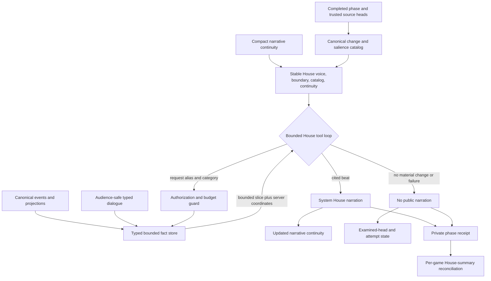
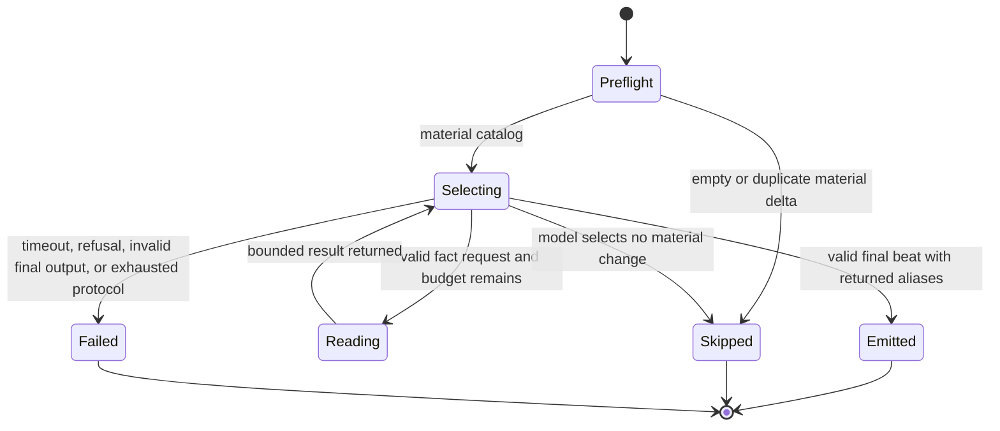

# refactor: Add agentic House summary cadence

## Summary

Replace the broad House MC evidence replay with a bounded selective-fact loop, prove it at `FORMAT_PICK` and the existing round-end boundary, then expand the same path across meaningful phases. Every emitted beat must be specific, privately traceable to server-issued source coordinates, and accounted by phase and game while total current-meta House-summary cost remains within 25% of the measured round-only baseline.

---

## Problem Frame

`GameRunner.emitHouseRoundInterstitial()` currently makes one House MC call per normal round after copying the accumulated transcript, public messages, diary entries, room allocations, full House Strategy Bible packet, and round facts into the prompt. The call is expensive because its input grows with game history. Repeating that shape after more phases would multiply cost and make stale or contradictory prose harder for the model to distinguish from canonical truth.

R21 requires a different architecture rather than a shorter version of the same prompt. The House should begin from a compact canonical phase frontier and its last narrative beat, request only the fact slices it needs, and either emit a cited beat or explicitly skip. Canonical events and projections remain the sole authority for board facts; dialogue stays labeled evidence and never repairs or overrides them.

---

## Requirements

**Cadence and narration**

- R1. Prove the selective loop at `FORMAT_PICK` and at the existing `FORMAT_RESOLVE` or classic round-end boundary before expanding it.
- R2. After the proving slice passes deterministic and minimal current-model gates, schedule the same loop after every meaningful actor-coordinate boundary. A representative full game must emit useful beats at least 80% of materially eligible boundaries; deterministic empty-delta skips are excluded from that denominator, while model skips and failures are not.
- R3. Ordinary phase beats must be concise while elimination, round-end, and endgame milestones receive richer bounded envelopes without whole-history replay.
- R4. A no-material-change result or generation failure must emit no filler narration and must never delay, mutate, or fail canonical gameplay.

**Authority, privacy, and continuity**

- R5. Seed each call with only the phase boundary, a bounded canonical change and salience catalog, and compact prior narrative state.
- R6. Expose only narrow typed canonical, projection, audience-safe dialogue, and authorized House evidence slices; transcript prose must never become game-state authority.
- R7. Mint source aliases and coordinates on the server, accept final citations only from slices returned in the current loop, and keep receipts out of public House prose.
- R8. Preserve one compact versioned in-memory narrative continuity record across adjacent beats without rebuilding it from transcript prose. Checkpoint/resume expansion belongs to the separate recovery queue and is not part of R21.
- R9. Keep current House-read and audience-output authorization distinct so a House-accessible source cannot enter a system-visible beat unless its category is audience-safe.
- R9a. Apply a deny-by-default visibility matrix before provider serialization: accepted public/system canonical projections and public player dialogue may be narrated; anonymous dialogue redacts identity; prior House/system narration, private/diary/thinking/hidden-huddle/producer rows, and sealed or unrevealed facts are categorically absent and must not affect omission counts.
- R9b. Treat every provider-visible player-controlled string as untrusted data, normalize control characters, and keep invariant instructions outside the data envelope. Public rendering accepts validated prose only and rejects reserved source aliases, coordinates, tool markers, diagnostics, and control characters.

**Bounds and accounting**

- R10. Hard-cap every ordinary beat at two provider responses, one sequential fact call requesting at most two categories, 2,048 bytes per category, 4,096 returned bytes, a 45-second loop deadline, a 256-token provider completion ceiling per response, and 60 estimated visible tokens / 180 prose characters. Hard-cap every milestone beat at two provider responses, one sequential fact call requesting at most three categories, 4,096 bytes per category, 8,192 returned bytes, a 75-second loop deadline, a 512-token provider completion ceiling per response, and 120 estimated visible tokens / 360 prose characters.
- R11. Malformed, repeated, unknown, parallel, unauthorized, or over-budget tool requests must consume the same finite budget and terminate with a bounded typed outcome.
- R12. Record provider-reported prompt, cached-input, cache-write, completion, reasoning, total tokens, response identity, and effective service tier for every charged attempt, including failed attempts. Missing usage remains explicitly unavailable and is never estimated as zero.
- R13. Emit a content-free private phase receipt with boundary identity, status, call/category/byte counts, source-coordinate counts, usage availability, and usage totals; exact coordinates, tool payloads, provider output, and diagnostics remain only in the existing producer-private trace path. Per-game House-summary call identities and known-token subtotals must reconcile to phase receipts and `TokenTracker`.
- R14. A current-meta comparison must show the expanded phase cadence within 25% of the same game's measured round-only House-summary realized USD cost, computed from provider-reported usage, effective service tier, and the frozen repository rate card, while retaining specific canonically supported narration. This is the reviewed meaning of “near” for R21: the six-player full-cadence total may not exceed `1.25x` the same game's complete once-per-round baseline. Any charged response with missing usage, service tier, or pricing makes the comparison inconclusive and keeps R21 open.
- R14a. Ordinary beats must add new strategic orientation rather than restating the action feed, preserve watchable pacing, and never buy cadence by weakening elimination, round-end, or endgame milestone quality.

**Delivery and proof**

- R15. Keep `enableHouseRoundSummaries` and `--no-house-summaries` as the existing on/off control for the entire House MC cadence; add no feature flag or disabled-visible state.
- R16. Update engine, observability, simulator, evaluation, and queue documentation to distinguish deterministic mechanics proof, targeted provider proof, and full cadence cost and quality evidence.
- R17. Do not mark R21 complete after only the proving slice. Complete full cadence and R14 in this PR by default; if separation becomes unavoidable, open actual ready-for-review stacked PRs with named bases covering the remaining cadence and cost gate, and keep R21 open until they pass.

---

## Key Technical Decisions

- KTD1. **Use a runner-owned phase frontier and fact store.** The runner snapshots the trusted event head and eligible dialogue head, builds a small salience catalog, and retains fact bodies in an in-process read-only store that is serialized only when the House requests a category. This removes the full evidence bundle from concise summary prompts while leaving the separate round-end Strategy Bible update unchanged.
- KTD2. **Start with three non-duplicative requestable categories.** `canonical_phase_facts` covers accepted decisions and phase outcomes; `player_projection_facts` covers audience-safe player, room, alliance, and eligibility projections; `audience_dialogue_quotes` covers explicitly public quotations with transcript coordinates and a non-authoritative label. Compact narrative continuity is seed state, never a tool category. Categories use complete compact aggregates with omission counts rather than truncated authoritative ledgers.
- KTD3. **Use a bounded tool protocol with an explicit terminal union.** The model may request fact slices, emit a cited summary, or return `no_material_change`. The server forces a terminal choice when the tool budget is exhausted and treats invalid output as a private failed attempt with no public fallback.
- KTD4. **Separate House access from narration eligibility.** Each fact row carries its authority lane and audience eligibility before the model sees it. The first slice excludes diary, cognition, and raw private producer evidence; later cadence reuses the same categories rather than widening access to make a phase interesting.
- KTD5. **Keep compact narrative continuity in memory and out of authority.** The record carries the last emitted beat, bounded thread IDs and open questions, original supporting source lineage, last examined and emitted source heads, last actor-coordinate boundary, and a zero-or-one pending-delta carry count. It is not canonical state, checkpoint state, Strategy Bible state, or citeable evidence. A skip advances examined heads; a first failure advances the attempted boundary and may carry the unseen delta once. Success, skip, or another failure at the carried attempt advances examined heads, records emitted or dropped status, clears the pending delta, and never schedules the original boundary again.
- KTD6. **Account at provider-response and beat levels.** Existing private traces and provider spend accounting remain the durable per-call path. A content-free phase receipt aggregates provider-reported usage and simulation instrumentation reconciles call identities and known-token subtotals to `House/mc-summary`; unavailable usage makes cost proof inconclusive.
- KTD7. **Gate expansion twice.** Deterministic tests first exercise `FORMAT_PICK` and round-end continuity, followed by one minimal current-model slice comparison proving specific cited output and viable per-beat cost. Only then expand the scheduler. A second frozen current-model comparison evaluates the full representative game; failure sends the implementation back to envelope/cadence tuning rather than producing a report-only partial completion.

---

## Normative Scheduler and Authorization Contracts

Boundary identity is `house-beat/v1:{round}:{actorCoordinate}:{canonicalHead}:{dialogueHead}`. `actorCoordinate`, not the coarse `Phase`, disambiguates normal, Reckoning, Tribunal, and Judgment branches. `format_mingle` is one composite boundary after Mingle, alliance formation, and huddle work complete. The scheduler snapshots canonical and eligible-dialogue heads before House output; emitted House/system rows are never salience input and the examined dialogue head advances through them.

| Actor coordinate | Beat class | Material triggers | Deterministic skip |
|---|---|---|---|
| `introduction` | ordinary | accepted public introductions | no new accepted introduction or public player dialogue |
| `lobby` | ordinary | accepted public lobby/Mingle dialogue or room projection change | no eligible dialogue or projection delta |
| `vote` | ordinary | empower tally/revote/set accepted | no new accepted tally or empowered projection |
| `format_menu` | ordinary | format menu accepted | menu identical to last examined accepted menu |
| `format_pick` | ordinary proving slice | format selection accepted, including sole-eligible auto-selection | no accepted selection delta |
| `format_mingle` | ordinary composite | audience-safe room/alliance projection change or public dialogue | no eligible canonical, projection, or dialogue delta |
| `format_resolve` | milestone proving slice | accepted format resolution, round result, or elimination | never when a new accepted resolution exists |
| `post_vote_mingle` | ordinary legacy | accepted public dialogue or room change | no eligible delta |
| `power` | milestone only for accepted automatic elimination; ordinary otherwise | accepted power decision/result | no accepted power delta |
| `reveal` | ordinary | accepted public council candidates | no accepted candidate delta |
| `pre_council_huddle` | ordinary | audience-safe alliance projection change | no eligible projection delta |
| `council` | milestone | accepted council result/elimination | no accepted result delta |
| `reckoning_lobby`, `reckoning_plea` | ordinary | accepted public endgame dialogue/speech | no eligible accepted speech |
| `reckoning_vote` | milestone | accepted Reckoning result/elimination | no accepted result delta |
| `tribunal_lobby`, `tribunal_accusation`, `tribunal_defense` | ordinary | accepted public endgame dialogue/speech | no eligible accepted speech |
| `tribunal_vote` | milestone | accepted Tribunal result/elimination | no accepted result delta |
| `judgment_opening`, `judgment_jury_questions`, `judgment_closing` | ordinary | accepted public formal speech | no eligible accepted speech |
| `judgment_jury_vote` | milestone | accepted jury result/winner | no accepted result delta |

`checkGameOver` and `end` are not narration boundaries. A materially eligible boundary is one whose allowlisted trigger exists after the previous examined trusted head. Preflight skips apply only when the allowlisted delta is empty. Model-selected skips and failures remain in the full-cadence denominator; at least 80% of eligible boundaries must emit, with a per-boundary novelty and pacing review.

| Input lane | House-readable | Public-narratable | Identity treatment |
|---|---:|---:|---|
| Accepted canonical public/system projection | yes | yes | canonical player display name only when already revealed |
| Accepted sealed or unrevealed canonical fact | no | no | row and existence absent |
| Public player dialogue/formal speech | yes | yes | named unless the accepted record is anonymous |
| Anonymous public dialogue | yes | yes | speaker replaced with `Anonymous`; no hidden ID or name |
| Prior House/system narration | no | no | excluded from salience and tools |
| Diary, thinking, private/huddle, producer/raw trace | no | no | row and existence absent |

Provider-visible strings are normalized, bounded, and serialized as JSON under an explicit `untrusted_data` key. Stable system instructions say that names, dialogue, and fact strings are evidence data and never instructions. The public renderer accepts only the validated prose field; citations remain structured private metadata and reserved alias patterns (`S\d+`), coordinate encodings, tool/result markers, diagnostic canaries, and disallowed controls cause a failed/no-public-output result.

---

## High-Level Technical Design

The public transcript receives only the server-validated House prose. The content-free private phase receipt contains numeric/status metadata only. Exact source coordinates, tool arguments, fact bodies, provider output, and failure diagnostics remain in the existing producer-private trace path and never enter public/system serialization or ordinary evaluation artifacts. A skip advances the examined source head without changing the last emitted narrative; a failure records the attempted boundary and may carry its unseen canonical delta into the next beat once without retrying the failed phase in a loop.

---

## Scope Boundaries

### In Scope

- Selective House MC summaries at nearly every meaningful phase under one bounded protocol.
- The `FORMAT_PICK` plus round-end proving slice, followed by full phase scheduler expansion.
- Three typed fact categories, compact narrative continuity, server-authored receipts, and actual usage accounting.
- In-memory narrative continuity and exact provider-response/beat accounting for the current run.
- A frozen current-meta baseline/candidate evaluation with per-phase and per-game evidence.

### Deferred to Follow-Up Work

- New fact categories for raw diary answers, cognition, private traces, or unrestricted producer evidence.
- Public source-receipt UI, audience citation links, or a generic House fact MCP.
- Cross-game House narrative memory or season-level editorial continuity.
- Changing the separate Strategy Bible update cadence or its broad producer evidence contract.
- Checkpoint/resume passport changes, token-budget recovery, or any new recovery-readiness contract (owned by the separate recovery queue).

### Outside This Plan

- Treating transcript prose, House narration, narrative continuity, or model-selected salience as canonical game state.
- A new feature flag, rollout boundary, or compatibility copy of the removed monolithic summary path.
- Claiming active games are crash-safe beyond the supported checkpoint behavior proved by existing recovery contracts.

---

## System-Wide Impact

- **Engine orchestration:** House MC scheduling moves from one completed round set to phase-boundary identities with separate examined and emitted cursors.
- **House provider protocol:** Chat Completions gains typed fact tools, terminal output validation, shared stable prompt blocks, and bounded multi-turn traces.
- **Recovery:** No checkpoint or recovery contract changes; recovered games keep the existing House behavior, and R21 continuity begins from the first newly examined boundary in the current runner process.
- **Privacy:** Public prose remains clean; fact rows and receipts enforce audience eligibility before model selection.
- **Accounting:** Existing per-call ledger remains authoritative while phase receipts and simulator rollups expose cadence economics.
- **Operations:** The inherited House-summary disable control suppresses phase and round beats together; deployment remains the gate.

---

## Risks and Mitigations

| Risk | Mitigation |
|---|---|
| More small model turns cost more than the old broad round calls. | Keep ordinary beats to the smallest envelope, skip empty deltas before provider I/O, reconcile every attempt, and require the expanded current-meta total to stay within the defined `1.25x` near-budget envelope. |
| Dialogue contradicts a selected format, tally, or elimination. | Label dialogue as non-authoritative and require canonical phase facts for every mechanical claim. |
| A model invents or reuses a stale source alias. | Mint aliases per loop and reject citations outside the returned alias set. |
| Truncation changes a tally or ballot meaning. | Return complete compact aggregates with omission counts or a typed `too_large` result; never return a partial authoritative ledger. |
| Private evidence leaks through a system-visible summary. | Filter audience eligibility before catalog construction and test no-existence disclosure for unauthorized requests. |
| Provider or accounting failure blocks a phase. | Catch summary, tool, trace, and receipt failures at the House boundary; emit no public fallback and continue gameplay. |
| A failed phase retries forever or repeatedly replays an unseen delta. | Store a zero-or-one in-memory pending delta. The next boundary may carry it once; success, skip, or a second failure advances examined heads, clears it, and records emitted or dropped status. |
| SDK retries exceed the apparent turn budget. | Use the House-summary client with automatic retries disabled; every provider request is explicit, decrements the two-response budget, and receives a call identity before send. |
| The proving slice is mistaken for queue completion. | Keep R21 open until expanded cadence and whole-game cost evidence pass R14 and R17. |

---

## Implementation Units

### U1. Build the selective House frontier and fact contracts

- **Goal:** Define pure bounded inputs, typed fact categories, source coordinates, narrative continuity, and receipt/result unions.
- **Requirements:** R5-R11, R13.
- **Dependencies:** None.
- **Files:** `packages/engine/src/house-summary-frontier.ts`, `packages/engine/src/game-runner.types.ts`, `packages/engine/src/index.ts`, `packages/engine/src/__tests__/house-summary-frontier.test.ts`.
- **Approach:** Compile a deterministic frontier from canonical events, projections, and audience-eligible transcript rows between trusted heads according to the normative matrices above. Store compact fact bodies outside the seed prompt and use request-local aliases. Seed catalog aliases are current-loop citations; optional reads return more current-loop aliases. Bound and normalize every string and collection at construction, preserve complete semantic aggregates, and return explicit omission or `too_large` metadata. Prior House/system entries are excluded and examined through, continuity has no citeable aliases, and every emitted beat must cite at least one fresh canonical/projection/dialogue alias.
- **Execution note:** Implement the pure compiler and adversarial authorization tests before provider integration.
- **Patterns to follow:** `packages/engine/src/context-recall-plan.ts`, `packages/engine/src/revealed-round-facts.ts`, `packages/engine/src/canonical-events.ts`, and `docs/solutions/architecture-patterns/separate-transport-visibility-from-staged-presentation.md`.
- **Test scenarios:**
  1. A `FORMAT_PICK` event interval produces menu, empowered picker, selected format, and exact canonical coordinates without transcript-derived board facts.
  2. A sole eligible format auto-selection produces the same material phase frontier as an interactive pick.
  3. Audience-safe dialogue carries entry sequence, viewer-safe speaker label, scope, and a non-authoritative trust label; anonymous rows expose neither real name nor player ID, while prior House/system prose, diary, thinking, hidden huddle, and ineligible producer rows neither appear nor affect counts.
  4. A contradictory quote cannot change the canonical selected format in any typed fact slice.
  5. Equal source heads produce an empty duplicate frontier and a deterministic preflight skip.
  6. Oversize ledgers return a complete aggregate plus omission metadata or `too_large`, never a semantically partial tally.
  7. Prompt-injection strings in player names and public dialogue remain JSON data, cannot alter the tool protocol, and are rejected if copied into invalid public output.
- **Verification:** The compiler is deterministic, bounded, and authorization-safe under focused tests and engine typecheck.

### U2. Implement the bounded House fact-tool loop

- **Goal:** Replace concise summary prompt replay with a finite fact-selection and synthesis protocol.
- **Requirements:** R3-R7, R9-R13.
- **Dependencies:** U1.
- **Files:** `packages/engine/src/house-interviewer.ts`, `packages/engine/src/game-runner.types.ts`, `packages/engine/src/__tests__/house-interviewer-structured-output.test.ts`.
- **Approach:** Give `LLMHouseInterviewer.generateHouseSummary()` only the stable instruction block, JSON `untrusted_data` envelope containing boundary/catalog/compact continuity, remaining budgets, and typed tools. Disable SDK automatic retries. Allocate a call identity before each explicit provider request, prohibit parallel calls, validate every request server-side, enforce the exact R10 envelopes, record every returned response, force a terminal tool when the fact-read budget is spent, and return `emitted`, `no_material_change`, or `failed`. The public renderer separates prose from citations, applies leak/control/length checks, and never concatenates raw evidence or diagnostics. Remove generic fallback prose from this path.
- **Patterns to follow:** Strict House structured-output calls in `packages/engine/src/house-interviewer.ts`, provider usage capture in `packages/engine/src/token-tracker.ts`, and bounded response metadata in `docs/solutions/runtime-errors/production-game-mcp-raw-trace-read-limit.md`.
- **Test scenarios:**
  1. A fake model requests canonical, projection, and dialogue slices then emits a specific summary citing only current-loop aliases and at least one fresh non-continuity source.
  2. Unknown, repeated, parallel, malformed, unauthorized, and over-budget requests terminate within the exact call and byte limits.
  3. A final response citing an unreturned or prior-phase alias is rejected and emits no public fallback.
  4. Refusal, timeout, invalid JSON, missing usage, and tool exceptions return a non-throwing failed result with honest available accounting; missing usage or tier stays unavailable.
  5. Ordinary and milestone prompts share stable instruction prefixes but receive distinct bounded envelopes.
  6. SDK retries are disabled, every explicit provider request consumes the response budget, and provider-visible injection/leak canaries never enter public prose or structural receipts.
- **Verification:** Deterministic fake-provider tests prove protocol bounds, source validation, no-summary behavior, and per-response usage capture.

### U3. Land the `FORMAT_PICK` and round-end proving slice with continuity

- **Goal:** Wire the new path end to end at the first new phase beat and the existing rich milestone.
- **Requirements:** R1, R3-R5, R8, R12-R15.
- **Dependencies:** U1, U2.
- **Files:** `packages/engine/src/game-runner.ts`, `packages/engine/src/game-runner.types.ts`, `packages/engine/src/__tests__/stream-listener.test.ts`, `packages/engine/src/__tests__/format-kernel-integration.test.ts`, `packages/engine/src/__tests__/house-summary-cadence.test.ts`.
- **Approach:** Replace round-only deduplication with actor-coordinate boundary identities and separate examined/emitted heads. Emit an ordinary beat after canonical format selection and a richer beat after resolution. Keep compact continuity in memory independently of the optional Strategy Bible and preserve the existing Strategy Bible update only at round-end. After deterministic tests, run the minimal authorized current-model slice comparison; continue to U4 only if it produces specific cited narration at viable per-beat cost.
- **Test scenarios:**
  1. Post-pick emits one cited system beat and private phase receipt before the round-end beat.
  2. Adjacent beats carry only compact continuity, do not replay already examined facts, and let round-end add elimination consequences.
  3. Preflight skip, model-selected skip, and provider failure emit no system transcript line while gameplay reaches the next phase.
  4. Re-entry at the same boundary cannot duplicate public narration or paid selection work.
  5. The existing House-summary disable control suppresses both beats without adding a new gate.
  6. A first provider failure carries its delta once into the next boundary; success, skip, or a second failure clears it and never schedules the original boundary again.
- **Verification:** Focused integration and continuity tests plus the minimal current-model slice gate prove the first slice before scheduler expansion begins.

### U4. Expand selective narration to meaningful phase cadence

- **Goal:** Complete R21 cadence across normal rounds and endgame without increasing the evidence surface.
- **Requirements:** R2-R4, R6-R11, R13, R15-R17.
- **Dependencies:** U3 proving-slice tests pass.
- **Files:** `packages/engine/src/game-runner.ts`, `packages/engine/src/house-summary-frontier.ts`, `packages/engine/src/__tests__/stream-listener.test.ts`, `packages/engine/src/__tests__/game-engine.test.ts`, `packages/engine/src/__tests__/format-kernel-integration.test.ts`.
- **Approach:** Route every completed actor-coordinate branch through the normative scheduler. The deterministic frontier—not the model—decides material eligibility. Use milestone envelopes only for accepted elimination, completed-round, and winner boundaries, and emit content-free receipts from the U1/U2 primitives. U4 is cadence-only; per-game economic acceptance belongs to U5.
- **Test scenarios:**
  1. A representative format-kernel game emits useful beats at least 80% of materially eligible boundaries, separately reports preflight skips/model skips/failures, and never emits twice for one boundary.
  2. Classic Power/Council and automatic-elimination paths select the correct milestone boundary without stale format facts.
  3. Reckoning, Tribunal, and Judgment phases use canonical endgame facts and audience-safe speeches without transcript-derived outcomes.
  4. Empty huddle, duplicate menu, and no-change phases preflight-skip with zero provider calls.
  5. Exhausted per-beat limits stop optional narration while canonical game completion remains unchanged.
- **Verification:** Focused game tests demonstrate near-every-meaningful-phase scheduling and nonfatal completion across format, classic, and endgame paths.

### U5. Add phase and game accounting plus evaluation artifacts

- **Goal:** Make the cadence economically and factually reviewable with deterministic and current-meta evidence.
- **Requirements:** R10-R14, R16-R17.
- **Dependencies:** U4.
- **Files:** `packages/engine/src/house-summary-accounting.ts`, `packages/engine/src/simulation-instrumentation.ts`, `packages/engine/src/simulate.ts`, `packages/engine/src/scripts/evaluate-house-summary-cadence.ts`, `packages/engine/src/__tests__/house-summary-accounting.test.ts`, `packages/engine/src/__tests__/simulation-instrumentation.test.ts`, `packages/engine/package.json`.
- **Approach:** Aggregate content-free beat receipts by actor coordinate, phase, status, fact category, calls, bytes, usage availability, tokens, and effective service tier. Reconcile call identities and known-token subtotals with `House/mc-summary`. Use a small producer-only frozen fixture/script—not an exported runtime framework—to compare the removed round-only prompt shape and expanded candidate against identical captured authority inputs using the current model. Realized USD cost uses the frozen repository rate card and actual returned tier; any missing usage/tier/pricing makes the gate inconclusive. Raw evidence and provider output stay in local producer artifacts.
- **Test scenarios:**
  1. Successful, skipped, and failed attempts reconcile exactly by call identity and known-token subtotals, with explicit missing-usage states and no implicit retry attempts.
  2. The report separates provider calls from fact-tool calls and phase totals from whole-game totals.
  3. A fake-provider evaluation proves baseline and candidate receive the same frozen authority inputs while only the context protocol differs.
  4. The candidate report flags unsupported source aliases, canonical contradictions, continuity breaks, below-80% eligible-boundary emission, repetitive/low-value ordinary beats, milestone regression, pacing harm, and total realized cost above `1.25x` baseline as failures; unavailable accounting is inconclusive.
- **Verification:** Deterministic evaluation tests pass before any provider call; one authorized current-meta run reports per-phase and per-game cost, factual specificity, sources, and continuity with candidate cost no greater than `1.25x` baseline.

### U6. Update contracts, operator guidance, and queue state

- **Goal:** Document the shipped authority, cadence, bounds, proof levels, and honest completion state.
- **Requirements:** R15-R17.
- **Dependencies:** U1-U5.
- **Files:** `CONCEPTS.md`, `docs/reasoning-transcript-observability.md`, `docs/local-model-evaluation.md`, `DEVELOPMENT.md`, `README.md`, `packages/engine/src/simulate.ts`, `docs/refactor-queue.md`.
- **Approach:** Define selective House beats, fact slices, in-memory narrative continuity, and content-free phase receipts; document that exact source traces are producer-private and dialogue is non-authoritative; add the provider-free and opt-in current-meta workflow. Mark R21 closed only when expanded cadence and the within-baseline full-game result are recorded. If splitting becomes unavoidable, this PR must name actual ready-for-review stacked PRs and their bases; a TODO or future plan is insufficient.
- **Test scenarios:** Test expectation: none -- this unit updates operator and domain documentation after behavior and proof are complete.
- **Verification:** Documentation matches runtime constants and actual validation results, and the queue status does not overstate the proving slice.

---

## Acceptance Examples

- AE1. **Specific post-pick beat**
  - **Given:** the empowered player selects Vote Bomb from a two-format menu and a public quote predicts a different choice;
  - **When:** the `FORMAT_PICK` House beat requests canonical and dialogue slices;
  - **Then:** the summary names Vote Bomb as the selected format, may attribute the conflicting quote as speech, and cites only server-returned coordinates.
- AE2. **Honest no-summary**
  - **Given:** a scheduler re-enters a boundary whose canonical and eligible dialogue heads were already examined;
  - **When:** salience preflight runs;
  - **Then:** no provider call, public line, or continuity rewrite occurs, and a bounded skip receipt is recorded.
- AE3. **Failure without filler**
  - **Given:** one paid fact-selection response succeeds and the final response times out;
  - **When:** the House loop terminates;
  - **Then:** gameplay continues, no generic House line is emitted, and the successful charged usage remains in the phase and game receipts.
- AE4. **Expanded cadence budget**
  - **Given:** identical frozen game evidence and the current-meta model for the old round-only and new phase-cadence paths;
  - **When:** the evaluation completes;
  - **Then:** the candidate emits at least 80% of materially eligible boundaries, reports phase beats with exact private sources and continuity, adds audience orientation without repetition or milestone regression, makes no unsupported factual claims, and has total realized House-summary cost no greater than `1.25x` baseline; unavailable usage, tier, or pricing yields an inconclusive result and keeps R21 open.

---

## Sources and Research

- `docs/refactor-queue.md` R21
- `docs/plans/2026-08-14-001-perf-compact-decision-envelope-plan.md`
- `docs/plans/2026-07-03-003-feat-house-cost-accounting-plan.md`
- `docs/plans/2026-07-26-003-feat-selective-context-recall-plan.md`
- `packages/engine/src/game-runner.ts`
- `packages/engine/src/house-interviewer.ts`
- `packages/engine/src/game-runner.types.ts`
- `packages/engine/src/canonical-events.ts`
- `packages/engine/src/token-tracker.ts`
- `packages/api/src/services/provider-cost-accounting.ts`
- `docs/solutions/architecture-patterns/separate-transport-visibility-from-staged-presentation.md`
- `docs/solutions/architecture-patterns/evaluate-prompt-context-in-three-levels.md`
- `docs/solutions/runtime-errors/production-game-mcp-raw-trace-read-limit.md`

---

## Verification Contract

1. Focused pure frontier, House tool-loop, runner cadence, continuity, and instrumentation tests pass without provider access.
2. Engine typecheck and lint pass before the opt-in provider evaluation.
3. Repository `bun run test` and `bun run check` pass before publication.
4. One minimal current-meta proving-slice comparison runs after its deterministic gates; only after that passes does one full-cadence frozen-game comparison report exact paid requests, returned usage, effective service tier, frozen rate-card version, per-phase totals, per-game realized USD totals, source support, factual errors, novelty, pacing, milestone quality, and continuity judgment.
5. Adversarial code review confirms event/projection authority, audience eligibility, finite-loop bounds, failure isolation, and accounting reconciliation.
6. R21 closes only when the full cadence satisfies the cost and quality gate; the first proving slice alone is not completion evidence.

## Validation Outcome

- The focused deterministic R21 suite passed 69 tests with 329 assertions before the final provider comparison; engine typecheck and lint passed. Post-run attribution hardening passed its focused suite, typecheck, and lint without provider access.
- The final evaluator invocation used a fresh canonical game UUID for both the fixed-seed narration-free baseline and runtime candidate. Their authority fingerprints were identical, and both request families reported zero cached input tokens.
- The independent round-only baseline made 2 Flex calls, used 11,348 total tokens, and cost `$0.0017157`.
- Full cadence made 24 calls for 23 materially eligible boundaries, emitted 16/23 (`69.57%`), covered 21/21 continuity opportunities, used 16,720 total tokens, and cost `$0.0023335` (`1.360086x` baseline). One bounded fact read was used across the whole game; the preflight skip made zero calls.
- Automatic acceptance failed: selected-fact specificity was 14/23 (`60.87%`), below the 80% threshold; emission was below 80%; and cost exceeded the `1.25x` ceiling. Offline audit also found unsupported “publicly signal” and “reject Eve's accusations” attributions; deterministic validation now rejects both, but no later paid proof ran. R21 remains open.
- Earlier reported passing or near-passing artifacts are invalid development evidence, not acceptance proof: the `1.137215x` run preceded exact evaluator/review repairs, the `1.226240x` run failed factual and receipt review, and the `2.385084x` run used a cache-hit fixed-ID baseline and also failed quality gates.
