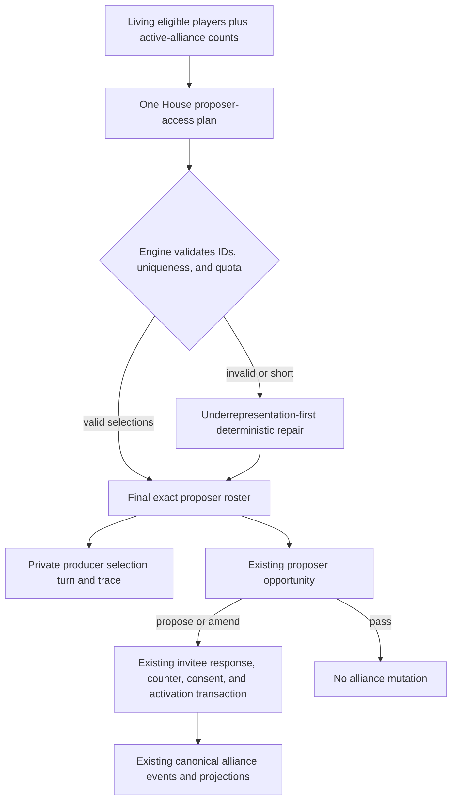

# refactor: House-selected alliance proposer opportunities

## Summary

Replace the all-living-player alliance proposer cadence with one compact House access plan per Format Mingle alliance-action window. The engine will finalize exactly `Math.ceil(alivePlayers / 4)` unique living proposers while leaving agent-authored terms and the existing invitation, counter, consent, amendment, and activation transaction unchanged.

---

## Problem Frame

The current alliance window gives every living player a provider-backed proposer opportunity even when most agents pass or create redundant alliances. R22 makes proposer access scarce and strategically curated without making The House an alliance author or weakening canonical event/projection authority.

---

## Requirements

### Selection contract

- R1. Each alliance-action window must finalize exactly `Math.ceil(alivePlayers / 4)` unique living proposers from the window's eligible roster.
- R2. The House must receive one compact candidate list containing player identity and active-alliance representation, with an instruction to prefer players who are underrepresented in active alliances.
- R3. The engine must drop unknown, eliminated, duplicate, and excess selections, cap valid unique eligible selections at the exact budget, then repair any shortfall deterministically by lowest active-alliance count and stable living-player order.
- R4. The finalized plan must retain a private producer rationale and repair diagnostics without creating a canonical alliance event or exposing the rationale to player/public lanes.

### Player-owned alliance behavior

- R5. Only finalized players receive proposer opportunities, and each selected agent retains the existing `propose`, `amend`, or `pass` choice with full ownership of members, name, purpose, timebox, and amendment target.
- R6. Invitees remain eligible for response and counter opportunities even when they were not selected as proposers, and the existing engine-owned lineage/version consent transaction must remain unchanged.
- R7. The House must not create, rewrite, activate, dissolve, enforce, prepopulate, or cap alliances; dormant or uninteresting alliances may remain unhuddled.

### Proof and documentation

- R8. Deterministic tests must prove cast-size budgets, eligibility validation and repair, underrepresentation preference in template/fallback/repair paths, private producer rationale, and selected-only proposer calls while preserving the existing alliance transaction regression suite.
- R9. Current operational and evaluation docs must describe House-selected proposer access, invitee independence, canonical authority, and the new producer-only selection artifact.
- R10. After deterministic and repository checks pass, one smallest current-meta API-backed comparison must report alliance-action calls and spend, House selection calls and spend, accepted alliance count, and huddle usefulness without using alliance compliance as a quality measure.

---

## Scope Boundaries

### In scope

- One House proposer-access plan in each Format Mingle alliance-action window.
- Deterministic quota enforcement and repair over living eligible players.
- A private House turn/trace artifact for selection rationale and repair evidence.
- Focused contract, integration, cost-cadence, documentation, and one-game current-meta validation.

### Outside R22

- Alliance deletion, hard membership caps, member or terms preselection, compliance scoring, or a second formation system.
- Changes to invitation response, counter caps, amendment consent, activation, huddle admission, huddle scheduling, or canonical alliance projections.
- R21 selective House summary work and R23 strategy-diff behavior.

---

## Key Technical Decisions

- KTD1. **Model selection as non-canonical access orchestration.** Emit one private `alliance-proposer-selection` House turn and private decision trace; keep official alliance truth exclusively in existing canonical `alliance.*` events and projections.
- KTD2. **Give The House candidates, not alliance terms.** Each candidate carries only living player ID, display name, and active-alliance count, which is sufficient to express the underrepresentation preference without member preselection.
- KTD3. **Validate every House result, then preserve engine cadence.** Treat valid unique eligible selections as an access set, cap it at the exact budget, fill shortfalls by underrepresentation-first stable order, and execute the finalized set in living-roster order so The House does not control transaction ordering.
- KTD4. **Change only the proposer roster.** Feed the finalized players into the existing proposer loop and leave `resolveAllianceProposalTransaction` unchanged so unselected invitees still accept, decline, defer, trial, counter, or pass against engine-owned proposal identity.
- KTD5. **Avoid the R23 agent seam unless implementation proves a gap.** `InfluenceAgent.getAllianceAction` already exposes only propose/amend/pass for proposer opportunities and preserves agent ownership of terms; R22 should not change strategy-delta semantics or add another action envelope.

---

## High-Level Technical Design

The selection artifact authorizes calls only. It never enters the alliance transaction as members, terms, consent, or enforcement state.

---

## Acceptance Examples

- AE1. **Cast-size quota:** Given 5 living players, when The House returns eligible IDs, then exactly 2 unique players receive proposer opportunities.
- AE2. **Malformed plan repair:** Given 9 living players and a House plan containing one eligible ID, a duplicate, an eliminated ID, and an unknown ID, then the engine retains the valid choice and fills to exactly 3 living proposers by lowest active-alliance count and stable roster order.
- AE3. **Invitee independence:** Given a selected proposer invites an unselected living player, when the unselected player accepts the engine-owned version, then the existing alliance activates without giving that invitee a separate proposer opportunity.
- AE4. **Agent decline:** Given a selected player chooses pass, then the private turn records the pass and no canonical alliance mutation occurs.
- AE5. **Privacy boundary:** Given a repaired House selection, then producer artifacts contain the rationale and repair notes while public/player-safe transcript and canonical alliance state contain neither.

---

## Implementation Units

### U1. Add the compact House proposer-access plan

- **Goal:** Add one structured House method that selects proposer access from a bounded living-player candidate list.
- **Requirements:** R1-R4, R7.
- **Dependencies:** None.
- **Files:**
  - `packages/engine/src/house-interviewer.ts`
  - `packages/engine/src/__tests__/house-interviewer-structured-output.test.ts`
  - `CONCEPTS.md`
- **Approach:** Add colocated candidate, context, item, and result types plus an `IHouseInterviewer` method. The hosted implementation requests strict structured output, records a private House trace, and falls back to deterministic underrepresentation-first selection. The template implementation follows the same deterministic order and supplies producer rationale. Define the House alliance proposer plan in the glossary as an access decision that owns no alliance facts.
- **Patterns to follow:** Existing `HouseMingleAssignment*`, `HouseAllianceHuddleSchedule*`, `callHouseJsonSchema`, private decision trace, and `TemplateHouseInterviewer` contracts.
- **Test scenarios:**
  - For cast sizes 1, 4, 5, 8, 9, and 12, the template plan returns the exact ceiling budget without duplicates.
  - Candidates with fewer active alliances sort before more-represented candidates, with input order breaking ties.
  - Strict structured output preserves selected IDs, per-player rationale, overall rationale, thinking, and reasoning context.
  - Malformed/refused provider output returns the deterministic underrepresentation-first fallback and an understandable producer rationale.
- **Verification:** House method tests prove bounded structured output, deterministic preference, fallback, and private rationale capture.

### U2. Finalize proposer access and reuse the existing transaction

- **Goal:** Validate the House plan, emit producer evidence, and call only the finalized proposer roster.
- **Requirements:** R1, R3-R8; covers AE1-AE5.
- **Dependencies:** U1.
- **Files:**
  - `packages/engine/src/phases/alliances.ts`
  - `packages/engine/src/__tests__/named-alliances-actions.test.ts`
  - `packages/engine/src/__tests__/named-alliances-integration.test.ts`
  - `packages/engine/src/__tests__/mock-agent.ts`
- **Execution note:** Start with selection and integration assertions that fail against the current all-player proposer loop.
- **Approach:** Snapshot living eligibility and active-alliance counts once at the start of the window, call The House once, finalize the exact roster, emit one private House selection turn, and substitute that roster for the current all-living-player loop. Later proposals or activations in the same window do not retroactively change the access plan. Do not route invited responders through the selected set and do not alter proposal application or transaction resolution.
- **Patterns to follow:** The validation/repair shape in `runAllianceHuddleWindow`, private House turns in `emitHuddleScheduleTurn`, and engine-owned response binding in `resolveAllianceProposalTransaction`.
- **Test scenarios:**
  - Covers AE1. Selected living players receive proposer calls and every unselected player receives none.
  - Covers AE2. Unknown, eliminated, duplicate, and over-budget results are dropped, then a short plan is repaired to the exact budget using underrepresentation-first stable order.
  - Covers AE3. An unselected invitee responds to the current proposal and activation/consent events match the pre-R22 transaction.
  - Covers AE4. A selected pass produces no canonical alliance mutation.
  - Covers AE5. The private House turn carries overall/per-player rationale and repair notes, while canonical events remain limited to existing alliance facts.
  - A selected invitee who responds earlier in the window still receives their later proposer opportunity in stable living-roster order.
  - Existing wrong-ID binding, duplicate-roster rejection, amendment consent, decline/defer continuation, trial consent, counter cap, and strategy-receipt tests retain their meaning with explicit selected rosters.
- **Verification:** Focused action and complete-round integration suites prove selected-only access and unchanged canonical alliance transactions.

### U3. Align cadence accounting and current documentation

- **Goal:** Make call-count expectations and operator guidance accurately describe R22.
- **Requirements:** R8-R9.
- **Dependencies:** U2.
- **Files:**
  - `packages/engine/src/__tests__/daily-cost-savings-model.test.ts`
  - `packages/engine/src/simulate.ts`
  - `README.md`
  - `DEVELOPMENT.md`
  - `docs/rules-page-content.md`
  - `docs/local-model-evaluation.md`
  - `docs/reasoning-transcript-observability.md`
- **Approach:** Count one House selection call plus the ceiling-sized proposer set, distinguish proposer calls from invited response/counter calls, and document selection rationale as producer-only evidence. Preserve the rule that House huddle scheduling may grant fewer than its separate maximum.
- **Patterns to follow:** Current simulation artifact documentation and the provider-free daily cost model's explicit call-accounting assumptions.
- **Test scenarios:**
  - An 8-player deterministic round records one House plan and exactly two proposer opportunities, while invited response and counter calls remain demand-driven within each existing proposal transaction.
  - Cost-model expectations treat the House selection as one retained provider call and do not claim that every alliance response disappeared.
- **Verification:** Cadence assertions and documentation agree on the exact selection formula, access-only authority, and observable action names.

### U4. Run the current-meta API-backed comparison

- **Goal:** Produce the smallest paid runtime evidence required to judge cost and alliance usefulness after deterministic proof.
- **Requirements:** R10.
- **Dependencies:** U1-U3 and passing focused/full checks.
- **Files:**
  - `docs/simulations/2026-08-19-r22-house-alliance-proposer-comparison.md`
- **Approach:** Run one current-meta API-lifecycle game with the project's configured hosted baseline and compare it to production game `used-lilac-ash` (completed 2026-08-18). The recorded baseline is 206 `alliance-action` calls, 2,167,304 tokens, and an estimated $0.27 in Admin Cost Detail; capture its engine/model provenance and the same metric sources through current authorized read surfaces before launching the candidate. Report alliance-window count, living-player count and finalized budget per window, raw and per-window selection/proposer/response/counter calls, provenance-aware spend, accepted/active alliance counts, huddles scheduled/completed, and whether outcomes contain concrete targets, actions, commitments, contingencies, confidence, or dissent. The checked-in report may contain only aggregate call/token/spend/alliance/huddle/provenance metrics and de-identified usefulness conclusions; exclude raw turns or traces, House rationale, thinking, reasoning context, prompts, provider responses, private source pointers, member-only huddle content, credentials, and unredacted Admin Cost Detail. Label the result as integration/watchability evidence rather than causal or population-wide proof.
- **Patterns to follow:** `docs/local-model-evaluation.md`, Admin Cost Detail provenance, and the three-level evaluation boundary in `docs/solutions/architecture-patterns/evaluate-prompt-context-in-three-levels.md`.
- **Test scenarios:**
  - The run completes through the durable API path and exposes selection/action evidence without parsing transcript prose into alliance facts.
  - Accepted alliance counts derive from canonical events/projections; call/spend derive from trace/cost records with actual-versus-estimate provenance.
  - Huddle usefulness is assessed from structured commitments and outcomes, never alliance compliance.
- **Verification:** The comparison report cites sanitized candidate evidence plus the `used-lilac-ash` canonical, turn/trace, and Admin Cost Detail reads; it records paid call count/spend, engine/model provenance, and any runtime limitation or unavailable metric. A privacy review confirms the committed report follows the export allowlist.

---

## System-Wide Impact

- **Canonical state:** No new canonical alliance fact or projection field; existing events remain the only authority for proposals, responses, amendments, activations, closures, huddles, and outcomes.
- **Privacy:** Selection rationale, thinking, reasoning context, and repair notes stay in producer/debug turns and private traces. Player/public lanes see only opportunities and already-authorized alliance facts.
- **Cost:** Each window adds one compact House call while reducing proposer calls from the living cast size to its ceiling quarter. Invited response/counter calls remain demand-driven and unchanged.
- **Sibling work:** R21 is likely to conflict in `packages/engine/src/house-interviewer.ts` and House structured-output tests. R23 is likely to conflict in `packages/engine/src/agent.ts` and shared observability docs; R22 intentionally avoids agent strategy changes.

---

## Risks and Dependencies

- A House result may be valid but ignore the underrepresentation preference. Keep the preference model-owned for valid plans while ensuring every fallback/repair follows the deterministic preference; runtime evidence should report the selected representation counts.
- Existing action tests assume all players become proposers. Update harness selection explicitly so transaction regressions do not accidentally become selection tests.
- A single current-meta game can establish runtime integration and inspect usefulness, but it cannot isolate causality or prove long-run alliance quality.
- The API-backed run depends on the local API, provider configuration, and admin cost evidence being available after deterministic checks; if any are unavailable, record the exact blocker without substituting a pure CLI run as API proof.

---

## Sources and Research

- `packages/engine/src/phases/alliances.ts` — current proposer loop, transaction resolution, huddle-plan validation, and private House evidence pattern.
- `packages/engine/src/house-interviewer.ts` — structured House contracts, deterministic fallbacks, and private decision trace pattern.
- `packages/engine/src/agent.ts` — existing proposer action schema and agent ownership of alliance terms.
- `docs/solutions/architecture-patterns/agent-strategy-observability-spine.md` — engine-owned proposal identity and cognition/gameplay authority separation.
- `docs/solutions/architecture-patterns/owner-scoped-alliance-read-models.md` — alliance privacy and audience lanes.
- `docs/solutions/architecture-patterns/evaluate-prompt-context-in-three-levels.md` — deterministic, targeted, and full-game evidence boundaries.
- Git history `48069a6c`, `70a30636`, and `1f1e9f3d` — named-alliance event model, Format Mingle integration, and hardened transaction identity.
