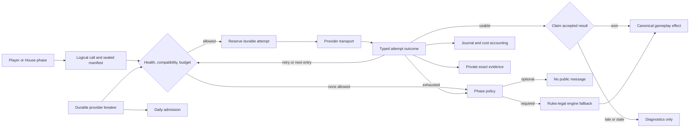
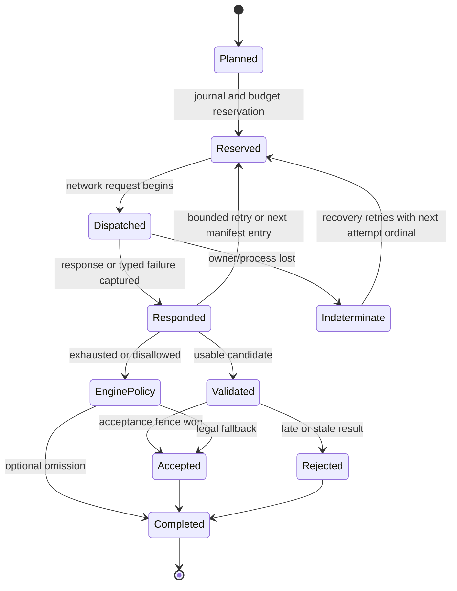

# feat: Preserve provider failures and keep games moving through bounded fallback

## Summary

Build one provider-execution path for player and House calls that records actionable failure evidence, returns typed outcomes, and advances through a game-sealed provider manifest under durable retry, budget, recovery, and circuit-breaker controls. Preserve existing OpenAI and Katana model access for manual and test games; qualification controls only which entries become unattended Daily defaults.

Deliver the work in layers: first make failures observable and remove fabricated dialogue, then cut game configuration over to ordered manifests and bounded fallback, and finally add systemic provider-health controls and qualify the Daily fallback models.

## Problem Frame

Successful calls already produce private decision traces, but a provider exception can happen before that trace exists. The exact rejected prompt, provider response, headers, and request ID are then unavailable to operators. Some exhausted calls are also converted into `[No response]`, making a provider failure look like player or House speech.

The engine and House currently own separate call paths, while retries are split among agent logic, OpenAI SDK defaults, and Flex handling. Adding fallback on top of those paths would multiply attempts and spend without a durable authority for retry ordinals, per-game budgets, accepted results, or provider health. Recovery can also redispatch an indeterminate remote call after a crash. That duplicate network request is acceptable, but canonical fencing must still admit only one gameplay effect.

## Requirements

The origin requirements remain authoritative. This plan preserves their IDs and incorporates the confirmed corrections to recovery and existing model access.

### Failure evidence and access

- R1. Preserve the exact non-rate-limit request body submitted to a provider, including prompts, authorized context, schemas, tools, reasoning settings, provider/model selection, and request parameters.
- R2. Preserve the exact non-rate-limit provider error response and relevant response headers, including request ID, status, and timestamp.
- R3. Correlate evidence to the game, logical call, actor, round, phase, action, provider attempt, and recovery or terminal outcome.
- R4. Write local-simulation evidence to run artifacts and API-game evidence through the existing private evidence authority.
- R5. Add no expiry, deletion, or historical cleanup behavior.
- R6. Treat raw evidence-storage failure as nonfatal diagnostics degradation.
- R7. Represent rate limits as provider/model counts and recovered-versus-exhausted outcomes instead of raw evidence for every attempt.
- R8. Retain the terminal reason and aggregate retry count when rate limits exhaust.
- R9. Show a provider-failures action for any admin game with inspectable evidence, including games that recovered.
- R10. Provide chronological summaries and expandable exact evidence in the per-game admin panel.
- R11. Distinguish recovered, terminal, transitioned, degraded, and rate-limited outcomes.
- R12. Permit admin and sysop web access through existing authorization.
- R13. Permit producer MCP callers to list/read evidence and read breaker state.
- R14. Keep breaker mutation and probes out of MCP.
- R15. Expose no private provider evidence through public, player, owner, transcript, or ordinary game-viewer surfaces.
- R16. Never persist credentials, authorization headers, cookies, or equivalent authentication material.

### Typed outcomes and legal continuation

- R17. Preserve refusal, rate limit, service error, transport timeout, authentication/configuration error, cancellation, empty output, malformed output, and undecodable structured output as distinct typed outcomes.
- R18. Remove `[No response]` and every equivalent synthetic player or House utterance produced by provider failure.
- R19. Let exhausted optional speech produce no transcript message or agent-authored state.
- R20. Give every required decision a deterministic, rules-legal engine fallback.
- R21. Commit an engine fallback through the normal canonical path so it affects tallies, history, and later strategy like any accepted action.
- R22. Label fallback provenance without fabricating model-authored rationale, thinking, strategy, or prose.
- R23. Apply the same outcome and fallback semantics to simulation and API games across player, House, speech, tool, and structured-decision calls.

### Manifest, failover, and recovery

- R24. Accept complete ordered manifests from the models already available through the OpenAI and Katana provider paths in web, API, CLI, and simulation creation surfaces.
- R25. Let creators add, remove, replace, and reorder entries before creation seals the game configuration.
- R26. Seal resolved provider/model identity, compatible settings, and fallback-call budgets into the game and its checkpoints.
- R27. Configure Daily with the current OpenAI primary, Katana `grok-4-5` secondary, and Katana `glm-5-2` tertiary.
- R28. Keep the exact `grok-4-5` and `glm-5-2` entries game-ready for Influence speech, structured decisions, and tools. Daily qualification is based on those capabilities and current price; model speed is not an admission criterion.
- R29. Start each logical call at the primary unless health, compatibility, or the game's remaining budget disallows it.
- R30. Advance immediately after a request-specific nonretryable refusal without resending the unchanged request to that provider.
- R31. Apply bounded same-provider retries to rate-limit, service, and transport outcomes before permitted failover.
- R32. Apply bounded repair/retry to empty, malformed, and undecodable results before permitted failover.
- R33. Never contact fallback after a usable primary result, and accept at most one provider or engine result per logical call.
- R34. Start the next logical call at primary after request-specific fallback unless health or budget disallows it.
- R35. Reconcile every attempt, transition, reason, usage, latency, and actual/estimated/unavailable cost in one durable logical-call chain.
- R36. Retry an indeterminate remote attempt after crash recovery when needed, while owner and acceptance fencing prevent duplicate gameplay effects.

### Budget and provider health

- R37. Give each fallback entry a configurable per-game call cap.
- R38. Once an entry exhausts its cap, skip that entry and continue through later compatible entries with remaining budget; omit optional calls or use a legal engine fallback only after every permitted entry is exhausted or disallowed.
- R39. Show used/remaining fallback calls and actual, estimated, or unavailable cost without making delayed currency totals the V1 cutoff.
- R40. Exclude request-specific policy refusals from provider-wide breaker health.
- R41. Open the affected breaker immediately for authentication/configuration failures and after a bounded threshold for repeated service or transport failures.
- R42. Pause new Daily admission when its primary breaker is open instead of automatically moving the Daily workload to expensive fallback.
- R43. Keep running games alive through omission and engine fallbacks when a systemic breaker disallows automatic cross-provider spending.
- R44. Allow explicit admin/sysop test games to use a healthy selected primary and manifest.
- R45. Require a successful admin/sysop probe to recover authentication/configuration breakers.
- R46. Let transient breakers become half-open after cooldown and grant one inexpensive probe lease; allow an admin/sysop to request the probe early.
- R47. Close only on a successful current-revision probe and retain new failure evidence when a probe fails.
- R48. Provide no blind force-close action.
- R49. Persist breaker state/reason across restart and expose it to admin/sysop web and read-only producer MCP access.

## Key Technical Decisions

- **Use one provider-attempt coordinator below gameplay policy.** `InfluenceAgent` and `HouseInterviewer` will prepare semantic calls and validate candidate outputs through a shared execution path. The coordinator classifies transport/provider outcomes, owns ordered attempts, and emits attempt records; it does not invent speeches or legal moves.
- **Keep legal fallback in the phase that owns the rule.** The format or game phase selects a deterministic legal action from current canonical state. This preserves rules authority and prevents a generic provider layer from guessing target eligibility or fabricating strategy.
- **Separate successful decision traces, attempt authority, spend projection, and raw evidence.** Successful `PrivateDecisionTrace` remains unchanged. A compact durable call journal controls dispatch, budgets, recovery, and accepted-result claims and retains the usage/cost facts needed to project idempotently into existing spend accounting. Exact sanitized payloads stay in private evidence storage, whose failure remains nonfatal.
- **Capture at the transport seam.** Record the fully prepared body and a transient sanitized raw response envelope for every attempt before SDK parsing or validation consumes it; persist the raw response only when the attempt is unusable. Build the envelope from allowlisted fields, remove configured credential values and auth-bearing URL parameters even when reflected by a provider, and never log the unsanitized value.
- **Make Influence the sole retry authority without creating a retry gap.** The shared coordinator replaces SDK/Flex/agent retries with an equivalent bounded single-entry policy in the same cutover. Manifest traversal and cross-provider budgets layer onto that working retry path later.
- **Reserve authority before dispatch.** A remote request requires a durable attempt reservation and, for fallback entries, an atomic budget reservation. If authority storage is unavailable, do not make an untracked call; continue the game through omission or a legal engine fallback. Raw-evidence degradation remains nonfatal, while spend projection retries from journaled usage/cost facts.
- **Make logical-call identity phase-owned and durable.** The game phase allocates a stable actor/action/call ordinal before invocation, checkpoints it, and passes it through player and House calls. Journal uniqueness uses game, logical call, and attempt ordinal rather than a UUID minted after response.
- **Persist the accepted gameplay command at the correctness boundary.** Validation produces a bounded phase-owned canonical command and provenance, not a raw provider response. The accepted-result fence and idempotent command handoff share one transaction/outbox boundary so recovery can complete canonical commit without redispatching an already accepted action.
- **Accept one gameplay effect, not one remote execution.** Recovery reuses the logical-call identity and accepted-result fence. An indeterminate request may be dispatched again with a new attempt ordinal, but stale owners and late responses cannot create a second canonical action.
- **Make the sealed manifest the only new-runtime model-execution authority through expand-contract rollout.** Add and backfill manifests first. During the blue/green restoration window, new code reads the manifest but also writes the legacy primary projection so the old image can recover a new game. Remove that projection and old runtime path in the contract step after the old image is no longer a restoration target.
- **Resolve a multi-provider runtime at game startup.** The sealed manifest contains no credentials. Runtime builds one client/config per referenced provider profile and compiles each semantic player or House call for the selected entry's capabilities instead of retaining one immutable primary-bound client.
- **Preserve existing model access.** An authenticated inventory read combines existing OpenAI/Katana model availability with catalog capability metadata for web/CLI selection, while validated explicit IDs remain available for tests. Capability checks determine whether an entry can execute a call; live qualification governs only unattended Daily defaults.
- **Keep seat identity stable across fallback.** Agent revision and seat identity continue to reflect the sealed primary/personality configuration. A fallback response is attempt provenance, not a new agent identity.
- **Use a durable fenced breaker per provider configuration authority.** Breaker state uses revisioned database transitions and a single expiring probe lease. Provider-specific classifiers distinguish policy, auth/configuration, entry incompatibility, service, transport, and ambiguous 4xx outcomes. Attempt reservation conditions on the observed breaker revision, and only the probe lease may reserve while half-open; calls reserved before a later open may finish.
- **Block systemic automatic spending at the Daily boundary.** An open Daily primary stops new Daily claims. Running Daily/default games omit optional calls and use engine fallbacks instead of spilling automatically into expensive entries; explicit test games use their chosen healthy manifests.
- **Reuse native authorization surfaces with current-role checks.** Admin/sysop evidence reads and provider-health mutations re-resolve current DB authority rather than trusting long-lived JWT role claims. Raw producer MCP reads retain OAuth scope plus current producer role. A native provider-health mutation permission belongs to admin and sysop; breaker mutation remains audited and web-only.
- **Treat provider evidence as untrusted data, not instructions.** Admin renders raw content as escaped plain text without HTML, Markdown, linkification, or executable preview. MCP marks raw content as untrusted provider evidence so developer agents do not treat embedded text as instructions.
- **Enforce server-owned execution ceilings.** Client manifests and budgets remain configurable within API-owned bounds for manifest length, entry caps, retries/repairs, timeouts, reasoning settings, and total possible dispatches. These limits do not reduce which OpenAI/Katana models may be selected.

## High-Level Technical Design

### Logical-call lifecycle

The diagrams are behavioral guidance, not prescribed database enum names or method signatures.

## Context and Research

### Existing patterns to extend

- `packages/engine/src/agent.ts` and `packages/engine/src/house-interviewer.ts` both emit rich successful traces only after a response exists. Their separate thrown-error and `[No response]` paths are the consolidation target.
- `packages/engine/src/formats/agent-surface.ts` already validates a provider candidate and lets format-owned policy repair or choose a deterministic legal fallback. Extend that authority model rather than moving legality into the provider layer.
- `packages/api/src/services/private-trace-writer.ts` and `private-trace-read-model.ts` already provide private object evidence, compact manifests, ranged content reads, and nonfatal degradation.
- `packages/api/src/services/provider-cost-accounting.ts` and `game_provider_spend_entries` already provide idempotent attempt-oriented cost records. Extend them instead of building a fallback-specific ledger.
- `packages/api/src/services/game-checkpoints.ts`, `game-recovery.ts`, and owner fencing already prevent a stale runner from accepting canonical work. Apply the same fence after every awaited provider call.
- `packages/api/src/services/deployment-admission.ts` demonstrates durable, fail-closed, concurrency-safe operational state suitable for provider breaker design.
- `packages/web/src/app/admin/games/game-history-browser.tsx` and `admin-cost-view.tsx` provide the existing per-game action and accessible panel patterns.
- `packages/api/src/game-mcp/server.ts` and related policy/read-model modules already enforce producer OAuth scope plus current producer role for private evidence.

### Institutional learnings applied

- Remote model execution cannot be exactly once without provider-supported idempotency. This plan records attempts durably and accepts one effect while honoring the confirmed policy to retry indeterminate calls.
- Raw private evidence needs compact listings and bounded/continuable content reads; a response-size cap must never be presented as the complete corpus.
- Actual, estimated, native-unit, and unavailable costs are distinct states. Katana/open-source attempts must not inherit OpenAI pricing when the router does not provide reliable cost.
- Provider output is a candidate. Canonical events record accepted gameplay, private evidence records attempts, and public transcript records only delivered speech.
- A sealed game must have one model-execution authority. Default changes after creation cannot alter recovery behavior.

### External dependency behavior

- The pinned OpenAI Node SDK exposes status, parsed error data, response headers, and request IDs on `APIError`, but parsed errors are not guaranteed to retain byte-exact response bodies.
- The SDK retries connection failures, selected statuses, rate limits, and server failures by default. Coordinated gameplay calls must set retries to zero so Influence owns and accounts for every dispatch.
- Request-level timeout and abort signals remain transport controls; caller/owner cancellation must not be misclassified as a retryable provider timeout.
- Reference: [OpenAI Node configuration](https://github.com/openai/openai-node/blob/main/docs/configuration.md).

## Implementation Units

### Phase 1: observable provider outcomes and honest gameplay

### U1. Introduce the shared provider-attempt contract and transport boundary

- **Goal:** Give player and House calls one typed, observable provider-execution seam while preserving current bounded same-provider retry behavior.
- **Requirements:** R1-R3, R16-R17 and the typed-outcome portion of R23. Supports F1-F2 and AE1, AE3-AE4.
- **Dependencies:** None.
- **Files:**
  - `packages/engine/src/provider-execution.ts` (new)
  - `packages/engine/src/game-runner.types.ts`
  - `packages/engine/src/llm-client.ts`
  - `packages/engine/src/agent.ts`
  - `packages/engine/src/house-interviewer.ts`
  - `packages/engine/src/index.ts`
  - `packages/engine/src/__tests__/llm-client.test.ts`
  - `packages/engine/src/__tests__/agent-structured-output.test.ts`
  - `packages/engine/src/__tests__/house-interviewer-structured-output.test.ts`
- **Approach:** Define the phase-allocated logical-call coordinate, attempt ordinals, prepared-request evidence, the complete typed outcome taxonomy, and coordinator hooks for reservation, terminal recording, and evidence emission. Move both player and House transports behind this seam. Capture a transient sanitized raw envelope for HTTP errors and successful-but-unusable responses before normalization/validation. Replace SDK/Flex/agent retries with an equivalent bounded single-entry coordinator policy in the same cutover. Keep `PrivateDecisionTrace` as the successful accepted-decision contract.
- **Test scenarios:**
  - A provider refusal thrown before any model response produces a typed refusal with the exact prepared body, raw non-auth headers/body, and request ID.
  - HTTP 200 empty, malformed, wrong-tool, and undecodable responses retain their exact sanitized raw response when classified as unusable.
  - Authentication, rate-limit, service, timeout, cancellation, empty, malformed, and undecodable outcomes remain distinct.
  - Authorization headers, API keys, cookies, and equivalent credentials are absent from attempt evidence.
  - The coordinator preserves the current bounded retry outcome while each actual dispatch receives one visible attempt ordinal and the SDK performs no hidden retry.
  - Owner cancellation stops the chain, while a provider timeout remains eligible for the configured retry policy.
  - Player and House calls emit the same outcome contract for equivalent failures.
- **Verification:** Mock transports prove every failure class is observable before gameplay policy handles it, with no hidden network retry and no credential material in evidence.

### U2. Add durable call journaling, exact failure evidence, and attempt accounting

- **Goal:** Persist the compact authority needed for dispatch/recovery and the private evidence needed for diagnosis without coupling gameplay completion to object storage.
- **Requirements:** R1-R8, R16, R35-R36. Supports F1, F4 and AE1, AE3-AE5, AE11-AE12.
- **Dependencies:** U1.
- **Files:**
  - `packages/api/src/db/schema.ts`
  - `packages/api/drizzle/<next-generated-migration>.sql`
  - `packages/api/src/services/provider-call-journal.ts` (new)
  - `packages/api/src/services/private-trace-writer.ts`
  - `packages/api/src/services/private-trace-read-model.ts`
  - `packages/api/src/services/provider-cost-accounting.ts`
  - `packages/api/src/services/game-lifecycle.ts`
  - `packages/engine/src/simulate.ts`
  - `packages/engine/src/api-simulate.ts`
  - `packages/api/src/__tests__/private-trace-writer.test.ts`
  - `packages/api/src/services/provider-cost-accounting.test.ts`
  - `packages/api/src/__tests__/game-lifecycle.test.ts`
- **Approach:** Add an immutable logical-call/attempt journal with deterministic uniqueness from the phase-owned call coordinate. Implement API and local-simulation adapters for the coordinator hooks. Use deterministic private-object keys per attempt, compact manifests for listing, and bounded continuable content reads for exact payloads. Write recovered rate limits as aggregate activity rather than raw objects. Retain usage/cost facts in the authoritative journal/outbox and project them idempotently into the existing spend ledger with actual/estimated/unavailable semantics. Raw evidence failure marks diagnostics degraded and continues; failure to reserve the authoritative attempt prevents network dispatch. Budget reservation joins this journal in U6 after sealed entry identity exists.
- **Test scenarios:**
  - Reserving the same logical call and attempt twice cannot create duplicate authoritative rows.
  - Raw object retry uses the same attempt key and does not create duplicate manifests or orphan a second object.
  - Evidence-object failure marks diagnostics degraded while a permitted fallback or engine outcome continues.
  - Journal reservation failure makes no provider request and returns control to gameplay policy.
  - Recovered rate limits yield one compact aggregate with the correct count; exhausted rate limits retain their terminal reason.
  - A spend-projection failure leaves journaled usage/cost pending and later reconciles idempotently without inventing unknown Katana costs.
  - Local simulation artifacts contain the same sanitized attempt envelope as API private evidence.
- **Verification:** PostgreSQL tests prove idempotent reservations, deterministic evidence keys, recovery-safe attempt ordinals, eventual spend reconciliation, and nonfatal raw-storage degradation.

### U3. Remove synthetic failure dialogue and complete the legal fallback matrix

- **Goal:** Ensure provider exhaustion never fabricates speech or strands a required game action.
- **Requirements:** R17-R23, R33, R38, R43. Supports F2-F3 and AE6-AE8, AE10.
- **Dependencies:** U1, U2.
- **Files:**
  - `packages/engine/src/agent.ts`
  - `packages/engine/src/house-interviewer.ts`
  - `packages/engine/src/formats/agent-surface.ts`
  - `packages/engine/src/game-engine.ts`
  - `packages/engine/src/game-runner.types.ts`
  - `packages/engine/src/strategy-update.ts`
  - `packages/engine/src/__tests__/agent-structured-output.test.ts`
  - `packages/engine/src/__tests__/house-interviewer-structured-output.test.ts`
  - `packages/engine/src/__tests__/game-engine.test.ts`
  - `packages/engine/src/__tests__/format-kernel-integration.test.ts`
- **Approach:** Inventory every player and House call as optional speech/narration or a required decision. Delete `[No response]`, synthetic error prose, and fabricated thinking. Optional exhaustion returns typed absence and writes no transcript or agent-authored strategic state. Each required call delegates to its phase's canonical legality rules for a seeded/replayable choice, then commits with explicit fallback source/reason and without a model decision ID or rationale. Preserve fallback decisions as real history for later eligibility and strategy.
- **Test scenarios:**
  - Exhausted Mingle speech produces no transcript entry and the phase continues.
  - Exhausted required voting chooses only among that voter's legal targets, commits one ballot, and affects later restricted-history eligibility.
  - Required nomination, save/override, tie-break, target, and tool-backed actions each have a legal deterministic continuation.
  - A fallback action has canonical and strategy-history consequences but no model-authored thinking, prose, strategy delta, or decision ID.
  - A late successful provider response after fallback cannot replace or duplicate the accepted action.
  - Repository search and tests show no provider-failure path emits `[No response]` or an equivalent placeholder.
- **Verification:** Deterministic engine suites exercise every required action class and prove optional absence, legal fallback, honest provenance, and exactly one accepted canonical effect.

### U4. Expose per-game provider failures to authorized web and MCP callers

- **Goal:** Let operators diagnose all relevant failures from the game they affected without widening private evidence authority.
- **Requirements:** R9-R16. Supports F4 and AE1, AE3-AE5, AE12.
- **Dependencies:** U2.
- **Files:**
  - `packages/api/src/routes/admin.ts`
  - `packages/api/src/game-mcp/server.ts`
  - `packages/api/src/game-mcp/read-model.ts`
  - `packages/api/src/game-mcp/tool-authorization.ts`
  - `packages/api/src/services/mcp-scope-policy.ts`
  - `packages/api/src/services/private-trace-read-model.ts`
  - `packages/web/src/app/admin/games/game-history-browser.tsx`
  - `packages/web/src/app/admin/admin-provider-failures-view.tsx` (new)
  - `packages/web/src/lib/api.ts`
  - `packages/api/src/__tests__/admin-routes.test.ts`
  - `packages/api/src/__tests__/production-game-mcp-server.test.ts`
  - `packages/web/src/app/admin/games/game-history-browser.test.tsx`
- **Approach:** Add one batched per-game failure summary to the existing admin list, then lazy-load chronological details and bounded raw content into an accessible panel. Distinguish list loading, zero, failures, and unavailable-with-retry states; panel loading, empty, error, degraded, and results states; and raw collapsed, loading, complete, partial-with-byte-disclosure, continuation-error, and permanently unavailable states. Never render a failed summary load as zero failures. Render raw evidence as escaped plain text. Route provider-failure manifests through the existing generic MCP manifest/content tools with a purpose/type filter where needed, mark results as untrusted provider evidence, audit raw reads, and return no-store responses. Re-resolve current admin/sysop DB authority on every read and preserve producer scope plus current-role authorization.
- **Test scenarios:**
  - A completed game with a recovered provider refusal still shows the provider-failures action and correct count.
  - The admin panel distinguishes exact non-429 evidence from aggregate recovered/exhausted 429 activity.
  - Large evidence can be read in bounded continuation without claiming truncated bytes are the complete payload.
  - Summary, panel, and raw-content load failures remain distinguishable from genuinely empty evidence and offer non-destructive retry.
  - Keyboard focus enters the panel, returns to the invoking game action on close, and loading/terminal changes are announced accessibly.
  - Admin and sysop may read; revoking that role invalidates the same still-live token's next read; ordinary authenticated users, game owners, players, and anonymous callers cannot.
  - Producer MCP requires both OAuth producer scope and current producer role; `games:read` or subject ownership alone is insufficient.
  - Raw admin/MCP reads are audited, no-store, contain no credentials, remain inert under XSS fixtures, and carry an MCP untrusted-content marker under instruction-injection fixtures.
- **Verification:** API, web, and MCP tests prove usable operator inspection and negative authorization/privacy boundaries with no N+1 game-list reads.

### Phase 2: sealed manifests and bounded fallback

### U5. Cut game creation and persistence over to one sealed provider manifest

- **Goal:** Replace the single model-selection authority with an ordered recoverable manifest while preserving the existing OpenAI and Katana model choices.
- **Requirements:** R24-R28, R36-R39. Supports F1-F3 and AE1-AE2, AE10-AE11.
- **Dependencies:** U1.
- **Files:**
  - `packages/engine/src/model-catalog.ts`
  - `packages/engine/src/simulate.ts`
  - `packages/engine/src/api-simulate.ts`
  - `packages/engine/src/game-runner.types.ts`
  - `packages/api/src/routes/games.ts`
  - `packages/api/src/routes/provider-models.ts` (new)
  - `packages/api/src/routes/free-queue.ts`
  - `packages/api/src/services/game-lifecycle.ts`
  - `packages/api/src/services/owned-seat-projection.ts`
  - `packages/api/src/services/agent-revisions.ts`
  - `packages/api/src/db/schema.ts`
  - `packages/api/drizzle/<next-generated-migration>.sql`
  - `packages/web/src/app/admin/games/new/create-game-form.tsx`
  - `packages/web/src/lib/api.ts`
  - `packages/engine/src/__tests__/model-catalog.test.ts`
  - `packages/api/src/__tests__/games-api.test.ts`
  - `packages/api/src/__tests__/provider-models-api.test.ts` (new)
  - `packages/web/src/app/admin/games/new/create-game-form.test.tsx`
- **Approach:** Add the manifest and backfill existing game JSON to one entry while preserving the legacy primary projection only for the bounded blue/green restoration window. New runtime reads the manifest; old runtime can still recover games written during overlap. Resolve one runtime client/config per referenced provider profile at game startup without sealing credentials. Add an authenticated inventory endpoint that combines existing OpenAI/Katana availability with catalog capability metadata and accepts validated explicit IDs for test games when provider listing is unavailable. Store compatible settings and per-entry caps, subject to API-owned bounds for manifest length, caps, retries/repairs, timeouts, reasoning settings, and total dispatches. Build the web editor as an ordered list with primary/fallback labels, Move Up/Down controls in addition to any drag affordance, predictable focus after add/remove, entry-scoped errors, and narrow-screen clarity. Freeze Daily configuration at creation. U5 schema/backfill may land additively, but manifest-only writes/reads activate atomically with U6's manifest-capable execution; remove the legacy projection after the old image leaves the restoration set.
- **Test scenarios:**
  - Web, API, CLI, and local simulation accept equivalent ordered manifests and reject empty, duplicate, invalid, or incompatible entries with actionable errors.
  - Existing OpenAI and Katana model choices remain selectable for manual/test games.
  - Provider inventory unavailable returns an explicit recoverable state and still permits authorized validated explicit-ID testing rather than presenting an empty catalog as complete.
  - Oversized manifests, caps, retry counts, timeouts, reasoning settings, total-dispatch budgets, and integer-overflow values are rejected by the API regardless of client input.
  - Reordering, adding, removing, and replacing entries changes only the new game's sealed configuration.
  - Keyboard-only and narrow-viewport interaction can reorder, validate, add, and remove entries with stable focus and visible primary/fallback meaning.
  - A catalog/default change after game creation cannot alter an existing game's manifest or recovery.
  - During blue/green overlap, an old runtime can resume a new game's legacy primary projection while the new runtime uses the manifest; after contract cleanup no new-runtime `modelSelection` authority remains.
  - A fallback answer does not rewrite owned-seat or agent-revision identity.
- **Verification:** Type/API/UI tests and a migration fixture prove one authoritative manifest across every creation and recovery surface without reducing existing model access.

### U6. Execute centralized retries, provider transitions, budgets, and crash recovery

- **Goal:** Make the coordinator run each logical call through its sealed manifest with bounded spend and one accepted outcome.
- **Requirements:** R29-R39. Supports F1-F2 and AE1-AE4, AE7, AE10-AE11.
- **Dependencies:** U1, U2, U3, U5.
- **Files:**
  - `packages/engine/src/provider-execution.ts`
  - `packages/engine/src/agent.ts`
  - `packages/engine/src/house-interviewer.ts`
  - `packages/api/src/services/provider-call-journal.ts`
  - `packages/api/src/services/game-checkpoints.ts`
  - `packages/api/src/services/game-recovery.ts`
  - `packages/api/src/services/game-recovery-support.ts`
  - `packages/api/src/services/provider-cost-accounting.ts`
  - `packages/api/src/routes/admin.ts`
  - `packages/web/src/app/admin/admin-provider-failures-view.tsx`
  - `packages/api/src/__tests__/game-recovery.test.ts`
  - `packages/api/src/__tests__/game-lifecycle.test.ts`
  - `packages/engine/src/__tests__/agent-structured-output.test.ts`
- **Approach:** Add manifest traversal and bounded per-outcome retry/repair policy to the already-working single-entry coordinator. Atomically reserve every fallback dispatch against its sealed entry cap, including retries and repairs; never refund a dispatched unit. Skip an exhausted entry and continue to later compatible entries with budget, using engine policy only when all permitted entries are exhausted/disallowed. Start each new call at primary, move immediately on request-specific refusal, and reset to primary for the next call. The phase checkpoints a stable actor/action/call ordinal before invocation. Validation writes a bounded canonical gameplay command and provenance; the accepted-result fence and idempotent command handoff share one transaction/outbox boundary, and canonical events reference that identity. On recovery, finish a persisted accepted command or committed action; retry an indeterminate dispatch with a new attempt ordinal under the confirmed policy. Extend the admin failure panel with used/cap, remaining calls, and explicitly actual/estimated/unavailable cost per relevant entry.
- **Test scenarios:**
  - A usable primary result performs no fallback call and records one accepted attempt.
  - A request-specific refusal falls through immediately, records exact evidence, and the following logical call returns to primary.
  - Retryable rate-limit/service/transport outcomes consume bounded same-provider attempts before transition.
  - Empty/malformed structured output uses bounded repair before transition.
  - Two concurrent workers racing the final budget unit permit one dispatch and send the other to engine policy.
  - Exhausting Grok skips it and reaches the tertiary entry when that entry remains permitted; omission/engine fallback begins only after all permitted entries are unavailable.
  - A crash before dispatch, after dispatch, after validated-command persistence, after acceptance claim, during canonical handoff, and after canonical commit each resumes correctly.
  - An indeterminate remote call may repeat after recovery, but late/stale responses and owner changes cannot create a second accepted action.
  - A failed evidence write does not duplicate or fail gameplay, a failed spend projection later reconciles from the journal, and failed authoritative reservation makes no provider call.
  - The admin panel shows partial and exhausted budgets, remaining calls, and actual/estimated/unavailable cost without rendering unavailable cost as zero.
- **Verification:** Deterministic and PostgreSQL recovery tests prove ordered fallback, exact budget consumption, owner fencing, attempt reconciliation, and one canonical effect through every crash boundary.

### Phase 3: systemic provider health and operator recovery

### U7. Add the durable provider circuit breaker and Daily admission policy

- **Goal:** Contain systemic provider failure without shifting Daily onto uncontrolled expensive fallback or stopping running games.
- **Requirements:** R40-R49. Supports F3 and AE8-AE9.
- **Dependencies:** U2, U3, U6.
- **Files:**
  - `packages/api/src/db/schema.ts`
  - `packages/api/drizzle/<next-generated-migration>.sql`
  - `packages/api/src/services/provider-health.ts` (new)
  - `packages/api/src/services/game-lifecycle.ts`
  - `packages/api/src/routes/free-queue.ts`
  - `packages/engine/src/provider-execution.ts`
  - `packages/api/src/__tests__/free-queue.test.ts`
  - `packages/api/src/__tests__/game-lifecycle.test.ts`
  - `packages/api/src/services/provider-health.test.ts` (new)
- **Approach:** Persist revisioned closed/open/probing state, classified reason, counters/window, cooldown, and one expiring probe lease per provider configuration authority. Define provider-profile-specific classifier precedence using transport cause, status, provider type/code, and request context; ambiguous 4xx outcomes remain call/entry-scoped without corroboration. Use atomic transitions so stale failures or probes cannot overwrite a newer revision. Auth/config failures open immediately and require a successful requested probe. Repeated service/transport failures can open transient state; all 429s remain per-call retry/accounting inputs and never open the V1 breaker. Make attempt reservation conditional on the current observed breaker revision in the same transaction; only the probe token reserves while probing, while requests already reserved before a later open may finish. Recheck health when Daily atomically claims a game. Once open, new Daily games remain waiting; affected running games avoid automatic cross-provider spending and return to engine policy.
- **Test scenarios:**
  - One request-specific refusal leaves provider health closed.
  - OpenAI/Katana fixtures distinguish invalid prompt, invalid schema/tool, unknown model, authentication/authorization, service, transport, and ambiguous 4xx outcomes without poisoning unrelated entries.
  - Recovered and exhausted 429 activity never opens the V1 provider breaker.
  - Authentication/configuration failure opens immediately and remains open across restart until a successful current-revision probe.
  - Repeated transient failures open only at the configured threshold; cooldown grants one half-open probe lease.
  - Concurrent probe requests execute one provider probe, and lease expiry allows recovery after a crashed probe.
  - A stale probe response cannot close a breaker whose revision changed while the probe ran.
  - Opening between health observation and reservation blocks a new ordinary call; half-open state admits only the matching probe lease; an already-reserved call may finish.
  - Daily health check and claim are race-safe: opening before claim leaves the game waiting; opening after claim treats it as running.
  - Running games omit optional calls and use engine fallbacks without failing when systemic automatic fallback is disabled.
- **Verification:** PostgreSQL concurrency and lifecycle tests prove durable breaker state, fenced probing, correct failure classification, and fail-closed Daily admission.

### U8. Add provider-health controls to admin and read-only MCP inspection

- **Goal:** Give authorized operators enough state and evidence to repair and safely close a provider breaker.
- **Requirements:** R12-R14, R39, R45-R49. Supports F3-F4 and AE8-AE9, AE12.
- **Dependencies:** U4, U7.
- **Files:**
  - `packages/api/src/routes/admin.ts`
  - `packages/api/src/db/rbac-seed.ts`
  - `packages/api/src/game-mcp/server.ts`
  - `packages/api/src/game-mcp/read-model.ts`
  - `packages/api/src/game-mcp/tool-authorization.ts`
  - `packages/web/src/app/admin/admin-panel.tsx`
  - `packages/web/src/app/admin/admin-provider-health-view.tsx` (new)
  - `packages/web/src/lib/api.ts`
  - `packages/api/src/__tests__/admin-routes.test.ts`
  - `packages/api/src/__tests__/production-game-mcp-server.test.ts`
  - `packages/web/src/app/admin/admin-panel.test.tsx`
- **Approach:** Add a native provider-health mutation permission seeded to admin and sysop, while reads retain the existing admin view permission. Re-resolve current DB authority for each read and mutation. Give Provider Health a stable Admin entry showing provider scope, breaker reason, affected Daily admission, last change, cooldown/probe state, lease ownership, and evidence. Label the action to make its consequence clear: it performs one live probe and successful completion resumes eligible Daily admission. While probing, disable repeat activation. Success announces restored health/admission; failure remains open with updated evidence. Expired leases, stale results, load errors, and concurrent requests remain non-destructive and retryable. MCP exposes only status/evidence links through existing producer authorization.
- **Test scenarios:**
  - Admin/sysop can inspect and request a probe; revoking the role invalidates the same token's next action; all other roles and read-only tokens cannot mutate health.
  - No blind force-close endpoint or UI path exists.
  - A successful current probe closes and resumes eligible Daily admission; a failed probe stays open with updated evidence.
  - Two operators requesting reset concurrently produce one probe.
  - Probe start, lease contention, success, failure, stale result, and load error each have accessible status announcements and keyboard focus behavior.
  - Producer MCP can read current state but cannot discover or invoke a reset tool.
  - Public, owner, player, and ordinary game reads expose no breaker diagnostics.
- **Verification:** API/web/MCP tests prove probe-backed recovery, authorization, concurrency, auditability, and read-only developer access.

### Phase 4: qualify and activate the Daily defaults

### U9. Validate Grok 4.5 and GLM 5.2, then activate Daily defaults

- **Goal:** Validate the selected Daily fallback entries and derive operating limits from observed Influence behavior instead of model-name assumptions.
- **Requirements:** R27-R28, R31-R32, R37, R41, R46. Supports F1-F3 and AE1-AE4, AE8-AE10.
- **Dependencies:** U1-U8.
- **Files:**
  - `packages/engine/src/model-catalog.ts`
  - `packages/engine/src/__tests__/full-game.live-provider.test.ts`
  - `packages/engine/src/__tests__/model-catalog.test.ts`
  - `packages/api/src/routes/free-queue.ts`
  - `docs/local-model-evaluation.md`
  - `DEVELOPMENT.md`
  - `README.md`
- **Approach:** Probe current Katana availability and validate exact `grok-4-5` and `glm-5-2` entries against ordinary speech, required structured actions, tool/schema compatibility, refusal behavior, gameplay quality, and real usage/cost. Derive fallback caps, retry thresholds, and cooldowns from this evidence. Admit only those validated exact entries to the unattended Daily default while leaving existing OpenAI/Katana selection available for explicit manual/test games. Do not use response speed as a model-selection gate.
- **Test scenarios:**
  - `grok-4-5` completes representative optional speech, required legal decisions, and structured/tool calls through the production request shape.
  - `glm-5-2` completes the same Influence capability contracts; unavailable or incompatible entries fail validation rather than silently skipping.
  - Cost evidence distinguishes actual, estimated, and unavailable values and supports the chosen call caps.
  - The selected Daily manifest is ordered OpenAI, `grok-4-5`, then `glm-5-2`, with bounded fallback caps.
  - Daily refuses to claim when its primary breaker is open; an explicit test game may still choose another healthy OpenAI/Katana manifest.
- **Verification:** Provider-backed acceptance produces reproducible evidence for the exact model IDs and operating parameters; deterministic and DB tests remain separate and green before the Daily default is activated.

### U10. Align observability, operator, and strategy documentation

- **Goal:** Make the new evidence, fallback provenance, provider controls, and existing open-model posture understandable to maintainers and operators.
- **Requirements:** R1-R49. Supports F1-F4.
- **Dependencies:** U1-U9.
- **Files:**
  - `STRATEGY.md`
  - `CONCEPTS.md`
  - `docs/reasoning-transcript-observability.md`
  - `docs/local-model-evaluation.md`
  - `docs/game-mcp-production-oauth.md`
  - `DEVELOPMENT.md`
  - `README.md`
  - `packages/engine/src/simulate.ts`
- **Approach:** Document the four authorities: accepted canonical gameplay, successful decision traces, provider-attempt evidence, and spend/health state. Explain optional absence, engine-fallback provenance, admin and producer-MCP privacy boundaries, breaker probing, Daily pause behavior, manifest sealing, crash retry semantics, and qualification evidence. Correct the stale strategy statement so it recognizes existing OpenAI/Katana model access while limiting unattended Daily defaults to qualified entries. Update simulator JSDoc and operating docs whenever decision surfaces or evidence formats change.
- **Test scenarios:**
  - Documentation examples describe an invalid-prompt recovery, all-provider exhaustion, systemic breaker, admin probe, and crash retry without promising exactly-once remote inference.
  - Role documentation distinguishes admin/sysop web access from producer OAuth-plus-role MCP access and explicitly excludes players/public users.
  - Model documentation distinguishes existing manual/test access from qualification of Daily defaults.
- **Verification:** Documentation matches shipped contracts and UI/tool names, contains no stale `[No response]` or single-selection guidance, and records the runtime/provider acceptance boundary.

## System-Wide Impact

### Data and recovery

- New compact journal and breaker records become correctness authorities and require migration, uniqueness constraints, revision fencing, and backup/restore parity.
- API-game raw request/response bodies remain in existing private object storage, while local simulations write equivalent sanitized evidence to run artifacts; deterministic keys and manifests prevent duplicate evidence from retries.
- Existing game configuration JSON is backfilled additively to one-entry manifests. The legacy primary projection remains only through the blue/green restoration window and is removed in the later contract step.
- Bounded validated gameplay commands and their logical-call identity cross the accepted-result/canonical-event boundary through one transactional handoff.
- Recovery may repeat an indeterminate billable call but cannot accept a stale owner result or a second canonical effect.

### Security and privacy

- Provider evidence can contain every player's private context. Capture uses an allowlisted envelope plus reflected-credential redaction; all reads are inert, no-store, audited, bounded, and protected by current DB admin/sysop or producer-scope-plus-role authority.
- Public errors expose safe classifications only. Request IDs, headers, prompts, breaker reasons, and raw responses stay private.
- Provider-health mutation uses the new native permission seeded to admin and sysop and never becomes an MCP capability.

### Performance and cost

- Exact evidence is written off the accepted gameplay path where possible; compact summaries avoid loading large objects for game lists.
- Central retry ownership prevents SDK, Flex, and agent retries from multiplying calls invisibly.
- Atomic reservations prevent concurrent workers from overspending the final fallback unit.
- Circuit-open Daily admission stops a systemic failure from moving the full scheduled workload to Grok or another expensive entry.

### Interfaces and parity

- Web, API, CLI, local simulation, Daily creation, checkpoint recovery, player calls, and House calls consume the same sealed manifest semantics.
- Admin game history adds provider-failure evidence; admin operations add provider health; producer MCP receives read-only parity.
- Successful private traces and existing game cost views remain compatible consumers rather than being replaced.

## Acceptance Examples

- AE1. A primary invalid-prompt refusal preserves exact private evidence, falls through to the next entry once, commits one result, and the next logical call starts at primary.
- AE2. A successful primary call contacts no fallback and records one accepted provider attempt.
- AE3. Recovered rate limits appear as a compact count and recovered outcome, not a raw row for every retry.
- AE4. Exhausted rate limits retain their terminal reason/count before permitted failover or engine behavior.
- AE5. Raw evidence storage fails, diagnostics become degraded, and the game still continues.
- AE6. All providers fail during optional Mingle speech, so no transcript message is created and the phase advances.
- AE7. All providers fail during a required vote, so the engine selects a legal deterministic target, commits it normally, and labels fallback provenance without rationale.
- AE8. Invalid credentials open the breaker, pause new Daily games, leave running games live through engine behavior, and close only after a successful post-fix probe.
- AE9. Repeated transient failures open the breaker, one cooldown probe succeeds, and ordinary traffic resumes.
- AE10. A game exhausts its Grok call cap; later calls skip Grok, may use a permitted tertiary entry with remaining budget, and reach omission or engine fallback only when every permitted entry is exhausted or disallowed.
- AE11. A process restarts during an indeterminate attempt; recovery may repeat the remote request but accepts neither a duplicate provider action nor a second fallback result.
- AE12. Admin/sysop web and producer MCP can inspect private evidence, while public, player, owner-only, and ordinary viewer reads expose none of it.

## Scope Boundaries

### In scope

- Existing OpenAI and Katana model access in manual/test creation flows.
- Complete ordered manifests, typed outcomes, bounded retries, per-game fallback-call caps, and crash recovery.
- Private failed-attempt evidence, compact 429 accounting, per-game admin inspection, and producer MCP reads.
- Durable provider-health state, Daily admission, admin probe-backed reset, and read-only MCP status.
- Runtime validation of the exact `grok-4-5` and `glm-5-2` Daily fallback entries.

### Outside this work

- New provider transports, a separate provider marketplace, or changing how Katana exposes its model list.
- Automatic evidence expiry, deletion controls, historical cleanup, or data-retention policy.
- Currency-denominated hard spend cutoffs; V1 gates by dispatched fallback-call count.
- External incident notifications.
- Breaker reset through MCP or a blind force-close control.
- Guaranteed exactly-once remote inference across a crash.

## Risks and Dependencies

- **Sensitive evidence volume:** Exact requests and responses can be large and private. Mitigate with existing object storage, compact manifests, bounded continuation reads, deterministic keys, audits, and no-store responses.
- **Retry cost multiplication:** Hidden SDK/agent retries could bypass caps. Mitigate by routing gameplay through one coordinator and setting transport retries to zero.
- **Ambiguous crash cost:** Retrying an indeterminate request can duplicate billing. Record the ambiguity, use a new attempt ordinal, and accept one gameplay effect as confirmed by the user.
- **Configuration migration:** Mixed blue/green versions can strand manifest-only records. Use additive backfill, a bounded legacy-primary projection during the restoration window, an atomic manifest-runtime activation, and a later contract cleanup that proves no new-runtime dual authority remains.
- **Provider capability drift:** Katana model availability and structured-output behavior can change. Bind Daily to qualified exact model IDs and rerun live acceptance before changing defaults.
- **Breaker scope errors:** A model-specific schema incompatibility must not open an entire provider credential breaker. Preserve typed classification and test unrelated model/config isolation.
- **Diagnostics degradation:** Raw evidence may fail without stopping gameplay, but operators must see degraded state. Keep correctness journal writes separate, retain spend facts for eventual projection, and fail closed on untracked dispatch.
- **Untrusted evidence content:** Provider/model text can contain markup or instructions. Render it as escaped plain text and mark MCP output as untrusted provider evidence while still giving admins/sysops the complete content they requested.
- **Creator-controlled cost input:** Full manifests remain configurable, but maliciously large caps/settings could defeat spend controls. Enforce API-owned ceilings independently of UI validation.
- **Cross-cutting rollout:** The change affects engine, API, web, CLI, persistence, recovery, MCP, and Daily. Land and verify layers in dependency order; do not activate unattended fallback defaults before the underlying evidence, budget, and breaker controls exist.

## Deferred Qualification Decisions

- Exact per-game call caps for `grok-4-5` and `glm-5-2`.
- Transient failure thresholds, rolling window, probe cost, and cooldown.
- The provider-backed acceptance evidence that must be refreshed before changing either Daily fallback model.
- Final compact labels and copy affordances for the provider-failures panel.

These are not architecture blockers. U9 must resolve them from provider availability, cost, and observed Influence behavior before Daily activation.

## Operational Notes

- Implement and verify deterministic/type tests before PostgreSQL recovery/concurrency tests; run live-provider qualification only after both tiers pass.
- Deployment remains the feature gate. Do not partially expose manifest or breaker UI before its backing runtime and persistence semantics ship.
- Monitor refusal classification, fallback transition rate, fallback calls per game, evidence degradation, breaker state changes, Daily admission pauses, and engine-fallback frequency after deployment.
- A spike in engine fallbacks is a gameplay-quality signal even when games complete successfully.
- Do not print or copy provider secrets during qualification; record provider/model IDs, request IDs, sanitized evidence locations, usage, latency, and cost only.

## Sources

- `docs/brainstorms/2026-08-23-provider-resilience-requirements.md` — origin requirements and confirmed scope.
- `docs/refactor-queue.md` — failed-provider evidence, typed no-response semantics, and fallback manifest queue items.
- `docs/solutions/architecture-patterns/fence-noncanonical-house-access-after-provider-calls.md` — owner fencing and the remote exactly-once boundary.
- `docs/solutions/runtime-errors/production-game-mcp-raw-trace-read-limit.md` — bounded private evidence reads.
- `docs/solutions/architecture-patterns/production-mcp-role-resource-split.md` — producer OAuth-plus-role authority.
- `docs/solutions/architecture-patterns/keep-one-game-model-selection-authority.md` — one sealed model-execution authority.
- `docs/solutions/architecture-patterns/agent-strategy-observability-spine.md` — canonical/private/public provenance split.
- `docs/solutions/architecture-patterns/openai-flex-simulation-retries.md` — bounded abort-aware retry precedent.
- `docs/plans/2026-07-03-003-feat-house-cost-accounting-plan.md` — idempotent attempt/cost accounting.
- `docs/plans/2026-07-25-001-fix-accepted-action-trace-correlation-plan.md` — accepted action and decision correlation.
- `packages/engine/src/agent.ts` and `packages/engine/src/house-interviewer.ts` — current fragmented provider calls and successful-only traces.
- `packages/api/src/services/private-trace-writer.ts` and `packages/api/src/services/private-trace-read-model.ts` — existing private evidence authority.
- `packages/api/src/services/provider-cost-accounting.ts` — existing attempt spend ledger.
- `packages/api/src/services/deployment-admission.ts` — durable fenced operational-state precedent.
- [OpenAI Node configuration](https://github.com/openai/openai-node/blob/main/docs/configuration.md) — official error, retry, timeout, and request-option behavior.
