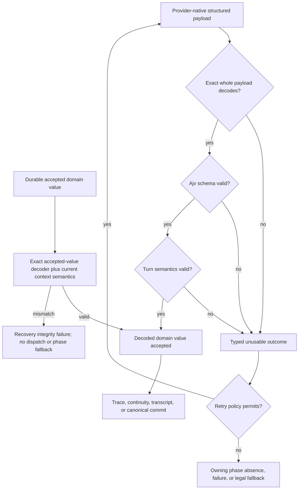
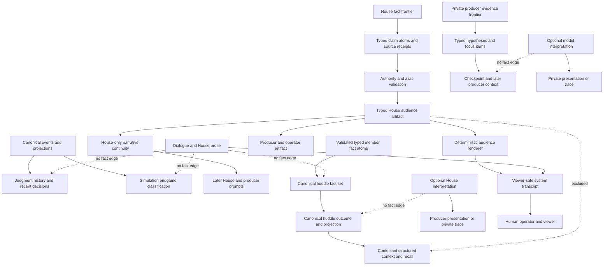

# refactor: Enforce structured model turn contracts

## Summary

Make every structured player and House turn cross the provider-attempt boundary as an exact, schema-valid, semantically valid domain value. Remove every path that recovers facts from prose, embedded JSON, display wrappers, or default-filled objects, while preserving explicit phase-owned fallbacks and presentation-only text turns. Keep House audience summaries useful as House/producer narrative continuity and human-viewer presentation without exposing them as contestant-agent knowledge or game authority.

---

## Problem Frame

`docs/refactor-queue.md` R32 records a repeated failure mode exposed by the production `malformed_house_followup` incident: Influence asks a provider for structured output, but some callers accept any non-empty or parseable object before decoding the actual domain value. Later code extracts JSON from prose, fills missing fields, downgrades malformed AgentResponse output to speech, or reconstructs facts from transcript labels and House copy. The provider coordinator then records apparent success even though no valid candidate crossed the boundary.

The governing invariant is **no game facts from prose**. Prose may be displayed, searched, quoted, and preserved as evidence of what a model or player said. It may not establish control flow, accepted speech, continuity facts, producer factual evidence, later prompt facts, Judgment history, or simulation results.

This plan distinguishes the **human operator/viewer**—the person watching or playing Influence—from a **contestant agent**, the AI competitor inside the game. House audience summaries belong to the House, producer/operator tooling, and the human match viewer. The House can use prior accepted summaries to build arcs, choose what to highlight next, and maintain a coherent narrative; contestant agents must not receive those summaries as knowledge.

---

## Requirements

### Structured acceptance boundary

- R1. Every structured engine and House turn must use a provider-native tool or an exact strict JSON Schema whose complete payload is validated locally before acceptance.
- R2. Fenced JSON, embedded JSON, wrapper objects, surrounding prose, `{}`, missing fields, extra fields, wrong types, invalid enums, and semantically incomplete values must never become usable candidates through extraction, coercion, defaults, or field dropping.
- R3. Provider-attempt validators must return the decoded domain value, so only that value can be journaled, traced, replayed, or passed to gameplay policy.
- R4. Refusal, content filtering, truncation, empty output, undecodable output, and parsed-but-invalid output must retain typed outcomes under the existing retry policy; exhaustion must reach explicit absence, failure, or an owning-phase fallback.

### Player turns

- R5. A malformed AgentResponse must not become accepted player speech, emit an accepted decision trace, or mutate compact strategy.
- R6. Native tool calls and `json_schema` tool compatibility must enforce the same exact schema and semantic contract; a missing native result is a typed failure, not a prose-compatibility success.
- R7. Rules-legal phase repair may remain after provider exhaustion, but no structural or semantic defect may be hidden by post-acceptance normalization.

### House turns and continuity

- R8. Mingle assignment, alliance proposer selection, huddle scheduling, huddle producer interpretation, and diary follow-up turns must return fully decoded values from the provider-attempt boundary.
- R9. Strategy Bible updates, long-form summaries, and producer briefs must use exact nested schemas whose continuity/factual fields are typed IDs, enums, and source receipts. Model-authored interpretation prose is presentation-only and excluded from later factual context.
- R10. A failed Strategy Bible update must preserve the previous packet exactly; exhausted summaries and briefs must use an explicit deterministic fallback or absence contract rather than fabricated model success.
- R11. Official huddle continuity facts must be validated self-authored ID/enum atoms from member turns plus canonical session context, while member dialogue and any House interpretation remain presentation only.
- R12. Audience summaries must express factual content as bounded typed claims with selected source receipts, validate those claims against the fact frontier, and render human-viewer copy from the accepted structure without inspecting model prose.
- R21. A House audience summary must be a House-owned typed artifact with claim/receipt and narrative-continuity projections for House/producer consumers plus a render-only presentation projection for the human viewer.
- R22. Later House and producer prompts may use prior rendered beats as labeled non-authoritative narrative context and their typed claims/source lineage as factual context, while contestant-agent context, Recall Plans, decision prompts, canonical reducers, and result classification receive neither representation.

### Canonical history and results

- R13. Judgment question history and recent Judgment decisions must derive from ordered `judgment.speech_recorded` events and roster identity, not `[QUESTION ...]` or `[ANSWER ...]` display text.
- R14. Simulation endgame classification must derive from canonical endgame events or their projection, not House announcement text.

### Scope and proof

- R15. Diary-room question generation and gameplay narration remain text turns where their only consumed value is displayed prose.
- R16. The frozen classic presentation parser remains unchanged and no format-kernel or structured-turn behavior may be routed through it.
- R17. Provider-free tests must cover exact success, malformed-output matrices, retry recovery, retry exhaustion, fallback ownership, local-model parity, canonical replay, and copy invariance; the affected House diary, audience-summary, and Judgment Q&A surfaces also require the frozen-input opt-in provider comparison in R23-R24.
- R18. Decision-surface, observability, local-model, simulator, and contributor documentation must describe the strict boundary and its fallback semantics.
- R23. Before changing the affected contracts, capture opt-in provider baselines for frozen House diary, House audience-summary, and Judgment Q&A situations. Each baseline must bind the typed semantic input pack, target behavior revision, provider/model/profile/reasoning/tool settings, prompt/schema fingerprint, sample ordinal, cache-isolation coordinate, typed provider outcome, retry/fallback provenance, usage/cost/latency, and producer-private raw output without treating that prose as game authority.
- R24. After the refactor, replay the same semantic input packs with the same provider configuration and produce a sanitized local paired report that separates hard correctness invariants, accepted-value behavior, blind presentation-quality review, and operational cost. Provider comparison is opt-in release evidence rather than required CI, and it must refuse incomparable packs or configurations instead of implying a causal result.

### Recovery integrity and failure ownership

- R19. A durable accepted domain value must pass the current turn-specific accepted-value decoder and context semantics before replay; it must not be reinterpreted as the provider payload shape. Mismatch fails closed without a new provider dispatch or phase fallback.
- R20. Only typed provider exhaustion may reach owning-phase fallback; cancellation, schema or validator defects, replay-integrity failures, and canonical-context defects must propagate as their actual failures.

---

## Key Technical Decisions

- **Use one immutable invocation schema artifact as the structural source of truth.** Add Ajv 8 as a direct `@influence/engine` runtime dependency. Construct the complete schema once per semantic invocation, pass that same artifact to provider compilation and local validation, and reuse its compiled validator across attempts by artifact identity. Do not add schema canonicalization or an independent contract-fingerprint system. Run Ajv in strict, non-mutating mode without coercion, defaults, or additional-field removal.
- **Make structured versus text invocation a foundational type boundary.** A text invocation cannot carry a tool or schema. A structured invocation must carry one exact schema artifact, a unique action identity, and a semantic decoder. Establish this discriminated API before migrating callers so each Agent and House seam crosses the final boundary once.
- **Layer semantic validation after structural validation but before acceptance.** JSON Schema proves the payload shape; turn-specific decoders prove non-empty values, context identity, revision lineage, eligible IDs, uniqueness, bounded counts, and cross-field rules that the provider schema cannot express cleanly.
- **Return accepted domain values from coordinator validators.** Each structured invocation owns two exact paths to the same `T`: live provider payload validation followed by semantic decoding, and an accepted-value decoder for unknown journal data already stored in domain form. Agent and House callers consume `ProviderCandidateValidation<T>` values directly rather than re-parsing a raw `ProviderModelOutcome` after acceptance.
- **Revalidate durable accepted values before replay.** Recovery passes journaled `acceptedValue` directly through the invocation's accepted-value decoder and current context semantics; it does not apply the provider-facing schema to an already decoded domain value. The stable logical-call coordinate already binds the actor, action, phase, round, and ordinal, so no second persisted schema fingerprint is required. A mismatch is an integrity/recovery failure: it does not dispatch the provider again, enter the retry budget, or masquerade as fresh provider exhaustion.
- **Keep the existing failure taxonomy stable.** Native decode/truncation remains `undecodable_structured_output`; complete JSON that fails structural or semantic validation remains `malformed_output` with a bounded diagnostic code; absence and refusal retain their current types.
- **Give local models the same contract as hosted providers.** `json_schema` compatibility parses only the complete top-level JSON document and validates it against the selected tool schema. Markdown fences, tool-name wrappers, `{ arguments: ... }`, and prose extraction are removed rather than grandfathered.
- **Separate candidate validity from rules legality.** The provider boundary rejects malformed or semantically incomplete candidates. The phase remains the owner of deterministic legal repair after typed exhaustion, preserving honest fallback provenance.
- **Type House summaries as audience artifacts with explicit consumer projections.** The accepted House artifact carries its boundary, ordered typed claims, source receipts, and deterministic rendered text. House narrative continuity carries a bounded prior-artifact view to later House/producer prompts, while the viewer transcript projection carries only rendered text and safe system metadata. Producer/operator tooling may inspect the accepted receipts; contestant `PhaseContext`, Recall Plans, decision prompts, canonical reducers, and result classifiers receive neither the artifact nor its rendered copy.
- **Make factual House narration render only from typed source selections.** Audience beats carry bounded claim kinds and alias-backed receipts. The engine derives every factual slot from the selected source and uses one fixed renderer per supported claim/source kind; no free-form provider-authored factual prose, open question, thread label, or provider-supplied factual slot crosses the accepted contract.
- **Preserve House narrative agency without granting prose authority.** Later House/producer prompts receive prior rendered beats only as explicitly non-authoritative narrative/style context and receive the corresponding accepted claims and source lineage separately. The House can use that history to develop arcs, avoid repetition, and select the next meaningful beat, but every factual assertion in new viewer copy must still originate in the current accepted claim structure.
- **Separate House producer hypotheses from factual evidence.** Strategy Bible, long-form, and producer-brief turns select typed subject IDs, closed hypothesis/focus kinds, confidence, disclosure, and source receipts from a private producer frontier. Only those typed values may enter checkpoint continuity, diary-question facts, or factual rendering. Optional House interpretation may remain in bounded House/producer-only narrative context and private presentation/trace; it cannot enter contestant prompts or establish a game fact.
- **Split official huddle memory from House interpretation.** Each member may return typed self-authored proposal, commitment, contingency, or response atoms whose authority-bearing fields are validated IDs and closed enums; their natural-language message remains dialogue only. Canonical huddle outcomes record those atoms plus session metadata, and projections, recall, later prompts, and postgame analysis consume only that structure. Optional House interpretation is confined to producer presentation/private traces.
- **Keep continuity and reporting on canonical sources.** Judgment context consumes canonical speech events, simulation consumes canonical endgame state, and huddle fact memory consumes validated member atom structure. Transcript and House prose remain presentation.
- **Compare frozen semantic situations, not divergent full-game transcripts.** Capture typed scenario packs at the House diary, audience-summary, and Judgment Q&A provider seams before changing them, then replay those same packs afterward. Bind comparison rows by semantic pack hash and provider configuration while recording prompt/schema fingerprints separately, because those contracts are expected to change. Use a bounded full-game run only as secondary integration evidence.
- **Separate correctness evidence from presentation judgment.** Hard gates cover schema/semantic acceptance, factual support, identity, privacy, contestant-context exclusion, canonical equivalence, retry/fallback provenance, and the absence of prose-derived facts. Shuffle before/after presentation samples for blind review of diary specificity, summary legibility and arc continuity, and Judgment question novelty/answer responsiveness. Never add an evaluation parser that converts the baseline prose into authoritative or accepted facts.
- **Narrow fallback catches to typed provider exhaustion.** Cancellation, schema compilation or validator programming faults, accepted-replay integrity failures, and canonical-context defects fail fast or propagate to recovery. Broad catches may not manufacture deterministic output from non-provider failures.
- **Remove obsolete compatibility code.** Delete confirmed-dead free-text player helpers and embedded-object extractors instead of retaining fallback paths or backward-compatibility layers.

---

## High-Level Technical Design

### Structured candidate acceptance

The provider coordinator owns attempts and typed exhaustion. It does not invent legal moves or presentation. The caller supplies the exact schema and semantic decoder, and the phase owns any fallback after exhaustion.

### Failure ownership

| Condition | Owner and outcome |
|---|---|
| Provider refusal or content filter | Preserve the typed provider outcome and apply the existing provider policy; never parse refusal text. |
| Empty, undecodable, structurally invalid, or semantically invalid remote candidate | Retry under the existing bounded policy; typed exhaustion alone may reach phase absence or legal fallback. |
| Caller cancellation | Propagate cancellation; do not retry or synthesize fallback output. |
| Schema compilation or validator programming defect | Fail fast as an engine defect; do not classify the model or write fallback provenance. |
| Durable accepted-value mismatch | Fail closed as recovery integrity failure without another remote dispatch or phase fallback. |
| Canonical-context or projection defect | Propagate the authority failure; do not replace missing facts with House or transcript prose. |

### Game-fact authority after the refactor

---

## Scope Boundaries

### In scope

- Every structured AgentResponse, agent decision tool, and `json_schema` compatibility turn in the engine.
- Every structured House control, continuity, producer-artifact, and audience-summary turn.
- Typed House-summary projections for accepted claim receipts, House/producer narrative continuity, and human-viewer transcript/replay presentation, with an explicit contestant-agent exclusion.
- Durable accepted-value replay through the same invocation-specific structural and semantic decoder used for live responses.
- Removal of embedded/fenced JSON extraction, permissive open schemas, default-filled model success, and transcript-copy parsing from those paths.
- Replacement of authority-bearing huddle strings with typed member fact atoms, including canonical outcome, later prompt, replay, recall, and postgame consumers.
- Canonical-event consumers for Judgment context and simulation endgame reporting.
- Provider-free regression coverage, frozen-input opt-in provider comparisons for House diary, House audience summaries, and Judgment Q&A, and required documentation updates.

### Outside this refactor

- Runtime changes to diary-room question generation and gameplay narration whose only consumer is displayed text. The unchanged diary question may appear in the provider comparison only as presentation-quality evidence for the complete interview chain.
- Removing House MC narration from the human watch/replay experience or preventing the House from using prior accepted beats as non-authoritative narrative continuity.
- The grandfathered classic web presentation parser at `packages/web/src/app/games/[slug]/components/message-parsing.ts`.
- Provider manifest, breaker, failure-evidence UI/MCP, cost policy, and model-qualification work already owned by `docs/plans/2026-08-23-001-provider-resilience-plan.md`.
- New provider transports, feature flags, compatibility shims, historical transcript migrations, or reconstruction of legacy facts from prose. Existing transcript prose remains presentation only; pre-R32 huddle outcome strings supply no current factual continuity.

---

## Implementation Units

### U12. Freeze the pre-refactor provider baseline

- **Goal:** Preserve comparable evidence of the current House diary, House audience-summary, and Judgment Q&A behavior before changing their model contracts or context construction.
- **Requirements:** R15, R17-R18, R23.
- **Dependencies:** None. This is characterization-first work and must complete before U1 changes the target provider seams.
- **Files:**
  - `packages/engine/src/prompt-scenario-lab.ts`
  - `packages/engine/src/provider-scenario-evaluation.ts` (new)
  - `packages/engine/src/scripts/evaluate-r32-provider-surfaces.ts` (new)
  - `packages/engine/src/scripts/evaluate-house-summary-cadence.ts`
  - `packages/engine/src/__tests__/provider-scenario-evaluation.test.ts` (new)
  - `packages/engine/src/__tests__/evaluate-house-summary-cadence.test.ts`
  - `docs/local-model-evaluation.md`
- **Approach:** Extend the frozen prompt-scenario pattern with producer-private provider-evaluation packs that contain typed/canonical inputs rather than copied prompts. Add two House diary situations: one substantive first answer that should earn a specific follow-up and one evasive or complete answer that may correctly close. Exercise the displayed first House question, contestant AgentResponse, House `follow_up | close` decision, and any follow-up answer as one labeled chain while keeping only the structured turns authoritative. Freeze at least one ordinary and one milestone audience-summary frontier with its boundary-time private source snapshot, selected catalog, prior typed claims/source lineage, and separately labeled prior rendered beat. Extend the existing summary-cadence evaluator to export and replay those fixed summary situations rather than requiring two whole games to stay on the same branch. Freeze a Judgment situation with two finalists, multiple jurors, canonical prior `judgment.speech_recorded` questions/answers, and the current presentation wrappers, then exercise one juror-question/finalist-answer pair.

  For each scenario, record the exact semantic pack hash, target surface file hashes or revision, harness revision, provider catalog ID/profile, service tier, reasoning policy, tool-choice mode, prompt/schema fingerprint, response ID, attempt/fallback result, token/cost/latency data, and a fresh cache-isolation nonce. Default the meaningful comparison to three independent samples per scenario; retain a one-sample smoke option for setup. Store raw prompts, native payloads, reasoning, and generated prose only in a gitignored producer-private artifact. Emit a sanitized manifest and review bundle under `packages/engine/docs/simulations/` only when explicitly requested for publication. The baseline renderer/question/answer prose may be human-reviewed, quoted, or scored as presentation, but the harness must not regex, extract, or infer accepted facts from it.
- **Patterns to follow:** Frozen packs, opaque comparison keys, and structural reports in `packages/engine/src/prompt-scenario-lab.ts`; fixed seed/configuration and cache-isolated usage accounting in `packages/engine/src/scripts/evaluate-house-summary-cadence.ts`; opt-in live-provider classification in `package.json`.
- **Test scenarios:**
  1. The same typed pack produces the same semantic fingerprint regardless of raw prompt serialization or private output location; any typed input change produces a different fingerprint.
  2. Public manifests exclude prompts, reasoning, raw provider payloads, private source values, secrets, and contestant-private context while retaining configuration, outcome, usage, and comparison coordinates.
  3. A baseline sample containing names, plans, counts, or answer text remains presentation evidence only; no baseline adapter converts those strings into a typed claim, decision, identity, or canonical event.
  4. House summary packs preserve the boundary-time typed source snapshot and prior House narrative/claim facets separately, and contain no contestant-facing summary input.
  5. Judgment packs preserve canonical speech history separately from display wrappers and never expose prior finalist answers to the juror-question input.
  6. The comparison command fails before spending provider budget when the provider/model/profile/reasoning/tool settings are incomplete or the requested sample would not be attributable to a frozen pack.
- **Verification:** After provider-free harness checks, use the paid-provider authorization recorded under Documentation and Operational Notes to capture the baseline before U1. The saved manifest identifies exactly what was run and the private bundle is sufficient for later blind review without making baseline prose authoritative.

### U1. Establish one exact structured-payload validator

- **Goal:** Give Agent and House turns one non-mutating structural validator that compiles the exact provider-facing schema and returns bounded failure diagnostics.
- **Requirements:** R1-R4, R17, R20.
- **Dependencies:** U12.
- **Files:**
  - `packages/engine/package.json`
  - `bun.lock`
  - `packages/engine/src/model-invocation.ts`
  - `packages/engine/src/provider-adapters.ts`
  - `packages/engine/src/structured-output.ts` (new)
  - `packages/engine/src/__tests__/structured-output.test.ts` (new)
- **Approach:** Add Ajv 8 directly to the engine. Introduce a discriminated invocation API in which text turns cannot carry tools/schema and structured turns require a unique action identity, an immutable exact provider-payload schema artifact, a live semantic decoder to `T`, and an exact accepted-value decoder from unknown journal data to the same `T`. Pass the provider artifact to provider compilation and local live-response validation, compile it once, and reuse the validator across that invocation's attempts by artifact identity. Parse only complete JSON documents, preserve validation errors before the next call, and expose decoded values to turn-specific semantic callbacks. The accepted-value decoder validates the stored domain representation without pretending it is still provider payload. Do not enable Ajv mutation options. Treat schema compilation/programming faults as fail-fast defects rather than model failures.
- **Patterns to follow:** `ProviderCandidateValidation<T>` in `packages/engine/src/provider-execution.ts`; the exact `HOUSE_FOLLOW_UP_SCHEMA` validator in `packages/engine/src/house-interviewer.ts`; provider-neutral semantic invocations in `packages/engine/src/provider-adapters.ts`.
- **Test scenarios:**
  1. A representative nested strict schema accepts its complete valid JSON document and returns the typed decoded object.
  2. Plain text, fenced JSON, JSON embedded in prose, leading labels, wrapper objects, arrays at an object root, and trailing non-whitespace fail exact decoding.
  3. `{}`, a missing required field, an extra top-level or nested field, a wrong scalar/array type, an invalid enum, and a blank semantic field fail without coercion, field removal, or defaults.
  4. Repeated attempts using one immutable artifact reuse its compiled validator, while distinct same-name artifacts with different required fields cannot share one.
  5. The exact invocation artifact passed through OpenAI Responses tools, Chat Completions tools, and local `json_schema` compilation is the artifact validated after response normalization.
  6. The registry copies Ajv errors before another validation overwrites them.
  7. A schema with an unsupported or misspelled keyword fails at compilation rather than silently weakening validation.
  8. A thrown validator/programming error propagates as an engine defect and is not recorded as `malformed_output`.
  9. Type tests prove a text invocation cannot carry a tool/schema and a structured invocation cannot omit its action identity, exact provider schema artifact, live semantic decoder, or accepted-value decoder.
  10. A fixture whose provider payload uses a player name but whose accepted domain value uses the resolved player UUID succeeds on both live and replay paths without applying the provider schema to the UUID-shaped value.
- **Verification:** One immutable invocation schema artifact demonstrably drives both request construction and local structural validation under Bun ESM, with no mutating validator behavior.

### U11. Revalidate durable accepted values before recovery use

- **Goal:** Prevent recovery from replaying a historical accepted value that does not satisfy the current invocation contract.
- **Requirements:** R3-R4, R19-R20.
- **Dependencies:** U1.
- **Files:**
  - `packages/engine/src/provider-execution.ts`
  - `packages/engine/src/__tests__/provider-execution.test.ts`
- **Approach:** Route `onReadAccepted()` values through the invocation's accepted-value decoder and current context-dependent semantics before returning them to gameplay. Do not send the persisted domain object through the provider-payload schema. Preserve the API journal's existing value-hash and terminal-attempt checks; the stable logical-call coordinate already binds the accepted value to its actor/action/phase/round/ordinal. Fail closed on accepted-domain structural or semantic mismatch. Recovery-integrity failure must not consume provider budget, dispatch another remote request, or enter a phase fallback that implies fresh provider exhaustion. Keep the durable accepted-value storage shape unchanged.
- **Patterns to follow:** Accepted-result fencing in `packages/engine/src/provider-execution.ts`; journal integrity checks in `packages/api/src/services/provider-call-journal.ts`; canonical recovery fail-closed posture.
- **Test scenarios:**
  1. A valid accepted domain value replays through the accepted-value decoder without a network dispatch and returns the same `T`.
  2. Malformed accepted-domain shape, extra or missing fields, and semantic mismatch fail as recovery integrity errors rather than provider outcomes.
  3. A stored value that is structurally valid but references a target or dynamic strategy boundary that is invalid for the current logical call fails semantic replay validation.
  4. Replay mismatch triggers neither retry, provider transition, phase fallback, accepted trace emission, nor canonical mutation.
  5. Cancellation and journal hash/terminal-attempt corruption retain their existing distinct failure behavior.
- **Verification:** Durable replay and live dispatch cross the same acceptance contract, and an incompatible stored value fails closed without duplicate inference.

### U2. Make AgentResponse acceptance exact

- **Goal:** Ensure optional player speech crosses the attempt boundary only as a complete AgentResponse and cannot mutate speech or strategy state when malformed.
- **Requirements:** R1-R5, R7, R17.
- **Dependencies:** U1.
- **Files:**
  - `packages/engine/src/agent.ts`
  - `packages/engine/src/__tests__/agent-structured-output.test.ts`
  - `packages/engine/src/__tests__/extracted-modules.test.ts`
- **Approach:** Move AgentResponse decoding, schema validation, non-empty message validation, and strategy-envelope semantics into `callLLMWithThinking`'s coordinator validator. Return the decoded AgentResponse as the usable value. Remove AgentResponse post-acceptance parsing, plain-text downgrade, and the dead `callLLM` / `cleanVisibleMessage` path. Leave shared tool-content compatibility removal to U3 so the sequential cutover never deletes a helper still used by decisions. Preserve the existing distinction between a valid speech envelope and separately accepted or rejected optional strategy metadata.
- **Execution note:** Add the malformed-output and no-mutation assertions before deleting the compatibility helpers.
- **Patterns to follow:** The House follow-up cutover in commit `5173aa5f`; compact strategy acceptance in `packages/engine/src/agent.ts`; optional-speech absence from `docs/plans/2026-08-23-001-provider-resilience-plan.md`.
- **Test scenarios:**
  1. An exact AgentResponse with required thinking, non-empty message, and valid strategy fields is accepted, traced once, and returned unchanged apart from approved reasoning display metadata.
  2. Non-JSON text, fenced/embedded JSON, `{}`, missing thinking, missing or blank message, extra fields, wrong field types, and an invalid strategy envelope retry as malformed output.
  3. A malformed first attempt followed by an exact second attempt accepts only the second value and records no accepted trace for the first.
  4. Repeated malformed output exhausts through the existing optional-speech absence path with no transcript entry, private accepted decision, or compact-strategy mutation.
  5. Refusal/content filter and empty output keep their distinct outcomes rather than being reclassified as malformed speech.
  6. A structurally valid speech whose optional strategy proposal is rules-invalid keeps the legal speech while existing strategy acceptance records the rejected strategy candidate honestly.
- **Verification:** No player communication method can return raw provider prose as AgentResponse, and rejected candidates are absent from speech, accepted traces, and strategy state.

### U3. Unify native tool and JSON-schema envelope validation

- **Goal:** Make native tools and local `json_schema` compatibility decode the same complete tool-argument envelope before action semantics run.
- **Requirements:** R1-R4, R6, R17.
- **Dependencies:** U1, U2.
- **Files:**
  - `packages/engine/src/agent.ts`
  - `packages/engine/src/provider-adapters.ts`
  - `packages/engine/src/__tests__/agent-structured-output.test.ts`
  - `packages/engine/src/__tests__/provider-adapters.test.ts`
- **Approach:** Validate native tool arguments and complete `json_schema` text with the selected invocation schema artifact before returning usable. Remove prose, fence, embedded-object, tool-name, and `arguments` wrapper recovery, then delete the now-unused shared extraction helpers. Keep provider request/response normalization in adapter tests and common malformed-envelope behavior in agent tests.
- **Patterns to follow:** Exact tool schemas in `packages/engine/src/agent.ts`; provider compilation in `packages/engine/src/provider-adapters.ts`; phase fallback provenance in `packages/engine/src/phases/phase-runner-context.ts`.
- **Test scenarios:**
  1. The same valid fixture sent through a native named tool and `json_schema` compatibility produces the same decoded value and decision trace.
  2. Fenced/embedded JSON, `{ arguments: ... }`, `{ toolName: ... }`, surrounding prose, a missing tool call, a wrong tool, extra fields, and missing fields produce equivalent typed failures across both modes.
  3. A malformed first attempt followed by a valid tool result accepts only the recovered value; repeated malformed envelopes reach typed exhaustion.
  4. Truncated tool arguments remain `undecodable_structured_output`, while parseable schema violations remain `malformed_output`.
  5. OpenAI Responses native tools, Chat Completions native tools, and local `json_schema` mode validate the exact dynamic strategy variant sent for that attempt.
  6. Provider adapter contract tests prove strict schema compilation does not weaken native tool selection, refusal handling, or normalized result identity.
- **Verification:** Every agent action enters semantic validation as the same schema-valid decoded argument object regardless of provider transport, and no action can succeed by returning prose that happens to contain JSON.

### U10. Validate every agent action's turn semantics

- **Goal:** Reject schema-valid but semantically incomplete agent decisions before they are accepted or traced.
- **Requirements:** R3-R4, R6-R7, R11, R17, R20.
- **Dependencies:** U3.
- **Files:**
  - `packages/engine/src/agent.ts`
  - `packages/engine/src/types.ts`
  - `packages/engine/src/game-runner.types.ts`
  - `packages/engine/src/phases/phase-runner-context.ts`
  - `packages/engine/src/__tests__/agent-structured-output.test.ts`
  - `packages/engine/src/__tests__/format-kernel-integration.test.ts`
- **Approach:** Register one semantic decoder per action family for dynamic legal identities, exact/unique selection counts, mutually dependent fields, movement/huddle conditions, and strategy-repair requirements. Replace the authority-bearing strings in `AllianceHuddleCommitmentFact` with the closed `AllianceHuddleFactAtom` contract below. Each agent may author facts only for itself; another participant may appear only as a target/condition subject, while responses reference an earlier typed fact rather than dialogue or turn order. The separate `message` field remains dialogue and never populates an atom. Run the decoder inside the attempt validator and return the typed action candidate. Keep phase legality and deterministic fallback after typed exhaustion; do not make the provider layer the rules engine.

  | Atom kind | Required authority-bearing fields | Semantic rule |
  |---|---|---|
  | `proposal` | `actorPlayerId`, `actionKind`, `targetPlayerId`, `confidence` | Actor must be the current speaker; action/target must be legal for the huddle window. |
  | `commitment` | `actorPlayerId`, `actionKind`, `targetPlayerId`, `confidence` | Records only the actor's own unconditional commitment. |
  | `response` | `actorPlayerId`, `counterpartFactId`, closed `stance` (`endorse`, `reject`, `counter`), optional replacement `actionKind`/`targetPlayerId`, `confidence` | Reference must resolve to an earlier engine-ID'd proposal/commitment atom in the same session; `counter` requires a complete replacement proposal. |
  | `contingency` | `actorPlayerId`, `conditionKind`, optional `conditionPlayerId`, `effectActionKind`, `effectTargetPlayerId`, `confidence` | Condition/effect slots must form a complete, window-legal pair. |

  All player IDs are canonical UUIDs. The engine assigns a stable `factId` after accepting each proposal/commitment atom and exposes eligible earlier fact IDs in later huddle-turn schemas. `actionKind` is exactly `empower_vote`, `council_vote`, `format_ballot`, or `format_pointer`, further restricted by the active window/format. `conditionKind` is exactly `target_ineligible`, `vote_count_changed`, `format_action_changed`, or `ally_response_changed`; only the target/ally conditions accept `conditionPlayerId`. `confidence` is exactly `low`, `medium`, or `high`. There is no `other` enum, nullable target fact, free-form factual field, member-authored fact about a different actor, or model-authored no-target explanation. A turn with no typed target/action fact may still emit dialogue but contributes no atom.
- **Patterns to follow:** Existing action-specific normalizers and phase fallback provenance; dynamic tool-schema construction in `packages/engine/src/agent.ts`; accepted-action validation in format-kernel integration tests.
- **Test scenarios:**
  1. Each action family has a valid semantic fixture that returns the expected typed candidate after structural validation.
  2. Unknown or self-forbidden names, duplicate or partial candidate sets, invalid dynamic formats/targets, and inconsistent conditional Power fields retry as malformed output.
  3. Missing movement/huddle conditions, invalid pass/no-reply combinations, and absent required repair-boundary strategy fail before trace emission.
  4. Huddle atoms with prose-valued actions/conditions, an `other` escape hatch, another player as actor, an unknown target/fact reference, an out-of-session or later fact reference, or incomplete enum-dependent slots fail before acceptance; the same natural-language content remains permitted only in the separate dialogue message.
  5. A semantic failure followed by a valid candidate accepts only the recovered value; exhaustion reaches the existing action-specific legal fallback with fallback provenance.
  6. A candidate whose illegality is knowable from the invocation context is rejected inside semantic validation. A later commit-time canonical-context conflict propagates without repair or fallback provenance.
  7. Table-driven coverage proves every registered agent action has a semantic decoder and no duplicate action identifier.
- **Verification:** All agent action families require a semantic decoder before acceptance, while canonical legality and fallback remain phase-owned.

### U4. Decode House control turns before acceptance

- **Goal:** Make House allocation, selection, scheduling, follow-up, and huddle-summary turns return fully typed values under one exact House boundary.
- **Requirements:** R1-R4, R7-R8, R17, R20.
- **Dependencies:** U1, U10.
- **Files:**
  - `packages/engine/src/house-interviewer.ts`
  - `packages/engine/src/game-runner.types.ts`
  - `packages/engine/src/__tests__/house-interviewer-structured-output.test.ts`
  - `packages/engine/src/__tests__/named-alliances-huddles.test.ts`
- **Approach:** Change the shared House JSON-schema path to return decoded domain values from its coordinator validator. Reject embedded JSON, incomplete arrays, invalid nested objects, illegal/duplicate identities, and context-inconsistent selections. Retain explicit phase-owned room/alliance repair only after typed provider exhaustion. Narrow broad catches so cancellation, validator/schema defects, replay-integrity failures, and canonical-context defects propagate.
- **Patterns to follow:** `HOUSE_FOLLOW_UP_SCHEMA`; the typed huddle atom contract introduced in U10; current phase repair ownership; `docs/solutions/architecture-patterns/fence-noncanonical-house-access-after-provider-calls.md`.
- **Test scenarios:**
  1. Exact valid assignments, proposer selections, huddle schedules, huddle producer interpretations, and follow-up decisions are accepted as decoded domain values.
  2. `{}`, embedded/fenced JSON, missing nested fields, extra fields, invalid enums, unknown IDs, duplicate selections, over-budget selections, incomplete room coverage, and malformed scheduled/skipped partitions retry.
  3. Exhausted room, proposer, or schedule output reaches the existing deterministic fallback without being traced as accepted House output.
  4. A House candidate whose illegality is knowable from invocation context is rejected inside semantic validation and contributes to typed exhaustion before deterministic phase repair; a later canonical-context conflict propagates without repair.
  5. Cancellation, schema compilation faults, validator exceptions, replay-integrity failures, and missing canonical context propagate without deterministic output or fallback provenance.
- **Verification:** All House control turns share the exact attempt-boundary contract, and only typed provider exhaustion can enter their deterministic phase fallbacks.

### U9. Cut official huddle continuity over to typed member atoms

- **Goal:** Make canonical huddle outcomes and every later fact consumer independent of House-authored interpretation prose.
- **Requirements:** R7-R8, R11, R17, R20.
- **Dependencies:** U4, U10.
- **Files:**
  - `packages/engine/src/phases/alliances.ts`
  - `packages/engine/src/alliance-huddle-outcome.ts`
  - `packages/engine/src/types.ts`
  - `packages/engine/src/game-runner.types.ts`
  - `packages/engine/src/canonical-events.ts`
  - `packages/engine/src/canonical-event-log.ts`
  - `packages/engine/src/game-projection.ts`
  - `packages/engine/src/game-state.ts`
  - `packages/engine/src/context-recall-plan.ts`
  - `packages/engine/src/context-builder.ts`
  - `packages/engine/src/agent.ts`
  - `packages/engine/src/operator-turn-text.ts`
  - `packages/engine/src/postgame-analysis.ts`
  - `packages/api/src/services/public-alliance-read-model.ts`
  - `packages/api/src/game-mcp/read-model.ts`
  - `packages/web/src/app/games/[slug]/components/match-watch-alliance-panel.tsx`
  - `packages/engine/src/__tests__/named-alliances-huddles.test.ts`
  - `packages/engine/src/__tests__/named-alliances-state.test.ts`
  - `packages/engine/src/__tests__/canonical-events.test.ts`
  - `packages/engine/src/__tests__/context-recall-plan.test.ts`
  - `packages/engine/src/__tests__/canonical-event-replay.test.ts`
  - `packages/engine/src/__tests__/postgame-analysis.test.ts`
  - `packages/engine/src/__tests__/operator-turn-text.test.ts`
  - `packages/engine/src/__tests__/game-mcp.test.ts`
  - `packages/api/src/__tests__/games-api.test.ts`
  - `packages/api/src/__tests__/production-game-mcp-read-model.test.ts`
  - `packages/web/src/__tests__/match-watch-alliance-model.test.ts`
  - `packages/web/src/__tests__/match-watch-alliance-panel.test.tsx`
- **Approach:** Define `alliance.huddle_outcome_recorded` payload version 2 for session metadata plus `facts: AllianceHuddleFactAtom[]` and the server-private participant snapshot; new writes emit only v2. Commit each validated member atom without inspecting the separate dialogue message. The v2 projector, operator/postgame renderers, public alliance read model, Game MCP read model, and web presentation derive their text from atom enums/IDs. Keep a fail-closed v1 event decoder only to distinguish durable historical payloads: it exposes safe session metadata and `facts: []`, never the old `ask`, `plan`, `promises`, `dissent`, `posture`, leak claims, or prose commitments to a factual consumer. This is a payload-version boundary, not a prose parser or compatibility fact path. Optional House interpretation remains producer presentation/private trace only. A completed modern huddle with no accepted atoms also commits an explicit empty fact set, proving the session occurred while recording no target, promise, agreement, dissent, contingency, or posture.
- **Patterns to follow:** Canonical huddle commit in `packages/engine/src/phases/alliances.ts`; outcome projection in `packages/engine/src/alliance-huddle-outcome.ts`; authority separation in `CONCEPTS.md`.
- **Test scenarios:**
  1. Identical typed member atoms and canonical session context produce the same canonical outcome, projection, recall plan, and later prompt facts under different dialogue and different or absent House interpretation.
  2. House prose that asserts an uncommitted target, promise, agreement, dissent, leak, betrayal, or posture cannot alter canonical or continuity fields.
  3. Conflicting typed proposals, commitments, responses, and contingencies remain separately attributed; deterministic projections may report the conflict but cannot synthesize consensus or choose a winner from prose.
  4. Canonical replay reconstructs the same v2 factual huddle outcome without producer presentation/private traces; unsupported payload versions fail closed.
  5. A completed huddle with zero accepted atoms records `facts: []`; later prompts state only that no structured commitments were recorded and do not synthesize an ask, plan, consensus, or posture.
  6. A payload-v1 prose-backed outcome projects safe session metadata plus `facts: []` and contributes no inferred facts to current prompts, recall, analysis, public/API/MCP reads, or web rendering; any separately stored transcript copy remains presentation.
  7. Cancellation or canonical-context defects cannot commit a fallback huddle outcome.
  8. Operator text, postgame analysis, public alliance/API reads, Game MCP, and the match-watch alliance panel render v2 atoms consistently and show an honest no-structured-facts state for v1/empty outcomes without touching prose fields.
- **Verification:** Canonical huddle events, projections, recall, and prompts consume only validated ID/enum atoms; agent dialogue and House interpretation have no authoritative edge.

### U5. Replace permissive House artifact schemas and prose-backed factual continuity

- **Goal:** Make Strategy Bible, long-form summary, and producer-brief artifacts exact and receipt-backed while preserving House-only narrative continuity that cannot become producer facts or contestant knowledge.
- **Requirements:** R1-R4, R9-R10, R17, R20.
- **Dependencies:** U4.
- **Files:**
  - `packages/engine/src/house-interviewer.ts`
  - `packages/engine/src/game-runner.types.ts`
  - `packages/engine/src/game-runner.ts`
  - `packages/engine/src/diary-room.ts`
  - `packages/engine/src/operator-turn-text.ts`
  - `packages/engine/src/house-producer-evidence.ts` (new)
  - `packages/engine/src/__tests__/house-interviewer-structured-output.test.ts`
  - `packages/engine/src/__tests__/house-artifact-structured-output.test.ts` (new)
  - `packages/engine/src/__tests__/diary-room-strategy.test.ts`
  - `packages/engine/src/__tests__/operator-turn-text.test.ts`
- **Approach:** Compile a runner-private producer evidence frontier with stable aliases over typed canonical events/projections and accepted speech/diary entries, preserving each source's authority and privacy. Provider prompts receive bounded summaries; the accepted artifact carries only the receipt-backed factual structures below. The engine owns revision IDs, player identity, covered windows, and factual rendering. Optional `interpretation`/producer-note prose is labeled non-authoritative and may be retained in bounded House/producer-only narrative context or displayed in the private trace. It is excluded from contestant-agent prompts, diary-question facts, checkpoint continuity facts, source receipts, and deterministic factual output.

  | Artifact | Accepted factual/continuity contract | Prose treatment |
  |---|---|---|
  | Strategy Bible | Engine revision/window fields plus `hypotheses[]` with closed `kind`/`status`/`confidence`, canonical `subjectPlayerIds` and `relatedPlayerIds`, and one or more typed source aliases; typed `openQuestions[]` use a closed question kind plus player IDs and receipts. | Optional House interpretation is narrative framing for later House/producer work and private presentation only. Replace free-form factual summaries, promises, blocs, discoveries, trajectories, and change descriptions with typed hypotheses/receipts; keep dramatic arc construction in the House lane rather than deleting it or promoting it to game truth. |
  | Long-form summary | Ordered receipt-backed factual claim selections rendered deterministically from the producer evidence frontier, plus the engine-owned covered window and packet revision. | Optional analysis is visibly labeled House interpretation and may feed only later House/producer narrative framing, never factual reads or contestant prompts. Exhaustion yields explicit absence or a deterministic receipt-backed summary, never generic invented game copy. |
  | Producer brief | `focusItems[]` with closed focus kind, subject/related player IDs, source aliases, confidence, and disclosure (`safe_to_reference` or `private_only`); typed question-angle kinds consume only these fields and current canonical diary context. | Optional producer note is display-only and never enters the visible-question prompt. No model-authored story role, pressure point, contradiction, reveal guidance, or question angle becomes a fact string. |

  Reject unknown/stale aliases, authority/privacy mismatches, unregistered kinds, unknown players, receipt-free hypotheses, revision/window mismatches, and extra fields inside the attempt boundary. Delete top-level packet substitution, raw-text summary success, missing-array synthesis, and fallback story-role construction as model output. Preserve the previous Strategy Bible packet byte-for-byte on typed provider exhaustion. Narrow U5 and runner catches so only typed exhaustion reaches declared artifact absence/fallback; cancellation, validator/schema defects, replay-integrity failures, and canonical-context defects propagate.
- **Patterns to follow:** House artifact domain types in `packages/engine/src/game-runner.types.ts`; checkpoint continuity ownership; typed optional/fallback outcomes in the provider-resilience plan.
- **Test scenarios:**
  1. Each exact artifact schema is sent with `strict: true`, recursively closes object fields, requires every intended typed field/receipt, and accepts its valid nested fixture.
  2. Non-JSON, embedded/fenced JSON, `{}`, absent packet wrapper, missing or extra nested fields, invalid enums, unknown players, unknown/stale receipts, authority/privacy mismatches, and inconsistent windows/revisions retry.
  3. A malformed artifact followed by a valid artifact accepts only the valid revision and emits one accepted private trace.
  4. Failed Strategy Bible update with an existing packet preserves identical packet content, revision identity, and checkpoint continuity; a failed first update remains awaiting the first valid packet.
  5. Changing optional artifact interpretation prose—including inserting unsupported names, promises, votes, or alliances—may change later House narrative framing but does not change typed hypotheses, source receipts, checkpoint continuity facts, contestant-agent context, the diary-question prompt facts, or deterministic factual rendering.
  6. Long-form and brief exhaustion returns the declared receipt-backed deterministic/absent fallback with fallback provenance and never an apparent provider-authored factual artifact.
  7. Provider refusal and empty output remain distinguishable from malformed artifact output.
  8. Cancellation, schema/validator defects, replay-integrity errors, and canonical-context defects propagate without artifact fallback provenance or an ordinary absence result.
- **Verification:** House artifacts carry producer interpretation and typed receipt-backed hypotheses separately; no artifact can manufacture factual continuity from `{}`, partial JSON, raw prose, defaults, or a model-authored string.

### U6. Type House audience summaries and replace prose inspection with claim receipts

- **Goal:** Preserve selective House narrative orientation for the human viewer and later House work without parsing names, counts, attributions, or collective positions from prose or exposing summaries to contestant agents.
- **Requirements:** R1-R4, R12, R17, R20-R22.
- **Dependencies:** U4, U5.
- **Files:**
  - `packages/engine/src/house-interviewer.ts`
  - `packages/engine/src/house-summary-frontier.ts`
  - `packages/engine/src/game-runner.ts`
  - `packages/engine/src/game-runner.types.ts`
  - `packages/engine/src/agent.ts`
  - `packages/engine/src/context-builder.ts`
  - `packages/engine/src/context-recall-plan.ts`
  - `packages/engine/src/house-summary-accounting.ts`
  - `packages/engine/src/scripts/evaluate-house-summary-cadence.ts`
  - `packages/engine/src/__tests__/house-interviewer-structured-output.test.ts`
  - `packages/engine/src/__tests__/house-summary-cadence.test.ts`
  - `packages/engine/src/__tests__/evaluate-house-summary-cadence.test.ts`
  - `packages/engine/src/__tests__/house-summary-frontier.test.ts`
  - `packages/engine/src/__tests__/agent-structured-output.test.ts`
  - `packages/engine/src/__tests__/context-recall-plan.test.ts`
  - `packages/engine/src/__tests__/extracted-modules.test.ts`
  - `packages/api/src/services/transcript-capture.ts`
  - `packages/api/src/__tests__/transcript-visibility-policy.test.ts`
  - `packages/web/src/app/games/[slug]/components/dramatic-timing.ts`
  - `packages/web/src/__tests__/dramatic-timing.test.ts`
- **Approach:** Replace `prose` as the factual carrier and remove player-count/dialogue-attribution regex grammars. While compiling the frontier, build a runner-private discriminated `sourceValuesByAlias` map directly from each typed canonical event, projection snapshot, or accepted transcript entry before catalog normalization; never serialize this map into the provider prompt, accepted receipt, or viewer payload. The provider returns an ordered list of source-backed claim selections under the existing source caps (ordinary: 2; milestone: 4): aliases are unique, every alias was selected on the current attempt, and each claim kind must match the source authority and typed private source in the table below. The provider supplies no factual values; semantic validation and rendering consume `sourceValuesByAlias`, not `HouseFactRow.data: Record<string, unknown>` and not a re-query that could drift past the frontier boundary. A fact-read may expand only the next attempt's allowed aliases and private map.

  Replace the current summary result with a House audience artifact that keeps its typed claims, bounded source coordinates, boundary, and engine-rendered text together. Remove model-authored `openQuestions` and `threadIds` as fact-like continuity. House narrative continuity retains a bounded set of prior artifacts: accepted claims/source lineage are factual context, while rendered beats are labeled non-authoritative narrative/style context. Later House and producer prompts receive both facets separately so the House can develop arcs, highlight changes, and avoid repetition without recovering facts from old copy.

  Project the accepted artifact by consumer rather than treating every transcript consumer as one public lane:

  | Projection | Payload | Allowed consumers | Explicit exclusions |
  |---|---|---|---|
  | Accepted House artifact | Boundary, ordered claim selections, bounded source coordinates, rendered text, and accounting provenance. | House continuity and producer/operator artifacts. | Canonical reducers, result classification, and contestant-agent context. |
  | House narrative continuity | Prior accepted claims/source lineage plus prior rendered beats labeled `narrative_non_authoritative`. | Later House summary and producer-artifact prompts. | Fact derivation from rendered text and all contestant-agent prompts. |
  | Human-viewer presentation | Rendered text plus viewer-safe `scope: system` / `dialogueKind: house_summary` metadata. | Live watch, completed replay, public transcript presentation, and simulation `[House MC]` output. | Private source values, provider traces, claim internals not deliberately exposed, and canonical replay authority. |
  | Contestant-agent context | No House summary artifact or rendered House-summary row. | None. | `PhaseContext.publicTranscriptContext`, `publicMessages`, Recall Plan candidates, and decision prompts must all prove absence. |

  Render the beat with the single fixed renderer registry and deterministic claim joiner. Preserve one-read budget, source caps, privacy, unsupported-alias failure, pending-delta behavior, viewer cadence, and dialogue's non-authoritative scope. Narrow the House/runner catches so only explicitly modeled provider exhaustion/skip produces a nonfatal receipt; cancellation, validator/schema defects, replay-integrity errors, and canonical-context defects propagate.

  | Claim kind | Provider fields | Required source | Engine-derived slots and rendering |
  |---|---|---|---|
  | `canonical_event` | `kind`, `sourceAlias` | `canonical_event`; event type must be in the existing `CANONICAL_NARRATION_TYPES` set | Event type and its typed payload select a fixed event-specific sentence; the renderer registry is exhaustive over that set and fails tests when a supported type has no renderer. |
  | `projection_alive_count` | `kind`, `sourceAlias` | `canonical_projection` with an `alive` ID array | Derive the exact count and render the fixed remaining-player sentence; the provider cannot submit the number or names. |
  | `dialogue_quote` | `kind`, `sourceAlias` | `dialogue_non_authoritative` for one selected transcript entry | Derive the speaker identity and exact accepted quote, render it explicitly as attributed dialogue, and never use it as board/action/consensus authority. |

  One source alias supports exactly one claim selection. No generic `other` claim, free-form style/tone/template field, provider-authored connective, collective dialogue claim, arbitrary projection key, or unregistered canonical event is accepted.
- **Execution note:** Characterize current frontier limits and failure receipts before changing the tool contract, then replace prose-parser tests with claim-receipt tests.
- **Patterns to follow:** `HouseFactRow` and `HouseSourceCoordinate` in `packages/engine/src/house-summary-frontier.ts`; `docs/solutions/architecture-patterns/bound-phase-cadence-narration-with-selective-fact-frontiers.md`.
- **Test scenarios:**
  1. A canonical player-count/state claim with selected canonical aliases validates and renders a bounded human-viewer beat.
  2. A dialogue quote validates only for the exact selected transcript receipt; unselected speakers, paraphrases, unsupported collective claims, and dialogue used as board authority fail.
  3. Stale aliases, aliases not selected on the current attempt, duplicate/over-budget claims, wrong authority, unsupported claim kinds, and mismatched claim values retry or return the existing nonfatal failed receipt.
  4. A fact-read result expands only the second attempt's frontier and cannot authorize aliases or facts outside the bounded read.
  5. The accepted contract contains no free-form prose/style field, open question, thread label, tone/template identifier, provider-authored connective, generic claim kind, or provider-supplied factual slot; every rendered name, count, decision, outcome, or attribution comes from the selected row.
  6. Changing deterministic renderer wording leaves sources, claims, cadence accounting, pending deltas, and replay behavior unchanged.
  7. Provider-backed comparison confirms supported hosted/local provider entries can select valid source-backed claim kinds without reopening prose parsing.
  8. The provider prompt/catalog and accepted artifact receipt never contain `sourceValuesByAlias`; rendering uses the boundary-time typed snapshot even if live game state advances afterward.
  9. Cancellation, schema/validator defects, replay-integrity errors, and canonical-context defects cannot become `failed`/`model_skipped` receipts or pending-delta fallback behavior.
  10. An accepted beat emits viewer-safe `house_summary` text to the live/replay transcript and simulation feed while preserving its typed claim/receipt artifact for House and producer consumers.
  11. A transcript containing House summaries produces a contestant `PhaseContext`, Recall Plan, and rendered decision prompt with no summary text or artifact, while a subsequent House prompt receives the prior rendered beat as non-authoritative narrative context and its claims/source lineage as typed context.
  12. Changing prior renderer wording may influence later House editorial selection but cannot change contestant context, canonical state, accepted claim semantics, or any fact supplied to the next House prompt.
  13. With rich producer artifacts disabled, the default House MC path still carries bounded prior-summary artifacts between House calls and emits the human-viewer beat without requiring Strategy Bible state.
- **Verification:** Audience beats have typed, inspectable factual receipts, remain useful to House narrative continuity and human-viewer presentation, stay absent from contestant-agent knowledge, and require no regex or semantic inspection of model prose.

### U7. Build Judgment context from canonical speech events

- **Goal:** Make Judgment question/answer history and recent decisions invariant under transcript labels, missing display rows, and canonical replay.
- **Requirements:** R13, R16-R17.
- **Dependencies:** None.
- **Files:**
  - `packages/engine/src/context-builder.ts`
  - `packages/engine/src/__tests__/canonical-event-replay.test.ts`
  - `packages/engine/src/__tests__/extracted-modules.test.ts`
  - `packages/engine/src/__tests__/context-recall-replay.test.ts`
- **Approach:** Consume ordered `judgment.speech_recorded` events and resolve participant names from roster identity after event selection. Pair a jury answer with the latest unmatched reciprocal juror/finalist question while preserving unanswered and repeated questions. Keep display wrappers in `formalSpeechDisplayText` as presentation only and delete their parsing from context construction.
- **Patterns to follow:** Canonical speech commits in `packages/engine/src/accepted-formal-speech.ts`; event rendering and replay in `packages/engine/src/canonical-events.ts` and `packages/engine/src/__tests__/canonical-event-replay.test.ts`.
- **Test scenarios:**
  1. One question/answer pair produces the same Judgment history and recent-decision context from canonical events as the current accepted flow.
  2. Changed punctuation, localized or removed display wrappers, and entirely missing transcript rows do not alter context.
  3. Multiple questions between the same juror/finalist pair attach each answer to the latest unmatched reciprocal question in event order.
  4. Unanswered questions remain visible without synthesized answers; unrelated or malformed display prose cannot create history.
  5. Canonical replay reconstructs identical history and decisions with stable IDs and names.
- **Verification:** No Judgment context builder applies regex or string conventions to transcript text, and replayed canonical speech alone produces complete history.

### U13. Replay the refactored surfaces and report the paired comparison

- **Goal:** Show what changed at the provider boundary and in the audience experience using the same House diary, House audience-summary, and Judgment Q&A situations captured by U12.
- **Requirements:** R5, R8, R12-R13, R17-R18, R21-R24.
- **Dependencies:** U2, U4, U6, U7, U12.
- **Files:**
  - `packages/engine/src/provider-scenario-evaluation.ts`
  - `packages/engine/src/scripts/evaluate-r32-provider-surfaces.ts`
  - `packages/engine/src/scripts/evaluate-house-summary-cadence.ts`
  - `packages/engine/src/__tests__/provider-scenario-evaluation.test.ts`
  - `packages/engine/src/__tests__/evaluate-house-summary-cadence.test.ts`
  - `packages/engine/docs/simulations/`
  - `docs/local-model-evaluation.md`
- **Approach:** Replay the U12 semantic packs after the relevant migrations with the same provider catalog ID/profile, service tier, reasoning policy, tool-choice mode, and sample count. Use fresh cache-isolation nonces but retain the scenario comparison key and semantic pack hash. Refuse a paired report when the semantic input or provider configuration differs; record the intentionally changed prompt/schema fingerprint rather than requiring request bytes to match. Do not compare exact prose or parse either revision's copy into facts.

  Report three evidence layers separately:

  | Layer | Hard or review evidence |
  |---|---|
  | Contract correctness | Attempt acceptance, exact decoded domain value, rejected malformed candidates, retry/exhaustion/fallback provenance, canonical commits, identity/source validity, privacy, and contestant-context exclusion. No unsupported fact or prose-derived fact may pass after the refactor. |
  | Presentation quality | Blind, shuffled producer review of House-question specificity, diary follow-up relevance, summary legibility and arc continuity, juror-question novelty/pointedness, and finalist-answer responsiveness. Reviewers see the frozen situation and presentation sample, not the revision label. |
  | Operations | First-attempt acceptance, retries, exhaustion/fallback rate, input/output/reasoning tokens, estimated cost, latency, and provider outcome. Report each sample plus the small-sample range; do not imply statistical certainty. |

  For House diary, show the entire interview chain while distinguishing the text-only first House question from structured contestant answers and the structured House follow-up/close decision. For audience summaries, compare the old viewer copy with the new deterministic copy, typed claim/source support, emitted/skipped/failed cadence, prior-beat House continuity, and contestant absence. The old prose may receive a blind human support score against the frozen frontier, but no automatic prose extraction is permitted. For Judgment, compare target validity, repeated-question avoidance, question specificity, answer responsiveness, accepted formal-speech events, and the absence of prior finalist answers from the juror prompt; provider-free wrapper-variation tests remain the proof of canonical copy invariance.

  After the paired seam-level report, run one bounded full-game or existing House summary-cadence comparison as secondary integration evidence. Its canonical-authority fingerprint must match where the evaluator claims a paired cadence comparison, but divergent model gameplay must be reported as an integration observation rather than causal before/after proof. Keep paid calls and private artifacts outside required CI.
- **Patterns to follow:** Current `--review-report` separation in `packages/engine/src/scripts/evaluate-house-summary-cadence.ts`; producer-only scenario artifacts in `packages/engine/src/prompt-scenario-lab.ts`; canonical speech commits in `packages/engine/src/accepted-formal-speech.ts`.
- **Test scenarios:**
  1. A candidate run with a different semantic pack hash, model/profile, reasoning policy, tool mode, or sample count is marked incomparable and cannot produce a before/after conclusion.
  2. Prompt and schema fingerprints may differ while the typed situation remains paired; the report shows both revisions and their contract shapes explicitly.
  3. Shuffled review bundles remove revision labels and stable ordering, preserve scenario context, and can be joined back to samples only through a producer-private key.
  4. The report cannot mark an after sample correct when it accepted malformed output, used an unsupported source, exposed House summary continuity to a contestant, repeated a Judgment question because display history was missing, or derived any fact from prose.
  5. House diary rows distinguish displayed questions from authoritative structured decisions and show whether a malformed AgentResponse or follow-up exhausted, retried, or reached the owning fallback.
  6. Summary rows show typed claims/receipts and deterministic viewer text after the refactor, but never synthesize equivalent claims by parsing the before copy.
  7. Judgment rows resolve participants and prior history from canonical events after the refactor, and mutated/missing display wrappers produce the same provider-free context fingerprint.
  8. A three-sample run reports individual outcomes and ranges rather than hiding variance behind one aggregate score; a one-sample smoke is visibly labeled non-comparative.
- **Verification:** The local paired report makes contract behavior, audience quality, and cost legible for each surface; all after samples satisfy hard correctness gates, any quality regression or inconclusive provider result is explicit, and no provider evidence becomes canonical game authority or required CI.

### U8. Make simulation reporting canonical and align documentation

- **Goal:** Remove the final House-copy result dependency, prove the complete R32 inventory, and document the stricter provider/local-model behavior.
- **Requirements:** R1-R3, R14-R24.
- **Dependencies:** U2-U7, U9-U13.
- **Files:**
  - `packages/engine/src/simulate.ts`
  - `packages/engine/src/simulation-instrumentation.ts`
  - `packages/engine/src/model-invocation.ts`
  - `packages/engine/src/__tests__/simulate-config.test.ts`
  - `packages/engine/src/__tests__/simulation-instrumentation.test.ts`
  - `packages/engine/src/__tests__/structured-output.test.ts`
  - `packages/engine/src/__tests__/provider-fallback-qualification.live-provider.test.ts`
  - `docs/reasoning-transcript-observability.md`
  - `docs/local-model-evaluation.md`
  - `CONCEPTS.md`
  - `DEVELOPMENT.md`
  - `README.md`
- **Approach:** Derive endgame type and instrumentation labels from canonical `endgame.stage_set` / jury events or their projections, using `normal` only when no stage event exists. Remove transcript-copy search from both simulation modules. Run the final exhaustive registry proof over the discriminated invocation API established in U1: every structured Agent/House action identity has one exact recursively closed provider schema, live semantic decoder, and accepted-value decoder, while the explicit text-only exclusions cannot carry structured configuration. Update domain vocabulary, simulator JSDoc, and usage documentation for typed malformed output, stricter local compatibility, replay integrity, optional absence, phase fallback, producer/audience source receipts, House/producer/human-viewer lane separation, huddle payload v2, and canonical reporting.
- **Patterns to follow:** Canonical replay projections; structural test-classification guards; documentation discipline in `docs/reasoning-transcript-observability.md`.
- **Test scenarios:**
  1. Identical canonical events with normal, changed, localized, removed, duplicated, or deliberately conflicting House announcements produce the same endgame type.
  2. The latest canonical stage event wins when multiple valid stage transitions exist; no stage event yields `normal`.
  3. Simulation result serialization and aggregate endgame statistics consume the canonical classification without changing unrelated output fields.
  4. Registry tests fail if a structured engine/House invocation lacks a unique action identity, exact recursively closed provider schema, live semantic decoder, or accepted-value decoder; the typed API prevents a structured result from entering through a text invocation.
  5. Text-only diary question and narration turns remain valid exclusions, and the frozen classic parser remains untouched.
  6. The provider-free, PostgreSQL, and repository check baselines pass; the frozen House diary, audience-summary, and Judgment Q&A comparisons record paired provider behavior without becoming required CI.
- **Verification:** Simulation reporting is copy-invariant, the structured-turn inventory has no escape hatch, documentation matches runtime behavior, and required repository baselines pass.

---

## Acceptance Examples

- AE1. **Malformed optional speech is absent.** Given a player returns prose containing an embedded valid-looking AgentResponse, when retries exhaust, then no player speech, accepted trace, or compact-strategy mutation is created. Covers R2-R5.
- AE2. **Local compatibility is not a weaker contract.** Given a local model returns fenced tool JSON that a hosted model would have supplied as native arguments, when the attempt validates, then it is rejected and follows the same retry/fallback policy as malformed native tool arguments. Covers R2, R4, R6-R7.
- AE3. **House continuity survives failed updates.** Given a valid Strategy Bible packet exists, when the next update returns `{}` and then malformed prose until exhaustion, then the prior packet and revision remain authoritative. Covers R9-R10.
- AE4. **Huddle facts ignore all prose.** Given identical validated member atoms and different player dialogue and House interpretation, when later context is built, then the fact set, attribution, targets, commitments, responses, and contingencies are identical. Covers R8, R11.
- AE5. **Audience claims require receipts.** Given a selected dialogue source from one speaker, when the House submits a player-count claim or attributes a quote to another speaker, then the typed beat fails and emits no viewer summary or House continuity artifact. Covers R12.
- AE6. **Judgment history ignores display labels.** Given the same canonical jury question and answer events with changed or missing transcript wrappers, when finalist context is built or replayed, then the history is identical. Covers R13.
- AE7. **Endgame statistics ignore House copy.** Given a canonical Tribunal stage and House text that says Judgment, when simulation results are aggregated, then the game is classified as Tribunal. Covers R14.
- AE8. **Presentation-only prose stays simple.** Given a diary question or ordinary gameplay narration contains names and strategy language, when it is displayed, then no parser or structured fact contract is added because no control-flow or fact consumer reads it. Covers R15-R16.
- AE9. **Durable replay cannot bypass today's contract.** Given a journaled accepted domain value that fails the current accepted-value decoder or context semantics, when recovery reads it, then recovery fails closed without provider dispatch, retry, phase fallback, accepted trace, or canonical mutation. Covers R3-R4, R19-R20.
- AE10. **Only provider exhaustion owns legal fallback.** Given cancellation, a validator defect, or missing canonical context during a structured turn, when the error reaches the phase boundary, then it propagates as its original failure and writes no fallback provenance. Covers R4, R7, R20.
- AE11. **Producer interpretation cannot become factual continuity.** Given two Strategy Bible or producer-brief results with identical typed hypotheses/focus items and receipts but contradictory interpretation prose, when a checkpoint is sealed and the next House/diary prompt is built, then House narrative framing may differ but factual continuity, contestant context, and prompt facts are identical. Covers R9-R10.
- AE12. **Accepted replay validates the stored representation.** Given a live provider payload names a player and semantic decoding stores that player's UUID, when recovery replays the accepted value, then the UUID-shaped domain decoder succeeds without applying the name-shaped provider schema. Covers R3, R19.
- AE13. **House narration reaches the audience, not contestants.** Given an accepted House audience artifact, when the game continues, then the human watch/replay transcript displays its rendered text and the next House prompt receives its separated typed/narrative continuity, while contestant `PhaseContext`, Recall Plan, and decision prompts contain neither. Covers R21-R22.
- AE14. **Before/after evidence compares the same situation.** Given three pre-refactor samples for a frozen House diary, audience-summary, or Judgment Q&A pack, when the candidate run uses the same semantic pack and provider configuration, then the report pairs individual outcomes while showing the intentionally different prompt/schema fingerprints; any semantic-input or configuration mismatch is labeled incomparable before a conclusion is produced. Covers R23-R24.
- AE15. **Provider evidence cannot reopen prose authority.** Given the baseline House summary or Judgment response contains names, counts, plans, or display labels, when the comparison report is built, then that prose may appear in a blind presentation review but cannot be parsed into claims, participant identity, history, decisions, or canonical events. The refactored run derives those values only from typed structure and canonical sources. Covers R12-R14, R23-R24.

---

## System-Wide Impact

- **Gameplay and continuity:** More malformed hosted/local outputs will retry or reach existing legal fallbacks instead of appearing as model success. Optional speech may be absent more often, but accepted state becomes auditable and replay-safe.
- **Provider execution:** Retry ownership, manifests, budgets, and accepted-result fencing remain in the existing coordinator. Live provider payloads and durable domain values use distinct exact decoders that converge on the same `T`; replay mismatch fails without spending budget or issuing a duplicate request. Ajv validation adds bounded local CPU work.
- **Local models:** Models that emit Markdown fences, wrapper objects, or explanatory prose around JSON will stop receiving compatibility recovery. Qualification and documentation must make that intentional behavior visible.
- **House artifacts and presentation:** Audience wording becomes deterministic because every factual word renders from a selected typed source snapshot. The typed House artifact and prior rendered beats remain available to House/producer narrative work, the human viewer continues to receive the rendered House MC beat, and contestant agents receive neither. Strategy Bible/brief factual continuity becomes typed receipt-backed hypotheses and focus items; optional producer interpretation and huddle interpretation remain House/producer narrative presentation only.
- **Persistence and APIs:** The provider journal storage shape does not expand, but accepted-value recovery gains a distinct domain-value integrity decoder. House checkpoint continuity changes from prose fields to typed receipt-backed records. `alliance.huddle_outcome_recorded` adds payload v2; public alliance, Game MCP, postgame/operator, and web reads render v2 atoms deterministically and treat v1 as factual absence rather than exposing its prose as current fact.
- **Developers and operators:** Malformed-output diagnostics become more honest; debugging shifts from downstream synthesized objects to the exact rejected attempt and bounded validator code.
- **Evaluation evidence:** Producer-private frozen packs and raw samples add an opt-in local evidence lane for House diary, House summaries, and Judgment Q&A. Sanitized reports compare contract correctness, blind presentation quality, and cost without exposing private prompts/reasoning or turning model prose into game facts.

---

## Risks and Dependencies

- **Provider-schema subset drift:** Ajv accepts more JSON Schema than providers do. Keep provider compatibility as the limiting dialect and add contract tests for root object shape, complete required arrays, recursive `additionalProperties: false`, and supported keywords.
- **Schema/semantic divergence:** Structural and semantic validators could disagree. Compile the emitted schema itself, keep one semantic callback per turn, and return a single decoded domain value.
- **Live/replay decoder drift:** Provider payload and accepted domain values may have intentionally different shapes, but both must produce the same `T`. Share the context-dependent domain checks after their distinct structural decoders and add paired fixtures for every structured action identity.
- **Invocation artifact drift:** Rebuilding or copying a dynamic schema separately for provider compilation and local validation could recreate contract divergence. Construct one immutable artifact per semantic invocation, reuse its validator through a lifetime-bounded identity cache, and test all provider transports against that exact object.
- **Validation accidentally mutates output:** Ajv coercion/default/removal options would recreate the defect. Configure strict non-mutating validation and test that rejected objects remain unchanged.
- **Legality moves into transport:** Overloading the shared validator with game repair would blur failure ownership. Validate candidate completeness in the attempt boundary and keep deterministic legal fallback in the phase.
- **Replay incompatibility:** Pre-R32 accepted values may not satisfy the new decoder. Fail closed as recovery-integrity errors, surface them to operations, and do not silently redispatch or convert them into phase fallback.
- **Fallback catch leakage:** Broad catches can convert cancellation, validator defects, journal corruption, or canonical-context defects into apparent legal output. Narrow catches to typed provider exhaustion and prove other failures cannot write fallback provenance or continuity.
- **Audience quality regression:** A fixed factual renderer may reduce House voice. Preserve House agency through typed highlight selection, prior-beat narrative context, and producer arc framing; compare rendered cadence artifacts while keeping the no-prose-facts invariant non-negotiable. Factual voice improvements must come from deterministic renderers, not accepted free-form output.
- **Huddle taxonomy coverage:** A closed atom vocabulary will not encode every social nuance. Unsupported ideas stay in dialogue and create no continuity fact; expand the enum only when a concrete, separately validated gameplay consumer requires the fact.
- **Producer hypothesis taxonomy coverage:** Closed Strategy Bible/brief kinds will omit some nuanced House reads. Keep those nuances in labeled private interpretation and add a typed kind only when a current continuity or diary-question consumer needs it; never promote prose because an enum is missing.
- **Huddle payload consumer drift:** A v2 canonical event with new domain fields touches projection, replay, API/MCP, postgame/operator, and web reads. Treat `format.resolved` v1/v2 handling as the versioning precedent and keep an exhaustive consumer test matrix so no reader falls back to old prose fields.
- **Legacy huddle evidence loss:** Older prose-backed outcomes may have no typed atoms. Expose honest factual absence to current consumers and leave any transcript copy as presentation rather than parsing or migrating claims.
- **Local-model regression:** Some current local models may rely on fenced or wrapped JSON. Treat those responses as malformed, document the stricter contract, and use retry/fallback evidence to decide whether model qualification changes are needed outside R32.
- **Wide structured-turn surface:** Agent tools and House decisions share helpers but have different semantic constraints. Use table-driven common malformed cases plus domain-specific fixtures so one passing helper test does not mask a weak turn.
- **Provider nondeterminism:** One response can make either revision look unusually good or bad. Use three independent cache-isolated samples per frozen situation, expose individual outcomes and ranges, and keep one-sample runs labeled as setup smoke rather than evidence.
- **False before/after pairing:** Prompt/schema changes are intentional, but semantic inputs or provider settings must not drift unnoticed. Bind the pair to the semantic pack hash and full provider configuration, display both prompt/schema fingerprints, and refuse comparison on a mismatch.
- **Private evaluation leakage:** Frozen inputs and raw outputs may contain producer, contestant, or reasoning context. Keep the raw bundle gitignored and producer-private, sanitize manifests by construction, and require an explicit publication decision for any artifact placed under `packages/engine/docs/simulations/`.
- **Evaluation prose becomes a shadow authority path:** A convenient scorer could recreate the same prohibited inference outside production. Limit automated comparison to typed outcomes, canonical/source checks, and operations metadata; use blind human review for old free-form presentation and never feed inferred baseline claims back into runtime, fixtures, or acceptance decisions.

---

## Documentation and Operational Notes

- Update `CONCEPTS.md`, `docs/reasoning-transcript-observability.md`, `docs/local-model-evaluation.md`, `DEVELOPMENT.md`, `README.md`, and `packages/engine/src/simulate.ts` JSDoc in the same implementation branch.
- The required merge baseline remains `bun run test`, `bun run test:postgres`, and `bun run check` using Bun only.
- Characterization is ordered work: build the provider-free frozen-pack harness and capture the current House diary, audience-summary, and Judgment Q&A baseline before U1 changes those seams. After U2/U4/U6/U7, replay the same packs and produce the paired local report. If a baseline must be recovered later, use the recorded pre-refactor revision in an explicitly approved isolated worktree rather than approximating old behavior in new code.
- **Provider authorization for this implementation run:** The user explicitly approves the U12/U13 before/after provider evidence and bounded secondary simulation through the exact `doppler run --config dev --` prefix. The Doppler `dev` key's configured spending limits are the cost ceiling. This approval covers paid-provider implementation analysis for this plan; it does not authorize production mutation, unrelated provider experiments, external publication, or committing private raw artifacts.
- Keep paid/provider credentials and raw comparison bundles out of required CI and version control. Store only sanitized local evidence under `packages/engine/docs/simulations/`, and commit or publish it only when explicitly requested.
- Document the audience boundary with unambiguous vocabulary: `operator`/`viewer` is the human watching or playing Influence, while `agent` is the in-game AI contestant. Preserve viewer-safe `house_summary` transcript/replay behavior and document its exclusion from contestant prompts alongside its House-only narrative-continuity role.
- Deployment remains the gate. Use the existing active-game drain before the House checkpoint and huddle-v2 cutover, and verify that no unresolved accepted provider value is silently stranded; any incompatible accepted-value replay must surface as an integrity/recovery failure for operator handling. Durable huddle v1 handling is limited to the explicit zero-fact version boundary. Do not add a feature flag, disabled-visible state, compatibility fact mode, or historical migration.

---

## Sources and Research

### Repository authority

- `docs/refactor-queue.md` — R32 source, required direction, exclusions, and validation path.
- `AGENTS.md` — event authority, structured-output contract, validation, local-model, documentation, and test requirements.
- `CONCEPTS.md` — TranscriptEntry, Match-read lanes, House artifacts, accepted formal speech, and canonical fact vocabulary.
- `packages/engine/src/provider-execution.ts` — typed candidate validation, retry, exhaustion, and accepted-value boundary.
- `packages/engine/src/provider-adapters.ts` — provider-native tool and strict-schema compilation/normalization.
- `packages/engine/src/agent.ts` — AgentResponse and agent-tool escape hatches.
- `packages/engine/src/house-interviewer.ts` and `packages/engine/src/house-summary-frontier.ts` — House structured turns, artifact defaults, audience prose parsers, and source authority.
- `packages/engine/src/context-builder.ts`, `packages/engine/src/accepted-formal-speech.ts`, and `packages/engine/src/simulate.ts` — canonical speech precedent and remaining transcript-copy consumers.
- `docs/solutions/architecture-patterns/coordinate-provider-attempts-with-durable-fallback-authority.md` — validate decoded semantic values before acceptance.
- `docs/solutions/architecture-patterns/agent-strategy-observability-spine.md` — malformed speech cannot mutate strategy; optional strategy remains separately validated.
- `docs/solutions/architecture-patterns/bound-phase-cadence-narration-with-selective-fact-frontiers.md` — selective receipt-backed House narration.
- `docs/solutions/architecture-patterns/separate-transport-visibility-from-staged-presentation.md` — presentation wording cannot reconstruct facts.
- `docs/solutions/architecture-patterns/fence-noncanonical-house-access-after-provider-calls.md` — provider validation and phase fallback remain separate.
- Commit `5173aa5f` — exact House follow-up schema and in-attempt semantic validation precedent.

### External implementation guidance

- [Ajv managing schemas](https://ajv.js.org/guide/managing-schemas.html) — compile schemas once and reuse validators.
- [Ajv strict mode](https://ajv.js.org/strict-mode.html) — fail schema compilation on ignored or ambiguous contracts.
- [Ajv data-modification guidance](https://ajv.js.org/guide/modifying-data.html) — avoid coercion, defaults, and additional-field removal for validation-only boundaries.
- [RFC 8259](https://www.rfc-editor.org/rfc/rfc8259.html) — a JSON text is a complete value with surrounding whitespace, not prose containing an extractable object.
- [OpenAI Structured Outputs](https://developers.openai.com/api/docs/guides/structured-outputs) — provider strict-schema subset and refusal/incomplete response handling.
