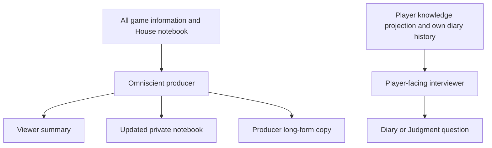

# Refactor: Restore House-authored narrative behind an information firewall

## Summary

The House is an omniscient showrunner. It writes viewer summaries verbatim, maintains one private narrative notebook, and authors long-form producer copy without claims, aliases, receipts, fact-read loops, or deterministic renderers.

“No game facts from prose” is a consumer rule: House prose may describe the game, but reducers, decisions, projections, tallies, replay, AI contestant knowledge, and result classification never derive facts from it.

## Requirements and decisions

- R1. A material House cadence turn makes one provider call returning nullable `publicSummary` and `privateNarrativeNotebook` fields under an exact strict schema.
- R2. The engine publishes `publicSummary` exactly as authored after only shape, non-empty, control-character, and existing beat-length validation. It performs no factual regex, semantic grading, receipt validation, or rewriting.
- R3. The notebook is one bounded, opaque whole-snapshot replacement. Null preserves the previous snapshot; malformed or exhausted turns also preserve it.
- R4. The omniscient producer may see diary answers, sealed decisions, private conversations, and the notebook. It may reveal any of them to human viewers when narratively useful.
- R5. Contestant-facing diary and Judgment writers receive only that player's knowledge projection: public information, conversations they participated in, their decisions, and their prior diary Q&A. They never receive the omniscient notebook or House summaries.
- R6. All LLM-generated evidence claims, aliases, receipts, and safe-to-reveal attestations are removed from House creative lanes.
- R7. Strategy Bible and diary producer-brief calls are replaced by the single notebook. Diary questions initially use prior Q&A directly; no player notebook or producer cue is added.
- R8. Accepted summary text and notebook state become durable together before the viewer event is released.
- R9. Provider refusal or exhaustion produces no fabricated summary or deterministic fallback. The game continues under the existing pending-delta policy.

## Authority and telemetry

| Mechanism | Decision | Reason |
|---|---|---|
| House-selected source aliases, claims, and receipts | Remove | Model-generated attestations with no authoritative game consumer |
| Exact output schemas | Retain | Route public/private fields and preserve typed failure; they do not assert truth |
| Canonical events and accepted speech records | Retain | Engine-generated game authority and participant history |
| Provider usage/status telemetry | Retain as telemetry | Engine-generated cost and failure observability; consumes no model tokens |
| Recall Plan and prompt-reuse telemetry | Retain | Engine-generated context/accounting evidence, not House-generated proof |

## Interfaces

- `HouseNarrativeBeat`: engine-owned boundary plus House-authored `publicSummary`.
- `HouseNarrativeContinuityV2`: recent public beats, one private notebook, cadence heads, and pending-delta state.
- `HouseNarrationContext`: bounded canonical, projection, public dialogue, milestone private dialogue/decisions, and diary context.
- `HouseSummaryPhaseTelemetry`: boundary, status, provider calls/usage, and pending-delta disposition.
- `HouseGameplaySummaryResult`: House-authored long-form prose plus engine-owned kind/window metadata.

The removed interfaces include fact categories, aliases, `sourceValuesByAlias`, fact stores/reads, claim kinds, source coordinates, renderer registries, Strategy Bible, producer briefs, producer evidence, and House factual receipt types.

## Implementation units

### U1. Comparison baseline

- Preserve ordinary and milestone summary controls, diary controls, and Judgment Q&A.
- Record visible output, calls, tokens, cost, latency, and failure status.
- Generate no semantic hashes, source attestations, or automatic factual grades.

### U2. Authored summaries and notebook

- Compile bounded direct narration context from the production compiler.
- Make one authored-output provider call at each material cadence boundary.
- Publish accepted House prose unchanged.
- Atomically checkpoint public beat plus notebook before viewer delivery.

### U3. Remove proof artifacts

- Delete producer evidence, Strategy Bible, producer brief, receipt-backed long-form rendering, configuration fields, and proof-specific simulation accounting.
- Use the same notebook and omniscient context for long-form producer narration.
- Keep general provider accounting and `enableHouseLongFormSummaries`.

### U4. Player information firewall

- Build diary prompts from a subject-scoped `PhaseContext` plus that subject's prior Q&A.
- Reuse actor-scoped `PhaseContext` for Judgment jurors and finalists.
- Exclude other players' private conversations, sealed decisions, diary answers, the House notebook, House summaries, and operator traces.

### U5. Recovery, evaluation, and documentation

- Recover only exact V2 House narrative continuity; drain incompatible active games before deployment.
- Update queue, concepts, observability, local-model guidance, contributor docs, simulator JSDoc, and the superseded frontier solution.
- Run provider-free, PostgreSQL, and repository checks.
- Use the authorized Doppler dev lane for after-samples and one bounded full game after qualitative review.

## Acceptance scenarios

- Names, counts, strategy, interpretation, and dramatic connective prose display byte-for-byte without a receipt.
- A notebook-only milestone changes private continuity without public copy.
- Changing summary or notebook prose cannot change canonical events, projections, eligibility, votes, results, replay classification, or AI contestant context.
- Non-JSON, fenced/embedded JSON, `{}`, missing fields, extra fields, refusal, and exhaustion publish nothing and preserve the notebook.
- A crash after House acceptance restores the visible summary and matching notebook together.
- A notebook canary appears in producer prompts and recovery state but not viewer payload fields or contestant prompts.
- A diary interviewer sees a private conversation involving its subject and excludes a private conversation between other players.
- Judgment retains canonical speaker/addressee history while remaining independent of House prose.
- Static contract coverage proves House creative schemas contain no `sourceAlias`, `sourceAliases`, receipt-backed `claims`, or fact-read action.
- Qualitative review reports summary legibility, arc continuity, diary specificity, player-knowledge compliance, and call/token changes side by side.

## Implementation status

U1-U5 are complete. Provider-free tests, PostgreSQL tests, typecheck, lint, and diff hygiene pass. The authorized current-provider comparison accepted all six House summary samples in one call each, and the bounded full game completed with a coherent multi-round House arc. The comparison, provider telemetry, qualitative findings, narrow follow-up fixes, and the required active-game drain are recorded in `.local-uploads/r32-provider-surfaces/house-narrative-comparison.md` and `docs/refactor-queue.md`.
