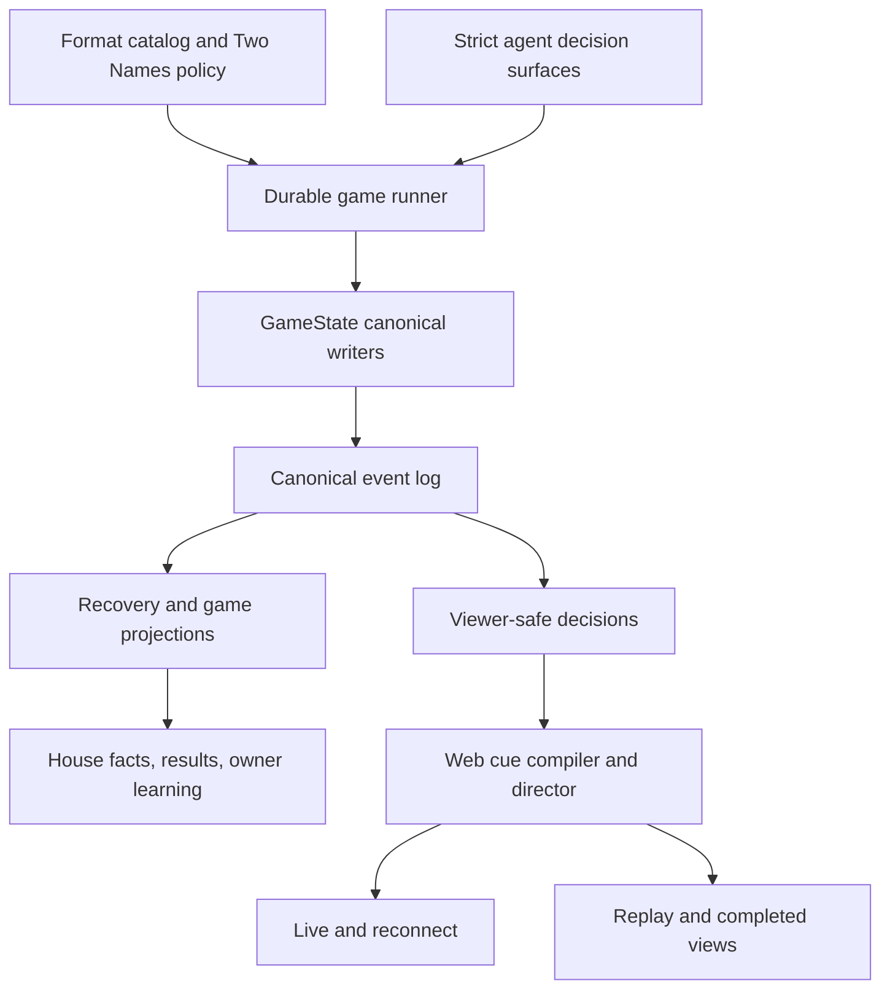
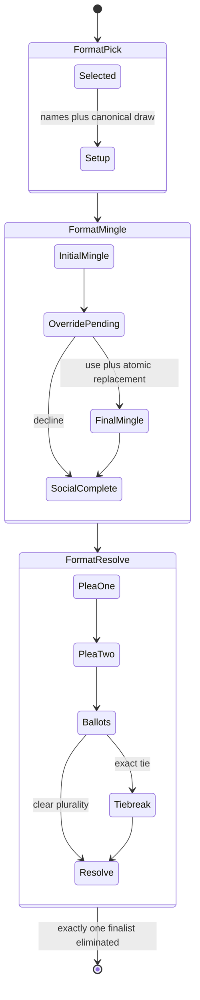
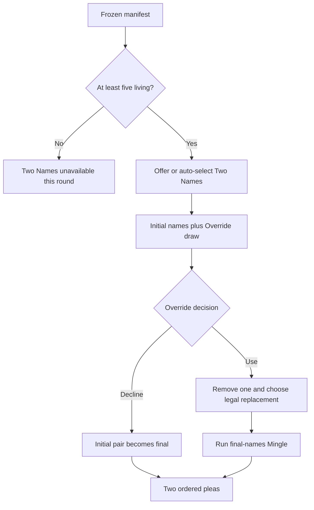
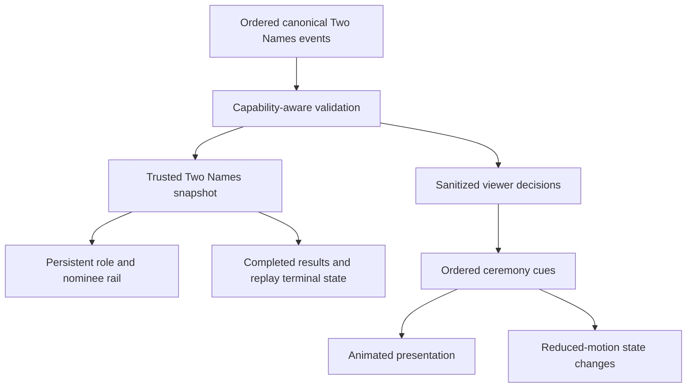

# feat: Add the Two Names round format

## Implementation Status

Completed on 2026-08-28. Two Names is registered as its own capability and is active in the default manifest. The implementation includes strict agent contracts, deterministic rules-legal fallbacks, a capability-owned canonical prefix reducer, staged durable cursors, atomic Override plus replacement, ordered provider slots, revealed facts, API validation, viewer-safe decisions, and the animated viewer shell.

The two social windows reuse the current Mingle, alliance, and huddle implementation in separate durable turns and publish distinct `initial_names` / `final_names` canonical boundary events. The current Mingle UI itself remains unchanged, as requested; Two Names role tags can be integrated when that shared Mingle shell is rebuilt.

Verification completed with the provider-free baseline, the PostgreSQL-owned baseline, repository typecheck/lint, focused durable/canonical/viewer/fact tests, and a local browser pass over the nomination, Override draw, removal, and replacement transitions. No paid provider run, deployment, or production mutation was performed.

## Summary

Add Two Names as a distinct format-kernel capability with an authoritative initial nominee pair, random Override holder, optional replacement branch, one or two full Mingles, ordered final pleas, sealed voting by eligible non-nominees restricted to the final pair, and an Empowered tie-break. Ship the engine, durable execution, canonical readers, agent surfaces, viewer choreography, results, simulation, and documentation as one coherent contract.

---

## Problem Frame

The current format catalog supports direct post-Mingle resolution capabilities: sealed non-polarity ballots, sealed polarity ballots, and a public classification chain. Two Names has a longer lifecycle. Its initial nominees and Override holder must exist before the first Mingle; Override use may change the final pair and trigger a second Mingle; final nominees receive formal pleas; only non-Empowered, non-nominee players cast the ordinary ballot.

Forcing that sequence through `sealed_elim` would weaken its voter and target invariants and hide several durable boundaries inside one resolver. The implementation instead needs a small capability that preserves the current format-kernel architecture while making every accepted decision, social window, speech, ballot, and result recoverable from typed authority. This plan implements the product direction in `docs/ideation/2026-08-16-two-names-format-ideation.md` without adding the deferred competition, three-name, or Kingdom concepts.

---

## Requirements

### Format identity and eligibility

- R1. Register `two_names` as a distinct round-format capability with the public name Two Names and fixed rules; do not route it through `sealed_elim`.
- R2. Make Two Names available only while at least five players are living, while keeping its membership in the frozen game manifest separate from current-round availability.
- R3. Preserve the existing Empowered vote and role identity; Two Names begins only after the normal format selection contract has selected or auto-selected the card.

### Nomination and Override lifecycle

- R4. Empowered selects exactly two distinct living non-Empowered players as the initial names.
- R5. The House draws one Override holder from the full living roster, including Empowered and both initial names, using rules-owned deterministic randomness and records the accepted holder canonically.
- R6. Run the first full Format Mingle only after the initial names and Override holder are known to agents and viewers.
- R7. The Override holder either declines or removes exactly one initial name; a named holder may remove themself.
- R8. When Override is used, Empowered selects one living replacement other than Empowered, the Override holder, the removed nominee, or the retained nominee.
- R9. Commit Override use and its required replacement atomically, while publishing the removal and replacement as distinct ordered dramatic beats.
- R10. Run a second full Format Mingle only when Override changes the final pair, with a distinct social-window identity and context for the final names.

### Pleas, voting, and resolution

- R11. Give the two final nominees one bounded, uninterrupted public plea opportunity each in stable final-pair order before ballots begin.
- R12. Collect one sealed ballot from every living player except Empowered and the final nominees, with each ballot targeting exactly one final nominee.
- R13. Eliminate the finalist with more ordinary ballots; on an exact tie, call Empowered once to choose between the final pair.
- R14. Resolve exactly one elimination from the final pair and keep the final nominee set, eligible voter set, ballot ledger, totals, optional tie-break, and eliminated player mutually consistent.

### Authority, agents, and presentation

- R15. Use exact strict structured contracts and engine-owned legal sets for initial names, Override action, replacement, final ballot, and tie-break decisions; malformed output cannot mutate continuity or masquerade as speech.
- R16. Give every required decision a deterministic rules-legal fallback with typed provenance; Override failure defaults to decline, and optional plea failure creates typed absence rather than fake contestant prose.
- R17. Execute each consequential stage as a durable logical turn with a typed cursor, stable provider coordinates, deterministic turn seed, atomic effects, and ordered viewer publications.
- R18. Treat canonical events and projections as the only authority for roles, nominees, social-window occurrence, speeches, ballots, tallies, resolution, recovery, results, and replay.
- R19. Compile live, reconnect, replay, reduced-motion, mobile, and completed presentation from the same viewer-safe decision stream, with reveal-gated corner anchors for Empowered and Override during ceremonies and trusted role tags in the existing Mingle view.
- R20. Preserve Two Names identity and facts through House/revealed-round facts, completed results, owner-learning evidence, simulation artifacts, API persistence, and public watch projections.
- R21. Add Two Names to the default format manifest only after its explicit-manifest engine, persistence, recovery, and viewer proof is complete; do not add feature flags, compatibility aliases, or duplicate allowlists.

---

## Key Technical Decisions

- KTD1. **Distinct `two_names` capability:** The catalog owns a dedicated staged contract because ordinary voter eligibility, target eligibility, Override branching, formal pleas, and two possible social windows cannot be represented truthfully by `sealed_elim`.
- KTD2. **Five-player availability floor at selection time:** Five is sufficient in the worst case—Empowered, two initial nominees, an outsider Override holder, and one legal replacement—and four can leave no replacement. Availability is validated against the living roster at the menu/selection prefix; the later elimination to four cannot retroactively invalidate that completed round.
- KTD3. **Additive Two Names cursor under the existing spine:** Keep `FORMAT_MENU → FORMAT_PICK → FORMAT_MINGLE → FORMAT_RESOLVE`. Add a capability-specific cursor variant rather than widening persisted `FormatProgressV1` fields in place. Setup commits before entering Format Mingle; that XState phase owns the initial Mingle, Override/replacement, and optional final Mingle, then transitions once to Format Resolve for pleas, ballots, tie-break, and elimination.
- KTD4. **Canonical draw result over canonical roster order:** Use the durable turn seed and a candidate list in canonical roster order, include the draw operation in the planned intent, then persist the holder as replay authority. Pre-commit reruns reproduce the draft; post-commit recovery reads the event and never redraws.
- KTD5. **Atomic Override-and-replacement transition with distinct provider slots:** Decline commits alone. Use commits removal and replacement together, even when Empowered is also the Override holder. Durable provider binding must identify ordered action slots rather than actor ID alone so both accepted values retain distinct coordinates and replay independently; separate canonical events preserve presentation pacing.
- KTD6. **Structural identity for two full Mingles:** Reuse rooms, named-alliance action, and scheduled huddles for both windows. Carry `initial_names` or `final_names` through Mingle progress, inbox delivery, room allocations, alliance actions, huddle schedules/sessions/outcomes, deterministic IDs, prompts, provider ordinals, recovery, and viewer cues—not only through a marker event.
- KTD7. **Format-specific accepted plea facts:** Reuse the accepted-formal-speech construction and correlation pattern, but emit format-specific plea outcomes rather than pretending the speeches are Reckoning or Judgment events. Provider exhaustion records typed absence and continues.
- KTD8. **Derived capability-shaped resolution aggregate:** One capability-owned prefix reducer validates the lifecycle and materializes the version-2 `format.resolved` aggregate from accepted setup, Override, speech, and ballot events. Writers, API persistence/readers, recovery, facts, and viewer projections reuse that reducer; no caller supplies an independent lifecycle summary that can disagree with the prefix. Historical event versions remain frozen.
- KTD9. **Engine-owned opportunity contracts:** Prompts receive current role facts and request-local legal choices. Agents do not invent IDs, compute eligibility, infer state from transcript prose, or receive a normal ballot/tie-break call when ineligible.
- KTD10. **One fact stream, multiple presentation modes:** Canonical events drive sanitized viewer decisions and trusted snapshots. Ceremony timing, animation, status-rail interpolation, and reduced motion never author game state.

---

## High-Level Technical Design

### Component and authority topology



### Round lifecycle



### Durable logical-turn sequence

```mermaid
sequenceDiagram
  participant C as Typed cursor
  participant A as Agent/provider lane
  participant E as Engine scratch turn
  participant D as Durable commit
  participant V as Viewer publication
  C->>A: Planned decision with stable coordinate
  A-->>E: Validated value or legal fallback
  E->>E: Apply rules and append canonical events
  E->>D: Commit events, continuity, cursor, and publications atomically
  D-->>C: Install next committed stage
  D-->>V: Release ordered public beats
  Note over C,D: A crash before commit discards scratch work; accepted provider values replay at the same coordinate
```

### Availability and Override branching



### Canonical-to-presentation data flow



---

## Acceptance Examples

- AE1. With five living players and an outsider Override holder, using Override leaves exactly one legal replacement and the round completes with two Mingles.
- AE2. A named Override holder removes themself, becomes an eligible ordinary voter, and may vote for either final nominee.
- AE3. A named Override holder removes the other nominee, remains a finalist, and receives no ordinary ballot call.
- AE4. Empowered is drawn as Override holder, uses Override, selects the replacement, casts no ordinary ballot, and later breaks an exact tie.
- AE5. Override is declined; the initial pair becomes final and exactly one Mingle occurs before the two pleas.
- AE6. Override is used; `initial_names` and `final_names` Mingles each run once with isolated room, inbox, alliance, and huddle context.
- AE7. Removed nominees and other eligible outsiders vote; Empowered and the two final nominees do not.
- AE8. A clear plurality eliminates the higher-total finalist without calling Empowered again.
- AE9. An even split invokes one Empowered tie-break restricted to the final pair and eliminates the chosen finalist.
- AE10. Malformed initial-name, Override, replacement, ballot, and tie-break outputs produce typed legal fallbacks without accepted model correlation or strategy mutation.
- AE11. Restart after each committed stage yields the same holder, final pair, speeches, ballots, resolution, publications, and final result as uninterrupted execution.
- AE12. A Two-Names-only manifest auto-selects with five or more living; mixed manifests filter it out below five; a sole unavailable manifest fails before producing an impossible menu.
- AE13. Live, reconnect, replay, completed, mobile, and reduced-motion views agree on roles, current finalists, branch history, ballots, tie-break, and elimination.
- AE14. House facts, completed results, owner learning, API reads, and simulation reports derive the complete Two Names story from canonical events without transcript parsing.

---

## Implementation Units

### U1. Define Two Names policy, identity, and availability

- **Goal:** Establish the pure rules and catalog contract before orchestration.
- **Requirements:** R1–R5, R7–R8, R12–R14, R21
- **Dependencies:** None
- **Files:**
  - Create `packages/engine/src/formats/two-names.ts`.
  - Modify `packages/engine/src/formats/catalog.ts`, `packages/engine/src/formats/types.ts`, and `packages/engine/src/formats/index.ts`.
  - Modify `packages/engine/src/format-presentation-metadata.ts`, `packages/engine/src/format-vocabulary.ts`, and `packages/engine/src/formats/menu.ts`.
  - Modify `packages/engine/src/__tests__/format-resolvers.test.ts`, `packages/engine/src/__tests__/format-presentation-metadata.test.ts`, and `packages/engine/src/__tests__/format-vocabulary.test.ts`.
- **Approach:** Add a `two_names` capability registration whose pure policy owns initial-name legality, Override-holder eligibility, removal choices, replacement sets, ordinary voter eligibility, finalist-only target legality, tallying, and clear/tie resolution. Extend round availability from a round-only filter to a typed selection context containing the living roster. Decouple registered format IDs from the explicit default manifest so U1 can prove Two Names through explicit manifests without activating it for every new game; U7 owns default activation.
- **Execution note:** Implement the pure legality and branch matrix test-first before exposing the id to any live manifest.
- **Patterns to follow:** Capability exhaustiveness in `packages/engine/src/formats/catalog.ts`; round gating in `packages/engine/src/formats/menu.ts`; pure rules in `packages/engine/src/formats/majority-elimination.ts` without copying its ballot contract.
- **Test scenarios:**
  - Covers AE1. At five living, enumerate Empowered, named-holder, and outsider-holder cases and prove every legal use has at least one replacement.
  - At four living, prove the outsider-holder branch can have no replacement and Two Names is unavailable.
  - Reject duplicate names, dead names, Empowered as an initial name, an illegal removal, and every excluded replacement identity.
  - Covers AE2/AE3/AE7. Derive ordinary voter sets from the final pair after self-removal and other-removal branches.
  - Covers AE8/AE9. Resolve clear and tied finalist totals without admitting targets outside the final pair.
  - A manifest with Two Names remains frozen while the current-round menu includes or omits it from the living-count context.
  - Selecting Two Names at five and eliminating to four remains valid on replay because availability is checked at the selection prefix, not against the latest roster.
  - Two Names is registered and valid in an explicit manifest while remaining absent from the default manifest until U7.
- **Verification:** Pure policy and metadata tests prove the complete rules contract, and catalog dispatch remains exhaustive with unknown capabilities failing closed.

### U2. Add strict agent decisions and format-specific pleas

- **Goal:** Give each strategic action an exact provider contract, legal fallback, and observability identity.
- **Requirements:** R4, R7–R8, R11–R16
- **Dependencies:** U1
- **Files:**
  - Modify `packages/engine/src/game-runner.types.ts`, `packages/engine/src/agent.ts`, and `packages/engine/src/formats/agent-surface.ts`.
  - Modify `packages/engine/src/accepted-formal-speech.ts` or add a focused format-speech sibling when sharing would conflate event meaning.
  - Modify `packages/engine/src/__tests__/mock-agent.ts`.
  - Modify `packages/engine/src/__tests__/agent-structured-output.test.ts`.
- **Approach:** Add typed methods for the initial pair, Override action, replacement, finalist ballot, and tie-break. The engine supplies request-local legal choices and independently validates the returned semantic value. Use deterministic policy fallbacks: a stable legal initial pair, Override decline, a stable legal replacement, a legal finalist ballot, and a stable tied finalist. Pleas use bounded public-speech calls with exact accepted text and provenance; optional absence cannot update strategy or fabricate contestant speech.
- **Patterns to follow:** Shared decision validation in `packages/engine/src/formats/agent-surface.ts`; accepted speech construction in `packages/engine/src/accepted-formal-speech.ts`; provider-attempt and fallback authority in `docs/solutions/architecture-patterns/coordinate-provider-attempts-with-durable-fallback-authority.md`.
- **Test scenarios:**
  - Covers AE10. Reject non-JSON text, fenced or embedded JSON, `{}`, missing fields, extra fields, duplicate names, inconsistent use/decline fields, stale handles, and illegal targets.
  - Exhausted structured retries return the phase-owned legal fallback with typed provenance, no stale `decisionId`, and no accepted strategy mutation.
  - Override provider failure declines rather than inventing a removal; replacement fallback is exercised only after a valid use decision.
  - Direct ballot and tie-break contract tests reject legal-choice sets outside the current opportunity.
  - Empty or unavailable plea output produces typed absence and no fake transcript row.
- **Verification:** Every decision surface has an exact schema, semantic decoder, stable logical action identity, legal fallback, and malformed-output proof.

### U3. Define canonical Two Names events, aggregate, and readers

- **Goal:** Make the full lifecycle replayable and independently validatable before the phase runner depends on it.
- **Requirements:** R5, R7–R14, R17–R20
- **Dependencies:** U1, U2
- **Files:**
  - Modify `packages/engine/src/canonical-events.ts`, `packages/engine/src/game-state.ts`, and `packages/engine/src/game-projection.ts`.
  - Modify `packages/engine/src/formats/resolution-access.ts`, `packages/engine/src/format-recovery.ts`, and `packages/engine/src/viewer-decision-events.ts`.
  - Modify `packages/api/src/services/game-events.ts` and `packages/api/src/services/game-event-read-model.ts`.
  - Modify `packages/api/src/services/game-turn-commit.ts`.
  - Modify `packages/engine/src/__tests__/canonical-events.test.ts`, `packages/engine/src/__tests__/canonical-event-replay.test.ts`, and `packages/engine/src/__tests__/format-recovery.test.ts`.
  - Modify `packages/api/src/__tests__/game-event-read-model.test.ts`.
  - Modify `packages/api/src/__tests__/game-turn-commit.test.ts`.
- **Approach:** Add public canonical facts for setup, Override outcome, replacement, keyed social windows, format-specific plea outcome, and final resolution. Reuse `format.ballot_cast` only through capability-aware voter and target validation. A capability-owned reducer validates the prior trusted prefix plus each candidate event batch before either API write path commits, then materializes the terminal aggregate from that prefix. The trusted read boundary revalidates the complete persisted prefix before reporting it as complete. Permit valid partial prefixes at every durable stage while rejecting contradictory ordering or identities.
- **Patterns to follow:** Versioned validation in `packages/engine/src/canonical-events.ts`; capability normalization in `packages/engine/src/formats/resolution-access.ts`; canonical-first recovery in `docs/solutions/runtime-errors/api-startup-recovery-resumes-interrupted-games.md`.
- **Test scenarios:**
  - Covers AE4. A deterministic holder event replays without a random call and supports Empowered as holder.
  - Reject duplicate setup/draw, Override before draw, decline with removal, use without replacement, illegal replacement, and an incorrect or duplicate second-window marker.
  - Reject pleas before the final pair, wrong-order/duplicate speakers, ballots before both plea terminal states, ineligible voters, missing/duplicate ballots, non-finalist targets, invalid tie-breaks, and non-finalist elimination.
  - Covers AE8/AE9. Writer/read-model/replay round trips preserve clear and tie-break resolution aggregates exactly.
  - Both turn-commit and direct event-append paths reject Override use without its paired replacement, contradictory identities, and terminal aggregates that disagree with the prefix.
  - A persisted contradictory prefix cannot be returned as complete by the event read model.
  - Historical version-1 and existing version-2 formats retain their current meaning; unsupported event/version combinations fail closed.
  - Every valid partial prefix projects the same trusted state before and after API persistence.
- **Verification:** Canonical append, validation, persistence, replay, and recovery agree on one Two Names contract without transcript repair or compatibility aliases.

### U4. Orchestrate the staged lifecycle as durable logical turns

- **Goal:** Execute Two Names across restart-safe turns while preserving the current format-kernel phase spine.
- **Requirements:** R3–R18
- **Dependencies:** U1–U3
- **Files:**
  - Modify `packages/engine/src/durable-game-turn.ts`, `packages/engine/src/game-runner.ts`, and `packages/engine/src/durable-game-runner.ts`.
  - Modify `packages/engine/src/phases/format-kernel.ts` and add `packages/engine/src/phases/two-names.ts` if that keeps the capability isolated.
  - Modify `packages/engine/src/mingle-turn-execution.ts`, `packages/engine/src/mingle-inbox-replay.ts`, `packages/engine/src/phases/alliances.ts`, `packages/engine/src/format-pressure.ts`, and `packages/engine/src/context-builder.ts`.
  - Modify `packages/api/src/services/game-publications.ts` where publication replay proof requires it.
  - Modify `packages/engine/src/__tests__/format-kernel-integration.test.ts`, `packages/engine/src/__tests__/durable-game-runner.test.ts`, `packages/engine/src/__tests__/durable-game-turn.test.ts`, and `packages/engine/src/__tests__/mingle-inbox-replay.test.ts`.
  - Modify `packages/engine/src/__tests__/named-alliances-actions.test.ts`, `packages/engine/src/__tests__/named-alliances-huddles.test.ts`, and `packages/engine/src/__tests__/named-alliances-integration.test.ts`.
  - Modify `packages/api/src/__tests__/game-publications.test.ts`.
- **Approach:** Add a capability-specific cursor variant with setup, first-window completion, Override transition, optional second window, each plea, ballot collection, tie-break, and resolve stages; leave existing format-progress cursors readable. Initial names plus draw commit before entering the existing Format Mingle state. That state runs the initial full social window, then Override use plus replacement atomically, then the optional final-names window before it advances once to Format Resolve. Ordered provider slots distinguish repeated calls by the same actor. Every turn commits its canonical facts, transcript/continuity, next cursor, and publications together.
- **Patterns to follow:** Typed cursors and plan-before-dispatch in `packages/engine/src/durable-game-turn.ts` and `packages/engine/src/game-runner.ts`; current full Format Mingle orchestration; logical-turn recovery in `docs/solutions/runtime-errors/api-startup-recovery-resumes-interrupted-games.md`.
- **Test scenarios:**
  - Covers AE5. Decline runs one full Mingle, two pleas, eligible ballots, and resolution; no final-names window is allocated.
  - Covers AE6. Use runs exactly two full, distinctly keyed Mingle/alliance/huddle sequences with correct role and nominee context.
  - Covers AE2/AE3/AE4. Exercise named self-removal, named other-removal, outsider use, and Empowered-holder use through complete rounds.
  - Covers AE7. Nominees and Empowered receive no ordinary-ballot call; Empowered receives no tie-break call on a clear result; pleas commit in final-pair order.
  - Covers AE11. Interrupt before commit, after accepted provider value, after ambiguous commit response, and after every committed cursor; adoption finishes the same game with no redraw, duplicate provider effect, social window, plea, ballot, or elimination.
  - Hydrate a stored existing-format V1 cursor after the new capability ships and continue without repair or reinterpretation.
  - When Empowered is also the Override holder, Override and replacement retain distinct accepted call identities; restart after the first accepted value reuses it only for its own action.
  - Crash after atomic commit but before removal publication, then reconnect between removal and replacement frames; both facts remain durable and each public beat arrives once in sequence.
  - Same-action repeated calls use distinct logical ordinals and never consume another stage's accepted value.
  - Provider exhaustion at every required action continues through the legal fallback; optional plea exhaustion cannot block completion.
- **Verification:** Uninterrupted and restart-at-every-boundary runs produce byte-equivalent canonical facts and the same final result, with contiguous durable turns and publications.

### U5. Carry facts through simulation, House, results, and watch projections

- **Goal:** Preserve the complete Two Names story across every non-browser consumer.
- **Requirements:** R18–R20
- **Dependencies:** U3, U4
- **Files:**
  - Modify `packages/engine/src/revealed-round-facts.ts`, `packages/engine/src/completed-game-results.ts`, and `packages/engine/src/postgame-analysis.ts`.
  - Modify `packages/web/src/app/dashboard/agents/[id]/review/owner-learning-model.ts` and the format-evidence adapters in `packages/engine/src/postgame-analysis.ts`.
  - Modify `packages/engine/src/simulate.ts` and `packages/engine/src/fixtures/format-kernel-viewer.ts`.
  - Modify `packages/api/src/services/game-watch-state.ts`.
  - Modify `packages/engine/src/__tests__/revealed-round-facts.test.ts`, `packages/engine/src/__tests__/completed-game-results.test.ts`, `packages/engine/src/__tests__/postgame-analysis.test.ts`, `packages/engine/src/__tests__/format-kernel-viewer-fixture.test.ts`, `packages/engine/src/__tests__/api-simulate.test.ts`, and `packages/engine/src/__tests__/simulate-config.test.ts`.
  - Modify `packages/api/src/__tests__/game-watch-state.test.ts`.
  - Modify `packages/web/src/__tests__/owner-learning-review.test.tsx`.
- **Approach:** Build round facts and completed summaries from canonical setup, Override, speech, ballot, and resolution events. Add deterministic fixture branches for decline/use and clear/tie outcomes. Extend simulation instrumentation to count both Mingle windows and every Two Names decision so call/token growth and fallback behavior are measurable without a paid provider run.
- **Patterns to follow:** Canonical format facts in `packages/engine/src/revealed-round-facts.ts`; deterministic viewer fixtures; simulation observability contract in `docs/reasoning-transcript-observability.md`.
- **Test scenarios:**
  - Covers AE14. House, results, owner learning, and watch projections show initial names, holder, Override choice, final pair, pleas, ballots, tie-break, and elimination from events only.
  - Decline and use fixtures remain distinguishable; used Override history persists after the rail switches to the final pair.
  - Clear and tied results retain Two Names labels and never fall through to The Short List, Highest Count, Safety Bounce, or classic Council fields.
  - Simulation reports one initial Mingle for every round, a second only after replacement, exact decision-call counts, typed fallback counts, and canonical completion.
  - Malformed or incomplete event prefixes degrade to explicit unavailable/incomplete states without transcript inference.
- **Verification:** Every downstream projection reconstructs the same rules outcome and role history from the canonical fixture matrix.

### U6. Build canonical event-driven ceremonies and role continuity

- **Goal:** Make Two Names legible and dramatic in live watch, reconnect, replay, and completed views.
- **Requirements:** R5–R11, R18–R20
- **Dependencies:** U3, U5
- **Files:**
  - Modify `packages/web/src/app/games/[slug]/components/types.ts`.
  - Modify `packages/web/src/app/games/[slug]/components/format-presentation-model.ts`, `packages/web/src/app/games/[slug]/components/format-presentation-model-helpers.ts`, and `packages/web/src/app/games/[slug]/components/format-presentation-compiler-helpers.ts`.
  - Modify `packages/web/src/app/games/[slug]/components/format-presentation.tsx`, `packages/web/src/app/games/[slug]/components/format-presentation-director.ts`, and `packages/web/src/app/games/[slug]/components/format-resolution-stage.tsx`.
  - Add focused `packages/web/src/app/games/[slug]/components/two-names-stage.tsx`, `packages/web/src/app/games/[slug]/components/two-names-role-anchors.tsx`, and small cohesive nominee, draw, plea, and ballot subcomponents described in `docs/prototypes/two-names-viewer-design.md`.
  - Modify `packages/web/src/app/games/[slug]/components/completed-results-model.ts`.
  - Modify `packages/web/src/__tests__/format-presentation-model.test.ts`, `packages/web/src/__tests__/format-presentation.test.tsx`, `packages/web/src/__tests__/format-presentation-director.test.ts`, `packages/web/src/__tests__/dramatic-timing.test.ts`, and `packages/web/src/__tests__/completed-game-entry.test.tsx`.
  - Modify `packages/web/src/__tests__/completed-results-model.test.ts`.
  - Modify `e2e/format-aware-game-viewer.fixtures.ts` and `e2e/format-aware-game-viewer.spec.ts`.
- **Approach:** Implement the duel-dossier visual contract in `docs/prototypes/two-names-viewer-design.md`, using `docs/prototypes/two-names-viewer-ui.html` as the interactive storyboard. Extend the trusted snapshot and cue union with naming, draw, Override, removal, replacement, keyed social windows, pleas, ballot progress, tally, tie-break, and elimination states. Empowered first owns the stage, then the same portrait moves into a top-left anchor before the two nominee dossiers rotate in one at a time. Override is absent until its draw settles, then the accepted holder moves into a top-right anchor. Do not repeat the pair in a status header: the dossier cards are the ceremony's source of truth, while the existing Mingle view receives compact role tags and uses a simple fade transition. A used Override strikes and fades the removed dossier; the replacement then rotates into that exact vacated slot while the retained dossier remains fixed. Balloting begins with the exact heading `Exit voting begins`; the roll call uses `Tie` only for an equal accepted aggregate. Decline locks the initial pair as final and skips the second-Mingle cue. Live reconnect enters at the latest trusted presentation cursor rather than replaying missed ceremonies. Reduced motion keeps every semantic beat as a timed crossfade with readable dwell.
- **Visual direction:** Editorial luxury inside the existing dark broadcast shell: oversized ivory serif display type for names and verdicts, compact premium sans labels, gold for Empowered authority, violet for Override, rose for danger, vivid portraits, double-bezel ceremony surfaces, and transform/opacity-only motion. Self-host the chosen open-source display and interface fonts; do not make runtime font requests. The design must remain a specific political duel, not collapse into generic format cards or a table-first result screen.
- **Patterns to follow:** Cue compilation and timing in the current format presentation model/director; explicit ballot lifecycle in `docs/solutions/architecture-patterns/separate-transport-visibility-from-staged-presentation.md`; never modify the frozen `message-parsing.ts` parser.
- **Test scenarios:**
  - Covers AE5/AE6. Decline compiles one-Mingle cues; use compiles removal, replacement, and a second-Mingle cue in canonical order.
  - Covers AE13. Reconnect after every event boundary reconstructs the same revealed role anchors, nominee state, and next cue without replaying an accepted game action.
  - Naming begins with the Empowered reveal and portrait transfer, then reveals the two dossiers in order; the accepted Override holder settles from the canonical draw cue rather than being chosen by animation.
  - Override is absent before its reveal. Both Mingles use the existing view with current role tags. Between removal and replacement publications, the removed slot is visibly vacant and the replacement remains undisclosed; removed/replacement history remains available in replay.
  - A used Override strikes and fades the removed dossier before the replacement rotates into the same slot; the retained dossier does not jump or change sides.
  - Decline gives the holder one focused decision beat, marks the initial pair final, and never renders replacement or second-Mingle states.
  - Both finalists receive equal uninterrupted plea stages; typed plea absence renders `No plea was received` and advances without invented dialogue.
  - `Exit voting begins` is the only ballot-stage headline; sealed submission progress does not reveal targets before resolution, and the reveal uses the same accepted ledger in stable roster order.
  - `Tie` appears only when the accepted aggregate is exactly equal.
  - Live reconnect after the removal publication but before replacement reveal shows the redacted slot; reconnect after replacement enters directly on the final pair without replaying the removal.
  - Mobile renders power roles on the first rail row and the current pair on the second without dropping labels; reduced motion preserves every semantic state, minimum readable dwell, and live-region announcement with positional interpolation disabled.
  - Playback focus remains stable across passive cues; color is never the sole state indicator; long names retain accessible full labels.
  - Malformed prefixes retain the last trusted snapshot and show explicit incomplete state instead of parsing House prose.
- **Verification:** The deterministic fixture matrix renders identically across live compilation, reconnect, terminal replay, completed results, mobile, and reduced-motion semantics. Capture the 15-state desktop/mobile/reconnect/reduced-motion visual acceptance set in `docs/prototypes/two-names-viewer-design.md` before merge.

### U7. Prove admission, activate the default catalog, and synchronize documentation

- **Goal:** Expose Two Names through the existing manifest authority only after the complete capability is proven.
- **Requirements:** R1–R3, R17–R21
- **Dependencies:** U1–U6
- **Files:**
  - Modify the explicit default manifest and admission surfaces in `packages/engine/src/formats/catalog.ts`, `packages/engine/src/formats/menu.ts`, `packages/engine/src/simulate.ts`, `packages/engine/src/api-simulate.ts`, `packages/api/src/routes/games.ts`, and `packages/api/src/services/game-lifecycle.ts` only where catalog-driven plumbing requires it.
  - Modify `packages/engine/src/__tests__/format-kernel-integration.test.ts`, `packages/api/src/__tests__/games-api.test.ts`, `packages/api/src/__tests__/game-lifecycle-config.test.ts`, and `packages/api/src/__tests__/game-mcp-rules.test.ts`.
  - Modify the authoritative MCP rules contract in `packages/api/src/game-mcp/rules.ts`.
  - Modify `docs/rules-page-content.md`, `docs/reasoning-transcript-observability.md`, `docs/local-model-evaluation.md`, `DEVELOPMENT.md`, `README.md`, and `packages/engine/src/simulate.ts` JSDoc.
  - Modify `CONCEPTS.md` to keep the format and social-window vocabulary canonical.
- **Approach:** First prove explicit one-format and mixed-manifest games across engine, API persistence, recovery, viewer, and simulator. Then add `two_names` to the default manifest as the deployment-gated activation. Reuse catalog validation everywhere; remove any implementation-time duplicate allowlist instead of preserving it. Update rules, observability, simulation examples, and contribution routing to describe the staged capability honestly.
- **Patterns to follow:** Frozen format manifests and catalog validation; deployment as the default feature gate; documentation synchronization required by `AGENTS.md`.
- **Test scenarios:**
  - Covers AE12. API and simulator accept and freeze an explicit Two Names manifest, auto-select without a fake menu, and expose the same manifest on read/recovery.
  - A mixed manifest filters Two Names below five living while leaving legal cards available; a sole unavailable manifest fails clearly before an impossible selection.
  - Adding Two Names to the default preserves menu ordering, soft anti-repeat, and explicit one-format behavior for every existing format.
  - API writer/read-model validation accepts the new registered id without a parallel allowlist and rejects unknown ids.
  - Documentation and metadata searches contain the current default catalog and no stale claim that all formats use one Mingle or all sealed votes include every living player.
  - The MCP rules catalog describes Two Names, its conditional second Mingle, Override, pleas, voter eligibility, and tie-break without retaining universal one-Mingle or all-player-participation claims.
- **Verification:** The default catalog activates only after all focused engine/API/web proof is green, followed by the repository's required provider-free and PostgreSQL-backed validation; paid simulations remain explicitly opt-in.

---

## Scope Boundaries

### In scope

- The complete Two Names first-version capability across engine, API persistence, durable recovery, agents, simulations, viewer presentation, results, and documentation.
- Full initial and conditional final Format Mingles, including rooms, named-alliance action windows, and scheduled huddles.
- Default-manifest activation after explicit-manifest proof.

### Deferred to Follow-Up Work

- A separately authorized real-model evaluation of strategy quality, Override usage, story legibility, latency, and token/call growth after provider-free implementation proof.

### Outside this plan

- Agent competition as the Override award mechanism.
- A three-name format or additional saving mechanism.
- Kingdom / Kings & Peasants roles, teams, and presentation primitives.
- New provider transports, feature flags, compatibility aliases, a format DSL, or changes to the frozen classic presentation parser.
- Deployment execution or production game mutation.

---

## System-Wide Impact

- **Engine:** Adds a staged catalog capability and starts using the typed format cursor for multiple logical turns within one selected round format.
- **Durability:** Increases the number of committed turns and provider coordinates in an Override-used round; owner fencing, accepted-value replay, and publication ordering must remain atomic.
- **Agents:** Adds role-specific strategic opportunities and a second full Mingle context while narrowing ordinary voter calls.
- **Canonical/API:** Expands the event and resolution aggregate contracts end to end; all readers must reject contradictory partial histories.
- **Viewer:** Adds a longer cue sequence, reveal-gated power-role anchors, nominee-slot continuity, and Mingle role tags that must behave identically across live, reconnect, replay, mobile, and reduced motion.
- **Cost:** An Override-used round adds a full Mingle plus replacement and plea calls. Simulation instrumentation must make that growth visible before any paid evaluation.
- **Product strategy:** Supports replay and sharing through a more legible dramatic format, but should not displace the active resiliency and owner-learning tracks; atomic proof is required before default activation.

---

## Risks & Dependencies

- **Durable cursor breadth:** The current V1 format cursor has exact persisted fields while the runner resolves existing formats in one turn. Mitigation: add a capability-specific cursor variant, keep existing V1 hydration valid, preserve the public phase spine, and prove restart equivalence at every new boundary.
- **Second-Mingle identity collisions:** Existing Mingle, inbox, alliance, and huddle records assume one format occurrence. Mitigation: carry structural window identity through every subordinate cursor, record, deterministic ID, prompt, and provider coordinate, then test both full windows independently.
- **Same-actor provider collision:** Empowered can be both Override holder and replacement chooser, while current staged binding is actor-keyed. Mitigation: introduce ordered action-slot binding before atomic use-plus-replacement and prove accepted-value replay keeps the two calls distinct.
- **Partial Override state:** A committed removal without replacement would leave no valid final pair. Mitigation: plan and commit use plus replacement in one logical turn while emitting ordered events and transactionally staged publications.
- **Event-contract drift:** Engine writers, both API write paths, trusted reads, recovery, facts, and web validators may otherwise disagree on the lifecycle or aggregate. Mitigation: land one prefix reducer before orchestration and revalidate candidate batches plus persisted complete prefixes.
- **Availability-time drift:** A completed five-player selection later has four living after elimination. Mitigation: validate current-round availability at the selection prefix and never against the latest roster when replaying that round.
- **Viewer scope:** The ceremony matrix is larger than prior single-resolution formats. Mitigation: derive all modes from one deterministic cue model and reuse the current director rather than adding an independent viewer state machine.
- **Provider cost and strategy quality:** A full second Mingle can materially increase calls and token use. Mitigation: add provider-free counters now and defer paid evaluation until explicit authorization.
- **Default-catalog behavioral change:** Activation affects newly created games. Mitigation: keep the id explicit-manifest-only until all engine/API/web proof passes, then rely on deployment rather than a feature flag.

---

## Documentation and Operational Notes

- Update the rules page, concepts glossary, observability contract, local-model evaluation guide, simulator JSDoc/examples, development guide, and README in the same change because the format alters agent decisions, transcript logging, simulation output, and the default catalog.
- Provider-free deterministic simulations are part of implementation proof. A paid or external-write simulation requires separate approval.
- Required merge validation includes the repository's provider-free baseline, PostgreSQL-owned baseline, broader checks, focused durable interruption coverage, and browser coverage for the affected viewer flow.
- No migration or live deployment is planned. Existing historical canonical events keep their published versions and meanings.

---

## Sources & Research

- `docs/ideation/2026-08-16-two-names-format-ideation.md` — product intent, locked round shape, presentation direction, and deferred extensions.
- `.agents/skills/add-sealed-format/SKILL.md` — capability-fit gate proving Two Names must not weaken `sealed_elim`.
- `packages/engine/src/formats/catalog.ts` and `packages/engine/src/phases/format-kernel.ts` — current capability registry and one-Mingle resolution spine.
- `packages/engine/src/durable-game-turn.ts` and `packages/engine/src/game-runner.ts` — typed format progress and durable logical-turn authority.
- `docs/solutions/runtime-errors/api-startup-recovery-resumes-interrupted-games.md` — current recovery contract and deterministic turn-seed requirement.
- `docs/solutions/architecture-patterns/coordinate-provider-attempts-with-durable-fallback-authority.md` — stable provider coordinates, replay validation, and legal fallback authority.
- `docs/solutions/architecture-patterns/separate-transport-visibility-from-staged-presentation.md` — canonical fact, viewer transport, and ceremony separation.
- `docs/solutions/architecture-patterns/separate-game-admission-from-historical-semantics.md` — frozen manifest versus current-round availability.
- `docs/solutions/architecture-patterns/agent-strategy-observability-spine.md` — structured decision, cognition, and transcript boundaries.
- `STRATEGY.md` — resiliency and replay/sharing alignment, plus current-track constraints.
