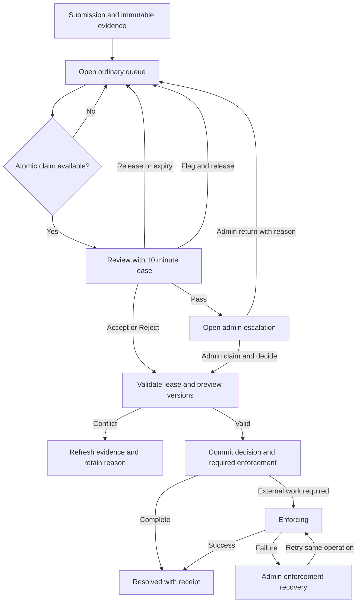
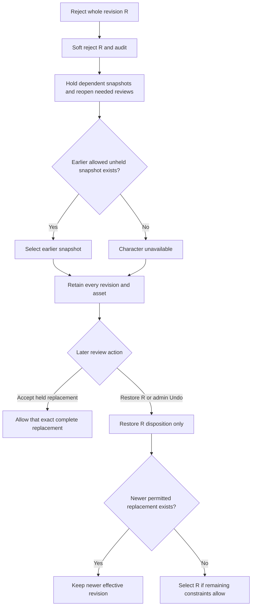

# Account Controls, Moderation, and Admin Usage Navigation

## Current implementation checkpoint — 2026-09-25

The moderator inbox, retained-draft recovery, reversible archival, protected HTTP/MCP moderation actions, admin recovery screens, spending panel, and refillable inference controls are implemented on `codex/moderation-inbox`. The dated foundation notes below describe earlier stages, not outstanding implementation gaps. The approved [inference allowance plan](2026-09-25-002-feat-account-inference-allowances-plan.md) supersedes this document's earlier generation-policy proposals, including any proposal to show players numeric balances.

The operator workflow adds current paused/pending account filters and pending-generation sorting to spending navigation, plus admin moderation links to the owner’s spending and generation controls. Account-status filters are independent of spending windows. Exhausted allowance takes precedence over burst throttling once no operation is active; a refill does not bypass burst policy.

Still outside this increment: AI moderation, worker/Lambda migration, paid tiers, unified credits, historical-media removal, and production deployment. Operator review should exercise claim/flag/pass/reject/undo wording and generation refill/pause/reconciliation before release.

Local verification for this operator-triage slice: typecheck/lint passed; 1,985 provider-free tests passed (five skipped); 1,701 PostgreSQL tests passed; four isolated browser journeys passed for inference controls and moderation. Mobile status navigation was inspected. Assistant/upload/snapshot work and operator-triage changes are included in this branch. No paid calls or production changes occurred.

## Goal and scope

Give operators an immediate way to stop an individual account's spending or participation, put durable limits around paid generation, and turn existing moderation evidence into actionable reviews. Establish reliable account attribution now so a richer admin user explorer can follow later.

The user has selected the moderator inbox and intake workflow as the first implementation target. Whole-revision decisions, no moderator profile editing, and admin-reversible soft removal are confirmed requirements. The richer sortable user explorer and any analytics subscription are explicitly deferred. Proposed numerical generation limits below are not approved policy. No production changes, paid services, or deployment are implied.

Current delivery priority: moderator inbox and intake first; account controls, generation admission, and richer metrics navigation remain follow-up tracks. The phase numbers below identify workstreams rather than their delivery order. Do not make the inbox depend on a general analytics platform or the full admin user explorer. Deployment is the rollout gate; no disabled features or feature flags.

Review outcome: the moderator workflow is specified below, including operational defaults selected during review. The inbox is one product increment, but its enforcement reaches more than the inbox UI. Complete the source inventory, protected-evidence proof, and competitive-revision integration before enabling decisions in a deployment. Deferred generation-budget and analytics questions do not block this increment.

### Implementation progress

- Plan checkpoint: committed as `35045899` before code changes; implementation branch `codex/moderation-inbox`.
- First foundation implemented: migration `0092_moderation_intake`, moderator-only RBAC grants, current database permission resolution, one-item timed claims, paginated queue/evidence reads, Flag/Pass/Release/Extend/admin-return transitions, idempotent audit receipts, and explicit ancestry for new content revisions. Existing snapshots are marked ancestry-unknown without guessing parents.
- Queue mutations currently use a short transaction-scoped advisory lock across intake writes. This deliberately serializes the small initial queue and enforces the cross-queue claim limit; there is no external I/O under the lock. Revisit finer locking only with measured contention.
- Second foundation implemented: migration `0093_moderation_effective_content`, separate latest/effective content pointers, whole-snapshot selection and fingerprinted previews, transactional Accept/Reject, dependent holds with explicit reopen audit events, held owner corrections, admin reopen and rejection Undo. Fresh authorization and lease time are rechecked after roster/profile lock waits. Name conflicts withhold publication and route recovery to escalation. Unknown ancestry is conservative; no timestamp ordering is invented.
- Current public-profile reads and future enrollment/draw/seat/freeze checks enforce unavailable characters. A held replacement leaves the earlier permitted character eligible; standing membership is retained while an unavailable character is skipped. Existing game snapshots are not rewritten. Editor concurrency checks use the latest submitted revision; MCP receipts distinguish held submissions.
- Still required before operator review: owner reads/editor recovery for retained pending drafts and owner-safe status; reversible owner archival and admin restoration; protected HTTP/MCP moderation contracts, receipt recovery, inbox and admin history/recovery screens; remaining concurrency/evidence/role matrix and browser flow verification. No moderation decision endpoint or inbox UI is exposed. Do not release these backend foundations as the completed moderation experience.
- This is cross-cutting enforcement work: publication pointers, rating revisions, roster freeze, immutable evidence, and owner draft receipts must agree before enabling a Reject button. The operator scope decision removes historical-media withdrawal from this increment; no further operator policy choice is currently blocking implementation.
- Validation for the first foundation (superseded by the final verification record below): `bun run check` passed; `bun run test` passed (1,981 pass, 5 skip); `bun run test:postgres` passed (1,667 pass). Focused coverage includes 23 PostgreSQL tests across moderation intake and content submissions. These are local results; no moderation UI, production migration, deployment, or paid-provider verification has occurred.

### Verification checkpoint — 2026-09-25

- `bun run check`: passed after the final code changes.
- `bun run test`: 1,981 passed, 5 skipped. The first sandbox attempt failed two local-socket harness tests; the rerun with loopback access passed.
- `bun run test:postgres`: 1,679 passed, zero failures. The initial run caught the new receipt field missing from the strict MCP schema and one exact receipt expectation; both were corrected before this passing run.
- Final focused PostgreSQL run after the last concurrency guards and historical-portrait change: 80 passed across moderation decisions/intake, submissions, queue enrollment, watch-state, and highlights. Stored game portraits take precedence over current-profile enrichment; an unavailable current profile does not remove a portrait retained in the game snapshot.
- Local migrations and deterministic tests only. No production migration, paid provider call, browser verification, deployment, or exposed moderator decision endpoint. Implementation changes remain uncommitted on `codex/moderation-inbox`; the earlier planning checkpoint is committed.

### Follow-up integration review — 2026-09-25

See [Moderation integration review and recommendations](2026-09-25-001-review-moderation-integration-recommendations.md) for source-backed findings, recommended owner/lifecycle/API/UI contracts, flow, and browser acceptance matrix. Prerequisites identified by that review include editor snapshot/version mismatch, partial corrections using the wrong base, the remaining hard-delete path, escalated parent evidence exposed through ordinary children, and preview/execute outcome differences. These findings are not yet fixed by the backend verification above. The recommended next slice is owner draft recovery; no additional operator policy decision or worker infrastructure is needed.

## Verified starting point

Repository inspection on 2026-09-24 establishes the following. Production environment overrides and existing production role assignments were not inspected.

| Area | Current implementation |
| --- | --- |
| Character images | Default 5 attempts per rolling 24 hours and 25 lifetime, shared by legacy avatars and full-body references. Sysops bypass the allowance. Failed attempts count. |
| Creation assistant and profile refinement | Authenticated endpoints with per-call output bounds, but no per-account cumulative request or spend allowance. |
| Image recovery | Durable request identities and serialized per-user reservations already exist. Exact recovery must not create another paid attempt automatically. Cropping is not a paid image generation. |
| Owner learning | Separate earned-credit entitlement and rolling 24-hour start limit; retain this policy. |
| Game creation | Explicit `create_game` permission. Seeded `gamer`, `admin`, and `sysop` roles grant it; `player` grants joining. Do not give every account game-creation rights. |
| Authorization | Ordinary authenticated route permissions come from the session. Revoking a role alone is not an immediate account spending stop. |
| Moderation | Submission writes immutable content revisions, retained image evidence, and pending review records alongside an active profile. No moderation worker, decision panel, or enforcement yet. |
| Metrics | Existing provider, image, and game journals hold useful evidence. They are not yet a unified account usage ledger. |

Primary references:

- `packages/api/src/services/avatar-generation.ts` — `checkAvatarGenerationQuota` and environment defaults.
- `packages/api/src/services/visual-render-journal.ts` — owned image reservations and recovery.
- `packages/api/src/routes/agent-profiles.ts` — creation assistant, refinement, reference generation, and cropping.
- `packages/api/src/services/owner-learning-eligibility.ts` — review credits and rolling eligibility.
- `packages/api/src/middleware/auth.ts`, `packages/api/src/db/rbac-seed.ts` — session authorization and seeded permissions.
- `packages/api/src/services/agent-content-submissions.ts`, `packages/api/src/db/schema.ts` — content revisions, assets, and pending moderation records.
- `packages/api/src/services/provider-call-journal.ts` — provider attempt and usage evidence.
- `packages/web/src/app/admin/admin-tabs.tsx`, `packages/web/src/app/admin/agents-admin-panel.tsx` — existing admin navigation.
- [Character drafts and moderation evidence](../agent-content-submissions.md).
- [Development and operations](../development-and-operations.md).

## Phase 1: Immediate account controls

Persist account-level restrictions keyed by the stable internal user ID, independent of wallet, login provider, role, or agent. Restrictions only remove access; lifting one never grants an underlying permission.

| Control | Effect |
| --- | --- |
| Disable AI generation | Deny new account-requested paid text, image, and learning-review starts, including tools. Allow reads and safe retrieval of already recorded results. |
| Disable game creation | Deny create, fill, and start operations that can initiate game expenditure, including already waiting games. Ordinary join permission remains separate. |
| Suspend account | Deny authenticated mutations, queue eligibility, new enrollments, and new account-requested paid work. Permit the owner to read the restriction and contact/support instructions. |

Use a small account restriction record plus append-only action audit: acting admin, target account, previous/new state, reason, timestamp, and operation ID. Introduce explicit permissions for managing restrictions and reviewing moderation rather than granting every admin unrestricted powers. Restrict actions against sysops and changes to privileged exemptions to sysops; prevent self-lockout through the admin controls.

Enforce at the shared service/admission boundary across browser REST, MCP, background work, and queued jobs. Check current database state again before a new provider dispatch, not just when the UI opens or a session is minted. Serialize restriction updates and reservation/dispatch admission for the same account so their ordering is defined. A dispatch admitted before the restriction may finish; a later one must be denied. Do not promise cancellation or refund of an external call already dispatched.

Suspension removes standing queue eligibility and is checked at draw/start time as well as enrollment. It does not silently rewrite a running game's roster or accepted events; stopping an already running game is an explicit operator action. Outstanding generated results may be reconciled for accounting, but cannot publish a profile or bypass restrictions.

Acceptance: an old session or MCP credential cannot bypass a new restriction; direct API calls behave like the UI; background jobs respect restrictions; lifting a restriction restores only independently authorized operations; repeated admin requests do not duplicate audit actions.

## Phase 2: Durable generation admission and minimal account screen

### Metering contract

Extend the existing journals where possible. Add only the missing durable identity/admission records for creation assistant and profile-refinement operations. Avoid a second conflicting source of billing truth.

Attribute each logical operation to a user and operation kind, with optional agent/game references, request ID, payload fingerprint, policy version, timestamps, and state. Link provider attempts to that operation and record provider/model, known token/image usage, outcome, duration, and cost evidence. Distinguish measured, estimated, unpriced, and uncertain cost; missing cost is never zero. Store currency units consistently with the existing accounting code.

Count logical requests and actual provider attempts separately. An exact retry returns or reconciles its existing operation; reusing a key with changed input fails clearly. Internal retries remain visible as attempts and consume the operation's bounded retry budget. Refreshes, status polls, and result reads do not consume generation slots.

Admission must atomically check live restrictions, allowance, burst rate, and concurrency before reserving work. Known pre-dispatch rejection releases a reservation. After dispatch, failure or uncertainty retains it until evidence supports reconciliation. A browser disconnect or local cancel cannot release an uncertain paid reservation. Persist recovery state so process restarts and multiple workers cannot duplicate calls or bypass limits. If admission storage is unavailable, deny new paid work with a clear retryable error.

### Proposed initial policy, not yet approved

| Budget | Starting proposal |
| --- | --- |
| Character text generation | 50 logical operations per rolling 24 hours, shared across assistant and refinement; validate against representative full creation sessions before adoption. |
| Text burst and concurrency | 5 starts per minute, at most 1 active text operation per account. |
| Character images | Retain 5 per rolling 24 hours and 25 lifetime; at most 1 active character-image operation per account. |
| Learning reviews | Retain existing earned credits, rolling limit, and recovery allowance; add account restriction checks without charging a second entitlement. |
| Sysop exemptions | Preserve existing image/review exemptions, show them explicitly, and audit policy overrides. Restrictions still take precedence. Do not silently make new text budgets unlimited. |

These are operation allowances, not a hard dollar ceiling. Provider retries, model prices, localization, and game activity can make cost differ substantially. A hard monetary reservation requires conservative per-operation cost bounds and a policy for unpriced work; decide this separately rather than presenting estimates as enforced billing caps. Preserve provider-level timeout/retry/token bounds.

Return a consistent owner-visible usage summary and rejection response: budget kind, used/reserved/remaining amounts, rolling reset estimate, and restriction reason safe to show the owner. Do not show a misleading numeric balance for exempt accounts. Keep drafts intact when a limit is reached. Hiding a button is presentation, never enforcement.

### Minimal admin account navigation

Add a Users entry in admin with paginated account search and an account detail route. Support searching by authorized account identifiers; keep internal IDs, email, wallet, and billing data out of public APIs. The first version needs no arbitrary metric sorting.

Account detail shows identity, roles, restrictions, associated agents, recent operations, current allowances, and action history. Give admins working links from agent and moderation records back to the owning account. Restriction actions require a reason, explain their scope, and show success/failure with a refreshed server result. Provide authorized tool/API parity for reads and actions.

Acceptance: concurrent and cross-endpoint requests cannot overspend; exact retries are idempotent; limits survive restarts; cancellation and uncertain provider outcomes retain correct accounting; distinct accounts remain isolated; UI and tools expose consistent limits; no additional image slot is charged for crop or localization within an existing operation.

## Phase 3: Moderation inbox and enforcement

### First implementation target: moderator inbox

Introduce a dedicated `moderator` role. Moderators, admins, and sysops can open a dedicated moderation route without receiving general admin access. Use a moderation permission independent of `view_admin`; grant a separate escalation-review permission to admins/sysops only. A moderator must not gain role management, private account analytics, game operations, or provider credentials through this role.

Moderators cannot edit another owner's profile, replace its images, rewrite text, or submit a corrected revision. They only decide whole revisions through the review actions below. This prohibition is enforced by server permissions as well as the UI. Restoring an existing revision by overturning a rejection is a moderation decision, not permission to author profile content.

All moderators can browse the entire ordinary queue by default, including claimed work with its owner and expiry. Reviewers can take a specific entry or choose Take next. Start with one active entry per reviewer and a 10-minute server-timed lease; defer batch claiming. Provide explicit Release and Extend actions. Claim expiry makes the item available again without altering its content disposition, flag, or audit trail. A stale browser cannot act after expiry or reassignment. Claim acquisition and decisions must be atomic under database concurrency; retries with the same action ID must not duplicate outcomes. Lease expiry must work even if a cleanup worker is delayed. Detailed defaults appear in the operational contract below.

Show the submitted change, prior content, exact retained images, current allowed/rejected disposition, flag reasons, intake source, and prior review history. Label pending content as unreviewed. Do not render a mutable image URL as evidence when retained bytes are available. Account links expose only moderator-authorized context. Reviewers cannot claim or decide their own submissions, including admins/sysops; another authorized reviewer must handle them. If none is available, leave the work pending rather than silently allowing self-review.

### Decision semantics approved by the user

Queue workflow, content disposition, and flags are separate state. Accept and Reject judge the entry's current disposition; they are not synonyms for unconditionally publishing and hiding content.

| Action | Currently allowed | Currently rejected | Queue effect |
| --- | --- | --- | --- |
| Accept | Keep allowed | Keep rejected | Resolve and remove from ordinary queue |
| Reject | Reject/remove the change | Restore the change | Resolve after successful enforcement |
| Flag | Leave disposition unchanged | Leave disposition unchanged | Retain in ordinary queue with a visible flag |
| Pass | Leave disposition unchanged | Leave disposition unchanged | Move to admin/sysop-only escalation queue |

Accept on rejected content upholds rejection; it does not restore it. A flag is a durable annotation, not a content rejection or an escalation. Pass is an escalation, not a skip: use a distinct Release action for simply returning work to the ordinary queue. Flag saves the reason, releases the claim, and leaves the item available. Flag and Pass require reasons; rejecting a disposition requires a reason. Preserve reasons and flags in history after resolution.

Keep the user's four actions but add explicit outcome text beside Accept/Reject, such as Keep rejected or Restore change. Never require a moderator to infer a double negative. Capture the disposition and review version shown to the reviewer; reject stale decisions with a clear conflict and refresh rather than applying a toggle to changed state. Server commands specify the expected state and desired result, not a blind toggle.

Passed entries disappear from ordinary queue responses, counts, and claim endpoints, not merely from the moderator UI. Admins/sysops get a small separate escalation tab with evidence, pass reason, claim/lease behavior, and Accept/Reject/Flag controls. Pass is not available inside escalation, since the entry is already escalated. They may explicitly return an entry to the ordinary queue with a reason. No full meta-moderation dashboard is needed in this pass. Later dashboards can show queue age, throughput, expired claims, escalations, overturns, and per-reviewer outcomes; define their metrics before using them to assess people.

### Intake and enforcement boundary

Reuse the existing transaction that creates an immutable content revision and pending review. Repeated submissions with the same receipt cannot create duplicate work. Enqueue exact revisions and their initial disposition. Existing pending records enter the inbox as unreviewed, not as implied approvals. Approved/rejected history remains accessible through authorized detail/history reads. Only an explicit, audited reopen creates another review cycle for resolved work; revisions and flags must not silently recreate tasks.

An immutable action history records reviewer identity, claim identity, source (human/system/future AI), expected review version, reason, old/new disposition, timestamps, and enforcement result. Review decisions target the exact revision and cannot overwrite a newer user edit. Decide the visibility/eligibility change and queue resolution transactionally where possible. For external asset effects, retain explicit enforcement-pending or enforcement-failed state and recovery; never show resolved removal before the required effects have succeeded.

**Confirmed removal contract:** accept or reject the whole submitted content revision, never selected fields. Rejection soft-removes the change and may unwind the character to an earlier permitted revision; rejection of an initial revision with no permitted predecessor leaves the character unpublished/ineligible, not physically deleted. Retain every revision, image evidence, review action, and character identity required to undo the removal. No moderation action hard-deletes these records or rewrites their original contents.

Restoring a rejected revision must not roll back newer permitted user edits. Superseded revisions remain reviewable as exact evidence, but a decision that changes the effective character requires a preview of the current history and its version. Stale previews fail with a conflict. The operational contract below defines dependent-revision holds and conservative restoration. Show which revision will become effective and whether the character will become unavailable before submission. Do not use competitive revision history or transcript prose as a substitute for content revision authority.

Include a minimal admin/sysop-only Removed content/history view in the first pass, linked from escalation and review details. It lists soft-removed revisions and unavailable characters with the original evidence, actor, reason, and effective revision. An authorized Undo action appends a compensating decision; it does not erase the original rejection. Require a reason, expected current state, and a preview of the restored result. Undo is idempotent, conflict-aware, and cannot override unrelated restrictions or silently reactivate a superseded version. This recovery surface is necessary for reversible moderation; the richer meta-moderation dashboards remain deferred. Moderators retain the previously specified Restore change action on a claimed rejected inbox item, but cannot independently undo arbitrary resolved history through the admin recovery surface.

This enforcement scope affects public profile/card reads, future queue/game admission, owner editing, and REST/MCP parity. Existing running games and historical events are not silently rewritten. Preserve publish-then-review for unrestricted submissions. Once a character has been rejected, replacement submissions remain held for human review; the owner cannot clear that hold by changing an unrelated field or resubmitting the same bytes. This is a character content hold, not the deferred account suspension feature.

**Operator-confirmed scope (2026-09-24):** revision rejection affects the current profile and future game eligibility only. Historical games, frozen artwork, trailers, and existing public object URLs remain unchanged. Historical-media removal is a separate, future admin action; it is not part of this release. Show this boundary in the decision preview and receipt. Protected retained evidence still requires fresh authorization and `private, no-store`. Do not describe a revision rejection as a global asset ban or erasure. Cached/downloaded copies cannot be recalled. No storage/CDN withdrawal workflow is required for this initial scope.

An AI intake stage is a later producer of the same review records and disposition evidence. Preserve source and reason/provenance fields now so humans can uphold or overturn an AI rejection through the same workflow. Record model/policy versions and uncertainty when an AI workflow exists. Do not build dead AI buttons or dispatch paid classifiers in this pass. Failed classification never implies approval. No new moderation vendor or automatic account ban is required for the first inbox.

Acceptance: cover all eight disposition/action combinations, concurrent claims, one-active-claim enforcement, lease expiry/reassignment, explicit release/extension, flag persistence, pass isolation, admin return, reviewer role revocation, self-review policy, idempotent decisions, stale disposition/revision conflicts, and enforcement failure recovery. Reviewed evidence matches its revision; stale decisions cannot approve later edits; rejected content is excluded at all agreed public/eligibility boundaries; owner edits and retries cannot evade rejection; moderator access and asset reads are authorized and audited; historical game facts are preserved. Exercise the whole claim-review-next flow in browser tests and equivalent authorized tool/API paths.

### Operational contract established during review

These defaults fill unspecified workflow details. They do not change the four user-defined decision semantics.

#### State and authority

Keep four independent facts rather than overloading `status`:

| Fact | Values / purpose |
| --- | --- |
| Revision disposition | `allowed` or `rejected`; pending review is not a third disposition or evidence of approval. |
| Review workflow | `open`, `enforcing`, `enforcement_failed`, `resolved`; route is separately `ordinary` or `escalated`. |
| Claim | Reviewer, unguessable lease token, server expiry, acquisition time; absent/expired means claimable if workflow is open. |
| Publication hold | Explicit reason/reference preventing an otherwise allowed revision from becoming effective; e.g. descendant of rejected content or replacement awaiting review. |

Flags are append-only annotations. Effective publication requires an allowed disposition, no unresolved hold, successful required enforcement, and ordinary eligibility rules. Rejection is not an account ban. An accepted queue item is not necessarily public: Accept on rejected content keeps it rejected.

Retain the existing revision-to-review identity, with a monotonic review version and cycle number for explicit reopen. Every command includes an action UUID and expected versions; claim-dependent commands also include the lease token. Same ID and payload returns the recorded result; a changed payload is a conflict. Audit writes and state changes occur in the same transaction. Audit event identity persists after lease expiry or role removal; role removal still denies new reads and actions.

Use current database permissions for moderation reads, evidence downloads, claims, decisions, escalation, and undo. A valid session proves identity, not current moderator authority. Introduce narrow permissions such as `review_agent_content`, `review_moderation_escalations`, and `undo_moderation`; seed the first for moderator/admin/sysop and the latter two for admin/sysop. Existing role-management permission controls assignments. A moderator may still edit their own agents through ordinary owner routes; the moderation role never grants editing rights over others.

#### Claim and inbox flow

- `/moderation` is the shared inbox, with All, Available, Mine, and Flagged filters; All is the default. Page size 25, stable oldest-first ordering by review creation and ID, with server pagination. Show counts by workflow without exposing escalation counts to ordinary moderators.
- Take next chooses the oldest eligible ordinary item, excluding own submissions and an item this reviewer flagged in its current cycle. Direct selection can reclaim a flagged item deliberately. A resumed page shows the existing claim rather than claiming another.
- Claims last 10 minutes. Extend resets expiry to 10 minutes from server time, capped at 30 minutes from acquisition; it does not extend on passive reads or hidden tabs. Beyond the cap, release/reclaim if still available. Batch assignment and automated heartbeat extension are deferred.
- One live claim per reviewer across ordinary and escalation queues. Acquiring a new claim invalidates any expired prior token atomically. Claimable queries compare server time directly; a sweeper is optional housekeeping, not correctness authority.
- Use the repository's existing profile/roster lock order for content effects. Define and test a consistent lock order for reviewer assignment, review record, profile, and eligibility writes. Do not add a reverse lock order or hold a database transaction open while fetching assets/CDN responses.
- Flag/Release leave the route unchanged; Pass moves ordinary work to escalation and drops the claim. Admin return-to-queue drops the escalation claim and preserves its reasons. No auto-advance after a failed command; after success offer Take next with the receipt visible.
- Display the expiry countdown using server-provided time. After expiry, role loss, network uncertainty, or a version conflict, disable decisions and refresh/reconcile the original action ID. Preserve unsent reason text locally without copying private evidence into analytics.
- Escape releases only through an explicit action; closing a tab leaves the lease to expire. Keyboard shortcuts must not trigger destructive decisions while typing. Rejection/restoration previews show the effective before/after revision and impacted character availability.

Inbox states must distinguish No work, All work claimed, Your claim expired, Permission removed, Evidence unavailable, and Request failed. A failed fetch never renders an empty queue. Keep keyboard focus on the action result or next review heading; announce expiry/conflicts and avoid exposing reasons only by color. Reviewer comments are internal by default; a separate owner-safe reason accompanies removal and appears in the character editor. Email delivery, appeals automation, and general notifications are deferred; owners can submit a correction and admins can explicitly reopen disputed work.

Use one shared moderation service for browser and tools. Suggested route contract: list/detail/evidence reads under `/api/moderation`; explicit claim, extend, release, preview, and decision commands on a review; action-receipt reads for lost-response recovery; separate permission-checked escalation return, reopen, and undo commands. Use typed errors: authentication/permission denial, inaccessible item, claim unavailable, lease expired, stale review, stale character, evidence unavailable, and enforcement pending/failed. Do not expose existence or evidence of passed items through guessed IDs to ordinary moderators. MCP tools call the same service and require dedicated moderation authority; existing agent-writing scopes alone cannot grant moderation.

#### Whole-revision unwind and later edits

Content revisions are full snapshots. Current storage records no explicit parent revision; implementation must add reliable parent/sequence metadata for new submissions under the profile lock. Separate the latest submitted revision from the effective public/game-entry revision. Authoring reads show both when they differ; future game admission reads only the effective eligible revision. Do not create a phantom user-authored submission when a moderation decision changes that selection.

Rules for the first implementation:

1. Rejecting a revision records a soft rejection and places existing descendants that may inherit it on a review hold, including descendants reviewed before the rejection. A hold is not an invented rejection of their entire content. Conservative holds can temporarily remove harmless changes; the preview must show the affected revisions.
2. Recompute the effective revision as the newest allowed, unheld, applicable snapshot before the rejected branch; if none exists, the character is unavailable. Never merge fields from different snapshots. If restoration cannot satisfy current schema or uniqueness constraints, keep it unavailable and create admin recovery work rather than alter content to make it fit.
3. A held, allowed descendant can be independently reviewed as a complete snapshot. Accept keeps its allowed disposition, clears that revision's relevant review hold, and permits selection if it is the newest applicable approved replacement. Reject soft-rejects it. Existing resolved reviews that now need this decision get an explicit system reopen event linked to the ancestor rejection, not duplicate inbox rows. Reopened versions invalidate old claims.
4. After a rejection, new owner submissions remain held until reviewed. Owners can base their correction on the selected earlier revision, see why it is held, and submit a replacement; they cannot directly publish it. An identical rejected snapshot retains its rejection and cannot obtain automatic approval through a new request ID. A separately created character still enters ordinary intake; cross-character/account content deduplication is not claimed in this pass.
5. Restoring a rejected snapshot or undoing its rejection does not clear every descendant hold or resurrect the latest historical snapshot automatically. Restore its allowed disposition; select it only when no newer permitted replacement would be displaced. Report disposition restoration and effective-publication outcome separately. Admins can explicitly reopen held descendants for full review.
6. Queue decisions on older snapshots remain useful, but their impact preview includes the current effective revision and history version. A later owner edit, moderation decision, undo, or reopening makes that preview stale; no silent rebase of a reviewer's action.

Example: R1 is permitted, R2 changes an image, R3 changes only a biography while retaining R2's image. Reject R2: R2 is rejected, R3 is held, R1 becomes effective. Accepting a corrected complete R4 publishes R4. Undoing R2 afterward restores its disposition but leaves R4 effective. Rejection of an initial R1 with no alternative makes the character unavailable; its identity and audit remain intact.

#### Minimal admin recovery and undo

The escalation tab and Removed content/history view are required recovery tools, not the deferred metrics dashboard. They include evidence, decision history, held descendants, selected revision, failed enforcement, and a versioned effect preview. Admin actions are Accept/Reject, return to moderators, retry enforcement, reopen a resolved review, and Undo a prior decision. Undo references the original action, appends a compensating event, and recalculates current constraints; it never deletes history. Undo of an already compensated action is idempotent, and contradictory intervening decisions produce a conflict instead of an automatic toggle. Admins do not edit profile fields through recovery.

Once an enforcement job is durable, claim expiry does not cancel it or make its item claimable. Jobs use the decision's immutable identity and version; old retries cannot re-hide an asset after a later restore. If Undo arrives while external enforcement is active, record a superseding version and reconcile to the newest desired state. Recovery needs bounded retries, explicit error state, and operator retry using the same operation—not an untracked new moderation decision.

#### Source integration and release gates

| Boundary | Required behavior / verification |
| --- | --- |
| Profile mutation and receipts | Lock against moderation selection changes; stale `expectedContentRevisionId` fails. Exact submission retries remain historical receipts and cannot reactivate content; return/read current availability separately. |
| Competitive revisions | Restore snapshot behavior through the existing competitive-revision service without fabricating a moderator-authored profile edit. Preserve existing rating recalibration policy, accepted game seats, and settlement history. Verify name uniqueness, head geometry, and current schema constraints before selection. |
| Owner deletion | `routes/agent-profiles.ts` currently hard-deletes unused profiles and competitive revisions. Replace that path for moderation-managed character history with reversible archival, retaining existing active-game/rated-history protections. Archival must not erase claims, decisions, evidence, or identity, and ordinary Undo cannot override an independent owner archive. |
| Queue and game start | Recheck effective eligibility under the owning transaction at enrollment, draw, seating, and start. Retain a standing enrollment record if held, but skip it and show the owner why. Already running games retain canonical seats; owner correction does not rewrite them. |
| Public reads and tools | Profile, discovery, episode cards, current-agent replay enrichment, REST, and MCP agree on effective content. Owners see their held submissions and safe reasons. Internal reviewer notes/identity and escalation details are not owner-visible. |
| Assets and caches | Use protected evidence routes with current authorization and `private, no-store`; retain original bytes for review and restoration. Public object URLs are outside the initial removal scope; do not claim they are revoked. |
| Historical presentation | Do not mutate canonical events or regenerate paid scenes automatically. Preserve historical artwork and trailers. Historical-media removal is a separate future admin action, per the operator decision; no media withdrawal is a release gate for this inbox. |
| Historical intake | Existing pending rows enter unchanged as ordinary unreviewed work. Do not infer exact parentage from UUID or tied timestamps. Preserve any proved ordering and mark uncertain histories; when safe rollback cannot be established, soft-withhold the character and escalate rather than guess. |

Backfill required structural metadata only from recorded evidence, with a dry-run count and idempotent migration. Profiles predating content revisions are explicitly outside revision-review coverage until a baseline is captured; list that coverage gap for admins instead of treating them as approved. Missing/unreadable evidence permits Flag/Pass but blocks Accept/Reject until recovery. A baseline/evidence capture that requires reading production objects must be a separately reviewable operation with failures visible.

No raw prompt or image evidence in general telemetry. Display untrusted submitted text as text, not executable HTML. Protect evidence endpoints independently of navigation and ensure CDN/browser caching cannot retain authorized URLs as permanent public access. Audit actor identity is retained for admins; avoid exposing reviewer personal contact data to other moderators.

### Review findings and implementation checkpoints

| Finding | Resolution in this revision |
| --- | --- |
| Queue status conflated with allowed/rejected publication | Separate workflow, disposition, claims, and publication holds; retain all four action meanings. |
| Rejection could be bypassed by a later full snapshot | Hold dependent snapshots and post-rejection replacements; independently review complete replacements. |
| Undo could overwrite later edits | Versioned effect preview, compensating events, explicit selection rules, no automatic descendant restoration. |
| Soft-delete promise conflicted with owner delete route | Include reversible archival and evidence retention in integration scope. |
| Pass/Flag/lease behavior left stranded work or authority gaps | Define escalation-only access, no nested Pass, release rules, one global claim, bounded renewal, and fresh authorization. |
| UI-only rejection could falsely imply asset removal | Explicitly scope rejection to current profile/future eligibility; preserve historical media and explain this in previews. |
| Review could drift into unrelated rate-limit or analytics work | Keep those workstreams deferred; only role, inbox, evidence, enforcement, and recovery ship now. |

Implement in reviewable steps within the same product increment: (1) schema/state transitions and authorization tests; (2) transactional decision/effective-revision and archival logic; (3) protected evidence and recovery proof; (4) moderator inbox plus minimal admin recovery; (5) browser/tool end-to-end and migration rehearsal. Do not deploy an operational Reject button before its agreed enforcement is complete.

Add concrete tests for R1/R2/R3/R4 above; rejected initial creation; own-submission denial; role revocation while claimed; two tabs acquiring/renewing/deciding; claim expiry at the decision boundary; stale undo versus active enforcement; unrelated user updates; unavailable names/assets on restore; same rejected content resubmission; owner archive then admin undo; queued/drawing games versus rejection; historical media remaining unchanged; and old histories with missing ancestry/evidence.

## Phase 4: Rich admin user explorer — deferred

The eventual user explorer supports search, filters, sortable metrics, and direct account drill-down. Proposed columns:

- Account age, last activity, roles, restrictions, and moderation status.
- Logical LLM operations, actual provider attempts, input/output tokens, failures, and active work.
- Image attempts, completed images, failures, and remaining allowance.
- Known and estimated cost, with visible uncertainty and coverage.
- Agents created, games created, games played, and moderation backlog.

Support explicit 24-hour, 7-day, 30-day, and all-time windows. Sort on server-computed numeric metrics with stable tie-breakers and pagination. Keep filters/sort in the URL, provide a visible data freshness timestamp, and distinguish unavailable historical metrics from zero. Account detail drills from aggregate to operation to provider attempt without exposing unrelated private prompts.

For games, separate the initiator, participating accounts, and system-sponsored payer. Do not charge every participant the entire game's calls, or label all game expenditure as an account's own generation usage. Daily Free and other shared games need an explicit attribution model before account spend comparisons are credible.

Build versus buy remains open. Start with indexed PostgreSQL records and add derived aggregates only when query volume warrants them. Later evaluate managed analytics on ingestion cost, retention, dimensions, freshness, access controls, exportability, and maintenance effort. Enforcement and authoritative receipts stay in the application database even if dashboards use an external system. Do not export raw prompts, images, credentials, email, or wallets by default.

Historical reconstruction must be idempotent and based on durable ownership/provider evidence. Mark collection start dates and coverage gaps. Add a resumable operator backfill only if that reconstruction is needed; do not invent historical counts or costs from generic activity logs.

## Delivery and validation

1. Map whole-revision unwind/restore semantics onto revision ancestry, resubmission behavior, and current-profile/future-eligibility enforcement. Inventory all affected reads and admissions before coding enforcement.
2. Ship the moderator role, inbox/intake, one-item leases, four review actions, minimal admin escalation and undo views, immutable decision history, and agreed enforcement as the first working increment. Validate permissions from current server authority for moderation operations, including old sessions and tools. Cover rejected initial revisions, earlier-version selection, undo after intervening edits, retained evidence, and denied moderator profile writes.
3. Follow with account restrictions and the minimal account controls screen, independently of the deferred analytics explorer.
4. Ship durable text admission and shared usage reads after approving allowance policies; this work can be separately scheduled from moderation.
5. Revisit the user explorer and analytics vendor only after actual usage and query needs are understood.

Use additive schema changes where necessary, migrate before serving dependent code, and document rollback. Once restrictions or review decisions exist, do not roll back to a version that ignores them. Keep accepted receipts and review evidence during recovery. No implementation-only compatibility layers or speculative generic policy engine.

Each code increment runs `bun run check`, `bun run test`, and `bun run test:postgres`, plus focused browser stories for its admin and owner flows. Use provider-free fakes for concurrency, malformed results, retry/recovery, quota boundaries, stale sessions, suspension races, authorization, and revision conflicts. Paid calls, real auth, and staging exercises remain explicit opt-ins. Add query/index checks before shipping metric sorting.

Update `docs/agent-content-submissions.md`, operations documentation, and admin/tool contracts with the implemented behavior. Report local, CI, staging, and production evidence separately.

## Remaining decisions and proof boundaries

For the initial inbox, operational defaults are now specified: one 10-minute claim with bounded explicit renewal, Flag releasing the claim, no self-review, ordinary publish-then-review, held replacements after rejection, and admin/sysop escalation/undo. Whole-revision decisions, no moderator profile editing, and reversible soft removal are user requirements.

Before production activation, operators need a written prohibited-content guideline and an owner-facing support route. The implementation can use explicit reviewer reasons without inventing an automated policy or enforcement thresholds. Preserve audit evidence by default in this increment; do not introduce retention-based hard deletion. Any later legal retention/erasure policy is separate from reversible moderation.

Technical release gates remain: prove historical ancestry coverage, competitive-revision selection/rating behavior, and current-profile/future-eligibility enforcement with historical media unchanged. These require repository/storage investigation and migration rehearsal, not a broader admin dashboard. Report any existing public copies that cannot be withdrawn rather than claiming complete removal.

Deferred workstream decisions, which do not block the moderator inbox:

- Approve or adjust text allowance, burst, concurrency, and sysop policies after measuring a normal creation flow.
- Decide whether to keep the 25-image lifetime sponsored allowance and how an operator grants additional allowance without deleting receipts.
- Decide whether an initial dollar ceiling or a platform-wide emergency generation stop is required in addition to account controls.
- Consider approval before first publication for all/new accounts; the first inbox preserves normal publication except explicit moderation holds.
- Decide account-restriction, usage, and allowance-adjustment permissions; initial moderation permissions are already specified above.
- Define game spending attribution before exposing comparable per-account cost metrics.

No vendor purchase, metrics-history backfill, bulk account restriction, or automatic AI moderation is implied by this plan. Structural moderation migration and any historical baseline capture require the explicit dry-run/review steps above.

## Implementation checkpoint — 2026-09-25

The first moderator-facing increment now includes draft recovery, reversible archival, protected HTTP/MCP review commands, moderator work assignment and decisions, admin escalation/recovery, and whole-revision enforcement. Implementation notes and the verification boundary are in [the integration review](2026-09-25-001-review-moderation-integration-recommendations.md). Migrations 0092–0095 are part of this increment. Account budgets, AI moderation, workers, historical-media removal, and advanced account navigation remain deferred.

Operator review is the next product gate: inspect `/moderation` as a moderator and `/moderation/recovery` as an admin, especially the Accept/Reject disposition wording and the separate Flag, Pass, Release, reopen, and Undo actions. Historical media remains unchanged. Local automated verification is not deployment approval.
