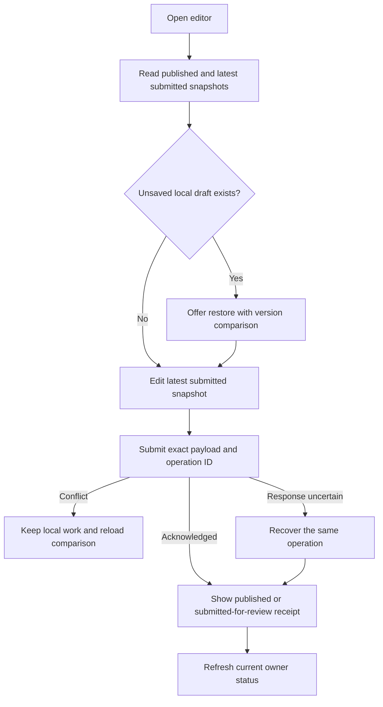

# Moderation integration review

Recommendation: finish the owner content contract and recovery boundaries before exposing decisions. Keep this release in the existing API and PostgreSQL transaction model. Nothing reviewed here requires Lambdas, a worker fleet, an AI classifier, or a metrics subscription.

This is a source review of the uncommitted `codex/moderation-inbox` implementation. No application code was changed or tests/browser sessions run for this review. Earlier passing suites establish the existing backend baseline; they do not prove the absent endpoints or screens. The recommendations below preserve the approved scope: current profile and future eligibility only, whole revisions, no moderator editing, admin-reversible removal, and unchanged historical media.

## Concrete findings to address before exposure

| Priority | Finding and consequence | Evidence | Recommendation |
| --- | --- | --- | --- |
| High | Editor fields come from the effective profile, while the save token comes from the latest submission. Reopening after a held correction can submit old published fields with a valid new token. | `routes/agent-profiles.ts:523`, `agent-form.tsx:191` and `:226` | Return published and latest submitted snapshots separately; initialize the editor from the latest submission and its matching version. |
| High | Held partial updates merge into the effective profile. A second PATCH can discard fields changed by the first held PATCH. | `services/agent-profile-management.ts:791` and `:807` | Resolve the latest submitted snapshot as the PATCH base; never silently substitute the published snapshot. |
| High | Owner deletion still detaches seats, deletes competitive revisions, and deletes the identity. Adding `archivedAt` has not replaced this path. | `routes/agent-profiles.ts:677` | Replace the deletion transaction with audited archival and retain all references. Add archive-aware reads and writes before making archive available. |
| High | An ordinary review loads its parent without checking that parent's review route. Evidence authorization also accepts parent-only hashes. A passed parent can therefore be exposed through an ordinary child. | `services/moderation-intake.ts:179` and `:190` | Authorize comparison revisions independently. Hide restricted parent detail and deny parent-only assets; a hash referenced by the authorized child remains legitimate child evidence. |
| High | Preview selects a revision without checking the name/schema/evidence constraints checked during execution. It can promise publication and then withhold instead. | `services/moderation-intake.ts:110` versus `:370` | Share effect resolution between preview and execution; revalidate under locks and require a refreshed preview when the presented outcome changes. |
| Medium | Successful held submissions use the normal navigation/draft-retirement path without displaying the receipt outcome. | `agent-edit-content.tsx:65`, `agent-form.tsx:631` | Show “Submitted for review,” with current publication unchanged; retire the local draft only after acknowledged durable submission, and recover it from the server next time. |
| Medium | The dashboard explains every temporary queue exclusion as an active game. That is false for moderation holds. | `dashboard-queue-entry.tsx:40` | Return a typed owner-safe eligibility reason and render accurate copy for moderation, active game, and archive. |
| Medium | Current queue reads only list pending work; detail history omits actors and effect results. They cannot yet support admin recovery/history. | `services/moderation-intake.ts:158` and `:182` | Add bounded recovery/history reads with safe actor labels, before/after effects, recovery codes, and available actions. Never expose raw claim receipts as history. |

API source paths above are relative to `packages/api/src/`; editor paths are under `packages/web/src/app/dashboard/agents/`, and the queue component is under `packages/web/src/app/dashboard/`.

## 1. Pending-draft recovery — high integration complexity

Use one owner read contract across REST and MCP:

- Stable identity and `moderationVersion`.
- `published`: effective revision and content, or null; availability reported separately from archival.
- `submitted`: latest revision and complete content, with disposition, hold, and review status. Omit internal asset maps, reviewer notes, reviewer identity, and escalation details.
- Owner-safe status/reason and permitted owner actions. A rejected submission, held replacement, permitted published snapshot, and archived identity are distinct facts.

Keep immutable content revisions as the server's durable record of submitted drafts. There is no need for another server draft table. Unsaved edits remain in the existing tab-local draft. Default editing to the latest submitted snapshot, including a rejected snapshot that needs correction. Provide an explicit “Start from published version” choice when there is a permitted predecessor; this prepares a replacement draft and does not publish or erase history.

For partial mutations, merge into that exact latest submitted snapshot. For full-form submissions, the displayed source and expected latest revision must agree. Return a conflict after either another submission or a moderation change rather than silently rebasing. Fetch the source snapshot and version consistently; prepare image evidence outside write locks, then revalidate before saving. Apply the same base to head/crop validation and AI editing context.

Maintain two separate response concepts: the immutable receipt for the submitted operation and the current owner read. An exact retry may return a historical `held` receipt even if a moderator has since accepted it. Do not rewrite the receipt or mistake it for current publication. On response loss, retain the operation UUID and exact payload; recover/retry that operation before allowing a different submission. A successful held save can clear its local duplicate once the server has durably retained the full snapshot.

Essential proof: submit a held image change, close the tab, reopen, change only biography, and submit again. The new immutable snapshot must retain the held image; the published profile and ratings must remain unchanged until review. Repeat through MCP PATCH, two tabs, and a lost-response retry. Identical rejected resubmissions must not appear to obtain a new approval opportunity automatically.

## 2. Soft archival — medium-to-high integration complexity

Treat archival as an independent identity lifecycle action. Moderation rejects a content revision; archival removes the identity from active owner/public use. Restoring one must never clear the other.

Replace the existing DELETE implementation with a shared archive service. Keep the current active-game, standing-enrollment, and rated-history restrictions for this increment, as the parent plan specifies. This means some played agents remain non-archivable; explain that accurately rather than implying all profiles can now be archived. Relaxing these protections can be a separate product change.

The archive transaction should preserve the profile ID, content/competitive revisions, retained assets, game links, and moderation work; set `archivedAt`, increment the lifecycle/moderation version, and append an idempotent audit record. It must use the existing queue/game/profile lock order. Pending reviews should remain reviewable with an Archived label so archival cannot silently erase moderation work.

Use a small profile-lifecycle audit table for archive/restore. The existing moderation action table requires a review ID, while legacy profiles can have no content review; do not manufacture a review solely to satisfy that foreign key. Avoid a generic event framework.

Default active lists exclude archives. Explicit owner detail may show archived status, while editing, profile-bound generation/application, queue admission, and game start deny archived identities under the relevant lock. Audit REST, MCP, learning-review application, and late asynchronous completion paths. Hiding a list row is insufficient.

Admin/sysop recovery gets an explicit Restore archive action with reason, current version, and receipt. It removes only the archive marker: no automatic queue enrollment, content approval, rating reset, or historical-media mutation. Keep the existing name reservation initially; freeing archived names creates avoidable restore conflicts. Ordinary moderation Undo remains separate and cannot unarchive a character.

Essential proof: archive-versus-update/admission races; archived mutation denial through both transports; rejection Undo while archived; archive restore while content remains rejected; repeat archive/restore requests; unchanged historical references and row counts. Already hard-deleted identities cannot be claimed recoverable without separate evidence/backups.

## 3. Protected endpoints — medium HTTP work, broader MCP integration

Use thin typed adapters over the same moderation service. `requireAuth` proves identity, but its permission context comes from the JWT. Every moderation read/write/evidence operation must retain the fresh database permission check; do not replace it with token-only `requirePermission` middleware.

Before adapters, resolve the parent-evidence and preview findings above. Extend previews with typed blockers and truthful effects, including no permitted predecessor, unknown ancestry, unavailable evidence, name collision, and roster reconciliation constraints. A constraint change outside the character history—such as another profile taking an old name—must invalidate the presented effect too. No successful decision response may describe publication that did not happen. Existing synchronous transactions are sufficient; there is no external media withdrawal to orchestrate in this release.

Recommended endpoint families:

| Surface | Contract |
| --- | --- |
| Capabilities, queue, active claim | Fresh authority, ordinary queue filters/counts, server time, and the caller's resumable claim. Escalations/counts remain admin-only. |
| Detail and evidence | Exact immutable submission and authorized comparisons; protected retained bytes by review reference, never unrestricted hash lookup. |
| Claim and triage | Explicit Claim/Take next/Extend/Release/Flag/Pass commands; allowlisted input shapes and bounded reasons. |
| Preview and decision | Exact action, expected disposition, desired disposition, review/profile state, preview fingerprint, lease token, and operation UUID. |
| Receipt recovery | Original actor may recover a minimal receipt, including their own Pass result after its route changes. Recheck current authority; this does not authorize escalated detail. |
| Admin recovery | Paginated escalation/history/archives, Return, Reopen, Undo, and Restore archive with current capabilities and versions. |

Use `private, no-store` for all moderation responses, including errors. Evidence responses need verified image MIME and `nosniff`; reject unsupported formats rather than serving arbitrary active content. Fetch evidence with the normal bearer token, create a temporary object URL, and revoke it on selection change/unmount or access loss. Do not put tokens in URLs, use publicly cached image optimization, or substitute the original public asset URL when protected evidence fails. Previously delivered bytes cannot be recalled.

The service's TypeScript types are not runtime validation. Validate object shape, enum values, token/ID types, versions, reason type/length, pagination, and unknown fields before dispatch. Several methods currently call `.trim()` directly; malformed requests must become typed 400s, not unhandled 500s. Do not accept actor IDs or profile content edits in moderation commands.

MCP needs explicit consent scopes—recommend `moderation:read` and `moderation:write`, with write requiring read—and fresh role/permission checks in addition. Existing `agents:write` and `producer` access must not grant moderation. Update scope validation, consent UI, client envelopes, discovery/tool authorization, strict output schemas, and the four OAuth database scope constraints together. Existing grants do not expand automatically. Admin recovery additionally requires the admin/sysop permissions; a moderator token cannot gain it from a guessed tool name.

Keep raw audit results internal: claim receipts contain lease tokens. History should expose curated effects and actor labels, while recoverable command receipts are restricted to their actor. Evidence access auditing should record review/asset identifiers and actor, never copy bytes or submitted text into general logs.

## 4. Moderator and admin screens — moderate UI work after contracts settle

Build `/moderation` outside `AdminPageShell`/`AdminGate`, which currently requires admin authority. Reuse the visual styles, not the access restriction. Fresh capabilities determine available actions; navigation hints are never authorization.

Start with one shared review workspace: queue plus detail on desktop, list/detail navigation on small screens. All is the default; Available, Mine, and Flagged are secondary filters. Show whose claim is active, expiry, own-submission exclusion, allowed/rejected disposition, and a separate publication-hold label. Define Available as work this reviewer can actually claim so own submissions and Take-next exclusions do not produce contradictory empty states.

Detail presents submitted content, permitted comparison, exact retained images, flag reasons, and disposition history. Full snapshots remain read-only. Actions retain the user's words and explain their effect:

- **Accept — Keep allowed** / **Accept — Keep rejected**.
- **Reject — Remove change** / **Reject — Restore change**.
- **Flag** leaves work in its current queue and releases the claim; **Pass** moves ordinary work to admin review. **Release** simply relinquishes the claim.

Show the effective result before a content-changing decision and require a reason for Reject, Flag, Pass, Undo, and archive restoration. Prevent duplicate submissions. After success, show the receipt and offer Take next; do not silently advance after a failed or uncertain request. Use server-relative expiry, explicit extension, and refresh on focus/visibility changes. No automatic lease renewal or WebSocket infrastructure is necessary initially.

Distinguish no work, no claimable work, lease expiry, lost permission, missing evidence, stale preview, and network uncertainty. Preserve unsent reason text during recoverable errors, without including it in analytics. Clear displayed private evidence on access loss. Use keyboard-accessible controls and focus/announcements for outcomes; avoid destructive keyboard shortcuts in the first version.

Admin/sysop screens reuse the same read-only detail component, with Escalations and Recovery/history views. Recovery shows disposition restoration separately from publication and archive state, plus actor, reason, blockers, and permitted actions. Add an admin coverage count for legacy profiles lacking a content baseline; do not label them approved. Defer throughput charts, reviewer scoring, bulk decisions, and AI buttons.

## 5. Browser verification — deterministic stories plus a visual review

Reuse `packages/api/src/e2e/test-db.ts`, `test-server.ts`, `test-browser.ts`, and the standing-agent harness patterns. Use isolated databases and browser contexts for owner, two moderators, admin, and sysop. Persist real DB roles as well as test JWTs; explicitly test stale JWT claims. Clean up browsers, API/web children, and isolated databases on failure. Never use the shared test database for browser fixtures or real auth/provider credentials.

| Story | Required assertion |
| --- | --- |
| Held draft recovery | Latest submitted fields survive tab closure, partial correction, two-tab conflict, and lost response; published fields remain unchanged. |
| Ordinary review | Claim, inspect retained images, preview, decide, receive a truthful receipt, then Take next. Cover all four actions for both dispositions. |
| Competing reviewers | Only one claim wins; an expired/reassigned token cannot act. Move the DB lease time in fixtures rather than waiting ten minutes. |
| Escalation privacy | After Pass, the moderator cannot read detail or evidence, including parent-only assets through a child; admin can review and return it. |
| Role revocation | A still-open page and old token lose read/write/evidence access after DB revocation; no admin-only history or counts leak. |
| Recovery | Initial rejection, ancestor rejection, accepted correction, Undo after newer correction, name conflict, and an independent archive show accurate previews/outcomes. |
| Lifecycle/admission | Archive denies owner mutations and enrollment; restore keeps content holds; queued unavailable agents are skipped; started-game snapshots remain unchanged. |
| Failures and layout | Abort a response after commit and recover one action; evidence 404/403/network failure is explicit. Check desktop and narrow-screen layout, keyboard focus, announcements, and console errors. |

Assert the database result behind each browser success, not just a toast. Keep lock-order and high-volume concurrency tests at service/PostgreSQL level; browser tests prove the multi-user workflow and session boundaries. Run `bun run check`, `bun run test`, and `bun run test:postgres`, then the classified moderation browser suite. Operator review follows a passing deterministic walkthrough and visual inspection; staging/deployment remains a separate step.

## Recommended implementation order

1. **Owner recovery slice:** shared submitted/published read contract, correct PATCH base, held-save receipt UX, accurate queue reason, and one end-to-end owner story.
2. **Lifecycle slice:** audited archival/restoration, shared read/write guards, preserved references, and archive/Undo race tests.
3. **Moderation contracts:** parent-evidence authorization, shared preview/effect resolution, typed HTTP/MCP commands, fresh capabilities, safe history, and response-loss recovery.
4. **Review workspace:** moderator inbox and shared read-only detail, then minimal admin escalation/history/archive recovery.
5. **Release proof:** full permission/failure browser matrix, migration rehearsal and legacy-coverage report, visual inspection, then operator walkthrough.

These are reviewable implementation slices of one release, not five partial deployments. No new operator policy decision is required to proceed with these recommendations. The substantive risks are content/version mismatches and authorization/recovery gaps; the number of screens is secondary.

## Implementation follow-through (2026-09-25)

Implemented owner snapshot recovery and held partial updates; held-save UX; moderation-specific queue status; audited profile archival/restore; parent-evidence route checks; shared preview/enforcement resolution; protected HTTP commands and receipts; explicit-scope MCP tools/consent; moderator inbox; minimal admin escalation and recovery surfaces. Historical media remains unchanged as approved.

Deterministic browser coverage now exercises moderator rejection, owner held correction and reload, Pass into admin-only review, fresh role revocation, admin acceptance, and the recovery screen using per-process databases. Screenshots are local artifacts under `/tmp/moderation-*.png`, not production proof. Additional operator review should focus on outcome wording, long/artwork-heavy revisions, and the reason/claim/undo workflow. No production deployment or remote role changes have occurred.

Final local validation for this checkpoint:

- `bun run check`: passed (all package typechecks and lint).
- `bun run test`: 1,981 passed, 5 skipped, 0 failed.
- `bun run test:postgres`: 1,686 passed, 0 failed across 144 files; run without competing shared-database tests.
- Isolated moderation browser suite: 2 journeys passed, including stale moderator-session revocation and admin Undo preserving a newer accepted correction. Desktop and mobile screenshots inspected. Servers and fixture databases cleaned up.
- Fresh isolated databases applied the complete migration chain through 0095; the local test database also upgraded through the new migrations. No production upgrade or production data rehearsal is claimed.

Implementation is uncommitted. Operator review remains before release; no paid generation, remote role changes, or deployment were performed.
