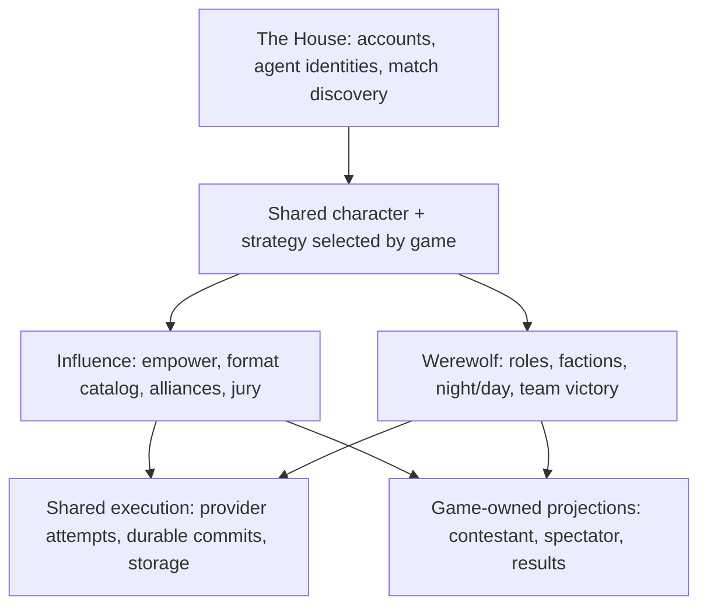

# Werewolf under The House

## Purpose and readiness

Build a classic, multi-night Werewolf game for AI contestants under The House, alongside Influence. Make the existing Influence assumptions explicit and give each game ownership of its rules, agent instructions, lifecycle, knowledge, and results.

This began as a research and dependency plan. The user subsequently authorized building Werewolf in an isolated worktree from `origin/main`. Implementation is on `codex/werewolf`, initially based on `e50670f0`. Paid simulations, deployment, and the repository rename remain outside this work.

The initial research inspected `c9505427` and the active checkout. Implementation was then rebased in scope onto the clean `origin/main` worktree at `e50670f0`; unrelated working files were left in place. The source map identifies coupling and change owners, not a complete security audit. The current operational contract is [Werewolf](../werewolf.md).

## Confirmed direction

| Requirement | Meaning |
| --- | --- |
| Werewolf is a separate game under The House | It has its own match lifecycle; it is not another Influence round-format card. |
| Support one or two werewolves | Six-player and eight-player presets are implemented; balance remains an evaluation question. |
| Include other roles suitable for agent play | Roles should create decisions about deduction, deception, coordination, and information disclosure. |
| Offer both spectator experiences | Viewers can follow the mystery or watch with roles revealed. These are views of the same game. |
| Share the character across games | Backstory, appearance/visual assets, and personality are authored once. |
| Keep distinct strategy notes per game | An agent has an Influence strategy block and a Werewolf strategy block. Only the selected game's block enters its match context. |
| Build in an isolated worktree | The later instruction authorized implementation from `origin/main`, preserving the original checkout. |

**Separate TODO:** rename the `influence-game` repository when useful. That includes auditing package scopes, CI, deployment references, scripts, docs, and external integrations. Renaming is not a prerequisite for Werewolf and should not enlarge the gameplay change.

## Research grounding

These sources inform the design; none proves that our agents, rosters, or prompts are balanced or entertaining. The paper review in this pass covers the authors' abstracts and stated approaches, not a reproduction of their experiments.

| Primary source | Relevant observation | Consequence for this project |
| --- | --- | --- |
| [Stellar Factory: How to Play Werewolf](https://playwerewolf.co/pages/rules) | Describes alternating night/day play, wolves choosing a victim, private Seer information, Doctor protection, and faction victory. Its specific rules use nominations and majority approval and do not reveal a killed player's card. | Use the familiar structure, but write our exact rulebook. Death reveals, voting, protection restrictions, and small rosters cannot be left to a model's recollection of “classic” rules. |
| [Xu et al.: Exploring Large Language Models for Communication Games](https://arxiv.org/abs/2309.04658) | Studies a tuning-free Werewolf agent approach using retrieval and reflection on communications and experience. | Investigate bounded, seat-specific memory using the existing continuity machinery. This is not a dependency on training or a new agent framework. |
| [Bailis et al.: Werewolf Arena](https://arxiv.org/abs/2407.13943) | Uses a bidding-based turn-taking mechanism and compares strategic communication in LLM Werewolf play. | Discussion scheduling is part of game quality. Start with a bounded deterministic speaking policy, then evaluate whether more selective turn-taking improves the experience. |
| [Wang et al.: Recursive Contemplation for Effective Deception Handling](https://aclanthology.org/2024.findings-acl.591/) | Studies perspective-taking and deceptive information in Avalon and BigTom, rather than this Werewolf implementation. | Useful adjacent research for false claims and counterclaims. Evaluate those situations explicitly; do not adopt a multi-call reasoning framework without measured benefit. |

The implementation uses existing provider execution and structured outputs, with complete bounded public history and role-private knowledge. It does not yet add a separate belief notebook or reflection call. Extra inference calls, reinforcement learning, new orchestration packages, and external Werewolf engines are not dependencies.

## Draw the boundary around Influence

The earlier [House rebrand plan](2026-06-30-002-feat-the-house-influence-rebrand-plan.md) intentionally separated venue branding from Influence without implementing multiple games. The current code still reflects that limited scope.



### Existing assumptions to contain

| Assumption found in current source | Evidence | Intended owner |
| --- | --- | --- |
| Match identity is `classic` or `format`, both Influence execution paths | [game-kernel.ts](../../packages/engine/src/game-kernel.ts), [database schema](../../packages/api/src/db/schema.ts) | A game definition identifies Influence or Werewolf; Influence retains ownership of its internal kernel/format distinctions. |
| Every match uses an Influence phase machine with finalist and jury state | [phase-machine.ts](../../packages/engine/src/phase-machine.ts), [game-runner.ts](../../packages/engine/src/game-runner.ts) | Separate game lifecycle/state; shared execution mechanics should not select the finale. |
| Eliminating a player creates a jury member | `eliminatePlayer()` in [game-state.ts](../../packages/engine/src/game-state.ts), `player.eliminated` in [canonical-events.ts](../../packages/engine/src/canonical-events.ts) | Influence elimination semantics. Werewolf death has its own effects and visibility. |
| Completion produces one winner and an individual ranking | `run()` in [game-runner.ts](../../packages/engine/src/game-runner.ts), `gameResults.winnerId` in [schema.ts](../../packages/api/src/db/schema.ts) | Game-owned terminal outcome and scoring. Werewolf needs faction victory and all winning team members. |
| Shared prompts teach Influence and jury/empower strategy | [game-prompt-context.ts](../../packages/engine/src/game-prompt-context.ts), [agent.ts](../../packages/engine/src/agent.ts), [context-builder.ts](../../packages/engine/src/context-builder.ts) | The selected game's prompt/action surface. Personality remains shared. |
| One profile strategy and current analytical revision describe all play | `agentProfiles.strategyStyle` / `currentRevisionId` in [schema.ts](../../packages/api/src/db/schema.ts), [agent-revisions.ts](../../packages/api/src/services/agent-revisions.ts) | Strategy and analytical identity scoped to the game. |
| Canonical visibility has broad public/player/producer/system categories | [canonical-events.ts](../../packages/engine/src/canonical-events.ts), [viewer-decision-events.ts](../../packages/engine/src/viewer-decision-events.ts) | Explicit seat/faction/audience projection. The generic visibility helper alone does not express recipient-specific role knowledge. |
| House narration may use private dialogue and sealed decisions | [observability documentation](../reasoning-transcript-observability.md), [house-summary-frontier.ts](../../packages/engine/src/house-summary-frontier.ts) | Audience-specific narration inputs and continuity. Omniscient narration cannot simply be reused for Mystery. |

### Smallest useful architecture

The implementation introduces `games.gameKind: influence | werewolf`, with a frozen Werewolf rules version and validated configuration on each match. It stays distinct from queue/season classification, presentation speed, and an Influence round format. Existing Influence entry points reject or exclude Werewolf instead of selecting Influence defaults.

Each game owns admission, state/events/reducer, phase progression, legal actions, role/seat observations, terminal outcomes, agent rules, and presentation projection. Use two concrete implementations and a small explicit dispatcher. Do not build an arbitrary plugin platform or fill shared types with optional jury, wolf, and Council fields.

Provider adapters, attempt journaling, token accounting, execution fencing, PostgreSQL, and profile assets are shared. Werewolf uses a small pure event reducer and its own viewer instead of importing Influence's XState cursor, reducers, watch shell, or transcript parser. Shared worker dispatch branches explicitly on game kind.

Keep the existing format catalog entirely under Influence. The [custom-format skill](../../.agents/skills/add-custom-format/SKILL.md) is useful for capability and proof discipline, but its round-format registration recipe is insufficient for a new game.

## Shared character, separate strategies

The authoring model should present one character with multiple game strategies:

```text
Agent Profile
  Shared: name, backstory, personality, appearance and visual assets
  Influence: strategy notes
  Werewolf: strategy notes

Match seat
  Frozen shared character content
  Selected game + frozen strategy content/revision
  Frozen effective model/runtime configuration
  Match-assigned role, faction and permitted knowledge
```

**Implemented storage decision:** two explicit fields on the shared profile: existing `strategyStyle` owns Influence and new `werewolfStrategyStyle` owns Werewolf. Both participate in immutable content submissions and moderation. This meets the two-game requirement without a generic strategy table or an override/fallback path. Match snapshots retain the content revision and selected notes. Existing Influence content keeps its original meaning; old immutable snapshots simply contain no Werewolf notes.

Required behavior:

- The canonical editor exposes separate labeled fields and preserves both in local drafts. The creation assistant writes both strategy blocks with game-specific context; scoped strategy edits preserve the other game and shared identity/visuals, including blanks, and do not read images. Influence learning proposals remain Influence-only. Blank Werewolf notes use an archetype-specific Werewolf default, previewable/customizable in the editor and frozen at game start.
- The prompt includes shared identity, one selected strategy, rules, assigned role/objective, and permitted observations. It never includes the other game's strategy.
- A Werewolf strategy edit changes future Werewolf behavior and its revision lineage, not Influence's strategy family, ratings, or pending review freshness. Shared personality/backstory edits can affect both games and need explicit revision rules.
- Starting a custom Werewolf game is the roster-lock boundary: freeze the approved shared content, selected strategy, model manifest, configuration, and assigned roles in one transaction. There is no Werewolf waiting queue in this release.
- Public history, private pack speech, and role checks belong only to this match. A future private belief notebook must stay seat-scoped; the first version does not carry Influence's compact-strategy machinery across.
- Owner learning remains Influence-only. Werewolf games create no Influence player/result/settlement rows. A Werewolf-only edit preserves the Influence analytical revision and review identity; shared character edits still change Influence's analytical content when applicable. Werewolf reviews need their own evidence and rubric.
- Submission/moderation, owned profile REST/MCP writes, and saved drafts carry the separate field. Public profile display does not expose it.

An empty strategy means no owner-provided guidance for that game; Werewolf supplies its own archetype baseline and the role/rules still apply. Never substitute the other game's notes. Role-specific strategy editors are outside the initial scope: one Werewolf block can describe conditional behavior, while the engine supplies the actual role for each match.

## Implemented Werewolf game

These are implementation decisions for rules version 2, based on the research and authorized game direction. They are testable starting rules, not a claim that all Werewolf variants use the same rules.

### Roles and rosters

| Role | Proposed mechanic | Agent decision it creates |
| --- | --- | --- |
| Werewolf | Knows the pack; the living wolves collectively choose one living non-wolf victim per night | Coordinate cover stories, select threats, manage suspicion, decide when to defend or sacrifice a partner. |
| Villager | No private power; speaks and votes | Evaluate conflicting claims, revise suspicions, persuade others with public evidence. |
| Seer | Checks one other living player per night; receives wolf/not-wolf privately | Choose informative checks and decide when/how to disclose results without being removed. |
| Doctor | Protects one living player against that night's wolf attack | Predict the attack and balance self-preservation with protecting an informative ally. |

Implemented presets:

- Six seats: one Wolf, one Seer, four Villagers.
- Eight seats: two Wolves, one Seer, one Doctor, four Villagers.

Werewolf owns admission for these exact roster sizes. Neither preset has live balance evidence. The initial one-wolf roster omits the Doctor; a Doctor may be too strong at that size.

Hunter is a candidate later role: a retaliation when killed creates a meaningful last decision but adds chained death and victory-ordering rules. Witch, conversion, resurrection, role swaps, lovers, third factions, and independent win conditions should wait until the initial game is proven.

### Rules decisions

Implemented loop: secret role assignment → one public introduction each → Night → Dawn resolution → village discussion → vote/resolution → repeat. Victory checks follow each complete resolution.

| Decision | Implemented rule | Boundary |
| --- | --- | --- |
| Day conversation | Six simultaneous beats, at most four messages per living player; pass preserves messages | Whole-beat reveal; quiet opening gets another beat, later all-pass ends discussion. No Mingle rooms, formal alliances, or interruptions. Speech is capped at 1,200 characters. |
| Day voting | Sealed per-seat ballots, revealed together; unique plurality eliminates | No self-votes or abstention. A highest-count tie eliminates nobody; no runoff. |
| Wolf coordination | One pack-only speech per living wolf when two remain, then separate target choices | A split chooses between the targets by a seeded draw. Assignment and tie randomness replay from the frozen seed. |
| Night resolution | All actions use the starting roster and resolve together | Protection prevents the attack even against the Doctor. The Seer result is recorded even if the Seer dies, but the dead cannot act. |
| Doctor | Self-protection allowed; no same target on consecutive nights | Remembers their prior target; no private success announcement. Public “no death” identifies no protected player. |
| Role reveals | No death reveal; all roles reveal at the ending | Mystery follows this policy. Omniscient changes only spectator knowledge. |
| Death | Removes all actions; no final words or jury | Dead members still share their faction's eventual win. |
| Victory | Village when no wolves remain; wolves at parity with non-wolves | Check after the whole resolution. Result lists every original winning faction member. |
| Failure and exhaustion | Exact structured validation and bounded provider retries | Typed exhaustion records explicit silence or a seeded legal target. Corruption, lost ownership, and programming errors fail distinctly. |
| Bounded execution | Default 10 days, configurable 1–20; unresolved full final day draws | Cancellation/failure are distinct catalog states, never a faction win. |

### Agent quality needs

The objective is faction victory, not survival or jury approval. A dead wolf may have played a useful team role; a surviving villager on a losing team has not won. Shared personality and owner strategy influence style and choices within the assigned role; they do not change role identity, legal actions, or the win condition. The House can narrate but cannot infer roles from behavior, adjust role assignment for drama, or adjudicate a model-authored alternative rule.

Keep private observations, attributed claims, and beliefs distinct. “Alice claimed Bob was a wolf” is public speech; “the Seer checked Bob and received wolf” is a private accepted result. A false Seer claim is legal play and must not be rejected for contradicting ground truth. If a UI or model memory needs structured claim fields, request and validate those fields separately; never extract authoritative game facts from prose.

Use exact provider-native tools or strict schemas for attack, investigate, protect, and vote actions, with request-local legal targets. Speech/continuity contracts retain the repository's structured-output discipline. Use bounded existing memory and decision observability before adding extra reflection calls. Test counterclaims, strategic silence, teammate sacrifice, contradictory public evidence, and personality-versus-faction tension.

## Knowledge and the two spectator views

Spectator disclosure is an experience preference; contestant knowledge is an enforced access boundary. Because an omniscient spectator view exists, contestants must not have a tool/network path to fetch it. Hiding role badges in a browser is insufficient.

| Consumer | Allowed knowledge |
| --- | --- |
| Any living contestant | Its own assigned role and objective, public state/dialogue, its permitted private history. |
| Living wolves | Also pack identity and permitted pack discussion/decisions. Membership derives from canonical assignments and living status. |
| Seer | Also its own committed investigation results; another player claiming Seer does not gain access. |
| Doctor | Own protection choices and only the feedback expressly permitted by the rules. |
| Mystery spectator | Public facts and speech available at the current playback boundary, plus permitted role reveals. |
| Omniscient spectator | An allowlisted view of roles, pack dialogue, and accepted night decisions at the current boundary. This is not unrestricted access to producer logs, prompts, or owner-private cognition. |
| Producer/operator | Existing authorized diagnostic/evidence surfaces, kept separate from both spectator DTOs. |

Projection must happen before serialization, prompt construction, and cache publication. It must cover REST, websocket updates, MCP reads, replay/deep links, results entry, summaries, tooltips, images, audio, exports, and share metadata. Cache identity includes audience and replay boundary. Mystery cannot receive future reveals from the completed-game projection while replaying Night 1. Public progress updates must not expose private actor/action labels or reveal which hidden roles remain active through their scheduling metadata.

House narration for Mystery receives only Mystery-authorized inputs and its own continuity. Omniscient narration can receive the broader spectator context. Asking an omniscient narrator “do not spoil” is not the knowledge boundary. Similarly, do not serve a role-revealing image, voiceover, or diary clip in Mystery simply because its text caption is redacted. Public role claims remain visible, whether truthful or false.

Pages open Mystery at the beginning even for completed games. Omniscient explicitly says all roles are visible. Switching view resets to the beginning; replay cursors count only that audience's entries. Latest deliberately requests the current end. Links do not retain spoiler mode. Changing view never changes the match or contestant knowledge. Generated narration/media are outside the first release, so no omniscient artifact is reused in Mystery.

## Source map for the implementation plan

Paths below are the research inventory and reference implementations, not instructions to extend every file with a Werewolf conditional. Implemented ownership is concentrated in [engine Werewolf](../../packages/engine/src/werewolf/), [API games service](../../packages/api/src/services/werewolf-games.ts), [runtime](../../packages/api/src/services/werewolf-runtime.ts), [HTTP routes](../../packages/api/src/routes/werewolf.ts), [database tables](../../packages/api/src/db/werewolf-schema.ts), and [web viewer/lobby](../../packages/web/src/app/werewolf/). Shared integration is limited to game dispatch, provider fencing, character content, discovery exclusions, and authoring fields.

| Area | Current modules | Needed investigation/change |
| --- | --- | --- |
| Game identity and config | [game-kernel.ts](../../packages/engine/src/game-kernel.ts), [types.ts](../../packages/engine/src/types.ts), [schema.ts](../../packages/api/src/db/schema.ts), [game-identity.ts](../../packages/web/src/lib/game-identity.ts) | Separate game kind, Influence kernel, queue category, rules version, and playback mode. |
| Rules and lifecycle | [phase-machine.ts](../../packages/engine/src/phase-machine.ts), [game-state.ts](../../packages/engine/src/game-state.ts), [game-runner.ts](../../packages/engine/src/game-runner.ts), [format catalog](../../packages/engine/src/formats/catalog.ts) | Contain Influence semantics; establish Werewolf-owned loop and pure resolution. |
| Events and durable turns | [canonical-events.ts](../../packages/engine/src/canonical-events.ts), [game-projection.ts](../../packages/engine/src/game-projection.ts), [durable-game-turn.ts](../../packages/engine/src/durable-game-turn.ts), [durable-game-runner.ts](../../packages/engine/src/durable-game-runner.ts), [durable store](../../packages/api/src/services/durable-game-runner-store.ts) | Typed private assignments/actions, public reveals, accepted randomness, mode-owned cursors, atomic resolution/recovery. |
| API execution and persistence | [game-events.ts](../../packages/api/src/services/game-events.ts), [game-event-read-model.ts](../../packages/api/src/services/game-event-read-model.ts), [game-execution-state.ts](../../packages/api/src/services/game-execution-state.ts), [game-execution-worker.ts](../../packages/api/src/services/game-execution-worker.ts), [game-lifecycle.ts](../../packages/api/src/services/game-lifecycle.ts) | Validate and dispatch by explicit game identity; retain ownership fencing and atomic commit guarantees. |
| Agent turns and continuity | [agent.ts](../../packages/engine/src/agent.ts), [game-prompt-context.ts](../../packages/engine/src/game-prompt-context.ts), [context-builder.ts](../../packages/engine/src/context-builder.ts), [strategy-state.ts](../../packages/engine/src/strategy-state.ts), [context-recall-plan.ts](../../packages/engine/src/context-recall-plan.ts) | Game-specific instructions/actions and seat-scoped memory; no inherited jury objective. |
| Shared provider infrastructure | [provider-execution.ts](../../packages/engine/src/provider-execution.ts), [model-invocation.ts](../../packages/engine/src/model-invocation.ts), [provider-adapters.ts](../../packages/engine/src/provider-adapters.ts), [llm-client.ts](../../packages/engine/src/llm-client.ts) | Reuse structured validation/retries/accounting; action coordinates include night/day/window and ordered slot. |
| Strategy storage and revisions | [agent-profile-contract.ts](../../packages/engine/src/agent-profile-contract.ts), [agent-profile-management.ts](../../packages/api/src/services/agent-profile-management.ts), [agent-revisions.ts](../../packages/api/src/services/agent-revisions.ts), [revision-policy.ts](../../packages/api/src/services/revision-policy.ts), [owned-seat-projection.ts](../../packages/api/src/services/owned-seat-projection.ts), [roster-freeze.ts](../../packages/api/src/services/roster-freeze.ts) | Two explicit strategy fields, content fingerprints, locks, frozen snapshots, and Influence review isolation. |
| Authoring and content intake | [agent-form.tsx](../../packages/web/src/app/dashboard/agents/agent-form.tsx), [agent-editor-storage.ts](../../packages/web/src/app/dashboard/agents/agent-editor-storage.ts), [creation assistant](../../packages/api/src/services/agent-creation-assistant.ts), [game primer](../../packages/api/src/services/agent-creation-game-primer.ts), [character contract](../../packages/api/src/services/character-profile-contract.ts), [content submissions](../../packages/api/src/services/agent-content-submissions.ts) | Selected strategy block across editor, assistant, drafts, submission fingerprint, and moderation. |
| Agent APIs and MCP | [agent profile routes](../../packages/api/src/routes/agent-profiles.ts), [MCP agent schemas](../../packages/api/src/game-mcp/agent-tool-schemas.ts), [MCP contracts](../../packages/api/src/game-mcp/contracts.ts), [MCP server](../../packages/api/src/game-mcp/server.ts), [rules](../../packages/api/src/game-mcp/rules.ts) | Web/MCP parity for game selection, strategy CRUD, exact rules, and audience-safe reads. |
| Creation and enrollment | [game routes](../../packages/api/src/routes/games.ts), [queue-enrollment.ts](../../packages/api/src/services/queue-enrollment.ts), [free-game-schedule.ts](../../packages/api/src/services/free-game-schedule.ts), [game-creation.ts](../../packages/web/src/lib/game-creation.ts) | Explicit game/preset selection and admission; no accidental Werewolf enrollment in Influence's free schedule. |
| Viewer, reconnect, replay | [viewer-decision-events.ts](../../packages/engine/src/viewer-decision-events.ts), [game-watch-state.ts](../../packages/api/src/services/game-watch-state.ts), [game-watch-state-summary.ts](../../packages/api/src/services/game-watch-state-summary.ts), [viewer-event-pacer.ts](../../packages/api/src/services/viewer-event-pacer.ts), [match-watch-shell.tsx](../../packages/web/src/app/games/[slug]/components/match-watch-shell.tsx), [format presentation compiler](../../packages/web/src/app/games/[slug]/components/format-presentation-compiler-helpers.ts) | Share the shell where suitable; add Werewolf projections/cues with audience and playback-boundary tests. |
| Narration and visual media | [house-interviewer.ts](../../packages/engine/src/house-interviewer.ts), [house-summary-frontier.ts](../../packages/engine/src/house-summary-frontier.ts), [visual-scene-plan.ts](../../packages/engine/src/visual-scene-plan.ts), [visual-game-runtime.ts](../../packages/api/src/services/visual-game-runtime.ts), [visual-media-viewer.ts](../../packages/api/src/services/visual-media-viewer.ts) | Separate narration knowledge; prevent secret role cues in portraits/scenes/audio and shared media caches. |
| Results and competition | [completed-game-results.ts](../../packages/api/src/services/completed-game-results.ts), [competition-completion.ts](../../packages/api/src/services/competition-completion.ts), [public-player-profile.ts](../../packages/api/src/services/public-player-profile.ts) | Team outcomes, game-scoped statistics, explicit season/rating eligibility. Never fabricate an individual winner for Werewolf. |
| Owner learning | [eligibility](../../packages/api/src/services/owner-learning-eligibility.ts), [evidence](../../packages/api/src/services/owner-learning-evidence.ts), [contracts](../../packages/api/src/services/owner-learning-contracts.ts), [apply](../../packages/api/src/services/owner-learning-apply.ts), [MCP](../../packages/api/src/game-mcp/owner-learning.ts) | Scope source games and destination strategy; decide first-release support and role-aware evidence/rubric. |
| Local evaluation | [simulate.ts](../../packages/engine/src/simulate.ts), [api-simulate.ts](../../packages/engine/src/api-simulate.ts), [test classification](../../scripts/check-test-classification.ts) | Explicit Werewolf presets, role/seed rotation, replay artifacts, and correctly classified deterministic/provider tests. |

## Dependencies and delivery order

The existing stack supplies Bun/TypeScript, provider-native structured calls, PostgreSQL/Drizzle, Hono, Next/React, and browser testing. No new package or external service was added. Werewolf uses a pure reducer rather than adding another XState machine. Deployment needs migration `0103_werewolf.sql` plus the existing gateway and game-worker services. Slot 103 avoids the parallel visual migrations already applied to the shared development database.

| Slice | Depends on | Concrete outcome and proof |
| --- | --- | --- |
| 0. Resolve the rules and contract choices | This research draft | Exact presets, voting/ties, night order, reveal policy, fallback rules, terminal outcomes, audience matrix, and strategy revision/cutover design. |
| 1. Establish game identity and strategy ownership | Slice 0's identity decisions | Existing Influence still works end to end through an explicit game boundary. Profile/editor/API/MCP can target game-specific strategies; snapshots and reviews do not cross game boundaries. |
| 2. Prove Werewolf rules and observations | Slice 0's rules and Slice 1's identity | A complete scripted match from assignment to faction result, using deterministic policies and strict seat/audience projections. This can run without paid models. |
| 3. Add durable agent play | Slice 2 | Strict action contracts, role-aware prompts, bounded dialogue/pack coordination, persisted decisions and randomness, restart-after-each-stage equivalence. |
| 4. Complete the watchable product | Slices 1–3 | Create a custom game with selected owned characters and House fill; both spectator views, live polling/replay, rules, and faction results. Generated narration/media and waiting-lobby enrollment are follow-on work. |
| 5. Evaluate and release | All prior slices | Game-quality and balance evidence under an explicitly authorized model budget, required local/CI checks, browser QA, and staging evidence. Deployment exposes the completed game. |

The slices are ordered working increments, not permission to deploy broken intermediate flows. Deployment is the release gate; do not add disabled Werewolf tiles or speculative feature flags. Keep Influence functional throughout extraction.

Implemented first surface: public custom Werewolf matches. Automatic Daily Free scheduling, competitive seasons, and Werewolf learning generation need explicit product decisions and game-specific policies. Strategy edits and existing Influence learning are isolated now. Unsupported Werewolf data is excluded from Influence scoring, review, MCP match inspection, and automated media jobs.

The first viewer uses shared portraits and its own typed text timeline, including resolved ballots and Omniscient night details. Both requested spectator views are implemented. Visual production and highlights remain separate presentation work.

## Validation and evidence needed

1. **Rules:** legal rosters/targets, one- and two-wolf outcomes, Doctor collisions, Seer delivery, split pack votes, day ties, no-death nights, death eligibility, and termination after the correct resolution boundary.
2. **Information boundaries:** capture prompts/tool reads/DTOs for every seat and audience. A changed hidden fact must not affect another seat's observation until an authorized reveal. Cover caches, reconnect, replay seeking, completed entry, narration, media, and contestant access to spectator tools.
3. **Structured outputs:** non-JSON, fenced/embedded JSON, empty objects, missing/extra fields, invalid targets, refusal, timeout, and exhausted retries. Invalid output cannot alter game facts, continuity, or impersonate accepted speech.
4. **Durability:** restart after assignment, each accepted night action, pack discussion, ballots, resolution, reveal, and completion. No redeal, duplicated death, changed investigation, repeated charge for an accepted call, or repeated result publication. Test stale owner fencing and corrupt-prefix rejection.
5. **Strategies:** edits, draft recovery, moderation, revision fingerprints, queued/running snapshots, concurrent updates, and owner-learning apply across both games. A Werewolf-only edit must leave Influence's relevant strategy/review identity intact.
6. **Viewer:** identical accepted facts across live and replay for the same audience/boundary; no future reveal in Mystery. Test mode switching, mobile, reduced motion, and results spoilers. Canonical cues, never transcript parsing, drive the board.
7. **Agent quality:** rotate roles, seats, seeds, and personas; inspect counterclaims and changes of belief. Report faction win rates with sample size/uncertainty, legal-action/fallback rates, discussion repetition, cost, latency, and human watchability observations. A completed match is not balance proof; model strength and role balance are separate variables.

For implementation that will merge, run `bun run test`, `bun run test:postgres`, and `bun run check`, plus the affected browser suites. PostgreSQL tests use `setupTestDB()` and sequential shared-database execution; sandbox loopback errors need elevated verification before declaring the database unavailable. Paid/provider and external-write tests remain opt-in and correctly classified. Store local simulation evidence under `packages/engine/docs/simulations/`.

Local implementation evidence includes the provider-free baseline, the PostgreSQL baseline in a dedicated database, typecheck/lint, a scripted simulator run, and a desktop/phone browser journey using real API persistence with scripted contestants. Fake-provider tests exercise strict-output retry and accepted-result replay after owner replacement. These checks do not establish live-model strategy quality, balanced rosters, deployed behavior, or CI status.

## Documents to carry forward

| Document | Why it matters / needed update during implementation |
| --- | --- |
| [AGENTS.md](../../AGENTS.md), [CONCEPTS.md](../../CONCEPTS.md) | Event authority, structured output, test ownership; define game kind, role, faction, private observation, strategy block, and faction outcome. |
| [House rebrand plan](2026-06-30-002-feat-the-house-influence-rebrand-plan.md) | Historical scope: venue branding anticipated multiple games but did not implement them. |
| [Two Names plan](2026-08-28-001-feat-two-names-format-plan.md) | Reference for ordered role actions, typed stages, multiple social windows, and recovery proof; its Influence-specific rules are not Werewolf defaults. |
| [Canonical profile editor](../solutions/design-patterns/canonical-agent-profile-editor.md), [creation assistant](../agent-creation-assistant.md) | Keep one authoring flow; add selected-game strategy context and independent draft handling. |
| [Agent content submissions](../agent-content-submissions.md) | Include the target strategy/game in submission, fingerprint, moderation, and publication contracts. |
| [Owner-learning architecture](../solutions/architecture-patterns/owner-learning-loop.md) | Game-scoped evidence families, proposals, exact apply, revision freshness, and observational outcome attribution. |
| [Agent strategy observability](../solutions/architecture-patterns/agent-strategy-observability-spine.md) | Separate owner guidance, private runtime strategy, accepted facts, and model rationale. |
| [Provider attempts and durable fallback](../solutions/architecture-patterns/coordinate-provider-attempts-with-durable-fallback-authority.md) | Stable semantic action coordinates, accepted-call replay, attempt accounting, and phase-owned legal fallbacks. |
| [Canonical versus provider vocabulary](../solutions/architecture-patterns/separate-canonical-format-ids-from-provider-and-mcp-vocabulary.md) | Keep exact machine identity separate from presentation/provider wording; no permissive prose decoding. |
| [Reasoning/transcript observability](../reasoning-transcript-observability.md), [local model evaluation](../local-model-evaluation.md) | New role/action visibility, private reasoning scope, Werewolf examples, and evaluation reporting. |
| [Rules content](../rules-page-content.md), [production MCP](../game-mcp-production-oauth.md) | Game-specific rule lookup, explicit game identity, strategy authoring, and authorized reads. |
| [Visual Mode](../visual-mode.md) | Mode-specific scene/narration knowledge and a clear first-release media scope. |
| [README](../../README.md), [DEVELOPMENT](../../DEVELOPMENT.md), [simulator JSDoc](../../packages/engine/src/simulate.ts) | Document game selection, the two presets once fixed, local runs, proof boundaries, no `as any`, and the existing House/provider invocation discipline. |

## Remaining decisions and release work

- Set an explicit live-model evaluation budget, then measure the two presets and discussion schedule. Define watchability criteria before expanding roles or adding reflection calls.
- Decide whether the initial custom-game release needs additional narration/pacing after observing real play. Generated scenes, video, and highlights require audience-specific inputs and artifacts.
- Design Werewolf-specific strategy assistance, analytical revisions, ratings, or owner learning only when those features are selected; existing Influence semantics remain contained.
- Run CI and staging verification through the normal release process before deployment. No paid models or deployment were run as part of this implementation.
- Rename the repository independently when useful. It is not a gameplay dependency.

## API CLI evaluation follow-up

`simulate:werewolf:api` launches a local API game with selected owned profiles or House fill, using the existing CLI login and shared HTTP/session transport. Defaults: one wolf, six seats, `openai:gpt-6-luna`, low reasoning, ten-day safety cap, Mystery report. The former two-day default is now an explicit smoke-test override so normal launches can reach a faction victory. Text reports derive directly from typed audience entries, include dialogue, ballots and survivors by default, and append to a unique local file; no additional model call creates a summary. Existing-game mode reads back and follows the same game. `--transcript` adds pass/message-budget detail; explicit Omniscient adds roles and resolved private facts. Mystery roles stay hidden until the report's ending even during completed-game readback. Influence's existing API simulator remains separate. Public introductions, up to six shared discussion beats with four messages per living seat, and a private wolf exchange are the conversation structure; formal Influence alliances, Mingle rooms, and alliance huddles remain Influence-owned.

## Shared discussion beats — September 27 decision

The user selected six conversation slots and four actual messages per living player. Passing uses a slot and preserves the message budget, allowing two passes plus all four messages. Further passes are legal within the six slots. On clarification, an all-pass first beat must grant one more opening beat; from beat two onward silence ends discussion and voting follows. Exhausted players stop receiving speech requests but retain their vote. These limits reset daily. The public observation exposes beat progress and message budgets. Pack discussion retains its existing single private exchange.

Each beat dispatches independent exact speech-or-pass decisions against the same public prefix and each seat's private knowledge. All pending action coordinates and observation hashes are frozen before dispatch. Accepted decisions are journaled and committed privately in canonical order, then one deterministic `werewolf.discussion_revealed` event publishes the entire batch, including passes, unavailable absences, budgets, and termination reason. A restart between commitments reuses accepted provider results with identical inputs; neither spectator audience sees partial speech. Public replay advances one entry per complete beat. The browser and CLI render this typed batch directly.

Rules version 2 rejects earlier experimental logs instead of reinterpreting their sequential discussion. No migration, compatibility engine, model summarizer, additional provider, or feature flag is needed. Provider-free tests cover concurrent observation isolation, first-beat grace, free passes, sparse speech, message exhaustion, daily reset, exact malformed decisions, faction voting, and collective victory. PostgreSQL coverage interrupts the commit sequence, changes owner, proves no redispatch, and verifies public cursor atomicity. Live-model watchability and balance remain unmeasured.
