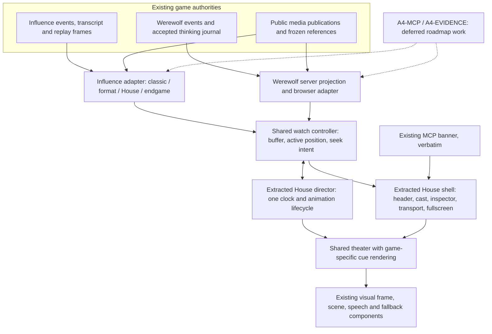
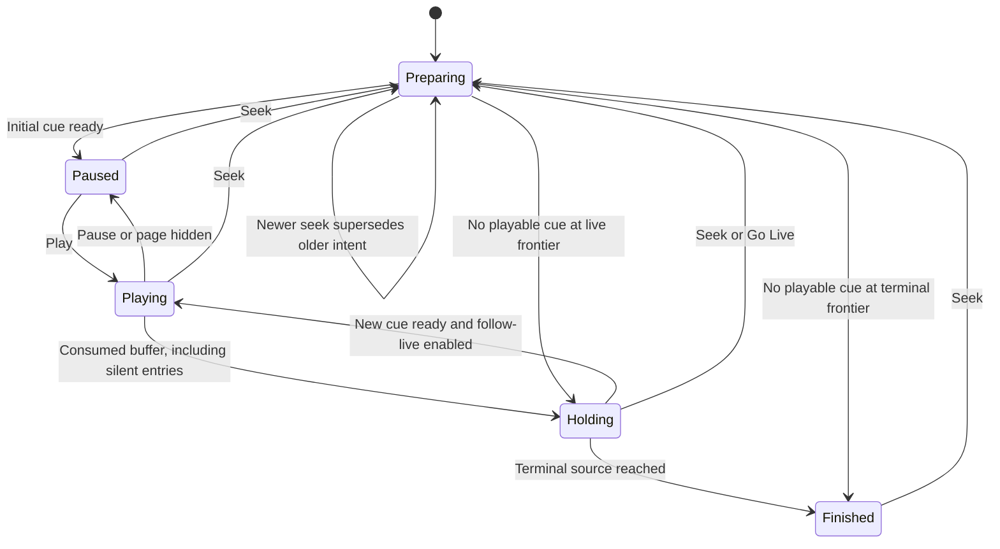
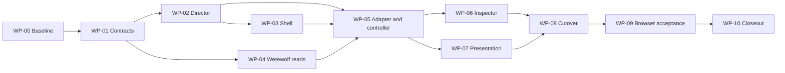

# Shared House watch player — task specifications

Parent: [reviewed integration plan](2026-10-01-001-refactor-shared-house-watch-player.md). Review: [consistency and adversarial findings](../reviews/2026-10-01-shared-house-watch-player-plan-review.md). Roadmap: [four pillars and deferred work](../ideation/2026-09-30-house-admin-and-production.md#pending-work-and-ui-surface-map).

Tasks are specifications, not completed implementation. Start from the existing `codex/werewolf` worktree, record the actual HEAD/dirty state, and preserve unrelated changes. Source checkpoint `ff55d307` includes the separately implemented thinking slice. Do not rerun a migration or change rules merely to integrate the viewer. No paid generation, deployment, game deletion or public publication is needed.

## Architecture to implement

### Shared playback, explicit game adapters

Move the existing House components and scheduler into shared modules. Names under `components/watch/` below are proposed destinations; update imports and remove obsolete implementations, rather than retaining forwarding compatibility layers. Keep game interpretation near the existing game-specific source.



The dashed lines show future work, not dependencies. The common scheduler handles time and commands; it does not decide rules, parse speech, issue model calls, or query game-specific APIs. Influence's classic parser stays confined to its existing consumers. Werewolf never acquires synthetic Influence `PhaseKey`, `GamePlayer`, jury, scoring or format-kernel state.

### Position and data ownership

```mermaid
sequenceDiagram
  participant UI as Controls
  participant C as Shared controller
  participant API as Audience-safe reads
  participant D as House director
  participant V as Theater and inspector
  UI->>C: Seek or advance
  C->>C: Increment intent; detach if manually seeking
  C->>API: Prepare window using game, audience, cutoff
  Note over C,V: Same-context active picture stays mounted during preparation
  API-->>C: Cursor-tagged moments and snapshots
  C->>C: Reject stale generation; normalize filtered entries
  C->>D: Commit prepared cue and active position
  D-->>V: One active cue and reveal boundary
  opt Omniscient and Thinking enabled
    C->>API: Thinking at active source cursor
    API-->>C: Committed, released thinking only
    C-->>V: Apply only to matching cursor and player
  end
  Note over C,V: Prefetched/head data cannot supply active cast, title or inspector
```

### Playback lifecycle



Preparation is controller state, not a replacement loading page. Same-context preparation retains the last committed view; audience/game changes clear incompatible content immediately. Load failure retains a safe committed view with Retry, or a route-local error if no view exists. Hidden/denied data is cleared. `Holding`/`Finished` has no invented speech/pass card or timed Pass cue; it can retain the room/background while clearing completed speech.

## Contracts resolved for implementation

| Concern | Required contract |
| --- | --- |
| Session identity | Game ID + game kind + audience + session generation. Publication cutoff is fixed for that game viewing session, including audience switches. Audience changes reset playback to cursor 1, paused, and turn Thinking off; their cursor spaces are not interchangeable. A different game or explicit reload starts a new publication snapshot. Poll/Go Live does not silently select newer artwork. |
| Source position | Tagged game-specific coordinates: Werewolf audience-local cursor; Influence canonical event and transcript boundaries already available to its adapter. Never expose private Werewolf event sequence as a public cursor. |
| Playable identity | Stable key derived from session identity, source position and subcue identity. Cue-array index and speech-page index are local presentation coordinates, not evidence/media cursors. Appends do not renumber existing cue keys. |
| Active position | One controller-owned record with source cutoff, cue key (nullable while holding), reveal stage, chapter/scene IDs and active snapshot. All visible state uses it. Buffered/head metadata is separate and only informs loading, navigation availability and live status. |
| Skipped entries | Pass/null speech/unavailable contributions stay in raw history but emit no timed player cue. Only consume their source cursors when playback reaches them. Forward seek to a filtered source position chooses the next playable cue; if none exists, consume through the available tail and hold/finish. Previous/Next step traverses playable content, not filtered rows. |
| Display versus authority | Game adapters supply before/after/reveal-stage snapshots where required. An accepted image's pre-event staging roster is independent from post-event cast status. An actor can remain in the picture for their elimination without remaining alive in the cast rail. |
| Evidence | Omniscient Thinking is a separate initially-off toggle and an opt-in fetch; Mystery never requests or receives it. Thinking uses the consumed active source cutoff, not a prefetched cursor. Existing Influence evidence gets an authoritative cutoff too; lack of an anchor must not be filled by prose inference. |
| Player identity | Public Werewolf allowlist from the frozen cast: ID, name, portrait, persona label/key, personality, backstory. Active audience snapshot supplies role/alive status. Do not spread the start event or expose owner strategy, seeds, provider records, or current editable profiles. |
| Inspector sections | Reuse Overview, Thinking and Strategy structure, normal empty/error handling and selected-player behavior. Thinking is usable only when its separate Omniscient toggle is on. Alliance/Diary remain Influence-specific because they are different game mechanics. Missing evolving strategy stays in A4-EVIDENCE; no temporary capability disclaimer/disabled-feature treatment. |
| Media readiness | Keep current safe content during preparation. Disposed cue image/animation callbacks cannot start another cue. Failed image load settles into an existing fallback; it cannot keep playback unready forever. Reading time starts when the chosen readable presentation is ready. |

### Navigation semantics

- **Advance:** retain the existing House within-speech reveal/page/advance behavior, including reading duration. It eventually moves to the next playable cue. Scrub positions do not become page numbers.
- **Previous/Next scene:** symmetric adjacent-scene navigation to the first playable cue of that scene. No phase-string inference and no scene for an empty all-pass thread.
- **Previous/Next chapter:** symmetric adjacent-chapter navigation. `[` and `]` invoke these commands, matching the existing rounds hint. Influence chapters remain its rounds; Werewolf chapters are introduction, cycle N (Night N followed by Day N), and ending.
- Werewolf scene identities include cycle, thread/checkpoint and content kind: public thread, its vote checkpoint, pack attempt, remaining night resolution, ending. Re-entering the day phase after a failed majority does not start another day/chapter. Scene ordering comes from canonical entry/context order. Phase markers can update context without forcing extra cards.
- Keep existing Space, Enter, arrow and speed interactions; route them through one command owner. Do not hijack editable/select/dialog/control focus. Labels distinguish scene navigation from chapter navigation; no unlabeled Previous button silently changes meaning between games.
- Manual seek pauses and detaches from live. Play resumes there. **Go Live** explicitly moves to the latest playable frontier and enables follow-live. New data does not detach a paused viewer or pull a rewound viewer forward. Terminal/cancelled/suspended reads remain navigable.

### Browser watch-window read (WP-04)

Add `GET /api/werewolf/:id/watch` for this web adapter; retain existing `/api/werewolf/:id`, `/presentation`, `/thinking`, and guarded media/character routes for their current callers. This is not the frozen external MCP contract.

- Inputs: `audience` (default Mystery), `fromCursor` (default 1), `limit` (default 32, maximum 64 source entries), and `publishedBefore` (same validated publication cutoff semantics as `/presentation`). Invalid values fail with 400. A request beyond the available head returns an empty window and the actual head, not an infinite retry instruction; the controller clamps explicit seeks to available positions.
- Response: game identity/status, audience, rules version, `publicationCutoff`, `latestCursor`, `fromCursor`, `throughCursor`, ordered `moments`, and a compact chapter/scene-start index over committed audience-visible entries. Navigation labels contain no hidden roles, target choices or winner names.
- Each moment supplies its audience cursor, original audience-safe entry, minimal active snapshot (day/phase/discussion context, cast status/authorized roles, authorized outcome), and staging/media binding. Snapshot is for that moment, not the latest game state. Do not attach an entire history prefix to every row.
- Deduplicate media by binding identity within the response; preserve the existing public-version and exact-membership selection. Avoid resolving the same scene/reference repeatedly within one request. Apply events in one forward projection for the window/index, not by repeatedly calling the full-prefix projector for every cursor. Reuse/extract the engine public-entry allowlist and project newly appended history entries; do not rescan/copy all prior history for each event merely because the outer loop is single-pass. Do not claim constant server work independent of history length.
- Prefetched moments remain inert until selected. Each row is still audience-safe at its own stated cursor. Thinking and other separate private-detail reads are never eagerly prefetched. Raw transcript opens through bounded reads only up to the active cutoff.
- Client buffering keeps active, previous and next windows rather than all images/history prefixes. Reconnect may overlap a window: deduplicate by source cursor/key; conflicting accepted content is an error, not last-write-wins. A larger head cannot overwrite an active historical snapshot.
- Preserve hidden-game checks, wrong-game rejection, unsupported-rules response, audience validation and `private, no-store`. The endpoint is read-only: no inference, jobs, publication, owner takeover or game mutation.

## Order and gates

| Task | Deliverable | Depends on |
| --- | --- | --- |
| WP-00 | Source/behavior baseline and deterministic fixture inventory | — |
| WP-01 | Shared types, position/navigation contracts and contract fixtures | 00 |
| WP-02 | Existing director extracted with Influence policies | 01 |
| WP-03 | Existing shell, controls, fullscreen and banner extracted | 02 |
| WP-04 | Bounded Werewolf watch projection and frozen player identity | 01 |
| WP-05 | Werewolf adapter, buffer and shared controller integration | 02, 03, 04 |
| WP-06 | Cursor-bound cast/inspector and existing thinking integration | 03, 04, 05 |
| WP-07 | Speech, title, scene/media and result presentation | 05 |
| WP-08 | Public route cutover and prototype deletion | 06, 07 |
| WP-09 | Cross-game adversarial browser acceptance | 08 |
| WP-10 | Required checks, documentation and evidence closeout | 09 |



**Gate A:** WP-02/03 keep Influence working before Werewolf takes over the public route. **Gate B:** WP-05/06 prove source-position, audience and evidence isolation before polish is accepted. **Gate C:** WP-08 deletes the competing playback path only after the shared player is usable. **Gate D:** both games pass WP-09/10. The dependency graph permits independent file work; it is not an instruction to spawn agents.

## WP-00 — establish what must survive

**Owns:** baseline fixtures, source map and evidence notes; no feature changes.

- [ ] Record HEAD, branch and dirty files. Confirm thinking implementation is present rather than recreating it.
- [ ] Inventory House director/shell call sites, embedded/standalone rendering, Influence classic/format/endgame, media loading, transcript/inspector routes, Werewolf viewer exports and admin/CLI imports before moving files.
- [ ] Establish deterministic six/eight-player Werewolf fixtures covering real speech, passes/cues, no-majority checkpoint, plurality tie, pack disagreements, no-kill night and both faction endings. Include cancelled/suspended/live fixtures. Reuse existing API/engine fixtures; no provider calls.
- [ ] Record existing Influence navigation and live hydration behavior using its tests and a browser fixture. Include Safety Bounce, Two Names, a classic replay, House bridges and endgame.
- [ ] Record the reported label transition and two-line bubble behavior or explicitly say the exact glitch did not reproduce. Capture desktop/mobile and narrow text cases, request count/bytes, stage remounts and title element count.
- [ ] Retain a checklist for mode reset, raw transcript, stop permission/control, cancelled/suspended replay, live status, publication cutoff and missing portraits. Record the exact MCP component/copy/link as the reuse baseline.

**Accept:** reproducible source/fixture references and a retained-behavior list exist; later tests can distinguish a product regression from dev compilation or a missing fixture. Task-owned services use separate ports/databases and have cleanup ownership.

## WP-01 — define the small shared contract

**Owns:** proposed `packages/web/src/components/watch/watch-types.ts`, navigation/position helpers and their unit tests; browser DTO types under engine `werewolf/presentation.ts` or a dedicated Werewolf watch module.

- [ ] Implement the contracts above as a minimal common cue/snapshot interface plus an explicit Influence/Werewolf payload union. No plugin registry or generic game-state schema.
- [ ] Define one command surface: play/pause, advance/back, seek, adjacent scene/chapter, speed, Go Live, fullscreen, audience change. The adapters supply identities, labels, availability and render payloads.
- [ ] Make source/reveal cutoffs typed; do not call a Werewolf audience cursor `canonicalSequence`. Keep before/after staging/status distinctions explicit.
- [ ] Encode skip/seek normalization, silent-tail behavior, chapter/scene boundaries and stable-key rules in pure fixtures, including multiple subcues sharing one event and speech pagination.

**Accept:** types/fixtures cannot accidentally use playable index as an evidence cursor; repeated day/vote phases remain separate scenes in one cycle; accepted historical keys remain stable after append. No game-specific phase union leaks into common controls.

## WP-02 — extract the existing director, preserve Influence behavior

**Owns:** `games/[slug]/components/format-presentation-director.ts`, its tests, relevant timing helpers, proposed shared `watch-director.ts`/hook; Influence presentation-policy adapter.

- [ ] Move the existing reducer/scheduler, clock injection, pause/resume/speed, hydration watermark, follow-tail, waiting and animation lifecycle into the shared module. Do not implement another clock beside it.
- [ ] Move Influence-only timing decisions, House-bridge retention and format animation conditions to its policy adapter. Keep canonical cue ordering and existing format before/after/reveal handling with Influence.
- [ ] Update all current director consumers. Retain existing fixture-clock/animation tests and add same-key append, delayed readiness, disposed-cue callback and paused-tail cases.
- [ ] Ensure reduced motion changes motion rather than erasing reading time, and background-tab behavior cannot accumulate a burst of instant completions.

**Accept:** Influence tests pass through the extracted director; no Werewolf rule knowledge is required by it; one director controls each player instance. No extra timer advances cues behind the director.

## WP-03 — extract House shell and controls, Influence first

**Owns:** `match-watch-shell.tsx`, `match-watch-model.ts`, `dramatic-replay-viewer.tsx`, `use-player-fullscreen.ts`, proposed `components/watch/` shell/theater/transport components; Influence adapter and route composition.

- [ ] Extract existing chrome, responsive cast/inspector layout, header, transport and fullscreen behavior. Keep game-specific fetches/model construction out of the shared presentational shell.
- [ ] Render Influence through these components with its existing adapter; preserve visual affordances instead of rebuilding a lookalike.
- [ ] Extract/reuse `McpBanner` verbatim, including desktop/mobile variants, CTA, styles and `/get-mcp`. No Werewolf availability test or backend MCP call is involved.
- [ ] Implement the separate scene/chapter commands and symmetric bracket shortcuts once, with correct help text. Preserve within-speech advance/pagination. Scope one keyboard listener and ignore interactive focus appropriately.
- [ ] Support embedded and fullscreen layouts, escape/focus restoration, mobile cast/inspector access and one navigation/chrome owner. Avoid stacking the Werewolf page's old Nav over the shared fullscreen shell.

**Accept:** a working Influence viewer has unchanged layout/controls except the explicit chapter-navigation symmetry fix; keyboard/fullscreen/mobile tests pass; no duplicate polling, shell, transport or event handlers. Gate A is met before route cutover work.

## WP-04 — add Werewolf watch windows and safe identity

**Owns:** engine Werewolf projection code, API `services/werewolf-presentation.ts`, `routes/werewolf.ts`, `werewolf-production.ts` helpers only where needed, web `lib/werewolf-api.ts`, API/engine tests.

- [ ] Implement the bounded `/watch` contract above from committed events, reusing validated engine authority and safe media selection. A window includes filtered source entries so the client can advance its scan cursor honestly.
- [ ] Build per-moment snapshots and navigation indices from one forward scan; avoid a history-prefix copy per row. Reuse projections without constructing Influence state.
- [ ] Add the explicit frozen public identity allowlist. Match-frozen visuals and identity survive profile edits/deletions; owner strategy and raw start events never appear.
- [ ] Preserve public publication cutoff and exact staging membership, including pre-elimination images, pack-only rooms, failed stitching and guarded asset reads. Reuse reference/scene work within the request.
- [ ] Keep all existing public/API CLI/admin consumers working. New web reads do not replace raw event authority or modify stored logs. Recheck callers before any endpoint deletion; no endpoint deletion is presumed by this task.

**Accept:** tests cover both audiences at initial/middle/end windows, hidden/wrong-kind/unsupported games, invalid inputs, empty/beyond-head reads, pass-only windows, historical identity, media membership/publication fencing, and payload bounds. A requested limit bounds source rows; tests detect whole-prefix duplication and per-row replay work. No data migrations.

## WP-05 — integrate Werewolf with the shared controller

**Owns:** proposed Werewolf watch adapter, shared controller/buffer hook, `lib/werewolf-api.ts`; existing prototype remains reachable only until cutover.

- [ ] Compile original visible entries into game-specific cue payloads, stable scene/chapter IDs and source positions. No prose parsing and no House rewrite.
- [ ] Implement skip normalization and consumption of silent entries. A live silent tail waits for new data; a terminal silent tail finishes; neither renders a player saying “Pass” or creates an empty thread scene.
- [ ] Separate head metadata, prepared buffer and active presentation state. Use bounded previous/current/next windows, overlapping-response deduplication and incremental live polling.
- [ ] Same-context preparation retains active content and elapsed state. Commit a destination only for the latest seek intent; preparation failure leaves a usable old view. Cross-game/audience changes discard incompatible buffers, callbacks, selected-player details and thinking immediately.
- [ ] Preserve publication cutoff through polling/seek/Go Live/audience switches. Explicit reload may start a new publication snapshot.
- [ ] Manual seek pauses/detaches. Appends cannot force catch-up; explicit Go Live resumes from the current frontier. Hide/unavailable responses clear access-controlled content and stop inappropriate reads.

**Accept:** fake-clock/deferred-fetch tests prove A → B → C racing seeks, same-key append without replay, pass-only progress across window boundaries, detached rewind, reconnect overlaps, terminal arrival and audience-generation rejection. The shared director is the only source of playback time.

## WP-06 — integrate cast, thinking and existing inspector evidence

**Owns:** shared inspector models/components, Influence intelligence adapter, `services/public-watch-intelligence.ts`, `services/public-alliance-read-model.ts` and their route/API helpers, Werewolf thinking service/panel integration; relevant API/web tests.

- [ ] Use active snapshots for role/status, counts, outcome, selected player and transcript cutoff. A selected eliminated player remains inspectable without being counted alive or forcing the camera onto them.
- [ ] Reuse the implemented Werewolf thinking service. Fetch only while Omniscient and the separate toggle is enabled; filter by selected player, active cursor and applicable reveal boundary. Switching to Mystery turns it off and drops cached content synchronously.
- [ ] Preserve sealed-resolution release, journal/action matching and missing-capture behavior. Pass thinking can be read after its source cursor is consumed without creating a Pass cue.
- [ ] Bound Influence's existing intelligence/fact reads to the adapter's active event/transcript cutoff. Apply boundary filters before limiting/ranking. Preserve existing access/visibility exclusions. Use recorded sequence anchors, never same-phase timing guesses; exclude unanchored historical cards from an exact-position read rather than inventing a link. A lack of data uses normal empty handling.
- [ ] Feed Diary from the active transcript prefix. Extend the existing alliance read with an explicit event cutoff and rebuild terms, membership, responses and huddle outcomes from that event/transcript prefix; do not attempt to undo a final mutable alliance by filtering only its round/phase. Exclude later postgame consequences from an earlier prefix. Keep these mechanics Influence-specific. Preserve existing presentation-stage reveal behavior when multiple cues share an event.
- [ ] Keep the Strategy section's shared layout; no synthetic evolving strategy, publication of owner notes or temporary “Werewolf incomplete” notices. Those implementation gaps remain A4-EVIDENCE.

**Accept:** two same-phase thoughts or alliance term/membership changes cannot cross a rewind boundary; current selection cannot receive another player's late response; Mystery has no thinking even at completion; future prefetched results do not change the cast/inspector. Existing Influence policy exclusions and Werewolf target/speech thinking tests remain green. This task does not implement new strategy capture or MCP access.

## WP-07 — carry presentation through the existing visual path

**Owns:** Werewolf cue renderer/moment adapter, shared theater header and speech sizing, existing `VisualSceneView`, `VisualPresentationFrame`, `TimedSpeech` and fit helpers only where needed.

- [ ] Use one stable context/title region tied to active position. It does not remount or stack labels during preparation, crossfade or delayed images.
- [ ] Port useful prototype portrait/headshot treatment and give speech roughly 4–6 readable lines when space allows. Use measured pagination and preserve complete text/reading time, including mobile, long words, resize and font changes.
- [ ] Reuse lobby framing for public dialogue and the one-room pack scene for Omniscient. Focus known speaker/actor/target from structured entries; no inferred gaze/emotion or new image generation.
- [ ] Support N source tiles while presenting only the relevant one/two panels, with current blur/letterbox behavior. Keep verified imagery and frozen-reference/name fallbacks. Image failures settle readiness and do not stop the clock indefinitely.
- [ ] Render canonical ballot/night/faction results using Werewolf semantics, including majority checkpoint versus final plurality, abstentions/unavailable ballots, ties, no-kill nights and faction parity. Do not route them through Influence jury/winner models.

**Accept:** browser fixtures show legible speech, a single title, correct source panel and no Pass card. Pre-event staging/post-event alive state are both correct at elimination. Existing Influence visual/fit/timing coverage stays green; no renderer redesign or performance-cue interpretation is introduced.

## WP-08 — cut over the public route and delete the prototype playback

**Owns:** `/werewolf/[slug]/page.tsx`, existing Werewolf viewer/player files and styles, final shared/adaptor imports; product docs.

- [ ] Mount the shared House watch composition from the Werewolf route. Preserve URL discovery, mode reset, live/readback controls, stop permission/error handling, suspended/cancelled states and raw transcript access.
- [ ] Move reusable pure transforms/fallback visuals/tests to their owning shared or Werewolf modules. Remove old Werewolf RAF clock, duplicated transport/keyboard logic and obsolete CSS/components after finding every consumer.
- [ ] Retain production/publication services, migration 0105, admin production tools and safe media endpoints. Do not delete useful tests merely because the old component name disappears.
- [ ] Verify the MCP banner is literally the shared component, unchanged; no deferred MCP backend work becomes a route dependency.

**Accept:** one shared playback/control implementation powers both House watch experiences; existing Influence viewing modes outside this extraction remain intact; no active import uses the discarded prototype clock. Existing simulation/admin/report endpoints continue working. No additional compatibility wrapper or feature flag is added.

## WP-09 — run cross-game failure and visual acceptance

**Owns:** `packages/api/src/e2e/werewolf.e2e.test.ts`, appropriate House viewer browser fixtures/specs, recordings/screenshots and evidence notes.

- [ ] Run all adversarial probes R1–R11 with provider-free fixtures, including delayed responses/readiness, missing images and live reconnect.
- [ ] Verify desktop, narrow mobile, reduced motion, fullscreen and keyboard focus using the actual integrated player. Test both text/fallback and published visual imagery paths.
- [ ] Include Influence classic, representative format games (Safety Bounce and Two Names), House bridges and endgame; Werewolf six/eight-player one/two-wolf, pass-only stretches and both audiences/endings.
- [ ] Compare request counts/bytes and remount/title behavior with WP-00. A warm buffered step makes no blocking frame fetch; cold seek retains the current safe view; no entire history prefix is fetched per moment. Record observed timings rather than inventing universal latency targets.
- [ ] Repeat representative transition/keyboard/media cases in a production-like build, distinguish dev compilation, and include video where flicker/timing is the reported defect.
- [ ] Verify read-only viewing issues no generation/publication/gameplay writes. Exercise stop separately as the existing explicit authorized action.

**Accept:** evidence demonstrates the scoped shared experience for both games. If the title glitch cannot be reproduced, say so and still prove the stable-title regression cases. Every harness-owned server/database/browser is cleaned up; do not stop the user's servers.

## WP-10 — validate and close out

**Owns:** final validation evidence, parent plan/tasks, `docs/werewolf.md`, `CONCEPTS.md` where vocabulary changes, relevant developer/solution docs.

- [ ] Run `bun run test`, `bun run test:postgres` against an isolated local database, `bun run check`, relevant deterministic browser suites and `git diff --check`. Follow test classification and `setupTestDB()` rules; no provider credentials.
- [ ] Record commands, counts, failures/retries, source HEAD and evidence paths. Keep local test, browser acceptance and live-model evaluation claims distinct.
- [ ] Update actual extraction paths and the pillar UI surface map. Leave A4-MCP and A4-EVIDENCE pending; do not mark them delivered through viewer extraction.
- [ ] Mark tasks complete only when their acceptance is demonstrated. List any remaining evidence work explicitly. Remove obsolete prototype documentation while preserving historical review/proof boundaries.

**Accept:** both games use shared playback; the reported playback defects are covered; deferred backend/strategy work remains visible in planning; no unreported runtime or validation gap is hidden by a green unit suite. Commit/push/deploy only when separately requested.
