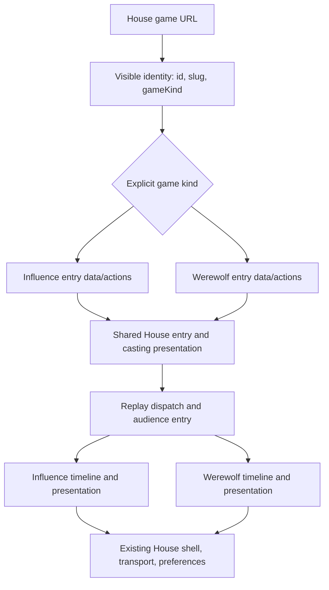

# One House game entry and replay routing

## Outcome and boundary

A viewer opens either game at `/games/[slug]`, joins through the same casting interface, and watches through `/games/[slug]/replay`. The House owns these pages and their common UI; explicit Influence and Werewolf modules supply game data, actions, audience policy and presentation. Delete the separate public Werewolf page tree after switching every active caller.

This is W0 of the [integration roadmap](../ideation/2026-09-30-house-admin-and-production.md#w0--one-house-experience-game-modules-underneath). Implement through the [task specifications](2026-10-02-002-house-game-entry-tasks.md). Source audit: `codex/werewolf`, `62c7a54e`, 2026-10-02. This document proposes implementation; it does not claim shipped behavior. The [simplification and consistency review](../reviews/2026-10-02-house-game-entry-plan-review.md) records the revisions below. This plan owns product/architecture decisions; the task document owns execution order and proof, rather than defining another contract.

**Included:** visibility-safe game identity resolution; shared lifecycle entry, casting presentation and library card; fixed-audience replay entry; metadata; links and agent-creation continuation; removal of obsolete public routing; focused regression evidence.

**Deferred:** W1 result facts/page, W2 MCP match inspection, W3 learning, W4 Cuts, W5 trailers/music, W6 night scenes, W9 art exploration, A2 studio redesign. Existing Influence results/highlights/trailers continue working. W0 does not add their Werewolf backends, placeholder artifacts or special warning/disabled UI. The shared entry accepts real available actions; W1/W4 add their destinations when implemented. Full route-family parity is the roadmap outcome, not a claim for W0 alone.

Sharing a specific replay moment is an explicit product requirement, tracked in [R35](../refactor-queue.md#r35-share-the-current-replay-moment-across-house-game-players). It is the focused follow-up to W0 and does not depend on completing W1/W2. Preserve existing in-player seeking and Influence sequence URLs now; W1/W2 will consume the same share-link contract rather than inventing their own.

No gameplay/rules changes, new feature flags, database migration, paid generation or historical game mutation is required. Keep existing game enablement configuration. Internal `/api/werewolf` services and admin URLs need not be renamed in this slice.

## Verified source findings

| Current source | Finding and implication |
| --- | --- |
| `packages/web/src/app/games/[slug]/page.tsx` | Loads `GameDetail` using Influence's server loader; metadata also calls Influence postgame media. Resolve kind before these calls. |
| `app/games/episode-landing.tsx` | Calls Influence game/preview endpoints and renders Influence round/phase fields. Split its data controller from the reusable episode presentation. |
| `app/games/[slug]/replay/replay-page.tsx`, `replay/[sequence]/page.tsx` | Replay boot loads Influence transcript/watch frames. Sequence deep links are canonical Influence event positions. |
| `app/werewolf/werewolf-entry.tsx` | Separately owns lifecycle, nav, casting, audience choice and viewer dispatch. Reuse casting markup through House components; retain only game-specific data/actions. |
| `app/werewolf/werewolf-viewer.tsx`, `use-werewolf-watch.ts` | Already uses shared watch shell/director/transport/preferences. Session publication cutoff and audience-local cursor must survive relocation. Initial load currently seeks cursor 1. |
| `app/games/episode-preview.tsx`, `games-browser.tsx`, `werewolf-game-card.tsx` | Separate card markup and Influence preview fetching. Extract card presentation without giving Werewolf Influence preview requests. |
| `app/games/[slug]/components/game-pre-show.tsx`, `components/casting/` | Shared hero and selector exist; waiting roster/controls/polling still have two orchestrators. Share presentation and retain action-specific policy. |
| `packages/api/src/routes/games.ts` | `/api/games/*` middleware rejects Werewolf before handlers. Preserve protection of Influence endpoints; do not relax it globally to accommodate a common web URL. |
| `packages/api/src/routes/episodes.ts` | Visibility helper uses Influence game-player seats and private-game config. It is not a universal Werewolf access predicate. |
| `packages/api/src/services/werewolf-lobbies.ts` | Public lobby read excludes hidden games and exposes safe cast identity, not assigned roles. Use this knowledge boundary for entry. |
| Agent creation, admin workspace and `packages/engine/src/werewolf/api-simulate.ts` | Generate separate Werewolf links; update create/join/cancel/resume paths as part of cutover. |

Relevant learning: [persistent playback intent and composition](../solutions/ui-bugs/2026-10-01-werewolf-watch-layout-and-seeking.md). The [separate-game architecture](../solutions/architecture-patterns/separate-werewolf-game-authority.md) remains the rules boundary; its older restrictions on thinking/public media describe earlier implementation and must not override current captured-thinking and publication contracts.

## Architecture

Use a closed discriminated union and an explicit switch. No plugin registry, dynamic registration or universal game-state object. Share display contracts only where two real consumers use them. Do not cast Werewolf into `GameDetail`, Influence `PhaseKey`, jury, alliances, ratings or single-winner fields.

### Identity and access

**Public games are watchable without logging in, for either game kind.** A new `GET /api/game-entries/:idOrSlug` must use optional authentication, not require authentication. Reading a public identity, replay or its permitted images never waits for sign-in. Joining, creating, stopping and other mutations keep their current permission checks.

Use one House entry-access decision based on visibility and viewer membership, not different rules named Influence and Werewolf:

| Game visibility/state | Entry access |
| --- | --- |
| Public, not hidden | Anyone, including a signed-out viewer |
| Unlisted, not hidden | Anyone with the link; listing/discovery is a separate policy |
| Private, not hidden | Signed-in creator, eligible participant or authorized operator |
| Hidden or missing | No public entry; operator inspection belongs to authorized admin endpoints |

**Current implementation gap:** Influence's creation form supports public/unlisted/private, defaults public, and uses optional auth for reads. Werewolf creation currently hardcodes public and omits the visibility selector; its reads therefore assume public/nonhidden. This is incomplete visibility support, not a permanent game-rule difference. W0's common entry policy works for the currently supported records; enabling private/unlisted Werewolf creation is a recorded W7 parity task and must cover its list, lobby, watch, transcript/thinking and media reads together. Do not simply expose a private creation option while its data remains public. Unlisted listing behavior also needs verification; current Influence listing filters do not explicitly exclude unlisted rows.

The narrow entry endpoint sits outside Influence's `/api/games/*` guard and returns only `{ id, slug, gameKind }`. Status comes from the selected existing detail/lobby read; identity is not polled. Missing, hidden and unauthorized private entries return indistinguishable 404 responses. `Cache-Control: private, no-store` prevents shared caching; the header does **not** mean the game is private or requires login. No config, roles, owner details, events or seed belongs in identity.

Reuse the existing private membership lookup for Influence. Where membership storage differs, a concrete game module supplies that fact to the common decision; the page must not implement a separate permission policy for each game. Public access does not need a seat lookup. Unknown/malformed visibility fails clearly rather than granting access. Until private Werewolf read support is complete, an unexpected private Werewolf row must fail closed, not fall through to a public watch implementation.

**Auth retry means only this:** an anonymous server render may not know the current browser user's permission to a private game. Successful public SSR data renders immediately. On an anonymous 404, keep metadata generic and allow the normal client read after existing auth initialization, attaching a token if there is one. Signed-out viewers remain signed out; their final 404 is not a login requirement for other games. Timeout/server failures show retry, not a guessed game type. No new credential forwarding, cache or auth state machine.

**Every data URL remains responsible for access.** A visitor can request watch JSON or an image directly without opening the entry page. Those endpoints must keep their existing visibility, audience and publication checks; the identity read is not an access ticket. Mystery/Omniscient is a presentation choice separate from account permission: both can be anonymous for a public Werewolf game, but Mystery must never receive pack/thinking content. Omniscient access does not grant operator diagnostics or unpublished images.

**Discover kind explicitly.** Do not call the Influence endpoint, see a 409/404/timeout, then try Werewolf. Ask the identity read which game exists, then call that game's implementation. Keep the current Influence wrong-game guard so its handlers cannot interpret Werewolf rows using Influence rules. Wrong kind is a programming error; transport failure is an outage, not game detection.

Existing discrepancy: Influence detail reads do not apply the same hidden exclusion as episode reads. Record this and unlisted discovery in W7; W0 must prove common entry denial and retain downstream checks without claiming a whole API visibility audit is complete.

### UI ownership and module placement

- Keep App Router files under `app/games/[slug]` thin: parse route intent, resolve identity, dispatch the correct loader, render House components.
- Put reusable entry/card presentation under `components/games/` and casting roster/control presentation under `components/casting/`. Reuse `CastingHero`, `AgentSelector`, `WatchShell`, `WatchTransport` and saved preferences.
- Move the current public `app/werewolf/` implementation into `components/games/werewolf/` (viewer, watch hook/model, stage, thinking and replay-moment modules). Its entry controller provides data/actions; it must not remain a second full page with its own nav/episode template.
- Keep existing Influence and Werewolf data hooks/actions as concrete modules; extract shared markup from `EpisodeLanding` and `GamePreShow`. An adapter is a small mapping/function, not a new class, controller hierarchy or configurable lifecycle framework. Move only code needed to establish ownership; the Influence presentation tree stays in place.
- Start with ordinary React props for the shared card, episode entry and cast roster; extract smaller subcomponents only where both consumers need them. Shared props describe title, identity, status, safe artwork/cast, game-information content and actual actions. Gameplay fields stay in game-specific typed data or content slots. Mutation availability comes from existing permission/game policy, not from what a button happens to display.
- Shared card component supports existing Influence episode media/controls and Werewolf art/copy as data or narrow slots. Retire `WerewolfGameCard` markup; retain appropriate Werewolf styles. Do not add a second card implementation inside the adapter.
- Shared casting layout retains roster portraits, profile inspection, owner actions, selector and mobile behavior. Influence season/multiple-seat limits and Werewolf fill-on-start remain their own action rules. A shared start button must not homogenize them.

### Common behavior versus game implementation

| Concern | House responsibility | Game-owned difference / remaining gap |
| --- | --- | --- |
| Entry, links, casting, cards, controls | Shared components and navigation | Data mapping and permitted actions supplied by each module |
| Visibility and login | One policy above; public watching anonymous | Membership storage behind implementation; private/unlisted Werewolf support is W7 debt |
| Audience | Shared selection presentation when offered | Werewolf Mystery/Omniscient knowledge projection; no invented Influence audience mode |
| Playback | Same controls, preferences, sharing action (R35), seek intent | Event sequence/cursor conversion, timeline and scene choreography |
| Live updates | Same waiting/error experience | Existing Influence socket vs Werewolf polling stays internal |
| Casting actions | Same picker/roster presentation | Season seat restrictions, fill/start rules and strategy fields remain server-owned |
| Results/media availability | Same eventual page family | W1/W4/W5 implement missing Werewolf payloads; W0 does not fake them |

These are explicit boundaries, not permission to perpetuate parallel UI. Changes to gameplay or release policy need their own scope; differing transports/storage do not need to be made identical to provide the same House experience.

### Lifecycle and URL contract

Site navigation belongs to entry/casting/audience-choice pages. Once playback mounts, the existing full-screen watch shell owns the viewport. The shared replay route is a dispatcher, not a second player shell or a max-width/Nav wrapper around `WatchShell`.

| Intent | Shared behavior |
| --- | --- |
| `/games/:slug`, waiting | House casting; roster polls until transition. An audience parameter never bypasses casting. |
| `/games/:slug`, live | Shared episode entry. Werewolf Watch Mystery/Watch Omniscient actions go straight to replay with the chosen audience; no extra chooser after this deliberate choice. |
| `/games/:slug`, completed | Shared episode entry with the same Werewolf audience actions. Use safe available artwork, not final roles/outcome or unapproved media. Influence keeps current published trailer/results/highlight actions. |
| `/games/:slug/replay`, waiting | Return to canonical casting entry. Drop watch intent so starting the game does not unexpectedly bypass the episode entry. Do not boot an empty match player. |
| `/games/:slug/replay`, live or completed | Start the correct player. Werewolf without an audience shows the House audience-choice presentation; an explicit audience starts autoplay with saved viewer preferences. |
| Cancelled before start | Shared stopped entry and available cast identity, no invented replay. |
| Cancelled after accepted play | Preserve actual partial replay where supported. No victory or draw is inferred from cancellation. |
| Suspended | Preserve the existing suspended status/reason and available history. Do not call it completed, auto-resume gameplay, or treat a provider error as a new game status. |
| `/games/:slug/results`, `/highlights` | Keep Influence behavior. Resolve kind before their loaders; Werewolf remains a later slice and receives the shared not-found behavior until its module exists. Never feed it to Influence analysis. Do not advertise these actions for Werewolf yet. |

`?mode=replay/results` retains its existing meaning. Preserve a valid audience only for a replay destination; Results does not consume it. An explicit Werewolf audience on a live/completed base URL redirects to replay after lifecycle resolution. Ordinary card links target the base entry. A waiting base URL never auto-enters playback when polling observes start.

**Keep replay URLs minimal:** Influence retains `/replay/:sequence` with its current canonical event-sequence semantics. Werewolf uses `/replay?audience=mystery|omniscient` and starts from the beginning, as today. Missing audience opens the chooser; invalid/repeated audience produces an understandable invalid-link state without loading watch data. Werewolf `/replay/:sequence` returns not found rather than interpreting a canonical sequence as its audience-local cursor. R35 adds the missing cross-game share-at-moment action and Werewolf link/initial-seek support as a focused follow-up. It is not discarded or blocked on Results/MCP; existing in-player cursors and seeking remain unchanged in W0.

Hydrate saved preferences before Werewolf autoplay. Mystery never requests thinking even if this device previously enabled it in Omniscient. Changing audience means entering a new session, not switching the running player in place. Preserve Influence's existing autoplay behavior.

Keep publication cutoff fixed for each mounted session. New sessions select then-current published media; W0 does not introduce user-controlled publication cutoffs or exact historical-image sharing. Do not put cutoff, polling revision or cursor into the player mount key. Normal seeks and refreshed entry data must not reconstruct the whole watch session. Abort stale requests when game/audience changes or access is revoked.

### Metadata and caller cleanup

Use House identity plus the correct game label. Base entry/replay metadata is spoiler-safe even for Omniscient links; do not fetch Omniscient history to build social previews. Only use artwork already eligible for public entry; pack imagery and latest unpublished candidates are not valid covers. Missing optional media uses existing House artwork without initiating generation. A missing optional preview must not turn an otherwise accessible game into a failed page.

Centralize web link construction in `lib/game-links.ts`, extending the existing helper with an optional typed audience while preserving current anchor/sequence callers. Do not introduce a generic URL-intent framework. The engine CLI must not import web code: update its existing formatter and exact-output tests, avoiding a new shared package just for one URL. Audit cards, creation, agent join/cancel, player exits, admin spectator links, profile/history links, MCP-generated links and active usage docs. Preserve `/api/werewolf`, rules sections, admin routes and game-specific code names; a raw global replace is incorrect.

Unify `join_werewolf` into the existing `join_game` agent-create intent, resolving target game kind before choosing the join operation. Prepare the common handler first; change emitters and delete the old flow in the same cutover checkpoint, so an intermediate commit does not strand active callers. Preserve creation recovery, duplicate-submit protection, ownership and separately saved strategies. Retry after a successful character creation must reuse that character; game-start races must not create duplicates or join a closed cast.

Delete `/werewolf/[slug]` route and migrated public module files after callers move. No alias/redirect or backward-compatibility page. Existing saved external Werewolf URLs will stop resolving; record this as the explicit route cutover consequence. Update active docs and fixtures; historical plans may retain old source evidence.

## Delivery and acceptance

Use three ordered implementation checkpoints on this feature branch: (1) identity and typed link/data contracts, (2) shared entry/casting/card components with existing consumers, (3) atomic route/caller cutover plus browser verification. Each checkpoint must preserve existing working flows; no deployment between a deleted route and unconverted callers. No new rollout flag.

Required acceptance:

- Both games: discovery → entry → choose/create agent → cast refresh/start → live watch → completed replay, using House routes; direct reload/back/forward work.
- Private/hidden/not-found and delayed/failing reads produce correct outcomes without leaking identity or misdispatching. Retain downstream endpoint authorization; test Werewolf hide revocation without asserting the separate Influence discrepancy is fixed.
- Werewolf: audience chosen before start, autoplay after preferences load, no Mystery thinking/pack requests, unchanged in-player seeking and silent history handling, preserved play/pause intent, publication pin and stable mounted scenes.
- Influence: classic and format replay, sequence deep links, waiting-game policies, episode/trailer entry, results/highlights and private-game access remain functional.
- Desktop/mobile: shared casting/cards and one watch shell, no duplicate nav/controls, flash of wrong game, horizontal overflow or scroll reset caused by the new wrapper.
- Active UI/CLI links no longer emit `/werewolf/:slug`; old public route removed. API/admin paths still work.

Run focused provider-free, PostgreSQL and deterministic browser tests, then required repository `bun run test`, `bun run test:postgres`, `bun run check`. DB tests use `setupTestDB()`; browser tests use isolated databases and clean up children. No providers/real auth/media writes in required checks. Use a read-only local completed Werewolf episode (for example `hazy-ruby-sand`, if still present) for visual QA alongside Influence; deterministic fixtures remain acceptance authority. Do not generate a paid replacement game just to validate routing.

## Adversarial checks resolved in this plan

1. A common URL cannot remove the Influence API wrong-game guard: use a separate identity endpoint.
2. Private Influence SSR cannot rely on anonymous access succeeding: generic SSR plus authenticated retry through existing auth transport; no new auth machinery.
3. Werewolf cursors cannot be canonical event sequences: preserve current seeking; R35 explicitly owns share-at-moment parity before Results/MCP consumers.
4. Completed Mystery cannot inherit a spoiler-rich episode preview: audience-safe entry artwork and metadata.
5. Relocation cannot reintroduce remount/seek glitches: stable game/audience session and pinned publication.
6. Results/highlights parity is not delivered by renaming a route: explicit W1/W4 dependency, with no bogus Influence request or placeholder result.
7. Shared casting cannot erase game-specific seat/start/strategy policy: existing game actions, backend validation and race tests.
8. Suspended games and waiting-to-start transitions use current lifecycle data, not stale identity or an invented failure status.
9. Removing old join intent or routes precedes no callers: all emitters and deletions change together.

No product question blocks W0 planning. Exact small component names may change during implementation; these lifecycle, privacy, routing and scope decisions should not drift silently.
