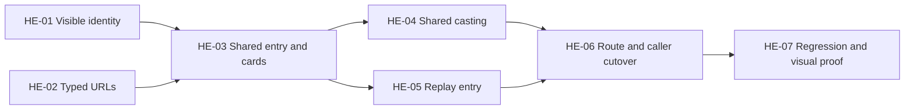

# House game entry — implementation tasks

Implements the [W0 plan](2026-10-02-001-refactor-house-game-entry.md), not the whole [integration roadmap](../ideation/2026-09-30-house-admin-and-production.md). All tasks are pending. The [review resolutions](../reviews/2026-10-02-house-game-entry-plan-review.md) are incorporated. The plan is authoritative for behavior; tasks below specify edits and proof. These are ordered work units, not a request to dispatch parallel agents. Keep the current Werewolf worktree and protect unrelated edits; do not merge or deploy as part of this plan.

## HE-01 — visible game identity

**Owns:** one small API entry handler (extract a helper only if reused); API app registration; identity DTO; `packages/web/src/lib/server-api.ts` and client identity read. Inspect `packages/api/src/routes/games.ts`, `routes/episodes.ts`, `services/werewolf-lobbies.ts`, middleware auth and existing route registration before editing.

**Implement:**

- Add `GET /api/game-entries/:idOrSlug` outside Influence route guard. Use optional auth; resolve one canonical row and apply the common House visibility decision using existing membership helpers, return only id/slug/gameKind with private/no-store headers. Existing detail/lobby data owns status; do not add identity polling.
- Hidden/missing/unauthorized all return 404 without game-specific hints. Invalid config must fail clearly, not grant public access. Public games of either kind must resolve without login or auth-readiness delay. Private access uses creator/participant/operator membership; Werewolf currently creates only public games. Treat broader Werewolf visibility support as W7 debt, not a different entry rule.
- Retain access checks on direct detail/watch/media requests: callers can bypass the entry page. Resolve kind explicitly; never interpret an Influence 409/404 or network failure as a request to try Werewolf.
- Add typed client/server readers using existing transports. Reuse successful SSR bootstrap data; only on anonymous SSR 404, let the normal client read run after auth initializes, attaching a token if available; sign-in is not required for public games. Successful public boot does not wait for login. Distinguish final 404 from retryable errors. No new credential forwarding, cache or auth framework.

**Proof:** Signed-out successful identity/replay boot for public games of both kinds, including Omniscient Werewolf without thinking unless enabled; PostgreSQL tests for slug/id lookup across kinds, private Influence anonymous/owner/participant/unrelated/operator, hidden games including operator public read, missing games and malformed config. Assert exact allowlisted identity shape. `setupTestDB()` before mutations. Verify Werewolf watch access denies after hide even if identity was previously fetched. Record the pre-existing Influence detail hidden-visibility discrepancy in the review; do not turn this task into a blanket API authorization refactor.

**Done:** caller can reliably choose the proper game loader without fetching roles, gameplay state or private previews.

## HE-02 — typed House links and replay intent

**Owns:** `packages/web/src/lib/game-links.ts`, focused unit tests; audience parameter validation beside the existing helpers.

**Implement:**

- Extend the existing replay helper with optional typed audience, preserving Influence anchors/sequence callers.
- Follow the plan's lifecycle/URL table: missing audience opens choice, explicit audience starts Werewolf, invalid/repeated audience does not load the player. Waiting always returns to casting; replay mode redirects preserve only valid audience.
- Keep Influence sequence links unchanged; Werewolf sequence-path links return not found. Track the missing shared share-at-moment action and Werewolf link/initial-seek support in [R35](../refactor-queue.md#r35-share-the-current-replay-moment-across-house-game-players), a focused W0 follow-up that Results/MCP will reuse.

**Proof:** existing `packages/web/src/__tests__/replay-sequence-deep-link.test.ts` plus focused cases for encoded identifiers, audience omission/validation, repeated params, mode redirects and wrong-kind sequence paths. Influence sequence 0 stays supported.

**Done:** common entry/replay links work without introducing a second moment-link contract.

## HE-03 — shared entry presentation and library cards

**Owns:** `app/games/episode-landing.tsx`, `episode-preview.tsx`, `games-browser.tsx`, `werewolf-game-card.tsx` and its styles; shared `components/games/` entry/card presentation, retaining existing game data hooks.

**Implement:**

- Separate Influence preview fetching from episode/card markup using ordinary components and concrete game functions, not a new adapter/controller hierarchy. Both kinds use shared House identity, artwork region, information/action layout and card interactions.
- Normalize only display fields. Keep typed game-specific information content; do not generate fake rounds, season, winner or trailer values for Werewolf.
- Werewolf entry uses existing safe lobby identity/cast and House art. Do not load final roles, pack art or generate new copy/music/media. Influence preserves its current published episode preview and trailer behavior.
- Preserve error separation: optional media failure leaves entry/watch actions usable; inaccessible game does not expose cached private details. Authentication/account changes invalidate identity-scoped data.
- Retire separate Werewolf card markup after both consumers use the shared component; retain game styling supplied by the module.
- Actions reflect actual modules: W0 adds watch/casting, retains Influence result/highlight actions. W1/W4 later add Werewolf result/highlight actions. No missing-feature notices or disabled parity controls.

**Proof:** component tests for real adapter data, no Influence endpoint calls for Werewolf, safe artwork and pending/error states; regression of Influence preview activation, trailer fallback and existing actions. Verify library search/status/game filters still work across the two feeds.

**Done:** both entries/cards visibly belong to House, with no duplicated outer template or forced common gameplay model.

## HE-04 — shared casting and create-agent continuation

**Owns:** `app/games/[slug]/components/game-pre-show.tsx`, waiting portion of `app/werewolf/werewolf-entry.tsx`, `components/casting/`, `app/dashboard/agents/agent-create-content.tsx`, `app/agents/create/page.tsx`, existing join modal integration.

**Implement:**

- Extract shared cast roster/cards, empty state, action area and picker placement. Reuse existing `CastingHero`, `AgentSelector` and portrait/profile inspection. Action adapters preserve each game's start/fill/remove permissions and eligibility.
- Retain the existing game-specific polling implementations; no shared polling framework is required. Keep one active waiting-state poller per mounted game; no overlapping polls, stale game updates after navigation, or duplicate mutations. Stop waiting polling when lifecycle changes, then move to the shared episode/watch entry.
- Use `flow=join_game` for either game; resolve the target before choosing the API, rules link, strategy context or cancel destination. Prepare the unified handler here; HE-06 switches every emitter and removes `join_werewolf` together. Until then, the existing flow remains functional. Keep Daily Free/manage behavior unchanged.
- Preserve resumable character creation and join retries. If the game starts between selection and submission, show the actual error without manufacturing a seat or recreating the saved character.
- Route successful creation/join and cancellation to the common House entry; use canonical returned slug, not assumptions about id formatting.

**Proof:** both kinds share rendering but still enforce original seat/start policy; tests for non-owner remove denial, full/stale cast, double-click, accepted creation then failed join and retry, separate strategy fields, auth-required selection and waiting-to-live transition. API tests reuse existing Werewolf lobby and Influence mutation contracts rather than rewriting game rules.

**Done:** the shared picker and layout work end to end for both games, including newly created agents and failed joins.

## HE-05 — replay boot and game-module relocation

**Owns:** public `app/werewolf/` modules moved into `components/games/werewolf/`; `app/games/[slug]/replay/` loaders/shell; audience-choice presentation within the House entry; consumers/imports in producer preview and tests.

**Implement:**

- Resolve identity before replay-specific data loads. Keep Influence transcript/watch-frame boot and Werewolf bounded-window boot separate.
- Replay dispatch renders the existing full-screen watch shell directly; no extra Nav/max-width/player shell wraps it. Entry and direct-link audience choice use the site layout. The two Werewolf watch actions on episode entry already carry audience, avoiding a second chooser. No running-player audience switch.
- Preserve current start-from-beginning behavior and load saved viewer preferences before autoplay. Preserve separate producer preference scope. No initial-cursor prop or watch-hook algorithm change is needed.
- Keep live append/hydrate/seek cancellation, silent-entry consumption and play intent. Entry refreshes must not remount the director/stage. Pin publication per session and clear old game/audience requests on real session change.
- Reuse shared watch shell, inspector, cast, thinking, transport and fullscreen unchanged unless integration requires a narrow fix. Keep MCP banner verbatim. Move game-specific implementation, not game semantics into the shared clock.
- Relocate all imports, including producer scene-preview and test imports, without changing production authorization/publication.

**Proof:** adapt `packages/api/src/e2e/werewolf.e2e.test.ts` and existing watch tests. Reuse existing coverage for window boundaries, silent history, live empty history, play/paused seeks, superseded requests and cursor-correct snapshots. Add route-level checks for audience selection, saved-preference autoplay, stable mounts and Mystery absence of thinking/pack network payloads; do not duplicate the whole director suite. Existing Influence sequence tests remain green.

**Done:** either game opens through the same replay route and player controls without restart, double nav or content flicker.

## HE-06 — atomic public route cutover, metadata and deletion

**Owns:** `app/games/[slug]/page.tsx`, replay/results/highlights entry and metadata (including card-image route guards); old Werewolf route removal; caller/docs updates.

**Implement:**

- Connect HE-01–05 at House entry and replay routes. Register common loading, invalid-link, not-found and retry states.
- Resolve game kind before Influence-only results/highlights loaders, including metadata and nested card-image routes. Leave these Werewolf experiences for W1/W4; no invented result or analysis.
- Use correct game/House labels and spoiler-safe metadata/canonical URLs. Anonymous metadata must not expose authorized private identity. Do not pull secret scenes into OG covers.
- Update call sites: `games-browser`, creation form (`app/admin/games/new/create-game-form.tsx`), agent continuation, profile/history links, player exit links, admin spectator links, producer public links and any existing MCP followups.
- Update `packages/engine/src/werewolf/api-simulate.ts` watch/resume/error guidance to House routes, keeping selected audience. Its ambiguous-create guidance points to `/games?game=werewolf`; never invite duplicate creation. Update `packages/engine/src/__tests__/werewolf-api-simulate.test.ts`.
- Change all join/create emitters to the prepared common flow and remove `join_werewolf` parsing/branches in this same checkpoint. Remove public `app/werewolf/[slug]/page.tsx` and remaining migrated directory contents only with converted callers. Keep admin routes and `/api/werewolf` intact.
- Update active `docs/werewolf.md`, relevant `README.md`/`DEVELOPMENT.md`/`docs/local-model-evaluation.md` CLI examples, `docs/reasoning-transcript-observability.md` and simulator JSDoc where launch-link instructions change. Update the architecture learning with current routing while preserving separate game authority. Historical review/plan evidence need not be rewritten.

**Proof:** inventory literal and template-generated `/werewolf` web URLs; classify legitimate API/admin/import references separately. No active public link target or route remains. Test base/mode/replay redirects and canonical slug normalization without losing valid intent. Access to old URL returns not found, not a retained compatibility application.

**Done:** one coordinated change serves both kinds under House routes, with every active first-party caller converted.

## HE-07 — integration proof and roadmap update

**Owns:** focused tests added above, deterministic browser fixtures, implementation evidence document and W0 roadmap status.

| Journey | Required evidence |
| --- | --- |
| Influence waiting/live/completed | Existing join rules, episode/trailer actions, classic/format playback, results/highlights, sequence links and private access preserved |
| Werewolf waiting/live/completed | Existing/new character joins, start transition, audience choice, autoplay/preferences, completed/partial replay, cancellation and suspension |
| Hidden/private/error | No identity/art leaks; explicit retry; anonymous SSR does not block valid authenticated entry; no wrong-kind fallback |
| Playback continuity | Stable stage mounts, delayed requests, rewind snapshots, play/pause intent, live waiting and publication cutoff |
| Responsive shared UI | Desktop/mobile casting/cards/entry; one player control row, fullscreen/settings, readable choices and no overflow |
| Link cutover | Main list, create/join/cancel, admin spectator, CLI, profile/history links and browser reload/back/forward |

Run `bun run test`, `bun run test:postgres`, `bun run check` after focused coverage. Use the repo's deterministic E2E harness, isolated databases and child cleanup; classify added tests under `scripts/check-test-classification.ts`. On sandbox DB connection refusal, retry with local access before diagnosing the DB. No paid providers, actual Clerk or publication calls are required.

For visual inspection, use an existing local Werewolf episode plus an Influence episode, and narrow/wide viewport screenshots. Verify network/request behavior as well as appearance; screenshots cannot prove audience safety. Record any environment blocker and exact unproven acceptance item. No claim of deployment or full Werewolf parity.

Update the pillar document W0 status only after acceptance, linking a dated implementation report with checks, browser evidence and remaining W1–W9/A2 boundaries. R35 is the near-term share-at-moment follow-up and does not depend on W1/W2; results and MCP should consume that common contract. W1 result facts and W2's external MCP contract remain separately scoped.

## Commit checkpoints

1. **Contracts:** HE-01–02 plus focused tests; current UI still works.
2. **Shared surfaces:** HE-03–05 reusable presentation/modules and tests; current routes and join intents remain valid until the coordinated cutover. One owner of each mounted page/watch layout.
3. **Cutover:** HE-06 and HE-07; routes, callers, fixtures and documentation move together.

These checkpoints are implementation organization, not independent rollouts. Before committing, inspect the diff and stage only the intended files; the present request authorizes planning only.
