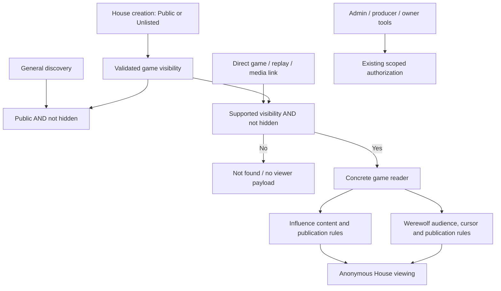

# Public and Unlisted games across The House

## Outcome

Influence and Werewolf offer the same two visibility choices at `/games/new`:

| Setting | Listed in Games and public discovery | Anyone with the URL can watch |
| --- | --- | --- |
| Public | Yes | Yes |
| Unlisted | No | Yes |

Public remains the default. Unlisted copy explicitly says **“Anyone with the link can watch.”** It is a discovery setting, not confidential or account-restricted access. Signed-in users with a link may join an open lobby under the existing character-ownership, eligibility and capacity rules.

The operator confirmed on 2026-10-02 that there are **no production Private games**. Remove Private instead of building account-based game access. This supersedes the earlier three-mode draft at this path, including its proposed membership schema, private invitations, authenticated image loader and WebSocket authentication handshake. No production Private migration or compatibility mode is needed.

This is a focused slice of [W7](../ideation/2026-09-30-house-admin-and-production.md#w7--close-the-surrounding-house-gaps), following [House game entry](2026-10-02-001-refactor-house-game-entry.md). Source audit: `codex/werewolf`, `aadd6d9b` plus ongoing creation-setting cleanup and Werewolf defaults. Implemented on the Werewolf feature branch. See the verification record below; no deployment or operator-data conversion was performed.

## Boundaries that remain

- **Hidden is independent.** Hidden games disappear from normal discovery and direct viewer routes. Authorized admin/production inspection still works through its existing permissions.
- **Audience is independent.** Werewolf Mystery and Omniscient retain their existing projections. Thinking is available only in Omniscient at permitted positions. Audience, cursor and publication checks still protect pack scenes and unreleased material.
- **Operator and owner data stay protected.** Removing the game visibility value `private` does not remove authentication from mutations, production, raw provider reasoning, owner-learning, account information, evidence or MCP-scoped tools. Do not equate the word “private” in those domains with the deleted game setting.
- Existing playback speed, thinking preferences, model configuration, role defaults, maximum rounds/days and game rules remain unchanged.
- Visibility is selected at creation. A later visibility editor is outside this slice. Game completion does not change an Unlisted game to Public.
- A shared replay link opens the selected game/audience/source position under its normal rules. No invitation or new access-grant system is required.

## Discovery and direct access

General discovery includes `/games`, public search, public profile histories, recommendation lists, sitemaps and public metadata feeds. Those surfaces include only Public, nonhidden games, for anonymous and authenticated visitors alike. Filter before pagination/limits and compute public counts from the same predicate.

Existing personal dashboards/history and admin lists may show relevant Unlisted games under their existing account/operator scopes. Keep those lists distinct from general discovery; do not invent a new personal-history feature. Following an Unlisted link permits normal anonymous metadata, preview, lobby, replay and image reads. Mark Unlisted pages `noindex` and exclude them from sitemaps. Neither noindex nor a hard-to-guess slug is an access restriction, and links can be forwarded.

Both ID and slug lookups follow the same policy. Hidden checks belong on direct data and media routes as well as entry pages. For an already-open stream, hiding must stop subsequent game delivery; the UI clears unavailable content when notified or on its next access check. Previously downloaded content cannot be recalled.

## Current findings and simplifications

| Surface | Current implementation | Planned change |
| --- | --- | --- |
| Creation form and contracts | Influence offers three values; Werewolf hardcodes Public | One shared two-value selector and validation |
| House identity | Private Influence uses participant checks; Private Werewolf is rejected | Delete game-level Private branches; accept nonhidden Public/Unlisted |
| Influence discovery | `visibleEpisodeGames` permits Unlisted rows in the main feed | Separate public discovery from direct-link reads |
| Werewolf discovery | Lists every nonhidden Werewolf game | Filter Public before the limit |
| Werewolf creation paths | Lobby and direct simulation creation hardcode Public | Both validate and persist Public/Unlisted |
| Influence detail/transcript/WebSocket | Inspected routes do not consistently check hidden state | Apply nonhidden viewer checks without introducing viewer login |
| Native image loading | Uses ordinary image URLs | Keep ordinary loading; preserve hidden, publication and audience checks |
| Casting copy | Werewolf says “Creates a public casting lobby” | Derive copy from the selected visibility |

Earlier findings about anonymous media or WebSocket access to Private games do not require new authentication infrastructure once Private is removed. Hidden content and existing narrower authorization still require enforcement. These are source findings, not a live production audit.

## Architecture

Use a small shared visibility type/validator and explicit discovery/direct-read predicates. Keep SQL filtering near queries where it prevents fetching excluded records. Move reusable policy out of `routes/episodes.ts`; delete obsolete game-Private helpers instead of leaving aliases. Do not introduce membership lookup, new tables, an authorization framework or a game plugin registry for this feature.

All new creation writes an explicit `public` or `unlisted`. Preserve the established default of Public for a missing historical visibility field; malformed values and the removed literal `private` must not silently become Public. Reject unsupported input at creation. Unsupported stored values must fail closed with an understandable operator diagnostic until local data is addressed; that is validation, not continued Private support.

## Implementation tasks

### VIS-01 — reduce the shared contract and creation paths

Remove Private from `GameVisibility`, creation controls, API validation, simulation CLI/env options, active documentation and configuration examples. Update both Werewolf lobby and direct-create paths to accept/persist the same enum, defaulting Public. Update typed request/response data and safe lobby metadata as needed. Remove obsolete Private-specific viewer ownership checks without touching account, mutation, evidence or MCP permissions.

**Likely files:** `packages/web/src/lib/api.ts`, `lib/werewolf-api.ts`, `app/admin/games/new/create-game-form.tsx`, API `routes/games.ts`, `routes/werewolf.ts`, `routes/game-entries.ts`, `routes/episodes.ts`, `services/werewolf-lobbies.ts`, `services/werewolf-games.ts`, engine API simulation launchers.

### VIS-02 — enforce discovery consistently

Inventory main game lists, public profile histories, search/recommendations, episode feeds, sitemap and metadata producers. Filter Public and nonhidden before projection/pagination. Preserve separately scoped personal/admin views of Unlisted games. If a feed serves both general discovery and personal history, make query intent explicit at that caller instead of adding account-dependent entries to the public feed.

**Proof:** Unlisted games cannot leak through public counts, pagination, cards, profile activity or related-game links; their direct links remain usable signed out.

### VIS-03 — simplify direct reads and keep hidden/audience boundaries

Route identity, detail, lobby, watch/history, thinking, transcript, presentation, visual artifacts, frozen characters, episode/preview, results, highlights and existing media routes through the nonhidden viewer predicate. Inventory actual implemented endpoints; do not build missing Werewolf editorial/results features. Retain audience/cursor/publication selection and narrower field-level restrictions. Public/unlisted viewing needs no viewer authentication handshake or bearer-image rewrite.

Check Influence WebSocket admission and subsequent delivery for hidden games without changing the release-probe socket. Werewolf keeps HTTP polling. Hidden games cannot be joined or started via ordinary casting endpoints; mutation permission and character ownership checks remain independent. Keep authorized operator recovery paths explicit.

### VIS-04 — copy, metadata and retired local data

Use shared selector labels: Public — “Listed; anyone can watch”; Unlisted — “Link-only; anyone with the link can watch.” Update casting copy to match, retaining ordinary friend sharing and agent selection. Add Unlisted noindex and sitemap exclusion; keep direct share previews available. Preserve all existing player preferences and Werewolf Doctor/Seer and wolf-count defaults.

Replace automated Private test fixtures with explicit Public/Unlisted cases or invalid-input regression cases. Inspect local/staging stored visibility counts before running the changed application there. If actual nonproduction Private records exist, report their IDs and propose a concrete reset or disposition; do not silently convert or delete operator data. The operator's production statement removes the need for a production migration, not the need to keep local data changes explicit. No schema migration, production backfill or legacy Private runtime is planned.

### VIS-05 — verify and document

Run `bun run test`, `bun run test:postgres` in a disposable DB, and `bun run check`. Run deterministic browser journeys serially because browser harnesses share `.next/e2e`. Inspect creation/casting on desktop and mobile, anonymous Unlisted playback and direct image loading. Confirm owned test DB/server cleanup. Update W7 and relevant `docs/solutions/` with proof and remaining limits. No paid models, real Clerk, staging writes or publishing are required.

## Acceptance matrix

| Scenario | Expected result |
| --- | --- |
| Public, signed out, waiting/live/completed | Listed and directly watchable |
| Unlisted, signed out, waiting/live/completed | Absent from general discovery; direct link and permitted images work |
| Unlisted, signed in with link | Can submit an owned eligible agent under normal open-lobby rules |
| Unlisted, completed | Remains Unlisted; moment links preserve audience and position |
| Public lists with many earlier Unlisted rows | Full public pages and correct public counts |
| Owner/admin personal context | Relevant Unlisted games remain accessible under existing scopes |
| Hidden by ID/slug/image URL/stream | Normal viewer payload denied; authorized admin inspection still works |
| Mystery with saved thinking enabled | Thinking and pack-only media remain excluded |
| Forged cursor/publication/asset ID | Existing game-specific restrictions remain enforced |
| Private, null, malformed or unknown creation value | Rejected before any game/seat/provider side effect |
| Stored removed/invalid value | Fails closed; never silently widened to Public/Unlisted |
| Unauthenticated operator or owner-evidence request | Existing authorization still denies it |

## Scope limits

No private-game ACLs, participant-ownership migration, private invitation flow, protected-image infrastructure, new viewer authentication protocol, visibility editor or rollout flag. Visual-failure policy, studio redesign, Werewolf results/MCP/Cuts/trailers and art exploration remain separate work. Reuse current game modules and shared House UI; deployment is the gate.

## Implementation and verification — 2026-10-02

VIS-01 through VIS-05 are implemented. Public/Unlisted creation, list filtering, anonymous direct viewing, hidden-game denial, metadata, CLI validation and retired Private UI now use the shared House contract. The game implementations retain their own audience, publication and evidence rules.

- `bun run test`: 2,205 passed, 5 skipped, 0 failed.
- `bun run test:postgres`: 1,827 passed, 0 failed in a disposable database.
- Focused final PostgreSQL run: 124 passed, including ordered asynchronous stream delivery and hidden-stream closure.
- `bun run check`: type checks and lint passed.
- Deterministic browser: anonymous Unlisted Werewolf entry/replay, audience validation and a later-moment share link passed. Both game creation forms passed at 1,440px and 390px, with anonymous Unlisted casting access and noindex metadata.
- Anonymous Unlisted results images passed the real API/web/browser journey, including sign-in/sign-out and hidden-game denial. Restored a missing results-banner mount exposed by this check.
- No sitemap generator exists in this repository. Discovery queries filter before limits and public aggregates; owner/operator views keep their existing scope.

Read-only local inventory found 79 Public, 5 Unlisted and 3 retired Private records. These three Influence games were left untouched and now fail closed in ordinary viewers:

| Slug | ID |
| --- | --- |
| vast-pink-key | 2ad67397-51ea-4242-be46-f1084e6c5632 |
| open-ivory-sun | ff38658d-2db0-4201-b5c3-0f30d31cf132 |
| calm-cyan-frost | c8c891fe-9ef1-4019-8e43-d61a26735c33 |

Proposed disposition: explicitly convert these local records to Unlisted if the operator wants to retain link viewing. No automatic conversion, deletion, compatibility path or production migration was added. Staging inventory and deployment remain unverified. Production absence of Private games is the operator's statement, not a new database audit.

See [implementation verification](../reviews/2026-10-02-house-game-visibility-implementation.md) for test scope and limitations.
