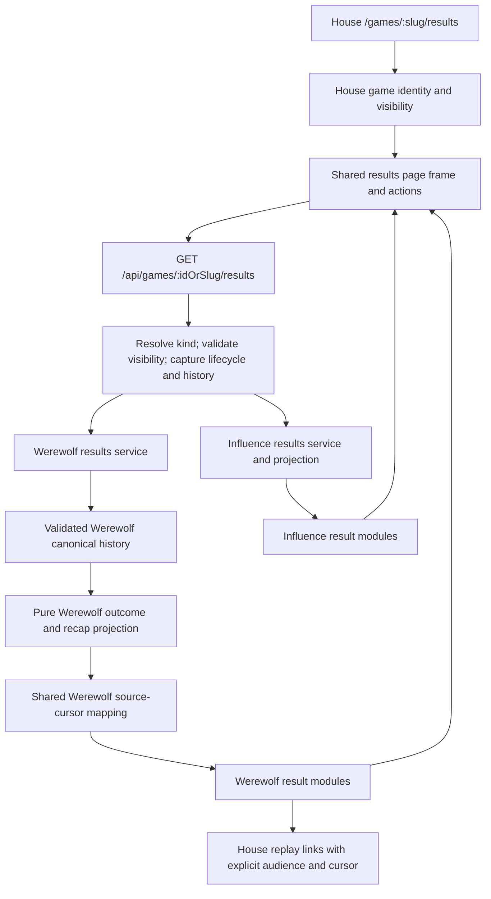
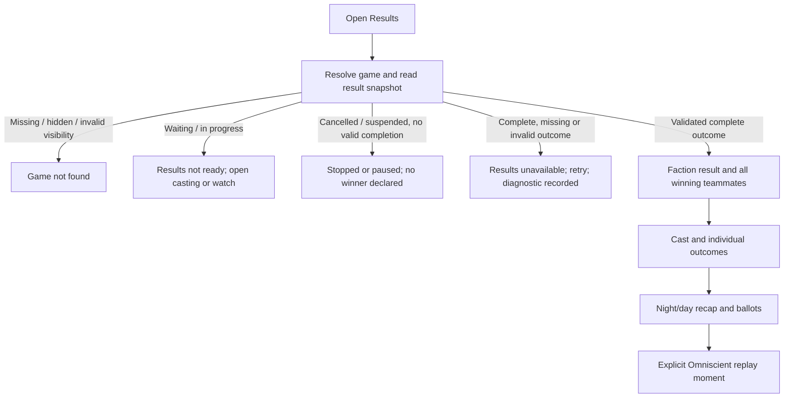

# W1 — Werewolf results and the House completed-game experience

## Outcome and scope

A completed Werewolf match has a useful `/games/[slug]/results` page inside The House: who won, why, which players share that victory, what happened each night and day, and replay links that substantiate those facts. The page uses House visual language and navigation. Werewolf supplies its own faction, role, ballot and chronology content; it does not impersonate an Influence round format.

This is **W1**, as defined in the [pillar document](../ideation/2026-09-30-house-admin-and-production.md#w1--make-the-ending-worth-reaching). The conversation briefly mislabeled MCP as W1; MCP remains **W2 / A4-MCP**. W0 entry/routing and the W7 Public/Unlisted slice are implemented. Visual-failure parity remains W7 and does not block results.

This plan covers deterministic results, result-page presentation, completion navigation and reusable evidence references. It does not implement MCP tools, generated analysis, owner coaching, ratings, learning credits, evolving strategy, House Cuts, trailers, new artwork, pack staging, or the production studio. Results must work without generated media or model calls. No schema migration, historical backfill, game plugin registry or new feature flag is expected.

## Verified starting point (before W1)

| Surface | Current state | W1 change |
| --- | --- | --- |
| House results route | `house-route.tsx` and `house-game-entry.tsx` both reject Werewolf results | Dispatch to a Werewolf results module at the same route |
| Results API | `/api/games/:id/results` and `services/completed-game-results.ts` read Influence canonical events and its single-winner result | One House results endpoint with explicit game-kind dispatch |
| Werewolf authority | Rules v7 events include `werewolf.completed`, resolved night actions, pack ballots and day ballots | Pure projection of validated canonical history; no prose inference |
| Faction outcome | `WerewolfOutcome` already stores `faction`, `winnerIds`, and `wolves_eliminated`, `wolf_parity`, or `day_limit` | Preserve these facts, including eliminated winning teammates |
| Game lifecycle | Failure can suspend; cancellation is separate; normal completion appends the outcome and updates the game row transactionally | Distinguish finished results from stopped, suspended and inconsistent data |
| Watch evidence | `projectWerewolfWatch` produces audience-local source cursors; these count silent entries too | Reuse that cursor authority for exact result evidence links |
| Replay entry | Shared House episode/casting UI and Mystery/Omniscient entry exist | Add deliberate Results entry without revealing outcomes on ordinary entry |
| Existing results UI | Influence has completed result header/actions, actor cards, vote tables, alliance analysis and result banner | Reuse applicable presentation; retain Influence-specific modules |
| Visibility | Public and Unlisted view anonymously; hidden/invalid records fail closed | Apply the same policy to results and result images; preserve Unlisted noindex |

Source locations: engine `werewolf/{types,rules,observation,watch}.ts`; API `services/{werewolf-games,completed-game-results,game-visibility}.ts`; web `app/games/[slug]/{house-route,results/page}.tsx`, `components/games/house-game-entry.tsx`, `components/games/werewolf/`, and `lib/game-links.ts`.

## Product decisions

1. **Results is an explicit spoiler destination.** Opening it for a completed game reveals all roles, faction outcome and resolved night facts. This does not change Mystery replay or enable thinking. Results does not request thinking, provider traces, frozen private strategy, raw events or pending actions.
2. **Team victory and survival are separate.** Every canonical winner receives a winner indication even if eliminated. Show survival/elimination beside the outcome, not a survival-based ranking. A draw has no winning faction or players.
3. **Facts first.** Explain the rules-based ending in plain language; do not invent MVPs, pivotal moments, intent, credibility scores or causal claims. A ballot is evidence of a vote, not proof of what a player believed.
4. **Keep the ordinary game entry spoiler-safe.** Add “View results · Spoilers” for completed matches. Preserve Watch Mystery and Watch Omniscient. Do not replace entry with an automatic results redirect or add winner names to general cards/metadata.
5. **No extra page-level tab bar.** Use the existing House shell, a clear result header, cast outcomes and a chronological recap. On wide screens, use a compact left-side day/night index if useful; on mobile, use a compact sticky section selector that does not cover content. Basic anchor navigation is enough; no new navigation framework.
6. **No full transcript embedded in results.** Show structured votes and resolved outcomes, with replay links for conversation. Long recaps use collapsed cycle sections and accessible tables/cards, not raw JSON panels.

## Architecture and ownership

Use a closed `gameKind` discriminant, not a generic plugin framework. Share the page frame, action layout, loading/error treatment and link helpers where they are actually reused. Leave winner semantics, day/night chronology, faction membership and Influence alliances/jury in their game modules.

### One results endpoint

Retain the existing `/api/games/:idOrSlug/results` URL for both games. Extract its registration into a small shared results route, mounted before the Influence-only middleware so the request is handled exactly once. Remove the old results registration; do not create a second alias. Its own service must resolve identity and enforce `isViewerGame`, since it intentionally bypasses the Influence-only kind guard. Other Influence endpoints keep their kind guard.

Add a typed game-kind discriminant to the shared response and update known web consumers/tests together. Keep Influence's existing inner result payload; add the Werewolf payload as a separate union member. Do not widen Influence result types with nullable wolf, jury and alliance fields. Unknown kinds fail explicitly. W2 will consume the Werewolf projection through a protocol adapter; W1 does not silently extend existing MCP schemas.

### Canonical Werewolf result projection

Proposed new modules: `packages/engine/src/werewolf/results.ts`, API `services/werewolf-results.ts` and a small House results dispatcher. Exact naming may follow adjacent conventions.

The engine projection validates/replays the ledger and produces an allowlisted result object containing:

- Rules version, terminal event sequence, completed day, configured day limit and canonical outcome.
- Match-frozen roster identity, revealed role, faction, canonical winner membership and final survival status. Resolve portraits through existing frozen-character delivery; never substitute current profile names for match identity. Only emit existing permitted profile links.
- Ordered recap items for resolved nights and day-vote checkpoints/final votes. Each has a stable event-sequence-based ID, day, canonical facts and an evidence reference.
- Night facts: attack target, protection target, eliminated player and investigation result when recorded. Distinguish a saved target from no attack. Show “no agreement” only when supported by the resolved pack ballot. Never infer why a provider-unavailable choice happened.
- Day facts: vote mode, thread/checkpoint, ballots, totals, required threshold when applicable, day-ended flag and eliminated player. Distinguish a deliberate “Hear more” abstention from an unavailable ballot; reflect the actual canonical majority/plurality mode rather than imposing a new rule.
- Elimination chronology derived from resolved night/day events, with a source reference for each elimination.

No model output is needed. Do not manufacture Influence `gameResults.winnerId` rows for faction outcomes. Do not expose raw `werewolf.started` or `action_accepted` payloads: they contain seed, strategy and private data unrelated to this page.

Read game status and ordered events from one coherent database snapshot, using the existing transaction patterns. A completed row without a valid terminal outcome, an outcome with contradictory lifecycle, unsupported rules version, discontinuous history or invalid resolved event is unavailable with operator diagnostics. Do not synthesize results from prose or partially valid history. Initial implementation can return the bounded game recap as one response because creation constrains cast and days; do not include speech text/history or add speculative pagination. Review payload size with a maximum-duration fixture.

### Evidence and replay positions

Canonical event sequences identify result facts; Werewolf replay cursors identify an audience-projected history position. They are not interchangeable, and array indices or visible cue numbers must not be used as URLs.

Extend/extract the existing traversal in `werewolf/watch.ts` to provide an internal event-to-audience-cursor lookup as it appends projected entries. Results and watch windows must share the same counting logic, including passes/phase entries. Do not repeatedly project the whole game for each recap item or expose raw events in the watch DTO.

Results evidence links open **Omniscient at the referenced source cursor**, labeled “Watch this moment · Omniscient.” Results already reveals roles and resolved night actions, so an explicit Omniscient link avoids suggesting that a Mystery replay contains private night evidence. “Watch from the beginning” retains the existing audience-choice flow. Use `werewolfMomentHref` and `gameResultsHref`; no new cursor scheme or route family.

Stable references use game ID, actor IDs and canonical event sequence; resolved web links include the correct audience-local cursor. W2/W3/W4 may reuse this factual reference layer later without depending on result-card prose or DOM anchors.

## Page composition and states

- Header: faction victory or draw, concise canonical reason, game name, completed day and House navigation/actions. Use House dark styling and existing typography; subtle faction accents supplement text, never replace it.
- Cast: frozen portraits/names, role, won/lost/draw and survived/eliminated on a particular night/day. Preserve original cast order within winning/other groups; avoid invented rankings. On mobile, compact cards; on desktop, a denser grid.
- Recap: chronological Night 1 → Day 1 → Night 2 ordering, including nights without elimination and checkpoint votes that continued discussion. Summary rows show what changed; expansion shows ballots, targets and recorded night facts. Include readable no-elimination and final-tie outcomes.
- Reuse result-image/banner handling where available; missing images leave the facts fully usable. No rendering jobs on page load.
- Add a Results action after the canonical ending in the Werewolf player without changing autoplay, saved thinking/order settings, scrub state or the end scene. The result scene and page use the same outcome label mapping.
- Loading/error behavior stays within the House shell. A data fetch failure has Retry. Genuine incomplete/stopped status is not an endless spinner. Clear stale result data on game identity or visibility denial.
- Public metadata and link previews stay generic (“Results — The House”), without winning faction/role details. Unlisted keeps noindex. Visiting Results must not seed final roles into Mystery watch caches; query keys and payloads stay separate.

## Work units

### WR-01 — facts and source references

Implement the pure Werewolf result projection and shared internal cursor mapping. Add deterministic fixtures for faction wins with dead teammates, day-limit draw, successful Doctor protection, failed pack agreement, successive checkpoint votes, final tie/no elimination and unavailable ballots. Validate unsupported/corrupt histories. Prove replay links resolve to the intended entry for both audiences internally, including their differing cursor counts.

**Done:** a provider-free projection produces all page facts with stable references and no raw private payloads. No HTTP/UI dependency.

### WR-02 — House results read boundary

Create the shared results route/dispatcher and Werewolf service, typed response/client loader and snapshot/error policy. Update the existing Influence results caller with the discriminator while retaining its payload. Test the shared route directly, including the middleware ordering; merely testing the inner service is insufficient.

**Done:** anonymous Public/Unlisted results work for both games, hidden/invalid data returns no result payload, and active/stopped/inconsistent states are distinguishable. No database writes or provider calls during reads.

### WR-03 — shared page frame and Werewolf result modules

Remove both Werewolf `/results` rejections, wire House routing and implement the result header/cast/recap. Extract only genuinely common presentation from Influence; retain its alliance, vote-matrix, jury and season modules. Use native disclosure/anchor patterns and existing components before adding dependencies. Check desktop and narrow/mobile screenshots with realistic names and dense ballots.

**Done:** meaningful faction and player outcomes, full recap, keyboard-accessible details and exact replay evidence links; no raw JSON UI and no extra top-level tabs.

### WR-04 — completion journeys and regression proof

Wire explicit Results links in completed Werewolf entry/cards where appropriate and the replay ending. Audit existing history destinations without adding new Werewolf profile-history/review backends (remaining history integrations stay W7). Centralize outcome labels shared with the end scene. Verify no winner/role spoilers on Mystery entry or normal discovery.

**Done:** entry → audience selection → replay ending → results → source moment → results works. Refresh/deep links work signed out; Influence completed entry/results/banner/replay remain functional.

## Acceptance matrix and validation

| Case | Required proof |
| --- | --- |
| Village win with eliminated Seer/Doctor/villager | All village teammates win; survival displayed separately |
| Wolf parity, including an eliminated wolf | Canonical wolves win; no single-winner substitution |
| Day limit | Draw; empty winners; no cancellation/failure conflation |
| Doctor save vs no pack attack | Distinct facts with supported reasons; no invented kill |
| Checkpoint majority and final vote | Actual vote mode/threshold/totals and no-elimination behavior preserved |
| Hear more vs provider-unavailable ballot | Distinct labels; neither represented as authoritative speech |
| Cancelled, suspended, waiting, live | No completed outcome or inferred role reveal |
| Complete flag without valid terminal history | Clear unavailable state and diagnostics, not a synthetic result |
| Result link to a later night/day entry | Correct audience-local cursor; no restart at introduction or future-state hydration |
| Results then Mystery replay from start | No final role/thinking/cache leakage |
| Public / Unlisted / hidden | Anonymous direct reads for first two; Unlisted absent discovery/noindex; hidden result and image denied |
| Missing art, long names, maximum day count | Usable desktop/mobile layout; compact expandable facts; no generation dependency |
| Influence regression | Existing results, banners, jury/alliance/season content and replay links preserved |

Run `bun run test`, `bun run test:postgres` against a disposable local DB, and `bun run check`. New DB tests use `setupTestDB()` and remain sequential. Browser harnesses use per-process DBs and clean up DB/API/web/browser resources; run them serially because `.next/e2e` is shared. Exercise at least a six-player and eight-player completed game, desktop and 390px mobile, both outcomes and a draw. Capture screenshots and assert accessible navigation, overflow, direct links, actual image loading/fallback and spoiler-safe requests. Use canonical deterministic fixtures, not paid simulations.

Review the final diff specifically for authority drift, future-state leakage through evidence links, accidentally widened MCP/owner permissions, inconsistent visibility checks and Influence render regressions. Record test results and limitations in `docs/reviews/`, update the pillar status, and document the shared-boundary lesson in `docs/solutions/`. Tests provide local evidence; no staging/deployment claim without actually performing those checks.

## Handoff to W2 and later work

W1 exposes reusable outcome facts and evidence references, not a frozen external MCP contract. W2 refreshes the existing MCP plan against current rules, thinking and House visibility, then deliberately maps these results into its schemas. W3 consumes facts with actor-time knowledge constraints; W4 interprets interesting moments only under its human review gate. None may reinterpret the result-page narrative as canonical evidence.

Implemented locally on `codex/werewolf`. WR-01 through WR-04 are complete; see the [implementation review and validation](../reviews/2026-10-02-w1-house-results-implementation.md) and [integration lessons](../solutions/architecture-patterns/house-results-across-game-kinds.md). Deterministic canonical fixtures cover rare outcomes without requiring historical saved games. No deployment or paid simulation was performed.
