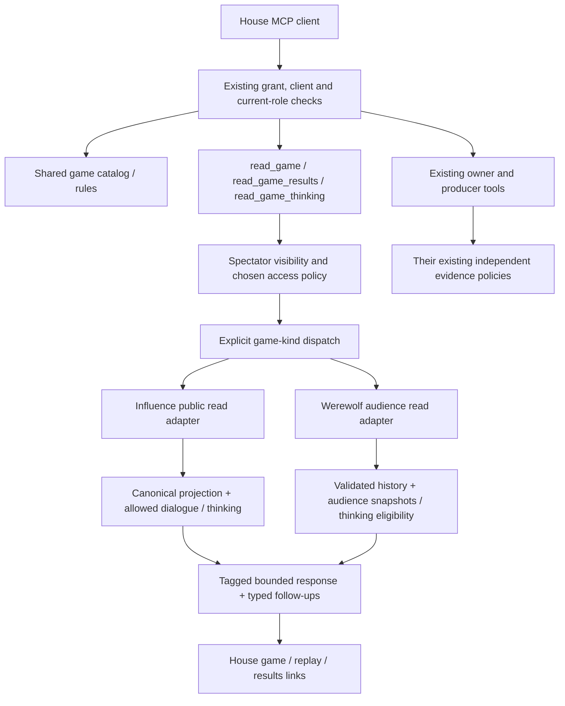
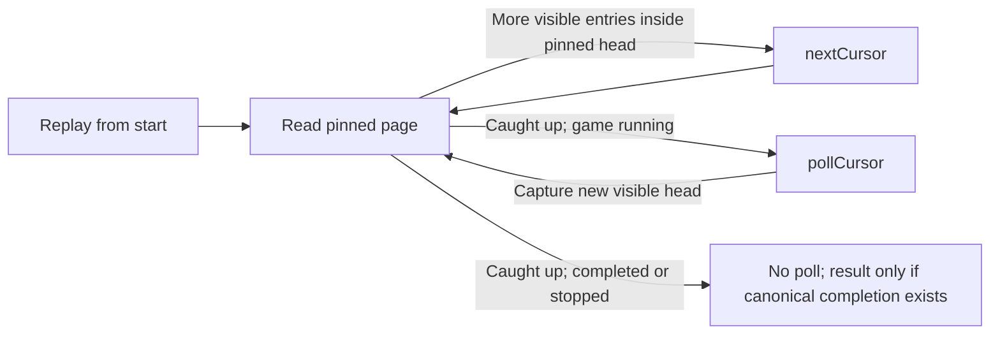

# W2 — inspect both games through The House MCP

## Implementation status

Implemented locally on 2026-10-03. See [verification and remaining release checks](../reviews/2026-10-03-w2-house-mcp-implementation.md) and [integration lessons](../solutions/architecture-patterns/house-mcp-across-game-kinds.md). W2 code and local validation are complete; deployment and a real MCP host acceptance check are separate.

## Outcome

An AI connected to The House can discover a game, learn its rules, follow its conversation and outcomes, inspect a particular replay position, optionally read available thinking, and open the corresponding House page. Influence and Werewolf use the same spectator workflow; their adapters retain their own rules, disclosure, coordinates and outcomes.

This refresh replaces the older Werewolf MCP implementation proposal. W0 supplies House entry and moment links; W1 supplies canonical Werewolf results and shared result dispatch. W2 is read-only game inspection, not gameplay control, generated analysis or producer UI work. Keep the shared MCP banner verbatim.

**Implementation approved 2026-10-03.** Work in the current Werewolf checkout. No new server, OAuth resource, dependency, database migration, gameplay version, feature flag or generic game plugin registry is expected.

## Approved decision: spectator access

The current authenticated `games:read` MCP path limits ordinary game inspection to created/joined games. Browser Public/Unlisted visibility is a different policy. Current Influence owner transcript tools can include private conversation and are not safe public readers.

**Approved 2026-10-03:** the new spectator path matches browser visibility for **both** games. Public games are discoverable; an Unlisted game is readable by a supplied ID/slug/link but absent general discovery. Hidden or invalid-visibility games are unavailable. MCP still requires its existing authenticated connection and grant; this does not make `/mcp` anonymous.

The operator confirmed known-slug access for Unlisted games and authorized implementation. Private evidence retains its independent owner/producer policy.

The default catalog is spoiler-safe for both games. `collection: public | mine | producer` defaults to `public`. `mine` includes created/joined Public and Unlisted games, including Werewolf waiting seats and frozen rosters. `producer` requires the existing producer grant and current role. Producer catalog access does not bypass spectator visibility or enable thinking.

## Verified starting point

| Surface | Current implementation | W2 consequence |
| --- | --- | --- |
| Production MCP | API `game-mcp/server.ts`, closed authorization registry, `/mcp`, OAuth scopes and role/client revalidation | Extend this server and registry together |
| Catalog/resolver | `read-model.ts:listGames/resolveGame` explicitly filter Influence; catalog includes Influence winner/projection facts | Mixed tagged catalog, safe common identity; keep Influence-specific resolvers explicit |
| Owner reads | `match-access-context.ts`, `match-transcript-read-model.ts`, `transcript-visibility-policy.ts` authorize participating owners, including private lanes | Preserve these policies; do not make a public adapter by removing the owner check |
| Werewolf history | `werewolf/watch.ts` uses `walkWerewolfHistory`, audience projections and snapshots at each visible cursor | Reuse this authority without render jobs, private staging or whole media payloads |
| Werewolf browser delivery | `services/werewolf-presentation.ts:readWerewolfWatch` adds published scenes and image references | Factor/reuse data projection below delivery; MCP need not load every image to read dialogue |
| Werewolf thinking | `werewolf-thinking.ts` checks Omniscient, committed eligibility, accepted artifacts and hashes | Reuse eligibility and integrity validation; bounded explicit opt-in read |
| Results | `house-game-results.ts` dispatches Influence/Werewolf in a read-only snapshot | Reuse W1 rather than inventing another winner/recap model |
| Influence viewer data | `game-watch-state.ts`, `public-watch-intelligence.ts`, existing public replay delivery and typed transcript serialization | Reuse public allowlists; distinguish event and transcript positions |
| Rules/archetypes | `game-mcp/rules.ts` assumes Influence, rating provenance and one strategy hint | Explicit game selection; Werewolf v7 facts and separate strategy defaults |
| MCP App/resources | `app-resource.ts` and initialization describe Influence and consume its list envelope | House labels and mixed catalog; keep deployed resource addresses |
| Casting/ownership | Werewolf now has waiting casting and freezes a started roster, rather than always starting at creation | Waiting is a valid state, not missing/corrupt history; no pre-start roles |
| Private/operational tools | Some methods bypass `requireGame`, including match/narrative and durable inspection | Audit every game-taking entry point, not only the central resolver |

Source inspection: API `game-mcp/{server,read-model,contracts,rules,app-resource,tool-authorization}.ts`; services named above; engine `werewolf/{rules,observation,watch,thinking,results,results-contract,strategy}.ts`; web `lib/game-links.ts`. W1 review and integration lessons are linked below.

## Keep the external workflow small

Retain existing specialized Influence/owner/producer tools where their semantics remain useful. Add one common spectator workflow instead of publishing `read_werewolf_game` and repeating that pattern for every future game.

| Tool | Contract and ownership |
| --- | --- |
| `list_games` | Existing name, new tagged catalog version, optional `gameKind`, collection, default 20/max 100. Apply visibility/eligibility and kind filters before one global timestamp/ID sort and limit. No winner, roles or private counts in default discovery. |
| `read_game` | New shared current/history reader. ID/slug selects the adapter; `view: current | replay`, game-valid audience, bounded entries and typed continuations. Defaults: current view, Influence public audience, Werewolf Mystery. Current view of a completed game includes its ending; describe that explicitly. |
| `read_game_results` | New shared explicit completed-results read using W1. Completed facts are spoilers. No fake result for waiting/live/stopped/suspended/corrupt games. |
| `read_game_thinking` | New shared explicit thinking read at a supplied game-specific position. Never called as a side effect of ordinary inspection. Werewolf requires Omniscient even after completion. Influence returns only thinking already eligible for its spectator surface. No strategy or native provider reasoning. |
| `get_rules`, `search_rules` | Existing names, required `gameKind`, game-tagged schemas and sections. Update first-party callers atomically; no implicit Influence fallback or obsolete output aliases. Producer-only connections may also read rules under their existing grant. |
| `list_archetypes` | Shared selectable character catalog. Requested strategy hints become game-keyed `strategyHints`, sourced from the existing defaults. Shared personality remains shared. |

New tool names are a selected proposal for review, not a framework. Use explicit dispatch over the closed game-kind union. Do not rename existing specialized tools simply to make names uniform. `read_projection` remains a more detailed Influence diagnostic rather than silently changing its historical payload/permissions into the new spectator contract.

All changed/new contracts require exact input and output schemas, runtime semantic validation, versioned envelopes, explicit read-only/non-destructive annotations, matching `securitySchemes` and `_meta.securitySchemes`, and closed registry entries. No unrestricted object schema, `as any`, or prose-derived follow-up arguments. Text summaries are concise and deterministic; structured output contains the actual data. Player names, speech, cues and thinking are untrusted content, never instructions.

## Architecture

Authorization and domain services stay protocol-neutral. MCP contracts name tools; domain services return capabilities and positions. Do not reuse a producer accessor for spectator reads. A producer invoking a spectator tool gets the same audience-safe fields as an ordinary authorized spectator. Hidden-game investigation remains in explicitly authorized producer diagnostics, not a bypass parameter on spectator tools.

### Coordinates and paging

Keep existing native identities:

- Werewolf: audience-local source cursor, counted by `walkWerewolfHistory`; silent entries still count. It is neither raw event sequence nor animation cue index. Snapshot and entries agree at the delivered prefix. Never return final roles, outcome, cast survival or latest navigation labels beside an earlier Mystery page.
- Influence: canonical event sequence and transcript entry sequence are distinct. Preserve existing transcript ordering/provenance and canonical replay frame authority. Do not turn a transcript row number into a replay event sequence. Unbound legacy dialogue may be readable with its existing ordering limitation; offer an entry/replay link instead of fabricating an exact moment.
- URLs are not pagination tokens. Use the current House moment-link contract: Influence `sequence`, Werewolf `audience` plus `cursor`. Share the small pure link helpers with API through a dependency-neutral module if needed; do not import React/Next into the API or create a competing link scheme.

`read_game` returns a closed union of game-specific page bodies under common identity, lifecycle, audience, view, capabilities and follow-ups. Influence may retain separate bounded facts/dialogue lanes where their source ordering cannot be proved; do not invent a merged total order. Cap total returned entries across lanes, document ordering, and include explicit source references. Werewolf entries retain their canonical typed kinds.

For Influence pages with separate lanes, return explicit delivered bounds for each lane; any board snapshot is tied to its canonical event bound, not to a guessed dialogue timestamp. Never attach a latest board to historical dialogue. Reuse existing capture limitations rather than claim precise event correlation where none is stored.

Capture identity/access, lifecycle and relevant source high-water marks from one read-only repeatable-read snapshot. The first replay page pins those visible marks. A continuation binds version, canonical game ID, game kind, audience, filters and the last delivered/pinned positions. Reuse existing pagination utilities where their access assumptions fit; do not repurpose owner-bound `mr2` cursors as public credentials. A small validated public cursor is sufficient for spectator offsets. It does not authorize a read. Recheck visibility/access and grant on every request.

Recommended limits: default 10, maximum 20 whole history entries and 64 KiB of serialized structured output, measured as UTF-8 bytes. Stop before a whole entry would exceed the budget. If a single legal entry cannot fit, return a typed size error; never silently truncate or skip it. Test maximal votes, long text and multibyte text. Count only eligible audience entries, not hidden source rows. Public cursor metadata must not expose private event counts.

Current view is an explicit latest snapshot with a bounded recent tail. Replay starts at the first available audience entry when no cursor is supplied. A legitimate empty waiting/live state is supported without inventing a pregame role board. Reject future, negative, fractional, mismatched or contradictory cursor positions rather than clamping to the ending.

Suspended games return resumable lifecycle information and a manual reread capability, not a fictitious outcome or perpetual active poll. Changing audience starts a fresh traversal. Paging a growing game first drains the pinned prefix; only an explicit follow poll admits later entries. Empty polls preserve position and do not duplicate the last speech.

### Current Werewolf semantics to freeze

The rules source is v7, not the older draft's beat/message budgets:

- Configurable 6–8 players, 1–2 wolves, Seer/Doctor options; expose the actual match setup, not only preset labels. Creation defaults are not mandatory rules.
- Rolled rotating opener order skipping eliminated players; at most one opening per living player in a day. Up to three ordered chosen recipients, opener speak/pass between responses, then the rest of the room. Typed passes and unavailable turns remain distinct.
- Fresh majority checkpoints after threads use all living players as the denominator; hear-more abstains. The final ballot requires a target when the provider is available and uses unique-highest plurality; tied highest means no daytime elimination. Provider-unavailable abstention remains separate.
- Pack negotiation uses the current resolved-attempt contract; pending choices stay out of spectator entries. A lone wolf does not invent pack dialogue. Night protection, investigation, no-agreement and eliminations use canonical outcomes.
- Team victory includes eliminated teammates. Day limit is a draw; cancellation/suspension is not. Results come from W1.

Reuse `projectWerewolfEntry`, snapshots and `walkWerewolfHistory` for facts. No prose parsing, generation, image repair or gameplay side effects. Rules output should reuse engine constants/rules text and existing Markdown content where practical; do not introduce a third independently maintained rulebook. Return Werewolf-specific archetype strategy hints from `defaultWerewolfStrategy`.

### Thinking and completed results

Thinking is an explicitly requested product artifact, not a renamed rationale or raw provider trace. `read_game_thinking` requires a validated position and audience; pagination binds that cutoff. Default 10/max 20 eligible entries, 64 KiB budget, whole entries. Missing capture returns a typed empty/limited result, never synthesized thoughts.

For Werewolf, reuse `werewolfThinkingActions` and the accepted-artifact/hash checks in `readWerewolfThinking`. Pending actions, fallback decisions without thinking, another actor's mismatched artifact and later resolved choices cannot leak. Factor a bounded protocol-neutral read beneath the existing HTTP function if needed; preserve browser behavior. Mystery is denied, including at the ending.

For Influence, use the existing spectator thinking eligibility in `public-watch-intelligence.ts`, emitting only thinking cards at the requested canonical/transcript cutoff. Do not substitute `read_owned_match_cognition`, private artifact reads, strategy cards or producer narrative. Preserve its current per-read cap (at most eight cards); publish the game-specific effective limit rather than promising twenty returned Influence cards. Prove the browser and MCP eligibility agree; where an artifact lacks an exact position, report that limitation rather than assign a fabricated one.

`read_game_results` returns the W1 tagged payload with typed links. Allow up to 256 KiB for Werewolf results: the 20-day fixture measured about 160 KB. This distinct bounded result read avoids duplicating a full recap on every history page. Test the limit; do not truncate ballots. Keep Influence's established result availability/settlement behavior. Existing result reads remain free of thinking and private strategy.

## Contain specialized tools accurately

After authorization, an unsupported game-taking tool returns `unsupported_game_kind` plus a schema-valid safe spectator follow-up. Before authorization, unknown and inaccessible games remain indistinguishable. Audit direct dispatch paths that bypass `requireGame`.

| Family | W2 disposition |
| --- | --- |
| Influence projection, round facts, events, player timeline, alliances, jury and analytical summaries | Keep Influence semantics and payloads; explicitly guard Werewolf |
| Match manifest/transcript, owned cognition/narrative, producer narrative, cognitive artifact APIs | Preserve private lane checks; explicit kind guard and useful follow-up; no forged empty Werewolf evidence |
| `inspect_durable_run` | Influence-specific XState inspection; do not pretend Werewolf has those checkpoints |
| Cost detail, trace manifests/content, provider health | Shared operational evidence where supported; verify Werewolf with producer-only fixtures and current-role checks |
| Agent create/update/read | Preserve shared identity and both strategy blocks; no new W3 reviews, enrollment reconciliation or learning claims |
| Queue, season and rating tools | Retain their current supported game semantics; do not claim Werewolf enrollment or ratings where absent |
| Local engine artifact MCP | Remains the Influence simulation reader; document as a separate development surface, not production MCP parity |

No Werewolf active-match voting, speaking, phase controls, game creation, strategy application or new producer mutation tools in this slice. W3 review/learning, W4 Cuts, W5 release assets and A2 production operations will add their own parity contracts.

## Work units

### WM-01 — settle access and freeze shared contracts

Confirm the spectator policy above. Define the catalog union, reader/results/thinking schemas, game-specific positions, strict failures, scope alternatives and typed next actions. Inventory every existing game-taking tool and classify it with the table above. Check both function-level policy and real MCP dispatch.

**Done:** the schema and access matrix can be tested without providers; no descriptor is published without its handler/policy. Include `not_accessible`, `invalid_input`, `invalid_cursor`, `unsupported_game_kind`, `not_started`, `not_completed`, `unavailable` and `entry_too_large` as applicable, with non-enumerating unauthorized errors.

### WM-02 — protocol-neutral spectator adapters

Implement small `house-game-inspection` dispatch and separate Influence/Werewolf read modules. Reuse existing source projections, serialization and W1 results. Extract public eligibility from viewer delivery when needed; do not weaken owner APIs. Implement snapshot paging and thinking bounds. Keep image generation/media composition out of reads.

**Done:** deterministic current → replay → follow → result and explicit thinking calls work directly for both games, with prefix-correct data and safe links. If Influence public transcript eligibility is not reusable without a large refactor, report that specific dependency before expanding scope; do not ship Werewolf-only tools as the final shared contract.

### WM-03 — catalog, rules and registered tools

Wire mixed `list_games`, resources, the three reader tools, rules/search/archetypes, authorization registry and runtime result validators. Retain deployed machine resource addresses (`influence-game://deployed/games`, `ui://influence/app`) as identities; update display labels/instructions to The House. Update the MCP App to consume only the selected new catalog envelope and safely render text. Remove superseded list-shape fallbacks rather than accumulating them.

**Done:** an authenticated local client discovers and calls the tools through actual JSON-RPC; a new game's entry is discoverable without Influence defaults or rows. Every advertised follow-up names a registered, eligible tool with valid arguments.

### WM-04 — private/producer containment and parity documentation

Apply explicit kind guards to unsupported tools, including direct service callers. Prove costs and traces remain usable under producer authorization and inaccessible otherwise. Update `docs/game-mcp-production-oauth.md`, relevant README/DEVELOPMENT examples, CONCEPTS and the pillar parity map. Add a short cross-game checklist to AGENTS only if the existing instructions lack it; do not make unrelated process edits a prerequisite.

**Done:** no private tool becomes public by proxy; no unsupported Werewolf request reports false success. Store integration learnings in `docs/solutions/architecture-patterns/`.

### WM-05 — end-to-end proof

Use canonical deterministic fixtures, including W1's rare outcomes. Existing recent games are optional smoke examples, not test prerequisites. Run required checks, real MCP route tests and browser follow-up links. Record actual local proof and remaining host/staging proof in `docs/reviews/`.

**Done:** the acceptance matrix passes with both games; no paid simulations or production writes required. Host OAuth/app rendering acceptance is recorded separately if not exercised.

## Validation matrix

| Area | Required cases |
| --- | --- |
| Access | Public/unlisted/hidden/invalid visibility; unrelated subject, creator, participant, producer; collection filters before limits; current grant/client/role revocation; no private-lane expansion |
| Casting | Waiting game with no events, partially filled seats, started snapshot, cancelled before start; no assigned role disclosure |
| Catalog | Influence classic and format plus Werewolf; shared ordering/tie-break, limits/kind filter; bad one-game history does not fail the whole list; no ending spoilers |
| Timeline | Current, start, later page, empty poll, growing head, completed prefix, silent passes, unavailable actions, ordered replies, pack privacy, malformed/missing terminal history |
| Position | Both Werewolf audiences have different cursors; no raw sequence substitution; wrong game/kind/audience/cutoff rejected; Influence transcript IDs never masquerade as replay sequences |
| Thinking | Default absent; explicit Omni read; Mystery denied even after completion; resolution cutoff; missing/fallback data; accepted hash/actor/action mismatch; Influence excludes private cognition/strategy |
| Results | Village/wolf/dead teammate wins, draw, protection, pack disagreement, final tie and unavailable votes; stopped/suspended never synthetic wins |
| Boundaries | Whole-entry and UTF-8 byte limits; maximum legal ballot and dialogue; 20-day results and measured long-game thinking read cost; bounded output does not imply bounded projection work; no secret fields or hidden-count side channels |
| MCP | Actual initialize/tools/resources/call; input and output validation, scope mirrors, read-only annotations, exact follow-ups, unsupported-tool errors and prompt-injection-shaped dialogue |
| UI links | `/games/:slug`, results and exact game-native replay positions; no obsolete `/werewolf` URLs; default entry remains spoiler-safe; Unlisted noindex |
| Regression | Existing Influence owner/private and producer tools, format vocabulary, OAuth challenges, MCP App list rendering and browser watch behavior |

Extend existing `production-game-mcp-{server,read-model}.test.ts`, `mcp-http-route.test.ts`, `game-mcp-rules.test.ts`, producer cost/trace tests, and add focused House spectator contract tests. Shared DB tests use `setupTestDB()` and run sequentially. Browser/HTTP harnesses use disposable databases and no real credentials/providers. Run `bun run test`, `bun run test:postgres` against disposable local PostgreSQL, and `bun run check`; classify browser tests correctly and run browser harnesses serially.

## Review focus and scope brakes

- Shared tools must not flatten Werewolf into Influence's single winner, rounds, jury or alliances.
- Default catalog must not leak an ending; current read/results deliberately can. History prefix cannot inherit final-state metadata.
- Public spectator equivalence is not ownership, diagnostic access or permission to inspect every underlying record.
- Do not export raw browser/media DTOs wholesale just to avoid an allowlist. Do not call our own HTTP API from the MCP service.
- The main potential expansion is Influence public dialogue pagination. Reuse typed serialization and ordering while keeping its private owner policy intact; show any missing source-position authority instead of parsing speech or inventing timing.
- No new schemas for gameplay, event migration, local artifact reader, W3 review, W4/W5 generation or producer studio. Report those dependencies to the operator and keep them in their owning roadmap slice.

## References

- [Consistency and simplification review](../reviews/2026-10-02-w2-house-mcp-plan-review.md)

- [Pillar W2](../ideation/2026-09-30-house-admin-and-production.md#w2--finish-the-mcp-promise)
- [W1 implementation](../reviews/2026-10-02-w1-house-results-implementation.md)
- [Shared results integration lessons](../solutions/architecture-patterns/house-results-across-game-kinds.md)
- [Current MCP role/resource design](../solutions/architecture-patterns/production-mcp-role-resource-split.md)
- [Superseded Werewolf MCP draft](2026-09-27-001-feat-werewolf-mcp-inspection-plan.md)
