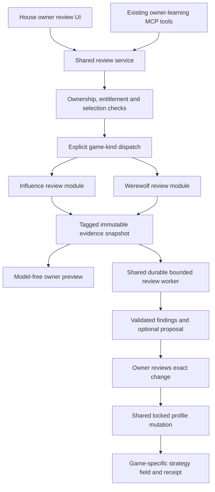

# W3 — review Werewolf play through The House

## Outcome and boundary

An owner can select completed Werewolf games, inspect a factual account of their agent's decisions, request a bounded strategic review, and deliberately apply a proposal to `werewolfStrategyStyle` through the existing House review experience. Influence continues through the same workflow with its own evidence and evaluation policy. A third game should require a game module, not a second review application.

Build factual correctness and the owner workflow first. Calibrate coaching with a small, deliberately varied set of games managed by the operator. Valid evidence references and schema-valid output prove neither good coaching nor improved win rate. Operator approval of the quality packet is required before adopting Werewolf coaching as the release default. This planning request does not authorize paid review calls or new paid simulations.

Source roadmap: [House integration pillars, W3](../ideation/2026-09-30-house-admin-and-production.md#w3--review-the-performance-then-improve-the-right-strategy). Dependencies: [W1 results](2026-10-02-004-feat-werewolf-house-results.md), [W2 inspection](2026-10-02-005-feat-house-mcp-game-inspection.md), and [owner-learning lifecycle](../solutions/architecture-patterns/owner-learning-loop.md).

Public completed-game recap remains W1. Editorial House Cuts remain W4. W3 is private owner learning, not producer image review, automated self-improvement, ranked Werewolf enrollment, continuous strategy memory, or a production-studio redesign.

## Verified baseline

| Existing surface | Reuse or change |
| --- | --- |
| `owner-learning-{review,worker,retry,resolution,provider}.ts` | Reuse one owner-wide unresolved review, durable jobs, validated checkpoints, recovery, cost receipts and diagnostics. |
| `owner-learning-eligibility.ts` | Influence admits completed free-track games with analytical revisions; one-to-three games from the current strategy family. Werewolf currently creates custom games. Do not implicitly widen Influence eligibility. |
| `owner-learning-evidence.ts` | Influence action ledger plus owner-authorized narrative/cognition, immutable source identity and candidate moments. Extract its game assumptions. |
| `owner-learning-harness.ts`, `owner-learning-provider-context.ts` | Reuse bounded scan/investigate/finalize execution and strict validation; move game instructions, context windows and evidence sufficiency into modules. |
| `owner-learning-apply.ts` | Currently checks Influence `currentRevisionId` and writes `strategyStyle`. Generalize the target and freshness check without a second mutation path. |
| `agent-revisions.ts` | Existing analytical snapshot uses Influence strategy and runtime policy. Preserve its rating and revision semantics. |
| `werewolf-games.ts:freezeWerewolfRoster` | Stores profile/content revision identity and frozen personality, backstory, archetype and resolved Werewolf strategy. Use these executed values, not today's edited profile. |
| `werewolfTurns`, accepted events and thinking artifacts | Planned requests and observation hashes provide actor-time integrity checks. Reconstruct only from canonical history using the corresponding rules implementation. |
| Dashboard review routes and `game-mcp/owner-learning.ts` | Extend existing owner surfaces and tools, not Werewolf-only alternatives. |
| `postgame-highlights.ts` | Independent consumer of canonical postgame analysis; review does not consume Cuts. No W4 dependency. |

Current limits are four logical model calls, three moment investigations and three recommendations. Keep these unless measured calibration identifies a concrete need. The current review model is `gpt-5.6-luna`; do not confuse this with gameplay's `gpt-6-luna`. Confirm the intended review model with the operator before paid calibration and record exact model/policy in every run. Model benchmarking is not a W3 prerequisite.

## Product decisions

### Common workflow; game-specific judgment

A death is not a Werewolf performance score. Evaluate the actor's faction objective, available information, legal choices and subsequent observed consequences separately. A villager can die and help the village win; a wolf can survive while weakening the pack. A final faction win does not prove every earlier decision was sound.

Keep Influence's existing early-exit classification in its module. Werewolf never selects an analysis track because of survival duration alone, and never inherits the health-check validator that rejects insufficient-evidence no-change rationales. Werewolf may honestly conclude that available evidence supports no recommendation. Model confidence is a qualitative assessment, not a calibrated probability.

### Eligibility and funding — proposed policy for operator review

- Factual preview is model-free and does not consume credit.
- Werewolf review selection admits one-to-three distinct completed, nonhidden Public or Unlisted games in which the owner has a frozen, profile-backed participant. House-fill characters, stopped/incomplete runs and unverifiable captures are ineligible. A known Unlisted game remains absent public discovery.
- All selected games belong to one profile, one game kind and the current game-specific strategy family. No mixed Influence/Werewolf review. Show previously analyzed games explicitly.
- Permit Werewolf custom games explicitly; do not relabel them Daily Free or create competition/rating receipts.
- Proposed ordinary-owner funding: a qualifying Werewolf completion can replenish the existing owner-wide credit under the same one-credit cap and rolling purchase policy. Spending covers either game. Preserve completion watermarks and transactional admission; do not introduce per-game credits or silently grant them during factual reads.
- Initial paid calibration uses the existing persisted sysop entitlement, with the operator owning the reviewed test profiles. Operator/producer roles do not grant access to other owners' private learning evidence.
- The funding extension is a proposed product decision, not approval inferred from this plan. Confirm it before changing entitlement behavior. Factual integration and deterministic workflow tests can proceed independently.

### Owner experience

Use the existing dashboard review destination and completed-results entry. Select the game within that workflow; hide irrelevant games from the selection, and retain the selected kind through refresh, resume and MCP handoff. No second top navigation or separate Werewolf review app.

The evidence preview shows the cast member, role/faction, actual faction result, important decisions, conversation context and missing evidence. Completed review is an explicit spoiler destination; do not fetch it automatically inside a Mystery replay. Existing Mystery/Omniscient viewer rules stay unchanged.

Show findings as observation, interpretation and optional guidance with source links. Use plain terms such as “What happened,” “What they knew,” and “What to try.” No survival-based grade or invented numeric performance score. The proposal clearly identifies Werewolf strategy, presents the exact before/after change, and offers apply, edit yourself, or keep current strategy. Preserve existing failure/retry/close behavior and cost visibility.

## Architecture

Use a closed, typed dispatch over known game kinds. Extract only capabilities exercised by the two implementations: selection/strategy identity, evidence projection, moment context, evaluation/sufficiency policy and proposal target. These may be ordinary functions in game modules; do not add a runtime plugin registry, generic query language or universal game-event schema.

The shared envelope owns review ID, owner/profile identity, game kind, source games, lifecycle, policy versions, strategy fingerprint, costs and result status. Evidence bodies and coordinates remain tagged game-specific types. The worker does not branch on Seer, Council, power actions or thread mechanics.

Review and Cuts may later share source-span retrieval. Their candidate ranking, permissions, publication and interpretation remain independent. Neither a Cut caption nor a review diagnosis becomes canonical game evidence.

## Evidence and knowledge contract

1. **Facts:** reuse Werewolf canonical results/history for accepted speech, votes, vote resolutions, role actions, deaths, faction outcomes and draw reasons. Distinguish deliberate abstention/hear-more from provider-unavailable ballots. Discussion ballots and final ballots retain the rules of their recorded version; do not impose a majority rule on the final plurality ballot.
2. **Actor-time knowledge:** for each reviewed decision, identify the exact pre-decision state and observation. Reuse `observeWerewolf` and stored planned-turn hashes where supported. Validate hashes and source identity; unsupported rules or a mismatch are explicit unavailable evidence, never an approximate observation passed off as exact.
3. **Separate future truth:** subsequent events and final roles can explain observed consequences, but never appear in a claim about what the actor knew earlier. Feed investigation context in separate known-at-decision and later-outcome fields. Every judgment references a decision coordinate and its knowledge boundary.
4. **Private context:** only the reviewed agent's legitimately available private lane enters coaching context: its own captured thinking, received Seer results and pack exchanges it could observe. No opponent thinking, another owned agent's thinking, or unrelated private night choices. W2 Omniscient spectator access is not an owner-coaching permission shortcut.
5. **Recorded thinking:** accepted, integrity-validated thinking is evidence of stated reasoning, not a guaranteed explanation of causality. Missing thinking stays missing; native provider reasoning is not newly exposed. Frozen starting strategy is available; do not invent evolving strategy updates.
6. **Conversation windows:** use canonical thread IDs, ordered replies and pack discussion boundaries. Preserve enough surrounding turns to understand a claim and response. Bound context explicitly and report omissions. Do not blindly inherit Influence's adjacent-narrative-record window.
7. **Sufficiency:** inspect coverage of decisions, legal context, strategy and available dialogue. A sparse run may support a factual review or prompt contradiction finding but no strategic recommendation. Allow no change/gather more evidence without a minimum lifetime or forced defect.
8. **Untrusted prose:** dialogue and thinking may inform interpretation, but cannot supply authoritative identities, targets, votes or outcomes by parsing. Validate all returned evidence references against the specific request's issued handles. Check exact quotations against source text if quotations are supported.

The source snapshot binds selected games, rules/capture versions, policy versions, source hashes and the reviewed strategy. Preflight and purchased admission must agree under the existing locked transaction. Retain current drift/recovery behavior: never combine a checkpoint with changed evidence, and never silently rerun a paid successful call.

## Strategy identity, persistence and apply

Keep review identity separate from Influence rating identity. For Werewolf, derive a versioned review-input fingerprint from the frozen effective fields actually supplied to the agent: shared behavioral identity, archetype and resolved Werewolf strategy. Record model/rules/runtime configuration as evidence context; identify variations across selected games rather than pretending they used the same runtime. Keep art URLs and presentation-only edits out of strategy-family identity.

Record both the editable Werewolf override (including null/default state) and the resolved strategy used in the match. Applying a proposal to a default strategy creates an explicit Werewolf override; the UI must not claim the default text was already stored in the editable field.

At apply, lock and reread the profile and review. Validate game kind, server-owned target field, exact proposal fingerprint, expected prior field value and current relevant-input fingerprint. Use the existing moderated profile mutation service and receipts; do not bypass pending moderation or make a proposal live merely by changing the displayed review status. Detect relevant pending-draft conflicts. Preserve idempotency and application uniqueness.

A Werewolf strategy or shared behavioral identity change invalidates a stale Werewolf proposal. An Influence-only strategy or image-only change should not invalidate it. Conversely, changing Werewolf strategy must not reset Influence rating/strategy identity. Audit existing automatic supersession hooks, retry checks and `sourceReviewId` manual-editor handling against this matrix; final apply protection alone is insufficient.

Werewolf apply cannot modify `strategyStyle`, artwork, shared identity or a running game's frozen cast. Waiting casting updates follow existing mutation behavior. Review-linked manual edits resolve the same review through the same transaction policy. MCP requires presenting the exact change and fresh affirmative user approval before apply or a review-linked custom update.

Extend persisted review/evidence/application contracts with explicit game kind, tagged evidence, strategy target and review-input identity. Inspect actual schema and migration tip before choosing the smallest change. Preserve immutable purchased reviews and accounting history; do not fabricate Werewolf facts for existing Influence rows or add parallel Werewolf review tables. Any required discriminator normalization must be explicit and tested; no silent read-time Influence default or compatibility parser.

## Delivery slices

| Slice | Deliverable | Exit evidence |
| --- | --- | --- |
| WR-01: extract the boundary | Existing Influence workflow uses its review module; common contracts gain explicit kind/target identity. | Influence selection, evidence, recovery and apply regressions pass; no changed coaching or credits. |
| WR-02: factual Werewolf review | Owned selection, frozen strategy identity, canonical facts, actor-time context, source links and evidence preview. | Synthetic role/outcome fixtures and existing real captures render without provider calls. Missing evidence is explicit. |
| WR-03: shared analysis and deliberate apply | Werewolf instructions and context into the existing worker; shared web/MCP lifecycle, receipts, moderation-aware apply and manual update. | Deterministic model stubs exercise complete review-to-apply, retries, no-change and concurrency. Entitlement change waits for the explicit policy decision. |
| WR-04: operator calibration | Approved paid runs on a frozen varied packet, reviewed findings and concrete prompt/policy corrections. | Operator approves quality/cost evidence or records remaining deficiencies. No claim of improved win rate. |
| WR-05: release proof and learning | Full checks, browser/MCP journey, implementation record and reusable new-game integration notes. | Document exact local/provider/browser/deployment proof and remaining release decisions. |

Each slice keeps the existing Influence workflow usable. Do not ship an exposed unfinished Werewolf coaching button between slices. Deployment is the release gate; no new feature flag or disabled-but-visible control is needed.

## Operator-managed calibration

Start with existing completed games. Operator chooses the paid budget, exact model and games before execution. Obtain separate authorization for any new paid simulations. Synthetic fixtures prove machinery and knowledge boundaries; they are not evidence of coaching quality.

Seek coverage across wolf, villager, Seer and Doctor perspectives, winning and losing factions, a useful sacrifice/early death, a misleading but reasonable read, a protection outcome, sparse thinking, and a genuine provider-unavailable decision. A small set may cover several cases; missing real examples are recorded instead of blocking deterministic engineering or manufacturing confidence.

Freeze each calibration packet: game/source hashes, reviewed profile inputs, role/observation boundaries, expected factual anchors, model/provider settings, prompt/schema versions and estimated budget. Save each output and cost receipt. Compare:

- factual/quote fidelity and usable source links;
- absence of hindsight and private-information leakage;
- whether interpretation is distinguished from fact;
- whether proposed guidance addresses an identifiable problem without harming other role instructions;
- willingness to keep guidance or request more evidence;
- context coverage, repetitive advice, latency and actual cost.

The operator reviews accepted and rejected recommendations, not just attractive examples. Revise instructions against observed errors, then rerun selected cases with recorded versions and costs. This is iterative qualitative calibration, not an optimization loop and not automatic strategy application. Approval of calibration does not approve applying each future owner's proposal.

## Verification

Provider-free tests cover faction success independent of survival; role-specific actor observations; earlier decisions unaffected by future private discoveries; legal abstention versus unavailable ballots; draws; missing thinking; thread context; source-handle validation; and malformed model output (non-JSON, fenced/embedded JSON, empty object, missing/extra fields and exhausted retries). No invalid output mutates a profile or masquerades as accepted analysis.

PostgreSQL tests cover owned/unowned and House-fill selection, game-kind mixing, custom eligibility versus Influence free-track policy, credit admission races, owner-wide singleton across games, snapshot drift, worker recovery/cost idempotency, exact and repeated apply, concurrent edits, null/default strategy, pending moderation, manual-update linkage and the cross-game invalidation matrix. Use `setupTestDB()` and sequential shared-DB tests. Test any schema change on a fresh isolated DB and representative populated review records.

Browser tests prove the same review shell for both games, model-free preview, sensible missing/thin evidence, progress without content flashes, ready/no-change/failure/retry states, clear Werewolf-only before/after, correct replay links and mobile usability. Stub providers and use isolated harness databases. Confirm opening review is an explicit completed-game spoiler action, not a side effect of Mystery playback.

MCP tests exercise preflight/start/read/resume/retry/apply/resolve with the shared tools, exact game-tagged schemas, owner-only evidence and consistent web handoff. Producer access alone and ordinary known-slug spectator access must not reveal private reviews. Wrong owner/target/stale fingerprint fail without mutation. A real host readback and an explicitly approved exact test-profile update are separate acceptance evidence from server tests.

Required implementation checks: `bun run test`, `bun run test:postgres`, `bun run check`, and scoped browser suites. Paid/provider suites stay opt-in. Run docs/link/diff checks for this planning change; no provider or game run is required to author the plan.

## Completion and remaining decisions

W3 is complete when both games use one owner review workflow, Werewolf reviews are grounded in actor-time facts, a deliberate proposal updates only Werewolf strategy, web/MCP behavior agrees, regression checks pass, and the operator has reviewed calibration evidence. Record funding/model approval and any unavailable real-game cases explicitly; infrastructure completion is not coaching approval or deployment proof.

Before implementation changes entitlement, confirm the proposed shared-credit admission for Werewolf custom games. Before paid calibration, confirm model and budget. All other scope above is implementable without inventing a ranked Werewolf system or waiting for W4.

Export implementation lessons to `docs/solutions/architecture-patterns/`, update the owner-learning lifecycle documentation and this roadmap, and extend the new-game checklist with evidence/knowledge, strategy identity, entitlement, moderation and calibration requirements. Do not write personal memory files as part of this work.
