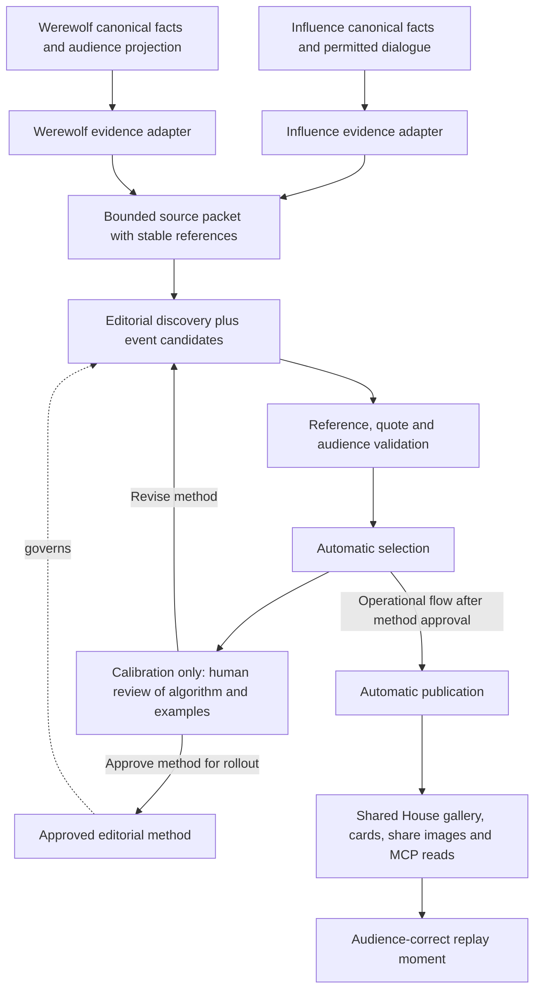

# W4 — Shared House Cuts and editorial discovery

## Outcome and sequence

Make interesting moments from Influence and Werewolf shareable through the same House gallery, cards and replay links. Find stories in conversation as well as game actions. A funny exchange, an unanswered challenge or a claim whose meaning changes later can stand alone; an elimination is not required.

W3 engineering is complete. The operator reports reviews now work, with no-change outcomes observed, and chooses to move on. Broader coaching calibration remains pending; it does not block W4. This plan alone did not authorize paid generation or publication. The operator subsequently approved implementation and automatic generation on 2026-10-04; the explicit limits are recorded below.

Deliver W4 in two increments:

1. **Editorial prototype and human review packet.** Build the source adapters, bounded discovery, validators and sample cards. Compare with today's selection. Keep existing public Cuts working while the proposed replacement is assessed.
2. **House integration after editorial approval.** Automatically generate, select and publish Cuts through the existing House experience for both games, including the shared gallery, share images and MCP reads. Match Influence operational parity; do not add a per-Cut approval or candidate-management interface. Replace the superseded selector; do not retain parallel legacy selection policies as compatibility paths.

Do not make the first increment wait for the production-studio redesign, trailer/music work or Werewolf art exploration.

## Current implementation and actual gaps

| Current seam | What exists | W4 change |
|---|---|---|
| `packages/engine/src/postgame-highlights/build.ts` | Rejects games without named-alliance receipts; main cut needs at least three consequence-bearing scenes; mini pack needs two | Remove alliance eligibility and minimum-story quotas from shared editorial policy; zero or one excellent moment is valid |
| `postgame-highlights/candidates.ts`, `selection.ts` | Deterministic Influence alliance/vote/jury candidates, category priorities and mandatory setup/conflict/payoff | Keep useful event candidates inside Influence's source module; add dialogue discovery across both games; make story structure flexible |
| `postgame-highlights/types.ts`, `visual-briefs.ts` | Influence-heavy scene and visual-slot unions | Shared identity, source spans, quotations, editorial copy and presentation contract; game-specific facts remain in game modules |
| `packages/api/src/services/postgame-highlights.ts` | Builds public projection from Influence postgame analysis; redacts diagnostics | Dispatch to game evidence adapters; serve explicit published editorial versions after integration |
| House highlights page, card component and card-image route | Gallery, static card composition and social metadata already exist; metadata explicitly excludes Werewolf | Reuse components and canonical House routes; remove Influence-only route assumptions when backend supports both |
| Postgame media coordinator/worker | Durable trailer snapshot/render/publication machinery | Reuse applicable storage/job patterns, not the trailer manifest as an editorial job schema; trailers remain W5 |
| Shared game links and player | Share-this-moment links already exist for both games | Resolve canonical evidence through these helpers; never use a transient cue-array index |

**Operator scope correction (2026-10-04):** existing Influence Cuts are derived from postgame analysis, without a required per-Cut approval workflow. The human gate applies to the editorial algorithm and analysis before adoption. Once approved, the integrated flow automatically generates, selects and publishes Cuts. Candidate browsing, swapping, rejection, editing and new regeneration controls are future A2 studio possibilities, not W4 requirements. Preserve existing operational controls and stable shared artifacts without introducing a manual publication queue.

## Architecture



Use direct game-kind dispatch and small modules, following W0–W3. Do not introduce a plugin registry or reuse private owner-learning evidence as the public editorial source. A third game should supply its canonical facts, permitted dialogue and replay reference resolver without changing selection, publication or card infrastructure.

## Editorial prototype

### Source material and coverage

Use completed games first. Each immutable source packet records game identity/kind, source version/hash, cast-at-game identity, audience, canonical facts and attributed dialogue with stable references. Preserve thread/round/day boundaries and surrounding exchanges. Current editable profile text must not rewrite the cast's historical identity.

Discover across the whole game. Split long input along canonical conversation boundaries, record coverage and enforce a call/token ceiling before starting. Do not silently truncate to the last windows or call a partially scanned game fully reviewed. A second selection pass can connect separated moments using their references and fetch bounded original context. It must not treat another model's summary as a factual source.

Proposed model: `openai:gpt-6-luna`, using existing structured-provider execution and cost reporting. Confirm the sample games and a total budget before live experiments. Use deterministic fixtures first. Do not build an open-ended investigative agent or force the W3 four-call budget onto this different task.

### Candidate contract

Strict native structured output, validated inside the provider-attempt boundary:

- Candidate ID, source span references, ordered participant IDs and optional related spans for later payoff.
- Exact quote references and selected excerpts; hydrate identities and source text from the record, not model-authored names or reconstructed quotations.
- Short title, context and editorial angle. A payoff is optional. Interpretation must be identifiable as interpretation; intent is not a canonical fact.
- Canonical fact references for any outcome, vote, role or action claims; no free-form field becomes game authority.
- Audience/spoiler requirements derived from the referenced sources, checked against the requested packet policy rather than trusted from the model.
- Selection/rejection rationale for producers; no mandatory category quota, thesis or dramatic consequence.

Validate source membership, participant identity, quote fidelity, reference bounds and audience eligibility mechanically. Semantic claims about causation, deception or intent still need editorial review: attaching a valid reference does not prove a caption is faithful. Preserve contradictory context rather than cutting it away to manufacture drama. Empty or thin results are acceptable.

Start with at most five selected moments per sample, allowing zero or one. This is a proposed prototype limit to evaluate, not a trailer-driven requirement. Compare duplication and coverage with human preference before adopting ranking weights.

### Audience and sharing

Prototype both public-dialogue and full-spoiler material. For Werewolf, Mystery material is restricted to the allowed public record through the selected moment; it must not import end-of-game roles or future outcome knowledge. Omniscient material may include resolved permitted pack/night information. Exclude raw provider reasoning and owner-review data from both lanes in this slice.

Mystery/Omniscient is a spoiler policy, not authorization. Public and Unlisted games use existing House visibility rules; Unlisted material is accessible by known link but excluded from catalog discovery. Hidden games remain guarded across page, API, image and media routes.

Bind audience, source version and editorial version to an artifact. Shared image URLs and caches must not collide across audiences/versions. A Mystery link must never emit an Omniscient title, caption, role-specific image, alt text or social preview. Omniscient shares identify their spoiler scope. Reuse canonical replay links and the correct audience-local location; do not invent new cursor formats.

## Human gate and sample cards

Prepare a local review packet containing:

- Exact proposed method, model, prompts, schemas, versions and coverage limits.
- Selected and rejected candidates with original context, factual references and reasons.
- Comparison with existing Influence selections, including a conversation-only moment the old rules miss.
- Finished sample cards, share-preview crop and replay destination for both games.
- Actual cost/call counts, skipped coverage, repetition and known blind spots.

Aim for a small varied set: a dialogue-rich Influence game, a Werewolf bluff or disputed claim, and a thin/short game where an empty selection could be right. Use available records; absent examples remain acceptance gaps. Fixtures prove behavior, not editorial quality.

Cards lead with people, dialogue and the interesting action. Keep receipt/debug terminology outside the card. Preserve the existing visual-brief boundary: deterministic identity/fact composition, optional atmospheric background. Add a conversation layout alongside reusable action layouts; do not force a quiet exchange into a vote diagram. No new generated artwork is necessary for the first packet.

Record the operator's explicit approval of the identified approach/version and examples before making it the production default. Material prompt/selection changes return through this gate. This gate is not a recurring approval step for individual generated Cuts. Do not ship a disabled public feature flag as a substitute for the gate; use local prototypes and deployment sequencing.

## Integration tasks after approval

1. Freeze the reviewed editorial contract, including automatic selection. Connect completed-game processing to bounded generation, validation, selection and automatic publication. Reuse the existing postgame lifecycle and provider journal/cost/retry patterns; add only persistence required by the paid editorial work and stable share output. Do not build a candidate-management product or another job center.
2. Never generate as a paid side effect of GET/results/replay load. Retries retain valid work and record new attempts; a failed replacement leaves published material intact. Reuse existing operational progress, failure and retry surfaces where applicable; no manual per-game approval or new producer action is required for normal completion.
3. Adapt the shared House gallery/card/image/metadata routes and completed-game actions for both games. Keep audience/source/editorial versions distinct, preserve shared artifacts across regeneration and respect hide/access rules. Audit Influence trailer input so W4 cannot silently change an already queued render. W5 owns Werewolf trailers and music.
4. Add shared read-only MCP discovery/read access to published Cuts with source references and valid replay destinations. Keep internal candidate diagnostics out of public reads. No new candidate editing, swapping or approval tools are required in W4.
5. Remove obsolete selector contracts when the approved replacement is integrated. Document the new shared/game-specific seams and operational repair path in `docs/solutions/` and `CONCEPTS.md`.

## Validation and completion

- Engine/contract tests: dialogue-only and single-moment acceptance, empty results, multi-span context, duplicate stories, invalid IDs/quotes, malformed output, bounded coverage and source stability.
- API/Postgres tests: job admission, retry/lease recovery, duplicate generation, automatic publication races, source mismatch, cost receipts and previous publication retained on failure. Use `setupTestDB()` and isolated browser databases.
- Access tests: Public/Unlisted discovery versus direct reads, hidden games, unpublished candidates, crossed audience references and image/metadata cache isolation.
- Browser proof: desktop/mobile readable cards, selected-card share landing, actual replay-moment roundtrip for both games, no paid calls on read, producer failure/retry feedback. Test social image output independently of page HTML.
- Required implementation checks: `bun run test`, `bun run test:postgres`, `bun run check`. No paid/external tests in baseline suites.
- Editorial acceptance: human approval packet, including honest thin/empty output and source-context fidelity. Automated validation cannot substitute for this.

The automatic publication increment is now implemented; see the final checkpoint below. Broader editorial calibration, particularly Influence private-room coverage, remains separate from the working publication path. A2 production redesign, W5 trailers/music, W9 art exploration and further W3 coaching calibration remain separate.


## Historical implementation checkpoint — initial prototype, 2026-10-04

The provider-free first slice exists in `packages/engine/src/house-cuts/` with a runnable local review packet:

```sh
bun scripts/preview-house-cuts.ts
```

Outputs are ignored local artifacts under `.renders/house-cuts-prototype/`: `index.html` and `review.json`. All sample dialogue/candidates are explicitly synthetic. No live provider executor, database loader, public route, published artifact or paid job is added by this slice. The existing production selector stays unchanged pending the editorial gate.

Implemented: canonical-source adapters, audience-bound snapshot hashes, whole-conversation budget preflight, strict output schema and semantic acceptance callback, explicit producer ordering/duplicate rejection, responsive review cards, original context, rejected candidates, thin-result sample and actual old-selector comparison for the Influence fixture.

Remaining prototype work before the algorithm review gate:

- Read authorized completed-game source data and wire the existing provider attempt/journal/cost path after sample/budget approval. The current injected executor is fixture-only at the CLI boundary.
- Expand Influence beyond public speech plus resolved elimination/winner facts. Mingle/huddle evidence must reuse the viewer/authorization policy, not merely accept raw transcript scope. Missing exact dialogue replay correlation remains explicit.
- Evaluate call granularity: the first slice deliberately uses one complete conversation/outcome group per invocation and refuses oversized or over-budget input before any call. It does not yet merge groups or perform cross-window discovery/selection. Fixture invocation counts are not paid usage estimates.
- Evaluate semantic context, diversity and ranking with real samples. Current selection order is producer-supplied, not an asserted calibrated model ranker. The sample packet demonstrates contracts/layout, not editorial quality.
- Finish real share-preview export and actual replay roundtrips with real records. Fixture URLs are displayed as targets, never presented as working destinations. Public image caching and publication validation belong to the second increment.

Approval of this plan is not approval of the untested editorial method or its operational rollout.

### Real-game continuation

The next slice adds the read-only database loader and a runnable paid trial:

```sh
bun packages/api/src/scripts/preview-house-cuts.ts --game hazy-ruby-sand --audience mystery
# Explicit opt-in; use credentials from the normal environment:
bun packages/api/src/scripts/preview-house-cuts.ts --game hazy-ruby-sand --audience mystery --run --budget-usd 1
```

Artifacts live at `.renders/house-cuts/hazy-ruby-sand/mystery/`: the permitted source, durable local attempt journal, candidate JSON and HTML review with actual replay links. The shared provider executor applies native schema and semantic validation inside acceptance. Resuming accepted windows incurs no new model call. Unknown dispatched outcomes stop for inspection. Local attempts do not appear in the production job center or game-cost API.

The operator approved up to $2 total on `hazy-ruby-sand`. Audience-specific approval and trial outcomes are recorded in the review findings. Real proposals remain drafts in source order, with no automated selection or publication claim. Whole-group discovery currently costs one logical invocation per group; broader cross-window interpretation/ranking, Influence private-room coverage, social export and public-gallery integration remain pending. At that checkpoint the game page did not yet have a Cuts entry. The automatic-publication checkpoint below supersedes that status.

### Night-story iteration (operator review)

- Drop any perceived three-card minimum. Two strong cards are preferable to a weak third; the existing zero-to-five selection range remains.
- Discover noteworthy canonical events alongside dialogue. Doctor saves are explicit Omniscient evidence seeds, not deductions from an empty death count.
- Group night choices/outcome with the first morning thread, retaining audience-local replay coordinates. Admit anonymous fact-led Cuts with canonical fact references.
- Rerun `hazy-ruby-sand` using editorial v2 under the original $2 aggregate ceiling. The operator explicitly authorized sending pack dialogue and resolved night choices to OpenAI; thinking/raw reasoning remain excluded. This is local editorial calibration, not publication approval.


## Automatic publication checkpoint — 2026-10-04

The operator confirmed automatic generation/selection/publication at Influence operational parity and requested implementation. They explicitly authorized sending completed-game permitted evidence to OpenAI `gpt-6-luna`, including Werewolf pack dialogue and resolved night choices, with **$1 maximum per audience / $2 per Werewolf game**. Thinking, raw reasoning and owner strategy remain excluded. This is the approved normal completion behavior; no approval queue or candidate-editing product was added.

- Both completion transactions enqueue idempotent `house_cut_jobs`. Influence queues Public; Werewolf queues Mystery and Omniscient. Startup does not backfill historical games.
- The game-worker runs one fenced editorial job at a time. It snapshots permitted evidence, persists reservations/attempts before dispatch, resumes accepted calls, then runs a strict zero-to-five final selection against the complete permitted packet. Unknown dispatched outcomes stop for inspection rather than spending again. Conservative reservations and known usage share the same $1 ceiling, including final selection/retries.
- Selection reads cross-window context, rejects unknown/duplicate/overlapping candidate keys and has no minimum card count. Publication revalidates proposals against canonical source windows, hydrates speaker names, and omits private candidates, rationale and attempt records.
- Shared read-only `/api/games/:id/cuts`, `/games/:slug/highlights`, card URLs/images/metadata and MCP `read_game_cuts` serve the persisted publication. MCP `read_game` advertises an audience-preserving Cuts follow-up. Public and directly linked Unlisted games are anonymously readable on the web; MCP retains its existing grant. Hidden and crossed audiences return unavailable. Reads never generate.
- Older games without a job show “not prepared”; queued/running, failed and successfully empty selections are distinct. Existing published material survives a failed retry. No regeneration UI was introduced.
- Removed the superseded gallery implementation. **Trailer boundary:** Influence’s existing trailer compiler and queued media snapshots still consume their V1 Highlights projection. That is retained trailer input, not a parallel selector for the new gallery. Migrating future trailers to published editorial Cuts belongs in W5 and must preserve already-queued snapshots.
- Episode title/description generation was not added to W4. That remains release packaging work in W5 unless separately approved.

### Real local acceptance

`hazy-ruby-sand` now has persisted publications on its real House route. The automatic Omniscient selector reused the unchanged, validated v2 discovery packet and independently selected the doctor-save Cut and the already approved Seer-claim Cut. Selection estimated cost: **$0.0009384**. Mystery's older source grouping no longer matched, so it was not imported; a fresh full worker run produced one selected Cut through 12 provider attempts for **$0.00306335**. This increment cost **$0.00400175**, below the per-audience limits; these are rate-card estimates, not invoices. Original trial files remain intact.

Local browser checks cover anonymous published cards, the individual share URL and narrow-screen layout. Source/quote integrity, access boundaries, serialization, retries, worker fencing, rollback and no-read-side-effects have deterministic coverage. Final command results live in the accompanying review record.

Remaining editorial calibration: broaden examples across both games; decide how to admit Influence private-room dialogue with explicit source/audience policy; improve visual art with W9. The current Influence adapter includes public dialogue and elimination/winner facts and deliberately does not disclose private Mingle/huddles. Oversized sources/selection context fail rather than publishing a partial read. Local job attempt/cost evidence is in `house_cut_jobs`; a unified A2 producer job center remains future work.
