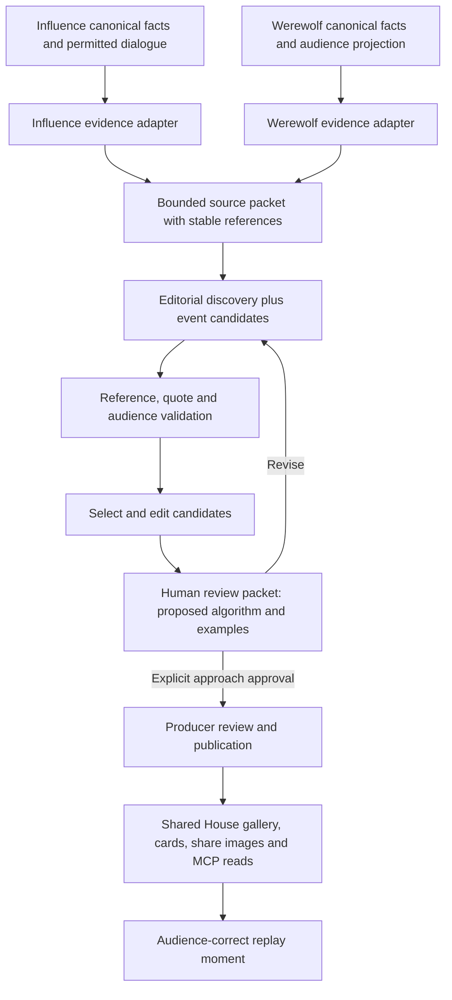

# W4 — Shared House Cuts and editorial discovery

## Outcome and sequence

Make interesting moments from Influence and Werewolf shareable through the same House gallery, cards and replay links. Find stories in conversation as well as game actions. A funny exchange, an unanswered challenge or a claim whose meaning changes later can stand alone; an elimination is not required.

W3 engineering is complete. The operator reports reviews now work, with no-change outcomes observed, and chooses to move on. Broader coaching calibration remains pending; it does not block W4. This plan authorizes neither paid generation nor publication by itself.

Deliver W4 in two increments:

1. **Editorial prototype and human review packet.** Build the source adapters, bounded discovery, validators and sample cards. Compare with today's selection. Keep existing public Cuts working while the proposed replacement is assessed.
2. **House integration after editorial approval.** Add durable candidate/edit/publication handling and route both games through the shared gallery, share images and MCP reads. Replace the superseded selector; do not retain parallel legacy selection policies as compatibility paths.

Do not make the first increment wait for the production-studio redesign, trailer/music work or Werewolf art exploration.

## Current implementation and actual gaps

| Current seam | What exists | W4 change |
|---|---|---|
| `packages/engine/src/postgame-highlights/build.ts` | Rejects games without named-alliance receipts; main cut needs at least three consequence-bearing scenes; mini pack needs two | Remove alliance eligibility and minimum-story quotas from shared editorial policy; zero or one excellent moment is valid |
| `postgame-highlights/candidates.ts`, `selection.ts` | Deterministic Influence alliance/vote/jury candidates, category priorities and mandatory setup/conflict/payoff | Keep useful event candidates inside Influence's source module; add dialogue discovery across both games; make story structure flexible |
| `postgame-highlights/types.ts`, `visual-briefs.ts` | Influence-heavy scene and visual-slot unions | Shared identity, source spans, quotations, editorial copy and presentation contract; game-specific facts remain in game modules |
| `packages/api/src/services/postgame-highlights.ts` | Builds public projection from Influence postgame analysis; redacts diagnostics | Dispatch to game evidence adapters; serve explicit published editorial versions after integration |
| House highlights page, card component and card-image route | Gallery, static card composition and social metadata already exist; metadata explicitly excludes Werewolf | Reuse components and canonical House routes; remove Influence-only route assumptions when backend supports both |
| Postgame media coordinator/worker | Durable trailer snapshot/render/publication machinery | Reuse applicable storage/job patterns, not the trailer manifest as an editorial job schema; trailers remain W5 |
| Shared game links and player | Share-this-moment links already exist for both games | Resolve canonical evidence through these helpers; never use a transient cue-array index |

The roadmap mentions individual Cut approval, but inspected Cuts are derived on read. Do not assume trailer publication supplies a persisted individual-Cut approval workflow. Audit remaining controls before implementing the smallest explicit candidate/edit/publish path.

## Architecture

Use direct game-kind dispatch and small modules, following W0–W3. Do not introduce a plugin registry or reuse private owner-learning evidence as the public editorial source. A third game should supply its canonical facts, permitted dialogue and replay reference resolver without changing selection, publication or card infrastructure.

## Editorial prototype

### Source material and coverage

Use completed games first. Each immutable source packet records game identity/kind, source version/hash, cast-at-game identity, audience, canonical facts and attributed dialogue with stable references. Preserve thread/round/day boundaries and surrounding exchanges. Current editable profile text must not rewrite the cast's historical identity.

Discover across the whole game. Split long input along canonical conversation boundaries, record coverage and enforce a call/token ceiling before starting. Do not silently truncate to the last windows or call a partially scanned game fully reviewed. A second selection pass can connect separated moments using their references and fetch bounded original context. It must not treat another model's summary as a factual source.

Proposed model: `openai:gpt-6-luna`, using existing structured-provider execution and cost reporting. Confirm the sample games and a total budget before live experiments. Use deterministic fixtures first. Do not build an open-ended investigative agent or force the W3 four-call budget onto this different task.

### Candidate contract

Strict native structured output, validated inside the provider-attempt boundary:

- Candidate ID, source span references, ordered participant IDs and optional related spans for later payoff.
- Exact quote references and selected excerpts; hydrate identities and source text from the record, not model-authored names or reconstructed quotations.
- Short title, context and editorial angle. A payoff is optional. Interpretation must be identifiable as interpretation; intent is not a canonical fact.
- Canonical fact references for any outcome, vote, role or action claims; no free-form field becomes game authority.
- Audience/spoiler requirements derived from the referenced sources, checked against the requested packet policy rather than trusted from the model.
- Selection/rejection rationale for producers; no mandatory category quota, thesis or dramatic consequence.

Validate source membership, participant identity, quote fidelity, reference bounds and audience eligibility mechanically. Semantic claims about causation, deception or intent still need editorial review: attaching a valid reference does not prove a caption is faithful. Preserve contradictory context rather than cutting it away to manufacture drama. Empty or thin results are acceptable.

Start with at most five selected moments per sample, allowing zero or one. This is a proposed prototype limit to evaluate, not a trailer-driven requirement. Compare duplication and coverage with human preference before adopting ranking weights.

### Audience and sharing

Prototype both public-dialogue and full-spoiler material. For Werewolf, Mystery material is restricted to the allowed public record through the selected moment; it must not import end-of-game roles or future outcome knowledge. Omniscient material may include resolved permitted pack/night information. Exclude raw provider reasoning and owner-review data from both lanes in this slice.

Mystery/Omniscient is a spoiler policy, not authorization. Public and Unlisted games use existing House visibility rules; Unlisted material is accessible by known link but excluded from catalog discovery. Hidden games remain guarded across page, API, image and media routes.

Bind audience, source version and edit version to an artifact. Shared image URLs and caches must not collide across audiences/versions. A Mystery link must never emit an Omniscient title, caption, role-specific image, alt text or social preview. Omniscient shares identify their spoiler scope. Reuse canonical replay links and the correct audience-local location; do not invent new cursor formats.

## Human gate and sample cards

Prepare a local review packet containing:

- Exact proposed method, model, prompts, schemas, versions and coverage limits.
- Selected and rejected candidates with original context, factual references and reasons.
- Comparison with existing Influence selections, including a conversation-only moment the old rules miss.
- Finished sample cards, share-preview crop and replay destination for both games.
- Actual cost/call counts, skipped coverage, repetition and known blind spots.

Aim for a small varied set: a dialogue-rich Influence game, a Werewolf bluff or disputed claim, and a thin/short game where an empty selection could be right. Use available records; absent examples remain acceptance gaps. Fixtures prove behavior, not editorial quality.

Cards lead with people, dialogue and the interesting action. Keep receipt/debug terminology outside the card. Preserve the existing visual-brief boundary: deterministic identity/fact composition, optional atmospheric background. Add a conversation layout alongside reusable action layouts; do not force a quiet exchange into a vote diagram. No new generated artwork is necessary for the first packet.

Record the operator's explicit approval of the identified approach/version and examples before making it the production default. Material prompt/selection changes return through this gate. This is separate from reviewing and publishing individual artifacts. Do not ship a disabled public feature flag as a substitute for the gate; use local prototypes and deployment sequencing.

## Integration tasks after approval

1. Freeze the reviewed editorial contract. Introduce only the persistence needed for source snapshot, job status/attempts/cost, candidate output, producer edits and publication reference. Reuse existing provider journal/lease/idempotency patterns after verifying their suitability; do not build another general job center.
2. Generate through an explicit producer action, never GET/results/replay load. Retries retain valid work and record new attempts; failed replacement leaves published material intact. Provide legible progress, failure and retry status in existing production/admin surfaces.
3. Add minimal candidate review, select/reject, edit and publish controls. Revalidate edits before publication. Freeze share artifacts so later regeneration does not silently rewrite a shared card. Respect existing hide/access rules even for previously published artifacts.
4. Adapt the shared House gallery/card/image/metadata routes and completed-game actions for both games. Update affected consumers together; audit Influence trailer input so W4 cannot silently change an already queued render. W5 owns Werewolf trailers and music.
5. Add shared read-only MCP discovery/read access to published Cuts with source references and valid replay destinations. Keep draft diagnostics producer-only. Any producer mutations exposed in W4 must follow the same permission, validation and idempotency rules as web actions; no implicit generation from reads.
6. Remove obsolete selector contracts when the approved replacement is integrated. Document the new shared/game-specific seams and operational repair path in `docs/solutions/` and `CONCEPTS.md`.

## Validation and completion

- Engine/contract tests: dialogue-only and single-moment acceptance, empty results, multi-span context, duplicate stories, invalid IDs/quotes, malformed output, bounded coverage and source stability.
- API/Postgres tests: job admission, retry/lease recovery, duplicate generation, edits/publication races, source mismatch, cost receipts and previous publication retained on failure. Use `setupTestDB()` and isolated browser databases.
- Access tests: Public/Unlisted discovery versus direct reads, hidden games, unpublished candidates, crossed audience references and image/metadata cache isolation.
- Browser proof: desktop/mobile readable cards, selected-card share landing, actual replay-moment roundtrip for both games, no paid calls on read, producer failure/retry feedback. Test social image output independently of page HTML.
- Required implementation checks: `bun run test`, `bun run test:postgres`, `bun run check`. No paid/external tests in baseline suites.
- Editorial acceptance: human approval packet, including honest thin/empty output and source-context fidelity. Automated validation cannot substitute for this.

Next concrete unit: implement the local evidence-to-candidate-to-sample-card prototype. Bring its review packet back before operational rollout. A2 production redesign, W5 trailers/music, W9 art exploration and further W3 coaching calibration remain separate.
