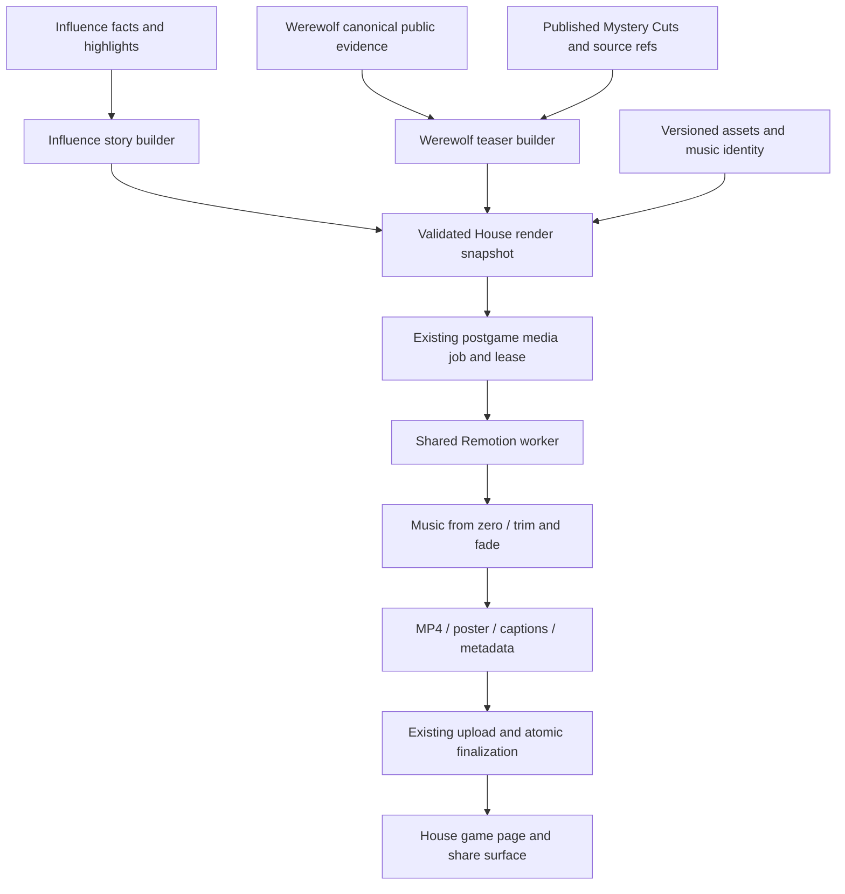

# W5 — Werewolf trailers and release assets

## Outcome

Render one real `hazy-ruby-sand` trailer with the selected Suno score, then integrate the approved approach into the existing House postgame media pipeline. A game opens and shares under `/games/[slug]`; Werewolf supplies its story and art direction to House components. Keep the first implementation small and complete.

This is the focused implementation plan requested after the music session. It authorizes no paid generation, external upload or production rollout by itself. Build the local sample and review packet before requesting the roadmap's approval of the finished trailer approach. Automatic generation after approval should have Influence operational parity, without a new per-trailer approval dashboard.

Related: [pillar W5](../ideation/2026-09-30-house-admin-and-production.md#w5--trailer-and-release-assets), [W4 Cuts](2026-10-04-001-feat-house-cuts-editorial-discovery.md), [music selections](../brainstorms/2026-10-04-werewolf-music-lantern-village.md), [art direction](../brainstorms/2026-10-04-werewolf-art-lantern-village.md), [pipeline learnings](../solutions/architecture-patterns/house-highlights-postgame-media-pipeline.md).

## Settled scope

- Use the full original Suno trailer track, start at zero, and trim to the picture's duration with the existing short ending fade. No fixed 45-second requirement, track rearrangement, new generation, or Werewolf duration-variant matrix.
- The exploratory `trailer-front-45s-v1.wav` is not an integration input. Its duration was an assistant choice, subsequently corrected by the operator.
- Reuse Remotion, the media bundle, worker leases, upload/finalization, repair, playback and sharing. Do not build a Werewolf render worker, queue or producer application.
- First Werewolf release is a spoiler-safe invitation to watch. No winner, actual wolf identities, night targets, protection choices or final cast-role table. Do not force Influence's jury/winner ending into Werewolf.
- Use existing artwork and portraits. The selected medieval village palette can style frames, typography, margins and poster; opaque fullbody art stays a full rectangle. New scene generation and wolf transformations are not prerequisites.
- Gameplay music is the next slice, not part of this trailer transport. Keep all four game themes as full sources for that work.
- No custom title-generation call in the first slice. Use an existing suitable public episode title if available; otherwise use the game name and “Werewolf at The House.” Use concise deterministic premise copy for the description. Automatic episode naming remains a separately scoped editorial follow-up.

## What exists, and what changes

| Seam | Current implementation | W5 change |
|---|---|---|
| `packages/engine/src/postgame-media/house-highlights-trailer-manifest.ts` | Requires final vote, jury finalists, one winner and ranked results | Shared render envelope with typed game-specific story payload; Werewolf teaser requires none of those Influence facts |
| `packages/api/src/services/postgame-media-coordinator.ts` | Batch reconciliation selects Influence; snapshot reads old highlights/results; fixed `golden-verdict-max` music ID | Dispatch by canonical `gameKind`; snapshot Werewolf permitted evidence, approved story policy, assets and new music identity |
| `packages/api/src/services/house-cut-publication.ts` | Versioned W4 publication per audience | Use published Mystery Cuts as candidates, never assume “Mystery” means spoiler-free teaser |
| `packages/web/src/lib/house-highlights-trailer-audio.ts` | Selects Golden Verdict matrix; already trims from zero and fades | Keep Influence score selection; select one versioned full-source Werewolf score and reuse muxing |
| `packages/web/src/lib/house-highlights-trailer-media-bundle.ts` | Serial visual/poster rendering, captions, hashes, cleanup | Consume the explicit story/music contract; carry safe title/description through every artifact |
| `packages/web/src/remotion/house-highlights-trailer/` | Cast, Cuts, final vote, winner, dossiers | Reuse presentation primitives and add Werewolf teaser beats; preserve Influence output |
| API media services and shared `postgame-media-player.tsx` | Durable publication, ready read model, playback/share/repair | Enable supported Werewolf games through these same seams, with shared visibility rules |

Retaining Influence's functioning presentation is support for a current game, not legacy compatibility. Do not add a plugin registry or speculative third-game configuration language. A typed dispatch and cohesive format modules are sufficient. Version changed render inputs; stale active jobs must fail clearly rather than be permissively parsed. Existing published immutable bundles remain readable without reconstructing their old input manifests.

## Architecture

Facts, eligibility and spoiler selection belong in game source/story builders. Timing, typography, transitions and audio muxing belong in presentation. The worker renders a frozen claim; it does not reread the game, infer facts from dialogue, or call a model to make editing decisions.

## First story and spoiler contract

Proposed Werewolf edit: cast and premise → up to three short moments of suspicion → invitation to watch. Count is a ceiling, not a quota. Zero usable Cuts produces a short cast/premise teaser, not an invented story or permanently waiting job. Pending Cuts wait until publication or terminal editorial failure; an empty ready publication and a failed job are explicit inputs to the cast-only choice.

For the first safe selection policy, limit excerpts to introductions and the first daytime discussion before its first ballot; exclude night, role-assignment, terminal and outcome facts. Resolve candidate source references to canonical entries and enforce the boundary on those entries. Skip mixed/out-of-bound candidates. Use original public quotations and participant identity only; do not copy editorial context, angle, payoff or titles that may summarize later consequences. A player's public claim is presented as an attributed quotation, never as confirmation of their hidden role. This intentionally narrow rule is the first reviewable teaser policy; broader narrative selection can be calibrated later.

The doctor-save Cut remains valuable in the completed-game gallery, but its omniscient explanation is not eligible for this default trailer. Do not convert “public by the end” into “safe before watching.” Apply the same trailer allowlist to poster, captions, title, description, social metadata and render diagnostics exposed to viewers. Use ordinary human character art, not a transformed wolf portrait that discloses identity.

Start with existing five-second cast and four-second moment timing as rough-cut defaults, plus a short House end card. Compute total duration from the actual segments. Tune legibility against real quotations in the sample; preserve the source wording and omit an overlong quote rather than paraphrase it into a fabricated utterance. Final duration is an output, not a music constraint.

Only one Werewolf teaser audience in W5. A spoiler recap would be a separate product decision, not another unreviewed media mode. Existing Influence trailers retain their current story policy.

## Music and art inputs

Selected full trailer source: `.renders/werewolf-music/suno-picks-v1/trailer-v1.wav`, 177.96 seconds, stereo 48 kHz PCM16. SHA-256: `bc6967a8e1ca3769e43ae5b1a5c4f4440e7f0f12ff1036d48cb1b5acd53c01b5`. Embedded Suno ID: `3bbd6b54-06d5-45a0-855a-d462b4b3b862`. Exact Suno prompt/settings are unknown; preserve that distinction.

For local acceptance, use this source directly. For worker delivery, prepare one deployment-managed audio asset using the existing music packaging/storage convention; a developer's `.renders` path must never become a production dependency. Record source hash, prepared asset hash, duration and preparation command. Pin the music asset/version in the job snapshot and verify the worker resolves that asset. Missing or too-short music must produce an understandable `waiting_music`/repair condition, not silence, another game's score, or an arbitrary loop. Use the existing three-second end fade, bounded by the rendered duration. No automatic time stretching or tempo analysis.

Warm lantern gold, charcoal and rustic textures carry the Werewolf identity while retaining House iconography. Reuse the selected art locally with recorded source references; deploy only approved assets. Use a safe cast/premise frame for the poster. New paid artwork is not required for the first sample.

## Tasks and acceptance

### WT-01 — Freeze the smallest shared contract

- [x] Add game kind and a validated discriminated story payload to the renderer contract; keep Influence-specific final vote and placement types in its branch.
- [x] Explicitly represent source/publication version, spoiler-policy version, renderer/timing version and music identity in the persisted snapshot/hash.
- [x] Build the Werewolf candidate filter from canonical source refs and the bounded first-day policy above; distinguish pending, empty and failed editorial input.
- [x] Audit all manifest consumers, parsers, worker claims and bundle finalization together. Remove obsolete assumptions instead of accepting incomplete Werewolf data through Influence defaults.

Acceptance: deterministic fixtures for both games produce valid manifests; unknown kinds, wrong-audience inputs and malformed payloads fail clearly. Cuts with unresolved, mixed or out-of-bound source references are omitted as ineligible. No new model call.

### WT-02 — One local scored trailer

- [x] Load `hazy-ruby-sand` through the same Werewolf builder intended for the coordinator. Freeze a local input receipt without private reasoning.
- [x] Render cast, selected public moments and end card with the supplied full score. Produce MP4, poster, captions and metadata through the shared bundle implementation.
- [x] Add a local review page showing the playable result, story/source references, computed timing and source music identity. Show the trailer at desktop and narrow widths.
- [x] Run one existing Influence render regression to demonstrate that the shared changes preserve its story and music selection.

Acceptance: actual 1920×1080, 30fps H.264/AAC output; audio starts at source zero, ends with picture, and uses the chosen score; captions and poster contain no excluded facts. Long names/quotes are legible. No role leak from avatar choice. Record technical verification separately from operator taste approval.

### WT-03 — Review the concrete sample

- [x] Present `hazy-ruby-sand` video, poster, title/description, selection policy and music version for the pillar's human quality gate.
- [x] Record approval or requested changes against those artifacts and versions. Approving music in isolation is not approval of the final edit.

This is one method/sample approval before rollout, not approval of each future trailer. No new producer approval UI. Material changes to editorial policy or score return to this review boundary.

### WT-04 — Complete House delivery after approval

- [x] Extend existing coordinator eligibility and snapshots to Werewolf; reconcile after Cuts settle so game completion racing with editorial completion cannot strand media.
- [x] Package the full-source score and selected art for the existing worker; keep serial rendering, lease fencing, checksums and cleanup.
- [x] Reuse existing automatic initial publication and explicit operator rerender/backfill. Preserve the last ready bundle while a replacement is pending or fails.
- [x] Wire Werewolf into the common game page, trailer/share metadata and existing admin repair actions. Do not create `/werewolf`-specific delivery controls.
- [x] Preserve Public/Unlisted behavior: both are link-viewable, only Public is discoverable. Hidden games must not gain new readable media through this integration. Audit the existing immutable public-object/revocation boundary and report any mismatch; do not claim hiding revokes already shared public bytes.
- [x] Test actual local job claim/render/finalize and playback. Any external storage write or deployed smoke needs its own existing authorization; local proof is not deployment proof.

Acceptance: duplicate reconciliations do not duplicate active work; retries cannot publish stale claims; failed replacement leaves previous media usable; ordinary replay/results remain available with absent or failed media. Share URL is the canonical House game destination.

### WT-05 — Record integration knowledge

- [x] Update the music cue sheet to distinguish Influence's prepared matrix from Werewolf's source-start trimming.
- [x] Update `CONCEPTS.md`, render-worker deployment docs and the pillar checkpoint to describe implemented ownership and state accurately.
- [x] Add a solution learning covering game-specific facts/story, shared rendering/delivery, and the difference between audience-safe completed-game evidence and spoiler-safe teaser evidence.
- [x] Record tested commands, artifact hashes, operator approval, local delivery proof and any untested deployment boundary.

## Validation matrix

| Layer | Required cases |
|---|---|
| Provider-free engine/web | Influence manifest regression; Werewolf 6/8 cast; zero/one/multiple eligible Cuts; long names/quotes; source-boundary rejection; role-bearing art exclusion; duration calculation; wrong/missing/short music; source-zero trim and fade |
| PostgreSQL API | Both game kinds; completed versus stopped/in-progress; pending/failed/empty Cuts; duplicate reconciliation; lease expiry/stale finalize; snapshot reproducibility; replacement preservation; Public/Unlisted/hidden access; metadata field allowlist |
| Actual local render | Real `hazy-ruby-sand` and one Influence control; ffprobe streams/dimensions/duration; frame inspection at all segment boundaries; captions and poster inspection; decoded audio prefix/mux comparison |
| Browser | Shared page player, poster, captions and share destination; desktop/mobile; loading/failure/ready states; replay/results remain usable; HTTP range playback where served |
| Delivery | Worker-managed asset resolution in packaged environment; no local absolute path dependency; upload/finalize evidence separately from browser playback and externally accessible storage |

Use deterministic fixtures for game states unavailable in recent history. Run `bun run test`, `bun run test:postgres` and `bun run check` for implementation. PostgreSQL tests must use `setupTestDB()` and remain sequential. Paid providers and external writes stay opt-in; this plan's default path is provider-free. Pure planning edits require document/link/diff checks only.

## Rabbit holes to report, not silently expand

- W4 publication copy is not necessarily safe for a teaser. Start with the bounded quote-only policy; do not build another editorial engine under W5.
- If shared media identity/storage cannot accept Werewolf without schema work, document the exact constraint and smallest required change. Do not fork the pipeline.
- If generated episode naming is essential to acceptance, scope its strict schema, evidence policy and cost authorization separately; do not assume House Cut generation authorization covers it.
- Missing art does not justify new image calls; use known safe portraits and the approved visual treatment.
- No adaptive music engine, beat synchronization, loop authoring, narration, scene video generation or production-studio redesign in this slice.

## Next slice: music inside the shared player

After the trailer path works, separately implement continuous replay music: Lantern to Fang for introductions, The Circle Closes for daytime, Wolves at the Festival for approved wolf moments/outcomes, and Lanterns Still Burning for village victory. Night/dawn/draw treatment still needs explicit mapping; do not imply all phases already have approved music. Start tracks from the front, keep one transport across speaker/thinking changes, use canonical audience-visible boundaries, and integrate mute/volume/pause/seek behavior with device preferences. This is intentionally outside W5 trailer acceptance.

## WT-01/02 checkpoint — 2026-10-05

Implementation is local only. Manifest schema 2 explicitly dispatches Influence and Werewolf; Influence keeps its cue version and story. Werewolf snapshots are read-only and contain a source hash, publication version, opening-only policy, timing version and approved music identity. No coordinator, automated publication, game-page delivery or deployment asset packaging has been enabled for Werewolf.

Artifacts: `.renders/werewolf-trailer/w5-v1/` contains the real `hazy-ruby-sand` MP4, poster, VTT, cue sheet, playback metadata, source receipt and review page. None of this game's published Mystery Cuts fit entirely within the opening-only boundary. The resulting 9-second cast/premise teaser is the honest zero-Cut case; broadening that policy is a separate review decision. Title: “Werewolf at The House”. Description: “A village of familiar faces. Wolves among them. Who will you trust?”

Technical checks: real export is H.264/AAC, 1920×1080, 30fps, 9.000s. Its first five decoded seconds correlate 0.99968 with the selected source at zero offset. Cast poster and end card inspected. An existing Influence demo rendered at 21.600s through the same bundle, retaining its original music selector and winner presentation; it is a fixture regression, not real-game delivery proof. Eight-player/long-name dialogue is separately rendered in `.renders/werewolf-trailer/dialogue-fixture/` (19s) and inspected at the quote frame. This synthetic dialogue is not attributed to the real game. Local review HTML exists; browser inspection of `file:` was blocked by the browser URL policy, so desktop/mobile playback acceptance remains open.

The shared test database was on another worktree's migration history and lacked `werewolf_lobby_seats`. Validation uses an isolated disposable database rather than modifying that shared schema. Required provider-free baseline: 2,239 passed, 5 skipped. Type/lint baseline passed. Three additional focused tests passed after that baseline (10 total in the Werewolf manifest/audio files); the shared worker tests passed 21/21. The isolated PostgreSQL baseline finished 1,865 passed, 2 failed: a stale schema-version expectation and an unordered-row assertion. Both assertions were corrected; the focused rerun of all four affected API files passed 26/26. The entire PostgreSQL suite was not repeated after those assertion-only fixes. No paid calls or external writes.

WT-03 remains the next human gate: review this exact edit and score together. WT-04 delivery stays pending that gate. Music-in-replay work remains outside this slice.

## WT-03/04 checkpoint — 2026-10-05

Operator explicitly approved “the 9-second sample, its opening-only selection policy, and Suno score for automatic Werewolf trailer generation and publication.” This supersedes the pending quality gate in the earlier checkpoint. No new editorial policy or score was introduced.

Delivery uses the existing House coordinator, worker, immutable bundles, player/share surface and admin repair controls. The source score is packaged at `music/werewolf/trailer-v1.wav`. Completed Werewolf games persist waiting media with Cuts; Mystery settlement and startup recovery reconcile the job. Concurrent automatic/operator requests are serialized by the game row lock. Stale schema inputs fail with a repair instruction. Hidden-game checks are repeated at claim, upload authorization and final publication; they do not revoke previously shared immutable bytes.

Actual `hazy-ruby-sand` delivery was exercised against an isolated local copy of canonical events and Cuts. Only local asset origins and the copy's owner foreign key were adapted. Its shared worker rendered the real picture, muxed packaged music, obtained lease-bound upload targets, uploaded to local storage, verified all artifacts and finalized the bundle. Range reads returned 206 with the requested 1,024 bytes, captions loaded, and the worker left no temporary files. Artifacts/receipts: `.renders/werewolf-trailer/w5-delivery/`. The source game was not modified; external publication/deployment remains untested and unperformed.

## Final local acceptance — 2026-10-05

Required baselines passed: `bun run test` (2,242 passed, 5 skipped), `bun run test:postgres` (1,871 passed, isolated disposable database), and `bun run check` (type/lint). The outer media route and Cuts-worker focused suite passed 15 tests after the route move; metadata/player coverage passed 19 tests. No paid providers or external storage writes were used.

The actual shared completed-game page was exercised at 1440px desktop and 390px mobile against the isolated delivered bundle: video duration 9 seconds, playback advanced, captions loaded with two cues, no page errors or horizontal overflow, and Mystery/Omniscient replay, results and Cuts links remained available. Poster metadata resolved to the published local bundle. Screenshots and machine-readable browser/delivery receipts are in `.renders/werewolf-trailer/w5-delivery/`. Screenshots were visually reviewed. Browser testing found and fixed a shared-player caption bug: cross-origin caption assets need the video element's anonymous CORS mode.

Approved source: `music/werewolf/trailer-v1.wav`, SHA-256 `bc6967a8e1ca3769e43ae5b1a5c4f4440e7f0f12ff1036d48cb1b5acd53c01b5`. It is the full 177.96-second Suno source; rendering starts at zero and trims/fades to picture. Native packaged-score health validation passed. Docker image build, deployed worker health, external object storage and public deployment have not been tested or performed. The original `hazy-ruby-sand` game was not changed by isolated delivery verification. W5 implementation and local acceptance are complete; deployment is a separate operational step.
