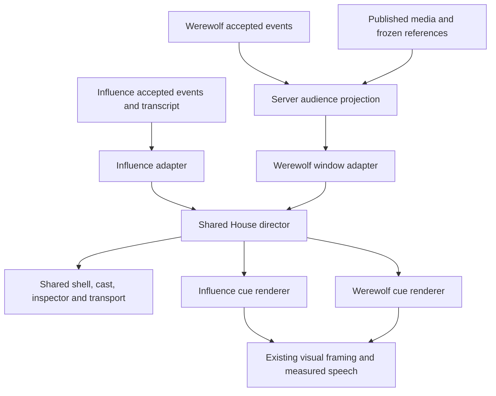

# Shared House watch player

Implemented in `/Users/user/.codex/worktrees/werewolf/influence-game`, branch `codex/werewolf`, from clean `8d1097bc`. This report covers uncommitted local changes. No deployment, migration, paid generation, live-model evaluation or user-game mutation is part of this slice. Browser fixtures own isolated databases and servers; the user's gateway/web processes are not used or stopped.

## What owns what

| Layer | Actual modules | Responsibility |
| --- | --- | --- |
| Shared House playback | `packages/web/src/components/watch/watch-director.ts`, `use-watch-director.ts`, `use-watch-keyboard.ts` | Extracted existing scheduler, clock/readiness, pause/speed/append/seek, keyboard command ownership. The RAF samples elapsed time; it never advances a cue. |
| Shared House interface | `watch-shell.tsx`, `watch-cast.tsx`, `watch-inspector.tsx`, `watch-transport.tsx`, `use-player-fullscreen.ts` in the same directory | Existing layout, cast/inspection scaffolding, original MCP banner and `/get-mcp` link, controls and fullscreen. |
| Influence adapter | `app/games/[slug]/components/influence-presentation-director.ts`, `dramatic-replay-viewer.tsx`, `match-watch-shell.tsx` | Influence timing, canonical/reveal snapshots, House bridges, format/classic/endgame interpretation and evidence. |
| Werewolf adapter | `app/werewolf/use-werewolf-watch.ts`, `werewolf-watch-model.ts`, `werewolf-watch-stage.tsx`, `werewolf-viewer.tsx` | Audience session, bounded fetch/cache, seek generation, scene/cycle coordinates, Werewolf results and shell composition. |
| Server projection | `packages/engine/src/werewolf/watch.ts`, `packages/api/src/services/werewolf-presentation.ts` | Canonical audience projection, frozen identity allowlist, publication/cast/media selection. |
| Browser contract | `packages/engine/src/werewolf/watch-contract.ts` | Dependency-free window types and playable-entry predicate. Server rules/provider modules must not enter the client bundle. |

The shared layer uses a generic cue plus explicit policy, rather than a combined game union or synthetic Influence state. Async game data loading stays in its adapter; the scheduler and UI are shared. This is the smallest extraction preserving the existing Influence lifecycle. The old `format-presentation-director.ts` implementation moved into shared scheduler plus Influence policy; the prototype Werewolf player/CSS and old fullscreen file were removed, with all imports updated.

## Behavior delivered

- One stable title region; no animated duplicate day/thread labels. The exact reported prototype label glitch was not reproduced before replacement, so this is a structural regression check, not a claimed before/after recording.
- Original player speech remains authoritative dialogue. Pass, unavailable and phase entries have source positions but no timed chat frame. Silent consumption crosses loaded window boundaries and stops before unknown data or the next playable contribution.
- Shared speech reveal/page/hide behavior, longer fallback bubble space, speed, scene/chapter controls, keyboard focus protection, fullscreen and hidden-tab pause.
- Manual seeks pause; Go Live follows. Same-context preparation retains the mounted stage. Audience remounts clear incompatible roles/thinking/cache/selection and restart paused. Publication cutoff survives audience switches.
- Frozen personality/backstory and active cast status use explicit public fields. Thinking stays opt-in and Omniscient-only, filtered to selected player and active source cursor. No private strategy or raw provider payload is published.
- Bounded HTTP watch windows, default 32/max 64 entries, compact scene index, minimal per-position snapshots and deduplicated media. Client retains at most three windows. Server work still scales with canonical event history; this is not a claim of constant-time projection.
- Existing public media selection, three-or-more source tiles, missing-character fallback, admin production and CLI paths are retained. No new image generation is triggered by watching.
- R5 repaired: Influence intelligence filters exact event/transcript boundaries before limits, alliance terms rebuild from the canonical prefix, and Diary follows the active transcript prefix. Rewind no longer uses later same-phase thoughts or final amended alliance terms. Existing no-cutoff full-game consumers retain their intended full-game reads.

## Verification evidence

| Check | Result / evidence |
| --- | --- |
| Provider-free baseline | `bun run test`: 2,158 passed, 5 pre-existing skips, zero failed; `/tmp/shared-watch-final-tests-2.log`. |
| Added silent-window and readiness tests | Three tests passed; `/tmp/shared-watch-tail-tests.log`. These fixtures also run in the final baseline. |
| Full isolated PostgreSQL baseline | `bun run test:postgres` through the isolated database wrapper: 1,814 passed; `/tmp/shared-watch-postgres.log`. |
| Latest focused PostgreSQL | 20 passed for Werewolf watch reads plus Influence thinking/alliance boundary regressions; `/tmp/shared-watch-pg-focused-2.log`. |
| Typecheck/lint | `bun run check` passed without warnings; `/tmp/shared-watch-final-check-3.log`. |
| Werewolf development browser | Five journeys passed: original editor/create flow, both audiences, failed pack negotiations, admin/production/published multi-panel imagery, failed portraits/reduced motion; `/tmp/shared-watch-browser-3.log`. |
| Influence browser | Six initial passes plus three corrected reruns: classic replay, Two Names reconnect/pause, cast reveals/rewind, Safety Bounce, portrait/fullscreen/rotation, desktop/mobile ending; `/tmp/shared-watch-influence-browser.log`, `/tmp/shared-watch-influence-browser-retry.log`. |
| Production-build browser | Six journeys passed, 90 assertions, including delayed seeks, live startup, paused polling, three silent windows, production/admin imagery and responsive controls; `/tmp/shared-watch-production-browser-final.log`. The delay fixture now intercepts only the API, not Next.js prefetches. No admin runtime change was needed. |

Influence's three first-run browser failures were test assumptions about focused-button shortcuts and the speed label. Tests now explicitly focus the player for global shortcuts, and Safety Bounce verifies that a focused speed button retains its arrow key. No accepted choreography assertions were removed.

The first Werewolf browser attempt found an actual browser-bundle issue: importing the server projector from the client pulled in rules/provider modules. The separate browser contract fixes that. Another run corrected a hidden-mobile-button selector and an audience-reset wait in the harness. Production playback measures 14 bounded watch reads across the complete seek/audience/fullscreen/mobile journey (development observed 17–18); this is not a measured improvement against an instrumented prototype baseline. Warm playback uses buffered data. Stage identity and single-title assertions cover navigation continuity.

Local screenshots: `/tmp/shared-watch-desktop.png`, `/tmp/shared-watch-mobile.png`, `/tmp/werewolf-replay-published-panel.png`, `/tmp/werewolf-pack-ballots-mobile.png`. Reviewed desktop/mobile composition and the published-panel path. The suite exercises generated fixture imagery, not the user's production artwork. No video comparison against the discarded prototype or universal latency claim is made.

## Deferred work and proof limits

A4-MCP (frozen external inspection contract), A4-EVIDENCE (evolving strategy capture), the production studio and expressive performance cues remain in the pillar roadmap. The banner is reused verbatim, without interim capability warnings. The internal HTTP watch-window DTO is not a new external MCP contract.

Deterministic checks establish local behavior, not provider dialogue quality or deployment readiness. Existing engine/API suites cover faction outcomes and sealed-information release; not every role combination has a separate photographed browser journey. Historical uncaptured thinking is not fabricated. The missing baseline video/request-byte comparison remains an evidence limit rather than invented proof. Readiness/stale-callback behavior has deterministic clock coverage; an explicitly delayed Omniscient image completing after a Mystery switch was not separately filmed.

The additional production regression covers rapid delayed seeks, a paused silent frontier receiving new data, and continuous playback across three windows of passes. It exposed and fixed old speech reappearing after a silent seek. Fresh live joins still prepare their first committed contribution paused. A follow-up test distinguishes a real fixture problem (intercepted CORS preflight) from playback behavior. Temporary runtime diagnostics were removed.

Final closeout: `git diff --check` and documentation relative-link checks passed. Harness-generated `next-env.d.ts` and `tsconfig.json` edits were removed. Test harness cleanup completed. HEAD remains `8d1097bc`; implementation changes are uncommitted on `codex/werewolf`.

## Playback feedback follow-up

This follow-up supersedes the earlier in-player audience switching and separate chapter controls:

- Werewolf entry offers Mystery and Omniscient before mounting playback. Direct audience links also work. The selected mode stays fixed for that session; thinking remains an in-place Omniscient toggle.
- Previous/Next and brackets navigate game-owned conversation groups. Player settings beside fullscreen contain readable shortcut help and thinking order. The menu uses the existing Floating UI dependency, escapes clipped containers, and mounts inside native fullscreen when needed.
- Manual dismissals use animation elapsed time for opacity and frozen reading time for the current text page. Cached image readiness cannot overwrite a settled cue. Browser coverage now steps through four consecutive published-image introductions and four opening/reply/answer contributions.
- The published Werewolf stage now supplies the flex container required by the shared visual renderer. Tests assert a real image viewport, not just a loaded image and a bubble somewhere in the DOM.
- Captured thinking uses an optional segment on the shared playback clock. The image settles before thinking-first holds speech; speech-first can be visited with manual advancement. Missing captures release the clock, stale cue responses are ignored, and thinking occupies its own space in the canvas so it cannot obscure spoken text. Ordering changes retain the source contribution. Inspector evidence remains available.

Current follow-up verification: `bun run test` passed 2,162 tests with five skips (`/tmp/watch-v2-final-unit.log`); isolated `bun run test:postgres` passed 1,815 (`/tmp/watch-v2-postgres.log`). The final clock checks passed 37 tests after adding the image-settle boundary (`/tmp/watch-v2-director-final-2.log`). Typecheck/lint passed (`/tmp/watch-v2-check-final-2.log`). Influence's six passing stories plus corrected fullscreen retry cover seven distinct journeys (`/tmp/watch-v2-influence-final.log`, `/tmp/watch-v2-influence-retry.log`). The retry narrows an old `/Play/` selector that also matched the new “Player settings” button; it does not relax playback assertions.

The Werewolf thinking overlay browser fixture supplies exact per-contribution captured text without model calls; real journal eligibility and Mystery exclusion remain covered by the PostgreSQL suite. No paid game was run.

Final visual follow-up: thought-first settles the image before showing the full thought, then stays anchored above speech through its shared exit. Speech-first reads/dismisses the line before the full thought. The shared scene bubble keeps a readable 128 px minimum when the viewport permits, preventing character-by-character pagination on short stages. The production browser explicitly checks the entire short contribution.

Final provider-free run: 2,164 passed, five skipped (`/tmp/watch-v2-unit-complete.log`). Final clock/layout checks: 49 passed (`/tmp/watch-v2-layout-unit-final.log`). Final Werewolf production browser: six passed, 99 assertions (`/tmp/watch-v2-production-readable.log`), covering entry modes, consecutive contributions, visible published image dimensions, both thinking orders, native fullscreen settings, small screens, reduced motion, failed portraits, racing seeks and silent windows. Influence order/fullscreen rerun: two passed (`/tmp/watch-v2-influence-orders-final.log`), alongside the other five passing Influence regression journeys above.

Screenshots reviewed: `/tmp/influence-speech-first-thinking.png`, `/tmp/werewolf-speech-first-thinking.png`, `/tmp/werewolf-thinking-settings.png`, `/tmp/werewolf-replay-published-panel.png`. These use fixture images and captured-text fixtures. Published-scene speech uses the real renderer; the tests make no provider calls.

Viewport-fallback fullscreen settings also passed after mounting the floating menu within the active player (`/tmp/watch-v2-fullscreen-settings-final.log`). The test verifies that shortcut help remains reachable inside fallback fullscreen before continuing rotation, playback and exit. Harness-generated Next.js type paths were restored after browser cleanup.

Final clean typecheck/lint passed after restoring generated paths (`/tmp/watch-v2-final-check-clean.log`); `git diff --check` passed. Changes remain uncommitted in the Werewolf worktree.

## Shared composition follow-up

- Removed the outer thinking lane. Exact captured thoughts now use an in-scene bubble with secondary text and three descending circles; solo and published-scene renderers share the geometry. Narrow portrait scenes place the headshot beside thinking above speech. Short stages reduce padding and text size.
- Replaced Werewolf's bespoke centered portrait/bottom-caption fallback with `SoloPresentation`, preserving published room imagery when available and Omniscient role labels.
- Werewolf day checkpoints expand accepted ballots into stable presentation subcues, then their result. `VotePresentation` handles the same portrait-to-ledger collection as Influence. Target receipts come first, unavailable receipts remain distinct, and silent Hear more receipts come last. No new authored speech is invented.
- Single-step rewind traverses individual ballot subcues; source seeking still addresses canonical checkpoints. The cast delays that checkpoint's elimination display until its result cue.
- Verified provider-free regression suite (2,169 passed), complete Werewolf browser suite, added real ballot/abstention/rewind browser journey, and Influence thinking/fullscreen/live-portrait journeys. Screenshots are local evidence under `/tmp/werewolf-*-thinking.png`, `/tmp/werewolf-hear-more-ledger.png`, and `/tmp/influence-speech-first-thinking.png`. No provider calls or user database changes were needed.

Final follow-up checks: API baseline **1,815 passed** in a disposable database; final web suite **888 passed**; TypeScript/lint and `git diff --check` passed. Added mobile Influence thought/portrait separation journey passed after the responsive refinement. Next-generated test configuration drift was removed.

Thought persistence follow-up: removed the 1.3-second overlap cutoff. Thinking-first now shares speech exit boundaries and fade opacity. Thought placement and portrait framing no longer depend on the first speech measurement. The browser asserts identical thought bounds before/after speech appears, then checks both disappear on dismissal; 43 focused clock/layout regressions passed.

## Content-fitted bubble follow-up

Speech and thoughts now share measured typography: bounded larger type, fixed padding, and a height determined by the tallest page of the complete message. Very short replies can narrow. Measurement runs before speech visibility changes and never depends on elapsed time or the visible page. Removed the obsolete natural-height callback path from the three conversation renderers.

On tightly constrained screens, the page counter moves into reserved header space so it cannot consume the remaining text area.

Validation: 2,174 provider-free tests passed before the final short-reply width and compact-counter refinements; all five focused fitting tests passed afterward. The final typecheck and lint checks passed. Three Influence browser journeys passed, including exact frame equality between pages, thinking/speech anchoring, and mobile/fullscreen behavior. All six Werewolf production browser journeys passed. Screenshots: `/tmp/influence-thought-and-speech.png`, `/tmp/bubble-fit-page-1.png`, `/tmp/bubble-fit-page-2.png`, `/tmp/werewolf-mobile-thinking.png`.
