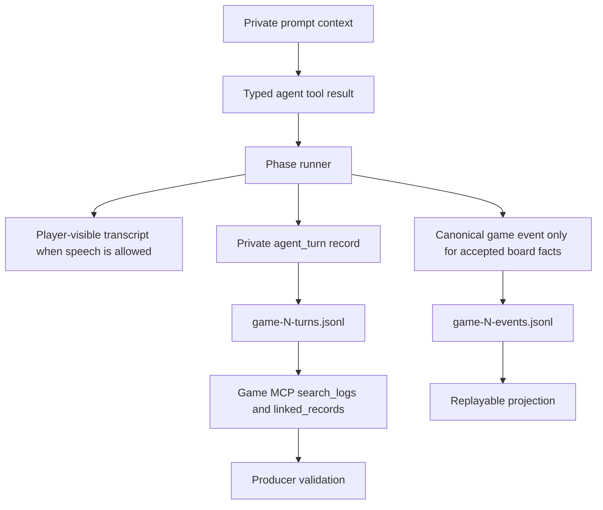

# Agent Strategy Observability Spine

## Context

The Mingle hardening work started from a model-quality problem, not a missing enum: agents were entering Mingle with lobby-shaped behavior, treating private rooms as polite vibe checks, often collapsing to the same room choice, and overusing repeated "script / performance / authenticity" language. The first fix was not to demand that every agent name a target. The useful direction was to make real strategy available, varied, inspectable, and private.

Several related issues compounded into the same pattern:

- Mingle needed current product vocabulary rather than legacy Whisper wording, because stale phase terms confused both prompts and frontend expectations.
- Room choice by agent-selected room number was fake-strategic. Agents could express seek/avoid intent, but they could not know everyone else's intent, so most choices collapsed to neutral room IDs.
- Pair-cooldown reshuffling looked like a helpful allocator optimization but secretly moved players after their choices. It made the game less legible and undermined player-authored movement.
- Strategic reflection initially updated memory but was not emitted as a searchable simulation artifact, so we could not validate whether Mingle changed later strategy.
- Strategy Thread packets gave agents multi-round continuity, but needed to remain live-agent producer/debug state rather than pretending to solve crash-safe persistence.
- Hard-coded rumor examples poisoned style. They helped parse the task, but also amplified repeated "rehearsed/script/performance" language.
- The later presentation-read attractor needed a structured counterweight: a `strategicLens` field that lets models choose concrete evidence frames such as vote math, room traffic, coalition geometry, promise debt, or information control.

Session history reinforced the pattern: canonical board facts, player-visible transcripts, and private decision artifacts must remain separate. The game MCP and simulation artifacts are the validation surface; public transcript prose alone is too subjective for evaluating agent strategy. (session history)

## Guidance

Treat agent-strategy improvements as a spine that runs through prompt, type contract, phase runner, artifact, MCP search, tests, and docs. Do not treat them as prompt copy alone.

The durable architecture is:



Use this split consistently:

- **Player-visible transcript** is what other players or viewers can see as game speech.
- **Private `agent_turn` records** are producer/debug evidence: hidden intent, reasoning metadata, strategy packets, strategic lenses, room assignment diagnostics, decision logs, and movement purpose.
- **Canonical game events** are accepted board facts: votes, eliminations, powers, rounds, endgame transitions. They rebuild state and can point back to private source records, but they do not store hidden strategy as game truth.
- **Completed-game results review** is a public-by-URL postgame product projection. It should roll up canonical events into per-round revealed facts, elimination order, vote matrices, endgame votes, jury votes, and placements. Agent context can provide snippets from active public-facing cognitive artifacts, but those snippets explain texture only; they do not decide who voted for whom, who was eliminated, or who won.

When a model-quality complaint appears, convert it into typed observable state instead of an untestable prompt vibe.

Examples:

- "Agents are not using Mingle strategically" became hidden Mingle intent, strategy signals, movement purpose, and strategic reflection records.
- "Agents forget what they were doing next round" became Strategy Thread packets plus private `decisionLog` receipts.
- "Agents keep using authenticity/performance language" became `strategicLens` on Mingle intent, rumor, strategic reflection, and Strategy Thread packets, with presentation reads allowed but explicitly not privileged.
- "All agents pick Room 1" became House-assigned rooms from all hidden intents, plus deterministic repair diagnostics.

Keep the agent on a strategy spectrum. A good system permits:

- soft reads and guarded probes
- explicit asks and information trades
- named provisional targets
- alliance repair
- silence or deferral when that fits persona/context
- pivots when new evidence contradicts prior plans

Avoid making "concrete strategic act" a hard gate. If target naming is required, agents learn to satisfy the prompt rather than play the social game. Standing targets should be a posture, not a quota: a target can be a quiet watch target, Mingle probe, expose candidate, or no target yet with a concrete evidence gap.

## Core Implementation Pattern

### 1. Put strategy in typed private returns

Private strategy should appear in typed contracts that phase runners can log and tests can assert. The current shared types make strategy metadata explicit without injecting it into game-state mutation:

```ts
export interface MingleIntentAction extends MingleIntentSummaryBase {
  thinking?: string;
  reasoningContext?: string;
  decisionLog?: string | null;
}

export interface StrategicReflectionAction {
  certainties: string[];
  suspicions: string[];
  allies: string[];
  threats: string[];
  plan: string;
  strategicLens: StrategicLens;
  strategicLensRationale: string;
  thinking?: string;
  reasoningContext?: string;
  strategyPacket?: StrategyPacketSummary | null;
}
```

The key is that these are return values and `agent_turn` payloads, not player speech and not canonical facts.

### 2. Use structured prompt fields to widen behavior

The strategic lens field is deliberately a typed enum, not a prose hint buried in the prompt:

```ts
const STRATEGIC_LENSES: readonly StrategicLens[] = [
  "vote_math",
  "room_traffic",
  "promise_debt",
  "power_position",
  "private_inconsistency",
  "coalition_geometry",
  "information_control",
  "jury_threat",
  "loyalty_stress",
  "retaliation_risk",
  "social_cover",
  "timing_pattern",
  "presentation_read",
  "relationship_repair",
  "broad_read",
];
```

This gives the model a menu of evidence frames. It also gives reviewers a searchable distribution after a run, so "the attractor is still alive" can be measured instead of guessed.

### 3. Let the House solve global room allocation

Agents can form intent, but they cannot assign rooms intelligently from only their own private view. That is a global optimization problem. The House sees all hidden Mingle intents and proposes initial room assignments:

```ts
const prompt = `Assign initial Mingle rooms for Round ${context.round}.

Rooms available: ${roomList}
Alive players and hidden Mingle intents:
${playerLines}

Your job:
- Form interesting, strategic, roughly balanced rooms from seek/avoid/preferred-size/purpose signals.
- Prefer rooms that create useful conversations: tests, coalition repair, pressure checks, information trades, and unresolved tensions.
- Do not hide everyone in Room 1. Room numbers are neutral containers; assign people based on the full set of intents.
- Assign every listed player exactly once.
- Use only the exact player IDs above and room IDs from the available room list.`;
```

The House output is advisory. The engine validates and repairs it deterministically:

- invalid rooms are rejected
- duplicate players keep the first valid placement
- missing players are filled by affinity, preferred size, empty-room coverage, and balance
- repairs are logged in assignment diagnostics

This makes the allocator legible and testable. It also avoids hidden pair-cooldown reshuffling. Later movement remains agent-authored through `gotoRoomId` and is recorded as movement.

One design caveat is still live: the current repair pass fills empty rooms when there are enough players. That was originally framed as coverage, but empty rooms may be useful as future movement space. Treat that as an open design choice, not settled doctrine.

### 4. Preserve multi-round intent as compact private context

Mingle intent is phase-local. Strategic reflection and Strategy Thread packets are the multi-round carry-forward path.

The prompt renders packet state as private context, not command text:

```ts
## Strategy Thread
This is your private carry-forward strategy context, not an order. You may follow it, test it, revise it, ignore it, or defer it when current evidence warrants.
- Objective: ...
- Target posture: ...
- Coalition posture: ...
- Next social probe: ...
- Strategic lens: ...
- Lens rationale: ...
- Uncertainty: ...
- Revise if: ...

Standing target discipline:
- A standing target is your current living default pressure/read target.
- Never treat an eliminated player as an active standing target.
- Do not force target naming.
```

The packet is deliberately live-agent state for v1. Do not describe it as crash-safe or restart-safe until persistence and hydration are designed and tested.

### 5. Make rumors inspectable without making them explain themselves publicly

Anonymous rumors are public speech, but the reason for the rumor can stay private:

```ts
logger.emitAgentTurn({
  phase: Phase.RUMOR,
  action: "rumor",
  visibility: "anonymous",
  response: {
    message: rumor.message,
    displayOrder: i + 1,
    strategicLens: rumor.strategicLens ?? null,
    strategicLensRationale: rumor.strategicLensRationale ?? null,
    ...strategicDecisionResponse(rumor),
  },
  thinking: rumor.thinking,
  reasoningContext: rumor.reasoningContext,
});
```

This avoids contaminating the public artifact with mechanical explanation while still letting a producer review whether rumors are driven by evidence frames or style repetition.

### 6. Validate through simulation artifacts and the game MCP

The expected validation loop is:

```bash
bun run simulate:local -- --variant mingle --chatty --strategic-reflections --game-timeout-sec 7200 --llm-timeout-sec 300

cd packages/engine
bun run mcp:game -- docs/simulations
```

Then inspect turn logs through MCP or JSONL for:

- `mingle-intent`
- `mingle-room-assignment`
- `mingle-turn`
- `rumor`
- `strategic-reflection`
- `strategy-packet`
- `strategicLens`
- `decisionLog`
- `gotoPlayerName`
- `gotoStatus`
- `empower-revote`

Use `game-N-events.jsonl` and projections for board state, and `game-N-turns.jsonl` for private decision quality. When a canonical event has source pointers, use `linked_records` to bridge from accepted outcome back to private decision evidence.

For postgame UI, prefer vote alignment visuals over formal alliance inference. Similar vote colors or grouped target columns can make blocs legible without asserting that an alliance exists. House alliance hypotheses remain producer analysis unless a later product slice deliberately designs confidence, evidence, and naming rules for them.

## Why This Matters

Agent-quality work can easily become prompt folklore. The spine above keeps it grounded:

- prompts tell models what kind of decision is available
- tool schemas force the decision into inspectable fields
- phase runners preserve only the right pieces in the right visibility surface
- simulation artifacts make behavior reviewable after long local model runs
- MCP search gives a stable query surface across current and past batches
- tests prevent hidden strategy fields from leaking into public transcript surfaces

This matters especially for social games because "better strategy" is not one scalar metric. A healthy game includes guarded social reads, explicit target pressure, loyalty repair, misinformation, vote math, relationship preservation, and occasional silence. Typed private metadata lets reviewers see that variety without flattening agent play into compliance.

## What Did Not Work

- Prompt-only changes were insufficient. They could give permission, but they could not prove behavior changed or give later agents continuity.
- Room-number choice by agents was fake strategy. The agent could know its own intent but not everyone else's intent, so the room ID itself had no real meaning.
- Pair-cooldown reshuffling was the wrong kind of clever. It moved players secretly to avoid repeated pairings, which damaged legibility and contradicted the user-visible social premise.
- Hard-coded rumor examples improved task comprehension but also created repeated language attractors. Abstract guidance is safer than quoted examples when style diversity matters.
- Requiring a concrete strategic act would have overfit the model to target-naming compliance. The better success test is a healthy mix of strategy signals. (session history)
- Treating strategic reflection as memory side effect only left no artifact to validate. It needed a producer/debug record.
- Treating the MCP as a per-run sidecar was too narrow. A corpus-level read-only MCP over past and current simulations supports comparative validation and avoids making the simulator own a server lifecycle. (session history)
- Dumping raw hidden reasoning into chat is not the right review pattern. Summarize, classify, count, and cite where private reasoning lives; do not confuse hidden producer/debug state with player-visible material. (session history)

## When to Apply

Use this pattern when:

- a model-behavior issue is visible in simulation but hard to score from public transcript alone
- a prompt improvement needs validation across many hidden decisions
- agents need continuity across phases or rounds
- the House or producer has global context that individual agents should not have
- private reasoning should be inspectable by maintainers without becoming player-visible
- local model evaluation needs searchable artifacts, not just chatty terminal logs

Do not use this pattern to:

- put hidden strategy into canonical board facts
- make every private thought public
- build a scoring dashboard before the artifacts are trustworthy
- promise crash-safe state from live-agent memory
- force every agent onto the same strategic style

## Examples

### Turning a complaint into a field

Complaint:

> Agents are all doing authenticity audits.

Weak fix:

```text
Do not talk about authenticity so much.
```

Durable fix:

- Add `strategicLens` to decision tools.
- Include concrete lens options.
- Prefer non-presentation lenses when evidence supports them.
- Emit the lens to private turn logs.
- Count lens distribution after a run.

### Turning continuity into evidence

The Strategy Thread is not just prompt memory. Later strategic actions need a compact private receipt:

```ts
export interface StrategicDecisionMetadata {
  decisionLog?: string | null;
}
```

That receipt lets a reviewer distinguish "the agent forgot" from "the agent pivoted because the room/vote evidence changed." Strategic reflection still owns Strategy Thread revision on the normal reflection cadence.

### Keeping public and private surfaces separate

Mingle intent can contain seek/avoid lists, provisional target, opening ask, strategic lens, thinking, and reasoning context. Other players should see none of that unless the agent chooses to speak it in-room.

Correct pattern:

- `mingle-intent` private `agent_turn`
- public/private room transcript only for delivered room speech
- canonical event only when game state changes

Incorrect pattern:

- storing intent in room metadata shown to players
- making canonical events out of hidden hypotheses
- writing raw reasoning into public transcript text

## Validation Checklist

Before considering a strategy-observability change done:

- Prompt tests assert the new private context appears where intended.
- Prompt tests also assert no hard target quota if strategy should remain a spectrum.
- Phase tests prove hidden strategy records are emitted as `agent_turn` records.
- Visibility tests prove hidden strategy does not leak into player-visible transcript or WebSocket public surfaces.
- MCP tests can search the new record names/fields.
- Simulation docs list the new artifacts and search terms.
- Local-model runbook includes concrete review questions.
- `bun run test` passes.
- `bun run check` passes or reports only known pre-existing warnings.

For the latest strategic-lens slice, focused engine tests, `bun run test`, and `bun run check` passed. `bun run check` still printed existing web lint warnings but exited 0.

## Related

- `CONCEPTS.md`
- `docs/reasoning-transcript-observability.md`
- `docs/local-model-evaluation.md`
- `docs/brainstorms/2026-06-12-mingle-intent-act-requirements.md`
- `docs/brainstorms/2026-06-12-strategy-thread-carry-forward-packet-requirements.md`
- `docs/plans/2026-06-12-001-feat-mingle-strategy-observability-plan.md`
- `docs/plans/2026-06-12-002-feat-strategy-thread-packet-plan.md`
- `docs/ideation/2026-06-12-mingle-prompt-unblocking-ideation.html`
- `docs/ideation/2026-06-12-multi-round-strategy-propagation-ideation.html`
- No related GitHub issues were found for the search `Mingle strategy observability strategic lens Strategy Thread packet`.
