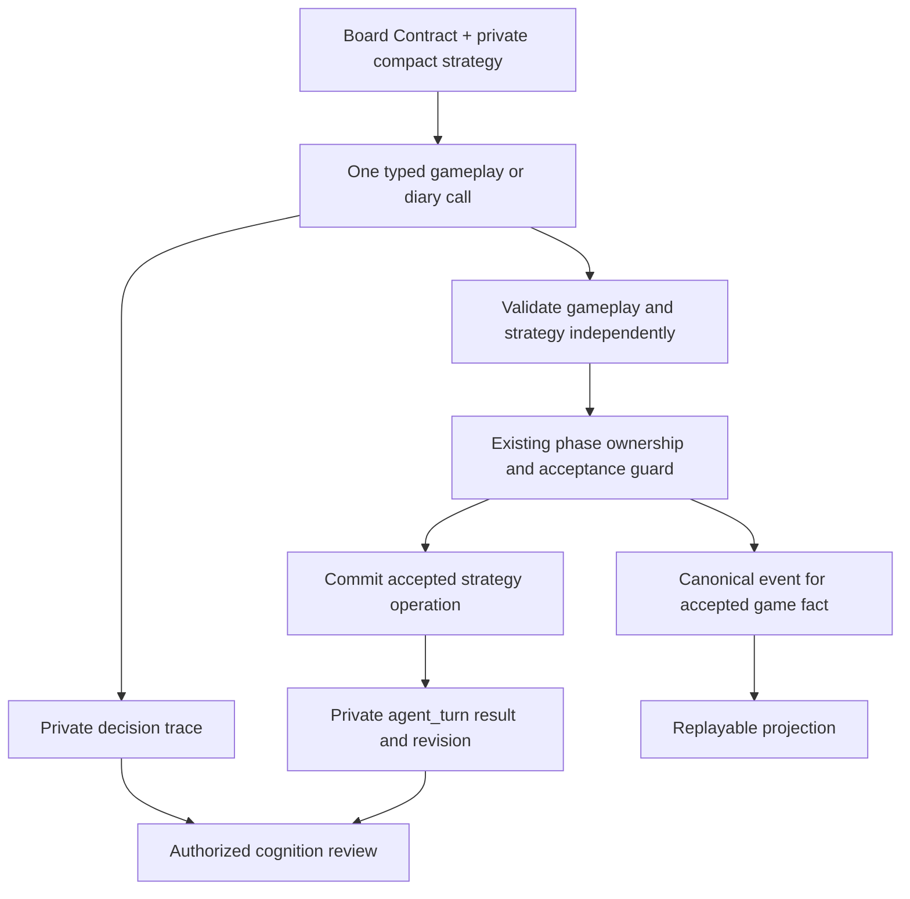

# Agent Strategy Observability Spine

## Context

Agent-quality work is not complete when prompt copy changes. Influence needs an end-to-end spine from the model's decision envelope through engine acceptance, private artifacts, deterministic replay, and human review.

The current strategy contract removes standalone reflection inference. Living-player calls the game already needs carry:

- their existing action or message fields
- concise private `thinking`
- nullable `strategyDelta` on ordinary strategic boundaries
- required full `strategy` on the first survivor diary answer after an eviction or on a later repair boundary

This reduces calls while keeping strategy inspectable. It also preserves the authority split: canonical events say what happened; compact strategy and rationale explain what the agent intended.

## Guidance

Use one consistent flow:


```mermaid
flowchart TB
  Prompt["Board Contract + private compact strategy"] --> Call["One typed gameplay or diary call"]
  Call --> Validate["Validate gameplay and strategy independently"]
  Validate --> Guard["Existing phase ownership and acceptance guard"]
  Guard --> Canonical["Canonical event for accepted game fact"]
  Guard --> Strategy["Commit accepted strategy operation"]
  Call --> Trace["Private decision trace"]
  Strategy --> Turn["Private agent_turn result and revision"]
  Canonical --> Replay["Replayable projection"]
  Trace --> Review["Authorized cognition review"]
  Turn --> Review
```

Keep the surfaces separate:

- **Canonical events** are the sole authority for votes, formats, alliances, eliminations, phase changes, and results.
- **Public or room transcript** contains only delivered speech and authorized viewer-safe `thinking` projections.
- **Private decision traces** retain prompt/response evidence, model provenance, usage, emitted thinking, and the submitted strategy candidate.
- **Private `agent_turn` records** retain the game-used action plus accepted/rejected/no-change strategy result and resulting engine revision.
- **Compact strategy state** is fallible private cognition. It never becomes a target, commitment, or living-player fact merely because prose names one.

The new fields inherit the same authorization scope as strategic `thinking` on that surface. They do not create a new privacy policy or new class of principals.

## Compact Strategy Lifecycle

The engine owns one bounded state per living player:

```ts
interface CompactStrategyState {
  lifecycle: "opening" | "active" | "reconciliation_required" | "repair_required";
  baseline: string | null;
  deltas: string[];
  priorEpoch: CompactStrategyPriorEpoch | null;
  revision: number;
}
```

- `opening` derives posture from authored personality/strategy plus current evidence; accepted deltas may refine it.
- `active` contains one concise baseline and ordered accepted deltas.
- canonical eviction moves living survivors to `reconciliation_required` and preserves the immediately prior valid epoch as historical evidence.
- a valid first survivor diary `strategy` replaces the old epoch and returns to `active` with no deltas.
- an optional House follow-up may append the shared `strategyDelta`; if replacement failed, the same follow-up is a full-strategy repair boundary.
- if the optional follow-up does not happen or repair fails, the next eligible paid action requests full `strategy` while still allowing its legal gameplay/message result to proceed.

Strategy validation is mechanical only: boundary, type, whitespace, per-value size, delta count, and aggregate size. Do not score the prose or reject it for naming a dead player. Current Board Contract remains the override.

## Commit After Acceptance

Never mutate durable strategy inside `InfluenceAgent` before phase ownership and mechanic checks succeed.

The call returns a candidate. The phase runner:

1. parses and validates the gameplay action independently;
2. applies the existing ownership/commit guard;
3. commits the canonical mechanic when accepted;
4. applies the strategy candidate with the boundary appropriate to the current lifecycle;
5. records the result on the existing private turn.

A missing, malformed, oversized, or wrong-boundary strategy field cannot cause a provider retry or reject a legal action. A fallback, stale return, timeout, illegal mechanic proposal, or rejected action cannot mutate strategy.

## Engine-Owned Opaque Identity

When a phase already knows the proposal, version, alliance, candidate set, or other canonical record the agent may act on, do not ask the model to transcribe its UUID.

- pass one exact opportunity into the agent adapter;
- expose only legal actions for that opportunity;
- bind the response to the current canonical identity after the provider call;
- generate new version IDs in the engine;
- use short request-local handles such as `A1` only when the model must choose among several authorized records;
- map handles back inside the adapter and keep a phase legality check for defense in depth.

Named-alliance responses use this pattern. Proposal lineage/version UUIDs never appear in provider output. Amendment handles are member-scoped and request-local.

## Diary Reconciliation

Diary follow-ups are optional. The first post-eviction answer and any follow-up are real dialogue calls, not a hidden reflection cadence.

- The first visible answer remains valid even when its required full strategy is unusable.
- Context is rebuilt after every answer so an accepted replacement or delta is visible to the next optional question.
- House question generation receives the session Q&A and authorized game evidence, not the player's private compact strategy.
- Closing the diary makes no extra summarization or reflection call.
- Eliminated jurors do not enter survivor reconciliation or repair.

## Recall and Recovery

Recall Plan has two prompt classes: `ordinary_speech` and `strategic_decision`.

- Protected lane: Current Board Contract, compact strategy, authorized compact huddle outcomes, and required current receipts.
- Hot lane: active-room Mingle speech for that turn.
- History lane: bounded public plus actor-owned Mingle evidence for `strategic_decision` only.

Player continuity capsule v2 restores compact lifecycle, baseline, deltas, prior reconciliation epoch when required, engine revision, and the remaining private continuity fields. Older capsule versions fail closed. Never reconstruct private strategy from events, transcripts, traces, or `MemoryStore`.

## Observability and Review

Use `game-N-events.jsonl` for accepted facts and `game-N-turns.jsonl` / private traces for decision quality. Useful private search fields include:

- `thinking` and `reasoningContext`
- `strategyCandidate`
- `strategyResult`
- `strategy`, `strategyDelta`, and resulting revision
- alliance `requestedAction`, `result`, and `repairNotes`
- movement and coordination receipts

The accepted deterministic strategy scenario is `packages/engine/src/__tests__/fixtures/prompt-scenarios/sage-round-2.ts`. It freezes the human-accepted twelve-player `gpt-5.6-luna` chain through prior elimination, Lyra's Round 2 eviction, Sage's full diary replacement, optional refinement, immediate Round 3 lobby, and nine-choice empower vote. The fake-provider runner proves contract behavior without additional spend.

Run:

```bash
bun test packages/engine/src/__tests__/prompt-scenario-lab.test.ts
bun test packages/engine/src/__tests__/strategy-state.test.ts
bun test packages/engine/src/__tests__/diary-room-strategy.test.ts
bun run check
```

## What Did Not Work

- Standalone reflection calls repaid large prompt context to generate cognition that can ride retained calls.
- Field-heavy packets encouraged filler and made strategy updates unnecessarily expensive.
- A second `decisionLog` rationale duplicated `thinking` and created another carry-forward lane.
- Whole-response retry on invalid strategy metadata risked buying another call for an otherwise legal action.
- Asking models to copy alliance proposal/version UUIDs caused stale and malformed action rejection despite clear strategic intent.
- Reusing one DiaryRoom context across follow-ups hid newly accepted strategy from the next answer.
- Treating a weak, strategically forced fixture as quality evidence produced vacuous equal-choice assertions.

## Validation Checklist

- Ordinary living-player schemas keep mechanic fields plus `thinking` and nullable `strategyDelta`.
- First post-eviction and repair schemas request full `strategy` without a fixed sentence count.
- Legal gameplay survives an unusable strategy operation without retry.
- Illegal/fallback/stale gameplay does not mutate compact strategy.
- The first diary replacement and optional follow-up delta appear in the next eligible prompt.
- Living-target and action legality come from typed board state, not strategy prose.
- Private traces show the proposal; private turns show final strategy result and revision.
- Canonical/public/WebSocket surfaces do not gain compact strategy or diagnostics.
- Capsule v2 round-trips every lifecycle and rejects obsolete versions.
- The human-accepted Sage Round 2 fixture passes provider-free chain tests.
- `bun run test` and `bun run check` pass.

## Related

- `CONCEPTS.md`
- `docs/reasoning-transcript-observability.md`
- `docs/local-model-evaluation.md`
- `docs/brainstorms/2026-06-17-thin-strategic-decision-fields-requirements.md`
