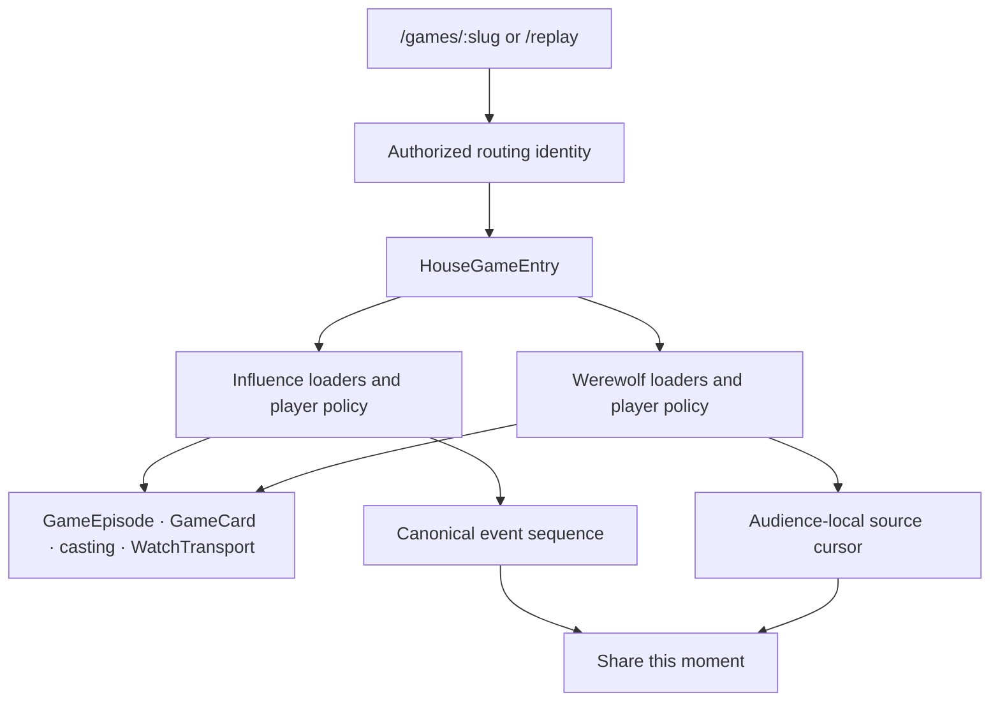

# House entry and replay moments

Two game engines need one product entry without pretending their gameplay data is interchangeable. A Werewolf role, audience cursor and faction outcome are not Influence persona, event sequence or jury results.

## Implemented boundary

`GET /api/game-entries/:idOrSlug` returns `{ id, slug, gameKind, visibility }`. It is a private/no-store read. Public and Unlisted work signed out; hidden/missing or unsupported stored visibility returns 404 with an operator diagnostic for invalid data. W7 removed Private and the account-dependent entry retry. Both games use the same discovery/direct-link policy; audience, publication and evidence permissions remain separate.

Resolve identity before metadata, detail or game-specific presentation. Never probe an Influence endpoint and interpret 409, 404 or a network failure as Werewolf. Successful anonymous SSR identity seeds the client immediately. An anonymous SSR failure may be retried by the client without waiting for authentication; game visibility does not depend on account state. Detail/watch/media still enforce their own access because callers can bypass entry entirely.

`GameEpisode`, `GameCard`, `CastingRoster`, `CastCard`, `CastInvitation`, `CastPortraitDialog` and `GameSiteEntry` own presentational structure. Concrete modules own fetching, permissions, lifecycle and actions. Influence retains episode preview/trailer loading and hover activation. Werewolf uses safe casting data and House artwork without loading roles or pack imagery on entry. The public Werewolf module now lives in `components/games/werewolf/`; `/werewolf/:slug` has no compatibility route. Internal API/admin paths remain game-specific.

A single `join_game` agent-creation flow resolves identity before joining through the corresponding API. Preserve draft recovery and both games' separate strategy fields. Do not infer a game from a URL prefix or reuse Influence strategy for Werewolf.

## Replay links

- Influence: `/games/:slug/replay/:sequence`, using the active cue's canonical event sequence.
- Werewolf: `/games/:slug/replay?audience=mystery|omniscient&cursor=N`, using the active source entry's audience-local cursor.
- Never put a cue-array index, pagination page or elapsed animation time into the link. Werewolf requires an explicit valid audience with a cursor; repeated/invalid parameters are rejected. A cursor in one audience cannot be reused for the other.
- The common transport offers **Share this moment** in settings. It reuses native sharing/clipboard feedback and does not seek or pause. Moments with no stable source anchor have no share action.
- Resolve the initial position before loading/autoplaying the director. Werewolf starts in the target 32-entry window, preserving saved thinking/order and audience restrictions. Later fetches must not overwrite a seek or unpause a paused viewer.
- Influence retains its existing sequence resolver: exact first cue, otherwise next available cue, otherwise last cue. This is deliberately distinct from Werewolf's rejected out-of-range initial cursor. Tightening historical Influence clamping is a follow-up, not an invented cross-game equivalence.
- Links load currently permitted published media, not an immutable historical image version. A link grants no authorization.

## Adding a third game

1. Add its explicit database/identity kind and apply Public/Unlisted visibility in both routing and direct transports. Do not assume entry authorization protects media.
2. Implement concrete entry/casting/watch modules. Supply presentation props to the existing House components; add game-specific rules and metadata content only where needed.
3. Define one stable replay source coordinate and any audience boundary. Add typed link generation, strict parameter parsing and initial-position loading. Reuse the shared share action.
4. Keep canonical facts, participant identity and accepted decisions in that game's projections. Never parse dialogue into routing, outcomes or replay coordinates.
5. Test anonymous entry, hidden/invalid-visibility denial, create-and-join recovery, audience restrictions, completed/live playback and share roundtrips with actual browser assertions. Add results/editorial/MCP modules through the same House routes when they exist.

## Verification lessons

Use Bun provider-free tests for parsers/components/recovery; PostgreSQL tests for access; isolated Puppeteer tests for real Werewolf API journeys; deterministic Playwright fixtures for Influence playback. Review screenshots in addition to DOM assertions. Real auth, provider/image generation, staging and external writes remain separate opt-ins.

Do not run the two browser harnesses concurrently in one checkout: both currently use `.next/e2e` and contend for Next's dev lock. They also rewrite generated Next type includes; restore those generated-only edits after shutdown before running the repository check. Existing shared `influence_test` can have migration-ledger drift when different worktrees use different experimental migrations. Run the baseline against a fresh isolated database instead of replaying or rewriting the operator's development DB. Always pass `database.databaseUrl` to `destroyIsolatedTestDb`, and clean only your own isolated database.

See [implementation evidence and remaining boundaries](../../reviews/2026-10-02-house-game-entry-implementation.md).

### CI regression checks after shared-player changes

- Browser fixtures that invent a game must also stub `/api/game-entries/:slug`. Mocking only the game detail endpoint now leaves the House router at “Game not found”; do not bypass identity resolution in production to make a fixture work.
- Exercise current accessible transport controls: `Next scene`, `Play replay`, `Pause replay`, and `Player settings` → `Restart replay`. Old removed-button locators can consume the browser lane's entire timeout without testing playback.
- Ballot keyboard steps now visit one readable vote at a time, then a complete ledger. Do not retain the old reveal/hide double-step; ties proceed to the nominee selection presentation. Await shell status updates after the player publishes a new canonical frame.
- Browser contexts with async route handlers must wait for `unrouteAll({ behavior: "wait" })` before closing. Otherwise navigation can leave a mocked request in flight and fail the next test during teardown.
- React DOM tests must await the rendered async outcome, then flush unmount with async `act` before removing browser globals. Counting a fetch call alone can finish before queued React work reads `window`.
- Mystery mode intentionally omits unknown-role labels. Assert their absence rather than waiting for the removed copy. Wait for enabled form inputs before typing and responsive layout before measuring overflow; browser timing and native select widths differ on Linux. Keep selects constrained to their container.
- `INFLUENCE_E2E_RESULTS_DIR` takes precedence over story-specific local log paths, so CI can upload all API/web service logs when a story fails.
- For editorial cursor assertions, read bounded replay windows once rather than rebuilding the complete history for every evidence row. Keep slower full-match simulations on an explicit bounded timeout rather than increasing the entire suite's timeout.

## Creation options follow active behavior

On 2026-10-02 the creation-time `viewerMode` and `timingPreset` options were removed, along with unused phase timers and the unconnected server event pacer. Trace a setting to its runtime consumer before copying it into another game. The House player already owns playback preferences; game configuration retains actual game-length limits. Visibility and visual-failure policy are shared product contracts, but parity requires authorization and durable runtime behavior as well as identical form controls. Track those remaining contracts in W7 of the integration roadmap.

### Visibility integration (W7)

Use `game-visibility.ts` for the House two-value contract. Public discovery must filter in SQL before limits or counts. Direct readers allow both supported values; use `isViewerGame` after resolving ID/slug. Owner/admin histories are separate query intents: do not accidentally apply public discovery filtering to scoped exports. The entry identity carries visibility for route-level noindex metadata; it does not replace independent data/media/stream checks. A third game should adopt those shared boundaries and retain its concrete audience projection.

Live Influence delivery rechecks visibility at delivery, including catch-up, and closes unavailable streams. The player clears on that closure. Werewolf's existing HTTP refresh/seek error handling clears buffered media on 404. Ordinary image URLs remain appropriate because Unlisted does not require authentication. No private-game ACL schema, migration or plugin registry is needed.
